# 提示词

<span style="color:#CC0000;">帮我分析下这个视频中讲了什么，针对这个视频中的内容给我补充扩展下，并且针对这个视频中的内容给我准备些经典且能够让人有深刻见解的问题并且附上简洁的回复，我要准备嵌入式面试。</span>


---

---

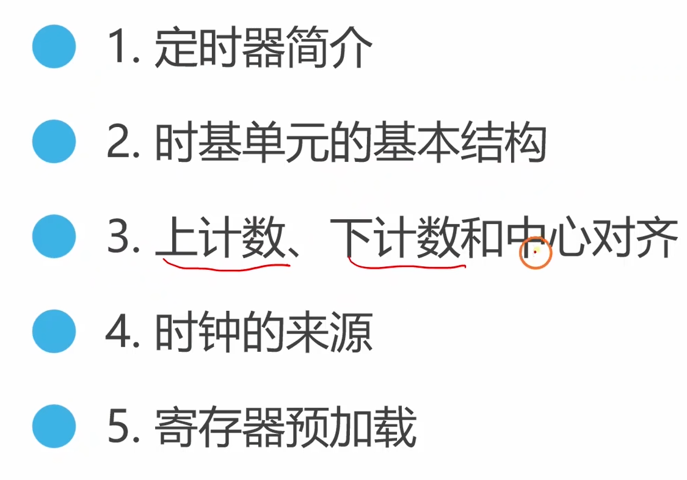


好的，这个视频是<span style="color:#CC0000;">“铁头山羊STM32教程”系列中关于定时器的第一节</span>，专门讲解了时基单元 (Time-Base Unit)。这是理解和使用STM32定时器的最核心、最基础的部分。
我将为你进行分析总结、知识扩展，并提供针对性的面试问题与解析。


# 视频内容分析总结

这个视频深入浅出地讲解了<span style="color:#CC0000;">STM32定时器中负责产生周期性定时事件</span>的“<span style="color:#CC0000;">时基单元</span>”的工作原理。可以将它理解为<span style="color:#CC0000;">定时器的“心脏”</span>。
核心内容可以概括为以下几点：

### 1. 定时器简介 (Timer Introduction):
视频首先指出，定时器是STM32中非常重要和功能强大的外设，如同单片机的心脏（<span style="color:#CC0000;">补充：这里只是说明定时器很重要，但定时器不是单片机的心脏，单片机的心脏应该是晶振，晶振负责产生心跳，心跳是时钟</span>），负责<span style="color:#CC0000;">提供精准的时间基准。</span>

展示了STM32芯片结构框图，标明了其内部包含多个定时器（如高级定时器TIM1，通用定时器TIM2/TIM3/TIM4等），它们挂载在不同的APB总线上。

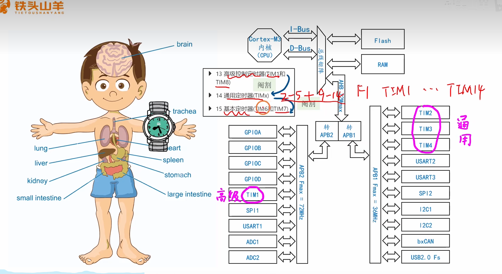


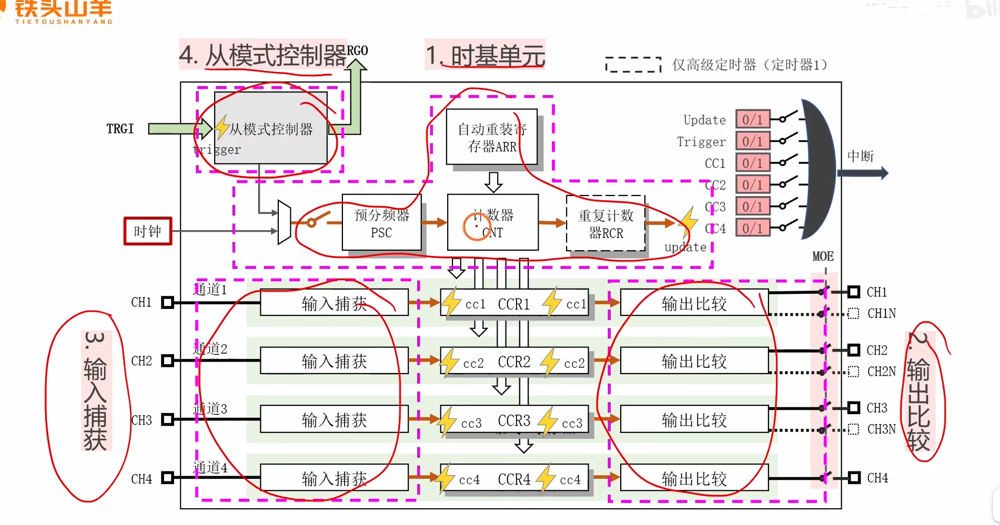

<span style="color:#CC0000; font-size:1.2em;">补充：定时器内部的结构可以分为上图中的5个部分，本节先介绍时基单元。</span>


### 2. 时基单元基本结构 (Basic Structure of the Time-Base Unit):

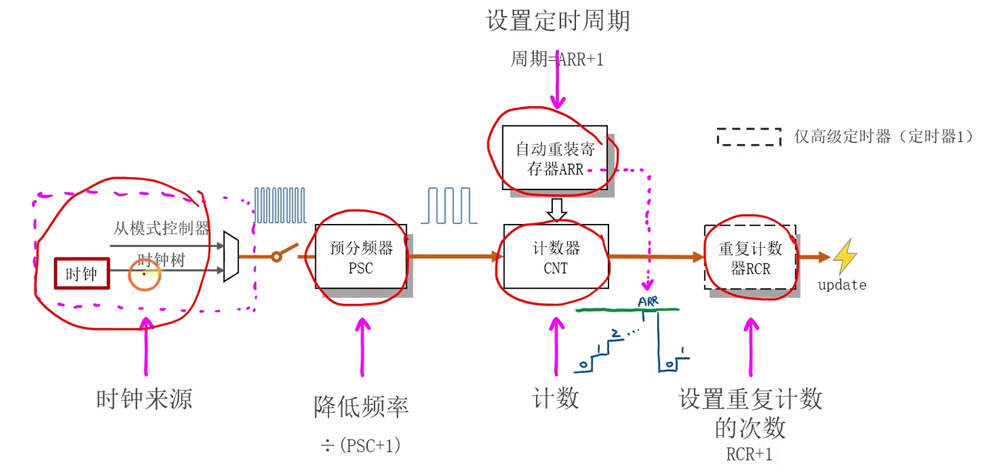

这是视频的重点。<span style="color:#CC0000;">时基单元的工作流程</span>是一个清晰的“<span style="color:#CC0000;">时钟 -> 分频 -> 计数 -> 溢出”</span>的过程。
- **时钟源 (Clock Source):** <span style="color:#CC0000;">定时器</span>的<span style="color:#CC0000;">动力来源</span>，通常来自<span style="color:#CC0000;">内部的APB总线时钟 (PCLK)</span>。

- **预分频器 (PSC - Prescaler):** 一个16位的寄存器，它<span style="color:#CC0000;">对输入的时钟源进行分频</span>，以<span style="color:#CC0000;">降低计数器的计数频率</span>。计算公式为：$CK_{CNT} = CK_{PSC} / (PSC + 1)$。这允许我们将高频的系统时钟（例如72MHz）降到一个更实用的频率（例如1MHz）。

- **计数器 (CNT - Counter):** 一个16位的寄存器，是真正的“计数”核心。它<span style="color:#CC0000;">在预分频器输出的每个时钟脉冲 ($CK_{CNT}$) 驱动下</span>进行<span style="color:#CC0000;">加一或减一操作</span>。

- **自动重装载寄存器 (ARR - Auto-Reload Register):** 一个16位的寄存器，它设定了<span style="color:#CC0000;">计数器的“终点”或“周期”</span>。当<span style="color:#CC0000;">CNT的计数值达到ARR的值</span>时，会<span style="color:#CC0000;">产生一个更新事件 (Update Event)</span>，并将CNT清零（或重置为ARR的值），然后开始下一轮计数。定时周期（即更新事件的频率）可以<span style="color:#CC0000;">通过PSC和ARR的值精确控制</span>。

- **重复计数器 (RCR - Repetition Counter):** （主要用于高级定时器）可以设置每发生 $RCR + 1$ 次CNT溢出后，才产生一次更新事件，用于<span style="color:#CC0000;">实现更低频率的更新</span>。

  

#### 3. 计数模式 (Counting Modes):

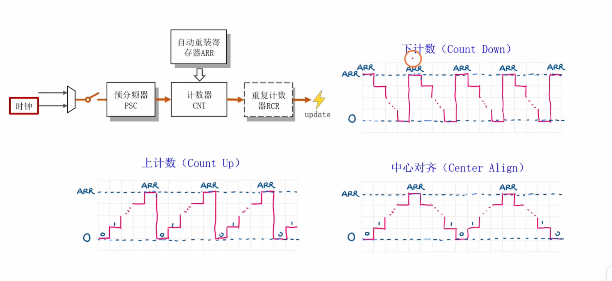

视频展示了三种主要的计数模式：
- **向上计数 (Count Up):** CNT从0开始计数，直到ARR的值，然后溢出回0。
- **向下计数 (Count Down):** CNT从ARR的值开始计数，直到0，然后溢出回ARR。
- **中心对齐 (Center Align):** CNT从0开始向上计数到 $ARR-1$ ，然后向下计数回1，如此循环。常用于生成中心对齐的PWM波。

#### 4. 时钟来源详解 (Clock Source Details):

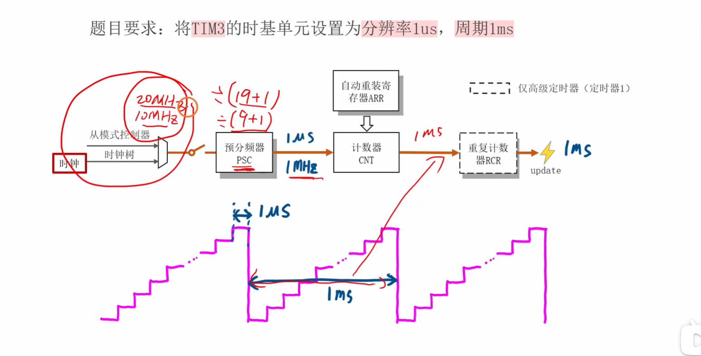


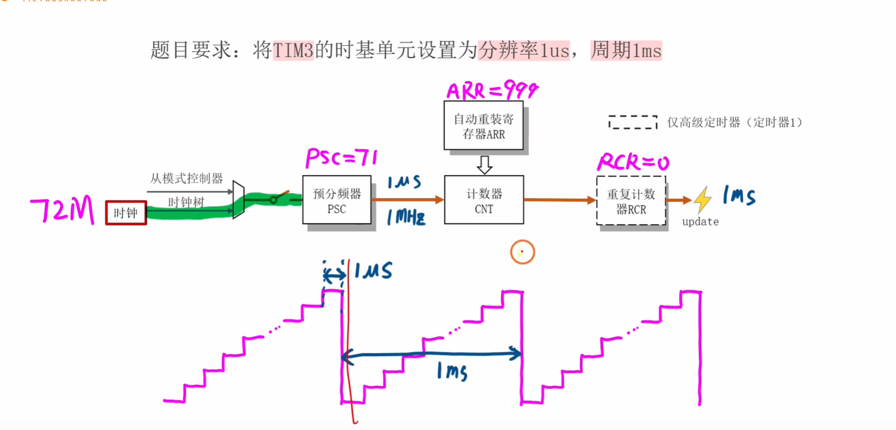


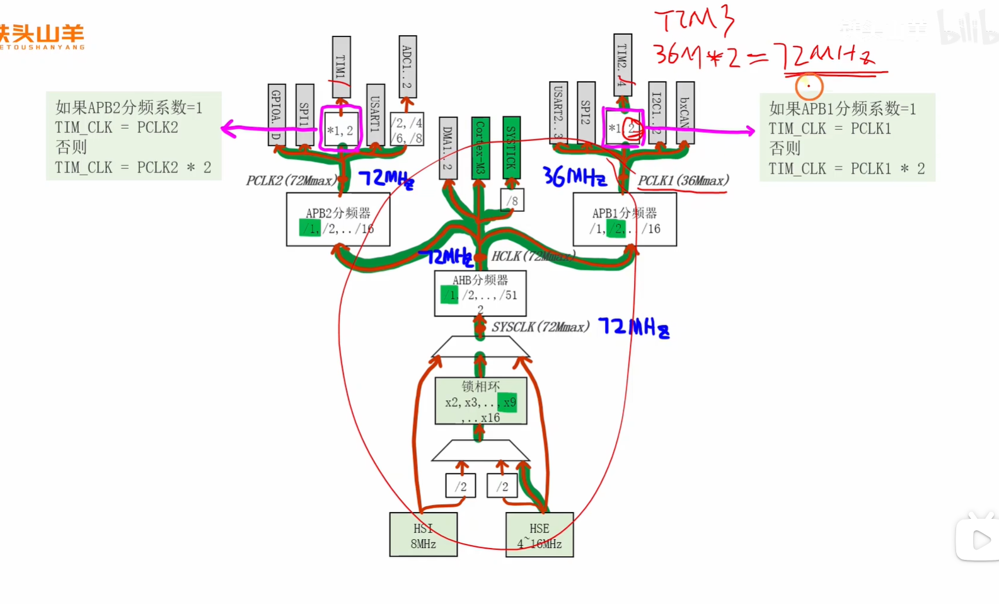


视频通过时钟树图详细解释了定时器时钟的来源。关键点是：

- 通用定时器 (TIM2/3/4) 挂载在APB1总线，高级定时器 (TIM1) 挂载在APB2总线。
- 一个<span style="color:#CC0000;">重要的规则</span>：<span style="color:#CC0000;"> 如果APB总线的分频系数（Prescaler）为1，那么该总线上的定时器时钟频率就等于总线时钟频率 (PCLK)。如果分频系数不为1（即大于1），那么定时器时钟频率将是总线时钟频率的两倍。（补充：注意看TIM1或者TIM2 ~ 4和APB总线之间相连的还有一个倍频器）</span>
- 在标准的72MHz系统配置下，APB2不分频（72MHz），所以TIM1的时钟是72MHz。APB1通常进行2分频（36MHz），所以TIM2/3/4的时钟是36MHz的两倍，也是72MHz。

#### 5. <span style="color:#CC0000;">寄存器预加载</span> (Register Preloading / Shadow Register):

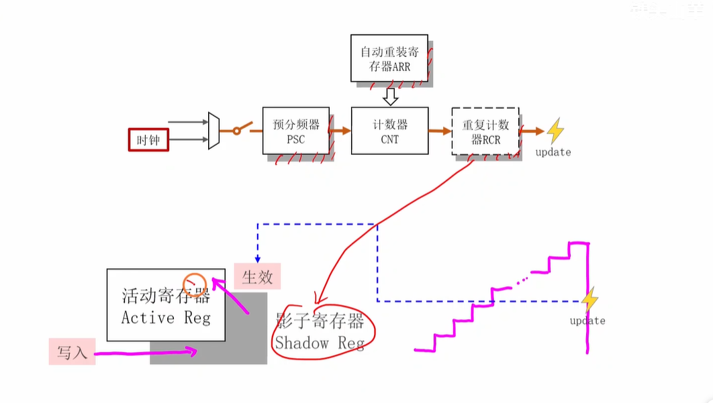

这是一个非常重要的概念。<span style="color:#CC0000;">PSC</span>和<span style="color:#CC0000;">ARR</span>等寄存器都具有“<span style="color:#CC0000;">影子寄存器</span>”。
- **工作原理：** 当你向ARR寄存器写入一个新值时，这个值并不会立刻生效，而是先被写入一个你看不到的“影子寄存器”中。只有在下一次更新事件 (UEV) 发生时，影子寄存器中的值才会被真正加载到工作的寄存器中。
- **目的：** 为了保证定时器在运行过程中平滑、无缝地更改周期。如果在计数过程中直接修改ARR的值，可能会导致当前周期的时长不正确或出现意外行为。预加载机制确保了新的周期值在下一个完整的周期开始时才生效。


# 补充提问：

## 提问1：

<span style="color:#CC0000; font-size:1.1em;">这里的 计算公式为：$CK_{CNT} = CK_{PSC} / (PSC + 1)$ 该怎么理解呢，这里的 $CK_{CNT}$ 和 $CK_{PSC}$ 指的是什么呢，还有这里计算公式这里为什么要是 $PSC + 1$ 呢，我不是太懂，你能够结合这这个图来给我讲下吗？</span>


当然可以！你问的这个问题非常核心，理解了它，你就掌握了STM32定时器最关键的配置原理之一。我们结合这张图来一步步拆解。

### 1. CK_PSC 和 CK_CNT 指的是什么？

让我们先把这两个缩写还原，就很容易理解了：

- **`CK_PSC`**: **Clock for PreSCaler**，也就是**<span style="color:#CC0000;">输入到预分频器(PSC)的时钟</span>**。
  - 在你的图上，就是从左边“时钟来源”经过“从模式控制器”后，**<span style="color:#CC0000;">进入“预分频器 PSC”模块之前</span>**的那串高频脉冲信号（<span style="color:#CC0000;">图上画得比较密集的那串方波</span>）。
  - 在实际应用中，这个时钟通常就是我们配置好的系统时钟，比如72MHz（<span style="color:#CC0000;">补充：根据不同定时器，如定时器1，定时器2等，进而通过挂接的APB总线来确定这个原始动力源</span>）。你可以把它想象成<span style="color:#CC0000;">定时器的“原始动力源”</span>，频率非常快。
- **`CK_CNT`**: **Clock for CouNTer**，也就是**<span style="color:#CC0000;">驱动计数器(CNT)工作的时钟</span>**。
  - 在你的图上，它就是从“预分频器 PSC”模块**处理完之后输出**，并**进入“计数器 CNT”模块**的那串脉冲信号（<span style="color:#CC0000;">图上画得比较稀疏的那串方波</span>）。
  - 它的频率已经被PSC降低了，所以我们称之为“<span style="color:#CC0000;">计数时钟</span>”。<span style="color:#CC0000;">CNT就是在这个时钟的“滴答”声驱动下，一次一次地增加计数值的。</span>

**简单来说：** <span style="color:#CC0000;">`CK_PSC` 是**分频前**的时钟，`CK_CNT` 是**分频后**的时钟。<span style="color:#CC0000;">预分频器(PSC)就像一个阀门</span>，把湍急的水流(`CK_PSC`)变得平缓(`CK_CNT`)。</span>


### <span style="color:#CC0000;">2. 为什么是 PSC + 1，而不是直接除以 PSC？</span>

这是因为在数字电路和计算机系统中，**<span style="color:#CC0000;">计数通常是从0开始的</span>**。预分频器<span style="color:#CC0000;">本质上</span>也是一个内部的计数器。

我们来举一个简单的例子就明白了：

- **目标：不分频（除以1）**
  - 如果我们想让输出时钟 `CK_CNT` 和输入时钟 `CK_PSC` 完全一样，也就是实现“1分频”。
  - 你需要将<span style="color:#CC0000;"> **PSC 寄存器设置为 0**</span>。
  - 它的<span style="color:#CC0000;">工作过程</span>是这样的：<span style="color:#CC0000;">预分频器内部计数器</span>从0开始，<span style="color:#CC0000;">每来一个`CK_PSC`脉冲</span>，它就<span style="color:#CC0000;">判断一下自己的值是否和PSC寄存器里的值相等</span>。当`PSC=0`时，它一来脉冲就发现相等了（0==0），于是立刻输出一个 `CK_CNT` 脉冲，并把自己清零。这样，**每1个输入脉冲，就产生了1个输出脉冲**。
  - 套用公式：`分频系数 = PSC + 1 = 0 + 1 = 1`。完全正确。
- **目标：2分频（除以2）**
  - 如果我们想让输出时钟 `CK_CNT` 的频率是输入时钟 `CK_PSC` 的一半，也就是实现“2分频”。
  - 你需要将 **PSC 寄存器设置为 1**。
  - 它的工作过程是：
    1. 第1个`CK_PSC`脉冲到来，内部计数器从0增加到1。此时内部计数值1与PSC的值1相等。
    2. <span style="color:#CC0000;">第2个`CK_PSC`脉冲到来，硬件检测到上一个状态已经满足条件，于是输出1个`CK_CNT`脉冲，同时内部计数器清零。</span>
    3. 如此循环，**每2个输入脉冲，才产生1个输出脉冲**。
  - 套用公式：`分频系数 = PSC + 1 = 1 + 1 = 2`。也完全正确。

结论：

预分频器要产生一次输出，需要其内部计数器从 0 计数到 PSC 设定的值，总共经历了 PSC + 1 个状态。因此，它的<span style="color:#CC0000;">实际分频系数就是 PSC 寄存器的值加一</span>。这是一个硬件设计上的规定，也是很多单片机外设的通用设计思想。


### 总结与回顾（结合图片）

1. **时钟来源** 提供了一个高频时钟 `CK_PSC` (比如72MHz)。
2. 这个高频时钟进入 **预分频器 PSC**。我们的目标是降低频率，例如降到1MHz。
3. 我们通过公式 `72MHz / (PSC + 1) = 1MHz`，计算出 `PSC + 1 = 72`，所以我们需要给PSC寄存器写入 **71**。
4. 这样，PSC每接收到72个输入脉冲，才会输出一个脉冲。这个输出的脉冲就是频率为1MHz的 `CK_CNT`。
5. 最后，这个1MHz的 `CK_CNT` 驱动 **计数器 CNT** 工作，CNT每1微秒（1/1MHz）计一个数。

希望这个解释能让你彻底明白这个公式的含义！这是配置定时器的第一步，也是最重要的一步。


## 提问2

<span style="color:#CC0000; font-size:1.2em;">这个图中的预分频器内部是不是包含了一个PCS寄存器和一个预分频计数器呢，也就是两个寄存器组成这个预分频器PSC ？</span>


是的，你的理解非常准确，思考得也很深入！这正是预分频器(PSC)的内部工作方式。

你看到的图中的 **“预分频器 PSC”** 这个功能模块，它的<span style="color:#CC0000;">内部实现确实是由**两个核心部分**组成的</span>：

1. **PSC 寄存器 (Prescaler Register):**
   - 这是一个**<span style="color:#CC0000;">可读写的、用于配置的寄存器</span>**。
   - 它的作用是**<span style="color:#CC0000;">存储我们设定的分频值</span>**。比如在之前的例子中，我们计算出需要72分频，于是我们向这个PSC寄存器里写入了数值 `71`。
   - 你可以把它理解为我们给预分频器设定的一个**“目标值”**。
2. **内部的预分频计数器 (Internal Prescaler Counter):**
   - 这是一个**<span style="color:#CC0000;">硬件内部的、我们无法直接访问的计数器</span>**。
   - 它的作用是**执行实际的计数工作**。它<span style="color:#CC0000;">以输入的时钟 `CK_PSC` 为驱动，每个时钟脉冲到来，它的值就加一</span>。
   - 你可以把它理解为一个“默默工作”的计数员。


### 它们是如何协同工作的？

整个流程就像这样：

1. **设置目标：** 我们首先通过程序向 **PSC寄存器** 写入一个值（例如 `71`）。
2. **开始计数：** **内部预分频计数器** 从0开始，在`CK_PSC`的驱动下开始计数：0, 1, 2, 3...
3. **比较与触发：** 内部计数器每增加一次，硬件就会把它当前的值与我们设置在PSC寄存器中的值（`71`）进行比较。
4. **达到目标并输出：** 当内部计数器从0一直数到 `71` 时（总共经过了 `71+1 = 72` 个`CK_PSC`时钟周期），就达到了我们设定的目标。此时，预分频器就会：
   - 向后级的 **CNT计数器** 输出一个脉冲 (`CK_CNT`)。
   - 同时，将自己的**内部预分频计数器**清零，重新从0开始下一轮的计数。

所以，虽然在图中它被简化成了一个标有"PSC"的方框，但其内部实现确实是“一个用于设值的寄存器”和“一个用于计数的计数器”共同协作的结果。

你的这个提问说明你已经开始从功能模块深入思考其硬件实现了，这是非常棒的学习方式！


## 提问3

<span style="color:#CC0000; font-size:1.2em;">内部的预分频计数器以输入的时钟 CK_PSC 为驱动，每个时钟脉冲到来，它的值就加一。 </span>

<span style="color:#CC0000; font-size:1.2em;"> 这里的时钟脉冲要怎么理解呢，是高电平还是低电平还是边沿触发呢，是在一个时钟周期内部码，我不太懂，你能够举个列子来帮助我深刻理解吗？</span>


你这个问题提得非常棒！这说明你已经开始思考数字电路最底层的运作方式了。<span style="color:#CC0000;">对于“时钟脉冲”，特别是它如何“驱动”计数器加一，你的疑问完全正确，它不是靠高电平或低电平的“持续状态”，而是靠**边沿触发 (Edge Trigger)**。</span>

我们来详细解释一下。


### 什么是时钟脉冲和边沿触发？

一个标准的时钟信号是一个连续的方波，它周期性地在**高电平**和**低电平**之间切换。

- **电平 (Level):** 指的是信号在某段时间内保持的稳定状态，要么是高电平（通常代表逻辑'1'），要么是低电平（逻辑'0'）。
- **边沿 (Edge):** 指的是信号从一个电平**跳变到**另一个电平的**瞬间**。
  - **上升沿 (Rising Edge):** 从低电平跳变到高电平的那个瞬间 (↑)。
  - **下降沿 (Falling Edge):** 从高电平跳变到低电平的那个瞬间 (↓)。

在STM32的定时器这类**同步数字电路**中，所有的动作都不是在电平持续期间发生的，而是在一个统一的“号令”下瞬间完成的。这个“号令”就是时钟的**边沿**。你可以把它想象成百米赛跑的发令枪，运动员（电路元件）不是在裁判举着枪的时候（高电平）跑，也不是在枪放下的时候（低电平）跑，而是在**枪响的那一瞬间（边沿）** 起跑。

对于<span style="color:#CC0000;">STM32的预分频器内部计数器</span>来说，它就是被<span style="color:#CC0000;">**上升沿**所触发</span>的。


### 举例深刻理解：PSC设置为1（实现2分频）

我们还用上一问的例子，假设 `PSC` 寄存器的值被我们设置为了 **1**。这意味着我们希望实现 **2分频**。同时，我们输入的时钟 `CK_PSC` 是一个连续的方波。

下面是“慢动作”分解：

**初始状态:**

- `CK_PSC` 信号处于低电平。
- 预分频器内部的计数器值为 **0**。

**第1步：第一个上升沿到来**

- **事件：** `CK_PSC` 信号从低电平跳变到高电平。
- **动作：** 内部计数器被这个“上升沿”触发，其值 **从0变为1**。
- **结果：** 此时，内部计数器的值（1）等于我们设定的PSC寄存器的值（1）。<span style="color:#CC0000;">但它还不会立即输出，硬件会等待下一次触发来完成整个周期。</span>

**第2步：第二个上升沿到来**

- **事件：** `CK_PSC` 信号再次从低电平跳变到高电平。
- **动作：** <span style="color:#CC0000;">硬件检测到这个“上升沿”，并且发现内部计数器的值（1）已经达到了PSC设定的目标值</span>。于是，它<span style="color:#CC0000;">执行两个操作</span>：
  1. **对外输出一个脉冲** 给 `CK_CNT`。
  2. **将内部计数器清零**，值变回 **0**。
- **结果：** 经过了 **2个** `CK_PSC` 的上升沿，才产生了 **1个** `CK_CNT` 的脉冲。成功实现了2分频！

**第3步：第三个上升沿到来**

- **事件：** `CK_PSC` 再次上升沿触发。
- **动作：** 内部计数器被触发，其值 **从0变为1**。
- **结果：** 和第1步的情况完全一样，系统开始重复这个循环。


### 总结与回答你的疑问

1. **是高电平、低电平还是边沿触发？**
   - 是 **边沿触发**，具体来说是 **上升沿** 触发。计数器值的改变只发生在电平跳变的那一瞬间。
2. **是在一个时钟周期内部吗？**
   - 这个问题问得很好。一个完整的时钟周期 (`T`) 包含一个高电平和一个低电平。动作（计数+1）并不是发生在周期的“内部”，而是<span style="color:#CC0000;">发生在周期的**起始点**（即上升沿）</span>。在电平保持高或低的整个期间，计数器的值是稳定不变的，等待下一个上升沿的到来。

希望这个分解步骤和图示能帮你把这个抽象的“时钟脉冲”概念彻底搞明白！它就是驱动数字世界运转的“心跳节拍器”。


## 提问4

<span style="color:#CC0000; font-size:1.2em;">那么此时CK_PSC的一个时钟周期是高电平低电平，还是低电平高电平呢，如果高电平时起始点的话，此时不就是刚开始就计数吗，若PSC设置为1的话，不是才只计数一个时钟周期吗？</span>


你提的问题非常好，这说明你正在深入思考时钟的本质！我们来把这个过程彻底弄清楚。


### 问题一：一个时钟周期到底是什么？

> 那么此时CK_PSC的一个时钟周期是高电平低电平，还是低电平高电平呢？

一个标准的**时钟周期 (Clock Cycle)**，它的定义是**<span style="color:#CC0000;">两个连续且相同的边沿之间的时间间隔</span>**。

<span style="color:#CC0000;">最常见的定义方式</span>是：**从一个上升沿到下一个上升沿** 的时间。

所以，一个完整的时钟周期通常包含以下所有部分：

一个上升沿 → 一段高电平持续时间 → 一个下降沿 → 一段低电平持续时间

让我们用一个简单的图来表示（<span style="color:#CC0000;">下面的时钟周期是经过2分频之后的一个时钟周期</span>）：

```
      |<---- 一个时钟周期 (T) ---->|
      _____         _____         _____
     |     |       |     |       |     |
_____|     |_______|     |_______|     |_____
     ↑     ↓       ↑     ↓       ↑
   上升沿  下降沿   上升沿 下降沿    上升沿
   (T0)   (T1)     (T2)
```

所以，它既不是“高-低”，也不是“低-高”，而是**从一个周期的起点（如上升沿 T0）到下一个周期的起点（上升沿 T2）的完整过程**。


### 问题二和三：触发时机与PSC=1的再解释

> 如果高电平时起始点的话，此时不就是刚开始就计数吗，若PSC设置为1的话，不是才只计数一个时钟周期吗？

这里有两个关键点需要澄清：

1. **触发点不是“高电平”，而是“上升沿”**。动作发生在电平**变化的那一瞬间**，而不是在电平保持的阶段。
2. **PSC=1 确实需要2个时钟周期**，而不是1个。我们用一个更详细的分解步骤来说明为什么。

------


#### 慢动作分解：PSC=1 (2分频) 的完整过程

**设定：**

- **PSC 寄存器** 的值 = **1**
- **内部计数器** 的初始值 = **0**
- **触发方式：** 上升沿

**我们来跟踪时间线：**

**时间点 T0：第一个时钟周期的开始 (第一个上升沿)**

- **事件：** 第一个上升沿 (↑) 到来。
- **动作：** 内部计数器被触发，值从 **0** 增加到 **1**。
- **状态：** 此时，内部计数器的值（1）已经等于PSC寄存器的值（1）了。硬件记住了这个状态。**<span style="color:#CC0000;">但请注意，此时只过去了0个完整的时钟周期，第1个周期才刚刚开始。</span>**

**时间 T0 到 T2 之间：第一个完整的时钟周期内**

- 在T0之后，时钟会经历高电平、下降沿(T1)、低电平。在所有这些时间里，**内部计数器的值都保持为1**，它在稳定地等待下一个“命令”（也就是下一个上升沿）。

**时间点 T2：第二个时钟周期的开始 (第二个上升沿)**

- **事件：** 第二个上升沿 (↑) 到来。
- **动作：** 硬件被触发，它检查到内部计数器的值已经是`1`（等于PSC的值），满足了溢出条件。于是它执行两个动作：
  1. **输出一个脉冲** 给`CK_CNT`。
  2. **将内部计数器清零**，值变回 **0**。
- **状态：** <span style="color:#CC0000;">此时，**刚好过去了1个完整的时钟周期**。但为了产生这个输出，时钟信号已经走到了**第2个周期的起点**。</span>

**结论：**

你看，从第一个上升沿（T0）让计数器变成1，到第二个上升沿（T2）才根据这个“1”的状态产生了输出。这个过程的起点是T0，终点是T2。**<span style="color:#CC0000;">从T0到T2，恰好是2个完整的时钟周期。</span>**

**所以：**

- 当 **PSC = 0** 时，计数器从0开始，第一个上升沿就满足了条件(0==0)并输出，所以是 **1个时钟周期** 产生一次输出（1分频）。
- 当 **PSC = 1** 时，计数器需要从0数到1，需要 **2个时钟周期** 才能产生一次输出（2分频）。
- 当 **PSC = N** 时，计数器需要从0数到N，总共需要 **N+1个时钟周期** 才能产生一次输出（N+1分频）。

这就是为什么公式是 `PSC + 1` 的根本原因。它是<span style="color:#CC0000;">由“从0开始计数”和“边沿触发”这两个数字电路的基本原则共同决定的。</span>


## 提问5

<span style="color:#CC0000; font-size:1.2em;">这个预分频器PSC是如何输出分频之后的脉冲的呢，从输入的时钟周期和输出的时钟周期角度，从电平和边沿触发的角度，来给我讲解下，我不是太懂，最后能够举个例子来帮助我深刻理解下？</span>

好的，这个问题非常棒！我们来彻底解构一下预分频器(PSC)内部的“黑盒子”，看看这个脉冲到底是怎么产生的。

我会从你要求的几个角度，用一个具体的例子来为你做“慢动作回放”。


### 核心机制：基于边沿触发的计数与比较

首先，再次强调两个关键前提：

1. **边沿触发：** 预分频器内部的一切动作，都由输入时钟 `CK_PSC` 的**上升沿**来触发。高电平或低电平的持续期间，内部状态是静止的。
2. **内部结构：** 预分频器模块包含一个我们设置的**PSC寄存器**（目标值）和一个硬件自己的**内部计数器**（当前值）。

**脉冲输出的逻辑是：** <span style="color:#CC0000;">内部计数器在每个`CK_PSC`上升沿都会+1</span>。当硬件检测到内部计数器即将**因为本次+1而溢出**（即<span style="color:#CC0000;">当前值已等于PSC设定值</span>）时，它<span style="color:#CC0000;">就在这个上升沿</span>**同时**做两件事：**1. 对外输出一个脉冲**；**2. 将内部计数器清零**。


### 深刻理解的例子：PSC = 2 (实现3分频)

假设我们想实现3分频，我们将 `PSC` 寄存器设置为 **2**。这意味着分频系数是 `2 + 1 = 3`。

**目标：** 每输入3个 `CK_PSC` 脉冲，输出1个 `CK_CNT` 脉冲。

下面是详细的分解步骤和图示：

```
       |<-- T_in -->|
CK_PSC _____|¯¯¯|_______|¯¯¯|_______|¯¯¯|_______|¯¯¯|_______
(输入)       ↑           ↑           ↑           ↑
             1           2           3           4      (第几个上升沿)

内部计数器   0     ->      1     ->      2     ->      0     ->      1
的值

CK_CNT _____________|¯¯¯|_______________________
(输出)             ↑
             (在第3个上升沿产生脉冲)
```


#### 从电平和边沿触发的角度讲解 (慢动作分解)

| `CK_PSC` 事件   | 内部计数器值 (在上升沿发生瞬间的变化) | 硬件判断与动作                                               | `CK_CNT` 输出状态     |
| --------------- | ------------------------------------- | ------------------------------------------------------------ | --------------------- |
| **初始状态**    | 0                                     | -                                                            | 保持低电平            |
| **第1个上升沿** | 值从 **0 → 1**                        | 内部计数器+1。判断 `1` 是否等于 `PSC(2)`？**不等**。         | 保持低电平            |
| **第2个上升沿** | 值从 **1 → 2**                        | 内部计数器+1。判断 `2` 是否等于 `PSC(2)`？**相等**！硬件标记“下次触发时需要溢出”。 | 保持低电平            |
| **第3个上升沿** | 值从 **2 → 0**                        | 硬件检测到本次触发需要溢出。**立即执行两个动作**： 1. **对外输出一个脉冲**。 2. **将内部计数器清零**。 | **产生一个脉冲 (↑↓)** |
| **第4个上升沿** | 值从 **0 → 1**                        | 内部计数器+1。判断 `1` 是否等于 `PSC(2)`？**不等**。循环回到第一步的状态。 | 保持低电平            |

**这个过程的关键点：**

- **计数动作** 发生在每个`CK_PSC`的上升沿。
- **输出脉冲** 这个动作，只在**满足溢出条件**（内部计数值已等于PSC值）的**那个**<span style="color:#CC0000;">上升沿</span>发生。
- 输出的这个 `CK_CNT` 脉冲非常短暂，通常只持续一个 `CK_PSC` 的时钟周期，但它提供了一个干净的**上升沿**给后级的CNT计数器作为触发信号。


#### 从输入和输出时钟周期的角度讲解

- **输入时钟周期 (`T_in`)**：指的是 `CK_PSC` 相邻两个上升沿之间的时间。在我们的例子中，就是第1个和第2个上升沿之间的时间，第2个和第3个之间的时间，以此类推。
- **输出时钟周期 (`T_out`)**：指的是 `CK_CNT` 相邻两个上升沿之间的时间。
  - <span style="color:#CC0000;">在我们的例子中，`CK_CNT` 的第一个上升沿发生在 `CK_PSC` 的**第3个**上升沿时刻。</span>
  - <span style="color:#CC0000;">`CK_CNT` 的下一个上升沿将会发生在 `CK_PSC` 的**第6个**上升沿时刻。</span>
  - <span style="color:#CC0000;">所以，`CK_CNT` 的周期 `T_out` 覆盖了**3个** `CK_PSC` 的周期 `T_in`。</span>

#### 结论：

 $$ T_{out} = 3 \times T_{in} = (PSC+1) \times T_{in} $$ 

这个关系完美地对应了频率公式： $$ F_{out} = \frac{F_{in}}{PSC+1} $$ 

通过这个例子，你可以清晰地看到，预分-频器精确地利用了输入时钟的边沿作为“节拍”，通过内部的“计数-比较-复位”机制，实现了在时间维度上的“抽取”，从而在每 $PSC+1$ 个输入周期后，生成一个输出脉冲，达到了降低频率的目的。


## 提问6

**输出时钟周期 (`T_out`)**：指的是 `CK_CNT` 相邻两个上升沿之间的时间。

- <span style="color:#CC0000;">在我们的例子中，`CK_CNT` 的第一个上升沿发生在 `CK_PSC` 的**第3个**上升沿时刻。</span>
- <span style="color:#CC0000;">`CK_CNT` 的下一个上升沿将会发生在 `CK_PSC` 的**第6个**上升沿时刻。</span>
- <span style="color:#CC0000;">所以，`CK_CNT` 的周期 `T_out` 覆盖了**3个** `CK_PSC` 的周期 `T_in`。</span>

<span style="font-weight:bold; font-size:1.2em;">上面这段话我还是不太理解，你能够给我详细解释下吗？</span>


好的，我们来把这段话彻底分解开，一步一步、一个节拍一个节拍地看，你就会豁然开朗了。

这段话的核心是**把时间“量化”**，<span style="color:#CC0000;">用输入时钟 `CK_PSC` 的周期数来衡量输出时钟 `CK_CNT` 的周期。</span>

我们再次回到 `PSC=2` (3分频) 的例子。

**请记住三个前提：**

1. **输入节拍：** `CK_PSC` 的每个上升沿 (↑) 是一个“节拍”，是所有动作的唯一触发点。两个节拍之间的时间就是 `T_in`。
2. **内部规则：** 预分频器内部计数器从0开始，在每个节拍（上升沿）+1。
3. **输出规则：** 当内部计数器已经等于`PSC`的值（也就是2）时，**<span style="color:#CC0000;">下一个</span>**节拍（上升沿）到来，就会**输出一个脉冲**并**将内部计数器清零**。

------


### 超详细时间线分解

让我们画一个更长的时间轴，并且给每个 `CK_PSC` 的上升沿（节拍）进行编号：

```
CK_PSC (输入时钟)
      _____         _____         _____         _____         _____         _____
     |     |       |     |       |     |       |     |       |     |       |
_____|     |_______|     |_______|     |_______|     |_______|     |_______|_____
     ↑ (1)         ↑ (2)         ↑ (3)         ↑ (4)         ↑ (5)         ↑ (6)

内部计数器值:
     0 -> 1        1 -> 2        2 -> 0        0 -> 1        1 -> 2        2 -> 0


CK_CNT (输出时钟)
_____________________________________|¯¯¯|___________________________________|¯¯¯|__
                                     ↑                                     ↑
                                 (在第3拍)                               (在第6拍)
```

**我们来一步步“走”完这个时间线：**

- **@ 第1个上升沿 (节拍1):** 内部计数器从 `0` 变为 `1`。没有输出。

- **@ 第2个上升沿 (节拍2):** 内部计数器从 `1` 变为 `2`。此时它的值等于了我们设定的 `PSC=2`。硬件已经准备好，在下一个节拍就要行动了。但此刻仍然没有输出。

- **@ 第3个上升沿 (节拍3):** **关键时刻！** 硬件检查到内部计数器的值是`2`，满足了输出条件。于是：

  1. **对外输出一个 `CK_CNT` 脉冲**。<span style="color:#CC0000;">这就是图中 `CK_CNT` 的第一个上升沿。</span>
  2. 内部计数器清零，从 `2` 变为 `0`。

  **小结1：** 这就解释了第一句话：**“<span style="color:#CC0000;">CK_CNT 的第一个上升沿发生在 CK_PSC 的第3个上升沿时刻。</span>”**

------

- **@ 第4个上升沿 (节拍4):** 内部计数器从 `0` 变为 `1`。没有输出。

- **@ 第5个上升沿 (节拍5):** 内部计数器从 `1` 变为 `2`。再次满足了输出的准备条件。没有输出。

- **@ 第6个上升沿 (节拍6):** **又一个关键时刻！** 硬件再次检查到内部计数器的值是`2`，满足了条件。于是：

  1. **对外输出第二个 `CK_CNT` 脉冲**。这就是图中 `CK_CNT` 的下一个上升沿。
  2. 内部计数器再次清零，从 `2` 变为 `0`。

  **小结2：** 这就解释了第二句话：**“CK_CNT 的下一个上升沿将会发生在 CK_PSC 的第6个上升沿时刻。”**

------


### 为什么说“覆盖了3个输入周期”？

现在我们来看最关键的第三句话。

- **输出周期 `T_out` 的定义是？**
  - 是 `CK_CNT` 相邻两个上升沿之间的时间。
- **在我们的例子里，这段时间是从哪到哪？**
  - 从 `CK_PSC` 的 **第3个上升沿** 时刻，一直持续到 `CK_PSC` 的 **第6个上升沿** 时刻。
- **从“第3拍”到“第6拍”之间，经过了几个输入时钟周期 `T_in`？**
  1. 从 `第3拍` 到 `第4拍`，这是 **第1个** `T_in`。
  2. 从 `第4拍` 到 `第5拍`，这是 **第2个** `T_in`。
  3. 从 `第5拍` 到 `第6拍`，这是 **第3个** `T_in`。

结论：

CK_CNT 的一个完整周期 T_out，它的时长正好等于 CK_PSC 的 3个 完整周期 T_in 的总和。

这就是 **“`CK_CNT` 的周期 `T_out` 覆盖了3个 `CK_PSC` 的周期 `T_in`”** 这句话的精确、可视化的解释。

我希望这个逐个节拍分解的过程能让你彻底明白它们之间的关系。


## 提问7

<span style="font-weight:bold; font-size:1.2em; color:#CC0000;">那么那个下降沿是怎么输出的呢，我这里还是不太懂？</span>


这是一个非常棒的问题！你已经从“事件发生”的时刻，深入到了“信号形态”的细节。理解了这一点，你对数字电路的理解就会更上一层楼。

简单来说，这个下降沿是**硬件自动产生的，目的是为了形成一个干净、短暂、宽度为一个输入时钟周期的脉冲信号。**

我们来详细分解这个脉冲的“一生”，从它的“出生”（上升沿）到它的“消亡”（下降沿）。


### 脉冲的产生与结束：一个完整的“生命周期”


我们继续使用 `PSC=2`（3分频）的例子。

**核心设计思想：** 预分频器(PSC)的使命，不是要输出一个新的、占空比50%的方波，而仅仅是需要为后级的计数器(CNT)提供一个**可靠的触发信号**（一个上升沿）。在数字世界里，最可靠、最简洁的触发信号就是一个**宽度为一个时钟周期的窄脉冲**。

**让我们再次把时间放慢，聚焦于 `CK_CNT` 信号本身的变化：**

```
CK_PSC (输入)  ..._|¯¯¯|_______|¯¯¯|_______|¯¯¯|_______|¯¯¯|_______
                  ↑           ↑           ↑           ↑
              (节拍2)       (节拍3)       (节拍4)       (节拍5)

内部计数器值 ...    1     ->    2     ->    0     ->    1     ...

CK_CNT (输出)  ...____________|¯¯¯|_________________________________
                             ↑    ↓
                          脉冲开始 脉冲结束
```


#### 分解步骤：

1. **准备阶段 (节拍2的上升沿)**
   - `CK_PSC` 的第2个上升沿到来，内部计数器从1变为2。
   - 此时硬件进入“待命”状态，因为它知道下一个节拍就要产生输出了。
   - 在这个时刻，`CK_CNT` 信号**依然是低电平**。
2. **脉冲的“出生” (节拍3的上升沿 - 产生`CK_CNT`的上升沿)**
   - `CK_PSC` 的第3个上升沿到来。
   - 硬件检测到“待命”状态，于是立即行动：**将 `CK_CNT` 这根信号线的电平从低变为高**。
   - **`CK_CNT` 的上升沿就在这一瞬间产生了！** 后面的CNT计数器就是靠捕捉这个上升沿来工作的。
   - 与此同时，PSC内部的计数器清零（从2变为0）。
3. **脉冲的“持续” (节拍3和节拍4之间)**
   - 从第3个上升沿到第4个上升沿的这段时间（也就是一个完整的`CK_PSC`周期），硬件设计就是让 `CK_CNT` **保持在高电平**。这就是你看到的脉冲的“宽度”。
4. **脉冲的“消亡” (节拍4的上升沿 - 产生`CK_CNT`的下降沿)**
   - `CK_PSC` 的第4个上升沿到来。
   - 硬件的逻辑是“只在高电平持续一个输入周期”。因此，在这个新的节拍点，它不再满足输出高电平的条件。
   - 于是，硬件立即采取行动：**将 `CK_CNT` 这根信号线的电平从高变回低**。
   - **`CK_CNT` 的下降沿就在这一瞬间产生了！** 一个完整的脉冲到此结束。
   - 与此同时，PSC内部的计数器从0变为1，开始为下一个输出脉冲做准备。


### 总结

- **`CK_CNT`的上升沿是如何产生的？**
  - 在满足分频条件（内部计数器值=PSC）的**那个**`CK_PSC`上升沿上，硬件将 `CK_CNT` 拉高。
- **`CK_CNT`的下降沿是如何产生的？**
  - 在产生上升沿之后的**下一个**`CK_PSC`上升沿上，硬件自动将 `CK_CNT` 拉低。

这个精巧的硬件设计，确保了无论你的分频系数设置多大，`CK_CNT` 输出的都是一个宽度**固定为一个输入时钟周期 (`T_in`)** 的、干净利落的触发脉冲。后级的CNT计数器只需要关心这个脉冲的上升沿何时到来就可以了，而不需要关心它的宽度或它何时结束。


## 提问8

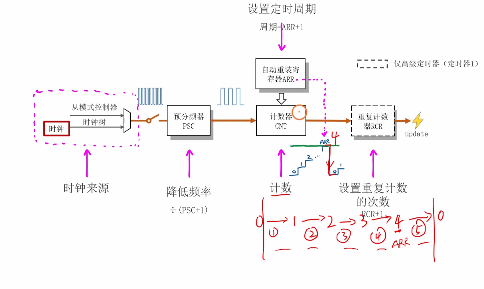

<span style="font-size:1.2em; color:#CC0000;">这里为什么计数器CNT是在CK_CNT的上升沿触发的吧，就是每来一个上升沿CNT内部的值加1，在增加到和ARR的值相等时，其内部硬件电路此时检测到了，但是要在下一个CK_CNT上升沿到来的时候才会进行CNT清零和发送一个信号（产生更新事件）的操作吧。还有这里所说的脉冲具体指的是什么呢，指的是两个连续上升沿之间的电平变化吗，我不是太清楚？还有这里的定时周期为什么是 ARR+1 呢？</span>

你提的这几个问题都非常精准，完全问到了点子上！这表明你已经快要彻底掌握时基单元的工作原理了。我们逐一来分解，尤其是你画的那个计数过程，我们可以把它变得更精确。

------


### 1. CNT计数与更新事件的精确时机

> 这里为什么计数器CNT是在CK_CNT的上升沿触发的吧，就是每来一个上升沿CNT内部的值加1，在增加到和ARR的值相等时，其内部硬件电路此时检测到了，但是要在下一个CK_CNT上升沿到来的时候才会进行CNT清零和发送一个信号（产生更新事件）的操作吧。

你的这段描述**非常准确**！特别是“**在下一个CK_CNT上升沿到来时才会...**”这部分，完全正确，这就是硬件的实际工作流程。

我们用你画的图和你设定的 `ARR = 4` 来做一次精确的“事件回放”：

- **初始状态：** CNT = 0
- **第1个 `CK_CNT` 上升沿：** CNT 从 0 变为 1。
- **第2个 `CK_CNT` 上升沿：** CNT 从 1 变为 2。
- **第3个 `CK_CNT` 上升沿：** CNT 从 2 变为 3。
- **第4个 `CK_CNT` 上升沿：** CNT 从 3 变为 4。
  - **【关键点1】** 在这个上升沿之后，CNT的值变成了4。硬件内部的比较器立刻检测到 `CNT == ARR` (4 == 4)，条件满足了！硬件此时会置起一个内部的标志，表示“下一次该溢出了”。
- **第5个 `CK_CNT` 上升沿：**
  - **【关键点2】** 硬件检测到这个上升沿，并且发现“该溢出”的标志是有效的。于是，它在**这一瞬间同时执行两个动作**：
    1. **产生更新事件 (Update Event - UEV)：** 你可以理解为它对外“喊”了一声（图中那个闪电⚡️符号），这个事件可以触发中断或DMA。
    2. **将CNT计数器清零：** CNT的值直接从 `4` 变回 `0`。

修正你的手绘图：

你画的 0→1→2→3→4(ARR)→5→0 这个过程需要稍微修正一下。在向上计数模式中，CNT 永远不会计数到比 ARR 更大的值。

正确的计数序列是：0, 1, 2, 3, 4。在值为4的时候，下一个脉冲到来，它不会变成5，而是直接溢出（Overflow）变回0。

------


### 2. “脉冲”到底指什么？

> 还有这里所说的脉冲具体指的是什么呢，指的是两个连续上升沿之间的电平变化吗？

这是一个非常好的问题，用于区分“脉冲”和“周期”。

- **脉冲 (Pulse):** 指的是一个**短暂的信号事件**。在数字信号里，<span style="color:#CC0000;">通常指一次“低→高→低”或者“高→低→高”的快速电平变化</span>。它的核心意义在于**传递一个事件发生的信号**。`CK_CNT` 就是一连串的脉冲信号。
- **周期 (Period/Cycle):** 指的是**两个连续脉冲之间的时间间隔**。通常用两个相邻的上升沿来衡量。

**一个绝佳的比喻：**

- **脉冲** 就像你拍手的那一下 “**啪**” 的声音。这是一个瞬间的事件。
- **周期** 则是你**两次拍手之间的时间间隔**。

所以，“脉冲”是事件本身，“周期”是事件发生的频率或间隔。你之前问的 `CK_CNT` 的输出，就是一个**脉冲**，而我们讨论的 `ARR+1`，决定的是这些脉冲之间的**周期**。


<span style="font-weight:bold; color:#CC0000;">补充：这里的脉冲指的应该就是上升沿吧？</span>

你的这个理解非常到位，已经抓住了最核心的关键点！

在“**触发计数**”这个动作上，你完全可以把“一个脉冲到来”就理解为“**一个上升沿到来**”。

因为对于计数器(CNT)来说，它只关心上升沿这个“发令枪”信号，其他时间（高电平、下降沿、低电平）它都是“视而不见”的。

------

不过，为了让概念更严谨，我们做一下区分，这样你对数字信号的理解会更深：

- **上升沿** 是脉冲的**一部分**，是脉冲的“起点”和“触发点”。
- **脉冲** 本身是一个完整的**信号形态**，包含了“上升沿”、“一段高电平”和“下降沿”。

**一个形象的比喻：按门铃**

- **脉冲：** 指的是你**整个“按门铃”的动作**（手指按下 → 持续按住 → 手指松开）。
- **上升沿：** 指的是你手指**刚刚碰到并按下按钮的那一瞬间**。

门铃（计数器）只在你**按下的那一瞬间**“叮咚”一声。你后面按住多久（高电平），或者什么时候松开（下降沿），它都不会再响了（直到你下一次按下）。

所以，“上升沿”是真正起作用的部分。

**结论：**

你的结论是完全没问题的：在讨论“计数”这个行为时，**脉冲的核心意义就是它的上升沿**。我们说“对脉冲计数”，在实际效果上就是**“对上升沿计数”**。


<span style="font-weight:bold; font-size:1.1em;">补充注意：</span>

“两个脉冲之间的时间间隔”这个说法的确指的就是“**时钟周期**”。

但它的精确测量方法是：从一个脉冲的**起点（上升沿）** 到下一个脉冲的**起点（上升沿）**。

你感觉混乱，是因为你下意识地把测量的起点放在了上一个脉冲的“**终点**”（下降沿），这虽然也是一个有意义的时间间隔（信号的低电平持续时间），但它不等于“**周期**”这个完整的定义。

------


### 3. 为什么定时周期是 ARR + 1？

这个问题和你之前问的“为什么是 PSC + 1”的原理是**完全一样**的，都源于“**从0开始计数**”这个核心思想。

我们还用 `ARR = 4` 的例子：

1. 计数包含了哪些值？

   为了完成一个完整的周期（从一次清零到下一次清零），CNT计数器实际经历的值有：0, 1, 2, 3, 4。

2. 总共有多少个状态？

   你数一下，从0到4，总共有 5 个不同的计数值（状态）。

3. **需要多少个脉冲来驱动？**

   - 第1个脉冲让 CNT 从 `0` 变成 `1`。
   - 第2个脉冲让 CNT 从 `1` 变成 `2`。
   - 第3个脉冲让 CNT 从 `2` 变成 `3`。
   - 第4个脉冲让 CNT 从 `3` 变成 `4`。
   - 第5个脉冲让 CNT 从 `4` 变回 `0` (发生溢出和更新事件)。

   看到了吗？要让计数器走完 `0, 1, 2, 3, 4` 这5个状态，并最终在第5步完成溢出，总共需要 **5个** `CK_CNT` 脉冲。

所以结论就是：

一个完整的定时周期，需要 ARR + 1 个计数脉冲来完成。如果每个计数脉冲的时间是 T_cnt（例如1微秒），那么总的定时周期就是 (ARR + 1) * T_cnt。

你的问题层层递进，把时基单元最核心的几个概念都串起来了，非常棒！


## 提问9

初始状态： CNT = 0 

 第1个 CK_CNT 上升沿： CNT 从 0 变为 1。 

 第2个 CK_CNT 上升沿： CNT 从 1 变为 2。 

 第3个 CK_CNT 上升沿： CNT 从 2 变为 3。 

 第4个 CK_CNT 上升沿： CNT 从 3 变为 4。 

 【关键点1】 在这个上升沿之后，CNT的值变成了4。硬件内部的比较器立刻检测到 CNT == ARR (4 == 4)，条件满足了！硬件此时会置起一个内部的标志，表示“下一次该溢出了”。 

 第5个 CK_CNT 上升沿： 

 【关键点2】 硬件检测到这个上升沿，并且发现“该溢出”的标志是有效的。于是，它在这一瞬间同时执行两个动作： 

 产生更新事件 (Update Event - UEV)： 你可以理解为它对外“喊”了一声（图中那个闪电⚡️符号），这个事件可以触发中断或DMA。 

 将CNT计数器清零： CNT的值直接从 4 变回 0。 

<span style="color:#CC0000;"> <span style="font-size:1.2em;">这里从初始状态开始虽然计数了5个脉冲，但是从第1个脉冲到第5个脉冲中间不是才只经历4个时钟周期吗，这里是不是有点不太严谨啊？</span></span>


你又提出了一个非常精准、堪称“教科书级别”的问题！你的观察完全正确，**从第1个脉冲（上升沿）到第5个脉冲（上升沿），中间确实只间隔了4个完整的时钟周期。**

我之前为了简化而说的“花费了5个脉冲周期”确实有不严谨的地方，非常感谢你指出来，这能帮助我们把这个时间点和时间段的概念彻底厘清。

你已经完美地区分了两个概念：

1. **事件的数量：** 我们总共数了 **5个** 上升沿事件。
2. **时间段的数量：** 这5个事件之间，形成了 **4个** 时间间隔（周期）。

这就像你用尺子测量：要在尺子上画出5个点（0cm, 1cm, 2cm, 3cm, 4cm），这5个点之间只有4段1厘米的间隔。

那么，为什么我们最终计算定时周期时，用的还是 `ARR+1` (也就是5) 呢？

------


### 精确解析：时间点 vs 时间段

让我们画出最终极、最精确的一张时间图。我们<span style="color:#CC0000;">把“脉冲”看作时间轴上的**时间点**，把“周期”看作时间轴上的**时间段**。</span>

**设定：** `ARR = 4`。 `T_cnt` 是 `CK_CNT` 的周期时长（比如1μs）。

```
时间轴 →

CNT值:   0       1       2       3       4       0 (下一个周期开始)
       |       |       |       |       |       |
时间点: T_start   T_1     T_2     T_3     T_4     T_5
       ↑       ↑       ↑       ↑       ↑       ↑ (CK_CNT 脉冲)
       |<----->|<----->|<----->|<----->|<----->|
         周期1   周期2   周期3   周期4   周期5
```

**我们来分解这个过程：**

1. **`T_start` 时刻：** 定时器启动，`CNT` 的初始值是 **0**。系统处于一个稳定的“0”状态。
2. **经过【周期1】后，`T_1` 时刻到来 (第1个脉冲)：** `CNT` 的值从 `0` 变为 `1`。
3. **经过【周期2】后，`T_2` 时刻到来 (第2个脉冲)：** `CNT` 的值从 `1` 变为 `2`。
4. **经过【周期3】后，`T_3` 时刻到来 (第3个脉冲)：** `CNT` 的值从 `2` 变为 `3`。
5. **经过【周期4】后，`T_4` 时刻到来 (第4个脉冲)：** `CNT` 的值从 `3` 变为 `4`。
6. **经过【周期5】后，`T_5` 时刻到来 (第5个脉冲)：** 产生更新事件，`CNT` 的值从 `4` 变回 `0`。

**现在我们来回答你的问题：**

- **“从第1个脉冲到第5个脉冲中间不是才只经历4个时钟周期吗？”**
  - 完全正确！从时间点 `T_1` 到 `T_5`，中间包含了 `周期2, 周期3, 周期4, 周期5` 这 **4个** 完整的时间段。
- **那为什么说定时周期是5个脉冲呢？**
  - 因为我们衡量的是**完成一个完整循环所需要的总时间**。这个循环的起点是 `CNT=0` 的状态。
  - 为了让 `CNT` 从 `0` 开始，一路变化，最终再回到 `0`，它必须经历 `0 → 1 → 2 → 3 → 4 → 0` 这整个过程。
  - 你看，这个过程包含了 **5次状态跳变**，每一次跳变都需要一个脉冲来触发。所以总共需要 **5个脉冲**，总耗时就是 **5个时钟周期** (`5 * T_cnt`)。

**结论**

你的观察没错，5个事件点之间确实是4个时间间隔。但我们定义“定时周期”时，是把初始状态`CNT=0`也作为一个计费的“站”，它需要等待一个周期的时间才能跳到下一个状态`CNT=1`。

所以，更严谨的说法是：

一个完整的定时循环包含了 (ARR+1)个状态（从0到ARR），需要 (ARR+1)个脉冲事件 来驱动完成，其总时长为 (ARR+1)个时钟周期。

你的提问真的非常棒，这种严谨的思考方式对于学习嵌入式系统至关重要！


## 提问10

一个完整的定时周期，需要 ARR + 1 个计数脉冲来完成。如果每个计数脉冲的时间是 T_cnt（例如1微秒），那么总的定时周期就是 (ARR + 1) * T_cnt。 

<span style="font-weight:bold; color:#CC0000; font-size:1.2em;"> 这句话要怎么理解呢，我不是太懂，你能够给我详细解释下吗，最好能够举个例子让我能够深刻明白？</span>


好的，我们来把这最后一步，也是最关键的一步彻底搞明白。<span style="color:#CC0000;">这句话其实就是把我们前面讨论的所有概念（脉冲、周期、计数）组装起来，得出一个最终的“总时间”。</span>

我们还是用那个最形象的**节拍器比喻**。

------


### 第一步：拆解公式的三个部分

公式是：**`总的定时周期 = (ARR + 1) * T_cnt`**

让我们把公式里的每一块，都用节拍器的例子来定义：

1. **`T_cnt` (单个脉冲的时间)**
   - **在比喻中：** 这是节拍器**两次“滴答”声之间的时间间隔**。它是一个已知的、固定的、最小的时间单位。
   - **举例：** 我们把节拍器调到很慢，让它**每1秒钟“滴答”一次**。那么，`T_cnt = 1秒`。这就是我们测量时间用的最小“尺子”。
2. **`ARR + 1` (完成一次循环所需的脉冲总数)**
   - **在比喻中：** 这是你为了完成一次从0开始的计数任务，总共需要听到的“滴答”声的**次数**。
   - **举例：** 我们设定目标 `ARR = 4`。根据我们之前的详细分析，从`CNT=0`开始，数到`CNT=4`，再在下一个脉冲到来时清零并产生事件，总共需要 **5个**“滴答”声。所以，`ARR + 1 = 5` 次。
3. **`总的定时周期` (我们要求的目标时间)**
   - **在比喻中：** 这是从你开始数第一个数，到你完成任务（数到4然后清零并举手）所**花费的总时间**。

------


### 第二步：用例子把公式“演”一遍

现在，问题变得非常简单了：

> **问题：** 你有一个每秒钟响一次的节拍器 (`T_cnt = 1秒`)，你需要听着它数5下 (`ARR + 1 = 5`)，请问总共需要花费多长时间？

这个答案你肯定能脱口而出：

**`总时间 = 5 次滴答 × 1 秒/每次滴答 = 5 秒`**

现在，我们把中文翻译回公式里的符号：

- `总时间` → `总的定时周期`
- `5 次滴答` → `ARR + 1`
- `1 秒/每次滴答` → `T_cnt`

你看，这就完美地对应上了我们的公式：**`总的定时周期 = (ARR + 1) * T_cnt`**

------


### 第三步：应用到真实的STM32场景

让我们回到你在面试时可能遇到的真实计算问题：

目标： 创建一个 1毫秒 (1ms) 的定时中断。

已知条件： 经过预分频器(PSC)处理后，我们得到的计数时钟 CK_CNT 的频率是1MHz。

1. **计算 `T_cnt`:**
   - `CK_CNT` 的频率是1MHz，意味着每秒有一百万个脉冲。
   - 那么每个脉冲的周期 `T_cnt = 1 / 1,000,000 秒 = 1 微秒 (1μs)`。
   - 这就是我们手里的那把最小的“尺子”，它的长度是1微秒。
2. **计算 `ARR + 1`:**
   - 我们的目标总时长是 `1毫秒`，也就是 `1000微秒`。
   - 我们需要数多少次1微秒的“尺子”，才能凑够1000微秒呢？
   - `次数 = 总时长 / 单次时长 = 1000μs / 1μs = 1000` 次。
   - 所以，我们需要 **1000个** 计数脉冲来完成。
   - 那么 `ARR + 1` 就必须等于 `1000`。
3. **得出 `ARR` 的值:**
   - `ARR + 1 = 1000`
   - `ARR = 999`

结论：

当 ARR 设置为999时，计数器CNT会从0数到999，总共经历 999 + 1 = 1000 个状态。这个过程需要1000个 CK_CNT 脉冲来驱动，而每个脉冲的周期是1微秒，所以总的定时周期就是 1000 × 1微秒 = 1000微秒 = 1毫秒。

这个公式的本质就是：**用一个短的、已知的时间“尺子” (`T_cnt`)，去量出一个长的、你想要的时间“布料”（总定时周期）。而 `ARR+1` 就是告诉你，你需要用尺子量多少次。**


<span style="color:#CC0000;"><span style="font-size:1.4em; font-weight:bold;">注意：对于时钟周期我们应该关注上升沿之间的时间间隔，上升沿对应的是时间点，这与定时周期反映的是时间点刚好对应上。</span></span>


## 提问11

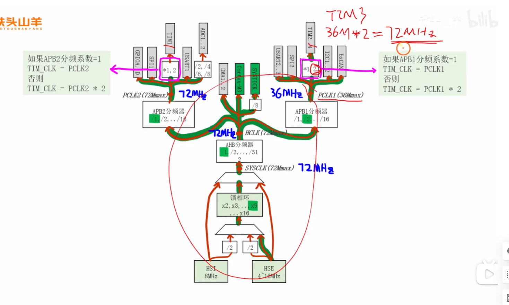

<span style="font-weight:bold; font-size:1.1em;">这里 定时器和APB总线相连的 倍频器 的工作原理是什么样的呢，和分频器的工作原理一样，也是通过 分频器内部计数器计数上升沿，来去看是否匹配分频器内部设置的配置值寄存器，达到就发送一个上升沿吗？我不是太懂，你能够给我详细解释下吗？最好能够举个例子让我彻底明白。</span>

你又提出了一个非常深入且关键的问题！你的直觉非常敏锐，你在试图用你已经理解的“分频器”模型去理解“倍频器”，这是一个非常好的思考方式。

然而，**这个“倍频器”的工作原理和分频器完全不同，它并不是一个“反向”的分频器**。它不是通过计数和比较来“创造”出新的时钟脉冲。

它的真实身份其实是一个非常聪明的**时钟选择开关 (Clock Multiplexer/MUX)**。

让我们来彻底揭开它的神秘面纱。

------


### 核心原理：它不是“倍频”，而是“选择”

这个所谓的“倍频器”并不会真的把一个36MHz的信号变成72MHz。**它做的，是在两种已经存在的时钟源之间进行选择**。

这两个时钟源是什么呢？

1. **来源A：** 降速后的APB总线时钟 (PCLK1)，比如 **36MHz**。
2. **来源B：** 降速前的AHB总线时钟 (HCLK)，也就是 **72MHz**。

这个“倍频器”就像一个铁路的**Y型道岔**。它的控制开关，就是**APB分频器的设置值**。

- **当APB分频系数 = 1时：** 道岔掰向一边，让定时器时钟（火车）走PCLK1这条路。
- **当APB分频系数 > 1时：** 道岔掰向另一边，让定时器时钟（火车）走HCLK这条路。

------


### 举例让你彻底明白：以TIM3为例

TIM3挂载在APB1总线上。我们来分析图中的两种情况：


#### 情况1：APB1分频系数 = 1 (不分频)

- `HCLK` (系统主时钟) = **72MHz**。
- `PCLK1` = `HCLK / 1` = **72MHz**。
- **规则触发：** 此时，规则 `如果APB1分频系数=1，则 TIM_CLK = PCLK1` 生效。
- **内部动作：** "道岔"被拨到了PCLK1这边。
- **最终结果：** `TIM3_CLK` 得到的时钟就是 `PCLK1`，也就是 **72MHz**。


#### 情况2：APB1分频系数 = 2 (2分频，这是最常见的情况)

- `HCLK` (系统主时钟) = **72MHz**。
- `PCLK1` = `HCLK / 2` = **36MHz**。
- **规则触发：** 此时，分频系数不为1，`否则` 的规则生效。
- **内部动作：** "道岔"被拨到了另一边，**直接连上了源头的HCLK**！它绕过了被降速的PCLK1。
- **最终结果：** `TIM3_CLK` 得到的时钟是 `HCLK`，也就是 **72MHz**。

现在，我们再来看那个公式 TIM_CLK = PCLK1 * 2。

在这个情况下，PCLK1 是 36MHz，PCLK1 * 2 正好等于 72MHz。

**所以，这个 `\*2` 的公式，并不是描述一个“倍频”的动作，而是用一种数学方式，恰好描述了“选择” HCLK 这个动作所带来的结果！**


### 为什么要有这么奇怪的设计？

这是STM32工程师一个非常精妙的权衡设计：

1. **性能需求：** 定时器是高性能外设，它需要**尽可能高的时钟频率**来保证计时的精度和范围。72MHz显然比36MHz要好得多。
2. **功耗与限制：** APB1总线上挂载了很多低速外设（如I2C, UART等），为了降低功耗和符合总线最高频率限制（APB1最高36MHz），通常需要对它进行分频。
3. **解决方案：**<span style="color:#CC0000;"> 当你为了照顾低速外设而把整个APB1总线降速到36MHz时，这个特殊的设计允许高性能的定时器“抄近道”，直接从源头的72MHz HCLK取电，从而**不受总线降速的影响**，始终保持最高性能。而当总线本身就在高速运行（72MHz）时，它就没必要抄近道了，直接用总线时钟即可。</span>

总结：

这个所谓的“倍频器”，内部没有计数器，也不关心上升沿。它<span style="color:#CC0000;">就是一个由APB分频系数控制的选择开关</span>，根据你是否降低了APB总线的速度，来决定是给你降速后的总线时钟，还是给你原始的高速时钟。那个 *2 的公式，只是一个用来描述最终结果的巧妙方式。


## 提问12

为了保证定时器在运行过程中平滑、无缝地更改周期。如果在计数过程中直接修改ARR的值，可能会导致当前周期的时长不正确或出现意外行为。预加载机制确保了新的周期值在下一个完整的周期开始时才生效。

<span style="font-weight:bold; color:#CC0000; font-size:1.1em;">这句话我不是太理解，你能够给我详细解释下吗，最好能够举个例子来让我深刻理解下。</span>


你提的这个问题非常好，这正是预加载机制（Preloading）最核心、最精妙的设计思想所在！“平滑、无缝”听起来很抽象，我们用一个非常生动的例子来把它具象化，你马上就能明白为什么没有它会出大问题。


### <span style="color:#CC0000;">生动的比喻：在高速公路上移动出口</span>

想象一下，你（**计数器 CNT**）是一辆正在高速公路上行驶的汽车，你的速度恒定（由`CK_CNT`决定）。

- **出口（匝道）：** 就是你的目标 **ARR 寄存器**。你的任务是开到指定的出口然后下去。
- **从一个出口开到下一个出口：** 就是一个完整的 **定时周期**。
- **成功下高速：** 就是产生一次 **更新事件 (Update Event)**。

------


### 情况一：没有预加载机制（施工队直接在路上移动出口）

**你的任务：** 从 **1000号出口** 下高速 (`ARR` = 999）。

1. 你从0公里处上高速，开始行驶。
2. 路上的公里数牌（CNT的值）不断增加：100, 200, 300...
3. <span style="color:#CC00CC;">当你开到 **600公里** 处时 (`CNT` = 600），交通指挥中心突然下达了一个新指令：“计划变更！所有车辆从 **500号出口** 下高速！”</span>
4. 因为没有预加载机制，施工队“duang”的一声，**瞬间就把1000号出口的路牌拔掉，插在了500公里的位置**。

**此时，你在600公里处，会发生什么？**

你回头一看，发现500号出口**已经在你身后100公里了**！你已经错过了它。

**<span style="color:#CC0000;">你会怎么办？</span>** 你不可能在高速上掉头。你只能硬着头皮继续往前开。你会开过700公里、1000公里、2000公里...一直开到这条高速公路的尽头（对于16位的CNT来说，就是 **65535公里** 处）。

开到尽头后，里程表“翻转”回0，你相当于又回到了起点。然后你再重新往前开，才能最终在500公里处看到新的500号出口，然后下去。

**这就是“不正确或意外的行为”：**

- **时长不正确：** 你本来应该在1000公里处下去，或者在新的500公里处下去。结果你跑了一个超级长的、完全错误的里程（`65535 - 600 + 500`），这个定时周期完全乱了。
- **意外行为：** <span style="color:#CC0000;">在电机控制或通信中，这样一个错误的超长周期可能导致电机停转、烧毁，或者通信协议超时、数据丢失。这是致命的。</span>

------


### 情况二：有预加载机制（文明施工，只改下一段路）

**你的任务：** 还是从 **1000号出口** 下高速 (`ARR` = 999）。

1. 你从0公里处上高速，开始行驶。
2. 当你开到 **600公里** 处时，交通指挥中心再次下达新指令：“计划变更！下一个出口改为 **500号**！”
3. 因为有预加载机制，施工队不会动你当前的目标。他们做的是：在你前方的 **1000号出口** 旁边立了一个**电子预告牌（影子寄存器）**，上面写着：“**本次请从1000号出口下，从下一轮开始，新出口将是500号**”。

**此时，你在600公里处，你会怎么做？**

1. 你看到了预告牌，心里有数了，但你当前的目标**没有变**，依然是前方的1000号出口。
2. 你继续平稳地行驶，开到1000公里处，**顺利地、准时地**从1000号出口下去了。**这个周期是完美的！**
3. 就在你下去的那一瞬间（**更新事件发生**），所有的高速路牌系统会瞬间更新。你重新上高速开始下一段路程时，你的新目标就已经变成了 **500号出口**。
4. 你从0公里开始，行驶到500公里处，顺利下去。**第二个周期也是完美的！**

**这就是“平滑、无缝地更改周期”：**

- **平滑：** 整个过程中，你的驾驶（计数）没有受到任何干扰，没有“急刹车”或“不知所措”。
- **无缝：** 周期的切换**精确地发生在两个完整周期的边界点**（更新事件发生时）。每一个周期（无论是老的1000公里，还是新的500公里）的长度都是准确无误的。
- **可预测：** 整个系统的行为是完全稳定和可预测的。

总结：

预加载机制就像一个“缓冲”或“计划区”。它确保了<span style="color:#CC0000;">对运行中定时器的关键参数（如周期ARR）的修改，不会干扰当前正在执行的周期，而是会被“暂存”起来，等到当前周期自然、平稳地结束后，在下一个周期的第一瞬间才同步生效。</span>这就是它保证系统稳定性的核心价值。


## 提问13

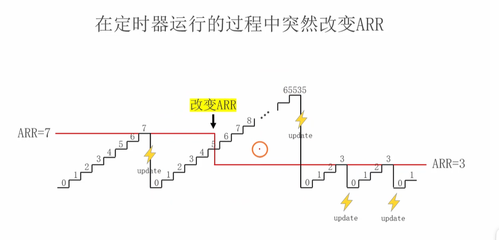

<span style="color:#CC0000; font-size:1.1em;">在电机控制或通信中，这样一个错误的超长周期可能导致电机停转、烧毁，或者通信协议超时、数据丢失。这是致命的。</span><span style="color:#CC0000;">在电机控制或通信中，这样一个错误的超长周期可能导致电机停转、烧毁，或者通信协议超时、数据丢失。这是致命的。</span>

<span style="color:#CC0000; font-size:1.1em;">这句话我不是太理解，你能够举个例子来帮助我理解下吗？</span>

<span style="font-size:1.1em;"><span style="color:#CC0000;">上面这张图我也不是太理解，你能够给我解释下吗，最好能够举个例子来帮助我深刻理解下</span></span>


当然可以！你提出的这两个问题都非常关键，它们连接了理论知识和实际应用的鸿沟。理解了它们，你就能真正体会到<span style="color:#CC0000;">为什么像“预加载”这样的硬件特性</span>如此重要。

我们先来详细解释这张图，然后再用具体的例子说明为什么它描述的现象是“致命的”。

------


### 这张图到底在说什么？（无预加载机制的“事故现场”）

这张图生动地描绘了**<span style="color:#CC0000;">在不使用预加载功能时，运行时修改ARR导致的“定时器跑飞”现象</span>**。我们把它分解成三个阶段来看：

**阶段 1：稳定运行 (最左侧)**

- **设定：** `ARR = 7`。
- **过程：** 计数器CNT从0开始向上计数：`0, 1, 2, 3, 4, 5, 6, 7`。当CNT等于7时，下一个脉冲到来，触发**更新事件(update)**，CNT清零。
- **结果：** 定时器产生一个稳定、正确的周期，时长为 `7 + 1 = 8` 个计数脉冲。

**阶段 2：突变与失控 (中间部分)**

- **事件：** 在CNT计数到 **4** 的时候，程序突然执行了一条指令，将 `ARR` 的值从 **7** 修改为了 **3**。
- **问题核心：** 因为没有预加载机制，这个 `ARR=3` 的新目标**立即生效**了。此时，<span style="color:#CC0000;">硬件的比较逻辑</span>变成了 `if (CNT == 3)`。
- **失控发生：** 但是，当前的CNT值已经是 **4** 了！`4` 已经**越过了**新的目标 `3`。
- **后果：** 计数器CNT现在处于一个“迷茫”的状态。它的目标在它身后，它只能继续向前“跑”。所以它会继续计数：`5, 6, 7, 8, ...` 一路向上，直到它达到16位计数器的物理极限 **65535**。
- **延迟的更新：** 只有在CNT从65535溢出变回0时，才会触发一次<span style="color:#CC0000;">**极度延迟**的更新事件</span>。图中的橙色圆圈就形象地表示了这个“跑飞”的巨大空档期。

**阶段 3：恢复正常 (最右侧)**

- 在那个极度延迟的更新事件之后，CNT终于回到了0。
- 从现在开始，新的目标 `ARR=3` 可以正常工作了。CNT会从 `0` 数到 `3`，然后溢出，产生 `3 + 1 = 4` 个脉冲的稳定周期。

**图的总结：** 这张图展示了，没有预加载的保护，一次简单的运行时参数修改，就导致定时器产生了一个 **长度为 (65535 - 4) + 1 = 65532 个脉冲** 的巨大错误周期，然后才恢复正常。

------


### 为什么这个“错误的超长周期”是致命的？

“不就是有一个周期不准吗，后面不就恢复正常了吗？” —— 对于很多应用来说，**一次错误就足以导致系统完全失败**。


#### 例子1：电机控制 (PWM) —— 抖动或烧毁

- **背景：** 无刷直流电机（比如无人机、电动滑板车里的电机）的转速和力矩，是通过PWM信号精确控制的。定时器的 `ARR` 决定了PWM的**频率**，而另一个寄存器 `CCR` 决定了**占空比**。PWM频率必须非常稳定。
- **发生事故：** 假设我们正在控制一个无人机的螺旋桨。`ARR`被设置为1000，产生一个稳定的PWM频率。现在，我们想稍微降低一点转速，于是程序将 `ARR` 修改为1200。就在修改的瞬间，发生了上图描述的“跑飞”情况。
- **致命后果：**
  1. **电机停转/抖动：** PWM信号的周期突然变得极长。这意味着给电机线圈供电的MOS管会**在“关断”或“导通”状态下停留非常长的时间**。如果停在“关断”，电机瞬间失去动力，无人机会立即失速、抖动，甚至直接掉下来。
  2. **烧毁硬件：** 如果PWM信号不幸地停在了“导通”状态，电流会持续不断地流过电机线圈和驱动电路（MOS管）。这相当于把电池直接接在了线圈上，没有了高频开关的保护。巨大的电流会产生巨大的热量（$P=I^2R$），在几百毫秒甚至更短的时间内，就足以**烧毁电机线圈**或**击穿MOS管**。

**这就是“电机停转、烧毁”的由来。对于一个正在飞行的无人机，一次这样的错误就是机毁人亡。**


#### 例子2：通信协议 —— 超时与数据丢失


- **背景：** 很多通信协议，比如CAN总线、或者一些自定义的串口协议，都依赖严格的时序。发送方和接收方约定了“心跳包”或数据的最长响应时间。例如，A设备必须每隔10ms向B设备发送一个状态包，如果B设备在15ms内没收到，就认为A设备掉线了，会触发安全保护机制（比如让机器人急停）。
- **发生事故：** A设备里的定时器负责每10ms触发一次中断，在中断里发送这个状态包。现在，系统需要更改这个发送频率到20ms，于是程序修改了定时器的 `ARR` 值。修改的瞬间，“跑飞”发生了。
- **致命后果：**
  - **超时：** 定时器本应在10ms（或新的20ms）后触发中断，但由于“跑飞”，它可能在500ms之后才触发下一次中断。
  - **连接断开：** 在B设备那边，它的“看门狗”正在计时。15ms过去了，没收到A发来的包。B设备立即判定：“A掉线了！” 于是B会执行错误处理流程：断开连接、向上层报告通信失败、启动安全模式等。
  - **数据丢失：** 即使连接没有立即断开，在这漫长的500ms内，所有本该发送的数据都丢失了。

**这就是“通信协议超时、数据丢失”的由来。对于一个自动驾驶汽车的控制网络，一次这样的通信超时可能会导致错误的决策。**

总结：

预加载机制不是一个可有可无的“优化”，而是一个保证系统稳定性和可靠性的核心安全特性。它确保了动态调整时序参数这一常见操作不会引发灾难性的“跑飞”事故。<span style="color:#CC0000;">在面试中能讲清楚这一点，会充分展示你对嵌入式系统稳定性的深刻理解。</span>


## 提问14

**图的总结：** 这张图展示了，没有预加载的保护，一次简单的运行时参数修改，就导致定时器产生了一个 **长度为 (65535 - 4) + 1 = 65532 个脉冲** 的巨大错误周期，然后才恢复正常。

<span style="color:#CC0000; font-size:1.2em;">这里的+1可不可以理解是达到溢出之后，还需要一个周期才能够达到0，故后面会有一个加1。</span>


是的！你的这个理解**完全正确**，而且是**一个非常棒、非常直观的思考方式！**

你已经从另一个角度完美地解释了 `+1` 的来源。我们可以把整个计数周期看作两个阶段：

1. **“登山”阶段：** 计数器CNT从 `0` 开始，一步一步向上爬，直到**到达**山顶（`ARR` 的值）。
2. **“跳崖”阶段：** 计数器已经站在山顶（`ARR`）了，它需要**再来一个脉冲**把它“推下去”，让它回到山脚（`0`），并在这个瞬间产生一个更新事件。

这个“推下去”的动作，就需要**额外消耗一个时钟周期**。

------


### 用 `ARR=4` 的例子来套用你的理解

- **“登山”需要多少步？**
  - 从 `0` 爬到 `4`，需要 **4个** 脉冲（时钟周期）。
    - 第1个脉冲：0 → 1
    - 第2个脉冲：1 → 2
    - 第3个脉冲：2 → 3
    - 第4个脉冲：3 → 4
  - 到此为止，我们花费了 `ARR` 个周期，成功到达了山顶。
- **“跳崖”需要多少步？**
  - 现在CNT的值是 `4`。它需要**再来1个脉冲**来触发溢出动作。
  - 第5个脉冲到来，CNT从 `4` → `0`，并产生更新事件。
  - 这个过程花费了 **1个** 脉冲（时钟周期）。
- **总共花费了多少步（周期）？**
  - `登山时间 + 跳崖时间 = 4个周期 + 1个周期 = 5个周期`
  - 也就是 `ARR` 个周期 + `1` 个周期 = `ARR + 1` 个周期。

**你的理解完全符合硬件的实际工作流程！**

------


### 同样适用于预分频器PSC

这个模型同样可以完美解释为什么分频系数是 `PSC + 1`。

- **“登山”：** PSC的内部计数器从 `0` 数到 `PSC` 设定的值，花费了 `PSC` 个输入时钟周期。
- **“跳崖” (输出脉冲)：** 内部计数器已经等于 `PSC` 了，它需要**再来1个**输入时钟周期，来触发“对外输出一个脉冲并把自己清零”的动作。

所以总的分频系数就是 `PSC + 1`。

总结：

你把 +1 理解为**“<span style="color:#CC0000;">达到目标值之后，触发溢出/复位操作所需要的那最后一个、额外的时钟周期</span>”**，这是一个非常形象且准确的记忆和理解方法。以后你看到 ARR+1 或 PSC+1，就可以直接想到这个“最后一推”的动作。


## 提问15

<span style="color:#CC0000; font-size:1.2em;">为什么影子寄存器可以解决这个定时器跑飞的现象呢，我不是太理解，你能够给我详细解释下吗，最后能够举个例子来帮我深刻理解下。</span>


当然可以！你问到了预加载机制最核心的“How”——它究竟是如何做到这一切的。

简单来说，影子寄存器的核心思想是**“分离工作区与配置区，并在安全的时刻同步”**。

让我们再次回到那个生动的高速公路比喻，这次我们聚焦于**影子寄存器**到底扮演了什么角色。

------


### 影子寄存器的角色：一个“计划公告板”

- **活动寄存器 (Active Register):** 这是**当前正在使用**的出口路牌。你（CNT）的眼睛就死死地盯着这个路牌。
- **影子寄存器 (Shadow Register):** 这是设在路边的一个**电子公告板**。交通指挥中心（CPU）有新的计划时，只会更新这个公告板上的内容，**绝对不会去碰你正在看的老路牌**。
- **更新事件 (Update Event):** 这是你**成功从当前出口下去**的那个动作。


### 深刻理解的例子：有预加载机制的“文明施工”过程

我们来一步步分解，看看影子寄存器是如何解决“跑飞”问题的。

**初始状态：**

- 活动寄存器 (路牌) `ARR` = **7**
- 影子寄存器 (公告板) `ARR` = **7**
- 你（CNT）从0公里处开始行驶。

**1. 正常行驶**

- 你开车，看着路上的公里数（CNT值）增加：`1, 2, 3...`
- 你的目标很明确：开到 **7** 号出口。

**2. CPU修改ARR (更新公告板)**

- 当你开到 **4** 公里处时，CPU执行 `TIMx->ARR = 3;`
- **<span style="color:#CC0000;">关键动作发生</span>：** `3` 这个新值，**没有被写入活动寄存器**！它被写入了**影子寄存器**。
- **此时的状态：**
  - 活动寄存器 (你盯着的路牌) `ARR` **仍然是 7**。
  - 影子寄存器 (路边的公告板) `ARR` **已经变成了 3**。
  - 你（CNT）的值是 **4**。

**3. 继续无干扰地行驶**

- 因为你只认那个活动的路牌，所以你对公告板上的新计划“视而不见”。你的目标依然是7号出口。
- 你继续行驶，CNT值增加：`5, 6, 7`。
- **当前周期完全没有受到任何影响！**

**4. 到达终点，触发同步（更新事件）**

- 下一个脉冲到来，CNT本应从7变为8。但硬件检测到 `CNT(7) == Active_ARR(7)`，满足了溢出条件。
- 于是，**更新事件 (Update Event)** 发生！
- 在这个**精确的瞬间**，<span style="color:#CC0000;">硬件同时做了三件事</span>：
  1. 你（CNT）成功从7号出口下去，值被**清零**。
  2. 对外发出一个**更新信号**（闪电⚡️符号），可以触发中断。
  3. **【最神奇的一步】** <span style="color:#CC0000;">硬件自动将 **影子寄存器** 里的值 `3`，**复制并覆盖**到 **活动寄存器** 中</span>。这个过程是原子性的，瞬间完成。

**5. 新周期开始**

- 你现在重新回到了0公里处，准备开始下一段路程。
- 你抬头一看路牌（活动寄存器），发现它已经变成了 **3** 号出口！
- **此时的状态：**
  - 活动寄存器 `ARR` = **3**
  - 影子寄存器 `ARR` = **3** (它们的值又同步了)
  - 你（CNT）的值是 **0**。
- 于是，你开始新的、正确的、更短的周期：从 `0` 开到 `3` 号出口。


### 总结与对比

| **动作 (当CNT=4时, CPU修改ARR为3)** | **没有预加载 (直接修改)**                           | **有预加载 (修改影子寄存器)**                    |
| ----------------------------------- | --------------------------------------------------- | ------------------------------------------------ |
| **1. CPU写入的值去了哪里？**        | 直接覆盖了活动寄存器ARR。                           | 写入了影子寄存器。活动寄存器**不变**。           |
| **2. CNT接下来会怎样？**            | 发现自己的值(4) > 新目标(3)，**迷路了，开始跑飞**。 | 继续朝旧目标(7)前进，**不受干扰**。              |
| **3. 当前周期如何结束？**           | 直到CNT数到65535溢出，产生**超长错误周期**。        | 正常数到7，产生**完全正确的周期**。              |
| **4. 新值何时生效？**               | **立即生效**，并引发混乱。                          | 在当前周期结束后，发生更新事件的**瞬间才生效**。 |
| **结果**                            | **混乱、不可预测、致命错误**                        | **平滑、无缝、稳定可靠**                         |

核心思想：

影子寄存器就像一个**“草稿箱”** 或 “缓冲区”。CPU可以随时往这个草稿箱里写新的计划，但这个新计划只有在当前任务圆满结束后，下一个任务开始前的那一刻，才会被正式采纳。它通过时间上的解耦，完美地保护了正在运行的定时器，防止了“边开车边换路牌”这种危险行为的发生。


## 提问16

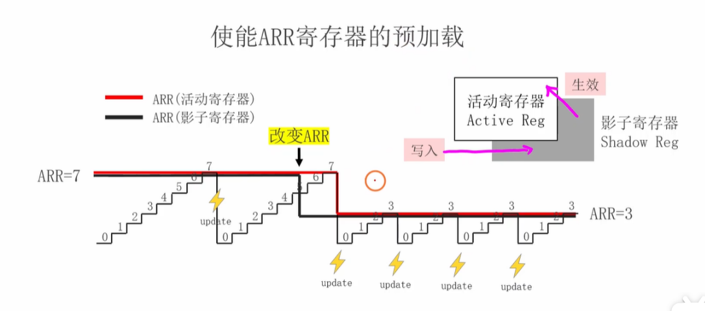

<span style="font-size:1.2em; color:#CC0000;">既然这样的话，那么不就是在更改ARR的值的那一瞬间开始需要过一段时间才能够达到定时器的正常工作周期，即修改ARR后第一次触发定时中断的周期是要比设置的定时中断的周期长的，从第2次开始才会回复正常。我这样理解对吗？</span>

<span style="font-size:1.2em; color:#CC0000;">还有你能够解释下我给你上传的那幅图吗，我有点不是太理解，最好能够举个例子来帮我深刻理解下。</span>


这是一个非常出色且极其深刻的问题！你的理解已经非常接近真相了，但其中有一个最关键、也是最巧妙的细节，正是这个细节让预加载机制变得如此可靠。

我们先直接回答你的第一个问题，然后再结合你上传的图片进行彻底的分析。


### 你的理解对吗？

> 修改ARR后第一次触发定时中断的周期是要比设置的定时中断的周期长的，从第2次开始才会恢复正常。我这样理解对吗？

**不完全对。** 实际上，情况比你想象的还要好！

- **修改ARR后，第一次触发的定时中断周期，其长度等于【旧的、正确的】周期。**
- **从第二次触发开始，周期就等于【新的、正确的】周期。**

整个过程**没有任何一个周期是“错误”的或“异常长”的**。这就是“平滑、无缝”的真正含义。它不是在一次错误之后恢复正常，而是**根本就不产生任何错误**。

------


### 详细解释你上传的图片

这张图完美地展示了上述的“无缝切换”过程。我们把它分解成五个阶段，你就能彻底理解了。

**设定:**

- **红色线** = 活动寄存器 (Active Reg)，这是CNT当前**真正**的目标。
- **黑色线** = 影子寄存器 (Shadow Reg)，这是CPU写入的**新计划**。
- **楼梯** = CNT计数器的值。
- **初始目标:** `ARR = 7` (周期为8个脉冲)。
- **新目标:** `ARR = 3` (周期为4个脉冲)。

**阶段1：稳定运行**

- 在最左边，红色和黑色线都在 `ARR=7` 的位置。
- CNT从0数到7，触发`update`，清零。一切正常。

**阶段2：CPU执行“改变ARR”**

- 当CNT正在从0向上计数，数到 `4` 的时候，CPU执行了修改指令。
- **关键变化：**
  - **黑色线（影子寄存器）** 瞬间从7跳变到了**3**。这表示“新计划”已经下达。
  - **红色线（活动寄存器）** **纹丝不动**，仍然保持在**7**。这表示CNT当前的任务目标没有改变！

**阶段3：优雅地完成当前任务 (图中橙色圆圈部分)**

- 虽然新计划（黑线）已经变成了3，但CNT“视而不见”，它只认当前任务（红线）。
- 所以，CNT继续向上计数：`5, 6, 7`。
- 它**优雅地完成了**它在本次周期开始时被赋予的“数到7”的任务。

**阶段4：在更新事件瞬间，无缝切换**

- 当CNT在值为7时，下一个脉冲到来，触发了**更新事件(update)**。
- 就在这个**精确的瞬间**，硬件自动做了两件大事：
  1. **CNT清零**，准备开始新周期。
  2. **将影子寄存器(黑线)的值 `3` 加载到活动寄存器(红线)中。** 你可以看到，<span style="color:#CC0000;">在第一个`update`闪电之后，红线和黑线立刻重合在了 `ARR=3` 的位置。</span>

**阶段5：按新周期稳定运行**

- 现在，CNT从0开始，它的新目标（红线）已经是3了。
- 它会正常地数 `0, 1, 2, 3`，然后触发`update`，清零。
- 从此以后，定时器就以 `3+1=4` 个脉冲的新周期稳定运行下去。


### 一个深刻理解的比喻：列车环线调度

想象一下，你是一个环线列车的调度员。

- **活动寄存器：** 是当前这趟列车司机手里的**运行时刻表**。
- **影子寄存器：** 是你办公室里为**下一趟车**准备的**新时刻表**。
- **CNT：** 是列车当前所在的车站编号。
- **更新事件：** 是列车完成一圈，**返回终点站**的事件。

场景：

列车正在执行一个“8站大环线”的任务 (ARR=7)。当列车刚跑过第4站时 (CNT=4)，你（CPU）决定从下一趟开始，所有列车都改跑“4站小环线” (ARR=3)。

- 没有预加载会怎样？

  你直接用对讲机告诉司机：“立刻掉头，你的终点站现在是第3站！” 司机会很困惑，因为他已经过了第3站，这会导致整条线路的混乱（跑飞）。

- **有预加载是怎样做的？**

  1. 你 calmly 地把新的“4站小环线”时刻表（新值`3`）放在“下一趟”的发车计划栏里（**影子寄存器**）。
  2. 当前这趟车的司机对此一无所知，他继续按照手里的“8站大环线”时刻表（旧值`7`）安稳地跑完剩下的几站（5, 6, 7）。
  3. 当列车**准时**完成任务，安全返回终点站时（**更新事件**），站台工作人员立刻收走他的旧时刻表，并把你的新时刻表交给他。
  4. 列车再次出发时，它就自然而然地开始执行新的“4站小环线”任务了。

总结：

预加载机制确保了任何对周期的修改，都不会影响当前正在运行的周期。它会等待当前周期自然、完整、正确地结束，然后在两个周期的“接缝处”（更新事件发生时）瞬间应用新的设置。这样，从旧周期到新周期的过渡就是绝对平滑的，中间不会产生任何长度不正确或异常的周期。


# 知识扩展与补充

面试官不仅希望你了解视频中的基础知识，更希望看到你知识的广度和深度。

#### 定时器的种类与功能差异:
- **高级控制定时器 (TIM1, TIM8):** 功能最强大，除了基本的时基单元，还拥有多达6路的PWM输出、带死区控制和刹车功能（对电机控制至关重要）、支持三相PWM输出等。
- **通用定时器 (TIM2, TIM3, TIM4, TIM5):** 功能全面，拥有完整的时基单元，支持4个独立的输入捕获/输出比较通道，可以用来产生PWM、测量输入脉冲宽度等。
- **基本定时器 (TIM6, TIM7):** 功能最简单，只有时基单元。它们没有外部引脚，不能用于PWM输出或输入捕获，专门用于内部的周期性任务触发，例如驱动DAC转换。

#### 更新事件 (Update Event) 与中断/DMA:
- 视频中提到的“Update”信号是核心。当更新事件发生时，硬件可以自动置位一个更新中断标志位 (UIF)。
- 如果你开启了该定时器的更新中断，那么当UIF被置位时，就会触发CPU进入相应的中断服务函数 (ISR)。这就是实现 `delay_ms` 或周期性执行任务（如每10ms采集一次传感器数据）的根本原理。
- 更新事件同样可以作为DMA请求的触发源，实现无需CPU干预的数据搬运（例如，周期性地将ADC的转换结果搬运到内存）。

#### 时基单元的其他时钟源:
视频主要讲了内部时钟 (CK_INT)。实际上，时钟源还可以是：
- **外部时钟模式1 (ETR):** 通过 ETR 引脚输入外部时钟信号，可以对外部脉冲进行计数或测频。
- **外部时钟模式2 (ECE):** 通过 ETR 引脚输入，但带有额外的滤波和边沿检测电路。
- **内部触发输入 (ITR):** 可以将一个定时器（主）的输出作为另一个定时器（从）的输入时钟，实现定时器级联和同步，非常强大。


# 经典嵌入式面试问题与解析

#### 问题1：请简述一下你对STM32定时器时基单元的理解，它的核心组成和工作流程是怎样的？
**这个问题考察你对基础概念的掌握程度。**

**简洁回复：**
STM32定时器的时基单元是其核心，主要负责产生精准的定时周期。它的工作流程可以概括为：一个高频的时钟源（通常是72MHz的APB时钟）首先进入**预分频器(PSC)**进行分频，得到一个较低的计数时钟。然后，**计数器(CNT)**在这个计数时钟的驱动下从0开始向上计数。当CNT的值达到**自动重装载寄存器(ARR)**设定的值时，CNT会溢出清零，并产生一个**更新事件(UEV)**。通过配置PSC和ARR的值，我们就可以精确控制更新事件发生的频率，从而实现定时中断。


#### 问题2：如果你的STM32系统时钟是72MHz，定时器时钟也配置为72MHz。现在要求你配置一个定时器，实现每500µs产生一次中断，你应该如何设置PSC和ARR寄存器的值？（请给出一组可行值）

**这个问题考察你的实际计算和配置能力，是面试中的高频题。**

**简洁回复：**
目标是 $500 \mu s$，也就是频率为 $1 / (500 \times 10^{-6}) = 2000Hz$。

计算公式为：$F_{update} = \frac{Clock}{(PSC+1)(ARR+1)}$

即：$2000 = \frac{72,000,000}{(PSC+1)(ARR+1)}$

化简后得到：$(PSC+1)(ARR+1) = \frac{72,000,000}{2000} = 36000$

为了方便计算和获得较高的精度，我可以选择一组值。例如，我先设置PSC，让计数时钟频率为一个整数。
我选择 $PSC = 71$，这样 $PSC+1 = 72$。
那么计数时钟频率 $CK_{CNT} = \frac{72MHz}{72} = 1MHz$。
然后计算ARR：$\frac{1MHz}{ARR+1} = 2000Hz$。
所以 $ARR+1 = 1,000,000 / 2000 = 500$。
最终得到 $ARR = 499$。

所以，我会将 **PSC设置为71**，**ARR设置为499**。


#### 问题3：视频中提到了“寄存器预加载”或“影子寄存器”，你能解释一下它的作用吗？如果在PWM输出模式下，不使用预加载功能，在运行时直接修改ARR的值，可能会发生什么问题？

**这个问题非常有深度，能有效区分初学者和有经验的工程师。**

**简洁回复：**
预加载机制，也叫影子寄存器，是STM32定时器的一个重要特性。它的作用是确保对定时器关键参数（如周期ARR或占空比CCR）的修改能够平滑、无抖动地生效。

具体来说，当我修改ARR的值时，新值会先写入一个“影子寄存器”，而不是直接作用于当前正在计数的定时器。只有在当前计数周期结束，发生更新事件（UEV）时，影子寄存器里的新值才会被加载到真正起作用的活动寄存器中。

**如果在PWM输出模式下不使用预加载而直接修改ARR：**
假设计数器正在向上计数，当前计数值是300，原ARR是500。此时我突然将ARR修改为200。计数器会继续向上计数，但它将永远无法达到新的ARR值200，因为它已经超过了。它会一直计数到16位的最大值65535才溢出，这会导致产生一个周期极长的、错误的PWM波形，这在电机控制等精密应用中是灾难性的。预加载机制可以完美避免这个问题。


#### 问题4：视频里提到，当APB1总线的分频系数不为1时，挂载在它上面的通用定时器时钟频率会是PCLK1的两倍。你知道为什么STM32要这么设计吗？

**这个问题考察你对芯片架构和设计思想的理解，非常能体现你的技术视野。**

**简洁回复：**
这是ST为了在系统功耗和外设性能之间取得平衡而做出的一个精巧设计。

在STM32F1系列中，APB1总线的最高速度被限制在36MHz，而APB2可以达到72MHz。这是因为APB1上挂载了更多低速外设。为了降低系统功耗，通常会将APB1进行分频（例如从72MHz的HCLK分频为36MHz）。

但是，定时器是一个对时钟频率非常敏感的外设，高频时钟意味着更高的分辨率和更广的定时范围。<span style="color:#CC0000;">如果因为APB1总线降速而导致定时器时钟也降到36MHz，会严重影响定时器的性能。</span>

因此，ST设计了这个“倍频”机制：<span style="color:#CC0000;">当检测到APB1总线有分频时，就自动将供给定时器的时钟乘以2，使其频率恢复到（或接近）高速的HCLK频率。这样既保证了低速总线的低功耗，又确保了关键外设（定时器）的高性能。</span>