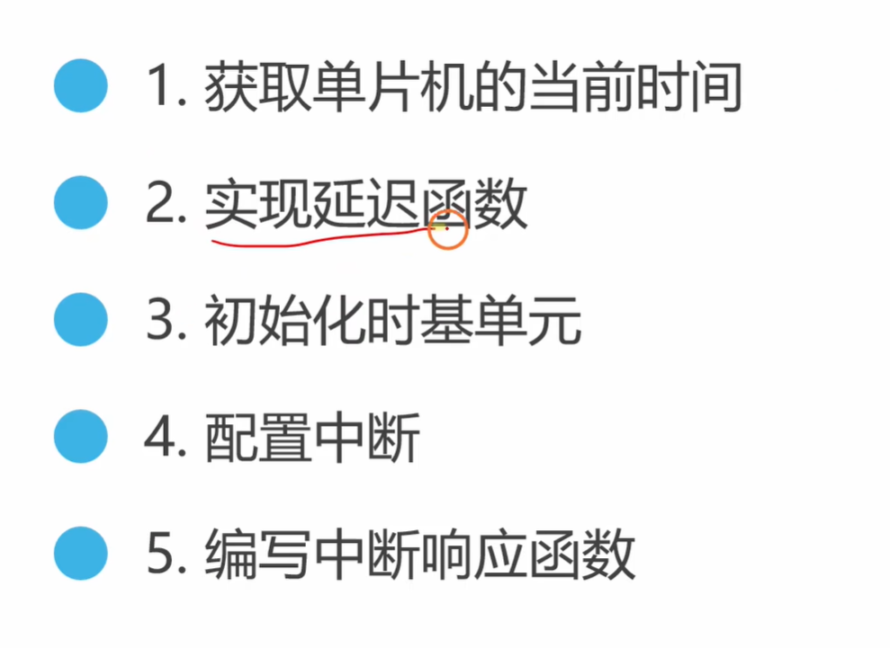
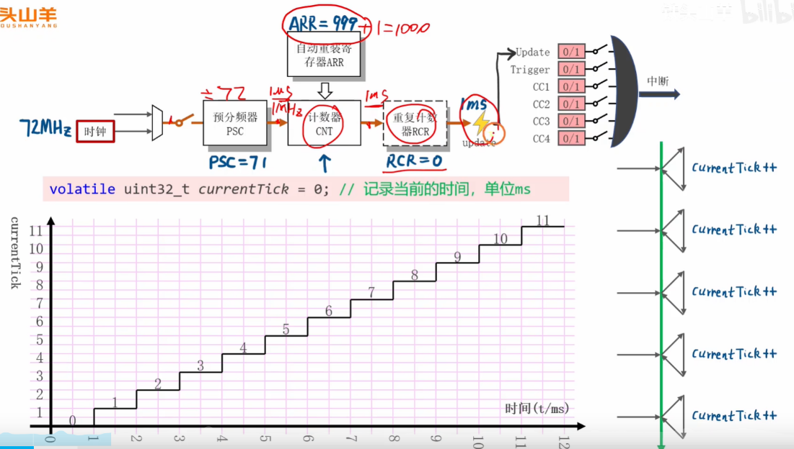
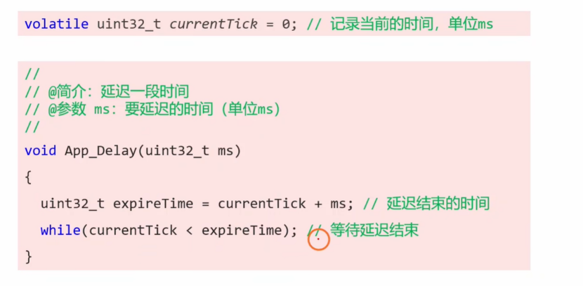
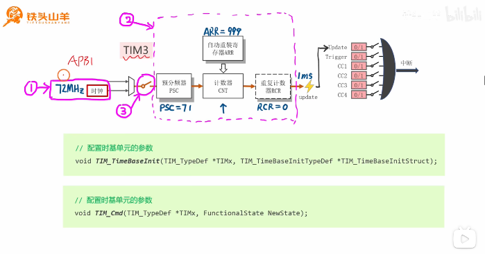
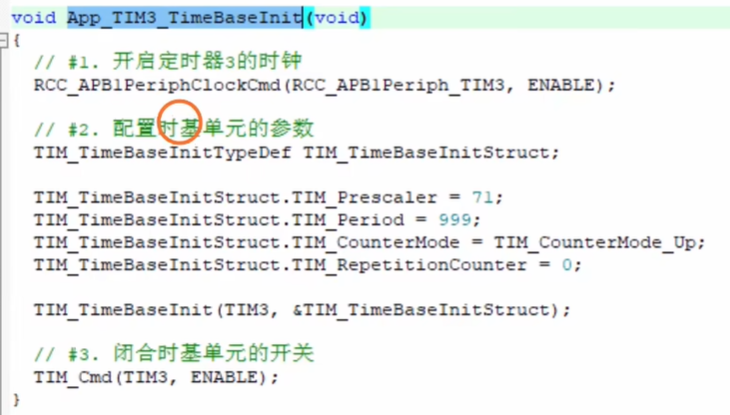
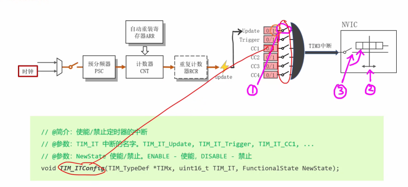
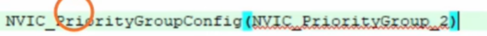
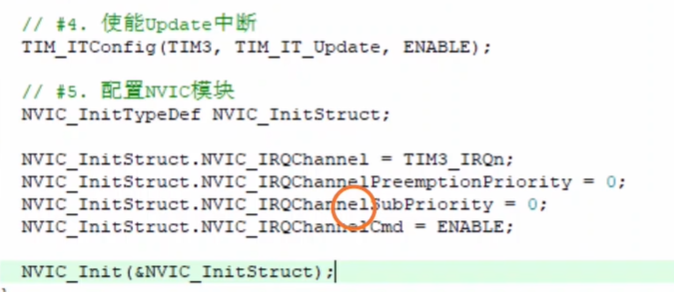
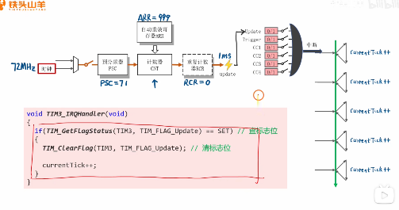
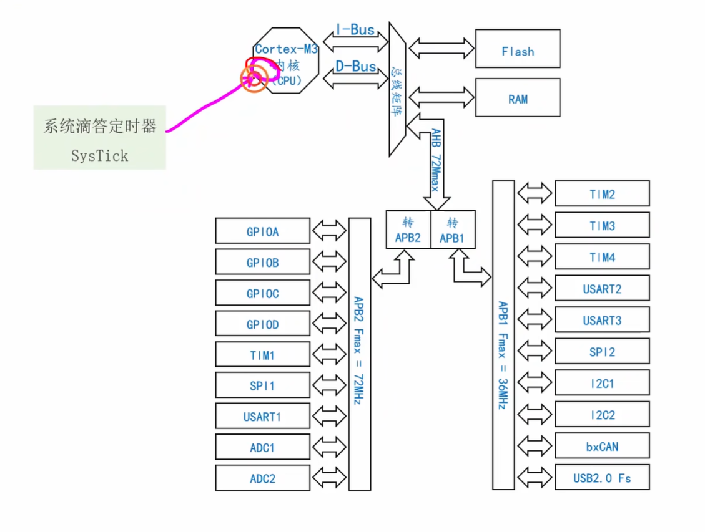

好的，这个视频是一个非常经典和基础的 STM32 入门教程，讲解了<span style="color:#CC0000;">如何利用通用定时器（TIM）和中断来创建一个自定义的毫秒级延迟函数。</span>这对于嵌入式开发来说是一项基本功。

下面我将为你详细分析视频内容，进行扩展补充，并提供一系列针对性的面试问题及答案。

------




# 一、视频内容分析

这个视频的核心内容是放弃了依赖内核的 SysTick 定时器，转而使用 STM32 芯片上的通用定时器（以 TIM3 为例）来实现一个精准的 `delay_ms` 功能。

**核心实现思路：**

1. **配置定时器产生 1ms 中断：**

   

   - **时钟源：** 定时器时钟为 72MHz。
   - **预分频器 (PSC - Prescaler)：** 设置为 `71`。定时器时钟频率变为 `72MHz / (71 + 1) = 1MHz`。
   - **自动重装载值 (ARR - Auto-Reload Register)：** 设置为 `999`。计数器从 0 计数到 999，共 1000 个数。
   - **中断周期计算：** 每次计数的时间是 `1 / 1MHz = 1µs`。计数 1000 次产生一次更新中断（Update Interrupt），总时间为 `1000 * 1µs = 1000µs = 1ms`。
   - **结论：** 通过以上配置，TIM3 每 1 毫秒会产生一次更新中断。

2. **创建全局“滴答”变量：**
   
   - 定义一个全局变量 `volatile uint32_t currentTick = 0;`。
   - `volatile` 关键字至关重要，它告诉编译器这个变量的值随时可能在当前代码上下文之外被改变（如此处在中断服务程序中被改变），因此每次访问它时都必须从内存中重新读取，不能使用寄存器中的缓存值，防止了编译器优化带来的错误。
   - 这个变量用来记录从程序开始运行以来经过的毫秒数。
   
3. **编写中断服务函数 (ISR)：**
   
   - 在 `TIM3_IRQHandler` 中，首先检查是否是更新中断标志位被触发。
   - 如果是，则清除中断标志位（**非常重要**，否则会无限次进入中断）。
   - 然后将全局变量 `currentTick` 的值加 1。
   
4. **实现 `App_Delay` 函数：**
   
   
   
   - 函数接收一个需要延迟的毫秒数 `ms` 作为参数。
   - 计算出延迟结束时的时间戳 `expireTime = currentTick + ms`。
   - 使用一个 `while` 循环，不断地检查当前时间 `currentTick` 是否小于 `expireTime`。只要小于，CPU 就在这个循环里空转，实现<span style="color:#CC0000;">阻塞式延迟</span>。

**总结：** 视频通过配置一个硬件定时器，<span style="color:#CC0000;">每毫秒触发一次中断</span>来<span style="color:#CC0000;">更新一个全局时间变量</span>，然后<span style="color:#CC0000;">通过“忙等待”（Busy-Waiting）这个时间变量的增长</span>来<span style="color:#CC0000;">实现延迟功能</span>。

------

# 自己补充理解：

<span style="font-weight:bold;">配置好PSC预分频器之后，其输出的 CK_CNT 会对应有一个频率，将这个频率取倒数求出一个时钟周期时间（如输出 1M Hz 对应的就是 $10^{(-6)} s$，对应 1 us）。此时配置ARR值，对应的定时周期就是 ( ARR + 1 ) * 1 us。</span>


# 完整实验代码部分

1. 初始化时基单元 void App_TIM3_TimeBaseInit(void) 函数





2. 毫秒级延时函数 App_Delay（uint_32_t ms ）

   

   3. 配置中断







4. 编写中断响应函数

   


好的，这是上面提供的 STM32 标准外设库（SPL）代码的中文注释版本。

**假设：**

- 你使用的是 STM32F103 系列微控制器。
- 系统时钟（`SYSCLK`）已配置为 72MHz。
- 板载 LED 连接到引脚 PC13（在“Blue Pill”板上很常见，通常是低电平点亮）。
- 你的项目中包含了 STM32F10x 标准外设库文件，并在你的 IDE（如 Keil MDK 或 IAR EW ARM）中正确配置。

**文件： `main.c`**

C

```c
#include "stm32f10x.h" // 包含STM32F10x系列的标准外设库头文件

// --- 全局变量 ---
// 全局的滴答计数器，由TIM3中断服务程序每毫秒更新一次
volatile uint32_t currentTick = 0;

// --- 函数原型声明 ---
void App_OnBoardLED_Init(void); // 板载LED初始化函数
void App_TIM3_TimeBaseInit(void); // TIM3时基单元初始化函数（用于产生1ms中断）
void App_Delay(uint32_t ms); // 毫秒级延时函数

// --- 主函数 ---
int main(void)
{
    // 配置NVIC抢占优先级分组（可选，但推荐做）
    // 第2组：2位用于抢占优先级，2位用于子优先级
    NVIC_PriorityGroupConfig(NVIC_PriorityGroup_2);

    // 初始化板载LED (PC13)
    App_OnBoardLED_Init();

    // 初始化TIM3以产生1ms中断
    App_TIM3_TimeBaseInit();

    while (1) // 主循环
    {
        // 简单的500ms闪烁
        GPIO_ResetBits(GPIOC, GPIO_Pin_13); // 点亮LED (PC13低电平点亮)
        App_Delay(500);                     // 延时500毫秒
        GPIO_SetBits(GPIOC, GPIO_Pin_13);   // 熄灭LED (PC13低电平点亮，所以设为高电平)
        App_Delay(500);                     // 延时500毫秒

        /* // 备选方案：两次短闪烁，一次长闪烁（匹配视频结尾演示）
        GPIO_ResetBits(GPIOC, GPIO_Pin_13); // 点亮
        App_Delay(50);                      // 延时50ms
        GPIO_SetBits(GPIOC, GPIO_Pin_13);   // 熄灭
        App_Delay(50);                      // 延时50ms

        GPIO_ResetBits(GPIOC, GPIO_Pin_13); // 点亮
        App_Delay(50);                      // 延时50ms
        GPIO_SetBits(GPIOC, GPIO_Pin_13);   // 熄灭
        App_Delay(500);                     // 长闪前暂停500ms（根据需要调整）

        GPIO_ResetBits(GPIOC, GPIO_Pin_13); // 点亮
        App_Delay(500);                     // 延时500ms
        GPIO_SetBits(GPIOC, GPIO_Pin_13);   // 熄灭
        App_Delay(500);                     // 暂停500ms
        */
    }
}

// --- 初始化函数 ---

/**
  * @brief  初始化板载LED (PC13)。
  * @param  无
  * @retval 无
  */
void App_OnBoardLED_Init(void)
{
    GPIO_InitTypeDef GPIO_InitStructure; // 定义GPIO初始化结构体

    // 1. 使能GPIOC端口的时钟
    RCC_APB2PeriphClockCmd(RCC_APB2Periph_GPIOC, ENABLE);

    // 2. 配置PC13为推挽输出模式
    GPIO_InitStructure.GPIO_Pin = GPIO_Pin_13;         // 选择引脚13
    GPIO_InitStructure.GPIO_Mode = GPIO_Mode_Out_PP; // 设置为推挽输出
    GPIO_InitStructure.GPIO_Speed = GPIO_Speed_2MHz; // 设置速度为2MHz（低速足够）
    GPIO_Init(GPIOC, &GPIO_InitStructure);           // 使用以上设置初始化GPIOC的引脚13

    // 3. 设置初始状态 (LED熄灭 - PC13通常低电平有效，所以设置为高电平)
    GPIO_SetBits(GPIOC, GPIO_Pin_13);
}

/**
  * @brief  初始化TIM3，使其每1毫秒产生一次中断。
  * @param  无
  * @retval 无
  */
void App_TIM3_TimeBaseInit(void)
{
    TIM_TimeBaseInitTypeDef TIM_TimeBaseStructure; // 定义定时器时基初始化结构体
    NVIC_InitTypeDef NVIC_InitStructure;          // 定义NVIC初始化结构体

    // 1. 使能TIM3的时钟 (TIM3挂载在APB1总线上)
    RCC_APB1PeriphClockCmd(RCC_APB1Periph_TIM3, ENABLE);

    // 2. 配置TIM3时基单元
    // 假设APB1时钟 = 72MHz (可能取决于你的时钟配置)
    // 定时器时钟 = 72MHz
    // 预分频器值 (Prescaler) = 71 => 计数器时钟 = 72MHz / (71 + 1) = 1MHz
    TIM_TimeBaseStructure.TIM_Prescaler = 71;
    // 自动重装载值 (Period) = 999 => 更新事件频率 = 1MHz / (999 + 1) = 1kHz => 周期为1ms
    TIM_TimeBaseStructure.TIM_Period = 999;
    TIM_TimeBaseStructure.TIM_CounterMode = TIM_CounterMode_Up; // 向上计数模式
    TIM_TimeBaseStructure.TIM_ClockDivision = TIM_CKD_DIV1;     // 时钟分频因子: 不分频
    TIM_TimeBaseStructure.TIM_RepetitionCounter = 0;            // 重复计数器: 不使用 (仅高级定时器需要)
    TIM_TimeBaseInit(TIM3, &TIM_TimeBaseStructure);             // 初始化TIM3时基单元

    // 3. 使能TIM3的更新中断
    TIM_ITConfig(TIM3, TIM_IT_Update, ENABLE);

    // 4. 清除TIM3更新中断标志位 (在使能中断前清除是个好习惯)
    TIM_ClearFlag(TIM3, TIM_FLAG_Update);

    // 5. 配置NVIC用于TIM3中断
    NVIC_InitStructure.NVIC_IRQChannel = TIM3_IRQn;             // 选择TIM3中断通道
    NVIC_InitStructure.NVIC_IRQChannelPreemptionPriority = 0;   // 设置抢占优先级 (0-3)
    NVIC_InitStructure.NVIC_IRQChannelSubPriority = 0;          // 设置子优先级 (0-3)
    NVIC_InitStructure.NVIC_IRQChannelCmd = ENABLE;             // 使能该中断通道
    NVIC_Init(&NVIC_InitStructure);                             // 初始化NVIC

    // 6. 使能TIM3计数器
    TIM_Cmd(TIM3, ENABLE);
}


// --- 延时函数 ---

/**
  * @brief  提供一个阻塞式的毫秒级延时。
  * @param  ms: 需要延时的毫秒数。
  * @retval 无
  * @note   此函数依赖于全局变量 currentTick 被TIM3中断服务程序每毫秒递增。
  * 警告：简单的比较在延时跨越 currentTick 的溢出周期（约49.7天）时容易出错。
  * 一个健壮的实现会使用差值比较：
  * while ((int32_t)(expireTime - currentTick) > 0);
  */
void App_Delay(uint32_t ms)
{
    uint32_t expireTime = currentTick + ms; // 计算延时结束时的时间戳
    // 忙等待循环：等待直到 currentTick 达到或超过 expireTime
    while (currentTick < expireTime);
    // 注意：这个简单的比较适用于远小于约24天的延时。
    // 对于非常长的延时或关键系统，应使用有符号差值方法。
}


// --- 中断服务程序 (ISR) ---

/**
  * @brief  此函数处理TIM3全局中断请求。
  * 根据TIM3的配置，它会每1毫秒被自动调用一次。
  * @param  无
  * @retval 无
  */
void TIM3_IRQHandler(void)
{
    // 检查TIM_IT_Update中断标志位是否被设置
    if (TIM_GetITStatus(TIM3, TIM_IT_Update) != RESET)
    {
        // 清除TIM_IT_Update中断挂起位
        // 重要：必须清除标志位，否则中断服务程序会立即再次触发
        TIM_ClearITPendingBit(TIM3, TIM_IT_Update);

        // 递增全局毫秒计数器
        currentTick++;
    }
}

/********************************************* 文件结束 ***********************/
```

**如何使用：**

1. **创建工程：** 在你的 IDE 中使用标准外设库模板为 STM32F103 创建一个工程。
2. **添加 SPL 源文件：** 确保你的工程包含了必要的 `.c` 文件（`stm32f10x_rcc.c`, `stm32f10x_gpio.c`, `stm32f10x_tim.c`, `misc.c`）。
3. **替换 `main.c`：** 将你的工程中 `main.c` 文件的内容替换为上面提供的代码。
4. **添加 `stm32f10x_it.c` 处理函数（如果需要）：** 确保你工程的中断向量表（通常在 `stm32f10x_it.c` 或启动文件中）正确地将 `TIM3_IRQHandler` 指向上面实现的函数。如果你有一个单独的 `stm32f10x_it.c` 文件，你可能需要将 `TIM3_IRQHandler` 函数添加到那里，并确保包含了必要的头文件或将 `currentTick` 声明为 `extern`。对于简单工程，直接放在 `main.c` 中（如上所示）通常是可行的。
5. **编译和下载：** 构建工程并将生成的文件下载到你的 STM32 开发板。

PC13 上的 LED 应该会以 1 秒的周期开始闪烁（亮 500 毫秒，灭 500 毫秒）。你也可以取消 `main` 函数中备选闪烁模式的注释，来匹配视频结尾的演示效果。


## 提问 5

<span style="font-size:1.2em;">单片机内核里面好像也有一个系统滴答定时器吧，这是个什么东西呢，不是已经有TIME1 2 3 4等这些定时器了吗，为什么还要有个这个东西呢，我不太懂，你能够给我详细解释下吗？还有RTOS的驱动也是通过这个系统滴答定时器吗，请给我详细解释下。</span>


你说得非常对！单片机内核（特指 ARM Cortex-M 系列内核，STM32 用的就是这个）里面确实有一个 **系统滴答定时器 (System Tick Timer, SysTick)**。这是一个非常重要且基础的部件。我们来详细解释一下：

**1. 什么是 SysTick 定时器？**

- **内核标配：** SysTick 不是像 TIM1, TIM2 这些由芯片制造商（如 ST）额外添加的外设，而是 ARM Cortex-M **内核本身就集成** 的一个标准组件。这意味着，只要是基于 Cortex-M 内核的单片机（无论哪个厂家生产的），几乎都有这个 SysTick 定时器。
- **简单灵活：** 它本质上是一个简单的 **24 位递减计数器**。你可以设置一个重装载值，让它从这个值开始向下计数。当计数到 0 时，它可以选择性地：
  - **产生中断：** 通知 CPU 时间到了。
  - **置位状态标志：** 可以通过查询标志位得知是否计数到 0。
  - **自动重新加载：** 自动从你设定的重装载值再次开始递减计数，实现周期性定时。
- **时钟源可选：** 它的时钟源通常可以选择是内核时钟 (FCLK) 或者是内核时钟经过 8 分频后的时钟 (HCLK/8)。

**2. 为什么有了 TIMx 还要 SysTick？**

这个问题问得很好，核心在于 **分工和标准化**：

- **标准化与可移植性 (最重要的原因！):**

  - SysTick 是 ARM Cortex-M 内核的标准部分。这意味着，为 SysTick 编写的代码（比如初始化、中断处理）在不同的 Cortex-M 芯片之间（例如从 STM32 换到 NXP LPC 或 TI Tiva）**高度可移植**。你几乎不需要修改代码。
  - 而 TIM1, TIM2 等通用定时器是芯片制造商（ST）添加的外设，它们的寄存器、功能细节、配置方式在不同厂商甚至 ST 自己的不同系列芯片之间都可能存在差异。为 TIMx 编写的代码移植性相对较差。

- **设计目的不同：**

  - **SysTick 的主要设计目的** 就是为 **操作系统 (OS)** 或需要 **精确周期性时基** 的简单应用提供一个 **标准、简单、可靠的“心跳”**（称为 "tick"）。它就像一个专门用来报时的简单闹钟。

  - **TIMx (通用/高级定时器)** 的设计目的是 **多功能、高灵活性**。它们可以做很多复杂的事情，比如：

    - **PWM 输出：** 控制电机、LED 亮度等。

    - **输入捕获：** 测量脉冲宽度、频率。

    - **输出比较：** 在特定时间点翻转 GPIO 电平。

    - **编码器接口：** 读取旋转编码器的位置。

    - **更长的计数位数：** 有些 TIM 是 16 位，有些是 32 位。

    - 联动功能： 定时器之间可以相互触发。

      它们就像功能强大的瑞士军刀或厨房多功能定时器。

- **资源专用性：**

  - SysTick 是一个专用的资源，专门用于系统时基。当你需要一个简单的周期性中断时，用 SysTick 不会占用宝贵的、可能需要用于 PWM 或输入捕获的 TIMx 资源。

- **配置简单：**

  - 相对于 TIMx 复杂的寄存器和配置选项，SysTick 的配置非常简单直接，只需要设置几个寄存器即可工作。

**简单来说：** SysTick 提供了一个 **跨平台兼容、配置简单、专门用于系统时间基准** 的定时器。而 TIMx 提供了 **功能更强大、数量更多但配置相对复杂、厂商相关的** 定时器资源，用于实现各种具体的外设定时任务。

**3. RTOS 的驱动是否通过 SysTick？**

**是的，绝大多数基于 Cortex-M 的 RTOS（实时操作系统）都强烈推荐并且默认使用 SysTick 定时器来产生操作系统的“时钟节拍”（OS Tick）。**

- **OS Tick 的作用：**
  - OS Tick 是 RTOS 的“心跳”。它是一个周期性的中断（比如每 1ms 或 10ms 发生一次）。
  - 每次 Tick 中断发生时，RTOS 内核会执行一些关键操作：
    - **更新系统时间：** 内核维护一个全局的时间计数器，用于各种延时、超时计算。
    - **处理延时任务：** 检查是否有任务的延时时间已到，如果到了就将任务从挂起状态转为就绪状态。
    - **处理超时事件：** 检查是否有任务等待信号量、消息队列等操作的时间已超时。
    - **时间片轮转调度：** 如果配置了基于时间片的轮转调度，内核会减少当前运行任务的时间片计数。如果时间片用完，就会触发任务切换，让下一个同优先级的就绪任务运行。
- **为什么 RTOS 偏爱 SysTick？**
  - **标准化：** RTOS 的目标之一就是能在多种硬件平台上运行。使用内核标准的 SysTick 可以大大简化 RTOS 的移植工作。开发者不需要为每一种芯片的特定定时器去修改 RTOS 内核的时钟节拍代码。
  - **简单可靠：** SysTick 功能单一，配置简单，不易出错，非常适合作为系统心跳这种基础且关键的功能。
  - **不占用通用资源：** 把产生 OS Tick 的任务交给 SysTick，可以让功能更强大的 TIMx 定时器用于应用程序特定的需求（PWM、捕获等）。

**总结：**

SysTick 是 Cortex-M 内核提供的标准、简单、可移植的定时器，专门设计用来提供系统时基，是 RTOS 产生时钟节拍（OS Tick）的首选方式。它与芯片厂商添加的功能强大的通用定时器 TIMx 形成了功能上的互补，让开发者可以更合理地分配和使用定时器资源。理解 SysTick 对于理解 RTOS 的工作原理和进行嵌入式系统开发都非常重要。

# 补充提问

## 提问 1

<span style="font-size:1.2em; font-weight:bold; color:#CC0000;">GPIO是挂接在APB2总线上的吗？</span>

是的，你的理解是正确的。

在 **绝大多数** 常见的 STM32 系列微控制器中，例如经典的 **STM32F103** 系列，以及很多 **STM32F4** 系列等，**GPIO（通用输入/输出）外设都是挂载在高速的 APB2 (Advanced Peripheral Bus 2) 总线上**。

你可以通过查看芯片的时钟树图来确认这一点，就像你在上一个问题中提供的那张图一样：

从这张图中可以清晰地看到：

1. 系统时钟（HCLK, 通常是 72MHz）经过 **APB2 分频器** 后，产生 APB2 总线时钟（PCLK2）。
2. **GPIOA, GPIOB, GPIOC** 等所有 GPIO 端口，以及像 **TIM1 (高级定时器), ADC1, USART1, SPI1** 这些需要较高速度的外设，都连接在 APB2 总线上。

**为什么挂载在 APB2 上？**

- **性能要求：** GPIO 经常需要快速翻转以产生高速信号（例如，软件模拟 SPI 或 I2C 通信、驱动需要快速响应的设备等）。将它挂载在高速的 APB2 总线上（最高可达 72MHz），可以确保 GPIO 具有最低的延迟和最高的翻转速度。
- **架构设计：** ST 公司在设计时，通常会将对性能要求较高的外设放在 APB2 上，而将相对较慢的外设（如 TIM2/3/4, USART2/3, I2C 等）放在速度较低的 APB1 总线上，这是一种在性能和功耗之间的平衡策略。

重要提示：

在使用 GPIO 之前，你必须先在程序中使能它所对应的 APB2 总线时钟。例如，使用 HAL 库时，你会调用类似 __HAL_RCC_GPIOA_CLK_ENABLE(); 这样的函数。这步操作就像是给 GPIO 这个“设备”接上电源，否则它是无法工作的。


## 提问 2

<span style="color:#CC0000; font-size:1.2em;">STM32内部总线只有APB1，APB2，HCKL这三种是吧，哪些设备是挂接在在这些总线上的呢，我不是太清楚，你能够给我详细解释下吗以及为什么要挂接在这些总线上呢，我对这些概念一直都很模糊，最好能够举个例子来帮助我深刻理解下。</span>

你提出的这个问题非常棒，是理解 STM32 乃至所有现代微控制器架构的基石。一旦把这些概念弄清楚，你对芯片的理解会立刻从“会用”提升到“懂原理”的层次。

我们来彻底地、系统地梳理一下。


### 一、纠正一个核心概念：总线 (Bus) vs 时钟 (Clock)

首先，你提到的 `HCLK` 不是一个总线，它是一个 **时钟信号** (Hardware Clock)。这是一个非常关键的区别。

- **总线 (Bus):** 像一条 **物理的公路**，是数据和指令传输的 **通道**。它连接着 CPU 和各个设备（外设）。
- **时钟 (Clock):** 像是公路上的 **交通信号灯或限速牌**，它规定了数据在这条公路上 **传输的速度和节奏**。

所以，STM32 内部的核心总线结构主要有三种，它们都运行在不同的时钟频率下：

1. **AHB (Advanced High-performance Bus):** **高速总线**
2. **APB2 (Advanced Peripheral Bus 2):** **中高速外设总线**
3. **APB1 (Advanced Peripheral Bus 1):** **低速外设总线**

它们之间是主从关系：AHB 是主干，APB1 和 APB2 都通过一个叫做“桥”(Bridge)的结构连接在 AHB 上。

------


### 二、深刻理解的比喻：城市交通系统

为了让你彻底明白，我们把 STM32 芯片想象成一个 **城市**：

- **CPU (Cortex-M 内核):** 是 **市政府**，是城市的决策中心。
- **AHB 总线:** 是连接市中心、机场、火车站的 **高速公路或主干道**。速度最快，车道最宽。
- **APB2 总线:** 是城市里的 **主要交通干道**，比如城市的一环路。速度很快，连接着重要的市政设施。
- **APB1 总线:** 是城市里的 **普通市区小路** 或支路。速度较慢，连接着普通的社区和商店。
- **各种外设 (GPIO, USART, ADC...):** 就是城市里的各种 **功能建筑**，比如医院、邮局、学校等。

------


### 三、哪些设备挂载在什么总线？为什么？

现在，我们来看看这个“城市”的规划，为什么要把不同的“建筑”建在不同的“路”边。


#### 1. AHB 总线 (高速公路)

- **挂载设备：**
  - **CPU 内核 (市政府):** 决策中心必须在最核心、最快速的路网中枢。
  - **SRAM (内存，城市的临时仓库):** CPU 需要极快地读写数据，就像从市政府去旁边的仓库取文件一样，必须直达。
  - **Flash (闪存，城市的图书馆/档案馆):** CPU 需要极快地读取程序指令，也必须直达。
  - **DMA (直接内存访问控制器，城市的智能物流车队):** DMA 的任务就是在不同设备间高速搬运数据，它自己就是“高速”的代名词，所以必须跑在高速公路上。
- **为什么挂在这里？**
  - **性能至上！** CPU 的运行效率直接取决于它访问指令(Flash)和数据(SRAM)的速度。DMA 搬运数据也要求极高的带宽。任何延迟都会导致整个系统性能下降。**这些是芯片的核心命脉，必须在最快的总线上。**


#### 2. APB2 总线 (主要交通干道)

- **挂载设备 (以 STM32F103 为例):**
  - **GPIO (所有通用 IO 口，城市的出入口):** 需要快速响应，翻转速度要快。
  - **TIM1, TIM8 (高级定时器，城市的精密仪器/电网调度中心):** 常用于需要高精度、高频率 PWM 的电机控制。
  - **ADC1, ADC2 (模数转换器，环境监测站):** 采样速度要求较高。
  - **USART1 (通用同步异步收发器 1):** 通常作为主串口，波特率要求高。
  - **SPI1 (串行外设接口 1):** 通常作为主 SPI，通信速率要求高。
- **为什么挂在这里？**
  - **对速度有较高要求的外设。** 比如，你想用 GPIO 模拟一个高速通信协议，如果 GPIO 反应太慢，信号就会出错。高级定时器用于驱动电机，频率和精度的变化直接影响电机的平稳性。这些“重要设施”需要建在交通便利的“主干道”上。


#### 3. APB1 总线 (普通市区小路)

- **挂载设备 (以 STM32F103 为例):**
  - **TIM2, TIM3, TIM4... (通用定时器，社区活动中心的时钟):** 用于普通定时，频率要求不如高级定时器苛刻。
  - **USART2, USART3... (串口 2, 3):** 通常用作调试或连接一些低速模块。
  - **SPI2, SPI3...**
  - **I2C1, I2C2 (IIC 总线接口):** I2C 协议本身速度就很慢（100K/400KHz），完全不需要高速总线。
  - **CAN (控制器局域网):** 汽车上常用的总线，速率适中。
  - **DAC (数模转换器):** 更新速度要求通常不高。
  - **USB (通用串行总线):** 虽然 USB 2.0 速度快，但其控制器内部有复杂的缓冲和时钟机制，对总线速度要求相对不那么极端。
- **为什么挂在这里？**
  - **功耗与成本的平衡。** 这些外设要么本身工作频率就不高（如 I2C），要么就是“次要”接口。把它们放在一条较慢的总线上有两大好处：
    1. **降低功耗：** 总线速度越慢，功耗越低。对于电池供电的设备尤其重要。
    2. **简化设计：** 不需要所有外设都支持最高速度，可以降低芯片设计的复杂度和成本。

------


### 深刻理解的例子：一次 ADC 采样并通过串口发送

**任务：** 用 ADC 采集一个传感器的电压，然后通过串口打印出来。

1. **CPU 发起指令 (AHB → APB2):**
   - 你的程序（运行在 CPU 里）需要启动 ADC。
   - CPU 通过 **AHB 高速公路**，来到“**AHB-APB2 桥**”（一个立交桥）。
   - 指令通过这个桥，进入 **APB2 主干道**，到达 **ADC 监测站**，告诉它：“开始工作！”。
2. **ADC 工作并将数据交给 DMA (APB2 → AHB):**
   - ADC 完成转换，数据准备好了。
   - **DMA 物流车队**（在 AHB 上）接到通知，它通过“**APB2-AHB 桥**”反向来到 **ADC 监测站** 取货（读取 ADC 数据寄存器）。
   - 然后，DMA 沿着 **AHB 高速公路**，把数据直接送到了 **SRAM 临时仓库**。
   - **注意：** 这整个过程，CPU（市政府）可以完全不参与，继续处理别的事情。
3. **CPU 读取数据并发送 (AHB → APB1):**
   - CPU 现在想把数据发出去。它从 **AHB 高速公路** 直接访问 **SRAM 临时仓库**，拿到数据。
   - 然后 CPU 带着数据，来到“**AHB-APB1 桥**”（另一个立交桥）。
   - 指令和数据通过这个桥，进入 **APB1 市区小路**，最终到达 **USART2 邮局**，数据被成功发送出去。

通过这个例子，你可以清晰地看到数据是如何在不同速度的“公路”之间流转的，以及为什么高性能的 DMA 和核心部件必须在 AHB 上，而不同速度的外设会被规划到不同的 APB 总线上了。


## 提问 3

- 创建全局“滴答”变量：
- 定义一个全局变量 volatile uint32_t currentTick = 0;。
- volatile 关键字至关重要，它告诉编译器这个变量的值随时可能在当前代码上下文之外被改变（如此处在中断服务程序中被改变），因此每次访问它时都必须从内存中重新读取，不能使用寄存器中的缓存值，防止了编译器优化带来的错误。
- 这个变量用来记录从程序开始运行以来经过的毫秒数。

<span style="font-weight:bold; font-size:1.2em;">这里我不是太懂，你能够帮我解释下吗，最好能够举个例子来帮助我深刻理解下。</span>


好的，没问题！我们来深入理解一下 `volatile` 关键字，特别是它为什么在 `currentTick` 这个全局“滴答”变量上如此重要。

**核心问题：编译器优化**

现代编译器非常智能，它们的目标是让你的代码运行得更快、更高效。其中一种常见的优化手段是：如果编译器发现在一段代码（比如一个循环）中，某个变量的值没有被这段代码本身修改，它可能会认为这个变量的值是“稳定”的。为了速度，编译器可能会在循环开始前只从内存中读取一次这个变量的值，然后将其存储在一个速度极快的 CPU 寄存器中。在后续的循环中，编译器会直接使用寄存器里的这个“缓存”值，而不是每次都去访问速度相对较慢的内存。

**`volatile` 的作用：禁止优化，强制访问内存**

`volatile` 关键字就像一个明确的指令，告诉编译器：“**不要对这个变量做任何优化假设！这个变量的值随时可能在你（编译器）不知道的情况下发生改变。每次使用它的时候，都必须老老实实地从它所在的内存地址重新读取；每次修改它的时候，都必须立刻写回内存。**”

<span style="color:#CC0000;">**为什么 `currentTick` 需要 `volatile`？**</span>

在我们的例子中：

1. `currentTick` 是一个全局变量。
2. `App_Delay` 函数在一个 `while` 循环中不断地读取 `currentTick` 的值，判断是否达到了延迟时间。
3. `TIM3_IRQHandler` (定时器中断服务函数) 是唯一修改 `currentTick` 值的地方（`currentTick++;`）。

关键点在于：**中断服务函数(`TIM3_IRQHandler`) 的执行对于主程序流程(`App_Delay` 函数)来说是“不可预知”和“外部”的。** 编译器在分析 `App_Delay` 函数的 `while` 循环时，它可能看不到 `currentTick` 在循环体内部被修改。

**举个例子来理解（简化版）：**

假设我们要延迟 5 毫秒，当前 `currentTick` 是 10。

- **没有 `volatile`，并且编译器开启了优化 (-O2 或 -O3)：**
  1. 进入 `App_Delay(5)` 函数。
  2. 计算 `expireTime = currentTick + 5;` 此时 `expireTime` = 15。
  3. 进入 `while (currentTick < expireTime);` 循环。
  4. **编译器优化：** 编译器发现循环体内没有代码修改 `currentTick`。它可能会执行以下操作：
     - 将 `currentTick` 的当前值 (10) 读入 CPU 寄存器 R0。
     - 将 `expireTime` 的值 (15) 读入 CPU 寄存器 R1。
     - `while` 循环变成了 `while (R0 < R1);` (比较寄存器 R0 和 R1)。
  5. **中断发生：** 1ms 后，`TIM3_IRQHandler` 执行，将内存中的 `currentTick` 值修改为 11。又过了 1ms，修改为 12... 直到 15, 16...
  6. **问题出现：** `App_Delay` 函数的 `while` 循环一直在比较寄存器 R0 (值恒为 10) 和 R1 (值恒为 15)。条件 `10 < 15` 永远成立！即使内存中的 `currentTick` 早就超过了 15，循环也不会退出。**程序卡死在 `while` 循环里！**
- **有 `volatile`：**
  1. 进入 `App_Delay(5)` 函数。
  2. 计算 `expireTime = currentTick + 5;` 此时 `expireTime` = 15。
  3. 进入 `while (currentTick < expireTime);` 循环。
  4. **编译器看到 `volatile`：** 编译器知道 `currentTick` 的值不稳定。它生成的代码会确保：**每一次** 循环判断 `currentTick < expireTime` 时，都 **必须** 重新从 `currentTick` 所在的内存地址读取最新的值来进行比较。
  5. **中断发生：** 1ms 后，`TIM3_IRQHandler` 执行，内存中的 `currentTick` 值变为 11。
  6. **循环继续：** 下一次循环判断时，程序从内存读取到 `currentTick` 的新值 11，比较 `11 < 15`，成立，继续循环。
  7. ... 中断继续触发，`currentTick` 变为 12, 13, 14, 15...
  8. **循环退出：** 当中断将内存中的 `currentTick` 修改为 15 时，下一次循环判断读取到 15，比较 `15 < 15`，不成立，`while` 循环结束。延迟函数正确返回。

**总结：**

在嵌入式系统中，全局变量经常被中断服务程序和主程序共享。对于这种可能在程序“显式”代码流之外被修改的变量（特别是被中断修改，或者被硬件直接修改的寄存器映射变量），必须使用 `volatile` 来确保编译器每次都从内存中读取它的最新值，防止因优化而导致的逻辑错误。`currentTick` 正是这样一个典型的例子。


## 提问 4


<span style="font-size:1.2em; color:#CC0000;">这里为什么要记录当前时间呢，我不是太懂，你能够给我详细解释下吗，最好举个例子来帮我深刻理解下？</span>


好的，我们来详细解释一下为什么需要 `volatile uint32_t currentTick = 0;` 这个变量来记录“当前时间”。

**核心目的：衡量时间流逝**

想象一下，你要做一个“等待 5 秒钟”的动作。你怎么知道 5 秒钟过去了？

1. **你需要一个起点：** 你得知道你是什么时候开始等待的。
2. **你需要一个终点：** 你得知道等待应该在什么时候结束（起点 + 5 秒）。
3. **你需要一个方法来知道“现在”是几点：** 你需要不断地看表，看看“现在”的时间有没有到达或超过你计算出的那个终点。

在 STM32 程序中，`currentTick` 这个变量就扮演了 **“手表”** 的角色。

**`currentTick` 如何工作的（回顾一下）：**

- **硬件定时器 (TIM3)：** 被设置成 **每隔 1 毫秒** 就触发一次中断。
- **中断服务程序 (ISR)：** 每次中断发生时，代码 `currentTick++;` 就会执行一次。
- **结果：** `currentTick` 的值每毫秒自动增加 1。它就像一个从 0 开始、每毫秒跳动一次的计数器，**代表了从程序开始运行到“现在”所经过的总毫秒数**。

**`App_Delay(ms)` 函数如何使用 `currentTick`：**

让我们用一个具体的例子 `App_Delay(500);` （延迟 500 毫秒）来解释：

1. **记录起点时间：**
   - 当程序执行到 `App_Delay(500);` 这一行时，它首先需要知道“现在”是多少毫秒。它通过读取 `currentTick` 的当前值来做到这一点。
   - 假设此时 `currentTick` 的值是 `1200`（表示程序已经运行了 1200 毫秒）。
2. **计算终点时间：**
   - 延迟函数需要等待 500 毫秒。
   - 那么，延迟应该在什么时候结束呢？ 就是在 `起点时间 + 延迟时长` 的时候结束。
   - 计算 `expireTime = currentTick + 500;`  => `expireTime = 1200 + 500 = 1700;`
   - 这意味着，当 `currentTick` 的值达到或超过 `1700` 时，500 毫秒的延迟就完成了。
3. **不断检查“现在”的时间，直到终点：**
   - 程序进入 `while (currentTick < expireTime);` 这个循环。
   - **第一次检查：** 读取 `currentTick`，值是 `1200`。`1200 < 1700` 吗？ 是的。继续循环等待。
   - **（时间流逝，中断在后台悄悄发生）**
   - **第二次检查：** 假设过了 1 毫秒，中断发生了，`currentTick` 变成了 `1201`。程序再次读取 `currentTick`，值是 `1201`。`1201 < 1700` 吗？ 是的。继续等待。
   - ... ...
   - **第 N 次检查：** 假设又过了一段时间，中断不断发生，`currentTick` 变成了 `1699`。程序读取到 `1699`。`1699 < 1700` 吗？ 是的。继续等待。
   - **（又过了 1 毫秒，中断发生）**
   - **第 N+1 次检查：** 中断将 `currentTick` 更新为 `1700`。程序读取到 `1700`。`1700 < 1700` 吗？ 不是（它们相等）。循环条件不满足。
   - **循环结束：** 程序跳出 `while` 循环，`App_Delay(500);` 函数执行完毕。

**总结：**

`currentTick` 之所以重要，是因为：

1. **它提供了一个基准：** 它让我们知道调用延迟函数时的“起始时间点”。
2. **它衡量了时间的流逝：** 由于中断每毫秒都会更新它，`currentTick` 的值就成了程序中衡量时间流逝的标尺。
3. **它是延迟判断的依据：** 延迟函数通过不断将这个 **实时更新的 `currentTick`** 与计算出的 **目标 `expireTime`** 进行比较，来判断是否已经等待了足够长的时间。

**如果没有 `currentTick`，`App_Delay` 函数就无法知道时间过去了多少，也就无法判断什么时候该结束等待。** 它就像没有手表却想精确等待 5 分钟一样困难。


## 提问 5



<span style="font-size:1.2em;">单片机内核里面好像也有一个系统滴答定时器吧，这是个什么东西呢，不是已经有TIME1 2 3 4等这些定时器了吗，为什么还要有个这个东西呢，我不太懂，你能够给我详细解释下吗？还有RTOS的驱动也是通过这个系统滴答定时器吗，请给我详细解释下。</span>


你说得非常对！单片机内核（特指 ARM Cortex-M 系列内核，STM32 用的就是这个）里面确实有一个 **系统滴答定时器 (System Tick Timer, SysTick)**。这是一个非常重要且基础的部件。我们来详细解释一下：

**1. 什么是 SysTick 定时器？**

- **内核标配：** SysTick 不是像 TIM1, TIM2 这些由芯片制造商（如 ST）额外添加的外设，而是 <span style="border:1px solid #CC0000;">ARM Cortex-M **内核本身就集成**的一个标准组件</span>。这意味着，只要是基于 Cortex-M 内核的单片机（无论哪个厂家生产的），几乎都有这个 SysTick 定时器。
- **简单灵活：** 它本质上是一个简单的 **24 位递减计数器**。你可以设置一个重装载值，让它从这个值开始向下计数。当计数到 0 时，它可以选择性地：
  - **产生中断：** 通知 CPU 时间到了。
  - **置位状态标志：** 可以通过查询标志位得知是否计数到 0。
  - **自动重新加载：** 自动从你设定的重装载值再次开始递减计数，实现周期性定时。
- **时钟源可选：** 它的时钟源通常可以选择是内核时钟 (FCLK) 或者是内核时钟经过 8 分频后的时钟 (HCLK/8)。

**2. 为什么有了 TIMx 还要 SysTick？**

这个问题问得很好，核心在于 **分工和标准化**：

- **标准化与可移植性 (最重要的原因！):**

  - SysTick 是 ARM Cortex-M 内核的标准部分。这意味着，为 SysTick 编写的代码（比如初始化、中断处理）在不同的 Cortex-M 芯片之间（例如从 STM32 换到 NXP LPC 或 TI Tiva）**高度可移植**。你几乎不需要修改代码。
  - 而 TIM1, TIM2 等通用定时器是芯片制造商（ST）添加的外设，它们的寄存器、功能细节、配置方式在不同厂商甚至 ST 自己的不同系列芯片之间都可能存在差异。为 TIMx 编写的代码移植性相对较差。

- **设计目的不同：**

  - **SysTick 的主要设计目的** 就是为 **操作系统 (OS)** 或需要 **精确周期性时基** 的简单应用提供一个 **标准、简单、可靠的“心跳”**（称为 "tick"）。它就像一个专门用来报时的简单闹钟。

  - **TIMx (通用/高级定时器)** 的设计目的是 **多功能、高灵活性**。它们可以做很多复杂的事情，比如：

    - **PWM 输出：** 控制电机、LED 亮度等。

    - **输入捕获：** 测量脉冲宽度、频率。

    - **输出比较：** 在特定时间点翻转 GPIO 电平。

    - **编码器接口：** 读取旋转编码器的位置。

    - **更长的计数位数：** 有些 TIM 是 16 位，有些是 32 位。

    - 联动功能： 定时器之间可以相互触发。

      它们就像功能强大的瑞士军刀或厨房多功能定时器。

- **资源专用性：**

  - SysTick 是一个专用的资源，专门用于系统时基。当你需要一个简单的周期性中断时，用 SysTick 不会占用宝贵的、可能需要用于 PWM 或输入捕获的 TIMx 资源。

- **配置简单：**

  - 相对于 TIMx 复杂的寄存器和配置选项，SysTick 的配置非常简单直接，只需要设置几个寄存器即可工作。

**简单来说：** SysTick 提供了一个 **跨平台兼容、配置简单、专门用于系统时间基准** 的定时器。而 TIMx 提供了 **功能更强大、数量更多但配置相对复杂、厂商相关的** 定时器资源，用于实现各种具体的外设定时任务。

**3. RTOS 的驱动是否通过 SysTick？**

**是的，绝大多数基于 Cortex-M 的 RTOS（实时操作系统）都强烈推荐并且默认使用 SysTick 定时器来产生操作系统的“时钟节拍”（OS Tick）。**

- **OS Tick 的作用：**
  - OS Tick 是 RTOS 的“心跳”。它是一个周期性的中断（比如每 1ms 或 10ms 发生一次）。
  - 每次 Tick 中断发生时，RTOS 内核会执行一些关键操作：
    - **更新系统时间：** 内核维护一个全局的时间计数器，用于各种延时、超时计算。
    - **处理延时任务：** 检查是否有任务的延时时间已到，如果到了就将任务从挂起状态转为就绪状态。
    - **处理超时事件：** 检查是否有任务等待信号量、消息队列等操作的时间已超时。
    - **时间片轮转调度：** 如果配置了基于时间片的轮转调度，内核会减少当前运行任务的时间片计数。如果时间片用完，就会触发任务切换，让下一个同优先级的就绪任务运行。
- **为什么 RTOS 偏爱 SysTick？**
  - **标准化：** RTOS 的目标之一就是能在多种硬件平台上运行。使用内核标准的 SysTick 可以大大简化 RTOS 的移植工作。开发者不需要为每一种芯片的特定定时器去修改 RTOS 内核的时钟节拍代码。
  - **简单可靠：** SysTick 功能单一，配置简单，不易出错，非常适合作为系统心跳这种基础且关键的功能。
  - **不占用通用资源：** 把产生 OS Tick 的任务交给 SysTick，可以让功能更强大的 TIMx 定时器用于应用程序特定的需求（PWM、捕获等）。

**总结：**

SysTick 是 Cortex-M 内核提供的标准、简单、可移植的定时器，专门设计用来提供系统时基，是 RTOS 产生时钟节拍（OS Tick）的首选方式。它与芯片厂商添加的功能强大的通用定时器 TIMx 形成了功能上的互补，让开发者可以更合理地分配和使用定时器资源。理解 SysTick 对于理解 RTOS 的工作原理和进行嵌入式系统开发都非常重要。


# 二、补充与扩展知识

面试官不仅希望你了解视频中的内容，更希望看到你对相关知识的深度和广度。

1. **阻塞式延迟 vs. 非阻塞式延迟**

   - **视频中的实现是阻塞式的 (Blocking Delay)。** `while` 循环会一直占用 CPU，直到延迟时间结束。在等待期间，CPU 无法执行任何其他任务。这在简单的应用（如裸机跑马灯）中尚可，但在<span style="color:#CC0000;">需要同时处理多个任务（如接收串口数据、刷新屏幕）的复杂系统中是**致命的**。</span>

   - **非阻塞式延迟 (Non-blocking Delay)** 是更优的实践。它不占用 CPU 空转，而是在主循环中通过不断检查时间差来实现。

     C

     ```c
     // 伪代码示例
     void loop() {
         // --- 非阻塞式LED闪烁 ---
         static uint32_t lastToggleTime = 0;
         if (get_current_tick() - lastToggleTime >= 500) { // 检查是否过去了500ms
             toggle_led();
             lastToggleTime = get_current_tick(); // 更新上次翻转时间
         }
     
         // 在这里可以做其他事情，CPU不会被阻塞
         process_serial_data();
         refresh_display();
     }
     ```

   这种方式是实现协作式多任务或状态机的基础。

    

2. **SysTick 定时器 vs. 通用定时器**

   - **SysTick：** 是 ARM Cortex-M 内核的一部分，专为操作系统提供时钟节拍而设计。它配置简单，代码可移植性高（任何 Cortex-M 内核的芯片都有）。但它功能单一，只有一个。

   - **通用定时器 (TIMx)：** 是芯片厂商（如 ST）在内核外添加的外设。功能强大（PWM 输出、输入捕获、编码器接口等），数量多（一个 STM32 芯片上可以有多个）。用它来做系统滴答，可以把 SysTick 解放出来做其他更精细的延时。在面试中能说出两者的区别和适用场景会很加分。

     

3. **`currentTick` 变量溢出问题**

   - 视频中使用的 `uint32_t` 类型的 `currentTick` 会在大约 **49.7 天** (`2^32` 毫秒) 后溢出，从最大值变为 0。

   - 这时，`while(currentTick < expireTime)` 的判断逻辑会出错。例如，溢出前 `currentTick` 是 `0xFFFFFFF0`，`expireTime` 是 `0x00000010`（已经溢出）。此时 `currentTick < expireTime` 不成立，延迟函数会立即退出。

   - **健壮的解决方法：** 利用无符号/有符号整数的溢出特性进行做差比较。

     C

     ```c
     // 原始错误的写法
     // while(currentTick < expireTime);
     
     // 正确且健壮的写法
     while ((int32_t)(expireTime - currentTick) > 0);
     ```

     通过将差值强制转换为有符号整数，即使 `currentTick` 发生溢出，只要时间差在有符号 32 位整数能表示的一半范围内（约 24 天），这个判断依然是正确的。这是衡量工程师经验的一个重要细节。

------


# 补充提问

## 提问 1

```c
// 伪代码示例
void loop() {
    // --- 非阻塞式LED闪烁 ---
    static uint32_t lastToggleTime = 0;
    if (get_current_tick() - lastToggleTime >= 500) { // 检查是否过去了500ms
        toggle_led();
        lastToggleTime = get_current_tick(); // 更新上次翻转时间
    }

    // 在这里可以做其他事情，CPU不会被阻塞
    process_serial_data();
    refresh_display();
}
```

<span style="font-size:1.2em;">为什么这里就是非阻塞式的延时呢，我不太懂，你能够给我详细解释下吗，最好能够举个例子让我彻底弄懂。</span>


好的，我们来详细拆解一下为什么这段代码被称为“非阻塞式延时”，并用一个生活中的例子来帮助你彻底理解。

**回顾：什么是阻塞式延时 (Blocking Delay)？**

就像我们之前讨论的 `App_Delay(ms)` 函数：

C

```c
void App_Delay(uint32_t ms) {
    uint32_t expireTime = currentTick + ms;
    while (currentTick < expireTime) {
        // 什么也不做，就在这里空转、死等！
    }
    // 只有等够了时间，才能执行下一行代码
}

// 在主循环中使用
while(1) {
    TurnLedOn();
    App_Delay(500); // 在这500ms期间，CPU完全卡在 App_Delay 函数里
    TurnLedOff();
    App_Delay(500); // 在这500ms期间，CPU又完全卡在这里
    // 如果这时有串口数据来了，CPU根本没空去处理！
}
```

**阻塞式延时的特点：**

- **独占 CPU：** 在 `while` 循环等待期间，CPU **百分之百** 地被占用，除了检查时间这个单一任务外，**不能执行任何其他代码**。
- **停止响应：** 如果在延迟期间发生了其他事件（比如按键被按下、串口收到数据），程序无法及时响应，因为 CPU 被“阻塞”在延迟函数里了。
- **类比：** 你妈让你看着微波炉等 5 分钟。在这 5 分钟里，你 **只能** 站在微波炉前盯着它看，不能去写作业、不能去看电视、不能去接电话，直到 5 分钟结束。

**分析：为什么示例代码是非阻塞式的 (Non-blocking Delay)？**

C

```c
// 伪代码示例
void loop() { // 假设这个 loop 函数会被非常频繁地重复调用
    // --- 非阻塞式LED闪烁 ---
    static uint32_t lastToggleTime = 0; // 1. 静态变量，记住上次亮灭的时间

    // 2. 检查：现在的时间 减去 上次亮灭的时间，是否 >= 500ms了？
    if (get_current_tick() - lastToggleTime >= 500) {
        // 3. 时间到了！执行动作
        toggle_led(); // 翻转LED状态 (亮变灭，灭变亮)
        // 4. 更新时间戳：记住这次亮灭发生的时间，作为下一次比较的起点
        lastToggleTime = get_current_tick();
    } // 5. 如果时间没到，if 里面的代码根本不执行！直接跳过！

    // 6. 无论上面 if 的条件是否满足，下面的代码 *每次* 都会执行！
    process_serial_data(); // 处理串口数据
    refresh_display();     // 刷新显示屏
    // ... 其他需要不断执行的任务 ...
}
```

**非阻塞式延时的特点：**

1. **快速检查，不等待：** 核心在于 `if` 语句。它只是 **迅速地检查一下** 时间条件 `(get_current_tick() - lastToggleTime >= 500)` 是否满足。
2. **条件不满足则跳过：** 如果时间还没到 500ms，`if` 括号里的代码 (`toggle_led()` 和 `lastToggleTime = ...`) **根本不会执行**。程序 **立即** 向下执行 `process_serial_data()` 和 `refresh_display()` 等其他任务。
3. **CPU 不被独占：** CPU 只是花了一点点时间做了一次时间比较，然后就 **立刻被释放** 出来去执行 `loop()` 函数中其他的代码。它并没有卡在一个地方死等。
4. **持续响应：** 因为 `loop()` 函数在不断地快速循环执行，`process_serial_data()` 和 `refresh_display()` 这些函数有机会 **几乎实时地** 被执行，系统可以同时处理闪灯和其他任务，保持响应性。
5. **“延迟”效果的实现：** 并不是通过让 CPU 停下来等待实现的，而是通过 **记录上一次事件的时间 (`lastToggleTime`)**，并且 **只有当足够的时间 (`>= 500ms`) 过去之后，才再次执行相应的动作 (`toggle_led()`)**。这是一种基于状态和时间检查的“调度”思想。

**生活中的例子：**

- **阻塞式（Blocking）：** 你要炖汤，需要炖 2 个小时。你搬个凳子坐在厨房，**一直盯着** 表和锅，寸步不离，直到 2 小时结束。期间你朋友打电话、快递敲门，你都顾不上。
- **非阻塞式（Non-blocking）：** 你要炖汤，需要炖 2 个小时。你看了下 **开始炖汤的时间**（或者设了个闹钟）。然后你去看书、打扫卫生、回复邮件。你会 **时不时地看一下表**（或者等待闹钟响）。只有当你发现 2 个小时 **已经过去** 了，你才 **暂停** 手头的事情，去 **检查一下汤**（执行动作），然后 **记录下你检查完的时间**（更新 `lastToggleTime`），接着 **继续** 做你之前在做的事情（处理其他任务）。在等待炖汤的 2 个小时里，你做了很多其他有用的事情，并没有被“阻塞”在厨房。

**总结：**

非阻塞式延时的精髓在于 **“只检查，不等待”**。它通过 `if` 语句快速判断时间是否到达，如果没到就立刻跳过去执行其他任务，从而让 CPU 保持空闲，能够并发处理多个事务，提高了系统的效率和响应速度。这是嵌入式编程中（尤其是在没有操作系统或需要自己管理任务时）非常常用且重要的技巧。


## 提问 2

**`currentTick` 变量溢出问题**

- 视频中使用的 `uint32_t` 类型的 `currentTick` 会在大约 **49.7 天** (`2^32` 毫秒) 后溢出，从最大值变为 0。

- 这时，`while(currentTick < expireTime)` 的判断逻辑会出错。例如，溢出前 `currentTick` 是 `0xFFFFFFF0`，`expireTime` 是 `0x00000010`（已经溢出）。此时 `currentTick < expireTime` 不成立，延迟函数会立即退出。

- **健壮的解决方法：** 利用无符号/有符号整数的溢出特性进行做差比较。

  C

  ```c
  // 原始错误的写法
  // while(currentTick < expireTime);
  
  // 正确且健壮的写法
  while ((int32_t)(expireTime - currentTick) > 0);
  ```

  通过将差值强制转换为有符号整数，即使 `currentTick` 发生溢出，只要时间差在有符号 32 位整数能表示的一半范围内（约 24 天），这个判断依然是正确的。这是衡量工程师经验的一个重要细节。

<span style="font-size:1.2em;">这里我还是不太懂，你能够给我解释下吗，最好能够举个例子来帮我彻底弄清楚。</span>


好的，这个问题确实有点绕，但理解它对于编写健壮的嵌入式延时（或任何涉及时间戳比较的逻辑）非常关键。我们用更具体的例子和思路来拆解：

**核心原理：无符号整数的“环绕” (Wrap-around) 和 模运算**

- `uint32_t` 是一个无符号 32 位整数，它的范围是 0 到 $2^{32}-1$ (即 `0xFFFFFFFF`)。
- 当一个 `uint32_t` 变量达到最大值 `0xFFFFFFFF` 后，再加 1，它不会变成一个更大的数（因为没地方存了），而是会**环绕**回到 0。这就像钟表的指针，过了 12 点又回到 1 点。
- 所有的无符号整数运算，本质上都是**模 $2^{32}$** 的运算。例如 `a + b` 实际上是 `(a + b) % 2^32`，`a - b` 实际上是 `(a - b) % 2^32` （注意这里的减法可能产生负数，但在模运算下会得到一个正的结果）。

**为什么 `while(currentTick < expireTime)` 在溢出时会出错？**

我们重现那个场景：

1. 假设 `currentTick` 快要溢出了，比如是 `0xFFFFFFF0` (距离最大值还有 16ms)。
2. 你调用 `App_Delay(32);` // 想要延迟 32ms。
3. 计算 `expireTime = currentTick + 32;`
   - `0xFFFFFFF0 + 32` (也就是 `0x20`)
   - `0xFFFFFFF0 + 0x20 = 0x100000010`
   - 因为是 `uint32_t`，超过 32 位的部分被丢弃，所以 `expireTime` 实际存储的值是 `0x00000010`。**它已经环绕回去了！**
4. 进入循环 `while (currentTick < expireTime);`
   - 此时 `currentTick` 是 `0xFFFFFFF0` (一个非常大的数)。
   - `expireTime` 是 `0x00000010` (一个非常小的数)。
   - 比较 `0xFFFFFFF0 < 0x00000010` 是否成立？ **不成立！**
5. **结果：** `while` 循环条件立即为假，函数瞬间退出，**根本没有延迟！**

**为什么 `while ((int32_t)(expireTime - currentTick) > 0);` 能正确工作？**

关键在于**无符号减法的性质**和**有符号类型的解释**：

1. **无符号减法计算差值：**

   - 即使发生了环绕，`expireTime - currentTick` (作为 `uint32_t` 运算) 的结果**总是能正确表示从 `currentTick` “向前”走到 `expireTime` 需要多少步** (在模 $2^{32}$ 的意义下)。

   - **回到刚才的例子：**

     - `expireTime = 0x00000010`

     - `currentTick = 0xFFFFFFF0`

     - 计算 expireTime - currentTick：

       0x00000010 - 0xFFFFFFF0

       这在模 232 运算下等于 0x00000010 + (~0xFFFFFFF0 + 1) (减去一个数等于加上它的补码)

       = 0x00000010 + (0x0000000F + 1)

       = 0x00000010 + 0x00000010

       = 0x00000020 (也就是十进制的 32)

     - **看！** 即使 `expireTime` 比 `currentTick` “小”，无符号减法的结果 `0x20` (32) **正好就是我们原本想要延迟的毫秒数！**

2. **强制转换为有符号整数 (`int32_t`) 的作用：**

   - `int32_t` 是有符号 32 位整数，范围大约是 -$2^{31}$ 到 +$2^{31}-1$。最高位 (bit 31) 是符号位 (0 表示正，1 表示负)。
   - 当我们将一个 `uint32_t` 的值强制转换 (cast) 为 `int32_t` 时，**内存中的二进制位模式不变**，只是**解释这些位的方式**变了。
   - **关键点：**
     - 如果 `uint32_t` 的值在 `0` 到 `0x7FFFFFFF` (即 $2^{31}-1$) 之间，它的最高位是 0。转换成 `int32_t` 后，它仍然被解释为一个**正数**。
     - 如果 `uint32_t` 的值在 `0x80000000` (即 $2^{31}$) 到 `0xFFFFFFFF` 之间，它的最高位是 1。转换成 `int32_t` 后，它会被解释为一个**负数**。

3. **结合起来看 `(int32_t)(expireTime - currentTick) > 0`：**

   - 这个表达式首先计算无符号差值 `diff = expireTime - currentTick`。
   - 然后把这个无符号差值 `diff` 按位解释成一个有符号数。
   - 最后判断这个有符号数是否大于 0。
   - **这意味着什么？** 这个判断 `> 0` 成立，**当且仅当** 无符号差值 `diff` 的范围在 `1` 到 `0x7FFFFFFF` 之间时！
   - **换句话说：** 只要 `expireTime` 比 `currentTick` "领先" 的时间量**不超过** $2^{31}-1$ 毫秒 (大约 24.8 天)，那么 `expireTime - currentTick` 的结果就会落在 `1` 到 `0x7FFFFFFF` 这个区间，转换成 `int32_t` 后就是正数，`> 0` 成立，循环继续。
   - 一旦 `currentTick` 追上或超过了 `expireTime`，`expireTime - currentTick` 的无符号结果要么是 0，要么会落入 `0x80000000` 到 `0xFFFFFFFF` 这个区间 (表示 `currentTick` 已经“跑”到 `expireTime` 前面去了)。这时转换成 `int32_t` 后就是 0 或负数，`> 0` 不成立，循环退出。

**再用溢出的例子验证一下：**

1. `currentTick = 0xFFFFFFF0`, `expireTime = 0x00000010`, 目标延迟 32ms。
2. `expireTime - currentTick = 0x00000020` (无符号结果)。
3. `(int32_t)(0x00000020)` 仍然是正数 32。
4. `32 > 0` 成立。循环继续等待。
5. 假设过了 32ms，`currentTick` 变成了 `0x00000010`。
6. `expireTime - currentTick = 0x00000010 - 0x00000010 = 0x00000000`。
7. `(int32_t)(0x00000000)` 是 0。
8. `0 > 0` 不成立。循环退出。
9. 假设又过了 1ms，`currentTick` 变成了 `0x00000011`。
10. `expireTime - currentTick = 0x00000010 - 0x00000011 = 0xFFFFFFFF` (无符号结果)。
11. `(int32_t)(0xFFFFFFFF)` 是 -1。
12. `-1 > 0` 不成立。循环早已退出。

**总结：**

通过利用**无符号减法在溢出时也能正确计算“向前”差值**的特性，结合**将结果强制转换为有符号数来判断这个差值是否在“正半圈”内**（即不超过最大正数 $2^{31}-1$），`while ((int32_t)(expireTime - currentTick) > 0);` 这种写法能够非常健壮地处理 `currentTick` 溢出的情况，<span style="color:#CC0000;">只要你单次延迟的时间加上可能累积的误差不超过大约 24.8 天，它就能正常工作。这就是为什么它被认为是更专业、更可靠的实现方式。</span>


# 三、嵌入式面试高频问题与解答


**问题1：请解释一下视频中 `volatile` 关键字的作用，如果去掉它可能会发生什么？**

- **简洁回复：** `volatile` 是一个类型限定符，它告诉编译器，被修饰的变量的值可能会在程序意想不到的地方（<span style="color:#CC0000;">如中断服务程序或由硬件</span>）被改变。因此，每次访问该变量时，都必须直接从内存中读取，而不是使用可能存在于CPU寄存器中的旧值。 如果去掉 `volatile`，在开启编译器优化（如-O2, -O3）时，`while(currentTick < expireTime)` 循环中的 `currentTick` 可能会被编译器优化。<span style="color:#CC0000;">编译器可能认为循环体内没有修改 `currentTick`，就会只读取一次它的值存入寄存器，导致循环条件永远为真（或假），程序卡死在循环中，无法正确实现延迟。</span>

  

**问题2：视频中实现的 `delay` 函数有什么缺点？在实际项目中你会如何改进？**

- **简洁回复：** 这个 `delay` 函数是阻塞式的“忙等待”，它会在延迟期间持续占用CPU资源，导致系统无法响应其他事件，降低了系统的实时性和效率。 在实际项目中，我会采用非阻塞式延迟。我会提供一个获取当前系统时间 `get_tick()` 的函数，然后在主循环中通过判断 `当前时间 - 上次执行时间` 是否超过预设间隔来驱动不同的任务模块。这种方法能让CPU在等待期间去处理其他任务，是实现状态机和协作式多任务的基础。

  

**问题3：在中断服务函数（ISR）的编写中，有哪些必须遵守的核心原则？**

- **简洁回复：**

  1. **快进快出：** ISR应该尽可能地简短和快速，避免执行耗时操作（如复杂计算、循环、阻塞式延迟）。通常只做“置位标志、收发数据、更新计数”等关键操作。

  2. **先清标志：** 在处理完中断逻辑后或之前，必须及时清除中断标志位，否则中断会连续触发，导致程序卡死在ISR中。

  3. **避免共享资源冲突：** 访问被主程序和ISR共享的全局变量时，要确保操作的原子性，或者在主程序中通过关中断/开中断来保护临界区，防止数据竞争。

     

**问题4：如果现在要求你用这个定时器实现一个100微秒（µs）的精准延时，你会如何修改定时器的PSC和ARR寄存器？（假设时钟仍为72MHz）**

- **简洁回复：** 为了获得更高的精度，需要提高计数器的频率。
  - **方案一（推荐）：** 保持预分频器PSC为`71`不变，这样计数器时钟仍然是`1MHz`，即每`1µs`计数一次。为了产生`100µs`的中断，只需要让计数器计数100次即可。所以，将自动重装载值ARR设置为 `100 - 1 = 99`。
  - **方案二：** 也可以将PSC设置为 `0`，计数器时钟为`72MHz`。要产生`100µs`的中断，需要计数 `72MHz * 100µs = 7200` 次。所以将ARR设置为 `7200 - 1 = 7199`。 方案一的配置更简单直观。

**问题5：除了使用定时器中断，你还知道哪些在STM32上实现延迟的方法？它们各自的优缺点是什么？**

- **简洁回复：**
  1. **软件循环延迟（for/while循环）：**
     - **优点：** 实现最简单，不需要配置任何外设。
     - **缺点：** 精度极差，受CPU主频、编译器优化等级、中断事件的影响，无法做到精确定时，并且是阻塞式的。基本只用于临时调试。
  2. **SysTick定时器：**
     - **优点：** ARM Cortex-M内核标配，配置简单，专为OS节拍设计，代码移植性好。
     - **缺点：** 功能单一，整个MCU只有一个。
  3. **通用/高级定时器（本视频方法）：**
     - **优点：** 数量多，功能强大，精度高，非常灵活。
     - **缺点：** 配置相对SysTick复杂一些。 在项目中，通常会选择SysTick或一个通用定时器作为系统滴答（System Tick），并以此为基础构建非阻塞的延迟和任务调度框架。
