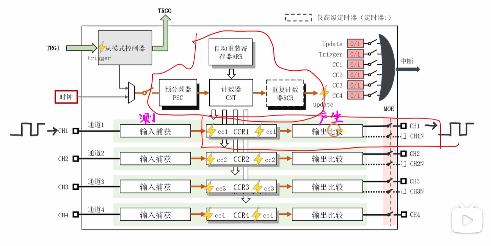
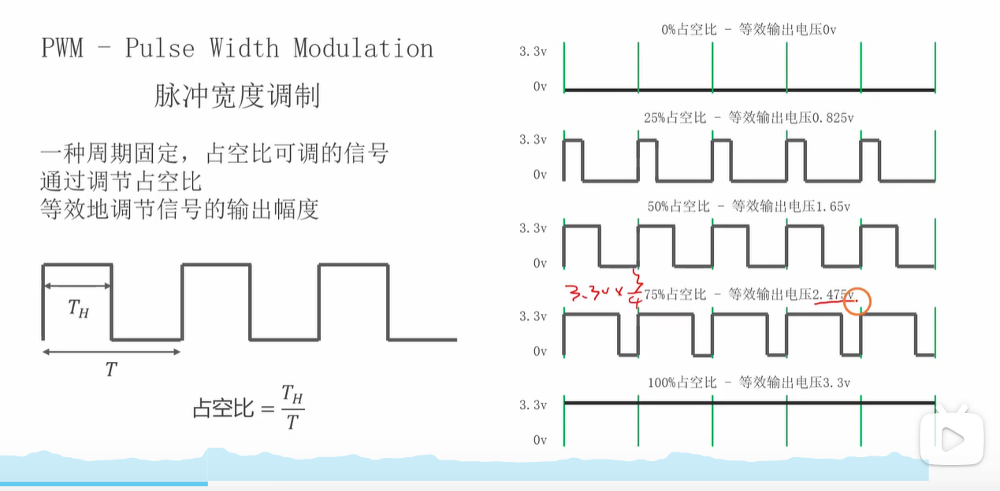
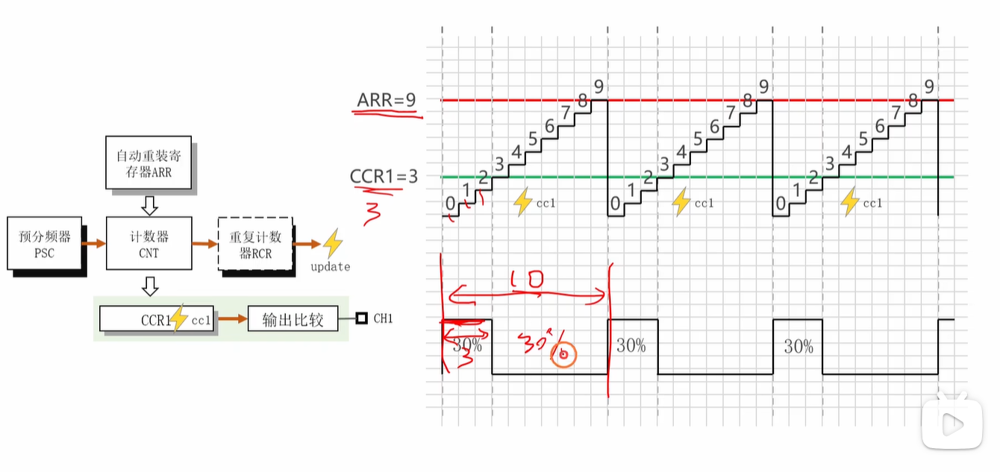
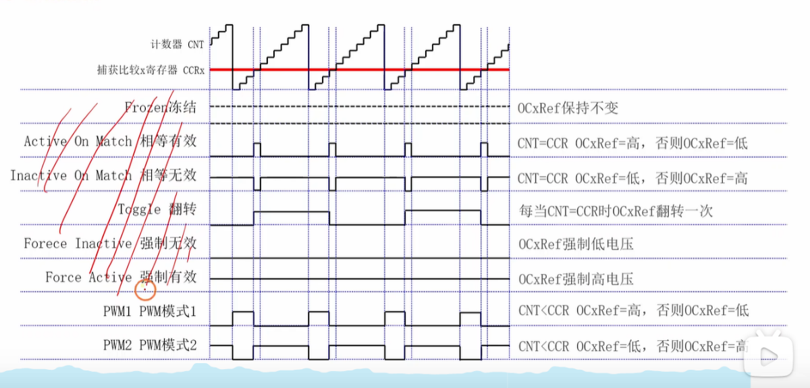
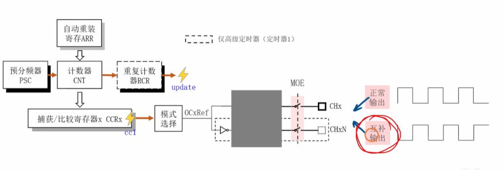
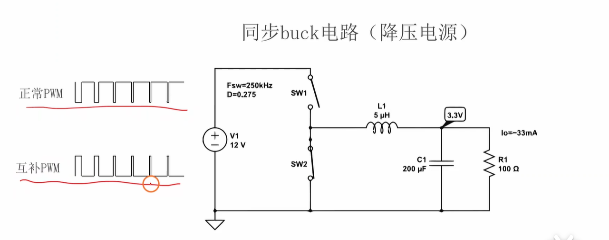
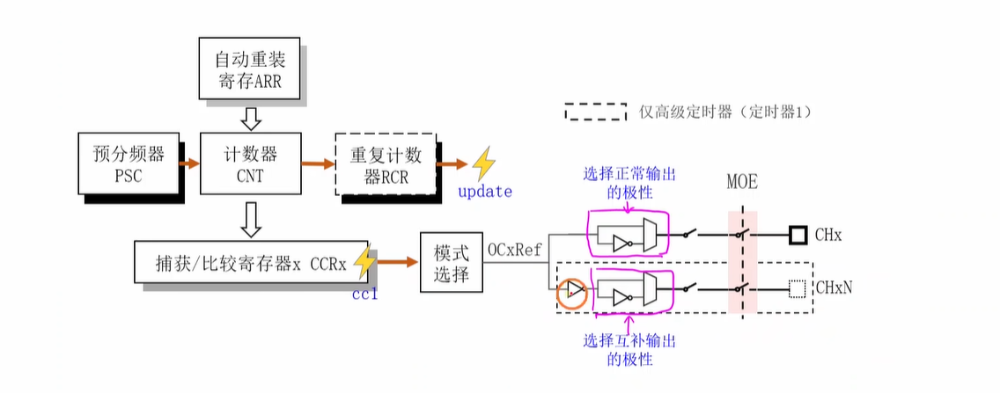
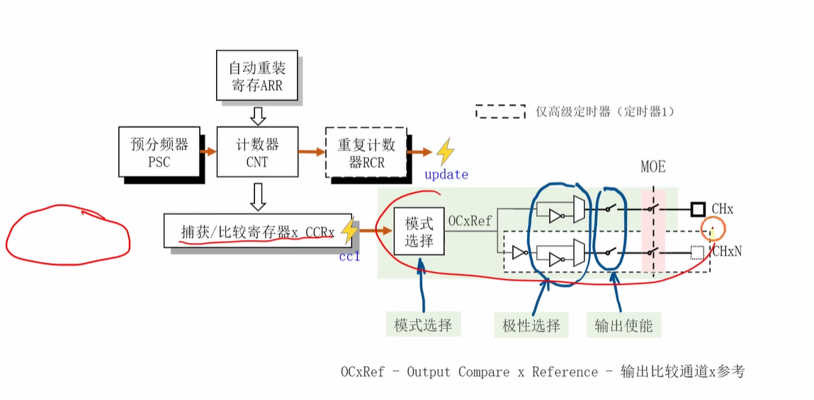

好的，我为你分析了这段关于STM32定时器“输出比较”功能的视频。这是一个非常核心且高频的嵌入式面试考点。

以下是对视频内容的分析、我的补充扩展，以及为你准备的面试问题。

------

补充：本节所讲的是上面定时器框图中画框的部分。

# 一、 视频内容分析

这个视频是“铁头山羊”STM32教程的一部分，专门讲解定时器的**输出比较（Output Compare, OC）**功能。

视频的核心内容可以总结为以下几点：

1. **什么是输出比较？**

   - 补充：PWM介绍：

   

   - 其本质是：定时器内部的**计数器（CNT）**的值与一个用户设定的**捕获/比较寄存器（CCR）**的值，在每个时钟周期进行比较。
   - 当两者满足特定条件时（例如相等、大于或小于），输出引脚的电平会**自动**发生变化（如置高、置低或翻转）。

2. **核心应用：PWM的产生原理**

   

   - 视频用最常见的**PWM（脉冲宽度调制）**作为核心案例。
   - **周期（Period）**由**自动重装载寄存器（ARR）**决定，计数器CNT从0数到ARR的值（在向上计数模式下）。
   - **占空比（Duty Cycle）**由**捕获/比较寄存器（CCR）**决定。
   - 以**PWM模式1**为例：当 `CNT < CCR` 时，输出为高电平；当 `CNT >= CCR` 时，输出为低电平。
   - 因此，通过保持ARR不变（周期不变）并改变CCR的值，就可以精确控制输出高电平的时长，即调节占空比。

3. **8种输出比较模式**

   

   - 视频详细列举了8种工作模式，它们定义了当 `CNT` 和 `CCR` 匹配时（`CNT == CCR`）输出信号 `OCxRef` 如何动作。
   - **核心模式：**
     - **PWM模式1：** `CNT < CCR` 时有效（高电平），`CNT >= CCR` 时无效（低电平）。
     - **PWM模式2：** `CNT < CCR` 时无效（低电平），`CNT >= CCR` 时有效（高电平）。（与模式1相反）
   - **其他模式：**
     - **相等时有效/无效/翻转：** 仅在 `CNT == CCR` 的那个瞬间改变电平。
     - **强制有效/无效：** 强制输出高电平或低电平，用于软件控制。
     - **冻结：** 保持当前电平不变，忽略比较结果。

4. **互补输出（Complementary Output）**

   

   - 这是STM32高级定时器（如TIM1）的特性。
   - 一个通道可以同时输出两个极性相反的信号：正常输出（`CHx`）和互补输出（`CHxN`）。
   - 视频用一个**同步Buck降压电路（如下图所示）**举例，说明这种电路需要一对互补的PWM信号来分别控制上、下两个开关管（SW1和SW2）。

   **5. 极性选择（Polarity Selection)**

   

   - 你不仅可以控制信号的逻辑（何时高/何时低），还可以配置最终输出到引脚的物理电平是**高电平有效**还是**低电平有效**。
   - 这提供了硬件设计的灵活性，例如，你可以直接驱动一个低电平导通的P-Channel MOSFET，而无需在外部加反相器。

------

6. 输出使能（自己补充部分）

好的，这是对图中“输出使能”部分的简洁中文解释：

1. **最终闸门：** 这部分就像连接内部信号到物理引脚 (`CHx`, `CHxN`) 的最终**开关**。
2. **`MOE` 控制 (主输出使能)：** 对于高级定时器，这是一个**总开关**。如果 `MOE` 关闭，则*所有*输出都被禁用，无论单个通道的使能设置如何。
3. **单独使能 (图中未明确显示但隐含存在)：** 每个通道 (`CHx`, `CHxN`) 也有其自己的使能位 (如 `CCxE`, `CCxNE`)。
4. **条件：** 信号只有在 **`MOE` (如果存在的话) 和对应通道自己的使能位都有效** ('打开') 时，才能最终到达引脚。

注意：MOE位通常只存在于STM32的**高级控制定时器**（如TIM1、TIM8）中。

# 补充提问

## 提问1

这里ARR=9最后设置的是10个时钟周期，而这里的CCR1=3为什么设置的是3，而不是4呢，我不是太懂，你能够给我详细解释下吗，最好能够举个例子来帮我彻底弄明白。

这是一个非常好的问题，也是初学者最容易混淆的点！

你之所以会困惑“为什么CCR1=3，而不是4”，是因为你可能在想：“*3除以10不是30%，那应该是4个周期才对*”。

你这个疑惑的根源在于**混淆了“计数值”和“计数个数”**。

我们来一步一步拆解，彻底弄明白这个问题。

------

### 1. 核心关键点：周期是如何计算的？

看你截图的右上角，计数器`CNT`的值是从 **0** 开始的，一直数到 **9**。

- `CNT`从0数到9，总共经历了多少个计数值？
  - 答案是：0, 1, 2, 3, 4, 5, 6, 7, 8, 9。
  - 你数一下，这**总共是10个值**。

在STM32定时器中（向上计数模式）：

- **周期（Period）= ARR + 1**

这就是为什么视频中 `ARR=9`，但产生的总周期`T`却是**10**个时钟格。

### 2. 占空比是如何计算的？

视频中展示的是最常见的 **PWM 模式 1**。它的规则是：

- **当 `CNT < CCR` 时，输出高电平。**
- 当 `CNT >= CCR` 时，输出低电平。

现在，我们把你设定的 `CCR1 = 3` 带入这个规则中：

1. **当 `CNT < 3` 时，输出高电平。**
   - `CNT` 在哪些值时满足这个条件？
   - `CNT = 0` ( < 3，输出高)
   - `CNT = 1` ( < 3，输出高)
   - `CNT = 2` ( < 3，输出高)
   - `CNT = 3` (不满足 < 3，因为 3不小于3 )
   - 所以，高电平总共持续了 **3** 个时钟格（在值为0, 1, 2时）。
2. **当 `CNT >= 3` 时，输出低电平。**
   - `CNT` 在哪些值时满足这个条件？
   - `CNT = 3, 4, 5, 6, 7, 8, 9`
   - 低电平总共持续了 **7** 个时钟格。

**总结一下：**

- 总周期 `T` = 10 个时钟格 (因为 ARR=9)
- 高电平时间 $T_H$ = 3 个时钟格 (因为 CCR=3)
- 占空比 = $T_H$ / $T$ = 3 / 10 = 30%

看，这和你截图中标注的“30%”完全对应上了！

------

### 3. 解开你的疑惑：为什么CCR1不是4？

现在我们反过来想，**如果你把 `CCR1` 设置成 4，会发生什么？**

我们再次套用 **`CNT < CCR`** 的规则：

- **当 `CNT < 4` 时，输出高电平。**
  - `CNT` 在哪些值时满足？
  - `CNT = 0, 1, 2, 3`
  - 高电平总共持续了 **4** 个时钟格。
- **当 `CNT >= 4` 时，输出低电平。**
  - `CNT` 在哪些值时满足？
  - `CNT = 4, 5, 6, 7, 8, 9`
  - 低电平总共持续了 **6** 个时钟格。

**此时的占空比：**

- 总周期 `T` = 10 个时钟格 (ARR=9)
- 高电平时间 $T_H$ = 4 个时钟格 (CCR=4)
- 占空比 = $T_H$ / $T$ = 4 / 10 = **40%**

------

### 总结与举例

帮你彻底记住这个公式：

在向上计数、PWM模式1下：

- **周期（时钟数）= `ARR` + 1**
- **高电平（时钟数）= `CCR`**
- **占空比 = `CCR` / (`ARR` + 1)**

**举个例子（面试可能就会这么问你）：**

- **问题：** 我想用STM32定时器产生一个**周期为1000个时钟**、**占空比为25%**的PWM波，`ARR`和`CCR`应该设置成多少？
- **回答：**
  1. **计算ARR：** 周期 = `ARR` + 1。所以 1000 = `ARR` + 1，得出 **`ARR` = 999**。
  2. **计算CCR：** 占空比 = `CCR` / (周期)。所以 25% = `CCR` / 1000，得出 **`CCR` = 250**。
- **验证：**
  - `ARR` = 999， `CCR` = 250。
  - `CNT` 从 0 数到 999，总共1000个计数。
  - 当 `CNT < 250` (即 `CNT` = 0, 1, 2 ... 249) 时，输出高电平。
  - 高电平总共持续了 **250** 个时钟。
  - 占空比 = 250 / 1000 = 25%。 完全正确。

所以，视频中 `ARR=9` (周期10)， `CCR=3` (高电平3)，占空比就是 3 / 10 = 30%。设置 `CCR=3` 是完全正确的。

## 提问2

这张图里面的 右边输出比较那一部分，即 模式选择、极性选择、输出使能 这里我有点看不太懂，你能够给我详细解释下吗，最好能够举个例子来帮我彻底弄明白。

好的，这张图展示了STM32定时器输出比较功能的后半部分，也就是**如何从内部比较结果生成最终的引脚输出信号**。我们把它拆解成三个关键步骤来看，并用一个PWM的例子来贯穿始终。

假设我们已经设置了：

- `ARR = 9` (周期 T = ARR+1 = 10个时钟)
- `CCR = 3`
- 定时器工作在**向上计数**模式
- **模式选择** 设置为 **PWM模式1**

那么，内部的**比较参考信号 `OCxRef`** 的逻辑（不是最终引脚电平）就是：

- 当 `CNT < CCR` (即 CNT=0, 1, 2) 时，`OCxRef` = 1 (逻辑高)
- 当 `CNT >= CCR` (即 CNT=3, 4, 5, 6, 7, 8, 9) 时，`OCxRef` = 0 (逻辑低)
- 波形看起来就是：`1, 1, 1, 0, 0, 0, 0, 0, 0, 0, ...` (重复)

现在我们来看右边你圈出的三个部分：

------

### 1. 模式选择 (Mode Selection)

- **作用：** 根据你设置的工作模式（比如PWM1, PWM2, 强制高/低电平, 翻转等），结合内部计数器`CNT`和捕获/比较寄存器`CCR`的实时比较结果，**生成内部的逻辑参考信号 `OCxRef`**。
- **输入：** 隐含的是 `CNT` 和 `CCR` 的比较结果。
- **配置：** 通过寄存器（如`TIMx_CCMRy`中的`OCyM`位）选择8种模式中的一种。
- **输出：** `OCxRef` 信号。
- **例子（接上文）：** 因为我们选择了**PWM模式1**，这个模块就会按照“`CNT < CCR`时为1，`CNT >= CCR`时为0”的规则，产生出 `1, 1, 1, 0, 0, 0, 0, 0, 0, 0, ...` 这样的 `OCxRef` 逻辑信号流。如果选择“强制高电平”模式，那么无论CNT和CCR如何比较，`OCxRef`都会一直输出逻辑'1'。

------

### 2. 极性选择 (Polarity Selection)

- **作用：** 决定内部逻辑信号 `OCxRef` 如何映射到**实际的物理高低电平**。你可以选择是**高电平有效**还是**低电平有效**。
- **输入：** `OCxRef` 信号。
- **配置：** 通过寄存器（如`TIMx_CCER`中的`CCxP`位给`CHx`通道，`CCxNP`位给`CHxN`通道）设置。
  - **高电平有效 (Active High):** `OCxRef`=1 输出高电平 (High)，`OCxRef`=0 输出低电平 (Low)。**（信号不反转）**
  - **低电平有效 (Active Low):** `OCxRef`=1 输出低电平 (Low)，`OCxRef`=0 输出高电平 (High)。**（信号反转）**
- **输出：** 经过极性选择（可能反转）后的信号，准备送往最终的输出使能门。图中有两个独立的反相器和选择开关，分别对应`CHx`（正常输出）和`CHxN`（互补输出）的极性设置。
- **例子（接上文，假设只看 CHx 通道）：**
  - **情况A：设置为“高电平有效” (`CCxP = 0`)**
    - `OCxRef` 是 `1, 1, 1, 0, 0, 0, 0, 0, 0, 0, ...`
    - 经过极性选择后，送往输出使能门的信号**仍然**是 `1, 1, 1, 0, 0, 0, 0, 0, 0, 0, ...` (逻辑1对应高电平，逻辑0对应低电平)。
  - **情况B：设置为“低电平有效” (`CCxP = 1`)**
    - `OCxRef` 是 `1, 1, 1, 0, 0, 0, 0, 0, 0, 0, ...`
    - 经过极性选择后，信号被**反转**，送往输出使能门的信号变成 `0, 0, 0, 1, 1, 1, 1, 1, 1, 1, ...` (逻辑1对应低电平，逻辑0对应高电平)。

------

### 3. 输出使能 (Output Enable)

- **作用：** 这是一个最终的**“闸门”或“开关”**，决定了经过模式选择和极性选择处理后的信号**是否真正连接到物理引脚上**。
- **输入：** 经过极性选择后的信号。
- **配置：**
  - 对于**高级定时器 (如TIM1)**，有一个**主输出使能位 `MOE`** (`TIMx_BDTR`寄存器)，它像一个总开关，控制所有输出（包括互补通道）。
  - 同时，每个通道（包括正常和互补）还有**各自的使能位**，如 `CCxE` (`TIMx_CCER`寄存器) 控制`CHx`，`CCxNE` (`TIMx_CCER`寄存器) 控制`CHxN`。它们需要和`MOE`（如果存在）**同时有效**，信号才能输出。
  - 对于**通用定时器**，通常只有各通道的使能位 `CCxE`。
- **输出：** 最终驱动GPIO引脚 (`CHx`, `CHxN`) 的电平信号。
- **例子（接上文 CHx 通道，高电平有效）：**
  - **情况A：输出使能有效 (MOE=1 且 CCxE=1)**
    - 送往使能门的信号是 `1, 1, 1, 0, 0, 0, 0, 0, 0, 0, ...`
    - 因为使能有效，这个信号直接**通过**。
    - 最终 `CHx` 引脚输出：`High, High, High, Low, Low, Low, Low, Low, Low, Low, ...` (得到30%占空比的高电平PWM)。
  - **情况B：输出使能无效 (MOE=0 或 CCxE=0)**
    - 送往使能门的信号是 `1, 1, 1, 0, 0, 0, 0, 0, 0, 0, ...`
    - 因为使能无效，这个信号被**阻断**。
    - 最终 `CHx` 引脚通常会被强制到一个**预设的空闲状态**（Inactive State），具体是高电平、低电平还是高阻态，取决于其他配置（比如刹车功能配置等），但它**不会**再输出PWM波形了。

------

### 总结流程：

1. **模式选择**：根据`CNT`和`CCR`比较结果以及所选模式，生成内部逻辑信号`OCxRef` (决定了波形的基本形状和占空比逻辑)。
2. **极性选择**：决定`OCxRef`的逻辑1是对应引脚的高电平还是低电平（是否需要反转）。对`CHx`和`CHxN`可以独立设置。
3. **输出使能**：决定最终处理好的信号是否连接到引脚上。

你可以把这个过程想象成：

1. **厨师（模式选择）\**根据菜谱（模式）和食材情况（CNT vs CCR）做好了\**菜（OCxRef）**。
2. **服务员（极性选择）\**决定这道菜是\**正着放（高电平有效）\**还是\**倒着放（低电平有效）**。
3. **门卫（输出使能）\**决定这盘摆好的菜\**允不允许端出厨房（送到引脚）**。

希望这个解释和例子能帮你彻底弄明白这部分的原理！

## 提问3

MOE 、CCxE 、TIMx_CCER、CCxP、CHx`通道，`CCxNP、CHxN`通道、CNT、CCR、OCxRef 这些单词分别表示的都是什么呢，你能够给我详细解释下吗，我有点不是太懂？最好能够举个例子来让我彻底弄懂。

好的，我们来逐一拆解这些在STM32定时器输出比较中非常关键的术语，并通过一个例子来理解它们是如何协同工作的。

------

### 术语详解

1. **`CNT` (Counter)**
   - **中文：** 计数器
   - **解释：** 这是定时器的核心，一个不断自增（或自减，或先增后减）的寄存器。它的值在每个有效的定时器时钟脉冲到来时改变。它的当前值是进行所有比较的基础。
   - **作用：** 实时记录当前“时间点”。
2. **`CCR` (Capture/Compare Register)**
   - **中文：** 捕获/比较寄存器 (在输出比较模式下，我们主要关心它的“比较”功能)
   - **解释：** 这是一个由用户编程设定的**阈值寄存器**。`CNT`的值会**持续**与`CCR`的值进行比较。
   - **作用：** 在输出比较模式（尤其是PWM）中，`CCR`的值**决定了输出信号状态改变的时刻**，从而控制脉冲的宽度（占空比）。
3. **`OCxRef` (Output Compare x Reference)**
   - **中文：** 输出比较 x 参考信号 (x 代表通道号 1, 2, 3, 4)
   - **解释：** 这是**内部**的、**逻辑层面**的信号，**不是**最终的引脚输出。它是由**模式选择器**根据所选的输出比较模式（如PWM1、PWM2、强制高/低等）以及 `CNT` 和 `CCR` 的实时比较结果生成的。它的值通常是逻辑 '1' (表示有效/Active) 或逻辑 '0' (表示无效/Inactive)。
   - **作用：** 作为后续极性选择和输出使能的**原始逻辑输入**。
4. **`TIMx_CCER` (Capture/Compare Enable Register)**
   - **中文：** 捕获/比较使能寄存器 (x 代表定时器编号，如 TIM1, TIM2 等)
   - **解释：** 这是一个**控制寄存器**，包含了多个用于配置定时器通道输出行为的**位 (bit)**。
   - **作用：** 用于**使能/禁止**各个通道的输出，并**设置它们的极性**。
5. **`CCxE` (Capture/Compare x Enable)**
   - **中文：** 捕获/比较 x 使能位 (x 代表通道号)
   - **解释：** 这是 `TIMx_CCER` 寄存器中的一个**位**。当这个位被设置为 '1' 时，**正常输出通道 `CHx`** 被使能；设置为 '0' 时被禁止。
   - **作用：** 控制**正常输出引脚 `CHx`** 的**开关**。
6. **`CCxP` (Capture/Compare x Polarity)**
   - **中文：** 捕获/比较 x 极性位 (x 代表通道号)
   - **解释：** 这是 `TIMx_CCER` 寄存器中的一个**位**。它决定了**正常输出通道 `CHx`** 的极性。
     - `CCxP = 0`：**高电平有效 (Active High)**。`OCxRef`=1 时，`CHx` 输出高电平；`OCxRef`=0 时，`CHx` 输出低电平。
     - `CCxP = 1`：**低电平有效 (Active Low)**。`OCxRef`=1 时，`CHx` 输出低电平；`OCxRef`=0 时，`CHx` 输出高电平。（相当于对 `OCxRef` 取反）
   - **作用：** 控制**正常输出引脚 `CHx`** 的**电平有效性** (是否反转 `OCxRef`)。
7. **`CHx` (Channel x)**
   - **中文：** 通道 x (x 代表通道号)
   - **解释：** 这通常指与定时器通道 x 相关联的**物理 GPIO 引脚**，用于**正常输出**。
   - **作用：** 最终输出PWM或其他波形的**主引脚**。
8. **`CCxNE` (Capture/Compare x Complementary Enable)**
   - **中文：** 捕获/比较 x 互补使能位 (x 代表通道号)
   - **解释：** 这是 `TIMx_CCER` 寄存器中的一个**位**，通常只在**高级控制定时器 (如 TIM1, TIM8)** 中存在。当这个位被设置为 '1' 时，**互补输出通道 `CHxN`** 被使能；设置为 '0' 时被禁止。
   - **作用：** 控制**互补输出引脚 `CHxN`** 的**开关**。
9. **`CCxNP` (Capture/Compare x Complementary Polarity)**
   - **中文：** 捕获/比较 x 互补极性位 (x 代表通道号)
   - **解释：** 这是 `TIMx_CCER` 寄存器中的一个**位**，同样通常只在高级控制定时器中存在。它决定了**互补输出通道 `CHxN`** 的极性（相对于**内部 `OCxRef`** 信号，在经过固有的反相之后再应用极性）。
     - `CCxNP = 0`：通常表示 `CHxN` **高电平有效** (相对于其反相信号)。
     - `CCxNP = 1`：通常表示 `CHxN` **低电平有效** (相对于其反相信号)。
   - **作用：** 控制**互补输出引脚 `CHxN`** 的**电平有效性**。注意：`CHxN` 的最终极性是 `OCxRef`、`CCxP`、`CCxNP` 以及死区等多种因素共同作用的结果，但 `CCxNP` 主要用于精调其有效电平。简单理解，你可以认为 `CCxP` 控制 `CHx` 是否反转 `OCxRef`，`CCxNP` 控制 `CHxN` 是否“再次”反转（在固有反转基础上）。
10. **`CHxN` (Channel x Complementary)**
    - **中文：** 通道 x 互补 (x 代表通道号)
    - **解释：** 这通常指与定时器通道 x 相关联的**物理 GPIO 引脚**，用于**互补输出**。它的信号通常与 `CHx` 相反，并且可能插入了死区时间。
    - **作用：** 输出与 `CHx` 配合用于驱动桥式电路的**另一个引脚**。
11. **`MOE` (Main Output Enable)**
    - **中文：** 主输出使能
    - **解释：** 这是在**高级控制定时器**的 `TIMx_BDTR` (刹车和死区寄存器) 中的一个**位**。它是一个**总开关**。
    - **作用：** **只有当 `MOE` 位为 '1' 时，`CCxE` 和 `CCxNE` 的使能才真正有效**，信号才能最终输出到 `CHx` 和 `CHxN` 引脚。如果 `MOE` 为 '0'，即使 `CCxE` 或 `CCxNE` 为 '1'，对应的引脚也会被强制到它们的非活动状态（通常是低电平或高阻态，取决于配置）。它是最高级别的输出控制开关。

------

### 例子：生成一对互补PWM信号

假设我们使用高级定时器 TIM1 的通道 1 (`x=1`)，目标是生成一对用于驱动半桥的互补PWM信号：

- **配置：**
  - `ARR = 99` (周期 T = 100 个时钟)
  - `CCR1 = 30`
  - 模式选择：PWM模式1 (`OC1M` 位配置) -> `OC1Ref` 在 `CNT<30` 时为 1，`CNT>=30` 时为 0。
  - 正常通道 CH1 极性：高电平有效 (`CC1P = 0`)。
  - 互补通道 CH1N 极性：高电平有效 (`CC1NP = 0`)。（注意：高电平有效是相对于其*内部反相*信号来说的，所以最终表现通常是低电平有效）。
  - 使能设置：
    - 主输出使能：`MOE = 1` (总开关打开)
    - 正常通道使能：`CC1E = 1` (CH1 输出打开)
    - 互补通道使能：`CC1NE = 1` (CH1N 输出打开)
  - (还应配置死区时间，这里暂不详述)
- **信号流程：**
  1. **`CNT`** 从 0 数到 99。
  2. **模式选择器** 生成 **`OC1Ref`**:
     - 当 `CNT` = 0...29 时，`OC1Ref` = 1
     - 当 `CNT` = 30...99 时，`OC1Ref` = 0
  3. **CH1 路径：**
     - `OC1Ref` 进入 CH1 的极性选择。
     - `CC1P = 0` (高有效)，信号**不反转**。得到 `1...1` (30个) `0...0` (70个)。
     - 信号进入 CH1 的输出使能门。
     - `MOE=1` 且 `CC1E=1`，使能有效，信号**通过**。
     - **最终 CH1 引脚输出：** 30% 占空比的高电平 PWM 波 (High for 30 clocks, Low for 70 clocks)。
  4. **CH1N 路径：**
     - `OC1Ref` ( `1...1` `0...0` ) **首先被内部逻辑反转** (这是互补通道的固有特性，为了与CH1相反)，变成 `0...0` (30个) `1...1` (70个)。
     - 反转后的信号进入 CH1N 的极性选择。
     - `CC1NP = 0` (高有效)，信号**不**“再次”反转。得到 `0...0` (30个) `1...1` (70个)。
     - 信号进入 CH1N 的输出使能门 (并会插入死区)。
     - `MOE=1` 且 `CC1NE=1`，使能有效，信号**通过**。
     - **最终 CH1N 引脚输出：** (忽略死区细节) 70% 占空比的高电平 PWM 波 (Low for 30 clocks, High for 70 clocks)，与 CH1 基本相反。
- **如果此时 `MOE` 变成 0：** 即使 `CC1E` 和 `CC1NE` 仍然是 1，CH1 和 CH1N 都会**立即**被强制到非活动状态（比如低电平），停止输出 PWM。
- **如果 `MOE=1`，但 `CC1E` 变成 0：** CH1 会停止输出 PWM 并进入非活动状态，但 CH1N **仍然会**继续输出它的 PWM 信号 (因为 `CC1NE=1`)。

这个例子展示了从 `CNT` 和 `CCR` 的比较开始，经过模式选择生成 `OCxRef`，再分别通过各自的极性选择和使能控制（以及总的MOE控制），最终形成 `CHx` 和 `CHxN` 引脚上的实际输出信号的完整流程。

## 提问4

我有一个困惑，就是不是CNT计数到ARR值下一个脉冲到来时才会产生一个上升沿吗，那么这里CNT小于CCR的时候没有上升沿怎么来输出低电平呢。还有高电平之后的那个下降沿也是有CCR来进行控制的吗，我不太懂，你能够给我详细解释下吗，最后能够举个例子来帮助我深刻理解下。

这个困惑非常普遍，因为它触及了PWM信号生成的底层逻辑！你的问题非常好，它点出了关键：**PWM的边沿（上升沿和下降沿）并不是由某个单一“事件”（比如CNT等于ARR或CNT等于CCR）“触发”产生的，而是由比较逻辑在每个时钟周期的连续判断结果决定的。**

让我们用你提供的例子（ARR=9，CCR=3，PWM模式1，高电平有效）来详细解释：

**核心规则 (PWM模式1, 高电平有效):**

- 在定时器的**每一个**时钟周期 (`CK_CNT`) 到来时，硬件都会做一次判断：
  - **如果 `CNT < CCR`，则 `OCxRef` 为 1 (逻辑高)。**
  - **如果 `CNT >= CCR`，则 `OCxRef` 为 0 (逻辑低)。**
- 然后 `OCxRef` 经过极性选择（假设高有效）和输出使能（假设使能），最终决定引脚电平。

**逐步分析一个周期 (CNT 从 0 到 9):**

1. **时钟周期 0 (CNT = 0):**
   - 比较：`0 < 3` ? **是**。
   - 结果：`OCxRef` = 1。
   - 引脚输出：**高电平 (High)**。
   - **思考：** 在上一个周期的最后一个时钟（CNT=9），输出是低电平。现在CNT变为0，比较结果变为真，输出变为高电平。**这就是上升沿的来源！** 它不是由ARR=9那个事件“直接触发”输出变高，而是由CNT复位到0后，*新的比较结果 (`0 < 3`)* 决定了输出必须是高电平。
2. **时钟周期 1 (CNT = 1):**
   - 比较：`1 < 3` ? **是**。
   - 结果：`OCxRef` = 1。
   - 引脚输出：**高电平 (High)**。 (电平保持不变)
3. **时钟周期 2 (CNT = 2):**
   - 比较：`2 < 3` ? **是**。
   - 结果：`OCxRef` = 1。
   - 引脚输出：**高电平 (High)**。 (电平保持不变)
4. **时钟周期 3 (CNT = 3):**
   - 比较：`3 < 3` ? **否**。
   - 现在判断 `3 >= 3` ? **是**。
   - 结果：`OCxRef` = 0。
   - 引脚输出：**低电平 (Low)**。
   - **思考：** 在上一个时钟（CNT=2），输出是高电平。现在CNT变为3，比较结果变为假（`CNT < CCR`不再成立），`CNT >= CCR`成立，输出变为低电平。**这就是下降沿的来源！** 它是由`CNT`的值**跨过**`CCR`值的那个瞬间，比较逻辑的结果发生翻转导致的。
5. **时钟周期 4 (CNT = 4):**
   - 比较：`4 >= 3` ? **是**。
   - 结果：`OCxRef` = 0。
   - 引脚输出：**低电平 (Low)**。 (电平保持不变)
6. **... 时钟周期 9 (CNT = 9):**
   - 比较：`9 >= 3` ? **是**。
   - 结果：`OCxRef` = 0。
   - 引脚输出：**低电平 (Low)**。 (电平保持不变)
7. **下一个时钟周期 (CNT 溢出并复位为 0):**
   - 此时定时器检测到 `CNT` 达到了 `ARR` 的值 (9)，会触发“更新事件”(Update Event)，并将 `CNT` 清零。
   - 进入新的周期，回到步骤 1：`CNT = 0`。
   - 比较：`0 < 3` ? **是**。
   - 结果：`OCxRef` = 1。
   - 引脚输出：**高电平 (High)**。 (再次产生上升沿)

**回答你的困惑点：**

- **“CNT小于CCR的时候没有上升沿怎么来输出低电平呢”**
  - 你的前提有点反了。当 `CNT < CCR` 时，PWM模式1恰恰是输出**高电平**。上升沿发生在周期的开始（`CNT`从上一个周期的最大值跳变到0时），因为`0 < CCR`，所以输出变为高。
  - 低电平是在 `CNT >= CCR` 时输出的。
- **“高电平之后的那个下降沿也是有CCR来进行控制的吗”**
  - **是的，完全正确！** 下降沿**精确地发生在** `CNT` 的值从 `CCR-1` 跳变到 `CCR` 的那个时钟周期。正是 `CCR` 的值决定了这个跳变点的位置。

**再举一个例子：ARR = 4 (周期 T=5), CCR = 2, PWM模式1, 高电平有效**

- 周期 T = 4 + 1 = 5 个时钟。
- CCR = 2。
- 规则：`CNT < 2` 输出高，`CNT >= 2` 输出低。

| **时钟周期** | **CNT 值** | **比较 (CNT < 2?)** | **OCxRef** | **引脚输出** | **边沿?**                |
| ------------ | ---------- | ------------------- | ---------- | ------------ | ------------------------ |
| 0            | 0          | 是 (0 < 2)          | 1          | High         | 上升沿 (从前一周期的Low) |
| 1            | 1          | 是 (1 < 2)          | 1          | High         |                          |
| 2            | 2          | 否 (2 >= 2)         | 0          | Low          | 下降沿                   |
| 3            | 3          | 否 (3 >= 2)         | 0          | Low          |                          |
| 4            | 4          | 否 (4 >= 2)         | 0          | Low          |                          |
| (下一个)     | 0          | 是 (0 < 2)          | 1          | High         | 上升沿                   |

- 高电平持续时间 = `CCR` = 2 个时钟 (在 CNT=0, 1 时)。
- 占空比 = `CCR` / (`ARR` + 1) = 2 / (4 + 1) = 2 / 5 = 40%。

总结关键：

PWM输出的电平不是在特定事件点（如CNT=ARR或CNT=CCR）才“改变一次”，而是在每个 CK_CNT 时钟，硬件都会根据当前的 CNT 和 CCR 的值，重新评估 CNT < CCR (或 CNT >= CCR) 这个条件，并立即更新 OCxRef 的状态。引脚上的上升沿和下降沿，只是这个连续评估过程中，OCxRef 状态发生改变的自然结果。

## 提问5

既然MOE使能位只在高级定时器TIME1和TIME8中有，那么基本定时器是只需要配置那两个CCxE, CCxNE使能位就行了吧，为什么MOE只存在于高级定时器中呢，我不是太理解。

这是一个非常好的追问，能看出你正在深入思考！

1. **关于基本定时器 (Basic Timer, 如 TIM6, TIM7):**
   - **关键：基本定时器根本没有捕获/比较通道！** 它们的主要功能是**产生时基**（用于触发中断、DMA、DAC、ADC等），它们**不能**直接输出PWM或进行输出比较。
   - 所以，基本定时器**没有** `CCxE` 或 `CCxNE` 这些位。你只需要配置它的计数器、预分频器和自动重载寄存器，并使能更新中断或触发即可。
2. **关于通用定时器 (General Purpose Timer, 如 TIM2, TIM3, TIM4, TIM5等):**
   - 通用定时器**有**捕获/比较通道（`CHx`），因此它们**有 `CCxE`** 位来使能对应的通道输出。
   - 但是，通用定时器**通常没有**互补输出通道（`CHxN`），所以它们**没有 `CCxNE`** 位。
   - **结论：** 对于通用定时器，你只需要配置 `CCxE` 来使能或禁止相应的 `CHx` 通道输出。
3. **为什么MOE只在高级定时器中？**
   - **核心原因：安全性和应用场景。**
   - **高级定时器**（TIM1, TIM8）设计用于需要**高精度控制和高安全性**的场合，特别是**电机控制**和**电力电子**（如电源变换）。
   - 在这些应用中：
     - **互补输出 + 死区** 是标配，用于驱动桥式电路（H桥、半桥）。
     - **刹车输入 (Break Input)** 是一个重要的**硬件保护**功能。当外部检测到故障（如过流、过压）时，可以通过刹车引脚**立即、无条件地**关闭所有PWM输出，防止硬件损坏。
   - **MOE的作用：** `MOE` 位就是这个**硬件刹车功能直接作用的对象**。一旦刹车事件发生，硬件会自动将`MOE`位清零，从而**瞬间关闭该定时器控制的所有输出引脚** (`CHx` 和 `CHxN`)。这是一个快速、可靠的硬件级保护机制。
   - **通用/基本定时器**通常不直接用于驱动大功率桥式电路，或者说，它们缺乏配套的死区和刹车硬件支持。因此，它们不需要这样一个与硬件故障保护紧密集成的全局主输出使能开关。单个通道的 `CCxE` 使能对于它们的应用场景（如驱动LED、舵机、产生简单波形等）已经足够了。

**简单说：** `MOE` 是高级定时器为了配合其**互补输出、死区和刹车功能**，提供的一个**快速硬件安全关断总开关**。通用和基本定时器应用场景不同，安全要求也不同，因此不需要这个总开关。

## 提问6

视频用一个同步Buck降压电路（如下图所示）举例，说明这种电路需要一对互补的PWM信号来分别控制上、下两个开关管（SW1和SW2）。

这里我不是太理解，你能够给我解释下吗，还有为什么要有互不的信号呢。最后能够举个例子来帮助我彻底弄明白。

好的，我们来详细解释一下同步Buck电路为什么需要互补PWM信号，以及那个“小缺口”（死区）的作用。

**1. 同步Buck电路的工作原理 (简化版)**

这个电路的目标是把较高的输入电压（V1=12V）降低到一个较低的输出电压（这里是3.3V），并且尽量高效。它主要通过两个开关（SW1和SW2）和储能元件（电感L1和电容C1）来实现。

- **阶段一：充电 (SW1导通，SW2断开)**
  - 控制器发出信号，让上面的开关SW1闭合，下面的开关SW2断开。
  - 电流路径：`V1 -> SW1 -> L1 -> C1 & R1 -> 地`。
  - 此时，12V电压施加在电感L1上（忽略输出电压影响），电感电流**线性增加**，能量储存在电感L1中。同时，电容C1也被充电，并向负载R1供电。
- **阶段二：续流 (SW1断开，SW2导通)**
  - 控制器发出信号，让SW1断开，SW2闭合。
  - **关键：** 电感的特性是电流不能突变。刚才L1中有电流流过，现在SW1断开了，L1中的电流需要一个**持续流动的路径**。
  - 电流路径：`L1 -> C1 & R1 -> 地 -> SW2 -> L1` (形成一个回路)。
  - 此时，电感L1中储存的能量释放出来，**继续**通过SW2向负载R1和电容C1供电，电感电流**线性减小**。

**2. 为什么需要互补信号？**

从上面两个阶段可以看出：

- **SW1 和 SW2 的状态必须是相反的！**
  - 当需要从输入电源取电给电感充电时，必须是 `SW1=ON`, `SW2=OFF`。
  - 当需要让电感续流时，必须是 `SW1=OFF`, `SW2=ON`。
- **不允许两者同时导通！** 如果SW1和SW2同时导通，就会形成从12V电源直接到地的短路，电流会非常大，烧毁开关和电源。
- **也不允许两者同时长时间断开！** 如果在电感需要续流时（SW1已断开）SW2也断开，电感电流没有路径，会产生很高的反向电压（根据 $V = L \frac{di}{dt}$），可能击穿开关或其他元件。（实际上，现代MOSFET通常有体二极管可以临时提供路径，但效率低且不是正常工作方式）。

因此，控制这两个开关最自然的方式就是用一对**逻辑相反**的信号：一个信号控制SW1，另一个信号（它的反相）控制SW2。这就是**互补信号**的来源。图中左侧的“正常PWM”控制SW1，“互补PWM”控制SW2。

**3. 为什么互补信号之间有个“小缺口”（死区 Dead Time）？**

这是非常非常重要的一点，也是你圈出的那个小缺口的意义所在！

- **理想 vs. 现实：** 理论上，开关是瞬间导通和关断的。但**实际的开关器件（如MOSFET）需要时间**来完成状态转换。而且，通常**关断比导通要慢一些**。
- **问题（直通 Shoot-through）：** 想象一下，如果“正常PWM”信号从高变低（试图关断SW1），而“互补PWM”信号*完全同步地*从低变高（试图导通SW2）。由于SW1关断需要时间，可能还没完全关断，SW2就已经开始导通了。这就会导致一个**极其短暂但非常危险的瞬间**，SW1和SW2都处于部分或完全导通状态，造成**电源到地的直通短路**！这会产生巨大的尖峰电流，发热严重，极易损坏器件。
- **解决方案（死区 Dead Time）：** 为了绝对避免直通，我们不能让两个信号完全严格地互补。必须在**关断一个开关**和**导通另一个开关**之间，**故意插入一个短暂的延时**，在这段时间里，**两个开关都保证是断开的**。这个延时就叫做**死区时间**。
  - 看图中的互补PWM：在正常PWM下降沿之后，互补PWM**并没有立刻**变成高电平，而是**等了一小段时间（死区）**才变高。
  - 同样地（虽然图中这个边缘不明显），在正常PWM上升沿之前，互补PWM会**提前一小段时间（死区）**变为低电平。
- **作用：** 死区确保了在任何切换瞬间，上下两个开关绝对不会同时导通，从而保证了电路的安全运行。

**举例理解死区：**

想象两扇门（SW1和SW2）控制一个通道的开关。规则是同一时间只能有一扇门打开。

- **无死区（危险）：** 关门A的命令和开门B的命令同时发出。但门A关得慢，还没完全关上，门B已经开始开了，通道瞬间是通的！

- **有死区（安全）：**

  1. 发出关门A的命令。
  2. **等待一小会儿**（死区时间），确保门A已经完全关严实了。
  3. 再发出开门B的命令。

  - 反过来切换亦然：先关门B，等待死区，再开门A。

**总结：**

- 同步Buck电路用SW2代替传统Buck电路的续流二极管，以提高效率。
- SW1和SW2的工作状态必须相反，因此需要**互补**的驱动信号。
- 由于实际开关器件存在开关延迟，必须在互补信号的切换边缘插入**死区时间**，以防止上下管**直通**短路。STM32的高级定时器硬件可以直接生成带死区的互补PWM信号。

希望这个解释能让你彻底明白！

# 二、 核心内容补充与扩展

视频讲得很好，但针对面试，你必须知道一些视频中“隐藏”的或“未深入”的关键知识点，这些是区分普通工程师和优秀工程师的要点：

1. **死区（Dead-Time）：互补输出的灵魂**
   - 视频中Buck电路的例子，如果上管（SW1）和下管（SW2）的PWM信号是“完美反相”的，**会出大事**。
   - **问题：** 物理上的MOSFET等功率管，**关断速度慢于导通速度**。这会导致在切换的瞬间，上管还没完全关断，下管就已经开始导通，造成电源到地的**瞬间短路**，称为**“直通”（Shoot-through）**，会产生极大电流并烧毁器件。
   - **解决方案：** STM32高级定时器内置了**死区生成器（Dead-Time Generator, DTG）**。它会在一个信号关断后，**自动插入一个微小的延迟（即死区时间）**，然后再让其互补信号导通。这确保了上、下管绝对不会同时处于导通状态。在面试中谈及互补输出，**必须**主动提及死区的概念和作用。
2. **对齐模式：边沿对齐 vs. 中心对齐**
   - 视频中演示的PWM（CNT从0数到ARR，然后复位）叫做**“边沿对齐模式”（Edge-Aligned Mode）**，也叫“向上计数模式”。
   - 在电机控制（尤其是FOC）和一些高级电源应用中，更常用的是**“中心对齐模式”（Center-Aligned Mode）**。
   - **工作方式：** 计数器先从0**向上计数**到ARR，然后**向下计数**回0。一个完整的PWM周期包含一个“上山”和一个“下山”。
   - **优势：**
     1. **降低EMI：** 产生的PWM脉冲关于周期的中心对称，谐波分量更小，电磁干扰（EMI）更低。
     2. **电流采样：** 在电机控制中，中心对齐模式可以确保在周期的顶点或底点（此时电流纹波最小）进行ADC采样，读数更准确。
     3. **更平滑的电流：** 在三相电机驱动中，能产生更平滑的相电流。
3. **预装载寄存器（Preload Register）：平滑更新的关键**
   - 如果你在PWM运行时，想改变占空比（即修改CCR的值），你不能“随心所欲”地改。
   - **问题：** 假设 `ARR=100`, `CCR=30`。当 `CNT` 数到50时，你突然把 `CCR` 改成了80。这次比较已经错过了，会导致这个周期的PWM波形异常，产生**毛刺（Glitch）**或不规则脉冲。
   - **解决方案：** STM32定时器使用**“预装载寄存器”（也叫“影子寄存器”）**。当你使能了`CCR`的预装载功能后，你写入的新值（如80）会先被存放到一个“影子寄存器”里，而不是直接生效。
   - **何时生效？** 只有在**“更新事件”（Update Event, UEV）**发生时（通常是CNT计数溢出，即一个周期的末尾），影子寄存器里的新值才会被**一次性、原子地**传送到真正用于比较的“活动寄存器”中。
   - **好处：** 这保证了占空比的改变只会在周期的边界发生，实现**平滑、无毛刺**的切换。`ARR`寄存器（用于改变周期）同理。

------

# 三、 经典与深度面试问题

这里是为你准备的、从浅入深覆盖此视频内容的面试问题。

#### 1. 基础概念（检验你是否看过视频）

**Q1: 什么是PWM？STM32定时器是如何利用“输出比较”功能来产生PWM波形的？**

- **简洁回复：** PWM（脉冲宽度调制）是一种周期固定、通过调节高电平时间（占空比）来改变平均输出电压的技术。STM32定时器通过比较计数器（CNT）和捕获/比较寄存器（CCR）的值来实现。在最常用的PWM模式1下，当CNT的值小于CCR时，输出为高电平；当CNT大于等于CCR时，输出为低电平。通过改变CCR的值，就可以在不改变周期（由ARR寄存器决定）的情况下，改变高电平的持续时间，从而调节占空比。

**Q2: 视频中提到了PWM模式1和PWM模式2，它们有什么区别？**

- **简洁回复：** 它们是互补的。PWM模式1在`CNT < CCR`时输出有效电平（如高电平），在`CNT >= CCR`时输出无效电平。PWM模式2则相反，在`CNT < CCR`时输出无效电平，在`CNT >= CCR`时输出有效电平。

**Q3: 什么是互补输出（CHx 和 CHxN）？它有什么典型的应用场景？**

- **简洁回复：** 互补输出是指一个定时器通道同时输出两个极性相反的信号：一个正常信号（CHx）和一个互补信号（CHxN）。它主要用于驱动桥式电路，如视频中提到的同步Buck降压电源，以及更常见的三相无刷电机驱动、全桥/半桥电路等，用于驱动桥臂的上、下管。

#### 2. 进阶应用（检验你是否理解了）

**Q4: 视频提到了8种输出比较模式，你能在PWM模式之外，再举一个其他模式（如Toggle）的应用吗？**

- **简洁回复：** 可以。使用**翻转（Toggle）模式**可以产生一个精确的、占空比为50%的方波。你只需将CCR的值设置为ARR值的一半（或任意值）。当CNT与CCR相等时，电平翻转一次。这样每经过一个完整的周期（0到ARR），电平会翻转一次。如果配置成中心对齐模式，并在`CCR`等于`ARR`时翻转，则每半个周期翻转一次，能产生一个频率为定时器更新频率一半的、50%占空比的方波，常用于分频或产生时钟信号。

**Q5: 如果我想在PWM运行时，平滑地改变它的占空比，应该如何配置寄存器？如果我直接修改CCR的值，会有什么问题？**

- **简洁回复：** 必须使能CCR寄存器的**“预装载”功能（Preload）**。如果直接修改活动的CCR寄存器，可能会在周期的中间点修改了比较值，导致当周期产生毛刺（Glitch）或宽度不正确的脉冲。启用预装载后，新值会先写入影子寄存器，只在周期的末尾（更新事件UEV）才被加载到活动寄存器，从而确保占空比平滑、无误地切换。

**Q6: 什么是输出极性选择？它为什么有用？**

- **简洁回复：** 极性选择允许你配置输出通道是“高电平有效”还是“低电平有效”。这个功能提供了硬件设计的灵活性。例如，N-Channel MOSFET通常是高电平导通，而P-Channel MOSFET是低电平导通。通过配置极性，我的固件就可以适配不同的外部驱动电路，而无需修改硬件（如添加反相器）。

#### 3. 深度见解（检验你是否有工程经验）

**Q7: [高频考点] 在使用互补PWM信号驱动半桥电路时，如果信号只是简单反相，会存在什么严重风险？STM32高级定时器是如何解决这个问题的？**

- **简洁回复：** 会有**“直通”（Shoot-through）**风险。因为功率管（MOSFET）的关断速度慢于导通速度，完美的反相信号会导致上臂管还没完全关断时，下臂管就已经开始导通，造成电源到地的瞬间短路，这会烧毁器件。STM32高级定时器（如TIM1）内置了**“死区生成器”（Dead-Time Generator, DTG）**，它会在一个信号关断和其互补信号导通之间，自动插入一个微小的延迟（即死区时间），确保两个管子绝不会同时导通。

**Q8: 视频中演示的PWM是“边沿对齐”的。在FOC（电机控制）项目中，为什么更倾向于使用“中心对齐”模式？**

- **简洁回复：** 主要有两个原因：
  1. **降低EMI：** 中心对齐PWM的脉冲是关于周期中心对称的，谐波分量更小，产生的电磁干扰（EMI）显著低于边沿对齐。
  2. **精确采样：** 在FOC中，我们需要在电流纹波的峰值或谷值（即周期的顶点或底点）采样相电流，此时电流变化率最小，读数最准。中心对齐模式的更新事件发生在周期的中心（谷底）和两端（峰顶），天然地为ADC采样提供了最佳时机。

**Q9: 什么是“刹车功能”（Break Function）？它和死区有什么关系？**

- **简洁回复：** 刹车功能是STM32高级定时器的一种硬件保护机制。它通过一个专用的`BKIN`引脚监测外部故障信号（比如过流、过压）。一旦该引脚触发，定时器**硬件会立即、无条件地**将所有PWM输出（包括互补输出）置于一个预先设定的“安全状态”（例如，所有MOSFET全部关断）。这个响应速度远快于软件中断，能防止硬件损坏。它和死区都是对功率输出的硬件保护，但死区是防止“直通”的主动措施，而刹车是响应外部故障的被动保护。