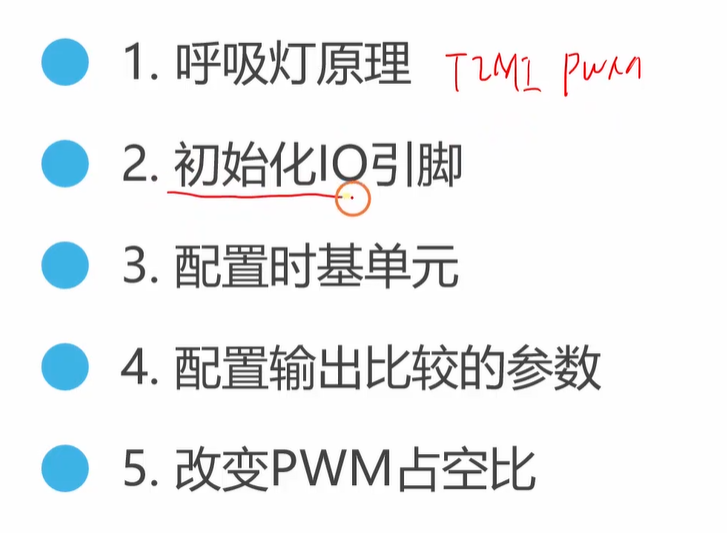
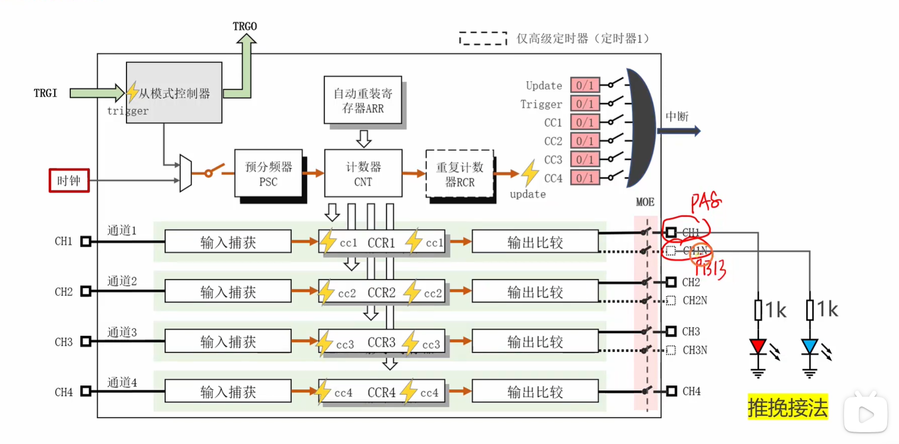
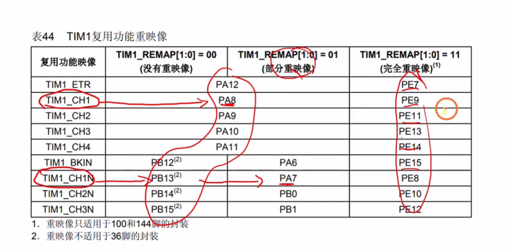
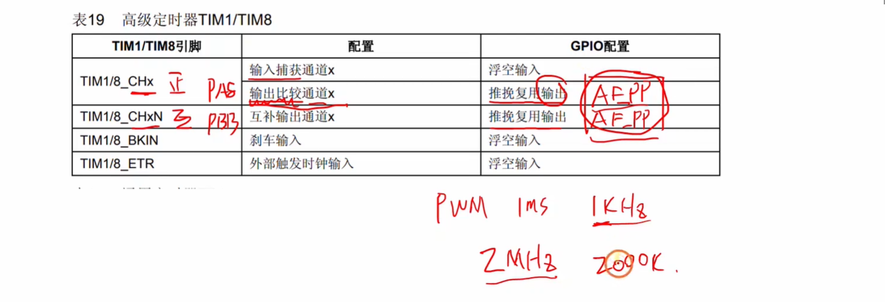
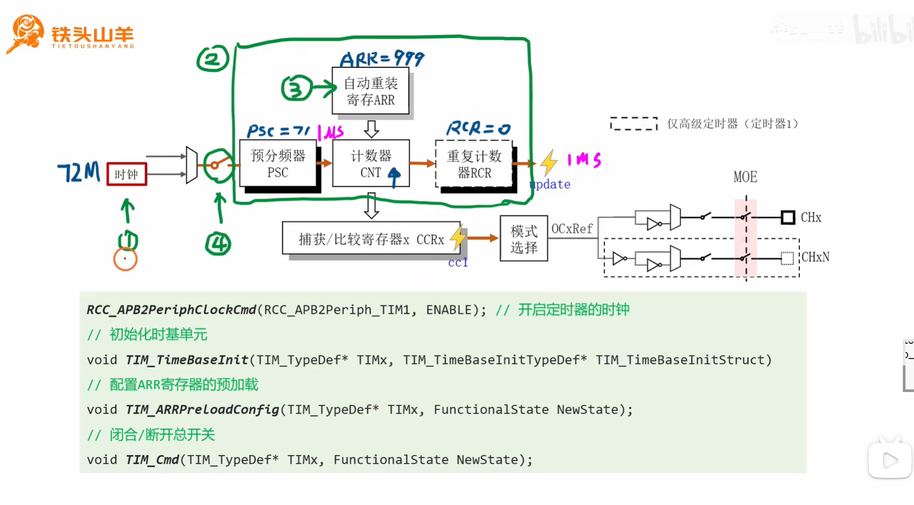
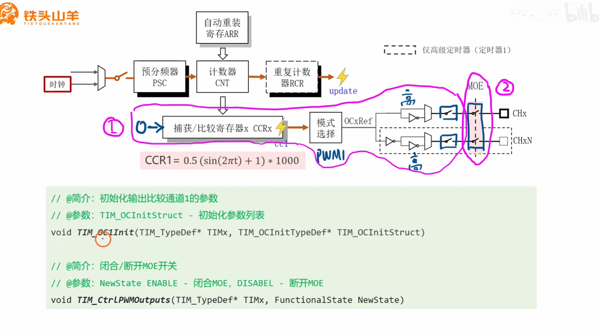
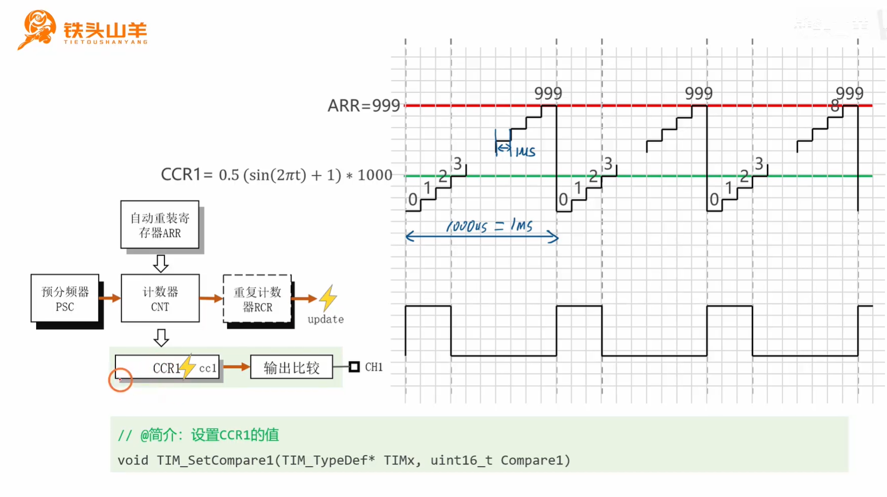
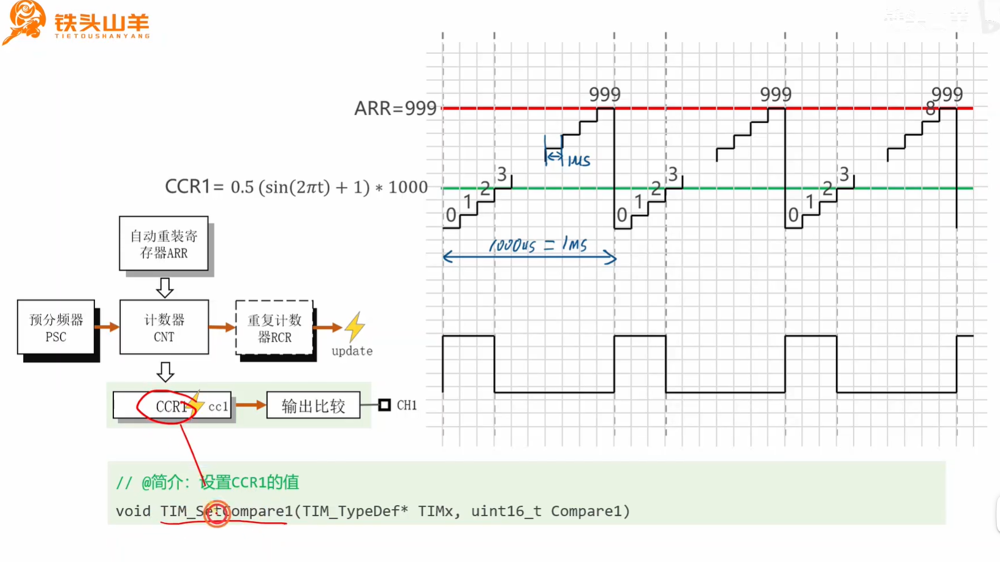
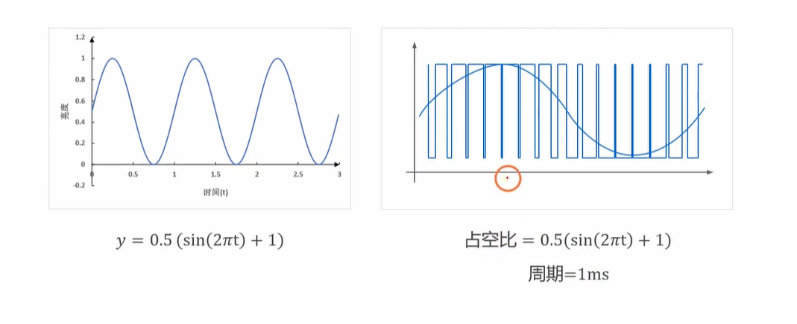

好的，我们来分析一下这个视频并为你准备嵌入式面试可能涉及的相关内容。





# **视频内容分析总结**

这个视频是一个教程，演示了如何使用STM32微控制器（根据包含的 `stm32f10x.h` 头文件和使用的Keil uVision 5环境，很可能是STM32F1系列）上的定时器外设来实现“呼吸灯”效果。

以下是视频中涵盖的关键概念分解：

1. **呼吸灯原理：** 解释了该效果是通过连续改变LED的亮度来实现的。这是通过根据正弦波模式控制脉冲宽度调制（PWM）信号的占空比来完成的。视频中使用了公式 $占空比 = 0.5 \times (\sin(2\pi t) + 1)$ 来生成一个介于0和1之间的占空比值，模拟随时间 `t` 变化的平滑呼吸模式。

   

2. **硬件设置：** 展示了将LED（一个红色，一个蓝色）连接到STM32特定的GPIO引脚，这些引脚被配置为定时器输出通道（具体是TIM1的通道1正常输出 CH1 和互补输出 CH1N）。LED串联了电阻。

   

3. **GPIO初始化：** 演示了如何配置连接到LED的GPIO引脚。由于它们用于定时器PWM输出，需要设置为**复用推挽输出（AF_PP）**模式。视频展示了使用标准外设库（SPL）函数，如 `RCC_APB2PeriphClockCmd`（使能GPIO时钟）、`GPIO_InitTypeDef` 和 `GPIO_Init`。还提到了TIM1引脚重映射的可能性。

   

   

4. **定时器配置（TIM1 - 高级定时器）：**

   - **时基单元：** 解释了设置核心定时器参数以生成所需的PWM频率（示例中为1kHz）。这涉及到配置：

     

     <span style="color:#CC0000; font-weight:bold;">注意：图中黑色的寄存器的的预加载功能是默认开启的，而灰色部分的预加载功能是关闭的。</span>

     - **预分频器（PSC）：** 对定时器的输入时钟（来自APB2时钟，示例中为72MHz）进行分频。设置为71（表示除以71+1=72），得到1MHz的计数器时钟。
     - **自动重装载寄存器（ARR）：** 决定计数器的周期（也就是PWM频率）。设置为999（表示从0计数到999，共1000步）。在1MHz计数器时钟下，1000步产生1ms的周期（1kHz频率）。
     - **计数器模式：** 设置为向上计数模式。

   - **输出比较单元（通道1）：** 解释了为PWM输出配置通道1：

     

     - **模式：** 设置为PWM模式1（`TIM_OCMode_PWM1`）。
     - **输出状态：** 使能（`TIM_OutputState_Enable`）。对于像TIM1这样的高级定时器，还需要配置互补输出状态（`TIM_OutputNState_Enable`）。
     - **极性：** 设置为高（`TIM_OCPolarity_High`）。
     - **脉冲（CCR1）：** 这个值（捕获/比较寄存器1）决定了占空比。它与计数器（CNT）进行比较。在PWM模式1下，当CNT < CCR1时输出高电平。这个值将在主循环中动态更新。初始化为0。

   - **预装载使能：** 使能ARR（`TIM_ARRPreloadConfig`）和CCR（`TIM_OC1PreloadConfig` - 在某些SPL版本中由`TIM_OC1Init`隐式处理，或可能需要单独调用）的预装载功能，以确保平滑更新。

   - **主输出使能（MOE）：** 这是高级定时器（TIM1/TIM8）特有的，必须使用 `TIM_CtrlPWMOutputs` 使能主输出。

   - **定时器使能：** 最后，使用 `TIM_Cmd` 使能定时器计数器本身。

5. **动态占空比控制：** 展示了如何在主 `while(1)` 循环中使用正弦函数（来自 `math.h` 的 `sin`）和系统滴答时钟（`GetTick` 获取时间）来计算占空比。计算出的占空比（0.0到1.0）随后乘以ARR的值（1000）以得到所需的CCR1值。使用 `TIM_SetCompare1` 来更新这个CCR1值。

   

   <span style="color:#CC0000; font-weight:bold;">注意：上图中开启CCR的预加载的功能。</span>

   

6. **代码实现：** 整个过程在Keil uVision IDE中使用C语言演示，并利用了STM32标准外设库（SPL）。


# 完整代码实现（自己补充）

好的，这是根据视频内容整理出的使用STM32标准外设库（SPL）实现的呼吸灯代码 (`main.c`)。

**请注意：**

1. 这段代码基于视频中展示的STM32F1系列和标准外设库（SPL）。如果你使用不同的STM32系列或HAL库/LL库，代码需要做相应修改。
2. 你需要确保你的工程中包含了对应的STM32F1xx标准外设库文件，并且正确配置了工程设置（比如选择了正确的芯片型号）。
3. 代码假设你有一个 `delay.c`/`delay.h` 文件，其中实现了基于SysTick的延时函数和 `GetTick()` 函数来获取毫秒级时间戳。标准的STM32工程模板或很多例程中都包含这个文件。如果你没有，需要自行实现或添加。
4. 使用了 `math.h` 中的 `sinf` 函数（`sinf` 是 `sin` 的 float 版本，更适合单精度浮点运算）。

C

```c
#include "stm32f10x.h"
#include "delay.h" // 假设包含 delay_init() 和 GetTick()
#include <math.h> // 包含 sinf 函数

// 定义 PI 值
#define PI 3.14159265f

// 函数声明
void App_PWM_Init(void);

int main(void)
{
    // 初始化 SysTick 定时器，用于 delay 和 GetTick
    delay_init();

    // 初始化 PWM (GPIO 和 TIM1)
    App_PWM_Init();

    float t = 0;        // 时间变量 (秒)
    float duty = 0;     // 占空比变量 (0.0 到 1.0)
    uint16_t ccr1_val = 0; // CCR1 寄存器的值 (0 到 999)

    while (1)
    {
        // 1. 获取当前时间 (单位: 秒)
        // GetTick() 返回毫秒, 乘以 1.0e-3f 转换成秒 (用浮点数)
        t = GetTick() * 1.0e-3f;

        // 2. 根据正弦函数计算当前占空比 (0.0 到 1.0)
        // 使用 sinf 处理 float 类型
        duty = 0.5f * (sinf(2.0f * PI * t) + 1.0f);

        // 3. 将占空比 (0.0-1.0) 映射到 CCR1 的值 (0-999)
        // ARR 设置为 999，所以周期是 1000 个计数点 (0-999)
        ccr1_val = (uint16_t)(duty * 1000); // 乘以周期长度 1000 (ARR+1)

        // 4. 设置 TIM1 的通道 1 比较值 (更新占空比)
        TIM_SetCompare1(TIM1, ccr1_val);

        // 可以加一个小延时，避免过于频繁地计算和更新，但呼吸效果主要由时间 t 决定
        // delay_ms(1); // 例如延时 1ms
    }
}

/**
  * @brief  初始化 TIM1 PWM 输出以及相关 GPIO
  * @param  None
  * @retval None
  */
void App_PWM_Init(void)
{
    GPIO_InitTypeDef GPIO_InitStructure;
    TIM_TimeBaseInitTypeDef TIM_TimeBaseStructure;
    TIM_OCInitTypeDef TIM_OCInitStructure;

    // --- 1. 初始化 IO 引脚 (PA8: TIM1_CH1, PB13: TIM1_CH1N) ---

    // 使能 GPIOA, GPIOB 和 AFIO 的时钟
    // TIM1 通道可能需要 AFIO 时钟，特别是涉及重映射或高级功能时，先加上比较保险
    RCC_APB2PeriphClockCmd(RCC_APB2Periph_GPIOA | RCC_APB2Periph_GPIOB | RCC_APB2Periph_AFIO, ENABLE);

    // 配置 PA8 (TIM1_CH1) 为复用推挽输出
    GPIO_InitStructure.GPIO_Pin = GPIO_Pin_8;
    GPIO_InitStructure.GPIO_Mode = GPIO_Mode_AF_PP;       // 复用推挽输出
    GPIO_InitStructure.GPIO_Speed = GPIO_Speed_2MHz;      // 速度 2MHz 足够
    GPIO_Init(GPIOA, &GPIO_InitStructure);

    // 配置 PB13 (TIM1_CH1N) 为复用推挽输出 (需要查手册确认 TIM1_CH1N 默认或重映射后是否在此引脚，假设默认在此)
    // 注意：对于某些封装可能不存在 PB13 或 TIM1_CH1N 不在该引脚，请根据实际硬件核对
    GPIO_InitStructure.GPIO_Pin = GPIO_Pin_13;
    GPIO_InitStructure.GPIO_Mode = GPIO_Mode_AF_PP;       // 复用推挽输出
    GPIO_InitStructure.GPIO_Speed = GPIO_Speed_2MHz;
    GPIO_Init(GPIOB, &GPIO_InitStructure);


    // --- 2. 配置时基单元 (TIM1) ---

    // 使能 TIM1 时钟
    RCC_APB2PeriphClockCmd(RCC_APB2Periph_TIM1, ENABLE);

    // 配置时基结构体
    TIM_TimeBaseStructure.TIM_Period = 999;          // ARR 自动重装载值 (0-999 共 1000 个数)
    TIM_TimeBaseStructure.TIM_Prescaler = 71;        // PSC 预分频值 (72MHz / (71+1) = 1MHz)
    TIM_TimeBaseStructure.TIM_ClockDivision = TIM_CKD_DIV1; // 时钟分频因子 (不分频)
    TIM_TimeBaseStructure.TIM_CounterMode = TIM_CounterMode_Up; // 向上计数模式
    TIM_TimeBaseStructure.TIM_RepetitionCounter = 0; // 重复计数器 (高级定时器特有, 这里设0)
    TIM_TimeBaseInit(TIM1, &TIM_TimeBaseStructure);


    // --- 3. 配置输出比较通道 1 (TIM1_CH1 和 TIM1_CH1N) ---

    // 配置输出比较结构体
    TIM_OCInitStructure.TIM_OCMode = TIM_OCMode_PWM1;             // PWM 模式 1
    TIM_OCInitStructure.TIM_OutputState = TIM_OutputState_Enable; // 使能 CH1 输出
    TIM_OCInitStructure.TIM_OutputNState = TIM_OutputNState_Enable;// 使能 CH1N 输出 (高级定时器特有)
    TIM_OCInitStructure.TIM_Pulse = 0;                            // CCR1 初始值 (决定初始占空比, 0% )
    TIM_OCInitStructure.TIM_OCPolarity = TIM_OCPolarity_High;     // CH1 输出极性：高
    TIM_OCInitStructure.TIM_OCNPolarity = TIM_OCNPolarity_High;    // CH1N 输出极性：高 (注意：互补通道极性可独立设置)
    // 以下两项配置空闲状态下的电平，对于 PWM 一般用不到，保持默认或设置为 Reset 状态
    // TIM_OCInitStructure.TIM_OCIdleState = TIM_OCIdleState_Reset;
    // TIM_OCInitStructure.TIM_OCNIdleState = TIM_OCNIdleState_Reset;
    TIM_OC1Init(TIM1, &TIM_OCInitStructure); // 初始化 TIM1 通道 1


    // --- 4. 使能相关配置 ---

    // 使能 TIM1 通道 1 的 CCR1 寄存器预装载功能 (重要，确保占空比平滑改变)
    // TIM_OC1PreloadConfig(TIM1, TIM_OCPreload_Enable); // 或者使用下面的函数
    TIM_CCPreloadControl(TIM1, ENABLE); // 使能 CCR 预装载

    // 使能 TIM1 的 ARR 寄存器预装载功能 (允许在运行时更改频率而不立即生效)
    TIM_ARRPreloadConfig(TIM1, ENABLE);

    // 使能 TIM1 的主输出 (MOE) (高级定时器必须!)
    TIM_CtrlPWMOutputs(TIM1, ENABLE);

    // 使能 TIM1 计数器
    TIM_Cmd(TIM1, ENABLE);
}
```

**代码解释和关键点：**

- **头文件包含：** 包含了芯片库、延时库和数学库。
- **`main` 函数:**
  - `delay_init()`: 初始化SysTick，为 `GetTick()` 提供时基。
  - `App_PWM_Init()`: 调用初始化函数配置GPIO和TIM1。
  - `while(1)` 循环:
    - `GetTick() * 1.0e-3f`: 获取系统运行的毫秒数并转换为秒（浮点数）。
    - `duty = 0.5f * (sinf(2.0f * PI * t) + 1.0f)`: 计算当前时刻对应的占空比（0.0 ~ 1.0）。
    - `ccr1_val = (uint16_t)(duty * 1000)`: 将占空比映射到CCR寄存器的值。因为ARR是999，周期内计数是从0到999共1000个值，所以乘以1000。
    - `TIM_SetCompare1(TIM1, ccr1_val)`: 将计算得到的CCR值写入TIM1的通道1比较寄存器，从而动态更新PWM的占空比。
- **`App_PWM_Init` 函数:**
  - **GPIO配置:** 使能了GPIOA、GPIOB和AFIO时钟，并将PA8和PB13配置为复用推挽输出模式。
  - **时基配置:** 配置TIM1的预分频器(PSC=71)和自动重装载值(ARR=999)，使得计数器时钟为1MHz，PWM周期为1ms (频率1kHz)。设置为向上计数。
  - **输出比较配置:** 配置通道1为PWM1模式，使能CH1和CH1N输出，设置极性为高，初始脉冲值(CCR1)为0。
  - **使能配置:** 使能了ARR和CCR的预装载功能（`TIM_ARRPreloadConfig`, `TIM_CCPreloadControl`），这对于平滑地改变PWM参数很重要。使能了主输出MOE（`TIM_CtrlPWMOutputs`），这是高级定时器输出PWM所必需的。最后使能定时器本身（`TIM_Cmd`）。

将这段代码烧录到你的STM32开发板（确保PA8和PB13连接了LED和适当的限流电阻到地），你应该就能看到呼吸灯的效果了。


# 补充提问

## 提问1

**呼吸灯原理：** 解释了该效果是通过连续改变LED的亮度来实现的。这是通过根据正弦波模式控制脉冲宽度调制（PWM）信号的占空比来完成的。视频中使用了公式 $占空比 = 0.5 \times (\sin(2\pi t) + 1)$ 来生成一个介于0和1之间的占空比值，模拟随时间 `t` 变化的平滑呼吸模式。

<span style="font-size:1.2em; color:#CC0000;">这里呼吸灯的原理我还是不太理解，你能够给我详细解释下吗，最好能够举个例子来帮我彻底弄明白，还有这里的“使用了公式 $占空比 = 0.5 \times (\sin(2\pi t) + 1)$ 来生成一个介于0和1之间的占空比值，模拟随时间 `t` 变化的平滑呼吸模式”这里的这个公式我也不是太理解。</span>


好的，没问题！我们来详细拆解一下呼吸灯的原理和那个公式。

**1. 呼吸灯的核心原理：PWM 控制亮度**

想象一下你家里可以调节亮度的灯。当你旋转调光旋钮时，灯泡会平滑地变亮或变暗。<span style="color:#CC0000;">呼吸灯就是让单片机自动、周期性地帮你“旋转”这个“数字调光旋钮”。</span>

但是，单片机（像STM32）的GPIO引脚通常只能输出两种状态：高电平（比如3.3V，可以点亮LED）和低电平（0V，LED熄灭）。它不能直接输出像1.5V、2.0V这样的中间电压来控制亮度。

怎么办呢？这里就用到了 **PWM (Pulse Width Modulation) 技术，也就是脉冲宽度调制**。

- **PWM是什么？** PWM是一种<span style="color:#CC0000;">数字信号</span>，它在一个固定的周期内，快速地在高电平和低电平之间切换。
- **占空比 (Duty Cycle)：** 在PWM的一个周期内，高电平持续的时间占整个周期时间的百分比。例如，一个周期是1毫秒（ms），如果高电平持续0.3ms，低电平持续0.7ms，那么占空比就是30%。
- **如何控制亮度？** PWM切换的速度非常快（比如视频中的1kHz，也就是每秒切换1000次），人眼是跟不上这种闪烁的。由于**视觉暂留效应**，我们看到的不是闪烁，而是LED在这段时间内的**平均亮度**。
  - **占空比低（比如10%）：**<span style="color:#CC0000;"> 在一个周期内，大部分时间LED是灭的，只有一小段时间是亮的，平均下来就很暗。</span>
  - **占空比高（比如90%）：**<span style="color:#CC0000;"> 在一个周期内，大部分时间LED是亮的，只有一小段时间是灭的，平均下来就很亮。</span>
  - **占空比50%：** 一半时间亮，一半时间灭，亮度居中。

**简单来说：<span style="color:#CC0000;">通过改变PWM信号的占空比，我们就能有效地控制LED的平均亮度。</span>**

**2. 如何实现“呼吸”效果？**

“呼吸”意味着亮度不是恒定的，也不是简单的亮灭闪烁，而是要像人的呼吸一样，**平滑地、周期性地**从暗到亮，再从亮到暗。

结合上面的PWM原理，这就意味着我们需要让PWM的**占空比**随着时间**平滑地、周期性地**变化。

<span style="color:#CC0000;">什么样的函数具有这种平滑、周期性变化的特性呢？</span> **正弦函数 (Sine Wave)** 就是一个完美的候选者！

**3. 详解公式：`占空比 = 0.5 * (sin(2 * pi * t) + 1)`**



这个公式的目的就是生成一个随时间 `t` 在 0 到 1 之间平滑变化的占空比值。我们一步步来看：

- **基础：`sin(x)` 函数**
  - 标准的正弦函数 `sin(x)` 的值域是 **-1 到 +1** 之间。它的波形是平滑的、周期性的起伏。这正好符合我们想要的“呼吸”起伏感。
- **参数 `2 * pi * t`：**
  - `t` 代表时间。随着时间的流逝，`t` 会增大。
  - `2 * pi` 是一个常数（约等于6.28）。`sin(x)` 函数的周期是 `2 * pi`。当括号里的参数 `2 * pi * t` 从 0 变化到 `2 * pi` 时，`sin` 函数就完成了一个完整的周期（从0 -> 1 -> 0 -> -1 -> 0）。
  - 这使得当时间 `t` 从 0 变化到 1 时，`sin(2 * pi * t)` 刚好完成一个完整的正弦周期。如果你想让呼吸快一点或慢一点，可以改变 `t` 前面的系数，例如 `sin(2 * pi * frequency * t)`，这里的 `frequency` 就是呼吸的频率（每秒呼吸几次）。视频中的公式相当于频率为1（即每秒呼吸一次，如果 `t` 以秒为单位）。
- **`sin(2 * pi * t) + 1`：**
  - 我们知道 `sin(2 * pi * t)` 的范围是 -1 到 +1。
  - 给它整体加上 1，范围就变成了 `(-1 + 1)` 到 `(+1 + 1)`，也就是 **0 到 2**。
  - 为什么要加 1？ 因为占空比不能是负数，我们需要一个从 0 开始的范围。这一步把整个波形向上平移了 1 个单位。
- **`0.5 * (sin(2 * pi * t) + 1)`：**
  - 上一步我们得到的范围是 0 到 2。
  - 再整体乘以 0.5，范围就变成了 `(0 * 0.5)` 到 `(2 * 0.5)`，也就是 **0 到 1**。
  - 为什么要乘以 0.5？ 因为占空比的范围通常表示为 0% 到 100%，对应数值就是 0 到 1。这一步把波形的幅度缩小了一半，使其正好落在我们需要的 [0, 1] 区间内。

**总结这个公式：**

它巧妙地利用了正弦函数的平滑周期性：

1. 通过 `sin(2 * pi * t)` 得到一个在 [-1, 1] 区间变化的平滑波形。
2. 通过 `+ 1` 将波形向上平移，使最小值变为 0，范围变为 [0, 2]。
3. 通过 `* 0.5` 将波形幅度压缩，使最大值变为 1，范围变为 [0, 1]。

最终，这个公式产生的值会随着时间 `t` 从 0.5 开始，平滑地增加到 1（最亮），然后平滑地减小到 0（最暗），再平滑地增加回 0.5，完成一个呼吸周期。

**举个例子（假设时间t从0开始，单位为秒）：**

- **t = 0 秒:** `sin(0) = 0`。 占空比 = `0.5 * (0 + 1) = 0.5` (50% 亮度，中等亮度)
- **t = 0.25 秒:** `sin(2 * pi * 0.25) = sin(pi / 2) = 1`。 占空比 = `0.5 * (1 + 1) = 1.0` (100% 亮度，最亮)
- **t = 0.5 秒:** `sin(2 * pi * 0.5) = sin(pi) = 0`。 占空比 = `0.5 * (0 + 1) = 0.5` (50% 亮度，回到中等亮度)
- **t = 0.75 秒:** `sin(2 * pi * 0.75) = sin(3 * pi / 2) = -1`。 占空比 = `0.5 * (-1 + 1) = 0` (0% 亮度，最暗/熄灭)
- **t = 1 秒:** `sin(2 * pi * 1) = sin(2 * pi) = 0`。 占空比 = `0.5 * (0 + 1) = 0.5` (50% 亮度，完成一个周期，回到初始状态)

把这些算出来的占空比值，按照视频里讲的方法，转换成需要写入定时器 CCR 寄存器的值（比如 `CCR值 = 占空比 * (ARR + 1)`，这里 `ARR+1` 是1000），然后不断更新这个 CCR 值，单片机就会输出占空比不断变化的 PWM 波，驱动 LED 呈现出平滑的呼吸效果。

希望这个详细的解释和例子能帮助你彻底理解呼吸灯的原理和这个公式！


## 提问2

```c
 	 // 1. 获取当前时间 (单位: 秒)

​    // GetTick() 返回毫秒, 乘以 1.0e-3f 转换成秒 (用浮点数)

​    t = GetTick() * 1.0e-3f;


​    // 2. 根据正弦函数计算当前占空比 (0.0 到 1.0)

​    // 使用 sinf 处理 float 类型

​    duty = 0.5f * (sinf(2.0f * PI * t) + 1.0f);


​    // 3. 将占空比 (0.0-1.0) 映射到 CCR1 的值 (0-999)

​    // ARR 设置为 999，所以周期是 1000 个计数点 (0-999)

​    ccr1_val = (uint16_t)(duty * 1000); // 乘以周期长度 1000 (ARR+1)
```


<span style="font-size:1.2em;">这里为什么要加上 f 呢，还有这里为什么要使用uint_16_t呢，我不是太懂，你能够给我详细解释下吗，最好能够举个例子来帮我彻底弄明白。</span>


好的，我们来详细解释一下代码中 `f` 后缀和 `uint16_t` 的使用原因，并举例说明。

**1. 为什么在数字后面加 `f`？ (例如：`1.0e-3f`, `0.5f`, `2.0f`)**

- **含义：** 在C/C++语言中，直接写的小数（如 `1.0`, `0.5`, `3.14`）默认被编译器认为是 **`double`** 类型（双精度浮点数）。如果在小数后面加上 `f` 或 `F` 后缀，就是明确告诉编译器，这个数是 **`float`** 类型（单精度浮点数）。
- **为什么要在这里用 `float` (加 `f`)？**
  1. **性能/效率：** 很多嵌入式微控制器（特别是像视频中使用的STM32F1系列，基于Cortex-M3内核）可能**没有硬件浮点运算单元(FPU)**，或者FPU只支持单精度(`float`)运算。在这种情况下：
     - `double` 运算需要通过**软件库来模拟**，这会消耗大量的CPU指令周期，**速度很慢**。
     - `float` 运算如果被硬件FPU支持，会快得多；即使没有FPU，软件模拟 `float` 通常也比模拟 `double` **更快**。
     - 视频中的代码使用了 `sinf()` 函数，这个 `f` 后缀的版本就是专门处理 `float` 类型的 `sin` 函数，它通常比处理 `double` 的 `sin()` 函数效率更高。
  2. **内存占用：** `double` 类型通常占用8个字节的内存，而 `float` 类型通常占用4个字节。在内存资源有限的嵌入式系统中，使用 `float` 更节省内存。
  3. **精度需求：** 对于控制LED亮度这种应用，`float` 提供的精度（大约7位有效数字）通常已经**足够**了，不需要 `double` 那么高的精度（大约15位有效数字）。
  4. **类型一致性：** 代码中变量 `t` 和 `duty` 已经被声明为 `float` 类型。在计算时使用 `float` 类型的常量（加上 `f`）可以避免编译器进行不必要的隐式类型转换（从默认的 `double` 转为 `float`），这有助于提高代码清晰度和潜在的微小性能提升。
- **例子：**
  - `float x = 0.5;`  编译器看到 `0.5`，认为是 `double`，然后需要将这个 `double` 值转换为 `float` 再赋给 `x`。
  - `float x = 0.5f;` 编译器看到 `0.5f`，直接知道这是 `float`，直接赋值给 `x`，更直接高效。
  - 同样，`GetTick() * 1.0e-3` 的结果可能是 `double`（取决于 `GetTick` 的类型和转换规则），而 `GetTick() * 1.0e-3f` 更明确地希望得到 `float` 结果，与变量 `t` 的类型匹配。

**简单来说，在资源受限且不需要极高精度的嵌入式环境中，优先使用 `float` 和带 `f` 的浮点常量可以提高效率、节省内存。**

**2. 为什么使用 `uint16_t`？ (例如：`uint16_t ccr1_val = ...;` 和 `(uint16_t)(...)`)**

- **含义：** `uint16_t` 是 C 语言标准（从C99开始，通过 `<stdint.h>` 头文件引入）定义的**精确宽度整数类型**。它表示：

  - `u`: unsigned，无符号（只能表示0和正数）。

  - `int`: integer，整数。

  - `16`: exactly 16 bits wide，正好占用16位（2个字节）的内存。

  - _t: type，表示这是一个类型定义。

    所以，uint16_t 就是一个无符号的、正好16位宽的整数类型。它的取值范围是 0 到 65535。

- **为什么要在这里用 `uint16_t`？**

  1. **硬件寄存器匹配：** STM32定时器的核心寄存器，如计数器(CNT)、自动重装载寄存器(ARR)以及**捕获/比较寄存器(CCR)**（视频中是CCR1），在很多STM32型号（包括F1系列的大部分通用和高级定时器）中，**物理上就是16位的寄存器**。`ccr1_val` 这个变量最终就是要写入到 TIM1 的 CCR1 寄存器中。使用 `uint16_t` 可以**精确地匹配硬件寄存器的位宽**。
  2. **数值范围：** 这些定时器寄存器存储的是计数值或比较阈值，它们**不可能是负数**，所以使用无符号类型 `u` 是合适的。视频中 ARR 设置为 999，所以 CCR1 的有效值范围是 0 到 1000（因为当 CCR1 等于 ARR+1 时，相当于100%占空比）。这个范围 (0-1000) 完全落在 `uint16_t` 的范围 (0-65535) 之内。
  3. **代码清晰度和可移植性：** 使用 `uint16_t` 而不是像 `unsigned short` 或 `unsigned int` 这样的类型，可以**明确代码意图**（我知道我在操作一个16位的无符号数），并且**提高了代码的可移植性**。因为标准类型 `short` 或 `int` 的位宽在不同的编译器或CPU架构下可能是变化的，而 `uint16_t` 保证了在任何符合标准的平台上都是16位。这在嵌入式开发中尤为重要，因为我们需要精确控制与硬件交互的数据位宽。
  4. **类型转换 (Cast)：** 代码中有 `(uint16_t)(duty * 1000)` 这个**强制类型转换**。这是因为：
     - `duty` 是 `float` 类型。
     - `duty * 1000` 的计算结果也是 `float` 类型（例如可能是 500.75）。
     - 但是，定时器的 CCR1 寄存器只能接受整数值。
     - 通过 `(uint16_t)` 进行强制类型转换，就是告诉编译器：“把这个浮点数结果转换成一个16位的无符号整数”。这个转换过程会**丢弃小数部分**（截断，不是四舍五入），所以 500.75 会变成 500。这个整数值 500 才能被正确写入到16位的 CCR1 寄存器中。

- **例子：**

  - 假设我们计算出 `duty = 0.753`。
  - `duty * 1000` 结果是 `753.0` (仍然是 float 类型)。
  - `(uint16_t)(duty * 1000)` 将 `753.0` 转换为 `uint16_t` 类型的整数 `753`。
  - 然后 `TIM_SetCompare1(TIM1, 753);` 将整数 `753` 写入 CCR1 寄存器。
  - 如果不用 `uint16_t`，比如用了 `int`，如果目标平台的 `int` 是32位的，虽然也能工作，但不够精确匹配硬件，且理论上占用了更多栈空间（如果作为局部变量）。如果用了 `unsigned short`，虽然在很多平台上 `unsigned short` 恰好是16位，但标准并没有保证这一点，不如 `uint16_t` 清晰和可靠。

**简单来说，使用 `uint16_t` 是为了精确匹配STM32定时器CCR寄存器的16位无符号整数特性，保证数据类型的正确性和代码的可移植性。强制类型转换 `(uint16_t)` 是为了将浮点计算结果转换为寄存器能接受的整数格式。**

希望这些解释能让你彻底明白 `f` 和 `uint16_t` 的用法！


# **扩展及相关概念**

1. **STM32中的定时器类型：**
   - **高级定时器（TIM1, TIM8）：** 提供最多的功能，包括互补PWM输出、死区时间生成、刹车输入、重复计数器。非常适合电机控制和电源变换。视频中使用了TIM1。
   - **通用定时器（例如 TIM2, TIM3, TIM4, TIM5）：** 具有多个能够进行PWM输出、输入捕获、输出比较的通道，但缺少互补输出和死区功能。常用于一般的PWM任务，如LED控制、舵机控制。
   - **基本定时器（例如 TIM6, TIM7）：** 较简单的定时器，主要用于生成时基（例如，用于DAC触发）或基本定时。它们*没有*用于PWM/捕获/比较的外部GPIO通道。
2. **PWM模式：**
   - **PWM模式1：** 只要 CNT < CCRx，输出就为有效电平（极性为高时是高电平），否则为无效电平。
   - **PWM模式2：** 只要 CNT < CCRx，输出就为无效电平（极性为高时是低电平），否则为有效电平（与模式1逻辑相反）。
3. **定时器时钟源：** 定时器由APB1或APB2总线提供时钟。最大频率不同（APB2通常更快，例如F103上的TIM1为72MHz，而APB1可能为36MHz）。如果APB预分频器不是1，定时器时钟可能会加倍。理解时钟树对于精确计算频率至关重要。
4. **中断和DMA：**
   - **定时器中断：** 可以在定时器更新中断（当计数器溢出/达到ARR时触发）中更新CCR值，而不是在主循环中轮询`GetTick()`。这更高效且具有确定性。比较匹配中断也可以使用。
   - **DMA（直接内存访问）：** 对于复杂的PWM模式或频繁更新多个通道，可以配置DMA，在定时器事件（如更新或比较匹配）时自动将新的CCR值从内存传输到定时器寄存器，从而完全解放CPU。
5. **浮点 vs. 定点/查找表：**
   - 视频使用了 `float` 和 `sin()`。在没有硬件浮点单元（FPU，在像STM32F103这样的Cortex-M3上很常见）的MCU上，浮点运算是通过软件模拟的，可能会很慢。
   - **替代方案：**
     - **定点运算：** 使用带有隐式缩放因子的整数来表示小数。比软件浮点快。
     - **查找表（LUT）：** 预先计算一个完整周期的正弦波值并存储在数组中（例如，256个值）。在循环中，只需使用时间 `t` 作为索引来查找数组。这通常是最快的方法。
6. **STM32库（SPL vs. HAL/LL）：**
   - **SPL（标准外设库）：** 视频中使用。较旧的库，提供了良好的控制，但可能较复杂。ST不再为新芯片积极开发。
   - **HAL（硬件抽象层）：** ST当前的标准库。更抽象，可在不同STM32系列间移植，使用CubeMX代码生成器更容易上手。有时效率可能低于SPL或LL。
   - **LL（底层库）：** 提供类似于SPL的寄存器级访问，但代码量更小，性能优于HAL。常与HAL一起使用。
7. **死区时间（Dead Time）：** 对于H桥（电机控制、电源逆变器）等应用至关重要，其中互补PWM信号驱动高侧和低侧开关。死区时间确保在一个开关关闭和另一个开关打开之间有一个小的延迟，防止直通（短路）。仅在高级定时器上可用。
8. **分辨率：** PWM分辨率取决于ARR的值。ARR为999提供1000个不同的占空比步长（0到999）。更高的分辨率允许更精细的亮度控制。最大分辨率受定时器时钟速度和所需PWM频率的限制（$分辨率 = 定时器时钟 / PWM频率$）。


# **可能的面试问题与回答**

1. 问： PWM是如何控制LED亮度的？

   答： PWM以人眼无法察觉的高频率快速开关LED。信号在一个周期内“导通”时间所占的百分比，即占空比，决定了LED两端的平均电压，从而控制其感知亮度。占空比越高，LED越亮；占空比越低，LED越暗。

   

2. 问： 在STM32上生成PWM信号需要配置哪些核心的定时器寄存器/参数？

   答： 需要配置：

   - **PSC（预分频器）：** 用于调整定时器时钟频率。

   - **ARR（自动重装载寄存器）：** 用于设置PWM周期/频率。

   - **CCR（捕获/比较寄存器）：** 用于设置PWM脉冲宽度/占空比。

   - **定时器控制寄存器：** 选择PWM模式（如PWM1/PWM2），使能输出通道，设置极性，使能主输出（对于高级定时器）以及使能计数器本身。

   - **GPIO寄存器：** 将相应引脚配置为复用功能模式。

     

3. 问： 如果你的STM32定时器时钟是72MHz，你想要一个1kHz的PWM信号，并且具有1000级分辨率（0-999），你会如何设置PSC和ARR寄存器？

   答：

   - 目标计数器时钟 = PWM频率 × 分辨率 = 1kHz × 1000 = 1MHz。

   - PSC = (定时器时钟 / 目标计数器时钟) - 1 = (72MHz / 1MHz) - 1 = 72 - 1 = 71。

   - ARR = 分辨率 - 1 = 1000 - 1 = 999。

   - 所以，设置 PSC = 71，ARR = 999。

     

4. 问： 视频中使用 sin() 来创建呼吸效果。在嵌入式系统中使用像 sin() 这样的浮点数学运算有哪些潜在缺点，尤其是在较旧的Cortex-M内核上？常见的替代方法是什么？

   答： 缺点：软件模拟的浮点运算可能很慢，消耗大量CPU时间，特别是在循环或中断处理程序中。它们还会增加代码大小。替代方法：使用预先计算的正弦查找表（LUT）。将正弦值存储在数组中，并使用时间变量作为索引查表，这样快得多。定点数学运算也是一种选择。

   

5. 问： 为什么需要将GPIO引脚配置为“复用推挽输出（Alternate Function Push-Pull）”用于PWM输出？

   答： 在复用功能模式下，GPIO引脚的控制权交给了内部外设（这里是定时器）。推挽输出意味着引脚可以主动将输出驱动到高电平（VDD）和低电平（GND），这对于产生PWM信号清晰的上升沿和下降沿是必需的。

   

6. 问： 视频使用了TIM1，一个高级定时器。高级定时器通常提供哪些通用定时器（如TIM2）所没有的功能？什么时候你必须使用高级定时器？

   答： 高级定时器（TIM1/TIM8）提供诸如：互补输出（CHx和CHxN对）、自动死区时间插入、刹车输入（用于故障保护，禁用输出）和重复计数器（用于以低于PWM周期的频率生成更新事件）等功能。通常在需要互补信号和死区时间的应用中必须使用高级定时器，例如三相电机控制或控制半桥/全桥功率级。

   

7. 问： STM32高级定时器中的MOE（主输出使能）位的作用是什么？

   答： MOE位作为定时器输出（包括正常和互补输出）的总开关。即使单个通道已使能，只有当MOE被置位时，输出才会有效。它通常由软件控制，但也可以通过刹车事件自动清除以确保安全。

   

8. 问： 示例在主 while(1) 循环中基于 GetTick() 更新PWM占空比（CCR值）。这种方法有什么潜在问题？定时器中断如何改进它？

   答： 问题：更新的时序取决于主循环中其他代码的执行时间，可能导致抖动或不准确的时序。如果主循环变得繁忙，更新可能会延迟。改进：使用定时器的更新中断（当计数器溢出时触发）。可以在中断服务程序（ISR）内更新CCR值，确保它精确地在每个PWM周期的开始/结束时发生，使时序更具确定性，并解放主循环。

   

9. 问： 如果你的呼吸灯突然停止工作或行为异常，你会首先检查硬件和软件中的哪些方面？

   答：

   - **硬件：** 接线（引脚是否正确，GND连接，电阻值），LED极性，电源供应。
   - **软件：**
     - 时钟使能：定时器外设和GPIO端口的时钟是否已使能？
     - GPIO配置：引脚是否正确设置为复用推挽输出？
     - 定时器配置：PSC、ARR、PWM模式、极性和输出使能是否正确设置？计数器是否已使能（`TIM_Cmd`）？MOE是否已使能（对于TIM1/TIM8）？
     - CCR更新逻辑：CCR值是否正确计算并更新（`TIM_SetCompareX`）？值是否在有效范围（0到ARR）内？
     - 调试：使用调试器检查寄存器值，或使用示波器/逻辑分析仪查看引脚上的PWM信号。
     - 

10. 问： 除了控制LED，PWM在嵌入式系统中有哪些其他常见应用？

    答： 电机控制（直流电机速度、舵机位置、无刷直流电机换相），生成类模拟电压（通过滤波后），音频信号生成（D类放大器），开关模式电源（SMPS）控制，加热元件控制，通信信号调制等。

这份基于视频内容的分析和问题集应该能为你的面试准备打下坚实的基础。祝你好运！