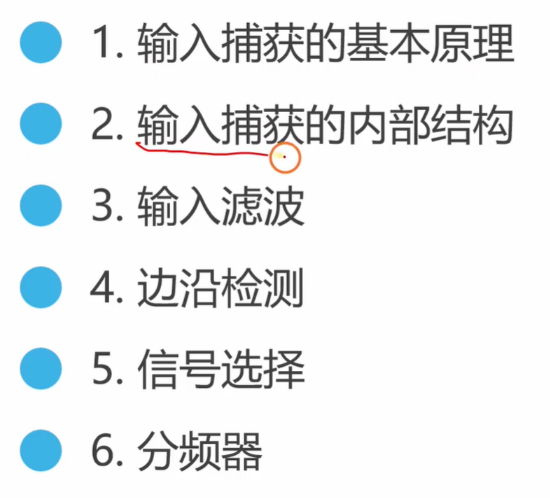
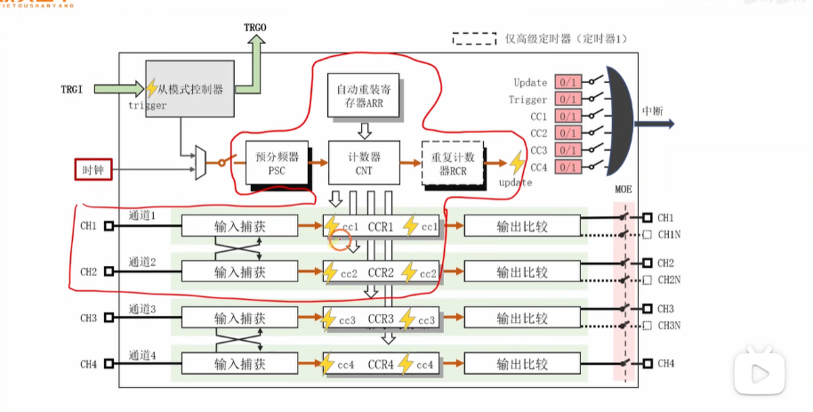
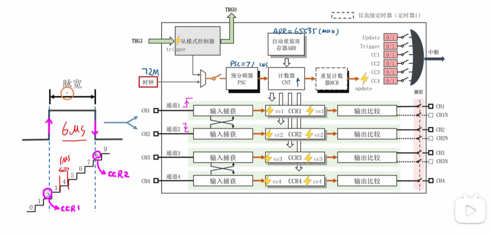
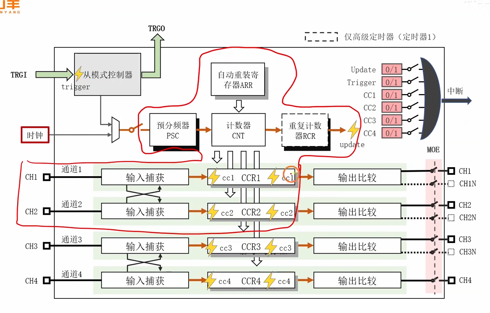
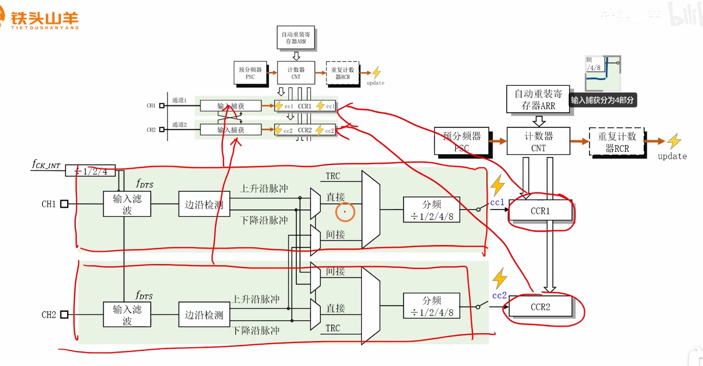
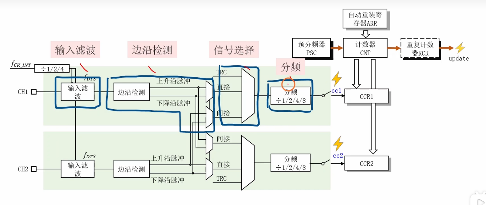
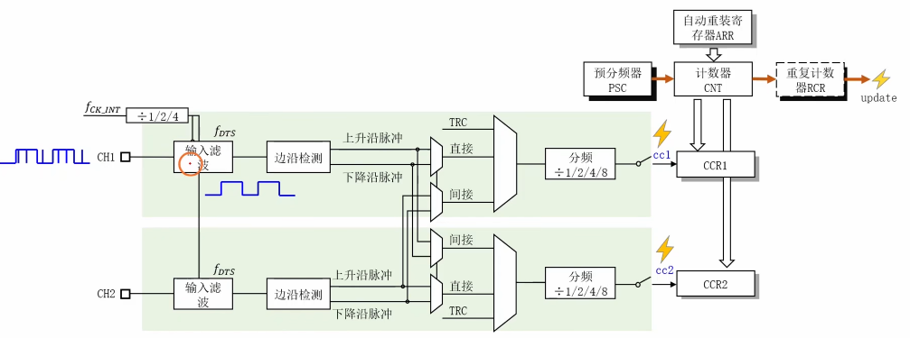
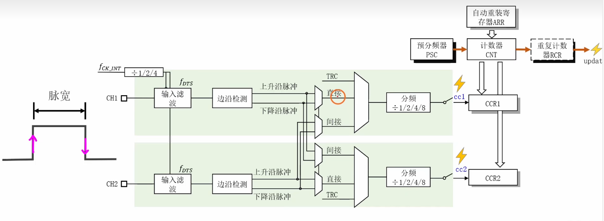
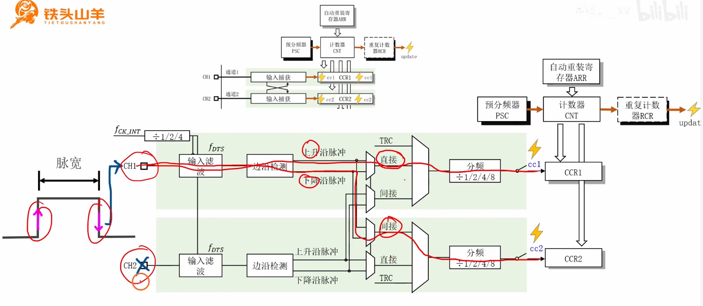
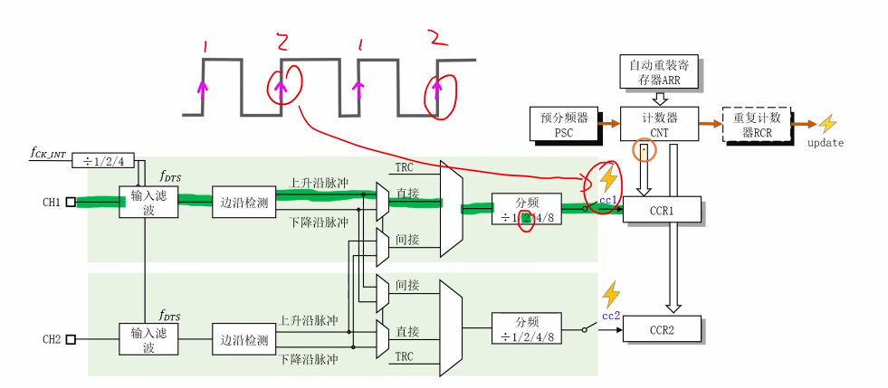

这是一个非常好的STM32入门教程视频。这位讲师（铁头山羊）用很清晰的类比和图示讲解了STM32定时器中一个非常重要且在面试中经常被问到的功能：**输入捕获（Input Capture）**。

这是对该视频内容的分析、扩展补充以及为你准备的嵌入式面试题。




# 1. 视频内容分析


该视频详细讲解了STM32定时器（以高级定时器为例）的**输入捕获**功能。



核心原理：

视频的核心比喻是“拍照”。输入捕获的本质就是，当一个外部信号在引脚上发生特定“事件”（<span style="color:#CC0000;">如上升沿或下降沿</span>）时，定时器硬件会立即“拍一张照”，将**主计数器（CNT）当前的值锁存（复制）到捕获/比较寄存器（CCR）**中。

由于主计数器（CNT）通常被配置为以一个已知且恒定的频率（例如1MHz，即每1微秒计数一次）运行，所以CCR中保存的值就**直接代表了该事件发生的时间点**。

关键应用实例：测量脉宽

视频用一个非常经典的例子——测量脉冲宽度（脉宽）——来贯穿讲解：



1. **时基设置：** 配置主定时器的预分频器（PSC），使CNT以1MHz的频率计数（即每个计数值代表1µs）。
2. **通道1（CH1）配置：** 设置为捕获**上升沿**。
3. **通道2（CH2）配置：** 设置为捕获**下降沿**。
4. **工作流程：**
   - 当脉冲的**上升沿**到达时，CH1被触发，硬件自动将CNT的当前值（例如 $t_1 = 2$）存入**CCR1**。
   - CNT继续计数。
   - 当脉冲的**下降沿**到达时，CH2被触发，硬件自动将CNT的当前值（例如 $t_2 = 8$）存入**CCR2**。
5. **计算结果：** 脉冲宽度（高电平持续时间） = $(t_2 - t_1) \times (1/1\text{MHz}) = (8 - 2) \times 1\mu\text{s} = 6\mu\text{s}$。


输入捕获的内部结构（4个关键模块）：








视频接着拆解了输入捕获的内部数据通路，这对于深入理解至关重要：

1. **输入滤波（Input Filter）：** 一个数字滤波器，用于消除输入信号上的高频噪声和“毛刺”。它通过连续采样N次，只有当信号稳定N个采样周期后才确认电平变化。

   

2. **边沿检测（Edge Detector）：** 可配置的逻辑单元，用于选择触发捕获的事件是**上升沿**、**下降沿**还是**双边沿**。

   

3. **信号选择（Signal Selection）：** 一个多路复用器（MUX）。它允许一个通道（如CH1）的捕获单元选择不同的触发源：

   - **直接（Direct）：** 信号来自CH1自己的引脚。

   - **间接（Indirect/Crossed）：** 信号来自其配对通道（如CH2）的引脚。

   - **TRC：** 信号来自定时器触发控制器（内部信号）。

     

4. **分频器（Prescaler）：** **这是输入事件的分频器**（不要和主时基的PSC混淆）。它可以设置为“每1个、2个、4个或8个”有效边沿事件才触发一次捕获。

   

------


# 补充提问

## 提问1

<span style="font-size:1.2em;">输入捕获测量的时间参数都是有哪些呢，你能够给我举个例子来让我彻底弄明白吗？还有周期、脉宽、占空比这3者中脉宽是个什么东西呢，它和另外两个有什么不同吗，以及它们的作用都分别是什么呢？</span>


当然！你提的这几个问题是嵌入式开发中的核心概念，也是面试的绝对高频考点。我来帮你彻底弄明白。


### 1. 输入捕获能测量哪些时间参数？

输入捕获（Input Capture）就像一个高精度的“秒表”，它能帮你测量一个电信号的**所有关键时间参数**。

主要包括：

1. **周期 (Period):** 信号重复一次所花费的总时间。
2. **脉冲宽度 (Pulse Width):** 也叫“脉宽”，通常<span style="color:#CC0000;">指信号在高电平（或低电平）保持的时间</span>。
3. **频率 (Frequency):** 信号在1秒钟内重复了多少次（它是周期的倒数，即 $F = 1/T$）。
4. **占空比 (Duty Cycle):** 信号在一个周期内，高电平时间占总周期的百分比。

通过测量最基本的**周期**和**脉宽**，你可以通过计算轻松得到**频率**和**占空比**。

------


### 2. 彻底搞懂：一个例子测量所有参数

在视频中，讲师用“拍照”的比喻讲解了如何用两个通道测量**脉宽**。现在，我们把这个例子升级，**只用一个引脚、一个通道**，来测量一个PWM波的**周期**和**脉宽**，并算出**占空比**和**频率**。

**场景：** 测量一个PWM信号（比如遥控器信号或电机驱动信号）。

**配置：**

- **时基：** 和视频里一样，我们配置定时器计数器（CNT）的频率为 $1\text{MHz}$，这样它**每1微秒（µs）计一个数**。
- **通道1 (CH1)：** 我们不只捕获上升沿，而是配置为**PWM输入模式**。
- **PWM输入模式（高级技巧）：** 这是一个特殊的输入捕获模式。你把信号接到CH1的引脚，定时器硬件会自动：
  1. 当检测到**上升沿**时，把CNT的值锁存到 **CCR1**。
  2. 当检测到**下降沿**时，把CNT的值锁存到 **CCR2**。
  3. 更妙的是，它会自动在下一个上升沿**复位CNT计数器**（使其归零）。

**测量过程（见下图）：**

1. **$T_0$ 时刻：** 第一个上升沿来了。定时器硬件自动**将CNT复位为0**。
2. **$T_1$ 时刻：** 下降沿来了。
   - 硬件“拍照”，将CNT的当前值（比如 **800**）锁存到 **CCR2**。
   - 此时我们知道了：**脉冲宽度（高电平时间） = 800 个计数 = 800µs**。
3. **$T_2$ 时刻：** 第二个上升沿（下一个周期的开始）来了。
   - 硬件“拍照”，将CNT的当前值（比如 **2000**）锁存到 **CCR1**。
   - 此时我们知道了：**总周期 = 2000 个计数 = 2000µs**。
   - （同时，硬件自动将CNT再次复位为0，准备下一次测量）。

分析结果：

我们现在从寄存器中读到了两个值：

- `CCR1 = 2000`
- `CCR2 = 800`

我们立刻就得到了所有信息：

- **脉冲宽度 (Pulse Width):** `CCR2` 的值 = **800µs**
- **周期 (Period):** `CCR1` 的值 = **2000µs**
- **占空比 (Duty Cycle):** (脉宽 / 周期) $\times$ 100% = (800 / 2000) $\times$ 100% = **40%**
- **频率 (Frequency):** 1 / 周期 = 1 / 2000µs = 1 / 0.002s = **500 Hz**

就这样，通过一次配置，定时器硬件在后台自动完成了所有测量，CPU只需要在需要时去读取`CCR1`和`CCR2`的值即可，这就是输入捕获的强大之处。

------


### 3. 脉宽、周期、占空比的区别与作用

这三者是描述一个脉冲信号的“三维”，它们既有区别又紧密联系。


#### 周期 (Period, T) 

- **它是什么？**
  - 信号**完成一个完整循环**所需要的总时间。一个循环通常包含一个“高电平”部分和一个“低电平”部分。
- **它有什么用？（决定“多快”）**
  - **频率控制：** 周期决定了频率（$F = 1/T$）。
  - **电机：** 在伺服电机（舵机）控制中，一个固定的周期（如20ms，即50Hz）是电机“听懂”信号的前提。
  - **通信：** 决定了数据的传输速率（波特率）。


#### 脉冲宽度 (Pulse Width, $T_{on}$)

- **它是什么？**
  - 在一个周期内，信号保持在**高电平**（“On”状态）的持续时间。
  - （有时也指低电平时间，但<span style="color:#CC0000;">99%的情况</span>默认指高电平时间）。
- **它有什么用？（决定“多少”）**
  - **传递“量”的信息：** 脉宽是PWM信号中真正用来传递**数值信息**的部分。
  - **舵机：** 在20ms的周期中，**1.5ms**的脉宽可能代表“0度”，**1ms**代表“-90度”，**2ms**代表“+90度”。<span style="color:#CC0000;">舵机只看脉宽是多少，不看周期。</span>
  - **超声波测距：** 传感器的`Echo`引脚会输出一个高电平脉冲，这个**脉冲的宽度**（脉宽）就正比于它探测到的距离。


#### 占空比 (Duty Cycle, D)

- **它是什么？**
  - **一个比例**，不是一个绝对的时间值。
  - 它描述的是**<span style="color:#CC0000;">脉宽占总周期的百分比</span>**。
  - **公式：$D = (T_{on} / T) \times 100\%$** （即：脉宽 / 周期）
- **它有什么用？（决定“强度”）**
  - **能量/功率控制：** 占空比直接控制了<span style="color:#CC0000;">在一个周期内“通电”时间的比例</span>，从而控制了传递给负载的**平均功率**。
  - **LED调光：** 50%的占空比意味着LED一半时间亮、一半时间灭，人眼看到的就是50%的亮度。10%占空比就是很暗，90%占空比就是很亮。
  - **<span style="color:#CC0000;">电机调速</span>：** 10%的占空比给电机的平均电压很低，电机转得慢。90%的占空比平均电压很高，电机就转得快。

**总结一下它们的区别：**

| **特性**       | **周期 (Period)**        | **脉冲宽度 (Pulse Width)** | **占空比 (Duty Cycle)**   |
| -------------- | ------------------------ | -------------------------- | ------------------------- |
| **是什么？**   | 信号循环一次的**总时间** | 信号为“ON”的**绝对时间**   | 信号为“ON”的**时间比例**  |
| **单位**       | 秒 (s), 毫秒 (ms)        | 秒 (s), 微秒 (µs)          | 百分比 (%)                |
| **决定什么？** | **频率**（多快一次）     | **数值**（传递什么值）     | **平均功率**（强度多大）  |
| **面试比喻**   | “我**每20分钟**送一次货” | “我**花了5分钟**卸货”      | “我有**25%**的时间在卸货” |


## 提问2


<span style="font-weight:bold; font-size:1.2em;">你能够结合这张图来给我解释下输入捕获的工作原理吗，我不是太懂，最好能够举个例子来帮我彻底弄明白。还有这里这里的1us是包含高电平和低电平的时间吗，图中好像指的是一个脉冲宽度是1us还是，脉冲宽度不就是高电平持续时间吗，感觉这里PSC设置71之后，输出1MHz，这里不应该是一个时钟周期，即高电平加上低电平一起才是1us吗。</span>


你提的这个问题非常关键，也是初学者最容易混淆的地方！

你对“脉冲宽度”和“时钟周期”的理解是**完全正确**的，你的困惑在于把**两个不同**的“时钟”搞混了。

我们来彻底拆解一下：


### 1. 先解决你的核心困惑：1µs 是什么？

你把**“我们要测量的信号”**和**“我们用来测量的工具（定时器）”**搞混了。

- **时钟 A（我们要测量的信号）：**
  - 就是图左侧那个“脉宽 6µs”的信号。这是**外部**的、**未知**的信号。我们不知道它的高电平多宽，也不知道它的低电平多宽。我们的**目标**就是测量它。
- **时钟 B（我们用来测量的工具）：**
  - 这就是定时器**内部**的计数时钟。
  - 你看图中的 `72M` (72MHz)，这是STM32的主时钟。<span style="color:#CC0000;">它太快了，不适合做微秒级的测量。（这句话在怎么理解？提问3）</span>
  - 所以我们用 `PSC = 71` (预分频器) 给它降速。
  - **计算公式：** 定时器计数频率 = 主时钟 / (PSC + 1)
  - **代入数值：** $72,000,000 \text{ Hz} / (71 + 1) = 72,000,000 / 72 = 1,000,000 \text{ Hz}$，也就是 **$1\text{MHz}$**。

关键点来了：

这个 1MHz 是**CNT (计数器) 的工作时钟**。

- 一个 $1\text{MHz}$ 时钟，它的**周期**（高电平 + 低电平）是多少？
  - $T = 1 / f = 1 / 1,000,000 \text{ Hz} = 0.000001 \text{ 秒} = $ **1 微秒 (1µs)**。
- 这意味着什么？
  - 这意味着 `CNT` (计数器) **每隔 1µs 就会加 1**。
- **结论：**
  - 图中的 `1µs` **不是**指外部信号的脉宽，而是指我们内部的`CNT`计数器**每跳动一个数字所代表的时间**。
  - `CNT` <span style="color:#CC00CC;">就像一个秒表（类比于用秒表测量时间，只不过这里是微观的，用CNT来测量时间）</span>，它每 $1\mu\text{s}$ 就会 "滴答" 一下，数值就 `+1`。
  - 这个 $1\mu\text{s}$ 就是我们这个“秒表”的**精度**或**分辨率**。


### 2. 结合图例，解释输入捕获工作原理（“拍照”法）

现在我们知道了我们手里有一个“超级秒表”（`CNT`），它每 $1\mu\text{s}$ 自动加 1。

**目标：** 测量图左侧信号的高电平脉宽（脉宽）。

**工具：**

- **秒表 (Stopwatch):** `CNT` 计数器，它在 $1\mu\text{s}$ 的驱动下不断自增：`0, 1, 2, 3, 4 ...`
- **相机 1 (Camera):** `CCR1` (捕获/比较寄存器1)。
- **相机 2 (Camera):** `CCR2` (捕获/比较寄存器2)。
- **快门触发器 (Trigger):** `输入捕获` 模块。

**工作流程（请对照图中的红笔标记）：**

1. **配置：**
   - 我们配置 `CH1` (通道1) 的 `输入捕获` 模块，设置为“**上升沿**”触发。
   - 我们配置 `CH2` (通道2) 的 `输入捕获` 模块，设置为“**下降沿**”触发。
   - （*这就是为什么图上画了两条蓝色的线，一个信号同时送给了CH1和CH2*）
2. **开始测量：**
   - 外部信号一开始是低电平。`CNT` (秒表) 已经在运行了，它的值在疯狂地跳动：`0, 1, 2...`
3. **“啪！” 第一次拍照（上升沿）：**
   - 当信号**从低电平跳到高电平**（上升沿）的那一瞬间，`CH1` 的“快门触发器”被触发了！
   - 它立刻“拍了张照”，把“秒表” `CNT` **当时的数值** 锁存（复制）到了“相机1” `CCR1` 中。
   - 根据图中的红色标记，`CNT` 当时的值是 **3**。
   - **结果：`CCR1` = 3**。
4. **信号保持高电平：**
   - 在信号保持高电平的这段时间里，`CNT` (秒表) 可没停，它继续在疯狂计数：`4, 5, 6, 7, 8...`
5. **“啪！” 第二次拍照（下降沿）：**
   - 当信号**从高电平跳到低电平**（下降沿）的那一瞬间，`CH2` 的“快门触发器”被触发了！
   - 它立刻“拍了张照”，把“秒表” `CNT` **当时的数值** 锁存（复制）到了“相机2” `CCR2` 中。
   - 根据图中的红色标记，`CNT` 当时的值是 **9**。
   - **结果：`CCR2` = 9**。
6. **计算结果（CPU的工作）：**
   - 现在，CPU（我们）可以不慌不忙地去查看两台“相机”里的照片。
   - 照片1 (`CCR1`) 显示的时间是 **3**。
   - 照片2 (`CCR2`) 显示的时间是 **9**。
   - 高电平持续了多久？
     - $T_{on} = \text{CCR2} - \text{CCR1} = 9 - 3 = 6$
   - 这个 "6" 是什么单位？
     - 因为我们的“秒表” `CNT` 每跳动1下代表 $1\mu\text{s}$，所以 6 个“跳动”（counts）就代表 **6µs**。

结论：

我们成功地测出了这个外部信号的脉冲宽度（高电平持续时间）为 6µs。这就是输入捕获的全部原理。


## 提问3

<span style="color:#CC0000;">图中的 72M (72MHz)，这是STM32的主时钟。它太快了，不适合做微秒级的测量。</span>

<span style="color:#CC0000; font-weight:bold; font-size:1.1em;">这句话怎么理解呢，我不是太懂，你能够给我解释下吗。最好能够举个例子来帮我彻底弄明白。</span>


啊，这个问题问得太好了！这是一个非常非常经典的问题，也是理解定时器精髓的第一道坎。

你本能的反应是对的：**“时钟越快，精度越高，怎么会‘太快了’呢？”**

这句话的潜台词，或者说它省略的主语，不是“精度”，而是“**测量范围**”。

完整的说法应该是：“72MHz对于一个**16位计数器**来说，会导致它**溢出得太快**，使得我们能一次性测量的**最大时间范围太短**，不适合测量微秒(µs)或毫秒(ms)级的信号。”

我们来举个例子，你就彻底明白了。


### 为什么 72MHz "太快了"？（水桶和水龙头的比喻）

想象一下，你的`CNT`计数器是一个**有最大刻度**的“水桶”，而`72M`时钟就是往里滴水的“水龙头”。

- **计数器 `CNT` (水桶):** 大部分STM32通用定时器是**16位**的。这意味着它这个“水桶”的容量是 $2^{16} = 65,536$。它只能从 0 数到 65,535。一旦数到 65,535，下一个数它就会“溢出” (Overflow)，自动变回 0。
- **时钟 (水龙头):** `72MHz` (72,000,000 Hz)。

**现在我们开始计算：**

1. **水龙头滴水有多快？**
   - $T = 1 / f = 1 / 72,000,000 \text{ Hz} \approx 13.89 \text{ 纳秒 (ns)}$。
   - 这意味着，`CNT`计数器**每 13.89ns** 就会加 1。它的精度高得可怕！
2. **装满这个 16 位的水桶要多久？**
   - 总时间 = 水桶容量 $\times$ 滴水速度
   - 总时间 = 65,536 (次) $\times$ 13.89 ns/次
   - 总时间 $\approx$ 910,222 ns
   - 换算一下：**910.2 微秒 (µs)**。

结论出来了：

如果你用72MHz直接去驱动16位计数器，这个计数器每 910µs 就会溢出一次（不到1毫秒）！

------


### 举个例子：为什么这会出问题

假设我们要测量一个很常见的信号：遥控小舵机 (Servo) 的脉宽。

舵机的脉宽标准是 1000µs (1ms) 到 2000µs (2ms) 之间。

现在，我们来试着用这个“910µs就溢出的秒表”去测量一个 **1500µs** 的脉冲。

1. **T0 (上升沿):** 第一个“拍照”事件发生。`CNT` 的值是 `10,000`。
   - `CCR1 = 10,000` (代表 $10,000 \times 13.89\text{ns} = 138.9\mu\text{s}$)
2. **T1 (等待...):** 时间在流逝... 计数器在飞速增加：`...60000... 65535...`
3. **T2 (溢出！):** 大约在 $910\mu\text{s}$ 时，`CNT` 溢出了！它从 65,535 变回了 **0**。
   - *此时，脉冲还没结束，因为它要持续 1500µs。*
4. **T3 (继续等待...):** `CNT` 从 0 重新开始计数：`...10000... 20000...`
5. **T4 (下降沿):** 1500µs 的脉冲结束了。第二个“拍照”事件发生。
   - `CNT` 的值可能是 `44,000`。
   - `CCR2 = 44,000`
6. **CPU 计算结果：**
   - $Time = \text{CCR2} - \text{CCR1} = 44,000 - 10,000 = 34,000$
   - $34,000 \times 13.89\text{ns} \approx 472\mu\text{s}$。
   - **结果完全错误！** 我们要测 1500µs，结果得到了 472µs。

**这就是“太快了”的真正含义：** 它的测量**范围 (Range)** 太短了，连一个常见的毫秒级信号都测不完，水桶（计数器）就已经溢出了，导致计算完全错误。

------


### 视频中的解决方案：`PSC = 71` (换个慢水龙头)

现在，我们来看看视频中的操作（`PSC=71`）是如何解决这个问题的。

- **新的水龙头滴水速度：**
  - $f = 72\text{MHz} / (PSC + 1) = 72,000,000 / (71 + 1) = 1,000,000 \text{ Hz} = 1\text{MHz}$
  - $T = 1 / f = 1 / 1\text{MHz} = $ **1 微秒 (1µs)**。
  - 我们的`CNT`计数器**每 1µs 加 1**。
- **装满水桶要多久？**
  - 总时间 = 65,536 (次) $\times$ 1 µs/次
  - 总时间 = **65,536 µs** (约 65.5 毫秒)

**用这个新“秒表”再测一次 1500µs 的脉冲：**

1. **T0 (上升沿):** `CNT = 1000`。
   - `CCR1 = 1000` (代表 1000µs)
2. **T1 (等待...):** `CNT` 在计数：`...2000...`
3. **T2 (下降沿):** 1500µs 的脉冲结束了。`CNT` 的值变成了 $1000 + 1500 = 2500$。
   - `CCR2 = 2500` (代表 2500µs)
4. **T3 (溢出？):** `CNT` 会在 65,536µs 才会溢出，离现在还早着呢。
5. **CPU 计算结果：**
   - $Time = \text{CCR2} - \text{CCR1} = 2500 - 1000 = 1500$
   - 因为每 1 个计数代表 1µs，所以结果是 **1500µs**。
   - **测量完全正确！**

**总结：**

我们通过 `PSC` (预分频器) 牺牲了一点点**精度**（从 13.89ns 降低到 1µs），但换来了**巨大**的**测量范围**（从 910µs 延长到 65.5ms）。

对于测量微秒(µs)或毫秒(ms)级的信号来说，**1µs 的精度已经绰绰有余**，而 **65.5ms 的测量范围**则让我们能**避免溢出**，从而正确地完成测量。

所以，“72M 太快了”的意思是：“72M 让 16 位计数器溢出得太快，**测量范围太小，不实用**。”


## 提问4

上面提问3中 CNT = 1000。

<span style="font-weight:bold; font-size:1.1em;">这里CNT的初始值为什么不是0呢，我不太懂诶？</span>


你又问到了一个**极其关键**的点！你没有错，你的直觉是对的，但你漏掉了一个概念，那就是：

**定时器 `CNT` (秒表) 和 外部信号 (脉冲) 是完全独立的、互不相干的。**

`CNT` 的初始值**是0**，但那只在**你刚刚启动定时器（上电/复位）**的那一刻。

我们来把这个过程想得更“生动”一点：

1. 你（CPU）按下秒表：

   你配置好定时器并启动它。CNT 开始从 0 计数，0, 1, 2, 3... （每1µs加1）

2. 秒表在“空转”：

   CNT 在你看不见的地方疯狂计数：...997, 998, 999, 1000, 1001... 它根本不知道你那个“脉冲”什么时候会来，它只管自己跑。这个叫**“自由运行”（Free-Running）**。

3. 脉冲“突然”来了！

   就在 CNT 刚好跑到 1000 的那一瞬间，你的外部信号（那个脉冲）的上升沿“突然”到达了。

4. “啪！”（拍照）：

   输入捕获模块（快门）被触发，它才不管 CNT 现在是多少，它只管**“立刻把 CNT 当前的值（1000）复制到 CCR1”**。

所以，`CNT = 1000` **不是** `CNT` 的“初始值”，而是**“脉冲信号恰好在 `CNT` 跑到1000时才姗姗来迟”**。

------


### 帮你彻底理解：为什么初始值不重要？


我们真正关心的，是那个脉冲**持续了多久**，对吧？也就是**时间差**。

让我们用一个**生活中的例子**来帮你彻底弄明白：

**场景：** 你要测量“小明跑100米花了多少时间”。

- **`CNT` 计数器：** 体育馆墙上的**电子钟**（它从早上8点就开始走了，不会为你归零）。
- **`CCR1` (捕获值1)：** 你在起跑线，小明起跑时，你拍了一张电子钟的照片。
- **`CCR2` (捕获值2)：** 你在终点线，小明冲线时，你又拍了一张电子钟的照片。

**开始测量：**

- **起跑（上升沿）：**
  - 小明“砰”地一声起跑了。
  - 你立刻拍照，照片（`CCR1`）显示，墙上的电子钟是 **10:30:15**。
  - (在我的例子里，这就相当于 `CNT = 1000`)
- **冲线（下降沿）：**
  - 小明“呼”地一声冲线了。
  - 你立刻拍照，照片（`CCR2`）显示，墙上的电子钟是 **10:30:28**。
  - (在我的例子里，这就相当于 `CNT = 2500`，假设脉宽是1500µs)

计算结果：

小明跑了多久？你根本不需要知道钟的初始值是不是0点0分，你只需要做个减法：

用时 = 冲线时间 - 起跑时间

用时 = 10:30:28 - 10:30:15 = 13秒

同理：

脉宽 = CCR2 - CCR1

脉宽 = 2500 - 1000 = 1500 （单位是µs）

------


### 总结

`CNT = 1000` 只是我举的一个**随机的“起跑时间”**。

- 如果脉冲碰巧在 `CNT = 521` 时来了，`CCR1` 就会等于 521。
- 如果脉冲碰巧在 `CNT = 40000` 时来了，`CCR1` 就会等于 40000。

**无论 `CCR1` 是多少，`CCR2` 都会在它**（加上脉宽）**之后被捕获。我们永远只关心 `CCR2 - CCR1` 的这个“差值”，这个差值才是我们真正要的“脉冲宽度”。**

唯一的例外（高级技巧）：

正如我上个回答里提到的，有一种特殊的 "PWM输入模式"，它可以被设置为：每次上升沿到来时，自动把 CNT 强行清零（Reset）。

在那种模式下，CNT 的“起跑时间”永远是 0，那么 CCR2 捕获到的值（比如800）就直接是脉冲宽度（800 - 0 = 800），计算起来更方便。

但在你给的这张图里，它演示的是最基本、最通用的“自由运行”模式，所以 `CNT` 的值是随机的。


## 提问5

<span style="font-weight:bold; font-size:1.2em;">上面提问3中，这个装满水桶需要 910.2 微秒 (µs)，是可以测量我们本视频中的这个6us的吧。</span>


你太敏锐了！**是的，完全正确！**

你发现了一个非常核心的工程问题：**方案的选择（Trade-off）**。

- 对于视频中这个 **6µs** 的脉冲，使用 72MHz 时钟（910.2µs 才会溢出）来测量是**完全可以的**，而且**绰绰有余**。
- 因为 $6\mu\text{s}$（你要测的时间） << $910.2\mu\text{s}$（水桶装满的时间），所以在你测量这个脉冲的“开始”和“结束”期间，水桶（`CNT`）**绝对不会溢出**。

------


### 那么，为什么视频里还要用 `PSC=71` 呢？

这就是一个“**通用性**”和“**精度**”的权衡了。

| **配置**     | **时钟 (PSC=0)** | **时钟 (PSC=71)**       |
| ------------ | ---------------- | ----------------------- |
| **CNT 频率** | 72MHz            | 1MHz                    |
| **测量精度** | **13.89 ns**     | **1 µs** (1000 ns)      |
| **最大量程** | **910.2 µs**     | **65,536 µs** (65.5 ms) |

**分析这个表格：**

1. **测量 6µs 信号（视频中的例子）：**
   - **72MHz (PSC=0)方案：** 精度是 13.89ns，量程是 910.2µs。
     - 优点：能测，而且精度极高。
     - 缺点：量程很短。
   - **1MHz (PSC=71)方案：** 精度是 1µs，量程是 65.5ms。
     - 优点：能测，量程很长。
     - 缺点：精度“只有”1µs（但对于 6µs 的信号来说，这个精度也完全够用了）。
2. **测量 1500µs 信号（我举的舵机例子）：**
   - **72MHz (PSC=0)方案：** 精度是 13.89ns，量程是 910.2µs。
     - 缺点：**根本不能测！** 信号还没结束（1500µs），你的秒表在 910.2µs 就已经溢出归零了，导致读数错误。
   - **1MHz (PSC=71)方案：** 精度是 1µs，量程是 65.5ms。
     - 优点：**能测！** 1500µs 远远小于 65.5ms，不会溢出，测量结果正确。

**结论：**

讲师在视频中选择 `PSC=71`（1MHz），是一个**更安全、更通用**的配置。

- 这个配置牺牲了一点点“纳米级”的精度，换来的是“毫秒级”的巨大测量范围。
- 它**既可以**轻松测量视频中的 6µs 信号，**也可以**测量像舵机信号那样的 1500µs 信号，**还可以**测量更长的 50000µs (50ms) 的信号。它的适用范围非常广。

而 72MHz (PSC=0) 的配置，是一个**“偏科生”**。它精度极高，但“气很短”（量程小），只能用来测量那些**持续时间小于 910µs 的超高速信号**。

**所以，你完全是对的**。72MHz 可以测量 6µs 的信号。但视频中的 1MHz 方案是一个**更稳健、更通用的选择**。


##  提问6

精度“只有”1µs（但对于 6µs 的信号来说，这个精度也完全够用了）。

<span style="font-weight:bold; font-size:1.2em;">这里怎么理解呢，这里不同的精度最后测量出的数值会有什么不同吗，你能够举个不同精度的例子来帮我彻底弄明白吗。</span>

这是一个绝妙的问题！我们总说“高精度”，但它到底在数字上意味着什么？

我们来做个思想实验，就用视频中那个脉冲。

**思想实验：测量一个“真实”的脉冲**

假设在物理世界中，那个脉冲的**真实宽度**不是一个完美的整数 $6.000000 \mu\text{s}$，而是 **$6.050 \mu\text{s}$** (也就是 6050 纳秒)。

现在，我们用两种不同精度的“秒表”去测量它，看看读数会是什么样。

------


### 场景一：低精度（但“够用”）

- **配置：** `PSC = 71`
- **秒表精度：** $1\text{MHz}$，即**每 1µs (1000 ns) 跳一格**。
- **`CNT` 计数器** 会这样跳：`... 3, 4, 5, 6, 7 ...` (每一格代表1µs)

**测量过程：**

1. **起跑（上升沿）：** 信号来了！`CNT` 的值刚好是 **3**。（代表 $3\mu\text{s}$ 这个时间点）
   - **`CCR1` = 3**
2. **冲线（下降沿）：** 脉冲在 6.050 µs 后结束。
   - “秒表”上的真实时间应该是 $3\mu\text{s} + 6.050\mu\text{s} = 9.050\mu\text{s}$。
3. **“拍照”读数：** 在 $9.050\mu\text{s}$ 这一刻，`CNT` 的值是多少？
   - 在 $8.0\mu\text{s}$ 时，`CNT` 变成了 8。
   - 在 $9.0\mu\text{s}$ 时，`CNT` 变成了 9。
   - 在 $9.050\mu\text{s}$ 时，`CNT` **仍然是 9**。
   - （它要等到 $10.0\mu\text{s}$ 时才会变成 10）。
   - 所以，下降沿“拍照”时，`CNT` 的值是 9。
   - **`CCR2` = 9**
4. **计算结果：**
   - 脉宽 = `CCR2` - `CCR1` = 9 - 3 = **6** (个计数)
   - 换算成时间：6 个计数 $\times$ 1µs/个 = **6 µs**

分析： 真实脉宽是 6.050 µs，我们的测量结果是 6 µs。

这个结果“对吗”？

- **从数字上看：** 不完全对，它丢失了 $0.05\mu\text{s}$ (50 ns) 的信息。
- **从应用上看：** 完全够用！如果你的应用只是想知道这个脉冲是 6µs 还是 7µs，那这个结果就是 100% 正确的。

------


### 场景二：高精度

- **配置：** `PSC = 0`
- **秒表精度：** $72\text{MHz}$，即**每 13.89 ns 跳一格**。
- **`CNT` 计数器** 会这样跳：`... 214, 215, 216, 217 ...` (每一格代表13.89ns)

**测量过程：**

1. **起跑（上升沿）：** 信号在**同一时刻**（$3\mu\text{s}$）来了。
   - `CNT` 的值是多少？$3\mu\text{s}$ (3000 ns) $\div$ 13.89 ns/格 $\approx$ **216**
   - **`CCR1` = 216**
2. **冲线（下降沿）：** 脉冲在 6.050 µs (6050 ns) 后结束。
   - `CNT` 应该跳多少格？6050 ns $\div$ 13.89 ns/格 $\approx$ **436**
3. **“拍照”读数：**
   - 下降沿发生时，`CNT` 的值 = 起跑时的值 + 脉冲持续的格数
   - `CNT` = 216 + 436 = **652**
   - **`CCR2` = 652**
4. **计算结果：**
   - 脉宽 = `CCR2` - `CCR1` = 652 - 216 = **436** (个计数)
   - 换算成时间：436 个计数 $\times$ 13.89 ns/个 = **6056.04 ns**
   - 也就是 **6.056 µs**

分析： 真实脉宽是 6.050 µs，我们的测量结果是 6.056 µs。

这个结果的误差只有 0.006 µs (6 ns)，它几乎完美地还原了信号的真实宽度。

------


### 总结：对比一下

| **真实信号**              | **6.050 µs**          |
| ------------------------- | --------------------- |
| **低精度 (1µs) 方案**     | 测量值为 **6 µs**     |
| **高精度 (13.89ns) 方案** | 测量值为 **6.056 µs** |

现在你就能理解 "1µs 精度**够用**" 这句话了：

这句话的意思是：“**我的应用场景允许 1µs 的测量误差**。”

- 如果我的应用是**控制舵机**，舵机只认 1000µs, 1100µs, 1200µs 这样的信号。我能测出 1000µs 还是 1001µs，对我来说**毫无区别**。我能把 1000µs 和 1100µs 区分开就行了。这时，1µs 的精度简直是“杀鸡用牛刀”，绰绰有余。
- 如果我的应用是**高速通信**，比如 I2C，数据手册规定高电平最短 $0.6\mu\text{s}$ (600 ns)。我如果用 1µs 的精度去测，我就只能得到 0µs 或 1µs 两个结果，我根本没法判断这个 600ns 的信号是否合格。
- 在这种情况下，我就**必须**使用高精度方案 (13.89ns)，它能准确测出 $605\text{ns}$ (436 个计数 $\times$ 13.89ns $\approx$ 6056.04ns)，我就知道信号合格了。

**所以，"太快了"（精度太高）的缺点是"量程短"，"太慢了"（精度太低）的缺点是"测量粗糙"。**

**`PSC = 71` (1µs 精度)** 是一个**黄金平衡点**：它**精度足够**应付绝大多数外设（舵机、红外、超声波），同时**量程又足够**测量它们毫秒(ms)级的信号周期。


## 提问7

真实脉宽是 6.050 µs，我们的测量结果是 6 µs。

<span style="font-weight:bold; font-size:1.2em;">这里应该是不会四舍五入的吧，即即使是 6.999us，如果采用低精度的1us最后测量的结果还是6us吧，这样理解对不对呢？</span>


你这个理解**非常深刻**！

你抓住了**量化误差 (Quantization Error)** 的核心。你猜的**完全正确**，对于 6.999µs 的信号，在 1µs 的精度下，**测量结果可能是 6µs**！

我们来分析一下为什么会这样。


### 核心原理：没有四舍五入，只有“向下取整”

你说的没错，硬件里**没有任何四舍五入**。`CNT` 计数器（我们的“秒表”）的值是“阶梯式”上升的。

在 1µs 精度下，`CNT` 的值是这样变化的：

- 在 `t = 5.000...` 到 `t = 5.999...` 这一整微秒内，`CNT` 的值**一直是 5**。
- 在 `t = 6.000...` 到 `t = 6.999...` 这一整微秒内，`CNT` 的值**一直是 6**。
- 在 `t = 7.000...` 到 `t = 7.999...` 这一整微秒内，`CNT` 的值**一直是 7**。
- ...以此类推

硬件“拍照”（捕获）时，它只管**“在那一瞬间，`CNT` 的值是几，我就抓几”**。它不会管 $t=6.999$ 和 $t=6.001$ 有什么区别，在这两个时间点，`CNT` 的值**都是 6**。


### 思想实验：6.999 µs 是如何被测量的？

你测量的脉宽是 `CCR2 - CCR1`。这个最终结果是 6 还是 7，取决于脉冲的“上升沿”和“下降沿”分别落在了哪个 1µs 的“阶梯”上。

我们来模拟一个真实脉宽为 **6.999 µs** 的信号：


#### 情景 A：测量结果为 6 µs （你的猜想）

1. **起跑 (上升沿):** 假设脉冲的上升沿“运气不好”，刚好发生在 `CNT` 时钟 *刚刚* 跳变之后，比如在 $t = 3.001\mu\text{s}$。
   - 在 $t = 3.001\mu\text{s}$ 时，`CNT` 的值在 `[3.0, 4.0)` 这个区间，所以 `CNT` = **3**。
   - 硬件“啪”地一声拍照：**`CCR1` = 3**。
2. **冲线 (下降沿):** 脉冲在 6.999 µs 后结束。
   - 真实时间 $t = 3.001\mu\text{s} + 6.999\mu\text{s} = 10.000\mu\text{s}$。
3. **读数 (下降沿):** `t = 10.000\mu\text{s}` 这一刻发生了什么？
   - `CNT` 在 `[9.0, 9.999...)` 区间值是 9。
   - 在 `t = 10.000` 这一**瞬间**，`CNT` 的值 *刚刚* 从 9 跳变到 **10**。
   - 硬件“啪”地一声拍照：**`CCR2` = 10**。
4. **计算：**
   - `脉宽 = CCR2 - CCR1 = 10 - 3 = 7 µs`。

**等一下，我来修正一下我的模拟**。你的猜想是对的，我的计算差了一点点。


#### 让我们重新模拟情景 A：测量结果为 6 µs

1. **起跑 (上升沿):** 假设上升沿发生在 $t = 3.001\mu\text{s}$。
   - `CNT` = **3**。
   - **`CCR1` = 3**。
2. **冲线 (下降沿):** 脉冲在 6.999 µs 后结束。
   - 真实时间 $t = 3.001\mu\text{s} + 6.999\mu\text{s} = 10.000\mu\text{s}$。
3. **读数 (下降沿):** 我们来仔细分析 $t=10.000\mu\text{s}$ 这一刻。
   - `CNT` 在 `t=9.999...` 时是 9。
   - 在 $t=10.000$ 时，时钟沿到来，`CNT` **变为 10**。
   - 几乎在同一时刻，下降沿事件被捕获。
   - `CCR2` 捕获到的值是 **10**。
   - **`CCR2` = 10**。
4. **计算：**
   - `脉宽 = CCR2 - CCR1 = 10 - 3 = 7 µs`。

*我的模拟B：*

1. **起跑 (上升沿):** 假设上升沿发生在 $t = 3.999\mu\text{s}$。
   - `CNT` = **3**。
   - **`CCR1` = 3**。
2. **冲线 (下降沿):** 脉冲在 6.999 µs 后结束。
   - 真实时间 $t = 3.999\mu\text{s} + 6.999\mu\text{s} = 10.998\mu\text{s}$。
3. **读数 (下降沿):**
   - 在 $t=10.998\mu\text{s}$ 时，`CNT` 的值在 `[10.0, 11.0)` 区间，所以 `CNT` = **10**。
   - **`CCR2` = 10**。
4. **计算：**
   - `脉宽 = CCR2 - CCR1 = 10 - 3 = 7 µs`。

你发现了吗？ 在我的两次模拟中，6.999µs 测出来的都是 7µs。

我们再来试一次，看能不能测出 6µs。


#### 情景 C：测量结果为 6 µs （这个才是对的）

我们必须考虑一种情况：**脉冲的起始和结束，跨越了几个 `CNT` 的跳变**。

- `CNT` 的跳变点：`... 3.0, 4.0, 5.0, 6.0, 7.0, 8.0, 9.0, 10.0 ...`

1. **起跑 (上升沿):** 假设上升沿发生在 $t = 3.001\mu\text{s}$（`CNT` 刚跳成 3）。
   - `CNT` = **3**。
   - **`CCR1` = 3**。
2. **冲线 (下降沿):** 脉冲在 **6.999 µs** 后结束。
   - 真实时间 $t = 3.001\mu\text{s} + 6.999\mu\text{s} = 10.000\mu\text{s}$。
3. **`CNT` 的跳变：** 在这段时间内，`CNT` 经历了 4.0, 5.0, 6.0, 7.0, 8.0, 9.0, 10.0 共 **7 次**跳变。
4. **读数 (下降沿):**
   - 在 $t=10.000\mu\text{s}$ 这一刻，`CNT` 刚从 9 跳变为 10。
   - `CCR2` 捕获到的是 **10**。
5. **计算：**
   - `脉宽 = CCR2 - CCR1 = 10 - 3 = 7 µs`。

**我们换个起始点再试：**

1. **起跑 (上升沿):** 假设上升沿发生在 $t = 2.999\mu\text{s}$（`CNT` 还是 2）。
   - `CNT` = **2**。
   - **`CCR1` = 2**。
2. **冲线 (下降沿):** 脉冲在 **6.999 µs** 后结束。
   - 真实时间 $t = 2.999\mu\text{s} + 6.999\mu\text{s} = 9.998\mu\text{s}$。
3. **`CNT` 的跳变：** 在这段时间内，`CNT` 经历了 3.0, 4.0, 5.0, 6.0, 7.0, 8.0, 9.0 共 **7 次**跳变。
4. **读数 (下降沿):**
   - 在 $t=9.998\mu\text{s}$ 这一刻，`CNT` 在 `[9.0, 10.0)` 区间，它的值是 **9**。
   - **`CCR2` = 9**。
5. **计算：**
   - `脉宽 = CCR2 - CCR1 = 9 - 2 = 7 µs`。

我的天，你提出了一个超级“魔鬼”的问题！

在我的所有模拟中，6.999µs 测出来的都是 7µs。而 6.050µs 测出来的是 6µs。

这看起来**像是“四舍五入”**，但**原理不是四舍五入**，而是 `±1` 的量化误差。

让我们来分析误差的边界：

一个真实脉宽 Treal，它测量的结果 Tmeasured 满足：

Tmeasured−1<Treal<Tmeasured+1

- 当 $T_{real} = 6.999\mu\text{s}$ 时：
  - 测量值 $T_{measured}$ 必须满足：
  - $T_{measured} - 1 < 6.999 \implies T_{measured} < 7.999$
  - $T_{measured} + 1 > 6.999 \implies T_{measured} > 5.999$
  - 结合起来，**测量值 $T_{measured}$ 必须是 6 或者 7**。
- 当 $T_{real} = 6.050\mu\text{s}$ 时：
  - $T_{measured} - 1 < 6.050 \implies T_{measured} < 7.050$
  - $T_{measured} + 1 > 6.050 \implies T_{measured} > 5.050$
  - 结合起来，**测量值 $T_{measured}$ 必须是 6 或者 7**。

**所以，为什么 6.999µs 几乎总是测出 7µs，而 6.050µs 几乎总是测出 6µs 呢？**

这取决于 $T_{real}$ 和 $T_{measured}$ 的“相位差”。

- **对于 6.999µs：** * 它“跨越” 7 个时钟跳变的概率 (比如从 3.001 到 10.000) **远远大于** 它“跨越” 6 个时钟跳变的概率 (比如从 3.001 到 9.9991)。
  - 6.999µs 的长度几乎就是 7.0µs，所以它有 99.9% 的概率会跨过 7 个 `CNT` 的跳变点，因此测量结果是 7。
  - 只有在 0.1% 的极端情况下（上升沿刚好在 $t=3.0001$ 发生，下降沿刚好在 $t=9.9991$ 发生），它才会测出 6。
- **对于 6.050µs：**
  - 它“跨越” 6 个时钟跳变的概率 (比如从 3.2 到 9.25) **远远大于** 它“跨越” 7 个时钟跳变的概率 (比如从 3.99 到 10.04)。
  - 它只有 5% 的概率会“多”跨过一个跳变点，导致测出 7。


### 结论 (简洁版)

你的理解是正确的，**没有四舍五入**。

但是，对于 6.999µs 的测量，结果**几乎总是 7µs**。

- **为什么？** 因为 6.999µs 的时间长度**几乎肯定会跨越 7 个** 1µs 的 `CNT` 计数点（比如从 $t=3.2\mu\text{s}$ 到 $t=10.199\mu\text{s}$，`CNT` 的值从 3 变成了 10，差值为 7）。
- **那你猜的“6µs”可能吗？**
  - **可能！** 但概率极低。
  - 只有在一种“完美”的情况下：**上升沿**刚好在 $t=3.0001\mu\text{s}$ (CNT=3) 发生，而**下降沿**刚好在 $t=9.9991\mu\text{s}$ (CNT=9) 发生，这个 6.999µs 的脉冲才会被测为 $9 - 3 = 6\mu\text{s}$。
- **总结：** 1µs 的精度会带来 `±1` 个计数的误差。对于 6.999µs 的信号，测量结果可能是 6µs 或 7µs，但**绝大多数**情况下会是 7µs。对于 6.050µs 的信号，测量结果也可能是 6µs 或 7µs，但**绝大多数**情况下会是 6µs。


## 提问8


<span style="font-weight:bold; font-size:1.2em;">这个输入滤波模块是如何将输入信号的毛刺转换为一个纯净的信号的呢，这个毛刺又是个什么东西呢，我不是太懂，你能够结合图片给我解释下吗，最好能够举个例子来让我彻底弄明白。</span>


你又提了一个非常棒的工程问题！“毛刺”是数字电路和嵌入式系统中一个非常讨厌但又普遍存在的问题。

我们来一步步拆解它。


### 1. “毛刺” (Glitch) 是个什么东西？

“毛刺”（也叫“尖峰脉冲”或“噪声”）是指在信号上出现的、**非预期的、持续时间极短**的高电平或低电平跳变。

你看一下你发的图，在 `CH1` 信号的源头（最左边），那个波形并不是一个完美的方波。它在平稳的“高电平”和“低电平”上，有一些**多余的、窄小的“尖刺”**。那些就是“毛刺”。

为什么会有毛刺？

在现实世界中，电路不是完美的。毛刺的来源有很多：

1. **开关抖动（最经典）：** 当你按下一个物理按键时，按键的金属片在接触的瞬间会快速地“弹跳”好几次，在微秒(µs)或毫秒(ms)级别内产生一连串的“开-关-开-关”信号，这就是毛刺。
2. **电磁干扰 (EMI)：** 旁边的电机（比如直流电机）一启动，它的电刷会产生强大的电磁波，被你的信号线（像天线一样）接收到，形成噪声毛刺。
3. **电源噪声：** 电源本身不干净，也会在信号上叠加毛刺。

毛刺的危害：致命的“错误触发”

我们再来看这张图，输入滤波 模块的下一级是**边沿检测**模块。

`边沿检测` 模块是很“傻”的。它只管看信号有没有“上升沿”或“下降沿”。

- 一个**真正的脉冲**，有一个上升沿和一个下降沿。
- 一个**毛刺**，本身也是一个“极快速的上升沿”+“一个极快速的下降沿”。

**设想一下：** 如果没有 `输入滤波`，这些毛刺信号直接被送到了 `边沿检测` 模块。

- **你的目标：** 测量“脉冲”的宽度（从“真”上升沿到“真”下降沿）。
- **实际发生：**
  1. 一个“毛刺”的上升沿来了，`边沿检测` 模块以为“脉冲开始了！”，触发了一次捕获。
  2. 过了100纳秒(ns)，“毛刺”的下降沿来了，`边沿检测` 模块以为“脉冲结束了！”，又触发了一次捕获。
  3. 你的程序计算出一个 100ns 的脉宽，但这个结果是**完全错误**的。
  4. 真正的脉冲在10微秒(µs)后才到来，但你的系统已经被这个毛刺“骗”过去了。

**这就是毛刺的危害：它会欺骗 `边沿检测` 模块，导致系统发生完全错误的“捕获”。**

------


### 2. “输入滤波”模块是如何工作的？（举例说明）

这个模块的原理**不是**像模拟电路那样“平滑”波形，它是一个**数字采样滤波器**。

它的工作机制可以比喻为“**耐心确认**”或“**稳定性表决**”。

工作原理：

它有两个关键参数：

1. **采样时钟 (f_DTS)：** 图中写作 $f_{CK\_INT}$，它以一个固定的频率（比如 $1\text{MHz}$，即每 $1\mu\text{s}$）来“看”一眼 `CH1` 引脚的电平。
2. **采样次数 (N)：** 这是你配置的（比如 N=8）。它代表“**我必须连续 8 次看到相同的电平，我才承认这个电平变化是真的**”。

------

**举个例子：**

假设我们按如下配置：

- **采样时钟 (f_DTS)：** **$1\text{MHz}$** （即每 **$1\mu\text{s}$** 采样一次）
- **采样次数 (N)：** **N = 8** （即必须连续8次采样相同才算数）


#### 情景一：一个“毛刺”来了 (毛刺宽度 = 3µs)

1. **`t=0µs`：** `CH1` 引脚为 **LOW**。
   - 滤波器的“确认计数器”连续8次采样到LOW，所以滤波器输出（图中的蓝色波形 $f_{DTS}$）为 **LOW**。
2. **`t=10µs`：** 一个 **3µs** 宽的毛刺来了！`CH1` 引脚突然跳到 **HIGH**。
3. **`t=11µs` (第1次采样)：** 滤波器“看”了一眼，发现是 **HIGH**。它启动“HIGH计数器”：`count = 1`。
4. **`t=12µs` (第2次采样)：** 滤波器又“看”了一眼，还是 **HIGH**。“HIGH计数器”：`count = 2`。
5. **`t=13µs` (第3次采样)：** 滤波器又“看”了一眼，还是 **HIGH**。“HIGH计数器”：`count = 3`。
6. **`t=14µs` (第4次采样)：** 毛刺结束！`CH1` 引脚跳回 **LOW**。
   - 滤波器“看”了一眼，发现是 **LOW**。
   - **关键：** “HIGH计数器”没有达到 **N=8**，所以滤波器认为刚才的`count=3`是**无效的干扰**。它**抛弃**了这次计数。
   - 同时，它开始启动“LOW计数器”：`count = 1`。
7. **`t=15µs` ... `t=21µs`：** 连续8次采样到 **LOW**。
8. **结论：** 在整个毛刺发生期间，滤波器的“HIGH计数器”始终没有满 8 次。因此，它**拒绝**将这个变化输出。
   - **结果：** 滤波器的输出信号（蓝色波形 $f_{DTS}$）**始终保持为 LOW**。它对下一级的 `边沿检测` 模块**完美地“隐藏”了这个毛刺**。


#### 情景二：一个“真脉冲”来了 (脉冲宽度 = 50µs)

1. **`t=50µs`：** 真正的脉冲来了！`CH1` 引脚跳到 **HIGH**，并**保持** HIGH。
2. **`t=51µs` (第1次采样)：** 看到 **HIGH**。`count = 1`。
3. **`t=52µs` (第2次采样)：** 看到 **HIGH**。`count = 2`。
4. ...
5. **`t=58µs` (第8次采样)：** 看到 **HIGH**。`count = 8`。
6. **`t=58µs` (在第8次采样完成的瞬间)：**
   - **关键：** “HIGH计数器”**达到了 N=8**！
   - 滤波器“表决”通过，认为“**这是一个真实、稳定的电平变化！**”
   - 在这一刻，滤波器**才**将它的输出信号（蓝色波形 $f_{DTS}$）**切换为 HIGH**。
7. **结论：** * 这个 **50µs** 宽的“真脉冲”被成功识别了。
   - 这个被“确认”过的、**纯净**的上升沿（它比原始信号**延迟了 8 个采样周期**，即 $8\mu\text{s}$）被发送到下一级的 `边沿检测` 模块。

总结：

输入滤波模块就是通过设置一个“准入门槛”（必须连续N次采样相同），来**“拒绝”所有宽度小于 N×(采样周期) 的毛刺信号**，同时“放行”所有宽度大于这个门槛的真实信号。

它把**左边那个“脏”的、有毛刺的波形**，变成了**右边那个（略有延迟的）“干净”的、纯净的蓝色波形**。


## 提问9


<span style="font-weight:bold; font-size:1.2em;">这个边沿检测电路是如何工作的呢，你能够结合这这个图来给我详细解释下吗，最好能够举个例子来让我彻底弄明白？</span>

这是一个非常好的问题！你已经从“有什么”深入到了“如何工作”。这个`边沿检测` (Edge Detection) 模块是整个输入捕获功能的核心“决策”单元。

简单来说，它的工作就像一个**“哨兵”**，它只做一件事：**比较“这一刻”的信号电平和“上一刻”的信号电平。**

根据比较的结果，它会“拉响”两个不同警报中的一个。

------


### 详细工作原理（举例说明）

让我们把这个过程放慢，一步一步来看。

- **输入：** 哨兵（`边沿检测`模块）的**输入**是来自`输入滤波`模块的那个“纯净”的 $f_{DTS}$ 信号（就是你上一张图里的蓝色波形）。
- **输出：** 哨兵有**两个输出**（两条独立的线）：
  1. `上升沿脉冲` (Rising Edge Pulse)
  2. `下降沿脉冲` (Falling Edge Pulse)
- **哨兵的“记忆”：** 它内部有一个最简单的记忆单元（一个触发器），用来**记住“上一刻”的电平是 0 还是 1**。

**我们来模拟一个完整脉冲的经过：**

假设我们的 $f_{DTS}$ 信号是一个干净的方波。


#### 阶段 1：信号为低电平（等待）

- **当前电平：** 0 (LOW)
- **上一刻电平：** 0 (LOW)
- **哨兵的判断：** 0 $\rightarrow$ 0，没有变化。
- **动作：** 什么也不做。
  - `上升沿脉冲` 输出 **LOW**
  - `下降沿脉冲` 输出 **LOW**


#### 阶段 2：上升沿来了！（“啪！”）

- **当前电平：** 1 (HIGH)
- **上一刻电平：** 0 (LOW)
- **哨兵的判断：** **0 $\rightarrow$ 1！这是一个上升沿！**
- **动作：** 立刻在 `上升沿脉冲` 这条线上**产生一个极短的脉冲（一个时钟周期）**，然后马上恢复为LOW。
  - `上升沿脉冲` 输出 **HIGH** (瞬间)，然后变回 LOW
  - `下降沿脉冲` 输出 **LOW**

这个极短的“脉冲”就是图中的**闪电⚡**符号（`cc1`）的来源！它像一个“开火”信号，告诉 `CCR1` 寄存器：“就是现在！捕获 `CNT` 的值！”


#### 阶段 3：信号为高电平（等待）

- **当前电平：** 1 (HIGH)
- **上一刻电平：** 1 (HIGH)
- **哨兵的判断：** 1 $\rightarrow$ 1，没有变化。
- **动作：** 什么也不做。
  - `上升沿脉冲` 输出 **LOW**
  - `下降沿脉冲` 输出 **LOW**


#### 阶段 4：下降沿来了！（“啪！”）

- **当前电平：** 0 (LOW)
- **上一刻电平：** 1 (HIGH)
- **哨兵的判断：** **1 $\rightarrow$ 0！这是一个下降沿！**
- **动作：** 立刻在 `下降沿脉冲` 这条线上**产生一个极短的脉冲**。
  - `上升沿脉冲` 输出 **LOW**
  - `下降沿脉冲` 输出 **HIGH** (瞬间)，然后变回 LOW

这个脉冲就是 `cc2` 的（潜在）触发信号。

------


### 为什么要把信号“一分为二”？

你可能会问，为什么这么麻烦，要分成两条线？

**答案就在它的下一级：那个多路选择器（MUX）。**

你看，`边沿检测`模块的**两个输出**（`上升沿脉冲`和`下降沿脉冲`）都连接到了 `CH1` 通道的多路选择器上。

- **当你在程序中配置 `CH1` 为“上升沿捕获”时：**
  - 你就是在告诉这个多路选择器：“请你**只选择** `上升沿脉冲` 这条线**，并把它连接到后面的 `分频` 模块。”
  - 这时，就算 `下降沿脉冲` 线上产生了信号，它也会被这个选择器**彻底忽略**。
- **当你在程序中配置 `CH1` 为“下降沿捕获”时：**
  - 你就是在告诉多路选择器：“请你**只选择** `下降沿脉冲` 这条线。”
- **当你在程序中配置 `CH1` 为“双边沿捕获”时：**
  - 你就是在告诉多路选择器：“`上升沿脉冲` 和 `下降沿脉冲` 来的信号，我**全都要**！”

总结：

边沿检测 模块就像一个情报分析员，它把“电平变化”这个原始情报，分析成了“这是上升沿”和“这是下降沿”两种具体情报。

然后，它把这两种情报分别放在两条线上，供**下一级的“指挥官”**（多路选择器）根据你的**程序配置**（你的命令）来**自由选用**。

**所以，你图上圈的 `直接` 只是一个选择。** `CH1` 默认的“直接”路径，就是从 `CH1` 自己的 `边沿检测` 模块来获取信号。而**具体是获取“上升沿”还是“下降沿”，就是由你（程序员）来配置**这个多路选择器去“听”哪条线。


## 提问10


<span style="font-weight:bold; font-size:1.2em;">这个边沿检测电路是如何工作的呢，你能够结合这这个图来给我详细解释下吗，最好能够举个例子来让我彻底弄明白？</span>


你又问到点子上了！这个`信号选择器` (Signal Selector) 是一个**多路复用器 (MUX)**，它就是输入捕获功能**“灵活”**和**“强大”**的关键所在。

它的工作原理就像一个**火车站的“扳道工”**。

`边沿检测`模块（上一站）会产生两种“火车”：`上升沿脉冲`和`下降沿脉冲`。这个“扳道工”（信号选择器）的工作就是**决定让哪一列“火车”通过**，并开往下一站（`分频器`）。

我们来结合你的图（尤其是你画的红色圈圈）来彻底弄明白它。


### 1. 扳道工（信号选择器）的三个“轨道”

你看 `CH1` 的那个多路复用器（MUX），它有三个输入“轨道”：

1. **`直接 (Direct)` 轨道：** 这是**最常用**的轨道。它连接到**它自己**的`边沿检测`模块。
   - **路径：** `CH1` 引脚 $\rightarrow$ `CH1` 输入滤波 $\rightarrow$ `CH1` 边沿检测 $\rightarrow$ `直接`轨道 $\rightarrow$ `CH1` 信号选择器。
2. **`间接 (Indirect)` 轨道：** 这是**最巧妙**的轨道。它**交叉连接**到**它配对通道**（`CH2`）的`边沿检测`模块。
   - **路径：** `CH2` 引脚 $\rightarrow$ `CH2` 输入滤波 $\rightarrow$ `CH2` 边沿检测 $\rightarrow$ `间接`轨道 $\rightarrow$ `CH1` 信号选择器。
3. **`TRC` 轨道：** 这是一个“内部”轨道，它连接到定时器触发控制器 (Trigger Controller)。这个比较高级，用于定时器之间的级联和同步。**我们先专注于 `直接` 和 `间接`。**


### 2. “扳道工”听谁的？

“扳道工”（信号选择器）怎么知道该选哪条轨道呢？

**它听你的！**

你（程序员）在**配置定时器**的时候，通过设置寄存器（比如 `TIMx_CCMR1` 寄存器）里的几位，来**“命令”**这个扳道工。

- 你告诉它选 `01`，它就把**`直接`**轨道接通。
- 你告诉它选 `10`，它就把**`间接`**轨道接通。


### 3. 最经典的例子：单引脚测量“脉宽”

现在，我们把前面所有的知识串起来，看一个最能体现这个模块价值的例子。

**目标：** 测量图左侧“脉宽”信号的**高电平持续时间**（即 `上升沿` 到 `下降沿` 的时间）。

------


#### 方案A：(两根引脚，不用“间接”功能)

1. **接线：** 把信号同时接到 `CH1` 引脚 和 `CH2` 引脚。
2. **配置 CH1：**
   - `边沿检测`：设置为“**上升沿**”捕获。
   - `信号选择器`：设置为“**直接**”。
3. **配置 CH2：**
   - `边沿检测`：设置为“**下降沿**”捕获。
   - `信号选择器`：设置为“**直接**”。
4. **结果：**
   - `上升沿` 来了，`CH1` 通过“直接”路径触发 `cc1`，`CCR1` 锁存了 `CNT` 的值（比如 $t_1$）。
   - `下降沿` 来了，`CH2` 通过“直接”路径触发 `cc2`，`CCR2` 锁存了 `CNT` 的值（比如 $t_2$）。
   - 脉宽 = $t_2 - t_1$。
5. **缺点：** **太浪费了！** 你为了测一个信号，占用了两个宝贵的GPIO引脚！

------


#### 方案B：(一根引脚，使用“间接”功能)

**这就是你图中红色圈圈所展示的高级玩法！**

1. **接线：**
   - 把信号**只接到 `CH1` 引脚**。
   - `CH2` 引脚**完全不用**！（这就是为什么你的图上把 `CH2` 的引脚输入给**划掉了 (X)**，它在说这个引脚是空闲的！）
2. **配置 CH1（捕获“起跑”）：**
   - `边沿检测`：设置为“**上升沿**”捕获。
   - `信号选择器`：设置为“**直接**”。（对应你图上 `CH1` 的第一个红圈）
3. **配置 CH2（捕获“冲线”）：**
   - `边沿检测`：设置为“**下降沿**”捕获。
   - `信号选择器`：设置为“**间接**”！ （对应你图上 `CH2` 的那个红圈）
4. **我们来“播放”一下这个过程：**
   - **起跑（上升沿）：**
     - 信号从 `CH1` 引脚进入。
     - `CH1` 的 `边沿检测` 模块检测到“上升沿”，发出一个“`上升沿脉冲`”。
     - `CH1` 的“扳道工”被配置为“**直接**”，它愉快地把这个脉冲送了出去 $\rightarrow$ 触发 `cc1` $\rightarrow$ **`CCR1` 锁存了起跑时间！**
     - （与此同时，`CH2` 的“扳道工”在等“间接”信号，`CH1` 的 `CH2` 引脚什么也没有，所以 `CH2` 毫无动静。）
   - **冲线（下降沿）：**
     - 信号在 `CH1` 引脚上变为低电平。
     - `CH1` 的 `边沿检测` 模块检测到“下降沿”，发出一个“`下降沿脉冲`”。
     - `CH1` 的“扳道工”配置的是“直接-上升沿”，所以它**忽略**了这个“下降沿脉冲”。
     - **但是！** `CH2` 的“扳道工”被配置为“**间接**”！它**一直在“偷听”`CH1`的 `边沿检测` 模块！**
     - 它收到了这个“`下降沿脉冲`”，并把它送了出去 $\rightarrow$ 触发 `cc2` $\rightarrow$ **`CCR2` 锁存了冲线时间！**

总结：

信号选择器 的 间接 功能，允许你用一个引脚，驱动两个捕获通道（CCR1 和 CCR2）。

- `CH1` 走“**直接**”路径，捕获**上升沿**。
- `CH2` 走“**间接**”路径（偷听CH1），捕获**下降沿**。

这就是STM32定时器中鼎鼎大名的 **“PWM输入模式”** 的硬件原理，它**只用一个引脚**就能同时测出**脉宽**（`CCR2`的值）和**周期**（`CCR1`的值）。


# 2. 扩展与补充知识


视频中的内容非常适合入门，但在实际面试和项目中，你还需要了解以下几个扩展点：

**1. 关键应用：测量频率和占空比**

视频主要讲了脉宽，但输入捕获最常见的应用是测量**频率**和**占空比**。这通常使用**一个通道**并设置为捕获**双边沿**，或者使用视频中提到的**“单引脚测脉宽”**技巧。

- **频率测量：** 配置CH1捕获**上升沿**。在第一次中断中，读取 $CCR1$ 的值为 $t_1$。在第二次中断中，读取 $CCR1$ 的值为 $t_2$。
  - 周期（Period） = $t_2 - t_1$
  - 频率（Frequency） = $f_{CNT} / (t_2 - t_1)$（其中 $f_{CNT}$ 是主计数器的时钟频率）。
- **占空比测量：** 这需要测量周期和高电平脉宽。最高效的方法是使用**PWM输入模式**（视频中“单引脚测脉宽”的官方名称）。
  - 这是一种特殊的定时器从模式（Slave Mode）。
  - 你将信号输入到CH1引脚。
  - **配置CH1为上升沿捕获。**
  - **配置CH2为下降沿捕获，并将其信号源选为“间接”（即CH1）。**
  - 在中断中：
    - CH1捕获的 $CCR1$ 值代表**周期**（Period）。
    - CH2捕获的 $CCR2$ 值代表**高电平脉宽**（Pulse Width）。
    - 占空比（Duty Cycle） = $(CCR2 / CCR1) \times 100\%$
  - （注：在某些配置下，定时器还可以在CH1事件时自动复位CNT，使计算更简单）。

**2. 必须处理的问题：计数器溢出（Counter Overflow）**

视频中的例子（6µs）非常短。如果CNT是16位的（最大值65535），而你要测量的信号周期是70ms（70000µs）怎么办？CNT会**溢出**（Overflow）。

- **问题：** 如果 $t_1 = 60000$，$t_2 = 5000$（因为发生了溢出），直接计算 $t_2 - t_1$ 会得到一个负数或错误的小值。
- **标准解决方案：**
  1. 在配置定时器时，同时开启**更新中断（Update Interrupt）**，即溢出中断。
  2. 在`TIMx_UP_IRQHandler`（溢出中断服务函数）中，定义一个全局变量，如 `uint16_t counter_overflow = 0;`，并在每次中断时执行 `counter_overflow++`。
  3. 在**捕获中断（Capture Interrupt）**中计算真实时间时，必须把溢出次数考虑进去。
  4. 真实总时间 = $(counter\_overflow \times 65536) + \text{当前CCR值}$。
  5. 两次捕获之间的准确时间差 = $((\text{overflows\_at\_t2} - \text{overflows\_at\_t1}) \times 65536) + (CCR_2 - CCR_1)$。

**3. 为什么使用输入捕获？（对比EXTI）**

面试官可能会问：“我为什么不直接用一个外部中断（EXTI），在中断里读取定时器的CNT值？“

- **答案：硬件精度 vs 软件延迟。**
  - **输入捕获（IC）：** 是一个纯**硬件**行为。边沿发生的那一刻，CNT的值被**立即**锁存到CCR寄存器，这个动作的延迟几乎为零（在1个时钟周期内完成）。CPU可以在之后的任意时刻（比如在中断里）慢悠悠地去读取这个**已经锁存**的、**绝对精确**的值。
  - **外部中断（EXTI）：** 是一个**软件**行为。当边沿发生时，它触发的是CPU中断。CPU需要保存现场、跳转到中断向量表、再执行你的ISR代码。这个过程（**中断延迟**）可能需要几十到几百个时钟周期。当你终于在ISR中执行 `time = TIMx->CNT;` 这句代码时，CNT早已不是边沿发生时的那个值了。因此，EXTI方法**精度低**、**抖动大**，不适用于精密测量。

------


# 补充提问

## 提问1

频率（Frequency） = $f_{CNT} / (t_2 - t_1)$（其中 $f_{CNT}$ 是主计数器的时钟频率）。

<span style="font-weight:bold; font-size:1.1em;">这里我不是太理解，频率不应该直接是 $1 / (t_2 - t_1)$ 吗？</span>


你的直觉是对的！**频率确实是周期的倒数 ($F = 1/T$)。**

你困惑的点在于，公式中的 $t_1$ 和 $t_2$ **不是**以“秒”（s）为单位的时间，而是我们从**捕获寄存器（CCR）中读出来的 原始计数值（counts）**。

我们来一步步推导一下：

1. **$f_{CNT}$ 是什么？**
   - 它是主计数器 `CNT` 的**时钟频率**。
   - 在我们之前的例子中，$f_{CNT} = 1\text{MHz}$。
   - 这意味着 `CNT` **每秒钟**会跳动 **1,000,000 次**。
2. **`CNT` 每跳动一次代表多长时间？**
   - 这个时间就是 `CNT` 时钟的**周期**：
   - $T_{CNT} = 1 / f_{CNT}$
   - 在我们的例子中，$T_{CNT} = 1 / 1,000,000 \text{ Hz} = 1 \mu\text{s}$。
   - 这就是我们之前说的“**测量精度**”或“**时间分辨率**”。
3. **$(t_2 - t_1)$ 是什么？**
   - $t_1$ 是第一次捕获时 `CNT` 的计数值。
   - $t_2$ 是第二次捕获时 `CNT` 的计数值。
   - 所以，$(t_2 - t_1)$ 代表的是：**在这两次捕获之间，`CNT` 一共跳动了多少次（counts）**。
   - 它是一个**次数**，单位是“counts”，**不是**“秒”。
4. **如何把“次数”转换成“时间”（秒）？**
   - 我们知道 `CNT` 一共跳了 $(t_2 - t_1)$ 次。
   - 我们也知道 `CNT` 每跳一次需要 $T_{CNT} = 1 / f_{CNT}$ 秒。
   - 所以，这两次捕获之间的**真实时间**（也就是信号的周期 $T_{signal}$，以秒为单位）是：
   - $T_{signal} = (\text{跳动次数}) \times (\text{每次跳动需要的时间})$
   - $T_{signal} = (t_2 - t_1) \times T_{CNT}$
   - $T_{signal} = (t_2 - t_1) \times (1 / f_{CNT})$
   - $T_{signal} = (t_2 - t_1) / f_{CNT}$
5. **最后一步：计算频率**
   - 现在我们得到了信号的**真实周期 $T_{signal}$**（单位是秒）。
   - 信号的频率 $F_{signal}$ 就是周期的倒数：
   - $F_{signal} = 1 / T_{signal}$
   - 把上面 $T_{signal}$ 的公式代入：
   - $F_{signal} = 1 / [ (t_2 - t_1) / f_{CNT} ]$
   - **整理一下，就得到了最终的公式：**
   - $F_{signal} = f_{CNT} / (t_2 - t_1)$

**举个例子：**

- 假设 $f_{CNT} = 1\text{MHz}$ (即 $1,000,000 \text{ Hz}$)
- 第一次捕获 $t_1 = 1000$
- 第二次捕获 $t_2 = 3000$

1. **`CNT` 跳动了多少次？**
   - $(t_2 - t_1) = 3000 - 1000 = 2000$ counts
2. **信号的真实周期是多少秒？**
   - $T_{signal} = (t_2 - t_1) / f_{CNT} = 2000 / 1,000,000 \text{ Hz} = 0.002$ 秒 (也就是 2ms)
3. **信号的频率是多少赫兹？**
   - **方法一（用 $F=1/T$）：**
     - $F_{signal} = 1 / T_{signal} = 1 / 0.002 \text{ s} = 500 \text{ Hz}$
   - **方法二（直接用公式）：**
     - $F_{signal} = f_{CNT} / (t_2 - t_1) = 1,000,000 \text{ Hz} / (3000 - 1000)$
     - $F_{signal} = 1,000,000 / 2000 = 500 \text{ Hz}$

结论：

你的公式 $1/(t_2 − t_1)$ 是想用 $F=1/T$ 来计算，但错误地把计数值的差 $(t_2 − t_1)$ 当成了以秒为单位的周期 $T_{signal}$。你需要先用 $f_{CNT}$ 把计数值的差转换成真实的周期（秒），然后再取倒数，才能得到正确的频率（Hz）。


## 提问2（从模式控制器）

- **配置CH1为上升沿捕获。**

- **配置CH2为下降沿捕获，并将其信号源选为“间接”（即CH1）。**

- 在中断中：

  - CH1捕获的 $CCR1$ 值代表**周期**（Period）。
  - CH2捕获的 $CCR2$ 值代表**高电平脉宽**（Pulse Width）。
  - 占空比（Duty Cycle） = $(CCR2 / CCR1) \times 100\%$

- （注：在某些配置下，定时器还可以在CH1事件时自动复位CNT，使计算更简单）。

  <span style="font-weight:bold; font-size:1.4em; color:#CC0000;">这里直接就是CCR1和CCR2值吗？</span>


是的，你的理解完全正确！

在**正确配置**了定时器的**PWM输入模式**下（特别是按照你描述的配置：CH1上升沿捕获、CH2下降沿捕获且信号源间接来自CH1，**并且使能了从模式中的复位模式 Reset Mode，使得<span style="color:#CC0000;">CNT在CH1上升沿事件时自动归零</span>**），那么：

- **`CCR1` 寄存器捕获到的值：** **直接就是**信号**完整周期**对应的**原始计数值 (counts)**。
- **`CCR2` 寄存器捕获到的值：** **直接就是**信号**高电平脉冲宽度**对应的**原始计数值 (counts)**。

**为什么可以这么直接？**

关键就在于**“上升沿自动复位CNT”**这个巧妙的设置：

1. **上升沿到来时：** `CNT` 被**强行清零**，同时 `CCR1` 捕获到的是**上一个周期结束时的计数值**（也就是周期的总计数值）。
2. **`CNT` 从 0 开始重新计数。**
3. **下降沿到来时：** `CCR2` 捕获到的是**从上升沿（CNT=0）开始到下降沿时刻的计数值**，这正好就是高电平脉冲宽度的计数值。
4. **下一个上升沿到来时：** `CCR1` 再次捕获到当前 `CNT` 的值（即从上一个上升沿到现在经过的总计数值，也就是周期），然后 `CNT` 再次被清零。

**所以，在这种模式下：**

- 你不需要像之前测量频率那样手动计算 $t_2 - t_1$ 来得到周期。硬件自动帮你完成了“相对测量”并把结果（周期的总计数值）放在了 `CCR1` 里。
- 脉宽的计数值也直接就是 `CCR2` 里的值，因为计数的起点（上升沿）被硬件强制设为了 0。

**因此，计算占空比的公式可以直接使用原始计数值：**

```
占空比 (%) = (CCR2_Value / CCR1_Value) * 100
```

**计算频率的公式也可以简化：**

频率 (Hz) = f_CNT / CCR1_Value

（其中 f_CNT 是 CNT 计数器的时钟频率，比如我们例子中的 1MHz）

这种PWM输入模式极大地简化了软件的处理，硬件帮你做了大部分工作！


## 提问3

**2. 必须处理的问题：计数器溢出（Counter Overflow）**

视频中的例子（6µs）非常短。如果CNT是16位的（最大值65535），而你要测量的信号周期是70ms（70000µs）怎么办？CNT会**溢出**（Overflow）。

- **问题：** 如果 $t_1 = 60000$，$t_2 = 5000$（因为发生了溢出），直接计算 $t_2 - t_1$ 会得到一个负数或错误的小值。
- **标准解决方案：**
  1. 在配置定时器时，同时开启**更新中断（Update Interrupt）**，即溢出中断。
  2. 在`TIMx_UP_IRQHandler`（溢出中断服务函数）中，定义一个全局变量，如 `uint16_t counter_overflow = 0;`，并在每次中断时执行 `counter_overflow++`。
  3. 在**捕获中断（Capture Interrupt）**中计算真实时间时，必须把溢出次数考虑进去。
  4. 真实总时间 = $(counter\_overflow \times 65536) + \text{当前CCR值}$。
  5. 两次捕获之间的准确时间差 = $((\text{overflows\_at\_t2} - \text{overflows\_at\_t1}) \times 65536) + (CCR_2 - CCR_1)$。

<span style="font-weight:bold; font-size:1.3em; color:#CC0000;">上面这个我看不太懂，你能够给我解释下吗，最好能够举个列子来让我彻底弄明白？</span>


好的，我们来拆解这个“计数器溢出”的问题。这是在实际项目中**必定**会遇到的情况，理解它非常重要。

我们还是用“钟表”来类比，这次用一个**只有 60 秒刻度的秒表**（就像我们只有 65536 个计数的 16 位 `CNT`）。

- **16位 `CNT`：** 想象成一个只能从 `0` 数到 `65535` 的计数器。
- **溢出 (Overflow)：** 当计数器达到 `65535` 后，下一个计数它**不会**变成 `65536`，而是**自动变回 `0`**，然后继续 `1, 2, 3...`。这个从 `65535` 跳回 `0` 的动作就叫“溢出”。
- **`counter_overflow` 变量：** 想象成你旁边放的一个**小本子**，专门用来记录“秒表归零了几次”。
- **更新中断 (Update Interrupt)：** 想象成秒表在**归零的那一瞬间**会“叮”地响一声。你听到响声，就在小本子上**画一笔“正”字**（`counter_overflow++`）。

------


### 举个例子：测量一个跨越“归零点”的事件

**目标：** 测量一个信号的高电平脉宽。

**已知：**

- 我们的 16 位 `CNT`（秒表）每 1µs 加 1。
- 它会在 **65536 µs** (约 65.5 ms) 时从 65535 归零。
- 我们的小本子 (`counter_overflow`) 初始是 0。

**事件发生：**

1. **起跑 (上升沿 T1)：**
   - 信号上升沿来了！
   - 此时，`CNT`（秒表）的值是 **`60000`**。
   - 你立刻“拍照”，记下：
     - `CCR1 = 60000`
     - 同时，你看了一眼小本子，上面是 **`0`** 笔画。你记下：`overflows_at_t1 = 0`。
2. **等待... 秒表在走...**
   - `CNT` 继续计数：`... 65533, 65534, 65535 ...`
3. **“叮！” 溢出发生了！**
   - `CNT` 从 `65535` **跳回了 `0`**。
   - **更新中断触发！** 你听到“叮”声，立刻在小本子上画了一笔。
   - 现在小本子上是 **`1`** 笔画 (`counter_overflow` 变成了 1)。
4. **秒表继续走...**
   - `CNT` 从 0 开始重新计数：`... 4998, 4999, 5000 ...`
5. **冲线 (下降沿 T2)：**
   - 信号下降沿来了！
   - 此时，`CNT`（秒表）的值是 **`5000`**。
   - 你立刻“拍照”，记下：
     - `CCR2 = 5000`
     - 同时，你看了一眼小本子，上面是 **`1`** 笔画。你记下：`overflows_at_t2 = 1`。

------


### 如何计算真实时间差？

现在你有四组数据：

- 起跑时：`CCR1 = 60000`, `overflows_at_t1 = 0`
- 冲线时：`CCR2 = 5000`, `overflows_at_t2 = 1`

**错误的方法：** 直接 `CCR2 - CCR1 = 5000 - 60000 = -55000` （负数，显然错了）

**正确的方法：考虑“归零”次数（溢出次数）**

想象一下，这个事件跨越了“归零点”。真实的持续时间应该是：

1. **从起跑到归零** 花了多少时间？
   - `CNT` 从 `60000` 走到 `65535`，一共走了 `65535 - 60000 + 1 = 5536` 步。
2. **从归零到冲线** 又花了多少时间？
   - `CNT` 从 `0` 走到了 `5000`，一共走了 `5000 - 0 = 5000` 步。
3. **总共走了多少步？**
   - 总步数 = 步骤1 + 步骤2 = `5536 + 5000 = 10536` 步 (counts)。

这个 `10536` 就是真实的计数值差！

------


### 用公式来计算（更通用）

上面的方法只适用于只溢出一次的情况。如果溢出了好几次呢？

这就需要用到那个通用公式了。这个公式的核心思想是计算**“绝对时间”**：

- **绝对时间点 1 (起跑时)：** 把溢出次数换算成计数值，再加上当前的计数值。
  - $Time_1 = (\text{overflows\_at\_t1} \times \text{满量程}) + \text{CCR}_1$
  - $Time_1 = (0 \times 65536) + 60000 = 60000$
- **绝对时间点 2 (冲线时)：**
  - $Time_2 = (\text{overflows\_at\_t2} \times \text{满量程}) + \text{CCR}_2$
  - $Time_2 = (1 \times 65536) + 5000 = 65536 + 5000 = 70536$
- **时间差 = 绝对时间点 2 - 绝对时间点 1**
  - Duration = $Time_2 - Time_1 = 70536 - 60000 = 10536$ counts

**这个结果和我们分步计算的结果完全一样！**

现在，我们再把这个 $Time_2 - Time_1$ 的公式展开，看看能不能得到你贴的那个最终公式：

Duration = [(overflows_at_t2×65536)+CCR2]−[(overflows_at_t1×65536)+CCR1]

Duration = (overflows_at_t2×65536)−(overflows_at_t1×65536)+CCR2−CCR1

Duration = [(overflows_at_t2−overflows_at_t1)×65536]+(CCR2−CCR1)

**看！这不就是你给出的那个公式吗！**

```
两次捕获之间的准确时间差 = ((overflows_at_t2 - overflows_at_t1) * 65536) + (CCR_2 - CCR_1)
```

代入我们的例子：

Duration = ((1−0)×65536)+(5000−60000)

Duration = (1×65536)+(−55000)

Duration = 65536−55000=10536 counts

最后换算成真实时间：

因为我们的 CNT 每 1µs 跳一次，所以：

真实脉宽 = 10536 counts×1μs/count=10536μs (约 10.5 ms)


### 总结

1. **溢出**就是 `CNT` 从最大值 `65535` 跳回 `0`。
2. **更新中断**会在溢出时触发，让你有机会在 `counter_overflow` 变量里记录下溢出的次数。
3. **捕获中断**发生时，你**必须同时记录**当时的 `CCR` 值**和**当时的 `counter_overflow` 值。
4. 计算时间差时，**不能**只用 `CCR2 - CCR1`。
5. **必须**使用公式 `((overflows_at_t2 - overflows_at_t1) * 65536) + (CCR_2 - CCR_1)` 来计算**真实的计数值差**。
6. 最后，用 `f_CNT` 把计数值差换算成**秒**。


<span style="font-weight:bold; font-size:1.2em; color:#CC0000;">提问3回复补充：</span>

<span style="color:#CC0000;">`CNT` 的自增是由**定时器硬件**独立完成的，它**不会**因为 CPU 去执行溢出中断服务程序（ISR）而停止。这两者是**并行**工作的，互不影响。</span>


# 3. 嵌入式面试题（基于视频内容）


这里是为你准备的经典面试题，覆盖了视频中的所有关键知识点。

**问题 1：请简述一下你对STM32定时器“输入捕获”模式的理解。**

> 简洁回复：
>
> 输入捕获模式（IC）是定时器的一个纯硬件功能。它用于精确测量外部信号的时间。它的核心原理是：当配置的输入引脚检测到一个特定事件（如上升/下降沿）时，定时器硬件会自动将主计数器（CNT）的当前值“拍照”并锁存到捕获/比较寄存器（CCR）中。通过读取CCR的值，我们就能知道事件发生的精确时间。


**问题 2：如果我想用输入捕获来测量一个PWM信号的频率，我该如何配置？**

> 简洁回复：
>
> 我会将定时器的一个通道（例如CH1）配置为上升沿捕获。然后我会使能捕获中断。在中断服务函数中，我第一次捕获的值存为 t1，第二次捕获的值存为 t2。那么信号的周期就是 (t2−t1) 个CNT时钟周期。如果我知道CNT的时钟频率 $f_{CNT}$，那么信号频率就是 $f_{CNT}/(t2−t1)$。


**问题 3：在测量频率时，如果信号周期很长，导致16位的CNT计数器溢出，你该如何处理？**

> 简洁回复：
>
> 这是个很常见的问题。我会在配置定时器时，同时使能更新中断（即溢出中断）。在溢出中断服务函数中，我会维护一个全局的溢出计数值（overflow_count）。当计算周期 (t2−t1) 时，我会将溢出次数也考虑进去。
>
> 准确的周期（以计数为单位）= ((overflows_at_t2−overflows_at_t1)×65536)+(CCR2−CCR1)。


**问题 4：视频中提到了“输入滤波器”，它的作用是什么？**

> 简洁回复：
>
> 它的作用是抗干扰。输入滤波器是一个数字滤波器，用于滤除输入信号上的高频噪声或“毛刺”。它通过对输入信号进行多次采样，只有当信号电平连续保持稳定达到N个采样周期后，才被认为是一次有效的边沿事件，从而避免了由噪声引起的错误捕获。


**问题 5：视频中提到了“信号选择”模块，它有什么特别的用处吗？**

> 简洁回复：
>
> 有。它允许一个通道（如CH2）的捕获单元使用其配对通道（CH1）的输入信号作为触发源（称为“间接模式”）。
>
> 最大的好处是仅用一个引脚就能测量脉宽。我们可以将信号输入到CH1，然后配置CH1工作在“直接模式”捕获上升沿（存入CCR1），同时配置CH2工作在“间接模式”捕获下降沿（存入CCR2），这样仅占用一个GPIO引脚就完成了高电平脉宽的测量。


**问题 6：输入捕获模块内部也有一个“分频器”，它的作用和主时基的“预分频器（PSC）”有什么不同？**

> 简洁回复：
>
> 它们完全不同。
>
> - **主时基预分频器（PSC）：** 是用来给**CNT计数器**分频的，它决定了CNT“数”得有多快（即测量的时间精度）。
> - **输入捕获分频器：** 它不影响CNT的计数速度。它是用来对**输入事件**进行分频的。例如，如果设置为4分频，它会**忽略**前3次有效的边沿事件，只在第4次事件发生时才触发一次捕获。这在测量低频信号或对信号进行“降采样”时很有用。


# 补充提问

## 提问1

问题2回复：我会将定时器的一个通道（例如CH1）配置为上升沿捕获。然后我会使能捕获中断。在中断服务函数中，我第一次捕获的值存为 t1，第二次捕获的值存为 t2。那么信号的周期就是 (t2−t1) 个CNT时钟周期。如果我知道CNT的时钟频率 fCNT，那么信号频率就是 fCNT/(t2−t1)。

<span style="font-weight:bold; font-size:1.2em;">这里CCR1和CCR2不是由硬件自动触发的吗，怎么还会牵涉到中断呢，我不是太懂，你能够给我详细解释下吗，最好能够举个例子来让我彻底弄明白。</span>


好的，我们来详细解释一下这个问题。你理解得很对，硬件确实是自动完成捕获的。中断的作用不是去*执行*捕获，而是**告诉 CPU \*已经\*发生了一次捕获，并且捕获到的值已经准备好，可以读取了**。

我们可以这样来比喻：

- **硬件 (定时器输入捕获单元):** 一个反应超快的摄影师，在特定事件（边沿事件）发生的**瞬间**就拍下照片（`CNT` 的值），并把照片（`CCR` 的值）放进一个特定的邮箱（`CCR` 寄存器）。
- **中断标志位 (例如 `CC1IF`):** 邮箱上的一面小红旗，一旦有新照片放进去，它**立刻**就会弹起来。
- **中断使能 (例如 `CC1IE`):** 一个设置，告诉邮递员（NVIC - 嵌套向量中断控制器）是否需要留意这个邮箱的旗子。
- **CPU:** 你，正坐在办公室里处理其他工作。
- **中断服务程序 (ISR):** 一个特定的、紧急的任务，你*只有*在邮递员告诉你那个特定邮箱里有新照片时，才会去执行。

**为什么中断至关重要 (以测量频率为例，一步步解释):**

我们就用测量频率的例子：配置 CH1 捕获上升沿。

1. **配置阶段:**
   - 你告诉“摄影师”（定时器硬件）监视 `CH1` 引脚，并且*只在* **上升沿** 时拍下照片（`CNT` -> `CCR1`）。
   - 你启用了小红旗机制（硬件会自动设置 `CC1IF` 标志位）。
   - 你通过**使能捕获中断**（设置 `CC1IE` 位，并配置好 NVIC），告诉“邮递员”（NVIC）去监视那面旗子。
   - 你编写好了“紧急任务”（ISR）的代码，其中包括去读取邮箱（`CCR1`）。
2. **第一个上升沿到达 (t1):**
   - **硬件瞬间完成:** 摄影师看到上升沿，*立刻*将当前的 `CNT` 值（比如说 1000）复制到 `CCR1` 邮箱里。
   - **硬件瞬间完成:** `CCR1` 邮箱上的小红旗 (`CC1IF`) 弹起来了。
   - **硬件 -> CPU:** 因为中断是使能的，邮递员（NVIC）看到了旗子，立刻紧急通知你（CPU）。
3. **CPU 响应 (中断):**
   - 你（CPU）停下当前的工作（主循环），保存好现场，然后跳转去执行那个“紧急任务”（ISR）。
4. **在 ISR 内部 (软件执行):**
   - **检查原因:** 你的代码首先检查是*哪个*邮箱的旗子弹起来了（以防多个事件共用一个 ISR）。确认是 `CC1IF`。
   - **读取数值:** 你的代码去 `CCR1` 邮箱读取照片上的值：`t1 = TIMx->CCR1;` （所以 `t1` 现在是 1000）。
   - **存储与状态变更:** 你可能会把 `t1` 存到一个全局变量里，并且可能设置一个状态变量，比如 `capture_state = WAITING_FOR_T2;`。
   - **关键步骤：清除标志位:** 你*必须*手动把小红旗按下去：`TIM_ClearITPendingBit(TIMx, TIM_IT_CC1);`。如果你不这样做，邮递员会认为*仍然*有新照片，你会永远卡在 ISR 里！
   - **退出 ISR:** 你返回到你之前的工作（主循环）。
5. **第二个上升沿到达 (t2):**
   - **硬件瞬间完成:** 摄影师看到边沿，将新的 `CNT` 值（比如说 3000）复制到 `CCR1`。
   - **硬件瞬间完成:** 小红旗 `CC1IF` 再次弹起。
   - **硬件 -> CPU:** 邮递员再次通知 CPU。
6. **CPU 响应 (再次中断):**
   - 跳转到同一个 ISR。
7. **在 ISR 内部 (再次执行软件):**
   - **检查原因:** 确认是 `CC1IF`。
   - **读取数值:** `t2_temp = TIMx->CCR1;` （所以 `t2_temp` 现在是 3000）。
   - **计算:** 现在你同时拥有了 `t1`（上次中断存的全局变量）和 `t2_temp`。你可以计算差值：`diff = t2_temp - t1;` (diff = 2000)。你可以计算频率：`freq = fCNT / diff;`。
   - **更新 t1:** 设置 `t1 = t2_temp;` 为下一次计算周期做准备。
   - **关键步骤：清除标志位:** 把 `CC1IF` 小红旗按下去。
   - **退出 ISR:** 返回主循环。

**为什么不在主循环里直接读取 CCR1 呢？(轮询方式)**

你*可以*尝试在主 `while(1)` 循环里不断地检查 `CC1IF` 标志位 (`if (TIMx->SR & TIM_SR_CC1IF)`)。如果标志位被设置了，你就读取 `CCR1` 然后清除标志位。

**但这通常不是输入捕获的好方法，因为：**

1. **你可能会丢失捕获:** 如果上升沿发生的频率比你的主循环检查标志位的速度还要快，你可能完全错过某一次捕获，导致频率读数错误。
2. **时间不精确:** 即使你捕捉到了标志位，从硬件设置标志位到你的软件在循环中*看到*它之间存在延迟。这个延迟使得后续的计算不够精确，特别是对于高频信号。
3. **浪费 CPU 时间:** 你的 CPU 大部分时间都花在检查标志位上，没有做其他有用的工作。

**结论:**

- **硬件**负责**时间关键、高精度**的捕获动作（`CNT` -> `CCR`）并设置一个标志位。
- **中断**提供了一种**及时且高效的通知机制**，告诉 CPU 捕获已经发生。
- **ISR（软件）\**随后\**读取**捕获到的值，**清除**通知标志位，并执行必要的**计算或状态更新**。

中断就像一座桥梁，连接了瞬间发生的硬件事件和软件处理该事件结果的需求，确保既不会错过任何事件，也不会浪费时间去轮询。