好的，这是对之前英文内容的中文翻译：

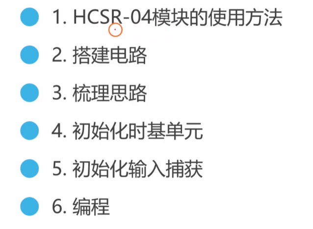


# **1. 视频概要**

这个视频教程演示了如何使用STM32微控制器和HC-SR04超声波传感器模块进行超声波测距。涵盖的关键步骤和概念包括：

- **HC-SR04介绍:** 展示了传感器模块，解释了其引脚（VCC、Trig、Echo、Gnd）及其基本功能：发射超声波并接收回波。

  

- **测量原理:** 解释了飞行时间（Time-of-Flight）原理。距离计算公式为 `距离 = (声速 * 时间) / 2`。声速近似取值为 340 m/s。核心任务是测量Echo脉冲的持续时间。

  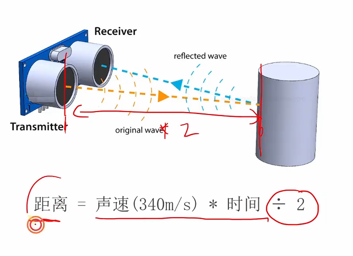

- **HC-SR04时序图:** 描述了所需的操作时序：向Trig引脚发送一个持续时间大于10µs的脉冲以启动测量。模块随后发出8个周期的40kHz超声波。Echo引脚变为高电平，其高电平持续时间对应超声波脉冲的往返时间。

  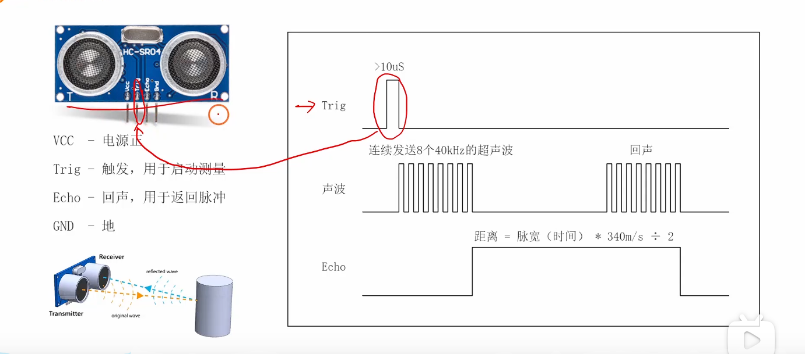

- **硬件连接:** 展示了在面包板上将HC-SR04模块连接到STM32开发板（可能是“Blue Pill”或类似的STM32F10x板）。还包括将USB转TTL转换器连接到STM32的USART1引脚（PA9/PA10），以便将测量到的距离发送到计算机。

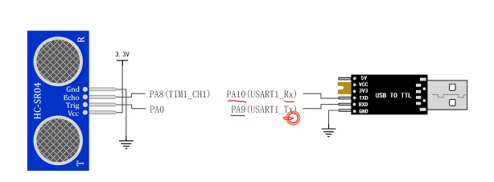

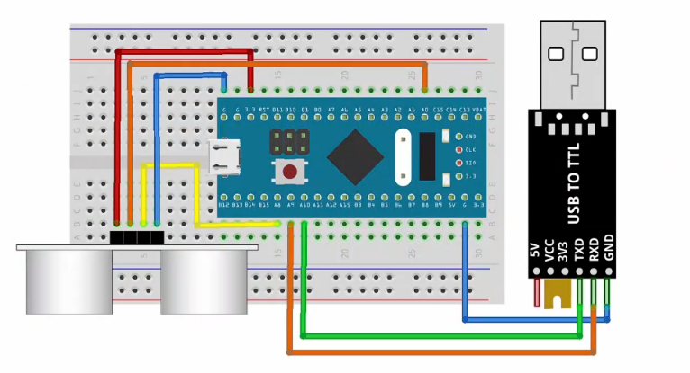

- **STM32定时器输入捕获策略:** 解释了如何使用STM32定时器（代码中使用了TIM1）的输入捕获模式来测量Echo脉冲宽度。

  - **通道1 (TIM1_CH1, PA8):** 配置为捕获Echo信号的上升沿。

  - **通道2 (TIM1_CH2, PA9 - 尽管后面的图示显示连接到了别处，但原理上涉及两次捕获):** 配置为捕获Echo信号的下降沿。 *根据后续代码/图表的修正：* 视频通过特定的输入滤波器/触发控制器（TI1FP1, TI1FP2）将单个物理引脚（PA8）连接到两个逻辑通道，配置TIM1_CH1捕获上升沿（存入CCR1）和TIM1_CH2捕获下降沿（存入CCR2）。

    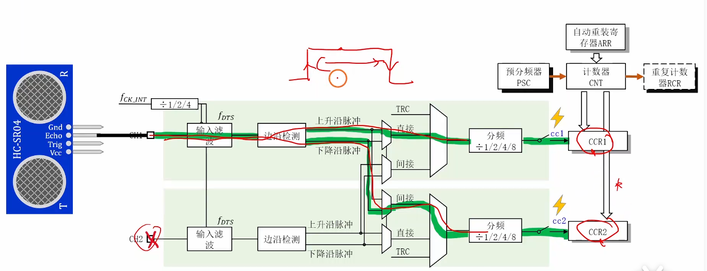

- **定时器配置:** 讨论了设置定时器预分频器（PSC）和自动重装载寄存器（ARR）以获得合适的定时器时钟频率（例如1MHz，意味着1µs的分辨率）和周期。ARR设置为最大值（65535）以测量较长的持续时间。

- **代码实现 (使用Keil uVision):**

  - **GPIO初始化:** 配置PA0（Trig引脚）为推挽输出，PA8（Echo引脚）为输入（根据上下文为浮空或上拉/下拉，配置为TIM1_CH1复用功能）。初始化USART1的GPIO（PA9 TX, PA10 RX）。
  - **USART初始化:** 配置USART1进行串行通信（例如，115200波特率）。

  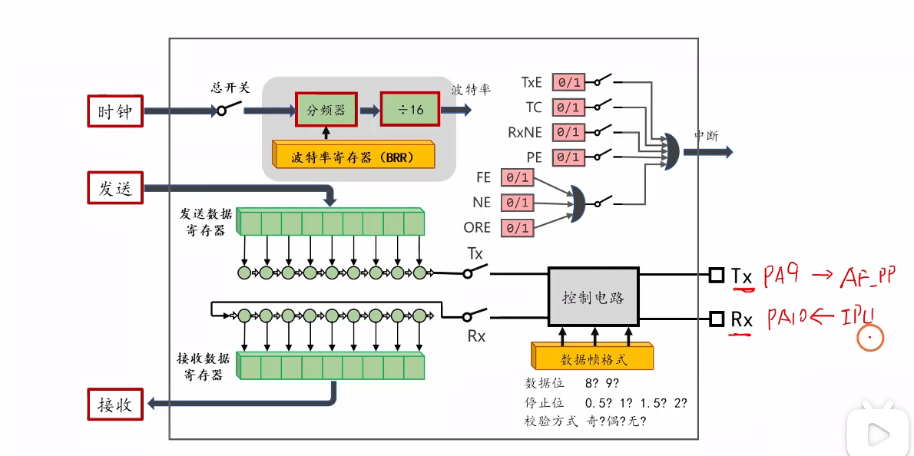

  - **定时器初始化 (TIM1):**

    - 设置时基（PSC=71，从72MHz得到1MHz时钟；ARR=65535；计数模式=向上计数）。

      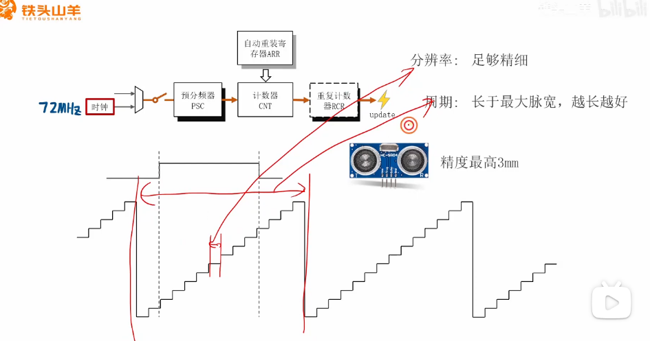

      

      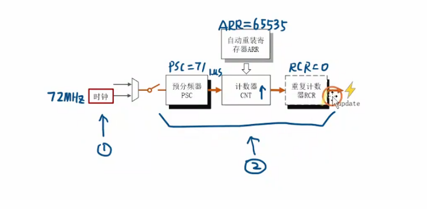

    - 配置输入捕获通道1（IC1）用于上升沿检测，映射到TI1。

    - 配置输入捕获通道2（IC2）用于下降沿检测，映射到*同一个*输入引脚（TI1）。这利用了定时器将一个输入映射到两个具有相反极性的捕获通道的能力。

      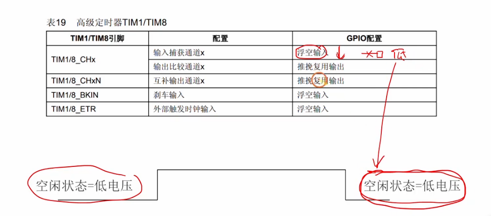

      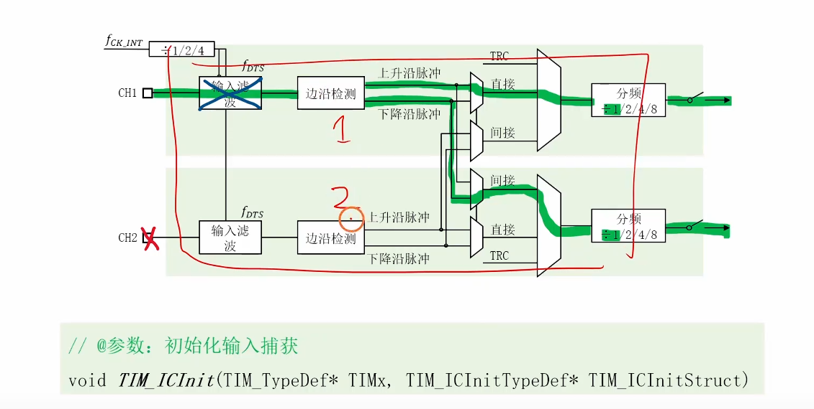

      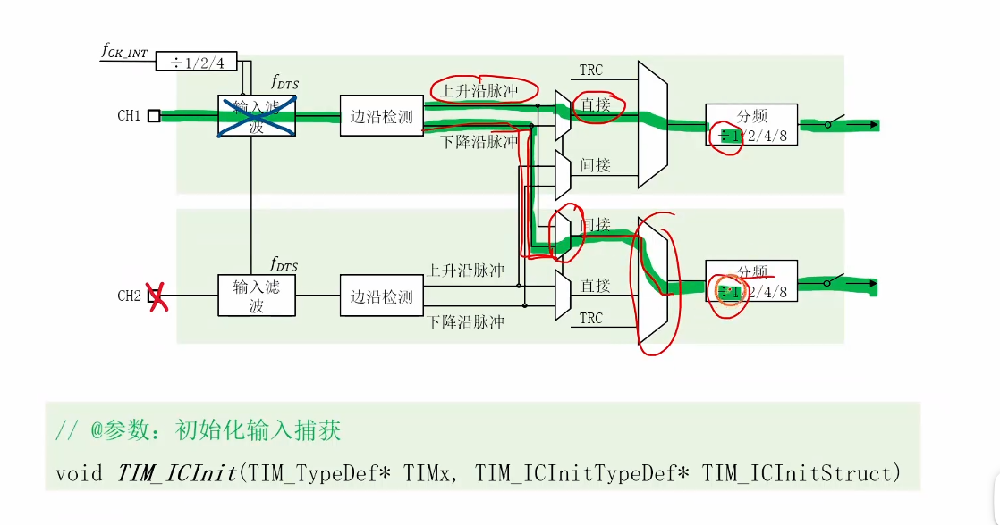

    - 设置输入捕获预分频器（不分频）。

    - 设置输入滤波器（无滤波器或最小滤波器）。

  - **主循环逻辑:**

    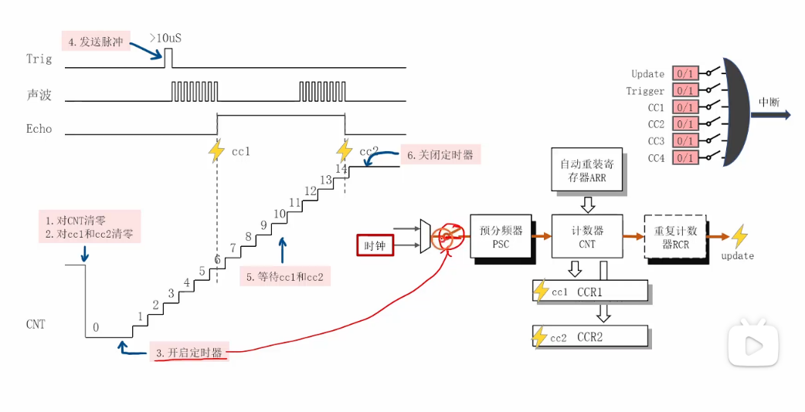

    1. 清除定时器计数器和标志位。

    2. 使能定时器。

    3. 向Trig引脚（PA0）发送>10µs的触发脉冲。

    4. 等待捕获标志位（CC1IF和CC2IF）被设置，表明上升沿和下降沿已被捕获。

    5. 从CCR1（上升沿时间）和CCR2（下降沿时间）读取捕获值。

    6. 计算时间差（`ccr2 - ccr1`）。处理潜在的定时器计数器溢出（如果脉冲非常长，虽然对于典型的HC-SR04范围和ARR=65535不太可能）。

    7. 使用公式将时间差（单位：µs）转换为距离（单位：米或厘米）：`距离 = (时间差_us * 1.0e-6 * 340.0) / 2.0`。

    8. 通过USART1发送计算出的距离。

    9. 在下次测量前添加一个延迟（例如100ms）。

       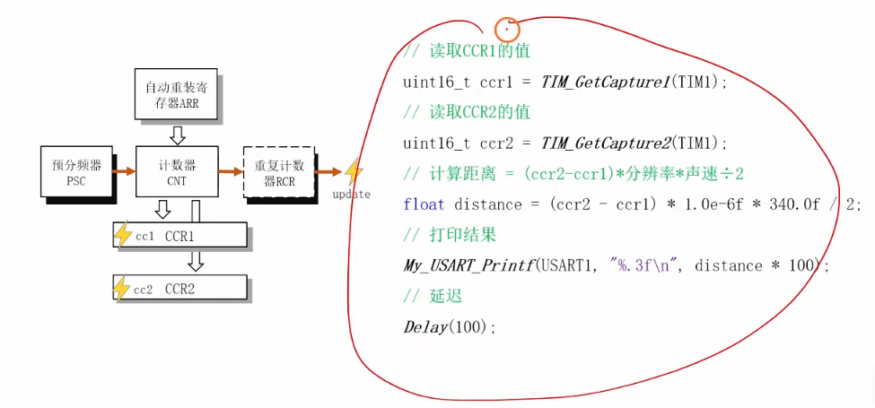

  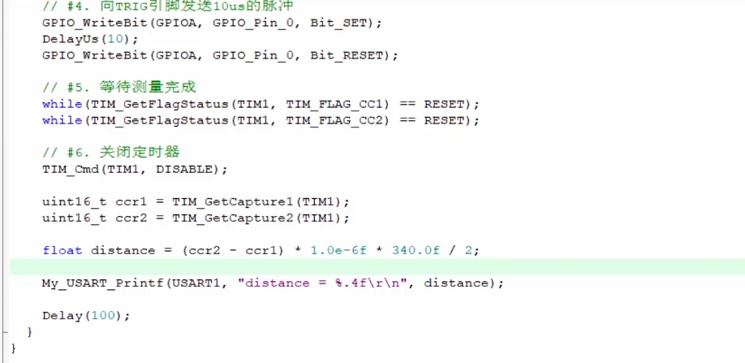

- **演示:** 展示了实际运行的装置，距离值被打印到PC上的串口终端应用程序中，并随着物体（手）靠近或远离传感器而变化。

<span style="color:#FF0000; font-weight:bold; font-size:1.1em;">注意：视频中捕获只是简单ccr2-ccr1，下面完整代码实现有超市处理和溢出处理，要更复杂些。</span>


# 完整实现代码

好的，我可以根据视频内容，为你整理一份使用STM32标准外设库（Standard Peripheral Library - SPL）实现的HC-SR04超声波测距的完整示例代码。

**请注意：**

1. **基于STM32F103系列：** 这个代码是基于常见的STM32F103系列单片机（如STM32F103C8T6 "Blue Pill" 开发板）编写的，使用了标准外设库。
2. **假设条件：** 假设你的系统时钟已配置为72MHz（这是F103系列常见的配置）。
3. **引脚连接：**
   - HC-SR04 Trig -> PA0
   - HC-SR04 Echo -> PA8 (TIM1_CH1)
   - USART1 TX -> PA9
   - USART1 RX -> PA10
   - USB转TTL模块 TXD -> PA10 (STM32 RX)
   - USB转TTL模块 RXD -> PA9 (STM32 TX)
   - USB转TTL模块 GND -> STM32 GND
4. **需要的文件：** 你需要有STM32F10x的标准外设库文件，并且工程配置正确。此代码通常分为几个文件（`.h` 和 `.c`）来组织。
5. **Delay函数：** 代码依赖于一个`delay.c`/`delay.h`提供的微秒级`Delay_us()`和毫秒级`Delay_ms()`延时函数。你需要确保你的工程中有这个延时库，通常是基于SysTick实现的。
6. **printf重定向：** 为了方便使用`printf`通过串口输出，通常需要重定向`fputc`函数到USART发送。这里为了简化，直接封装了一个`USART_SendString`函数。如果你想用`sprintf` + `USART_SendString`也是可以的。

------

**1. `hcsr04.h` (头文件)**

C

```c
#ifndef __HCSR04_H
#define __HCSR04_H

#include "stm32f10x.h"

void HCSR04_Init(void);
float HCSR04_Measure(void); // 返回距离，单位：厘米(cm)

#endif // __HCSR04_H
```

------

**2. `hcsr04.c` (源文件)**

C

```c
#include "hcsr04.h"
#include "delay.h" // 引入延时函数头文件
#include <stdio.h> // 如果要在测量函数内部格式化字符串，则需要

// HC-SR04 初始化函数
void HCSR04_Init(void) {
    GPIO_InitTypeDef GPIO_InitStructure;
    TIM_TimeBaseInitTypeDef TIM_TimeBaseStructure;
    TIM_ICInitTypeDef TIM_ICInitStructure;

    // 1. 使能时钟
    RCC_APB2PeriphClockCmd(RCC_APB2Periph_GPIOA | RCC_APB2Periph_TIM1, ENABLE);

    // 2. 初始化 Trig 引脚 (PA0) 为推挽输出
    GPIO_InitStructure.GPIO_Pin = GPIO_Pin_0;
    GPIO_InitStructure.GPIO_Mode = GPIO_Mode_Out_PP; // 推挽输出
    GPIO_InitStructure.GPIO_Speed = GPIO_Speed_50MHz;
    GPIO_Init(GPIOA, &GPIO_InitStructure);
    GPIO_ResetBits(GPIOA, GPIO_Pin_0); // 初始状态设为低电平

    // 3. 初始化 Echo 引脚 (PA8) 为浮空输入 (用于TIM1_CH1)
    GPIO_InitStructure.GPIO_Pin = GPIO_Pin_8;
    GPIO_InitStructure.GPIO_Mode = GPIO_Mode_IN_FLOATING; // 浮空输入（视频中没有严格按照文档，设置为输入下拉）
    GPIO_Init(GPIOA, &GPIO_InitStructure);

    // 4. 初始化 TIM1 时基单元
    TIM_TimeBaseStructure.TIM_Period = 65535; // ARR 自动重装载值 (最大值)
    // 72MHz / (71 + 1) = 1MHz -> 定时器计数频率为1MHz，每个计数周期1us
    TIM_TimeBaseStructure.TIM_Prescaler = 71; 
    TIM_TimeBaseStructure.TIM_ClockDivision = TIM_CKD_DIV1; // 时钟分频因子（视频中没有设置这个）
    TIM_TimeBaseStructure.TIM_CounterMode = TIM_CounterMode_Up; // 向上计数模式
    TIM_TimeBaseStructure.TIM_RepetitionCounter = 0; // 重复计数器 (高级定时器才有)
    TIM_TimeBaseInit(TIM1, &TIM_TimeBaseStructure);

    // 5. 初始化 TIM1 输入捕获通道 1 (捕获上升沿)
    TIM_ICInitStructure.TIM_Channel = TIM_Channel_1; // 选择通道1
    TIM_ICInitStructure.TIM_ICPolarity = TIM_ICPolarity_Rising; // 上升沿捕获
    TIM_ICInitStructure.TIM_ICSelection = TIM_ICSelection_DirectTI; // 映射到 TI1 上
    // 输入捕获不分频，每个有效边沿都捕获
    TIM_ICInitStructure.TIM_ICPrescaler = TIM_ICPSC_DIV1; 
    TIM_ICInitStructure.TIM_ICFilter = 0x00; // 不使用滤波器
    TIM_ICInit(TIM1, &TIM_ICInitStructure);

    // 6. 初始化 TIM1 输入捕获通道 2 (捕获下降沿)
    TIM_ICInitStructure.TIM_Channel = TIM_Channel_2; // 选择通道2
    TIM_ICInitStructure.TIM_ICPolarity = TIM_ICPolarity_Falling; // 下降沿捕获
    // 注意这里选择 IndirectTI，表示此通道的输入也来自于TI1
    TIM_ICInitStructure.TIM_ICSelection = TIM_ICSelection_IndirectTI; 
    TIM_ICInitStructure.TIM_ICPrescaler = TIM_ICPSC_DIV1;
    TIM_ICInitStructure.TIM_ICFilter = 0x00;
    TIM_ICInit(TIM1, &TIM_ICInitStructure);

    // 7. 配置触发源和从模式 (重要：使用TI1FP1作为触发，从模式设为Reset)
    // 这样，当通道1检测到上升沿时，计数器CNT会自动清零
    TIM_SelectInputTrigger(TIM1, TIM_TS_TI1FP1); 
    TIM_SelectSlaveMode(TIM1, TIM_SlaveMode_Reset); 

    // 8. 清除可能存在的标志位
    TIM_ClearFlag(TIM1, TIM_FLAG_Update | TIM_FLAG_CC1 | TIM_FLAG_CC2);

    // 注意：不在初始化时使能定时器，在每次测量前使能
    // TIM_Cmd(TIM1, ENABLE); 
}

// HC-SR04 测量距离函数
float HCSR04_Measure(void) {
    uint16_t ccr1 = 0, ccr2 = 0;
    uint32_t counter = 0; // 用于超时计数
    float distance = -1.0f; // 初始距离设为无效值
    float time_us = 0;

    // 1. 发送Trig脉冲 (至少10us)
    GPIO_SetBits(GPIOA, GPIO_Pin_0);
    Delay_us(15); // 发送约15us的高电平
    GPIO_ResetBits(GPIOA, GPIO_Pin_0);

    // 2. 清除标志位并使能定时器准备捕获
    TIM_ClearFlag(TIM1, TIM_FLAG_CC1 | TIM_FLAG_CC2);
    // 注意：由于配置了Reset模式，理论上CNT会在上升沿自动清零，
    // 但为保险起见或不使用Reset模式时，可以在这里手动清零: TIM_SetCounter(TIM1, 0);
    TIM_Cmd(TIM1, ENABLE); // 使能定时器开始计数

    // 3. 等待捕获上升沿 (TIM_FLAG_CC1) 并设置超时
    counter = 0;
    // 等待捕获到上升沿或者超时(例如超过最大量程对应的时间)
    // 超时计数是为了防止Echo一直为低（传感器未连接或故障）导致死循环
    // 假设最大测量距离为5m，往返10m，时间约为 10m / 340m/s ≈ 0.0294s = 29400us
    // 我们设置一个稍大的超时值，比如 60000us (60ms)
    while (TIM_GetFlagStatus(TIM1, TIM_FLAG_CC1) == RESET) {
        counter++;
        Delay_us(1); // 每次检查间隔1us
        if (counter > 60000) { // 超时处理
            TIM_Cmd(TIM1, DISABLE); // 超时则关闭定时器
            return -1.0f; // 返回无效距离
        }
    }
    ccr1 = TIM_GetCapture1(TIM1); // 读取上升沿捕获值

    // 4. 等待捕获下降沿 (TIM_FLAG_CC2) 并设置超时
    counter = 0; 
    while (TIM_GetFlagStatus(TIM1, TIM_FLAG_CC2) == RESET) {
         counter++;
         Delay_us(1); 
         if (counter > 60000) { // 超时处理
             TIM_Cmd(TIM1, DISABLE); 
             return -2.0f; // 返回不同的无效距离，方便调试
         }
    }
    ccr2 = TIM_GetCapture2(TIM1); // 读取下降沿捕获值

    // 5. 捕获完成，关闭定时器
    TIM_Cmd(TIM1, DISABLE);

    // 6. 计算时间差并换算距离
    // 由于使用了Reset模式，CCR1理论上应该是0或一个非常小的值（捕获延迟）
    // CCR2的值就直接代表了高电平持续的计数值
    // 如果不使用Reset模式，则 time_count = (ccr2 >= ccr1) ? (ccr2 - ccr1) : (65536 + ccr2 - ccr1); 处理溢出
    
    // 在Reset模式下，可以直接使用CCR2的值（假设CCR1近似为0）
    // 或者更严谨地计算差值
    if (ccr2 >= ccr1) {
       time_us = (float)(ccr2 - ccr1); // 单位已经是 us，因为定时器频率是1MHz
    } else {
       // 处理计数器在两次捕获间溢出的情况 (虽然ARR=65535时，对于正常测距几乎不会发生)
       time_us = (float)(65536 + ccr2 - ccr1);
    }
    

    // 计算距离 (单位：厘米 cm)
    // distance(m) = (time_us * 1e-6 * 340) / 2
    // distance(cm) = distance(m) * 100 = (time_us * 1e-6 * 340 * 100) / 2
    // distance(cm) = time_us * 0.017
    distance = time_us * 0.017f;

    return distance;
}
```

------

**3. `usart.h` (头文件)**

C

```c
#ifndef __USART_H
#define __USART_H

#include "stm32f10x.h"
#include <stdio.h>

void USART1_Init(void);
void USART_SendString(USART_TypeDef* USARTx, char *str);

// 如果需要使用printf，在此处添加重定向相关函数声明
// int fputc(int ch, FILE *f);

#endif // __USART_H
```

------

**4. `usart.c` (源文件)**

C

```c
#include "usart.h"

// USART1 初始化函数
void USART1_Init(void) {
    GPIO_InitTypeDef GPIO_InitStructure;
    USART_InitTypeDef USART_InitStructure;

    // 1. 使能时钟 (USART1, GPIOA, AFIO)
    RCC_APB2PeriphClockCmd(RCC_APB2Periph_USART1 | RCC_APB2Periph_GPIOA | RCC_APB2Periph_AFIO, ENABLE);

    // 2. 配置 USART1_TX (PA9) 为复用推挽输出
    GPIO_InitStructure.GPIO_Pin = GPIO_Pin_9;
    GPIO_InitStructure.GPIO_Mode = GPIO_Mode_AF_PP;
    GPIO_InitStructure.GPIO_Speed = GPIO_Speed_50MHz;
    GPIO_Init(GPIOA, &GPIO_InitStructure);

    // 3. 配置 USART1_RX (PA10) 为浮空输入
    GPIO_InitStructure.GPIO_Pin = GPIO_Pin_10;
    GPIO_InitStructure.GPIO_Mode = GPIO_Mode_IN_FLOATING;
    GPIO_Init(GPIOA, &GPIO_InitStructure);

    // 4. 配置 USART1 参数
    USART_InitStructure.USART_BaudRate = 115200; // 波特率
    USART_InitStructure.USART_WordLength = USART_WordLength_8b; // 8位数据位
    USART_InitStructure.USART_StopBits = USART_StopBits_1; // 1位停止位
    USART_InitStructure.USART_Parity = USART_Parity_No; // 无校验位
    USART_InitStructure.USART_HardwareFlowControl = USART_HardwareFlowControl_None; // 无硬件流控
    USART_InitStructure.USART_Mode = USART_Mode_Rx | USART_Mode_Tx; // 使能接收和发送
    USART_Init(USART1, &USART_InitStructure);

    // 5. 使能 USART1
    USART_Cmd(USART1, ENABLE);
}

// 发送字符串函数
void USART_SendString(USART_TypeDef* USARTx, char *str) {
    while (*str) {
        USART_SendData(USARTx, *str++);
        // 等待发送完成
        while (USART_GetFlagStatus(USARTx, USART_FLAG_TXE) == RESET); 
    }
}

/*
// 如果需要重定向 printf 函数，取消注释以下代码
// 并确保在主函数或其他地方包含了 stdio.h
int fputc(int ch, FILE *f) {
    USART_SendData(USART1, (uint8_t)ch);
    while (USART_GetFlagStatus(USART1, USART_FLAG_TXE) == RESET);
    return ch;
}

// 如果使用 MicroLib (Keil 默认)，可能还需要这个用于 scanf 等
// int fgetc(FILE *f) {
//     while (USART_GetFlagStatus(USART1, USART_FLAG_RXNE) == RESET);
//     return (int)USART_ReceiveData(USART1);
// }
*/
```

------

**5. `delay.h` 和 `delay.c` (延时函数)**

你需要一个提供 `Delay_Init()` (通常在main函数开始时调用一次)、`Delay_us(uint32_t nus)` 和 `Delay_ms(uint16_t nms)` 的延时库。这通常是基于SysTick定时器实现的。你可以使用正点原子、野火等开发板提供的标准库例程中的 `delay` 文件夹，或者自己实现一个简单的SysTick延时。

**例如，一个极简的SysTick `delay.h` 可能包含：**

C

```c
#ifndef __DELAY_H
#define __DELAY_H

#include "stm32f10x.h"

void Delay_Init(void); // 通常在main开始调用
void Delay_us(uint32_t nus);
void Delay_ms(uint16_t nms);

#endif
```

**对应的 `delay.c` 文件会包含具体的SysTick配置和延时实现。** (这里省略具体实现，请确保你的工程包含此功能)

------

**6. `main.c` (主函数)**

C

```c
#include "stm32f10x.h"
#include "delay.h"
#include "usart.h"
#include "hcsr04.h"
#include <stdio.h> // 包含 sprintf

int main(void) {
    float distance_cm;
    char distance_str[50]; // 缓冲区用于存储格式化后的字符串

    // 系统初始化和延时初始化
    // SystemInit(); // 通常在启动文件 startup_stm32f10x_xx.s 中已调用
    Delay_Init(); // 初始化SysTick延时

    // 外设初始化
    USART1_Init(); // 初始化串口1
    HCSR04_Init(); // 初始化超声波模块接口和定时器

    // 欢迎信息 (可选)
    USART_SendString(USART1, "HC-SR04 Test Start...\r\n");
    Delay_ms(100); // 稍微等待

    while (1) {
        distance_cm = HCSR04_Measure(); // 获取距离 (cm)

        if (distance_cm > 0) { // 检查是否为有效测量值
            // 将浮点数格式化为字符串
            // %.1f 表示保留一位小数
            sprintf(distance_str, "Distance = %.1f cm\r\n", distance_cm); 
            USART_SendString(USART1, distance_str); // 通过串口发送字符串
        } else if (distance_cm == -1.0f) {
             USART_SendString(USART1, "Error: Timeout waiting for Rising Edge!\r\n");
        } else if (distance_cm == -2.0f) {
             USART_SendString(USART1, "Error: Timeout waiting for Falling Edge!\r\n");
        }
        
        Delay_ms(200); // 每次测量间隔200毫秒 (给传感器留出稳定时间)
    }
}
```

------

**如何使用：**

1. 确保你的Keil或其他IDE工程中包含了STM32F10x的标准外设库文件。
2. 将上述 `hcsr04.h`, `hcsr04.c`, `usart.h`, `usart.c` 文件添加到你的工程中。
3. 确保你有一个可用的 `delay.h` 和 `delay.c` 文件，并将其添加到工程中。
4. 将 `main.c` 的内容替换为上面提供的 `main.c` 代码。
5. 编译工程，并将程序下载到你的STM32开发板。
6. 连接好HC-SR04模块、USB转TTL模块和开发板。
7. 打开电脑上的串口调试助手，选择正确的COM口，设置波特率为115200，8位数据位，1位停止位，无校验。
8. 复位开发板，你应该就能在串口助手上看到持续输出的距离信息了。

这份代码基本还原了视频中的实现逻辑和步骤，并使用了标准外设库。希望对你有帮助！


# 补充提问

## 提问1

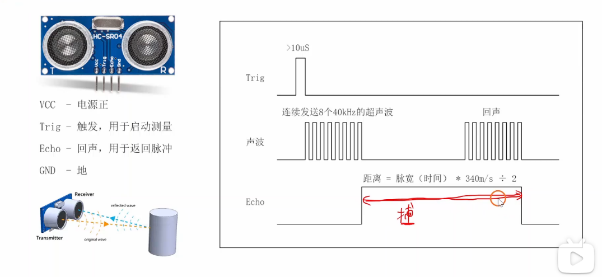

<span style="color:#CC0000; font-size:1.2em;">这个超声波模块是如何工作的呢，你能够结合这这个图来给我详细解释下吗，最好能够举个例子来让我彻底弄明白？</span>

好的，我们结合这张图来详细解释一下HC-SR04超声波模块的工作原理，并举一个例子。

**工作原理解释（结合图示）：**

这张图清晰地展示了HC-SR04模块的工作流程和相关的信号时序：

1. **供电 (VCC & GND):** 首先，你需要给模块提供电源。VCC接电源正极（通常是5V），GND接电源地。
2. **触发测量 (Trig Pin):**
   - 要开始一次距离测量，你需要通过STM32的一个GPIO口向HC-SR04模块的 `Trig` (触发) 引脚发送一个**至少10微秒（µs）的高电平脉冲**。
   - 对应图右侧的 **Trig信号** 波形，可以看到一个短暂的高脉冲（标注了 >10uS）。
3. **超声波发射 (模块内部):**
   - 当HC-SR04模块检测到Trig引脚上的这个触发脉冲后，它会**自动地**从其发射器（Transmitter）**连续发射8个40kHz的超声波脉冲**。
   - 这对应图中的 **声波 (Sound Wave)** 信号部分，显示了一串密集的波形（标注了“连续发送8个40kHz的超声波”）。这个过程是由模块内部硬件完成的，你不需要在STM32上直接控制。
4. **启动回波计时 (Echo Pin):**
   - 在模块发射超声波**之后**，它会立即将 `Echo` (回声) 引脚**拉高**，变成高电平。
   - 对应图中的 **Echo信号** 波形，可以看到它在声波发射后变为了高电平。<span style="color:#CC0000;">此时，模块内部的计时器开始计时（或者说，STM32需要从此刻开始计时）</span>。
5. **声波传播与反射:**
   - 发射出去的超声波以大约 **340米/秒** 的速度在空气中传播。
   - 当遇到障碍物时（如图左下角示意图中的圆柱体），超声波会被反射回来。
6. **接收回波 (模块内部):**
   - 模块的接收器（Receiver）会等待并接收反射回来的超声波信号（回声）。
   - 对应图中 **声波** 信号部分的第二段波形（标注了“回声”）。
7. **停止回波计时 (Echo Pin):**
   - 一旦模块接收到返回的回声信号，它会**立即将 `Echo` 引脚拉低**，变回低电平。
   - 对应图中 **Echo信号** 波形的下降沿。此时，计时结束。
8. **脉宽测量 (STM32的任务):**
   - 关键在于，**`Echo` 引脚保持高电平的持续时间**（图中红色双箭头标注的“脉宽 (时间)”），就**等于**超声波从发射到接收到回波所经过的**总时间**（即“飞行时间”）。
   - 你的STM32微控制器的任务就是精确地测量这个高电平脉冲的宽度 `T_echo`。通常使用**定时器的输入捕获 (Input Capture)** 功能来实现：捕获Echo引脚的上升沿时刻和下降沿时刻，两者之差就是脉冲宽度。
9. **距离计算:**
   - 知道了脉冲宽度 `T_echo` (单位：秒) 和声速 `V_sound` (约 340 米/秒)，就可以计算距离 `D` (单位：米)。
   - 因为 `T_echo` 是声波**去**和**回**的总时间，所以单程的时间是 `T_echo / 2`。
   - 因此，距离 `D = (T_echo / 2) * V_sound`，这也就是图中给出的公式 `距离 = 脉宽 (时间) * 340m/s ÷ 2`。

**举个例子:**

假设：

- 我们使用STM32成功测量到 `Echo` 引脚的高电平脉冲宽度 `T_echo` 为 **5.88毫秒 (ms)**，也就是 **0.00588秒 (s)**。
- 我们假设当前的声速 `V_sound` 就是 **340 米/秒**。

那么，障碍物的距离 `D` 计算如下：

$D = \frac{T_{echo} \times V_{sound}}{2} = \frac{0.00588 \, \text{s} \times 340 \, \text{m/s}}{2}$

$D = \frac{1.9992 \, \text{m}}{2} \approx 1.0 \, \text{米}$

所以，通过测量得到5.88毫秒的Echo脉宽，我们可以计算出障碍物距离传感器大约是1米。

**总结STM32需要做的事情：**

1. 配置一个GPIO (连接到Trig) 为推挽输出模式。
2. 配置另一个GPIO (连接到Echo) 为输入模式，并配置其对应的**定时器输入捕获**功能，通常需要捕获上升沿和下降沿。
3. 在主循环或定时任务中：
   - 向Trig引脚发送一个至少10µs的高电平脉冲。
   - 启动定时器输入捕获，等待并记录Echo引脚的上升沿和下降沿对应的定时器计数值。
   - 根据两个计数值的差和定时器的时钟频率，计算出Echo高电平的持续时间 `T_echo`。
   - 使用公式 `D = (T_echo * 340) / 2` (注意单位换算) 计算距离。
   - 将结果通过串口或其他方式显示出来。
   - 等待一小段时间（例如几十毫秒）再进行下一次测量。

希望这个结合图示和例子的解释能让你彻底明白HC-SR04的工作原理！


## 提问2

<span style="font-weight:bold; font-size:1.2em;">此时，模块内部的计时器开始计时（或者说，STM32需要从此刻开始计时）。这里指的到底是超声波内部的模块开始计时还是STM32开始计时呢，我不太懂，你能够给我解释下吗。</span>

这是一个很好的问题，确实容易引起混淆。我们来理清一下：

**核心在于：HC-SR04模块负责产生时间信号，而STM32负责测量这个信号的持续时间。**

1. **HC-SR04模块内部的“计时”：**
   - 当HC-SR04模块发射完超声波后，它**内部的逻辑**会**立即**将Echo引脚置为高电平。
   - 然后，它开始**等待**接收返回的回波。
   - 一旦接收到回波，它**内部的逻辑**会**立即**将Echo引脚置为低电平。
   - 所以，从模块的角度看，它通过控制Echo引脚**高电平的持续时间**来**表示**（或者说编码）超声波往返所用的时间。你可以理解为模块内部有一个机制在“计时”，但这个计时结果不是通过数字信号传输给STM32的，而是通过**Echo引脚高电平的脉冲宽度**这个**模拟信号的持续时间**来体现的。
2. **STM32的计时任务：**
   - STM32并**不直接知道**HC-SR04内部发生了什么。它只是一个**外部观察者和测量者**。
   - STM32需要做的是，**检测**到Echo引脚**从低电平跳变到高电平**（上升沿）的那一刻。**从这一刻起，STM32需要启动自己的计时器（或者记录下当前计时器的值）**。
   - 然后，STM32继续**检测**Echo引脚**从高电平跳变到低电平**（下降沿）的那一刻。**在这一刻，STM32需要停止计时（或者记录下当前计时器的值）**。
   - 最后，STM32通过计算**这两个时刻之间的时间差**，来得到Echo引脚高电平的实际持续时间，也就是超声波的飞行时间。

**总结来说：**

- HC-SR04**产生**一个宽度等于飞行时间的**脉冲信号**在Echo引脚上。
- STM32**测量**这个Echo引脚上**脉冲信号的宽度**。STM32的计时（测量）**起点**是Echo引脚的**上升沿**，**终点**是Echo引脚的**下降沿**。

所以，原句“此时，模块内部的计时器开始计时（或者说，STM32需要从此刻开始计时）” 里的后半句 **“STM32需要从此刻开始计时”** 是从STM32编程和测量的角度来说的，**是实际操作中你需要关注和实现的**。前半句是对模块内部行为的一种理解方式，但最终体现出来的就是Echo脉冲的宽度。

你可以把HC-SR04想象成一个发令员，他发出信号（拉高Echo）表示比赛开始，然后接收到信号（拉低Echo）表示比赛结束。STM32就像一个拿着秒表的裁判，看到发令员发出开始信号时按下秒表，看到结束信号时再按停秒表，秒表上的读数就是比赛（超声波飞行）的时间。


## 提问3


<span style="font-weight:bold; font-size:1.2em;">这里是在发送完第1个脉冲之后Echo引脚就立即置高电平，还是连续发送完8个脉冲之后Echo引脚才置高电平呢；后面接受也是从图片上看好像是在接受完第8个脉冲之后Echo才会置底电平，是这样吗。我不是太懂，你能够给我解释下吗，最好能够举个例子来让我彻底弄明白。</span>


你说得非常仔细！关于Echo引脚置高和置低的精确时机，确实是理解这个模块的关键点之一。结合图示，我来给你详细解释一下：

1. **Echo引脚何时置高？**
   - **在模块内部连续发送完8个40kHz的超声波脉冲 \*之后\*，Echo引脚才会立即被置为高电平。**
   - 图示中 `声波` 部分的那一串发射波形（"连续发送8个40kHz的超声波"）代表了模块内部发射的动作。**当这个发射动作完成时**，模块内部的控制逻辑会立刻将Echo引脚的状态从低电平变为高电平。
   - 所以，并不是在发送第1个脉冲后就置高，而是**必须等待所有8个脉冲都发射完毕**。这标志着“计时”（或者说等待回波）的开始。
2. **Echo引脚何时置低？**
   - **一旦模块的接收器（Receiver）检测到返回的回声信号的 \*起始部分\*，Echo引脚就会立即被置为低电平。**
   - 图示中 `声波` 部分的第二串波形（"回声"）代表了接收器接收到的反射波。当接收器**刚开始**检测到这个回声信号时（也就是回声波的第一个脉冲或前几个脉冲到达时），模块内部的控制逻辑就会立刻将Echo引脚的状态从高电平变为低电平。
   - **不需要，也通常不会** 等待接收完所有8个返回的脉冲。因为测量的是**声波第一次到达**的时间，只需要检测到回波的**起始**即可确定往返时间。如果等待接收完整个回波脉冲串，会给测量时间额外增加一个固定的（8个脉冲周期的）延迟，导致距离计算不准确。

**为什么是8个脉冲？**

- 发送8个脉冲而不是单个脉冲，是为了**增加信号的能量和可靠性**，使得接收器更容易在背景噪音中检测到返回的回声信号，特别是在距离较远或反射面不理想的情况下。但这8个脉冲是作为一个**整体（一个“数据包”）**来发送和接收的。

**举个例子来理解时序：**

想象你在一个山谷里喊话并听回声：

1. **触发 (Trig):** 你深吸一口气，准备喊话 (STM32发送 >10us 脉冲给Trig)。
2. **发射 (内部):** 你连续快速地喊了8声“喂！” (模块内部发射8个40kHz脉冲)。
3. **开始计时 (Echo置高):** 在你喊完最后一声“喂！”的**瞬间**，你立刻竖起耳朵开始**专注于听**回声 (Echo引脚置高，STM32开始计时或记录起始时间)。
4. **声波传播:** 你的8声“喂！”作为一个声波包向对面的山崖飞去。
5. **声波反射:** 声波包撞到山崖后反射回来。
6. **接收回波 & 停止计时 (Echo置低):** 当反射回来的第一声“喂！”传到你耳朵里的**瞬间**，你就知道回声到了，立刻停止听（或者说停止计时）(接收器检测到回波起始，Echo引脚置低，STM32记录结束时间或停止计时)。你不需要等听完所有8声反射回来的“喂！”才停止计时。
7. **计算:** 你看了看从你喊完到听到第一声回声之间经过的时间，然后根据声音的速度算出山崖有多远。

**总结关键点：**

- Echo引脚**高电平的开始**，标志着**超声波发射完成**，计时（等待回波）开始。
- Echo引脚**高电平的结束**，标志着**接收到回波的起始**，计时（等待回波）结束。
- Echo引脚**高电平的持续时间**，精确对应了超声波从**发射完成**到**接收到回波起始**的这段**飞行时间**。

希望这个解释和例子能让你更清晰地理解Echo引脚的时序了！


## 提问4（重点理解）

<span style="font-weight:bold; font-size:1.2em;">发送第8个脉冲前，此时第1个脉冲应该已经发送出去了，但是此时Echo不是还没有置为高电平，此时这种情况不是会产生误差吗，我这点不是特别理解？</span>

你提的这一点非常精准，确实点到了这个时序设计中一个看似矛盾的地方！你的理解是正确的：**从物理现实来看，第一个超声波脉冲确实在第8个脉冲发射完之前就已经在空中传播了，而此时Echo引脚确实还没有变成高电平。**

那么，这是否会引入误差呢？**严格来说，是的，这引入了一个系统性的时间偏移，进而导致距离计算上的一个小的固定偏移。** 但我们需要理解为什么模块会这样设计，以及这个偏移的影响有多大。

**解释：**

1. 测量的到底是什么时间？

   根据HC-SR04的工作方式和时序图，STM32通过测量Echo引脚高电平脉冲宽度 T_echo 得到的，是 从“8个脉冲发射完成”那一刻 到 “接收到回波信号起始”那一刻 的时间差。

   - 我们设 $t_0$ 为第1个脉冲开始发射的时刻。
   - 设 $t_{burst}$ 为发射8个脉冲所需的总时间（大约是 $8 \times (1/40kHz) = 200 \mu s$）。那么第8个脉冲结束的时刻是 $t_0 + t_{burst}$。
   - Echo引脚置高的时刻 $T_{start\_echo} = t_0 + t_{burst}$。
   - 设 $T_{travel}$ 为第1个脉冲发出后，到其回波的起始部分被接收器接收到所经历的**真正**的往返飞行时间。那么接收到回波起始的时刻是 $t_0 + T_{travel}$。
   - Echo引脚置低的时刻 $T_{end\_echo} = t_0 + T_{travel}$。
   - 因此，STM32测量到的脉冲宽度 $T_{echo} = T_{end\_echo} - T_{start\_echo} = (t_0 + T_{travel}) - (t_0 + t_{burst}) = T_{travel} - t_{burst}$。

2. 结论：<span style="color:#CC0000;">测量的脉宽比真实飞行时间短了一个发射脉冲串的时间</span>。

   从上面的分析可以看出，我们<span style="color:#CC0000;">实际测量到的 T_echo 比真实的往返飞行时间 T_travel 短了大约 200μs</span>。

3. 这个误差有多大？

   这个 200μs 的时间差对应的距离差是多少呢？

   距离差 $ΔD=(V_{sound}×t_{burst})/2=(340m/s×200×10−6s)/2=0.068m/2=0.034m=3.4cm$。

   这意味着，<span style="border:1px solid #CC0000;">由于这种时序定义，理论上通过测量Echo脉宽计算出的距离会比实际距离近大约 3.4 厘米。这是一个系统误差（或者叫固定偏移）</span>。(<span style="color:#CC0000;">补充回复：无论测量的距离多远，这个误差都是固定的吧，都是计算出的距离会比实际距离近大约3.4厘米。理论上这个由发射脉冲串时长（约200µs）导致的 **约3.4厘米的距离偏近误差是一个固定的系统偏移**，与实际测量的距离远近无关。</span>)

4. **为什么这样设计？**

   - **简化模块内部逻辑和提供稳定参考点：** 对于HC-SR04这种低成本模块，在内部精确地从第一个脉冲发射的瞬间开始计时，同时还要控制后续脉冲的发射，可能比较复杂。而选择在“发射完成”这个<span style="color:#CC0000;">明确的内部状态转换点</span>去触发外部的Echo信号（置高），以及在<span style="color:#CC0000;">“接收到回波起始”这个明确的事件点</span>去改变外部Echo信号（置低），<span style="color:#CC0000;">逻辑上更简单且时间点更稳定可靠</span>。
   - **误差的可接受性与校准：** 对于很多HC-SR04的应用场景（比如简单的避障、大概的距离感知），这<span style="color:#CC0000;">3-4厘米的固定偏移是可以接受的</span>。<span style="color:#CC0000;">如果需要更高的精度，可以在最终的距离计算结果上**加上一个固定的补偿值**来进行校准</span>。很多时候，传感器的最小测量距离本身就在2-3厘米左右，这个偏移可能部分地被包含在不可测量的近距离盲区内，或者可以通过软件标定来修正。

**总结：**

你的观察是对的，物理上存在一个时间差。HC-SR04模块的设计使得Echo高电平的持续时间**并不完全等于**声波的实际往返时间，而是**<span style="color:#CC0000;">实际往返时间减去发射脉冲串所需的约200µs</span>**。这<span style="color:#CC0000;">会导致一个约3.4cm的系统性距离计算偏近的误差</span>。这种设计是<span style="color:#CC0000;">为了简化模块实现并提供清晰的计时起止信号</span>，对于<span style="color:#CC0000;">大部分应用来说这种固定偏移是可接受的或可以通过软件校准来补偿</span>。

理解了这一点，你就对HC-SR04的工作原理有了更深入的认识！


## 提问5

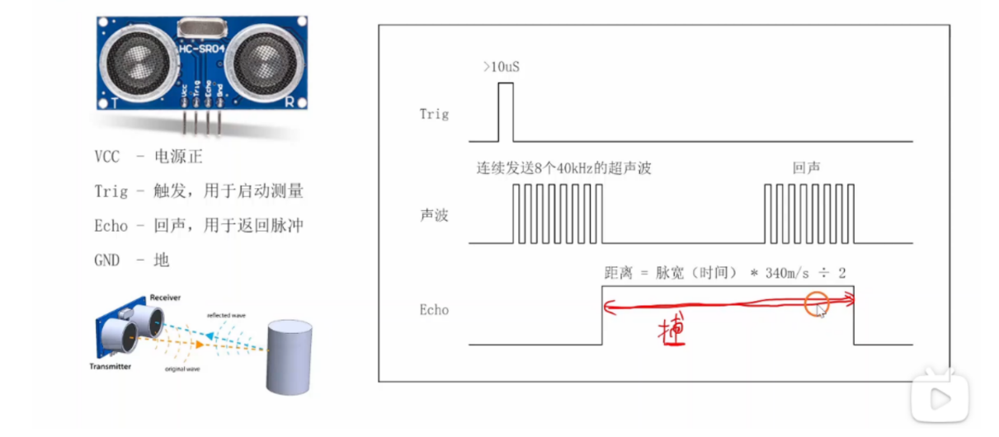

这张图片里面那里连续发送8个40KHz的超声波那里我有点看不太懂，这里不应该是8个 高电平低电平的 信号吗？还有图中“连续发送8个40KHz的超声波”那里一个高电平的持续时间实际表示的是什么呢？这里一个高电平持续时间是多少呢，如果是一个时钟周期的话，那么从图中反映出来可以看到好像两个时钟周期之间有间隔，这和我们平时见到的连续的信号（信号为高电平低电平，然后立即到高电平，中间似乎没有间隔）有点不太符？

<span style="font-weight:bold; font-size:1.2em;">你能够给我解决我的疑问吗，最好能够举个例子来让我彻底明白。</span>


你说得非常棒！你注意到了图示和实际物理信号之间可能存在的差异，这说明你思考得很深入。让我来帮你理清这些疑问：

**1. 关于“8个高电平信号” vs “8个高低电平信号”：**

- **你的理解是对的，但图示是简化的：** 你说“不应该是8个高电平低电平吗？”—— 从**电信号**的角度看，如果要精确表示一个40kHz的方波（类似数字信号），确实应该包含高低电平的交替。但是，请注意图中 `声波` 这一行代表的是**物理上的超声波**，它是一种**模拟的、连续的声波**，更接近**正弦波**，有波峰和波谷。
- **图示是“包络”：** 正如我们之前讨论的，图中使用矩形块是一种**包络（Envelope）的简化表示法。它并不是要画出声波每一次细微的振动（波峰波谷），而是要表示“在这段时间内，存在着40kHz的超声波能量”。这个矩形块的高度代表能量的存在，宽度代表存在的时间。画成8个分开的块是为了强调**这里发射了**8个周期**的波，而不是一个单一的长脉冲。

**2. 关于图中一个“高电平”的持续时间：**

- **它代表一个40kHz超声波的周期时间。**
- **计算：**
  - 频率 $f = 40 \, \text{kHz} = 40,000 \, \text{Hz}$
  - 周期 $T = 1 / f = 1 / 40,000 \, \text{秒} = 0.000025 \, \text{秒}$
  - 换算成微秒（µs）：$0.000025 \times 1,000,000 = 25 \, \mu s$
- **所以，图中 `声波` 部分那8个小矩形块中的每一个，其代表的实际时间宽度是 25 微秒 (µs)。** 整个8个块连起来的总时间就是 $8 \times 25 \, \mu s = 200 \, \mu s = 0.2 \, \text{ms}$。

**3. 关于“两个时钟周期之间有间隔”与连续信号的差异：**

- **图示的视觉间隔 vs 实际的连续性：** 你观察到图中8个小矩形块之间似乎有空隙，这与我们平时看到的连续数字信号（高电平结束后立即是低电平，或反之）不同。这里的关键在于：
  - **实际的超声波发射是连续的：** 在发射那8个周期的过程中，声波是**连续不断**地产生的，一个周期的结束紧接着下一个周期的开始，中间**没有时间间隔**。
  - **图示的间隔是为了清晰：** 图中画出间隔是为了**视觉上更容易区分**出这里包含了**8个独立的周期**。如果画成一个没有任何分割的长条矩形，读者可能不清楚里面包含了多少个周期。这是一种**示意性**的画法，强调“周期数”，而不是精确描绘波形本身或表示时间上的中断。
  - **与数字信号的区别：** 你平时看到的连续数字信号（比如时钟信号）图，精确地表示了**电压电平**随时间的变化，高低电平之间确实是紧密相连的。而这里的“声波”图是对物理波**能量存在时间段**的一种**符号化、分段化的表示**，其视觉上的间隔**不代表**实际信号的中断。

**举个例子来彻底弄明白：**

想象一下你在用手指快速地在桌子上**连续敲击8下**。

1. **实际动作：** 你的8次敲击是连贯的，咚咚咚咚咚咚咚咚，每次敲击之间的时间间隔非常短甚至是无缝连接的。整个过程可能只持续了很短的时间，比如0.2秒。
2. **用图表示：** 如果我要画一张图来表示你敲了8下，我可能会画8个小锤子或者8个表示“敲击”的符号。为了让人看清楚确实是8下，我可能会在每个符号之间留一点**视觉上的空隙**，像这样：🔨 🔨 🔨 🔨 🔨 🔨 🔨 🔨
3. **图示解读：**
   - 每个 🔨 符号代表了你完成**一次**敲击动作所占用的时间（比如 $0.2秒 / 8 = 0.025秒$）。
   - 符号之间的**空隙**是为了**方便计数**，表明总共有8次敲击，**并不表示**你在每次敲击之间真的停顿了那么长的时间。
   - 整个符号序列（从第一个🔨到最后一个🔨结束）的总时间跨度代表了你完成这8次连续敲击的**总时长**（0.2秒）。

**应用到超声波图：**

- 那8个矩形块就像是8个 🔨 符号。
- 每个块代表一个25µs的40kHz超声波周期。
- 块之间的视觉空隙是为了让你看清楚是8个周期。
- 实际的超声波发射在这200µs内是连续的。

**总结：**

- 图中的 `声波` 部分是用**包络**表示的**物理声波**的存在时段，而非精确电平波形。
- 每个小块代表一个**40kHz的周期**，时长为**25µs**。
- 8个块总时长**0.2ms**。
- 块之间的**视觉间隔**是为了**示意清晰**，实际发射的8个周期声波是**时间上连续的**。

希望这个解释和例子让你不再困惑！


## 提问6


<span style="font-weight:bold; font-size:1.2em;">USB转TTL模块是个什么东西呢，你能够结合这张图来给我解释下吗？</span>


好的，我们结合这张图来解释一下**USB转TTL模块**是什么以及它的作用。

**简单来说，USB转TTL模块是一个“翻译官”或者“转换桥梁”。**

**为什么需要它？**

1. **电脑的语言 (USB):** 你的电脑通常使用 **USB** (Universal Serial Bus) 接口来连接外部设备（像鼠标、键盘、U盘等）。电脑主板直接理解USB协议和信号。
2. **单片机/开发板的语言 (TTL串口):** 像STM32这样的单片机或很多嵌入式开发板，它们内部常常使用一种叫做 **TTL** (Transistor-Transistor Logic) **电平的串口**（通常是 **UART** 或 **USART** 接口）来进行通信。这种信号是简单的数字高低电平（比如 0V 代表逻辑0，3.3V 或 5V 代表逻辑1），协议也相对简单。
3. **语言不通:** 电脑的USB接口和单片机的TTL串口，它们的**电压标准、信号定义、通信协议完全不同**，不能直接连接。强行连接可能会损坏设备。

**USB转TTL模块的作用（结合图示）：**

这个模块就是用来解决上面“语言不通”的问题的。它扮演了中间人的角色：

1. **连接电脑 (USB端):** 模块的一端是一个标准的 **USB接口**（图中右侧那个方块，通常是USB Type-A公头），可以直接插入电脑的USB端口。电脑通过安装相应的驱动程序后，会把它识别为一个**虚拟串口**（在Windows上通常显示为 COMx，比如COM3、COM4等）。
2. **连接单片机 (TTL端):** 模块的另一端引出了一些**杜邦线插针**，这些是TTL电平的串口信号引脚：
   - **GND (地线):** 必须连接到STM32开发板的地线(GND)，确保两者有共同的参考电平。**这是通信的基础。**
   - **TXD (Transmit Data - 发送数据):** 这是模块的**发送**引脚。它应该连接到STM32的**接收**引脚 **RXD** (Receive Data)。图中就是连接到了 **PA10 (USART1_Rx)**。因为模块从电脑USB接收到数据后，要通过这个TXD引脚**发送**给STM32去**接收**。
   - **RXD (Receive Data - 接收数据):** 这是模块的**接收**引脚。它应该连接到STM32的**发送**引脚 **TXD** (Transmit Data)。图中就是连接到了 **PA9 (USART1_Tx)**。因为STM32要**发送**数据给电脑时，数据会先送到这个RXD引脚，由模块**接收**并转换成USB信号。
   - **VCC/5V/3V3 (电源):** 这些引脚与电源有关。<span style="color:#FF0000;">模块本身通常通过USB接口从电脑获取5V电源</span>。
     - `5V` 引脚通常是直接来自USB的5V电源输出，可以给需要5V供电的外部设备（比如图中这个HC-SR04模块，它通常需要5V，尽管图上标了3.3V，这可能是个小错误或特定版本）。
     - `3V3` 引脚是模块内部稳压后输出的3.3V电源，可以给需要3.3V供电的设备（比如STM32单片机本身）。
     - `VCC` 引脚的作用根据模块设计可能不同，有时它也可能是电源输出（比如可选输出5V或3.3V），有时可能是模块自身的电源输入（较少见）。**注意：** 通常不建议用模块上的电源输出来给STM32主板供电，除非你确定USB提供的电流足够且稳定。最好是STM32有自己独立的供电。

**在这个电路中的具体作用：**

在这个超声波测距实验中，STM32单片机通过定时器的输入捕获功能测量了超声波的飞行时间，并计算出了距离。为了在电脑上看到这个距离值，STM32需要将计算结果通过它的**USART1串口**发送出去（使用PA9/Tx引脚）。

这个**USB转TTL模块**就负责接收来自STM32 PA9引脚的TTL电平串口信号，将其转换成电脑能识别的USB信号，并通过USB线缆传给电脑。电脑上运行的串口调试助手（或其他串口终端软件）就能接收并显示STM32发送过来的距离数据了。

**总结：**

USB转TTL模块是一个**接口转换器**，它使得电脑可以通过USB接口与使用TTL电平串口的单片机（如STM32）进行双向串行通信。关键连接是 **GND对接，TX接RX，RX接TX**。在这个实验里，它主要用于将STM32测量的距离数据显示在电脑上。


## 提问7

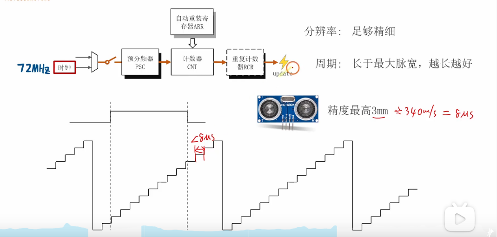

<span style="font-weight:bold; font-size:1.2em;">上面这幅图片里面“精度最高3mm”和 “8us”我不是太懂，你能够给我解释下吗，最好能够举个例子来让我彻底弄明白。</span>


好的，这张图里的 "精度最高3mm" 和 "8µs" 确实需要分开理解，并且图中的那个计算 `≈ 340m/s = 8µs` 是**有问题的或者过于简化了**，不能直接划等号。我们来逐一解释：

**1. "精度最高3mm" 指的是什么？**

- **含义：** 这指的是 HC-SR04 这个**超声波模块本身**理论上能够分辨的**最小距离变化**大约是3毫米（mm）。你可以把它理解为这个传感器的**分辨率极限**或者**理论上的最佳精度**。
- **来源：** 这个数值通常来自传感器的设计规格或者数据手册。它受到多种因素的限制，包括：
  - **超声波的波长：** 40kHz超声波在空气中的波长大约是 $\lambda = V_{sound} / f = 340 \text{ m/s} / 40000 \text{ Hz} = 0.0085 \text{ 米} = 8.5 \text{ mm}$。物理上很难精确分辨小于一个波长一半（约4.25mm）的距离变化，3mm是一个更经验性或理论优化后的数值。
  - **模块内部电路的响应速度和稳定性。**
  - **环境因素**（如空气流动、温度变化）对声速和回波的影响。
- **关键点：** 3mm 是**传感器本身**能达到的**最好分辨能力**，是你使用这个传感器进行测量时，精度方面的一个**理论上的天花板**。要达到这个精度，你的**测量方法**（比如STM32的计时）**必须足够精确**。

**2. "8µs" 指的是什么？（结合图示和上下文）**

- **最可能的含义：** 图中 `≈ 340m/s = 8µs` 这个写法非常容易误导。更合理的解释是，**8µs** 在这里**很可能代表的是与3mm距离相关的某个时间值**，或者是下面**定时器计数波形示例中的一个时间单位**。我们来分析一下：

  - 与3mm相关的单程时间： 超声波走3mm（0.003米）单程需要的时间是：

    $t_{one\_way} = \text{距离} / \text{声速} = 0.003 \text{ m} / 340 \text{ m/s} \approx 0.0000088 \text{ 秒} \approx 8.8 \mu s$。这个数值非常接近8µs。

  - **定时器分辨率示例：** 图下方画了一个阶梯状上升的波形，代表定时器计数器（CNT）的值在随时间增长。每一个“台阶”的宽度就代表了定时器的**计时分辨率**（或者叫计数周期）。图上在某个台阶宽度旁边标注了 `< 8us`（虽然字迹有点模糊，但看起来像）。这**可能**是在**举例说明**，如果你的定时器配置使得它的计数周期（分辨率）是8µs，那么它每8µs计数值才会增加1。

- **与图中计算的关联：** 图中那个错误的等式可能是想**非常粗略地**表达：要分辨3mm的距离（对应单程约8.8µs，往返约17.6µs的时间），你的计时系统的分辨率至少要优于这个量级，比如达到微秒级。但直接写 `340m/s = 8µs` 是不成立的。

- **视频中的实际配置：** 请注意，根据上一个问题中我们分析的视频代码，实际配置的定时器分辨率是 **1µs** (通过72MHz时钟和71的预分频系数得到1MHz计数频率)。**1µs的分辨率远优于8µs**，足以满足分辨3mm距离所需的约17.6µs往返时间精度的要求 ( $17.6 \mu s / 1 \mu s \approx 18$ 个计数单位，足够分辨)。

**例子来彻底弄明白：**

- **精度3mm（传感器的能力）：** 想象你有一把尺子，它上面最小的刻度是3毫米。这意味着用这把尺子，你能读出的最小长度变化就是3毫米。你不可能用它精确读出1毫米或0.5毫米的长度。这就是尺子（传感器）本身的精度限制。
- **8µs（可能的计时分辨率示例）：** 想象你在用一个秒表来计时。如果这个秒表每跳动一下代表8微秒过去了（就像图下方的台阶宽度是8µs），那么这个秒表的**分辨率**就是8µs。你用它测量时间，只能得到8µs的整数倍，比如16µs, 24µs, 32µs... 你无法用它精确测量出10µs或12µs。
- **两者关系：** 要想用你的测量系统（尺子+眼睛，或者 超声波模块+STM32定时器）达到传感器声称的最高精度（3mm），你的测量工具（眼睛的分辨率，或者STM32定时器的分辨率）本身必须**比这个精度要求更高**。
  - 3mm距离对应的**往返时间**大约是 $2 \times 3 \text{ mm} / 340 \text{ m/s} \approx 17.6 \mu s$。
  - 你的定时器分辨率（比如视频实际用的**1µs**）必须**远小于**这个17.6µs，才能有希望去分辨这么小的时间差，进而分辨出3mm的距离差。如果你的定时器分辨率是8µs（如图示例子），那么你测量的时间精度就在8µs左右，对应的距离精度大约是 $(8 \mu s \times 340 \text{ m/s}) / 2 \approx 1.36 \text{ mm}$。理论上8µs的分辨率是足够达到3mm精度的，但1µs会更好。

**总结：**

- **"精度最高3mm"** 是指HC-SR04传感器本身的**理论最佳分辨率**。
- **"8µs"** 最可能是指与3mm相关的**单程飞行时间**（约8.8µs），或者是图下方定时器计数波形的一个**示例分辨率**。它与旁边的等式没有严格的推导关系，且**不代表视频最终代码使用的定时器分辨率**（实际是1µs）。
- 要实现高精度测量，定时器的计时分辨率必须足够小（远小于目标精度对应的飞行时间）。

希望这次解释能帮你区分这两个概念以及它们之间的关系！


## 提问8


<span style="font-weight:bold; font-size:1.2em;">视频中输入捕获通道这里为什么设置的是输入下拉呢，参考文档中明明指出的是浮空输入，TIM1_CH1（定时器的输入捕获通道1）设置为输入下拉是有什么好处吗。</span>


你说得非常对！参考表格中确实将输入捕获通道（TIM1/8_CHx 用于输入时）的 GPIO 配置推荐为**浮空输入 (Floating Input)**。然而，在实际应用中，特别是像连接 HC-SR04 的 Echo 引脚这样的场景，将对应的 GPIO（视频中是 PA8，作为 TIM1_CH1）配置为**输入下拉 (Input Pull-down)** 也是一种常见且有好处的做法。

原因如下：

1. **提供明确的默认低电平状态：**
   - **浮空输入**：当外部没有信号驱动时（比如 HC-SR04 模块尚未开始发送 Echo 脉冲，或者脉冲已经结束，或者甚至模块未连接或未上电），浮空输入引脚的电平是不确定的。它容易受到干扰，可能会意外地被识别为高电平，导致错误的触发或测量。
   - **输入下拉**：配置为输入下拉后，STM32 内部会连接一个微弱的下拉电阻到地 (GND)。这样，在 Echo 引脚没有被 HC-SR04 模块主动驱动为高电平时，这个下拉电阻会**确保引脚保持在一个稳定的低电平状态**。
2. **增强抗干扰能力（尤其是在空闲状态）：**
   - 虽然在 Echo 脉冲期间，HC-SR04 会主动将引脚驱动为高电平，足以克服内部下拉电阻的影响。但在脉冲之前和之后的**低电平空闲期间**，下拉电阻有助于抵抗可能的环境噪声（如电磁干扰 EMI），防止噪声信号意外地将引脚电平抬高到逻辑高阈值以上，从而避免误触发输入捕获。
3. **安全性/鲁棒性考虑：**
   - 如果 HC-SR04 模块与 STM32 之间的连接出现问题（比如线松了），或者模块本身出现故障没有输出信号，下拉配置可以确保 STM32 的输入引脚维持在已知的低电平，而不是在一个不确定的浮动状态之间随机跳变，这通常更有利于系统的稳定性和错误处理。

**总结与对比：**

- **参考文档推荐“浮空输入”** 是基于理想情况：假设外部信号源（HC-SR04 的 Echo 输出）总是能可靠地将信号线驱动到明确的高电平或低电平。在这种理想情况下，浮空输入是**足够**的，并且功耗最低（因为没有内部电阻消耗电流）。
- **视频（或实际代码）选择“输入下拉”** 是一种更**保守**或**健壮**（Robust）的设计选择。它牺牲了极微小的额外功耗（仅在 Echo 为高电平时，电流会流过下拉电阻），换来了**更明确的默认状态**和**更好的抗干扰能力**，尤其是在应对引脚空闲、连接不良或噪声环境等非理想情况时。

**简单来说，好处就是：** 确保 Echo 引脚在没有有效高电平信号时，稳定地处于低电平状态，避免误触发和不确定性。这是一种增加系统稳定性的常见做法，即使参考文档只提了浮空输入。对于输入捕获来说，只要不影响正常信号边沿的捕获，配置成下拉通常是安全且有益的。


## 提问9

<span style="font-weight:bold; font-size:1.2em;">视频中初始化输入捕获通道这里 “TIM_ICInitstructure.TIM_ICFilter = OxOO；// 不使用滤波器”为什么设置的是不适用滤波器呢。</span>


你观察得很细致！在视频代码中将 `TIM_ICFilter` 设置为 `0x00`（即不使用滤波器）主要基于以下考虑和权衡：

1. **信号特性预期：** HC-SR04 模块输出的 Echo 信号通常被认为是**相对干净的数字脉冲信号**。它的上升沿和下降沿比较陡峭，不太可能包含需要滤波器来滤除的高频毛刺或噪声尖峰。
2. **滤波器的主要作用：** STM32 定时器的输入捕获滤波器主要是为了**抑制输入信号上的短时干扰或噪声**，防止它们被错误地识别为有效的边沿触发。滤波器通过对输入信号进行多次采样，并要求连续 N 个采样点状态稳定后才确认边沿的发生。
3. **滤波器的代价——引入延迟：** 启用滤波器（即设置 `TIM_ICFilter` 大于 0）会不可避免地**引入一个时间延迟**。这个延迟发生在实际的信号边沿到达引脚和定时器捕获寄存器（CCR）真正锁存计数器（CNT）值之间。延迟的大小取决于滤波器的配置（采样时钟源和需要稳定采样的次数 N）。
4. **对测距精度的影响：** 超声波测距的核心是**精确测量 Echo 脉冲的宽度**（即下降沿时刻 - 上升沿时刻）。
   - 如果滤波器给上升沿和下降沿带来了**不同**的延迟，那么计算出的脉冲宽度就会有误差，直接影响距离测量的准确性。
   - 即使滤波器带来的延迟对上升沿和下降沿是**相同**的，它也**整体性地稍微延迟了捕获事件**的记录时间。虽然在计算差值时这个固定延迟理论上会被抵消，但在某些复杂的应用场景或要求极高时间精度时，任何不必要的延迟都可能需要考虑。
5. **优先考虑响应速度和最小延迟：** 对于测量脉宽的应用，尤其是当信号质量较好时，**优先考虑的是尽快地、无延迟地捕捉到边沿发生的精确时刻**。禁用滤波器 (`TIM_ICFilter = 0x00`) 可以确保定时器对输入边沿做出最快的响应，将捕获延迟降至最低。

**总结来说：**

设置 `TIM_ICFilter = 0x00` 是基于**对 Echo 信号质量的信心**（认为它足够干净，不需要滤波）以及**优先保证测量时间精度、避免引入不必要的滤波延迟**的考虑。这是一种在信号源比较可靠的情况下，为了追求最佳计时精度而采取的常见做法。

**当然，如果实际应用环境噪声很大，导致 Echo 信号上确实存在可能引起误触发的毛刺，那么适当开启滤波器（设置一个较小的值，比如 0x01 到 0x03 之间）可能就是必要的，但这需要根据实际测试情况来权衡滤波效果和引入的延迟。** 在这个教学视频中，为了简化和突出核心原理，假设了理想的信号条件，因此选择了不使用滤波器。


## 提问10

```c
    // 3. 等待捕获上升沿 (TIM_FLAG_CC1) 并设置超时
    counter = 0;
    // 等待捕获到上升沿或者超时(例如超过最大量程对应的时间)
    // 超时计数是为了防止Echo一直为低（传感器未连接或故障）导致死循环
    // 假设最大测量距离为5m，往返10m，时间约为 10m / 340m/s ≈ 0.0294s = 29400us
    // 我们设置一个稍大的超时值，比如 60000us (60ms)
    while (TIM_GetFlagStatus(TIM1, TIM_FLAG_CC1) == RESET) {
        counter++;
        Delay_us(1); // 每次检查间隔1us
        if (counter > 60000) { // 超时处理
            TIM_Cmd(TIM1, DISABLE); // 超时则关闭定时器
            return -1.0f; // 返回无效距离
        }
    }
    ccr1 = TIM_GetCapture1(TIM1); // 读取上升沿捕获值

    // 4. 等待捕获下降沿 (TIM_FLAG_CC2) 并设置超时
    counter = 0; 
    while (TIM_GetFlagStatus(TIM1, TIM_FLAG_CC2) == RESET) {
         counter++;
         Delay_us(1); 
         if (counter > 60000) { // 超时处理
             TIM_Cmd(TIM1, DISABLE); 
             return -2.0f; // 返回不同的无效距离，方便调试
         }
    }
    ccr2 = TIM_GetCapture2(TIM1); // 读取下降沿捕获值

    // 5. 捕获完成，关闭定时器
```


好的，这段代码是用**轮询 (Polling)** 的方式等待并捕获超声波模块Echo引脚上的高电平脉冲的起始和结束时刻。我们来一步步详细解释：

**背景回顾:**

- **目标:** 测量HC-SR04模块Echo引脚输出的高电平脉冲的宽度。
- **硬件设置:**
  - Echo引脚连接到STM32的PA8。
  - PA8配置为定时器TIM1的通道1 (TIM1_CH1) 的输入。
  - TIM1被配置为：
    - 通道1 (IC1) 捕获**上升沿**，并将捕获时的计数值存入`CCR1`寄存器，同时**触发从模式**将计数器`CNT`**清零** (因为配置了`TIM_SlaveMode_Reset`和`TIM_TS_TI1FP1`)。捕获事件会设置`TIM_FLAG_CC1`标志位。
    - 通道2 (IC2) 捕获**下降沿**（通过内部连接，实际也是监测PA8），并将捕获时的计数值存入`CCR2`寄存器。捕获事件会设置`TIM_FLAG_CC2`标志位。
    - 定时器以1MHz的频率计数（即每1µs计数一次）。

**代码详解:**

**第3部分：等待并捕获上升沿 (Echo变高)**

C

```c
    // 3. 等待捕获上升沿 (TIM_FLAG_CC1) 并设置超时
    counter = 0; // 初始化超时计数器
    // ... (超时相关的注释说明) ...
    while (TIM_GetFlagStatus(TIM1, TIM_FLAG_CC1) == RESET) { // 循环等待，直到CC1标志位被设置
        counter++;          // 每次循环，超时计数器加1
        Delay_us(1);        // 延时1微秒，避免CPU空转过快，并作为超时计时基准
        if (counter > 60000) { // 检查是否超时 (等待时间超过60000us = 60ms)
            TIM_Cmd(TIM1, DISABLE); // 如果超时，立刻停止定时器
            return -1.0f;       // 返回一个错误代码（无效距离），表示上升沿超时
        }
    }
    // 跳出while循环，说明TIM_FLAG_CC1已经被硬件设置为SET了 (即上升沿已发生)
    ccr1 = TIM_GetCapture1(TIM1); // 读取捕获/比较寄存器1 (CCR1) 的值
```

- **`counter = 0;`**: 每次开始等待前，把用于计算等待时间的`counter`变量清零。
- **`while (TIM_GetFlagStatus(TIM1, TIM_FLAG_CC1) == RESET)`**: 这是核心的**等待循环**。
  - `TIM_GetFlagStatus(TIM1, TIM_FLAG_CC1)`: 这个函数去检查TIM1定时器的**通道1捕获/比较标志位 (CC1IF)** 是否被硬件设置了。
  - `== RESET`: `RESET` 通常表示标志位为0，即**尚未**被设置。只要标志位还是`RESET`状态（意味着上升沿还没来），这个`while`循环就会一直执行下去。
- **循环体内部：**
  - `counter++`: 每循环一次，计数器加1。
  - `Delay_us(1)`: 暂停1微秒。这有两个作用：一是稍微降低CPU占用率；二是作为超时判断的时间基准，`counter`的值就大致等于等待的微秒数。
  - `if (counter > 60000)`: **超时判断**。如果循环执行了超过6万次（大约等待了60毫秒），但上升沿标志位`TIM_FLAG_CC1`仍然没有被设置，就认为超时了。超时可能意味着传感器没连接好、坏了，或者障碍物太远导致没有回波。
  - `TIM_Cmd(TIM1, DISABLE)` 和 `return -1.0f`: 超时后，停止定时器并返回一个特定的负数值，告知调用者测量失败（具体原因是等待上升沿超时）。
- **`ccr1 = TIM_GetCapture1(TIM1);`**: **一旦`while`循环结束**（说明`TIM_FLAG_CC1`不再是`RESET`，即**上升沿已经被硬件捕获**），就立刻执行这一句。
  - `TIM_GetCapture1(TIM1)`: 这个函数读取**捕获/比较寄存器1 (CCR1)** 的当前值。
  - **关键：** 由于我们配置了**从模式复位 (Slave Mode Reset)**，当上升沿被捕获时，硬件不仅将当时的`CNT`值存入`CCR1`，还会**同时将`CNT`清零**。所以，这里读到的`ccr1`的值理论上**非常接近于0**（可能是一个非常小的非零值，代表从边沿检测到CNT清零之间的微小硬件延迟）。

**第4部分：等待并捕获下降沿 (Echo变低)**

C

```c
    // 4. 等待捕获下降沿 (TIM_FLAG_CC2) 并设置超时
    counter = 0; // 重新初始化超时计数器，为等待下降沿做准备
    while (TIM_GetFlagStatus(TIM1, TIM_FLAG_CC2) == RESET) { // 循环等待，直到CC2标志位被设置
         counter++;         // 每次循环，超时计数器加1
         Delay_us(1);       // 延时1微秒
         if (counter > 60000) { // 同样的超时判断 (60ms)
             TIM_Cmd(TIM1, DISABLE); // 超时则关闭定时器
             return -2.0f;      // 返回另一个错误代码，表示下降沿超时
         }
    }
    // 跳出while循环，说明TIM_FLAG_CC2已经被硬件设置为SET了 (即下降沿已发生)
    ccr2 = TIM_GetCapture2(TIM1); // 读取捕获/比较寄存器2 (CCR2) 的值
```

- 这部分代码的**逻辑与第3部分完全相同**，只是等待的目标变成了**通道2的捕获标志位 `TIM_FLAG_CC2`**，并且在超时时返回了不同的错误码 `-2.0f` 以便区分。
- **`ccr2 = TIM_GetCapture2(TIM1);`**: 当`while`循环结束（说明**下降沿已经被硬件捕获**），执行这一句。
  - `TIM_GetCapture2(TIM1)`: 读取**捕获/比较寄存器2 (CCR2)** 的值。
  - **关键：** 由于`CNT`在之前的上升沿捕获时已经被**清零**了，并且定时器一直以1MHz（1µs/次）的频率向上计数，那么当下降沿发生时，硬件将**此刻的`CNT`值**存入`CCR2`。这个`CCR2`的值就**直接代表了从上升沿（CNT清零）到下降沿之间经过的定时器计数值**，也就是Echo高电平脉冲的**宽度**（单位是微秒）。

**第5部分：捕获完成，关闭定时器**

C

```c
    // 5. 捕获完成，关闭定时器
    TIM_Cmd(TIM1, DISABLE);
```

- 既然上升沿和下降沿都已经成功捕获，本次测量所需的计时信息已经保存在`ccr1`和`ccr2`中了（主要在`ccr2`里，因为`ccr1`接近0），就不再需要定时器继续计数了。
- 调用`TIM_Cmd(TIM1, DISABLE)`将TIM1定时器**停止**，可以稍微节省一点功耗，并为下一次测量做好准备（下次测量前会再次使能）。

**总结：**

这段代码的核心思想是利用STM32定时器的输入捕获功能和标志位，通过**轮询**的方式：

1. 等待Echo引脚出现上升沿（`TIM_FLAG_CC1`被置位）。
2. 记录上升沿发生的时刻（`ccr1`，由于Reset模式，接近0）。
3. 等待Echo引脚出现下降沿（`TIM_FLAG_CC2`被置位）。
4. 记录下降沿发生的时刻（`ccr2`，这个值就代表了脉冲宽度）。
5. 同时，在等待过程中加入**超时判断**，防止因信号异常导致程序卡死。
6. 捕获完成后关闭定时器。

接下来的代码（未显示）就会利用`ccr2`（或者更精确地用 `ccr2 - ccr1`）的值来计算距离。


# **2. 补充信息与扩展**

- **深入了解输入捕获单元:** STM32定时器的输入捕获单元相当灵活，包括：
  - **输入滤波器 (ICF):** 可以滤除输入引脚上的短暂毛刺。滤波器以可配置的频率对输入进行采样，并需要若干个连续的稳定采样才能识别边沿。
  - **边沿检测器:** 根据配置（CCxP, CCxNP位）检测上升沿、下降沿或双边沿。
  - **预分频器 (ICPSC):** 允许每N个事件捕获一次，而不是每个事件都捕获，适用于低频信号，但通常不用于此类脉宽测量。
  - **捕获/比较寄存器 (CCR):** 当检测到有效边沿时，定时器计数器（CNT）的当前值被复制到相应的CCR寄存器中。
  - **标志位与中断:** 捕获事件会设置标志位（CCxIF），并可以触发中断或DMA请求。
- **使用单个通道捕获双边沿:** 某些STM32定时器允许配置单个通道在上升沿和下降沿都触发捕获。这需要在每次捕获后，在中断处理程序中更改边沿极性（`TIM_ICPolarity`）。这种方法节省了一个定时器通道，但增加了软件开销和复杂性，如果中断延迟相对于脉冲宽度比较显著，可能会降低精度。视频中展示的方法（使用映射到具有不同极性的IC1和IC2的TI1）通常更稳健。
- **定时器时钟和分辨率:** 时间测量的精度直接取决于定时器的计数频率。72MHz系统时钟除以 (71+1) 得到1MHz的定时器时钟，意味着每个计数代表1µs。更高的定时器时钟频率（更精细的分辨率）可以更精确地测量Echo脉冲宽度，从而可能获得更高的距离精度，但它也减少了计数器溢出前可测量的最大时间（除非使用32位定时器）。
- **声速:** 340 m/s的值是在室温（约15°C）下的近似值。实际声速会随温度、湿度和海拔高度显著变化。为了获得更高的精度，通常需要使用温度传感器进行温度补偿。公式：$v \approx 331.3 + 0.606 \times T$ （其中T是摄氏温度）。
- **传感器局限性:** HC-SR04存在一些限制：
  - **最小量程:** 通常为2-3厘米。更近的物体可能无法正确检测。
  - **最大量程:** 通常为4-5米，取决于条件和物体的反射率。
  - **波束角:** 超声波以锥形发射（例如，约15-30度）。此锥体外的物体不会被检测到。
  - **测量周期时间:** 传感器两次测量之间需要一个延迟（例如，建议大于60ms），以避免前次回波的干扰。
- **替代方案：外部中断 + 定时器计数:** 通过在Echo引脚上配置外部中断（EXTI）来检测上升沿和下降沿。在上升沿时，复位/启动一个基本定时器计数器。在下降沿时，停止定时器并读取其计数值。这种方法释放了定时器的输入捕获通道，但依赖于中断延迟的一致性。


# 补充提问

## 提问：定时器中断（重点）

<span style="font-weight:bold; font-size:1.2em;">stm32中有关定时器的中断你能够给我详细解释下吗，我老是搞不太懂，最好能够举个例子来帮我将所有定时器中断彻底弄明白。</span>


好的，STM32定时器中断确实是嵌入式开发中非常重要且常用的部分，但也容易让人混淆，特别是各种中断源和配置流程。我们来详细梳理一下，并结合例子让你彻底弄明白。

**一、 为什么需要定时器中断？**

想象一下，你想让一个LED灯每隔1秒闪烁一次。

- **不用中断 (轮询方式):** 你可以在主程序的`while(1)`循环里，不断地检查定时器的计数值或者标志位，看是否到达了1秒。
  - **缺点:** CPU大部分时间都在忙着检查定时器，无法高效地处理其他任务。如果其他任务阻塞了CPU，LED闪烁的精确性就会受影响。
- **用中断方式:** 你配置好定时器，让它每隔1秒产生一个**中断信号**。当中断发生时，CPU会自动暂停当前正在执行的主程序，跳转去执行一个专门的**中断服务函数 (ISR - Interrupt Service Routine)**。在这个ISR里，你只需要写一行代码来翻转LED的状态。执行完ISR后，CPU会自动返回到之前被暂停的主程序继续执行。
  - **优点:**
    - **高效:** CPU平时可以专注于处理其他任务，只有在1秒时间到达时才会被“打扰”一下去处理LED翻转。
    - **精确:** 中断是由硬件触发的，响应及时，不受主程序其他代码执行时间的影响（只要中断本身执行够快且优先级设置合理）。
    - **并发:** 看起来就像主程序和其他由中断驱动的任务（比如LED闪烁）在“同时”运行。

**二、 STM32定时器有哪些常见的中断源？**

一个定时器内部有很多事件可以触发中断，最常用的包括：

1. **更新中断 (Update Interrupt - TIM_IT_Update):**
   - **触发条件:** 这是最最常用的中断。通常在定时器计数器**溢出**（向上计数模式下从ARR计数值跳变到0）或**下溢**（向下计数模式下从0跳变到ARR计数值）时产生。在中央对齐模式下，溢出或下溢时都可能产生。
   - **用途:** 实现**周期性**的任务，比如上面例子中的LED定时闪烁、定时采样ADC、周期性发送数据等。
2. **捕获/比较中断 (Capture/Compare Interrupt - TIM_IT_CCx, x=1,2,3,4):**
   - **触发条件:**
     - **输入捕获模式 (Input Capture):** 当定时器的某个通道 (CHx) 检测到其对应输入引脚 (TIX) 上发生**有效边沿**（上升沿、下降沿或双边沿，根据配置决定）时，会把当前的计数值(CNT)锁存到捕获/比较寄存器(CCRx)中，并可以触发一个CCx中断。
     - **输出比较模式 (Output Compare):** 当定时器的计数值(CNT)和某个通道 (CHx) 的捕获/比较寄存器(CCRx)中的值**匹配**（相等）时，可以触发一个CCx中断。
   - **用途:**
     - **输入捕获中断:** 测量外部脉冲的宽度（像超声波的Echo信号）、频率，或者精确捕捉外部事件发生的时间。
     - **输出比较中断:** 在精确的未来时间点执行某个动作（比如延时指定的us/ms后触发某个事件）、生成PWM信号（虽然PWM通常不依赖中断，但可以结合中断使用）、单脉冲输出等。
3. **触发中断 (Trigger Interrupt - TIM_IT_Trigger):**
   - **触发条件:** 当定时器检测到来自**内部其他定时器**或**外部引脚 (ETR, TIx)** 的有效触发信号 (TRGI) 时产生。这通常与定时器的**从模式**配置相关。
   - **用途:** 实现定时器之间的同步（一个定时器启动/停止另一个定时器）、响应外部事件来启动/停止/复位定时器等。
4. **刹车中断 (Break Interrupt - TIM_IT_Break):** (仅高级定时器 TIM1/TIM8 等拥有)
   - **触发条件:** 当刹车输入引脚 (BKIN) 检测到有效电平（通常是低电平，表示故障或紧急停止信号）时产生。
   - **用途:** 主要用于电机控制或电源管理中，实现快速、安全的输出关闭（通常是PWM输出）。

**三、 如何配置和使用STM32定时器中断 (标准库 SPL 步骤)**

以最常用的**更新中断**为例，假设我们要配置 TIM3 每秒触发一次更新中断来翻转连接在 PB5 上的 LED：

1. **使能外设时钟:**
   - 使能 TIM3 的时钟 (`RCC_APB1PeriphClockCmd(RCC_APB1Periph_TIM3, ENABLE);`)。
   - 使能 LED 对应 GPIO 的时钟 (假设是 GPIOB, `RCC_APB2PeriphClockCmd(RCC_APB2Periph_GPIOB, ENABLE);`)。
2. **初始化 GPIO:**
   - 配置 PB5 为推挽输出模式 (`GPIO_InitTypeDef`, `GPIO_Init`)。
3. **配置 NVIC (嵌套向量中断控制器):**
   - 设置中断优先级分组 (`NVIC_PriorityGroupConfig`)，通常在程序开始时统一设置一次，比如 `NVIC_PriorityGroup_2` 表示2位抢占优先级，2位子优先级。
   - 配置 TIM3 中断通道 (`NVIC_InitTypeDef`)：
     - 指定中断请求号 (IRQ Channel)，比如 `TIM3_IRQn`。
     - 设置抢占优先级 (`NVIC_IRQChannelPreemptionPriority`)。
     - 设置子优先级 (`NVIC_IRQChannelSubPriority`)。
     - 使能该中断通道 (`NVIC_IRQChannelCmd = ENABLE;`)。
   - 调用 `NVIC_Init()` 应用配置。
   - **关键：** NVIC 是独立于定时器外设的，负责管理所有的中断请求。必须配置它，CPU 才知道要去响应这个中断。
4. **配置定时器 (TIM3):**
   - 配置时基单元 (`TIM_TimeBaseInitTypeDef`)：
     - 设置预分频器 `TIM_Prescaler` (PSC)。
     - 设置自动重装载值 `TIM_Period` (ARR)。
     - PSC 和 ARR 的值需要根据你的 APB1 时钟频率 (PCLK1) 来计算，使得更新事件恰好每秒发生一次。例如，如果 PCLK1 = 36MHz，你可以设置 `PSC = 35999` (36MHz / (35999+1) = 1kHz)，然后设置 `ARR = 999` (1kHz / (999+1) = 1Hz，即1秒)。
     - 设置计数模式 (`TIM_CounterMode`)，通常是向上计数 `TIM_CounterMode_Up`。
     - 设置时钟分频因子 (`TIM_ClockDivision`)，通常设为 `TIM_CKD_DIV1`。
   - 调用 `TIM_TimeBaseInit()` 应用时基配置。
   - **清除更新中断标志位 (好习惯):** 在使能中断前，先清除一下可能存在的标志位 `TIM_ClearFlag(TIM3, TIM_FLAG_Update);` 或 `TIM_ClearITPendingBit(TIM3, TIM_IT_Update);`。
   - **使能定时器更新中断:** 调用 `TIM_ITConfig(TIM3, TIM_IT_Update, ENABLE);`。
     - **关键：** 这一步是告诉**定时器模块本身**，当更新事件发生时，**允许**它向 NVIC 发出中断请求。如果只配置了 NVIC 而没调用 `TIM_ITConfig`，中断也不会发生。
   - **使能定时器计数器:** 调用 `TIM_Cmd(TIM3, ENABLE);` 让定时器开始计数。
5. **编写中断服务函数 (ISR):**
   - 在你的工程中（通常是在 `stm32f10x_it.c` 文件里），找到或添加 TIM3 的全局中断服务函数 `TIM3_IRQHandler(void)`。
   - 在函数内部：
     - **检查中断源:** 使用 `if (TIM_GetITStatus(TIM3, TIM_IT_Update) != RESET)` 来判断是否是更新中断触发了这次 ISR 调用（因为一个 ISR 可能需要处理来自同一个定时器的多个中断源）。
     - **清除中断标志位:** **极其重要！** 必须调用 `TIM_ClearITPendingBit(TIM3, TIM_IT_Update);` 来清除更新中断挂起位。否则，一旦退出 ISR，CPU 会认为中断仍然存在，导致 ISR 不断被重复进入，程序卡死。
     - **执行中断任务:** 在这里编写你的代码，比如翻转 LED 状态 `GPIO_WriteBit(GPIOB, GPIO_Pin_5, (BitAction)(1 - GPIO_ReadOutputDataBit(GPIOB, GPIO_Pin_5)));`。

**四、 例子：综合理解所有类型中断 (以TIM2为例)**

假设我们要用 TIM2 实现以下功能：

- **功能1:** 每 500ms 触发一次**更新中断**，在中断中改变某个变量 `task_flag` 的状态。
- **功能2:** 使用通道1 (PA0) **输入捕获**一个外部脉冲的上升沿，触发**捕获中断**，在中断中记录下捕获值。
- **功能3:** 使用通道2 (PA1) **输出比较**，在定时器启动后 100ms 触发一次**比较中断**。

**配置步骤概览：**

1. **RCC 时钟:** 使能 TIM2, GPIOA 时钟。
2. **GPIO:** 配置 PA0 为输入 (浮空或下拉/上拉)，PA1 配置为推挽输出 (虽然输出比较中断本身不一定需要输出，但通常会配置)。
3. **NVIC:**
   - 配置优先级分组。
   - 配置并使能 `TIM2_IRQn` 中断通道，设置合适的优先级。
4. **TIM2 时基:**
   - 配置 PSC 和 ARR，使得更新周期为 500ms (例如 PCLK1=36MHz, PSC=35999, ARR=499)。
   - 向上计数模式。
   - `TIM_TimeBaseInit()`。
5. **TIM2 通道1 (输入捕获):**
   - 配置 `TIM_ICInitTypeDef`：`TIM_Channel_1`, `TIM_ICPolarity_Rising`, `TIM_ICSelection_DirectTI`, `TIM_ICPSC_DIV1`, `TIM_ICFilter = 0`。
   - `TIM_ICInit()`。
6. **TIM2 通道2 (输出比较):**
   - 配置 `TIM_OCInitTypeDef`：`TIM_Channel_2`, `TIM_OCMode_Timing` (仅用于触发中断，不改变引脚状态), `TIM_OutputState_Disable`, `TIM_Pulse` (这个值就是 CCR2 的值，设为 100ms 对应的计数值，例如对于 1kHz 计数频率，就是 100)，`TIM_OCPolarity_High`。
   - `TIM_OC2Init()` (或其他通道对应的 Init 函数)。
   - 可以预装载 CCR2 值：`TIM_SetCompare2(TIM2, 100);`
7. **使能中断源 (TIM2 内部):**
   - `TIM_ITConfig(TIM2, TIM_IT_Update | TIM_IT_CC1 | TIM_IT_CC2, ENABLE);` **一次性使能所有需要的中断源。**
8. **清除标志位:**
   - `TIM_ClearITPendingBit(TIM2, TIM_IT_Update | TIM_IT_CC1 | TIM_IT_CC2);` 清除所有可能存在的挂起位。
9. **使能定时器:**
   - `TIM_Cmd(TIM2, ENABLE);`

**编写 ISR (`TIM2_IRQHandler`):**

C

```c
volatile uint8_t task_flag = 0; // volatile 确保编译器不会优化掉对它的访问
volatile uint16_t captured_value = 0;

void TIM2_IRQHandler(void) {
    // 检查是否是更新中断
    if (TIM_GetITStatus(TIM2, TIM_IT_Update) != RESET) {
        TIM_ClearITPendingBit(TIM2, TIM_IT_Update); // 清除更新中断标志！！！
        
        // 执行更新中断任务
        task_flag = !task_flag; // 翻转标志位状态
    }

    // 检查是否是通道1捕获中断
    if (TIM_GetITStatus(TIM2, TIM_IT_CC1) != RESET) {
        TIM_ClearITPendingBit(TIM2, TIM_IT_CC1); // 清除通道1捕获中断标志！！！
        
        // 执行通道1捕获中断任务
        captured_value = TIM_GetCapture1(TIM2); // 读取捕获到的计数值
        // 你可以在这里处理这个值，比如计算频率或脉宽（需要配合下降沿捕获）
    }

    // 检查是否是通道2比较中断
    if (TIM_GetITStatus(TIM2, TIM_IT_CC2) != RESET) {
        TIM_ClearITPendingBit(TIM2, TIM_IT_CC2); // 清除通道2比较中断标志！！！
        
        // 执行通道2比较中断任务
        // 比如，在这里触发一次ADC转换，或者设置另一个标志位
        // 如果是只需要触发一次的事件，可以在这里禁止CC2中断：
        // TIM_ITConfig(TIM2, TIM_IT_CC2, DISABLE);
    }
    
    // 注意：一个ISR中可能同时触发了多个中断源，
    // 所以需要分别检查并清除各自的标志位。
}
```

**五、 总结与注意事项**

1. **配置顺序:** RCC -> GPIO -> NVIC -> TIMx (时基 -> 通道 -> 使能中断源 -> 清标志 -> 使能定时器)。
2. **NVIC 和 TIM_ITConfig 缺一不可:** 都要配置才能使能中断。
3. **ISR 中必须检查中断源:** 使用 `TIM_GetITStatus`。
4. **ISR 中必须清除中断标志位:** 使用 `TIM_ClearITPendingBit`，否则程序会卡死在中断里。
5. **ISR 应尽量简短快速:** 避免在中断服务函数中执行耗时过长的操作（如复杂的计算、阻塞式等待、大量数据传输），以免影响系统实时性。通常在 ISR 中只做最紧急的处理（如读取数据、设置标志位），把复杂的处理逻辑留给主循环去做（主循环根据 ISR 设置的标志位来决定是否执行某个任务）。
6. **`volatile` 关键字:** 如果在 ISR 中修改了某个全局变量，并且主循环或其他地方也会读取这个变量，那么这个变量应该用 `volatile` 关键字修饰，防止编译器过度优化导致读取到旧的值。
7. **不同定时器的差异:** STM32 有基本定时器 (TIM6/7)、通用定时器 (TIM2/3/4/5 等)、高级定时器 (TIM1/8)。它们支持的中断源和功能有所不同，高级定时器功能最全（包含刹车、互补输出、重复计数器等）。配置时需查阅对应型号的参考手册。

希望这个详细的解释和例子能帮助你彻底理解STM32定时器中断！多动手实践是掌握它的最好方法。


## 提问：中断扩展（重点）


<span style="font-weight:bold; font-size:1.2em;">你能够给我解释下各个模块关联的各个开关所对应的标准库函数的是什么样的吗，比如时钟使能，打开模块总开关，中断使能，这些都是为了打开一个开关吗，还有没有其他的开关呢，我不太懂，你能够给我详细解释下吗？</span>


你说得非常好！把这些配置过程理解为打开一系列“开关”是非常形象和有助于理解的。确实，要让一个STM32外设（比如定时器）按照你的意愿工作，尤其是产生中断，你需要按顺序“打开”好几个关联的“开关”。下面我们来详细解释这些“开关”及其对应的标准库函数：

**可以将整个过程想象成多级开关控制：**

1. **总电源开关 (RCC - 时钟使能):** 这是给整个模块/区域供电。
2. **设备主开关 (外设使能):** 这是打开具体设备（比如定时器本身）让它开始运行。
3. **设备功能开关 (外设内部中断/DMA使能):** 这是设备内部某个具体功能（比如更新中断、捕获中断）的开关，允许这个功能在满足条件时**发出信号**。
4. **信号接收开关 (NVIC - 中断通道使能):** 这是CPU的中断控制器上的开关，决定CPU是否**监听**来自某个设备的特定信号。
5. **信号状态复位开关 (清除中断挂起位):** 当信号被响应后，需要手动把信号状态复位，告诉系统“我已经处理完了”。

**下面详细解释每个“开关”及其对应的标准库函数 (以定时器为例):**

------

**1. 总电源开关：外设时钟使能 (RCC - Reset and Clock Control)**

- **概念:** 在STM32中，为了省电，默认情况下大部分外设的“电源”（也就是**时钟**）是关闭的。你必须先给你要用的外设“供上电”，它才能工作，它的寄存器才能被读写。
- **对应的“开关”:** RCC 模块中控制各个外设时钟的门控开关。
- **标准库函数:** `RCC_APB1PeriphClockCmd()`, `RCC_APB2PeriphClockCmd()`, `RCC_AHBPeriphClockCmd()`
  - `APB1`, `APB2`, `AHB` 指的是外设挂载在哪条总线上（需要查阅芯片手册确定，比如TIM2/3/4/5/6/7通常在APB1，TIM1/8和GPIO、USART1、ADC1/2通常在APB2）。
  - 第一个参数是具体的**外设时钟**，例如 `RCC_APB1Periph_TIM3` 表示TIM3的时钟，`RCC_APB2Periph_GPIOA` 表示GPIOA端口的时钟。可以使用 `|` (按位或) 操作符同时使能多个在同一总线上的外设时钟。
  - 第二个参数是 `ENABLE` (打开开关) 或 `DISABLE` (关闭开关)。
- **例子:** `RCC_APB1PeriphClockCmd(RCC_APB1Periph_TIM3, ENABLE);` // 打开TIM3的时钟“电源”

------

**2. 设备主开关：外设使能/失能**

- **概念:** 即使外设有了时钟，它也不一定马上开始工作（比如定时器开始计数）。通常还有一个总开关来启动或停止外设的核心功能。
- **对应的“开关”:** 外设自身的控制寄存器中的主使能位（例如TIMx_CR1寄存器中的CEN位）。
- **标准库函数:**
  - 定时器: `TIM_Cmd(TIM_TypeDef* TIMx, FunctionalState NewState)`
  - USART: `USART_Cmd(USART_TypeDef* USARTx, FunctionalState NewState)`
  - ADC: `ADC_Cmd(ADC_TypeDef* ADCx, FunctionalState NewState)`
  - DMA通道: `DMA_Cmd(DMA_Channel_TypeDef* DMAy_Channelx, FunctionalState NewState)`
  - ... 其他外设类似
  - `TIMx`, `USARTx`, `ADCx` 等是指定具体的外设（如TIM3、USART1）。
  - `NewState` 参数是 `ENABLE` (打开主开关，开始运行) 或 `DISABLE` (关闭主开关，停止运行)。
- **例子:** `TIM_Cmd(TIM3, ENABLE);` // 打开TIM3的主开关，让它开始计数

------

**3. 设备功能开关：外设内部中断/DMA使能**

- **概念:** 外设内部有很多事件可以触发中断或DMA请求（比如定时器更新、捕获/比较匹配）。你需要明确告诉外设，“当某个事件发生时，**允许**你产生相应的中断信号或DMA请求”。
- **对应的“开关”:** 外设的中断/DMA使能寄存器中的对应位（例如TIMx_DIER寄存器中的UIE, CCxIE等位）。
- **标准库函数:**
  - 定时器中断: `TIM_ITConfig(TIM_TypeDef* TIMx, uint16_t TIM_IT, FunctionalState NewState)`
  - 定时器DMA: `TIM_DMACmd(TIM_TypeDef* TIMx, uint16_t TIM_DMA_Source, FunctionalState NewState)`
  - USART中断: `USART_ITConfig(...)`
  - EXTI中断: `EXTI_Init(...)` 函数内部配置中断触发方式，外部中断线本身默认就是使能中断请求的。
  - ... 其他外设类似
  - `TIM_IT` 参数指定具体的中断源，例如 `TIM_IT_Update` (更新中断), `TIM_IT_CC1` (通道1捕获/比较中断)。可以使用 `|` 同时使能多个中断源。
  - `TIM_DMA_Source` 指定DMA请求源，例如 `TIM_DMA_Update`, `TIM_DMA_CC1`。
  - `NewState` 是 `ENABLE` (允许这个事件产生请求) 或 `DISABLE` (禁止这个事件产生请求)。
- **例子:** `TIM_ITConfig(TIM3, TIM_IT_Update | TIM_IT_CC1, ENABLE);` // 允许TIM3的更新事件和通道1捕获/比较事件产生中断请求信号。

------

**4. 信号接收开关：NVIC 中断通道使能**

- **概念:** 外设发出了中断请求信号，但CPU的中断控制器（NVIC - Nested Vectored Interrupt Controller）需要被告知要**监听**并**响应**来自这个特定外设的中断。每个中断源在NVIC中都有一个对应的通道。
- **对应的“开关”:** NVIC的中断使能寄存器中对应通道的使能位。
- **标准库函数:** 主要通过配置 `NVIC_InitTypeDef` 结构体，然后调用 `NVIC_Init()` 来完成。
  - `NVIC_InitTypeDef NVIC_InitStructure;`
  - `NVIC_InitStructure.NVIC_IRQChannel = TIM3_IRQn;` // 指定是哪个中断通道（每个外设的中断请求号是固定的，在`stm32f10x.h`中定义）。
  - `NVIC_InitStructure.NVIC_IRQChannelPreemptionPriority = 0;` // 设置抢占优先级。
  - `NVIC_InitStructure.NVIC_IRQChannelSubPriority = 1;` // 设置子优先级。
  - `NVIC_InitStructure.NVIC_IRQChannelCmd = ENABLE;` // **打开这个通道的开关**，允许CPU响应此中断。
  - `NVIC_Init(&NVIC_InitStructure);` // 应用配置。
  - 也可以直接使用 `NVIC_EnableIRQ(TIM3_IRQn);` 来使能，`NVIC_DisableIRQ(TIM3_IRQn);` 来失能。
- **例子:** (见上面结构体配置) // 打开NVIC中TIM3中断通道的“监听”开关。

------

**5. 信号状态复位开关：清除中断挂起位 (Pending Bit)**

- **概念:** 当一个中断事件发生并且对应的NVIC通道也使能了，NVIC会向CPU发出中断请求，同时外设内部和/或NVIC内部会设置一个“中断挂起位”（Pending Bit），表示“有一个中断请求正在等待处理”。CPU响应中断并跳转到ISR后，这个挂起位**并不会自动清除**。如果你在ISR中不手动清除它，那么ISR执行完毕返回后，CPU会认为中断请求仍然有效，导致**立即再次进入ISR**，形成死循环。

- **对应的“开关”:** 外设的状态寄存器中与中断相关的标志位（如TIMx_SR寄存器中的UIF, CCxIF位），或者NVIC的挂起寄存器中的位。

- **标准库函数:** **必须在中断服务函数(ISR)内部调用！**

  - 定时器: `TIM_ClearITPendingBit(TIM_TypeDef* TIMx, uint16_t TIM_IT)`
  - USART: `USART_ClearITPendingBit(...)`
  - EXTI: `EXTI_ClearITPendingBit(...)`
  - ... 其他外设类似
  - `TIM_IT` 参数指定要清除哪个中断源的挂起位，必须与触发当前ISR的中断源一致（通常在ISR开头用 `TIM_GetITStatus` 判断）。
  - **注意:** 有些外设的中断标志位可以通过读写相应寄存器来清除，但强烈建议使用库函数 `ClearITPendingBit`，因为它会正确处理清除逻辑。`TIM_ClearFlag` 主要用于清除状态标志，虽然有时也能清除中断挂起，但不是所有情况都适用，`ClearITPendingBit` 是专门用于清除中断请求的。

- **例子:** 在 `TIM3_IRQHandler` 函数中：

  C

  ```c
  if (TIM_GetITStatus(TIM3, TIM_IT_Update) != RESET) {
      TIM_ClearITPendingBit(TIM3, TIM_IT_Update); // 处理完更新中断后，必须清除它的挂起位！
      // ... 执行更新中断任务 ...
  }
  ```

------

**6. (补充) CPU总中断开关 (全局中断使能)**

- **概念:** CPU内核本身有一个总开关，可以允许或禁止所有**可屏蔽**的中断。这个开关通常在系统启动时由启动代码打开。但在某些需要严格禁止中断的“临界区”代码段，你可能会暂时关闭它，执行完后再打开。

- **对应的“开关”:** CPU内核状态寄存器中的中断使能位 (例如ARM Cortex-M中的PRIMASK寄存器)。

- **标准库/CMSIS 函数:**

  - `__enable_irq()`: 打开CPU总中断开关 (汇编指令 `CPSIE I`)。
  - `__disable_irq()`: 关闭CPU总中断开关 (汇编指令 `CPSID I`)。

- **例子:**

  C

  ```c
  __disable_irq(); // 进入临界区，关闭所有中断
  // ... 执行一些不允许被中断打断的操作 ...
  __enable_irq();  // 退出临界区，重新打开中断
  ```

**总结一下“打开”一个定时器更新中断的完整流程（开关顺序）：**

1. `RCC_APB1PeriphClockCmd(RCC_APB1Periph_TIMx, ENABLE);` (打开时钟电源)
2. 配置GPIO (如果需要的话)
3. `NVIC_Init(...)` (配置并打开NVIC通道的监听开关)
4. `TIM_TimeBaseInit(...)` (配置定时器基本参数)
5. `TIM_ITConfig(TIMx, TIM_IT_Update, ENABLE);` (打开定时器内部更新中断的允许开关)
6. `TIM_Cmd(TIMx, ENABLE);` (打开定时器的主运行开关，开始计数)
7. 在`TIMx_IRQHandler()`中:
   - `if(TIM_GetITStatus(...) == SET)` (检查是哪个中断源触发)
   - `TIM_ClearITPendingBit(...)` (**复位**中断请求信号状态)
   - 执行任务

希望这个详细的解释能帮助你理解STM32外设和中断配置中涉及的各种“开关”及其对应的库函数！


## 提问：（外设中断理解，重点）


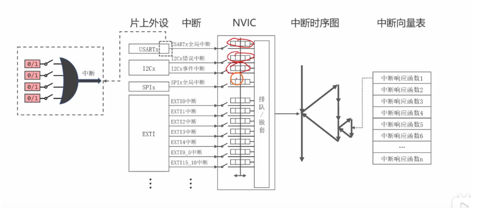

这张图里面的开关都对应的是标准库中的哪些些操作呢？“每个中断源在NVIC中都有一个对应的通道”这句话中的中断源具体指的是什么呢？图片中对应的USART不是有多个中断吗，最后在怎么变成了一个全局中断呢，是所有中断最后汇总成一根线输出，然后一个外设对应一个全局中断，这个全局中断其实是该外设中多个不同的中断汇合，然后刚好对应一个中断函数，然后在中断函数里面通过标志位来区分不同的中断，这样理解对吗？

<span style="font-weight:bold; font-size:1.2em;">我不太懂，请你给我解释下，最好能够举个例子来让我彻底弄明白。</span>


你说得非常棒！用“开关”来理解STM32的中断配置流程确实是一个非常形象和有效的方法。这张图也很好地展示了中断信号从外设产生到最终被CPU处理的过程。我们来详细解释一下图中的开关和你的疑问：

**1. 图中开关对应的标准库操作：**

这张图里主要体现了**两级关键的“开关”**，都与中断使能有关：

- **第一级开关：外设内部的中断源使能开关（位于"片上外设"框内，连接到OR门之前）**
  - **含义：** 这个开关决定了外设内部**某个特定的事件**（比如USART接收到数据、定时器计数溢出）**是否被允许产生一个中断请求信号**。每个可能产生中断的事件都有自己对应的一个“小开关”。
  - **对应的标准库函数：** `USART_ITConfig()`, `TIM_ITConfig()`, `I2C_ITConfig()`, `SPI_I2S_ITConfig()`, `EXTI_Init()` (配置中断模式时隐式使能) 等等。
    - 例如：`USART_ITConfig(USART1, USART_IT_RXNE, ENABLE);` 就是打开USART1内部“接收数据寄存器非空(RXNE)”这个事件的中断开关。如果这个开关是关的（DISABLE），即使接收到了数据，USART1也不会向NVIC发出中断信号。
    - 例如：`TIM_ITConfig(TIM3, TIM_IT_Update, ENABLE);` 就是打开TIM3内部“更新事件（通常是溢出）”的中断开关。
- **第二级开关：NVIC中的中断通道使能开关（位于"NVIC"框内，每行都有一个）**
  - **含义：** 这个开关位于NVIC（嵌套向量中断控制器）内部，对应着来自某个外设（或某组中断源）的**总的中断请求线**。它决定了NVIC**是否会“理睬”并处理**来自这条线的中断请求。如果这个开关是关的，即使外设内部的开关都打开了，并且外设发出了中断信号，NVIC也不会把它报告给CPU。
  - **对应的标准库函数：** 主要通过配置 `NVIC_InitTypeDef` 结构体中的 `NVIC_IRQChannelCmd` 字段为 `ENABLE`，然后调用 `NVIC_Init()` 来设置。也可以直接调用 `NVIC_EnableIRQ(IRQn_Type IRQn)` 来打开，`NVIC_DisableIRQ(IRQn_Type IRQn)` 来关闭。
    - `IRQn_Type` 就是具体的中断请求号，比如 `USART1_IRQn`, `TIM3_IRQn`, `EXTI0_IRQn` 等。
    - 例如：在配置好`NVIC_InitTypeDef`结构体变量`NVIC_InitStructure`后（指定了`NVIC_IRQChannel = USART1_IRQn` 和 `NVIC_IRQChannelCmd = ENABLE`），调用 `NVIC_Init(&NVIC_InitStructure);` 就打开了NVIC中监听USART1中断请求的那个“开关”。
- **(隐含的开关) 中断挂起位清除：** 当中断发生并被响应后，外设或NVIC内部会有一个“中断挂起位(Pending Bit)”被置位。在中断服务函数(ISR)中，**必须手动清除**这个挂起位，相当于“复位”这个中断信号，否则中断会不停地触发。
  - **对应的标准库函数：** `USART_ClearITPendingBit()`, `TIM_ClearITPendingBit()`, `EXTI_ClearITPendingBit()` 等。这**不是**使能开关，而是**状态清除**操作，但对于中断流程的正确性至关重要。
- **(未在图中明确画出，但非常重要) CPU全局中断使能开关：** CPU内核本身还有一个总中断开关，默认是开启的。可以使用 `__enable_irq()` (开启) 和 `__disable_irq()` (关闭) 来控制所有可屏蔽中断的响应。

**2. “中断源”具体指的是什么？**

- **中断源 (Interrupt Source)** 指的是能够**触发**中断请求的**具体事件或条件**。它通常发生在某个外设内部。
- **例子：**
  - **定时器 (TIMx):**
    - 更新事件 (计数器溢出/下溢): `TIM_IT_Update`
    - 通道1捕获/比较事件: `TIM_IT_CC1`
    - 通道2捕获/比较事件: `TIM_IT_CC2`
    - 触发事件: `TIM_IT_Trigger`
    - 刹车事件 (高级定时器): `TIM_IT_Break`
  - **串口 (USARTx):**
    - 接收数据寄存器非空: `USART_IT_RXNE`
    - 发送数据寄存器为空: `USART_IT_TXE`
    - 发送完成: `USART_IT_TC`
    - 检测到总线空闲: `USART_IT_IDLE`
    - 校验错误: `USART_IT_PE`
    - 帧错误/噪声错误/溢出错误: `USART_IT_ERR` (通常包含多个错误标志)
  - **外部中断 (EXTI):**
    - 外部中断线0上的边沿触发: `EXTI_Line0`
    - 外部中断线1上的边沿触发: `EXTI_Line1`
    - ...
  - **I2C:**
    - 起始位发送、地址发送、数据发送/接收等事件: `I2C_IT_EVT`
    - 总线错误、仲裁丢失、应答失败等错误: `I2C_IT_ERR`

**3. USART多个中断如何变成一个全局中断？**

- **你的理解是基本正确的！**
- **外设内部的“或”逻辑：** 对于像USART这样拥有多个中断源的外设，其内部设计通常会将**所有被使能 (通过 `USART_ITConfig` 打开了内部开关) 的中断源**的发生状态进行**逻辑或 (OR)** 操作。
- **单一中断请求线：** 这个“或”运算的结果会驱动**一条**连接到NVIC的中断请求线。例如，对于USART1，无论是因为接收到数据(`RXNE`)，还是因为发送缓冲空了(`TXE`)，只要对应的 `USART_ITConfig` 开关是打开的，它们都会**触发同一条**名为 `USART1_IRQn` 的中断线向NVIC发出请求。
- **NVIC通道与ISR的对应：** NVIC中的每个通道（比如 `USART1_IRQn` 通道）**唯一对应**中断向量表中的一个地址，这个地址指向的就是该通道的**中断服务函数 (ISR)**（比如 `USART1_IRQHandler()`）。
- **ISR内部区分中断源：** 因此，当CPU因为 `USART1_IRQn` 这条线上的信号而跳转到 `USART1_IRQHandler()` 时，程序并不知道具体是哪个内部事件（RXNE? TXE? 还是其他错误?）触发了中断。所以在ISR函数内部，**必须**通过读取USART的状态寄存器（使用 `USART_GetITStatus()` 或 `USART_GetFlagStatus()`）来**判断**到底是哪个或哪些中断标志位被置位了，从而确定具体是哪个中断源发生了。
- **处理与清除：** 然后，针对性地处理该中断事件（比如读取接收到的数据，或者写入新的待发送数据），并且**必须清除**对应的中断挂起位（使用 `USART_ClearITPendingBit()` 或有时通过读写特定寄存器也能清除）。

**例子：**

假设你对USART1同时使能了接收中断(`USART_IT_RXNE`)和发送中断(`USART_IT_TXE`)，并且在NVIC中也使能了`USART1_IRQn`通道。

1. **情况A：串口接收到一个字节数据。**
   - USART1内部的RXNE标志位置位。
   - 因为`USART_IT_RXNE`被使能，所以USART1向NVIC发出`USART1_IRQn`中断请求。
   - NVIC响应，CPU跳转到 `USART1_IRQHandler()`。
   - 在ISR中，`if (USART_GetITStatus(USART1, USART_IT_RXNE) != RESET)` 判断为真。
   - 你执行读取接收数据的操作 `uint8_t data = USART_ReceiveData(USART1);`（读取操作通常会自动清除RXNE标志位，但使用`ClearITPendingBit`更规范）。
   - 你可能还需要调用 `USART_ClearITPendingBit(USART1, USART_IT_RXNE);` (取决于具体库函数行为和寄存器操作)。
   - ISR结束。
2. **情况B：串口发送缓冲区空了。**
   - USART1内部的TXE标志位置位。
   - 因为`USART_IT_TXE`被使能，所以USART1向NVIC发出`USART1_IRQn`中断请求。
   - NVIC响应，CPU跳转到 `USART1_IRQHandler()`。
   - 在ISR中，`if (USART_GetITStatus(USART1, USART_IT_TXE) != RESET)` 判断为真。
   - 你执行发送下一个字节的操作 `USART_SendData(USART1, next_byte);`（发送操作通常会自动清除TXE标志位）。
   - 你可能还需要调用 `USART_ClearITPendingBit(USART1, USART_IT_TXE);`。
   - ISR结束。
3. **情况C：几乎同时接收到数据且发送缓冲变空（理论上可能）。**
   - RXNE和TXE标志位都可能置位。
   - USART1向NVIC发出`USART1_IRQn`中断请求。
   - NVIC响应，CPU跳转到 `USART1_IRQHandler()`。
   - 在ISR中，`if (USART_GetITStatus(USART1, USART_IT_RXNE) != RESET)` 判断为真，执行接收处理并清除标志。
   - 接着，`if (USART_GetITStatus(USART1, USART_IT_TXE) != RESET)` 也判断为真，执行发送处理并清除标志。
   - ISR结束。

**总结：**

是的，你的理解是正确的：**多个内部中断源**可以通过外设内部逻辑（通常是OR门）汇聚成**一条或少数几条中断线**连接到NVIC。NVIC的**一个中断通道**通常对应**一个中断服务函数 (ISR)**。因此，在ISR内部，需要通过**检查状态/中断标志位**来区分到底是哪个具体的内部中断源触发了中断，并进行相应的处理和**标志位清除**。

希望这个结合例子和对你理解的确认能够让你彻底弄明白STM32的中断处理机制！


# **3. 潜在的面试问题与回答**

1. 问： 像HC-SR04这样的超声波传感器是如何测量距离的？

   答： 它利用飞行时间原理。在接收到触发信号后，它发射一个短暂的超声波脉冲。然后，它测量直到回波从物体反射回来并被接收器检测到所需的时间（t）。使用声速（v），距离（d）通过公式 d=(v×t)/2 计算得出。除以2是因为时间t是声波往返的总时间。

   

2. 问： 请描述HC-SR04上传感器'Trig'和'Echo'引脚的作用。

   答： 'Trig'（触发）引脚是输入引脚。向Trig发送一个至少10µs的高电平脉冲会启动一个测量周期。'Echo'（回波）引脚是输出引脚。在传感器发出超声波后，Echo引脚变为高电平，并保持高电平直到检测到回波。这个高电平脉冲的持续时间与距离成正比。

   

3. 问： 请解释如何配置STM32定时器的输入捕获模式来测量Echo脉冲的持续时间。

   答： 通过设置预分频器（PSC）来配置一个定时器（例如TIM1）使其具有合适的时钟频率（例如1MHz以获得1µs的分辨率）。将自动重装载寄存器（ARR）设置为最大值（例如65535）以测量大范围的脉冲宽度。配置一个输入捕获通道（例如PA8上的CH1）捕获Echo信号的上升沿，并配置另一个通道（例如CH2，可能内部映射到同一引脚）捕获下降沿。然后使能定时器和捕获通道。

   

4. 问： 当你捕获到上升沿（CCR1）和下降沿（CCR2）对应的定时器计数值后，如何计算以米为单位的距离？

   答：

   1. 计算计数值差：`计数值 = CCR2 - CCR1`。（如果ARR较小，需要处理定时器溢出）。

   2. 计算时间持续长度：`时间_秒 = 计数值 * 定时器周期_秒`。其中 `定时器周期_秒 = 1 / (系统时钟_Hz / (PSC + 1))`。如果定时器时钟是1MHz，则 `定时器周期_秒` 是 $1 \times 10^{-6}$ 秒。

   3. 计算距离：`距离_米 = (时间_秒 * 声速_米/秒) / 2.0`。若使用340 m/s，则 `距离_米 = (计数值 * 1e-6 * 340.0) / 2.0`。

      

5. 问： 在这个应用中，什么是定时器分辨率？它如何影响测量精度？

   答： 定时器分辨率是定时器能测量的最小时间间隔，由其时钟周期（1 / 定时器时钟频率）决定。对于1MHz的定时器时钟，分辨率是1µs。更精细的分辨率（更高的定时器时钟频率）可以更精确地测量Echo脉冲宽度，从而可能带来更高的距离测量精度，但同时也会缩短计数器溢出前可测量的最大时间。

   

6. 问： 为什么声速（例如340 m/s）很重要？哪个环境因素对其影响最大？

   答： 声速至关重要，因为距离计算直接依赖于它 (d=v×t/2)。在空气中，影响声速最显著的环境因素是温度。湿度的影响较小。为了进行精确测量，尤其是在温度变化的条件下，可能需要使用温度传感器进行补偿。

   

7. 问： 视频中使用了一种方法，似乎将一个引脚（PA8）同时连接到了通道1（上升沿）和通道2（下降沿）的捕获。STM32定时器是如何实现这一点的？

   答： STM32的高级定时器（如TIM1）具有灵活的输入路由功能。来自一个引脚的输入信号（例如对应CH1的TI1）可以通过内部的滤波器和边沿检测器（TI1FP1, TI1FP2）进行路由。你可以配置输入通道1（IC1）基于TI1FP1进行捕获（例如上升沿），并配置输入通道2（IC2）基于TI1FP2进行捕获（例如下降沿），即使它们都源自同一个物理输入信号TI1。这使得能够使用单个输入引脚捕获一个脉冲的两个边沿。

这个分析应该能帮助你很好地理解视频内容以及相关的嵌入式系统面试概念。祝你好运！

