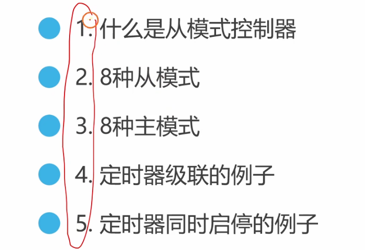
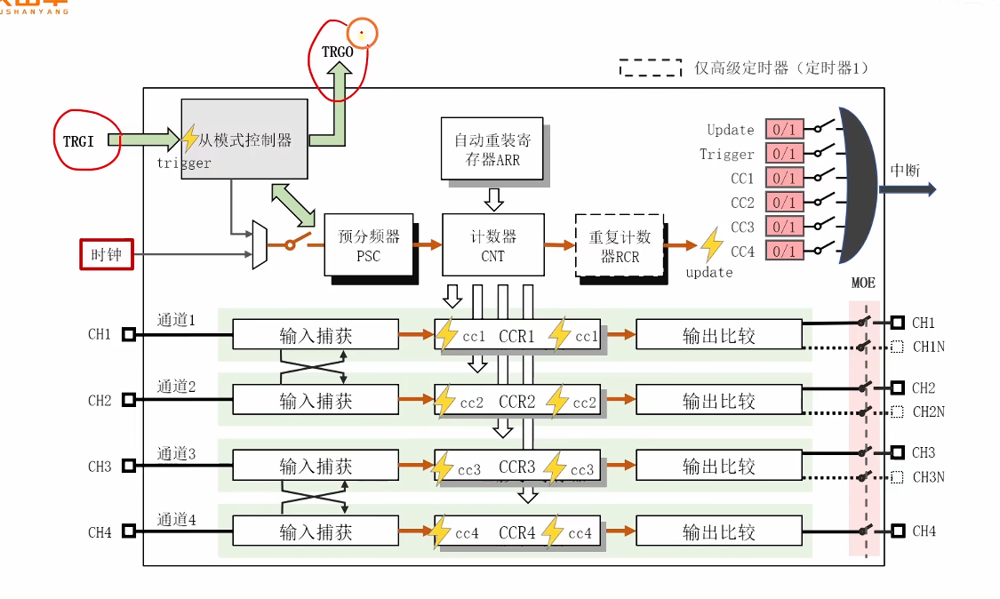
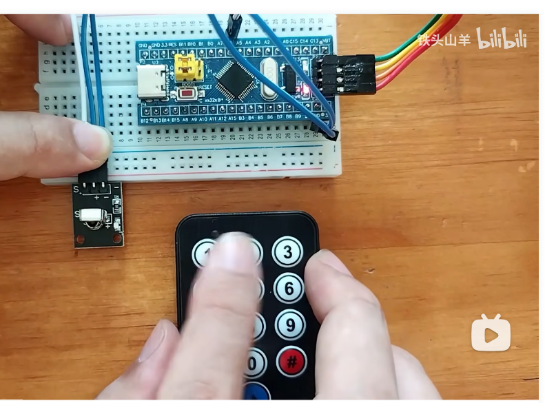
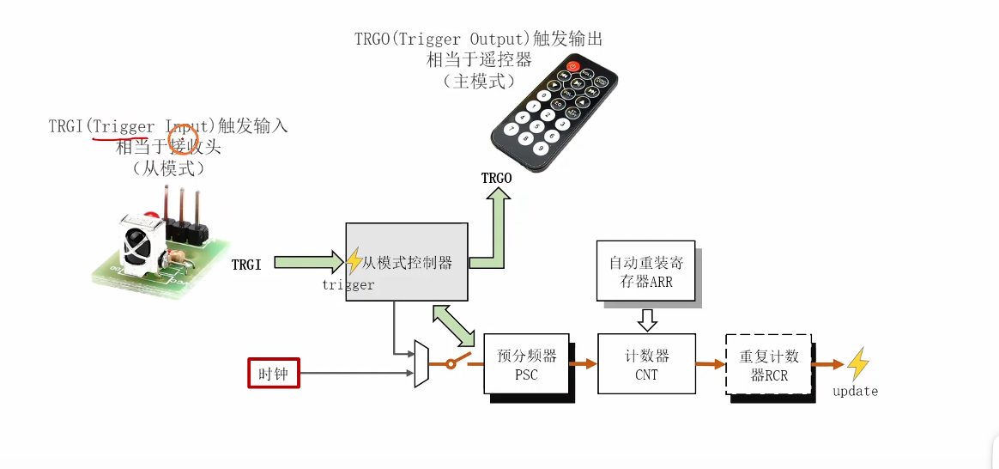
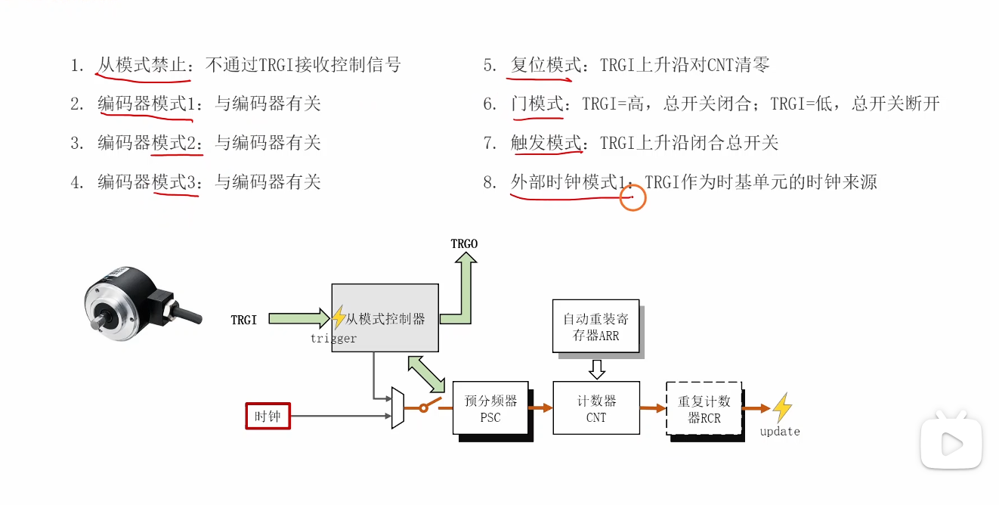
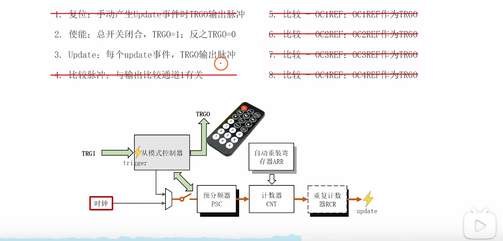
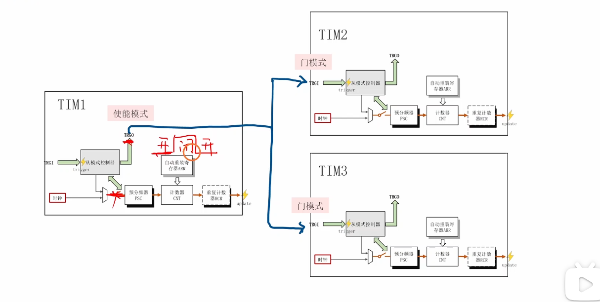
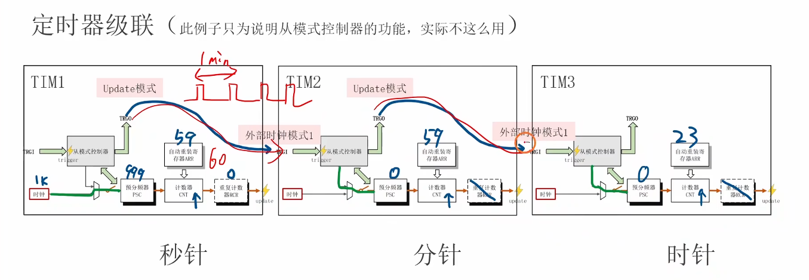
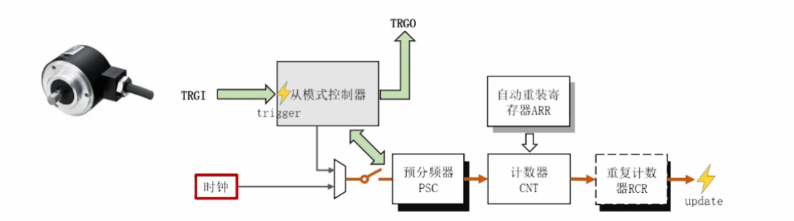

好的，我为你分析了这段关于STM32定时器从模式控制器的视频。这是一个非常核心且在面试中经常被问到的高级功能。





# 视频内容分析

这段视频（铁头山羊STM32教程 - 9.7 从模式控制器）主要讲解了STM32定时器的主从模式（Master/Slave Mode），这是一个允许<span style="color:#CC0000;">定时器之间</span>或<span style="color:#CC0000;">定时器与其他外设（如ADC）</span>进行硬件同步和联动的强大功能。



**核心内容摘要：**

1. **什么是主从控制器？**
   
   - 视频使用了一个生动的比喻：**红外接收头**（从模式，`TRGI` - 触发输入）和**遥控器**（主模式，`TRGO` - 触发输出）。
   
   
   
   
   
   - **从模式 (Slave Mode):** 定时器作为“接收者”，根据`TRGI`引脚上接收到的触发信号，来执行特定动作（如启动、停止、复位等）。
   - **主模式 (Master Mode):** 定时器作为“发送者”，将自己内部的某个事件（如溢出、比较匹配等）通过`TRGO`引脚发送出去，用以触发其他外设。
   
2. **8种从模式（Slave Modes）**
   
   - 视频详细讲解了<span style="color:#CC0000;">定时器如何响应`TRGI`信号</span>。关键模式包括：
   
     
   
     - **禁止模式 (Disabled):** 默认状态，忽略`TRGI`信号。
     - **编码器模式 (Encoder Mode 1/2/3):** 用于硬件解码正交编码器的AB相信号，自动增减计数器。
     - **复位模式 (Reset Mode):** `TRGI`的触发信号（如上升沿）会使<span style="color:#CC0000;">计数器`CNT`清零</span>。
     - **门控模式 (Gated Mode):** `TRGI`的电平作为一个“门”。<span style="color:#CC0000;">高电平时，计数器工作；低电平时，计数器暂停</span>。
     - **触发模式 (Trigger Mode):** `TRGI`的触发信号（如上升沿）会<span style="color:#CC0000;">启动计数器</span>。
     - **外部时钟模式1 (External Clock Mode 1):** `TRGI`的信号*<span style="color:#CC0000;">直接作为计数器`CNT`的时钟源</span>*。
   
3. **8种主模式（Master Modes）**
   
   - 视频讲解了<span style="color:#CC0000;">定时器可以把什么事件作为`TRGO`信号发送出去</span>。关键模式包括：
   
     
   
     - **使能 (Enable):** `TRGO`的电平与<span style="color:#CC0000;">计数器使能位（`CEN`）一致</span>。
     - **更新 (Update):** 将<span style="color:#CC0000;">定时器的更新事件（UEV，通常是溢出）</span>作为`TRGO`的触发脉冲。
     - **比较匹配 (OCxREF):** 将输出比较通道（OC1~OC4）的匹配事件作为`TRGO`的触发信号。
   
4. **两个核心实例**
   
   - **实例1：定时器同时启停（门控模式）**
   
     
   
     - **场景：** 1个主定时器（TIM1）控制2个从定时器（TIM2, TIM3）<span style="color:#CC0000;">同时开始和停止</span>。
     - **配置：**
       - TIM1 (主): `TRGO`设为**使能模式**（即`TRGO`电平=CEN位）。
       - TIM2/TIM3 (从): `TRGI`设为**门控模式**。
     - **效果：** 当启动TIM1时，`CEN`=1，`TRGO`输出高电平，TIM2和TIM3的“门”打开，所有定时器一起计数。停止TIM1时，`CEN`=0，`TRGO`变低，TIM2和TIM3的“门”关闭，一起停止。
   
   - **实例2：定时器级联（外部时钟+Update模式）**
     
     
     
     - **场景：** 模拟制作一个秒、分、时的时钟。
     - **配置：**
       - TIM1 (秒): `TRGO`设为**Update模式**。TIM1自身配置为<span style="color:#CC0000;">每秒溢出一次</span>。
       - TIM2 (分): `TRGI`设为**外部时钟模式1**，触发源来自TIM1的`TRGO`。TIM2的`ARR`设为59（计60个数）。
       - TIM3 (时): `TRGI`设为**外部时钟模式1**，触发源来自TIM2的`TRGO`。TIM3的`ARR`设为23（计24个数）。
     - **效果：** TIM1每秒溢出，`TRGO`产生脉冲，TIM2的`CNT`计1个数（即1分钟）。TIM2计满60分钟溢出，`TRGO`产生脉冲，TIM3的`CNT`计1个数（即1小时）。

------


# 补充提问

## 提问1

<span style="font-weight:bold; font-size:1.2em;">定时器的8中主模式和8种从模式中有哪些是与图片中的这个开关相关的呢，你能够结合这这个图来给我详细解释下吗，最好能够举个例子来让我彻底弄明白？</span>




这是一个非常棒的问题，能问到这个“开关”，说明你已经抓住了主从模式的**核心精髓**。

你图中的这个“开关”是一个**时钟源选择多路复用器（MUX）**。它的作用是决定**谁**来驱动计数器`CNT`（通过预分频器`PSC`）。它有两个输入源：

1. **输入1（默认）：** 来自“时钟”模块，也就是定时器自身的**内部时钟**（`CK_INT`，通常来自RCC）。
2. **输入2：** 来自“从模式控制器”。

因此，**定时器的从模式（Slave Mode）就是用来配置这个“开关”的行为的**。

------


### 哪些模式与这个“开关”相关？

我们可以把<span style="color:#CC0000;">8种从模式分为两大类</span>：


#### 1. 开关保持在“内部时钟”的模式

在这些模式下，定时器**仍然使用自己的内部时钟来计数**。从模式控制器（`TRGI`信号）只是扮演一个“管理员”的角色，它不提供时钟，而是告诉计数器什么时候可以**开始、停止、暂停或清零**。

- **禁止模式 (Disabled):** 默认模式。`TRGI`信号被完全忽略，定时器就像一个普通定时器一样运行。
- **触发模式 (Trigger Mode):** `TRGI`信号（如上升沿）就像一个“发令枪”。`TRGI`触发一次，计数器**启动**（`CEN`位置1），然后就用**内部时钟**开始自由计数，直到溢出。
- **门控模式 (Gated Mode):** `TRGI`信号就像一个“水龙头开关”。`TRGI`为高电平时（“门”打开），**内部时钟**可以通过，计数器正常计数；`TRGI`为低电平时（“门”关闭），**内部时钟**被阻断，计数器**暂停**。
- **复位模式 (Reset Mode):** 定时器使用**内部时钟**运行，但`TRGI`的每一次触发信号（如上升沿）都会**强制将计数器`CNT`清零**，然后重新开始计数。


#### 2. 开关切换到“从模式控制器”的模式

在这些模式下，定时器**完全断开内部时钟**，这个“开关”被**彻底切换**到输入2。`TRGI`信号本身**成为**了计数器的时钟源。

- **外部时钟模式1 (External Clock Mode 1):** 这是最经典的模式。`TRGI`（通常是`ETR`引脚或来自其他定时器的`ITR`）上的**每一个触发信号（如上升沿）**都会驱动计数器`CNT`**计一个数**。
- **编码器模式 (Encoder Mode):** 这是一个更高级的模式。它使用两个`TRGI`信号（`TI1`和`TI2`，来自编码器的A相和B相）。从模式控制器会**根据A/B相的相位来决定`CNT`是加1还是减1**，并且**时钟信号也来自A/B相的跳变**。

------


### 主模式（Master Mode）是如何关联的？

**主模式（Master Mode）与这个定时器的“开关”无关，但它与另一个定时器的“开关”紧密相关。**

- 主模式配置的是`TRGO`（触发输出）。
- 它把你这个定时器的内部事件（比如`update`溢出、`CEN`使能）变成一个信号，通过`TRGO`发送出去。
- 这个`TRGO`信号，恰好可以连接到**另一个定时器**的`TRGI`输入端。

------


### 💡 经典例子：秒表 -> 分表 级联（彻底搞懂）

这个例子就是视频中最后的“定时器级联”，它完美地结合了**主模式**和**从模式**，并且核心就是**控制这个“开关”**。

**目标：**

- **TIM1 (主)**：模拟**秒针**。
- **TIM2 (从)**：模拟**分针**。
- **效果：** TIM1每计满60秒（即1分钟），触发TIM2计1个数（即1分钟）。


#### 步骤1：配置 TIM1 (秒针 - 主模式)

1. **控制它的“开关”：** TIM1是“领头羊”，它使用自己的时钟。所以它的从模式（Slave Mode）设为**禁止模式 (Disabled)**。图中的“开关”始终连接到**内部时钟**。
2. **设置功能：** 假设内部时钟为1kHz。我们希望它1秒钟溢出一次。
   - `PSC` (预分频) = 999 (1000分频)
   - `ARR` (重载值) = 999 (计1000个数)
   - *结果：TIM1的时钟变为 1kHz / (999+1) = 1Hz。它每 (999+1) \* (1/1Hz) = 1000ms = 1秒 产生一次`update`（溢出）事件。*
3. **设置主模式 (Master Mode)：** 我们希望TIM1在**溢出**时发送一个“遥控信号”。
   - `TRGO`（主模式）设置为 **Update 模式**。
4. **最终效果 (TIM1)：** TIM1使用内部时钟，每秒钟`CNT`溢出一次，并通过`TRGO`发送一个脉冲信号。


#### 步骤2：配置 TIM2 (分针 - 从模式)

1. **控制它的“开关”：** TIM2是“跟随者”，它不能用自己的内部时钟，它必须**听TIM1的命令**。
   - 将TIM2的从模式（Slave Mode）设置为 **外部时钟模式1 (External Clock Mode 1)**。
   - **关键点：** 这个设置**立刻将TIM2的“开关”切换到了“从模式控制器”这一端**。TIM2的内部时钟被**断开**了。
2. **连接信号：** 在STM32内部，我们将TIM1的`TRGO`连接到TIM2的`TRGI`（例如，选择`ITR0`作为TIM2的触发源）。
3. **设置功能：**
   - `PSC` (预分频) = 0 (不分频)。
   - `ARR` (重载值) = 59 (计60个数)。
4. **最终效果 (TIM2)：** TIM2的`CNT`计数器完全“瘫痪”，直到`TRGI`（来自TIM1）传来一个脉冲。
   - 第1秒：TIM1溢出，`TRGO`发脉冲 -> TIM2的`CNT`从0变为1。
   - 第2秒：TIM1溢出，`TRGO`发脉冲 -> TIM2的`CNT`从1变为2。
   - ...
   - 第60秒：TIM1溢出，`TRGO`发脉冲 -> TIM2的`CNT`从59变为0（溢出）。
   - 此时，TIM2也产生了`update`事件，如果TIM2也有`TRGO`（如视频中所示），它就可以去触发TIM3（时针）了。

**总结：**

- **TIM1（主）** 的**Update主模式**，是`TRGO`信号的**生产者**。
- **TIM2（从）** 的**外部时钟从模式**，是`TRGI`信号的**消费者**，并且这个模式的核心作用就是**拨动图中的那个“开关”**，让`TRGI`信号成为计数器的驱动力。


# 补充扩展内容

视频中的内容非常扎实，以下是基于这些知识的扩展，有助于你在面试中展现更深的理解：

1. **最经典应用：定时器触发ADC**
   - 这是<span style="color:#CC0000;">主从模式最广泛的用途</span>。在需要精确等间隔采样（如音频处理、电机控制的FOC算法）时，你不能依赖`HAL_Delay()`这种软件延迟。
   - **配置：** 将一个定时器（如TIM2）的主模式`TRGO`设置为**Update模式**。配置TIM2的`PSC`和`ARR`以决定采样率（例如10kHz，即每100μs溢出一次）。
   - **配置：** 将ADC设置为**从模式**，其触发源选择为TIM2的`TRGO`事件。
   - **效果：** TIM2每100μs溢出一次，硬件自动通过`TRGO`触发ADC启动一次转换。整个过程<span style="color:#CC0000;">**零CPU占用**</span>，时序极其精确。
2. **定时器内部互联矩阵**
   - 视频中TIM1触发TIM2，这是怎么连接的？在STM32内部，有一个“定时器互联矩阵”。
   - 你不需要（也不能）在引脚上真的用杜邦线把TIM1的`TRGO`和TIM2的`TRGI`连起来。在CubeMX或寄存器中，你可以直接选择TIM2的`TRGI`的输入源（`TS`位）为`ITR0` (来自TIM1)、`ITR1` (来自TIM2) 等。
   - 在面试中提到你知道`ITR`（内部触发，Internal Trigger）这个概念，会显示你对硬件细节有了解。
3. **单脉冲模式 (One-Pulse Mode)**
   - 这是一种特殊的从模式。它结合了触发模式和输出比较。
   - **场景：** 接收到一个外部触发信号后，仅在*固定延迟*后，生成一个*固定宽度*的脉冲。
   - **配置：**
     1. 配置为**单脉冲模式**（一种从模式）。
     2. `TRGI`作为触发输入。
     3. `CCR1`寄存器设置**延迟时间**。
     4. `ARR`寄存器设置**脉冲宽度**（`ARR` > `CCR1`）。
   - **效果：** `TRGI`来一个上升沿，定时器启动，`CNT`开始计数。当`CNT`= `CCR1`时，输出引脚拉高。当`CNT`= `ARR`（溢出）时，输出引脚拉低，并且定时器**自动停止**，等待下一次触发。

------


# 嵌入式面试经典问题（基于本视频）

以下是面试官可能会围绕“定时器主从模式”提出的问题，帮你巩固理解：

**问题 1：[核心概念] 为什么STM32要设计定时器的主从模式？它解决了什么痛点？**

- **简洁回复：** 它主要解决了**外设间的硬件同步**问题，核心痛点是**解放CPU和保证时序精确**。
- 在没有主从模式时，如果想让TIM1溢出时启动ADC，CPU必须进入TIM1的中断，然后在中断服务程序（ISR）中用软件代码去启动ADC。这样做有两大缺点：<span style="color:#CC0000;">1. 占用CPU资源；2. 从中断响应到执行代码有延迟（Latency），这个延迟还不固定，导致触发时序不精确。</span>
- 主从模式通过`TRGO`和`TRGI`实现了硬件“握手”，<span style="color:#CC0000;">TIM1的溢出可以直接在硬件层面触发ADC</span>，CPU全程无需介入，实现了零延迟、零抖动的精确同步。


**问题 2：[应用场景] 请举例说明你如何使用定时器的主模式（Master Mode）？**

- **简洁回复：** 最常用的是使用主模式的**“Update模式”**。我会用一个通用定时器（如TIM2）作为Master，配置好它的`PSC`和`ARR`来决定一个固定的周期（比如1ms）。然后将它的`TRGO`设置成“Update模式”。这样TIM2每1ms溢出一次，就会产生一个`TRGO`触发信号。这个信号可以被用来：
  1. **<span style="color:#FF0000;">触发ADC采样</span>：** 实现精确定时的AD转换。
  2. **<span style="color:#FF0000;">触发DMA</span>：** 配合DMA进行数据搬运。
  3. **<span style="color:#FF0000;">级联定时器</span>：** 作为另一个定时器（Slave）的时钟源，如视频中的时钟实例。


**问题 3：[模式对比] 视频中提到了“门控模式”(Gated) 和 “触发模式”(Trigger)，它们有什么区别？**

- **简洁回复：** 它们对计数器的控制方式不同：
  - **门控模式**是**电平触发**。它像一个“水龙头开关”。`TRGI`输入高电平，计数器就工作；`TRGI`输入低电平，计数器就**暂停**。
  
  - **触发模式**是**边沿触发**。它像一个“启动按钮”。`TRGI`来一个上升沿，计数器就**开始**从0计数。一旦启动，`TRGI`的电平不再影响计数器（除非配置为单脉冲模式）。
  
    

**问题 4：[模式对比] 视频中提到了“复位模式”(Reset) 和 “触发模式”(Trigger)，它们又有什么区别？**

- **简洁回复：** 它们对计数器的影响不同：
  - **复位模式**是**强制清零**。无论计数器正在干什么，只要`TRGI`触发信号一来，`CNT`（计数器）马上被清零，然后重新开始计数。
  
  - **触发模式**是**启动**。如果计数器是停止状态，`TRGI`触发信号会启动它。如果计数器<span style="color:#FF0000;">**已经在运行中**</span>，`TRGI`信号会被忽略，`CNT`不会被清零。
  
    

**问题 5：[应用场景] 视频中用“外部时钟模式1”级联定时器做了个时钟，这种模式还有什么其他应用吗？**

- **简洁回复：** 有的。除了级联，**<span style="color:#FF0000;">“外部时钟模式1”</span>**（`TRGI`作为时钟源）的一个经典应用是**<span style="color:#FF0000;">测量外部脉冲的个数</span>**。

- 比如，我需要统计一个红外传感器在1秒内收到了多少个脉冲。我可以配置TIM2为外部时钟模式1，`TRGI`连接到传感器引脚。再配置另一个定时器TIM3，每1秒溢出一次。当TIM3溢出时，在它的中断里去读取TIM2的`CNT`寄存器的值，这个值就是这1秒内传感器产生的脉冲总数，读完后将TIM2的`CNT`清零，开始下一秒的统计。

  

**问题 6：[高级应用] 视频提到了“编码器模式”，它内部是如何工作的？为什么它能节省CPU？**

- **简洁回复：** “编码器模式”是从模式控制器的一个高度集成应用。它将定时器的`CH1`和`CH2`两个通道（内部连接到`TRGI`）用于接收编码器的A相和B相信号。
- 从模式控制器在硬件层面实时监测A相和B相的电平变化和相位超前/滞后关系。
  - 如果A相超前B相（正转），`CNT`计数器就**自动加1**。
  - 如果B相超前A相（反转），`CNT`计数器就**自动减1**。
- 它能节省CPU是因为：CPU**完全不需要**通过外部中断去判断A、B相的电平逻辑来计算方向和位置。CPU只需要在需要知道位置时，去读取一下`CNT`寄存器的值即可。这对于高速电机控制至关重要，因为软件中断根本来不及处理那么快的脉冲。


# 补充提问

## 提问 1 -（1）

单脉冲模式 (One-Pulse Mode)

这是一种特殊的从模式。它结合了触发模式和输出比较。

场景： 接收到一个外部触发信号后，仅在固定延迟后，生成一个固定宽度的脉冲。

配置：

配置为单脉冲模式（一种从模式）。

TRGI作为触发输入。

CCR1寄存器设置延迟时间。

ARR寄存器设置脉冲宽度（ARR > CCR1）。

效果： TRGI来一个上升沿，定时器启动，CNT开始计数。当CNT= CCR1时，输出引脚拉高。当CNT= ARR（溢出）时，输出引脚拉低，并且定时器自动停止，等待下一次触发。

<span style="font-weight:bold; font-size:1.2em;">不是只有8种从模式吗，为什么这里又有一种特殊的从模式呢，这个特殊的从模式和那8种从模式之间又是什么关系呢，我不是太懂，你能够给我详细解释下吗，最好能够举个例子来让我彻底弄明白。</span>


你问得非常非常好！你没有搞错，定时器**确实**只有那8种从模式（在`SMCR`寄存器的`SMS`位中配置）。

你之所以会困惑，是因为“单脉冲模式”（One-Pulse Mode, OPM）**不是第9种从模式**，它更像是一个**“行为修饰符”**。

简单来说：

- **8种从模式**（如触发模式、门控模式）决定了定时器**如何被启动或被控制**。
- **单脉冲模式 (OPM)** 决定了定时器**如何停止**。


### 详细解释：OPM是什么？它和8种从模式的关系

**1. OPM的真实身份**

- “单脉冲模式”并不是通过那8种从模式（`SMCR:SMS`位）来设置的。
- 它是通过`TIMx_CR1`寄存器中的一个**单独的位**，即`OPM`位（One-Pulse Mode bit）来使能的。

**2. OPM的唯一作用**

当你把`OPM`位设置为1时，它只干一件事情：

> **“定时器在下一次产生更新事件（Update Event，通常是CNT计数溢出/下溢）时，在硬件上自动将计数器使能位（CEN）清零，使自己停止。”**

它就像一个“一次性”开关，保证定时器从启动到溢出**只完整运行一次**，然后自动熄火。

**3. OPM与从模式的“黄金搭档”**

现在问题来了：OPM只管“如何停止”，那谁来“启动”它呢？

答案是：那8种从模式中的一种！

OPM最常与 **“触发模式 (Trigger Mode)”**（8种从模式之一）配合使用。

- **触发模式** 负责 **“启动”**：当`TRGI`上检测到一个上升沿，定时器开始计数（`CEN`位置1）。
- **OPM** 负责 **“自动停止”**：当`CNT`计数到`ARR`溢出时，`CEN`位自动清0，定时器停止。

**💡 让我们用一个比喻来彻底弄明白：**

假设定时器是一辆车：

- **8种从模式** = 车的**启动方式**。
  - **门控模式** = “踩着油门（`TRGI`高电平），车就跑；松开油门（`TRGI`低电平），车就停。”
  - **触发模式** = “按一下启动按钮（`TRGI`上升沿），车就启动。”
- **OPM开关** = 一个加装的**“自动熄火”功能**。

如果你只用了“触发模式”：你按一下按钮（`TRGI`），车启动了（`CNT`开始计数），开到终点（`CNT`= `ARR`溢出），然后它会**自动掉头回到起点（`CNT`= 0）继续开**，一圈又一圈（循环模式）。

如果你启用了 “触发模式” + “OPM”：

你按一下按钮（TRGI），车启动了（CNT开始计数），开到终点（CNT= ARR溢出），“自动熄火”功能生效，车（定时器）立刻停止。它会停在终点，等待你下一次按启动按钮。

这就是“<span style="color:#FF0000;">单脉冲</span>”的含义：**<span style="color:#FF0000;">触发一次，只完整运行一个周期（一个脉冲），然后自动停止。</span>**

------


### 经典例子：超声波模块的Trigger脉冲

这个例子可以让你彻底明白你描述的那个场景（延迟后产生脉冲）。

场景：

我们要用STM32驱动一个HC-SR04超声波模块。

- **要求：** 我们需要给它的`Trig`引脚发送一个**10μs**的高电平脉冲。
- **痛点：** 如果用`HAL_Delay()`去软件延时，会阻塞CPU，且延时非常不准。
- **最佳方案：** 使用**单脉冲模式 (OPM)**。

**目标配置：**

- **触发：** 软件手动触发（我们自己当`TRGI`）。
- **延迟：** 0μs（立即开始）。
- **脉冲宽度：** 10μs。

**配置步骤（假设定时器时钟为1MHz，即`CNT`每1μs加1）：**

1. **设置“如何停止” (OPM):**
   - 设置 `CR1` 寄存器的 `OPM` 位 = 1。（告诉定时器：溢出时自动停止）。
2. **设置“如何启动” (Slave Mode):**
   - 这个比较特殊，因为我们是*软件*启动，所以我们**不使用从模式**（设为`Disabled`）。我们会**手动置1** `CEN`位来启动。
   - *(注意：如果用一个引脚触发，这里就选“触发模式”)*
3. **设置“脉冲波形” (Output Compare):**
   - 设置通道1为 **PWM 模式 1**。
   - *含义：* 在 `CNT < CCR1` 期间，输出**高电平**；在 `CNT >= CCR1` 期间，输出**低电平**。
4. **设置“时间和宽度” (Registers):**
   - `CCR1` (脉冲宽度) = 10。（`CNT`从0数到9，耗时10μs，此间输出高电平）。
   - `ARR` (总周期/停止点) = 10。（`CNT`在数到10时溢出并停止）。

**执行流程（图解）：**

1. **等待：** 定时器停止，`CNT`= 0。`Trig`引脚（PWM1模式，`CNT`不小于`CCR1`）为低电平。
2. **启动：** CPU执行代码，**手动设置`CEN`位=1**，定时器启动。
3. **脉冲阶段 (0 -> 10μs):**
   - `CNT`从0开始计数... 0, 1, 2... 9。
   - 因为是 **PWM 1 模式** (`CNT < CCR1`)，输出引脚**变为高电平**。
4. **停止 (在10μs的瞬间):**
   - `CNT`计数到10。
   - `CNT`等于`ARR` (10)，产生**更新事件(溢出)**。
5. **`OPM` 生效：**
   - `OPM`位检测到这个溢出事件，**硬件自动将`CEN`位清0**，定时器**停止**。
   - `CNT`停止在10，但因为`CEN`=0，定时器已禁用，输出引脚恢复到非活动状态（低电平）。
6. **完成：** 硬件自动生成了一个精确的10μs脉冲，CPU只在最开始启动了一下，后续全由硬件完成。

**回答你描述的“延迟后产生脉冲”的场景：**

如果你想实现“延迟10ms，再发2ms脉冲”，配置几乎一样，只需要改两处：

1. **波形：** 改为 **PWM 模式 2** (在 `CNT < CCR1` 低电平；`CNT >= CCR1` 高电平)。
2. **时间：** (假设1MHz时钟)
   - `CCR1` (延迟) = 10000 (10ms)。
   - `ARR` (停止点) = 12000 (10ms + 2ms)。

**流程：** `TRGI`触发 -> `CNT`开始计数 -> (0~10ms) 输出低电平 -> (10ms~12ms) 输出高电平 -> `CNT`=12000溢出 -> `OPM`生效，定时器停止。

**总结：**

- **OPM不是从模式**，它是一个“自动停止”的**功能开关**。
- 它必须和一种**“启动方式”**（如“触发模式”或软件启动）配合。
- 它必须和一种**“波形模式”**（如PWM1或PWM2）配合，来决定脉冲是立即发出还是延迟发出。


## 提问 1 -（2）

如果你只用了“触发模式”：你按一下按钮（TRGI），车启动了（CNT开始计数），开到终点（CNT= ARR溢出），然后它会自动掉头回到起点（CNT= 0）继续开，一圈又一圈（循环模式）。

<span style="font-weight:bold; font-size:1.2em;">这里我有一个问题，CNT计数值达到ARR的时候在下一个上升沿到来的时候不是自动就清零了吗，这里配置一个OPM是不是多余了，我不是太懂，你能够给我详细解释下吗 ？</span>


这是一个非常关键的混淆点！你没有搞错，定时器的`CNT`（计数器）在溢出时**确实会自动清零**，但你的理解中缺失了最关键的一环：

**在标准的“触发模式”下，`CNT`溢出清零后，它会立即开始下一轮计数，它不会停止！**

所以，OPM（单脉冲模式）**一点也不多余**，它的**唯一目的**就是在`CNT`溢出清零的**同时**，强制**“停止”**定时器。

------


### 详细解释：触发模式 vs 复位模式 vs OPM

我们来彻底澄清你的困惑点：


#### 1. 你的误解：你把“触发模式”和“复位模式”搞混了

你所说的：“CNT计数值达到ARR的时候在**下一个上升沿到来的时候**不是自动就清零了吗？”

- **这是错的。** 这句话描述的其实是 **复位模式 (Reset Mode)** 的行为（而且也不完全准确）。
- 在 **触发模式 (Trigger Mode)** 中：`TRGI`的上升沿**只负责“启动”**。一旦定时器启动后，`TRGI`再来多少个信号都**会被忽略**。定时器会使用**内部时钟**自由地跑到`ARR`，溢出，清零，再跑到`ARR`... **它是一个无限循环，永不停止。**


#### 2. OPM的真正作用：停止！

在标准的触发模式下，定时器一旦启动，CEN（计数器使能）位就一直是1。OPM的作用就是：

当CNT计数到ARR溢出（产生Update事件）的那一刻，硬件自动把<span style="color:#FF0000;">CEN位清零</span>，强行<span style="color:#FF0000;">“熄火”定时器</span>。


<span style="color:#CC0000; font-weight:bold; font-size:1.4em;">补充：</span>

`CEN`控制的是**计数器(CNT)的“总开关”**。

它决定了`CNT`是否**开始**对选定的时钟信号（无论是来自内部“时钟”还是“从模式控制器”）进行计数。

- `CEN` = 1，开关打开，`CNT`开始计数。
- `CEN` = 0，开关关闭，`CNT`停止计数。


------


### 场景对比：三种模式的详细流程

让我们用一个例子，假设`ARR` = 100，`CNT`每1ms加1。


#### 场景1：仅使用“触发模式”（无OPM）

- **配置：** 从模式 = 触发模式
- **流程：**
  1. `TRGI`来了一个上升沿。
  2. `CEN`位置1，定时器**启动**。
  3. `CNT`开始用**内部时钟**计数：0, 1, 2 ... 100。
  4. **第100ms时：** `CNT`达到100（`ARR`），溢出，产生Update事件。
  5. `CNT`**自动清零**变为0。
  6. `CEN`位**保持为1**！
  7. **第101ms时：** `CNT`继续用内部时钟计数，变为1。
  8. ...周而复始，**定时器永不停止**。
- **比喻：** 按一下按钮（`TRGI`），马达（`CNT`）启动了，它会一直转下去，一圈又一圈。


#### 场景2：仅使用“复位模式”（无OPM）

- **配置：** 从模式 = 复位模式
- **流程：**
  1. 我们**手动启动**定时器（`CEN`=1）。
  2. `CNT`开始用**内部时钟**计数：0, 1, 2 ... 50。
  3. **第50ms时：** `TRGI`突然来了一个上升沿。
  4. `CNT`被**强制清零**变为0。
  5. `CEN`位**保持为1**！
  6. **第51ms时：** `CNT`继续用内部时钟计数，变为1。
  7. ... **定时器也永不停止**，只是会被`TRGI`不断“拍回”起点。


#### 场景3：“触发模式” + OPM （<span style="color:#CC0000;">这才是单脉冲模式！</span>）

- **配置：** 从模式 = 触发模式，并且 **`OPM`位 = 1**
- **流程：**
  1. `TRGI`来了一个上升沿。
  2. `CEN`位置1，定时器**启动**。
  3. `CNT`开始用**内部时钟**计数：0, 1, 2 ... 100。
  4. **第100ms时：** `CNT`达到100（`ARR`），溢出，产生Update事件。
  5. `CNT`**自动清零**变为0。
  6. **OPM功能生效！** 硬件检测到Update事件，**强制将`CEN`位清零**。
  7. **定时器停止！**
  8. **第101ms时：** `CEN`=0，`CNT`保持在0，不再计数。
  9. ...定时器**“熄火”**了，直到**下一个`TRGI`上升沿**到来，才会重复上述1-8的**完整一圈**。


### 总结

- **`CNT`= `ARR`** 负责**自动清零**（产生Update事件）。
- **`OPM`** 负责在`CNT`清零的**同时自动“停止”**（`CEN`=0）。

**所以OPM一点也不多余，它是实现“触发一次，只跑一圈”的\*唯一\*方法。**

没有OPM，触发模式就是“触发一次，永远跑下去”。

有了OPM，触发模式才是“触发一次，只跑一圈”。


## 提问2

<span style="font-weight:bold; font-size:1.2em;">计数器使能和定时器使能还有开启外部时钟还有中断使能等这些负责开启的开关都是不一样的吧，你能够用一个图示来帮我理解清楚吗，我不是太懂，最好能够举个例子来帮我彻底弄懂。</span>


你总结得非常到位，你已经意识到了定时器中存在**多个层级**的“开关”，把它们弄混是初学者（甚至很多有经验的工程师）的通病。

是的，它们是**完全不同**的开关，控制着定时器中不同层级的“水管”或“电路”。`CEN`（计数器使能）只是其中一个。


### 核心开关层级图

我为你画了这张图，它展示了信号在定时器中流动的5个关键“开关”或“阀门”：

```
          [系统时钟]
               |
  +------------+-------------------------------------------------------------+
  | [开关 1: RCC 时钟] (e.g., __HAL_RCC_TIM2_CLK_ENABLE())                     |
  |            |                                                             |
  |    +-------V-------+                                                     |
  |    |  TIM2 模块    |                                                     |
  |    +---------------+                                                     |
  |            |                                                             |
  |      [内部时钟]                                 [外部信号 TRGI/ETR]      |
  |            |                                           |                 |
  |            +--------------+   +------------------------+                 |
  |                           |   |                                          |
  |                     [开关 2: 时钟源选择器] (从模式控制器 SMCR)           |
  |                           |   |                                          |
  |                           +---+                                          |
  |                           |                                              |
  |                           V                                              |
  |                     [预分频器 PSC]                                       |
  |                           |                                              |
  |                     +-----V-----+                                        |
  |                     |  开关 3   |                                        |
  |                     |   CEN     | (CR1 寄存器, 计数器"启/停")            |
  |                     +-----+-----+                                        |
  |                           |                                              |
  |                           V                                              |
  |                      [计数器 CNT]                                        |
  |                           |                                              |
  |       +-------------------+-------------------+                          |
  |       | (与 ARR 比较)                       | (与 CCRx 比较)             |
  |       V                                     V                          |
  |   [事件: 更新/溢出]                     [事件: 输出比较]                 |
  |       |                                     |                          |
  | +-----V-----+                       +-------V-------+                    |
  | |  开关 4   |                       |    开关 5     |                    |
  | |  中断使能 | (DIER 寄存器)         |   输出通道使能  | (CCER 寄存器)      |
  | +-----+-----+                       +-------+-------+                    |
  |       |                                     |                          |
  |       V                                     V                          |
  |    [NVIC]                               [GPIO 输出引脚]                 |
  |       |                                     | (e.g., PWM)                |
  |       V                                     V                          |
  |      [CPU]                             [外部世界]                      |
  |                                                                        |
  +--------------------------------------------------------------------------+
```

------


### 对5个“开关”的详细解释

我们来一个一个拆解：

**1. 开关 1: RCC 时钟使能 (总电源)**

- **这是什么？** 这是定时器这个**外设模块**的总时钟。
- **开关位置：** 在RCC（复位和时钟控制）外设中。
- **作用：** `__HAL_RCC_TIM2_CLK_ENABLE()`。
- **比喻：** 这是你家房子的**总电闸**。如果这个不开，你家里（TIM2模块）所有的灯（寄存器、计数器）都是黑的，按任何开关都没用。

**2. 开关 2: 时钟源选择器 (你问的“开启外部时钟”)**

- **这是什么？** 这不是一个简单的“开/关”，而是一个**“选择器”**（MUX）。
- **开关位置：** `SMCR`寄存器（从模式控制器）。
- **作用：** 决定`CNT`计数器**“听谁的”**。
  - `从模式=Disabled`（默认）：选择**内部时钟**。
  - `从模式=外部时钟模式`：选择**外部时钟 `TRGI`**。
- **比喻：** 这是你家音响的**音源选择按钮**（蓝牙、AUX、收音机）。它不负责开机，只负责决定播放什么内容。

**3. 开关 3: CEN (计数器使能)**

- **这是什么？** 这是你问的`CEN`（Counter Enable）。
- **开关位置：** `CR1`寄存器。
- **作用：** **启动或停止**`CNT`计数器。
- **比喻：** 这是音响的**“播放/暂停”按钮**。你已经通了电（开关1），也选了音源（开关2），但只有按下这个按钮，音乐（`CNT`）才真正开始播放。

**4. 开关 4: 中断使能 (通知CPU)**

- **这是什么？** 这是你问的`UIE`（Update Interrupt Enable）等中断开关。
- **开关位置：** `DIER`寄存器。
- **作用：** 决定定时器的内部事件（如溢出）**是否需要去“打扰”CPU**。
- **比喻：** 歌曲播放完（溢出事件）是一个事实。这个开关决定了：
  - `UIE`=0：歌曲放完了自动重播，但**不通知你**。
  - `UIE`=1：歌曲放完了，**同时你手机收到一个通知**（CPU被中断）。

**5. 开关 5: 输出通道使能 (通知引脚)**

- **这是什么？** `CCER`寄存器中的`CCxE`位。
- **开关位置：** `CCER`寄存器。
- **作用：** 决定定时器的内部事件（如比较匹配）**是否要输出到物理引脚上**。
- **比喻：** 定时器内部的PWM逻辑一直在运行。这个开关决定了：
  - `CCxE`=0：PWM信号只在芯片内部“静音”运行，**引脚上没波形**。
  - `CCxE`=1：PWM信号被**连接**到真实的GPIO引脚上，驱动LED或电机。

------


### 💡 例子：启动一个“带中断的PWM”

**目标：** 让TIM2的CH1引脚输出1kHz的PWM波，并且**每1秒钟**产生一次中断（通知CPU）。

看这5个开关如何配合：

1. **打开 [开关 1] (RCC):**
   - `__HAL_RCC_TIM2_CLK_ENABLE();`
   - *（工厂总电闸合上，TIM2模块通电）*
2. **设置 [开关 2] (时钟源):**
   - `TIM2->SMCR = 0;` （从模式=Disabled）
   - *（音响选择“内部时钟”作为音源）*
3. **配置定时器参数（PWM + 中断）：**
   - `PSC` = 71 (假设72MHz时钟，72分频=1MHz)
   - `ARR` = 999 (1MHz / 1000 = 1kHz PWM频率)
   - `CCR1` = 499 (50%占空比)
   - `RCR` (重复计数器) = 999 (因为PWM是1kHz，我们需要它溢出1000次，才=1秒)
4. **打开 [开关 5] (输出通道):**
   - `HAL_TIM_PWM_Start(&htim2, TIM_CHANNEL_1);`
   - *（这个函数会打开`CCER`开关，PWM波形* **立即出现在引脚上** *）*
5. **打开 [开关 4] (中断):**
   - `HAL_TIM_Base_Start_IT(&htim2);`
   - *（这个函数会打开`DIER`寄存器里的`UIE`中断开关）*
6. **打开 [开关 3] (`CEN`):**
   - `HAL_TIM_PWM_Start()` 和 `HAL_TIM_Base_Start_IT()` 这两个函数都会**自动帮你打开`CEN`开关**。
   - *（按下“播放”键，`CNT`开始计数）*

**最终效果：**

- `CEN`一打开，`CNT`开始计数。
- `CCER`打开了，所以PWM波形**立刻**在引脚上输出。
- `UIE`打开了，但`RCR`=999，所以前999次溢出CPU**不会**收到中断。
- 当第1000次溢出（1秒钟后），`RCR`=0，Update事件被允许通过`UIE`开关，CPU收到中断。

**结论：**

- `CEN`（开关3）负责让`CNT`**跑起来**。
- `CCER`（开关5）负责让PWM波形**输出去**。
- `UIE`（开关4）负责让溢出事件**通知到**CPU。

它们是三个完全独立且各司其职的开关。


## 提问3 - （1）

比如，我需要统计一个红外传感器在1秒内收到了多少个脉冲。我可以配置TIM2为外部时钟模式1，TRGI连接到传感器引脚。再配置另一个定时器TIM3，每1秒溢出一次。当TIM3溢出时，在它的中断里去读取TIM2的CNT寄存器的值，这个值就是这1秒内传感器产生的脉冲总数，读完后将TIM2的CNT清零，开始下一秒的统计。


<span style="font-weight:bold; font-size:1.3em;">这里红外传感器有输出脉冲的引脚吗，我这个TRGI引脚应该连接到红外传感器的哪里呢？</span>


你问到了一个关键点，这说明你把理论和实践结合起来了！我的例子“统计红外传感器的脉冲”让你产生了困惑，我来帮你澄清。

你完全正确，一个**遥控器**（比如电视遥控器）才**发出**脉冲。而我例子中说的“红外传感器”，指的是**红外接收模块**（比如视频中演示的那种，或下图中的VS1838B/TSOP系列）。

这种模块**有**一个专门的脉冲输出引脚。你应该连接的就是这个引脚。


### 1. TRGI应该接哪个引脚？

你应该将`TRGI`连接到红外接收模块的 **`OUT`**（或 `Signal` / `S`）引脚。

一个标准的红外接收模块（像VS1838B）通常只有3个引脚：

- **VCC:** 接电源 (3.3V或5V)
- **GND:** 接地
- **OUT:** **信号输出引脚**。这就是你要连到STM32定时器`TRGI`的引脚。


### 2. 这个OUT引脚输出的是什么脉冲？

这一点非常重要，也是我之前例子中没有讲清楚的地方：

- 遥控器发出的是“**调制脉冲**”：它以**38kHz**的超高频率闪烁红外光来发送“1”，不发光代表“0”。（你肉眼看不见，但手机摄像头能看见微弱的紫光）。
- 红外接收模块（VS1838B）的**核心功能**是**“解调”**。
- 它会**滤除**掉38kHz的高频信号，只输出被“包裹”在里面的**数据信号**。

所以，你连接到`TRGI`的`OUT`引脚上，得到的**不是**38kHz的脉冲，而是像下图这样的**“数据脉冲”**：

```
     Idle (High)     Start Pulse      Data Pulses...
      +---------------+      +-----+     +---+   +-----+
      |               |      |     |     |   |   |     |
 -----+               +------+     +-----+   +---+     +----...
                      <------>     <---> <-> <--->
                     (e.g., NEC protocol data stream)
```

- **特性：** 这个`OUT`引脚是**“低电平有效”**（Active Low）。
  - **空闲时**（没收到信号）：`OUT`引脚保持**高电平**。
  - **收到信号时**：它会输出一连串的**低电平脉冲**。


### 3. 【重要】修正我的例子：如何正确处理这种脉冲？

我之前的例子“用外部时钟模式统计脉冲”对于红外遥控器**不是最佳用法**。正确的用法是**测量**这些脉冲的**宽度**。


#### 最佳用法：使用“输入捕获模式”(Input Capture)

- **目的：** 解码遥控器（知道你按了哪个键）。
- **原理：** `OUT`引脚上的脉冲宽度（比如一个9ms的低电平 + 4.5ms的高电平）代表“起始信号”，后续不同宽度的脉冲代表数据“0”和“1”。
- **配置：**
  1. 将定时器（如TIM2）的通道1（`TI1`）设置为**输入捕获模式**，捕获**双边沿**（上升沿和下降沿）。
  2. `TRGI`（`TI1`）连接到红外接收器的`OUT`引脚。
  3. 每当`OUT`引脚电平跳变（上升或下降），定时器硬件会**自动**将`CNT`的当前值存入`CCR1`寄存器，并触发**中断**。
  4. 在中断服务程序中，你读取`CCR1`的值，并与上一次的值相减，就能**精确计算出刚才那个低电平（或高电平）脉冲持续了多久**（多少μs）。
  5. 根据这些宽度值，你就能解码出是“音量+”还是“电源”键。


#### 我之前例子的本意：使用“外部时钟模式1”

- **目的：** 只是粗略地“统计收到了多少个脉冲”。
- **配置：**
  1. 将TIM2配置为**外部时钟模式1**（从模式）。
  2. `TRGI`连接到红外接收器的`OUT`引脚，并配置为下降沿触发。
- **效果：**
  - 当你按一下遥控器按钮，`OUT`引脚会输出一长串（比如几十个）低电平脉冲。
  - 每次`OUT`引脚从高变低（下降沿），`CNT`计数器就会**加1**。
  - 你在1秒钟后去读取`CNT`的值，它可能显示`68`。这不代表你按了68次，而是代表你按的那一次按钮，其数据帧里包含了68个低电平脉冲。

**结论：**

- **回答你的问题：** 你应该把`TRGI`连接到红外接收模块的 **`OUT`** 引脚。
- **面试的加分项：**
  - 如果你想**解码**遥控器，你应该使用**输入捕获 (Input Capture)** 模式来测量脉冲宽度。
  - 如果你想**计数**一个“1次转动 = 1个脉冲”的信号（比如视频中的**旋转编码器**，或者风扇上的霍尔传感器），这时才应该使用**外部时钟模式1**。


## 提问3 - （2）

<span style="font-weight:bold; font-size:1.2em;">红外遥控传感器的工作原理是什么呢，每个按键对应的是不同占空比的脉冲吗，比如我按下一个按键，然后遥控器会发送一连串相同占空比的脉冲是吗？</span>


这是一个非常常见的误解！很高兴你提出来，这能帮你彻底搞懂遥控的原理。

你关于“占空比”的猜想是**不正确**的。

简单来说：**每个按键对应的不是不同“占空比”的脉冲，而是一套独一无二的“编码”（一串0和1的序列）。而我们区分“0”和“1”的方式，靠的是脉冲的“宽度”或“间距”，而不是“占空比”。**

你按下一个按键，遥控器**不会**发送一连串“相同”的脉冲。它会发送一串**“不同”**的脉冲，这一串脉冲组合起来，就代表了一个独一无二的数据（比如“音量+”键）。

下面我来为你详细分解这个过程。

------


### 1. 红外遥控的工作原理（调制与解调）

这个原理分为两步：**遥控器（发射端）\**和\**接收器（传感器）**。


#### 步骤 1：遥控器 (发射端) - 调制

当你按下一个键（比如“电源键”），遥控器内部的芯片会生成一个独一无二的二进制编码，比如 `1000 0000 0111 1111`。

**痛点：** 芯片不能直接“常亮”红外LED来发送这个信号，因为阳光、灯光中充满了红外线“噪音”。你的接收器会“看”不见。

解决方案（调制）：

为了在噪音中脱颖而出，遥控器会以一个**极高的频率（通常是38kHz）**来“闪烁”红外LED。

- 要发送 “1”：它就以38kHz的频率**高速闪烁**一段时间（这叫一个"Burst"或"Mark"）。
- 要发送 “0”：它就**熄灭**一段时间（这叫一个"Space"）。


#### 步骤 2：红外接收器 (传感器) - 解调

你手上的红外接收模块（如VS1838B）是一个非常聪明的“集成传感器”，它内部做了三件事：

1. **物理过滤：** 它的黑色外壳会滤掉大部分可见光。
2. **电子过滤：** 它内部有一个**带通滤波器**，**只对38kHz**的红外闪烁敏感。所有其他“噪音”（如阳光、灯管的稳定红外光）都会被它忽略。
3. **解调（关键）：** 当它检测到38kHz的闪烁（"Mark"）时，它会在`OUT`引脚上输出一个**稳定的低电平**。当它检测不到闪烁（"Space"）时，它会输出**高电平**。

**所以：** 遥控器发出的高频38kHz信号，被接收器“解包”还原成了干净、简单的“低电平脉冲”串。

------


### 2. 解答核心问题：按键是如何区分的？

我们收到的既然是一串高低电平，那怎么区分是哪个按键呢？

这靠的是**编码协议**，最常用的是**NEC协议**。

在NEC协议中，你按下一个键，遥控器会发送一“帧”数据。这一帧数据（解调后）是这样的：

1. **引导脉冲（Start Pulse）：** 一个**超长**的9ms低电平，紧跟着一个4.5ms的高电平。这等于是在告诉接收器：“喂！准备好，我要发数据了！”
2. **32位数据：** 接下来是32个bit的数据，分为4个字节：
   - **8位地址码：** 比如 `0x00` (代表厂家，如飞利浦)
   - **8位地址反码：** `0xFF` (用于校验)
   - **8位命令码：** **这就是区分按键的关键！**
   - **8位命令反码：** (用于校验)

**关键来了：这32位数据中的“0”和“1”是如何表示的？**

**不是靠占空比，而是靠高电平的“宽度”！**（或者说，是靠脉冲之间的“间距”）

- **逻辑 "0"：**

  1. 一个 562.5µs 的低电平

  2. 跟着一个 562.5µs 的高电平

     (总时长: 1.125ms)

- **逻辑 "1"：**

  1. 一个 562.5µs 的低电平

  2. 跟着一个 1.6875ms (长3倍) 的高电平

     (总时长: 2.25ms)

**举个例子：**

- 当你按 **“音量+”** 键，它的命令码可能是 `0x18` (即 `0001 1000`)。
- 当你按 **“音量-”** 键，它的命令码可能是 `0x1A` (即 `0001 1010`)。

接收器在`TRGI`引脚上会收到一串**宽度不同**的脉冲，通过用**输入捕获**模式测量这些脉冲的宽度，你的STM32就能解码出这一串 `0` 和 `1`，从而知道你按了哪个键。

------


### 3. 解答你的第二个问题：按下一个按键会发生什么？

这有两种情况：

- 情况1：你按一下就松手

  遥控器只会发送一次上面说的那种“完整数据帧”（引导码 + 32位数据）。

- 情况2：你长按一个键不放

  你猜的“一连串相同脉冲”也不全对。

  1. 遥控器会先发送**一次**“完整数据帧”。
  2. 然后，（大约110ms后）如果你还按着，它会开始连续发送一种**特殊的、更短的“重复码”**。
  3. 这个“重复码”只是一个简单的“9ms低 + 2.25ms高”，它不再包含数据，只是在告诉接收器：“我还在按着刚才那个键！”
  4. 这可以防止你的电视音量“嘀嘀嘀”地一直往上涨，而是实现平滑的“嘀——”连续增长。

**总结一下：**

1. **工作原理：** 遥控器（发射端）将按键的**二进制编码**，加载（**调制**）到38kHz的高频红外光上发出。
2. **传感器原理：** 接收器（传感器）**滤除**38kHz以外的噪音，并将信号**解调**回原始的、干净的二进制脉冲（高低电平）。
3. **按键区分：** 靠的是**编码协议**（如NEC）。每个按键对应**唯一的32位二进制序列**。
4. **0/1区分：** 靠的是脉冲的**宽度**（高电平持续时间），**而不是占空比**。