这是一个非常棒的嵌入式开发教程视频，主题明确，逻辑清晰。这个技术点在实际项目中（例如电机控制、电源管理、机器人编码器读取）非常常用，是面试中的一个高频考点。

我来为您深入分析、扩展，并准备一套面试问题。

------


# 补充提问（外设开关弄懂）

## 提问1 - （1）

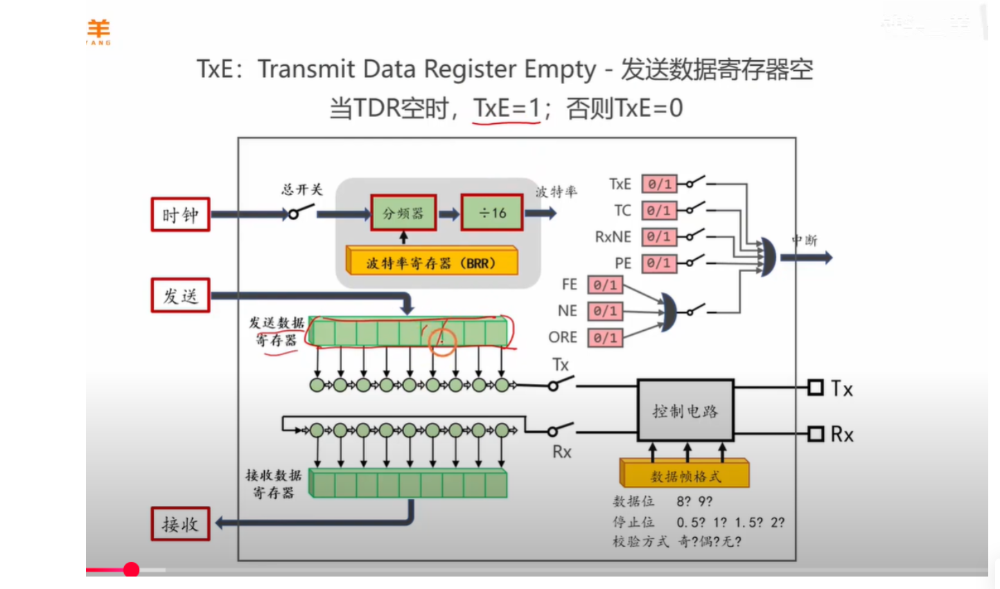

<span style="font-weight:bold; font-size:1.2em;">这张图中的对应的开关，对应的标准库的函数都是有哪些呢，你能够给我列出来吗，还有其他的一些开关吗？</span>


好的，这张图是STM32（特别是F1系列）USART（通用同步/异步收发器）的一个经典功能框图。你提到的“开关”实际上是**寄存器中的控制位**，而标准库（SPL）提供了一系列函数来配置这些“开关”。

我来为你详细梳E理图中的“开关”及其对应的标准库函数，并扩展一些图中未画出但至关重要的“开关”。

------


### 📥 图中关键“开关”对应的SPL函数


#### 1. 时钟总开关


- **图中位置：** 位于“时钟”源头，标有“总开关”。
- **功能：** 这是**RCC（Reset and Clock Control）** 层的开关。它负责给USART外设模块本身提供时钟（PCLK）。如果这个开关不开，USART外设完全不工作。
- **对应SPL函数：**
  - `RCC_APB2PeriphClockCmd(RCC_APB2Periph_USART1, ENABLE);` (用于挂载在APB2总线上的USART1)
  - `RCC_APB1PeriphClockCmd(RCC_APB1Periph_USART2, ENABLE);` (用于挂载在APB1总线上的USART2, 3, 4, 5)


#### 2. 发送 (Tx) 和 接收 (Rx) 路径开关


- **图中位置：** 分别位于“发送数据寄存器”和“接收移位寄存器”之前的数据通路上。
- **功能：** 这对应于控制寄存器1 (`USART_CR1`) 中的 `TE` (Transmit Enable) 和 `RE` (Receive Enable) 位。它们分别使能发送器和接收器。
- **对应SPL函数：**
  - 这两个“开关”通常在**初始化时一次性配置**，而不是频繁开关。
  - `void USART_Init(USART_TypeDef* USARTx, USART_InitTypeDef* USART_InitStruct);`
  - 在配置 `USART_InitTypeDef` 结构体时，通过 `USART_Mode` 成员来设置：
    - `USART_InitStruct->USART_Mode = USART_Mode_Tx;` (只开发送)
    - `USART_InitStruct->USART_Mode = USART_Mode_Rx;` (只开接收)
    - `USART_InitStruct->USART_Mode = USART_Mode_Tx | USART_Mode_Rx;` (发送和接收都开)


#### 3. 中断使能开关


- **图中位置：** 位于 `TxE`, `TC`, `RxNE`, `PE` 等状态标志位和“中断”输出线之间。
- **功能：** 决定这些状态标志（如“接收寄存器非空RxNE”）是否能触发一个中断请求到CPU (NVIC)。这对应控制寄存器 (`USART_CR1`, `CR2`, `CR3`) 中的中断使能位（如 `TXEIE`, `TCIE`, `RXNEIE`）。
- **对应SPL函数：**
  - `void USART_ITConfig(USART_TypeDef* USARTx, uint16_t USART_IT, FunctionalState NewState);`
  - **示例：**
    - **开启接收中断（RxNE）：** `USART_ITConfig(USART1, USART_IT_RXNE, ENABLE);` (对应图中 `RxNE` 后的开关)
    - **开启发送空闲中断（TxE）：** `USART_ITConfig(USART1, USART_IT_TXE, ENABLE);` (对应图中 `TxE` 后的开关)
    - **开启发送完成中断（TC）：** `USART_ITConfig(USART1, USART_IT_TC, ENABLE);` (对应图中 `TC` 后的开关)


#### 4. USART 外设总使能（图中未显式标出，但最重要）


- **功能：** 这是 `USART_CR1` 寄存器中的 `UE` (USART Enable) 位。这是整个USART模块的**主电源开关**。只有在所有配置（波特率、数据位、停止位等）都完成后，才能打开这个开关，USART才开始真正工作。
- **对应SPL函数：**
  - `void USART_Cmd(USART_TypeDef* USARTx, FunctionalState NewState);`
  - **用法：** 在 `USART_Init()` 和 `USART_ITConfig()` 等所有配置都完成后，最后调用 `USART_Cmd(USART1, ENABLE);` 来启动UART。

------


### 🚀 其他关键的“开关”（配置）


图中还暗示了其他一些重要的配置，它们同样是通过SPL函数来设置的：


#### 1. GPIO引脚功能“开关”


- **功能：** 你必须告诉CPU，Tx和Rx对应的GPIO引脚（例如PA9, PA10）不再作为普通I/O口，而是要切换到**“复用功能”（Alternate Function）** 模式，把引脚的控制权交给USART外设。
- **对应SPL函数：**
  - `RCC_APB2PeriphClockCmd(RCC_APB2Periph_GPIOA | RCC_APB2Periph_AFIO, ENABLE);` (首先打开GPIO和AFIO的时钟)
  - `GPIO_Init(GPIO_TypeDef* GPIOx, GPIO_InitTypeDef* GPIO_InitStruct);`
  - **关键配置：**
    - **Tx (发送脚, PA9):** `GPIO_InitStruct->GPIO_Mode = GPIO_Mode_AF_PP;` (复用功能-推挽输出)
    - **Rx (接收脚, PA10):** `GPIO_InitStruct->GPIO_Mode = GPIO_Mode_IN_FLOATING;` (浮空输入)


#### 2. 数据帧格式“开关”


- **图中位置：** 右下角黄色的“数据帧格式”方框。
- **功能：** 定义串口通信的协议，如数据位长度、停止位、校验位。
- **对应SPL函数：**
  - 这些都在 `USART_Init()` 函数中，通过配置 `USART_InitTypeDef` 结构体来完成：
    - `USART_InitStruct->USART_BaudRate = 9600;` (配置波特率，会写入BRR寄存器)
    - `USART_InitStruct->USART_WordLength = USART_WordLength_8b;` (数据位：8位)
    - `USART_InitStruct->USART_StopBits = USART_StopBits_1;` (停止位：1位)
    - `USART_InitStruct->USART_Parity = USART_Parity_No;` (校验方式：无校验)


#### 3. DMA“开关”（图中未画出）


- **功能：** USART可以配置为使用DMA（直接内存访问）来发送和接收数据，这样可以在传输大量数据时完全解放CPU。这是一个非常重要的“开关”。
- **对应SPL函数：**
  - `void USART_DMACmd(USART_TypeDef* USARTx, uint16_t USART_DMAReq, FunctionalState NewState);`
  - **示例：**
    - `USART_DMACmd(USART1, USART_DMAReq_Tx, ENABLE);` (打开DMA发送请求开关)
    - `USART_DMACmd(USART1, USART_DMAReq_Rx, ENABLE);` (打开DMA接收请求开关)


### 总结表格

| **开关/配置 (功能描述)** | **图中位置**       | **STM32控制位**                      | **核心SPL函数**                                              |
| ------------------------ | ------------------ | ------------------------------------ | ------------------------------------------------------------ |
| **外设时钟使能**         | "总开关" (时钟)    | RCC时钟使能位                        | `RCC_APB1PeriphClockCmd()` / `RCC_APB2PeriphClockCmd()`      |
| **GPIO引脚时钟**         | (未画出)           | RCC时钟使能位                        | `RCC_APB2PeriphClockCmd()` (用于GPIO)                        |
| **GPIO引脚模式**         | (未画出)           | GPIO `CRL/CRH`                       | `GPIO_Init()` (配置为 `GPIO_Mode_AF_PP` 和 `GPIO_Mode_IN_FLOATING`) |
| **外设总使能**           | (未画出，但最关键) | `CR1` 寄存器的 `UE`                  | `USART_Cmd()`                                                |
| **发送器使能**           | "发送"路径开关     | `CR1` 寄存器的 `TE`                  | `USART_Init()` (通过 `USART_Mode` 成员设置)                  |
| **接收器使能**           | "接收"路径开关     | `CR1` 寄存器的 `RE`                  | `USART_Init()` (通过 `USART_Mode` 成员设置)                  |
| **帧格式配置**           | "数据帧格式"       | `CR1`, `CR2`, `BRR`                  | `USART_Init()` (配置波特率、数据位、停止位、校验位)          |
| **中断使能**             | "中断"路径开关     | `CR1` 中的 `TXEIE`, `TCIE`, `RXNEIE` | `USART_ITConfig()`                                           |
| **DMA请求使能**          | (未画出)           | `CR3` 中的 `DMAT`, `DMAR`            | `USART_DMACmd()`                                             |

希望这个总结对你理解UART的工作流程和准备面试有帮助！你还想了解这些函数具体是如何配置结构体的吗？


## 提问1 - （2）

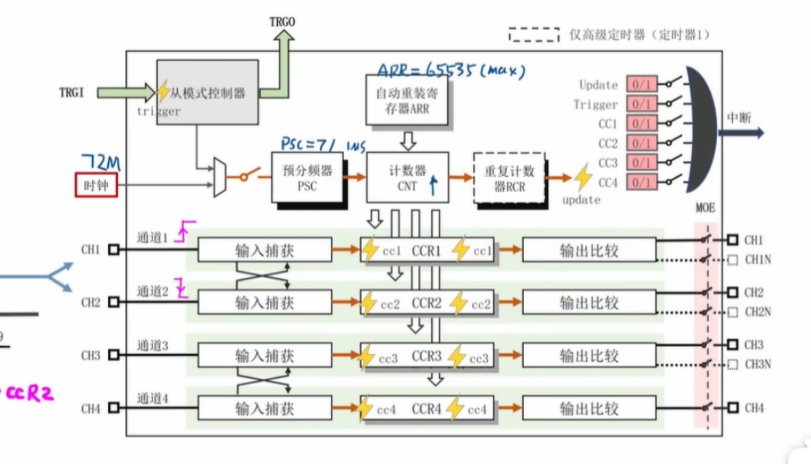

<span style="font-weight:bold; font-size:1.2em;">结合着这张图给我解释下定时器的各个开关对应的标准库函数，还有我记得是不是定时器是可以切换内部时钟源的，这个对应的标准库函数是什么呢？</span>


你问得非常准，这正是理解定时器如何工作的核心！这张图上的**每一个“开关”、每一个“选择器（MUX）”、每一个“逻辑块”**，都对应着标准库（SPL）中的一个或一组配置函数。

你的第二个问题也问到了点子上，定时器**确实可以切换时钟源**，这是它实现复杂功能的关键。

我来为你详细拆解，并把图中的“开关”和SPL函数一一对应起来。

------


### 📍 1. 你的特定问题：如何切换时钟源？


是的，定时器不仅能用内部时钟，还能被外部信号驱动。


#### A. 首先：打开定时器的“总电源”

在配置**任何**定时器内部开关之前，你必须先打开它在**RCC（复位和时钟控制）** 里的总时钟。这是整个模块的“电源总开关”。

- **对应SPL函数：** `RCC_APB2PeriphClockCmd()`

- **示例：**

  C

  ```C
  /* TIM1 挂在高速APB2总线上 */
  RCC_APB2PeriphClockCmd(RCC_APB2Periph_TIM1, ENABLE);
  ```


#### B. 其次：选择定时器的“工作时钟”

如图所示，驱动预分频器（PSC）的时钟来源是**可选的**（通过一个多路选择器 MUX）。

- **开关1：选择内部时钟 (CK_INT)**
  - **图中位置：** "72M 时钟" 所在的路径。这是默认选项。
  - **功能：** 使用来自RCC的PCLK（图中为72MHz）作为时钟源。
  - **对应SPL函数：** `TIM_InternalClockConfig()`
  - **示例：** `TIM_InternalClockConfig(TIM1);` (通常这是默认的，可以不写，但显式写出更清晰)
- **开关2：选择外部时钟 (External Clock)**
  - **图中位置：** 从`TRGI`（触发输入）到PSC的路径。
  - **功能：** **这个非常重要。** 它允许定时器的计数器 (`CNT`) 不再由内部MHz时钟驱动，而是由一个**外部引脚（如ETR或TIx）的信号边沿**来驱动。每来一个外部脉冲，`CNT`才加1。
  - **对应SPL函数：**
    1. **使用ETR引脚：** `TIM_ETRClockModeConfig()`
    2. **使用TIx（如CH1）引脚：** `TIM_TIxExternalClockConfig()`
  - **面试场景：** “你想统计一个外部传感器产生了多少个脉冲？” 答：使用`TIM_TIxExternalClockConfig()`将定时器配置为**外部时钟模式**，引脚选择`TI1`，然后直接读取 `CNT` 寄存器的值，就是脉冲的总数。

------


### 📥 2. 图中其他关键“开关”及其SPL函数

我把整个定时器按功能模块，为你梳理图中的“开关”：


#### ⚙️ 模块一：时基单元 (发动机)

- **开关3：计数器 "启动/停止" 开关**

  - **功能：** 控制 `CNT` 计数器是开始计数还是停止。
  - **对应SPL函数：** `TIM_Cmd()`
  - **示例：** `TIM_Cmd(TIM1, ENABLE);` (在所有配置完成后，调用它来启动定时器)

- **开关4：计数器 "工作模式" 开关**

  - **功能：** 配置 `PSC`, `ARR`, `RCR` 和计数方向（向上/向下/中心对齐）。

  - **对应SPL函数：** `TIM_TimeBaseInit()`

  - **示例：**

    C

    ```c
    TIM_TimeBaseInitTypeDef TIM_BaseStruct;
    TIM_BaseStruct.TIM_Prescaler = 71;         // 对应 PSC
    TIM_BaseStruct.TIM_Period = 65535;         // 对应 ARR
    TIM_BaseStruct.TIM_CounterMode = TIM_CounterMode_Up; // 对应 CNT 计数方向
    TIM_BaseStruct.TIM_RepetitionCounter = 0;  // 对应 RCR
    TIM_TimeBaseInit(TIM1, &TIM_BaseStruct);
    ```

- **开关5：中断 "使能" 开关**

  - **功能：** 决定 `Update`（更新）、`CC1`（捕获/比较1）等事件是否能产生中断。
  - **图中位置：** 右上角的"中断"选择器。
  - **对应SPL函数：** `TIM_ITConfig()`
  - **示例：**
    - `TIM_ITConfig(TIM1, TIM_IT_Update, ENABLE);` (打开"更新中断"开关)
    - `TIM_ITConfig(TIM1, TIM_IT_CC1, ENABLE);` (打开"通道1"中断开关)


#### 📤 模块二：输出比较 (PWM输出)

- **开关6：通道 "工作模式" 开关 (输出)**

  - **功能：** 决定一个通道是`输出比较`、`PWM1`、`PWM2`还是其他模式。

  - **图中位置：** "输出比较" 逻辑块。

  - **对应SPL函数：** `TIM_OCInit()`

  - **示例：**

    C

    ```c
    TIM_OCInitTypeDef TIM_OCStruct;
    TIM_OCStruct.TIM_OCMode = TIM_OCMode_PWM1; // 设置为PWM1模式
    TIM_OCInit(TIM1, &TIM_OCStruct);
    ```

- **开关7：通道 "占空比" 设置**

  - **功能：** 设置 `CCR1`~`CCR4` 的值，用于和`CNT`比较。
  - **对应SPL函数：** `TIM_SetCompareX()`
  - **示例：** `TIM_SetCompare1(TIM1, 32768);` (设置CH1的CCR值为32768)

- **开关8：通道 "引脚输出" 开关**

  - **功能：** 真正决定 `CH1`, `CH1N`, `CH2`... 这些引脚上是否输出波形。
  - **图中位置：** `CH1` / `CH1N` 前的小开关。
  - **对应SPL函数：** `TIM_CCxCmd()` 和 `TIM_CCxNCmd()`
  - **示例：**
    - `TIM_CCxCmd(TIM1, TIM_Channel_1, TIM_CCx_Enable);` (打开CH1输出)
    - `TIM_CCxNCmd(TIM1, TIM_Channel_1, TIM_CCxN_Enable);` (打开CH1N互补输出)

- **开关9：高级定时器 "总闸" (刹车)**

  - **功能：** **(高级定时器独有)** `MOE`位，主输出使能。这是所有输出通道的总开关，用于电机堵转、过流保护时的紧急“刹车”。
  - **图中位置：** 红色虚线框 `MOE`。
  - **对应SPL函数：** `TIM_CtrlPWMOutputs()`
  - **示例：** `TIM_CtrlPWMOutputs(TIM1, ENABLE);` (必须调用这个，PWM才能输出)


#### 📥 模块三：输入捕获 (信号测量)

- **开关10：通道 "工作模式" 开关 (输入)**

  - **功能：** 决定一个通道是 `输入捕获` 模式。

  - **图中位置：** "输入捕获" 逻辑块。

  - **对应SPL函数：** `TIM_ICInit()`

  - **示例：**

    C

    ```c
    TIM_ICInitTypeDef TIM_ICStruct;
    TIM_ICStruct.TIM_Channel = TIM_Channel_1;
    TIM_ICStruct.TIM_ICPolarity = TIM_ICPolarity_Rising; // 捕获上升沿
    TIM_ICStruct.TIM_ICFilter = 0; // 设置滤波器
    TIM_ICInit(TIM1, &TIM_ICStruct);
    ```

- **开关11：输入 "交叉" 开关**

  - **功能：** 决定 `CH1` 是捕获 `TI1` 的信号还是 `TI2` 的信号。
  - **图中位置：** `输入捕获` 块中交叉的线。
  - **对应SPL函数：** 同样由 `TIM_ICInit()` 中的 `TIM_Channel` 成员配置。标准库帮你处理好了底层的 `CCxS` 位。


#### 🧠 模块四：主从联动系统

- **开关12：从模式 "联动方式" 开关**
  - **功能：** 决定当`TRGI`（触发输入）来信号时，本定时器该做什么。
  - **图中位置：** "从模式控制器" 模块。
  - **对应SPL函数：** `TIM_SelectSlaveMode()`
  - **示例：** `TIM_SelectSlaveMode(TIM1, TIM_SlaveMode_Reset);` (选择复位模式，即TRGI来信号时CNT清零)
- **开关13：从模式 "触发源" 开关**
  - **功能：** 决定 `TRGI` 信号到底来自哪里（来自`CH1`？`CH2`？还是其他定时器？）。
  - **对应SPL函数：** `TIM_SelectInputTrigger()`
  - **示例：** `TIM_SelectInputTrigger(TIM1, TIM_TS_TI1FP1);` (选择`CH1`的边沿作为触发源)
- **开关14：主模式 "输出信号" 开关**
  - **功能：** 决定 `TRGO`（触发输出）输出什么信号（输出`Update`信号？还是`CC1`事件？）。
  - **图中位置：** "TRGO" 输出箭头。
  - **对应SPL函数：** `TIM_SelectOutputTrigger()`
  - **示例：** `TIM_SelectOutputTrigger(TIM1, TIM_TRGOSource_Update);` (让`TRGO`在`Update`时输出一个脉冲，常用于触发ADC)


### 总结表格

| **开关/配置 (功能描述)**   | **图中关键块**      | **核心SPL函数**                                             |
| -------------------------- | ------------------- | ----------------------------------------------------------- |
| 1. 外设时钟总开关          | (RCC层)             | `RCC_APB2PeriphClockCmd()`                                  |
| 2. **选择内部时钟 (默认)** | 时钟源 MUX          | `TIM_InternalClockConfig()`                                 |
| 3. **选择外部时钟**        | 时钟源 MUX          | `TIM_ETRClockModeConfig()` / `TIM_TIxExternalClockConfig()` |
| 4. 配置周期/分频/方向      | `PSC`, `ARR`, `CNT` | `TIM_TimeBaseInit()`                                        |
| 5. 启动/停止计数器         | `CNT`               | `TIM_Cmd()`                                                 |
| 6. 使能中断                | 中断 MUX            | `TIM_ITConfig()`                                            |
| 7. 配置PWM输出模式         | `输出比较`          | `TIM_OCInit()`                                              |
| 8. 设置PWM占空比           | `CCR1`~`CCR4`       | `TIM_SetCompareX()`                                         |
| 9. 使能PWM引脚输出         | `CHx`, `CHxN` 开关  | `TIM_CCxCmd()` / `TIM_CCxNCmd()`                            |
| 10. PWM主输出总闸 (刹车)   | `MOE`               | `TIM_CtrlPWMOutputs()`                                      |
| 11. 配置输入捕获模式       | `输入捕获`          | `TIM_ICInit()`                                              |
| 12. 配置从模式 (联动方式)  | `从模式控制器`      | `TIM_SelectSlaveMode()`                                     |
| 13. 配置从模式 (触发源)    | `TRGI`              | `TIM_SelectInputTrigger()`                                  |
| 14. 配置主模式 (触发输出)  | `TRGO`              | `TIM_SelectOutputTrigger()`                                 |

这个表格基本涵盖了图中所有关键“开关”对应的SPL函数，希望能帮你构建起清晰的知识体系！


# 📥 视频内容分析总结


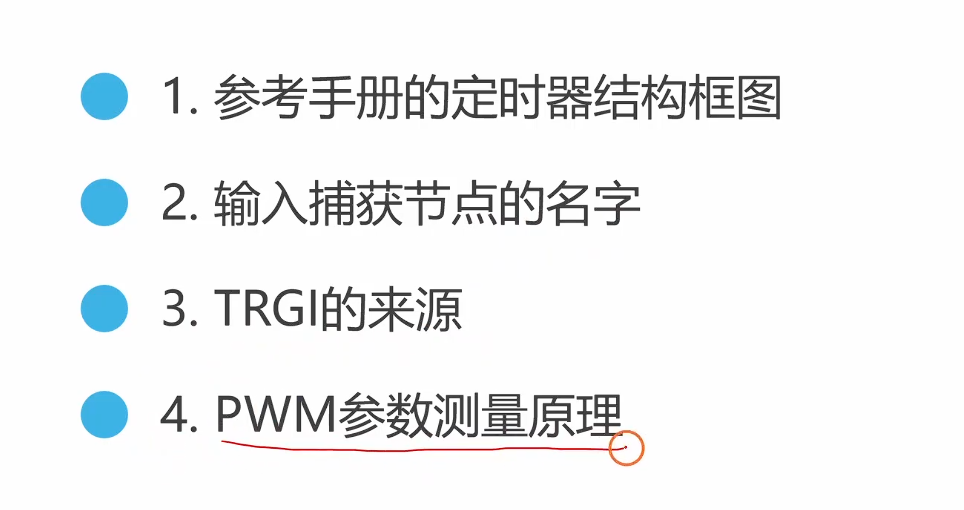


这个视频主要讲解了如何使用STM32定时器（以TIM1这种高级定时器为例）的**PWM输入模式（PWM Input Mode）** 来精确测量一个PWM信号的**周期（Period）**和**脉宽（Pulse Width）**，并最终计算出其频率和占空比。

核心原理是巧妙地结合了定时器的两个输入捕获通道（CH1, CH2）与从模式控制器（Slave Mode Controller）。

**详细配置与工作流程如下：**

1. **信号流设置（交叉连接）：**
   - 将待测的PWM信号**仅从CH1的引脚（TI1）输入**。
   - **通道1（CH1）配置：** 设置为输入捕获模式，捕获**上升沿**。信号源来自 `TI1FP1`。
   - **通道2（CH2）配置：** 也设置为输入捕获模式，但捕获**下降沿**。信号源来自 `TI1FP2`。（`TI1FP1` 和 `TI1FP2` 均来自同一个输入引脚 `TI1`，只是配置了不同的边沿极性）。
2. **从模式控制器（Slave Mode Controller）配置：**
   - **触发源（TRGI）：** 选择为 `TI1FP1`（即CH1的上升沿信号）。
   - **模式（Mode）：** 设置为**复位模式（Reset Mode）**。
3. **工作原理（全自动硬件测量）：**
   - **第1步（周期捕获 & 复位）：** 当PWM信号的**第一个上升沿**到达时，它会同时触发两件事：
     1. **捕获 (CH1):** `IC1` 捕获当前计数器 `CNT` 的值到 `CCR1` 寄存器中。
     2. **复位 (SMC):** `TRGI` 触发从模式控制器，使 `CNT` 计数器**立即清零（Reset）**。
   - **第2步（计数开始）：** `CNT` 计数器从0开始重新递增。
   - **第3步（脉宽捕获）：** 当PWM信号的**下降沿**到达时：
     1. **捕获 (CH2):** `IC2` 捕获当前计数器 `CNT` 的值到 `CCR2` 寄存器中。
   - **第4步（等待周期）：** `CNT` 计数器继续递增。
   - **第5步（循环）：** 当PWM信号的**下一个上升沿**到达时，重复第1步。

**最终结果：**

- **`CCR1` 寄存器：** 存储的值就是两次上升沿之间的时间，即PWM信号的**周期（Period）**。
- **`CCR2` 寄存器：** 存储的值就是从上升沿到下降沿的时间，即PWM信号的**脉宽（Pulse Width）**。
- **计算：**
  - **频率 (Frequency):** $f = \frac{Timer_{Clock}}{(PSC + 1) \times (CCR1 + 1)}$
  - **占空比 (Duty Cycle):** $Duty = \frac{CCR2 + 1}{CCR1 + 1} \times 100\%$

*(注：实际计数值可能需要 `+1`，这取决于具体的计数器行为，但 `CCR1` 和 `CCR2` 的比例关系是确定的)*

------


# 参考手册框图对应

## 时基单元

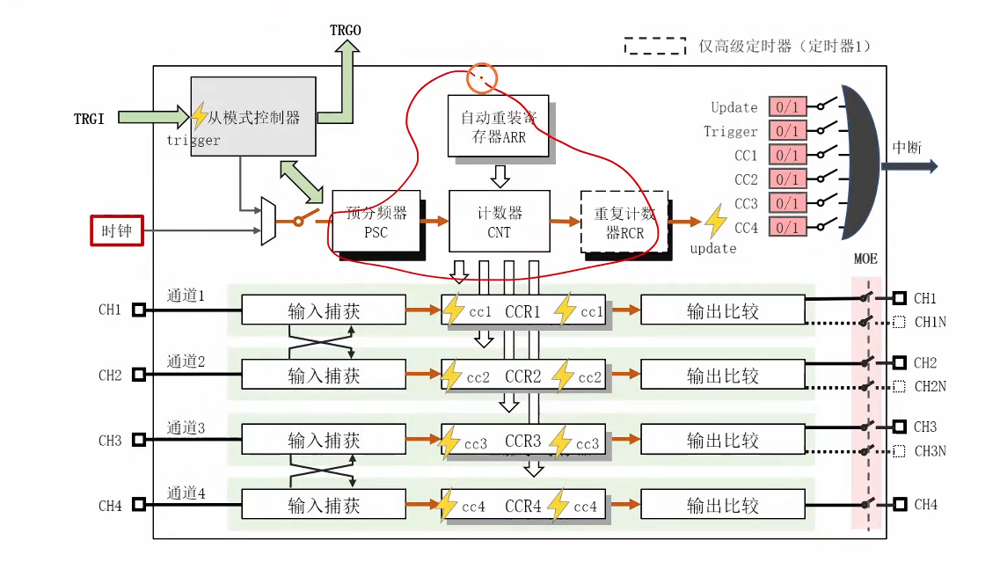

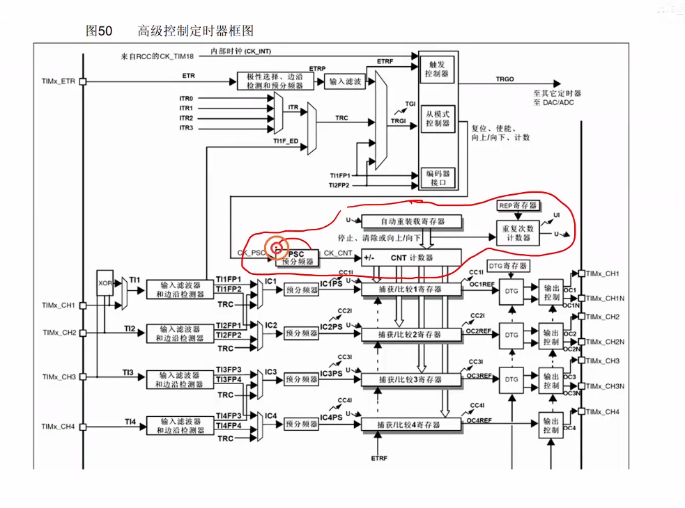


## 输入捕获

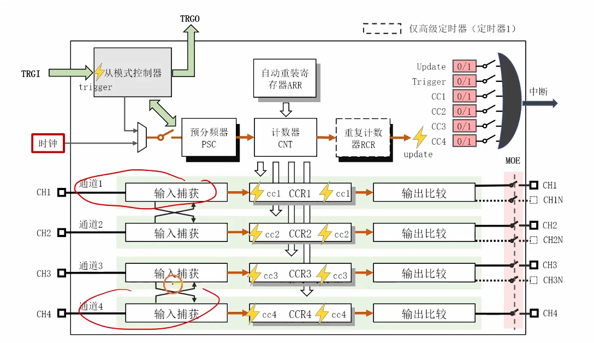

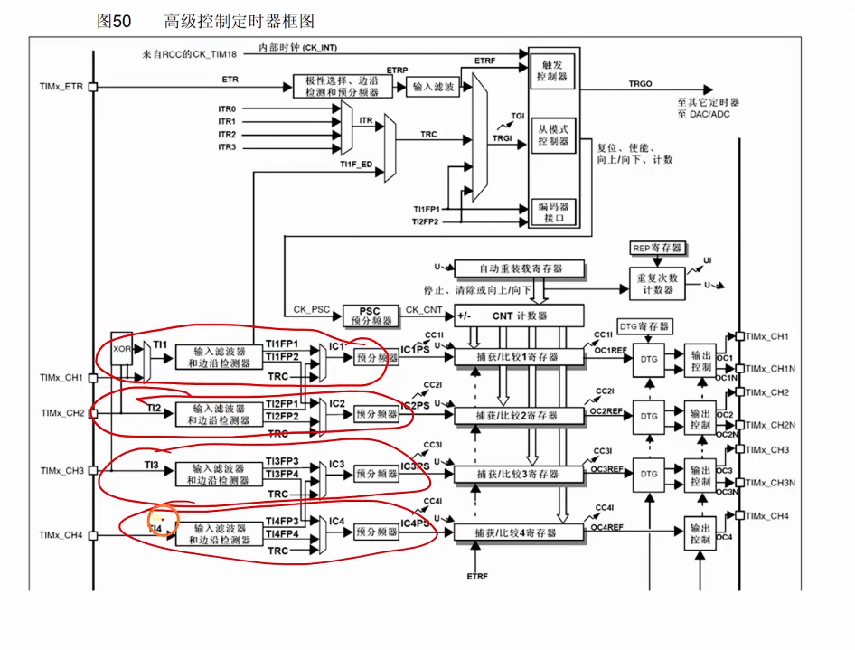

## 从模式触发器

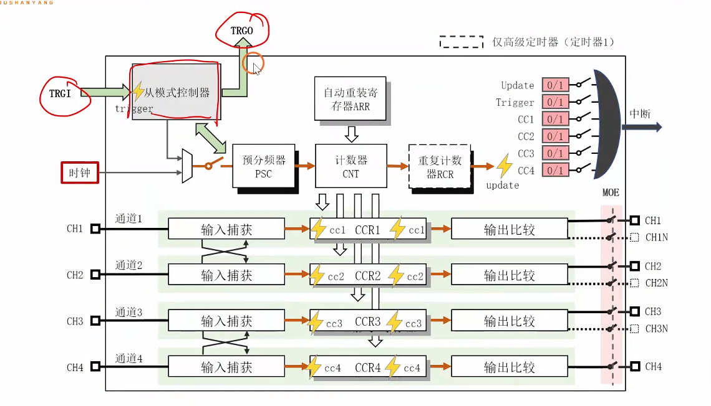


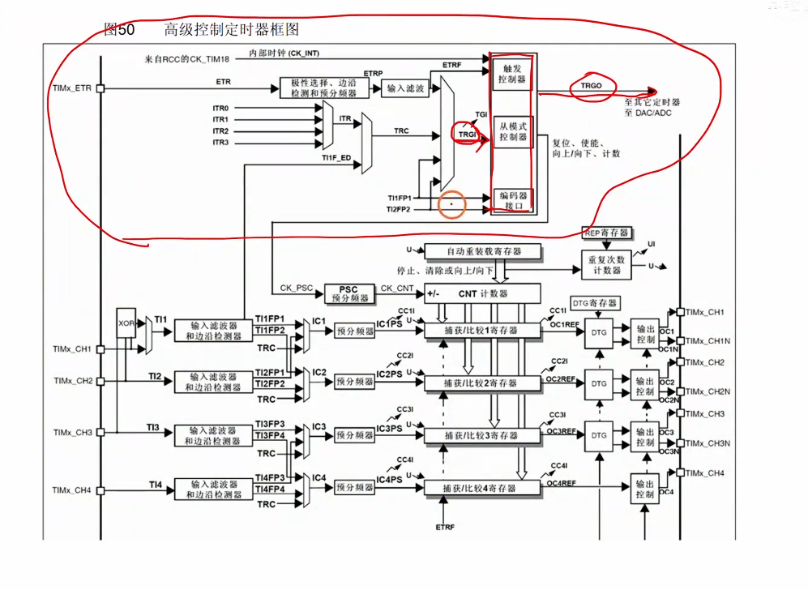


# 补充提问

## 提问1

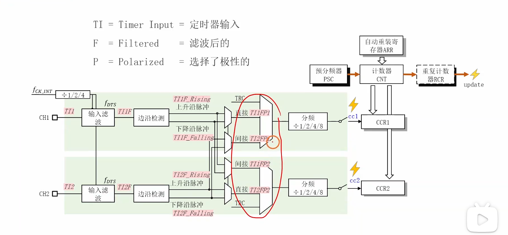

<span style="font-weight:bold; font-size:1.2em;">结合着这张图片给我解释下视频中关于这张图片的各个名称的解释，我不是太懂？还有这里的CC1事件是硬件自动触发CNT保存到CCR1还是中断呢，我记得不是还有一个触发CC1中断吗，我不是太懂？</span>


你问的这个问题**非常关键**，是理解定时器捕获（Input Capture）工作原理的**核心**！很多人都会在这里感到困惑。

我们来一步一步拆解这张图，然后再解答你关于“CC1事件”和“中断”的困惑。

------


### 1. 🖼️ 信号名称全解析（从左到右）

这张图是定时器“输入捕获”模块的放大图。它展示了一个信号是如何从引脚进来，经过一步步处理，最终触发捕获动作的。

- **TI1 (Timer Input 1)**

  > `TI = Timer Input = 定时器输入`

  - **解释：** 这就是从 `CH1`（通道1）的GPIO引脚进来的**最原始的、未经处理的**信号。它可能带有噪声或毛刺。

- **输入滤波器 (Input Filter)**

  - **解释：** 这是一个**数字滤波器**。它会用一个时钟（`f_DTS`）对 `TI1` 信号进行连续采样。只有当信号**连续稳定 N 个采样周期**后，滤波器才会认为这个信号是有效的。
  - **作用：** 滤除 `TI1` 上的高频噪声和毛刺，防止误触发。

- **TI1F (Timer Input 1 Filtered)**

  > `F = Filtered = 滤波后的`

  - **解释：** 这是 `TI1` 信号经过上述滤波器“洗”过之后的**干净信号**。`F` 代表 "Filtered"（滤波后的）。

- **边沿检测 (Edge Detection)**

  - **解释：** 这个模块会同时监视干净的 `TI1F` 信号。它会分裂成两路：
    1. 当 `TI1F` 出现**上升沿**时，`TI1F_Rising` 这条线上会产生一个极短的脉冲。
    2. 当 `TI1F` 出现**下降沿**时，`TI1F_Falling` 这条线上会产生一个极短的脉冲。

- **红色圆圈内的 MUX (多路选择器)**

  - **解释：** 这是最关键的“开关”。它根据你的配置，来决定**到底用什么信号**作为最终的触发信号。
  - 它有三个输入源：`TI1F_Rising`（上升沿）、`TI1F_Falling`（下降沿）、`TRC`（来自从模式控制器的触发）。

- **TI1FP1 (Timer Input 1 Filtered Polarized 1)**

  > `P = Polarized = 选择了极性的`

  - **解释：** "Polarized"（选择了极性的）意思是，你已经通过上面那个MUX选好了你关心的边沿（极性）。
  - 例如，如果你配置定时器为“上升沿捕获”，那么 `TI1FP1` 这条线就会**直连**到 `TI1F_Rising`。从此，`TI1FP1` 上就**只会出现上升沿脉冲**。
  - `...P1` 结尾的 `1` 表示这是给**通道1**（CC1）用的。

- **TI1FP2 (Timer Input 1 Filtered Polarized 2)**

  - **解释：** 这是同一路信号（来自CH1）的**另一个极性选择输出**。注意它的 `...P2` 结尾的 `2`，表示这是给**通道2**（CC2）用的。
  - **这就是实现“PWM输入模式”的魔法**：你可以让 `TI1FP1` 选择上升沿（去触发`CC1`和`CNT`复位），同时让 `TI1FP2` 选择下降沿（去触发`CC2`），这样两个通道就能用同一个引脚的信号，捕获不同的边沿。

------


### 2. ❓ 关键问题：“CC1事件”是硬件捕获还是中断？

你把两个概念混淆了，但它们紧密相关。你的理解没错，确实有两个东西都叫“CC1”。

简洁的回答：

“CC1事件”是一个硬件动作，它会立即把CNT的值复制到CCR1中，并且同时设置一个名为CC1IF的**“标志位”**。

而“CC1中断”是**可选的软件响应**。只有当你**使能**了`CC1IE`（中断使能）时，那个`CC1IF`标志位才**能**去请求CPU产生中断。

------


#### 详细分解：

你可以把这个过程想象成一个带自动相机的门铃：

**1. “CC1事件” (硬件动作)**

- **什么是事件？** 就是你配置的那个信号（比如 `TI1FP1` 上的上升沿脉冲）**到来的那一瞬间**。
- **事件触发什么？** 这个“事件”是硬件层面的，它**同时触发了两个硬件动作**，完全不需要CPU干预：
  1. **动作 A (捕获)：** 硬件**立即**把 `CNT` 计数器当时的值“拍照”并复制（锁存）到 `CCR1` 寄存器里。
  2. **动作 B (置位)：** 硬件**立即**在状态寄存器(`TIM_SR`)中，把 `CC1IF` (通道1中断**标志位**) 置1。这就像门铃上的指示灯亮了，表示“刚刚有人来过”。

**2. “CC1中断” (软件响应)**

- **什么是中断？** 中断是通知CPU“停下你手里的活，快来处理我”的一个请求。
- **中断如何发生？** 只有**两个条件同时满足**时，才会产生“CC1中断”：
  1. `CC1IF` 标志位**必须为1**（门铃灯亮了）。
  2. `CC1IE` (通道1中断**使能位**) **必须为1**。这是你用 `TIM_ITConfig(TIM1, TIM_IT_CC1, ENABLE);` 这个函数打开的“开关”。它代表“我（CPU）*允许* 这个门铃来打扰我”。


#### 总结与面试策略：

- **“事件” (Event) 是因，** 是物理信号触发的硬件动作。
- **“捕获” (Capture) 是硬件结果，** `CNT` $\rightarrow$ `CCR1`，这是**永远都会发生**的，只要事件来了。
- **“标志” (Flag) 是硬件通知，** `CC1IF=1`，也是永远都会发生的。
- **“中断” (Interrupt) 是软件选择，** 是CPU对“标志”的一种响应方式。

**面试回答策略：**

> **面试官：** 当捕获事件发生时，`CNT`的值是如何存入`CCR1`的？是通过中断吗？
>
> **你：** 不，是通过**硬件自动完成**的。当`CH1`引脚上检测到我们设定的边沿（例如上升沿）时，这个“CC1事件”会**立即触发硬件**，将`CNT`的当前值**直接锁存**到`CCR1`寄存器中。
>
> **（关键加分点）**：在这个**硬件动作发生的同时**，硬件还会自动**设置`CC1IF`中断标志位**。如果我们**事先用`TIM_ITConfig`打开了`CC1IE`中断使能**，那么这个标志位就会进一步触发CPU中断，我们就可以在中断服务程序（ISR）中去读取`CCR1`的值。如果我们没有开启中断，那`CCR1`的值也一样被捕获了，我们可以在主循环中通过**轮询`CC1IF`标志位**来得知捕获已完成，然后再去读取`CCR1`。
>
> **（总结）**：所以，**“捕G获”是硬件行为，“中断”是对捕获完成这个“标志”的一种软件响应方式**，两者不是一回事。


## 提问2

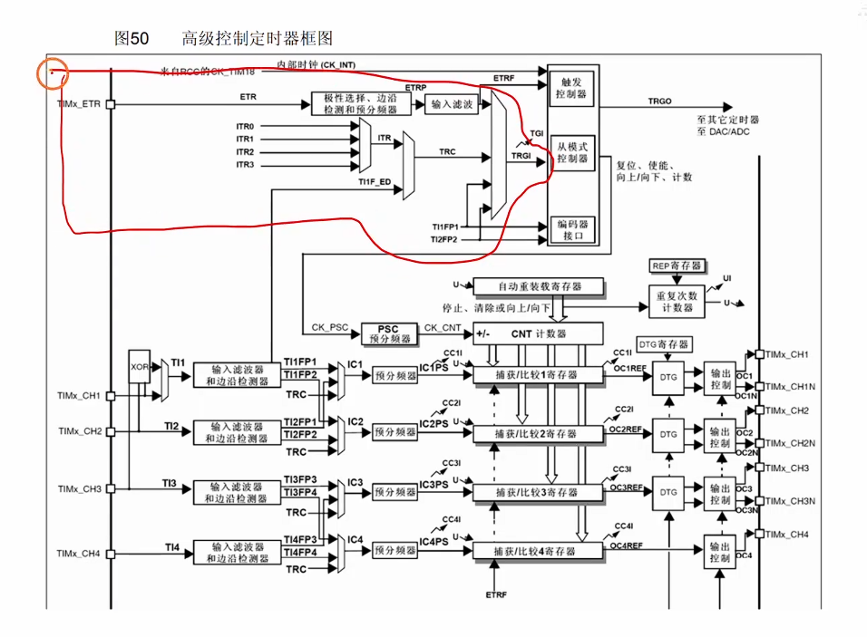

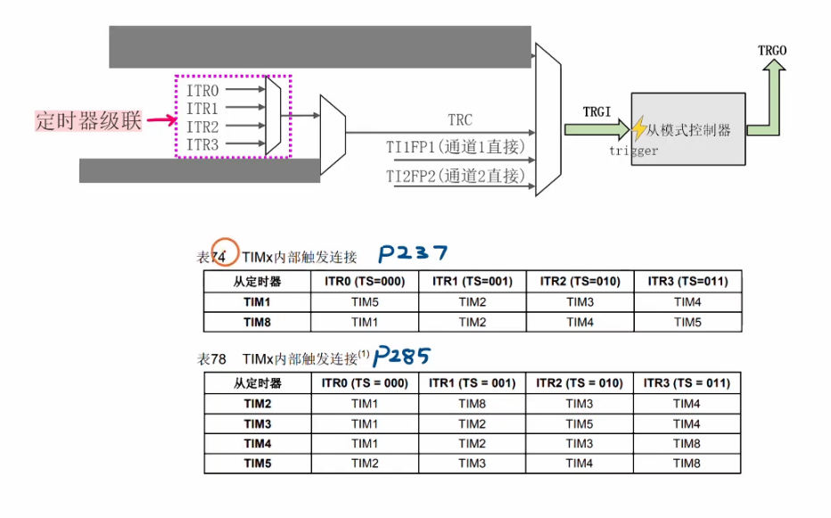

<span style="font-weight:bold; font-size:1.2em;">你能够结合着这两张图给我解释下定时器从模式控制器中的4种输入来源吗，结合着视频中的来介绍，最好能够举个例子来让我彻底弄懂。</span>


这是一个非常核心的问题！你已经快要打通定时器最复杂的“任督二脉”了。

这张图（图1）是**高级控制定时器**的完整框图，而第二张图（图2）是**从模式控制器**（Slave Mode Controller）的**输入部分**的放大图。

从模式控制器的**核心作用**，就是让这个定时器**不再“我行我素”地闷头计数**，而是可以被**其他信号来控制**，实现“启动”、“停止”、“复位”或“计数”等联动。这个“其他信号”的入口就是 `TRGI` (Trigger Input - 触发输入)。

如图所示，共有**四种类型**的信号源可以被选为 `TRGI`，这个选择是由 `SMCR` 寄存器中的 `TS` (Trigger Selection) 位来决定的。

我们来详细解析这四种来源，并举例说明：

------


### 1. 来源一：ITRx (内部触发) - 用于定时器级联

- **图中位置：** 图2中的 `ITR0`, `ITR1`, `ITR2`, `ITR3`。`ITR` 代表 **I**nternal **Tr**igger。
- **解释：** `ITR` 允许一个定时器（Master）去控制另一个定时器（Slave）。`TRGO` (Trigger Output) 是主定时器的输出，`ITR` 是从定时器的输入。
- **看表（图2）：** 这两张表就是“接线图”。
  - **表74** (高级定时器作从机)：如果你的**TIM1**是“从机”（Slave），你想用`TIM2`的`TRGO`来触发它，那么`TIM2`的`TRGO`就接在`TIM1`的`ITR1`上。
  - **表78** (通用定时器作从机)：如果你的**TIM2**是“从机”（Slave），你想用`TIM1`的`TRGO`来触发它，那么`TIM1`的`TRGO`就接在`TIM2`的`ITR0`上。
- **对应SPL函数：**
  - `TIM_SelectInputTrigger(TIM_SLAVE, TIM_TS_ITR0);` // 选择`ITR0`作为`TRGI`
  - `TIM_SelectSlaveMode(TIM_SLAVE, TIM_SlaveMode_Trigger);` // 设置为触发启动模式


#### 举个例子：使用 TIM1 启动 TIM2

**场景：** 我希望 `TIM1` 运行1秒后，`TIM2` 才开始运行。（定时器接力）

1. **配置TIM1 (Master):**

   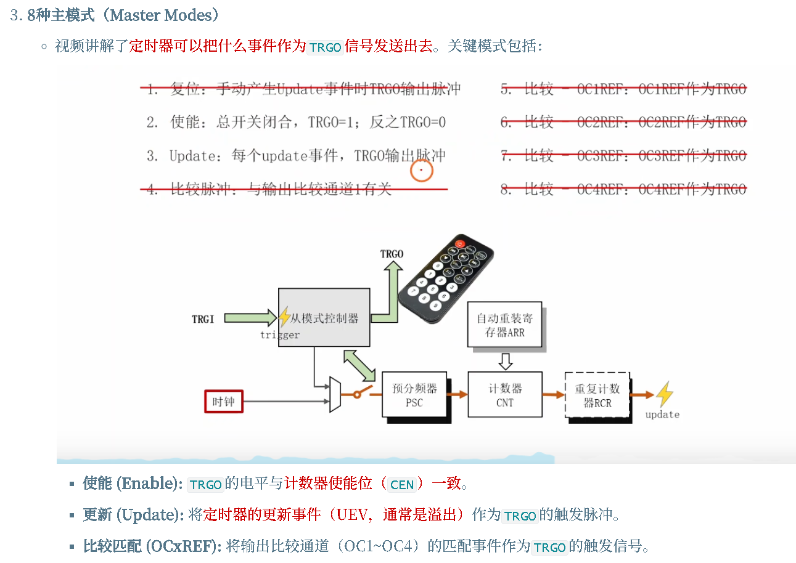

   - 配置 `TIM1` 的 `TRGO`（触发输出），让它在“更新事件”（Update Event，即溢出）时产生一个脉冲。
   - **函数：** `TIM_SelectOutputTrigger(TIM1, TIM_TRGOSource_Update);`

2. **配置TIM2 (Slave):**

   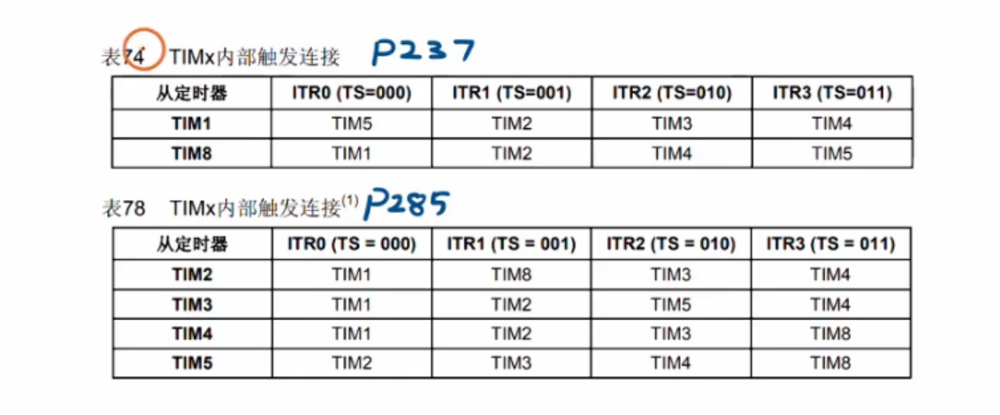

   - **查表：** `TIM2` 是从机，查 **表78**。`TIM1` 的 `TRGO` 对应 `TIM2` 的哪个输入？答案是 `ITR0` (`TS=000`)。

   - **选择TRGI：** 告诉 `TIM2`，你的 `TRGI` 信号来源是 `ITR0`。

   - **函数：** `TIM_SelectInputTrigger(TIM2, TIM_TS_ITR0);`

   - **设置从模式：** 告诉 `TIM2`，当 `TRGI` 信号来了之后，你要做什么？答：你要“触发启动”(Trigger Mode)。

     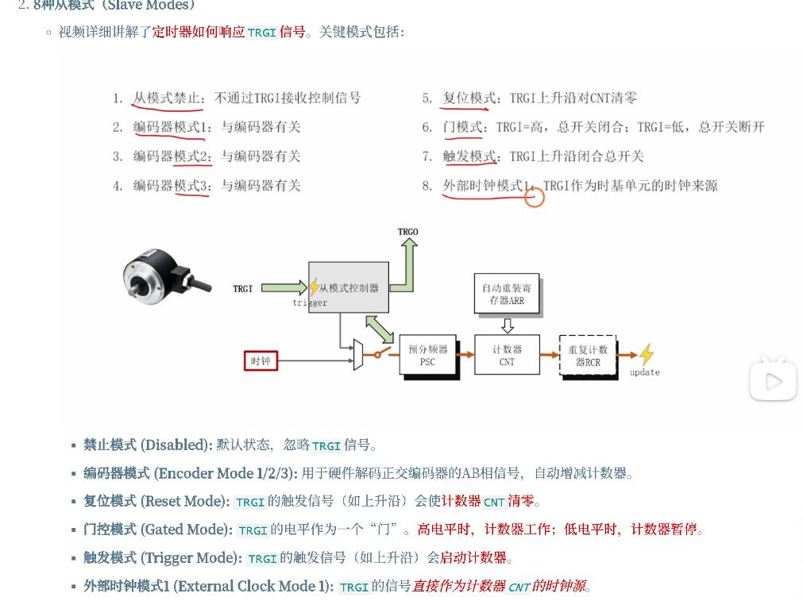

   - **函数：** `TIM_SelectSlaveMode(TIM2, TIM_SlaveMode_Trigger);`

3. **结果：** 你启动 `TIM1`，`TIM2` 保持不动。1秒后 `TIM1` 溢出，`TRGO` 发出一个脉冲，这个脉冲通过 `ITR0` 进入 `TIM2` 的 `TRGI`，`TIM2` 的从模式控制器收到信号，**硬件自动启动 `TIM2` 的计数器**。

------


### 2. 来源二：TI1FP1 (通道1滤波/极性输入)

- **图中位置：** 图1和图2中的 `TI1FP1`。`F` = Filtered (滤波后的), `P` = Polarized (选择极性后的)。
- **解释：** 这是**最常用**的来源之一。它表示“来自 `CH1` 引脚，经过了滤波器，并选好了边沿（如只看上升沿）”的那个信号。
- **对应SPL函数：**
  - `TIM_SelectInputTrigger(TIM1, TIM_TS_TI1FP1);`


#### 举个例子：PWM输入模式 (上个视频的核心)

**场景：** 用 `CH1` 引脚测量一个PWM波形的**周期**和**脉宽**。

1. **配置CH1 (IC1):** 设置为“上升沿”捕获。
2. **配置CH2 (IC2):** 设置为“下降沿”捕获。（但它的信号源要交叉选为`TI1`，即 `TI1FP2`）
3. **配置从模式 (关键！)：**
   - **选择TRGI：** 告诉定时器，你的 `TRGI` 来源是 `TI1FP1`（即CH1的上升沿）。
   - **函数：** `TIM_SelectInputTrigger(TIM1, TIM_TS_TI1FP1);`
   - **设置从模式：** 告诉定时器，当 `TRGI` 信号（CH1上升沿）来了之后，你要做什么？答：你要**“复位”(Reset Mode)**。
   - **函数：** `TIM_SelectSlaveMode(TIM1, TIM_SlaveMode_Reset);`
4. **结果：**
   - PWM的**上升沿**来了，`TI1FP1` 产生脉冲。
   - 这个脉冲**兵分两路**：
     1. **去 `TRGI`：** 触发从模式控制器，**`CNT` 计数器立即清零**。
     2. **去 `IC1`：** 触发通道1捕获。硬件**捕获 `CNT` 的值**（此时还是清零前的最大值）到 `CCR1`。
   - PWM的**下降沿**来了，`TI1FP2` 产生脉冲。
     1. **去 `IC2`：** 触发通道2捕获。硬件**捕获 `CNT` 的值**（此时是上升沿到下降沿的时间）到 `CCR2`。
   - **最终：`CCR1` 的值就是周期，`CCR2` 的值就是脉宽。**

------


### 3. 来源三：TI2FP2 (通道2滤波/极性输入)

- **图中位置：** 图1和图2中的 `TI2FP2`。
- **解释：** 和 `TI1FP1` 完全一样，只不过信号来源是 `CH2` 引脚。
- **对应SPL函数：**
  - `TIM_SelectInputTrigger(TIM1, TIM_TS_TI2FP2);`
- **例子：** 和上一个例子完全反过来。你可以用 `CH2` 的上升沿来复位定时器，然后用 `CH1` 来捕获另一个边沿。

------


### 4. 来源四：TI1F_ED (通道1滤波后的任意边沿)

- **图中位置：** 图1中的 `TI1F_ED`。`ED` = **E**dge **D**etector。
- **解释：** 这是一个特殊的信号。`TI1FP1` 是只看“上升沿”**或**“下降沿”（二选一）。而 `TI1F_ED` 是**“上升沿”和“下降沿”** 都会触发它。
- **对应SPL函数：**
  - `TIM_SelectInputTrigger(TIM1, TIM_TS_TI1F_ED);`


#### 举个例子：测量脉冲个数 (双边沿计数)

**场景：** 我有一个方波信号，我想用它来给定时器当“时钟”用，并且我希望**上升沿和下降沿都能让计数器+1**，实现“2倍频”计数。

1. **配置从模式：**
   - **选择TRGI：** 告诉定时器，你的 `TRGI` 来源是 `TI1F_ED`（CH1的任意边沿）。
   - **函数：** `TIM_SelectInputTrigger(TIM1, TIM_TS_TI1F_ED);`
   - **设置从模式：** 告诉定时器，当 `TRGI` 信号（任意边沿）来了之后，你要做什么？答：你要把它当做**“外部时钟”**来用 (`External Clock Mode 1`)。
   - **函数：** `TIM_SelectSlaveMode(TIM1, TIM_SlaveMode_Ext);`
2. **结果：**
   - 信号在 `CH1` 上产生一个**上升沿**，`TRGI` 触发，`CNT` **加1**。
   - 信号在 `CH1` 上产生一个**下降沿**，`TRGI` 再次触发，`CNT` **又加1**。
   - 这样，外部信号的一个完整周期，`CNT` 计数器加了2。
   - **用途：** 这在**编码器模式**中会用到，用来实现X2或X4倍频，提高编码器的测量精度。

------


### 总结

这四种 `TRGI` 输入源，让定时器从一个孤立的模块变成了一个可以**高度协同**的系统：

| **触发源 (TS位)** | **信号来源**          | **主要用途（举例）**                     |
| ----------------- | --------------------- | ---------------------------------------- |
| **ITRx**          | 其他定时器的 `TRGO`   | **定时器级联** (e.g., TIM1 启动 TIM2)    |
| **TI1FP1**        | `CH1` 引脚 (指定边沿) | **PWM输入模式** (e.g., CH1上升沿复位CNT) |
| **TI2FP2**        | `CH2` 引脚 (指定边沿) | **PWM输入模式** (e.g., CH2上升沿复位CNT) |
| **TI1F_ED**       | `CH1` 引脚 (任意边沿) | **编码器模式 / 外部时钟倍频计数**        |

希望这个解释能让你彻底弄懂！

你还想了解主模式的 `TRGO` (触发输出) 是如何配置的吗？


## 提问3（使用从模式控制器下PWM信号周期和占空比的测量原理）

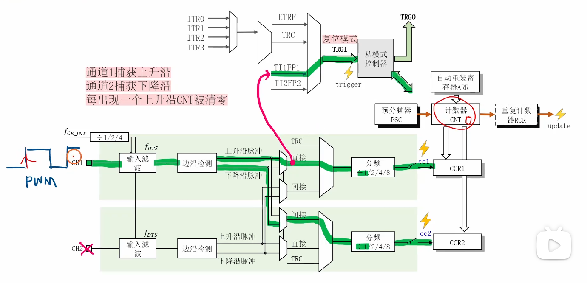

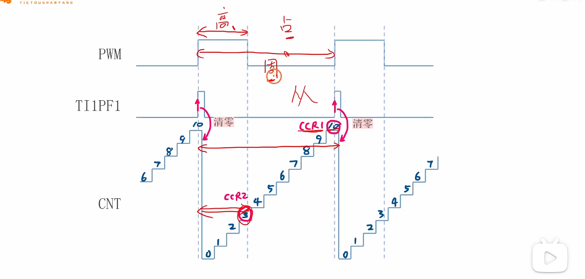

<span style="font-weight:bold; font-size:1.3em;">你能够结合这这个图来给我详细解释下使用从事控制器下PWM信号周期和占空比的测量原理吗，最好能够举个例子来让我彻底弄明白？</span>

你提的这个问题太棒了！这正是STM32定时器最高级、最精妙的用法之一，也是面试中考察你是否“精通”定时器的“杀手锏”问题。

你提供的这两张图（**图1：硬件框图** 和 **图2：时序图**）完美地组合在一起，解释了这个原理。

我来为你详细拆解这个“全自动”的测量过程，并举一个实例。

------


### 🚀 核心原理：PWM输入模式 (PWM Input Mode)

这个功能的核心思想是：**“<span style="color:#CC0000;">用一个引脚，同时驱动两个捕获通道，并利用其中一个通道的信号来复位计数器，实现测量自动化。</span>”**

我们一步一步来看这是如何实现的：


#### 1. 硬件配置（看图1：硬件框图）

首先，我们必须按特定的方式“接线”定时器内部：

1. **信号输入：** 待测量的PWM波形，**仅仅**从 `CH1`（通道1）的引脚（`TIMx_CH1`）输入。`CH2` 的引脚**完全不用**。
2. **配置通道1 (IC1)：** 把它配置为**输入捕获**模式，并且只对**上升沿**敏感。
   - 如图1，`CH1` 信号经过“输入滤波”和“边沿检测”后，产生一个“上升沿脉冲”信号，这个信号在图上被命名为 `TI1FP1`。
3. **配置通道2 (IC2)：** 把它也配置为**输入捕获**模式，但要对**下降沿**敏感。
   - **【关键操作1：交叉输入】**：`CH2` 的信号源**不来自 `CH2` 引脚**，而是通过内部的 MUX（多路选择器），选择来自 `CH1` 的信号。在图1中，这个信号被命名为 `TI1FP2`（它在逻辑上等于`CH1`的下降沿脉冲）。
4. **配置从模式（【关键操作2：复位联动】）：**
   - **连接触发源 (`TRGI`)：** 我们把 `CH1` 的上升沿信号（`TI1FP1`）通过那根**粉色大箭头**连接到**从模式控制器**的 `TRGI`（触发输入）上。
   - **设置模式：** 我们把从模式控制器设置为**“复位模式”(Reset Mode)**。

**硬件配置总结：**

- `CH1`（上升沿） $\rightarrow$ 触发 `IC1`
- `CH1`（下降沿） $\rightarrow$ 触发 `IC2`
- `CH1`（上升沿） $\rightarrow$ 触发 `TRGI` $\rightarrow$ **CNT 计数器清零**

------


### 2. 工作流程（看图2：时序图）

现在，我们来看配置好后，硬件是如何全自动工作的。请你对照图2中的三个波形：

- **`PWM`：** 我们的目标信号。
- **`TI1FP1`：** `CH1` 上升沿检测信号。
- **`CNT`：** 16位计数器。

**让我们从任意时刻开始追踪：**

1. **【事件A：PWM上升沿】**
   - `CNT` 计数器正在快乐地从 `...8, 9, 10` 往上数。
   - 在 `CNT` 数到 `10` 的那一瞬间，PWM的**上升沿**来了！
   - 这个上升沿**同时做了两件**由硬件自动完成的事：
     - **动作1 (捕获周期)：** `TI1FP1` 产生一个脉冲，触发 `IC1`（图1中的 `cc1` 闪电箭头）。硬件**立即**将 `CNT` 的当前值（`10`）“拍照”并锁存到 `CCR1` 寄存器中。
     - **动作2 (复位计数)：** `TI1FP1` 脉冲也同时进入了 `TRGI`（图1的粉色箭头），触发从模式控制器。控制器**立即**强制 `CNT` 计数器**清零**（`清零`）。
   - **结果：** `CNT` 变成了0。而 `CCR1` 寄存器里保存了值 `10`。这个 `10` 是什么？它是从**上一个**上升沿（`CNT`=0）到**这一个**上升沿（`CNT`=10）的**总计数值**。
   - **所以：`CCR1` 的值 = PWM周期！**
2. **【事件B：CNT重新计数】**
   - `CNT` 计数器从 `0` 重新开始向上计数（`0, 1, 2, 3...`）。
3. **【事件C：PWM下降沿】**
   - `CNT` 计数器数到了 `3`。
   - 此时，PWM的**下降沿**来了！
   - 这个下降沿触发了 `IC2`（图1中的 `cc2` 闪电箭头，它连接的是 `TI1FP2`）。
   - **硬件动作 (捕获脉宽)：** 硬件**立即**将 `CNT` 的当前值（`3`）“拍照”并锁存到 `CCR2` 寄存器中。
   - **结果：** `CCR2` 寄存器里保存了值 `3`。这个 `3` 是什么？它是从**上一个**上升沿（`CNT`=0）到**这一个**下降沿（`CNT`=3）的**总计数值**。
   - **所以：`CCR2` 的值 = PWM脉宽（高电平时间）！**
4. **【事件D：等待周期结束】**
   - `CNT` 计数器**继续**往上数（`4, 5, 6, 7, 8, 9, 10...`）。
   - 当数到 `10` 时，下一个PWM上升沿又来了，重复**【事件A】**。

**这就是全自动测量的完整闭环！**

------


### 3. 举个例子（让你彻底明白）

假设你正在面试，面试官让你举个例子：

场景： 测量一个频率大约为 20kHz 的PWM信号。

定时器时钟： 假设 TIM1 的时钟 f_CK_INT = 72MHz。

**1. 我的配置：**

- **预分频器 (PSC)：** 我会设置为 `PSC = 0`。
  - **为什么？** 我需要高分辨率。`CNT` 的计数频率 = $72MHz / (0+1) = 72MHz$。
  - `CNT` 每跳1个数代表的时间 = $1 / 72MHz \approx 13.9ns$。
- **PWM输入模式：** 按照我们刚才讲的原理配置好（CH1上升沿捕获+复位，CH2下降沿捕获）。
- **启动定时器：** `TIM_Cmd(TIM1, ENABLE);`

**2. 测量过程：**

- 信号来了，硬件自动运行。
- 一段时间后，我在程序中（可以在中断里，也可以在主循环里）读取两个寄存器的值：
  - `uint16_t period_count = TIM_GetCapture1(TIM1);`
  - `uint16_t pulse_count = TIM_GetCapture2(TIM1);`
- 假设我读到的值是：
  - `period_count` (CCR1) = **3599**
  - `pulse_count` (CCR2) = **899**

**3. 计算结果：**

- **周期 (Period)：**
  - `Period = (period_count + 1) * (1 / 72MHz)`
  - `Period = (3599 + 1) * 13.88... ns = 3600 * 13.88... ns = 50,000 ns = 50 us`
  - *（注：因为计数器从0数到N，总共是N+1个周期，所以要加1）*
- **频率 (Frequency)：**
  - `Frequency = 1 / Period = 1 / 50 u s = 20,000 Hz = 20 kHz`。测量准确！
- **脉宽 (Pulse Width)：**
  - `Pulse = (pulse_count + 1) * (1 / 72MHz)`
  - `Pulse = (899 + 1) * 13.88... ns = 900 * 13.88... ns = 12,500 ns = 12.5 us`
- **占空比 (Duty Cycle)：**
  - `Duty = Pulse / Period = 12.5 us / 50 us = 0.25 = 25%`
  - 或者直接用计数值计算：`Duty = (pulse_count + 1) / (period_count + 1) = 900 / 3600 = 25%`

面试总结（杀手锏）：

“使用PWM输入模式，CCR1 和 CCR2 寄存器中的值就是硬件帮我们算好的周期和脉宽的计数值。我的程序不需要做任何减法，也不需要处理计数器溢出（因为每个周期都清零了），只需要读取这两个值并乘以时间基准（$13.9ns$）就可以得到最终结果，这是效率最高、最精确的测量方式。”


# 🚀 内容补充与扩展


视频中的原理是理想情况，在面试和实际项目中，你还需要考虑以下几个关键点：

1. **为什么要用PWM输入模式？（面试必问）**
   - **高效且低CPU占用：** 这是**全硬件自动处理**的。传统的“双通道捕获”方法需要你捕获上升沿（T1）、下降沿（T2）、下一个上升沿（T3）。你需要在CPU中断中进行两次减法（`Pulse = T2 - T1` , `Period = T3 - T1`）。而PWM输入模式，`CCR1` 和 `CCR2` **直接就是周期和脉宽的最终值**，无需任何软件计算，极大解放了CPU。
   - **解决了计数器溢出问题（针对周期测量）：** 在传统方法中，如果 `T3` 和 `T1` 之间发生了计数器溢出，你的减法 `T3 - T1` 就会出错，你还需要在溢出中断里用一个额外变量来“接力”计数。但在PWM输入模式下，计数器在每个周期开始时都**自动复位**，因此**永远不会在一个周期内发生溢出**（前提是单个周期的计数值 < 65535）。
2. **测量的分辨率 vs 测量范围（Prescaler的权衡）**
   - **分辨率：** 你的测量精度。它由预分频器 `PSC` 决定。如果定时器时钟 `Timer_Clock` 是72MHz，`PSC=0`，你的分辨率就是 $\frac{1}{72MHz} \approx 13.9ns$。
   - **范围：** 你能测量的最大周期。它由 `ARR`（16位定时器为65535）决定。
   - **矛盾点：**
     - **测高频PWM（如1MHz）：** 周期很短（1us）。你需要高分辨率，因此 `PSC` 必须设置得很小（如 `PSC=0`），否则一个周期才计几个数，误差巨大。
     - **测低频PWM（如10Hz）：** 周期很长（100ms）。如果 `PSC=0`，16位的 `CNT` 很快就溢出了（$65535 \times 13.9ns \approx 0.9ms$），远小于100ms。在这种情况下，PWM输入模式的“自动复位”优势就失效了。
   - **结论：** PWM输入模式**最适用于测量中高频信号**，其周期对应的计数值小于定时器的最大计数值（65535）。如果必须测量低频信号，还是得退回到传统方法，并配合溢出中断来“接力”计数。
3. **信号噪声处理（Input Filter）**
   - 视频中提到了“滤波器”。在实际项目中，比如测量来自电机的PWM信号，信号上会有大量的**噪声和毛刺（Glitches）**。
   - 这些毛刺可能会被误判为“上升沿”或“下降沿”，导致 `CCR1` 或 `CCR2` 捕获到错误的瞬时值。
   - **硬件滤波器（ICF）：** 你必须配置输入捕获滤波器。它通过**连续采样**来确认边沿的有效性。例如，你设置滤波器需要连续8个采样点都为高电平，才认为是一个有效的上升沿。这可以完美地滤除掉那些宽度小于8个采样周期的噪声毛刺。

------


# 🎙️ 嵌入式面试经典问题


这里是基于该视频内容为你准备的5个经典面试问题，从原理到实践，层层递进。


#### ❓ 问题 1：如果要你用STM32定时器测量一个PWM信号的频率和占空比，你会怎么做？

> 简洁回复：
>
> 我会优先使用定时器（如TIM1）的PWM输入模式。
>
> 1. **配置**：我将PWM信号从`CH1`引脚输入。设置`CH1`为输入捕获，捕获**上升沿**；设置`CH2`也为输入捕获，但捕获**下降沿**，并且信号源都配置为来自`TI1`。
> 2. **联动**：我会启用**从模式控制器**，设置为**复位模式**，并选择`CH1`的上升沿（`TI1FP1`）作为触发信号（`TRGI`）。
> 3. **结果**：这样，每次`CH1`捕获到上升沿时，硬件会自动将计数器`CNT`清零。
>    - `CCR1` 寄存器（由CH1上升沿触发）的值就**直接是周期**。
>    - `CCR2` 寄存器（由CH2下降沿触发）的值就**直接是脉宽**。
>
> 这种方法由硬件全自动完成，不需要CPU参与计算，效率极高。


#### ❓ 问题 2：你提到的PWM输入模式，它相比于使用两个独立的捕获通道（一个捕获上升沿，一个捕获下降沿）有什么核心优势？


> 简洁回复：
>
> 它有两大优势：
>
> 1. **无CPU计算负担**：PWM输入模式通过硬件复位，使得`CCR1`和`CCR2`的值**直接等于**周期和脉宽。而传统方法需要捕获3个值，并在中断中做两次减法，还要处理进位，消耗CPU资源。
> 2. **自动处理周期内溢出**：由于计数器在每个周期开始时都硬件清零，因此**单个周期内的计数值永远不会超过周期本身**。这从根本上避免了传统方法中，在测量一个长周期时需要处理计数器溢出（Update）中断的麻烦。


#### ❓ 问题 3：在使用PWM输入模式时，你如何选择预分频器（PSC）的值？它对测量有什么影响？


> 简洁回复：
>
> 预分频器 PSC 的选择是一个关于“分辨率”和“测量范围”的权衡。
>
> - **PSC值越小**：计数器时钟频率越高，**分辨率越高**（能分辨更小的时间差），但计数器溢出越快，**可测量的最大周期就越短**。这适用于测量高频PWM。
> - **PSC值越大**：分辨率越低，**测量误差越大**，但计数器溢出越慢，**可测量的最大周期就越长**。这适用于测量低频PWM。
>
> **我的策略是**：首先预估待测PWM的**最大可能周期**（即最低频率），然后设置 `PSC`，确保（$Timer_{Clock} / (PSC+1)$）这个频率下，计满一个最大周期，其计数值**不会超过65535**（16位定时器的最大值）。


#### ❓ 问题 4：如果待测的PWM信号来自一个干扰很强的环境（比如电机），你如何保证测量值的准确性？


> 简洁回复：
>
> 我会使用定时器的硬件输入滤波器（Input Filter）。
>
> 在 `CCMRx` 寄存器中可以配置`ICF`（Input Capture Filter）。这个滤波器通过数字采样来工作，它要求输入信号的电平必须**连续稳定 N 个时钟周期**后，才会被硬件确认为一个有效的边沿。
>
> 通过设置合适的滤波长度 `N`，可以有效地**滤除掉信号上的高频噪声毛刺**，防止它们触发错误的捕获，从而保证了测量的稳定和准确。


#### ❓ 问题 5：（进阶问题）在PWM输入模式下，`CCR1` 捕获周期，`CCR2` 捕获脉宽。如果这两个值在高速变化，我该如何安全地读取这两个值，以确保我读到的 `CCR1` 和 `CCR2` 始终是来自同一次测量的？


> 简洁回复：
>
> 这是一个数据同步性问题。如果在读取 CCR1 之后、读取 CCR2 之前，发生了一次新的捕获，我读到的 CCR1（旧周期）和 CCR2（新脉宽）就会失配。
>
> **最佳实践是**：
>
> 1. **在 `CCR1`（周期捕获）的中断**中读取数据。
> 2. 当 `CH1` 捕获中断（即一个周期的结束）发生时，进入中断服务程序（ISR）。
> 3. 在ISR中，我**先读取 `CCR1` 的值，再读取 `CCR2` 的值**。
>
> 因为 `CCR1` 是周期的最后一次捕获，当它触发中断时，可以确保 `CCR2`（脉宽）的值早已经捕获完成并且是稳定的。在这次中断中读出的两个值一定是属于同一个周期的。

------

希望这些分析和问题对你的面试准备有帮助！

你希望我再深入讲解一下定时器的主从模式（Master/Slave Mode）或者编码器接口模式吗？