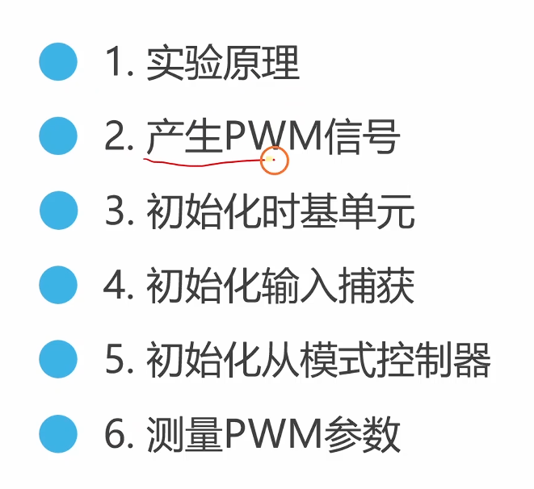
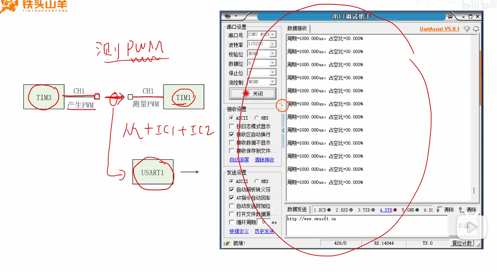
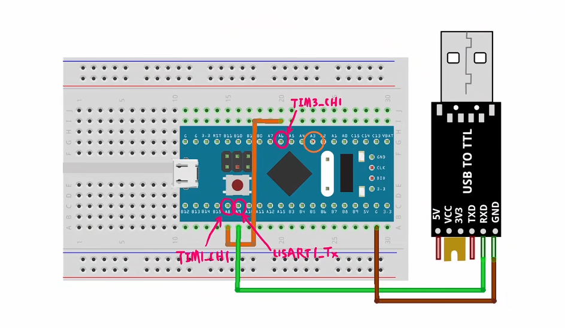
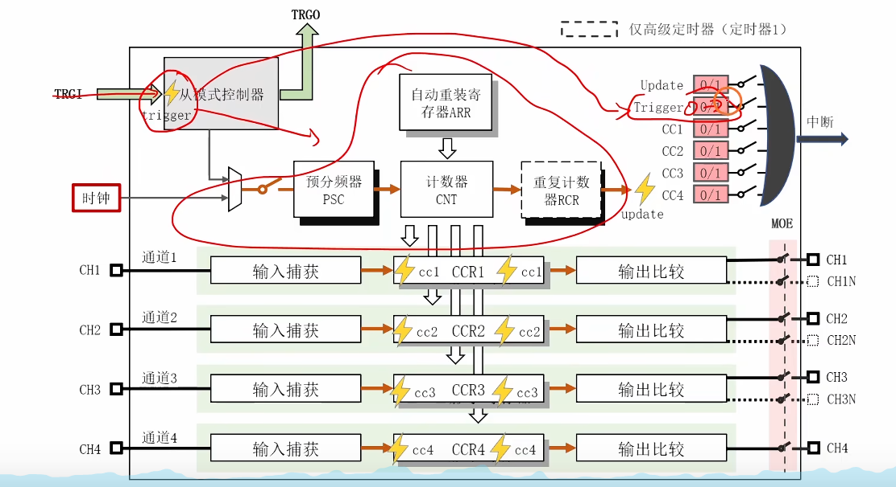
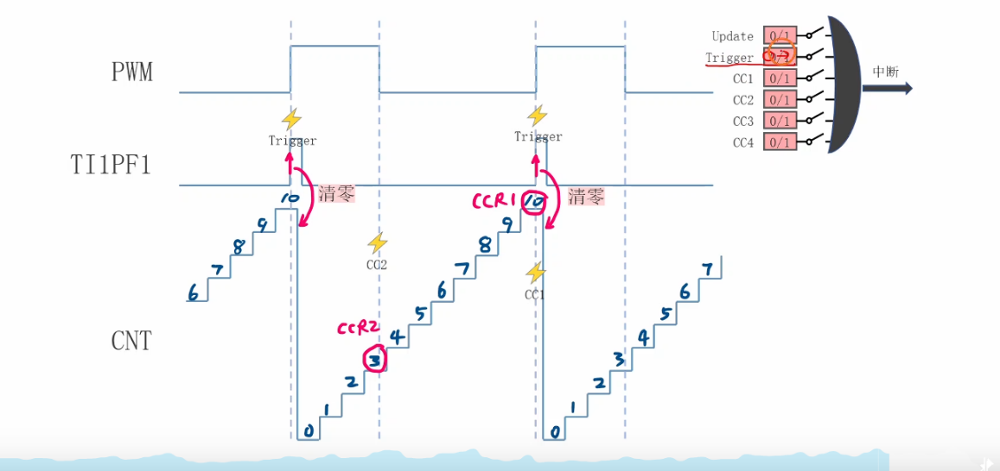
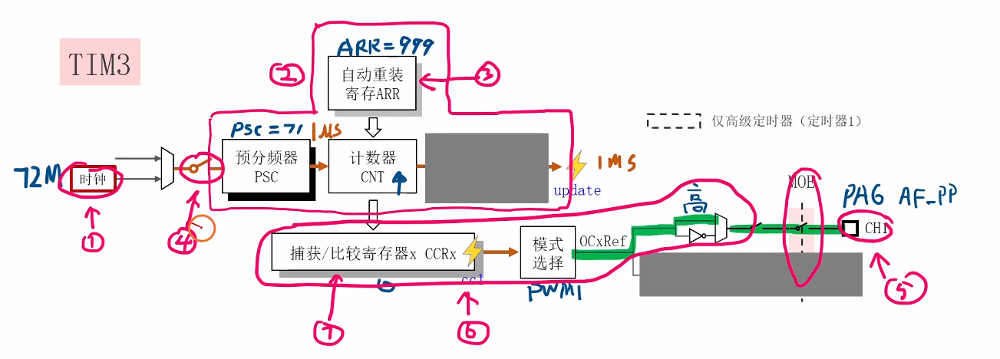
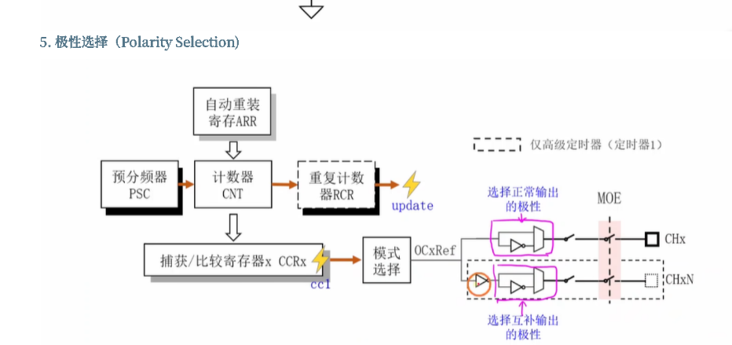
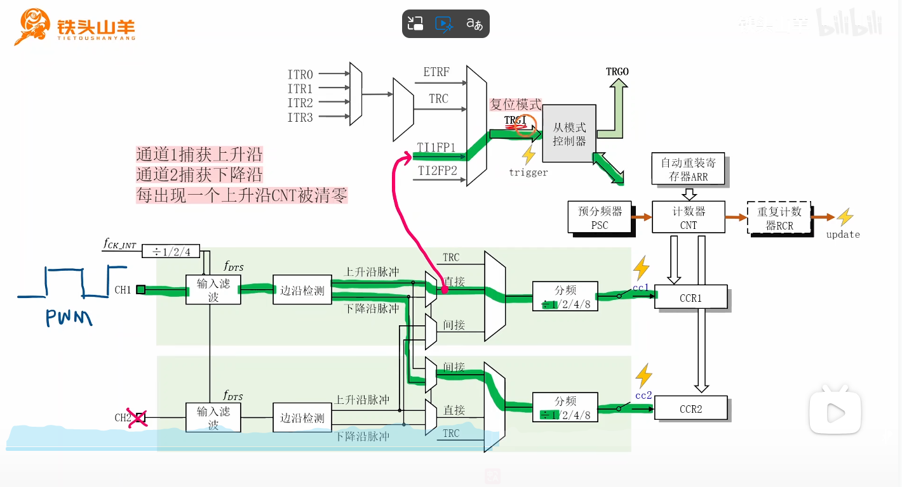
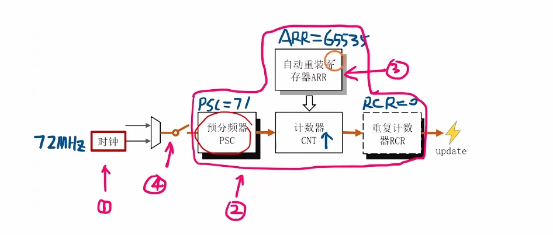
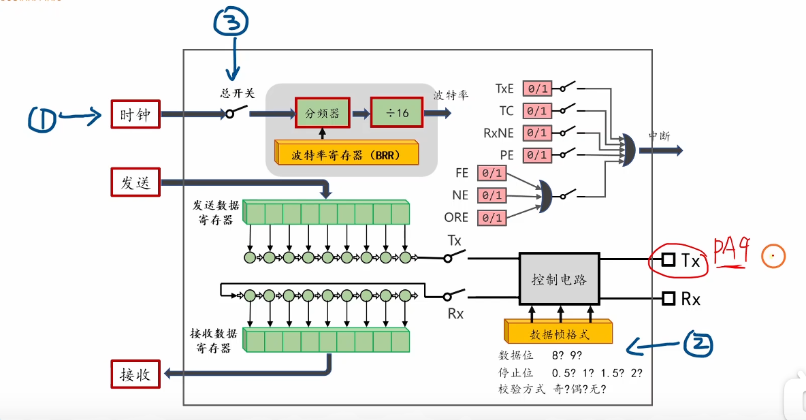

好的，我为你分析了你上传的这个STM32教程视频，并为你准备了面试所需的扩展知识点和问题。

这是一个非常经典的STM32定时器高级应用实验，面试中经常会考察到。




# 视频内容分析总结


这个视频（铁头山羊STM32教程 9.9. PWM参数测量实验）详细演示了<span style="color:#CC0000;">如何使用一个STM32定时器（TIM1）去测量由另一个定时器（TIM3）产生的PWM信号</span>的**周期（频率）**和**占空比**。

这是一个“自发自收”的实验，非常适合用来学习和验证定时器的高级功能。

**1. 实验设计思路：**

- **信号产生 (PWM Output):** 使用一个通用定时器 `TIM3` 的 `CH1` (PA6) 作为PWM输出口，产生一个频率为1KHz（周期1ms）、占空比动态变化的PWM信号（视频中使用了正弦波来模拟“呼吸灯”效果）。

  

- **信号测量 (PWM Input):** 使用高级定时器 `TIM1`，将 `TIM3` 的PWM输出引脚(PA6) **物理连接** 到 `TIM1` 的 `CH1` 输入引脚(PA8)。

  

- **结果上报 (USART):** 使用 `USART1` 将 `TIM1` 测量到的周期和占空比数据打印到电脑的串口助手中。


**2. 核心技术：TIM1的PWM输入模式 (PWM Input Mode)**

这是<span style="color:#CC0000;">整个实验最关键的技术点</span>。视频中没有使用传统的中断方法，而是使用了一种更精妙、纯硬件的“从模式控制器”方案来自动完成测量。

其配置原理如下：

- **时基 (Timebase):** 配置 `TIM1` 的计数器时钟为 1MHz (预分频PSC=71，即72MHz/(71+1))。这意味着计数器（CNT）每1微秒（1us）加1。计数器周期（ARR）设为最大值 `65535`，防止溢出。

- **通道1 (IC1):** 配置为**直接输入捕获**，捕获 `TI1FP1` 信号的 **“上升沿”**。

- **通道2 (IC2):** 配置为**间接输入捕获**，捕获 `TI1FP2` 信号的 **“下降沿”**。（`TI1FP1` 和 `TI1FP2` 都来自同一个物理引脚PA8，但极性可以不同）。

- **从模式 (Slave Mode):** 配置 `TIM1` 的从模式控制器为 **“Reset Mode（复位模式）”**。

- **触发源 (Trigger):** 选择 `TI1FP1` (即通道1的信号) 作为从模式的触发源（TRGI）。

  

**3. 测量工作流 (纯硬件自动完成):**

1. **等待第一个上升沿：** PWM信号的第一个上升沿通过 `TI1FP1` 触发了从模式控制器。

2. **复位：** 计数器 `CNT` **立即被硬件复位清零**。

3. **开始计时：** `CNT` 从 0 开始以 1MHz 的频率自增。

4. **捕获下降沿：** 信号变为低电平（下降沿）。`TI1FP2` 触发了通道2（IC2）。硬件**自动将当前 `CNT` 的值锁存（Capture）到 `CCR2` 寄存器中**。此时 `CCR2` 的值就是高电平的持续时间（脉冲宽度）。

5. **捕获上升沿：** 信号再次变为高电平（第二个上升沿）。`TI1FP1` 触发了通道1（IC1）。硬件**自动将当前 `CNT` 的值锁存到 `CCR1` 寄存器中**。此时 `CCR1` 的值就是整个信号的周期。

6. **再次复位：** 同时，这个上升沿也再次触发了从模式控制器，`CNT` 再次被复位清零。

7. 循环第3步。

   

<span style="font-weight:bold;">4. 软件的工作</span>

在 main 循环中，软件要做的只是等待硬件的标志位（视频中等待的是 TIM_FLAG_Trigger 触发标志位），然后去读取 CCR1 和 CCR2 两个寄存器的值即可。

- `周期 (单位: us) = CCR1 的值` (因为1个tick是1us)
- `脉宽 (单位: us) = CCR2 的值`
- `占空比 = (float)CCR2 / (float)CCR1 * 100.0f`

------


# 完整实验代码

当然，很高兴能为你提供帮助。

为了让你为面试做好充分准备，我将视频中展示的、用于实现“PWM参数测量”的**完整工程代码**都提取了出来，并全部使用**STM32F10x标准库**函数编写。

这个工程包含以下几个关键模块：

1. **`main.c`**: 主函数，负责调用初始化并循环执行测量和打印。
2. **`pwm_output`**: (TIM3) 用于在 PA6 引脚上**产生**一个1KHz的PWM信号作为“待测信号”。
3. **`pwm_input`**: (TIM1) 用于在 PA8 引脚上**测量**该PWM信号的周期和占空比，使用了核心的“PWM输入模式”。
4. **`usart`**: (USART1) 用于在 PA9 引脚上将测量结果**打印**到电脑。
5. **`delay`**: (SysTick) 提供 `delay_ms` 延时，用于控制打印速度。

> **重要提示：** 运行此代码时，你需要**在开发板上用一根杜邦线将 PA6 引脚连接到 PA8 引脚**，以实现“自发自收”。

------


### 1. `main.c` (主函数)





```c
#include "stm32f10x.h"
#include "delay.h"      // Systick 延时
#include "usart.h"      // 串口打印
#include "pwm_output.h" // TIM3 PWM输出
#include "pwm_input.h"  // TIM1 PWM输入
#include <stdio.h>      // 用于 My_USART_Printf

int main(void)
{
    // 定义用于存储捕获值的变量
    uint16_t ccr1_val = 0; // 存储 CCR1 的值 (周期)
    uint16_t ccr2_val = 0; // 存储 CCR2 的值 (脉宽)
    
    // 定义用于计算结果的浮点变量
    float period = 0.0f; // 周期 (单位: ms)
    float duty   = 0.0f; // 占空比 (单位: %)

    // 初始化模块
    delay_init();       // SysTick 延时初始化
    App_USART1_Init();  // 串口1 初始化 (115200, Tx)
    App_TIM3_Init();    // TIM3 PWM输出初始化 (PA6, 1KHz)
    App_TIM1_Init();    // TIM1 PWM输入初始化 (PA8)
    
    // 给 TIM3 设置一个初始占空比 (200 / (999+1) = 20%)
    // 这样 TIM1 一上电就有信号可以测量
    TIM_SetCompare1(TIM3, 200);

    while(1)
    {
        /* --- 1. 等待 TIM1 硬件完成一次测量 --- */
        
        // (1) 清除 TIM1 的触发标志位，为下次捕获做准备
        TIM_ClearFlag(TIM1, TIM_FLAG_Trigger); 
        
        // (2) 阻塞式等待，直到 TIM1 触发标志位被硬件置1
        // (当下一个上升沿到来，完成周期(CCR1)捕获并复位计数器时，该标志位置位)
        while (TIM_GetFlagStatus(TIM1, TIM_FLAG_Trigger) == RESET);
        
        /* --- 2. 从硬件寄存器中读取测量结果 --- */
        
        // (3) 读取 CCR1 寄存器的值，它自动锁存了周期的计数值
        ccr1_val = TIM_GetCapture1(TIM1);
        
        // (4) 读取 CCR2 寄存器的值，它自动锁存了脉宽的计数值
        ccr2_val = TIM_GetCapture2(TIM1);

        /* --- 3. 计算并打印结果 --- */
        
        // (5) 计算周期 (单位: 毫秒)
        // TIM1 时钟为 1MHz (1us/tick), 所以 ccr1_val 的单位就是 us
        // ccr1_val * 1.0e-3f 即可将 us 转换为 ms
        period = (float)ccr1_val * 1.0e-3f; 
        
        // (6) 计算占空比
        duty = (float)ccr2_val / ccr1_val * 100.0f;
        
        // (7) 通过串口打印结果
        My_USART_Printf(USART1, "周期=%.3fms, 占空比=%.2f%%\r\n", period, duty);
        
        // (8) 延时100ms，防止打印过快刷屏
        delay_ms(100);
    }
}
```


### 2. `pwm_output.h` (TIM3 PWM输出)

```c
#ifndef __PWM_OUTPUT_H
#define __PWM_OUTPUT_H

#include "stm32f10x.h"

void App_TIM3_Init(void);

#endif // __PWM_OUTPUT_H
```


### 3. `pwm_output.c` (TIM3 PWM输出)





```c
#include "pwm_output.h"

/**
  * @brief  初始化 TIM3 为 PWM 输出模式
  * @param  None
  * @retval None
  * @note   PA6 (TIM3_CH1), PWM频率 = 72M / (PSC+1) / (ARR+1) = 72M / 72 / 1000 = 1KHz
  */
void App_TIM3_Init(void)
{
    GPIO_InitTypeDef GPIO_InitStruct;
    TIM_TimeBaseInitTypeDef TIM_TimeBaseInitStruct;
    TIM_OCInitTypeDef TIM_OCInitStruct;

    // 1. 开启时钟
    RCC_APB1PeriphClockCmd(RCC_APB1Periph_TIM3, ENABLE);  // 开启 TIM3 时钟
    RCC_APB2PeriphClockCmd(RCC_APB2Periph_GPIOA, ENABLE); // 开启 GPIOA 时钟

    // 2. 配置 GPIO (PA6) 为复用推挽输出
    GPIO_InitStruct.GPIO_Pin   = GPIO_Pin_6;
    GPIO_InitStruct.GPIO_Mode  = GPIO_Mode_AF_PP; // 复用推挽输出
    GPIO_InitStruct.GPIO_Speed = GPIO_Speed_2MHz;
    GPIO_Init(GPIOA, &GPIO_InitStruct);

    // 3. 配置 TIM3 时基单元
    TIM_TimeBaseStructInit(&TIM_TimeBaseInitStruct); // 使用默认值
    TIM_TimeBaseInitStruct.TIM_Period        = 999;  // ARR (自动重装载值)
    TIM_TimeBaseInitStruct.TIM_Prescaler     = 71;   // PSC (预分频值)
    TIM_TimeBaseInitStruct.TIM_CounterMode   = TIM_CounterMode_Up; // 向上计数
    TIM_TimeBaseInit(TIM3, &TIM_TimeBaseInitStruct);

    // 4. 配置 TIM3_CH1 输出比较单元
    TIM_OCStructInit(&TIM_OCInitStruct); // 使用默认值
    TIM_OCInitStruct.TIM_OCMode       = TIM_OCMode_PWM1;         // PWM1 模式
    TIM_OCInitStruct.TIM_OutputState  = TIM_OutputState_Enable;  // 使能输出
    TIM_OCInitStruct.TIM_Pulse        = 0;                       // CCR (初始占空比为0)
    TIM_OCInitStruct.TIM_OCPolarity   = TIM_OCPolarity_High;     // 高电平有效
    TIM_OC1Init(TIM3, &TIM_OCInitStruct);

    // 5. 使能预装载寄存器
    TIM_OC1PreloadConfig(TIM3, TIM_OCPreload_Enable); // 使能 CCR1 预装载
    TIM_ARRPreloadConfig(TIM3, ENABLE);               // 使能 ARR 预装载

    // 6. 启动 TIM3
    TIM_Cmd(TIM3, ENABLE);
}
```


### 4. `pwm_input.h` (TIM1 PWM输入)

```c
#ifndef __PWM_INPUT_H
#define __PWM_INPUT_H

#include "stm32f10x.h"

void App_TIM1_Init(void);

#endif // __PWM_INPUT_H
```


### 5. `pwm_input.c` (TIM1 PWM输入)





```c
#include "pwm_input.h"

/**
  * @brief  初始化 TIM1 为 PWM 输入模式
  * @param  None
  * @retval None
  * @note   PA8 (TIM1_CH1)
  * 使用 TIM1_CH1 和 TIM1_CH2 配合从模式控制器实现
  * 时钟 = 72M / (PSC+1) = 72M / 72 = 1MHz (1us/tick)
  */
void App_TIM1_Init(void)
{
    GPIO_InitTypeDef GPIO_InitStruct;
    TIM_TimeBaseInitTypeDef TIM_TimeBaseInitStruct;
    TIM_ICInitTypeDef TIM_ICInitStruct;

    // 1. 开启时钟 (TIM1 和 GPIOA 都在 APB2)
    RCC_APB2PeriphClockCmd(RCC_APB2Periph_TIM1, ENABLE);
    RCC_APB2PeriphClockCmd(RCC_APB2Periph_GPIOA, ENABLE);

    // 2. 配置 GPIO (PA8) 为输入模式
    GPIO_InitStruct.GPIO_Pin  = GPIO_Pin_8;
    GPIO_InitStruct.GPIO_Mode = GPIO_Mode_IPD; // 下拉输入 (或使用浮空输入 GPIO_Mode_IN_FLOATING)
    GPIO_Init(GPIOA, &GPIO_InitStruct);
    GPIO_SetBits(GPIOA, GPIO_Pin_8); // 内部下拉

    // 3. 配置 TIM1 时基单元
    TIM_TimeBaseStructInit(&TIM_TimeBaseInitStruct);
    TIM_TimeBaseInitStruct.TIM_Period        = 65535; // ARR 设为最大值
    TIM_TimeBaseInitStruct.TIM_Prescaler     = 71;    // PSC (72MHz / 72 = 1MHz)
    TIM_TimeBaseInitStruct.TIM_CounterMode   = TIM_CounterMode_Up;
    TIM_TimeBaseInitStruct.TIM_RepetitionCounter = 0; // 高级定时器需要设置
    TIM_TimeBaseInit(TIM1, &TIM_TimeBaseInitStruct);
    TIM_ARRPreloadConfig(TIM1, ENABLE);

    // 4. 配置输入捕获通道 1 (IC1) - 用于测量周期
    TIM_ICStructInit(&TIM_ICInitStruct);
    TIM_ICInitStruct.TIM_Channel     = TIM_Channel_1;          // 选择通道1
    TIM_ICInitStruct.TIM_ICPolarity  = TIM_ICPolarity_Rising;  // 上升沿捕获
    TIM_ICInitStruct.TIM_ICSelection = TIM_ICSelection_DirectTI; // 直接输入
    TIM_ICInitStruct.TIM_ICPrescaler = TIM_ICPSC_DIV1;          // 不分频
    TIM_ICInitStruct.TIM_ICFilter    = 0;                      // 不滤波
    TIM_ICInit(TIM1, &TIM_ICInitStruct);

    // 5. 配置输入捕获通道 2 (IC2) - 用于测量脉宽
    TIM_ICStructInit(&TIM_ICInitStruct);
    TIM_ICInitStruct.TIM_Channel     = TIM_Channel_2;            // 选择通道2
    TIM_ICInitStruct.TIM_ICPolarity  = TIM_ICPolarity_Falling;   // 下降沿捕获
    TIM_ICInitStruct.TIM_ICSelection = TIM_ICSelection_IndirectTI; // 间接输入 (捕获 TI1FP2)
    TIM_ICInitStruct.TIM_ICPrescaler = TIM_ICPSC_DIV1;            // 不分频
    TIM_ICInitStruct.TIM_ICFilter    = 0;                        // 不滤波
    TIM_ICInit(TIM1, &TIM_ICInitStruct);

    // 6. 配置从模式控制器
    // (1) 选择 TI1FP1 (即通道1的信号) 作为触发源 (TRGI)
    TIM_SelectInputTrigger(TIM1, TIM_TS_TI1FP1);
    // (2) 选择 "Reset Mode" (复位模式)
    TIM_SelectSlaveMode(TIM1, TIM_SlaveMode_Reset);

    // 7. 启动 TIM1
    TIM_Cmd(TIM1, ENABLE);
}
```


### 6. `usart.h` (串口)

```c
#ifndef __USART_H
#define __USART_H

#include "stm32f10x.h"
#include <stdio.h>
#include <stdarg.h>

void App_USART1_Init(void);
void My_USART_SendString(USART_TypeDef* USARTx, char *str);
void My_USART_Printf(USART_TypeDef* USARTx, char *format, ...);

#endif // __USART_H
```


### 7. `usart.c` (串口)



```c
#include "usart.h"

/**
  * @brief  初始化 USART1 (PA9-Tx)
  * @param  None
  * @retval None
  * @note   BaudRate: 115200, 8-N-1, 仅发送
  */
void App_USART1_Init(void)
{
    GPIO_InitTypeDef GPIO_InitStruct;
    USART_InitTypeDef USART_InitStruct;

    // 1. 开启时钟
    RCC_APB2PeriphClockCmd(RCC_APB2Periph_GPIOA, ENABLE);
    RCC_APB2PeriphClockCmd(RCC_APB2Periph_USART1, ENABLE);

    // 2. 配置 GPIO (PA9 - TX)
    GPIO_InitStruct.GPIO_Pin   = GPIO_Pin_9;
    GPIO_InitStruct.GPIO_Mode  = GPIO_Mode_AF_PP; // 复用推挽输出
    GPIO_InitStruct.GPIO_Speed = GPIO_Speed_10MHz;
    GPIO_Init(GPIOA, &GPIO_InitStruct);

    // 3. 配置 USART1
    USART_InitStruct.USART_BaudRate            = 115200;
    USART_InitStruct.USART_WordLength          = USART_WordLength_8b;
    USART_InitStruct.USART_StopBits            = USART_StopBits_1;
    USART_InitStruct.USART_Parity              = USART_Parity_No;
    USART_InitStruct.USART_HardwareFlowControl = USART_HardwareFlowControl_None;
    USART_InitStruct.USART_Mode                = USART_Mode_Tx; // 只使用发送模式
    USART_Init(USART1, &USART_InitStruct);

    // 4. 启动 USART1
    USART_Cmd(USART1, ENABLE);
}

/**
  * @brief  通过串口发送一个字符串
  * @param  USARTx: 串口号 (例如 USART1)
  * @param  str:    要发送的字符串指针
  * @retval None
  */
void My_USART_SendString(USART_TypeDef* USARTx, char *str)
{
    while(*str)
    {
        USART_SendData(USARTx, *str++);
        // 等待发送数据寄存器变空
        while(USART_GetFlagStatus(USARTx, USART_FLAG_TXE) == RESET);
    }
}

/**
  * @brief  串口格式化打印函数
  * @param  USARTx: 串口号 (例如 USART1)
  * @param  format: 格式化字符串
  * @param  ...:    可变参数
  * @retval None
  */
void My_USART_Printf(USART_TypeDef* USARTx, char *format, ...)
{
    char buffer[128]; // 缓冲区
    va_list args;

    // 初始化可变参数
    va_start(args, format);
    // 将格式化字符串和参数合成到 buffer 中
    vsprintf(buffer, format, args);
    // 结束可变参数
    va_end(args);
    
    // 发送合成后的字符串
    My_USART_SendString(USARTx, buffer);
}
```


### 8. `delay.h` (SysTick 延时)

```c
#ifndef __DELAY_H
#define __DELAY_H

#include "stm32f10x.h"

void delay_init(void);
void delay_ms(uint32_t nms);
void delay_us(uint32_t nus);

#endif // __DELAY_H
```


### 9. `delay.c` (SysTick 延时)

```C
#include "delay.h"

static __IO uint32_t fac_us = 0; // us延时倍乘数
static __IO uint32_t fac_ms = 0; // ms延时倍乘数

/**
  * @brief  初始化 SysTick
  * @param  None
  * @retval None
  */
void delay_init(void)
{
    // 选择 HCLK/8 作为 SysTick 时钟源
    SysTick_CLKSourceConfig(SysTick_CLKSource_HCLK_Div8);
    fac_us = SystemCoreClock / 8000000; // 72MHz / 8 = 9MHz
    fac_ms = fac_us * 1000;
}

/**
  * @brief  微秒级延时
  * @param  nus: 要延时的微秒数
  * @retval None
  */
void delay_us(uint32_t nus)
{
    uint32_t temp;
    SysTick->LOAD = nus * fac_us; // 加载计数值
    SysTick->VAL  = 0x00;         // 清空当前计数值
    SysTick->CTRL |= SysTick_CTRL_ENABLE_Msk; // 开启计数器
    
    do
    {
        temp = SysTick->CTRL;
    } while ((temp & 0x01) && !(temp & (1 << 16))); // 等待时间到达
    
    SysTick->CTRL &= ~SysTick_CTRL_ENABLE_Msk; // 关闭计数器
    SysTick->VAL  = 0x00;                      // 清空当前计数值
}

/**
  * @brief  毫秒级延时
  * @param  nms: 要延时的毫秒数
  * @retval None
  */
void delay_ms(uint32_t nms)
{
    uint32_t temp;
    SysTick->LOAD = nms * fac_ms; // 加载计数值
    SysTick->VAL  = 0x00;         // 清空当前计数值
    SysTick->CTRL |= SysTick_CTRL_ENABLE_Msk; // 开启计数器
    
    do
    {
        temp = SysTick->CTRL;
    } while ((temp & 0x01) && !(temp & (1 << 16))); // 等待时间到达
    
    SysTick->CTRL &= ~SysTick_CTRL_ENABLE_Msk; // 关闭计数器
    SysTick->VAL  = 0x00;                      // 清空当前计数值
}
```


# 💡 知识扩展与补充


视频中的方法非常巧妙，但在面试中，面试官更希望你了解不同方法的优劣和取舍。

**1. 局限性分析 (视频中方法的缺点):**

- **资源占用：** 这种“PWM输入模式”虽然巧妙，但它**独占了整个定时器的从模式控制器**，并且同时使用了 `CH1` 和 `CH2` 两个捕获通道。这意味着一个TIM1定时器**只能测量1路**PWM信号。
- **精度问题：** 精度受限于定时器的时钟频率。视频中用1MHz (1us精度) 去测量1000us的周期，精度是 1/1000 (0.1%)，这很不错。但如果要测量一个1MHz (1us周期) 的PWM波，1us的采样精度显然是完全不够的。
- **主循环查询 (Polling)：** 视频中的 `while(1)` 循环里使用了 `while (TIM_GetFlagStatus(...) == RESET);` 这种**轮询（Polling）**方式。这是**阻塞式代码**，在等待标志位时，CPU什么也干不了，极大地浪费了CPU资源。在实际的嵌入式项目中（例如RTOS中），这是**绝对禁止**的，它会导致整个任务卡死，其他任务无法执行。


**2. 替代方案：单通道双边沿中断法**

这是一个更常用、更节省资源的方法，你必须掌握。

- **配置：**
  1. 只使用一个定时器通道，例如 `TIM1_CH1`。
  2. 将其配置为输入捕获，并设置为 **“双边沿触发”** (`TIM_ICPolarity_BothEdge`)。
  3. 开启 `TIM_IT_CC1` 捕获中断。
  4. 定时器时基正常配置（例如1us精度，ARR设为最大）。
- **中断服务函数 (ISR) 逻辑：**
  - 在 `TIM1_CC_IRQHandler` 中，你需要写一个小的状态机。
  - **状态0 (等待上升沿)：** 捕获中断发生，读取 `CCR1` 的值存为 `T1`。然后，**立即手动切换捕获极性为“下降沿”** (`TIM_OC1PolarityConfig(TIM1, TIM_ICPolarity_Falling)`)。
  - **状态1 (等待下降沿)：** 捕获中断发生，读取 `CCR1` 的值存为 `T2`。计算**脉宽** `Pulse = T2 - T1`。然后，**立即手动切换捕获极性为“上升沿”**。
  - **状态2 (等待下一个上升沿)：** 捕获中断发生，读取 `CCR1` 的值存为 `T3`。计算**周期** `Period = T3 - T1`。然后，将 `T1` 更新为 `T3` (`T1 = T3`)，**并再次切换捕获极性为“下降沿”**，回到状态1。
- **优劣对比：**
  - **优点：** 非阻塞（中断驱动）；只用1个IC通道，所以TIM1（有4个通道）最多能同时测4路不同的PWM。
  - **缺点：** 逻辑更复杂（要写状态机）；中断开销大（每个周期进两次中断）。


**3. 终极方案：DMA + 定时器**

当PWM频率非常高，或者需要测量的路数非常多时，CPU连响应中断都来不及，这时必须用DMA。

- **配置：** 使用视频中的“PWM输入模式”配置（TIM1+CH1+CH2+Reset Mode）。
- **DMA配置：**
  1. 配置 `DMA_Channel_X`，当 `TIM1_CC1` (通道1捕获) 事件发生时，自动将 `TIM1->CCR1` 寄存器的值传输到内存中的 `Period_Value` 变量。
  2. 配置 `DMA_Channel_Y`，当 `TIM1_CC2` (通道2捕获) 事件发生时，自动将 `TIM1->CCR2` 寄存器的值传输到内存中的 `Pulse_Value` 变量。
- **工作流：** 信号输入后，硬件自动复位、自动捕获、自动通过DMA将结果存入内存。CPU**全程零参与**，`main` 循环里只需要在需要的时候去读取 `Period_Value` 和 `Pulse_Value` 两个变量即可，它们永远是最新值。
- **优点：** 零CPU开销，非阻塞，性能最强，适用于高速信号处理。

------


# 🎤 嵌入式面试经典问题


以下是针对此视频内容为你准备的，由浅入深、层层递进的面试问题，帮助你展示对定时器系统的深刻理解。

**问题 1：【基础】请简述你如何使用STM32定时器测量一个PWM信号的频率和占空比？**

> 简洁回复：
>
> 我会使用定时器的一个输入捕获(IC)通道。
>
> 1. **测频率/周期：** 配置该通道为**上升沿捕获**，并开启捕获中断。在中断中，连续捕获两次上升沿的时间戳T1和T2，那么周期就是 `T2 - T1`。频率就是定时器时钟频率除以这个周期差值。
> 2. **测占空比：** 在此基础上，将捕获通道配置为**双边沿（上升沿和下降沿）都触发中断**。在中断中，通过一个状态机，分别记录上升沿时间T_Rise和下降沿时间T_Fall，以及下一个上升沿时间T_Rise_Next。
>    - `脉宽 = T_Fall - T_Rise`
>    - `周期 = T_Rise_Next - T_Rise`
>    - `占空比 = (脉宽 / 周期) * 100%`

**问题 2：【进阶】视频中使用了一种特殊的“PWM输入模式”，它只用一个引脚(TIM1_CH1)就同时得到了周期(CCR1)和脉宽(CCR2)。你能解释它的硬件原理吗？**

> 简洁回复：
>
> 这是利用了定时器的从模式控制器(Slave Mode Controller)。
>
> 1. 它将 `TIM1_CH1` 的输入信号 `TI1FP1` **同时映射**给了两个内部通道：`IC1` 和 `IC2`。
> 2. `IC1` 被配置为**上升沿**捕获，`IC2` 被配置为**下降沿**捕获（通过间接映射）。
> 3. 最关键的是，它配置从模式为 **“复位模式(Reset Mode)”**，并选择 `TI1FP1`（即上升沿）作为触发信号。
> 4. 这样，**每个上升沿**都会把计数器CNT**清零**。`IC2`（下降沿）捕获到的值 `CCR2` 自然就是高电平时间（脉宽）；而 `IC1`（下一个上升沿）捕获到的值 `CCR1` 就是完整周期。

**问题 3：【取舍】“PWM输入模式”和“双边沿中断法”这两种测量方式，你认为它们各有什么优缺点？在项目中你会如何选择？**

> **简洁回复：**
>
> - PWM输入模式（视频中的方法）：
>
>   \* 优点： 硬件全自动，CPU负载低（只需读取寄存器），时序精准。
>
>   \* 缺点： 资源消耗大，一个定时器（如TIM1）只能测1路PWM。

- **双边沿中断法（问题1中的方法）：**
  - **优点：** 资源占用少，1个定时器可以测多达4路PWM。
  - **缺点：** CPU负载高（每个周期2次中断），中断响应的延迟会轻微影响高频信号的测量精度。
- **选择：**
  - 如果我**只需要测1路**PWM，且CPU较忙，我会选“PWM输入模式”。
  - 如果我需要**同时测量2路或更多**的PWM信号，我**必须**使用“双边沿中断法”。

**问题 4：【系统】视频中在while(1)里轮询等待标志位。在实际项目中（比如一个有RTOS的系统），这种做法有什么隐患？你会如何优化？**

> **简洁回复：**
>
> - **隐患：** 这是**阻塞式（Blocking）\**代码。它会\**“霸占”CPU**，导致当前任务无法释放CPU资源，其他同优先级或低优先级的任务（如按键扫描、屏幕刷新）将**“饿死”**，系统响应性会变得极差。如果PWM信号意外停止，程序将**永久卡死**在这个while循环。
> - **优化：**
>   1. **中断法：** 改为使用**捕获中断**（`TIM_IT_CC1` 和 `TIM_IT_CC2`）。在中断服务函数（ISR）中读取 `CCR1` 和 `CCR2` 的值，并设置一个“数据准备好”的标志位或发送信号量。`main` 循环或业务任务只检查这个标志位，完全不阻塞。
>   2. **DMA法：** 这是最好的方法。配置定时器的CC1和CC2事件触发**DMA**，让DMA自动把 `CCR1` 和 `CCR2` 寄存器的值搬运到内存变量中。CPU全程不参与，实现了**“零CPU开销”**的测量。

**问题 5：【深入】在配置输入捕获时，有一个“输入滤波器(IC Filter)”参数，视频中设为0。这个参数有什么用？在什么场景下必须使用它？**

> **简洁回复：**
>
> - **作用：** “输入滤波器”用于**硬件去抖动**，防止输入信号上的**噪声或毛刺（Glitches）**被误判为有效的上升沿或下降沿。

- **原理：** 它不是一个模拟滤波器，而是一个**数字采样器**。它以一个时钟频率（例如f_CK_INT）对输入引脚进行连续采样。只有当它**连续采样N次**（N就是你设置的滤波值）都得到相同的新电平时，它才认为这个电平跳变是有效的，并触发捕获事件。
- **场景：** 当测量的PWM信号来自**板外**（例如另一个设备、电机编码器、红外接收头）时，信号线很长，非常容易受到干扰。如果不加滤波，一个小的干扰脉冲就可能导致定时器计数器被错误复位或捕获，导致该周期的测量数据（周期和占空比）发生严重跳变。在这种场景下，**必须开启滤波器**（例如设为4或8）来保证测量的鲁棒性。

希望这些分析和问题对你的面试准备有帮助！

你希望我再帮你深入讲解一下"双边沿中断法"的代码实现逻辑吗？