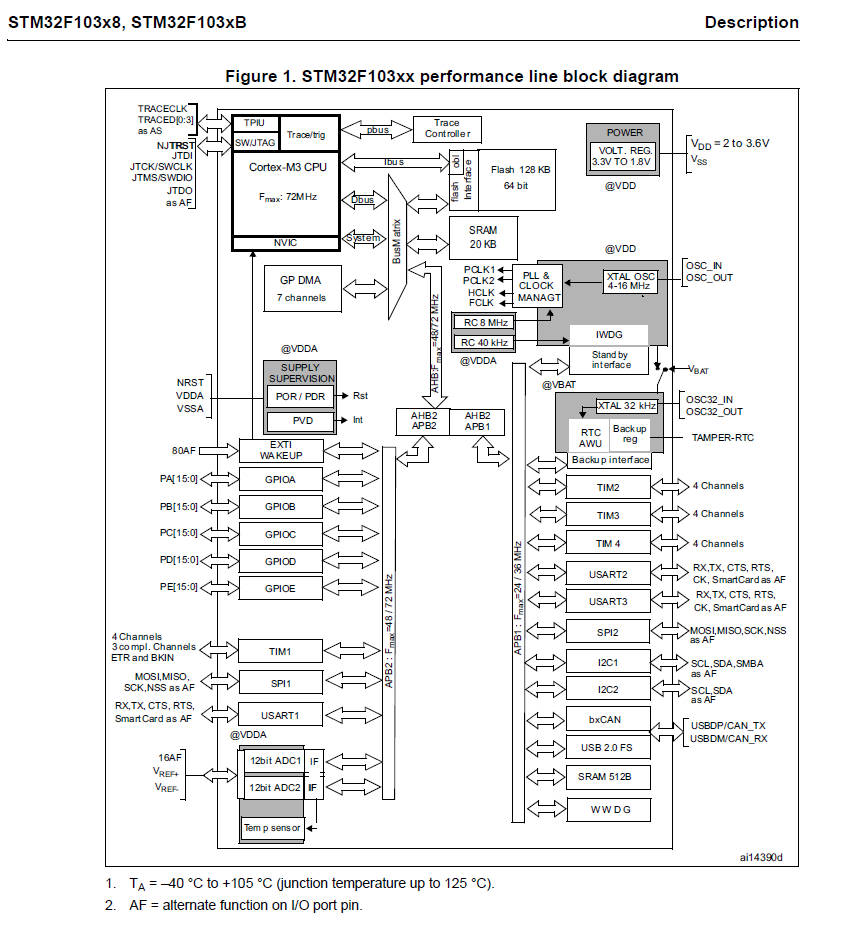

# 2.1 GPIO的4种输出模式

单片机内部结构框图（数据手册11页）：

## gemini

好的，这张图是STM32F103xx 系列微控制器（单片机）的性能线（Performance Line）框图，它详细展示了该系列芯片内部的主要功能模块、总线连接以及数据流向。我将为你详细解释每个部分：

**1. 核心（Core）部分：**

- Cortex-M3 CPU：

  - 这是微控制器的中央处理单元，基于ARM的Cortex-M3架构。它是整个芯片的大脑，负责执行程序指令、处理数据和控制所有外设。
  - **Max Freq: 72MHz：** 表示CPU的最高工作频率可达72兆赫兹，这决定了芯片的运算速度。

- NVIC (Nested Vectored Interrupt Controller)：

  - 嵌套向量中断控制器。它负责管理和处理微控制器接收到的所有中断请求。当某个外设需要CPU处理时，NVIC会根据中断的优先级来决定哪个中断先被响应，并跳转到对应的中断服务程序。

- MPU (Memory Protection Unit)：

  - 内存保护单元。它提供对内存区域的访问权限控制，可以防止程序错误地访问或修改不应访问的内存区域，从而提高系统的稳定性和安全性。

- Trace Controller / TRACECLK, SWJTAG, JTCK/SWCLK, JTMS/SWDIO, JTDO, NRST, VDD, VSS：

  - 这些是调试和跟踪接口相关的部分。

  - **Trace Controller：** 用于在不影响CPU运行的情况下，实时捕获CPU的执行轨迹和数据，方便开发者进行高级调试。

  - TRACECLK, SWJTAG, JTCK/SWCLK, JTMS/SWDIO, JTDO：

     都是调试接口引脚，用于连接外部调试器（如J-Link, ST-Link）。

    - **SWJTAG：** 表示支持串行线调试（SWD）和联合测试行动组（JTAG）两种调试模式。
    - **JTCK/SWCLK, JTMS/SWDIO, JTDO：** 分别是JTAG/SWD的专用时钟、数据输入/输出和数据输出引脚。

  - **NRST, VDD, VSS：** 同样用于调试，但它们是通用的复位、电源和地引脚。

**2. 存储器（Memory）部分：**

- Flash Memory：
  - **128 KB (up to) / 64 KB (default)：** 这是程序存储器，用于存储用户编写的固件代码、常量数据等。它是非易失性的，即使断电也不会丢失数据。
  - **128 KB 或 64 KB：** 表示不同型号的STM32F103xx芯片可能具有不同容量的Flash。
- SRAM (Static Random Access Memory)：
  - **20 KB：** 静态随机存取存储器，用于存储程序运行时产生的变量、堆栈、临时数据等。它是易失性的，断电后数据会丢失。
- SRAM 512B：
  - 在CAN总线部分下面也有一个小的SRAM，容量为512字节，这通常是专用于CAN控制器的数据缓冲区。

**3. 时钟管理（Clock Management）部分：**

- OSC_IN / OSC_OUT (XTAL OSC 4-16 MHz)：
  - 高速外部晶体振荡器（HSE）引脚，用于连接外部晶振（4到16 MHz），提供高精度的主系统时钟源。
- PLL & PREDIV & HCLK & PCLK1 & PCLK2 & MANAGE.：
  - **PLL (Phase-Locked Loop)：** 锁相环，可以将输入时钟倍频到更高的频率，以满足CPU和外设的更高频率需求。
  - **PREDIV：** 预分频器，用于对PLL的输入时钟进行分频。
  - **HCLK (AHB Clock)：** 高速总线时钟，是CPU和AHB总线上外设的工作时钟。
  - **PCLK1 (APB1 Clock)：** 低速外设总线时钟，通常连接到一些速度要求不高的外设。
  - **PCLK2 (APB2 Clock)：** 高速外设总线时钟，通常连接到一些速度要求较高的外设。
  - **MANAGE.：** 指时钟管理逻辑，负责生成和分配各种时钟。
- **RC 8 MHz：** 内部高速RC振荡器，作为备用或无需外部晶振时的时钟源。
- **RC 40 KHz：** 内部低速RC振荡器，通常用于看门狗定时器或实时时钟的备用时钟。
- IWDG (Independent Watchdog)：
  - 独立看门狗定时器。用于监测程序是否“跑飞”或陷入死循环。如果在一定时间内没有“喂狗”（重置看门狗计数器），看门狗就会触发复位，使程序重新启动，提高系统可靠性。
- WWDG (Window Watchdog)：
  - 窗口看门狗定时器。与独立看门狗类似，但它在允许“喂狗”的时间窗口内操作，防止程序过早或过晚“喂狗”，更严格地监控程序执行。
- RTC (Real-Time Clock) Backup reg / XTAL 32 KHz / OSC32_IN / OSC32_OUT / TAMPER-RTC：
  - **RTC：** 实时时钟，提供精确的时间和日期信息，即使在主电源断电时也能通过备用电池（VBAT）继续工作。
  - **Backup reg：** 备份寄存器，用于存储少量在主电源断电后仍需保留的数据。
  - **XTAL 32 KHz / OSC32_IN / OSC32_OUT：** 低速外部晶体振荡器（LSE）引脚，用于连接32.768 kHz晶振，为RTC提供精确时钟源。
  - **TAMPER-RTC：** 篡改检测引脚，通常用于检测外部事件（如外壳打开），结合RTC功能，可以记录篡改时间。

**4. 电源管理（Power Management）部分：**

- POWER / VOLT. REG / @VDD 2 to 3.6V / VSS：
  - **POWER：** 电源管理模块。
  - **VOLT. REG：** 内部电压调节器，将外部供电电压（如3.3V）转换为芯片内部不同模块所需的工作电压。
  - **@VDD 2 to 3.6V：** 表示VDD供电范围为2V到3.6V。
- SUPPLY SUPERVISION / POR / PDR / PVD / Int：
  - **POR (Power-On Reset)：** 上电复位，芯片上电时自动复位。
  - **PDR (Power-Down Reset)：** 掉电复位，检测到电源电压低于某个阈值时复位。
  - **PVD (Programmable Voltage Detector)：** 可编程电压检测器，允许用户设置一个电压阈值，当电源电压低于该阈值时触发中断或复位。
  - **Int：** 指中断功能。
- **@VDDA, @VSSA：** 模拟电源和模拟地，用于ADC、DAC等模拟模块的独立供电。
- **@VBAT：** 备用电池供电引脚，用于RTC和备份寄存器。

**5. 总线（Bus）结构：**

- AHB (Advanced High-performance Bus) / AHB1 / AHB2：
  - 高性能总线，连接CPU、Flash、SRAM、DMA等高速模块。
- APB1 (Advanced Peripheral Bus 1)：
  - 低速外设总线1，连接一些速度相对较低的外设，如TIM2/3/4、USART2/3、SPI2、I2C1/2、CAN、USB等。
- APB2 (Advanced Peripheral Bus 2)：
  - 高速外设总线2，连接一些速度要求较高的外设，如GPIO、EXTI、TIM1、USART1、SPI1、ADC等。
- GP DMA (General Purpose DMA) / 7 channels：
  - 通用直接存储器访问控制器，有7个通道。DMA允许数据在外设和存储器之间直接传输，而无需CPU的干预，从而提高数据传输效率，减轻CPU负担。

**6. 外设（Peripherals）部分：**

左侧和右侧的方框代表了微控制器集成的各种外设，它们通过AHB或APB总线与CPU通信：

- EXTI (External Interrupt/Event Controller) / WAKEUP：

  - 外部中断/事件控制器。允许通过外部引脚的变化（上升沿、下降沿或双边沿）来触发中断或唤醒CPU。

- GPIO (General Purpose Input/Output) / PA[15:0], PB[15:0], PC[15:0], PD[15:0]：

  - 通用输入/输出端口。这些引脚可以配置为数字输入、数字输出、模拟输入、或作为其他外设的复用功能引脚。
    - PA[15:0]：Port A的0到15号引脚。
    - PB[15:0]：Port B的0到15号引脚。
    - PC[15:0]：Port C的0到15号引脚。
    - PD[15:0]：Port D的0到15号引脚。

- TIM (Timer) / TIM1, TIM2, TIM3, TIM4：

  - 定时器。用于生成延时、测量脉冲宽度、输出PWM（脉宽调制）信号、捕获输入信号等。
    - **TIM1：** 通常是高级控制定时器，功能更强大，常用于电机控制。
    - **TIM2, TIM3, TIM4：** 通常是通用定时器。

- USART (Universal Synchronous/Asynchronous Receiver/Transmitter) / USART1, USART2, USART3：

  - 通用同步/异步收发器（串口）。用于与其他设备进行串行通信，支持RS-232、RS-485等协议。
    - **RX, TX, CTS, RTS：** 接收、发送、清除发送、请求发送引脚。
    - **CK, SmartCard As AF：** 时钟引脚，以及智能卡模式下的复用功能。

- SPI (Serial Peripheral Interface) / SPI1, SPI2：

  - 串行外设接口。高速同步串行通信接口，常用于连接Flash、EEPROM、传感器、LCD等设备。
    - **MOSI, MISO, SCK, NSS：** 主机输出/从机输入、主机输入/从机输出、串行时钟、从机选择引脚。

- I2C (Inter-Integrated Circuit) / I2C1, I2C2：

  - 集成电路间总线。两线式串行通信接口，常用于连接EEPROM、传感器、显示器等。
    - **SCL, SDA：** 串行时钟线、串行数据线。
    - **SMBus As AF：** 系统管理总线协议下的复用功能。

- bxCAN (CAN Controller) / USB 2.0 FS：

  - bxCAN：

     CAN（Controller Area Network）控制器。用于汽车电子、工业控制等领域的多主通信总线。

    - **TX, RX, CAN_TX, CAN_RX：** CAN总线的发送和接收引脚。

  - USB 2.0 FS：

     USB全速（Full Speed）接口。用于与PC或其他USB设备通信。

    - **USBDM/CAN_RX, USBDP/CAN_TX：** USB数据线的负端和正端，有时与CAN总线引脚复用。

- 12bit ADC (Analog-to-Digital Converter) / ADC1, ADC2：

  - 12位模数转换器。将模拟信号（如电压、温度等）转换为数字信号，供CPU处理。
    - **4 Channels, 8 Channels, 16 Channels：** 表示ADC可以有不同数量的输入通道。
    - **Temp. p sensor (Temperature Sensor)：** 内部集成温度传感器，可以将芯片内部温度转换为模拟信号供ADC测量。
    - **VREF+, VREF-：** ADC的参考电压输入引脚，用于提高转换精度。

- DAC (Digital-to-Analog Converter) / 2 Channels：

  - 数模转换器。将数字信号转换为模拟信号（图中未明确标出DAC，但F103系列通常带有）。

- FSMC (Flexible Static Memory Controller)：

  - 灵活静态存储控制器。用于连接外部存储器（如SRAM、NOR Flash、NAND Flash）或其他并行接口设备。

**7. 备注（Notes）：**

1. TA = -40 °C to +105 °C (junction temperature up to 125 °C).：
   - 表示芯片的工作环境温度范围是-40摄氏度到+105摄氏度，芯片结温最高可达125摄氏度。
2. AF = alternate function on I/O port pin.：
   - AF 表示“复用功能”（Alternate Function）。这意味着一个GPIO引脚除了可以作为普通的输入/输出引脚外，还可以被配置为某个特定外设的功能引脚（例如，PA9可以作为USART1的TX引脚，也可以作为普通GPIO）。这是微控制器为了节省引脚数量而采用的常见设计。

**总结：**

这个框图清晰地展示了STM32F103xx单片机作为一个高性能嵌入式系统的构成：以Cortex-M3 CPU为核心，通过AHB和APB总线连接各种存储器（Flash、SRAM）和丰富的外设（定时器、串口、SPI、I2C、CAN、USB、ADC等），同时具备强大的时钟管理、电源管理和调试功能。理解这些模块的功能和它们之间的连接关系，是进行STM32单片机开发的基础。当你需要使用某个外设时，就需要查阅其对应的数据手册和参考手册，了解如何配置其寄存器来实现所需的功能。

