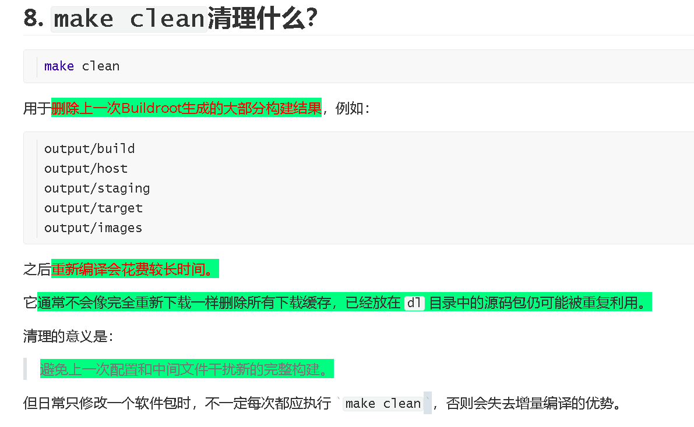

# 视频分析：使用 Buildroot 编译整套系统（IMX6ULL Pro，2025）

> 视频时长约 **4分12秒**。
> 本节不是只编译内核，而是使用 Buildroot 一次性构建 **U-Boot、Linux内核、设备树、根文件系统、软件包以及可烧写的完整系统镜像**。时间点可能有几秒误差。

------

## 1. 视频类型判断

**主要类型：** 教程类、操作演示类
**次要类型：** 嵌入式Linux系统构建、Buildroot使用、编译故障排查类

**判断依据：**

1. 介绍<span style="color:#FF0000; background:#00FF80;">Buildroot在嵌入式Linux系统构建中的作用</span>。
2. 演示同步SDK、选择板级配置和执行完整编译。
3. 展示下载源码失败后的排查与继续编译。
4. 解释 `output/images` 中各种镜像文件的用途。

------

## 2. 一句话总结

这个视频主要讲的是：

> **选择适配IMX6ULL Pro 512MB开发板的Buildroot配置，执行完整系统编译；Buildroot自动下载、配置和交叉编译U-Boot、内核、设备树、Qt5及根文件系统，最后在 `output/images` 中生成独立镜像和完整可烧写系统镜像。**

完整主线：

```text
选择开发板defconfig
        ↓
Buildroot生成.config
        ↓
下载各软件包源码
        ↓
构建交叉工具链和主机工具
        ↓
编译U-Boot、内核、设备树、Qt5和其他软件
        ↓
组装根文件系统
        ↓
生成各类独立镜像
        ↓
genimage组合完整系统镜像
```

------

## 3. 时间段拆解

| 时间段      | 内容概括                  | 画面/命令表现                                                | 作用                    |
| ----------- | ------------------------- | ------------------------------------------------------------ | ----------------------- |
| 00:00-00:30 | 介绍Buildroot及构建目标   | 教材介绍OpenWrt、Buildroot、Yocto，说明本章构建U-Boot、内核和文件系统 | 建立整体概念            |
| 00:30-01:04 | 展示Buildroot完整编译命令 | 显示SDK路径、`repo sync`、`make clean`、defconfig和 `make all -j4` | 给出操作流程            |
| 01:04-01:24 | 查看已有镜像并同步SDK     | 终端查看 `output/images`，随后运行 `./repo/repo sync -j4`    | 更新工程代码            |
| 01:24-02:20 | 清理并加载板级配置        | 进入 `Buildroot_2020.02.x`，执行 `make clean`和对应defconfig，生成 `.config` | 确定目标硬件和系统功能  |
| 02:20-02:38 | 启动整套系统编译          | 执行 `make all -j4`；教材提示低性能电脑可能需要5～6小时      | 正式构建系统            |
| 02:38-03:02 | 下载软件包失败            | 下载 `qt-webkit-kiosk` 时出现 `No route to host`和 `Network is unreachable` | 展示网络故障            |
| 03:02-03:20 | 检查网络并继续编译        | `ping sources.buildroot.net`成功，再次执行 `make all -j4`    | 说明Buildroot可断点续编 |
| 03:20-03:38 | 编译结束并生成完整镜像    | 执行post-image脚本，`genimage`添加U-Boot、rootfs和userdata分区 | 组合最终系统镜像        |
| 03:38-03:52 | 查看编译结果              | 进入 `output/images`并执行 `ls`                              | 确认文件生成            |
| 03:52-04:12 | 解释各种镜像文件          | 教材说明DTB、zImage、U-Boot、根文件系统及完整 `.img`文件     | 区分不同产物            |

------

## 4. 视频中的核心命令

```bash
cd /home/book/100ask_imx6ull-sdk

./repo/repo sync -j4

cd Buildroot_2020.02.x

make clean

make 100ask_imx6ull_pro_ddr512m_systemV_qt5_defconfig

make all -j4
```

整个过程可以概括为：

```text
更新代码
→ 清理旧结果
→ 选择开发板配置
→ 编译整套系统
```

------

## 5. Buildroot到底是什么？

<span style="color:#FF0000; background:#00FF80;">Buildroot不是Linux内核，也不是编译器。</span>

它是一个：

> <span style="background:#00FF80;">**嵌入式Linux系统自动化构建框架。**</span>

它<span style="color:#FF0000; background:#00FF80;">负责协调很多彼此独立的项目</span>，例如：

```text
U-Boot源码
Linux内核源码
设备树
交叉编译工具链
BusyBox
C运行库
Qt5
各种应用和系统服务
根文件系统
镜像生成工具
```

<span style="color:#FF0000; background:#00FF80;">如果不用Buildroot，可能要手动完成：</span>

```text
配置交叉编译器
→ 编译U-Boot
→ 编译内核
→ 编译设备树
→ 编译BusyBox
→ 创建/bin、/etc、/lib等目录
→ 复制动态库
→ 创建启动脚本
→ 编译Qt和其他软件包
→ 制作ext4文件系统
→ 组合分区和完整镜像
```

Buildroot把这些过程统一成：

```bash
make 某个defconfig
make
```

当然，内部仍然执行了大量下载、配置和编译工作。

------

## 6. <span style="background:#00FF80;">Buildroot和上一节手动编译内核有什么区别</span>？

<span style="color:#FF0000; background:#00FF80;">上一节主要是：</span>

```text
Linux内核源码
→ zImage
→ DTB
→ .ko模块
```

而<span style="color:#FF0000; background:#00FF80;">本节Buildroot构建的是完整系统：</span>

```text
Buildroot
├── U-Boot
├── Linux内核zImage
├── 设备树DTB
├── 内核模块
├── 交叉工具链
├── BusyBox
├── Qt5及其他软件
├── 根文件系统
└── 完整烧写镜像
```

所以：

```text
手动编译内核
解决“内核和驱动怎样生成”。

Buildroot完整构建
解决“整套开发板Linux系统怎样生成”。
```

------

## 7. `repo sync -j4`做什么？

命令：

```bash
./repo/repo sync -j4
```

作用是<span style="color:#FF0000; background:#00FF80;">同步SDK中由Repo管理的多个Git仓库</span>，例如：

- Buildroot；
- Linux内核；
- U-Boot；
- 工具链配置；
- 开发板专用补丁和脚本。

其中：

```text
sync
→ 将本地仓库同步到清单指定版本

-j4
→ 最多并行执行4个同步任务
```

视频中出现：

```text
fatal: No names found, cannot describe anything.
```

但后面又显示：

```text
Fetching projects: 100% ...
repo sync has finished successfully.
```

因此这里的 `fatal` 更像某个版本描述命令产生的提示；从最终结果看，Repo同步整体成功，不能只看到单独一行 `fatal` 就认定操作失败。

------

## 8. `make clean`清理什么？

```bash
make clean
```

用于<span style="color:#FF0000; background:#00FF80;">删除上一次Buildroot生成的大部分构建结果</span>，例如：

```text
output/build
output/host
output/staging
output/target
output/images
```

之后<span style="color:#FF0000; background:#00FF80;">重新编译会花费较长时间。</span>

它<span style="background:#00FF80;">通常不会像完全重新下载一样删除所有下载缓存，已经放在 `dl` 目录中的源码包仍可能被重复利用。</span>

清理的意义是：

> <span style="background:#00FF80;">避免上一次配置和中间文件干扰新的完整构建。</span>

但日常只修改一个软件包时，不一定每次都应执行 `make clean`，否则会失去增量编译的优势。

------

## 9. defconfig命令怎么理解？

视频执行：

```bash
make 100ask_imx6ull_pro_ddr512m_systemV_qt5_defconfig
```

这个长名字可以拆开：

| 部分          | 含义                         |
| ------------- | ---------------------------- |
| `100ask`      | 百问网提供的板级配置         |
| `imx6ull_pro` | 目标开发板                   |
| `ddr512m`     | 板载DDR容量为512MB           |
| `systemV`     | 使用System V风格的初始化系统 |
| `qt5`         | 根文件系统中集成Qt5          |
| `defconfig`   | 默认配置模板                 |

该命令会从类似下面的位置读取预设：

```text
configs/100ask_imx6ull_pro_ddr512m_systemV_qt5_defconfig
```

并生成Buildroot当前使用的：

```text
Buildroot_2020.02.x/.config
```

终端中显示：

```text
configuration written to .../.config
```

说明配置已经生效。

------

### `.config`决定了什么？

它会决定：

```text
CPU架构和ABI
使用什么交叉工具链
采用哪个U-Boot版本
采用哪个Linux内核版本
使用哪份设备树
启用哪些内核模块
是否编译Qt5
是否启用ADB、网络、SSH等功能
根文件系统采用什么格式
最终镜像包含哪些分区
```

所以defconfig不是简单选择一个文件名，而是在确定：

> **接下来要构建哪一种开发板系统。**

------

## 10. `make all -j4`内部经历了什么？

```bash
make all -j4
```

其中：

```text
all
→ 构建所有已配置的目标

-j4
→ 最多并行执行4个编译任务
```

其内部大致按下面的顺序运行。

### 第一阶段：检查和下载源码

Buildroot检查：

```text
dl/
```

中是否已经存在所需源码包。

没有时，就从GitHub、软件官网或Buildroot镜像服务器下载。

------

### 第二阶段：构建主机工具

部分工具需要运行在Ubuntu中，而不是开发板中，例如：

```text
设备树编译器
镜像制作工具
文件系统工具
配置工具
交叉编译辅助程序
```

它们通常安装在：

```text
output/host/
```

------

### 第三阶段：准备交叉编译工具链和sysroot

Buildroot准备：

- ARM编译器；
- ARM链接器；
- ARM头文件；
- C运行库；
- 目标系统依赖库。

这些内容主要位于：

```text
output/host/
output/staging/
```

------

### 第四阶段：交叉编译目标软件

将配置中选择的软件编译成ARM版本，例如：

```text
BusyBox
Qt5
Qt WebKit
网络工具
系统服务
用户程序
```

它们不是给Ubuntu运行的，而是给IMX6ULL开发板运行。

------

### 第五阶段：编译启动相关组件

包括：

```text
U-Boot
Linux内核zImage
设备树DTB
内核模块
```

------

### 第六阶段：组装根文件系统

Buildroot把编译出的程序、库和配置安装进：

```text
output/target/
```

里面可能有：

```text
bin/
dev/
etc/
lib/
root/
sbin/
usr/
var/
```

这相当于开发板未来根文件系统的目录树。

------

### 第七阶段：生成镜像

把目录树转换成：

```text
ext4
tar
cpio
```

等不同格式，保存到：

```text
output/images/
```

------

### 第八阶段：组合完整系统镜像

视频日志显示执行：

```text
Executing post-image script support/scripts/genimage.sh
```

随后 `genimage` 把多个部分组合到一个完整镜像中：

```text
MBR分区表
U-Boot
rootfs-1
rootfs-2
userdata
```

最终生成可用于整盘烧写的 `.img` 文件。

------

## 11. 为什么完整编译需要几个小时？

因为<span style="color:#FF0000; background:#00FF80;">这不是编译一个C文件，而是在构建一个完整操作系统。</span>

尤其该配置包含：

```text
Qt5
Qt WebKit
Qt WebKit Kiosk
Linux内核
U-Boot
完整根文件系统
大量依赖库
```

Qt WebKit本身规模很大，会消耗：

- CPU时间；
- 内存；
- 磁盘空间；
- 网络下载时间。

视频教材提示，性能较弱的电脑可能需要：

```text
5～6小时
```

实际时间取决于：

- CPU核心数；
- 分配给虚拟机的核心和内存；
- SSD或机械硬盘；
- 是否已有下载缓存；
- 网络速度；
- 是否首次编译。

------

## 12. 下载失败为什么导致整个编译停止？

视频中构建 `qt-webkit-kiosk` 时出现：

```text
Failed to connect to github.com port 443
No route to host
Network is unreachable
```

随后又尝试：

```text
sources.buildroot.net
```

仍然失败，最终出现：

```text
.stamp_downloaded failed
make: *** [_all] Error 2
```

含义是：

```text
Buildroot需要qt-webkit-kiosk源码
        ↓
GitHub下载失败
        ↓
备用Buildroot服务器也失败
        ↓
没有源码就无法编译该软件包
        ↓
整个依赖链停止
```

这是**下载阶段失败**，不是C代码编译错误。

------

### 为什么ping成功后重新执行同一命令？

视频随后执行：

```bash
ping sources.buildroot.net
```

获得正常响应，说明网络已经恢复。

于是直接重新执行：

```bash
make all -j4
```

Buildroot会利用已有结果继续构建：

```text
已经成功的包
→ 不重新编译

已经下载的源码
→ 继续使用缓存

失败的qt-webkit-kiosk
→ 重新下载并继续编译
```

所以不需要重新执行：

```bash
make clean
```

否则前面几个小时的结果可能被删除。

这体现了Buildroot的重要特性：

> **构建失败后通常修复问题，再重新执行 `make` 即可继续。**

------

## 13. <span style="background:#00FF80;">Buildroot的五个重要输出目录</span>

编译结束后，视频显示：

```text
output/
├── build/
├── host/
├── images/
├── staging/
└── target/
```

| 目录             | 作用                                 |
| ---------------- | ------------------------------------ |
| `output/build`   | 各软件包解压后的源码与编译中间文件   |
| `output/host`    | 运行在Ubuntu上的工具和交叉工具链     |
| `output/staging` | 目标系统sysroot、头文件和链接库      |
| `output/target`  | 尚未打包的开发板根文件系统目录树     |
| `output/images`  | 最终内核、设备树、文件系统和完整镜像 |

最需要记住的是：

```text
想找中间编译源码 → output/build

想找交叉编译工具 → output/host

想查看根文件系统内容 → output/target

想烧写或部署系统 → output/images
```

------

## 14.`output/images`中的文件分别是什么？

视频中可以看到：

```text
100ask_imx6ull-14x14.dtb
100ask_imx6ull_mini.dtb
100ask_myir_imx6ull_mini.dtb
100ask-imx6ull-pro-512d-systemv-v1.img
bootfs.ext4
rootfs.cpio
rootfs.cpio.gz
rootfs.cpio.uboot
rootfs.ext2
rootfs.ext4
rootfs.tar
rootfs.tar.bz2
u-boot-dtb.imx
zImage
```

### `zImage`

Linux内核镜像：

```text
U-Boot加载zImage
→ 放入DDR
→ 启动Linux内核
```

------

### `*.dtb`

设备树文件，描述：

- CPU和内存；
- eMMC；
- 网卡；
  -串口；
- GPIO；
- 显示屏；
- I²C、SPI等硬件。

不同开发板需要选择对应DTB。

------

### `u-boot-dtb.imx`

IMX6ULL使用的U-Boot启动镜像，通常包含：

- U-Boot程序；
- i.MX启动头；
- DDR初始化和启动相关信息。

它由处理器Boot ROM加载。

------

### `rootfs.ext4`

ext4格式根文件系统镜像，可写入eMMC或SD卡分区。

------

### `rootfs.tar`和 `rootfs.tar.bz2`

根文件系统目录的打包版本。

常见用途：

```text
解压到NFS共享目录
作为容器或其他镜像制作的输入
备份和检查根文件系统
```

`tar.bz2`是在tar包基础上进行bzip2压缩。

------

### `rootfs.cpio`系列

CPIO格式根文件系统，常用于：

- initramfs；
- 内存根文件系统；
- 与U-Boot配合启动。

其中：

```text
rootfs.cpio.gz
→ gzip压缩版

rootfs.cpio.uboot
→ 增加U-Boot可识别头信息的版本
```

------

### `bootfs.ext4`

启动分区镜像，通常用于存放：

- `zImage`；
- DTB；
- 启动相关文件。

具体内容由该开发板的Buildroot配置决定。

------

### 完整 `.img` 镜像

画面中生成：

```text
100ask-imx6ull-pro-512d-systemv-v1.img
```

这是<span style="color:#FF0000; background:#00FF80;">组合后的完整磁盘镜像</span>，可能包含：

```text
MBR
U-Boot区域
启动分区
根文件系统分区
备用根文件系统
userdata分区
```

它适合整体写入eMMC或SD卡。

所以：

```text
zImage、DTB、rootfs.ext4
→ 单独组件

完整.img
→ 已经把多个组件及分区布局组合在一起
```

------

## 15. 为什么既生成单独文件，又生成完整镜像？

因为存在两种更新方式。

### 整体烧写

使用：

```text
完整.img
```

适合：

- 第一次安装系统；
- eMMC系统损坏；
- 分区表也需要重建；
- 希望完全恢复出厂系统。

------

### 局部更新

只替换：

```text
zImage
DTB
U-Boot
根文件系统
```

适合：

- 只修改内核；
- 只修改设备树；
- 只更新根文件系统；
- 加快调试速度。

这与前面课程中烧写工具的：

```text
烧写整个系统
更新内核
更新设备树
更新U-Boot
```

一一对应。

------

## 16. 一个容易忽略的版本现象

教材画面前面提到：

```text
Buildroot 2019.02 LTS
```

而实际演示目录是：

```text
Buildroot_2020.02.x
```

这说明教材部分文字可能沿用了较早版本，2025演示环境已经使用另一套Buildroot目录。

学习时应以实际工程中的：

```text
目录名称
defconfig名称
SDK提供的脚本
```

为准，不能机械照抄不同版本手册里的所有路径。

------

## 17. 观点分析

| 观点内容                                      | 观点归属           | 明确/可能 | 依据                                     |
| --------------------------------------------- | ------------------ | --------- | ---------------------------------------- |
| Buildroot可以简化完整嵌入式Linux系统的构建    | 讲师观点           | 明确      | 使用一套命令构建整个系统                 |
| 构建前应选择与开发板硬件匹配的defconfig       | 讲师观点           | 明确      | 使用IMX6ULL Pro 512MB专用配置            |
| 完整Qt系统的首次编译可能耗时数小时            | 讲师观点           | 明确      | 教材明确提示5～6小时                     |
| 下载失败后修复网络并重新执行make即可继续      | 操作中明确体现     | 明确      | 网络恢复后直接重新运行 `make all -j4`    |
| `output/images`是最终部署产物的主要位置       | 讲师观点           | 明确      | 编译完成后重点查看该目录                 |
| Buildroot的核心价值是协调多个组件而非替代它们 | 作者可能暗含的观点 | 可能      | U-Boot、内核、Qt、根文件系统仍分别被构建 |

**核心观点：**

```text
Buildroot不是一个新的操作系统，
而是一套把工具链、U-Boot、内核、软件包、
根文件系统和最终镜像自动组织起来的构建系统。
```

------

## 18. Who / Whom / Whose / When / Where / What / Why / How

| 维度  | 视频中的答案                                                 |
| ----- | ------------------------------------------------------------ |
| Who   | 嵌入式Linux开发者、Ubuntu编译主机和IMX6ULL Pro开发板         |
| Whom  | Buildroot构建结果最终服务于IMX6ULL Pro                       |
| Whose | 源码和中间结果位于Ubuntu，最终镜像将写入开发板eMMC或SD卡     |
| When  | 需要定制或重新生成整套开发板Linux系统时                      |
| Where | SDK中的 `Buildroot_2020.02.x`及其 `output`目录               |
| What  | 构建U-Boot、内核、设备树、Qt5、根文件系统和完整镜像          |
| Why   | 避免手动处理大量组件的依赖、交叉编译和镜像制作               |
| How   | 使用板级defconfig、Buildroot Makefile和post-image脚本自动完成 |

------

## 19. 重点片段精读

### 片段一：00:30-01:04

**表面发生了什么：**
展示五条核心命令。

**更深层含义：**
这五条命令分别对应代码同步、清理、目标板选择和系统构建，不是简单地连续执行几个普通编译命令。

**重要性：**
掌握了完整系统构建的最短操作路径。

------

### 片段二：01:24-02:20

**表面发生了什么：**
执行专用defconfig并生成 `.config`。

**更深层含义：**
Buildroot后面编译哪些组件、使用什么架构以及生成什么镜像，全部由 `.config`决定。

**重要性：**
配置选错，即使编译成功，也可能不是当前开发板能使用的系统。

------

### 片段三：02:38-03:20

**表面发生了什么：**
Qt WebKit相关源码下载失败，检查网络后重新执行make。

**更深层含义：**
Buildroot日志中的错误应先判断属于下载、配置、编译还是打包阶段。这里是网络问题，而不是源码问题。

**重要性：**
学会正确恢复构建，避免错误执行 `make clean`导致从头再来。

------

### 片段四：03:20-03:52

**表面发生了什么：**
post-image脚本调用 `genimage`，创建完整系统镜像。

**更深层含义：**
编译完各组件并不等于已经得到可烧写系统，还需要根据分区布局把U-Boot、根文件系统等组合起来。

**重要性：**
解释了完整 `.img`与单独 `zImage`、DTB、rootfs之间的关系。

------

## 20. 我应该重点看什么？

这一节优先掌握四点：

```text
defconfig
→ 决定构建什么系统

make all
→ 自动下载、交叉编译和组装所有组件

output目录
→ 保存工具、中间结果、根文件系统和镜像

output/images
→ 保存最终可部署文件
```

出现错误时先分类：

```text
下载失败
→ 检查网络和下载源，再重新make

编译失败
→ 查找最前面的编译器error

配置错误
→ 检查defconfig或menuconfig

镜像生成失败
→ 检查post-image、genimage和分区配置
```

------

## 21. 记忆版总结

```text
类型：
Buildroot完整嵌入式Linux系统构建教程

主线：
同步SDK
→ 清理旧构建
→ 选择IMX6ULL Pro专用defconfig
→ make all
→ 下载和编译所有组件
→ 组装根文件系统
→ 生成完整系统镜像

核心命令：
./repo/repo sync -j4
cd Buildroot_2020.02.x
make clean
make 100ask_imx6ull_pro_ddr512m_systemV_qt5_defconfig
make all -j4

核心目录：
output/build   → 编译中间目录
output/host    → 主机工具和交叉工具链
output/staging → sysroot
output/target  → 根文件系统目录树
output/images  → 最终镜像

核心文件：
u-boot-dtb.imx → U-Boot
zImage         → Linux内核
*.dtb          → 设备树
rootfs.*       → 各种格式的根文件系统
完整.img       → 可整体烧写的系统镜像

关键故障：
No route to host
→ 下载网络故障
→ 网络恢复后重新执行make，不要先make clean

最重要时间段：
00:30-01:04 编译命令
01:24-02:20 选择配置并开始构建
02:38-03:20 下载失败与恢复
03:20-04:12 镜像生成及文件说明

一句话记忆：
defconfig决定系统长什么样，
make负责把所有组件构建出来，
output/images保存最终能部署到开发板的系统。
```


# 问题1



我有一个问题，就是我这里使用 make clean 是用于删除上一次Buildroot生成的大部分构建结果，我执行make clean怎么知道应该删除哪些，保留哪些呢。


`make clean` **并不是自己分析“哪些文件是上次生成的”**，而是<span style="color:#FF0000; background:#00FF80;">读取 Buildroot 的 Makefile 中预先写好的 `clean` 规则，按照规则删除指定目录。</span>

最核心的一句话是：

> **<span style="background:#00FF80;">不是 make 自动判断删什么，而是 Buildroot 的开发者在 Makefile 中提前规定了删什么、留什么</span>。**

## 1. `make clean`是怎样工作的？

当你执行：

```bash
make clean
```

<span style="color:#FF0000; background:#00FF80;">GNU Make会在当前工程的Makefile中寻找类似：</span>

```makefile
clean:
	rm -rf $(BUILD_DIR)
	rm -rf $(HOST_DIR)
	rm -rf $(STAGING_DIR)
	rm -rf $(TARGET_DIR)
	rm -rf $(BINARIES_DIR)
```

这些变量可能对应：

```text
BUILD_DIR    = output/build
HOST_DIR     = output/host
STAGING_DIR  = output/staging
TARGET_DIR   = output/target
BINARIES_DIR = output/images
```

变量展开以后，实际效果类似：

```bash
rm -rf output/build
rm -rf output/host
rm -rf output/staging
rm -rf output/target
rm -rf output/images
```

因此，它不是这样工作的：

```text
扫描所有文件
→ 判断哪些是上次生成的
→ 再选择性删除
```

而是：

```text
读取clean规则
→ 得到规定好的目录
→ 直接删除这些目录
```

------

## 2. 为什么它敢直接删除这些目录？

因为<span style="color:#FF0000; background:#00FF80;">Buildroot把文件按照用途分开放置了。</span>

```text
Buildroot源码目录
├── Makefile
├── configs/
├── package/
├── board/
├── dl/
├── .config
└── output/
    ├── build/
    ├── host/
    ├── staging/
    ├── target/
    └── images/
```

其中：

- `package/`、`configs/`、`board/`是工程源码和配置规则；
- `output/`主要是<span style="color:#FF0000; background:#00FF80;">编译过程中生成的结果；</span>
- `dl/`通常是<span style="color:#FF0000; background:#00FF80;">下载缓存；</span>
- `.config`是当前系统配置。

因此Buildroot可以很明确地规定：

```text
output中的构建结果可以删
源代码和下载缓存一般保留
当前配置通常保留
```

这也是为什么正规的构建系统会把：

```text
源代码
编译中间文件
最终产物
下载缓存
```

分开放置。

------

## 3. `make clean`通常删除哪些内容？

在你这个Buildroot工程中，主要会删除以下内容。

### `output/build`

这里<span style="color:#FF0000; background:#00FF80;">保存各软件包解压后的源码副本和中间编译结果</span>，例如：

```text
output/build/
├── busybox-1.xx/
├── linux-custom/
├── uboot-custom/
├── qt5base-5.xx/
└── zlib-1.xx/
```

这些目录中包含：

- `.o`目标文件；
- 已解压的源码；
- 配置结果；
- 软件包编译结果；
- Buildroot的状态标记文件。

执行clean后，下一次构建需要重新解压、配置和编译这些软件包。

------

### `output/host`

这里保存运行在Ubuntu上的工具，例如：

```text
ARM交叉编译器
链接器
设备树编译器
genimage
pkg-config
主机端辅助工具
```

删除后，下一次完整构建时，这些工具也可能需要重新生成或安装。

这也是重新构建耗时很长的重要原因。

------

## `output/staging`

它通常是目标平台的sysroot，包含：

```text
ARM头文件
ARM动态库和静态库
pkg-config信息
指向host目录的部分链接
```

例如<span style="color:#FF0000; background:#00FF80;">编译ARM应用时，编译器可能从这里寻找：</span>

```text
stdio.h
libc.so
libpthread.so
其他目标平台库
```

清理后需要重新安装目标库和头文件。

------

## `output/target`

这里是尚未被打包的开发板根文件系统目录：

```text
output/target/
├── bin/
├── etc/
├── lib/
├── root/
├── sbin/
├── usr/
└── var/
```

它相当于开发板未来 `/` 根目录的原始目录树。

清理后，BusyBox、Qt、配置文件和库都要重新安装进来。

------

## `output/images`

这里保存最终镜像，例如：

```text
zImage
*.dtb
u-boot-dtb.imx
rootfs.ext4
rootfs.tar
完整系统.img
```

它们<span style="color:#FF0000; background:#00FF80;">是前面所有构建和打包步骤的最终产物，所以clean时也会被删除。</span>

------

## 4. 通常会保留哪些内容？

### 4.1 Buildroot自身源码

例如：

```text
Makefile
package/
configs/
board/
system/
support/
```

这些是构建规则和源码配置，不属于构建产物，所以不会被普通 `make clean` 删除。

------

### 4.2 当前配置 `.config`

通常：

```bash
make clean
```

会保留当前Buildroot配置：

```text
.config
```

因此清理后重新运行：

```bash
make all -j4
```

Buildroot一般仍知道：

- 目标是ARM；
- 使用哪种工具链；
- 是否编译Qt5；
- 使用哪个Linux内核；
- 生成哪种文件系统；
- 对应哪块开发板。

如果连 `.config` 也删除，就需要重新执行：

```bash
make 100ask_imx6ull_pro_ddr512m_systemV_qt5_defconfig
```

普通clean和更彻底清理的区别可以这样理解：

```text
make clean
→ 删除构建结果，通常保留配置

make distclean
→ 删除构建结果，也删除当前配置
```

不同Buildroot版本或厂商修改版可能有细节差异，但通常遵循这个原则。

------

### 4.3 `dl/`下载缓存

Buildroot<span style="color:#FF0000; background:#00FF80;">下载的软件源码包一般保存在</span>：

```text
dl/
```

例如：

```text
dl/
├── busybox/
├── linux/
├── uboot/
├── qt5base/
└── zlib/
```

普通 `make clean` 通常不会删除这些下载缓存。

因此<span style="color:#FF0000; background:#00FF80;">下一次编译时：</span>

```text
已经下载过的软件包
→ 直接使用本地缓存
→ 不必再次从互联网下载
```

但注意：

> 不重新下载，不等于不重新编译。

即使 `dl/`还在，`output/build`被删除后，Buildroot仍需要：

```text
从dl读取压缩包
→ 重新解压
→ 重新配置
→ 重新编译
→ 重新安装
```

因此仍然可能花费数小时。

------

### 4.4 你自己放在Buildroot外部的源码

例如SDK中的：

```text
/home/book/100ask_imx6ull-sdk/Linux-4.9.88
/home/book/100ask_imx6ull-sdk/Uboot-2016.03
```

如果它们不位于Buildroot配置的输出目录中，普通clean一般不会删除。

但Buildroot内部可能在：

```text
output/build/linux-custom/
```

生成一份用于构建的工作副本，这一份会被删除。

可以区分为：

```text
原始源码仓库
→ 通常保留

output/build中的构建副本
→ clean时删除
```

------

## 5. 为什么不直接保存每个“上次生成文件”的名单？

理论上可以记录，但直接按目录管理更简单、可靠。

假设某个Qt软件包生成了几十万个文件，如果逐个记录：

```text
a.o
b.o
c.o
各种库
各种缓存
各种生成文件
```

很容易漏掉。

Buildroot选择把构建文件统一放进：

```text
output/
```

清理时直接删除这些受管理的目录。

这就像：

```text
你把所有草稿都放进“草稿箱”
清理时直接清空草稿箱
不用逐张判断哪张纸属于草稿
```

------

## 6. `make clean`也不是所有工程都一样

`make clean`不是Linux系统内置的固定清理命令。

它的行为由当前工程的Makefile决定。

例如工程A可能写：

```makefile
clean:
	rm -f *.o app
```

工程B可能写：

```makefile
clean:
	rm -rf build output
```

Buildroot则定义自己的清理规则。

所以<span style="color:#FF0000; background:#00FF80;">在不同目录执行：</span>

```bash
make clean
```

<span style="color:#FF0000; background:#00FF80;">效果可能完全不同。</span>

例如：

```text
在Buildroot目录执行
→ 清理整个Buildroot构建结果

在Linux内核目录执行
→ 清理内核编译结果

在hello驱动目录执行
→ 清理hello_drv.ko和相关中间文件
```

<span style="color:#FF0000;">关键不是命令文字，而是：</span>

> <span style="background:#00FF80;">当前目录中的Makefile怎样定义 `clean` 目标。</span>

------

## 7. 怎么提前查看它准备删除什么？

可以先尝试：

```bash
make -n clean
```

<span style="color:#FF0000; background:#00FF80;">`-n`通常表示只打印准备执行的命令，而不真正执行。</span>

你可能看到类似：

```text
rm -rf output/build
rm -rf output/host
rm -rf output/staging
rm -rf output/target
rm -rf output/images
```

不过大型工程可能包含递归Makefile和特殊规则，因此输出不一定像简单工程那么直观。

还可以查找顶层Makefile：

```bash
grep -n "^clean:" Makefile
```

或者搜索clean相关定义：

```bash
grep -R "clean:" -n Makefile package support 2>/dev/null
```

查看Buildroot帮助：

```bash
make help
```

一般会列出类似：

```text
clean
distclean
source
all
```

及其作用。

------

## 8. Buildroot怎么知道这些变量对应哪些目录？

Makefile内部会定义大量路径变量，例如概念上类似：

```makefile
O = output

BUILD_DIR    = $(O)/build
HOST_DIR     = $(O)/host
STAGING_DIR  = $(O)/staging
TARGET_DIR   = $(O)/target
BINARIES_DIR = $(O)/images
```

当执行clean规则：

```makefile
clean:
	rm -rf $(BUILD_DIR) $(HOST_DIR) \
	       $(STAGING_DIR) $(TARGET_DIR) \
	       $(BINARIES_DIR)
```

Make展开变量后，就变成实际目录。

所以完整逻辑是：

```text
执行make clean
        ↓
Make找到clean目标
        ↓
读取clean目标的命令
        ↓
展开Buildroot路径变量
        ↓
执行rm -rf指定目录
```

------

## 9. 它会不会误删你自己放进去的文件？

有可能。

假设你手动把重要文件放进：

```text
output/target/root/my_notes.txt
```

执行：

```bash
make clean
```

Buildroot不会判断这个文件是不是你手写的。

因为它只知道：

```text
output/target属于构建输出目录
```

所以整个目录都可能删除。

同理，不要把唯一的重要文件放在：

```text
output/build
output/host
output/staging
output/target
output/images
```

这些目录应该被视为：

> <span style="background:#00FF80;">**可以随时重新生成、也可以随时被删除的临时构建区域。**</span>

自定义文件应该放到源码或板级覆盖目录，例如：

```text
board/你的开发板/rootfs-overlay/
```

再由Buildroot在构建时复制到根文件系统。

------

## 10. 一个具体例子

假设你执行完整编译后：

```text
dl/
└── busybox-1.31.tar.bz2

output/build/
└── busybox-1.31.1/
    ├── busybox
    ├── *.o
    └── 配置文件

output/target/
└── bin/busybox

output/images/
└── rootfs.ext4
```

执行：

```bash
make clean
```

通常结果是：

```text
保留：
dl/busybox-1.31.tar.bz2
Buildroot源码
当前.config

删除：
output/build/busybox-1.31.1
output/target/bin/busybox
output/images/rootfs.ext4
其他构建结果
```

再次执行：

```bash
make all -j4
```

Buildroot会：

```text
从dl中读取BusyBox源码包
→ 重新解压到output/build
→ 重新编译
→ 重新安装到output/target
→ 重新生成rootfs.ext4
```

------

## 11. 日常开发为什么不建议反复 `make clean`？

Buildroot通过状态标记判断某个步骤是否已经完成。

在软件包构建目录中可能存在类似：

```text
.stamp_downloaded
.stamp_extracted
.stamp_configured
.stamp_built
.stamp_target_installed
```

Buildroot根据这些标记决定是否跳过步骤。

例如：

```text
已经下载
→ 不再下载

已经配置
→ 不再配置

已经编译
→ 不再编译
```

执行 `make clean` 后，这些构建目录和状态标记被删除，Buildroot无法继续复用之前的增量结果。

所以日常只修改少量内容时，不一定要全局clean。

例如构建中途只是网络断开，正确做法通常是：

```bash
# 修复网络后
make all -j4
```

而不是：

```bash
make clean
make all -j4
```

否则此前已经完成的编译结果会被删除。

------

## 12. `make clean`和重新执行defconfig的区别

这<span style="color:#FF0000; background:#00FF80;">两个操作解决不同问题。</span>

### `make clean`

```text
删除旧构建结果
通常保留当前配置
```

### 重新执行defconfig

```bash
make 100ask_imx6ull_pro_ddr512m_systemV_qt5_defconfig
```

它会重新生成：

```text
.config
```

恢复成开发板预设配置。

因此课程中的完整流程：

```bash
make clean
make xxx_defconfig
make all -j4
```

表达的是：

```text
先删除以前的构建结果
→ 再恢复标准板级配置
→ 再进行一次干净的完整构建
```

这适合第一次建立标准环境，或者之前的配置和构建状态不可信。

------

## 13. 最准确的理解

你的问题可以这样回答：

> `make clean`不会自动分析每个文件是否由上一次编译产生。Buildroot的Makefile已经提前规定了构建输出目录，例如 `output/build`、`output/host`、`output/staging`、`output/target`和`output/images`。执行clean时，Make展开这些目录变量并删除它们；而Buildroot源码、当前配置以及通常位于 `dl`中的下载缓存不属于clean规则，因此被保留。

记忆版：

```text
Make不负责猜测。
Makefile负责规定。

output下的构建结果
→ 通常删除

Buildroot源码和.config
→ 通常保留

dl下载缓存
→ 通常保留

自己放在output里的文件
→ 也可能一起被删除
```


# 问题2

我有个问题，就是这个 ../repo/repo sync -j4 这个命令是同步的意思吗，那么究竟是去哪里同步的呢，这个命令要怎么理解呢。还有这里 make clean，make 100ask_imx6ull_pro_ddr512m_systemV_qt5_deconfig，make all，这里执行的都是同一个makefile文件吗，这里怎么找到要去执行那个目标文件呢，makefile文件和目标文件应该是不同的吧，我记得makefile文件好像可以有不同的名称，是一个可执行文件吗，直接在当前目录输入这个makefile文件的文件名好像就是可以执行这个makefile文件的吧。


你的问题里混合了三套概念：

1. `../repo/repo sync -j4` 是谁在执行、从哪里同步；
2. `make clean`、`make xxx_defconfig`、`make all`是否读取同一个Makefile；
3. Makefile、目标和可执行文件之间是什么关系。

先看总结构：

```text
Shell终端
│
├─ ../repo/repo sync -j4
│    └─ 运行repo工具
│         └─ 根据manifest清单同步多个Git仓库
│
└─ make clean / make xxx_defconfig / make all
     └─ 运行GNU Make程序
          └─ 读取当前目录的Makefile
               └─ 找到指定目标的规则
                    └─ 执行规则里的Shell命令
```

------

## 一、`../repo/repo sync -j4`是什么意思？

拆开看：

```bash
../repo/repo sync -j4
```

| 部分        | 含义                                      |
| ----------- | ----------------------------------------- |
| `../`       | 当前目录的上一级目录                      |
| `repo/repo` | 上一级目录中 `repo` 文件夹里的 `repo`程序 |
| `sync`      | 执行Repo工具的同步操作                    |
| `-j4`       | 最多并行同步4个项目                       |

假设当前目录是：

```text
/home/book/100ask_imx6ull-sdk/Buildroot_2020.02.x
```

那么：

```text
..
```

表示：

```text
/home/book/100ask_imx6ull-sdk
```

所以：

```text
../repo/repo
```

实际指向：

```text
/home/book/100ask_imx6ull-sdk/repo/repo
```

可以用下面的命令验证：

```bash
pwd
readlink -f ../repo/repo
```

因此这里的 `../repo/repo` 只是**本地Repo程序的路径**，并不代表远程同步地址。

------

## 二、Repo究竟从哪里同步？

Repo不是一个代码服务器，它是一个用于管理**多个Git仓库**的工具。

它会读取SDK根目录下的Repo清单，通常位于：

```text
.repo/manifest.xml
```

或者由它链接到：

```text
.repo/manifests/
```

清单中会写明：

- 有哪些Git项目；
- 每个项目的远程服务器；
- 下载到本地哪个目录；
- 使用哪个分支、标签或提交；
- 各项目之间怎样组织。

一个简化的manifest可能类似：

```xml
<manifest>
    <remote
        name="origin"
        fetch="https://example.com/git/" />

    <default
        remote="origin"
        revision="release-2025" />

    <project
        name="linux.git"
        path="Linux-4.9.88" />

    <project
        name="uboot.git"
        path="Uboot-2016.03" />

    <project
        name="buildroot.git"
        path="Buildroot_2020.02.x" />
</manifest>
```

这表示：

```text
远程linux.git
    ↓
本地Linux-4.9.88/

远程uboot.git
    ↓
本地Uboot-2016.03/

远程buildroot.git
    ↓
本地Buildroot_2020.02.x/
```

所以 `repo sync` 的“同步对象”不是某一个固定目录，而是：

> 根据manifest中列出的远程Git仓库，将SDK里的多个本地项目更新到清单指定的版本。

------


## 三、`repo sync`内部大致做什么？

执行：

```bash
../repo/repo sync -j4
```

大致经历：

```text
读取.repo/manifest.xml
        ↓
找到manifest中列出的全部project
        ↓
查看每个project对应的远程Git地址
        ↓
执行类似git fetch的网络操作
        ↓
下载远程提交、分支和标签
        ↓
根据manifest指定revision
更新本地各项目的工作目录
```

比如SDK包含：

```text
100ask_imx6ull-sdk/
├── Buildroot_2020.02.x/
├── Linux-4.9.88/
├── Uboot-2016.03/
├── ToolChain/
└── docs/
```

它们可能不是一个巨大Git仓库，而是多个独立Git仓库。Repo负责一次性协调这些仓库。

------

### `-j4`是什么意思？

```bash
repo sync -j4
```

表示最多同时处理4个同步任务。

例如：

```text
任务1：同步Linux
任务2：同步U-Boot
任务3：同步Buildroot
任务4：同步其他工具
```

并行同步通常比逐个同步快。

它与：

```bash
make -j4
```

虽然都使用 `-j4`，但对象不同：

```text
repo sync -j4
→ 同时同步最多4个Git项目

make -j4
→ 同时执行最多4个构建任务
```

------

## 四、怎样查看它真正连接的远程地址？

可以先回到SDK根目录：

```bash
cd /home/book/100ask_imx6ull-sdk
```

查看manifest：

```bash
grep -nE '<remote|<default|<project' .repo/manifest.xml
```

查看最终解析后的完整清单：

```bash
./repo/repo manifest -r
```

查看Repo管理了哪些项目：

```bash
./repo/repo list
```

进入某个具体项目后，还可以查看它自己的Git远程地址：

```bash
cd Linux-4.9.88
git remote -v
```

可能显示类似：

```text
origin  https://某服务器/linux.git (fetch)
origin  https://某服务器/linux.git (push)
```

因此最准确的判断方式是：

```text
repo工具路径
≠ 远程服务器地址

远程地址
→ 看manifest中的remote配置
→ 或进入具体项目执行git remote -v
```

------

## 五、`repo sync`会不会把本地修改删除？

不能简单理解为“把远程文件直接覆盖本地文件”。

Repo底层使用Git。一般情况下：

- 没有冲突的项目会更新；
- 未提交修改与目标版本冲突时，可能停止并报错；
- 本地提交、分支状态和manifest目标版本会影响结果；
- 某些强制同步选项可能带来更大覆盖风险。

因此，在同步SDK前有重要修改时，最好先检查：

```bash
git status
```

并提交或备份重要内容。

------

## 六、三个`make`命令是否使用同一个Makefile？

假设你已经进入：

```bash
cd Buildroot_2020.02.x
```

然后连续执行：

```bash
make clean
make 100ask_imx6ull_pro_ddr512m_systemV_qt5_defconfig
make all -j4
```

从入口上看，它们通常都先读取：

```text
Buildroot_2020.02.x/Makefile
```

所以可以说：

> <span style="background:#00FF80;">这三个命令通常从同一个Buildroot顶层Makefile进入，但选择了不同目标。</span>

对应关系是：

```text
make clean
→ 请求执行clean目标

make 100ask_imx6ull_pro_ddr512m_systemV_qt5_defconfig
→ 请求执行这个defconfig目标

make all
→ 请求执行all目标
```

不过Buildroot是大型构建系统。顶层Makefile内部还会：

- `include`其他 `.mk`文件；
- 调用Kconfig工具；
- 进入Linux、U-Boot等子工程；
- 递归调用其他Makefile。

因此更严谨地说：

> <span style="background:#00FF80;">三条命令的入口通常是同一个顶层Makefile，但执行过程中会包含或调用许多其他Makefile和 `.mk`规则。</span>

------

## 七、Make怎样找到Makefile？

直接执行：

```bash
make clean
```

时，GNU Make默认会在当前目录依次查找：

```text
GNUmakefile
makefile
Makefile
```

找到其中一个后读取。

一般工程最常用的是：

```text
Makefile
```

注意Linux区分大小写：

```text
Makefile
```

和：

```text
makefile
```

是两个不同文件，不过GNU Make都支持。

------

### Makefile使用其他名称怎么办？

假设文件叫：

```text
Buildroot.mk
```

GNU Make不会按普通默认规则自动选择它，需要明确指定：

```bash
make -f Buildroot.mk clean
```

其中：

```text
-f Buildroot.mk
```

表示：

> <span style="color:#FF0000; background:#00FF80;">请读取Buildroot.mk作为构建规则文件。</span>

还可以写：

```bash
make --file=Buildroot.mk clean
```

------

## 八、Makefile不是可执行文件

这里需要纠正你的一个理解：

> 普通Makefile不是可执行程序，不能仅靠输入文件名来执行。

例如当前目录有：

```text
Makefile
```

正常用法是：

```bash
make
```

或者：

```bash
make clean
```

不是：

```bash
Makefile
```

也通常不是：

```bash
./Makefile
```

因为Makefile本质上是一份**文本形式的构建规则说明书**，里面写的是：

```text
目标是什么
目标依赖什么
如何生成目标
```

真正被Shell执行的是：

```text
/usr/bin/make
```

你可以查看：

```bash
which make
```

通常输出：

```text
/usr/bin/make
```

关系是：

```text
make
→ 可执行程序

Makefile
→ make程序读取的规则文件
```

类似：

```text
python
→ 解释器程序

test.py
→ Python源码文件
```

但Makefile不是普通Shell脚本，也没有默认的“直接运行”语义。

------

## 九、Makefile和目标文件确实不是一回事

你说“Makefile文件和目标文件应该不同”，这个理解是对的。

### Makefile

Makefile是规则文件，例如：

```makefile
.PHONY: all clean

all: app

app: main.o hello.o
	gcc main.o hello.o -o app

main.o: main.c
	gcc -c main.c -o main.o

hello.o: hello.c
	gcc -c hello.c -o hello.o

clean:
	rm -f main.o hello.o app
```

------

### 目标

这个Makefile中包含多个目标：

```text
all
app
main.o
hello.o
clean
```

执行：

```bash
make app
```

表示要求Make构建目标：

```text
app
```

执行：

```bash
make clean
```

表示要求Make执行：

```text
clean
```

对应的规则。

------

## 十、目标不一定是文件

这是Make最重要的概念之一。

### 1. 文件目标

例如：

```makefile
app: main.o hello.o
	gcc main.o hello.o -o app
```

这里目标：

```text
app
```

确实是一个最终生成的文件。

再如：

```makefile
main.o: main.c
	gcc -c main.c -o main.o
```

这里：

```text
main.o
```

也是一个实际文件。

------

### 2. 伪目标

例如：

```makefile
.PHONY: clean
clean:
	rm -f *.o app
```

<span style="color:#FF0000; background:#00FF80;">`clean`通常不是要生成一个叫 `clean` 的文件，而是一个命令名称。</span>

执行：

```bash
make clean
```

只是告诉Make：

> <span style="background:#00FF80;">请找到名为clean的规则，并执行它下面的命令。</span>

类似的还有：

```text
all
install
clean
menuconfig
distclean
help
```

它们通常<span style="color:#FF0000; background:#00FF80;">都是伪目标。</span>

------

## 十一、`make clean`怎样找到clean规则？

执行：

```bash
make clean
```

过程是：

```text
Shell找到/usr/bin/make
        ↓
make读取当前目录的Makefile
        ↓
查找名称为clean的目标规则
        ↓
分析clean的依赖
        ↓
执行clean规则中的命令
```

一个简化规则可能是：

```makefile
.PHONY: clean

clean:
	rm -rf output/build
	rm -rf output/host
	rm -rf output/staging
	rm -rf output/target
	rm -rf output/images
```

Make不是去寻找一个叫：

```text
clean
```

的目标文件，而是在规则数据库中寻找名为 `clean` 的目标。

------

## 十二、`make all`怎样找到all目标？

简化规则可能是：

```makefile
.PHONY: all

all: world
```

而：

```makefile
world: toolchain uboot linux rootfs images
```

再继续展开：

```text
all
└── world
    ├── toolchain
    ├── uboot
    ├── linux
    ├── rootfs
    └── images
```

所以执行：

```bash
make all
```

并不是说存在一个叫 `all` 的可执行文件。

它是在请求Make完成整个依赖链。

------

## 十三、`make xxx_defconfig`又怎样找到规则？

你写的是：

```bash
make 100ask_imx6ull_pro_ddr512m_systemV_qt5_deconfig
```

这里通常应该是：

```bash
make 100ask_imx6ull_pro_ddr512m_systemV_qt5_defconfig
```

注意是：

```text
defconfig
```

不是：

```text
deconfig
```

这个目标名对应的配置文件通常是：

```text
configs/100ask_imx6ull_pro_ddr512m_systemV_qt5_defconfig
```

但<span style="color:#FF0000;">顶层Makefile中不一定为每个板子手写一条完整规则。</span>

它可以使用<span style="background:#00FF80;">**模式规则**</span>，概念上类似：

```makefile
%_defconfig:
	调用Kconfig工具
	从configs/$@读取预设
	生成.config
```

当执行：

```bash
make 100ask_imx6ull_pro_ddr512m_systemV_qt5_defconfig
```

Make会发现它符合：

```text
%_defconfig
```

这个模式，于是：

```text
查找configs/100ask_imx6ull_pro_ddr512m_systemV_qt5_defconfig
        ↓
把它作为默认配置
        ↓
生成当前Buildroot的.config
```

这里的目标同样不一定是最终生成一个同名文件。

它真正产生的关键结果是：

```text
.config
```

------

## 十四、为什么规则可能不直接写在顶层Makefile里？

顶层Makefile可能包含：

```makefile
include package/*.mk
include linux/linux.mk
include boot/uboot/uboot.mk
include fs/*.mk
```

这样Make读取顶层Makefile时，会把其他文件中的规则一起读进来。

因此你搜索：

```bash
grep -n "clean:" Makefile
```

可能能找到，也可能找不到完整实现，因为规则可能来自：

- 被`include`的 `.mk`文件；
- Make函数展开生成的规则；
- 模式规则；
- Kconfig辅助脚本；
- 递归调用的子工程Makefile。

可以使用：

```bash
make help
```

查看Buildroot公开支持的目标。

也可以只打印命令但不执行：

```bash
make -n clean
```

不过复杂Buildroot工程中输出可能很多。

------

## 十五、如果只输入`make`会执行哪个目标？

如果输入：

```bash
make
```

但不写目标，Make默认执行它读取到的第一个普通目标。

在Buildroot中，默认目标一般会被设计为完整构建目标，所以：

```bash
make
```

通常与：

```bash
make all
```

作用接近。

但在普通工程中，默认目标由Makefile的规则顺序决定。

例如：

```makefile
all:
	echo building all

clean:
	echo cleaning
```

直接执行：

```bash
make
```

会执行：

```text
all
```

因为它是第一个目标。

------

## 十六、一个小例子把所有概念串起来

假设当前目录有：

```text
project/
├── Makefile
└── hello.c
```

Makefile内容：

```makefile
.PHONY: all clean

all: hello

hello: hello.c
	gcc hello.c -o hello

clean:
	rm -f hello
```

### 执行完整构建

```bash
make all
```

过程：

```text
运行/usr/bin/make
→ 读取Makefile
→ 找到all
→ all依赖hello
→ hello依赖hello.c
→ 执行gcc
→ 生成hello文件
```

### 执行清理

```bash
make clean
```

过程：

```text
运行/usr/bin/make
→ 读取同一个Makefile
→ 找到clean目标
→ 执行rm -f hello
```

因此：

```text
Makefile只有一个
目标可以有很多个

make all和make clean
可能读取同一个Makefile
但选择不同目标
```

------

## 十七、Buildroot中的完整关系

```text
Buildroot_2020.02.x/
├── Makefile
├── Config.in
├── configs/
│   └── 100ask_imx6ull_pro_ddr512m_systemV_qt5_defconfig
├── package/
├── linux/
├── boot/
└── fs/
```

执行：

```bash
make clean
```

含义：

```text
读取顶层Makefile
→ 选择clean目标
→ 删除旧构建结果
```

执行：

```bash
make 100ask_imx6ull_pro_ddr512m_systemV_qt5_defconfig
```

含义：

```text
读取顶层Makefile
→ 匹配defconfig规则
→ 读取configs中的板级预设
→ 生成.config
```

执行：

```bash
make all -j4
```

含义：

```text
读取顶层Makefile
→ 选择all目标
→ 根据.config确定需要构建的组件
→ 调用大量.mk文件和子工程Makefile
→ 最多并行执行4个任务
```

------

## 十八、最后纠正几个容易混淆的说法

### “Repo同步的是repo目录吗？”

不是。

```text
../repo/repo
→ Repo工具本身的位置

真正同步的内容
→ manifest中列出的多个Git项目
```

### “make clean是在执行clean文件吗？”

不是。

```text
clean
→ Makefile中的一个目标名称
```

### “Makefile是可执行文件吗？”

通常不是。

```text
make
→ 可执行程序

Makefile
→ 构建规则文本
```

### “三个make命令使用同一个Makefile吗？”

在Buildroot当前目录执行时：

```text
入口通常是同一个顶层Makefile
但选择不同目标
且内部会包含或调用其他Makefile/.mk文件
```

### “目标一定是一个文件吗？”

不一定。

```text
zImage、app、main.o
→ 可以是文件目标

clean、all、menuconfig、xxx_defconfig
→ 通常是伪目标或操作目标
```

------

### 记忆版

```text
../repo/repo sync -j4：
运行上一级repo目录中的Repo工具，
读取.repo/manifest.xml，
从manifest指定的远程Git服务器，
并行同步最多4个项目。
make clean：
读取当前目录Makefile，
执行clean目标。

make xxx_defconfig：
读取同一个入口Makefile，
匹配defconfig目标，
读取configs中的预设并生成.config。

make all：
读取同一个入口Makefile，
执行完整构建依赖链。
```

最核心的一句话是：

> **Repo通过manifest管理“从哪里取得多个源码仓库”；Make通过Makefile管理“拿到源码以后，按照什么目标和依赖关系进行配置、编译、清理和生成镜像”。**
