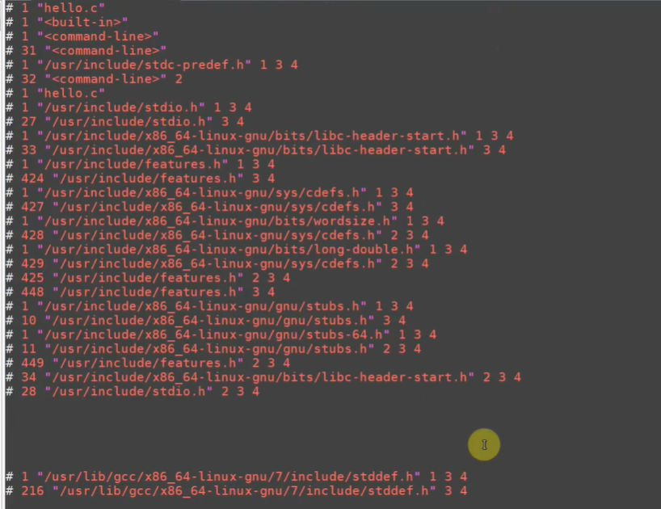

# 视频分析：4_2-1 GCC 编译过程

> 视频时长约 **17分36秒**。这段视频承接你前面关于“编译器、链接器和头文件”的问题，核心是在说明：一条 `gcc hello.c -o hello`，背后其实完成了多个步骤。

------

## 1. 视频类型判断

**主要类型：** 讲解类、教程类
**次要类型：** 原理分析类、命令演示类

**判断依据：**

1. 先用早期纸带、机器语言的例子说明编译器为什么出现。
2. 用流程图拆解 GCC 的四个阶段。
3. 使用 `gcc -v` 查看 GCC 实际调用的内部工具。
4. 手动执行每个阶段，生成 `.i`、`.s`、`.o` 和最终可执行文件。

------

## 2. 一句话总结

```text
gcc 不是只做一次“翻译”，而是作为总指挥，
依次组织预处理、编译、汇编和链接，
最终把 hello.c 变成可以执行的 hello。
```

------

## 3. 时间段拆解

| 时间段      | 内容概括                         | 画面/命令                                                    | 作用                 |
| ----------- | -------------------------------- | ------------------------------------------------------------ | -------------------- |
| 00:00-00:35 | 展示 GCC 编译流程图              | `main.c → main.i → main.S → main.o → elf`                    | 提出主线             |
| 00:35-01:40 | 查看早期纸带编程资料             | 网页展示纸带、早期计算机                                     | 引入机器指令         |
| 01:40-03:45 | 说明机器语言、汇编语言和高级语言 | 白板画出纸带、机器码、汇编、C/C++                            | 解释编译器产生的原因 |
| 03:45-05:05 | 讲解编译、汇编和反汇编之间的方向 | 白板标注“<span style="color:#FF0000; background:#00FF80;">编译、汇编、反汇编、预处理”</span> | 建立概念关系         |
| 05:05-05:50 | 打开 Hello 示例程序              | 查看 `hello.c` 源代码和目录                                  | 准备实际演示         |
| 05:50-07:55 | 执行 `gcc -v` 查看详细过程       | 终端显示 `cc1`、头文件搜索路径、`as`、`collect2`             | 观察 GCC 内部调用    |
| 07:55-10:30 | 对照流程图解释内部工具           | `cc1`、`as`、`collect2` 与各阶段对应                         | 理论解释             |
| 10:30-12:15 | 继续分析 `gcc -v` 输出           | 查看编译、汇编和链接时的完整参数                             | 深化理解             |
| 12:15-13:50 | 查看预处理后的程序               | 打开 `hello.i`，看到大量头文件内容和宏展开                   | 解释预处理结果       |
| 13:50-15:15 | 列出四阶段手动命令               | `-E`、`-S`、`-c` 和最终链接命令                              | 总结命令             |
| 15:15-17:25 | 手动完成四阶段并运行             | 生成 `hello.i`、`hello.s`、`hello.o`、`hello`，执行 `./hello` | 完整验证             |
| 17:25-17:36 | 返回手册回顾命令                 | 再次展示四条命令                                             | 收束总结             |

------

## 4. GCC 的完整编译流程

视频中的完整流程可以写成：

```text
hello.c
   │
   │ 预处理
   ▼
hello.i
   │
   │ 编译
   ▼
hello.s
   │
   │ 汇编
   ▼
hello.o
   │
   │ 链接
   ▼
hello
```

对应命令：

```bash
gcc -E -o hello.i hello.c
gcc -S -o hello.s hello.i
gcc -c -o hello.o hello.s
gcc -o hello hello.o
```

最后运行：

```bash
./hello
```

------

## 5. 第一阶段：预处理

### 命令

```bash
gcc -E -o hello.i hello.c
```

可以拆解为：

```text
gcc       启动 GCC 驱动程序
-E        只进行预处理，完成后停止
-o        指定输出文件名
hello.i   输出文件
hello.c   输入文件
```

### 预处理做什么？

<span style="color:#FF0000; background:#00FF80;">预处理主要处理以 `#` 开头的内容，例如：</span>

```c
#include <stdio.h>
#define MAX 20
#ifdef DEBUG
#endif
```

例如原始程序：

```c
#include <stdio.h>

#define MAX 20

int main(void)
{
    printf("%d\n", MAX);
    return 0;
}
```

预处理之后，会发生这些变化：

```text
#include
→ 将头文件的相关内容包含进来

#define MAX 20
→ 程序中使用 MAX 的位置被替换为 20

#ifdef 等条件编译
→ 根据条件保留或删除相应代码
```

所以<span style="color:#FF0000; background:#00FF80;">打开 `hello.i` 时，会发现它比 `hello.c` 大很多。</span>

视频约 **12:15-13:50** 展示的就是这种现象：<span style="color:#FF0000; background:#00FF80;">原本很短的 Hello 程序，经过预处理以后，出现大量来自系统头文件的声明和定义。</span>

------

### `.i` 文件是什么？

`.i` 通常表示：

```text
已经完成预处理的 C 源文件
```

它本质上仍然是文本文件，可以用：

```bash
vi hello.i
```

查看。

<span style="color:#FF0000; background:#00FF80;">对于 C++，预处理文件常见后缀是：</span>

```text
.ii
```

------

### 这一阶段找不到头文件会怎样？

例如：

```c
#include "add.h"
```

但是<span style="color:#FF0000; background:#00FF80;">编译器找不到 `add.h`，会在预处理阶段报错：</span>

```text
fatal error: add.h: No such file or directory
```

这时可能需要：

```bash
gcc -I ./include -E -o hello.i hello.c
```

所以你<span style="color:#FF0000; background:#00FF80;">前面学习的 `-I`，主要影响的就是这一阶段。</span>

------

## 6. 第二阶段：编译

### 命令

视频中使用：

```bash
gcc -S -o hello.s hello.i
```

其中：

```text
-S
```

表示：

```text
把程序编译成汇编代码，然后停止，
不要继续生成 .o 文件。
```

输入：

```text
hello.i
```

输出：

```text
hello.s
```

------

### 编译阶段做什么？

这一阶段负责把 C 语言程序翻译成汇编语言。

例如 C 代码：

```c
int add(int a, int b)
{
    return a + b;
}
```

<span style="color:#FF0000; background:#00FF80;">可能转化成类似：</span>

```asm
add:
    movl    %edi, %eax
    addl    %esi, %eax
    ret
```

<span style="color:#FF0000; background:#00FF80;">具体汇编内容会受以下因素影响：</span>

- CPU 架构；
- 编译器版本；
- 优化等级；
- 调用约定；
- 目标操作系统。

普通 x86 GCC 生成<span style="color:#FF0000; background:#00FF80;"> x86 汇编</span>；ARM 交叉编译器生成<span style="color:#FF0000; background:#00FF80;"> ARM 汇编</span>。

```text
gcc
→ x86 汇编

arm-buildroot-linux-gnueabihf-gcc
→ ARM 汇编
```

这<span style="color:#FF0000; border:1px solid #330000; background:#00FF80;">也是为什么同一个 `hello.c`，换用不同编译器后，会得到不同架构的可执行文件。</span>

------

### `.s` 和 `.S` 是否一样？

<span style="color:#FF0000; background:#00FF80;">Linux 区分大小写：</span>

```text
hello.s
hello.S
```

<span style="color:#FF0000; background:#00FF80;">不是同一个文件。</span>

一般来说：

```text
.s
已经是汇编代码，通常不再经过 C 预处理器

.S
汇编代码，但在汇编前还要经过预处理器
```

视频流程图中使用了大写 `.S`，手动命令生成的是小写：

```text
hello.s
```

它们<span style="background:#00FF80;">都表示汇编源代码，但是否需要预处理存在区别。</span>

------

## 7. 第三阶段：汇编

### 命令

```bash
gcc -c -o hello.o hello.s
```

这里：

```text
-c
```

表示：

```text
编译或汇编成目标文件，但不要进行最终链接。
```

由于输入已经是：

```text
hello.s
```

因此这一步主要执行汇编。

输出：

```text
hello.o
```

------

### 汇编阶段做什么？

<span style="color:#FF0000;">汇编器把人类还能阅读的汇编代码：</span>

```asm
mov
add
call
ret
```

<span style="background:#00FF80; color:#FF0000;">转换成 CPU 能够理解的机器指令。</span>

负责<span style="color:#FF0000;">这一步的软件通常是</span>：

```bash
as
```

<span style="color:#FF0000; background:#00FF80;">x86 系统中可能是：</span>

```text
/usr/bin/as
```

<span style="color:#FF0000; background:#00FF80;">ARM 交叉工具链中可能是：</span>

```text
arm-buildroot-linux-gnueabihf-as
```

视频中执行：

```bash
gcc -v hello.c -o hello
```

<span style="color:#FF0000; background:#00FF80;">可以看到 GCC 在内部调用类似：</span>

```text
as -v -o /tmp/某个文件.o /tmp/某个文件.s
```

这表明：

> <span style="color:#FF0000; background:#00FF80;">GCC 自己作为驱动程序安排任务，真正负责汇编的是 `as`。</span>

------

### `.o` 文件是什么？

`.o` 是<span style="background:#00FF80;">目标文件</span>，也叫：

```text
object file
```

它<span style="color:#FF0000; background:#00FF80;">已经包含机器指令，但是通常还不能直接执行。</span>

因为它<span style="color:#FF0000; background:#00FF80;">可能还存在没有解决的引用</span>，例如：

```c
printf("Hello\n");
```

<span style="background:#00FF80;">`hello.o` 中知道需要调用 `printf`，但是其中通常没有完整的 `printf` 实现。</span>

因此：

```text
hello.o
已经有当前源文件的机器代码
但还没有把其他目标文件和库完整组合进来
```

------

### 为什么不能直接执行 `hello.o`？

因为它通常属于：

```text
可重定位目标文件
relocatable object file
```

它<span style="color:#FF0000; background:#00FF80;">缺少完整程序需要的内容</span>，例如：

- 最终入口地址；
- C 运行时启动代码；
- 完整的符号地址；
- libc 等库；
- 动态链接信息。

可以使用：

```bash
file hello.o
```

查看，可能显示：

```text
ELF 64-bit LSB relocatable
```

其中关键字是：

```text
relocatable
```

而最终的 `hello` 会显示为：

```text
executable
```

------

## 8. 第四阶段：链接

### 命令

```bash
gcc -o hello hello.o
```

输入：

```text
hello.o
```

输出：

```text
hello
```

这一步主要进行链接。

------

### 链接阶段做什么？

<span style="color:#FF0000; background:#00FF80;">链接器需要把很多部分组合起来：</span>

```text
hello.o
+
程序启动文件
+
C 标准库 libc
+
GCC 运行时库
+
其他需要的目标文件或库
=
完整可执行程序 hello
```

例如 `hello.o` 中存在：

```text
需要调用 printf
```

链接阶段需要解决：

```text
printf 的实现来自哪里？
printf 的符号应该怎样处理？
程序启动时先执行哪段代码？
main 从哪里被调用？
```

------

### 链接器这个软件存在吗？

<span style="color:#FF0000; background:#00FF80;">存在，常见链接器是：</span>

```bash
ld
```

<span style="color:#FF0000; background:#00FF80;">但是视频中执行 `gcc -v` 时，看到的可能是：</span>

```text
collect2
```

例如：

```text
/usr/lib/gcc/.../collect2 ...
```

<span style="color:#FF0000; background:#00FF80;">可以这样理解：</span>

```text
gcc
最高层的驱动程序

collect2
GCC 使用的链接包装程序

ld
底层真正执行 ELF 链接的链接器
```

简化关系：

```text
gcc → collect2 → ld
```

<span style="color:#FF0000; background:#00FF80;">`collect2` 会帮助 GCC 处理一些额外工作，然后调用真正的链接器。</span>

所以你平常可以使用：

```bash
gcc hello.o -o hello
```

而<span style="background:#00FF80; color:#FF0000;">不需要自己手动写一条非常复杂的 `ld` 命令。</span>

------

## 9. <span style="background:#00FF80;">为什么链接阶段仍然使用 `gcc`</span>？

因为<span style="color:#FF0000; border:1px solid #330000; background:#00FF80;">直接使用 `ld` 很麻烦。</span>

你写：

```bash
gcc hello.o -o hello
```

<span style="color:#FF0000; background:#00FF80;">GCC 会自动添加很多内容</span>，例如视频中 `gcc -v` 输出里可以看到的：

```text
crt1.o
crti.o
crtbeginS.o
crtendS.o
crtn.o
-lc
-lgcc
动态链接器路径
默认库搜索目录
```

这些内容对一个普通 C 程序非常重要。

<span style="border:1px solid #330000; background:#00FF80; color:#FF0000;">假如直接写：</span>

```bash
ld hello.o -o hello
```

<span style="color:#FF0000; background:#00FF80; border:1px solid #330000;">通常会缺少：</span>

- 程序入口；
- libc；
- 启动代码；
- 动态链接器配置；
- 运行时支持。

<span style="color:#FF0000; background:#00FF80;">因此一般规则是：</span>

```text
C 程序的编译：使用 gcc
C 程序的最终链接：通常也使用 gcc
底层真正的链接工具：ld
```

------

## 10. `gcc` 到底是什么？

视频中最重要但容易忽略的一点是：

> <span style="background:#00FF80;">`gcc` 命令更像一个总指挥或者驱动程序。</span>

执行：

```bash
gcc hello.c -o hello
```

它<span style="color:#FF0000; background:#00FF80;">可能依次调用</span>：

```text
cc1
as
collect2 / ld
```

### `cc1`

<span style="color:#FF0000; background:#00FF80;">负责 C 语言前端相关工作，包括：</span>

- 预处理；
- 语法分析；
- 语义分析；
- 优化；
- 生成汇编代码。

视频中 `gcc -v` 输出出现：

```text
/usr/lib/gcc/x86_64-linux-gnu/7/cc1 ...
```

并<span style="color:#FF0000; background:#00FF80;">最终输出临时 `.s` 文件：</span>

```text
-o /tmp/cc....s
```

------

### `as`

负责：

```text
汇编代码 → 目标文件
```

即：

```text
.s → .o
```

------

### `collect2` / `ld`

负责：

```text
目标文件和库 → 最终可执行程序
```

即：

```text
.o + 库 → hello
```

------

## 11. `gcc -v` 是什么作用？

视频约 **05:50-12:15** 重点演示：

```bash
gcc -o hello hello.c -v
```

或者：

```bash
gcc -v -o hello hello.c
```

`-v` 表示：

```text
verbose，显示详细信息
```

它会显示：

- GCC 版本；
- 目标架构；
- GCC 的配置；
- 头文件搜索路径；
- 实际调用的 `cc1`；
- 实际调用的 `as`；
- 链接时调用的 `collect2`；
- 默认库目录；
- 自动链接的库和启动文件。

这条命令不会改变编译结果，主要用于观察和排查问题。

------

### 视频中为什么会看到头文件搜索路径？

输出中有类似：

```text
#include <...> search starts here:
 /usr/lib/gcc/x86_64-linux-gnu/7/include
 /usr/local/include
 /usr/lib/gcc/x86_64-linux-gnu/7/include-fixed
 /usr/include/x86_64-linux-gnu
 /usr/include
End of search list.
```

这正好印证了你上一条消息中的理解：

```text
编译器有默认头文件搜索目录；
自己创建的目录默认不在其中；
需要时用 -I 添加。
```

------

## 12. 四个文件分别能不能阅读、能不能运行？

| 文件      | 所处阶段   | 内容             | 人能否直接阅读     | 能否直接运行             |
| --------- | ---------- | ---------------- | ------------------ | ------------------------ |
| `hello.c` | 原始源文件 | C 代码           | 能                 | 不能                     |
| `hello.i` | 预处理后   | 展开的 C 代码    | 能，但通常很长     | 不能                     |
| `hello.s` | 编译后     | 汇编代码         | 能，但需要汇编知识 | 不能直接作为普通程序运行 |
| `hello.o` | 汇编后     | 可重定位机器代码 | 不能直接阅读       | 通常不能                 |
| `hello`   | 链接后     | 完整 ELF 程序    | 不能直接阅读       | 能                       |

------

## 13. `-E`、`-S`、`-c` 为什么看起来像“停止按钮”？

可以<span style="color:#FF0000; background:#00FF80;">把 GCC 看成一条生产线：</span>

```text
预处理 → 编译 → 汇编 → 链接
```

<span style="color:#FF0000; background:#00FF80;">不同选项表示在哪一步停止：</span>

```text
-E
完成预处理后停止

-S
完成编译并生成汇编代码后停止

-c
完成汇编并生成目标文件后停止

没有以上选项
继续执行到链接，生成最终程序
```

可以用一张表记忆：

| 命令选项   | 最后完成到哪一步 | 常见输出   |
| ---------- | ---------------- | ---------- |
| `-E`       | 预处理           | `.i`       |
| `-S`       | 编译             | `.s`       |
| `-c`       | 汇编             | `.o`       |
| 无停止选项 | 链接             | 可执行文件 |

------

## 14. `-o` 是什么？

<span style="color:#FF0000; background:#00FF80;">`-o` 表示：</span>

```text
output，指定输出文件名
```

例如：

```bash
gcc -E hello.c -o hello.i
```

和视频写法：

```bash
gcc -E -o hello.i hello.c
```

通常都可以。

因为 `-o` 后面紧跟的是输出文件名：

```text
-o hello.i
```

注意：

```bash
gcc hello.c -o hello
```

这里的第一个 `hello.c` 是输入文件，第二个 `hello` 是输出文件。

------

## 15. 视频中的手动实验完整解释

### 第一步

```bash
gcc -E -o hello.i hello.c
```

得到：

```text
hello.i
```

可以查看：

```bash
vi hello.i
```

<span style="color:#FF0000; background:#00FF80;">观察头文件、宏和条件编译展开后的结果。</span>

------

### 第二步

```bash
gcc -S -o hello.s hello.i
```

得到：

```text
hello.s
```

可以查看：

```bash
vi hello.s
```

<span style="color:#FF0000; background:#00FF80;">里面是当前 x86-64 平台的汇编指令。</span>

------

### 第三步

```bash
gcc -c -o hello.o hello.s
```

得到：

```text
hello.o
```

它是二进制目标文件，用 `vi` 打开通常会显示乱码，因为它不再是普通文本。

更适合使用：

```bash
file hello.o
objdump -d hello.o
readelf -h hello.o
```

查看。

------

### 第四步

```bash
gcc -o hello hello.o
```

得到最终程序：

```text
hello
```

随后执行：

```bash
./hello
```

视频中程序正常输出，证明四步生成的结果和一条命令：

```bash
gcc -o hello hello.c
```

基本等价。

------

## 16. 这一节与前面几个问题的关系

你之前问过：

> 编译的时候用 GCC，链接的时候用什么？

这段视频直接给出了答案：

```text
表面命令：
gcc

编译阶段内部：
cc1

汇编阶段内部：
as

链接阶段内部：
collect2 和 ld
```

你又问过：

> 头文件在哪里找？

这段视频中的 `gcc -v` 输出也给出了答案：

```text
编译器有默认搜索路径；
使用 -I 可以添加额外路径；
头文件的查找发生在预处理阶段。
```

你还问过：

> 为什么需要 ./hello？

因为完成链接后生成的 `hello` 位于当前目录，Shell 默认不一定在当前目录搜索命令，所以写：

```bash
./hello
```

------

## 17. 内容结构

### 开头

通过早期纸带和机器语言，说明 CPU 最终只能执行机器指令。

### 发展

从机器语言逐步引出：

```text
汇编语言
→ 高级语言
→ 编译器
```

### 转折

从抽象原理转向实际命令：

```bash
gcc -v
```

观察 GCC 并不是一个人在工作，而是调用多种工具。

### 结尾

手工执行：

```text
预处理
→ 编译
→ 汇编
→ 链接
```

最后成功运行程序。

整体表达路径：

```text
从【机器只能理解机器指令】开始，
通过【GCC 内部工具与四阶段流程】展开，
最后落到【手动生成并验证每一个中间文件】。
```

------

## 18. 观点分析

本视频以技术原理和操作演示为主，不是评论视频。

| 技术结论                                  | 观点归属     | 明确/可能 | 依据                                        |
| ----------------------------------------- | ------------ | --------- | ------------------------------------------- |
| 高级语言需要转换为机器指令才能由 CPU 执行 | 讲师技术说明 | 明确      | 纸带和语言层次示意                          |
| GCC 编译一个程序包含四个主要阶段          | 视频核心结论 | 明确      | 流程图和手动命令                            |
| `gcc` 是整个工具链的驱动者                | 讲师技术说明 | 明确      | `gcc -v` 显示调用 `cc1`、`as` 和 `collect2` |
| `.o` 文件尚不是完整可执行程序             | 讲师技术说明 | 明确      | 链接后才生成并运行 `hello`                  |
| 使用不同 GCC 选项可以让流程停在不同阶段   | 视频核心结论 | 明确      | `-E`、`-S`、`-c` 演示                       |

------

## 19. 重点片段精读

### 片段一：01:40-05:05

**表面发生了什么：**

讲师用机器码、纸带、汇编和高级语言画出发展关系。

**更深层含义：**

<span style="color:#FF0000; background:#00FF80;">C 语言不是 CPU 能直接执行的语言。编译工具链的作用，是逐层把人容易书写的表达转换为处理器能执行的指令。</span>

**重要性：**

解释了“为什么必须编译”，而不只是死记命令。

------

### 片段二：05:50-07:55

**表面发生了什么：**

执行：

```bash
gcc -v -o hello hello.c
```

出现大量输出。

**更深层含义：**

<span style="color:#FF0000; background:#00FF80;">一条看似简单的 GCC 命令，实际调用了多个独立软件，并自动添加大量目录、启动文件和库。</span>

**重要性：**

解释了 GCC 为什么既能编译，也能组织汇编和链接。

------

### 片段三：12:15-13:50

**表面发生了什么：**

打开预处理后的 `hello.i`，发现文件非常长。

**更深层含义：**

<span style="color:#FF0000; background:#00FF80;">`#include <stdio.h>` 不是简单记录一个文件名。预处理器会把需要的声明、宏和相关头文件内容展开进当前翻译单元。</span>

**重要性：**

把上一节的头文件知识与 GCC 第一阶段联系起来。

------

### 片段四：15:15-17:25

**表面发生了什么：**

手动运行四条命令，生成每个中间文件，并最终执行成功。

**更深层含义：**

```bash
gcc hello.c -o hello
```

<span style="color:#FF0000; background:#00FF80;">只是把四个阶段自动连续执行，并不是只有一个转换步骤。</span>

**重要性：**

完成从理论到实际文件的闭环。

------

## 20. 你应该重点看什么？

这一节建议重点记住四个问题：

```text
每个阶段输入是什么？
每个阶段输出是什么？
每个阶段由谁完成？
使用什么选项停下来？
```

对应答案：

| 阶段   | 输入      | 输出       | 主要工具        | GCC 选项       |
| ------ | --------- | ---------- | --------------- | -------------- |
| 预处理 | `.c`      | `.i`       | 预处理器/`cc1`  | `-E`           |
| 编译   | `.i`      | `.s`       | `cc1`           | `-S`           |
| 汇编   | `.s`      | `.o`       | `as`            | `-c`           |
| 链接   | `.o` 和库 | 可执行文件 | `collect2`/`ld` | 不使用停止选项 |

------

## 21. 记忆版总结

```text
类型：
GCC 编译原理与操作教程

主线：
hello.c → hello.i → hello.s → hello.o → hello

四阶段：
预处理 → 编译 → 汇编 → 链接

四个结果：
.c → .i → .s → .o → 可执行文件

三个停止选项：
-E → 停在预处理
-S → 停在汇编代码
-c → 停在目标文件

内部工具：
cc1 → 预处理和编译
as → 汇编
collect2 / ld → 链接

gcc 的角色：
不是单纯完成某一个阶段，而是编译工具链的总指挥。

一句话记忆：
gcc 一条命令看起来简单，背后其实是四个阶段和多个工具协同工作。
```


# 问题1

ccl 和 as 和 collect2这些命令我不是太懂，你能够给我解释下吗，还有collect2与.o、.so、.a之间的关系都是什么样的呢。


可以。你这里其实已经碰到 <span style="color:#FF0000; background:#00FF80;">GCC 工具链</span>里最核心的一组东西了：**`cc1`、`as`、`collect2`、`ld`，再加上 `.o / .a / .so`**。把它们串起来以后，编译和链接这块就会清楚很多。

先给你一个总图：

```text
hello.c
  │
  │  cc1
  ↓
hello.s
  │
  │  as
  ↓
hello.o
  │
  │  collect2 → ld
  │      ├── 其他 .o
  │      ├── .a
  │      └── .so
  ↓
可执行文件 hello
```

你可以先把它记成一句话：

> **cc1 负责“翻译 C”，as 负责“翻译汇编”，collect2/ld 负责“把零件拼成最终程序”。**

------

## 1. `cc1` 到底是什么？

你平时输入：

```bash
gcc hello.c -o hello
```

看起来是 `gcc` 在编译。

但实际上，`gcc` 更像一个**总指挥**，真正负责 C 语言核心编译工作的程序之一叫：

```text
cc1
```

它主要完成：

```text
C代码
↓
汇编代码
```

比如你写：

```c
int add(int a, int b)
{
    return a + b;
}
```

经过编译之后，可能变成类似：

```asm
add:
    mov ...
    add ...
    ret
```

所以你可以理解：

```text
cc1 = C语言翻译员
```

它懂 C 的：

```text
if
for
while
函数
结构体
指针
表达式
```

然后把这些高级语言结构变成更底层的汇编代码。

顺便纠正一个很容易看错的地方：通常是 **`cc1`**，最后是数字 `1`，不是字母 `l`。

------

## 2. `as` 是什么？

`as` 是：

```text
assembler
```

也就是：

> **汇编器**

它负责：

```text
hello.s
↓
hello.o
```

例如：

```text
汇编代码
mov
add
call
ret
```

经过 `as` 以后，就会变成真正的机器指令。

所以：

```text
cc1
C语言 → 汇编语言

as
汇编语言 → 机器码
```

这时候生成的：

```text
hello.o
```

里面已经有 CPU 能识别的机器指令了。

------

## 3. 那 `.o` 已经是机器码了，为什么还不能直接运行？

这是理解链接的关键。

假设你有两个文件：

```c
// main.c
int add(int a, int b);

int main()
{
    return add(1, 2);
}
```

另一个：

```c
// add.c
int add(int a, int b)
{
    return a + b;
}
```

分别编译：

```bash
gcc -c main.c -o main.o
gcc -c add.c -o add.o
```

得到：

```text
main.o
add.o
```

`main.o` 里面知道：

> “我要调用一个叫 `add` 的函数。”

但它并不知道：

> “`add` 最终放在内存哪个地址？”

而 `add.o` 里面才真正有 `add()` 的代码。

所以现在：

```text
main.o
```

和：

```text
add.o
```

就<span style="color:#FF0000;">像两个零件。</span>

<span style="color:#FF0000; background:#00FF80;">需要有人把它们拼起来。</span>

这个过程就是：

### 链接

------

## 4. `collect2` 是干什么的？

这个名字确实很容易让人懵。

你先把它理解成：

> **GCC 在链接阶段使用的一个辅助程序。**

通常流程可以简化成：

```text
gcc
 ↓
collect2
 ↓
ld
```

<span style="color:#FF0000; background:#00FF80;">真正最底层负责链接的核心程序通常是：</span>

```text
ld
```

也就是 linker。

所以：

```text
collect2 ≠ .o
collect2 ≠ .so
collect2 ≠ .a
```

它们根本不是同一类东西。

<span style="color:#FF0000; background:#00FF80;">`collect2` 是：</span>

```text
程序 / 工具
```

<span style="color:#FF0000; background:#00FF80;">而：</span>

```text
.o
.a
.so
```

<span style="color:#FF0000; background:#00FF80;">是：</span>

```text
文件
```

这个区别一定要先分开。

------

## 5. `collect2` 和 `.o` 的关系

最简单。

假设有：

```text
main.o
add.o
```

链接的时候：

```bash
gcc main.o add.o -o app
```

大概可以想象成：

```text
main.o ─┐
        ├──→ collect2 / ld ───→ app
add.o ──┘
```

所以：

> <span style="color:#FF0000; background:#00FF80;">`.o` 是 collect2/ld 的输入之一</span>。

<span style="font-family:serif; background:#00FF80;">`.o` 是单个源文件编译后产生的目标文件。</span>

------

## 6. 那 `.a` 又是什么？

`.a` 是：

> <span style="background:#00FF80;">**静态库**</span>

你<span style="color:#FF0000; background:#00FF80;">可以先把它理解成：</span>

> <span style="background:#00FF80;">**一堆 `.o` 文件打包在一起。**</span>

例如有：

```text
add.o
sub.o
mul.o
div.o
```

可以打包成：

```text
libmath.a
```

大概就是：

```text
libmath.a
├── add.o
├── sub.o
├── mul.o
└── div.o
```

所以 <span style="background:#00FF80; color:#FF0000;">`.a` 本质上特别像一个：</span>

> <span style="background:#00FF80; color:#FF0000;">`.o` 文件仓库。</span>

<span style="background:#00FF80;">链接时：</span>

```bash
gcc main.o libmath.a -o app
```

<span style="background:#00FF80;">可以想象：</span>

```text
main.o
   │
   │
libmath.a
 ├─ add.o
 ├─ sub.o
 └─ ...
   │
   ↓
collect2 / ld
   ↓
app
```

<span style="color:#FF0000; background:#00FF80;">链接器会从 `.a` 里面挑出需要的目标文件。</span>

------

## 7. 举个 `.a` 的实际例子

假设：

```c
// main.c
int add(int, int);

int main()
{
    return add(1, 2);
}
```

然后：

```c
// add.c
int add(int a, int b)
{
    return a + b;
}
```

先：

```bash
gcc -c add.c -o add.o
```

得到：

```text
add.o
```

然后打包：

```bash
ar rcs libtest.a add.o
```

得到：

```text
libtest.a
```

之后：

```bash
gcc main.c libtest.a -o app
```

链接器发现：

```text
main 中需要 add
```

于是从：

```text
libtest.a
```

里面把 `add.o` 相关代码取出来，放进最终程序。

所以静态链接后：

```text
app
```

通常已经包含了它需要的那部分库代码。

------

## 8. `.so` 又是什么？

`.so` 是：

> **Shared Object**
> 动态共享库

比如 Linux 很常见：

```text
libc.so
libm.so
libpthread.so
```

它和 `.a` 最大区别在于：

### `.a`

链接的时候：

```text
把需要的代码复制进最终可执行文件
```

大致：

```text
main.o + libxxx.a
       ↓
      ld
       ↓
app
里面已经带着库代码
```

而 `.so` 通常不是这样。

### `.so`

链接的时候，最终程序里更多是记录：

```text
运行的时候我需要 libxxx.so
```

真正运行时，再加载 `.so`。

------

## 9. `.a` 和 `.so` 用一个生活例子理解

假设你要写论文，需要一本参考书。

### 静态库 `.a`

相当于：

> 把参考书里你需要的几页直接复印进你的论文附件。

最终：

```text
论文自己就带着内容
```

原书不在旁边，也可能还能用。

------

### 动态库 `.so`

相当于：

> 你的论文里只写“参见图书馆《XXX》一书第 30 页”。

运行时必须：

```text
图书馆里真的还有这本书
```

否则程序会报：

```text
cannot open shared object file
```

所以：

```text
.a = 链接时把代码拿进来

.so = 运行时还要找到这个共享库
```

------

## 10. collect2 和 `.a` 的关系

现在就很好理解了。

比如：

```bash
gcc main.o libtest.a -o app
```

背后大致是：

```text
           ┌──────── main.o
           │
gcc → collect2 → ld
           │
           └──────── libtest.a
                       │
                       └──里面很多 .o

最终
↓
app
```

所以：

> <span style="background:#00FF80;">`collect2/ld` 可以把 `.o` 和 `.a` 一起参与链接。</span>

------

## 11. collect2 和 `.so` 的关系

例如：

```bash
gcc main.o -lm -o app
```

其中：

```text
-lm
```

<span style="color:#FF0000; background:#00FF80;">代表链接数学库 `libm`。</span>

<span style="color:#FF0000; background:#00FF80;">系统可能找到：</span>

```text
libm.so
```

于是链接过程大概：

```text
main.o
   │
   ├────→ collect2 / ld
   │
libm.so
   │
   ↓
app
```

但这里和 `.a` 有个重要区别。

对于 `.so`：

链接器通常不会把整个 `.so` 的代码复制到 `app` 里。

它更多建立：

```text
app 需要 libm.so
```

这样的依赖关系。

然后运行：

```bash
./app
```

系统里的**动态链接器/动态加载器**再去找到：

```text
libm.so
```

加载进内存。

------

## 12. 所以 `.o / .a / .so` 的关系可以这样理解

这张图最重要：

```text
             C源代码
               │
              cc1
               ↓
              .s
               │
               as
               ↓
              .o
               │
        ┌──────┴──────┐
        │             │
        │             │
    可以打包        可以进一步
       成               制作成
        ↓             ↓
       .a             .so
    静态库           动态库
        │             │
        └──────┬──────┘
               │
        collect2 / ld
               │
               ↓
           可执行程序
```

不过严格一点说：

```text
.so
```

本身也是经过链接生成的。

所以更准确：

```text
若干 .o
   │
   ├────→ ar ───→ .a
   │
   └────→ gcc -shared / ld ───→ .so
```

------

## 13. `.o → .a → .so` 不是固定流水线

这里特别容易误会。

不是：

```text
.o
↓
.a
↓
.so
↓
可执行文件
```

这是错误理解。

正确的是：

```text
                   ┌──→ .a
若干 .o ──────────┤
                   ├──→ .so
                   │
                   └──→ executable
```

也就是说：

> `.o` 是基础零件。

它可以：

- 直接链接成程序
- 打包成 `.a`
- 链接成 `.so`

而 `.a` 和 `.so` 是两种不同的库形式。

------

## 14. `collect2` 到底为什么不直接叫 `ld`？

你可能会想：

> 既然最后真正链接的是 `ld`，为什么 GCC 还搞个 `collect2`？

因为 GCC 有时需要在真正链接前后，额外处理一些 GCC 自己需要的信息，比如某些构造函数、初始化相关的信息。

所以 GCC 插了一层：

```text
gcc
↓
collect2
↓
ld
```

可以把 `collect2` 想象成：

> **GCC 派出的链接阶段管理员。**

它负责：

```text
“链接器，你把这些 .o、库、启动文件全拼起来。”
```

最终真正执行大量 ELF 链接工作的核心仍然是 linker，比如 GNU `ld`。

初学阶段不用深入 `collect2` 的内部机制，先记住：

```text
collect2 = GCC 的链接辅助工具

ld = 真正核心的链接器
```

已经足够。

------

## 15. 还有一个很重要的东西：启动文件

你在视频 `gcc -v` 里可能还看到了：

```text
crt1.o
crti.o
crtbegin.o
crtend.o
crtn.o
```

你可能会觉得：

> 我明明只有 `hello.o`，这些 `.o` 哪来的？

这些是 GCC / C 运行环境自动帮你加入的。

所以真正链接往往不是简单的：

```text
hello.o
↓
hello
```

而更像：

```text
crt1.o
crti.o
hello.o
libc.so
libgcc...
crtend.o
crtn.o
     │
     ↓
collect2 / ld
     ↓
hello
```

这就是为什么：

```bash
gcc hello.o -o hello
```

看起来特别简单，

但：

```bash
gcc -v hello.o -o hello
```

一展开却是一大串。

------

## 16. 再把 `printf()` 放进去，你就彻底明白了

比如：

```c
#include <stdio.h>

int main()
{
    printf("hello\n");
}
```

经过：

```text
hello.c
↓
cc1
↓
hello.s
↓
as
↓
hello.o
```

此时 `hello.o` 里面大概存在：

```text
main：有代码

printf：我需要这个函数，
        但是它的最终实现不在 hello.o 里
```

所以这叫类似：

```text
未解析符号 / undefined symbol
```

链接时：

```text
hello.o
+
libc.so
↓
collect2 / ld
↓
hello
```

链接器发现：

```text
hello.o：
我要 printf

libc：
我这里有 printf
```

于是把两边关系建立起来。

这就是链接最核心的作用之一：

> **解决符号之间的引用关系。**

------

## 17. 你可以把整个过程想成“做汽车”

这个比喻特别好记。

### `cc1`

像：

> 根据设计图制造零件的机器。

```text
C代码 → 汇编代码
```

------

### `as`

像：

> 真正把设计指令加工成实体零件。

```text
.s → .o
```

所以：

```text
.o = 一个个汽车零件
```

------

### `.a`

像：

> 一个零件箱。

```text
libxxx.a
├── 零件1.o
├── 零件2.o
└── 零件3.o
```

------

### `.so`

像：

> 公共租用的发动机。

多个程序都可以使用同一个。

------

### `ld`

像：

> 总装厂。

把：

```text
.o
.a
.so 的引用关系
启动代码
```

组合成最终汽车。

------

### `collect2`

像：

> GCC 派到总装厂的项目经理。

它自己不是汽车零件。

它负责协调最终链接。

------

## 18. 最后给你一张最适合记忆的关系图

```text
             gcc
              │
       “总指挥 / 驱动程序”
              │
       ┌──────┴───────┐
       │              │
      cc1             ...
       │
       ↓
      .s
       │
      as
       │
       ↓
      .o
       │
       ├─────────────┐
       │             │
      ar           linker
       │             │
       ↓             ↓
      .a            .so
 静态库/一堆.o     动态库
       │             │
       └──────┬──────┘
              │
             .o
              │
              ↓
          collect2
              ↓
             ld
              ↓
         executable
```

你现在最应该牢牢记住的其实就这几句：

```text
cc1：
C → 汇编

as：
汇编 → .o

.o：
单个目标文件，机器码零件

.a：
很多 .o 打成一个静态库包

.so：
共享库，运行时可以由多个程序共同加载

collect2：
GCC 的链接辅助程序

ld：
真正负责链接的核心链接器
```

以及最关键的一句：

> **`.o`、`.a`、`.so` 都是“被链接器处理的东西”；`collect2` 和 `ld` 则是“处理这些东西的工具”。**

一旦把“**工具**”和“**文件**”这两类分开，你会发现这部分一下就没那么乱了。


# 问题1补充

ar rcs libtest.a add.o 这个命令的作用是什么？


可以。这个命令：

```bash
ar rcs libtest.a add.o
```

作用就是：

> **把目标文件 `add.o` 打包成一个静态库 `libtest.a`。**

你可以先把它简单理解成：

```text
add.c
  ↓ 编译
add.o
  ↓ ar 打包
libtest.a
```

比如前面可能先执行：

```bash
gcc -c add.c -o add.o
```

得到：

```text
add.o
```

然后：

```bash
ar rcs libtest.a add.o
```

得到：

```text
libtest.a
```

这里几个部分分别是什么意思：

- `ar`：一个专门用来**创建、修改静态库 `.a` 文件**的工具。可以把它粗略理解成<span style="color:#FF0000; background:#00FF80;">“目标文件打包工具”</span>。
- `r`：把文件加入库中；如果库中已经有同名文件，就替换它。
- `c`：如果 `libtest.a` 不存在，就创建它。
- `s`：为静态库创建一个**符号索引表**，方便链接器快速找到函数。
- `libtest.a`：你最终生成的静态库。
- `add.o`：要被放进静态库里的目标文件。

所以实际上：

```bash
ar rcs libtest.a add.o
```

差不多是在告诉系统：

> 创建一个叫 `libtest.a` 的静态库，把 `add.o` 装进去，并建立索引，方便以后链接。

比如 `add.c` 是：

```c
int add(int a, int b)
{
    return a + b;
}
```

先：

```bash
gcc -c add.c -o add.o
```

再：

```bash
ar rcs libtest.a add.o
```

这时候 `libtest.a` 里面就包含了 `add()` 的机器代码。

然后你的 `main.c`：

```c
#include <stdio.h>

int add(int a, int b);

int main()
{
    printf("%d\n", add(1, 2));
    return 0;
}
```

可以这样链接：

```bash
gcc main.c libtest.a -o main
```

整个过程就是：

```text
add.c
 ↓ gcc -c
add.o
 ↓
 ┌───────────────┐
 │ ar rcs        │
 └───────────────┘
 ↓
libtest.a
 ↓
和 main.o 一起参与链接
 ↓
main 可执行程序
```

这里<span style="color:#FF0000; background:#00FF80;">有个特别重要的理解</span>：**`.a` 本质上可以看成很多 `.o` 文件的集合。**

例如：

```bash
ar rcs libtest.a add.o sub.o mul.o
```

那么：

```text
libtest.a
├── add.o
├── sub.o
└── mul.o
```

只不过 `.a` 不只是简单“压缩包”，它还带有符号信息，链接器可以根据 `add()`、`sub()` 这些函数名找到对应的 `.o`。

所以你前面问的 `.o`、`.a`、链接器之间，可以先记成一句话：

> **`.o` 是单个编译单元的目标文件，`.a` 是多个 `.o` 打包形成的静态库，最终由链接器把需要的 `.o` 内容放进可执行程序。**

另外，<span style="color:#FF0000; background:#00FF80;">`libtest.a` 这个名字也不是随便起的。Linux 静态库通常遵循：</span>

```text
lib + 库名 + .a
```

所以：

```text
libtest.a
```

<span style="color:#FF0000; background:#00FF80;">库名实际上是：</span>

```text
test
```

因此<span style="color:#FF0000; background:#00FF80;">还可以这样链接：</span>

```bash
gcc main.c -L. -ltest -o main
```

其中：

```text
-L.       当前目录寻找库
-ltest    寻找 libtest.a
```

也就是说：

```bash
gcc main.c libtest.a -o main
```

和：

```bash
gcc main.c -L. -ltest -o main
```

在这里作用基本一样。

你现在学 GCC 编译过程的话，我建议把它串成这一条线记，会非常清楚：

```text
.c
 ↓ cc1
.s
 ↓ as
.o
 ↓ ar（如果要制作静态库）
.a
 ↓ collect2 / ld
可执行文件
```

不过这里要注意<span style="background:#00FF80;">：**普通程序并不是一定要经过 `ar`。** `ar` 是你想把若干 `.o` 做成静态库时才使用的。</span>


# 问题1补充

我有个问题，这里将若干个文件打包成静态库和我们平时打包压缩普通文件成一个.zip或者.7z压缩包是一样的吗，感觉二者过程很像，还有打包成静态库和打包成动态库的区别是什么呢？


对，你这个感觉其实挺对的：**`.a` 静态库和 `.zip/.7z` 在“<span style="background:#00FF80;">把多个文件装进一个文件”</span>这个表面过程上确实很像**。但它们的用途和内部机制差别很大。

你可以先这么理解：

```text
.zip / .7z
    = 普通文件的“打包/压缩包”

.a
    = 专门给链接器使用的“.o 文件包”

.so
    = 已经被链接器加工成型的“共享代码模块”
```

最关键的区别在这里。

### 1. `.a` 和 `.zip/.7z` 到底像不像？

比如你有：

```text
add.o
sub.o
mul.o
```

执行：

```bash
ar rcs libtest.a add.o sub.o mul.o
```

得到：

```text
libtest.a
├── add.o
├── sub.o
└── mul.o
```

从这个角度看，它确实很像：

```text
test.zip
├── add.o
├── sub.o
└── mul.o
```

所以你的直觉没问题。

但区别是：

**`.zip/.7z` 是给人或者普通程序存储文件用的；`.a` 是专门给链接器用的。**

而且 `ar` 一般不是为了“压缩体积”。它主要做的是：

> <span style="background:#00FF80;">把多个 `.o` 组织到一起，并建立符号索引，让链接器知道某个函数在哪个 `.o` 里面。</span>

<span style="color:#FF0000; background:#00FF80;">比如：</span>

```text
libtest.a
├── add.o     → 有 add()
├── sub.o     → 有 sub()
└── mul.o     → 有 mul()
```

<span style="color:#FF0000; background:#00FF80;">链接器遇到：</span>

```c
add(1, 2);
```

<span style="color:#FF0000; background:#00FF80;">就可以去 `libtest.a` 中查符号表：</span>

```text
我要找 add
     ↓
符号索引
     ↓
add 在 add.o
     ↓
取出 add.o 参与链接
```

所以 `.a` 可以把它想象成一个：

> <span style="background:#00FF80;">**“带目录索引的 `.o` 文件仓库”。**</span>

而 `.zip` 只是：

> “这里面有几个文件，你要用就先解压出来。”

------

## 2. 那静态库 `.a` 和动态库 `.so` 有什么区别？

这个地方特别重要。

很多初学者容易想成：

```text
.o
↓ 打包
.a

.o
↓ 换一种打包
.so
```

但其实**不完全是这样**。

`.a` 真的是比较接近“打包”。

而 `.so` 更准确地说，是：

> <span style="background:#00FF80;">**链接器把若干 `.o` 进一步链接加工以后，生成的共享目标文件。**</span>

例如静态库：

```bash
gcc -c add.c -o add.o
gcc -c sub.c -o sub.o

ar rcs libtest.a add.o sub.o
```

过程：

```text
add.c → add.o ┐
              ├→ ar → libtest.a
sub.c → sub.o ┘
```

而动态库一般是：

```bash
gcc -fPIC -c add.c -o add.o
gcc -fPIC -c sub.c -o sub.o

gcc -shared add.o sub.o -o libtest.so
```

过程更像：

```text
add.c → add.o ┐
              ├→ 链接器 ld → libtest.so
sub.c → sub.o ┘
```

所以：

```text
.a：ar 创建
.so：链接器 ld 创建
```

这就是两者一个非常本质的区别。

------

### 3. 为什么 `.so` 不能简单理解成 `.o` 压缩包？

因为 `.a` 里面通常还能非常明确地看到原来的成员：

```bash
ar t libtest.a
```

可能输出：

```text
add.o
sub.o
mul.o
```

也就是说：

```text
libtest.a
┌────────────┐
│ add.o      │
├────────────┤
│ sub.o      │
├────────────┤
│ mul.o      │
└────────────┘
```

但 `.so` 已经经过了一次链接。

它更像：

```text
add.o ──┐
sub.o ──┼──→ ld 链接、整理 ──→ libtest.so
mul.o ──┘
```

<span style="color:#FF0000; background:#00FF80;">最后形成一个整体的 ELF 文件：</span>

```text
libtest.so
┌──────────────────────┐
│ ELF Header           │
├──────────────────────┤
│ .text 机器指令       │
├──────────────────────┤
│ .data 数据           │
├──────────────────────┤
│ 动态符号表           │
├──────────────────────┤
│ 重定位信息           │
├──────────────────────┤
│ ...                  │
└──────────────────────┘
```

你<span style="color:#FF0000; background:#00FF80;">不能再简单理解成：</span>

```text
libtest.so
├── add.o
├── sub.o
└── mul.o
```

这就不准确了。

------

## 4. 更大的区别，其实是在“程序使用库的时候”

假设：

```c
int main()
{
    return add(1, 2);
}
```

### 使用静态库

```bash
gcc main.o -L. -ltest -o main
```

如果这里找到的是：

```text
libtest.a
```

链接器会：

```text
main.o
   │
   │ 需要 add()
   ↓
libtest.a
   │
   └→ 找到 add.o
          ↓
     把需要的代码拿出来
          ↓
        main
```

于是最后：

```text
main
┌──────────────────┐
│ main()           │
│                  │
│ add() ← 已经进来 │
└──────────────────┘
```

也就是说：

> <span style="background:#00FF80;">**静态链接：库里的代码被复制进最终可执行程序。**</span>

所以程序运行的时候：

```text
./main
```

通常就不再需要 `libtest.a` 了。

------

### 使用动态库

如果链接的是：

```text
libtest.so
```

情况不同。

链接完成后：

```text
main
┌───────────────────────┐
│ main()                │
│                       │
│ add() → 去 libtest.so │
└───────────────────────┘
```

<span style="color:#FF0000; background:#00FF80;">`add()` 的代码一般不会完整复制进 `main`。</span>

而是<span style="color:#FF0000; background:#00FF80;">在程序运行时：</span>

```text
./main
  ↓
Linux 动态加载器
  ↓
找到 libtest.so
  ↓
加载 libtest.so
  ↓
main 调用其中的 add()
```

所以：

> <span style="color:#FF0000; background:#00FF80;">**动态链接：程序和动态库保持分开的状态，运行时再加载动态库。**</span>

------

## 5. 一个特别形象的比喻

你可以把程序想象成一个学生写作业。

### `.o`

就是单独的一张资料：

```text
add.o = 加法资料
sub.o = 减法资料
mul.o = 乘法资料
```

### `.a`

相当于把资料装进一个文件夹：

```text
数学资料.a
├── 加法资料
├── 减法资料
└── 乘法资料
```

写最终作业的时候：

> “我要用加法。”

于是把“加法资料”里的内容**复印进自己的作业**。

这就是：

```text
静态链接
```

<span style="color:#FF0000; background:#00FF80;">最后即使把原来的资料夹拿走：</span>

```text
libtest.a 删除
```

<span style="color:#FF0000; background:#00FF80;">你的作业还是完整的。</span>

------

而<span style="color:#FF0000; background:#00FF80;"> `.so` 更像是一本放在图书馆里的共享参考书。</span>

你的作业里面写：

```text
需要计算加法 → 参考《libtest.so》
```

运行的时候：

```text
程序
 ↓
找到共享的 libtest.so
 ↓
使用里面的 add()
```

所以<span style="color:#FF0000; background:#00FF80;">如果共享库突然没了：</span>

```text
libtest.so ×
```

程序可能直接：

```text
error while loading shared libraries
```

运行不了。

------

## 6. 所以为什么叫“静态”和“动态”？

名字其实就是从这里来的。

### 静态库

<span style="color:#FF0000; background:#00FF80;">链接的时候就把东西确定下来：</span>

```text
编译阶段

main.o + libtest.a
        ↓
      链接
        ↓
main
│
├─ main()
└─ add()
```

运行的时候基本不用再管原来的 `.a`。

所以叫：

> **静态链接 Static Linking**

------

### 动态库

<span style="color:#FF0000; background:#00FF80;">链接时并没有把所有库代码都塞进程序：</span>

```text
main
│
└─ 我需要 libtest.so 中的 add()
```

运行的时候：

```text
main
 +
libtest.so
 ↓
运行
```

因此叫：

> **动态链接 Dynamic Linking**

------

## 7. 这也会导致程序大小不同

假设：

```text
libtest
包含 10 MB 代码
```

有三个程序：

```text
A
B
C
```

都用了这个库。

<span style="color:#FF0000; background:#00FF80;">如果全部静态链接，可能是：</span>

```text
A + 10 MB
B + 10 MB
C + 10 MB
```

<span style="color:#FF0000; background:#00FF80;">相当于每个程序都带了一份。</span>

可以想成：

```text
A → [自己的代码 + 库代码]
B → [自己的代码 + 库代码]
C → [自己的代码 + 库代码]
```

而动态库：

```text
A ─┐
B ─┼→ libtest.so
C ─┘
```

三个程序可以共同使用一个 `.so`。

<span style="color:#FF0000; background:#00FF80;">所以 Linux 里面你会看到很多：</span>

```text
libc.so
libm.so
libpthread.so
```

<span style="background:#00FF80;">它们就是共享库。</span>

这<span style="background:#00FF80;">也是“Shared Object”：</span>

```text
.so
 ↓
Shared Object
 ↓
共享目标文件
```

名字的来源。

------

## 8. 把你现在学到的 `.c → .o → .a/.so` 串起来

你现在其实已经可以建立一个非常完整的框架了：

```text
                         ┌→ ar rcs
                         │
add.c → cc1 → add.s → as → add.o ─────→ libtest.a
                         │                 静态库
                         │
                         └→ ld / collect2
                                  ↓
                              libtest.so
                                动态库
```

然后最终程序：

```text
main.c
  ↓
main.o
  │
  ├──── + libtest.a ───→ 静态链接 ───→ main
  │
  └──── + libtest.so ──→ 动态链接 ───→ main
                                      │
                                      ↓ 运行时
                                  libtest.so
```

你尤其记住这三句话就够了：

> **`.o`：编译后的目标文件。**

> **`.a`：多个 `.o` 的归档，比较像专门给链接器使用的“`.o` 文件包”，一般不压缩。**

> **`.so`：不是简单把 `.o` 打包，而是链接器把多个目标文件进一步链接、整理后形成的共享 ELF 文件，程序运行时可以加载它。**

所以你把 `.a` 类比 `.zip` 是个**很好的入门类比**，只是往后再深入一点，就要补上一句：

> `.a ≈ 特殊的“不压缩 `.o`压缩包” + 符号索引；而`.so` 已经不能看成压缩包了，它本身就是一个经过链接生成的 ELF 目标文件。


# 问题2

这里从.c文件变成.i文件的过程是什么样的，还有.i文件的内容都是什么呢，相比较与原来的.c文件都是发生了哪些变化呢，这里应该就是预处理的过程吧。


对，**`.c → .i` 就是预处理（preprocessing）阶段**。而且你现在这个理解方向是完全对的。

你可以先把它理解成：

```text
hello.c
   │
   │  预处理器 cpp
   │  或 gcc -E
   ↓
hello.i
```

`.i` 仍然是 <span style="background:#00FF80;">**C 语言文本文件**，还没有变成汇编，更没有变成机器码。它只是把 `.c` 里面那些“以 `#` 开头、需要提前处理的东西”基本处理完了。</span>

------

## 1. 最简单的例子

假设你的 `hello.c` 是：

```c
#include <stdio.h>

#define NUM 10

int main()
{
    printf("NUM = %d\n", NUM);
    return 0;
}
```

执行：

```bash
gcc -E hello.c -o hello.i
```

就会得到：

```text
hello.c
↓
预处理
↓
hello.i
```

那么 <span style="color:#FF0000; background:#00FF80;">`.i` 文件里最核心的变化可以粗略理解为：</span>

```c
/* stdio.h 里面的大量内容被放进这里 */
/* 可能有成百上千行声明 */

int main()
{
    printf("NUM = %d\n", 10);
    return 0;
}
```

注意<span style="color:#FF0000; background:#00FF80;">这里发生了两个特别明显的变化：</span>

```text
#include <stdio.h>
```

<span style="color:#FF0000; background:#00FF80;">没了，因为 `stdio.h` 的相关内容已经被展开进来了。</span>

同时：

```text
NUM
```

<span style="color:#FF0000; background:#00FF80;">也没了，被替换成：</span>

```text
10
```

------

## 2. `.c → .i` 到底做了什么？

最主要可以记住 **4 件事**：

```text
① 展开 #include
② 展开 #define 宏
③ 处理 #if / #ifdef / #ifndef 等条件编译
④ 删除注释
```

我们一个一个看。

------

## 3. 第一件事：展开 `#include`

比如：

```c
#include <stdio.h>
```

你可以暂时把它理解成：

> “把 `stdio.h` 里的内容拿过来放到这里。”

所以原来：

```c
#include <stdio.h>

int main()
{
    printf("hello\n");
}
```

<span style="color:#FF0000; background:#00FF80;">预处理以后，不再只是这几行。</span>

<span style="background:#00FF80; color:#FF0000;">而可能变成非常巨大：</span>

```c
typedef ...
struct ...
extern ...
extern int printf(...);
extern int scanf(...);

/* stdio.h 以及它继续包含的其他头文件的大量内容 */

int main()
{
    printf("hello\n");
}
```

因此你实际执行：

```bash
gcc -E hello.c -o hello.i
```

然后：

```bash
ls -lh hello.c hello.i
```

经常会发现：

```text
hello.c    几百字节
hello.i    几万甚至几十万字节
```

你可能会觉得：

> 我明明就写了 5 行，怎么 `.i` 这么大？

原因主要就是：

```text
#include <stdio.h>
```

看起来只有一行，但 `stdio.h` 自己又可能：

```text
include 其他头文件
↓
其他头文件又 include 更多头文件
↓
不断展开
```

所以最终形成一大坨 C 语言代码和声明。

------

## 4. `#include` 可以把它想象成“复制粘贴”吗？

**入门阶段可以这么理解，但它不是单纯机械复制。**

比如：

```c
#include "my.h"
```

可以大概脑补：

```text
找到 my.h
↓
读取它
↓
继续预处理 my.h
↓
把处理后的内容放进当前位置
```

因此，如果 `my.h` 是：

```c
#define MAX 100

int add(int a, int b);
```

你的：

```c
#include "my.h"

int main()
{
    return add(1, MAX);
}
```

预处理之后大致变成：

```c
int add(int a, int b);

int main()
{
    return add(1, 100);
}
```

你看：

```text
#include "my.h"
```

没了。

```text
#define MAX 100
```

也没了。

但是它们产生的效果留下来了。

------

## 5. 第二件事：宏替换 `#define`

比如：

```c
#define PI 3.14

float x = PI;
```

预处理后：

```c
float x = 3.14;
```

所以：

```text
#define PI 3.14
```

本身不会留到最终 `.i` 里继续让编译器处理。

预处理器已经帮你完成：

```text
PI → 3.14
```

------

### 再举一个函数宏（这个暂时不用理解）

原文件：

```c
#define ADD(a, b) ((a) + (b))

int main()
{
    int c = ADD(1, 2);
}
```

预处理后大概：

```c
int main()
{
    int c = ((1) + (2));
}
```

所以预处理器根本不会理解：

> “ADD 是一个真正的 C 函数。”

它更像是在做：

> **文本层面的替换和展开。**

------

## 6. 第三件事：条件编译

这个在嵌入式里特别常见。

例如：

```c
#define DEBUG

int main()
{
#ifdef DEBUG
    printf("debug mode\n");
#endif

    return 0;
}
```

因为定义了：

```c
#define DEBUG
```

所以预处理后：

```c
int main()
{
    printf("debug mode\n");

    return 0;
}
```

而：

```text
#ifdef DEBUG
#endif
```

这些东西已经不存在了。

------

假设没有：

```c
#define DEBUG
```

那么：

```c
#ifdef DEBUG
    printf("debug mode\n");
#endif
```

整个这一段会直接被预处理掉。

最终可能变成：

```c
int main()
{
    return 0;
}
```

所以<span style="background:#00FF80; color:#FF0000;">条件编译的本质是：</span>

> <span style="background:#00FF80;">**编译之前先决定哪些代码要留下，哪些代码根本不要交给真正的编译器。**</span>

这个在后面 Linux 内核、驱动、跨平台代码里会非常常见。

比如：

```c
#ifdef __arm__
    // ARM 平台代码
#else
    // 其他平台代码
#endif
```

预处理阶段就已经决定：

> 到底留下哪一份。

------

## 7. 第四件事：注释会被去掉

例如 `.c`：

```c
int main()
{
    // 这是一个测试程序

    int a = 10;   /* 定义变量 */

    return 0;
}
```

<span style="color:#FF0000; background:#00FF80;">预处理后，注释一般不会继续存在：</span>

```c
int main()
{

    int a = 10;

    return 0;
}
```

可以简单理解：

```text
// ...
/* ... */
```

<span style="color:#FF0000; background:#00FF80;">在预处理阶段被清理掉。</span>

因此：

> <span style="background:#00FF80;">注释主要是给人看的，并不会进入后面的机器代码。</span>

------

## 8. 所以 `.i` 文件究竟装的是什么？

你可以把 `.i` 理解成：

> <span style="color:#FF0000; background:#00FF80;">**已经完成预处理、准备正式交给 C 编译器的 C 语言源代码。**</span>

也就是：

```text
原始 .c
+
头文件
+
宏定义
+
条件编译规则
+
注释
        │
        ↓
      预处理
        │
        ↓
处理好的 C 代码 .i
```

<span style="background:#00FF80; color:#FF0000;">其中很多：</span>

```text
#include
#define
#ifdef
#ifndef
#endif
```

都<span style="color:#FF0000; background:#00FF80;">已经完成使命。</span>

------

## 9. `.i` 里面还是不是 C 语言？

<span style="background:#00FF80;">**是。**</span>

这个非常关键。

```text
.c
↓
.i
```

还没有从 C 语言变成别的语言。

比如<span style="background:#00FF80; color:#FF0000;"> `.i` 里面仍然能看到：</span>

```c
int main()
{
    int a = 10;
    int b = 20;

    return a + b;
}
```

所以：

```text
.c → .i
```

可以理解为：

> <span style="background:#00FF80; color:#FF0000;">**原始 C 代码 → 整理、展开后的 C 代码**</span>

而接下来：

```text
.i → .s
```

<span style="color:#FF0000; background:#00FF80;">才是真正发生语言层面的明显变化：</span>

```text
C语言
↓
汇编语言
```

再下一步：

```text
.s → .o
```

<span style="color:#FF0000; background:#00FF80;">才变成：</span>

```text
机器指令
```

------

## 10. 那为什么叫 `.i`？

对于 C 语言，GCC 通常把预处理后的文件使用：

```text
.i
```

扩展名。

C++ 则常见：

```text
.ii
```

所以可以记：

```text
.c   原始 C 文件
.i   预处理后的 C 文件

.cpp 原始 C++ 文件
.ii  预处理后的 C++ 文件
```

------

## 11. 实际 `.i` 文件为什么看起来比我说的复杂很多？

因为如果你真的打开：

```bash
vim hello.i
```

可能会看到这种东西：

```c
# 0 "hello.c"
# 0 "<built-in>"
# 0 "<command-line>"
# 1 "/usr/include/stdc-predef.h"
# 1 "/usr/include/stdio.h"

typedef ...
extern int remove (...);
extern int rename (...);
extern int fclose (...);
extern int printf (...);

...
```

尤其会出现很多：

```text
# 1 "/usr/include/stdio.h"
# 27 "/usr/include/stdio.h"
```

这种东西。

它们叫类似：

> <span style="background:#00FF80;">**行标记 / line markers**</span>

主要用于告诉后面的编译器：

```text
下面这些代码原来来自哪个文件
原来对应哪一行
```

这样之后编译报错时，才能告诉你：

```text
hello.c:10: ...
```

而不是只告诉你：

```text
hello.i 第 5234 行出错
```

所以<span style="background:#00FF80;">这些行标记可以理解成：</span>

> <span style="background:#00FF80;">**源码位置导航信息。**</span>

------

## 12. `.i` 和 `.c` 对比一下就很直观了

假设原来的：

```c
// hello.c

#include <stdio.h>

#define AGE 18

int main()
{
#ifdef DEBUG
    printf("debug\n");
#endif

    printf("age = %d\n", AGE);

    return 0;
}
```

如果没有定义 `DEBUG`，预处理之后，可以粗略想象为：

```c
/* stdio.h 展开的成百上千行内容 */

extern int printf(const char *, ...);

/* 更多内容…… */

int main()
{

    printf("age = %d\n", 18);

    return 0;
}
```

所以变化就是：

| `.c` 里的内容        | 到 `.i` 后               |
| -------------------- | ------------------------ |
| `#include <stdio.h>` | 头文件内容被展开         |
| `#define AGE 18`     | `AGE` 被替换成 `18`      |
| `#ifdef DEBUG`       | 根据条件决定代码是否保留 |
| 注释                 | 基本被移除               |
| 普通 C 代码          | 基本保留下来             |
| `printf(...)`        | 仍然是 `printf(...)`     |
| `main()`             | 仍然是 `main()`          |

最后这一点非常重要：

> **预处理不会把 `printf()` 翻译成机器码。**

它也不会真正理解 `main()` 怎么执行。

这些是后面编译、汇编、链接阶段的事情。

------

## 13. `printf` 在预处理阶段到底发生了什么？

这个地方特别值得弄清楚。

你写：

```c
#include <stdio.h>

int main()
{
    printf("hello\n");
}
```

<span style="background:#00FF80;">预处理器遇到：</span>

```c
#include <stdio.h>
```

<span style="background:#00FF80;">会把 `stdio.h` 里的声明等内容展开进来，其中会涉及类似：</span>

```c
extern int printf(const char *format, ...);
```

但注意：

> **`printf()` 真正的函数实现并不会因为 `#include <stdio.h>` 被复制进 `.i`。**

<span style="color:#FF0000; background:#00FF80;">头文件主要告诉编译器：</span>

```text
printf 这个函数存在
它叫什么
它接受什么参数
它返回什么类型
```

<span style="color:#FF0000; background:#00FF80;">真正的 `printf` 实现通常在 C 库，比如：</span>

```text
libc.so
```

里面。

所以完整关系其实是：

```text
stdio.h
↓
告诉编译器 printf 长什么样
↓
预处理时加入声明

libc.so
↓
真正包含 printf 的实现
↓
链接/运行时建立关系
```

这个区别非常重要。

------

## 14. 这也能把你之前的 `-I` 串起来

你之前问过：

```bash
gcc -I./include hello.c
```

这个：

```text
-I
```

<span style="background:#00FF80;">为什么是“指定头文件路径”？</span>

<span style="color:#FF0000; background:#00FF80;">现在你就可以从预处理过程理解了</span>。

比如：

```c
#include "test.h"
```

<span style="color:#FF0000; background:#00FF80;">预处理器需要做：</span>

```text
我要展开 test.h
↓
那 test.h 在哪里？
```

如果默认目录找不到：

```text
/usr/include
GCC 默认 include 路径
...
```

那你就告诉它：

```bash
-I./include
```

意思就是：

> <span style="background:#00FF80; color:#FF0000;">**“预处理的时候，也去 `./include` 里面找头文件。”**</span>

因此：

```text
-I
```

主要影响的就是：

### `.c → .i` 这个预处理阶段。

------

## 15. 你现在可以把整个 GCC 流程这样理解

```text
hello.c
│
│ 预处理
│
│ 做：
│ #include 展开
│ #define 替换
│ #ifdef 判断
│ 删除注释
│
↓
hello.i
│
│ cc1 编译
│ C语言 → 汇编
↓
hello.s
│
│ as 汇编
↓
hello.o
│
│ collect2 / ld 链接
│ 加入其他 .o、.a、.so 等
↓
hello
```

所以你刚才说：

> “这里应该就是预处理的过程吧？”

**对，就是这个过程。**

而且你可以把 `.i` 用一句特别容易记的话定义为：

> **`.i` = 把头文件、宏、条件编译等都提前处理完之后的“展开版 C 文件”。**

如果你现在自己在 Ubuntu 里执行一次：

```bash
gcc -E hello.c -o hello.i
```

然后分别打开：

```bash
vim hello.c
```

和：

```bash
vim hello.i
```

对照着看，尤其搜索 `main`，你会非常直观地看到：**你的 `main()` 可能还是那几行，但它前面突然多出了几百甚至几千行头文件展开后的内容。**这基本就是理解预处理最直观的方法。


# 问题2补充

在我预处理的时候将.c文件变成了.i文件之后，除了 #include 不见了之外，#define 以及 #if nodefine（这里有些没有用到的是不是删除掉了呢）那些在.i文件中还存在吗。


对，你这个问题抓得很准。**正常情况下，`.c → .i` 预处理完成之后，不只是 `#include` 不见了，`#define`、`#if/#ifdef/#ifndef/#else/#endif` 这些预处理指令本身也基本都不会保留。**

你可以把预处理器理解成：**它把这些 `#...` 指令执行完，然后把“执行结果”交给下一阶段，而不是把指令本身继续往后传。**

假设原来的 `.c` 文件是：

```c
#include <stdio.h>

#define NUM 10

#define DEBUG

int main()
{
#ifdef DEBUG
    printf("debug\n");
#endif

#ifndef DEBUG
    printf("normal\n");
#endif

    printf("%d\n", NUM);

    return 0;
}
```

<span style="background:#00FF80; color:#FF0000;">预处理之后，`.i` 的核心内容会大致变成：</span>

```c
/* stdio.h 展开后的大量内容 */

int main()
{
    printf("debug\n");

    printf("%d\n", 10);

    return 0;
}
```

这里你可以逐个看变化：

| `.c` 中              | `.i` 中发生什么                                |
| -------------------- | ---------------------------------------------- |
| `#include <stdio.h>` | 指令消失，头文件内容展开                       |
| `#define NUM 10`     | `#define` 本身消失，后面的 `NUM` 被替换成 `10` |
| `#define DEBUG`      | 定义指令本身消失，但它影响后面的条件判断       |
| `#ifdef DEBUG`       | 判断完成后指令消失                             |
| `printf("debug")`    | 因为 DEBUG 已定义，所以留下                    |
| `#ifndef DEBUG`      | 判断完成后指令消失                             |
| `printf("normal")`   | 因为 DEBUG 已定义，所以这一段被删除            |
| `#endif`             | 消失                                           |

所以你刚才说的“**有些没有用到的是不是删除掉了**”，这个要分两种情况。

<span style="background:#00FF80;">第一种是 **条件编译中没有被选中的代码**，它是真的会被删除。例如：</span>

```c
#define DEBUG

#ifdef DEBUG
int a = 10;
#else
int a = 20;
#endif
```

因为 `DEBUG` 已经定义，所以 `.i` 里只剩：

```c
int a = 10;
```

这一整块：

```c
#else
int a = 20;
#endif
```

都不会交给后面的编译器。

<span style="background:#00FF80;">第二种是你定义了一个宏，但后面根本没用：</span>

```c
#define ABC 100

int main()
{
    return 0;
}
```

正常执行：

```bash
gcc -E test.c -o test.i
```

得到的 `.i` 里通常也**不会保留**：

```c
#define ABC 100
```

因为这个宏定义只是预处理器内部保存的一条规则，既然后面没有用到，它执行完预处理以后也就没有必要交给编译器。

所以可以总结成一句话：

> **`.i` 文件保存的是预处理后的结果，而不是预处理规则本身。**

比如：

```text
#define NUM 10
        │
        │ 预处理器记住
        ↓
遇到 NUM
        ↓
替换成 10

最终 .i：
NUM 不在了
#define NUM 10 也不在了
留下的是 10
```

而条件编译则是：

```text
#ifdef DEBUG
代码 A
#else
代码 B
#endif

        ↓ 预处理

如果 DEBUG 已定义：

代码 A

如果 DEBUG 未定义：

代码 B
```

`#ifdef`、`#else`、`#endif` 本身全部消失。

顺便说一下，你写的 `#if nodefine`，你大概率指的是：

```c
#ifndef
```

它的意思是：

```text
if not defined
如果没有定义
```

比如：

```c
#ifndef DEBUG
printf("DEBUG没有定义\n");
#endif
```

如果 `DEBUG` 没定义，这一句代码留下；如果已经定义，这一句就被删掉。

有一个小例外：如果你特意让 GCC 输出宏定义，例如：

```bash
gcc -E -dD test.c
```

那么你可能还能看到很多 `#define`。但这是因为你显式要求 GCC 把宏定义也打印出来。

**普通的：**

```bash
gcc -E test.c -o test.i
```

你就按这个模型理解：

```text
.c
│
├─ #include       → 展开
├─ #define        → 执行替换，定义本身消失
├─ #ifdef         → 判断
├─ #ifndef        → 判断
├─ #if            → 判断
├─ #else/#endif   → 判断结束后消失
├─ 注释           → 去掉
│
↓
.i

只留下“最终被选中、展开、替换之后的 C 代码”
```

所以 **`.i` 可以看成“所有预处理决定都已经做完的 C 源代码”**，后面的 `cc1` 基本就不用再纠结“这个 `#ifdef` 到底选哪边”了，直接编译留下来的代码即可。


# 问题2补充

\#ifdef #ifndef #else #endif 在头文件中include的用法是什么呢，这些常用来干什么呢？


对，这几个东西在头文件里特别常见。你现在看到的最典型用途其实就是：

> **防止头文件被重复包含。**

比如你经常会看到这种写法：

```c
#ifndef __TEST_H__
#define __TEST_H__

int add(int a, int b);

#endif
```

它就是一个很经典的“头文件保护”。

先拆开看：

```c
#ifndef __TEST_H__
```

意思是：

> 如果 `__TEST_H__` 这个宏还没有被定义。

接着：

```c
#define __TEST_H__
```

把它定义出来。

然后中间放头文件真正的内容：

```c
int add(int a, int b);
```

最后：

```c
#endif
```

表示条件编译结束。

所以第一次：

```c
#include "test.h"
```

时：

```text
__TEST_H__ 还没定义
↓
条件成立
↓
#define __TEST_H__
↓
保留头文件内容
```

第二次又：

```c
#include "test.h"
```

时：

```text
__TEST_H__ 已经定义了
↓
#ifndef 条件不成立
↓
整个头文件内容被跳过
```

所以它的作用就是：

> **同一个 `.c` 文件在一次预处理过程中，无论间接或直接 include 多少次 `test.h`，真正的内容只展开一次。**

举个很容易遇到的例子。

你有：

```c
// a.h
#include "common.h"
```

又有：

```c
// b.h
#include "common.h"
```

然后：

```c
// main.c
#include "a.h"
#include "b.h"
```

那么展开关系其实是：

```text
main.c
├── a.h
│    └── common.h
│
└── b.h
     └── common.h
```

也就是说：

```text
common.h
```

理论上会被 include 两遍。

<span style="color:#FF0000; background:#00FF80;">如果 `common.h` 写成：</span>

```c
#ifndef COMMON_H
#define COMMON_H

struct Student
{
    int age;
};

#endif
```

第一次展开：

```text
COMMON_H 没定义
↓
定义 COMMON_H
↓
struct Student 被留下
```

第二次展开：

```text
COMMON_H 已定义
↓
#ifndef COMMON_H 为假
↓
里面内容全部跳过
```

这样 `struct Student` 就不会重复出现。

<span style="color:#FF0000; background:#00FF80;">如果没有这个保护，就可能产生类似：</span>

```text
redefinition of 'struct Student'
```

也就是<span style="color:#FF0000; background:#00FF80;">“重复定义”。</span>

------

你问到的四个东西可以分别这样理解：

```c
#ifdef ABC
```

意思是：

> 如果 `ABC` 已经定义，就保留下面的内容。

比如：

```c
#define DEBUG

#ifdef DEBUG
void print_debug(void);
#endif
```

因为 `DEBUG` 已定义，所以：

```c
void print_debug(void);
```

会被留下。

------

而：

```c
#ifndef ABC
```

正好相反：

> 如果 `ABC` 没有定义，就保留下面内容。

所以头文件保护特别喜欢用它：

```c
#ifndef TEST_H
#define TEST_H

// 头文件内容

#endif
```

第一次没有定义，所以进去；进去以后立刻定义。以后再 include，就进不去了。

------

`#else` 就是：

> 条件不成立时，走另一边。

例如：

```c
#ifdef DEBUG
    printf("debug mode\n");
#else
    printf("normal mode\n");
#endif
```

如果：

```c
#define DEBUG
```

存在：

```text
留下 debug mode
删除 normal mode
```

如果不存在：

```text
删除 debug mode
留下 normal mode
```

------

<span style="color:#FF0000;">#endif` 很简单，就是：</span>

> `#if / #ifdef / #ifndef`<span style="color:#FF0000; background:#00FF80;"> 对应条件块的结束。</span>

比如：

```c
#ifdef DEBUG

// 条件成立时保留

#endif
```

你<span style="color:#FF0000; background:#00FF80;">可以理解成 C 语言里面的大括号：</span>

```c
if (...)
{
}
```

只不过预处理里的写法是：

```c
#ifdef ...
...
#endif
```

------

不过<span style="color:#FF0000; background:#00FF80;">除了“防止头文件重复包含”，它们还有一个非常重要的用途：</span>

> <span style="background:#00FF80;">**根据不同平台、不同配置，选择不同代码。**</span>

这在你以后学嵌入式 Linux 时会到处看到。

比如同一份代码既支持 ARM，又支持 x86：

```c
#ifdef __arm__

void cpu_init(void)
{
    // ARM 平台代码
}

#else

void cpu_init(void)
{
    // 其他平台代码
}

#endif
```

那么<span style="color:#FF0000; background:#00FF80;">在 ARM 编译器下，预处理后可能只剩：</span>

```c
void cpu_init(void)
{
    // ARM 平台代码
}
```

x86 那部分在 `.i` 文件生成之前就被删掉了。

所以：

> 条件编译并不是“程序运行到这里以后再判断”。

它是在**编译程序之前**就决定哪部分代码存在、哪部分代码不存在。

这个区别很重要。

------

<span style="color:#FF0000; background:#00FF80;">还有一种你以后很常见的情况，就是“功能开关”。</span>

比如：

```c
#define ENABLE_LOG
```

然后：

```c
#ifdef ENABLE_LOG
#define LOG(x) printf("%s\n", x)
#else
#define LOG(x)
#endif
```

开发调试的时候：

```c
#define ENABLE_LOG
```

存在，于是：

```c
LOG("hello");
```

会变成真正的打印代码。

发布版本把：

```c
#define ENABLE_LOG
```

去掉以后：

```c
LOG("hello");
```

可能直接被展开成什么都没有。

所以这相当于：

```text
一个宏
↓
控制一整套功能是否参加编译
```

------

你现在可以把它们分成两大用途来记。

### 用途一：头文件保护

最常见：

```c
#ifndef MY_HEADER_H
#define MY_HEADER_H

// 头文件内容

#endif
```

意思：

```text
如果以前没包含过
    ↓
把内容展开
    ↓
留下一个“我已经包含过”的标记

如果以后再次包含
    ↓
直接跳过
```

### 用途二：条件编译

例如：

```c
#ifdef DEBUG
    调试代码
#else
    正式代码
#endif
```

或者：

```c
#ifdef ARM
    ARM代码
#else
    x86代码
#endif
```

意思就是：

> **根据宏是否存在，决定哪部分代码真正进入 `.i` 文件。**

你可以把这一整套理解成一个“编译前的开关系统”：

```text
#define
   ↓
设置开关

#ifdef
   ↓
开关打开了吗？

#ifndef
   ↓
开关还没打开吗？

#else
   ↓
否则走这里

#endif
   ↓
判断结束
```

对于头文件保护，最经典的一句话就是：

```text
#ifndef：你以前来过吗？
#define：没来过的话，我给你做个标记。
#endif：下次再来看到标记，就别重复进来了。
```

这也是为什么你以后打开几乎任何正规的 `.h` 文件，都很容易看到 `#ifndef + #define + #endif` 这一套。


# 问题2补充（头文件里面的宏只起到标志位的作用）

对，**在“头文件保护”这个特定场景里，`#define __TEST_H__` 基本就是当一个“标记位”来用的。**

它不是为了保存什么有用的数值，主要就是告诉预处理器：

> “这个头文件我已经处理过一次了。”

比如：

```c
#ifndef __TEST_H__
#define __TEST_H__

int add(int a, int b);

#endif
```

第一次 `#include "test.h"` 时：

```text
__TEST_H__ 还没定义
↓
#ifndef 条件成立
↓
执行 #define __TEST_H__
↓
把头文件内容保留下来
```

于是这次预处理之后，预处理器内部就相当于记住了：

```text
__TEST_H__ = 已定义
```

第二次又遇到：

```c
#include "test.h"
```

再判断：

```c
#ifndef __TEST_H__
```

此时发现：

```text
__TEST_H__ 已经定义
```

所以条件不成立，整个头文件内容就跳过了。

所以你说“感觉就只是个条件判断”，更准确一点可以说：

> <span style="color:#FF0000; background:#00FF80;">`#ifndef` 负责判断，`#define __TEST_H__` 负责**留下一个状态标记**。</span>

两者配合才完成“第一次进，第二次跳过”。

你可以把它想成门口盖章：

```text
第一次来：
没章 → 可以进 → 给你盖章

第二次来：
有章 → 不让再进
```

这里：

```text
#ifndef
```

像“检查有没有章”，而：

```text
#define __TEST_H__
```

像“盖章”。

<span style="color:#FF0000; background:#00FF80;">而且这种宏通常**不需要具体值**：</span>

```c
#define __TEST_H__
```

就够了，因为<span style="color:#FF0000;">后面只关心：</span>

> <span style="background:#00FF80; color:#FF0000;">它“有没有被定义”，而不是“它等于多少”。</span>

当然你也可以写：

```c
#define __TEST_H__ 1
```

对这个用途来说通常没必要，因为：

```c
#ifdef __TEST_H__
#ifndef __TEST_H__
```

判断的只是“定义没定义”。

所以<span style="color:#FF0000; background:#00FF80;">头文件保护里这个宏本质上就是一个：</span>

> <span style="color:#FF0000; background:#00FF80;">**布尔式标志：存在 / 不存在。**</span>

这个理解非常接近本质。


# 问题3 源代码导航信息（将.c文件转化为.s文件）



这些内容要怎么理解呢，这里是源代码导航的信息吗，后面为什么还有什么134这些内容呢？


对，你可以把这些内容理解成**“预处理后的源码定位/来源导航信息”**。更准确的名字叫 **line marker（行标记）**。

它们不是你原来 `.c` 文件里的 C 代码，也不是 `#include/#define` 那种还没处理完的预处理指令，而是 GCC 预处理器特意留给后续编译器的信息：

> <span style="color:#FF0000; background:#00FF80;">“接下来的代码原本来自哪个文件、第几行，以及这个文件是什么性质。”</span>

你<span style="color:#FF0000; background:#00FF80;">截图里一行的基本格式</span>是：

```text
# 行号 "文件名" 标志
```

例如：

```text
# 1 "/usr/include/stdio.h" 1 3 4
```

可以拆成：

```text
# 1
↑
接下来的内容，对应 stdio.h 的第 1 行

"/usr/include/stdio.h"
↑
接下来的代码来自这个文件

1 3 4
↑
额外的状态标志
```

------

## 1. 为什么 `.i` 文件里需要这些东西？

假设你的 `hello.c` 只有：

```c
#include <stdio.h>

int main()
{
    printf("hello\n");
}
```

但是预处理以后：

```c
#include <stdio.h>
```

会展开出非常多内容。

所以 `.i` 文件可能变成几千行。

问题就来了：

假设后面编译器发现错误：

```text
.i 文件第 1837 行有问题
```

但第 1837 行其实不是你自己写的，而是来自：

```text
/usr/include/stdio.h
```

甚至是 `stdio.h` 又包含的：

```text
bits/types.h
```

那编译器怎么知道原始代码来自哪里？

就是靠这些：

```text
# 27 "/usr/include/stdio.h"
# 33 "/usr/include/x86_64-linux-gnu/bits/libc-header-start.h"
```

所以你说它是：

> **源代码导航信息**

这个理解是很合适的。

更准确一点说是：

> **“预处理后代码 → 原始源文件位置”的映射信息。**

------

## 2. 最简单的例子

假设：

```c
// hello.c

#include "test.h"

int main()
{
    return 0;
}
```

而：

```c
// test.h

int add(int a, int b);
```

预处理以后可能大概出现：

```text
# 1 "hello.c"

# 1 "test.h" 1

int add(int a, int b);

# 3 "hello.c" 2

int main()
{
    return 0;
}
```

我们一行一行看。

------

### 第一行

```text
# 1 "hello.c"
```

意思：

> 下面的代码对应 `hello.c`，从第 1 行开始。

------

遇到：

```c
#include "test.h"
```

预处理器进去处理 `test.h`。

所以出现：

```text
# 1 "test.h" 1
```

意思：

> 现在进入 `test.h`，从它第 1 行开始。

然后出现：

```c
int add(int a, int b);
```

------

`test.h` 处理完，又回到 `hello.c`。

于是：

```text
# 3 "hello.c" 2
```

意思：

> `test.h` 处理完了，现在返回 `hello.c` 第 3 行继续。

所以你可以脑补成：

```text
hello.c
   │
   │ #include "test.h"
   ↓
test.h
   │
   │ 处理完成
   ↓
hello.c
```

而 line marker 就是在记录这个“跳进去、再跳回来”的过程。

------

## 3. 那你截图后面的 `1 3 4` 是什么？

这个就比较有意思了。

比如：

```text
# 1 "/usr/include/stdio.h" 1 3 4
```

最后的：

```text
1 3 4
```

不是行号。

它们是**标志位**。

<span style="color:#FF0000; background:#00FF80;">GCC 这里主要有 4 种数字：</span>

| 标志 | 含义                                                |
| ---- | --------------------------------------------------- |
| `1`  | 进入一个新的文件                                    |
| `2`  | 从被包含的文件返回上一级文件                        |
| `3`  | 这是系统头文件                                      |
| `4`  | 这部分按隐式 `extern "C"` 规则处理，主要和 C++ 有关 |

你现阶段最重要的是理解：

```text
1
2
3
```

`4` 暂时知道它主要是给 C/C++ 兼容处理用的就行。

------

## 4. 标志 `1`：进入新文件

例如：

```text
# 1 "/usr/include/stdio.h" 1
```

这个：

```text
1
```

表示：

> **我们刚刚进入了一个新的文件。**

为什么？

因为你的代码原来是：

```c
#include <stdio.h>
```

于是：

```text
hello.c
↓
进入
↓
stdio.h
```

所以出现：

```text
1
```

------

## 5. 标志 `2`：返回原来的文件

例如你的截图里：

```text
# 32 "<command-line>" 2
```

或者常见：

```text
# 10 "hello.c" 2
```

这个：

```text
2
```

表示：

> <span style="background:#00FF80;">**刚刚处理完一个被 include 的文件，现在返回原来的文件。**</span>

比如：

```text
hello.c
↓
stdio.h
↓
其他头文件
↓
处理完成
↓
返回 stdio.h
```

就可能看到：

```text
# 28 "/usr/include/stdio.h" 2
```

这里的 `2` 相当于：

> “回来啦，继续处理 `stdio.h`。”

------

## 6. 标志 `3`：系统头文件

你截图里很多都有：

```text
3
```

比如：

```text
# 1 "/usr/include/stdio.h" 1 3 4
```

因为：

```text
/usr/include/stdio.h
```

显然属于系统头文件。

`3` 就是在告诉 GCC 后面的编译阶段：

> <span style="background:#00FF80;">“下面这些代码来自系统头文件。”</span>

为什么要区分？

其中一个重要原因是：

> 编译器可以对系统头文件里的某些警告采取不同的处理方式。

例如你自己代码写得有问题，GCC 可能疯狂警告你。

但系统头文件内部的一些写法可能比较特殊，编译器不会完全按普通用户源码同样处理。

所以：

```text
3 = system header
```

你可以直接记这个。

------

## 7. 标志 `4` 是什么？

你截图中：

```text
# 1 "/usr/include/stdio.h" 1 3 4
```

还有 `4`。

这个和 C++ 更相关。

它大概告诉后续编译器：

> 这部分内容需要按照一种类似隐式 `extern "C"` 的方式理解。

你以后学 C/C++ 混合编程时会看到：

```cpp
extern "C" {
    int printf(...);
}
```

它主要是为了处理：

```text
C 函数
和
C++ 函数
```

在符号命名规则上的区别。

但你现在正在学 C 和嵌入式 Linux，**这个 `4` 完全不用深挖**。

现阶段记：

```text
4 → C/C++ 兼容相关
```

就够了。

------

## 8. 我们直接拆你截图里的一段

你这里：

```text
# 1 "hello.c"
# 1 "<built-in>"
# 1 "<command-line>"
# 31 "<command-line>"
# 1 "/usr/include/stdc-predef.h" 1 3 4
# 32 "<command-line>" 2
# 1 "hello.c"
# 1 "/usr/include/stdio.h" 1 3 4
```

可以翻译成人话。

### 第一步

```text
# 1 "hello.c"
```

开始处理：

```text
hello.c
```

------

### 第二步

```text
# 1 "<built-in>"
```

<span style="background:#00FF80;">GCC 自己有一些**内建宏、内建定义**。</span>

比如类似：

```text
__GNUC__
__linux__
__x86_64__
```

等等。

它们<span style="color:#FF0000; background:#00FF80;">并不是你在 `hello.c` 里写的，而是编译器自带的。</span>

所以用：

```text
<built-in>
```

表示。

它不是你磁盘上的一个真实文件。

------

### 第三步

```text
# 1 "<command-line>"
```

表示还有一些：

> 从编译命令行环境引入的预处理内容。

比如你可以：

```bash
gcc -DDEBUG hello.c
```

这里：

```text
-DDEBUG
```

就等价于给预处理器定义：

```c
#define DEBUG
```

这种信息可以和 `<command-line>` 有关。

------

### 第四步

```text
# 1 "/usr/include/stdc-predef.h" 1 3 4
```

现在：

```text
1
```

代表：

> 进入一个新文件。

```text
3
```

代表：

> 系统头文件。

```text
4
```

代表：

> C/C++ 兼容相关的特殊处理。

------

处理完后：

```text
# 32 "<command-line>" 2
```

这里：

```text
2
```

表示：

> 从刚才的文件返回。

------

接着：

```text
# 1 "hello.c"
```

回到你的源文件。

然后你的代码中有：

```c
#include <stdio.h>
```

于是：

```text
# 1 "/usr/include/stdio.h" 1 3 4
```

表示：

> 现在从 `hello.c` 进入 `stdio.h`。

------

## 9. 为什么你看到一大堆文件来来回回？

例如截图中：

```text
stdio.h
↓
bits/libc-header-start.h
↓
features.h
↓
sys/cdefs.h
↓
bits/wordsize.h
↓
features.h
...
```

这其实正好说明：

> **头文件里面还会继续 `#include` 其他头文件。**

比如你只写：

```c
#include <stdio.h>
```

但是：

```text
stdio.h
│
├── include A.h
│
├── include B.h
│      └── include C.h
│
└── include D.h
```

<span style="color:#FF0000; background:#00FF80;">所以预处理器真正走的是一棵“头文件包含树”。</span>

<span style="color:#FF0000; background:#00FF80;">你的 `.i` 文件中这些 line marker，其实就在记录它走这棵树的过程。</span>

------

## 10. 你截图这几行尤其能说明这个过程

例如：

```text
# 1 "/usr/include/x86_64-linux-gnu/sys/cdefs.h" 1 3 4
```

意思：

> 进入 `sys/cdefs.h`。

然后：

```text
# 1 "/usr/include/x86_64-linux-gnu/bits/wordsize.h" 1 3 4
```

说明：

> `sys/cdefs.h` 又包含了 `bits/wordsize.h`。

之后：

```text
# 428 "/usr/include/x86_64-linux-gnu/sys/cdefs.h" 2 3 4
```

非常关键。

它相当于告诉你：

```text
bits/wordsize.h 处理完了
        ↓
返回 sys/cdefs.h
        ↓
从 sys/cdefs.h 第 428 行附近继续
```

这里：

```text
2
```

<span style="color:#FF0000; background:#00FF80;">就是“返回”。</span>

这正好可以画成：

```text
sys/cdefs.h
    │
    │ include
    ↓
bits/wordsize.h
    │
    │ 完成
    ↓
sys/cdefs.h 第428行继续
```

所以你一旦知道：

```text
1 = 进去
2 = 回来
```

截图里这一大串东西就突然非常好读了。

------

## 11. 为什么有时候是 `1 3 4`，有时候是 `2 3 4`？

例如：

```text
# 1 "xxx.h" 1 3 4
```

代表：

```text
进入 xxx.h
+
xxx.h 是系统头文件
+
带有 C/C++ 相关属性
```

而：

```text
# 428 "xxx.h" 2 3 4
```

代表：

```text
返回到 xxx.h
+
它仍然是系统头文件
+
仍带有那个 C/C++ 属性
```

所以这些数字**不是 `134` 这个整体数字**。

而应该读作：

```text
1、3、4
```

三个独立的标志。

就像：

```text
属性A + 属性C + 属性D
```

一样。

------

## 12. 为什么你自己的 `hello.c` 后面通常没有 `3 4`？

因为：

```text
hello.c
```

是你的普通用户源代码。

所以：

```text
# 1 "hello.c"
```

就够了。

而：

```text
/usr/include/stdio.h
```

是系统提供的头文件，所以会出现：

```text
3
```

因此你可以看到：

```text
hello.c
→ 普通用户文件

stdio.h
→ 系统头文件
```

------

## 13. 最后把这一行彻底翻译一下

看到：

```text
# 1 "/usr/include/stdio.h" 1 3 4
```

你以后脑子里可以直接翻译成：

> **“接下来代码原本来自 `/usr/include/stdio.h` 第 1 行；现在刚进入这个文件；它属于系统头文件，并带有 C/C++ 兼容处理属性。”**

看到：

```text
# 28 "/usr/include/stdio.h" 2 3 4
```

则翻译成：

> **“刚从某个被包含的头文件返回 `stdio.h`，现在从原来 `stdio.h` 第 28 行附近继续处理。”**

------

### 你现阶段最值得记住的版本

```text
# 27 "/usr/include/stdio.h" 2 3 4
│ │           │             │
│ │           │             └─ 状态标志
│ │           │
│ │           └─ 原始文件
│ │
│ └─ 原文件行号
│
└─ line marker
```

数字：

```text
1 = 进入新文件
2 = 返回原文件
3 = 系统头文件
4 = C/C++兼容相关
```

所以，你刚才问“**是不是源代码导航的信息**”，答案基本就是：**<span style="background:#00FF80;">对。它主要就是让后面的编译阶段知道，预处理展开出来的每一部分原本属于哪个文件、哪一行，以及当前处于什么头文件环境。</span>**

而且你这张截图其实非常好，因为 `1` 和 `2` 成对出现后，正好能看见 `#include` 在预处理器内部真正发生的“**进入头文件 → 头文件又包含另一个头文件 → 返回上一层 → 继续处理**”的全过程。
