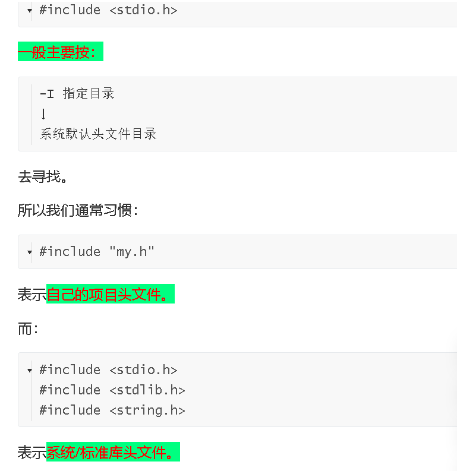

我已经把这段 **《4_2-2.GCC常用选项》** 看了一遍。它大约 **23 分 05 秒**。这节和上一节关系特别紧：上一节解决“GCC内部经历什么阶段”，这一节开始解决“**实际写多个 `.c` 文件、头文件和库的时候，gcc 命令到底怎么写**”。

# 视频分析：4_2-2 GCC常用选项

## 1. 视频类型判断

- **主要类型：教程类 / 讲解类**
- **次要类型：Linux 编译实操类**
- 判断依据：
  1. 大量终端实际执行 `gcc` 命令。
  2. 重点讲 `-c、-o、-I、-L、-l` 等选项。
  3. 从单个文件进一步过渡到**多个源文件、静态库 `.a`、动态库 `.so`**。
  4. 最后还介绍了查看宏、依赖文件和 GCC 默认搜索路径的方法。

------

## 2. 一句话总结

这节视频真正想建立的是下面这张关系：

```text
源文件：
main.c   sub.c
   │       │
   │ gcc -c
   ↓       ↓
main.o   sub.o
   │       │
   └───┬───┘
       │
       ├── 直接链接
       │
       ├── sub.o → libsub.a   静态库
       │
       └── sub.o → libsub.so  动态库
       │
       ↓
      test
```

与此同时，<span style="color:#FF0000; background:#00FF80;">你还要学会告诉 GCC：</span>

```text
-I → 去哪里找 .h
-L → 去哪里找库
-l → 要链接哪个库
```

这三个非常重要。

------

## 3. 时间段拆解

| 时间段           | 主要内容                                            | 你应该重点看什么                     |
| ---------------- | --------------------------------------------------- | ------------------------------------ |
| 00:00-01:40      | 回顾 GCC 编译阶段及前面 `-E/-S/-c/-o`               | `.c → .i → .s → .o → 可执行文件`     |
| 01:40-06:20      | 多个 `.c` 文件如何编译                              | 一次性编译 vs 分开生成 `.o`          |
| 06:20-08:30      | 介绍常用 GCC 参数                                   | `-E -c -o -I -L -l`                  |
| 08:30-12:20      | `main.c/sub.c/sub.h` 实际编译，演示头文件和链接错误 | `-I` 与 undefined reference 的区别   |
| 12:20-15:00      | 制作、使用静态库                                    | `sub.o → libsub.a`，`ar crs`         |
| 14:00-18:20 左右 | 制作、使用动态库                                    | `gcc -shared -o libsub.so sub.o`     |
| 18:20-20:40      | 动态库运行时查找问题                                | `-L` 和 `LD_LIBRARY_PATH` 不是一回事 |
| 20:40-23:05      | 几个很有用的 GCC 命令                               | `-dM`、依赖文件、默认头文件搜索路径  |

时间点根据视频画面和命令切换划分，个别节点会有十几秒左右误差。

------

## 4. 这一节最核心的 6 个 GCC 选项

视频里的表格其实非常值得保存。

| 选项 | 作用                        |
| ---- | --------------------------- |
| `-E` | 只进行预处理                |
| `-c` | 编译到 `.o`，不进行最终链接 |
| `-o` | 指定输出文件名字            |
| `-I` | 指定头文件搜索目录          |
| `-L` | 指定链接时的库搜索目录      |
| `-l` | 指定链接哪个库              |

你可以直接把它分成三组：

```text
控制编译阶段：
-E
-c

控制文件：
-o

告诉 GCC 去哪里找东西：
-I    找头文件
-L    找库
-l    选库
```

------

## 5. 多个 `.c` 文件为什么要单独编译？

视频中用了：

```text
main.c
sub.c
sub.h
```

比如：

```c
// main.c

#include <stdio.h>
#include "sub.h"

int main()
{
    printf("Main fun!\n");
    sub_fun();

    return 0;
}
```

而：

```c
// sub.c

void sub_fun()
{
    printf("Sub fun!\n");
}
```

最简单的办法当然是：

```bash
gcc -o test main.c sub.c
```

GCC 会帮你：

```text
main.c → main.o
sub.c  → sub.o
             ↓
          链接
             ↓
            test
```

但是视频接着介绍了<span style="color:#FF0000; background:#00FF80;">工程中更常见的：</span>

```bash
gcc -c -o main.o main.c
gcc -c -o sub.o sub.c

gcc -o test main.o sub.o
```

<span style="color:#FF0000; background:#00FF80;">为什么这么做？</span>

因为<span style="background:#00FF80;">假设以后有：</span>

```text
main.c
a.c
b.c
c.c
...
999.c
```

<span style="color:#FF0000; background:#00FF80;">只修改：</span>

```text
a.c
```

<span style="color:#FF0000; background:#00FF80;">没必要把剩下 999 个文件重新编译。</span>

只需要：

```text
a.c
 ↓
a.o
```

<span style="background:#00FF80;">然后把所有 `.o` 重新链接即可。</span>

这<span style="background:#00FF80;">其实就是后面 **Makefile** 的重要基础。</span>

------

## 6. 视频里出现的两种错误，要特别分清

这是这节课非常重要的地方。

### 第一种：找不到头文件

视频中出现类似：

```text
fatal error: sub.h: No such file or directory
```

这代表：

> **编译/预处理阶段不知道 `sub.h` 在哪里。**

解决的方向是：

```bash
-I
```

例如：

```bash
gcc -c main.c -I ./include
```

意思：

> <span style="background:#00FF80;">找头文件的时候，再去 `./include` 看看。</span>

所以：

```text
找不到 xxx.h
↓
首先想到 -I
```

------

### 第二种：`undefined reference`

视频中又出现类似：

```text
undefined reference to `sub_fun'
collect2: error: ld returned 1 exit status
```

这个错误和刚才完全不一样。

这里不是：

```text
sub.h 找不到
```

而是：

> <span style="background:#00FF80;">**已经知道 `sub_fun()` 这个函数存在，但是链接的时候找不到它真正的实现。**</span>

比如：

```c
// sub.h
void sub_fun(void);
```

只是告诉编译器：

> 有这么一个函数。

但真正代码在：

```text
sub.c
↓
sub.o
```

如果你只：

```bash
gcc -o test main.c
```

那么链接阶段：

```text
main.o：
我要 sub_fun

链接器：
sub_fun 在哪？？？
```

于是：

```text
undefined reference to sub_fun
```

加入：

```bash
gcc -o test main.c sub.c
```

或者：

```bash
gcc -o test main.o sub.o
```

才能解决。

所以<span style="color:#FF0000; background:#00FF80;">这两个错误以后看到要条件反射：</span>

```text
No such file ... xxx.h
→ -I / 头文件搜索问题

undefined reference to xxx
→ 链接问题
→ 缺 .o / .a / .so
```

------

## 7. `-I`、`-L`、`-l` 正好对应三件不同的事情

这三个长得很像，但千万不要混。

### `-I`

<span style="background:#00FF80; color:#FF0000;">大写 i：</span>

```bash
-I ./include
```

告诉 GCC：

> <span style="background:#00FF80;">**去哪里找头文件 `.h`。**</span>

对应：

```c
#include "sub.h"
```

------

### `-L`

<span style="color:#FF0000; background:#00FF80;">大写 L：</span>

```bash
-L ./lib
```

告诉链接器：

> <span style="background:#00FF80;">**去哪个目录找库文件。**</span>

比如目录：

```text
./lib/
├── libsub.a
└── libsub.so
```

那么：

```bash
-L ./lib
```

就是告诉链接器：

> 去 `./lib` 找库。

------

### `-l`

<span style="color:#FF0000; background:#00FF80;">小写 L：</span>

```bash
-lsub
```

意思：

> <span style="background:#00FF80;">我要链接名为 `sub` 的库。</span>

它会按照类似：

```text
lib + sub + .so
```

<span style="color:#FF0000; background:#00FF80;">或者：</span>

```text
lib + sub + .a
```

寻找：

```text
libsub.so
libsub.a
```

所以：

```bash
gcc main.o -L ./lib -lsub -o test
```

可以翻译成人话：

```text
main.o

-L ./lib
→ 去 ./lib 找库

-lsub
→ 找 libsub.so / libsub.a

-o test
→ 最终程序叫 test
```

------

## 8. 静态库 `.a` 怎么做？

视频实际演示了：

```bash
gcc -c -o sub.o sub.c
```

得到：

```text
sub.o
```

然后：

```bash
ar crs libsub.a sub.o
```

得到：

```text
libsub.a
```

因此：

```text
sub.c
 ↓ gcc -c
sub.o
 ↓ ar crs
libsub.a
```

这里的：

```text
ar
```

可以先理解成：

> <span style="background:#00FF80;">**专门用于创建/管理静态库 `.a` 的工具。**</span>

如果有：

```text
a.o
b.o
c.o
```

完全可以：

```bash
ar crs libabc.a a.o b.o c.o
```

所以你之前问过的关系，现在在视频里真正落地了：

```text
.o
↓
可以被打包
↓
.a
```

------

## 9. 静态库怎么用？

视频中的思路类似：

```bash
gcc -o test main.o libsub.a
```

这里相当于：

```text
main.o
+
libsub.a
↓
链接
↓
test
```

链接器发现：

```text
main.o：
我要 sub_fun
```

然后去：

```text
libsub.a
```

里面<span style="color:#FF0000; background:#00FF80;">找到相关 `.o`。</span>

静态链接之后，需要的代码被放入最终程序。

<span style="background:#00FF80;">所以通常：</span>

```text
test
```

<span style="color:#FF0000; background:#00FF80;">运行时不再需要原来的：</span>

```text
libsub.a
```

<span style="color:#FF0000; background:#00FF80;">这就是“静态”的一个重要特点。</span>

------

## 10. 动态库 `.so` 怎么制作？

视频里出现：

```bash
gcc -shared -o libsub.so sub.o
```

于是：

```text
sub.o
↓
gcc -shared
↓
libsub.so
```

注意这里：

```text
-shared
```

表示：

> 生成共享库。

所以：

```text
.o → .so
```

不是用 `ar`。

而：

```text
.o → .a
```

主要用：

```bash
ar
```

可以这样记：

```text
静态库：
.o
 ↓ ar
.a


动态库：
.o
 ↓ gcc -shared / ld
.so
```

------

## 11. 为什么链接动态库成功了，运行时却可能失败？

这是这节视频非常值得注意的地方。

编译链接时可能：

```bash
gcc -o test main.o -L ./lib -lsub
```

成功。

但运行：

```bash
./test
```

却可能提示：

```text
error while loading shared libraries:
libsub.so: cannot open shared object file
```

你可能会很奇怪：

> 刚才不是已经用 `-L` 找到它了吗？

关键来了：

### `-L`

只解决：

> <span style="background:#00FF80;">**链接时去哪找动态库。**</span>

------

但运行 `./test` 时，是：

> <span style="background:#00FF80;">**Linux 的动态加载器再次寻找 `.so`。**</span>

<span style="color:#FF0000; background:#00FF80;">这是另一个阶段。</span>

所以：

```text
编译/链接阶段
gcc
↓
-L ./xxx
↓
找到 libsub.so
```

和：

```text
程序运行阶段
./test
↓
动态加载器
↓
寻找 libsub.so
```

是<span style="color:#FF0000; background:#00FF80;">两码事。</span>

------

## 12.`LD_LIBRARY_PATH` 是干什么的？

视频后面给出了：

```bash
export LD_LIBRARY_PATH=$LD_LIBRARY_PATH:/a
```

它是在告诉系统：

> <span style="background:#00FF80;">**程序运行时寻找 `.so` 时，也去 `/a` 目录找。**</span>

因此：

```text
-I
→ 编译时找 .h

-L
→ 链接时找 .a/.so

LD_LIBRARY_PATH
→ 运行时找 .so
```

这三个放在一起特别重要：

```text
源码阶段：
#include "xxx.h"
      ↓
     -I

链接阶段：
libxxx.so/libxxx.a
      ↓
     -L、-l

运行阶段：
程序真正加载 libxxx.so
      ↓
LD_LIBRARY_PATH
```

这也是<span style="background:#00FF80; color:#FF0000;">这节视频我最建议你弄懂的部分之一</span>。

------

## 13. 后面几个“很有用的 GCC 选项”

大约 **21:00以后**，视频专门列了一组。

### 查看预处理结果

```bash
gcc -E main.c
```

也就是我们前面一直讨论的：

```text
.c
↓
预处理
↓
.i 的内容
```

------

### 查看所有宏

视频给出的：

```bash
gcc -E -dM main.c > 1.txt
```

这里：

```text
-dM
```

<span style="border:1px solid #330000; background:#00FF80; color:#FF0000;">会把宏定义打印出来。</span>

然后：

```text
> 1.txt
```

<span style="color:#FF0000;">是 Shell 重定向：</span>

> <span style="background:#00FF80;">把终端本来要显示的内容保存进 `1.txt`。</span>

这个正好能解释你之前问的：

> 为什么普通 `.i` 里面看不到 `#define`？

<span style="color:#FF0000; background:#00FF80;">普通 `-E` 主要看展开结果。</span>

但：

```bash
-dM
```

就是<span style="color:#FF0000; background:#00FF80;">专门要求 GCC：</span>

> <span style="background:#00FF80;">**把宏定义给我列出来。**</span>

------

## 14. 视频还出现了依赖文件

命令类似：

```bash
gcc -Wp,-MD,abc.dep -c -o main.o main.c
```

目的是生成：

```text
abc.dep
```

里面会记录：

```text
main.o 依赖哪些文件
```

例如可能类似：

```text
main.o:
    main.c
    sub.h
    stdio.h
    ...
```

这个东西后面学习 **Makefile 自动依赖** 时非常有用。

因为 Makefile 要知道：

> `sub.h` 一旦修改，到底应该重新编译哪些 `.c/.o`？

依赖文件就是干这个的。

现阶段不用把：

```text
-Wp,-MD
```

死记下来。

知道：

> <span style="background:#00FF80;">**GCC 可以自动帮 Makefile 生成“谁依赖谁”的信息。**</span>

就够用了。

------

## 15. 最后一条命令非常有用

视频里还展示了类似：

```bash
echo 'main(){}' | gcc -E -v -
```

这里主要不是编译这个 `main()`。

真正目的是借助：

```text
-v
```

查看 GCC 的详细信息。

你能看到：

```text
#include "..." search starts here:
#include <...> search starts here:

/usr/lib/gcc/...
/usr/local/include
/usr/include/x86_64-linux-gnu
/usr/include
```

这就是：

> **GCC 默认去哪里找头文件。**

这也正好和我们之前聊的 `-I` 接上了。

正常情况下：

```text
GCC 默认路径
↓
找得到头文件
↓
不用写 -I
```

如果你的头文件放在：

```text
/home/book/myinclude/
```

默认搜索不到：

```bash
-I/home/book/myinclude
```

就是在原有搜索路径基础上再告诉它一个目录。

------

## 16. 这一节与你前面的问题怎么串起来？

你之前已经逐渐建立：

```text
.c
↓ 预处理
.i
↓ cc1
.s
↓ as
.o
↓ collect2 / ld
可执行文件
```

这一节是在这个基础上增加：

```text
                       ┌──→ .a
                       │
.c → .i → .s → .o ─────┼──→ .so
                       │
                       └──→ 和其他 .o 直接链接
```

然后再补：

```text
.h 在哪里？
→ -I

.a/.so 在哪里？
→ -L

我要哪个库？
→ -l

.so 运行时在哪里？
→ LD_LIBRARY_PATH
```

这两节实际上是一套完整知识。

------

## 17. 这节你应该重点看什么？

这是一节教程类视频，所以**不要试图背每一条终端输出**。

你最应该搞懂的是这四组关系：

```text
① 多文件：
main.c + sub.c
↓
main.o + sub.o
↓
test


② 头文件：
#include "sub.h"
↓
-I 指定搜索目录


③ 静态库：
sub.o
↓ ar
libsub.a


④ 动态库：
sub.o
↓ gcc -shared
libsub.so

链接时寻找：
-L + -l

运行时寻找：
LD_LIBRARY_PATH
```

------

## 18. 记忆版总结

```text
类型：
GCC 实操教程

主线：
从单文件编译进入多文件、头文件、静态库和动态库

核心选项：
-E  = 只预处理
-c  = 生成 .o，不链接
-o  = 指定输出文件
-I  = 指定头文件目录
-L  = 指定库目录
-l  = 指定库名

多文件：
main.c + sub.c
→ main.o + sub.o
→ test

静态库：
.o → ar → .a

动态库：
.o → gcc -shared → .so

三个“找”的区别：
-I = 编译时找 .h
-L = 链接时找库
LD_LIBRARY_PATH = 运行时找 .so

最重要时间段：
约 06:20-20:40

一句话记忆：
GCC 不只是“编译一个 C 文件”，真正做项目时还必须解决
“头文件去哪里找、目标文件怎么组合、库在哪里、运行时动态库在哪里”。
```

结合你前面一直在问的内容，**我觉得你下一步最值得彻底弄懂的是 `-I、-L、-l、LD_LIBRARY_PATH` 这四个东西为什么分成四个，而不是 GCC 用一个路径把所有文件都找完**。这个地方一旦懂了，后面静态库、动态库和 Makefile 会顺很多。


# 问题延伸（上面结尾那一句话）

-I、-L、-l、LD_LIBRARY_PATH` 这四个东西为什么分成四个，而不是 GCC 用一个路径把所有文件都找完。


因为这四个东西其实不是在解决“同一个问题”，而是在解决 **4 个不同阶段、4 种不同对象的问题**。所以 GCC 不会拿一个路径把所有东西混着找。

你可以先记一句最核心的话：

> **`-I` 管头文件，`-L` 管链接库目录，`-l` 管具体要链接哪个库，`LD_LIBRARY_PATH` 管程序运行时去哪里找动态库。**

它们之所以分开，是因为 **工作的时间不同、负责的程序不同、要找的文件也不同**。

------

先看整个流程：

```text
main.c
  │
  │ 预处理 / 编译
  │
  │ 要找：xxx.h
  │ 用：-I
  ↓
main.o
  │
  │ 链接
  │
  │ 要找：libxxx.so / libxxx.a
  │ 用：-L + -l
  ↓
app
  │
  │ 运行
  │
  │ 要找：libxxx.so
  │ 用：LD_LIBRARY_PATH
  ↓
程序真正跑起来
```

你会发现，虽然看起来都在“找文件”，但其实不是同一回事。

------

## 1. 为什么 `-I` 单独存在？

<span style="background:#00FF80;">因为 `-I` 是给 **预处理器/编译器** 用的。</span>

比如：

```c
#include "my.h"
```

GCC 在 `.c → .i` 这个阶段就必须找到：

```text
my.h
```

假设：

```text
project/
├── main.c
└── include/
    └── my.h
```

那你写：

```bash
gcc -I./include -c main.c
```

这里：

```text
-I./include
```

意思是：

> <span style="color:#FF0000; background:#00FF80;">“预处理的时候，去 `./include` 里找头文件。”</span>

这时候链接器根本还没开始工作。

所以：

```text
-I
```

只需要关心：

```text
.h
```

完全没必要顺便去管 `.so`、`.a`。

------

## 2. 为什么 `-L` 又要单独存在？

因为<span style="color:#FF0000; background:#00FF80;">到了链接阶段，头文件已经没用了。（注意：到了链接阶段的时候，头文件不仅是已经没有用了，而是已经不存在了）</span>

比如：

```c
#include "sub.h"

int main()
{
    sub_fun();
}
```

头文件：

```c
void sub_fun(void);
```

只是<span style="color:#FF0000; background:#00FF80;">告诉编译器</span>：

> “有一个叫 `sub_fun` 的函数。”

但是<span style="color:#FF0000; background:#00FF80;">这个函数真正的机器码可能在：</span>

```text
libsub.so
```

或者：

```text
libsub.a
```

所以<span style="color:#FF0000; background:#00FF80;">链接的时候要另外寻找库</span>。

假设：

```text
project/
├── main.o
└── lib/
    └── libsub.so
```

你就要：

```bash
gcc main.o -L./lib -lsub -o app
```

这里：

```text
-L./lib
```

意思是：

> “链接时去 `./lib` 目录找库。”

所以：

```text
-I
```

和：

```text
-L
```

虽然长得像，但实际上是两个阶段的搜索路径。

可以简单记：

```text
-I = Include Path
-L = Library Path
```

------

## 3. 那为什么已经有 `-L` 了，还需要 `-l`？

这个特别关键。

因为：

```text
-L
```

只回答了：

> **去哪找？**

但没有回答：

> **找谁？**

假设：

```text
./lib/
├── libmath.a
├── libjpeg.so
├── libpng.so
├── libsub.so
└── libabc.a
```

你写：

```bash
-L./lib
```

只是告诉链接器：

> “这里是一个库目录。”

但链接器会问：

> “这里一堆库，我到底要哪个？”

所以还需要：

```bash
-lsub
```

告诉它：

> “我要 `sub` 这个库。”

于是：

```text
-lsub
```

会去匹配类似：

```text
libsub.so
```

或：

```text
libsub.a
```

所以：

```text
-L = 地点
-l = 名字
```

这个类比最好记。

比如：

```bash
gcc main.o -L/home/book/lib -lsub -o app
```

等于：

> 去 `/home/book/lib` 这个图书馆，找一本叫 `sub` 的书。

------

## 4. 为什么不写成一个参数？

比如你可能会想：

```text
为什么不直接：
gcc -Path ./include ./lib ...
```

然后 GCC 自己判断：

```text
.h 去 include
.so 去 lib
```

理论上当然可以设计成那样。

但是这样会有很多问题。

------

### 第一，阶段不同

在预处理的时候，只需要头文件：

```text
.c → .i
```

这时库文件完全没用。

而在链接的时候：

```text
.o → 可执行文件
```

这时候 `.h` 又没用了。

所以如果共用一个路径列表：

```text
/path1
/path2
/path3
/path4
```

那么：

```text
预处理器
```

<span style="color:#FF0000;">要扫描一遍，</span>

```text
链接器
```

<span style="color:#FF0000;">又要扫描一遍。</span>

不仅混乱，而且没有必要。

------

## 5. 第二，文件名字可能冲突

假设你有：

```text
/include/
    test.h

/lib/
    libtest.so
```

如果所有东西都放在同一搜索路径系统里，那么：

```text
test
```

这个概念在不同阶段代表完全不同东西。

预处理器关心：

```text
test.h
```

链接器关心：

```text
libtest.so
libtest.a
```

分开以后逻辑特别清楚：

```text
-I → 头文件世界
-L → 库文件世界
```

不会互相干扰。

------

## 6. 第三，负责寻找它们的程序都不一样

这个其实是最根本的原因。

你输入：

```bash
gcc ...
```

虽然只有一个 `gcc`，但背后不是只有一个程序。

大概：

```text
gcc
│
├── 预处理器
│     ↓
│    使用 -I
│
├── cc1
│
├── as
│
└── collect2 / ld
      ↓
     使用 -L / -l
```

所以：

```text
-I
```

主要是交给预处理相关阶段。

而：

```text
-L / -l
```

主要影响链接器。

<span style="color:#FF0000; background:#00FF80;">也就是说，它们本来就是不同工具的参数体系。</span>

------

## 7. 最容易混淆的是：为什么 `LD_LIBRARY_PATH` 不能直接用 `-L` 代替？

因为：

```text
-L
```

只在**链接那一瞬间**有效。

比如：

```bash
gcc main.o -L./lib -lsub -o app
```

链接器利用：

```text
-L./lib
```

找到：

```text
./lib/libsub.so
```

然后链接成功。

但是当你关闭终端、过了一会儿，再运行：

```bash
./app
```

这时候 GCC 已经不在场了。

现在负责工作的是：

> **Linux 动态链接器 / 动态加载器**

它只知道：

```text
app 需要 libsub.so
```

但它未必知道：

```text
./lib
```

因为：

```text
-L./lib
```

只是你当初传给 GCC / ld 的命令行参数。

程序运行时并不会自动重新执行：

```bash
gcc ...
```

所以需要另一个运行时机制：

```text
LD_LIBRARY_PATH
```

------

## 8. 你可以把“编译”和“运行”想成两个完全分开的时间点

例如今天下午你编译：

```bash
gcc main.o -L/home/book/lib -lsub -o app
```

编译成功。

然后把：

```text
app
```

复制到另一台机器。

晚上在另一台机器运行：

```bash
./app
```

你<span style="color:#FF0000; background:#00FF80;">当初那个：</span>

```text
-L/home/book/lib
```

<span style="color:#FF0000; background:#00FF80;">根本不存在于这次命令里。</span>

甚至另一台机器都没有：

```text
/home/book/lib
```

所以 <span style="background:#00FF80;">Linux 必须重新解决：</span>

> <span style="background:#00FF80;">“运行的时候，`libsub.so` 在哪里？”</span>

这就是<span style="color:#FF0000; background:#00FF80;">运行时搜索机制存在的原因。</span>

------

## 9. 为什么静态库 `.a` 不需要 `LD_LIBRARY_PATH`？

因为：

```text
.a
```

和：

```text
.so
```

工作方式不同。

静态库：

```text
main.o
+
libsub.a
↓
链接
↓
app
```

链接时会把需要的代码放进 `app` 里。

所以之后：

```bash
./app
```

不再需要：

```text
libsub.a
```

因此：

```text
-L / -l
```

解决完就结束了。

------

而动态库：

```text
main.o
+
libsub.so
↓
链接
↓
app
```

通常只是让 `app` 记录：

```text
我运行时需要 libsub.so
```

真正运行：

```bash
./app
```

还必须再次找到：

```text
libsub.so
```

所以才需要运行时搜索路径。

------

## 10. 用一个生活例子，你会非常容易分清

假设你在组装一台电脑。

### `-I`

像：

> 去哪里找“说明书”。

```text
头文件 .h
= 说明书
```

告诉编译器：

```text
这个函数叫什么
参数是什么
返回值是什么
结构体长什么样
```

------

### `-L`

像：

> 零件仓库在哪里。

```text
-L /warehouse
```

就是：

> 去 `/warehouse` 仓库找零件。

------

### `-l`

像：

> 我要哪个零件。

```text
-lsub
```

就是：

> 我要 `sub` 这个零件。

所以：

```text
-L = 仓库地址
-l = 零件名称
```

------

### `LD_LIBRARY_PATH`

像：

> 电脑已经组装好了，但是某个外挂设备不是装死在机器里的，开机时还必须能找到它。

所以启动的时候告诉系统：

```text
这个动态设备在这里。
```

这就是：

```text
LD_LIBRARY_PATH
```

------

## 11. 为什么这种设计反而更合理？

因为每一层只管自己该管的事情：

```text
预处理阶段
只管头文件
→ -I

链接阶段
只管目标文件和库
→ -L / -l

运行阶段
只管程序真正要加载的共享库
→ LD_LIBRARY_PATH
```

这其实是一种很经典的软件设计思想：

> **职责分离。**

谁负责什么，就只拿自己需要的信息。

------

## 12. 你现在可以这样理解一条完整命令

假设目录：

```text
project/
├── main.c
├── include/
│   └── sub.h
└── lib/
    └── libsub.so
```

编译：

```bash
gcc main.c -I./include -L./lib -lsub -o app
```

逐段翻译：

```text
gcc main.c
→ 编译 main.c

-I./include
→ 预处理时去 ./include 找 sub.h

-L./lib
→ 链接时去 ./lib 找库

-lsub
→ 我要 libsub.so / libsub.a

-o app
→ 最终程序叫 app
```

然后：

```bash
export LD_LIBRARY_PATH=./lib:$LD_LIBRARY_PATH
./app
```

意思：

```text
LD_LIBRARY_PATH=./lib
→ 程序运行时也去 ./lib 找动态库

./app
→ 真正启动程序
```

所以完整时间线：

```text
main.c
│
│ -I
│ 找 sub.h
↓
main.o
│
│ -L
│ 去 lib 目录
│
│ -lsub
│ 找 libsub.so
↓
app
│
│ LD_LIBRARY_PATH
│ 运行时再次找 libsub.so
↓
程序运行
```

这就是为什么看起来都是“路径”，却要分成几个参数：**不是 GCC 故意搞复杂，而是它们本来就处于不同生命周期。**

你只要以后问自己三个问题就基本不会混：

```text
我现在是在找 .h 吗？
→ -I

我现在是在链接库吗？
→ -L + -l

我现在已经 ./app 运行了吗？
→ 动态库搜索 / LD_LIBRARY_PATH
```

这样判断会非常稳。


# 问题延伸（补充）

-I -L -l lib.so的LD_LIBRARY_PATH 以及 头文件等，编译器，链接器等，它们之间的关系都是什么样的呢，我还有什么地方有缺失的吗，给我弄清楚。


对，你现在其实已经摸到 **GCC 工具链的完整骨架**了。你缺的不是某一个选项，而是还没有把“**源代码、头文件、编译器、目标文件、库、链接器、动态加载器、搜索路径**”放到同一张图里。

先看这一张总图，后面所有东西都往这里塞：

```text
                    你写的工程
        ┌─────────────────────────────┐
        │ main.c                      │
        │ my.h                        │
        │ 其他 .c                     │
        └─────────────────────────────┘
                      │
                      │ #include "my.h"
                      │
                      │ 找头文件：
                      │ 默认目录 + -I
                      ↓
               【预处理阶段】
                      │
                  main.i
                      │
                      │ cc1 编译
                      ↓
               【编译阶段】
                      │
                  main.s
                      │
                      │ as 汇编
                      ↓
               【汇编阶段】
                      │
                  main.o
                      │
        ┌─────────────┼──────────────┐
        │             │              │
      其他.o         .a             .so
                    静态库          动态库
        │             │              │
        └─────────────┼──────────────┘
                      │
                找库的位置：-L
                指定哪个库：-l
                      │
                      ↓
              collect2 / ld
               【链接阶段】
                      │
                      ↓
                    app
                      │
                      │ ./app
                      ↓
             Linux动态加载器
                      │
            程序需要 libxxx.so
                      │
             去哪里找运行时.so？
                      │
        ┌─────────────┼─────────────┐
        │             │             │
     RUNPATH    LD_LIBRARY_PATH   系统默认路径
        │             │             │
        └─────────────┼─────────────┘
                      ↓
                  程序运行
```

这张图基本就是你现在这一部分知识的“地图”。

------

## 一、先把所有东西分成 4 类

你现在提到的东西其实属于不同类别。

| 类别          | 东西                  | 本质                                                         |
| ------------- | --------------------- | ------------------------------------------------------------ |
| 源代码相关    | `.c` `.h`             | 给人和编译器看的代码                                         |
| 中间/目标文件 | `.i` `.s` `.o`        | 编译过程中产生                                               |
| 库            | `.a` `.so`            | 已经编译好的代码集合                                         |
| 工具          | `gcc` `cc1` `as` `ld` | <span style="color:#FF0000; background:#00FF80;">处理上面这些文件的软件</span> |

而：

```text
-I
-L
-l
LD_LIBRARY_PATH
```

又属于：

> <span style="background:#00FF80;">**告诉不同阶段“去哪里找什么”的规则。**</span>

所以千万不要把 `.so`、`-L`、`ld` 放在同一类里。

例如：

```text
libtest.so
```

是一个**文件**。

```text
-L
```

是一个**命令参数**。

```text
ld
```

是一个**程序/工具**。

------

## 二、`.c` 和 `.h` 到底是什么关系？

比如：

```c
// add.h

int add(int a, int b);
```

然后：

```c
// add.c

int add(int a, int b)
{
    return a + b;
}
```

最后：

```c
// main.c

#include "add.h"

int main()
{
    return add(1, 2);
}
```

这里最关键的区别：

```text
add.h
↓
告诉编译器：
“add函数长什么样”

add.c
↓
真正提供：
“add函数的代码”
```

也就是说：

> `.h` 通常<span style="color:#FF0000; background:#00FF80;">主要提供声明、类型、宏、结构体等信息。</span>

真正的实现通常在：

```text
.c
```

或者已经被编译进：

```text
.o
.a
.so
```

里面。

------

## 三、`-I` 是给谁用的？

`-I` 主要解决：

> **<span style="color:#FF0000; background:#00FF80;">预处理阶段</span>找不到 `.h`。**

比如：

```text
project/
├── main.c
└── include/
    └── add.h
```

main.c：

```c
#include "add.h"
```

GCC 默认找不到：

```text
./include/add.h
```

于是：

```bash
gcc -I./include -c main.c
```

这里：

```text
-I./include
```

相当于告诉预处理器：

> “找 `.h` 的时候，再去 `./include` 看。”

所以：

```text
-I
↓
头文件搜索路径
↓
主要影响 .c → .i
```

------

## 四、GCC 本身也有默认头文件目录

所以：

```c
#include <stdio.h>
```

你一般不用：

```bash
gcc -I/usr/include ...
```

因为 GCC 本来就知道一些默认目录，例如：

```text
/usr/local/include
/usr/include
/usr/include/架构相关目录
GCC自己的include目录
```

所以准确理解：

```text
-I
```

不是：

> “告诉 GCC 唯一去哪找。”

而是：

> **在默认搜索机制之外，增加你自己的头文件路径。**

------

## 五、找到 `.h` 后，接下来真正编译 `.c`

例如：

```text
main.c
  │
  │ 预处理
  ↓
main.i
  │
  │ cc1
  ↓
main.s
  │
  │ as
  ↓
main.o
```

这里三个阶段：

```text
预处理器
.c → .i

cc1
.i → .s

as
.s → .o
```

所以：

```text
.o
```

已经包含 CPU 机器指令。

但它通常还不能单独运行。

------

## 六、为什么 `.o` 还不能运行？

比如 `main.o` 里面：

```text
main()
调用 add()
```

但是 `main.o` 可能只有：

> “我要调用一个叫 `add` 的东西。”

真正的 `add()` 在：

```text
add.o
```

里面。

所以：

```text
main.o        add.o
   │            │
   │ 我要add    │ 我有add
   └──────┬─────┘
          ↓
         ld
          ↓
         app
```

这就是：

> **链接。**

<span style="color:#FF0000; background:#00FF80;">链接器负责把不同目标文件之间的符号引用解决掉。</span>

------

## 七、`.o`、`.a`、`.so` 是什么关系？

这个非常关键。

## `.o`

单个目标文件：

```text
add.c
↓
add.o
```

可以理解成：

> 一个编译好的机器码零件。

------

## `.a`

静态库。

可以粗略理解成：

> **很多 `.o` 打包在一起。**

例如：

```text
libmath.a
├── add.o
├── sub.o
├── mul.o
└── div.o
```

通常：

```bash
ar rcs libmath.a add.o sub.o mul.o div.o
```

得到。

------

## `.so`

动态共享库。

例如：

```text
libmath.so
```

里面同样有已经编译好的机器代码，但使用方式跟 `.a` 不一样。

所以：

```text
                 ┌──→ libxxx.a
若干 .o ─────────┤
                 └──→ libxxx.so
```

不是：

```text
.o → .a → .so
```

这一点特别重要。

------

## 八、`-L` 是干嘛的？

现在到了：

```text
链接阶段
```

链接器可能需要找：

```text
libmath.a
```

或者：

```text
libmath.so
```

假设：

```text
project/
├── main.o
└── lib/
    └── libmath.so
```

链接器默认不知道：

```text
./lib
```

于是：

```bash
gcc main.o -L./lib ...
```

这里：

```text
-L./lib
```

表示：

> **链接的时候，额外去 `./lib` 目录寻找库。**

所以：

```text
-I = Include目录
     找 .h

-L = Library目录
     找 .a / .so
```

------

## 九、那已经有 `-L`，为什么还需要 `-l`？

因为：

```text
-L
```

只说了：

> **去哪找。**

没有说：

> **到底找哪个库。**

假设：

```text
./lib/
├── libabc.so
├── libmath.so
├── libjpeg.so
├── libpng.so
└── libtest.a
```

你写：

```bash
-L./lib
```

链接器会问：

> “好的，我知道仓库在哪了，但你要哪个？”

于是：

```bash
-lmath
```

告诉它：

> 我要 `math` 库。

通常对应寻找：

```text
libmath.so
```

或者：

```text
libmath.a
```

所以：

```text
-L = 去哪里

-l = 找谁
```

例如：

```bash
gcc main.o -L./lib -lmath -o app
```

翻译成人话：

> 去 `./lib` 这个目录里寻找 `math` 库，然后和 `main.o` 链接生成 `app`。

------

## 十、为什么 `-lmath` 对应 `libmath.so`？

GCC/链接器有一个库命名约定：

```text
-lxxx
```

对应：

```text
libxxx.so
```

或者：

```text
libxxx.a
```

所以：

```bash
-lfoo
```

对应：

```text
libfoo.so
libfoo.a
-lm
```

对应类似：

```text
libm.so
libm.a
```

这就是为什么不是：

```bash
-llibmath.so
```

------

## 十一、链接器到底是谁？

现在链接阶段：

```text
main.o
+
其他.o
+
.a
+
.so
+
启动代码
+
运行库
```

需要有人负责拼起来。

真正核心的链接器通常是：

```text
ld
```

而 GCC 通常还会使用：

```text
collect2
```

辅助完成链接。

所以简化：

```text
gcc
↓
collect2
↓
ld
```

最终：

```text
.o + 库
↓
可执行文件
```

------

## 十二、这里还有一个你之前容易漏掉的重要部分：GCC 会偷偷帮你加很多东西

你写：

```bash
gcc main.o -o app
```

看起来只有：

```text
main.o
```

其实链接时可能还有：

```text
crt1.o
crti.o
crtbegin.o
libc
libgcc
crtend.o
crtn.o
...
```

也就是说真正情况更像：

```text
启动代码
   │
main.o
   │
libc
   │
libgcc
   │
其他运行库
   │
   ↓
collect2 / ld
   ↓
app
```

所以：

> `gcc` 不只是帮你调用 `ld`，还帮你准备了很多默认链接内容。

这也是为什么平常推荐：

```bash
gcc main.o -o app
```

而不是自己直接写很长的：

```bash
ld ...
```

------

## 十三、静态库 `.a` 是怎么被链接的？

假设：

```text
main.o
+
libmath.a
```

链接器发现：

```text
main.o：
我要 add()
```

然后：

```text
libmath.a：
我这里有 add.o
```

于是从静态库里取出需要的代码。

最终：

```text
main.o
+
libmath.a 中需要的机器码
↓
app
```

之后：

```bash
./app
```

一般不需要再找到：

```text
libmath.a
```

因为所需代码已经放进程序里了。

所以：

```text
.a
↓
链接时使用
↓
运行时通常不用再找
```

------

## 十四、动态库 `.so` 完全不一样

例如：

```text
main.o
+
libmath.so
↓
链接
↓
app
```

这里通常不会像静态库一样把全部需要的机器代码直接复制进 `app`。

最终程序更多会记录：

```text
我运行的时候需要：
libmath.so
```

所以：

```text
链接成功
```

并不意味着：

```text
运行一定成功
```

这是特别重要的一点。

------

## 十五、为什么还要 `LD_LIBRARY_PATH`？

假设链接：

```bash
gcc main.o -L./lib -lmath -o app
```

成功。

说明：

```text
链接阶段
↓
-L./lib
↓
找到了 libmath.so
```

但是运行：

```bash
./app
```

此时：

> GCC、collect2、ld 都已经完成工作了。

现在工作的是另外一个程序：

### Linux 动态加载器

它看到：

```text
app 需要 libmath.so
```

于是问：

> “libmath.so 在哪？”

注意：

```text
-L./lib
```

是以前链接时传给 `ld` 的。

Linux 动态加载器并不一定知道这个参数。

所以可能：

```text
链接成功
↓
./app
↓
找不到 libmath.so
↓
运行失败
```

------

## 十六、`LD_LIBRARY_PATH` 就是告诉运行时加载器去哪里找 `.so`

例如：

```bash
export LD_LIBRARY_PATH=./lib:$LD_LIBRARY_PATH
```

意思：

> 程序运行时，再去 `./lib` 找动态库。

所以：

```text
-L
↓
链接时找 .so

LD_LIBRARY_PATH
↓
运行时找 .so
```

它们俩虽然都可能找到：

```text
同一个 libmath.so
```

但是发生在**完全不同的时间点**。

------

## 十七、这里还有一个你之前没有完全加入体系的角色：动态加载器

这很重要。

完整角色应该是：

```text
预处理器
↓
处理 #include / #define

cc1
↓
C → 汇编

as
↓
汇编 → .o

ld
↓
.o + 库 → 可执行文件

Linux动态加载器
↓
程序运行时加载 .so
```

Linux 上通常能看到类似：

```text
ld-linux-x86-64.so.2
```

ARM 系统则可能是其他对应架构的动态加载器。

注意：

```text
ld
```

和：

```text
ld-linux-xxx.so
```

不是同一个东西。

前者主要：

> **构建程序时链接。**

后者主要：

> **运行程序时装载动态库。**

这个是很多初学者容易漏掉的一环。

------

## 十八、所以完整的“谁找谁”是这样的

| 阶段   | 谁在工作      | 找什么        | 默认路径           | 自定义方式        |
| ------ | ------------- | ------------- | ------------------ | ----------------- |
| 预处理 | GCC预处理器   | `.h`          | 有                 | `-I`              |
| 编译   | `cc1`         | 已预处理C代码 | 不主要涉及文件搜索 | 编译选项          |
| 汇编   | `as`          | `.s`          | —                  | —                 |
| 链接   | `collect2/ld` | `.o/.a/.so`   | 有                 | `-L`              |
| 链接   | `ld`          | 指定哪个库    | —                  | `-lxxx`           |
| 运行   | 动态加载器    | `.so`         | 有                 | `LD_LIBRARY_PATH` |

这张表很值得记。

------

## 十九、还有一个很重要但你目前没提到：`RPATH / RUNPATH`

你已经知道：

```text
LD_LIBRARY_PATH
```

可以告诉运行时去哪找 `.so`。

但<span style="background:#00FF80; color:#FF0000;">它是</span>：

> <span style="background:#00FF80;">**环境变量。**</span>

还可以在构建程序时，把动态库搜索路径直接记录进可执行文件。

例如概念上：

```bash
gcc main.o -L./lib -ltest \
    -Wl,-rpath,/some/path \
    -o app
```

这样 `app` 自己可以记录运行时库搜索路径。

所以运行时除了：

```text
LD_LIBRARY_PATH
```

还可能有：

```text
RPATH / RUNPATH
```

你现阶段不用深入优先级，只要知道：

> **程序本身也可以记录“运行时去哪找 `.so`”。**

------

## 二十、还有一个经常一起出现的东西：`-D`

我们之前说：

```text
-I
```

解决头文件目录。

但是预处理阶段其实还有一个非常重要的选项：

```bash
-DDEBUG
```

相当于：

```c
#define DEBUG
```

例如：

```bash
gcc -DDEBUG main.c
```

那么：

```c
#ifdef DEBUG

printf("debug\n");

#endif
```

这一段就会留下。

所以预处理阶段以后可以记：

```text
-I
→ 去哪里找头文件

-D
→ 从命令行定义宏
```

------

## 二十一、还有一个你以后做交叉编译一定会碰到：sysroot

假设你在 x86 Ubuntu 上编译 ARM 程序。

不能简单地让 ARM 编译器使用：

```text
/usr/include
/usr/lib
```

里面全部的 x86 文件。

所以交叉工具链通常会有一个目标系统根目录：

```text
sysroot/
├── usr/include
├── usr/lib
├── lib
└── ...
```

里面放：

```text
ARM头文件
ARM libc
ARM .so
ARM .a
```

所以可以理解：

```text
x86 gcc
↓
有自己的头文件/库环境

ARM gcc
↓
也有属于目标ARM系统的头文件/库环境
```

这也是为什么一个完整的“交叉编译器”实际上是：

> **一整套工具链 + 目标系统运行库环境。**

------

## 二十二、用一个完整工程把所有东西串起来

假设：

```text
project/
│
├── main.c
│
├── include/
│   └── math.h
│
└── lib/
    └── libmath.so
```

main.c：

```c
#include "math.h"

int main()
{
    return add(1, 2);
}
```

------

首先：

```bash
gcc -I./include -c main.c -o main.o
```

发生：

```text
main.c
│
│ 找 math.h
│ 默认目录找不到
│ -I./include
↓
预处理
↓
编译
↓
汇编
↓
main.o
```

这里：

```text
-I
```

用完了。

------

然后：

```bash
gcc main.o -L./lib -lmath -o app
```

发生：

```text
main.o：
我要 add

-L./lib：
去这里找库

-lmath：
我要 libmath.so / libmath.a

libmath.so：
我提供 add

↓
ld 解决符号
↓
app
```

这里：

```text
-L
-l
```

用完了。

------

最后：

```bash
export LD_LIBRARY_PATH=./lib:$LD_LIBRARY_PATH
./app
```

发生：

```text
app启动
↓
动态加载器发现：
需要 libmath.so
↓
LD_LIBRARY_PATH
↓
找到 ./lib/libmath.so
↓
装入内存
↓
程序运行
```

所以整条链：

```text
              -I
               ↓
main.c + math.h
       │
       ↓
     main.o
       │
       │     -L        -l
       │      ↓         ↓
       └──── lib目录 + libmath.so
                  │
                  ↓
                 ld
                  ↓
                 app
                  │
                  │ LD_LIBRARY_PATH
                  ↓
              libmath.so
                  ↓
                运行
```

------

## 二十三、你目前还有哪些知识“缺口”？

你现在 GCC 基础这块已经覆盖不少了，但为了形成完整体系，建议再补这几个：

1. **`.h` 只有声明和 `.c` 有实现，这两者为什么需要分开。**
2. **符号是什么**：为什么会出现 `undefined reference`、`multiple definition`。
3. **静态库 `.a` 和动态库 `.so` 的真正区别**，特别是代码什么时候进入进程。
4. **链接顺序**，例如静态库为什么有时 `-lxxx` 放前面和后面结果不同。
5. **动态加载器**，这是你现在刚补上的关键角色。
6. **RPATH/RUNPATH 与 `LD_LIBRARY_PATH` 的区别。**
7. **默认搜索路径 + sysroot**，以后理解交叉编译特别重要。
8. **Makefile 如何把这些命令自动组织起来**，例如：

```makefile
CFLAGS  += -I./include
LDFLAGS += -L./lib
LDLIBS  += -lmath
```

这个阶段你会发现，Makefile 并没有创造新的编译原理，它只是帮你管理现在这些 GCC 命令。

------

## 最终记忆图

你可以把目前学到的内容压缩成这一张：

```text
                       【源代码】
                  main.c + xxx.h
                       │
              -I：去哪里找 .h
              -D：定义预处理宏
                       │
                       ↓
                    预处理
                       ↓
                     .i
                       │
                      cc1
                       ↓
                     .s
                       │
                      as
                       ↓
                     .o
                       │
          ┌────────────┼────────────┐
          │            │            │
        其他.o       libxxx.a     libxxx.so
                       │            │
                    静态库        动态库
          └────────────┼────────────┘
                       │
              -L：去哪里找库
              -l：具体找哪个库
                       │
                collect2 / ld
                       ↓
                  可执行文件 app
                       │
                       │ ./app
                       ↓
                 动态加载器
                       │
              需要 libxxx.so
                       │
          ┌────────────┼────────────┐
          │            │            │
      RUNPATH   LD_LIBRARY_PATH   系统默认
          │            │            │
          └────────────┼────────────┘
                       ↓
                 加载动态库
                       ↓
                    程序运行
```

你现在如果只记一句话，就记：

> <span style="background:#00FF80;">**`-I` 是编译前找“说明书 `.h`”；`-L` 是链接时告诉链接器“库仓库在哪”；`-l` 是告诉链接器“我要哪个库”；`LD_LIBRARY_PATH` 是程序已经生成以后，告诉 Linux 动态加载器“运行时去哪里找 `.so`”。而真正把 C 代码一路变成程序的工具链是 `预处理器 → cc1 → as → collect2/ld → 动态加载器`。**</span>

把这张关系图真正吃透之后，你再看 GCC、库、Makefile、交叉编译，基本就不会觉得它们是一堆互不相关的命令了。


# 问题1

源码阶段：

\#include "xxx.h"

​      ↓

​     -I


链接阶段：

libxxx.so/libxxx.a

​      ↓

​     -L、-l


运行阶段：

程序真正加载 libxxx.so

​      ↓

LD_LIBRARY_PATH

<span style="color:#FF0000; background:#00FF80;">这里我在使用gcc的时候除了使用-I -L 来自己指定去寻找的目录之外，应该还是有自己默认寻找的目录的吧，这里我有点疑惑，给我解释下。</span>


对，**GCC 本身就有默认搜索目录**。`-I`、`-L` 并不是“GCC 原本不知道去哪找，你必须告诉它”，而是：

> <span style="background:#00FF80;">**GCC 先有一套默认搜索路径；只有你的头文件/库不在默认路径里时，你才额外用 `-I`、`-L` 告诉它。**</span>

而且要特别注意：<span style="background:#00FF80;">**头文件、链接库、运行时动态库是三套不同的搜索机制和默认路径。**</span>

------

## 1. 先建立完整模型

可以把整个过程理解成：

```text
① 预处理/编译阶段

#include <stdio.h>
#include "my.h"
        │
        ↓
GCC 搜索头文件
        │
        ├── 默认头文件目录
        │
        └── 你用 -I 增加的目录
```

然后：

```text
② 链接阶段

gcc main.o -lxxx
        │
        ↓
寻找 libxxx.so / libxxx.a
        │
        ├── 默认库目录
        │
        └── 你用 -L 增加的目录
```

最后：

```text
③ 程序运行阶段

./app
  │
  ↓
需要 libxxx.so
  │
  ↓
Linux 动态加载器寻找
  │
  ├── 程序自己记录的路径
  ├── LD_LIBRARY_PATH
  ├── 系统动态库缓存
  └── 系统默认动态库目录
```

所以你可以理解为：

```text
-I
不是“唯一的头文件目录”
而是“额外增加一个头文件搜索目录”

-L
不是“唯一的库目录”
而是“额外增加一个链接库搜索目录”
```

------

## 2. 先看 `-I`：头文件本来就有默认目录

比如你写：

```c
#include <stdio.h>
```

然后直接：

```bash
gcc hello.c -o hello
```

你根本没写：

```bash
-I/usr/include
```

但 GCC 照样知道去哪找 `stdio.h`。

为什么？

因为 <span style="color:#FF0000; background:#00FF80;">GCC 自带默认头文件搜索路径。</span>

在<span style="background:#00FF80;">普通 Linux x86-64 系统中，经常能看到类似：</span>

```text
/usr/lib/gcc/x86_64-linux-gnu/版本号/include
/usr/local/include
/usr/include/x86_64-linux-gnu
/usr/include
```

具体目录会根据：

```text
GCC版本
Linux发行版
CPU架构
工具链
```

有所不同。

------

## 3. 你可以亲自查看 GCC 默认头文件搜索路径

这个命令非常推荐你实际敲一下：

```bash
echo | gcc -E -v -x c -
```

然后会看到类似：

```text
#include "..." search starts here:
#include <...> search starts here:
 /usr/lib/gcc/x86_64-linux-gnu/...
 /usr/local/include
 /usr/include/x86_64-linux-gnu
 /usr/include
End of search list.
```

这就是 GCC 告诉你：

> <span style="background:#00FF80;">“以后你写 `#include <xxx.h>`，我默认就会去这些地方找。”</span>

所以：

```c
#include <stdio.h>
```

不需要：

```bash
gcc -I/usr/include hello.c
```

因为 `/usr/include` 本来就在默认搜索路径里。

------

## 4. 那什么时候才需要 `-I`？

假设你自己创建：

```text
/home/book/project/
├── main.c
└── myinclude/
    └── test.h
```

`main.c`：

```c
#include <test.h>

int main()
{
    return 0;
}
```

你直接：

```bash
gcc main.c
```

GCC 默认搜索：

```text
/usr/local/include
/usr/include
...
```

但：

```text
/home/book/project/myinclude
```

根本不在默认路径里。

于是：

```text
fatal error: test.h: No such file or directory
```

这时候才需要：

```bash
gcc -I./myinclude main.c
```

相当于告诉 GCC：

```text
原来的默认路径继续保留

再增加：

./myinclude
```

于是搜索范围变成类似：

```text
./myinclude             ← 你加的
/usr/local/include      ← 默认的
/usr/include/...        ← 默认的
/usr/include            ← 默认的
```

所以<span style="background:#00FF80;"> `-I` 更准确的理解就是：</span>

> <span style="background:#00FF80; color:#FF0000;">**给 GCC 的头文件搜索路径列表增加一个目录。**</span>

------

## 5. `#include "xxx.h"` 和 `#include <xxx.h>` 搜索还稍微不一样

这个也很重要。

例如：

```c
#include "test.h"
```

<span style="color:#FF0000; background:#00FF80;">一般会优先考虑：</span>

```text
当前源文件附近/相关用户头文件路径
↓
-I 指定目录
↓
系统头文件目录
```

而：

```c
#include <stdio.h>
```

<span style="color:#FF0000; background:#00FF80;">一般主要按：</span>

```text
-I 指定目录
↓
系统默认头文件目录
```

去寻找。

所以我们通常习惯：

```c
#include "my.h"
```

表示<span style="color:#FF0000; background:#00FF80;">自己的项目头文件。</span>

而：

```c
#include <stdio.h>
#include <stdlib.h>
#include <string.h>
```

表示<span style="color:#FF0000; background:#00FF80;">系统/标准库头文件。</span>

------

## 6. 再来看 `-L`：链接器同样有默认库目录

比如非常简单：

```c
#include <stdio.h>

int main()
{
    printf("hello\n");
}
```

你执行：

```bash
gcc hello.c -o hello
```

你也没有写：

```bash
-L/lib
-L/usr/lib
```

但是仍然能够链接成功。

因为<span style="color:#FF0000; background:#00FF80;">链接阶段本身就有默认库搜索目录</span>。

普通 Linux 可能涉及类似：

```text
/lib
/usr/lib
/lib/x86_64-linux-gnu
/usr/lib/x86_64-linux-gnu
```

以及 GCC 工具链自己的：

```text
/usr/lib/gcc/x86_64-linux-gnu/版本号/
```

具体路径同样依赖系统和架构。

------

## 7. `-L` 就是在默认库目录之外再加一个

假设你自己有：

```text
/home/book/project/
├── main.c
└── lib/
    └── libtest.so
```

然后：

```bash
gcc main.c -ltest -o app
```

其中：

```text
-ltest
```

要求寻找：

```text
libtest.so
```

或者：

```text
libtest.a
```

链接器先在自己的默认目录找。

但是：

```text
/home/book/project/lib
```

并不是默认目录。

于是可能：

```text
cannot find -ltest
```

这时候：

```bash
gcc main.c -L./lib -ltest -o app
```

含义就是：

```text
-L./lib
→ 再去 ./lib 搜库

-ltest
→ 我要 libtest.so / libtest.a
```

因此：

```text
-L = 去哪里找

-l = 找谁
```

<span style="color:#FF0000; background:#00FF80;">这两个一定要分清。</span>

------

## 8. 一个非常形象的例子

假设我要你去图书馆拿一本书。

`-L` 相当于：

> <span style="background:#00FF80;">去哪个图书馆找。</span>

```bash
-L/home/book/mylib
```

就是：

> “去 `/home/book/mylib` 这个图书馆。”

而：

```bash
-lmath
```

相当于：

> <span style="background:#00FF80;">“我要找名字叫 math 的那本书。”</span>

实际对应：

```text
libmath.so
```

或者：

```text
libmath.a
```

所以：

```bash
-L./lib -lmath
```

就是：

> <span style="background:#00FF80;">去 `./lib` 目录里寻找 `libmath.so` 或 `libmath.a`。</span>

------

## 9. 但是<span style="background:#00FF80; color:#FF0000;">运行时</span>又是另外一回事

这是最容易混淆的。

假设：

```bash
gcc main.c -L./lib -ltest -o app
```

链接成功了。

说明：

```text
链接时
↓
-L./lib
↓
成功找到了 libtest.so
```

但是你运行：

```bash
./app
```

却可能出现：

```text
error while loading shared libraries:
libtest.so: cannot open shared object file
```

很多初学者这时候会想：

> “奇怪，我明明 `-L./lib` 告诉它了啊？”

问题就在于：

```text
-L
```

<span style="color:#FF0000; background:#00FF80;">只告诉了：</span>

> **链接器。**

而<span style="color:#FF0000; background:#00FF80;">现在运行 `./app` 的已经不是 GCC 链接器了。</span>

现在<span style="background:#00FF80;">工作的主要是：</span>

> <span style="color:#FF0000; background:#00FF80;">**Linux 动态链接器/动态加载器。**</span>

它<span style="background:#00FF80;">并不会自动记住你刚刚命令行里的：</span>

```bash
-L./lib
```

------

## 10. 所以<span style="background:#00FF80;">运行时 `.so` 也有自己的默认搜索路径</span>

运行：

```bash
./app
```

如果程序依赖：

```text
libtest.so
```

<span style="color:#FF0000; background:#00FF80;">Linux 动态加载器会按照它自己的规则寻找。</span>

简化理解，可以看成：

```text
程序运行
↓
寻找 libtest.so
↓
① 程序本身记录的 RUNPATH/RPATH
↓
② LD_LIBRARY_PATH
↓
③ 系统动态库缓存
↓
④ 系统默认目录，例如 /lib、/usr/lib 等
```

实际优先级有一些细节和例外，但你现阶段按这个框架理解就可以。

------

## 11. 为什么系统的 `libc.so` 不需要 `LD_LIBRARY_PATH`？

比如你的：

```text
hello
```

基本都会依赖系统 C 库。

你运行：

```bash
./hello
```

并没有：

```bash
export LD_LIBRARY_PATH=/lib
```

为什么还是能运行？

因为：

```text
/lib
/usr/lib
以及架构相关目录
```

本来就是动态加载器认识的系统库位置，很多库还被记录在系统的动态库缓存中。

所以<span style="color:#FF0000; background:#00FF80;">系统库：</span>

```text
libc.so
libm.so
...
```

<span style="color:#FF0000; background:#00FF80;">一般不用你操心。</span>

------

## 12. 自己创建的 `.so` 就不一样

比如：

```text
/home/book/test/lib/libabc.so
```

<span style="background:#00FF80; color:#FF0000;">Linux 动态加载器通常不会默认满硬盘到处搜索。</span>

它不会：

```text
/home
/tmp
/Desktop
/project
...
```

全部遍历。

那效率会非常低，而且也不安全。

所以<span style="color:#FF0000; background:#00FF80;">如果 `.so` 放在自定义目录：</span>

```text
/home/book/test/lib
```

你<span style="color:#FF0000; background:#00FF80;">可能需要：</span>

```bash
export LD_LIBRARY_PATH=/home/book/test/lib:$LD_LIBRARY_PATH
```

告诉动态加载器：

> <span style="background:#00FF80;">运行程序的时候，也去这里找 `.so`。</span>

------

## 13. 所以这里其实有三套“默认搜索路径”

这就是你现在最应该建立起来的概念。

### 第一套：头文件搜索路径

工作者：

```text
GCC 预处理器
```

寻找：

```text
.h
```

默认有：

```text
/usr/include
/usr/local/include
GCC自己的include目录
架构相关include目录
...
```

你额外增加：

```bash
-Ixxx
```

------

### 第二套：链接库搜索路径

工作者：

```text
GCC / collect2 / ld
```

寻找：

```text
.a
.so
```

默认有：

```text
/lib
/usr/lib
GCC自己的库目录
架构相关lib目录
...
```

你额外增加：

```bash
-Lxxx
```

然后：

```bash
-lxxx
```

告诉它具体链接哪个库。

------

### 第三套：运行时 `.so` 搜索路径

工作者：

```text
Linux动态加载器
```

寻找：

```text
程序运行时真正需要的 .so
```

<span style="color:#FF0000; background:#00FF80;">默认认识系统动态库目录以及系统动态库缓存。</span>

<span style="color:#FF0000; background:#00FF80;">你额外告诉它</span>：

```bash
LD_LIBRARY_PATH
```

------

## 14. 一张图彻底区分

```text
                   GCC 编译一个程序
                         │
          ┌──────────────┼───────────────┐
          │              │               │
      预处理/编译       链接            运行
          │              │               │
          ↓              ↓               ↓
        找 .h          找库            找 .so
          │              │               │
      默认include      默认lib          系统运行库路径
        路径             路径            + 缓存
          │              │               │
          +              +               +
         -I             -L         LD_LIBRARY_PATH
                         │
                         ↓
                        -l
                   指定到底哪个库
```

------

## 15. 还有一个细节：<span style="color:#FF0000;">`-L` 找 `.so` 和运行时找 `.so` 是两个“同名文件、不同任务”</span>

这一点非常关键。

比如：

```bash
gcc main.o -L./lib -ltest -o app
```

### 链接阶段

<span style="color:#FF0000; background:#00FF80;">`ld` 找：</span>

```text
./lib/libtest.so
```

主要为了知道：

```text
这个库提供哪些符号
比如：
add
sub
test_fun
```

<span style="background:#00FF80; color:#FF0000;">从而确认：</span>

```text
main.o 里面要的 test_fun
libtest.so 里面确实有
```

于是<span style="color:#FF0000; background:#00FF80;">链接成功。</span>

但是 <span style="color:#FF0000; background:#00FF80;">`.so` 的机器代码通常不会像静态库那样全部复制进 `app`。</span>

------

### 运行阶段

真正：

```bash
./app
```

这时候：

```text
Linux动态加载器
↓
再次寻找 libtest.so
↓
加载到进程地址空间
↓
真正使用里面的代码
```

所以：

```text
链接时找到了一次
≠
运行时就一定找得到
```

这就是为什么：

```text
-L
```

和：

```text
LD_LIBRARY_PATH
```

必须分开。

------

## 16. 那 `.a` 为什么没有“运行时搜索”？

因为静态库：

```text
libtest.a
```

在链接时，需要的代码已经被拿出来放进：

```text
app
```

大致：

```text
main.o
+
libtest.a
↓
链接
↓
app
   ↑
   已经包含所需代码
```

所以运行：

```bash
./app
```

通常不需要再找：

```text
libtest.a
```

因此：

```text
.a：
主要涉及 -L/-l
没有运行时 LD_LIBRARY_PATH 问题

.so：
链接阶段涉及 -L/-l
运行阶段还涉及动态库搜索
```

这个区别特别重要。

------

## 17. 你还可以查看 GCC 自己的库搜索路径

比如：

```bash
gcc -print-search-dirs
```

会看到类似：

```text
install: ...
programs: ...
libraries: ...
```

其中：

```text
libraries:
```

就是 GCC 使用的一些库搜索目录。

还可以：

```bash
gcc -v
```

观察更多工具链信息。

------

## 18. 对你以后学交叉编译特别重要的一点

如果你以后使用：

```bash
arm-linux-gnueabihf-gcc
```

或者其他 ARM 交叉编译器，那么它的默认搜索目录**不应该简单理解成你 Ubuntu x86 的 `/usr/include` 和 `/usr/lib`**。

它通常会有属于 ARM 工具链自己的：

```text
sysroot
├── usr/include
├── usr/lib
└── lib
```

因为：

```text
x86 的 stdio.h / libc
```

和：

```text
ARM目标系统所使用的头文件 / libc
```

不能随便混用。

所以<span style="color:#FF0000; background:#00FF80;">交叉编译器本质上也拥有：</span>

```text
自己的默认头文件路径
自己的默认库路径
自己的链接器
自己的运行库
```

这就<span style="color:#FF0000; background:#00FF80;">是为什么交叉工具链不是简单“换一个 gcc 可执行文件”那么简单。</span>

------

## 19. 最后你就记这四句话

```text
-I
= 默认头文件目录不够用时，
  再增加一个找 .h 的目录

-L
= 默认库目录不够用时，
  再增加一个链接时找库的目录

-lxxx
= 我要找并链接 libxxx.so / libxxx.a

LD_LIBRARY_PATH
= 程序运行以后，
  再告诉动态加载器额外去哪里找 .so
```

所以你的理解可以升级成：

> **GCC 和 Linux 本来就有默认搜索路径；`-I`、`-L`、`LD_LIBRARY_PATH` 的作用主要不是“从零指定路径”，而是在默认搜索机制之外补充你自己的自定义目录。**

而且三套默认路径属于三个不同阶段，**不能因为 `-L` 找到过 `.so`，就认为运行时也一定能找到它**。这个区分是这一块最核心的知识点。


# 问题1补充




这里是不是写错了啊，这里关于<>不应该先是系统默认头文件目录，然后才是-I指定目录吗？


这里**截图没有写错**。对于 GCC 来说，`#include <xxx.h>` 时，通常确实是：

```text
-I 指定的目录
    ↓
系统默认头文件目录
```

也就是说，<span style="background:#00FF80;">**`-I` 指定的目录一般比系统默认目录优先搜索**。</span>

比如：

```bash
gcc -I./include main.c
```

代码里：

```c
#include <stdio.h>
```

那么 GCC 会大致按：

```text
./include
    ↓
/usr/local/include
    ↓
GCC 自己的 include 目录
    ↓
/usr/include/x86_64-linux-gnu
    ↓
/usr/include
```

这样的顺序去找。具体系统目录会因机器和 GCC 版本不同而变化，但关键点是：

> <span style="color:#FF0000; background:#00FF80;">`-I` 通常排在标准系统头文件目录之前。</span>

所以如果你自己在：

```text
./include/stdio.h
```

放了一个同名文件，然后：

```bash
gcc -I./include main.c
```

再写：

```c
#include <stdio.h>
```

GCC **有可能先找到你自己的 `./include/stdio.h`**，而不是系统真正的 `/usr/include/stdio.h`。

------

你可能会觉得奇怪：

> <span style="background:#00FF80; color:#FF0000;">“既然 `<stdio.h>` 表示系统头文件，为什么还先找 `-I`？”</span>

这里要纠正一个很常见的理解：

```c
#include <stdio.h>
```

并不是严格表示：

> “只允许去系统默认目录找。”

`<>` 更准确的意思是：

> **按照“系统型 include 搜索链”去搜索，而不是先从当前源文件所在目录开始找。**

而你通过：

```bash
-Ixxx
```

就是主动往这条搜索链前面加入目录。

------

## `"xxx.h"` 和 `<xxx.h>` 真正的差别

假设：

```bash
gcc -I./include main.c
```

### 写：

```c
#include "my.h"
```

可以简化理解成：

```text
① 当前源文件相关目录
        ↓
② -I 指定目录
        ↓
③ 系统默认头文件目录
```

而：

```c
#include <my.h>
```

大致是：

```text
① -I 指定目录
        ↓
② 系统默认头文件目录
```

所以<span style="color:#FF0000; background:#00FF80;">两者最明显的区别不是：</span>

```text
"" = 自己的文件
<> = 系统文件
```

而是：

> <span style="background:#00FF80; color:#FF0000;">**`""` 会额外优先考虑当前源文件附近的头文件；`<>` 通常不会从这里开始。**</span>

我们只是出于编程习惯：

```c
#include "my.h"
```

通常写自己项目的头文件，

而：

```c
#include <stdio.h>
```

通常写标准库、系统库头文件。

这是**习惯和语义表达**，不是说 `< >` 就完全禁止搜索 `-I`。

------

## 举个非常具体的例子

目录：

```text
project/
├── main.c
├── my.h
└── include/
    └── my.h
```

执行：

```bash
gcc -I./include main.c
```

如果：

```c
#include "my.h"
```

通常优先找到：

```text
project/my.h
```

因为<span style="color:#FF0000; background:#00FF80;">当前文件附近先搜索。</span>

而：

```c
#include <my.h>
```

则<span style="color:#FF0000; background:#00FF80;">更可能先找到：</span>

```text
project/include/my.h
```

因为：

```text
-I./include
```

进入了尖括号的搜索路径。

------

## 你可以自己验证 GCC 的搜索顺序

执行：

```bash
echo | gcc -E -v -x c -
```

你会看到类似：

```text
#include "..." search starts here:
#include <...> search starts here:
 /usr/lib/gcc/...
 /usr/local/include
 /usr/include/x86_64-linux-gnu
 /usr/include
End of search list.
```

如果再加：

```bash
echo | gcc -E -v -x c - -I./include
```

你会发现 `./include` 会进入搜索列表，而且通常排在标准系统目录之前。

------

所以你截图里的这句话：

```text
#include <stdio.h>

一般要按：

-I 指定目录
↓
系统默认头文件目录
```

**基本是对的。**

你真正需要记住的是：

```text
#include "xxx.h"

当前文件附近
↓
-I
↓
系统默认目录
```

而：

```text
#include <xxx.h>

-I
↓
系统默认目录
```

<span style="background:#00FF80;">所以 `<>` 的核心不是“**系统目录优先**”，而是“**不把当前源文件目录作为最优先的普通搜索位置**”。这两个概念很容易混在一起。</span>


# 问题2

这里我使用-l来指定库的名字的时候是我的程序中用到的每一个库我都要对其进行指定吗？


不一定。更准确地说：

> **不是“程序用到的每一个库都必须写一个 `-l`”，而是<span style="background:#00FF80;">“链接器需要、并且 GCC 没有默认帮你链接的库，你通常要显式指定”。</span>**

比如最普通的程序：

```c
#include <stdio.h>

int main()
{
    printf("hello\n");
    return 0;
}
```

你只写：

```bash
gcc main.c -o app
```

并没有：

```bash
-lc
```

但 `printf()` 明明来自 C 标准库 `libc`。

这是因为<span style="background:#00FF80;"> **GCC 默认会帮你链接 C 运行库等基础库**</span>，所以你不用每次手写。

可以粗略理解成：

```text
gcc main.c -o app

背后实际上类似：

main.o
 + 启动文件
 + libc
 + libgcc
 + ...
 ↓
链接
 ↓
app
```

------

但是<span style="background:#00FF80; color:#FF0000;">有些库 GCC 不会默认帮你加。</span>

比如<span style="color:#FF0000; background:#00FF80;">数学库。</span>

```c
#include <math.h>

int main()
{
    double x = sqrt(16.0);
}
```

很多 Linux 环境下需要：

```bash
gcc main.c -lm -o app
```

这里：

```text
#include <math.h>
```

解决的是：

> 编译器知道 `sqrt()` 怎么声明。

而：

```text
-lm
```

解决的是：

> 链接器去 `libm.so` / `libm.a` 找 `sqrt()` 的真正实现。

所以这两个完全不是一回事：

```text
.h
↓
声明

.so / .a
↓
实现
```

------

## 如果你自己有多个库呢？

假设你的程序：

```text
main.c
```

里面调用：

```text
add()
jpeg_decode()
foo()
```

它们分别来自：

```text
libmathx.so
libjpeg.so
libfoo.so
```

那么可能需要：

```bash
gcc main.o \
    -lmathx \
    -ljpeg \
    -lfoo \
    -o app
```

<span style="color:#FF0000; background:#00FF80;">如果这些库不在默认路径：</span>

```bash
gcc main.o \
    -L./lib \
    -lmathx \
    -ljpeg \
    -lfoo \
    -o app
```

所以这里确实可能需要写多个：

```text
-lxxx
-lxxx
-lxxx
```

------

## 怎么判断“这个库到底要不要写”？

最实用的判断方式是：

> **这个库里的符号，如果没有其他地方提供，链接器会不会找不到？**

比如：

```text
main.o
│
├── 需要 printf
│      ↓
│   GCC默认帮你链接 libc
│      ↓
│   通常不用 -lc
│
├── 需要 sqrt
│      ↓
│   来自 libm
│      ↓
│   通常要 -lm
│
└── 需要 my_add
       ↓
    来自你自己的 libmy.so
       ↓
    要 -lmy
```

------

## 一个特别重要的误区

不要理解成：

```c
#include <xxx.h>
```

就一定要：

```bash
-lxxx
```

**不是一一对应的。**

比如：

```c
#include <stdio.h>
```

你通常不写：

```bash
-lstdio
```

甚至根本不存在什么：

```text
libstdio.so
```

因为 `stdio.h` 里的很多函数实现属于：

```text
libc
```

例如：

```text
printf
fopen
fclose
scanf
```

都主要来自 C 标准库。

所以：

```text
头文件名
≠
库名
```

这个一定要分清。

------

## 还有一种情况：根本不用 `-l`

假设你的库文件就在当前目录：

```text
main.o
libtest.a
```

你完全可以直接写：

```bash
gcc main.o ./libtest.a -o app
```

这时候没有：

```bash
-ltest
```

<span style="color:#FF0000; background:#00FF80;">因为你已经直接把文件名字告诉链接器了。</span>

同理：

```bash
gcc main.o ./lib/libtest.so -o app
```

<span style="color:#FF0000; background:#00FF80;">也可以直接指定库文件。</span>

而：

```bash
-L./lib -ltest
```

其实<span style="color:#FF0000; background:#00FF80;">只是更标准、更方便的写法：</span>

```text
-L./lib
→ 去这个目录

-ltest
→ 找 libtest.so / libtest.a
```

------

## 如果一个库又依赖另一个库呢？

这个地方你后面很容易遇到。

假设：

```text
app
↓
libA
↓
libB
```

你的：

```text
main.c
```

直接使用 `libA`。

而 `libA` 内部又使用 `libB`。

对于**静态库 `.a`**，通常更要明确处理依赖。例如：

```bash
gcc main.o -lA -lB -o app
```

而且静态库的**链接顺序有时非常重要**。

例如：

```bash
gcc main.o -lA -lB -o app
```

可能成功，

而：

```bash
gcc -lB -lA main.o -o app
```

可能失败。

这个你之后学静态库时再深入就行。

动态库 `.so` 的依赖处理会有些不同，但也不能简单理解为“只写最上层库，下面永远自动解决”。

------

## 还有一个常见特例：线程库

如果你使用 POSIX 线程：

```c
#include <pthread.h>
```

一般推荐：

```bash
gcc main.c -pthread -o app
```

而不是只想着：

```bash
-lpthread
```

因为：

```text
-pthread
```

可能同时影响编译和链接阶段。

所以有些功能会提供一个比单纯 `-l` 更合适的 GCC 选项。

------

## 你可以这样记

```text
程序需要一个函数
      ↓
这个函数实现在哪？
      ↓
┌─────────────────────────────┐
│ GCC默认已经链接的基础库？    │
│ → 通常不用自己写             │
└─────────────────────────────┘
      ↓不是
┌─────────────────────────────┐
│ 额外的 .a / .so？            │
│ → 通常显式写 -lxxx           │
└─────────────────────────────┘
```

所以你以后看到：

```bash
gcc main.o -L./lib -lfoo -lbar -o app
```

就可以翻译成：

> “链接 `main.o`；额外去 `./lib` 找库；我要用 `foo` 和 `bar` 两个库；最终生成 `app`。”

最关键的一句是：

> **`-l` 不是按 `#include` 的数量写，而是按“链接阶段实际需要哪些额外库”来写。**
