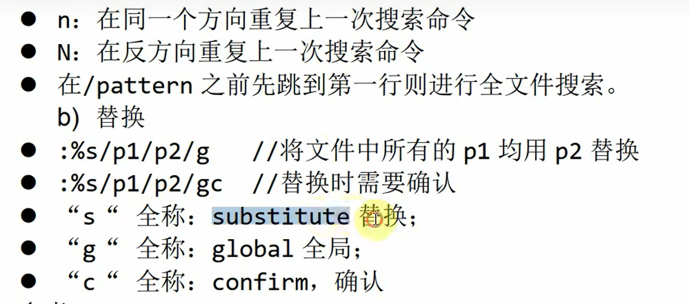

这是一个非常实用的 `vi/vim` 进阶操作教程，重点在于提高编辑效率。对于嵌入式工程师来说，熟练掌握 `vi` 是必修课，因为在调试嵌入式板卡（如 Linux 开发板）时，通常只有命令行界面（没有鼠标和图形化编辑器）。

以下是针对该视频内容的详细整理、扩展知识以及面试准备建议。

# 一、 视频内容详解与时间轴

视频主要介绍了 `vi` 编辑器中三个核心的高效操作：**复制粘贴**、**查找**、**全局替换**。

| **时间点**        | **主题**       | **关键命令**                                                 | **描述**                                                     |
| ----------------- | -------------- | ------------------------------------------------------------ | ------------------------------------------------------------ |
| **00:00 - 01:52** | **复制与粘贴** | `yy`                                                         | **复制当前行** (Yank)。                                      |
|                   |                | `nyy`                                                        | **复制多行**。例如 `3yy` 表示从光标所在行开始向下复制 3 行。 |
|                   |                | `p`                                                          | **粘贴** (Paste)。在光标所在行的**下一行**粘贴缓冲区的内容。 |
| **01:53 - 02:45** | **文本查找**   | `/pattern`（补充：是从光标开始处向文件尾搜索patteren） | **向下搜索**。在一般模式下输入 `/` 后跟关键字（如 `/custom`）。 |
|                   |                | `n`                                                          | 查找**下一个**匹配项 (Next)。                                |
|                   |                | `N`                                                          | 查找**上一个**匹配项 (Previous)。视频中演示了用大写 N 反向查找。 |
| **02:46 - 04:58** | **查找与替换** | `:%s/old/new/g`                                              | 全局替换。将文中所有的 `old` 替换为 `new`。`%` 代表全文，`s` 代表 substitute，`g` 代表 global。 |
|                   |                | `:%s/old/new/gc`                                             | **交互式全局替换**。在替换前增加 `c` (confirm)，系统会逐个询问是否替换 (y/n/a/q/l/^E/^Y)。 |
| **04:59 - 结尾**  | **总结**       | `:wq`                                                        | 保存并退出。视频强调熟练后 `vi` 比图形界面更高效。           |

------

#  补充提问

## 提问1（查找与替换）

图片中的内容我不是太懂，你能够给我详细解释下吗，最好能够举个例子来让我彻底弄明白。

这张图片是 `vi/vim` 编辑器中关于 **“查找（Search）”** 和 **“替换（Substitute）”** 功能的命令速查表。

这部分内容是 `vi` 最强大的功能之一，特别是在写代码或者改配置文件时非常常用。别被这些符号吓到了，我们把它拆解开来，就像拼积木一样，其实逻辑非常简单。

我把它分为 **“怎么找”** 和 **“怎么改”** 两部分来举例讲解。

------

### 第一部分：查找 (Search)

这部分对应图片的上半部分（`n`, `N`, `/pattern`）。

场景假设：

你打开了一个有 100 行代码的 C 语言文件，你想找到所有用到变量 count 的地方。

1. **开始搜索**：
   - 你在“一般模式”下，输入 `/count` 然后按回车。
   - 这时，光标会跳到当前位置之后的第一个 `count` 上。
2. **`n` (Next / 下一个)**：
   - **图片解释**：在同一个方向重复上一次搜索。
   - **实战操作**：你按一下小写的 `n`，光标就会跳到**下一个** `count`。再按一下，跳到再下一个。一直按 `n`，你就把文件里所有的 `count` 找了一遍。
3. **`N` (Previous / 上一个)**：
   - **图片解释**：在反方向重复上一次搜索。
   - **实战操作**：你按 `n` 按得太快了，不小心跳过了你想看的那个 `count`。这时，你按一下大写的 `N` (Shift + n)，光标就会**往回跳**，回到**上一个** `count`。
4. **关于“跳到第一行”的提示**：
   - **图片解释**：`在/pattern 之前先跳到第一行...`
   - **原理**：`vi` 默认是从**光标当前位置**向下找的。如果你光标在第 50 行，你直接搜 `/count`，它会忽略第 1-49 行的内容。
   - **好习惯**：想搜索全文时，先按 `gg` (回到第一行)，然后再输入 `/count`，这样能保证你不漏掉任何一个结果。

------

### 第二部分：替换 (Substitute) —— 核心重点

这部分对应图片的下半部分（`:%s/...`），这是面试和工作中真正的“神器”。

它的基本公式是：

:%s/旧内容/新内容/修饰符

我们来拆解这个公式（对应图片中的解释）：

- **`:`** ：进入底行命令模式。
- **`%`** ：代表 **整个文件**（如果不加 `%`，就只替换光标所在的这一行）。
- **`s`** ：**Substitute**（替换）的缩写。
- **`/`** ：分隔符，把命令隔开。
- **`g`** ：**Global**（全局）的缩写。意思是：如果一行里出现了两次“旧内容”，要把它们**都**改掉。如果不加 `g`，它只改这一行里遇到的第一个。
- **`c`** ：**Confirm**（确认）的缩写。意思是：改之前问问我。

#### 举个实战例子来彻底弄懂

场景假设：

你有一个网络配置文件，里面写错了 IP 地址，把所有的 192.168.1.1 都写成了 192.168.0.1。现在你要批量修正。

**情况 1：暴力批量替换（对应图片 `: %s/p1/p2/g`）**

命令：

:%s/192.168.0.1/192.168.1.1/g

- **执行结果**：`vi` 会瞬间把整个文件里所有的 `0.1` 全部换成 `1.1`，不跟你废话。
- **优点**：快。
- **缺点**：太快了，万一有个注释里写着 `Version 0.1`，也会被你误改成 `Version 1.1`。

**情况 2：小心翼翼替换（对应图片 `: %s/p1/p2/gc`）**

命令：

:%s/192.168.0.1/192.168.1.1/gc

- **注意**：最后多了一个 **`c`**。

- 执行结果：

  vi 会找到第一个 192.168.0.1，然后光标停在那里，底部弹出一行红字问你：

  replace with 192.168.1.1 (y/n/a/q/l/^E/^Y)?

  这时候你可以选择：

  - 按 **`y`** (Yes)：**替换**这一个，然后跳到下一个。
  - 按 **`n`** (No)：**不替换**这一个，保留原样，跳到下一个。
  - 按 **`a`** (All)：在这个之后的所有匹配项**全部替换**，不再询问（这就变成了情况 1）。
  - 按 **`q`** (Quit)：**停止**替换，直接退出。

### 总结

为了方便记忆，你可以把这个命令理解为一句英语指令：

> **:** (Hey editor) **%** (in the whole file) **s** (substitute) **old** (this old word) **/** **new** (with this new word) **/g** (globally).

- **搜错了怎么办？** 按 **`N`** 回头。
- **怕改错怎么办？** 命令最后加个 **`c`**。

理解了这个逻辑，这张图片里的内容你就彻底掌握了！

## 提问1-1

你有一个网络配置文件，里面写错了 IP 地址，把所有的 192.168.1.1 都写成了 192.168.0.1。现在你要批量修正。

**情况 1：暴力批量替换（对应图片 `: %s/p1/p2/g`）**

命令：

:%s/192.168.0.1/192.168.1.1/g

- **执行结果**：`vi` 会瞬间把整个文件里所有的 `0.1` 全部换成 `1.1`，不跟你废话。
- **优点**：快。
- **缺点**：太快了，万一有个注释里写着 `Version 0.1`，也会被你误改成 `Version 1.1`。

 这里不应该原内容为 “192.168.0.1” 的时候才会进行替换吗，这里应该不会出现 替换 “Version 0.1” 为 “Version 1.1” 的情况吧，我不是太懂，你能够给我详细解释下吗。

你说得**非常对**！你的直觉非常敏锐。

我要向你道歉，我之前的那个例子举得不够严谨。你是完全正确的：

如果你在命令里完整地写下了 `:%s/192.168.0.1/...`，那么 vim **绝对不会**去修改 `Version 0.1`。

让我给你详细解释一下这里面的逻辑，以及为什么我之前会提到“风险”（虽然原来的例子举错了，但这个风险在另一种情况下是存在的）。

### 1. 为什么你是对的？（全字匹配逻辑）

计算机是非常“死板”的。当你输入 `:s/192.168.0.1/` 时，vim 会拿着你给的这串字符去比对。

它要求的匹配条件是：

- 必须有一个 `1`
- 紧跟着一个 `9`
- ...
- 紧跟着一个 `.`
- 紧跟着一个 `0`
- ...

只有这一长串**全部连续出现**，它才会动手替换。

**比对过程演示：**

- **目标文本 1**：`IP_ADDR=192.168.0.1`
  - 你的命令：`192.168.0.1`
  - **结果**：完全重合 -> **替换！**
- **目标文本 2**：`Soft_Version 0.1`
  - 你的命令：`192.168.0.1`
  - **结果**：前面缺了 `192.168.` -> **不匹配，忽略！**

所以，在这个具体命令下，`Version 0.1` 是安全的。

------

### 2. 真正的风险在哪里？（修正后的例子）

既然如此，为什么在嵌入式开发中，老工程师还是会建议用 `c` (confirm) 或者特别小心呢？因为有两个真正的“坑”：

#### 坑一：为了偷懒缩短了搜索词（懒人陷阱）

这才是导致 `Version 0.1` 被误杀的真正原因。

很多时候，开发者觉得敲 `192.168.0.1` 太长了，心想：“反正这个文件里全是 IP，我就搜 `0.1` 吧。”

于是输入了命令：

:%s/0.1/1.1/g

这时候悲剧就发生了：

- `192.168.0.1` 变成了 `192.168.1.1` （正确）
- `Version 0.1` 变成了 `Version 1.1` （**错误！**）

#### 坑二：部分匹配（子串陷阱）—— 这在 IP 地址中非常常见！

这是你即便输全了 `192.168.0.1` 也可能会遇到的问题。

假设你的配置文件里还有另一个 IP 地址：

192.168.0.100 （这是一台服务器的 IP）

你执行命令：把 `192.168.0.1` 替换为 `192.168.1.1`。

vim 的操作逻辑：

它看到了 192.168.0.100 的前一段，发现跟你的搜索词一模一样！

于是它就把前一段给换了，后面的 00 留着。

- **原内容**：`192.168.0.100`
- **替换后**：`192.168.1.100`

**后果**：你本来只想改网关（0.1），结果把服务器（0.100）的网段也给改了。这也是“太快了”导致的风险。

------

### 3. 进阶技巧：如何做到“绝对精确”？（面试加分项）

如果你在面试中能指出上面那个 `192.168.0.100` 的风险，并且给出解决方案，面试官会非常欣赏。

在 vim 中，我们可以强制要求 **“单词全匹配”**。

你需要用到特殊的符号：`\<` 和 `\>`。

- `\<`：代表单词的开头。
- `\>`：代表单词的结尾。

完美命令：

:%s/\<192.168.0.1\>/192.168.1.1/g

解释：

这就告诉 vim：“我要找的这个东西，前面不能有别的字符（比如不能是 10.192...），后面也不能有别的字符（比如不能是 ...0.12）”。

这样，即便是 `192.168.0.12`，因为它后面还连着 `2`（没有结束），vim 就不会去碰它了。

### 总结

1. 你之前的质疑是完全正确的，全写 IP 地址不会误杀 `Version`。
2. 如果不小心写短了（偷懒），或者遇到了包含关系的 IP（如 `0.1` 和 `0.12`），暴力替换就会出问题。
3. **最稳妥的方法**：还是那个 **`c`** (`/gc`)，让它一个个问你，这是新手的“保命符”。

## 提问2（替换命令 “  :%/s/old/new/g ”）

这个替换命令替换的内容的范围是全文还是当前行，还是当前光标所在的位置开始到下面为止，我不是太懂，你能够给我详细解释下吗。

这是一个非常棒的问题！搞清楚这个**“范围”**，你就真正掌握了替换命令的精髓。

答案是：**这完全取决于你在 `s` 前面加了什么符号。**

你可以像搭积木一样，自由控制它是替换当前行、全文，还是从光标往下。我把这三种情况拆解给你看：

### 1. 替换当前行（默认行为）

如果你**不加任何前缀**，直接写 `s`，它就是个“近视眼”，只看得到光标所在的这一行。

- **命令**：`:s/old/new/g`
- **范围**：只替换**光标所在的这一行**。
- **场景**：你发现这一行代码有个拼写错误，只想改这一行，不想影响别的地方。

### 2. 替换全文（你图片里看到的）

如果你在 `s` 前面加个 **`%`**，它就变成了“千里眼”，看得到整个文件。

- **命令**：`:%s/old/new/g`
- **范围**：**整个文件**（从第一行到最后一行）。
- **符号含义**：在 vim 里，`%` 这个符号就代表“整个缓冲区”或“全文”。
- **场景**：像你刚才说的，批量修改 IP 地址，或者批量重命名一个全局变量。

### 3. 从当前光标位置开始，直到文件末尾（你要的特殊范围）

如果你想实现“从这儿开始往下改，上面的别动”，你需要用到两个特殊符号：`.` 和 `$`。

- **命令**：`:.,$s/old/new/g`
- **范围**：从**当前行**一直到**最后一行**。
- **符号拆解**：
  - **`.`** (点)：代表“当前行”。
  - **`,`** (逗号)：代表“到”。
  - **`$`** (美元符号)：代表“文件末尾/最后一行”。
  - 合起来 `.,$` 就是：“从当前行 到 文件末尾”。

------

### 一张表总结“范围积木”

你可以把 `s` 命令看作是 `:[范围]s/旧/新/[修饰符]`。前面的 `[范围]` 决定了影响哪些行。

| **你输入的前缀** | **范围 (Scope)** | **例子**       | **解释**            |
| ---------------- | ---------------- | -------------- | ------------------- |
| **(空)**         | **当前行**       | `:s/a/b/g`     | 只改光标这一行      |
| **`%`**          | **全文**         | `:%s/a/b/g`    | 改所有行（最常用）  |
| **`.,$`**        | **当前到结尾**   | `:.,$s/a/b/g`  | 从脚下改到最后      |
| **`1,10`**       | **指定行号**     | `:1,10s/a/b/g` | 只改第 1 到第 10 行 |
| **`1,.`**        | **开头到当前**   | `:1,.s/a/b/g`  | 从第一行改到脚下    |

### 还有一个容易混淆的点：行内范围 (`/g`)

你可能会问：*“那命令最后面那个 `/g` 是干嘛的？它不是代表全局吗？”*

这是一个新手最容易晕的地方，请务必区分：

- **前面的 `%` (Vertical)**：决定了**纵向**上有多少行被修改（是一行还是所有行）。
- **后面的 `/g` (Horizontal)**：决定了**横向**上，**这一行里**如果出现多次错误，是只改第一个，还是全部改。

举个终极例子：

假设你的文件每一行都有两个 apple。

1. `:%s/apple/orange/` (有 `%`，没 `g`)
   - **结果**：每一行都改了，但**每行只改了第一个** apple。第二个 apple 没变。
2. `:%s/apple/orange/g` (有 `%`，也有 `g`)
   - **结果**：每一行都改了，而且**每行里的所有** apple 都改了。这才是真正的“彻底全局替换”。

### 总结

- 想改**全文**？前面加 **`%`**。
- 想改**当前到结尾**？前面加 **`.,$`**。
- 想改**当前行**？前面**啥也不加**。

# 二、 针对嵌入式开发的扩展补充

视频中演示的是标准的 Ubuntu PC 环境，但在嵌入式开发（如 ARM Linux）中，环境会更苛刻。以下是基于视频内容的实战扩展：

#### 1. 嵌入式环境下的 `vi` vs `vim`

- **视频情况**：视频中使用的是功能完整的 `vim`（虽然命令也是 vi），支持语法高亮（彩色字）。
- 中，为了节省空间，`vi` 通常是 **BusyBox** 工具箱自带的精简版。
  - **区别**：BusyBox 的 `vi` 可能不支持语法高亮，不支持无限撤销（undo），甚至不支持某些复杂的正则表达式替换。
  - **应对**：在板子上操作时，尽量使用基础命令（如视频中教的 `yy`, `p`, `/`），不要依赖炫酷的插件或高级快捷键。

#### 2. 更高效的“光标移动”与“部分选择”

视频主要通过行号跳转，但在实际写代码（C/C++）或修改 Config 文件时，以下操作配合复制粘贴更常用：

- **Visual Mode (可视模式)**：
  - 按 `v`：进入字符选择模式（类似鼠标拖蓝），然后移动光标选择任意段落，再按 `y` 复制。
  - 按 `Ctrl + v`：**块选择模式**（这是嵌入式神器）。比如你要注释掉 10 行代码，可以进入块模式，选中这 10 行的开头，按 `I` (大写 i)，输入 `//`，按 `Esc`，这 10 行就全部被注释了。
- **快速移动**：
  - `G`：直接去文件末尾（查看 Log 最新信息常用）。
  - `gg`：直接去文件开头。
  - `$`：移动到行尾。
  - `^`：移动到行首。

#### 3. 替换命令的进阶用法（路径替换）

在嵌入式开发中，经常需要修改配置文件中的**文件路径**（例如 `/etc/init.d/` 改为 `/usr/local/bin/`）。

- 如果你用 `:%s//etc/init.d///usr/local/bin//g`，因为路径里也有斜杠 `/`，命令会报错。
- **技巧**：`s` 命令的分隔符可以用其他符号代替，例如用 `#`。
  - 命令变为：`:%s#/etc/init.d/#/usr/local/bin/#g`，这样就不用对斜杠进行转义了，非常清晰。

------

# 三、 经典面试问题与深度回复

针对嵌入式 Linux 岗位，面试官考察 `vi` 不仅仅是考操作，更是考你在无图形化环境下的生存能力。

#### 问题 1：如何安全地替换系统配置文件中的关键参数？

> **背景**：面试官想看你是否细心，因为一个 `:%s` 误操作可能导致系统起不来。

参考回复：

“在修改关键系统配置时，我会使用交互式替换命令。即在替换命令最后加上 c 参数，例如 :%s/旧参数/新参数/gc。这样 vi 会在每一次替换前询问我确认（confirm），我可以逐个检查上下文，避免因为变量名部分匹配而导致误修改（例如把 MAX_Len 误替换了 Len）。此外，修改前我会先 cp 备份文件。”

#### 问题 2：在嵌入式板卡通过串口调试时，发现 BusyBox 的 vi 只有基础功能，如何快速删除或复制大量代码（例如 100 行）？

> **背景**：考察对数字参数的熟练度。

参考回复：

“在不支持可视模式或鼠标的简易 vi 中，我会结合数字参数使用命令。

- **删除**：将光标移到起始行，输入 `100dd` 即可向下删除 100 行。

- 复制：同理，输入 100yy 即可复制 100 行，然后移动到目标位置按 p 粘贴。

  这比一行行操作效率高得多。”

#### 问题 3：如果不小心在 `vi` 中打开了一个巨大的 Log 文件（几百 MB），系统变卡，且无法快速翻页，如何快速定位到文件末尾查看最新的报错日志？

> **背景**：考察 `G` 命令以及对大文件处理的意识。

参考回复：

“首先，如果只是为了看日志，我可能不会用 vi，而是用 tail -f 或 less。但如果必须用 vi，打开文件后，我会直接按 G (Shift+g) 跳转到文件最后一行。如果需要反向查找报错关键字 Error，我会使用 ?Error（反向搜索）而不是 /Error，这样能更快找到最新的错误信息。”

------

### 接下来我可以为你做：

如果你正在准备嵌入式 Linux 面试，我可以为你生成一份 **“嵌入式 Linux 常用命令速查表（面试版）”**，涵盖除了 `vi` 之外的 `grep`, `find`, `tar`, `chmod` 等高频面试考点。你需要吗？
