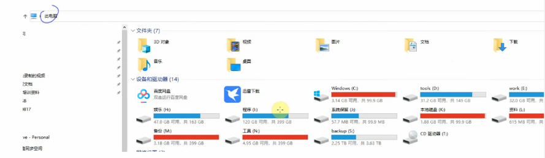
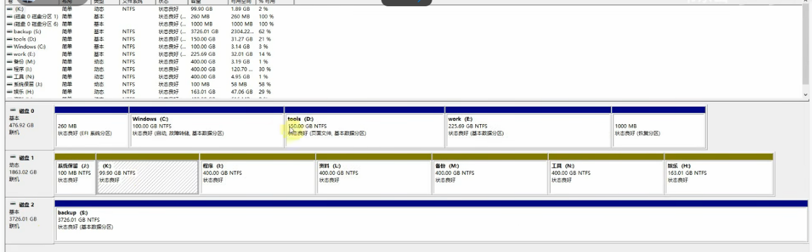

好的，我来帮你分析这个视频，并结合你准备嵌入式面试的需求进行扩展和提问。

这是一个非常基础但很重要的入门视频，它对比了 Windows 和 Linux (以Ubuntu为例) 在文件系统组织方式上的根本差异。

# 💻 视频内容概要 (附时间点)

- **00:00 - 01:55: 启动 Ubuntu 与打开终端**

  - 视频首先演示了如何使用 VMware 虚拟机播放器启动 Ubuntu 桌面。
  - 登录后，展示了最常用的操作之一：通过在桌面点击右键，选择“在终端中打开” (Open in Terminal) 来启动命令行界面。
  - 同时，演示了 Windows 上的“命令提示符” (cmd)，说明“终端”就是 Linux/Ubuntu 上对应的命令行入口。

- **01:55 - 04:00: Windows 的文件系统逻辑**

  - 讲解了 Windows 用户所熟悉的“此电脑”界面。

    

  - 核心概念：Windows 通过“盘符”（如 C:、D:、E:）来组织存储。

  - 通过“磁盘管理”工具展示，每个盘符通常对应一个物理磁盘分区。

    

- **04:00 - 07:15: Linux 文件系统的核心区别——“一棵树”**

  - 提出了 Linux 与 Windows 最大的不同：**Linux 没有盘符概念**。
  - Linux 的文件系统是一个**单一的树状结构**，所有文件和目录都始于一个“根”目录，用斜杠 (`/`) 表示。
  - 对比了文件路径：
    - Windows 路径: `C:\abc\def\hello.txt` (从某个盘符开始)
    - Linux 路径: `/abc/def/hello.txt` (从根 `/` 开始)

- **07:15 - 13:10: 核心概念：挂载 (Mount)**

  - 视频展示了 Ubuntu 的“Disks”(磁盘) 工具，用来揭示 Linux 是如何将“分区”和“目录”关联起来的。
  - **“挂载”** 是关键：Linux 将物理分区“附加”到文件系统树的某个目录上。
  - **视频中的例子：**
    - `sda1` 分区 (代表磁盘的第1个分区) 挂载在 `/` (根目录)。
    - `sda2` 分区挂载在 `/boot` 目录。
    - `sda4` 分区挂载在 `/home` 目录。
  - **结论：** 当你访问 `/` 目录下的文件时，你访问的是 `sda1` 分区。当你访问 `/home/book` 目录时，你实际访问的是 `sda4` 分区。

- **13:10 - 21:00: Linux 文件系统层次结构标准 (FHS)**

  - 详细解释了根目录 (`/`) 下各个主要子目录的用途（这是面试高频点）：
  - `/bin`: 存放**基本**命令 (如 `ls`, `cp`)，所有用户可用。
  - `/sbin`: 存放**系统**命令 (如 `reboot`)，通常只有 root 管理员能用。
  - `/boot`: 存放启动所需文件，如 Linux 内核。
  - `/dev`: 存放设备文件 (在 Linux 中，硬件被抽象为文件)。
  - `/etc`: 存放所有系统和应用程序的**配置文件**。
  - `/home`: 存放普通用户的个人文件（宿主目录），例如 `/home/book`。
  - `/lib`: 存放系统和程序运行所需的**共享库** (类似 Windows 的 .dll)。
  - `/root`: 超级用户 (root) 的宿主目录。
  - `/usr`: (Unix Software Resource) 存放用户安装的应用程序和数据，是系统中最庞大的目录之一。
  - `/var`: 存放经常变化的文件 (Variable)，最典型的是**日志文件** (`/var/log`)。
  - `/proc`: 一个虚拟文件系统，存放内核和进程信息。

------

# 🚀 针对嵌入式面试的扩展补充

视频内容偏向桌面版 Ubuntu，在嵌入式面试中，你需要展现这些知识在资源受限设备上的具体应用。

1. **关于文件系统 (Filesystem Types)**
   - 桌面 Linux (如 Ubuntu) 通常使用 `ext4` 作为文件系统，它功能全面，支持日志。
   - **嵌入式扩展：** 嵌入式设备（使用 eMMC、NAND Flash）对文件系统的选择非常考究：
     - **SquashFS:** 一个**高度压缩、只读**的文件系统。嵌入式产品的根文件系统 (`/`) 经常使用它。好处是：极度节省存储空间，并且因为只读，系统非常稳定，不会被意外篡改，也不会因突然断电而损坏。
     - **JFFS2 / UBIFS:** 专门为 **NAND Flash** 设计的文件系统，自带擦写均衡 (Wear Leveling) 和坏块管理功能。
     - **tmpfs:** **内存文件系统**。速度极快，但数据**断电即失**。在嵌入式中，`tmp` 和 `/var/log` 目录经常被挂载为 `tmpfs`，以避免对闪存进行不必要的（且会消耗寿命的）写操作。
2. **关于挂载 (Mounting)**
   - 视频中展示了多个分区 (`/`, `/boot`, `/home`)。
   - **嵌入式扩展：** 嵌入式设备为了稳定和安全，分区挂载策略完全不同。一个经典的嵌入式分区方案是：
     - `/boot`: 一个小分区，使用 `FAT32` (方便 Bootloader 读取)，存放内核。
     - `/`: (根文件系统) 挂载为**只读 (Read-Only)** 的 `SquashFS` 分区。
     - `/data` (或 `/config`): 一个单独的可读写分区 (如 `ext4`)，用于存放用户配置、数据和更新。
   - 这种“只读根文件系统 + 可写数据分区”的设计是嵌入式 Linux 系统的基石。
3. **关于FHS (Filesystem Hierarchy)**
   - 桌面版 FHS 目录很全。
   - **嵌入式扩展：** 嵌入式 Linux 会对 FHS 进行**极限精简**。
     - 你可能不需要 `/home` (如果设备是单用户或无用户交互)。
     - 你可能不需要 `/opt`。
     - 但你**必须**有 `/bin`, `/sbin`, `/etc`, `/lib`, `/dev`，否则系统无法启动。
     - `/usr` 目录在嵌入式中也很常见，但有时为了精简，`/usr/bin` 里的程序会被合并到 `/bin` 中。

------

# 🎯 嵌入式面试经典问答

以下是基于视频内容，拔高到嵌入式面试水平的经典问题：

#### Q1：在一个没有C盘、D盘的嵌入式设备上，Linux系统是如何管理存储分区的？

> 简洁回复：
>
> Linux 通过统一的挂载 (Mount) 机制来管理。系统启动时，内核会将一个指定的分区（如 eMMC 的p2分区）挂载为根文件系统 (/)。之后所有的文件和目录，包括其他后续挂载的分区（例如挂载到 /data 目录），都从这个单一的 / 根目录开始索引。

#### Q2：为什么嵌入式系统的根文件系统 (`/`) 经常被挂载为“只读”？

> 简洁回复：
>
> 主要有两个原因：
>
> 1. **稳定性：** 防止系统运行时（或用户误操作）破坏系统核心文件，也防止因意外断电导致文件系统损坏。
> 2. **可靠性：** 配合 `SquashFS` 等压缩文件系统，可以节省宝贵的 Flash 存储空间。

#### Q3：如果根文件系统是只读的，但程序又需要修改 `/etc` 目录下的配置文件，该怎么办？

> 简洁回复：
>
> 有两种主流方案：
>
> 1. **临时重挂载：** 在需要修改时，执行 `mount -o remount,rw /` 将根系统临时切换为可读写；修改完毕后，再用 `mount -o remount,ro /` 切换回只读。
> 2. **覆盖挂载 (OverlayFS)：** 更好的方法是将 `/etc` 单独挂载为可写分区，或者使用 `OverlayFS`，将一个可写的上层（通常是 `tmpfs` 或 `/data` 分区）叠加在只读的根文件系统上。

#### Q4：视频里提到了 `/var` 和 `/tmp` 目录，为什么在嵌入式系统中要特殊处理它们？

> 简洁回复：
>
> 因为嵌入式设备使用 Flash 闪存，其擦写寿命有限。
>
> 而 /var/log (日志) 和 /tmp (临时文件) 会被非常频繁地写入数据。为了保护闪存不被过早写坏，通常会将这两个目录挂载为 tmpfs（内存文件系统），数据直接写入内存，虽然断电会丢失，但保护了硬件寿命。

#### Q5：视频中说 `/dev` 目录存放设备文件。在嵌入式开发中，你是如何通过 `/dev` 或 `/sys` 目录来操作硬件的？(例如点亮一个LED)

> 简洁回复：
>
> 这取决于驱动的实现方式：
>
> - **通过 `/dev`：** 驱动程序会在 `/dev` 下创建设备节点（如 `/dev/my_led`），应用程序通过 `open()` 打开它，然后使用 `ioctl()` 或 `write()` 等系统调用来发送控制命令。
> - **通过 `/sys`：** (更现代的方式) Linux 的 GPIO 子系统会把 GPIO 导出到 `/sys/class/gpio` 目录下。我们只需通过 `echo` 命令向 `export` 文件写入GPIO编号，然后修改对应目录下的 `direction` (设为 "out") 和 `value` (设为 "1") 文件，就可以点亮LED，这种方式无需编写C代码，调试非常方便。