这是一个非常经典且基础的嵌入式 Linux 入门视频（看课件风格应该是百问网韦东山老师的课程）。为了助你备战嵌入式面试，我将从**视频内容摘要**、**核心知识扩展**（针对嵌入式 Linux 开发）以及**高频面试题**三个方面为你深度解析。


# 一、 视频内容摘要与时间轴

该视频主要讲解了<span style="color:#CC0000;"> Linux Shell 的工作原理</span>、<span style="color:#CC0000;">命令解析机制</span>以及最重要的 <span style="color:#CC0000;">`PATH` 环境变量。</span>

- **00:00 - 02:17：Shell 简介与命令格式**

  - Shell 是“外壳”，负责接收用户输入并传递给操作系统。

    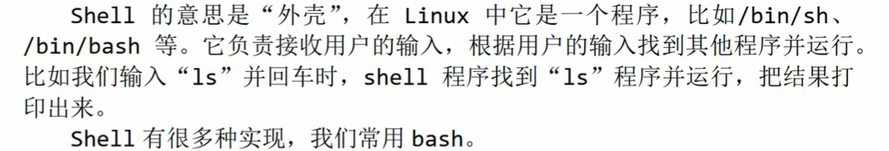

  - 命令提示符的含义：`用户@主机名:当前目录$`（`$` 代表普通用户，`#` 代表 root）。

    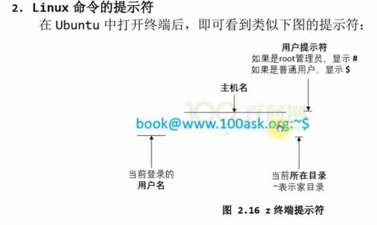

  - 命令格式：`command [options] [parameters]`（命令、选项、参数）。

    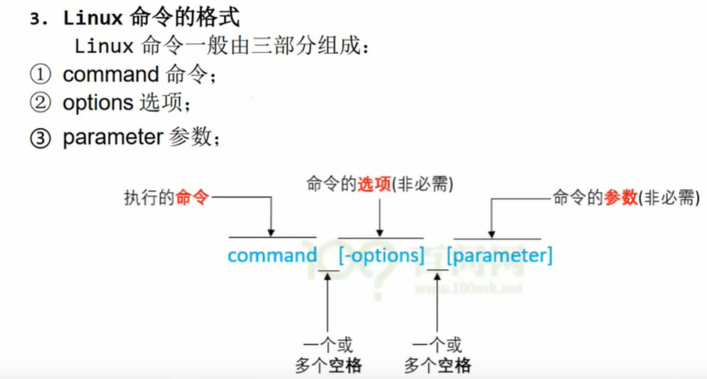

- **02:18 - 05:39：命令执行演示**

  - 演示 `ls -l` 等命令，解释 Shell 如何解析空格分隔的字符串。
  - 演示 `fdisk` 失败（权限不足），引入 `sudo` 概念。

- **05:40 - 07:50：Shell 的核心交互逻辑**

  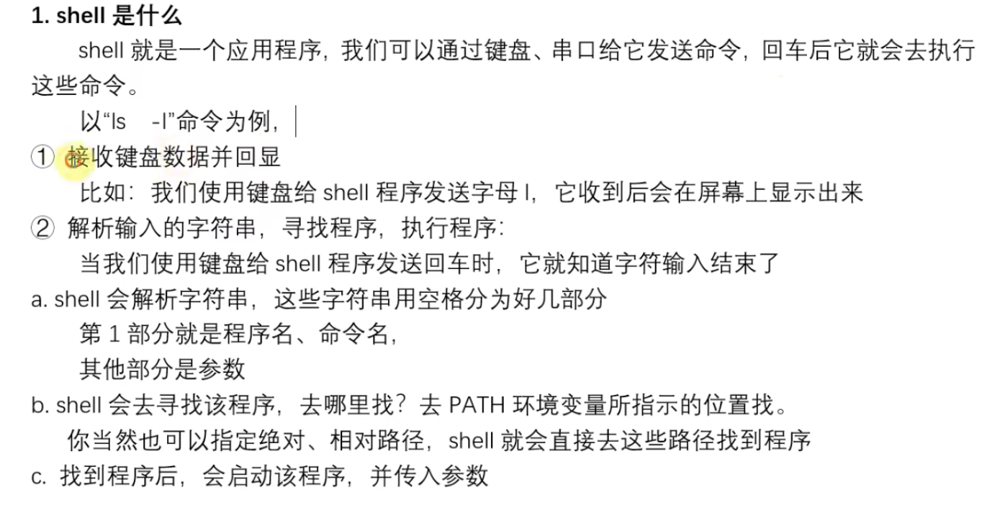

  - **接收**：用户输入字符，Shell 接收并回显（<span style="color:#CC0000;">补充：键盘输入 ls -l ，就会回显在屏幕上 </span>）。
  - **解析**：按空格切割字符串，第一部分是程序名，后面是参数。
  - **寻找**：Shell 去哪里找程序？引出 **`PATH` 环境变量**。

- **07:51 - 10:00：PATH 环境变量详解**

  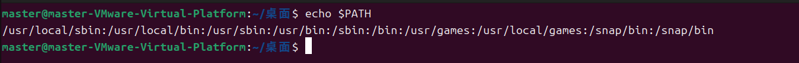

  - `PATH` 是一系列目录的集合，用冒号 `:` 分隔。
  - Shell 只会在 `PATH` 指定的目录中查找命令。

- **10:01 - 11:40：C 语言程序与 Shell 的传参**

  - 编写 `hello.c`，演示 C 语言 `main(int argc, char **argv)` 函数如何接收 Shell 传递过来的参数。

- **11:41 - 14:30：如何修改 PATH（重点）**

  

  - **临时修改**：`export PATH=$PATH:/新目录`（只对当前终端有效）。
  - **永久修改**：修改 `~/.bashrc` 或 `/etc/environment`。
  - **手动指定路径**：如果不修改 PATH，必须用绝对路径或相对路径（如 `./hello`）来运行程序。

- **14:31 - 结尾：Shell 脚本初探**

  - 简单演示了 Shell 中的 `for` 循环脚本。

------

# 补充提问（shell 与 环境变量）

## 提问1

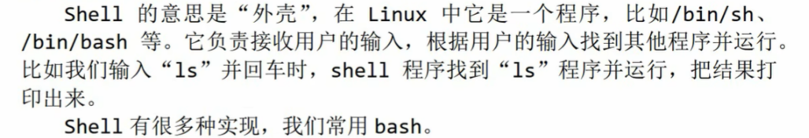

<span style="font-weight:bold; font-size:1.2em;">这里我不太懂，你能够给我详细解释下吗，最好能够举个例子来让我彻底弄明白。还有Shell 和操作系统的关系是什么呢，你能够给我详细解释下吗。</span>


这张图片里的文字其实解释了 Linux 系统中最核心的一个概念。

不用担心，这个概念初学者都很容易混淆。为了让你彻底弄明白，我把**Shell（壳）**和**操作系统（内核）**的关系，用一个非常经典的**“餐厅比喻”**来给你拆解。

------


### 一、 核心比喻：Shell 是“服务员”，操作系统是“后厨”

想象你去一家高档餐厅吃饭：

1. **你（用户）**：你想吃“宫保鸡丁”（<span style="color:#CC00CC;">你想运行 `ls` 命令查看文件</span>）。
2. **后厨（操作系统内核/Kernel）**：这里有大厨、炉灶、食材（CPU、内存、硬盘）。只有后厨才能真正把菜做出来（只有内核才能真正操作硬件）。**但是，后厨禁止闲人进入**，因为如果你进去瞎指挥，可能会炸了厨房（导致系统崩溃）。
3. **服务员（Shell）**：这时候，Shell 登场了。
   - 你就坐在大厅（用户态）。
   - **<span style="color:#CC0000;">Shell 就是那个拿着小本本的服务员。</span>**


#### 结合图片中的文字，整个流程是这样的：

- **接收用户的输入**：你对服务员喊：“我要一份宫保鸡丁”（你在黑框框里输入 `ls` 并回车）。
- **找到程序**：服务员想：“宫保鸡丁是哪道菜？”他会去菜单上找（<span style="color:#CC0000;">Shell 去 `PATH` 环境变量里找 `ls` 这个程序到底在哪</span>）。
- **运行程序**：服务员找到后，跑到后厨窗口喊：“大厨，炒一份宫保鸡丁！”（<span style="color:#CC0000;">Shell 告诉操作系统内核：请加载并运行 `/bin/ls` 这个程序</span>）。
- **把结果打印出来**：后厨炒好了，服务员把菜端到你桌子上（<span style="color:#CC0000;">Shell 把 `ls` 运行的结果——文件列表，显示在你的屏幕上</span>）。

------


### 二、 为什么叫“Shell”（外壳）？

这就涉及到了你问的第二个问题：<span style="color:#CC0000;">**Shell 和操作系统的关系**。</span>

在 Linux 的世界里，操作系统其实指的是**内核（Kernel）**。

- **Kernel（核）：** 就像核桃的仁。它是最核心、最柔软、最至关重要的部分。它直接管理 CPU、内存、网卡、硬盘。
- **Shell（壳）：** 就像核桃的硬壳。它是包在内核外面的一层保护层。

**关系详解：**

1. **隔离与保护**：
   - 用户不能直接操作内核（太危险，太复杂）。
   - <span style="color:#CC0000;">Shell 包裹着内核，用户只能接触到 Shell</span>。
   - <span style="color:#CC0000;">Shell 接收人类能看懂的命令（比如 `ls`, `cd`），翻译成内核能听懂的“系统调用”，让内核去干活。</span>
2. **<span style="color:#CC0000;">Shell 本质上也是一个“程序”</span>**：
   - 这一点非常重要，也是面试常考点。<span style="color:#CC0000;">**Shell 不是操作系统本身，它只是操作系统上运行的一个普通软件**（就像你在 Windows 上运行 Chrome 浏览器一样）。</span>
   - 图片里提到的 `/bin/sh`、`/bin/bash`，就是<span style="color:#CC0000;">这个软件的不同版本</span>。
   - *例子*：就像服务员也有不同的名字，有的叫 Bash（最常用的），有的叫 Zsh（界面更好看的），有的叫 Sh（最老的）。不管换哪个服务员，后厨（操作系统）都是同一个。

------


### 三、 举个具体的“栗子”让你彻底明白

假设你想看当前目录下有什么文件，你输入了 `ls`。

如果没有 Shell（假设你直接和操作系统对话）：

你需要通过编写二进制代码，调用 CPU 寄存器，申请内存地址 0x0000FFFF，控制硬盘磁头移动到扇区 512 读取数据……（这对人类来说太难了）。

**有了 Shell 之后发生的事情：**

1. **输入**：你打字 `ls`，按下 Enter。
2. **解析**：Shell（这个正在运行的程序）读到了字符 `l` 和 `s`。它分析：“哦，老板不是在定义变量，也不是在写循环，他是想运行一个叫 `ls` 的工具。”
3. **查找**：<span style="color:#CC0000;">Shell 翻看它的通讯录（即上个视频讲的 `PATH` 变量），发现 `/bin/` 目录下有个文件叫 `ls`。</span>
4. **执行（交接给系统）**：Shell 调用一个系统函数（叫 `fork` 和 `exec`），告诉操作系统：“嘿，帮我把硬盘里的 `/bin/ls` 这个文件搬到内存里运行一下。”
5. **控制权**：操作系统接管硬件，读取目录信息。
6. **输出**：程序运行结束，把结果吐出来，Shell 把它显示在你的屏幕上，然后打印出一个新的 `$` 符号，坐等你的下一条命令。


### 四、 嵌入式面试必杀技

既然你在准备嵌入式面试，如果面试官问你：<span style="color:#CC0000;">“Shell 和 Kernel 的区别是什么？”</span>

你可以这样简洁而专业地回答：

> “Kernel（内核）是操作系统的核心，负责管理硬件资源（CPU、内存、驱动）；
>
> 而 Shell 是运行在用户空间的一个应用程序，它是<span style="color:#CC0000;">用户和内核交互的接口（桥梁）</span>。<span style="color:#CC0000;">Shell 解析用户的命令，通过系统调用请求内核执行具体的任务。”</span>

**总结一下：**

- **Shell = 翻译官 / 服务员 / 遥控器**
- **操作系统 = 执行者 / 后厨 / 电视机内部电路**

这样解释，是不是清晰多了？


## 提问 1 - （1）

<span style="font-weight:bold; font-size:1.2em;">Shell 去 `PATH` 环境变量里找 `ls` 这个程序到底在哪。这里我不是太懂，环境变量和shell有什么关系呢，它们在代码层面是怎么实现的么，你能够给我详细解释下吗。</span>


这是一个非常棒的问题！这触及到了 Linux 系统编程的**核心机制**。

很多初学者只知道“配环境变量”，但不知道它在内存里到底是个什么东西，以及代码是怎么去“读”它的。

为了帮你彻底弄懂，我将分三个层面来解答：**<span style="color:#CC0000;">概念层面（是什么）</span>、<span style="color:#CC0000;">逻辑层面（怎么找）</span>以及<span style="color:#CC0000;">代码层面（怎么写）</span>**。

------


### 一、 概念层面：<span style="color:#CC0000;">环境变量和 Shell 的关系</span>

#### 1. 环境变量到底是什么？

在代码层面（C语言），<span style="color:#CC0000;">环境变量</span>其实就是<span style="color:#CC0000;">一个字符串数组 (char *env[])</span>。

你可以把它想象成 <span style="color:#CC0000;">Shell 这个程序随身携带的一个“贴身记事本”</span>。

- 这个记事本上每一行都写着 `KEY=VALUE` 的格式。
- 其中有一行特意写着：`PATH=/usr/local/bin:/usr/bin:/bin`。


#### 2. Shell 和环境变量的关系

- **拥有者**：<span style="color:#CC0000;">Shell 也是一个进程（Process）。每个进程在启动时，操作系统都会给它分配一块内存，专门用来存放这个“记事本”（环境变量）。</span>
- **传递性（继承）**：这是<span style="color:#CC0000;">最关键的一点。</span>当 Shell 启动其他程序（比如 `ls`）时，Shell 会把自己的这个“记事本”**<span style="color:#CC0000;">复印一份</span>**，塞给子进程。所以，<span style="color:#CC0000;">子进程天生就拥有和父进程一样的环境变量</span>。

**一句话总结**：<span style="color:#CC0000;">环境变量是 Shell 进程内存里的一组全局字符串</span>，<span style="color:#CC0000;">Shell 依靠读取这些字符串来决定自己的行为（比如去哪里找程序）。</span>

------


### 二、 逻辑层面：<span style="color:#CC0000;">Shell 是如何利用 PATH 找程序的？</span>

<span style="color:#CC0000;">当你输入 `ls` 并回车时，Shell 的内部逻辑是这样的（伪代码逻辑）：</span>

1. **读取输入**：拿到字符串 `"ls"`。
2. **判断**：用户输入的<span style="color:#CC0000;">是绝对路径吗</span>（比如 `/bin/ls`）？
   - 如果是，直接去执行。
   - 如果不是（只输入了 `ls`），则需要查找。
3. **获取记事本内容**：<span style="color:#CC0000;">Shell 调用函数获取 `PATH` 变量的值。</span>
   - 拿到字符串：`"/usr/local/bin:/usr/bin:/bin"`
4. **切割**：Shell <span style="color:#CC0000;">以冒号 `:` 为分隔符，把这个长字符串切成一个个目录：</span>
   - 目录1: `/usr/local/bin`
   - 目录2: `/usr/bin`
   - 目录3: `/bin`
5. **遍历与拼接（关键步骤）**：
   - **尝试 1**：把目录1和文件名拼接 -> `/usr/local/bin/ls`。<span style="color:#CC0000;">检查这个文件存在且可执行吗？</span> -> **不存在**。
   - **尝试 2**：把目录2和文件名拼接 -> `/usr/bin/ls`。<span style="color:#CC0000;">检查这个文件存在且可执行吗？</span> -> **存在！**
6. **执行**：<span style="color:#CC0000;">Shell 停止寻找，告诉操作系统执行 `/usr/bin/ls`。</span>

------


### 三、 代码层面：<span style="color:#CC0000;">C 语言是如何实现的？</span>

这是你最关心的部分。Shell 是用 C 语言写的。为了让你看懂“代码层面”的实现，我写了一段<span style="color:#CC0000;">**简化版**的 C 代码</span>，模拟 <span style="color:#CC0000;">Shell 寻找 `ls` 的过程</span>。

你需要关注三个核心函数：

1. `getenv()`: 从环境变量里取值。
2. `strtok()`: 切割字符串。
3. `access()`: 判断文件是否存在且可执行。


#### 模拟 Shell 寻找命令的 C 代码 (mini_shell_find.c)

C

```c
#include <stdio.h>
#include <stdlib.h>
#include <string.h>
#include <unistd.h> // access 函数的头文件

int main() {
    // 1. 假设用户输入的命令是 ls
    char *user_command = "ls";
    
    // 2. 获取 PATH 环境变量 (这就相当于去读那个“记事本”)
    // 这里的 getenv 是 C 标准库函数
    char *path_env = getenv("PATH"); 
    
    if (path_env == NULL) {
        printf("错误：找不到 PATH 环境变量\n");
        return 1;
    }
    
    printf("当前的 PATH 是: %s\n\n", path_env);

    // 3. 因为 strtok 会修改原字符串，所以我们复制一份
    char path_copy[1024];
    strcpy(path_copy, path_env);

    // 4. 开始切割字符串 (以冒号 : 为分隔符)
    char *dir = strtok(path_copy, ":");
    
    // 存放拼接后的完整路径，比如 /bin/ls
    char full_path[1024]; 

    while (dir != NULL) {
        // 5. 拼接路径： 目录 + "/" + 命令名
        // sprintf 是格式化输出到字符串
        sprintf(full_path, "%s/%s", dir, user_command);
        
        printf("Shell 正在尝试查找: %s ... ", full_path);

        // 6. 核心检查：判断文件是否存在且可执行 (X_OK)
        // access 是系统调用，直接问操作系统内核
        if (access(full_path, X_OK) == 0) {
            printf("【找到了！】\n");
            printf("Shell 最终会执行的程序是: %s\n", full_path);
            
            // 找到后，Shell 就会调用 exec 系列函数去执行它
            // execv(full_path, ...); 
            return 0;
        } else {
            printf("没找到\n");
        }

        // 继续取下一个目录
        dir = strtok(NULL, ":");
    }

    printf("\n错误：命令 %s 未找到 (command not found)\n", user_command);
    return 0;
}
```


#### 代码运行效果详解

这段代码运行起来，就好比你看到了 Shell 的脑子在想什么：

1. 它先拿到了 `PATH` 变量。
2. 它把 `/usr/local/sbin` 拿出来，拼成 `/usr/local/sbin/ls`，问系统：有这文件吗？系统说：没有。
3. 它又把 `/usr/bin` 拿出来，拼成 `/usr/bin/ls`，问系统：有吗？系统说：有！
4. Shell 说：好，那就是你了。

------


### 四、 面试深度总结（必背）

如果面试官问你：<span style="color:#CC0000;">“**在 Shell 中输入命令到执行，发生了什么？PATH 起了什么作用？**”</span>

你可以结合上面的理解，给出这个**满分回答**：

1. **读取配置**：Shell 启动时将环境变量（包括 `PATH`）加载到自己的内存空间中。
2. **解析路径**：当用户输入一个不带路径的命令（如 `ls`）时，Shell 不会直接交给内核，而是先进行**路径解析**。
3. **遍历查找**：Shell 会读取内存中的 `PATH` 字符串，用冒号分割成目录列表。然后**依次**将目录与命令名拼接（如 `/bin` + `/` + `ls`）。
4. **系统调用验证**：每拼接一个路径，Shell 就会调用 `access()` 或 `stat()` 系统调用，检查该路径下文件是否存在且具有**可执行权限**。
5. **命中即执行**：一旦找到第一个符合条件的路径，Shell 就会停止搜索，调用 `fork()` 创建子进程，并使用 `execve()` 系统调用，加载该绝对路径的程序运行。

**一句话点题**：`PATH` 环境变量就是 Shell 进行**可执行文件搜索**的“搜索范围列表”，它将人类方便记忆的“短命令”映射到了机器需要的“绝对路径”。


## 提问 1 - （2）

<span style="color:#CC0000;">环境变量</span>其实就是<span style="color:#CC0000;">一个字符串数组 char *env[]，这个字符串数组应该就是那个记事本吧<span style="font-weight:bold; font-size:1.2em;">那个记事本中的内容是什么样的呢，我还是不太懂，你能够再给我详细解释下吗？ </span>Linux中的环境变量（记事本）和Windows中的环境变量（记事本）中的内容是一样的吗，如果不一样，它们有什么区别吗？


你问到了点子上！理解 `char *env[]` 的具体内存结构，是打通 C 语言和操作系统任督二脉的关键。

没错，**`char *env[]` 就是那个“记事本”在代码里的真身**。

下面我为你揭开这个记事本的**每一页**到底长什么样，并对比 Linux 和 Windows 的不同。


### 一、 “记事本”在内存里到底长什么样？

你说它是一个“<span style="color:#CC0000;">字符串数组</span>”，这完全正确。但更精确地说，它是一个**<span style="color:#CC0000;">指针数组</span>**。

想象一下，<span style="color:#CC0000;">`env` 是一个活页夹（数组），里面夹着很多张纸（指针），每一张纸上写着一行字（字符串）。</span>


#### 1. 每一页的内容格式

每一张纸上的内容格式**严格**遵守：**`KEY=VALUE`**

- 没有空格（除非值本身包含空格）。
- <span style="color:#CC0000;">左边是大写的变量名（KEY）</span>。
- 中间是等号。
- <span style="color:#CC0000;">右边是具体的值（VALUE）</span>。
- 最后有一个看不见的结束符 `\0`。


#### 2. 内存布局图解

假设我们用 C 语言去读取 `extern char **environ;`（这是 C 语言访问那个记事本的标准方式），在内存里大概是这样的：

C

```
env[0]  ---->  "USER=book\0"             // 第 1 页：告诉程序谁在用电脑
env[1]  ---->  "HOME=/home/book\0"       // 第 2 页：家目录在哪
env[2]  ---->  "PATH=/bin:/usr/bin\0"    // 第 3 页：去哪找程序
env[3]  ---->  "LANG=en_US.UTF-8\0"      // 第 4 页：用什么语言
...
env[N]  ---->  NULL                      // 最后一页是空的，表示结束
```


#### 3. C 代码实证（眼见为实）

为了让你彻底相信，我们可以写 5 行代码把这个“记事本”打印出来。这在 Linux 和 Windows 上都能运行。

C

```c
#include <stdio.h>

// main 函数的第三个参数 envp 就是那个记事本！
int main(int argc, char *argv[], char *envp[]) {
    int i = 0;
    // 一页一页地读，直到读到空页（NULL）
    while (envp[i] != NULL) {
        printf("第 %d 页: %s\n", i, envp[i]);
        i++;
    }
    return 0;
}
```

**运行结果（Linux下）：**

Plaintext

```bash
第 0 页: SHELL=/bin/bash
第 1 页: PWD=/home/book
第 2 页: LOGNAME=book
...
```

------


### 二、 Linux vs Windows：记事本内容一样吗？

**结论：<span style="color:#CC0000;">结构一样，但内容（方言）不同。</span>**

它们<span style="color:#CC0000;">都遵循 `KEY=VALUE` 的**物理结构**</span>，但是里面记录的**具体词汇**（变量名）和**语法习惯**（路径格式）完全不同。

这就好比两本记事本，一本是用**英文**写的（Linux），一本是用**德文**写的（Windows）。格式都是文字，但你不能混着读。


#### 核心区别对比表

| **对比项**     | **Linux (记事本内容)** | **Windows (记事本内容)**              | **你的理解备注**                                             |
| -------------- | ---------------------- | ------------------------------------- | ------------------------------------------------------------ |
| **用户名变量** | `USER=book`            | `USERNAME=Administrator`              | 变量名不同！程序移植时要小心。                               |
| **家目录变量** | `HOME=/home/book`      | `UserProfile=C:\Users\Admin`          | Linux 叫 HOME，Windows 并没有标准的 HOME 变量(通常用 UserProfile)。 |
| **Shell程序**  | `SHELL=/bin/bash`      | `ComSpec=C:\Windows\system32\cmd.exe` | Windows 不叫 Shell，叫 ComSpec。                             |
| **路径分隔符** | `PATH=/bin:/usr/bin`   | `Path=C:\Windows;D:\Program`          | **最核心区别**：Linux 用冒号`:`，Windows 用分号`;`。         |
| **层级符号**   | 斜杠 `/`               | 反斜杠 `\`                            | 比如 `/bin/ls` vs `C:\Windows`。                             |
| **大小写**     | **区分**               | **不区分**                            | Linux 里 `user` 和 `USER` 是两页纸；Windows 里是一回事。     |

------


### 三、 为什么这对“嵌入式面试”很重要？

如果你去面试嵌入式，面试官考察这个点，通常是因为**交叉编译**和**跨平台开发**的坑：

1. 路径噩梦：

   你在 Windows 上写代码，代码里写死了一个路径 char *p = "C:\\config";。<span style="color:#CC0000;">这代码放到 Linux 嵌入式板子上跑，直接崩溃，因为 Linux 根本看不懂 C: 盘符，也不认识反斜杠 \。</span>

   - **正确做法**：使用标准库函数处理路径，或者用 `#ifdef linux` 宏来区分。

2. 获取家目录的坑：

   很多 C 程序需要读取配置文件，通常去用户的“家目录”找。

   - 如果你写 `getenv("HOME")`，在 Linux 上能拿到 `/home/book`。
   - 但在 Windows 上，`getenv("HOME")` 很可能返回 `NULL`（空），因为 Windows 默认没这个变量名（它叫 `UserProfile`）。
   - **面试题解法**：写代码时要判断操作系统，请求不同的 KEY。


### 四、 总结

1. **结构上**：<span style="color:#CC0000;">环境变量就是一个以 `NULL` 结尾的 `char *env[]` 数组，每个元素都是 `KEY=VALUE` 的字符串。</span>
2. **内容上**：Linux 和 Windows **方言不同**。
   - Linux: `PATH` 分隔符是冒号 `:`，路径用 `/`。
   - Windows: `Path` 分隔符是分号 `;`，路径用 `\`。

建议：

把你刚才学到的 ls 搜索原理，结合 Windows 的 Path 想一下：为<span style="color:#CC0000;">什么你在 Windows CMD 里输入 notepad 能打开记事本？因为 C:\Windows\System32 这个目录在 Windows 的 Path 记事本里，而 notepad.exe 就在那个目录下！原理是一模一样的。</span>


## 提问 1 - （2）- （1）

把你刚才学到的 ls 搜索原理，结合 Windows 的 Path 想一下：为<span style="color:#CC0000;">什么你在 Windows CMD 里输入 notepad 能打开记事本？因为 C:\Windows\System32 这个目录在 Windows 的 Path 记事本里，而 notepad.exe 就在那个目录下！原理是一模一样的。</span> 

<span style="font-weight:bold; font-size:1.2em;">上面这句话我有点看不太懂，你能够给我详细解释下吗？</span>


这句话的核心逻辑其实就是：**“不用告诉地址，也能找到人”**。

为了让你彻底看懂这句话，我们需要把**“记事本”**（notepad.exe）、**“它的家”**（C:\Windows\System32）和**“通讯录”**（PATH）这三个角色的关系理清楚。

让我们一步步来拆解，并配合一个马上就能做的实验。

------


### 一、 场景重现：CMD 是怎么思考的？

假设你现在打开了 Windows 的黑框框（CMD），输入了 `notepad` 并回车。

CMD 这个“服务员”的内心戏是这样的：

1. 接到指令：

   “老板让我运行 notepad。”

2. 遇到困难：

   “老板只说了名字，没说这个软件在哪（没给绝对路径）。电脑硬盘这么大，有几百万个文件，我不可能全盘扫描，那样太慢了。”

3. 查询“通讯录”（查 PATH 环境变量）：

   “好吧，我拿出口袋里的PATH 记事本看看。老板之前交代过，只要没说具体位置，就去记事本里记下的这几个目录里找。”

4. **开始按顺序搜楼**：

   - **第 1 站**：假设 PATH 第一行写的是 `D:\Java\bin`。
     - 服务员跑过去看一眼：“这里面有 `notepad.exe` 吗？——**没有**。”
   - **第 2 站**：PATH 里写了 `C:\Windows\System32`。
     - 服务员跑过去看一眼：“这里面有 `notepad.exe` 吗？——**找到了！**”

5. 执行：

   “OK，就是它了！运行 C:\Windows\System32\notepad.exe。”

所以，<span style="color:#CC0000;">为什么你能直接打 notepad 打开记事本？</span>

就是<span style="color:#CC0000;">因为 Windows 系统默认就已经把 C:\Windows\System32 这个目录写进 PATH 里了。</span>

------


### 二、 动手验证（眼见为实）

别光听我说，我们在你的电脑上验证一下“notepad 真的住在那个目录里吗？”以及“那个目录真的在 PATH 里吗？”


#### 实验 1：看看 notepad 到底在哪？

在 Windows CMD 里，有一个命令专门用来回答“你在哪”，叫 **`where`**（这就相当于 Linux 的 `which`）。

请在 CMD 输入：

DOS

```bash
where notepad
```

**输出结果应该是：**

Plaintext

```c
C:\Windows\System32\notepad.exe
C:\Windows\notepad.exe
```

你看！它明确告诉你，`notepad.exe` 确实躺在 `C:\Windows\System32` 下面。


#### 实验 2：看看 System32 真的在 PATH 里吗？

请在 CMD 输入：

DOS

```c
echo %PATH%
```

你会看到一大串字符。请仔细找，你一定能在里面找到 **`C:\Windows\system32`** 这段文字（通常在很靠前的位置）。

**结论**：

1. **有人**（notepad.exe）住在**小区**（System32）里。
2. **小区**（System32）登记在了**通讯录**（PATH）上。
3. 所以，你能直接叫到**人**。

------


### 三、 对比 Linux 和 Windows

这也是你最想搞懂的“原理一模一样”：

| **概念**             | **Windows 的情况**                                | **Linux 的情况**                               |
| -------------------- | ------------------------------------------------- | ---------------------------------------------- |
| **你要运行的程序**   | `notepad.exe` (记事本)                            | `ls` (列出文件)                                |
| **它实际存放的目录** | `C:\Windows\System32`                             | `/usr/bin`                                     |
| **PATH 变量的内容**  | `...;C:\Windows\System32;...`                     | `...:/usr/bin:...`                             |
| **结果**             | CMD 扫描 PATH -> 发现目录 -> 找到 notepad -> 运行 | Shell 扫描 PATH -> 发现目录 -> 找到 ls -> 运行 |


### 四、 总结

那句话的意思现在翻译过来就是：

> “你之所以只喊一声‘notepad’就能把记事本叫出来，是因为记事本的老家（System32 目录）早就被登记在系统的‘白名单’（PATH）上了。CMD 会自动去白名单里的目录挨个查找，一到 System32 就找到了。”

如果哪天你恶作剧，把 `C:\Windows\System32` 从 PATH 变量里删掉，你再输 `notepad`，CMD 就会两手一摊告诉你：“'notepad' 不是内部或外部命令，也不是可运行的程序”，因为它不知道去哪里找了。


## 提问 1 - （2）- （2）

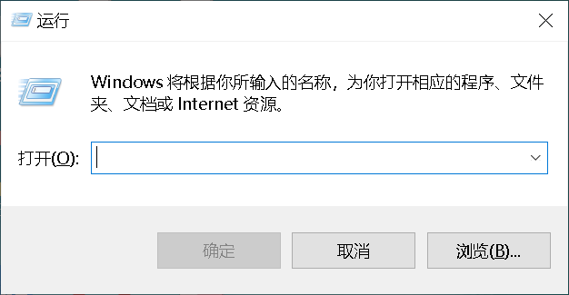  

<span style="font-weight:bold; font-size:1.2em;">Windows这里也是根据PATH来找程序的吗，Linux有没有类似方便的操作呢。</span>


这也是一个非常好的类比！你的直觉非常准。


### 一、 Windows 的“运行” (Win + R) 是根据 PATH 找程序的吗？

**答案是：<span style="color:#CC0000;">是的，绝大部分情况下是。</span>**

当你在那个“运行”框里输入 `notepad`、`cmd`、`calc`、`mspaint` 时<span style="color:#CC0000;">，Windows 的逻辑和你在 CMD 黑框框里输入命令是一模一样的</span>：

1. **去哪里找？** 它会去扫描 **`PATH` 环境变量**里记录的所有文件夹。
2. **找到了吗？** 找到了（比如在 `C:\Windows\System32` 里找到了），就直接运行。

<span style="color:#CC0000;">但是（有一个小小的“但是”）：</span>

Windows 的“运行”框比 CMD稍微“聪明”一点点，<span style="color:#CC0000;">它除了看 PATH，还会看注册表 (Registry)。</span>

<span style="color:#CC0000;">比如你输入 excel 能打开 Excel，但 Excel 的安装目录其实并没有加到 PATH 里。这是因为 Excel 在注册表里的 App Paths 键值下做了登记。</span>

- **总结**：<span style="color:#CC0000;">`Win + R` = **PATH 查找** + **注册表查找**。</span>

------


### 二、 Linux (Ubuntu) 有没有类似方便的操作？

当然有！而且花样更多。针对不同的需求，Linux 有两种对应的操作方式：


#### 1. 完美复刻版：`Alt` + `F2`

这是 Linux 桌面环境（GNOME, KDE 等）中最经典的快捷键，它的功能和 Windows 的 `Win + R` **一模一样**。

- **操作**：在 Ubuntu 桌面按下 `Alt` + `F2`。
- **界面**：屏幕中间会弹出一个小框（或者输入条）。
- **原理**：
  - 它<span style="color:#CC0000;">**完全依赖 PATH 环境变量**。</span>
  - 你在里面输入 `firefox`，它就去 PATH 里找 Firefox 启动。
  - 你在里面输入 `reboot`，它就去 PATH 里找 reboot 命令重启电脑。
  - 它甚至支持按 `Tab` 键自动补全命令（和终端一样）。


#### 2. <span style="color:#CC0000;">现代搜索版：`Super` 键 (Windows 徽标键)</span>

这是目前 Linux 用户最常用的方式，相当于 Windows 的“开始菜单搜索”。

- **操作**：按下键盘左下角的 `Win` 键（在 Linux 圈子里叫 Super 键）。
- **原理**：
  - 这个搜索框比 `Alt+F2` 更智能。
  - 它不仅找 **PATH** 里的命令。
  - 它主要查找 **`.desktop` 文件**（相当于 Windows 的快捷方式）。
  - <span style="color:#CC0000;">哪怕一个程序不在 PATH 里，只要它有一个 `.desktop` 描述文件，你就能搜到它。</span>

------


### 三、 深度扩展：Linux 的“快捷方式”是怎么管理的？

（这点对嵌入式开发很有用，因为你以后可能要给你的开发板写图形界面程序）

在 Windows 里，快捷方式是桌面上的 .lnk 文件。

在 Linux 里，快捷方式是 .desktop 文件。

当你按 `Super` 键搜索软件时，Linux 系统其实是在扫描 **`/usr/share/applications`** 这个目录。

**做一个实验：**

1. 打开 Ubuntu 终端。
2. 输入 `cd /usr/share/applications`。
3. 输入 `ls`。
4. 你会看到密密麻麻的 `.desktop` 文件（比如 `firefox.desktop`, `gedit.desktop`）。

**这些文件的内容长这样（简化版）：**

Ini, TOML

```
[Desktop Entry]
Name=Firefox Web Browser   # 显示的名字
Exec=/usr/bin/firefox %u   # 实际运行的命令 (这里通常是绝对路径，或者PATH里的命令)
Icon=firefox               # 图标
Type=Application
```


### 四、 总结

| **功能**              | **Windows 操作**      | **Linux (Ubuntu) 操作** | **原理核心**                        |
| --------------------- | --------------------- | ----------------------- | ----------------------------------- |
| **运行命令 (Run)**    | **Win + R**           | **Alt + F2**            | **纯粹依赖 PATH** (最底层、最快)    |
| **搜索应用 (Search)** | **Win 键** (开始菜单) | **Super (Win) 键**      | 依赖 **快捷方式** (.lnk / .desktop) |

建议：

下次你在 Ubuntu 里想启动计算器或者浏览器，试一下 Alt + F2，然后输入 gnome-calculator 或者 firefox，你会发现那种“掌控系统”的感觉和在 Windows 用 Win + R 是一样的爽！


## 提问 1 - （2）-（3）（重点：Windows中的cmd 运行框 搜索框 区别）

<span style="font-weight:bold; font-size:1.2em;">Windows中cmd，运行框，搜索框，这三者能够找到的文件有什么区别吗，我不是太懂，你能够给我详细解释下吗？</span>

这个问题问得非常专业，这说明你已经开始从“用户”思维向“开发者/系统架构师”思维转变了。

虽然这三个东西看起来都是“输入名字 -> 找东西”，但它们背后的**搜索机制（Search Mechanism）**和**搜索范围（Search Scope）**是完全不同的。

你可以把它们想象成三个不同层级的“管家”：

------


### 一、 CMD（命令提示符）：最死板的“执行官”

- **它的性格**：**严格、机械、只认死理**。
- **它在哪里找？**
  1. **<span style="color:#CC0000;">当前目录</span>**：你用 `cd` 命令进入的那个文件夹。
  2. **<span style="color:#CC0000;">PATH 环境变量</span>**：那个“记事本”里记录的文件夹。
- **它能找到什么？**
  - 它只找**<span style="color:#CC0000;">可执行文件</span>**（<span style="color:#CC0000;">.exe, .bat, .cmd</span> 等，由 `PATHEXT` 变量定义）。
  - 它**不看**注册表，也**不看**你的开始菜单快捷方式。
- **典型案例**：
  - 输入 `notepad` -> 成功（因为它在 `C:\Windows\System32`，属于 PATH）。
  - 输入 `excel` -> **失败**（报错“不是内部或外部命令”）。
    - *为什么？* 因为 Office 安装目录默认**不在** PATH 里。

------


### 二、 运行框（Win + R）：聪明的“调度员”

- **它的性格**：**灵活、甚至有点“特权”**。
- **它在哪里找？**
  1. **<span style="color:#CC0000;">PATH 环境变量</span>**：跟 CMD 一样，PATH 里的它都能找到。
  2. **<span style="color:#CC0000;">注册表映射</span>（App Paths）**：这是它的“秘密武器”。
- **什么是“注册表映射”？**
  - 有些软件（比如 Excel, Photoshop）安装时，虽然没把自己加到 PATH 里（怕污染环境），但它们在 Windows 的**注册表**里偷偷登记了一个“别名”。
  - 比如 Excel 在注册表里登记了：`"excel" = "C:\Program Files\Microsoft Office\Office16\EXCEL.EXE"`。
  - 当你输入 `excel` 时，运行框会先查 PATH，查不到就去查注册表，查到了就帮你运行。
- **它能找到什么？**
  - <span style="color:#CC0000;">可执行程序</span>（PATH + 注册表别名）。
  - <span style="color:#CC0000;">文件夹路径</span>（输入 `C:` 直接打开盘符）。
  - 网址（输入 `www.baidu.com` 直接打开浏览器）。
- **典型案例**：
  - 输入 `notepad` -> 成功（靠 PATH）。
  - 输入 `excel` -> **成功**（靠注册表 App Paths）。
  - 输入 `qq` -> **失败**（除非你把 QQ 加到 PATH，或者 QQ 在注册表里写了别名，通常 QQ 是不支持这个的）。

------


### 三、 搜索框（Win + S / 开始菜单）：博学的“图书管理员”

- **它的性格**：**无所不知、模糊匹配**。
- **它在哪里找？**
  1. **<span style="color:#990000;">Windows 索引数据库 (Indexing Service)</span>**：这是 Windows 在后台没日没夜建立的一个巨大数据库。它记录了“开始菜单”里的所有快捷方式、你的“文档/图片/视频”文件夹里的所有文件名，甚至文件里的内容。
  2. **<span style="color:#CC0000;">不依赖 PATH</span>**：它根本不屑于去扫描 PATH 变量。
- **它能找到什么？**
  - **<span style="color:#CC0000;">快捷方式 (.lnk)</span>**：这是重点。你安装 QQ 后，QQ 在开始菜单建了个快捷方式叫“腾讯 QQ”。你搜“QQ”或者是“腾讯”，搜索框是去匹配这个快捷方式的名字，而不是去运行 `QQ.exe`。
  - **<span style="color:#CC0000;">文档、图片、设置</span>**：搜“鼠标设置”能跳出设置面板，搜“周报”能找到你的 Word 文档。
- **典型案例**：
  - 输入 `notepad` -> 成功（匹配到了“记事本”这个快捷方式）。
  - 输入 `excel` -> 成功（匹配到了 Office 的快捷方式）。
  - 输入 `qq` -> **成功**（匹配到了开始菜单里的“腾讯 QQ”快捷方式）。

------


### 四、 终极对比实验（让你瞬间秒懂）

为了彻底搞懂区别，请配合我做这个思维实验：

假设你下载了一个游戏，叫 Game.exe，放在 D:\Games\ 目录下。

你没有配置 PATH，也没有在开始菜单创建快捷方式。

1. **在 CMD 里输入 `Game`**：
   - **结果**：❌ 失败。
   - *原因*：不在当前目录，也不在 PATH 里。
2. **在 运行框(Win+R) 里输入 `Game`**：
   - **结果**：❌ 失败。
   - *原因*：不在 PATH 里，注册表里也没人给它登记别名。
3. **在 搜索框 里输入 `Game`**：
   - **结果**：❌ 失败（大概率）。
   - *原因*：你没创建快捷方式，而且 `D:\Games` 可能还没被 Windows 建立索引。

**现在，你把 `Game.exe` 创建一个快捷方式放到桌面，改名叫 “我的超级游戏”。**

1. **CMD**：还是找不到（它不看桌面快捷方式）。
2. **运行框**：还是找不到。
3. **搜索框**：你输入 **“超级”** 或者 **“Game”**，它**能找到了**！因为它扫描到了这个快捷方式。


### 五、 总结表

| **工具**               | **CMD**            | **运行框 (Win+R)**    | **搜索框 (Win+S)**     |
| ---------------------- | ------------------ | --------------------- | ---------------------- |
| **主要依赖**           | **PATH**           | **PATH + 注册表**     | **索引 + 快捷方式**    |
| **QQ 能找到吗？**      | 不能 (除非改PATH)  | 不能                  | **能** (找快捷方式)    |
| **Excel 能找到吗？**   | 不能 (不在PATH)    | **能** (有注册表别名) | **能** (找快捷方式)    |
| **Notepad 能找到吗？** | 能 (在PATH)        | 能 (在PATH)           | 能 (找快捷方式)        |
| **适用场景**           | 开发者、脚本、调试 | 快速启动系统工具      | 找软件、找文件、找设置 |

给嵌入式开发者的建议：

我们在搞嵌入式开发时（比如编译代码、刷写固件），只信任 CMD 里的 PATH。

因为编译脚本（Makefile）在后台运行时，它没有鼠标去点搜索框，也没有注册表可以查，它只能依靠 PATH。所以，理解 CMD 的查找逻辑是最核心的！


## 提问 1 - （2）- （3）

<span style="font-weight:bold; font-size:1.2em;">这个注册表和Windows索引数据库在哪里可以查看呢，我们创建一个文件，文件夹，或者安装一个应用程序的时候都会自动在这个注册表里面注册还有自动在这个Windows索引数据库里面添加快捷方式吧（快捷方式应该就是一个软链接文件吧）。还有在桌面创建快捷方式的时候修改了文件名，此时可以直接用这个文件名搜索，还可以用原来的可执行文件名搜索吧。我不太懂，你能够给我详细解释下吗。</span>


这又是一组非常硬核的问题！你正在试图揭开 Windows 系统的“遮羞布”，看看它后台到底是怎么运作的。

你的直觉大部分是准确的，但在细节上有几个**关键的误区**（特别是关于注册表自动写入、快捷方式与软链接的区别）。

我来为你一一拆解，保证让你通透。

------


### 一、 注册表 (Registry)

#### 1. 在哪里查看？

- **工具**：按下 `Win + R`，输入 **`regedit`**，回车。

- **这是什么**：你会看到一个树状结构。这就是 Windows 的核心数据库。请小心，不要随意删除里面的东西，否则系统可能崩坏。

- App Paths 在哪：之前说的 Win + R 能找到 Excel 的秘密，藏在这里：

  HKEY_LOCAL_MACHINE\SOFTWARE\Microsoft\Windows\CurrentVersion\App Paths

  你展开看看，里面全是注册过的程序路径。

  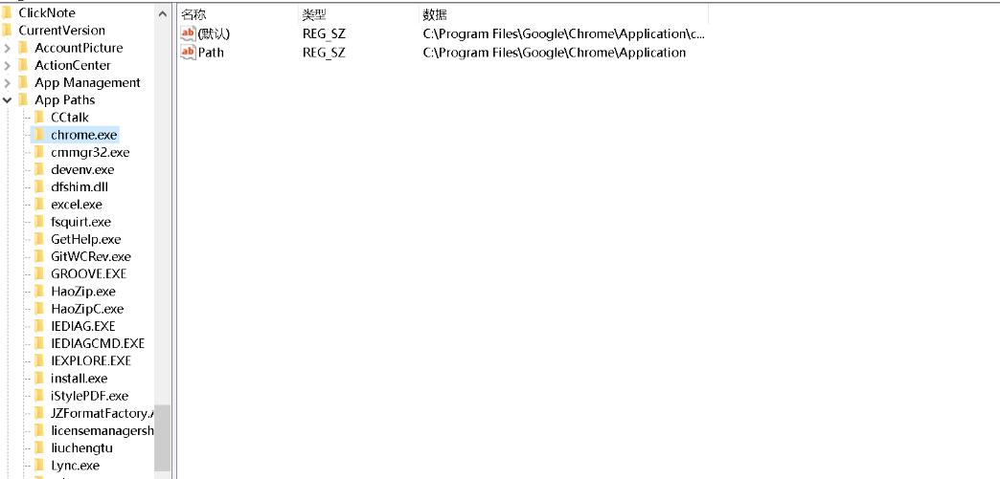

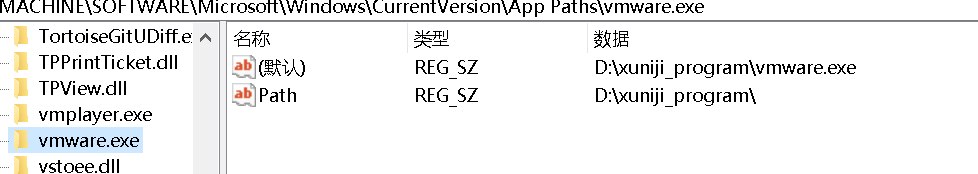

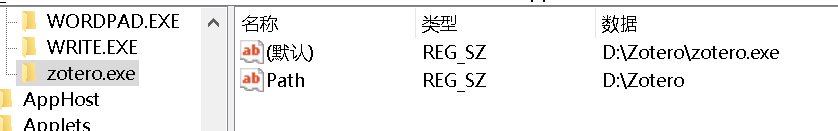


#### 2. 是“自动”注册的吗？

**<span style="color:#CC0000;">绝对不是！</span>** 这是一个巨大的误区。

- **<span style="color:#CC0000;">创建文件/文件夹</span>**：你在 D 盘新建一个 `test.txt` 或新建一个文件夹，<span style="color:#CC0000;">**完全不会**惊动注册表</span>。注册表根本不知道这些琐事。
- <span style="color:#CC0000;">**解压版软件**（绿色软件）</span>：你<span style="color:#CC0000;">解压一个 QQ，注册表**完全不知道**它的存在。</span>
- **<span style="color:#CC0000;">安装版软件</span>**（Setup.exe）：
  - <span style="color:#CC0000;">为什么它能写进注册表？是因为写这个软件的程序员，在安装包的脚本里**显式地写了一行代码**：`“把我的路径写入 Registry 的 App Paths 节点”`。</span>
  - <span style="color:#CC0000;">是安装程序主动去写的，而不是系统自动发现的。</span>

------


### 二、 Windows 索引数据库 (Windows Search Index)

#### 1. 在哪里查看？

这个数据库不像注册表那样可以直接编辑，它是一个<span style="color:#CC0000;">巨大的二进制文件（`Windows.edb`）</span>，普通人打不开。但你可以通过管理界面看它在干什么：

- **工具**：按下 Win 键，搜 **“索引选项”** (Indexing Options)。
- **能看到什么**：你可以看到系统**正在监视哪些文件夹**。
  - 默认情况下，它只监视：**开始菜单、用户文件夹（文档、图片、桌面、下载）**。
  - 它**默认不监视** `C:\Windows`，也不监视你的 `D:` 盘根目录（除非你手动添加）。


#### 2. 是“自动”添加的吗？

<span style="color:#CC0000;">**是有条件的自动。**</span>

- **场景 A**：你在<span style="color:#CC0000;">**桌面**（Desktop）上创建了一个快捷方式。</span>
  - 因为“<span style="color:#CC0000;">桌面”属于被监视的范围</span>，索引服务（Indexer）会在几秒钟内发现它，读取它的名字，存入数据库。**此时你可以搜到它。**
- **场景 B**：你在 **D:\MyGames** 里放了一个 `Game.exe`。
  - <span style="color:#CC0000;">如果 `D:\MyGames` **不在**索引选项的监视列表中（默认就不在）。</span>
  - <span style="color:#CC0000;">不管你怎么搜，都**搜不到**这个文件。</span>

------


### 三、 快捷方式 (.lnk) 是软链接吗？

**这是一个非常重要的技术概念，千万别搞混！**

**结论：Windows 的快捷方式（Shortcut, .lnk）不是软链接（Soft Link / Symlink）。**


#### 1. 快捷方式 (.lnk) —— 只是一个“路牌”

- **本质**：它是一个普通的**二进制文件**，大小通常是 1KB - 2KB。
- **原理**：<span style="color:#CC0000;">如果你用记事本强行打开它，是一堆乱码。它里面记录了：“我的目标在 D:\QQ\Bin\QQ.exe，图标是...”。</span>
- **局限性**：
  - **资源管理器 (Explorer)** 认识它，双击它时，Explorer 会读取它并帮你跳转。
  - **程序不认识它**：你在 Java 代码里读取 `test.lnk`，你读到的就是这个 1KB 的文件本身，而不是它指向的目标文件！**命令行 (CMD) 也不认识它。**


#### 2. 软链接 (Symbolic Link) —— 真正的“替身”

- **本质**：文件系统层面的映射。
- **原理**：它像是一个透明的传送门。
- **优势**：
  - 所有程序（Java, Python, CMD, QQ）都把它当成**真实文件**。
  - 你在 Windows 里也可以创建软链接（用 `mklink` 命令），但这和右键创建的快捷方式完全是两码事。

------


### 四、 那个最刁钻的搜索问题

**场景**：

1. 你有一个 `Game.exe`。
2. 你在桌面创建了快捷方式，改名叫 **“超级马里奥”**。

**问题 1：能<span style="color:#CC0000;">用“超级马里奥”搜到吗？</span>**

- **能！** 因为快捷方式在桌面上，桌面被索引了，而且索引器记录了它的**文件名**（"超级马里奥"）。

**问题 2：<span style="color:#CC0000;">能用原来的“Game.exe”搜到吗？</span>**

- **<span style="color:#CC0000;">通常不能！</span>** (这里很微妙)
  - Windows 搜索逻辑主要是**搜文件名**。
  - 索引器记录的是：有一个文件叫“超级马里奥.lnk”。它**不会**递归地去把快捷方式指向的目标文件名也当做搜索关键字。
  - **除非**：你的 `Game.exe` 所在的原始文件夹（比如 D:\Games）**也被加入到了索引范围**。那样的话，系统搜到的其实是原始的 `Game.exe`，而不是通过快捷方式搜到的。


### 五、 总结（针对嵌入式学习者）

1. **注册表**：是软件的“户口本”。只有安装程序主动去登记（写代码写入）才会有，复制粘贴的文件没有户口。
2. **索引**：是系统的“雷达”。它只扫描特定的区域（如桌面、文档）。不在区域里的文件，它就是瞎子。
3. **快捷方式 vs 软链接**：
   - **快捷方式**：给**人**用的（鼠标点）。代码/脚本无法直接穿透它。
   - **软链接**：给**程序/脚本**用的。代码读它就像读源文件一样。
   - *嵌入式开发提示*：在编译脚本中引用文件时，千万别用 `.lnk` 快捷方式，编译器会报错；要用真实路径或软链接。


## 提问 1 - （3）

<span style="font-weight:bold; font-size:1.2em;">我应该如何在ubuntu中查看Linux系统中的环境变量，以及在Windows系统中的环境变量呢，我想要对比学习下。</span>


这是一个非常棒的学习思路！**对比**是掌握操作系统差异最快的方法。

虽然 Linux (Ubuntu) 和 Windows 在内核层面截然不同，但它们在“环境变量”这个设计思想上是**惊人一致**的：<span style="color:#CC0000;">都是用一组</span> `KEY=VALUE` 的<span style="color:#CC0000;">键值对</span>来<span style="color:#CC0000;">保存系统的配置信息</span>。

下面我手把手教你在两个系统中查看环境变量，最后做一个核心差异对比（面试常考）。

------


### 一、 在 Ubuntu (Linux) 中查看

在 Linux 中，我们主要使用**终端 (Terminal)** 来查看。

#### 1. 查看所有环境变量

打开终端（快捷键 `Ctrl+Alt+T`），输入以下任一命令：

- **`env`**：最常用的命令，列出当前 Shell 会话的所有环境变量。
- **`printenv`**：与 `env` 功能几乎一样，专门用于打印环境变量。
- **`export`**：不仅列出变量，还会显示定义变量的命令格式（通常带有引号）。

**操作演示：**

Bash

```c
# 在终端输入
env
```

**输出示例（截取）：**

Plaintext

```c
USER=book
HOME=/home/book
SHELL=/bin/bash
PATH=/usr/local/sbin:/usr/local/bin:/usr/sbin:/usr/bin:/sbin:/bin
LANG=en_US.UTF-8
```


#### 2. 查看某一个特定的变量（比如 PATH）

如果你只想看 `PATH`，不需要在一大堆文字里找，直接“打印”它：

Bash

```c
# 注意：Linux引用变量必须加 $ 符号
echo $PATH
# 或者
printenv PATH
```

------


### 二、 在 Windows 中查看

Windows 有两种主要方式：**命令行 (CMD/PowerShell)** 和 **图形界面 (GUI)**。

#### 1. 命令行方式 (CMD)

按下 `Win + R`，输入 `cmd` 回车。

- **查看所有**：输入 `set`。
- **查看特定**：输入 `echo %变量名%` （注意 Windows CMD 使用百分号包裹）。

**操作演示：**

DOS

```c
REM 查看所有
set

REM 查看 PATH
echo %PATH%
```


#### 2. 命令行方式 (PowerShell) - *推荐，更现代*

按下 `Win + X` 选择 PowerShell。PowerShell 的命令更像编程语言。

- **查看所有**：`Get-ChildItem Env:` (或者简写 `ls env:`)
- **查看特定**：`$env:变量名`

**操作演示：**

PowerShell

```c
# 查看 PATH
$env:PATH
```


#### 3. 图形界面方式 (最直观)

这是 Windows 用户最常用的方式：

1. 在任务栏搜索框输入 **"env"** 或 **"环境"**。
2. 选择 **"编辑系统环境变量"** (Edit the system environment variables)。
3. 点击右下角的 **"环境变量(N)..."** 按钮。

你会看到两个框：

- **上面是“用户变量”**：只对你当前登录的账号生效（类似 Linux 的 `~/.bashrc`）。
- **下面是“系统变量”**：对这台电脑上所有用户生效（类似 Linux 的 `/etc/profile`）。

------


### 三、 核心对比：Linux vs Windows (面试重点)

这部分是你作为嵌入式开发者必须搞清楚的**底层差异**：

| **特性**         | **Linux (Ubuntu)**                   | **Windows**                           | **深度解析 (面试考点)**                                      |
| ---------------- | ------------------------------------ | ------------------------------------- | ------------------------------------------------------------ |
| **路径分隔符**   | 冒号 **`:`**                         | 分号 **`;`**                          | **为什么？**<span style="color:#CC0000;"> Windows 用冒号表示盘符（如 `C:`），所以 PATH 里不能用冒号做分隔，只能改用分号。Linux 没有盘符概念，一切皆文件，所以用冒号。</span> |
| **引用变量方式** | **`$PATH`**                          | CMD: **`%PATH%`** PS: **`$env:PATH`** | 写脚本时别搞混了。Linux Shell 脚本用 `$`，Windows Batch 脚本用 `%`。 |
| **大小写敏感**   | **敏感**                             | **不敏感**                            | Linux 中 `Path` 和 `PATH` 是两个不同的变量！ Windows 中 `Path` 就是 `PATH`。 |
| **目录层级符**   | 斜杠 **`/`**                         | 反斜杠 **`\`**                        | Linux: `/usr/bin/ls` Windows: `C:\Windows\System32` 这也是因为历史原因（DOS时代遗留）。 |
| **存储位置**     | 文件配置 (`.bashrc`, `/etc/profile`) | 注册表 (Registry)                     | Linux 的配置都在文件里，修改文件即修改配置。 Windows 的配置存在注册表里，图形界面只是注册表的编辑器。 |

------


### 四、 总结与思考

你可以做这样一个有趣的实验来加深记忆：

1. **在 Windows 中**：打开 CMD，输入 `echo %path%` (小写)，你会发现它能打印出路径，说明 Windows **不区分大小写**。
2. **在 Ubuntu 中**：打开终端，输入 `echo $path` (小写)，你会发现打印出空行（因为系统只有 `$PATH` 大写），说明 Linux **严格区分大小写**。

接下来：

既然你知道了怎么查看，下一步你可能需要通过练习修改来巩固。

你想试着在 Ubuntu 里手动创建一个属于你自己的环境变量（比如 MY_NAME=你的名字），并在 C 语言代码里把它读出来吗？ 这能让你完美闭环“系统 -> Shell -> C语言”的知识链。


## 提问 1 - （4）

```bash
USER=book

HOME=/home/book

SHELL=/bin/bash

PATH=/usr/local/sbin:/usr/local/bin:/usr/sbin:/usr/bin:/sbin:/bin

LANG=en_US.UTF-8
```

<span style="font-weight:bold; font-size:1.2em;">这里环境变量不应该就指的是PATH吗，其他的也是环境变量吗，我不太懂，你能够给我详细解释下吗？</span>


这是一个非常非常经典的误解！问得太好了。

很多初学者（甚至工作几年的程序员）在日常交流中<span style="color:#CC0000;">，因为修改 `PATH` 的频率最高，所以习惯性地把“配置环境变量”等同于“修改 PATH”。</span>

但**事实上：<span style="color:#CC0000;">`PATH` 只是环境变量这个大家族中的“一员”而已，甚至只是几百个变量中的一个。</span>**

你可以把“环境变量”想象成**一张入职登记表**，而 `PATH` 只是表格里的**其中一栏**。

我来结合你列出的这几行内容，给你详细拆解一下它们各自的作用，你就明白了。

------


### 一、 重新审视这张“入职登记表”（环境变量表）

你看到的这 5 行内容，<span style="color:#CC0000;">每一行都是一个独立的**环境变量**</span>。它们<span style="color:#CC0000;">共同组成了当前 Shell 的运行环境。</span>


#### 1. `USER=book` （我是谁？）

- **含义**：<span style="color:#CC0000;">告诉所有程序，当前操作电脑的用户叫 `book`。</span>
- **作用**：<span style="color:#CC0000;">当你运行一个程序时，程序会读取这个变量。如果它发现你是 `root`，它可能让你拥有最高权限；如果发现你是 `book`，它可能禁止你删除系统文件。</span>
- **也是环境变量吗？** 是的！


#### 2. `HOME=/home/book` （我的家在哪？）

- **含义**：告诉所有程序，当前用户的“私人领地”（家目录）在哪里。
- **作用**：
  - <span style="color:#CC0000;">当你只输入 `cd` 并回车时，Shell 怎么知道要跳到哪里？它就是读取了 `$HOME` 这个变量，然后跳过去的。</span>
  - <span style="color:#CC0000;">当你运行 `ssh` 命令时，它去哪里找你的密钥？它会去 `$HOME/.ssh` 里面找。</span>
- **也是环境变量吗？** 是的！


#### 3. `SHELL=/bin/bash` （我的翻译官是谁？）

- **含义**：告诉系统，<span style="color:#CC0000;">当前使用的 Shell 程序是哪一个版本（这里是 bash）</span>。
- **作用**：某些脚本需要知道当前环境是用 Bash 还是 Zsh 运行的，以防止语法不兼容。
- **也是环境变量吗？** 是的！


#### 4. `LANG=en_US.UTF-8` （我说什么语言？）

- **含义**：告诉所有程序，请使用“美国英语”并且使用“UTF-8”编码来显示文字。
- **作用**：
  - 如果你把这个改成 `zh_CN.UTF-8`，你的系统报错信息就会变成中文：“找不到命令”。
  - 现在它是 `en_US`，所以报错是英文："command not found"。
- **也是环境变量吗？** 是的！


#### 5. `PATH=...` （我去哪找工具？）

- **含义**：正如前面视频里讲的，它是<span style="color:#CC0000;">**可执行程序**的搜索路径列表</span>。
- **地位**：它是最著名的环境变量，但它绝对不是唯一的。

------


### 二、 回到代码层面看本质

还记得我们刚才说的 `char *env[]` 那个记事本（字符串数组）吗？

<span style="color:#CC0000;">在内存里，这 5 个变量是**平起平坐**的，没有任何区别，它们只是数组里的不同元素而已：</span>

C

```c
// 内存里的真实模样
char *env[] = {
    "USER=book",       // env[0]
    "HOME=/home/book", // env[1]
    "SHELL=/bin/bash", // env[2]
    "PATH=/usr/...",   // env[3] -> PATH 只是其中一行！
    "LANG=en_US...",   // env[4]
    NULL
};
```

- Shell <span style="color:#CC0000;">想要找程序时，它会去读 `env[3]` (PATH)。</span>
- Shell <span style="color:#CC0000;">想要确定回家路径时，它会去读 `env[1]` (HOME)。</span>
- **它们都是数据，只是用途不同。**

------


### 三、 为什么大家总觉得“环境变量 == PATH”？

产生这个误区的原因主要是**“曝光率”**不同：

1. **USER, HOME, SHELL, LANG**：这些变量通常由操作系统在登录时**自动设置好**了，而且绝大多数情况下，你**不需要修改**它们。它们默默无闻地在后台工作，所以你感觉不到它们的存在。
2. **PATH**：这是<span style="color:#CC0000;">开发者最头疼的变量</span>。你<span style="color:#CC0000;">安装了 Java，要改 PATH；安装了 Python，要改 PATH；安装了交叉编译工具链，还要改 PATH。</span>因为你经常需要手动去折腾它，所以产生了一种错觉：环境变量就是 PATH。


### 四、 总结

**“环境变量”是一个统称**，指的是操作系统运行环境中的**所有参数配置**。

- **PATH**：负责管“程序在哪”。
- **HOME**：负责管“家在哪”。
- **USER**：负责管“我是谁”。
- **LANG**：负责管“说啥语言”。
- **LD_LIBRARY_PATH**（嵌入式常用）：负责管“动态库在哪”。

它们都是那个 `char *env[]` 数组里的一行字符串，缺一不可。

这就好比你的**身份证**：

- **PATH** 就像是你的“家庭住址”（最常被用到）。
- 但身份证上还有“姓名”（USER）、“民族”（LANG）、“出生日期”等。
- 你不能说“身份证信息就指的是家庭住址”，对吧？它们统称为“身份信息（环境变量）”。


## 提问 1 - （5）

<span style="color:#CC0000; font-weight:bold;">安装了 Java，要改 PATH；安装了 Python，要改 PATH；安装了交叉编译工具链，还要改 PATH。这句话我不是太理解，你能够给我详细解释下吗，为什么安装这些应用程序的时候要修改PATH这个环境变量呢，好像安装某些程序的时候并没有需要修改这个环境变量。我不太懂，你能够给我详细解释下吗</span>


这个问题问得非常敏锐！你观察到了一个很关键的现象：**<span style="color:#CC0000;">有的软件装完就能用，有的软件装完还得改 PATH，这到底是为什么？</span>**

其实，<span style="color:#CC0000;">是否需要修改 `PATH`</span>，主要取决于**<span style="color:#CC0000;">你安装软件的方式</span>**以及**<span style="color:#CC0000;">软件的用途</span>**。

为了让你彻底理解，我们还是用**“Shell 服务员”**和**“查找范围”**这个逻辑来拆解。

------


### 一、 核心原因：为了“偷懒”和“方便”

**<span style="color:#CC0000;">修改 PATH 的唯一目的，就是为了让你在终端里打字少打一点。</span>**


#### 场景还原

假设你从官网下载了一个 Java 开发包（JDK），解压到了 `/opt/java1.8/bin` 目录下。此时，`javac`（Java编译器）这个程序就安静地躺在这个目录里。

- <span style="color:#CC0000;">如果不改 PATH：</span>

  每次你想编译代码，你都必须对 Shell 服务员喊出全名：

  > “服务员，请运行 `/opt/java1.8/bin/javac` MyCode.java”

- 如果改了 PATH（<span style="color:#CC0000;">把 /opt/java1.8/bin 加到 PATH 里</span>）：

  你只需要喊它的哪怕：

  > “服务员，运行 `javac` MyCode.java”

**原理**：<span style="color:#CC0000;">Shell 服务员只有在 `PATH` 记录的目录里，才能凭“外号”（文件名）找到程序。如果不加，你就必须给它“家庭住址”（绝对路径）。</span>

------


### 二、 为什么这三类软件（Java/Python/交叉编译）“老是”要改 PATH？

这三类软件有一个共同点：**<span style="color:#CC0000;">它们通常是给开发者用的命令行工具，且容易有版本冲突</span>。**


#### 1. 交叉编译工具链 (Embedded 开发必懂)

- **背景**：你的电脑上本来就有一个 `gcc`（用来编译电脑软件的）。现在你又装了一个 `arm-linux-gcc`（用来编译开发板软件的）。
- **为什么不直接装到标准目录（/usr/bin）？**
  - 如果都装在一起，文件太多太乱。
  - 更重要的是，不同板子可能需要不同版本的编译器。你可能有 `arm-v7-gcc`，也可能有 `arm-v8-gcc`。
- **做法**：通常厂家会让你把编译器解压到一个**偏僻的独立目录**（比如 `/usr/local/arm/bin`），以免干扰系统自带的编译器。
- **结果**：<span style="color:#CC0000;">因为这个目录太偏僻了，Shell 根本不知道它的存在，所以你**必须手动把这个偏僻目录加入 PATH**，Shell 才能找得到它。</span>


#### 2. Java 和 Python (多版本共存)

- **背景**：很多开发者电脑上会同时安装 Python 2.7, Python 3.8, Python 3.10。
- **冲突**：如果它们都叫 `python.exe` 并且都塞在同一个文件夹里，系统就疯了。
- **做法**：它们各自安装在独立的文件夹里（比如 `C:\Python39\` 和 `C:\Python27\`）。
- **改 PATH 的意义**：你想用 Python 3，就把 `Python39` 的路径放到 `PATH` 的**最前面**。你想切换回 Python 2，就改 PATH 的顺序。**改 PATH 成了切换版本的手段。**

------


### 三、 为什么有些程序“不需要”改 PATH？

你肯定遇到过安装 `Chrome`、`QQ` 或者通过 `apt install` 安装软件，<span style="color:#CC0000;">装完直接就能用，不用去配环境变量。这是因为：</span>


#### 1. 自动写入了标准目录 (VIP 待遇)

当你使用 `sudo apt install python3` 或者 Windows 的 `.exe` 安装包安装时，安装程序非常贴心。

- 它会把可执行程序直接复制到 `/usr/bin` 或者 `C:\Windows\System32` 下。
- 或者，它会在 `/usr/bin` 下创建一个**软链接**（快捷方式）指向真实的程序。

**因为 `/usr/bin` 这种目录天生就在 `PATH` 变量里（它是 Shell 默认的 VIP 搜索区）**，所以只要东西放进了这里，你不需要做任何配置，Shell 就能直接找到。


#### 2. 图形界面程序 (不需要命令行启动)

比如安装了一个**音乐播放器**或**浏览器**。

- 我们通常是双击桌面图标，或者在开始菜单里点它来运行。
- **桌面图标里其实已经写死了绝对路径**（比如 `Exec=/usr/bin/google-chrome-stable`）。
- <span style="color:#CC0000;">既然你不用在黑框框（终端）里敲它的名字来启动它，那你自然就不需要把它加到 `PATH` 里。</span>

------


### 四、 总结：判断标准

<span style="color:#CC0000;">下次安装软件时，如果不确定要不要改 PATH，可以用这个标准判断：</span>

1. **我需要在终端（黑框框）里敲命令来启动它吗？**
   - 如果**不需要**（比如只用鼠标点图标），那就**不用改 PATH**。
   - 如果**需要**（比如 `javac`, `python`, `gcc`），进入下一步。
2. **它是通过“解压”安装，还是通过“安装包”安装？**
   - 如果是**安装包**（apt, yum, setup.exe）：通常<span style="color:#CC0000;">安装程序会自动帮你搞定 PATH，或者把程序放入标准目录，你**不用管**</span>。
   - 如果是**解压包**（tar.gz, zip）：<span style="color:#CC0000;">解压出来的文件夹通常在偏僻位置，Shell 找不到，这时你**必须手动修改 PATH**。</span>

嵌入式开发的常态：

嵌入式开发用到的工具（交叉编译器、调试器 J-Link、烧录工具）<span style="color:#CC0000;">绝大多数都是解压即用的绿色软件。为了能在终端里随叫随到，我们需要把它们那些奇奇怪怪的解压路径，全部一股脑塞进 PATH 记事本里。</span>


## 提问 1 - （5）- （1）

- 如果是**安装包**（apt, yum, setup.exe）：通常<span style="color:#CC0000;">安装程序会自动帮你搞定 PATH，或者把程序放入标准目录，你**不用管**</span>。
- 如果是**解压包**（tar.gz, zip）：<span style="color:#CC0000;">解压出来的文件夹通常在偏僻位置，Shell 找不到，这时你**必须手动修改 PATH**。</span>

这里我不太懂，如果是安装包的话，既然是安装程序自动帮我搞定的PATH，那么我应该能够在PATH的目录环境中找到它吧，Windows中应该也是一样的，我应该在Windows中哪里去找呢，以QQ和Chorme为例。


这是一个非常敏锐且深刻的问题！你发现了一个逻辑上的**“盲点”**。

确实，我之前说“安装程序会自动帮你搞定”，这句话主要针对的是**开发工具**（如 Git, Node.js, VS Code, CMake 等）。

但对于 **QQ、Chrome** 这种纯图形界面（GUI）的日常软件，情况完全不同。

**结论先行：**

1. **在 Windows 中**：<span style="color:#CC0000;">QQ 和 Chrome 的安装程序**通常不会**把它们加到 `PATH` 环境变量里。</span>
2. **在 Ubuntu (Linux) 中**：`apt` 安装的软件（包括 Chrome/Firefox）**通常会**放入 `PATH` 目录中。

让我们来做一个实验，并通过实验来找它们到底在哪里。

------


### 一、 Windows 篇：为什么找不到 QQ 和 Chrome？

#### 1. 实验验证

请打开你的 CMD（命令行），输入以下命令并回车：

DOS

```
qq
```

或者

DOS

```bash
chrome
```

**结果预测**：99% 的概率会提示 **`'qq' 不是内部或外部命令...`**。

**原因**：

- **用途不同**：QQ 和 Chrome 是<span style="color:#CC0000;">设计给你用**鼠标**点的，不是让你在黑框框里打字启动的。</span>
- **为了系统整洁**：<span style="color:#CC0000;">如果安装任何一个软件（游戏、播放器、聊天软件）都往 `PATH` 里塞路径，`PATH` 变量会变得巨长无比，会拖慢系统查找命令的速度。</span>
- **<span style="color:#CC0000;">替代方案</span>**：它们会<span style="color:#CC0000;">在**桌面**或**开始菜单**</span>创建“<span style="color:#CC0000;">快捷方式</span>”（Shortcut）。


#### 2. 它们藏在哪？（<span style="color:#CC0000;">标准目录</span>）

虽然它们不在 `PATH` 环境变量里，但安装程序会把它们放到 Windows 的**标准应用程序目录**中。

你可以在资源管理器中去这两个地方找：

- **`C:\Program Files`** (64位软件)
- **`C:\Program Files (x86)`** (32位软件)

**具体找法（以 Chrome 为例）：**

1. 找到桌面上 Chrome 的图标。

2. **右键**点击图标 -> 选择 **“打开文件所在的位置”** (Open file location)。

3. 你会发现它通常躺在这里：

   C:\Program Files\Google\Chrome\Application\chrome.exe

<span style="color:#CC0000;">如果你想把 Chrome 加到 PATH 里</span>（<span style="color:#CC0000;">强行让它能用命令启动</span>）：

<span style="color:#CC0000;">你需要把上面那个路径（不包含 chrome.exe）手动加到环境变量里。加完之后，你在 CMD 里输 chrome 就能启动浏览器了。</span>

------


### 二、 Ubuntu (Linux) 篇：一切皆可命令

在 Linux 中，情况截然不同。Linux 的设计哲学是**“<span style="color:#CC0000;">优先考虑命令行</span>”**。


#### 1. 实验验证

打开 Ubuntu 的终端，输入：

Bash

```bash
google-chrome
# 或者
firefox
```

**结果**：<span style="color:#CC0000;">浏览器真的弹出来启动了！</span>


#### 2. 它们在哪？

既然能直接启动，说明<span style="color:#CC0000;">它们一定在 PATH 变量包含的某个目录里</span>。

我们可以用 which 命令来充当“侦探”，看看它们到底在哪：

Bash

```bash
which google-chrome
```

输出结果通常是：

/usr/bin/google-chrome


#### 3. Linux 的标准目录策略

还记得之前说的 `PATH` 包含了 `/usr/bin` 吗？

- 当你用 `apt install xxx` 安装软件时，系统包管理器非常规范。
- 不<span style="color:#CC0000;">管你是安装开发工具（gcc），还是安装图形软件（firefox），安装程序通常都会把可执行程序（或者一个软链接）放到 **`/usr/bin`** 这个公共大广场里。</span>
- <span style="color:#CC0000;">因为 `/usr/bin` 天生就在 `PATH` 列表里，所以你装完就能直接输名字运行。</span>

------


### 三、 总结与对比（面试加分项）

如果你在学习嵌入式或操作系统，理解这个区别非常重要：

| **特性**       | **Windows (如 QQ/Chrome)**                                   | **Linux (如 Firefox/Vim)**                       | **底层逻辑** |
| -------------- | ------------------------------------------------------------ | ------------------------------------------------ | ------------ |
| **安装位置**   | 各自为政。每个软件都有自己独立的文件夹（在 `Program Files` 下）。 | 集中管理。大部分可执行程序都扔进 `/usr/bin`。    |              |
| **PATH 状态**  | **默认不进 PATH**。依靠“快捷方式”来点击启动。                | **默认进 PATH**。依靠 `/usr/bin` 目录的特权。    |              |
| **如何找到它** | 桌面图标 -> 右键属性 -> 目标路径。                           | 使用 `which 命令名` 或 `whereis 命令名`。        |              |
| **设计哲学**   | **图形化优先**。用户习惯点图标。                             | **命令行优先**。即便是图形软件，也支持脚本调用。 |              |

给你的建议：

虽然 Windows 的 QQ 不在 PATH 里，但你可以试试在 CMD 里输入 calc (计算器) 或 notepad (记事本)。这两个是 Windows 自带的工具，<span style="color:#CC0000;">它们是躺在 C:\Windows\System32 里的，而这个目录是在 PATH 里的。</span>

<span style="color:#CC0000;">这下明白为什么有的软件“找不到”，有的软件“找得到”了吗？关键看安装程序有没有把它的“家庭住址”登记到 PATH 这张“联络表”上。</span>


## 提问 1 - （5）- （2）

<span style="font-weight:bold; font-size:1.1em;">如果软件安装例如QQ是自定义的目录的话，这也是一样的吗，也是通过快捷方式 而不是 PATH环境变量的方式，如果我把这个自定义目录添加到这个PATH环境变量里面，那么当我在终端中运行QQ的时候是不是就会启动qq呢，我不是太懂，你能够给我详细解释下吗？ </span>


你的推测 **完全正确**！

你的逻辑已经打通了：<span style="color:#CC0000;">**自定义安装目录 + 手动加入 PATH = 可以在终端直接启动**。</span>

为了让你对这个过程没有任何一丝疑惑，我来分两部分详细解释：第一部分回答“是不是一样的”，第二部分教你“怎么做实验”来验证你的猜想。

------


### 一、 回答你的疑惑

#### 1. 自定义安装目录，原理也是一样的吗？

是的，一模一样。

无论你<span style="color:#CC0000;">把 QQ 安装在默认的 C:\Program Files\TxGameAssistant</span>，还是<span style="color:#CC0000;">安装在你自定义的 D:\MySoftware\Chat\QQ</span>，<span style="color:#6600CC;">安装程序的行为逻辑是不变的</span>：

- **它做了什么**：它会<span style="color:#CC0000;">在桌面给你创建一个图标（快捷方式）</span>，<span style="color:#CC0000;">在开始菜单创建一个入口</span>。
- **它没做什么**：它<span style="color:#CC0000;">**不会**把你的 `D:\MySoftware\Chat\QQ\Bin` 这个路径加到 PATH 里</span>。
- **原因**：还是那个原因，<span style="color:#CC0000;">怕污染 PATH 变量，怕名字冲突（万一别的软件也叫 QQ.exe 呢？）</span>。


#### 2. 如果我把这个目录加到 PATH，是不是终端就能运行了？

绝对是！

<span style="color:#CC0000;">只要你把 QQ 的可执行文件（.exe）所在的文件夹路径加入到 PATH 环境变量中，CMD（终端）就能找到它，并启动它。</span>

------


### 二、 手把手带你做个实验（以 QQ 为例）

我们可以马上验证这个理论。请跟着我做：


#### 第一步：找到 QQ 的“真身”在哪里

桌面上的 QQ 图标只是个“替身”（快捷方式），我们要找它的真身。

1. 右键点击桌面 QQ 图标 -> **“打开文件所在的位置”**。
2. 你会打开一个文件夹，里面应该有一个叫 **`QQ.exe`** 的文件（或者叫 `QQScLauncher.exe`，取决于版本）。
3. **复制这个文件夹的路径**（比如：`D:\Program Files\Tencent\QQ\Bin`）。
   - <span style="color:#CC0000;">**注意：是复制文件夹的路径，不要把 QQ.exe 包含进去。**</span>


#### 第二步：修改 PATH 变量

1. 按 `Win` 键，搜“环境变量”，打开编辑界面。
2. 在**“用户变量”**里找到 **`Path`**，双击它。
3. 点击右边的 **“新建”**。
4. 把刚才复制的路径 `D:\Program Files\Tencent\QQ\Bin` 粘贴进去。
5. **重要**：一路点击“确定”，直到关掉所有窗口。


#### 第三步：见证奇迹

1. **非常重要**：<span style="color:#CC0000;">关闭你之前打开的所有 CMD 黑框框（因为旧的黑框框加载的是旧的 PATH）。</span>
2. 重新打开一个新的 CMD。
3. 输入 **`QQ`** （不区分大小写，输入 `qq` 也可以）。
4. **回车**。

结果：

<span style="color:#CC0000;">你会发现，原本只能用来敲命令的黑框框，突然把图形界面的 QQ 给唤醒了！QQ 的登录窗口弹出来了！</span>

------


### 三、 深度解析：这说明了什么？

这个实验会让你彻底明白三个道理：

1. <span style="color:#CC0000;">文件名 = 命令名</span>

   你<span style="color:#CC0000;">之所以在终端输入 QQ 能启动，是因为那个文件夹里有个文件叫 QQ.exe。</span>

   - 如果那个文件叫 `TencentQQ.exe`，那你就得在终端输 `TencentQQ` 才能启动。
   - <span style="color:#CC0000;">**命令的本质，就是可执行文件的文件名。**</span>

2. Shell（CMD）是盲目的

   CMD 根本不在乎启动的是一个“黑底白字的命令行工具”（如 javac），还是一个“花里胡哨的聊天软件”（如 QQ）。

   只要在 PATH 里找到了，它就负责让系统去执行它。

3. 为什么不推荐这么做？（Side Effect）

   你可能会发现，<span style="color:#CC0000;">当通过 CMD 启动 QQ 后，这个 CMD 窗口可能会“卡住”，或者当你关闭 CMD 窗口时，QQ 也跟着关掉了（这是父子进程的关系）（补充：我的Windows里面没有出现这种情况）。而且，如果每个软件都往 PATH 里塞，你的 PATH 列表会乱成一锅粥，可能会导致重名冲突（比如两个软件都有 updater.exe）。</span>


### 四、 总结

你的理解非常到位：

> **PATH 就像是系统的“白名单通讯录”。无论是系统自带的 notepad，还是你自定义安装的 QQ，只要把它们住的“文件夹地址”登记到这张通讯录上，你就能在终端里直呼其名来调用它们。**

现在，<span style="color:#CC00CC;">你是不是对环境变量的本质有了完全的掌控感？加油，嵌入式面试中关于环境配置的问题你已经很难被难倒了！</span>


## 提问 1 - （6）

```bash
SHELL=/bin/bash

SESSION_MANAGER=local/master-VMware-Virtual-Platform:@/tmp/.ICE-unix/3007,unix/master-VMware-Virtual-Platform:/tmp/.ICE-unix/3007

QT_ACCESSIBILITY=1

COLORTERM=truecolor

XDG_CONFIG_DIRS=/etc/xdg/xdg-ubuntu:/etc/xdg

XDG_MENU_PREFIX=gnome-

GNOME_DESKTOP_SESSION_ID=this-is-deprecated

GNOME_KEYRING_CONTROL=/run/user/1000/keyring

LANGUAGE=zh_CN:en_US:en

LC_ADDRESS=zh_CN.UTF-8

JAVA_HOME=/usr/lib/jvm/java-8-openjdk-amd64

GNOME_SHELL_SESSION_MODE=ubuntu

LC_NAME=zh_CN.UTF-8

SSH_AUTH_SOCK=/run/user/1000/keyring/ssh

MEMORY_PRESSURE_WRITE=c29tZSAyMDAwMDAgMjAwMDAwMAA=

XMODIFIERS=@im=ibus

DESKTOP_SESSION=ubuntu

LC_MONETARY=zh_CN.UTF-8

GTK_MODULES=gail:atk-bridge

PWD=/home/master

LOGNAME=master

XDG_SESSION_DESKTOP=ubuntu

XDG_SESSION_TYPE=wayland

SYSTEMD_EXEC_PID=3180

XAUTHORITY=/run/user/1000/.mutter-Xwaylandauth.93FIG3

HOME=/home/master

USERNAME=master

IM_CONFIG_PHASE=1

LC_PAPER=zh_CN.UTF-8

LANG=zh_CN.UTF-8

LS_COLORS=rs=0:di=01;34:ln=01;36:mh=00:pi=40;33:so=01;35:do=01;35:bd=40;33;01:cd=40;33;01:or=40;31;01:mi=00:su=37;41:sg=30;43:ca=00:tw=30;42:ow=34;42:st=37;44:ex=01;32:*.tar=01;31:*.tgz=01;31:*.arc=01;31:*.arj=01;31:*.taz=01;31:*.lha=01;31:*.lz4=01;31:*.lzh=01;31:*.lzma=01;31:*.tlz=01;31:*.txz=01;31:*.tzo=01;31:*.t7z=01;31:*.zip=01;31:*.z=01;31:*.dz=01;31:*.gz=01;31:*.lrz=01;31:*.lz=01;31:*.lzo=01;31:*.xz=01;31:*.zst=01;31:*.tzst=01;31:*.bz2=01;31:*.bz=01;31:*.tbz=01;31:*.tbz2=01;31:*.tz=01;31:*.deb=01;31:*.rpm=01;31:*.jar=01;31:*.war=01;31:*.ear=01;31:*.sar=01;31:*.rar=01;31:*.alz=01;31:*.ace=01;31:*.zoo=01;31:*.cpio=01;31:*.7z=01;31:*.rz=01;31:*.cab=01;31:*.wim=01;31:*.swm=01;31:*.dwm=01;31:*.esd=01;31:*.avif=01;35:*.jpg=01;35:*.jpeg=01;35:*.mjpg=01;35:*.mjpeg=01;35:*.gif=01;35:*.bmp=01;35:*.pbm=01;35:*.pgm=01;35:*.ppm=01;35:*.tga=01;35:*.xbm=01;35:*.xpm=01;35:*.tif=01;35:*.tiff=01;35:*.png=01;35:*.svg=01;35:*.svgz=01;35:*.mng=01;35:*.pcx=01;35:*.mov=01;35:*.mpg=01;35:*.mpeg=01;35:*.m2v=01;35:*.mkv=01;35:*.webm=01;35:*.webp=01;35:*.ogm=01;35:*.mp4=01;35:*.m4v=01;35:*.mp4v=01;35:*.vob=01;35:*.qt=01;35:*.nuv=01;35:*.wmv=01;35:*.asf=01;35:*.rm=01;35:*.rmvb=01;35:*.flc=01;35:*.avi=01;35:*.fli=01;35:*.flv=01;35:*.gl=01;35:*.dl=01;35:*.xcf=01;35:*.xwd=01;35:*.yuv=01;35:*.cgm=01;35:*.emf=01;35:*.ogv=01;35:*.ogx=01;35:*.aac=00;36:*.au=00;36:*.flac=00;36:*.m4a=00;36:*.mid=00;36:*.midi=00;36:*.mka=00;36:*.mp3=00;36:*.mpc=00;36:*.ogg=00;36:*.ra=00;36:*.wav=00;36:*.oga=00;36:*.opus=00;36:*.spx=00;36:*.xspf=00;36:*~=00;90:*#=00;90:*.bak=00;90:*.crdownload=00;90:*.dpkg-dist=00;90:*.dpkg-new=00;90:*.dpkg-old=00;90:*.dpkg-tmp=00;90:*.old=00;90:*.orig=00;90:*.part=00;90:*.rej=00;90:*.rpmnew=00;90:*.rpmorig=00;90:*.rpmsave=00;90:*.swp=00;90:*.tmp=00;90:*.ucf-dist=00;90:*.ucf-new=00;90:*.ucf-old=00;90:

XDG_CURRENT_DESKTOP=ubuntu:GNOME

MEMORY_PRESSURE_WATCH=/sys/fs/cgroup/user.slice/user-1000.slice/user@1000.service/session.slice/org.gnome.SettingsDaemon.MediaKeys.service/memory.pressure

VTE_VERSION=7600

WAYLAND_DISPLAY=wayland-0

GNOME_TERMINAL_SCREEN=/org/gnome/Terminal/screen/049d4004_f836_46d8_856e_664935e08424

GNOME_SETUP_DISPLAY=:1

LESSCLOSE=/usr/bin/lesspipe %s %s

XDG_SESSION_CLASS=user

TERM=xterm-256color

LC_IDENTIFICATION=zh_CN.UTF-8

LESSOPEN=| /usr/bin/lesspipe %s

USER=master

GNOME_TERMINAL_SERVICE=:1.114

DISPLAY=:0

SHLVL=1

GSM_SKIP_SSH_AGENT_WORKAROUND=true

LC_TELEPHONE=zh_CN.UTF-8

QT_IM_MODULE=ibus

LC_MEASUREMENT=zh_CN.UTF-8

PAPERSIZE=a4

XDG_RUNTIME_DIR=/run/user/1000

DEBUGINFOD_URLS=https://debuginfod.ubuntu.com 

LC_TIME=zh_CN.UTF-8

XDG_DATA_DIRS=/usr/share/ubuntu:/usr/share/gnome:/usr/local/share/:/usr/share/:/var/lib/snapd/desktop

PATH=/usr/local/sbin:/usr/local/bin:/usr/sbin:/usr/bin:/sbin:/bin:/usr/games:/usr/local/games:/snap/bin:/snap/bin

GDMSESSION=ubuntu

DBUS_SESSION_BUS_ADDRESS=unix:path=/run/user/1000/bus

LC_NUMERIC=zh_CN.UTF-8

_=/usr/bin/env
```

<span style="font-weight:bold; font-size:1.2em;">这里使我linux系统中env出来的结果，这些都是一个独立的环境变量吗，我有点看不太懂，它们都是干什么用的呢，还有env就是打印出来所有的环境变量了吗？</span>


看到这么一大坨花花绿绿的文字输出，感到困惑是非常正常的！但这恰恰说明你已经成功看到了 Linux 系统“后台”正在运行的真实数据。

回答你的第一个问题：**是的，<span style="color:#CC0000;">这里每一行（以 `=` 分隔）都是一个独立的环境变量</span>。** 它们<span style="color:#CC0000;">共同组成了你当前这个终端会话的“生存环境</span>”。

为了让你看懂，我把你提供的这些变量分门别类地进行“翻译”，并配合一张架构图来解释它们的作用。


### 一、 核心变量分类解读

不用死记硬背，我们把它们分成几个“部门”来看：


#### 1. “身份与位置”部门（最基础）

<span style="color:#CC0000;">这些变量告诉程序“我是谁”以及“我在哪”。</span>

- **`USER=master`**  **`USERNAME=master`** **`LOGNAME=master`**：
  - **含义**：当前登录的用户名叫 `master`。
  - **作用**：<span style="color:#CC0000;">程序运行时会读取它，用来决定文件的权限归属。</span>
- **`HOME=/home/master`**：
  - **含义**：你的<span style="color:#CC0000;">家目录。</span>
  - **作用**：<span style="color:#CC0000;">当你输入 `cd` 不带参数时，或者软件保存配置文件（如 `.ssh`）时，都会去这个目录</span>。
- **`PWD=/home/master`**：
  - **含义**：Print Working Directory（<span style="color:#CC0000;">当前工作目录</span>）。
  - **作用**：告诉 Shell 你现在就在家目录里。


#### 2. “语言与文化”部门（本地化）

这一大堆 `LC_` 开头的变量，决定了你的系统显示中文还是英文，时间怎么显示。

- **`LANG=zh_CN.UTF-8`**  **`LANGUAGE=zh_CN:en_US:en`**：
  - **含义**：系统主语言是**简体中文**，编码是 UTF-8。
  - **作用**：所以你的报错信息可能是中文的“找不到命令”，而不是英文的“Command not found”。
- **`LC_TIME`** / **`LC_MONETARY`**：
  - **含义**：决定时间的显示格式（24小时制/AMPM）和货币符号（￥/$）。


#### 3. “颜值与显示”部门（图形界面）

这一块是你看不懂的重灾区，尤其是那个巨长的 `LS_COLORS`。

- **`LS_COLORS=rs=0:di=01;34...`**（那一大串乱码）：
  - **含义**：这是给 `ls` 命令用的**调色板**。
  - **作用**：它规定了：文件夹显示蓝色(`di=01;34`)，压缩包显示红色(`*.tar=01;31`)，图片显示紫色等等。你可以试着把这个变量清空，再输 `ls`，你会发现所有文件都变成白字了，很难看。
- **`DISPLAY=:0`** / **`WAYLAND_DISPLAY=wayland-0`**：
  - **含义**：告诉图形软件（比如火狐浏览器），把画面画在哪个屏幕上。
  - **作用**：嵌入式开发中，如果你用 SSH 远程连接开发板，运行图形程序报错“No Display”，就是因为缺少这个变量。
- **`TERM=xterm-256color`**：
  - **含义**：告诉系统你现在的终端支持 256 种颜色。


#### 4. “系统与工具”部门（最实用）

- **`PATH=...`**：
  - **含义**：这就是我们之前讲的，**可执行程序**的搜索路径。
- **`SHELL=/bin/bash`**：
  - **含义**：你当前用的 Shell 是 Bash。
- **`JAVA_HOME=/usr/lib/jvm/java-8-openjdk-amd64`**：
  - **含义**：这是专门给 Java 程序用的，告诉它们 JDK 装在哪里。很多大数据软件（Hadoop）或者开发工具（Android Studio）启动时必读这个变量。

------


### 二、 图解：程序是如何“各取所需”的

为了让你理解它们是干什么的，我画了一个图。这就好比每个程序启动前，都会先看一眼这张“入职登记表”（环境变量表），但每个程序关心的栏目不一样。

**图解说明：**

1. **Shell (Bash)** 是大管家，它手里拿着这张环境变量表。
2. 当你运行 **`ls`** 命令时，`ls` 只关心 `LS_COLORS`（决定颜色）和 `LC_TIME`（决定时间显示格式）。
3. <span style="color:#CC0000;">当你运行 **`Java`** 程序时，它只关心 `JAVA_HOME` 和 `CLASSPATH`。</span>
4. 当你运行 **`gedit`** (记事本) 时，它关心 `DISPLAY`（去哪画窗口）和 `HOME`（默认打开哪个文件夹）。
5. **所有程序**都可能会关心 `PATH` 和 `USER`。

------


### 三、 `env` 打印了所有的变量吗？

答案是：**<span style="color:#CC0000;">打印了所有“全局”的（Exported）环境变量，但没有打印“私有”变量。</span>**

在 Shell 中，变量分两种：

1. **环境变量 (Global)**：
   - 用 `export A=10` 定义。
   - **特点**：可以遗传。Shell 启动子程序，子程序**能**看到它。
   - **查看方式**：`env` 或 `printenv`。
2. **Shell 变量 (Local)**：
   - 直接用 `A=10` 定义（没加 export）。
   - **特点**：不遗传。只在当前 Shell 里有效，启动子程序，子程序**看不到**它。
   - **查看方式**：**`set`** 命令。

**做一个实验来验证：**

1. 在终端输入：`MY_LOCAL_VAR=666` (定义一个私有变量)
2. 输入：`env | grep MY_LOCAL_VAR` (用 env 查) -> **查不到**。
3. 输入：`set | grep MY_LOCAL_VAR` (用 set 查) -> **查到了！**
4. 输入：`export MY_LOCAL_VAR` (把它升级为环境变量)
5. 再输入：`env | grep MY_LOCAL_VAR` -> **现在能查到了！**


### 四、 总结

- 你看到的那些输出，就是 Linux 系统为了让各种软件能正常运行，而维护的一张**“全局配置表”**。
- **`LS_COLORS`** 负责让文件列表好看。
- **`LANG`** 负责让系统说中文。
- **`PATH`** 负责找到程序。
- **`env`** 只能看“正式员工”（环境变量），**`set`** 能看“正式员工+临时工”（所有变量）。


## 提问 1 - （7）

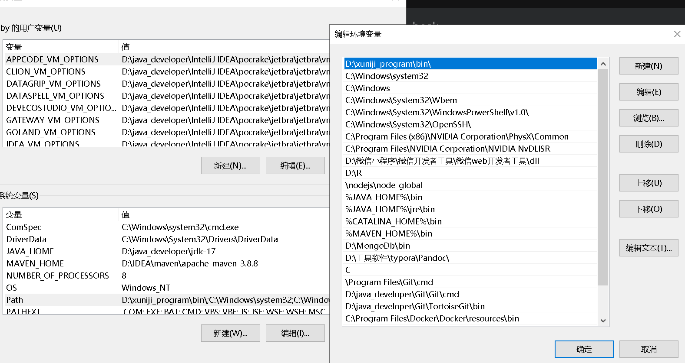

<span style="font-weight:bold; font-size:1.2em;">这里Windows中的 用户变量，系统变量，环境变量 这三者是有什么区别吗，这里好像在环境变量里面可以使用 %JAVA_HOME% 来引用系统变量的值。 </span>


这张截图非常清晰，它完美展示了 Windows 环境变量配置的核心界面。你的观察非常敏锐，直接抓住了两个关键点：**<span style="color:#CC0000;">变量的分类</span>**（用户 vs 系统）和**<span style="color:#CC0000;">变量的引用</span>**（%JAVA_HOME%）。

这也是嵌入式开发和软件配置中必须要搞懂的基础。下面我为你详细拆解。

------


### 一、 这里的“三者”到底是什么关系？

首先纠正一个小概念：**<span style="color:#CC0000;">它们不是并列的三者关系，而是“总分”关系</span>。**

1. **环境变量 (Environment Variables)**：这是一个**统称**。<span style="color:#CC0000;">不管是上面的框还是下面的框，它们统统都叫“环境变量”。</span>
2. **用户变量 (User Variables)**：上面的框。
3. **系统变量 (System Variables)**：下面的框。

**它们的区别可以用“公司的公告栏”和“你的私人便签”来做比喻：**

| **特性**     | **系统变量 (System Variables)**                              | **用户变量 (User Variables)**                                |
| ------------ | ------------------------------------------------------------ | ------------------------------------------------------------ |
| **比喻**     | **公司的公告栏**                                             | **你的私人便签**                                             |
| **谁能看见** | **这台电脑上的所有用户**。不管你是用 Administrator 登录，还是用 Guest 登录，<span style="color:#CC0000;">都能读到这里面的配置。</span> | **只有当前登录的这个用户**（比如截图左上角的 `by`）能看见。如果你切换个账号登录，这部分内容就变了。 |
| **谁能修改** | 只有拥有**<span style="color:#CC0000;">管理员权限</span>**的人才能修改（需要“公章”）。 | 当前用户自己就能随意修改（自己的地盘自己做主）。             |
| **生效时机** | 开机加载系统服务时就生效了。                                 | 只有当你输入密码登录进入桌面后才生效。                       |
| **典型用途** | 存放<span style="color:#CC0000;">系统级的配置</span>（如 Windows 路径、驱动路径、全员通用的 Java/GCC 环境）。 | 存放你<span style="color:#CC0000;">个人的个性化配置（比如你私人的 VS Code 设置，或者只有你用的工具</span>）。 |

**对于 PATH 变量的特殊处理（重点）：**

- 对于普通变量（如 `JAVA_HOME`），如果系统变量和用户变量重名，**用户变量会覆盖系统变量**（就近原则）。
- **但是对于 `PATH` 变量，Windows 采取的是“拼接”策略！**
  - 最终生效的 PATH = **系统变量里的 PATH** + **用户变量里的 PATH**。
  - 所以你在写 PATH 时，不用担心覆盖掉系统的设置，放心在用户变量里加就行。

------


### 二、 关于 `%JAVA_HOME%` 的引用机制

你截图右边那个编辑框里写的 `%JAVA_HOME%\bin`，你的理解完全正确！

在 Windows 中，使用 **`%变量名%`** 的格式，就是**引用（调用）\**另一个变量的值。这叫做\**“变量展开”**。


#### 为什么要这么做？为了“解耦合”

看看你截图左下角的 **系统变量** 区域：

- **变量名**：`JAVA_HOME`
- **变量值**：`D:\java_developer\jdk-17`

再看截图右边的 **PATH 编辑框**：

- 有一行写的是：`%JAVA_HOME%\bin`

**计算机在实际执行时，会做这么一个替换操作：**

1. 发现 `%JAVA_HOME%`。
2. 去查表，找到它的值是 `D:\java_developer\jdk-17`。
3. 把它和后面的 `\bin` 拼起来。
4. 最终路径变成了：`D:\java_developer\jdk-17\bin`。


#### 这么写的好处是什么？（面试/实战技巧）

假设过两天 Java 出了 JDK 21，你想升级，或者你想从 JDK 17 降级回 JDK 8。

- **如果不引用**：你需要去 PATH 列表里找到 `D:\java_developer\jdk-17\bin` 这一行，把它改掉。如果很多软件都用了这个路径，你得改好几个地方。
- **如果使用了引用**：你**不需要动 PATH**！你只需要去主界面（左下角）把 `JAVA_HOME` 的值改一下即可。PATH 会自动跟着变。

**这就叫“一处修改，处处生效”。**

------


### 三、 结合你的截图看细节

我们可以从你的截图中读出很多信息，这对你学习很有帮助：

1. 你的 JDK 装在哪？

   看左下角，你的 JDK 装在 D:\java_developer\jdk-17。

2. Maven 也是同样的道理

   看左下角，你有 MAVEN_HOME。

   看右边列表，肯定有一行是 %MAVEN_HOME%\bin（虽然被挡住了一半，但我看到了 %CATALINA_HOME%\bin，这是 Tomcat 的，原理一样）。

3. 用户变量里的 JetBrains 工具

   看左上角，有一堆 IDEA_VM_OPTIONS 等等。这些放在“用户变量”里是非常合理的。因为这是你个人使用的开发工具配置，没必要让这台电脑的其他用户也加载这些配置。


### 总结

1. **用户变量**是私人的，**系统变量**是公用的。一般建议把开发工具（Java, GCC, Python）配在**系统变量**里，把个性化工具配在**用户变量**里。但如果你只有这一个账号，配在哪里其实效果差不多。
2. **`%NAME%`** 是 Windows 特有的引用语法（Linux 是 `$NAME`）。使用它主要是为了**方便日后维护和切换版本**。


# 补充提问2（Linux命令提示符）

## 提问1

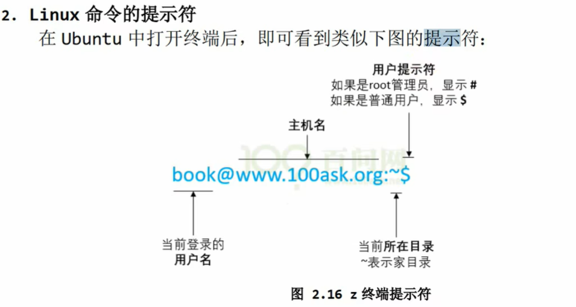

<span style="font-weight:bold; font-size:1.2em;">这里Linux的命令提示符这里我有点看不太懂，你能够给我详细解释下吗，最好能够举些例子来让我彻底弄明白。</span>


这张图片展示的是 Linux 终端最常见、最基础的**“身份铭牌”**，学名叫做**命令提示符 (Command Prompt)**。

不要被这一长串字符吓到，它其实就是**<span style="color:#CC0000;">一行实时更新的状态栏</span>**。它的作用是时刻回答你三个灵魂拷问：

1. **<span style="color:#CC0000;">我是谁？</span>** (哪个用户)
2. **<span style="color:#CC0000;">我在哪台电脑上？</span>** (主机名)
3. **<span style="color:#CC0000;">我现在在哪个文件夹里？</span>** (当前路径)

我来把它拆解成**积木**，带你从左到右看一遍，配合例子让你彻底明白。

------


### 一、 拆解积木：`book@www.100ask.org:~$`

我们把它切成 4 个部分来看：

#### 1. `book` —— **我是谁？ (用户名)**

- **含义**：表示你当前是用 `book` 这个账号登录的。
- **为什么重要**：<span style="color:#CC0000;">Linux 是多用户系统</span>。如果你是 `book`，你可能删不掉系统文件；如果你是 `root`，你就能毁天灭地。
- **例子**：如果你创建了一个新用户叫 `tony`，登录后这里就会变成 `tony@...`。


#### 2. `@` —— **分隔符**

- **含义**：就是<span style="color:#CC0000;">英文单词 "at"（在...）。</span>
- **连起来读**：用户<span style="color:#FF0000;"> `book` **在** 后面那台机器上</span>。


#### 3. `www.100ask.org` —— **我在哪台电脑？ (主机名)**

- **含义**：<span style="color:#CC0000;">这台电脑的名字。</span>
- **为什么重要**：**<span style="color:#CC0000;">在嵌入式开发中极其重要！</span>**
  - 你在做开发时，桌面上通常有两个终端窗口。
  - 一个显示 `book@ubuntu`：这是你的 **PC 电脑**。
  - 一个显示 `root@imx6ull`：这是你的 **开发板**。
  - <span style="color:#CC0000;">如果不看主机名，你很容易**在电脑上敲了开发板的命令**，或者**在开发板上找电脑的文件**，然后抓狂“为什么找不到文件”</span>。


#### 4. `:` —— **分隔符**

- **含义**：<span style="color:#CC0000;">把机器名和后面的路径分开。</span>


#### 5. `~` —— **<span style="color:#CC0000;">我在哪个文件夹？ (当前路径 - 重点！)</span>**

- **含义**：这是一个<span style="color:#CC0000;">简写符号</span>，代表**“<span style="color:#CC0000;">当前用户的家目录</span>”**。
- **详细解释**：
  - 对于用户 `book` 来说，`~` 就等于 `/home/book`。
  - 对于用户 `root` 来说，`~` 就等于 `/root`。
- **动态变化**：
  - 当你输入 `cd /`（去根目录），这个波浪号 `~` 就会变成 `/`。
  - 当你输入 `cd /etc`，它就会变成 `/etc`。
  - <span style="color:#CC0000;">**它时刻告诉你：你现在身处何方。**</span>


#### 6. `$` —— **我有多少权力？ (<span style="color:#CC0000;">身份标识 - 核心！</span>)**

这是最后的一个字符，也是最重要的安全警示灯。

- **`$` (美元符号)**：代表你是<span style="color:#CC0000;">**普通用户**（平民）</span>。你的权力受限，比较安全，删不掉核心系统文件。
- **`#` (井号)**：代表你是<span style="color:#CC0000;"> **Root 用户**（超级管理员/皇帝）</span>。你<span style="color:#CC0000;">可以做任何事，包括把系统删光。</span>

------


### 二、 举个“动态”例子演示

想象你在操作终端，看着提示符怎么变：


#### 场景 1：刚登录进来

提示符：`book@ubuntu:~$`

- **解读**：我是平民 `book`，在名为 `ubuntu` 的电脑上，我在我的家里 (`/home/book`)。


#### 场景 2：切换目录

你输入命令：cd /usr/bin

提示符变成了：book@ubuntu:/usr/bin$

- **解读**：前面的都没变，但我现在的**位置**变了，我在 `/usr/bin` 目录下。


#### 场景 3：切换成超级管理员

你输入命令：sudo su (切换到 root)

提示符变成了：root@ubuntu:/home/book#

- **解读**：
  - 用户名变成了 `root`。
  - 最后的符号变成了 **`#`** (警示：现在是高风险模式)。
  - 路径还是 `/home/book` (因为我只是原地变身，没换位置)。


#### 场景 4：如果你在嵌入式开发板上

提示符可能是：`root@myboard:~#`

- **解读**：<span style="color:#CC0000;">我是管理员 `root`，我在一台叫 `myboard` 的板子上，我在板子的家目录里。</span>

------


### 三、 总结

那个图片里的 `book@www.100ask.org:~$` 翻译成人话就是：

> **“你好，我是普通用户 book，我现在正在名为 www.100ask.org 的这台电脑上，我当前的位置是我的家目录。”**

给嵌入式新手的建议：

以后敲命令前，先瞄一眼提示符。

1. <span style="color:#CC0000;">看 **`@` 后面**</span>：确认是在电脑上敲，还是在开发板上敲。
2. <span style="color:#CC0000;">看 **`:` 后面**</span>：确认你在正确的文件夹里（是不是在编译目录下）。
3. <span style="color:#CC0000;">看 **最后的符号**</span>：确认你是不是不小心开了 Root 权限（`#`），小心误操作。


## 提问 1 - （1）

<span style="font-weight:bold; font-size:1.2em;">如何在linux中修改用户名和主机名呢，以及如何增添用户呢，以及如何切换用户，不同的用户空间是有什么区别吗，我不是太懂，你能够给我详细解释下吗？</span>


这是一个非常系统性的操作问题。<span style="color:#CC0000;">在 Linux（尤其是嵌入式开发）中，理解多用户机制非常重要，因为我们经常需要在“普通用户”编写代码和“Root 用户”配置系统之间切换。</span>

我把你的问题拆解为 **理论篇（区别）** 和 **实战篇（操作）** 两部分来讲解。

------


### 第一部分：理论篇 —— 不同的用户空间有什么区别？

你可以把 Linux 系统想象成一栋 **“大公寓楼”**。

1. **公共区域（系统空间）**：
   - 比如 `/bin`, `/usr/bin`, `/etc`。
   - 这就好比公寓的**大厅、走廊、配电房**。
   - <span style="color:#CC0000;">所有用户都可以“看”（读取），但只有管理员（Root）可以“拆改”（写入/删除）。</span>
2. **<span style="color:#CC0000;">用户空间（私人房间）</span>**：
   - 这就是<span style="color:#CC0000;">每个用户的 **家目录</span> (`/home/username`)**。
   - **区别一：文件隔离**。
     - 用户 `zhangsan` 的房间在 `/home/zhangsan`。
     - 用户 `lisi` 的房间在 `/home/lisi`。
     - 张三不能进李四的房间乱动东西（除非李四特意开了门），这保证了安全。
   - **区别二：环境配置隔离（重点）**。
     - 还记得我们讲的 **环境变量（记事本）** 吗？
     - 每个用户都有自己独立的配置文件（`.bashrc`）。
     - 张三可以在自己的 PATH 里加一个 JDK 17，李四可以在自己的 PATH 里加 JDK 8。**互不干扰**。
   - **区别三：权限不同**。
     - 普通用户（`$`）只能拆自己房间的墙。
     - Root 用户（`#`）可以拆整栋楼的墙。

------


### 第二部分：实战篇 —— 这里的操作全是干货

#### 1. 如何增添用户？ (`adduser`)

在 Ubuntu 中，推荐使用 `adduser` 命令，它比 `useradd` 更友好（会自动帮你建家目录、问你密码）。

**操作步骤**：

Bash

```bash
# 必须加 sudo，因为这是管理员才能做的事
sudo adduser newuser
```

- 系统会提示你输入新用户的密码。
- 一路回车即可。
- 结果：系统会在 `/home` 下新建一个 `/home/newuser` 文件夹。


#### 2. 如何切换用户？ (`su`)

命令是 `su` (Switch User)。

**操作步骤**：

Bash

```bash
# 1. 从当前用户切换到 newuser
su - newuser

# 2. 从普通用户切换到 Root（超级管理员）
sudo su -
```

⚠️ 关键细节（面试考点）：

请<span style="color:#CC0000;">注意上面的命令里有一个 小横杠 -。</span>

- **`su newuser` (不带横杠)**：
  - 只是切换了身份，但<span style="color:#FF0000;">**不切换环境变量**。</span>
  - 你虽然变成了 newuser，但你手里的“记事本”还是上一个人的，你还站在上一个人的目录里。这容易出 bug。
- **`su - newuser` (带横杠)**：
  - <span style="color:#FF0000;">**彻底切换**。</span>
  - 切换身份 + **重新加载那个用户的环境变量** + **跳到那个用户的家目录**。
  - **结论：<span style="color:#FF0000;">永远习惯带上 `-`。</span>**


#### 3. 如何修改主机名？ (`hostnamectl`)

主机名就是提示符里 `@` 后面的那一串（比如 `www.100ask.org` 或 `ubuntu`）。

**操作步骤**：

Bash

```bash
# 1. 查看当前主机名
hostname

# 2. 修改主机名 (例如改成 my-server)
sudo hostnamectl set-hostname my-server
```

- **生效时间**：修改后，你需要关闭终端重新打开，或者重新登录，提示符上的名字才会变。


#### 4. 如何修改用户名？ (`usermod`) —— **高风险操作**

**警告**：你**不能**修改当前正在登录的用户的名字。比如你正用 `book` 登录，你就不能改 `book` 的名字。

**正确做法**：

1. 退出当前用户，用另一个管理员账号（或 Root）登录。
2. 执行以下命令：

Bash

```bash
# 假设要把用户 oldname 改名为 newname

# -l: 修改登录名 (Login name)
# -d: 修改家目录路径 (Directory)
# -m: 把旧家目录里的文件移动到新家目录 (Move)
sudo usermod -l newname -d /home/newname -m oldname

# 通常还要改一下所在的组名（可选，但推荐）
sudo groupmod -n newname oldname
```

------


### 三、 总结一张表

| **需求**     | **命令**                             | **核心注意点**                                               |
| ------------ | ------------------------------------ | ------------------------------------------------------------ |
| **加新用户** | `sudo adduser 名字`                  | 会自动创建家目录 `/home/名字`。                              |
| **切换用户** | `su - 名字`                          | **千万别忘了那个横杠 `-`**，否则环境变量不生效。             |
| **改主机名** | `sudo hostnamectl set-hostname 新名` | 改完重开终端才显示。                                         |
| **改用户名** | `sudo usermod ...`                   | **很麻烦且有风险**。如果是自己玩，建议直接删了旧用户新建一个，别去改名，容易把权限搞乱。 |

给嵌入式新手的建议：

<span style="color:#FF0000;">在开发板上，通常出厂就只有一个 root 用户。但在你的 PC（Ubuntu 虚拟机）上，建议还是用普通用户（如 book 或 master）进行开发，尽量少用 root，防止手滑输错命令（比如 rm -rf /）把系统删没了。</span>


## 提问 1 - （1）- （1）（不看这个了）

<span style="font-weight:bold; font-size:1.1em;">这里我使用了su newuser之后会怎么样呢，好像在master用户下也可以打开这个newuser文件夹，显示文件夹为空，一开始的时候是显示没有权限，我现在想要回到最初的时候打开显示没有权限该怎么做呢。</span>

这是一个非常典型的 Linux 权限困惑！你观察到的现象可能源于两个原因：要么是你**还没退出** `newuser` 的身份，要么是**文件夹的权限设置**比较宽松。

想要回到“Permission Denied”（无权限访问）的状态，我们需要用一把“锁”把这个文件夹锁起来。

我来分两步帮你解决这个问题，顺便教你一个核心命令：**`chmod`**。

------


### 第一步：确认你现在的身份（排查误会）

首先，我们要确认你是不是**真的**在 `master` 用户下。

因为当你执行了 `su newuser` 后，你的终端身份就已经变成 `newuser` 了。作为房子的主人，`newuser` 当然可以看到自己房间（`/home/newuser`）里是空的。

**请做以下检查：**

1. 在终端输入：

   Bash

   ```bash
   whoami
   ```

2. **结果分析**：

   - 如果显示 **`newuser`**：说明你还没“灵魂归位”。你当然能打开文件夹。
     - **解决方法**：输入 **`exit`** 并回车。这就退出了 `newuser`，变回了 `master`。此时你再去尝试访问 `/home/newuser`，看看是不是变回“无权限”了。
   - 如果显示 **`master`**：说明你确实是用 `master` 的身份在操作，但居然能打开别人的房间。这说明**房间没锁好**（权限太宽松）。请进入第二步。

------


### 第二步：给房间上锁（修改权限）

如果你已经是 `master` 了，却还能打开 `/home/newuser`，说明这个文件夹允许“其他人（Others）”参观。

我们要使用的命令是 **`chmod`** (Change Mode)，它是 Linux 的权限管理神器。


#### 1. 查看当前权限（看看锁坏没坏）

在终端输入：

Bash

```bash
ls -ld /home/newuser
```

你可能会看到类似这样的输出：

drwxr-xr-x 2 newuser newuser ...

- 注意最后那三个字符 **`r-x`**。
- **`r` (Read)**：允许读取（看里面有什么文件）。
- **`x` (Execute)**：允许执行（也就是允许进入这个目录）。
- 这说明：**所有陌生人（Others）都可以进入并查看这个文件夹。**


#### 2. 修改权限（把门锁死）

我们要把这个文件夹变成“闲人免进”，只允许主人（newuser）自己访问。

**执行这条命令：**

Bash

```bash
# sudo: 使用管理员权限（因为master不能修改newuser的房门，必须请大管家root来）
# chmod: 修改权限
# 700: 这是密码
# /home/newuser: 目标房间
sudo chmod 700 /home/newuser
```

或者使用更好理解的符号模式：

Bash

```bash
# o: Others (其他人)
# -: 减去/移除
# rx: Read和Execute权限
sudo chmod o-rx /home/newuser
```


#### 3. 验证结果

现在，你（作为 master）再尝试去 `cd` 或者 `ls` 那个目录：

Bash

```bash
ls /home/newuser
```

结果：系统应该会冷酷地拒绝你：

ls: cannot open directory '/home/newuser': Permission denied

恭喜你！你成功回到了最初的状态。

------


### 扩展知识：那个神奇的数字 "700" 是什么意思？

在嵌入式开发面试中，**`chmod`** 是必考题。为了让你彻底弄懂，我给你拆解一下 `700`。

Linux 的权限分为三组人：

1. **拥有者 (User)**：房主。
2. **同组人 (Group)**：家人。
3. **其他人 (Others)**：陌生人（比如 master 之于 newuser）。

权限用数字表示：

- **4** = **r** (Read, 读)
- **2** = **w** (Write, 写)
- **1** = **x** (Execute, 进)

**700 的含义是：**

- **第一位 7 (User)** = 4+2+1 = **rwx** (房主：可读、可写、可进) -> **拥有最高权限**。
- **第二位 0 (Group)** = **---** (家人：无任何权限)。
- **第三位 0 (Others)** = **---** (陌生人：无任何权限)。

所以，`chmod 700` 的意思就是：**“除了房主自己，天王老子来了也不让进。”**

总结：

如果想看有没有权限，先用 ls -l 看；如果想改回“无权限”，用 sudo chmod 700 目标目录 即可！


## 提问 1 - （2）

<span style="font-weight:bold; font-size:1.2em;">Windows系统也是一个多用户系统吗，那么我如何在Windows系统中增添用户，以及如何切换用户，不同的用户空间又有什么区别吗，我不是太懂，你能够给我详细解释下吗？</span> 


**是的，Windows 绝对是一个彻头彻尾的“多用户操作系统”。**

虽然我们平时用个人电脑（PC）时，往往只有一个账号（你自己），感觉像是单用户系统，但实际上 Windows 的底层架构和 Linux 一样，都是为多用户设计的。

还记得我在 Linux 里用的**“公寓楼”**比喻吗？在 Windows 里完全适用，只是“装修风格”和“门牌号”不一样。

我来分三步为你详细解释 Windows 的多用户机制。

------


### 第一部分：如何在 Windows 中增添用户？

在 Windows 里加用户，有两种方法：一种是“傻瓜式”的点鼠标，一种是“硬核”的敲命令（既然你是嵌入式开发预备役，我强推你掌握命令行的做法）。


#### 方法 1：图形界面（适合普通人）

- **路径**：`设置` -> `账户` -> `家庭和其他用户` -> `将其他人添加到这台电脑`。
- **坑点**：Windows 会疯狂诱导你输入微软邮箱（Microsoft Account）。如果你只想建一个像 Linux 那样的本地离线账号，你需要点击“我没有这个人的登录信息” -> “添加一个没有 Microsoft 账户的用户”。


#### 方法 2：命令行（CMD）—— **推荐！简单粗暴**

这就相当于 Linux 的 `adduser`。

1. **以管理员身份运行 CMD**（搜索 cmd，右键“以管理员身份运行”）。

2. **输入命令**：

   DOS

   ```
   REM 语法：net user 用户名 密码 /add
   net user zhangsan 123456 /add
   ```

3. **结果**：系统瞬间就在后台创建好了用户，并且在 `C:\Users` 下准备好了他的房间。

*(注：如果你想把张三提拔成管理员，还需要执行：`net localgroup administrators zhangsan /add`)*

------


### 第二部分：如何切换用户？

在 Linux 里是用 `su` 命令切换，在 Windows 里我们通常切换的是**“图形界面会话”**。


#### 方法 1：开始菜单

点击开始菜单 -> 点击你的头像 -> 在弹出的列表里选择 `zhangsan`。


#### 方法 2：快捷键（最常用）

按下 **`Win + L`**。

- 这会立刻**锁定**当前屏幕。
- 在锁屏界面左下角，你可以选择是用你自己登录，还是用 `zhangsan` 登录。


#### 扩展：Windows 有没有类似 `su` 的命令？

有，叫 runas。

比如你在 CMD 里，想用 zhangsan 的身份运行一个程序：

DOS

```bash
runas /user:zhangsan cmd
```

但这不像 Linux 的 `su -` 那么常用，因为 Windows 的核心交互都在图形界面上。

------


### 第三部分：不同的用户空间有什么区别？（核心对比）

这是你最关心的部分。当张三登录进来后，他和你的空间区别在哪？


#### 1. 文件的隔离（门牌号不同）

- **Linux**: `/home/master` vs `/home/newuser`
- **Windows**: **`C:\Users\master`** vs **`C:\Users\zhangsan`**

**区别**：

- 张三登录后，他的**桌面、文档、下载、图片**文件夹，实际指向的是 `C:\Users\zhangsan\Desktop` 等。
- **权限锁**：默认情况下，张三点不开 `C:\Users\master` 这个文件夹，系统会提示“拒绝访问”（这和 Linux 的 `chmod 700` 是一样的道理）。


#### 2. 配置的隔离（注册表 HKCU）

这是 Windows 特有的。还记得我说“注册表是户口本”吗？

- **Linux**：个性化配置存在 **`.bashrc`** 等隐藏文件里。
- **Windows**：个性化配置存在 **注册表** 的 `HKEY_CURRENT_USER` (简称 HKCU) 分支里。

**例子**：

- 你把鼠标速度调得很快，壁纸设为风景。这记录在你的 HKCU 里。
- 张三把鼠标速度调得很慢，壁纸设为动漫。这记录在张三的 HKCU 里。
- **你们互不干扰**。


#### 3. 环境变量的隔离

这就回到了我们之前那个截图的问题。

- **用户变量**：你设置了 `JAVA_HOME=JDK17`，张三登录进来是看不到这个变量的。
- **系统变量**：你设置了 `Path` 里包含 `C:\MyTools`，张三登录进来也能用这个工具。


#### 4. 权限的隔离（UAC）

- **Linux**：`$` (普通) vs `#` (Root)。
- **Windows**：**标准用户** vs **管理员 (Administrator)**。
  - **标准用户**：安装软件时会弹出“请输入管理员密码”，删不掉 `C:\Windows` 里的文件。
  - **管理员**：虽然平时也是普通权限，但当需要修改系统时，会弹出一个**确认框（UAC）**“你允许此应用修改设备吗？”，点“是”就相当于 Linux 的 `sudo`。

------


### 四、 总结：Linux vs Windows 多用户

| **特性**       | **Linux**               | **Windows**                                  |
| -------------- | ----------------------- | -------------------------------------------- |
| **家目录**     | `/home/用户名`          | `C:\Users\用户名`                            |
| **个性化配置** | 隐藏文件 (如 `.bashrc`) | 注册表 (`HKEY_CURRENT_USER`)                 |
| **增加用户**   | `sudo adduser 名字`     | `net user 名字 密码 /add`                    |
| **最高权限**   | **Root** (无法无天)     | **System / Administrator** (平时受 UAC 限制) |
| **切换用户**   | `su -` (常用于命令行)   | `Win + L` (常用于图形界面)                   |

给嵌入式开发者的建议：

在 Windows 上开发时，我们通常只用一个管理员账号就够了，不需要频繁切换用户。

<span style="color:#FF0000;">但在 Linux 上开发时，理解多用户和权限（chmod/chown）是基本功，因为在开发板上运行程序时，经常会遇到“权限不足”的报错。</span>


# 补充提问3（Linux 命令提示符）

## 提问1

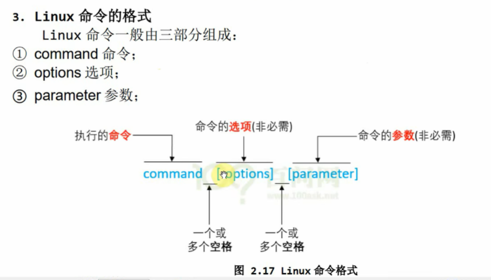

<span style="font-weight:bold; font-size:1.1em;">这个Linux的命令格式这里我有点看不太懂，你能够给我详细解释下吗，最好举个例子来让我彻底弄明白，视频中好像还有提到 [ ] 和 < > 的区别。另外你有什么补充的也可以补充下。</span>


这张图展示的是 **Linux 命令行（Command Line）的“语法结构”**。这就像学习英语语法一样（主语+谓语+宾语），Linux 命令也有它固定的说话方式。

为了让你彻底弄懂，我们用一个生活中的例子——**“切水果”**来类比。

------


### 一、 核心三要素详解

公式：**`command [options] [parameter]`**


#### 1. Command（命令）—— <span style="color:#FF0000;">动词：你要干什么？</span>

这是整行指令的核心，<span style="color:#FF0000;">告诉计算机执行哪个程序。</span>

- **类比**：**`切`** (Cut)。
- **Linux 例子**：
  - `ls` (<span style="color:#FF0000;">List，列出</span>)
  - `rm` (<span style="color:#FF0000;">Remove，删除</span>)
  - `gcc` (<span style="color:#FF0000;">编译</span>)


#### 2. Options（选项）—— <span style="color:#FF0000;">副词/形容词：你要怎么干？</span>

用来<span style="color:#CC0000;">调整命令的行为</span>。<span style="color:#FF0000;">通常以 **`-` (短选项)** 或 **`--` (长选项)** 开头。</span>

- **类比**：**`-快速地`** 或 **`-切成块`**。
  - 如果不加选项，可能默认是“切成片”。加了选项，就变成了“切成块”。
- **Linux 例子**：
  - `ls` (默认列出文件名)
  - `ls -l` (<span style="color:#FF0000;">加上 `-l` 选项，表示 **Long format**，列出文件的详细信息，如大小、权限</span>)。
  - `rm -f` (<span style="color:#FF0000;">加上 `-f` 选项，表示 **Force**，强制删除，不提示确认</span>)。


#### 3. Parameter（参数）—— <span style="color:#FF0000;">宾语：你要对谁干？</span>

这是<span style="color:#FF0000;">命令操作的对象（通常是文件名、目录名或用户名）</span>。

- **类比**：**`西瓜`**。
- **Linux 例子**：
  - `ls /home` (这里的 `/home` 就是参数，表示<span style="color:#CC0000;">我要看 `/home` 目录</span>)。
  - `rm test.c` (这里的 `test.c` 就是参数，表示<span style="color:#CC0000;">我要删这个文件</span>)。

------


### 二、 组合起来看效果

让我们把“切水果”和 `ls` 命令放在一起对比：

| **场景**  | **命令 (Command)** | **选项 (Options)** | **参数 (Parameter)** | **完整指令**      | **含义**                                                     |
| --------- | ------------------ | ------------------ | -------------------- | ----------------- | ------------------------------------------------------------ |
| **生活**  | 切                 | (无)               | 西瓜                 | `切 西瓜`         | 把西瓜切了（按默认方式切）。                                 |
| **生活**  | 切                 | -切成块            | 西瓜                 | `切 -切成块 西瓜` | 把西瓜切成小方块。                                           |
| **Linux** | `ls`               | (无)               | (无)                 | `ls`              | 列出**当前**目录的文件。                                     |
| **Linux** | `ls`               | `-l`               | (无)                 | `ls -l`           | <span style="color:#CC0000;">以**详细列表**形式列出**当前**目录文件。</span> |
| **Linux** | `ls`               | `-l`               | `/bin`               | `ls -l /bin`      | <span style="color:#CC0000;">以**详细列表**形式列出 **/bin** 目录的文件。</span> |

**注意<span style="color:#FF0000;">图中的空格</span>**：<span style="color:#FF0000;">命令、选项、参数之间，**必须**用空格隔开！</span>

------


### 三、 关于 `[ ]` 和 `< >` 的区别（面试/文档常识）

你在视频中听到的这个，是 **Linux 命令帮助文档（Man Page）** 中的<span style="color:#CC0000;">标准符号约定</span>，<span style="color:#CC0000;">用来告诉你哪些东西是必须写的，哪些是可写可不写的。</span>


#### 1. `[ ]` 方括号：表示“可选” (Optional)

- **含义**：这个部分<span style="color:#FF0000;">你可以写，也可以不写。如果不写，程序会使用**默认值**。</span>
- **例子**：`ls [目录名]`
  - 你可以输入 `ls`（不加参数），<span style="color:#CC0000;">默认列出“当前目录”</span>。
  - 也可以输入 `ls /home`（加参数），<span style="color:#CC0000;">列出 home 目录。</span>
  - **图中的 `[options]` 和 `[parameter]` 都在方括号里，<span style="color:#FF0000;">说明 `ls` 命令既可以不加选项，也可以不加参数，照样能运行。</span>**


#### 2. `< >` 尖括号：表示“必选” (Required)

- **含义**：这个部分**<span style="color:#CC0000;">必须</span>**写，<span style="color:#CC0000;">如果不写，命令会报错，因为它不知道该对谁操作。</span>
- **例子**：`mv <源文件> <目标位置>` (移动文件)
  - 如果你只输入 `mv`，系统会骂你：“你要我移动谁？移到哪去？”
  - 你必须输入 `mv a.txt b.txt` 才能执行。

------


### 四、 补充扩展（嵌入式面试加分项）

针对嵌入式面试，你需要对命令格式有更深的理解：


#### 1. 选项的“合体”写法

<span style="color:#CC0000;">Linux 的短选项</span>（一个<span style="color:#CC0000;">减号 `-` 后面跟一个字母</span>）通常可以合并。

- `ls -l -a` (<span style="color:#CC0000;">列出详细信息 + 显示隐藏文件</span>)
- **等价于**：**`ls -la`**
- <span style="color:#CC0000;">这在嵌入式调试时非常常用，比如 `ps -aux`，`tar -xvf`。</span>


#### 2. 短选项 vs 长选项

- **短选项**：`-h`。为了偷懒少打字，适合平时用。
- **长选项**：`--help`。为了语义清晰，适合写在脚本里。
- *面试点*：有些嵌入式系统（如基于 BusyBox 裁剪的极简系统）可能**只支持短选项**，不支持长选项，这是为了节省空间。


#### 3. 参数的位置

虽然标准格式是 `命令 选项 参数`，但很多 Linux 命令比较智能，允许你乱序（但不建议）。

- `ls -l /home` (标准)
- `ls /home -l` (大部分时候也能跑，但不规范)
- **特例**：有些命令严格要求参数顺序，比如 `gcc` 编译时，`-o` 后面必须紧跟输出的文件名 (`gcc main.c -o main`)，这里的 `main` 属于 `-o` 选项的参数值，不能乱放。


#### 4. 那个特殊的 `--`

<span style="color:#CC0000;">如果你的文件名居然叫 `-a` (开头是横杠)，你输入 `rm -a`，系统会以为 `-a` 是一个选项，而不是文件名，然后报错。</span>

- <span style="color:#CC0000;">**解决方法**：使用 `--` 告诉命令“选项到此为止”。</span>
- <span style="color:#CC0000;">`rm -- -a` (系统就明白了，后面的 `-a` 是参数，不是选项)。</span>

总结一下：

看到 command [arg]，意思是 command 后面可以跟东西，也可以不跟。

看到 command <arg>，意思是 command 后面必须跟东西，否则罢工。


## 提问2

<span style="font-weight:bold; font-size:1.1em;"><span style="color:#CC0000;">这在嵌入式调试时非常常用，比如 `ps -aux`，`tar -xvf`。</span> 这里的选项是一个混合参数吗，即a、u、x，x、v、f 这些参数都是干什么用的呢，既然前面的ps，tar可以看成一个应用程序的话，那么后面的这些参数是不是就可以看成是函数参数，这个ps应用程序接受了3个参数，tar应用程序接受了3个参数。还有 -- 应该与 - 是等价的吧，即 ps -aux 应该与 ps --aux 等价，tar - xvf 应该与 tar --xvf 等价，既然是这样的话，那么为什么还要有 --呢。我不是太懂，你能够给我详细解释下吗，最好能够举个例子来让我彻底弄明白。 </span>


这是一个非常棒的思考角度！试图用“函数传参”和“C语言代码”的视角去理解命令行，说明你已经具备了嵌入式程序员的思维方式。

不过，你的推测中有一半是完全正确的，另一半（关于 `--` 和 `-` 的区别，以及参数传递的细节）存在一个**巨大的误区**。如果不纠正，这在面试中可能会成为扣分项。

我来通过 **C 语言底层实现** 和 **设计逻辑** 两个方面，帮你彻底理清这三个问题。

------


### 一、 `ps -aux` 和 `tar -xvf` 是什么意思？

是的，这里的选项是**“<span style="color:#CC0000;">短选项的混合写法</span>” (Combined Short Options)**。

在 Linux 中：

- **`ps -aux`** 等价于 **`ps -a -u -x`**。
- **`tar -xvf`** 等价于 **`tar -x -v -f`**。

**参数详解（嵌入式常用）：**

1. **`ps -aux`** (查看进程)
   - **`a`**: 显示所有用户的进程（不仅仅是你自己的）。
   - **`u`**: 以用户为主的格式显示（显示拥有者、CPU 占用率、内存占用率等详细信息）。
   - **`x`**: 显示没有控制终端的进程（很多后台服务、守护进程 daemon 都是没有终端的，这在嵌入式中非常重要）。
2. **`tar -xvf`** (解压文件)
   - **`x` (extract)**: 提取/解压。
   - **`v` (verbose)**: 话痨模式。解压过程中把文件名一个一个打印在屏幕上（让你知道它在干活，没卡死）。
   - **`f` (file)**: 指定文件。**注意：** 这个 `f` 后面必须紧跟文件名。所以通常写在最后。

------


### 二、 C 语言代码层面：它是怎么“传参”的？

你问：“<span style="color:#CC0000;">`ps` 应用程序是不是接受了 3 个参数？</span>”

**答案是：<span style="color:#CC0000;">在 `main` 函数看来，它只接受了 1 个参数！</span>**

让我们<span style="color:#CC0000;">回到 C 语言的 `main` 函数原型：</span>

C

```c
int main(int argc, char *argv[])
```

<span style="color:#CC0000;">当你输入 **`ps -aux`** 时，Shell 会把它切割并通过 `exec` 系统调用传递给 `ps` 程序。内存里的情况是这样的：</span>

- **`argc` (参数个数)**：2
- **`argv[0]`**: `"ps"` (程序名)
- **`argv[1]`**: **`"-aux"`** (注意：这是一个完整的字符串！)

<span style="color:#CC0000;">重点来了：谁把 -aux 拆成 a, u, x 的？</span>

是 ps 程序内部的代码。

<span style="color:#CC0000;">在 Linux C 编程中，我们通常使用一个标准库函数叫 getopt() 来解析这些参数。</span>

**模拟 `ps` 内部的代码逻辑（伪代码）：**

C

```c
// 假设 argv[1] 是 "-aux"
while ((opt = getopt(argc, argv, "aux")) != -1) {
    switch (opt) {
        case 'a':
            show_all_processes = 1; // 开启显示所有进程开关
            break;
        case 'u':
            show_details = 1;       // 开启详细模式开关
            break;
        case 'x':
            show_no_terminal = 1;   // 开启后台进程显示开关
            break;
    }
}
```

所以，`ps` 收到的是**一坨**参数 `"-aux"`，然后自己在内部挨个字符去解析，发现 `a` 就打开开关 A，发现 `x` 就打开开关 X。

------


### 三、 核心误区：`-` 和 `--` 是等价的吗？

<span style="color:#CC0000;">**绝对不等价！这是面试中的“雷区”。**</span>

- **`-` (单横杠)**：后面跟的是 **<span style="color:#CC0000;">“短选项”</span> (Short Options)**。
  - 特点：<span style="color:#CC0000;">**单字母**。</span>
  - 特权：**可以合并**。
  - 例子：`-a -b -c` 可以写成 `-abc`。
- **`--` (双横杠)**：后面跟的是 **<span style="color:#CC0000;">“长选项”</span> (Long Options)**。
  - 特点：<span style="color:#CC0000;">**完整的单词**。</span>
  - 限制：<span style="color:#CC0000;">**绝不可以合并**。</span>
  - 例子：`--all --help` **不能**写成 `--allhelp`。


#### 为什么 `ps -aux` 不等于 `ps --aux`？

1. **输入 `ps -aux`**：
   - 程序读取 `-`，<span style="color:#CC0000;">知道后面是短选项。</span>
   - 程序解析 `a`，解析 `u`，解析 `x`。
   - **结果：成功。**
2. **输入 `ps --aux`**：
   - 程序读取 `--`，<span style="color:#CC0000;">知道后面是长选项。</span>
   - <span style="color:#CC0000;">程序会去查找有没有一个叫 **`aux`** 的完整功能的选项。</span>
   - 但是 `ps` 里只有 `help`（帮助）、`version`（版本）这种长选项，并没有一个选项叫 `aux`。
   - **结果：报错** `unrecognized option '--aux'`（无法识别的选项）。


#### 为什么要设计 `--` (长选项)？

既然短选项打字快，为什么还要发明长选项？

1. **<span style="color:#CC0000;">字母不够用了</span>**：a-z 加上 A-Z 也就 52 个字母。现在的软件功能太复杂，几百个选项，单字母根本不够分。
2. **<span style="color:#CC0000;">可读性（Readability）</span>**：
   - 在命令行里敲 `ls -a` 很快。
   - 但是如果你写在**Shell 脚本**里给别人看，写 `ls --all` 会让代码更清晰，别人不用猜 `a` 是什么意思。

------


### 四、 举个终极例子让你彻底明白

假设你自己写了一个控制**风扇**的程序 `fan_control`。

- 功能 1：开启电源 (`-p` 或 `--power`)
- 功能 2：静音模式 (`-s` 或 `--silent`)
- 功能 3：高速模式 (`-h` 或 `--high-speed`)

<span style="color:#CC0000;">场景 A：使用短选项（合并）</span>

用户输入：./fan_control -ps

- 程序解析：哦，`-` 开头。
- 拆解：`p` (开启电源) + `s` (静音)。
- **执行成功。**

<span style="color:#CC0000;">场景 B：使用长选项（误操作）</span>

用户输入：./fan_control --ps

- 程序解析：哦，`--` 开头，找一个叫 `ps` 的单词选项。
- 查找：我有 `--power`，我有 `--silent`，但我没有 `--ps` 啊！
- **报错：<span style="color:#CC0000;">没有这个选项。</span>**

<span style="color:#CC0000;">场景 C：正确的长选项写法</span>

用户输入：./fan_control --power --silent

- 程序解析：找到 `--power`，找到 `--silent`。
- **执行成功。**


### 五、 总结

1. **参数混合**：`ps -aux` 之所以能连着写，是因为它们都是**单字母的短选项**，这是 Linux 命令行的“语法糖”，<span style="color:#CC0000;">底层由 C 语言的 `getopt` 函数解析。</span>
2. **函数传参**：<span style="color:#CC0000;">Shell 将 `-aux` 作为一个**整体字符串**传给了 `main` 函数的 `argv[1]`，而不是传了三个参数。</span>
3. **`-` vs `--`**：
   - **`-`** 是给**单字母**用的，允许连写（为了手速）。
   - **`--`** 是给**单词**用的，禁止连写（为了可读性和解决字母不够用的问题）。

下次你在面试时，如果被问到这个问题，你可以自信地说：

> “`-` 用于短选项，支持合并，比如 `ls -la`；而 `--` 用于长选项，不支持合并，比如 `ls --all`。在底层代码中，它们通常是通过 `getopt_long()` 这样的函数来进行区分和解析的。”


## 提问3

<span style="font-weight:bold; font-size:1.1em;">如果我输入的命令选项和命令参数有多个的话，此时main函数的两个参数接收的情况是什么样的，我不是太懂，你能够给我详细解释下吗。最好能够举个例子来让我彻底弄明白。</span>


这个问题问到了 Linux 系统编程中最基础、但也最精彩的部分：**<span style="color:#FF0000;">Shell 如何把复杂的命令行切碎，喂给 C 语言的入口函数。</span>**

不管你的命令写得有多长、多复杂，在 `main(int argc, char *argv[])` 看来，它们都只是**“切好的香肠片”**。

为了让你彻底弄明白，我们用一个嵌入式开发中最常用的编译指令作为例子：


### 一、 场景举例

假设你要编译一个程序，输入的命令如下：

Bash

```bash
gcc -g main.c -o main.out
```

这条命令里包含了：

- 命令名：`gcc`
- 选项（无参数）：`-g` (<span style="color:#FF0000;">添加调试信息</span>)
- 普通参数：`main.c` (源文件)
- 选项（带参数）：`-o` (Output，指定输出文件名)
- 选项的参数：`main.out`

------


### 二、 内存里的“切片”视图

当你在 Shell 里回车后，Shell 会<span style="color:#FF0000;">按照**空格**把这行字切开</span>，然后<span style="color:#FF0000;">传给 `gcc` 程序的 `main` 函数</span>。

此时，`main` 函数接收到的两个参数具体如下：


#### 1. `int argc` (Argument Count)

它的值是：5

（注意：程序名本身也算 1 个，所以是 1 + 4 = 5）


#### 2. `char *argv[]` (Argument Vector)

这是一个<span style="color:#FF0000;">字符串指针数组</span>。你可以把它想象成一个**索引表**。在内存中，它的布局是这样的（**请死记这个结构，面试必考**）：

| **索引**  | **内容 (argv[i])** | **含义**            |
| --------- | ------------------ | ------------------- |
| `argv[0]` | **`"gcc"`**        | 程序自己的名字      |
| `argv[1]` | **`"-g"`**         | 第一个选项          |
| `argv[2]` | **`"main.c"`**     | 源文件名            |
| `argv[3]` | **`"-o"`**         | 第二个选项          |
| `argv[4]` | **`"main.out"`**   | 属于 `-o` 的参数    |
| `argv[5]` | **`NULL`**         | 数组结束标志 (哨兵) |

------


### 三、 C 代码是如何“理解”这些参数的？

你可能会问：“**计算机怎么知道 `main.c` 是源文件，而 `main.out` 是 `-o` 的输出文件呢？它们在数组里长得一模一样啊！**”

问得好！argv 数组本身是“傻”的，它只负责按顺序存放字符串，不懂语义。

<span style="color:#CC0000;">赋予这些字符串意义的，是程序员写的解析逻辑（通常使用 getopt 函数）。</span>

让我们模拟一下 `gcc` 内部解析这个 `argv` 的逻辑（伪代码）：

C

```c
// 模拟 gcc 的 main 函数
int main(int argc, char *argv[]) {
    int i;
    
    // 从 1 开始循环，因为 argv[0] 是程序名，不用管
    for (i = 1; i < argc; i++) {
        
        // 检查是否是 "-g"
        if (strcmp(argv[i], "-g") == 0) {
            printf("开启调试模式\n");
        }
        
        // 检查是否是 "-o"
        else if (strcmp(argv[i], "-o") == 0) {
            // 重点来了！
            // 程序员知道 -o 后面必须紧跟文件名
            // 所以这里直接去读数组的下一个元素 (i+1)
            if (i + 1 < argc) {
                printf("输出文件名设为: %s\n", argv[i+1]);
                i++; // 跳过下一个元素，因为已经被当做文件名读走了
            } else {
                printf("错误：-o 后面没写文件名！\n");
            }
        }
        
        // 如果既不是 -g 也不是 -o，那就默认它是源文件
        else {
            printf("输入源文件: %s\n", argv[i]);
        }
    }
    return 0;
}
```

**解析过程还原：**

1. **`i=1` (`"-g"`)**: 命中 `if`, 开启调试。
2. **`i=2` (`"main.c"`)**: 没命中 `-g`，没命中 `-o`，进入 `else`，识别为源文件。
3. **`i=3` (`"-o"`)**: 命中 `else if`。
   - 逻辑判断：因为检测到了 `-o`，代码**主动**去读 `argv[4]` (`"main.out"`)。
   - 将 `main.out` 存下来作为输出名。
   - **`i++` (关键)**: 既然 `argv[4]` 已经被用掉了，循环就不要再处理它了，直接跳过。
4. **`i=5`**: 循环结束。

------


### 四、 两个特殊的“坑”（面试加分点）

为了让你彻底精通，我必须补充两个在嵌入式开发中容易遇到的特殊情况：


#### 1. 如果参数中间有空格怎么办？

假设你的文件名叫 my file.c（中间有个空格）。

如果你输入：gcc my file.c

- `argv[1]` = `"my"`

- argv[2] = "file.c"

  <span style="color:#CC0000;">程序会以为这是两个文件！</span>

解决方法：用引号包起来。

输入：gcc "my file.c"

<span style="color:#CC0000;">Shell 会把引号里的内容当做一个整体：</span>

- `argv[1]` = `"my file.c"`


#### 2. 为什么 `argv` 还有个 `NULL`？

在 C 语言标准中，argv[argc] 必须是一个空指针 (NULL)。

<span style="color:#CC0000;">这对我们在写代码遍历参数时很有用，除了用 i < argc 判断结束外，我们也可以这样写循环：</span>

C

```c
// 不需要 argc，直接指针向后移，遇到 NULL 就停
char **ptr = argv;
while (*ptr != NULL) {
    printf("%s\n", *ptr);
    ptr++;
}
```


### 五、 总结

1. **切割者**：Shell 负责用**空格**把你的命令切成一个个字符串。
2. **接收者**：`main` 函数通过 `argc`（个数）和 `argv`（字符串数组）接收这些切片。
3. **解析者**：程序内部的逻辑（如 `getopt`）决定了 `argv[2]` 到底是文件名，还是上一个选项的参数。
4. **`ps -aux` 回顾**：对于 `ps -aux`，`argc` 是 2，`argv[1]` 是字符串 `"-aux"`。程序内部会再把这个字符串拆成字符 `'a'`,`'u'`,`'x'` 来处理。

现在的你，看命令行应该像看“X光片”一样，能直接看到它在内存里的数组结构了吧？


## 提问4

```c
// 假设 argv[1] 是 "-aux"
while ((opt = getopt(argc, argv, "aux")) != -1) {
    switch (opt) {
        case 'a':
            show_all_processes = 1; // 开启显示所有进程开关
            break;
        case 'u':
            show_details = 1;       // 开启详细模式开关
            break;
        case 'x':
            show_no_terminal = 1;   // 开启后台进程显示开关
            break;
    }
}
```

<span style="font-weight:bold; font-size:1.1em;">这段代码里面getopt()函数是用来干什么用的呢，为什么还要有一个 "aux"参数么，shell解析ls命令的时候也需要用到这个函数吗，我们上面那个gcc -g  -o 这些命令好像没有用到这个函数，什么时候要用什么时候不要用呢，我不是太懂，你能够给我详细解释下吗，最好能够举个例子来让我彻底弄明白。</span>


这是一个非常非常棒的提问！这说明你不仅在看代码，还在思考代码背后的**设计哲学**。

你之前的困惑在于：**之前的例子（手动写 `for` 循环解析 `gcc`）和现在的 `getopt` 例子，到底哪个才是“正规军”？**

答案是：<span style="color:#CC0000;">**`getopt()` 才是正规军。**</span> 之前那个手动写 `for` 循环解析 `argv` 的例子，是为了让你看懂底层内存原理而写的“教学简化版”。<span style="color:#CC0000;">在实际开发（包括 `ls`、`tar`、`gcc` 的源码）中，几乎都会使用 `getopt()` 或其升级版。</span>

我来分四步为你彻底扫清迷雾。

------


### 一、 `getopt()` 到底是干什么的？

你可以把 `getopt()` 想象成一个**“全自动切菜机”**。

- 没有 getopt (手动解析)：

  你需要自己写 for 循环遍历 argv，自己判断哪个是 -a，哪个是 -b。最头疼的是，如果用户输入了 -ax（合并选项），你还得自己写代码去拆分字符串，非常麻烦且容易写出 Bug。

- <span style="color:#CC0000;">有了 getopt (自动解析)：</span>

  你只需要告诉它规则，它会自动帮你：

  1. 遍历 `argv` 数组。
  2. <span style="color:#CC0000;">自动拆分合并的选项</span>（比如把 `-aux` 拆成 `a`, `u`, `x`）。
  3. <span style="color:#CC0000;">自动处理选项参数</span>（比如 `-o filename`，它会<span style="color:#CC0000;">自动把 `filename` 抓出来给你</span>）。
  4. <span style="color:#CC0000;">处理完了返回 `-1` 告诉你结束了。</span>

------


### 二、 为什么要有 `"aux"` 这个参数？（核心规则）

这个字符串 `“aux”` 是你传给切菜机的**“说明书”**（也叫<span style="color:#CC0000;">选项字符串 optstring</span>）。

<span style="color:#CC0000;">它告诉 `getopt`：**“我只认识 `a`、`u`、`x` 这三个选项，其他的我都不认。”**</span>

<span style="color:#CC0000;">如果用户输入了 `ps -z`（z 不在 aux 里），`getopt` 就会自动报错：“非法选项”。</span>

**🔥 高阶重点：冒号 `:` 的秘密（解释 gcc -o）**

你可能会问：“那 gcc -o main.out 这种带参数的怎么弄？”

这就是 冒号 : 的作用！

- **`"aux"`**：表示 `a`, `u`, `x` 都是**纯开关**（不需要参数）。
- **`"g:o:"`**：
  - `g` 后面没有冒号：表示 `-g` 是开关。
  - `o` 后面有**一个冒号**：表示 `-o` **必须**带一个参数！

**举例模拟 `gcc` 的解析规则：**

C

```c
// 假设规则是 "go:" (g是开关，o需要参数)
while ((opt = getopt(argc, argv, "go:")) != -1) {
    switch (opt) {
        case 'g': 
            // 开启调试
            break;
        case 'o': 
            // 重点！getopt 会把 -o 后面的内容放在全局变量 optarg 里
            printf("输出文件名是: %s\n", optarg); 
            break;
    }
}
```

所以，`getopt` 极其强大，它通过这个字符串就能控制一切。

------


### 三、 `ls` 和 `gcc` 用这个函数吗？

**必须用，肯定用！**

1. ls 命令：

   它支持 ls -la，也支持 ls -l -a。这就是 getopt 的功劳。如果 ls 是手动解析的，程序员得写几百行代码来处理各种排列组合，用了 getopt 只要几行。

2. gcc 命令：

   之前那个手动解析 gcc 的例子，是为了让你理解 argv 数组的下标变化。真实的 gcc 源码里绝对不会那样裸写循环，因为它有成百上千个选项，手动写 if-else 会死人的。它一定是用 getopt_long（getopt 的大哥，支持长选项 --help）来处理的。

------


### 四、 什么时候用，什么时候不用？

这是一个工程经验问题：

- <span style="color:#CC0000;">要用 getopt 的情况（99% 的情况）：</span>

  <span style="color:#CC0000;">只要你的程序需要支持 带横杠 - 的选项（如 -a, -n 10, -v）。</span>

  - 例子：你自己写个控制风扇的程序 `fan_control -on -speed 3`。

- 不用 getopt 的情况（极简情况）：

  <span style="color:#CC0000;">如果你的程序非常简单，只接受固定位置的参数，完全不需要选项开关。</span>

  - 例子：你写了一个加法程序 `add num1 num2`。
  - 用法：`./add 1 2`。
  - 这时候直接读 `argv[1]` 和 `argv[2]` 即可，用 `getopt` 反而大炮打蚊子。

------


### 五、 终极对比：手动 vs 自动（让你彻底弄懂）

假设我们要处理命令：**`./app -ab`**

#### 1. 痛苦的手动解析 (Bad Way)

C

```c
// 这种写法非常脆弱，只认 -a -b，不认 -ab
for (int i = 1; i < argc; i++) {
    if (strcmp(argv[i], "-a") == 0) {
        printf("开启A\n");
    } else if (strcmp(argv[i], "-b") == 0) {
        printf("开启B\n");
    }
    // 如果用户输入 -ab，这里就直接傻眼了，因为 "-ab" 既不等于 "-a" 也不等于 "-b"
}
```


#### 2. 优雅的 `getopt` 解析 (Good Way)

C

```c
#include <unistd.h> // 必须包含这个头文件

// 这里的 "ab" 表示支持 -a 和 -b
int opt;
while ((opt = getopt(argc, argv, "ab")) != -1) {
    switch (opt) {
        case 'a':
            printf("开启A\n");
            break;
        case 'b':
            printf("开启B\n");
            break;
        case '?':
            printf("你输错了选项！\n");
            break;
    }
}
```

**效果**：

- 输入 `./app -a -b` -> 输出：开启A，开启B。
- 输入 `./app -ab` -> 输出：开启A，开启B。（**它自动帮你拆分了！**）
- 输入 `./app -ba` -> 输出：开启B，开启A。（**顺序无所谓！**）


### 总结

1. **`getopt()`** 是<span style="color:#CC0000;"> Linux 下解析命令行参数的标准工具，专门处理 `-` 开头的选项。</span>
2. **`"aux"`** 是<span style="color:#CC0000;">规则表。如果选项需要参数，就在后面加冒号（如 `"o:"`）。</span>
3. **真实的 `ls`、`gcc`** 都在用它（或它的增强版）。
4. **嵌入式面试技巧**：如果面试官让你写一个带参数的 C 程序，**直接用 `getopt`** 会显得你非常专业，非常懂 Linux 规范；如果手写 `for` 循环去 `strcmp`，就显得有点“学生气”了。


# 补充提问4（shell解析 与 进程间传参）

## 提问1

**C 语言程序与 Shell 的传参**

- 编写 `hello.c`，演示 C 语言 `main(int argc, char **argv)` 函数如何接收 Shell 传递过来的参数。

<span style="font-weight:bold;">上面这句话我不是太理解，我现在有 Shell 和 hello 这两个可执行程序，在终端中输入的“hello、./hello、/home/book/Deskdop/hello”执行hello，这个参数应该是传递给Shell程序的吧，然后Shell不是直接找到这个程序运行吗，怎么还会传递参数呢，你能够给我详细解释下吗。 </span>


这是一个非常敏锐且直击操作系统核心机制的问题！

你的困惑在于：**既然 Shell 负责运行程序，为什么参数还要传给程序？Shell 不应该自己消化掉吗？**

实际上，Shell 在这里扮演了一个**“接力棒传递者”**的角色，而不仅仅是“启动器”。

为了让你彻底弄懂这个过程，我们需要揭开 Linux 启动程序的幕后机制（**fork + exec**）。我用一个生动的比喻配合底层逻辑来解释。

------


### 一、 核心比喻：Shell 是“外卖调度员”，程序是“骑手”

想象一下外卖站点的场景：

1. **你（用户）**：你在终端输入了一行指令：`./hello -a -b`。
   - 这就像你在系统里下了一单，备注写着：“请把餐送到 B 栋（参数）”。
2. **Shell（调度员）**：
   - 它听到了你的指令。
   - 它看了一眼第一个词 `./hello`。它想：“哦，老板是要叫 **hello 号骑手** 出发。”
   - 它看了一眼后面的 `-a -b`。它想：“这是给骑手的**送餐备注**，我不负责送餐，我只负责把这些备注**原封不动**地抄在一张纸条上，塞给骑手。”
3. **exec 系统调用（交接仪式）**：
   - Shell 找到 `hello` 这个可执行文件。
   - Shell 对操作系统说：“启动这个程序，并且**把这张写着 `['./hello', '-a', '-b']` 的纸条塞到它的口袋里**。”
4. **hello 程序（骑手）**：
   - 程序开始运行（`main` 函数启动）。
   - 骑手一醒来，摸摸口袋（读取内存栈），发现了一张纸条（`argv` 数组）。
   - 骑手读纸条：“哦，我是 `./hello`，我要去处理 `-a` 和 `-b`。”

**结论：** Shell **只解析**第一个单词（为了找到程序在哪），然后它会把**整行字**打包，通过操作系统“投喂”给新的程序。

------


### 二、 底层逻辑：参数是怎么“跨进程”传递的？

你可能会问：Shell 和 hello 是两个完全独立的程序（进程），内存都不共享，数据是怎么过去的？

这涉及到了 Linux 最重要的系统调用：**`execve`**。


#### 1. Shell 端的动作（发送方）

当你在终端输入 `./hello world` 时，Shell 内部的代码逻辑大致是这样的（伪代码）：

C

```c
// Shell 的代码
char *command = "./hello";
char *args[] = {"./hello", "world", NULL}; // Shell 把你的输入做成了一个数组

// fork() 创建子进程
if (fork() == 0) {
    // 在子进程中，执行 execve 系统调用
    // 关键点：args 这个数组被当做参数传给了系统内核！
    execve(command, args, envp); 
}
```


#### 2. 操作系统内核的动作（搬运工）

内核收到 `execve` 请求后：

1. 清空当前进程的旧内存（把 Shell 的子进程驱壳清空）。
2. 加载 `hello` 程序的代码。
3. <span style="color:#FF0000;">**关键步骤：** 内核把刚才 Shell 传进来的 `args` 数组，**复制**到新进程（hello）的**栈内存（Stack）**区。</span>


#### 3. Hello 程序的动作（接收方）

当 `hello` 程序开始执行 `main` 函数时，C 语言的启动代码（Startup Code，在 main 之前运行的一小段汇编）会去栈内存里找那些数据，并把它们整理成 `argc` 和 `argv`，传给 `main`。

C

```c
// hello.c 的代码
int main(int argc, char **argv) {
    // 此时，argc = 2
    // argv[0] 指向 "./hello"
    // argv[1] 指向 "world"
    // 这些数据都已经躺在我的内存里了！
}
```

------


### 三、 为什么要这么设计？

你可能会问：*“为什么 Shell 不直接把事办了？为什么 `hello` 程序还需要知道参数？”*

因为 **<span style="color:#FF0000;">Shell 不知道 `hello` 程序具体想干什么。</span>**

- **场景 A (`mkdir`)**：
  - 命令：`mkdir photo`
  - Shell 只是启动 `mkdir`。
  - <span style="color:#FF0000;">`mkdir` 程序需要拿到 `photo` 这个参数，才知道去调用内核创建哪个文件夹。Shell 如果吞了参数，`mkdir` 就不知道要建什么名字的文件夹了。</span>
- **场景 B (`gcc`)**：
  - 命令：`gcc main.c`
  - <span style="color:#FF0000;">`gcc` 程序必须拿到 `main.c` 这个字符串，它才能去硬盘上读取这个文件进行编译。</span>

总结：

Shell 是通用的启动器。它负责解析命令、寻找文件、设置环境。

<span style="color:#FF0000;">具体的业务逻辑（比如建文件夹、编译代码、打印 Hello），是由被启动的那个程序（hello）根据传进来的参数去执行的。</span>


### 四、 演示代码（闭环验证）

为了让你彻底弄懂，我们可以写一个简单的 `hello.c` 来验证“它真的收到了 Shell 给它的东西”。

**hello.c:**

C

```c
#include <stdio.h>

int main(int argc, char *argv[]) {
    printf("我是 hello 程序，我已启动！\n");
    printf("Shell 告诉我，我有 %d 个参数（包括我的名字）。\n", argc);
    
    for(int i = 0; i < argc; i++) {
        printf("参数 argv[%d] = %s\n", i, argv[i]);
    }
    return 0;
}
```

编译与运行：

在终端输入：

Bash

```bash
gcc hello.c -o hello
./hello -a world
```

**输出结果：**

Plaintext

```
我是 hello 程序，我已启动！
Shell 告诉我，我有 3 个参数（包括我的名字）。
参数 argv[0] = ./hello
参数 argv[1] = -a
参数 argv[2] = world
```

现象解释：

你看，<span style="color:#FF0000;">你在 Shell 里敲的 -a 和 world，并没有被 Shell “吃掉”，而是原封不动地传递给了 hello 程序的 argv 数组。这就是传参的本质！</span>


## 提问 2

<span style="font-weight:bold; font-size:1.1em;">Linux命令提示符中哪些是给Shell使用的呢，哪些又是给应用程序使用的呢，我不是太懂，你能够给我详细解释下吗，最好能够举个例子来让我彻底弄明白</span>。


这是一个非常核心且精彩的问题！弄懂这个问题，你就彻底跨过了“Linux 初学者”到“中级用户”的门槛。

<span style="color:#FF0000;">很多初学者以为：我在终端敲的一整行命令，都会原封不动地传给应用程序。</span>

大错特错！

真相是：**Shell 就像一个“严厉的审核员”**，<span style="color:#FF0000;">你输入的命令会先被 Shell **“吃掉”**一部分（处理掉），剩下的残羹冷炙才会通过 `argv` 传给应用程序。</span>

为了让你彻底弄明白，我把这一行命令拆解成**<span style="color:#FF0000;">“Shell 负责的”</span>**和**<span style="color:#FF0000;">“应用程序负责的”</span>**两部分。

------


### 一、 核心原则：谁负责什么？

- **Shell（审核员/管家）负责**：
  - **特殊符号**：`>` (重定向), `|` (管道), `&` (后台运行), `;` (命令分隔)。
  - **通配符**：`*` (所有文件), `?` (单个字符)。
  - **变量替换**：`$HOME`, `$PATH`。
  - **引号处理**：`"` `''` (把带空格的参数包成一个)。
  - **处理结果**：Shell 处理完这些后，**<span style="color:#FF0000;">这些符号本身会消失</span>**，不会传给程序。
- **应用程序（打工仔）负责**：
  - **程序名**。
  - **选项**：`-a`, `-l`, `--help`。
  - **参数**：被 Shell 处理完后剩下的纯文本（文件名、字符串）。

------


### 二、 举个“终极例子”来拆解

假设我们在终端输入了这样一行复杂的命令：

Bash

```bash
./app -a *.c > result.txt &
```

**Shell 开始“吃”这行命令的过程如下：**


#### 1. Shell 抢先处理的（应用程序完全不知道！）

1. **`&` (后台运行)**：
   - **Shell**：看到 `&`，Shell 知道：“哦，老板不想等结果，我要在后台启动这个进程。”
   - **结果**：`&` 被 Shell 吃掉了。应用程序不知道自己在前台还是后台。
2. **`>` 和 `result.txt` (重定向)**：
   - **Shell**：看到 `>`，Shell 知道：“要把输出存到文件里”。Shell 会先在硬盘上创建 `result.txt` 文件，然后把即将启动的进程的 `stdout`（标准输出）接到这个文件上。
   - **结果**：`>` 和 `result.txt` 被 Shell 吃掉了。应用程序只管 `printf`，它根本不知道数据是打印到了屏幕还是写进了文件。
3. **`\*.c` (通配符展开 —— 重点！)**：
   - **Shell**：看到 `*`，Shell 会去扫描当前目录。假设当前目录有 `main.c` 和 `test.c`。
   - **结果**：Shell 把 `*.c` **替换**成了 `main.c test.c`。
   - **注意**：<span style="color:#FF0000;">应用程序从来没见过 `*` 这个字符，它看到的是两个具体的文件名。</span>


#### 2. 留给应用程序的（也就是 argv 里的内容）

经过 Shell 的层层盘剥，最后传给 `./app` 的 `main` 函数的数据只剩下这些：

| **argv 索引** | **内容**   | **来源**                     |
| ------------- | ---------- | ---------------------------- |
| `argv[0]`     | `"./app"`  | 程序名                       |
| `argv[1]`     | `"-a"`     | 选项（Shell 不认识它，保留） |
| `argv[2]`     | `"main.c"` | Shell 展开 `*.c` 后的结果    |
| `argv[3]`     | `"test.c"` | Shell 展开 `*.c` 后的结果    |
| `argv[4]`     | `NULL`     | 结束                         |

**看清楚了吗？`>`、`result.txt`、`&`、`\*` 全都不见了！**

------


### 三、 两个经典实验（让你大吃一惊）

为了让你彻底信服，我们可以用之前写的那个打印 `argv` 的 `hello` 程序来做实验。

假设你的 `hello.c` 编译成了 `hello` 可执行程序，代码如下：

C

```c
// hello.c
#include <stdio.h>
int main(int argc, char *argv[]) {
    for(int i=0; i<argc; i++) {
        printf("argv[%d] = %s\n", i, argv[i]);
    }
    return 0;
}
```


#### 实验 A：重定向是谁干的？

输入命令：

Bash

```c
./hello -a > output.txt
```

结果：

你屏幕上什么都看不到（因为被重定向到文件了）。

打开 output.txt，里面的内容是：

Plaintext

```c
argv[0] = ./hello
argv[1] = -a
```

**分析**：你看！`argv` 里根本没有 `>` 和 `output.txt`。说明这俩是被 Shell 处理掉的。


#### 实验 B：星号 `*` 是谁干的？

假设当前目录下有 a.c 和 b.c。

输入命令：

Bash

```bash
./hello *.c
```

**结果**：

Plaintext

```c
argv[0] = ./hello
argv[1] = a.c
argv[2] = b.c
```

**分析**：<span style="color:#FF0000;">hello` 程序根本没收到 `*` 字符，它直接收到了文件名。这说明**在程序运行之前，Shell 已经把通配符全部翻译好了**。</span>

*注意：Windows 的 CMD 比较懒，它不负责展开 `\*`，需要应用程序自己去调 API 展开。但 Linux Shell 是勤劳的管家，帮程序把 `\*` 展开好了。*

------


### 四、 总结：如何区分？

当你看到一行命令时，用这个规则来判断：

1. **给 Shell 的（控制符号）**：
   - **用在哪**：控制数据流向、文件匹配、进程管理。
   - **特征**：不是字母，通常是符号（`|`, `>`, `<`, `&`, `;`, `$`, `*`, `?`）。
   - **结局**：被 Shell 消化，**不传参**。
2. **给应用程序的（业务逻辑）**：
   - **用在哪**：告诉程序具体做什么功能。
   - **特征**：
     - <span style="color:#FF0000;">以 `-` 开头的选项</span>（`-a`, `--help`）。
     - <span style="color:#FF0000;">普通的文件名或字符串。</span>
   - **结局**：原封不动进入 `argv` 数组。

最后的灵魂拷问：

如果我就想把 * 传给程序，不想让 Shell 把它展开怎么办？

答案：加引号！

输入 ./hello "*.c"。

Shell 看到引号，就会说：“好的，老板这是纯文本，我不碰它。”

此时 argv[1] 就真的是 "*.c" 了。


## 提问3（设置环境变量）

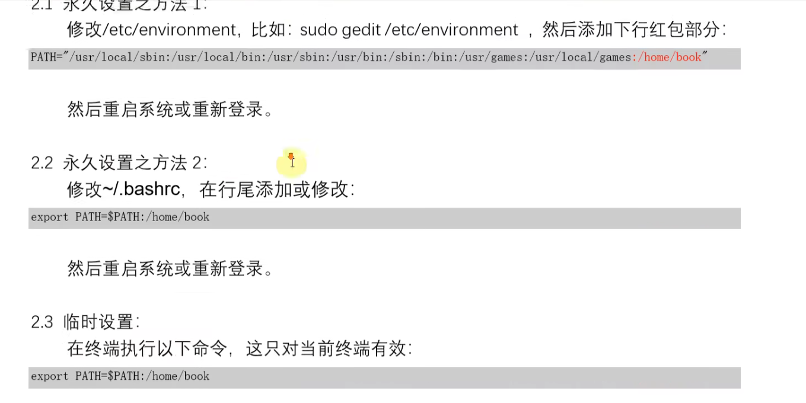

这三种方法的本质区别在于：**“谁能用”**（作用范围）以及**“用多久”**（生命周期）。

为了让你彻底搞懂，我们还是用**“公司规章制度”**来打比方。假设 Linux 系统就是一家大公司，`PATH` 变量是公司的“工具借用清单”。

------


### 一、 三种方法的详细对比

#### 方法 3：临时设置 (`export PATH=...`)

- **比喻**：**“口头通知”**。
  - 你在干活时，突然想起有个工具在抽屉里，于是你跟自己说：“等下我要用抽屉里的工具。”
- **特点**：
  - **即时生效**：敲完命令马上就能用。
  - **极其短命**：<span style="color:#FF0000;">只在**当前这个黑框框（终端窗口）**里有效。一旦你关掉这个窗口，或者电脑重启，这句话就随风而去了，系统完全不记得。</span>
- **应用场景**：
  - 你只想**临时**测试一下某个新编译的工具。
  - <span style="color:#FF0000;">你在搞嵌入式交叉编译时，只想在当前窗口编译这个项目，不想干扰其他项目。</span>


#### 方法 2：永久设置之方法 2 (`修改 ~/.bashrc`) —— **最推荐！**

- **比喻**：**“个人备忘录”**。
  - 你在自己的办公桌（Home 目录）上贴了一张便签条，上面写着：“我要用这个工具。”
- **特点**：
  - <span style="color:#CC0000;">**只对你有效**：你是 `book` 用户，你贴的便签只有你能看见。如果另一个用户 `root` 或 `zhangsan` 登录进来，他们看不见，也不受影响。</span>
  - **永久有效**：因为写在了文件里，重启电脑还在。
  - **生效时机**：每次你**打开一个新的终端窗口**时，Shell 会自动读一遍这个文件。
- **应用场景**：
  - <span style="color:#CC0000;">**嵌入式开发最常用的方式**。比如你安装了 ARM 编译器，你肯定希望每次打开终端都能直接用，但又不想影响系统里的其他用户。</span>


#### 方法 1：永久设置之方法 1 (`修改 /etc/environment`)

- **比喻**：**“公司红头文件”**。
  - 这是贴在公司大门口的公告。
- **特点**：
  - <span style="color:#CC0000;">**对所有人有效**：不管是你，还是 root，还是以后新建的张三李四，登录进来都会强制遵守这个规则。</span>
  - **永久有效**：重启电脑还在。
  - **生效时机**：通常需要**重启系统**或者**注销重新登录**才会生效（因为它是在系统启动/用户登录的最早期加载的）。
- **风险**：如果你写错了，可能会导致所有人都登不进系统（找不到命令了），风险较大。
- **应用场景**：
  - 配置 Java 环境（JDK）、系统级的库路径，或者公司统一的开发环境。

------


### 二、 核心差异总结表（面试必背）

| **特性**       | **临时设置 (export)** | **用户级永久 (~/.bashrc)**      | **系统级永久 (/etc/environment)** |
| -------------- | --------------------- | ------------------------------- | --------------------------------- |
| **哪里改？**   | 直接在终端敲命令      | 改用户家目录下的隐藏文件        | 改系统根目录下的配置文件          |
| **谁生效？**   | 仅当前这一个终端窗口  | 仅当前登录的这个用户            | 系统里的**所有用户**              |
| **何时失效？** | 关掉窗口即失效        | **永不失效**                    | **永不失效**                      |
| **何时生效？** | 立即                  | 打开新终端时 (或用 source 命令) | 重启或重新登录后                  |
| **推荐指数**   | ⭐⭐⭐ (测试用)          | ⭐⭐⭐⭐⭐ (**开发用**)              | ⭐ (慎用)                          |

------


### 三、 嵌入式开发避坑指南

针对你要准备的面试和实际开发，这里有两个非常重要的**技术细节**：

#### 1. 语法不同！(细心的面试官会问)

- **`.bashrc` 和 `export`**：使用的是 Shell 脚本语法。
  - 必须加 `export`。
  - 可以使用变量引用：`PATH=$PATH:/opt/bin` (意思是：<span style="color:#CC0000;">在旧的 PATH 后面**追加**新目录</span>)。
- **`/etc/environment`**：使用的是简单的 `KEY=VALUE` 格式。
  - **不能**写 `export`。
  - **通常不能**引用变量（不能写 `$PATH`）。你必须把完整的、长长的一串路径全部写死进去（就像图片里那样）。


#### 2. 怎么让永久设置“立即生效”？

如果你修改了 `~/.bashrc`，你会发现当前窗口还是找不到命令。你需要关掉重开，或者使用这个命令：

Bash

```bash
source ~/.bashrc
```

**`source`** 的意思就是：“请立刻、马上再读一遍这个配置文件，让它在当前窗口生效。”


### 四、 你的下一步行动建议

<span style="color:#CC0000;">作为嵌入式开发者，请死磕 **方法 2 (`~/.bashrc`)**。</span>

**练习任务：**

1. 在你的 Ubuntu 里，打开终端。
2. 输入 `vim ~/.bashrc` (或者 `gedit ~/.bashrc`)。
3. 拉到文件**最后一行**。
4. 加上一句：`export MY_NAME="Verific"` (把你自己的名字做成环境变量)。
5. 保存退出。
6. 执行 `source ~/.bashrc`。
7. 输入 `echo $MY_NAME`。

如果你能打印出你的名字，说明你已经掌握了 Linux 环境配置的精髓！


## 提问4（终端中 执行 应用程序 3种方法）

<span style="font-weight:bold; font-size:1.2em;">视频中提到的在终端中执行应用程序的方法都是有哪些呢？</span>


根据视频内容以及 Linux 的核心运行机制，在终端中运行程序主要有 **3 种方法**。

<span style="color:#CC0000;">这 3 种方法本质上是在回答 Shell（服务员）同一个问题：**“你要运行的那个程序到底在哪里？”**</span>

------


### 方法 1：使用绝对路径 (The Absolute Path)

**核心逻辑**：<span style="border:1px solid #CC0000; color:#CC0000;">告诉 Shell **完整的、确切的**家庭住址。</span>

- **操作方式**：从根目录 `/` 开始，一级一级写清楚。

- **视频中的体现**：虽然视频主要讲 PATH，但提到 `/bin/ls` 或者 `/home/book/hello` 这种写法。

- **示例**：

  Bash

  ```bash
  /bin/ls
  /home/book/Desktop/hello
  ```

- **特点**：**最精准，但最麻烦**。不管你当前在哪个目录下，这个命令一定能运行成功。一般用于写系统脚本（防止找不到命令）。

------


### 方法 2：使用相对路径 (The Relative Path)

**核心逻辑**：告诉 Shell 程序就在**“我隔壁”**或者**“我脚下”**。

- **操作方式**：<span style="color:#CC0000;">以当前目录 `.` 或上级目录 `..` 开头。</span>

- **视频中的体现**：这是视频演示编译 C 语言程序后最常用的方式。编译出 `hello` 后，输入 `./hello` 运行。

- **示例**：

  Bash

  ```bash
  ./hello      # 运行当前目录下的 hello (最常用)
  ../bin/app   # 运行上一级目录里的 bin 文件夹下的 app
  ```

- **特点**：**必须加 `./`**。

  - *面试考点*：为什么在当前目录下已经有 `hello` 了，输入 `hello` 报错，非要输 `./hello`？
  - <span style="color:#CC0000;">*答案*：为了安全。Linux 默认的 `PATH` 变量不包含当前目录 `.`。如果不强制加 `./`，黑客可能会在当前目录放一个叫 `ls` 的病毒，当你本来想运行系统的 `ls` 时，就会误运行病毒。</span>

------


### 方法 3：利用 PATH 环境变量 (The PATH Way)

**核心逻辑**<span style="color:#CC0000;">：**只喊名字**，让 Shell 自己去“通讯录”里找。</span>

- **操作方式**：<span style="color:#CC0000;">直接输入命令名称，不带任何斜杠 `/`。</span>

- **视频中的体现**：这是视频的**重头戏**。比如直接输入 `ls`，或者把 `/home/book` 加入 PATH 后直接输入 `hello`。

- **示例**：

  Bash

  ```c
  ls
  gcc
  hello  # (前提是 hello 所在的目录已经被加到了 PATH 中)
  ```

- **特点**：**最方便**。这是我们安装软件、配置环境的最终目的。

------


### 总结对比表（面试复习专用）

| **方法**      | **写法示例**  | **原理**         | **适用场景**                                       |
| ------------- | ------------- | ---------------- | -------------------------------------------------- |
| **绝对路径**  | `/usr/bin/ls` | 给定完整地址     | 写自动启动脚本、Crontab 定时任务（确保万无一失）。 |
| **相对路径**  | `./hello`     | 基于当前位置     | 开发调试阶段，刚编译出来测一下。                   |
| **PATH 查找** | `ls`          | 查 PATH 环境变量 | 系统命令、安装好的工具、常用的自定义脚本。         |

嵌入式面试中的“坑”：

如果面试官问你：“我写了一个脚本放在 /root 目录下，为什么我输入文件名运行不了？”

你要从两个角度回答：

1. **权限**：有没有给它 `chmod +x` 执行权限？
2. **路径**：是不是忘了加 `./` 或者绝对路径？（因为 `/root` 默认不在 PATH 里）。


# 二、 针对嵌入式 Linux 的知识扩展


面试官通常不会只问“怎么设置 PATH”，而是会考察你对系统底层的理解。以下是基于视频内容的深度扩展：

#### 1. Shell 执行命令的底层原理（Fork & Exec）

视频中说“Shell 去找程序然后运行”，在操作系统内核层面，这涉及两个关键系统调用：

- **`fork()`**：Shell 进程复制自身，创建一个子进程。
- **`exec()` 系列函数**（如 `execvp`）：子进程加载新的可执行文件（如 `ls` 或你的 `hello` 程序）覆盖自己的内存空间，并开始运行。
- **面试考点**：Shell 作为一个死循环进程，是如何做到启动新程序而不退出的？（答案就是 `fork` + `exec` 机制）。


#### 2. 为什么嵌入式开发中 PATH 容易出问题？

在嵌入式开发（特别是交叉编译）中，PATH 极为关键：

- **交叉编译工具链**：<span style="color:#CC0000;">你需要将 `arm-linux-gcc` 等工具的路径加入 PATH，否则编译时会提示找不到命令。</span>
- **Bootloader (U-Boot)**：U-Boot 也有类似的环境变量，但它不像 Linux Shell 那么强大，理解 PATH 有助于理解 U-Boot 的命令执行。
- **BusyBox**：嵌入式设备上的 Shell 通常是 BusyBox（那是 ls, cp, mv 等命令的集合体），它通常是个软链接。


#### 3. 另外一个重要的变量：LD_LIBRARY_PATH

视频讲了可执行程序的路径 (PATH)。

<span style="border:1px solid #CC0000; color:#CC0000;">但在嵌入式中，动态链接库（.so 文件）的路径同样重要</span>。如果你的程序编译过了，但运行报错 error while loading shared libraries，通常是因为动态库不在标准路径下。

- **解决方案**：设置 `export LD_LIBRARY_PATH=$LD_LIBRARY_PATH:/你的库目录`。


#### 4. `main` 函数的参数解析

视频中演示了 `argc` 和 `argv`。在实际嵌入式工具开发中，我们很少手写解析逻辑，而是使用 `getopt()` 或 `getopt_long()` 函数来处理复杂的命令行参数（如 `-a`, `-l`, `--help`）。

------


# 三、 经典面试题与高分回复

针对这个视频的内容，我为你准备了 5 个由浅入深的面试题。

#### Q1: 为什么我在当前目录下已经有了 `hello` 程序，输入 `hello` 却提示找不到命令，必须输入 `./hello`？

- **简洁回复**：因为出于安全考虑，Linux 默认的 `PATH` 环境变量中**不包含**当前目录（`.`）。Shell 只会在 `PATH` 指定的目录中查找。输入 `./hello` 是显式告诉 Shell 使用相对路径在当前目录下查找并执行，跳过了 PATH 搜索机制。


#### Q2: `source script.sh` 和 `./script.sh` 执行脚本有什么本质区别？（高频）

- **深刻见解**：
  - **`./script.sh`**：Shell 会 `fork` 一个**子进程**来执行脚本。脚本中定义的变量（如 `export PATH=...`）只在子进程有效，脚本结束后子进程销毁，**不会影响**当前终端的环境。
  - **`source script.sh`**：脚本在**当前 Shell 进程**中执行。脚本中对环境变量的修改会**直接生效**并保留在当前终端中。
  - **应用场景**：这就是为什么安装交叉编译工具链后，我们需要 `source /etc/profile` 而不是直接运行它的原因。


#### Q3: 如果我有两个命令都叫 `test`，一个在 `/usr/bin`，一个在 `/usr/local/bin`，Shell 会执行哪一个？

- **简洁回复**<span style="color:#CC0000;">：Shell 会按照 `PATH` 环境变量中目录的**先后顺序**进行查找，先找到哪个就执行哪个。</span>
- **补充**：可以使用 `which test` 或 `type -a test` 命令来查看具体执行的是哪一个路径下的命令。


#### Q4: 请简述 Shell 解析命令并将参数传递给 C 语言 main 函数的过程。

- **回复**：
  1. Shell 读取命令行字符串，以**空格**（默认分隔符）将字符串切割。
  2. 第一个字符串被视为**<span style="color:#CC0000;">命令/程序名</span>**，<span style="color:#CC0000;">Shell 在 `PATH` 中查找其可执行文件。</span>
  3. <span style="color:#CC0000;">后续字符串作为**参数列表**。</span>
  4. <span style="color:#CC0000;">Shell 调用 `exec` 系列函数，将程序名和参数列表传递给内核。</span>
  5. 内核启动新进程，将参数个数赋值给 `argc`，将参数字符串指针数组赋值给 `argv`，传递给 main 函数。


#### Q5: 什么是 Shell 的“内部命令”和“外部命令”？PATH 对它们都有效吗？

- **回复**：
  - **内部命令**（Built-in）：是 Shell 程序自带的功能，如 `cd`、`echo`、`source`。它们不需要创建子进程，执行效率高。
  - **外部命令**：是独立的可执行文件，如 `ls`、`gcc`。
  - **结论**：`PATH` 环境变量**只对外部命令有效**。内部命令直接由 Shell 解释执行，不需要去磁盘遍历 PATH 目录查找。

------

下一步建议：

针对嵌入式面试，建议你紧接着复习 “Linux 文件权限（chmod/chown）” 和 “管道与重定向（| , >）”，因为它们通常是结合 Shell 脚本一起考察的重点。如果你需要针对这两个话题的面试题，请随时告诉我。