这是一个非常基础但极其重要的Linux入门视频，涵盖了嵌入式开发中最常用的<span style="color:#CC0000;">文件与目录操作命令</span>。在嵌入式面试中，虽然面试官不会直接让你背诵这些命令，但会**<span style="color:#CC0000;">考察你对这些命令背后机制的理解</span>**，以及在实际开发环境（如BusyBox、根文件系统裁剪）中的应用。

以下是针对该视频内容的总结、扩展及面试题准备：


# 一、 视频内容章节总结

- **00:00 - 02:26：路径概念与基础导航**
  - 讲解了<span style="border:1px solid #FF00FF;">Linux文件系统的树状结构（根目录 `/`</span>）。
  
  - 区分**<span style="background:#00FF80;">绝对路径</span>**（从 `/` 开始）和**<span style="background:#00FF80;">相对路径</span>**（从当前目录开始）。
  
  - <span style="color:#FF0000;">特殊符号含义</span>：<span style="background:#00FF80; border:1px solid #FF00FF;">`.` (当前目录)，`..` (上一级目录)，`~` (用户家目录)，`-` (上一次所在的目录)。</span>
  
    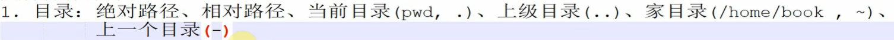
  
    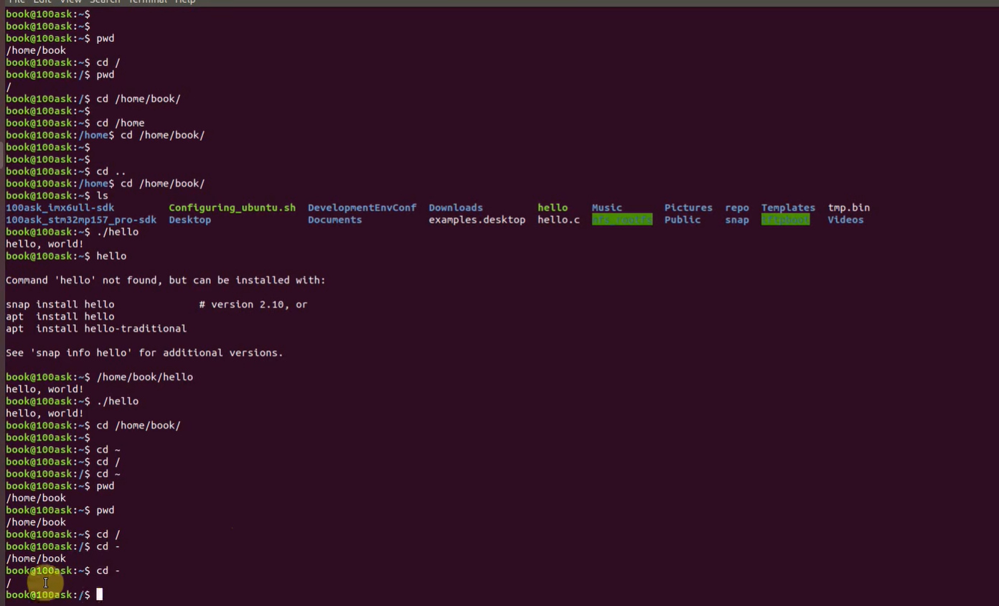
  
  - <span style="color:#FF0000; background:#00FF80; border:1px solid #FF00FF;">命令（补充：注意英文全称）</span>：`pwd` (显示当前路径)，`cd` (切换路径)。
  
    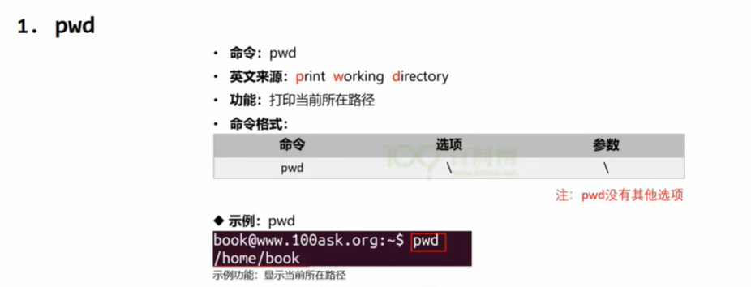
  
    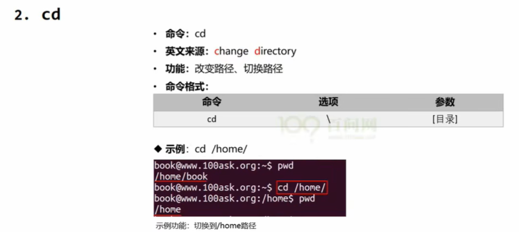
  
- **02:27 - 08:24：目录的创建与删除**
  - 演示了如何通过命令行创建文件夹。
  
  - 命令：`mkdir` (创建目录)，重点提到了<span style="background:#00FF80; border:1px solid #FF00FF;"> `mkdir -p` (递归创建多级目录，例如 `mkdir -p dir1/dir2`)</span>。
  
    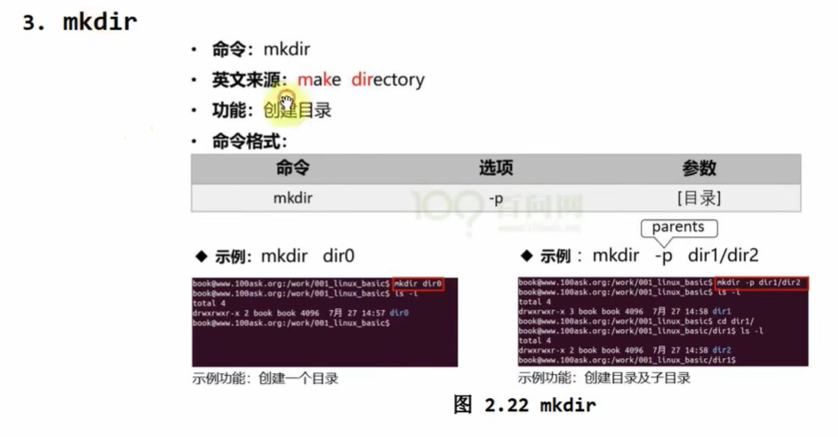
  
  - 命令：`rmdir` (删除**空**目录)。<span style="color:#FF0000; border:1px solid #FF00FF; background:#00FF80;">注意：如果目录非空，此命令会报错。</span>
  
    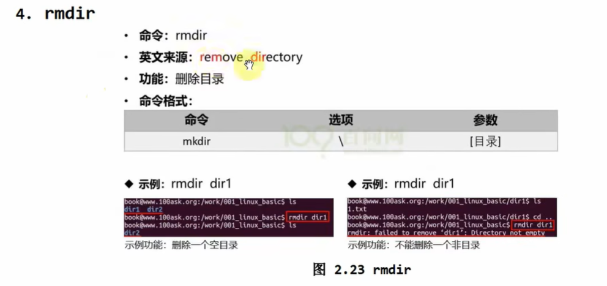
  
- **08:25 - 12:00：查看文件与目录信息**
  - 命令：`ls` (列出目录内容)。
  
    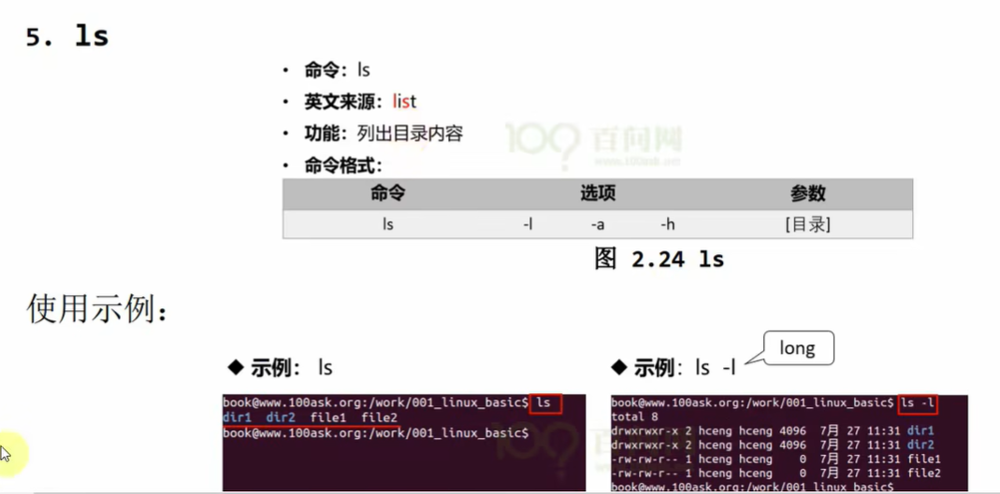
  
    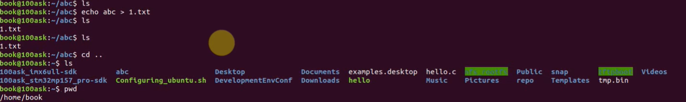
  
  - 常用参数详解：
    
    - `ls -a`：显示所有文件，包括隐藏文件（以 `.` 开头的文件）。
    - `ls -l`：长格式显示，包含权限、所有者、大小、修改时间等信息。
    - `ls -h`：以人类可读格式显示文件大小（如 KB, MB）。
  
- **12:01 - 14:18：复制命令**
  - 命令：`cp` (复制文件或目录)。
  - 关键参数：`cp -r` (<span style="background:#00FF80;">递归复制)</span>，用于<span style="border:1px solid #FF00FF;">复制整个目录及其内部所有内容。</span>
  
- **14:19 - 结尾：强制删除与危险操作**
  
  - 命令：`rm` (删除文件)。
  - 关键组合：`rm -r` (递归删除目录)，`rm -f` (强制删除不提示)。
  - **高危命令**：`rm -rf /` (也就是<span style="background:#00FF80;">传说中的“删库跑路”，在嵌入式开发板上操作需极度小心，可能导致系统无法启动)</span>。（<span style="color:#FF0000;">补充：这里是强制删除根目录</span>）
  
  

# 补充提问

## 提问1（TAB自动补全）

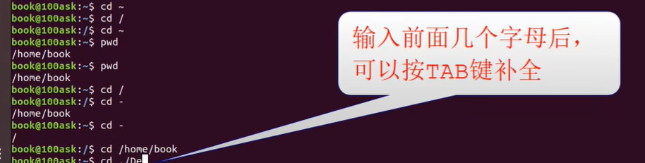

<span style="font-weight:bold; font-size:1.2em;">这里TAB键补全的规则是什么呢，我什么时候可以使用这个TAB补全键来快捷地帮我输入命令呢，我不是太懂，你能够给我详细解释下吗，最好能够举些例子来让我彻底弄明白。</span>


这是一个非常好的问题！<span style="color:#FF0000; background:#00FF80; border:1px solid #FF00FF;">**TAB 键补全**可以说是 Linux 命令行操作的“灵魂”。一旦你掌握了它，你的操作速度会提升好几倍，而且几乎不会再出现拼写错误。</span>

简单来说，TAB 键的逻辑就是：**“帮我猜我想输什么”**。

它的核心规则只有一条：<span style="background:#00FF80;">**唯一性匹配**。</span>

下面我拆解成三种情况，结合例子帮你彻底弄明白。


### 核心规则：三种情况

<span style="background:#00FF80;">假设你的当前目录下有以下三个文件/文件夹</span>：

- `book` (文件夹)
- `desk` (文件夹)
- `demo.txt` (文件)


#### 情况一：独一无二，<span style="background:#00FF80;">直接补全</span>（最爽的情况）

**规则**：<span style="color:#FF0000; background:#00FF80; border:1px solid #FF00FF;">如果你输入的前几个字母，只能匹配到**唯一**的一个文件或命令，按下 TAB 键，系统会立刻把剩下的名字全部补齐。</span>

- **你的操作**：输入 `cd b` 然后按 **TAB**。
- **系统逻辑**：<span style="background:#00FF80; border:1px solid #FF00FF;">当前目录下以 `b` 开头的只有 `book` 这一项。</span>
- **结果**：<span style="color:#FF0000; background:#00FF80; border:1px solid #FF00FF;">系统自动补全为 `cd book/`。</span>


#### 情况二：<span style="background:#00FF80;">有多项匹配，补全公共部分 + 提示（最常见的情况）</span>

**规则**：<span style="background:#00FF80; border:1px solid #FF00FF;">如果你输入的前几个字母，对应了多个文件（不唯一），按一下 TAB 可能没反应（或者响铃提示）。这时候**连按两下 TAB**，系统会列出所有可能的选项。</span>

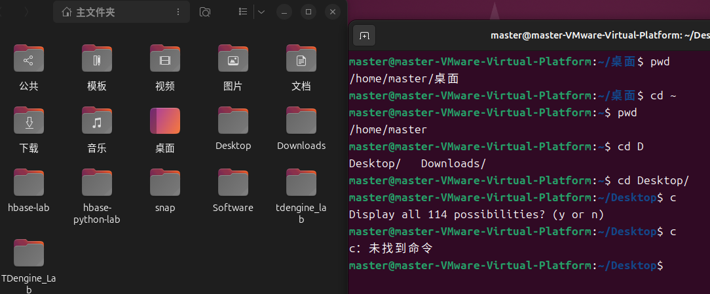

- **你的操作**：输入 `ls de` 然后按 **TAB**。

- **系统逻辑**：系统发现以 `de` 开头的有 `desk` 和 `demo.txt` 两个。它不知道你要哪一个，所以它**不敢乱补全**，只能停在原地（或者只补全到它们相同的字母，如果有的话）。

- **你的操作**：**再按一下 TAB**（此时是双击）。

- **结果**：屏幕下方会列出：

  Plaintext

  ```
  demo.txt   desk/
  ```

  告诉你：<span style="color:#FF0000;">“老兄，`de` 开头的有这两个，你要哪个？”</span>

- **后续操作**：<span style="background:#00FF80;">你看到列表后，想进 `desk`，于是你再补一个字母 `s`，变成 `ls des`，再次按 **TAB**。</span>

- **结果**：<span style="color:#FF0000;">现在唯一了，补全为 `ls desk/`。</span>


#### 情况三：<span style="color:#FF0000; background:#00FF80;">无匹配，没反应</span>

**规则**：<span style="background:#00FF80;">如果你输入的字母根本不存在，按 TAB 键什么都不会发生（或者只是响铃）。</span>

- **你的操作**：输入 `cd x` 然后按 **TAB**。
- **系统逻辑**：这里没有 `x` 开头的东西。
- **结果**：无事发生。这时候你就知道自己可能记错名字或者拼错单词了。

------


### TAB 键到底能补全什么？

<span style="color:#FF0000; border:1px solid #FF00FF;">不仅仅是文件名，它在不同位置有不同的补全逻辑：</span>


#### 1. <span style="color:#FF0000;">补全“命令” (在一行的最开头)</span>

<span style="background:#00FF80; border:1px solid #FF00FF;">当你按回车换行后，光标在最前面时，TAB 补全的是**系统命令**。</span>

- **例子**：你想输入 `ifconfig` (查看网络IP的命令)。
- **操作**：输入 `ifc` -> 按 **TAB**。
- **结果**：自动变为 `ifconfig`。
- **原理**：系统会去环境变量 `PATH` 里找所有可执行的程序，看看谁是 `ifc` 开头的。


#### 2. <span style="color:#FF0000;">补全“路径/文件名” (在命令之后)</span>

当你输入了命令（如 `cd`, `ls`, `cp`），敲了空格之后，再按 TAB，补全的就是**当前目录（或指定目录）下的文件**。

- **例子**：就是你截图中的情况。
- **操作**：`cd ./De` -> 按 **TAB**。
- **原理**：`cd` 是命令，空格后面跟的是路径。`./` 代表当前目录。系统会去当前目录下找 `De` 开头的文件。
- **推测**：通常 Linux 用户的家目录下都有 `Desktop`（桌面）这个文件夹。所以这里按 TAB 很可能会补全成 `cd ./Desktop/`。

------


### 针对面试的“隐藏知识点”

既然你在准备嵌入式面试，这里有两个关于 TAB 键的深层理解，面试官可能会感兴趣：

1. <span style="background:#00FF80;">大小写敏感：</span>

   Linux 是严格区分大小写的。

   - 如果有文件夹叫 `Desktop`。
   - <span style="background:#00FF80;">你输入 `cd de` 按 TAB 是**补全不出来的**。</span>
   - <span style="color:#FF0000; border:1px solid #FF00FF;">你必须输入 `cd De`。</span>
   - *(注：虽然可以通过配置忽略大小写，但默认标准 Linux 都是区分的)*。

2. BusyBox 环境：

   嵌入式系统通常使用的是裁剪过的 Linux 工具集，叫 BusyBox。

   - 标准的 Ubuntu 终端（Bash/Zsh）TAB 补全功能非常强大。
   - 但在极简的嵌入式开发板上，Shell 可能是简化版的（如 ash 或 sh），它的 TAB 补全可能**没那么智能**，有时候只能补全命令，不能补全文件名，或者没有“双击列出选项”的功能。
   - **面试加分项**：如果面试官问你“开发板上操作有什么不同”，你可以提一句：“习惯了 PC 上的智能 TAB 补全，到了开发板的简化 Shell 环境下，有时候得更依赖 `ls` 先查看再手打，因为某些极简环境 TAB 支持有限。”


### 总结：什么时候用？

**随时随地用！**

建议养成一个习惯：**<span style="border:1px solid #FF0000;">每输入 2-3 个字母，就下意识地用小拇指敲一下 TAB 键。</span>**

- **为了快**：打 `Document` 要按 8 次键盘，打 `Do` + TAB 只需要 3 次。
- **为了准**：人眼看 `lI10O` 这种字符容易看错，TAB 补全出来的绝对是文件系统中真实存在的名字，**能够帮你校验路径是否正确**。如果你按了 TAB 没反应，说明你路径写错了，不要硬着头皮继续敲了。

你可以现在就在你的虚拟机里试一下：输入 `cd /et` 然后按 TAB，看看它是不是自动变成了 `cd /etc/`？


## 提问 1 - （1）

<span style="font-weight:bold; font-size:1.2em; color:#FF0000; background:#00FF80; border:1px solid #FF0000;">这里使用TAB补全命令的时候不会造成冲突呢，比如我在开头输入一个c后按TAB键，此时可以补全cd命令吗？还有开头是 r的时候按TAB补全的是rm还是rmdir呢，我不是太懂？你能够给我解释下吗，最好能够举些例子来让我彻底弄明白。</span>


这是一个非常敏锐的问题！说明你在思考工具背后的逻辑。

直接回答你的疑问：**不会造成冲突，也不会乱填。**

当你输入一个字母（比如 `c` 或 `r`）就按下 TAB 时，如果系统发现有**不止一个**命令是以它开头的，系统的处理逻辑非常严谨：**它会“停下来”，保持不动，等待你输入更多的字母来消除歧义。**

它绝对不会“猜”你想用 `cd` 还是 `cp`，因为一旦猜错，后果可能很严重。

下面我针对你提出的 `c` 和 `r` 的情况，配合**“最长公共前缀匹配”**这个核心原理，给你详细拆解。

------


### 场景一：你在开头输入 `c` 然后按 TAB

**结果：** <span style="background:#00FF80;">什么都不会发生（或者系统发出“滴”的一声警告）。</span>

原因：

Linux 系统中以 c 开头的命令实在是太多了！

比如：cd（切换目录）、cp（复制）、cat（查看文件）、clear（清屏）、chmod（修改权限）、chown（修改所有者）等等。

系统面对这么多选项，它不知道你要哪一个，所以它不敢动。

- **如果你按一下 TAB**：静止不动。
- **如果你连按两下 TAB**：系统会列出**所有**以 `c` 开头的命令（可能有几百个），让你自己看。

如何解决？

你需要继续输入，直到你输入的字母能够唯一确定一个命令，或者让范围变得足够小。

- 想输 `cd`？你需要输入 `cd` 然后**空格**（因为 `cd` 太短了，后面很少有命令叫 `cdxxx`，直接打完更从容）。
- 想输 `clear`？你输入 `cle` -> 按 TAB -> 自动补全为 `clear`。

------


### 场景二：你在开头输入 `r` 然后按 TAB （这是最经典的例子）

你问它会补全成 rm 还是 rmdir？

<span style="background:#00FF80;">答案是：都不会补全，它会停在 r 这里。</span>

因为以 `r` 开头的命令也很多：`reboot`（重启）、`rm`（删除文件）、`rmdir`（删除目录）、`route`（路由表）等等。


#### 让我们来模拟一次“步步为营”的补全过程：

假设你想输入 `rmdir`，但你的系统里同时存在 `rm`、`rmdir` 和 `rmmod`（卸载驱动）。

1. **输入 `r` -> 按 TAB**
   - 系统反应：不动。
   - *内心OS：大哥，r开头的有几十个呢，reboot? rename? 没法补。*
2. **输入 `m` (变成 `rm`) -> 按 TAB**
   - 系统反应：还是不动。
   - *内心OS：虽然排除了 reboot，但现在还有 `rm`, `rmdir`, `rmmod` 三个兄弟，我还是不知道你要谁。*
3. **输入 `d` (变成 `rmd`) -> 按 TAB**
   - 系统反应：**自动补全为 `rmdir`** (并自动加一个空格)。
   - *内心OS：哈！以 `rmd` 开头的命令，全系统只有 `rmdir` 一个！这就给你补上！*

------


### 核心原理：最长公共前缀 (The Longest Common Prefix)

这是 TAB 补全最智能的地方<span style="background:#00FF80;">。如果多个候选项前面有一段**一模一样**的字母，TAB 会帮你把这一段先补出来，然后停住。</span>

**举个例子让你彻底明白：**

假设系统里只有两个命令以 `date` 开头：

1. `date` (显示时间)
2. `date-setting` (假设有这个命令)

**操作过程：**

1. 你输入 `da` -> 按 TAB。
2. 系统发现两个候选项：`date` 和 `date-setting`。
3. 它们的**公共部分**是 `date`。
4. 于是，系统会帮你把 `da` 自动补全成 `date`，**然后停住**。

这时候你看到屏幕上变成了 `date`，但光标紧贴着 `e` 后面：

- 如果你想用 `date` 命令，你自己打一个空格，然后回车。
- 如果你想用 `date-setting`，你只需要再补一个 `-`，按 TAB，剩下的 `setting` 就出来了。

------


### 总结 & 嵌入式面试考点

1. **TAB 永远不会乱猜**：它只补全“毫无争议”的部分。

2. **遇到冲突（歧义）**：它会停下来，或者只补全公共部分，等你提供更多信息。

3. 面试视角：

   在嵌入式开发中，这个机制其实是一种安全保护。

   想象一下，如果你想输入 rmdir（删除空文件夹，很安全），输入了 rm 之后如果不小心 TAB 自动补全成了 rm -rf（强制删除），那岂不是灾难？

   Linux 的这种“保守”策略，强制要求用户在有歧义时手动确认，从而避免了误操作。

建议：

你可以现在就在虚拟机里试一下这个：

输入 history 的前两个字母 hi，然后按 TAB。

看看它是不是不动？（因为还有 his, hint 等词）。

然后连按两下 TAB，看看系统给你列出了哪些 hi 开头的命令？


## 提问2（删除目录）

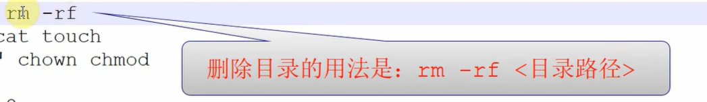

<span style="background:#00FF80; border:1px solid #FF0000; color:#FF0000;">我们删除目录的时候常常使用 rm -rf <目录路径>，而不是使用 rmdir <目录路径>，这是为什么呢，你能够给我对比分析下这二者的区别吗，最好能够举些例子来帮助我彻底弄明白这两个指令。</span>

这个问题问到了 Linux 文件操作的核心痛点。

简单来说：<span style="background:#00FF80; border:1px solid #FF0000; color:#FF0000;">**`rmdir` 像是“用镊子”，太小心翼翼，只能夹走空的盒子；而 `rm -rf` 像是“推土机”，不管盒子里装了什么，连盒子带里面的东西一起推平。**</span>

我们<span style="background:#00FF80; border:1px solid #FF0000;">在日常开发中之所以常用 `rm -rf`，是因为**绝大多数我们要删除的目录，里面都是有文件的**。</span>

下面我通过对比和实例，帮你彻底搞懂这两个指令的区别：


### 1. `rmdir`：不仅是删除，更是“检查”

rmdir 全称是 Remove Directory。

它的<span style="background:#00FF80;">核心规则只有一条：只能删除“空”目录。</span>

如果<span style="color:#FF0000; border:1px solid #CC00CC;">目录里只要有**哪怕一个**文件，或者**哪怕一个**子文件夹，`rmdir` 都会拒绝执行，并向你报错</span>。

- **特点**：极度安全，极度保守。
- **适用场景**：你非常确定这个文件夹是空的，或者你写脚本时**为了防止误删数据**，故意使用它（如果里面有东西，脚本报错停止，反而保护了数据）。


#### 例子演示：

假设你要删除一个叫 `project` 的文件夹，里面有一个 `main.c` 文件。

Bash

```
# 尝试使用 rmdir
$ rmdir project
rmdir: failed to remove 'project': Directory not empty
# 报错了！因为它不是空的。
```

**如果你非要用 `rmdir` 删掉它，你需要两步：**

1. 先进入目录，把里面的 `main.c` 删掉。

2. 再回到上一级，删除这个空的 project 目录。

   (这就太麻烦了，对吧？)

------


### 2. `rm -rf`：真正的“毁灭者”

<span style="background:#00FF80;">`rm` 本身是删除文件（Remove）的命令。加上参数后，它变成了删除目录的神器。</span>

我们需要拆解这两个参数：

- **`-r` (Recursive，<span style="color:#FF0000;">递归</span>)**：意思是<span style="background:#00FF80; border:1px solid #CC00CC;">“不仅删除这个目录，还要**钻进去**，把里面所有的文件、子目录、子目录里的文件……一层层全部删掉”。</span>
- **`-f` (Force，<span style="color:#FF0000;">强制</span>)**：意思是“**不要问我确不确定**，不要提示文件不存在，直接删，闭嘴干活”。

#### 例子演示：

还是那个装有 `main.c` 的 `project` 文件夹。

Bash

```
# 使用 rm -rf
$ rm -rf project
# (没有任何输出，直接换行)
```

**结果**：整个 `project` 文件夹连同里面的代码瞬间消失，没有任何确认提示。

------


### 3.<span style="background:#00FF80; border:1px solid #CC00CC;"> 为什么大家只用 `rm -rf`？</span>

因为在实际工作中（<span style="background:#00FF80; color:#FF0000;">尤其是嵌入式开发编译出了一堆 `.o` 文件、`.bin` 文件</span>），<span style="border:1px solid #CC00CC;">我们删除一个目录通常就是**想要彻底清理它**。我们不关心里面还有没有文件，我们的目的就是让这个目录消失。</span>

如果用 `rmdir`，我们得先把里面的几百个文件清空，这显然是不现实的。

### 总结对比表

| **特性**       | **rmdir <目录>**                     | **rm -rf <目录>**                      |
| -------------- | ------------------------------------ | -------------------------------------- |
| **针对对象**   | 仅限**空目录**                       | 空目录、非空目录、文件皆可             |
| **删除逻辑**   | 检查目录是否为空 -> 是则删，否则报错 | **递归**进入目录，先删光里面的，再删皮 |
| **安全性**     | **高** (有文件时会报错阻止你)        | **低** (一旦回车，数据很难找回)        |
| **日常使用率** | 低 (除非做清理脚本检查)              | **极高** (程序员标配)                  |


### ⚠️ 给嵌入式面试准备的“高危预警”

虽然 `rm -rf` 很方便，但在嵌入式面试或工作中，你必须表现出对它的**敬畏**。

**面试官可能会问：** “使用 `rm -rf` 有什么风险？如何避免？”

**你应该回答：**

1. **路径灾难**：最怕的就是手快打出了 `rm -rf /` （删除根目录）或者在脚本里写了 `rm -rf $VAR/` 而变量 `$VAR` 恰好是空的（这等同于删根目录）。这在嵌入式设备上会导致系统变砖，必须重新烧录系统。
2. **如何避免**：
   - **肌肉记忆**：养成习惯，输入 `rm -rf` 后，**先停顿 1 秒**，检查路径。
   - **相对路径**：尽量使用 `./` 开头，比如 `rm -rf ./project`，而不是绝对路径。
   - **Tab 补全**：正如我们上一个问题讨论的，用 Tab 补全路径，确保你删的是真实存在的那个目录，而不是手滑敲错的系统目录。

一句话总结：

rmdir 是收纳师，只扔空箱子；rm -rf 是粉碎机，连箱子带货一起粉碎。平时用粉碎机更爽，但要把手离刀片远一点。


## 提问 2 （ls -l 命令）


<span style="color:#FF0000; background:#00FF80; border:1px solid #CC00CC; font-size:1.2em;">这张图片中 ls -l 命令 以及 它列出来的 我有点看不太懂，你能够给我详细解释下吗，最好能够举个例子来让我彻底弄明白。</span>


这张图片是 Linux 中最基础也最核心的命令 `ls -l` 的输出结果。对于嵌入式开发者来说，看不懂这张图，就没法处理经常遇到的“权限报错”问题。

`ls -l` 的意思是 <span style="background:#00FF80;">**List in Long format**（以长格式列出）</span>，也就是<span style="color:#FF0000;">列出文件的详细信息。</span>

为了让你彻底看懂，我们把其中一行拆解开来，这行包含了所有的核心信息：

我们可以<span style="color:#FF0000;">拿这一行作为例子（图片中的第5行）</span>：

drwxr-xr-x 2 book book 4096 Mar 26 2019 Desktop

我们可以把它<span style="background:#00FF80; border:1px solid #CC00CC;">切分成 **7个部分**</span>，请对照下图的解释：

### 第一部分：文件类型与权限 (最重要！)

这是<span style="border:1px solid #FF00FF; background:#00FF80;">最开头的一串字符</span>，比如 `drwxr-xr-x` 或者 `-rw-rw-r--`。这其实要<span style="color:#FF0000;">分为两半看</span>：

1. **<span style="color:#FF0000; background:#00FF80; border:1px solid #FF00FF;">第一个字符（文件类型）：</span>**

   - **`d`**：表示 **Directory**（<span style="color:#FF0000;">目录/文件夹</span>）。注意看图片里，<span style="background:#00FF80; border:1px solid #FF00FF;">所有蓝色的名字前面都是 `d`。</span>
   - **`-`**：表示 **File**（<span style="color:#FF0000;">普通文件</span>）。注意看图片里的 <span style="background:#00FF80; border:1px solid #FF00FF;">`hello.c` 前面就是 `-`</span>。
   - **(<span style="background:#00FF80; border:1px solid #FF00FF;">进阶：嵌入式中你还会看到 `c` 代表字符设备，`b` 代表块设备，`l` 代表软链接</span>)**

2. <span style="color:#FF0000; background:#00FF80; border:1px solid #FF00FF;">后面9个字符（权限）：</span>

   <span style="border:1px solid #FF00FF;">这9个字符</span>要<span style="border:1px solid #FF00FF;">每3个一组</span>来看，<span style="background:#00FF80;">分别代表</span>：<span style="color:#FF0000; border:1px solid #FF00FF;">拥有者(User)</span>、<span style="color:#FF0000; border:1px solid #FF00FF;">所属组(Group)</span>、<span style="color:#FF0000; border:1px solid #FF00FF;">其他人(Others) </span>的权限。

   - **`r` (Read)**：可读。
   - **`w` (Write)**：可写（<span style="background:#00FF80;">修改/删除</span>）。
   - **`x` (Execute)**：可执行（<span style="background:#00FF80;">如果是文件夹，代表能 cd 进去</span>）。
   - **`-`**：<span style="background:#00FF80;">无此权限</span>。

   <span style="color:#FF0000;">**举例分析图片中的 `hello` 文件 (`-rwxrwxr-x`)：**</span>

   - `rwx` (前3位)：**拥有者**（book）可以读、写、执行。
   - `rwx` (中3位)：**同组人**（book组）可以读、写、执行。
   - `r-x` (后3位)：**其他人**可以读、执行，但**不能修改**。

### 第二部分：硬链接数

- 对应数字：`2`, `11`, `1` 等。
- **对于文件**：通常是 `1`，表示只有一个文件名指向这个数据。
- **对于目录**：这个数字表示它下面有多少个子目录。注意，Linux里每个目录都有 `.` 和 `..` 两个隐藏目录，所以空目录的这个数字通常是 2。

### 第三部分：拥有者 (Owner)

- 对应内容：`book` 或 `root`。
- 表示这个文件属于谁。图片中大部分文件属于 `book` 用户，但有两个特殊的目录 `nfs_rootfs` 和 `tftpboot` 属于 `root` 用户。

### 第四部分：所属组 (Group)

- 对应内容：`book` 或 `root`。
- <span style="background:#00FF80;">Linux 下用户是分组的。这里表示文件属于哪个组。</span>

### 第五部分：文件大小

- 对应数字：`4096`, `15844`, `112` 等。
- 单位是 **字节 (Byte)**。
- **有趣点**：<span style="color:#FF0000; background:#00FF80; border:1px solid #FF00FF;">你会发现很多目录的大小都是 `4096`。这是因为在 Linux 文件系统中，一个目录结构本身（用来记录里面有哪些文件名的清单）最小通常占用一个“块”的大小，也就是 4KB (4096字节)。这**不代表**文件夹里文件的总大小。</span>

### 第六部分：修改时间

- 对应内容：`Aug 6 20:14` 等。
- 表示<span style="background:#00FF80; border:1px solid #FF00FF;">文件内容最后一次被修改的时间</span>。

### 第七部分：<span style="background:#00FF80; border:1px solid #FF00FF; color:#FF0000;">文件名</span>

- 对应内容：`Desktop`, `hello`, `hello.c` 等。
- **颜色含义（Ubuntu 默认）**：
  - **<span style="border:1px solid #FF00FF;">白色</span>**：普通文件（如 `hello.c`, `tmp.bin`）。
  - <span style="border:1px solid #FF00FF;">**蓝色**</span>：目录（如 `Desktop`）。
  - <span style="border:1px solid #FF00FF;">**绿色**</span>：可执行文件（如 `hello`, `Configuring_ubuntu.sh`）。
  - <span style="border:1px solid #FF00FF;">**绿色背景**</span>（图片中有两个）：通常表示权限非常开放（如 `rwxrwxrwx` 即 777 权限），任何用户都可以随意读写。这在嵌入式开发板的共享目录（NFS/TFTP）中很常见。

### 举个实战例子让你彻底明白

假设你在面试，面试官指着图片里的 hello 文件问你：

“请解释一下 -rwxrwxr-x 1 book book 这行信息的含义。”

**满分回答逻辑：**

1. **第一个 `-`**：说明 `hello` 是一个**普通文件**，不是文件夹。
2. **`rwx` (第一组)**：说明这个文件的**拥有者 `book`** 对它拥有**读、写、执行**的全部权限。
3. **`rwx` (第二组)**：说明 **`book` 组**里的其他成员也对它拥有**读、写、执行**的全部权限。
4. **`r-x` (第三组)**：说明**其他人**只能**读和执行**它，但是**不能修改**它（因为中间是 `-` 不是 `w`）。
5. 这也解释了为什么文件名是**绿色**的，因为它带有 `x`（可执行）权限，是一个程序。

### 总结：嵌入式面试考点

在嵌入式开发中，最常见的问题是：**“为什么我运行脚本提示 `Permission denied`（权限拒绝）？”**

这时候你用 ls -l 一看，往往会发现那个脚本的权限是 -rw-rw-r--（没有 x）。

解决方法：使用 chmod +x 脚本名，把它变成 -rwxrwxr-x，就能运行了。


## 提问 2 - （1）

<span style="color:#FF0000; background:#00FF80; border:1px solid #FF00FF;">后面9个字符（权限）：</span>

<span style="border:1px solid #FF00FF;">这9个字符</span>要<span style="border:1px solid #FF00FF;">每3个一组</span>来看，<span style="background:#00FF80;">分别代表</span>：<span style="color:#FF0000; border:1px solid #FF00FF;">拥有者(User)</span>、<span style="color:#FF0000; border:1px solid #FF00FF;">所属组(Group)</span>、<span style="color:#FF0000; border:1px solid #FF00FF;">其他人(Others) </span>的权限。

- **`r` (Read)**：可读。
- **`w` (Write)**：可写（<span style="background:#00FF80;">修改/删除</span>）。
- **`x` (Execute)**：可执行（<span style="background:#00FF80;">如果是文件夹，代表能 cd 进去</span>）。
- **`-`**：<span style="background:#00FF80;">无此权限</span>。

<span style="color:#FF0000; background:#00FF80; border:1px solid #FF00FF; font-size:1.2em;">上面这里的 拥有者、所属组、其他人 我不是太懂，你能够给我详细解释下吗，最好能够举个例子来让我彻底弄明白。</span>


这是一个非常棒的基础问题！<span style="background:#00FF80; border:1px solid #FF00FF;">要理解这三个概念，你首先得知道 Linux 是一个**多用户系统**。</span>

不像我们平时用的 Windows（大多数情况下只有你自己一个人用），Linux 设计之初就是<span style="color:#FF0000; border:1px solid #FF00FF;">为了给一台主机让几十甚至上百人同时连接使用的。</span>

<span style="color:#FF0000; border:1px solid #FF00FF;">为了保证数据安全，防止“张三”偷看“李四”的文件，或者防止“实习生”删掉了“老板”的各种资料，Linux 发明了这三种身份。</span>

为了让你彻底弄明白，我们用一个**“公司办公室”**的例子来类比。

### 场景设定

假设你叫 “小明”，你是 “研发部” 的员工。

你写了一份文件叫 《技术方案.txt》。

#### 1. 拥有者 (User / Owner) —— 就是“你本人”

- **概念**：<span style="background:#00FF80; border:1px solid #FF00FF;">文件的创建者，或者被指定的主人。</span>

- **权限**：通常权限最大。

- 例子：

  <span style="background:#00FF80;">既然文件是你（小明）写的，你肯定拥有**读（看）和写（改）**的权利。</span>

  - 如果你想把这个文件设为私密，只有你能看，别人都不能看。
  - 这时，针对 **拥有者** 的权限就是 `rw-`（可读可写）。

#### 2. 所属组 (Group) —— 就是你的“部门同事”

- **概念**：这就好比公司里的“部门”。你属于“研发部”，你的同事小红、小刚也属于“研发部”。

- **作用**：**<span style="color:#FF0000;">方便团队协作</span>**。如果你想让你的方案给部门里的同事指点一下，或者一起修改，但又不想给“销售部”的人看。你不需要给小红开权限，再给小刚开权限，你只需要给“研发部”这个**组**开权限就行了。

- 例子：

  你把这个文件的所属组设定为“研发部”。

  - 如果不希望同事乱改，只希望他们提意见（只读）。
  - 这时，针对 **所属组** 的权限就是 `r--`（只读）。

#### 3. 其他人 (Others) —— 就是“公司里的闲杂人等”

- **概念**：既不是你也**不**是你部门的人。比如“财务部”的老王，“前台”的小丽，甚至是扫地阿姨。

- **定义逻辑**：<span style="color:#FF0000; background:#00FF80;">**排除法**。只要不是“拥有者”，也不在“所属组”里，剩下的全归为“其他人”。</span>

- 例子：

  这份技术方案属于机密，你不想让研发部以外的任何人看到。

  - 这时，针对 **其他人** 的权限就是 `---`（没有任何权限）。


### 结合代码来看个具体的例子

假设你在 Linux 终端里看到了这样一行：

Bash

```bash
-rwxrw-r--  1  xiaoming  dev_team  1024  plan.txt
```

我们可以把它翻译成“人话”：

1. **`-` (开头)**：这是个普通文件。
2. **`rwx` (第一组 - 拥有者 xiaoming)**：
   - **xiaoming**（你）对这个文件可以**读、写、执行**（如果是脚本的话）。
   - *类比：这是你的文件，你想怎么弄都行。*
3. **`rw-` (第二组 - 所属组 dev_team)**：
   - **dev_team**（研发组的同事们）对这个文件可以**读、写**，但不能执行。
   - <span style="background:#00FF80;">*类比：你的团队成员可以帮你一起修改文档。*</span>
4. **`r--` (第三组 - 其他人)**：
   - **Others**（销售部、财务部等路人甲）对这个文件只能**读**，不能改，也不能执行。
   - <span style="background:#00FF80;">*类比：公司发通告，大家只能看，不能改里面的字。*</span>


### 回到你图片中的例子 (针对嵌入式开发)

让我们重新看你截图里的这一行：

Bash

```bash
drwxrwxrwx 5 root root 4096 ... nfs_rootfs
```

- **拥有者 (User)** 是 `root`：
  - 权限 `rwx`：系统超级管理员（皇帝）可以随意读写进入。
- **所属组 (Group)** 是 `root` 组：
  - 权限 `rwx`：属于管理员组的人也可以随意读写进入。
- **其他人 (Others)** 是...所有人：
  - 权限 **`rwx`**：！！注意这里！！
  - 这是**绿色背景**的原因。这表示**全世界任何人**（包括你登录的 `book` 用户）都可以对这个文件夹进行读、写、删除。

为什么嵌入式开发中会有这种权限？

nfs_rootfs 通常是用来给开发板通过网络挂载文件系统的。<span style="background:#00FF80;">为了防止开发板读取文件时因为权限不够而报错，开发者（或者教程作者）为了省事，直接把权限开到了最大（777），让“其他人”也能随便写。这在个人开发时很方便，但在生产服务器上是非常危险的。</span>

### 总结

- **User (u)**：**我**（私有权限）。
- **Group (g)**：**我们**（团队权限）。
- **Others (o)**：**他们**（公众权限）。

现在是不是清晰多了？


## 提问 2 - 1 -（1）

既然文件是你（小明）写的，你肯定拥有读（看）和写（改）的权利。

如果你想把这个文件设为私密，只有你能看，别人都不能看。

这时，针对 拥有者 的权限就是 rw-（可读可写）。

<span style="font-weight:bold; color:#FF0000; background:#00FF80; border:1px solid #FF00FF; font-size:1.1em;">这里是不是有点问题啊，我如果想要把这个文件设为私密，只有拥有者能看，别人不能看，这里只是设拥有者的权限 rw- 是不是还不够啊，我不是太懂，你能够给我详细解释下吗</span>


你太敏锐了！**你说得完全正确，简直是一针见血！**

我刚才的解释确实<span style="color:#FF0000;">只强调了“你能干什么”，而忽略了“怎么防止别人干什么”。</span>

正如你所怀疑的：**<span style="background:#00FF80;">仅仅设置拥有者的权限为 `rw-`，并不能保证文件是私密的</span>。** 因为 <span style="color:#FF0000; border:1px solid #FF00FF;">Linux 的这三组权限（User, Group, Others）是**相互独立**的</span>。

如<span style="border:1px solid #FF00FF;">果你给自己（User）开了 `rw-`，但同时给别人（Others）也开了 `r--`，那别人照样能看，这就不是私密文件了。</span>

<span style="background:#00FF80;">要实现真正的“私密”，你需要**同时**做两件事：</span>

1. **给自己（User）授权**：你能读写 (`rw-`)。
2. **给别人（Group & Others）封权**：也就是<span style="background:#00FF80;">要把后两组权限全部设为“无” (`---`)。</span>

------


### 彻底弄懂：什么样的长相才是“私密文件”？

如果我们要打造一个只有你自己能看、能改，除此之外天王老子来了都不能看的文件，它的权限长相应该是这样的：

Bash

```bash
-rw-------
```

我们来拆解一下这串字符，看看它是如何实现“私密”的：

- **第 1 位 `-`**：代表这是个普通文件。
- **第 2-4 位 `rw-` (User)**：
  - **你**（拥有者）：可以读、可以写。没问题，这是你的权利。
- **第 5-7 位 `---` (Group)**：
  - **重点在这里！** 你的**部门同事**（所属组）：**没有**读权限、**没有**写权限、**没有**执行权限。他们想看文件？门都没有。
- **第 8-10 位 `---` (Others)**：
  - **重点也在这里！** **闲杂人等**（其他人）：**没有**任何权限。

**对比一下你担心的那种情况：**

如果你只管自己，不管别人，权限变成了这样：

Bash

```bash
-rw-r--r--
```

- **User (`rw-`)**：你能读写。（你爽了）
- **Group (`r--`)**：你同事能读。（**隐私泄露了！**）
- **Others (`r--`)**：扫地阿姨也能读。（**彻底公开了！**）


### 嵌入式面试实战：如何修改成这样？(chmod 指令)

在面试中，面试官可能会问你：**“<span style="color:#FF0000;">我有一个包含密码的文件 `pass.txt`，新建的时候权限默认是 `-rw-r--r--`，我觉得不安全，怎么把它变成只有拥有者可读写？</span>”**

这时候你就<span style="background:#00FF80;">需要用到修改权限的命令</span>：`chmod` (Change Mode)。

你需<span style="border:1px solid #FF00FF;">要把权限改成：**User(rw) + Group(无) + Others(无)**</span>。

在 Linux 中，我们<span style="color:#FF0000;">常用**数字**来表示权限（这是一个非常经典的考点）</span>：

- **r (读) = 4**
- **w (写) = 2**
- **x (执行) = 1**
- **- (无) = 0**

**计算方法：**

1. **User 组**：需要 `rw-` = 4 + 2 + 0 = **6**
2. **Group 组**：需要 `---` = 0 + 0 + 0 = **0**
3. **Others 组**：需要 `---` = 0 + 0 + 0 = **0**

所以，<span style="background:#00FF80; border:1px solid #FF00FF;">这个“私密文件”的权限数字就是 **600**。</span>

**具体指令：**

Bash

```bash
chmod 600 pass.txt
```

执行完这条命令后，你再用 `ls -l` 查看，它就会变成你心中完美的私密状态：

Bash

```bash
-rw------- 1 book book ... pass.tx
```

### 总结

- 你的直觉非常准，**权限管理不仅是“给予”，更是“剥夺”**。
- 要想文件私密，不仅要让自己有权 (`User: rw`)，更必须显式地剥夺所有的别人 (`Group: ---`, `Others: ---`)。
- 对应的操作是：`chmod 600 文件名`。

这个补充解释有没有帮你彻底打通这个逻辑闭环？


## 提问 2 - 1 - （2）（区分 拥有者 用户组 其他人）

<span style="color:#FF0000; background:#00FF80; border:1px solid #FF00FF; font-size:1.1em;"> 这里一个文件或者目录的拥有者应该是对应的一个家目录吧，即每个家目录 “ ~”就会对应一个拥有者，而若干个家目录“~”可以形成一个用户组，除了这个用户组内家目录之外的其他家目录应该都是属于其他人的吧。我的理解对吗，还有没有什么需要补充的吗。</span>

你的理解虽然很直观，但是**存在一个比较大的误区**。

你<span style="background:#00FF80;">把“**身份（User/Account）**”和“**地盘（Directory）**”这两个概念混淆了</span>。

- **你的理解**：用户 = 一个文件夹（家目录）；组 = 几个文件夹拼在一起。
- <span style="color:#FF0000;">**实际情况**</span>：用户 = 一个**账号 ID**；组 = 一个**账号名单**；<span style="color:#FF0000;">家目录 = 只是系统分给这个账号的一个默认存放东西的地方而已。</span>

为了让你彻底纠正这个概念，我还是用“公司”来打比方，非常直观：

### 1. 拥有者 (User) ≠ 家目录 (Home Directory)

- **你的理解**：拥有者就是那个家目录。

- **纠正**：

  - **拥有者（User）**：是**“人”**（或者说是工号/ID）。
  - **家目录（~）**：是公司分给这个人的**“办公桌”**。

  **逻辑区别**：

  - 即使没有办公桌（没有家目录），这个人依然可以是公司的员工（Linux 中有很多“系统用户”是没有家目录的，比如 `nobody` 用户）。
  - 这个人不仅可以在自己的办公桌（`~`）上放文件，他也可以跑到公司的公共区域（比如 `/tmp` 目录）去放一个文件。
  - **重点**：<span style="color:#FF0000;">不管文件放在哪里（是在家目录里，还是在根目录下），这个文件的“拥有者”依然是这个“人”，而不是那个“家目录”。</span>


### 2. 用户组 (Group) ≠ 若干个家目录的集合

- **你的理解**：组就是把几个家目录捆在一起。

- **纠正**：

  - **用户组**：是一张**“项目组成员名单”**。
  - 这跟他们的办公桌（家目录）在哪、或者是不是挨着，**毫无关系**。

  **举例**：

  - 用户 A 的家目录在 `/home/a`。
  - 用户 B 的家目录在 `/home/b`。
  - 他们都在 `dev`（开发）组里。
  - 这仅仅意味着：如果在系统的 `/etc/group` 文件里，`dev` 组的名单上写着 A 和 B 的名字。**它不是一个空间的物理集合，而是一个逻辑上的名单。**

### 3. 其他人 (Others)

- **纠正**：哪怕那个人的家目录就在你隔壁，只要他不在你的“用户组”名单里，也不“是你本人”，那他就是 **Others**。

------


### 举个极端的例子来打破你的“空间感”

<span style="background:#00FF80;">假设我们创建一个目录 `/project`（注意：这**不是**任何人的家目录，这是一个公共目录）。</span>

1. <span style="color:#FF0000;">**用户** `book` 在 `/project` 下创建了一个文件 `file1.txt`。</span>
2. 此时，<span style="border:1px solid #FF00FF;">`file1.txt` 的拥有者是 `book`</span>。
   - *(<span style="border:1px solid #FF00FF;">看！文件不在 `~` 家目录下，但拥有者依然是 `book`)</span>*
3. `book` 把这个文件的所属组改成了 `root` 组。
4. 此时，`root` 用户（虽然他的家目录在遥远的 `/root`）因为属于 `root` 组，所以拥有了组权限。

结论：

Linux 的权限系统是跟着**“人（UID）”走的，而不是跟着“目录”**走的。

### 为什么你会产生这种误解？

这很正常！因为在 Linux 中，绝大多数情况下：

1. <span style="background:#00FF80;">你登录进去，默认就位于家目录 `~`。</span>
2. 你在家目录里创建的文件，默认拥有者就是你自己。
3. <span style="color:#FF0000;">别的用户通常进不来你的家目录（因为你家目录通常权限是 700 或 755）。</span>

这让你产生了一种错觉：**好像这个目录就是我，我就是这个目录。**

但作为嵌入式开发者，你必须要知道：**账号是账号，目录是目录，它们是两码事。**

### 补充一个嵌入式面试考点

**面试官问：** “<span style="color:#FF0000;">Linux 系统中，如何查看所有的用户和所有的组？是去查看 `/home` 目录吗？</span>”

**错误回答：** “是，看 `/home` 下面有几个文件夹就有几个用户。”（这就是基于你刚才理解的错误回答）

- *反驳：*<span style="color:#FF0000;"> 很多服务账户（如 `www`, `ftp`, `ssh`）可能根本没有家目录，或者家目录不在 `/home` 下。</span>

**正确回答：**

- 用户信息存放在 **`/etc/passwd`** 文件中。
- 组信息存放在 **`/etc/group`** 文件中。
- 这才是 Linux 判定身份的“户籍档案”，而不是看谁有房子（目录）。

这个解释能帮你把“人”和“房子”彻底分开吗？


## 提问 2 - 1 - （3）

<span style="color:#FF0000; background:#00FF80; border:1px solid #FF00FF;">你能够给我举个创建拥有者，用户组，其他人的例子吗，以及这些对应的命令是什么样的呢，如何把一个拥有者加入到用户组或其他人呢，这个用户组和其他人又是由什么管理的呢，某个拥有者（某个拥有者应该就是Ubuntu上的一个用户吧）可以修改用户组或其他人吗，我不是太懂，给我解释下，另外还有什么需要补充的吗？</span>

这就好像在问：<span style="color:#FF0000;">“我怎么创建一个‘房东’，怎么创建一个‘陌生人’？”</span>

其实，**<span style="border:1px solid #FF00FF;">你不能直接创建“房东”或“陌生人”，你只能创建“人”（用户）。</span>**

- 当这个人**拥有**某个文件时，他自动变成了该文件的**房东（拥有者）**。
- 当这个人**不在**某个圈子里时，他自动变成了**陌生人（其他人）**。

为了帮你理清这个逻辑，我们来演一场**“新员工入职”**的戏。

------


### 第一幕：上帝造人（创建用户和组）

在 Linux 中，<span style="background:#00FF80; border:1px solid #FF00FF;">只有 **root（超级管理员/上帝）** 或者拥有 `sudo` 权限的人，才能创造人和组</span>。<span style="color:#FF0000;">普通用户（比如你现在的 `book` 用户）通常没有这个权力。</span>

假设你是系统管理员，现在来了两个新员工：**张三 (zhangsan)** 和 **李四 (lisi)**，他们都属于 **“研发部” (dev_team)**。

#### 1. 创建组（创建部门）

命令：`groupadd`

Bash

```bash
# 创建一个叫 dev_team 的组
sudo groupadd dev_team
```

#### 2. 创建用户（创建员工）

命令：`adduser` (Ubuntu 推荐) 或 `useradd` (通用)

Bash

```bash
# 创建张三
sudo adduser zhangsan
# (系统会提示你设置密码，按提示输入即可)

# 创建李四
sudo adduser lisi
```

此时，系统中有了**两个“人”（zhangsan, lisi）**和**一个“部门”（dev_team）**。

但是！此时张三和李四还不在 **dev_team** 里，他们默认属于自己的同名组（zhangsan 组和 lisi 组）。

#### 3.<span style="background:#00FF80; color:#FF0000;"> 把人加入组（分配部门）</span>

命令：`usermod` (User Modify)

Bash

```bash
# 把 zhangsan 加入到 dev_team 组 (-aG 表示 append group，追加到组)
sudo usermod -aG dev_team zhangsan

# 把 lisi 也加入到 dev_team 组
sudo usermod -aG dev_team lisi
```

### 第二幕：角色自动生成（拥有者、组、其他人的诞生）

现在，**张三** 登录了系统，他写了一个代码文件 `code.c`。

**就在这一瞬间，三个角色诞生了：**

1. **拥有者 (User)**：就是 **张三**。
   - *为什么？* 因为文件是他创建的。
2. **所属组 (Group)**：默认是 **张三组**（也可以改成 dev_team）。
   - *为什么？* <span style="background:#00FF80;">Linux 默认文件所属组跟随创建者。</span>
3. **其他人 (Others)**：**李四**、王五、赵六...
   - *为什么？* 因为李四不是张三，也不在张三的私人组里。

怎么把李四变成“自己人”？

张三觉得这个代码需要李四帮忙看，于是张三执行命令：

Bash

```bash
# 修改文件的所属组为 dev_team
chgrp dev_team code.c
```

**现在角色的变化：**

- **张三**：依然是 **拥有者**。
- **李四**：因为他在 `dev_team` 组里，所以对于这个文件，李四变成了 **所属组 (Group)** 成员。
- **王五**（假设有这个人）：他不在 `dev_team`，所以他依然是 **其他人 (Others)**。

------


### 第三幕：回答你的核心疑问

#### Q1: 如何把一个拥有者加入到用户组？

**指令：** `usermod -aG <组名> <用户名>`

- 注意：这需要 `sudo` 权限。
- 例子：`sudo usermod -aG dev_team zhangsan`。


#### Q2: 如何把一个人加入到“其他人”？

**不需要操作！**

- “其他人”是一个**排除法**的概念。
- 只要你**不**把李四加到 `dev_team` 组，那李四对于属于 `dev_team` 的文件来说，自动就是“其他人”。你不需要“加入”其他人，**生下来就是其他人**。


#### Q3: 用户组和其他人是由什么管理的？

它们是由系统里的**两个纯文本文件**管理的（这就是 Linux “一切皆文件”的体现）：

1. **`/etc/passwd`**：管理**所有用户**。
   - 你用 `cat /etc/passwd` 可以在最后几行看到 `zhangsan` 和 `lisi` 的信息。
2. **`/etc/group`**：管理**所有组**。
   - 你用 `cat /etc/group` 可以看到 `dev_team` 以及里面包含的成员名单。

Linux 系统启动或运行权限检查时，就是去读这两个文件来判断“你是谁”、“你在哪个组”。


#### Q4: 普通用户（拥有者）可以修改用户组或其他人吗？

这是一个**非常关键**的权限边界问题：

1. **修改“系统层面的组”**（比如创建新组、把人踢出组）：
   - **普通用户不能做**。
   - 只有 **root** 或 **sudo** 用户可以。
   - *理由：* 你不能自己决定把老板踢出管理组吧？
2. **修改“文件层面的所属权限”**（比如把我的文件的组改掉）：
   - **普通用户可以做，但有限制**。
   - 命令：`chgrp 组名 文件名`。
   - *限制：* **你只能把你的文件改成“你所在的组”。**
   - *例子：* 张三属于 `dev_team`，他可以把 `code.c` 的组改成 `dev_team`。但张三**不能**把组改成 `finance`（财务组），因为他自己不在财务组，Linux 防止你把文件“乱丢”给不相关的部门。


### 总结 & 嵌入式补充

1. **命令速查**：

   - 创建人：`useradd` / `adduser`
   - 创建组：`groupadd`
   - 人入组：`usermod -aG`
   - 改文件所属组：`chgrp`
   - 改文件拥有者：`chown` (Change Owner，只有 root 能用！普通用户不能把自己的文件“过户”给别人，防止有人恶意把坏文件栽赃给别人)。

2. 嵌入式开发的特殊性：

   在嵌入式开发板（BusyBox环境）上，有时候没有 adduser 这种高级命令。

   这时候，工程师甚至会直接用 vi 去修改 /etc/passwd 和 /etc/group 文件来手动添加用户。

   - 这听起来很暴力，但在嵌入式底层开发中是很常见的操作。

现在，对于“人”、“组”以及“谁能管谁”，这个逻辑链条通顺了吗？


## 提问 2 - 1 - （3）- （1）（sudo 与 root 的区别）

<span style="color:#FF0000; background:#00FF80; border:1px solid #FF00FF;">sudo 和root 有什么区别呢，我不是太懂，你能够给我详细解释下吗，我不是太懂，最好能够举个例子来让我彻底弄明白。</span>

这是一个非常经典且重要的问题！

用一句话总结：<span style="background:#00FF80; border:1px solid #FF00FF;">**`root` 是一个“人”（拥有至高无上的身份），而 `sudo` 是一把“尚方宝剑”（赋予普通人临时权力的工具）。**</span>

为了让你彻底明白，我们继续用“朝廷/公司”的例子来对比。

### 1. 什么是 `root`？ —— 它是“皇帝”

- **本质**：它是 <span style="color:#FF0000;">Linux 系统中唯一的一个**超级管理员账号**。</span>
- **地位**：它是系统的神。它<span style="background:#00FF80;">不受任何权限限制。</span>
  - 它<span style="border:1px solid #FF00FF;">想删哪个文件就删哪个（包括系统核心）</span>。
  - 它<span style="border:1px solid #FF00FF;">想杀哪个进程就杀哪个</span>。
  - 它<span style="border:1px solid #FF00FF;">想看谁的隐私文件就能看谁的</span>。
- **风险**：因为权力太大，一旦操作失误（比如手滑输入 `rm -rf /`），系统瞬间崩溃，没有任何挽回余地。而且，如果黑客猜到了 `root` 的密码，这台机器就彻底沦陷了。

在实际操作中：

如果<span style="color:#FF0000; border:1px solid #FF00FF;"><span style="background:#00FF80;">你直接登录为 root 用户，你的命令提示符通常是 #（井号），代表你现在就是皇帝本人</span>。</span>

------


### 2. 什么是 `sudo`？ —— 它是“尚方宝剑 / 圣旨”

- **本质**：它是一个**命令**（程序），全称是 **S**uper**U**ser **DO**（超级用户去做）。
- **作用**：<span style="background:#00FF80; border:1px solid #FF00FF;">它允许一个**普通用户**（比如你的 `book` 账号），在**不知道** `root` 密码的情况下，**临时**以 `root` 的身份去执行一条命令。</span>
- **机制**：
  1. 你输入 `sudo 命令...`。
  2. 系统检查你（`book`）有没有资格拿尚方宝剑（检查 `/etc/sudoers` 文件）。
  3. 如果有资格，系统让你**<span style="background:#00FF80;">输入你自己的密码</span>**（<span style="color:#FF0000; border:1px solid #FF00FF;">确认是你本人在操作，而不是别人趁你上厕所动你电脑</span>）。
  4. 验证通过后，<span style="background:#00FF80;">这条命令就会以 `root` 的权限执行</span>。
  5. <span style="color:#FF0000;">命令执行完，你立刻变回普通百姓。</span>

在实际操作中：

你<span style="color:#FF0000; background:#00FF80; border:1px solid #FF00FF;">平时的命令提示符是 $（美元符号），代表你是普通百姓。</span>

------


### 3. 举例对比：安装软件

假设你<span style="background:#00FF80;">要安装一个软件 `vim`</span>，这是一个<span style="border:1px solid #FF00FF;">需要修改系统目录的操作，普通用户做不到。</span>

#### 场景 A：直接用 `root` 身份 (皇帝亲自动手)

1. 你先登录成 `root`（使用 `su -` 切换，或者直接 SSH 登录 `root`）。
2. 提示符变成了 `#`。
3. 你输入：`apt install vim`。
4. 系统直接执行，不问密码，因为你脸大（你是皇帝）。
5. **风险**：安装完后，你忘了退出 `root`，接着想删个临时文件，结果手滑删了系统库，完蛋。


#### 场景 B：普通用户使用 `sudo` (钦差大臣办事)

1. 你当前是普通用户 `book`，提示符是 `$`。
2. 你输入：`apt install vim`。
   - **结果**：报错 `Permission denied`（权限拒绝）。系统说：“刁民，这事是你以此等身份能干的吗？”
3. 你改用：`sudo apt install vim`。
   - 系统问：“你是 `book` 吗？出示令牌（输入 `book` 的密码）。”
4. 密码正确，系统说：“见令牌如见皇帝，准奏。”
5. 命令以 `root` 权限执行，软件装好了。
6. **结果**：命令一结束，你的下一条命令依然是普通用户权限。如果你再输错删除命令，系统会拦截你，因为尚方宝剑已经收回去了。

------


### 4. <span style="background:#00FF80; border:1px solid #FF00FF;">为什么大家都在用 `sudo` 而不是一直登着 `root`？</span>

你在教程或者工作中会发现，大部分时候我们都用 `sudo`，这有三个核心原因：

1. 防手滑（Safety）：

   root 登录是持续的高权状态，很容易在无意识下误删文件。sudo 每次只管一条命令，相当于每次高危操作前都强迫你确认一遍“我真的要这么做吗？”。

2. 权限控制与审计（Audit）：

   <span style="color:#FF0000;">如果在公司里，有张三、李四两个管理员。</span>

   - 如果大家都用 `root` 账号登录，系统日志里只会显示“root 删除了文件”，你就不知道到底是张三删的还是李四删的（无法定责）。
   - 如果大家都用 `sudo`，日志里会显示“张三用 sudo 删除了文件”，谁干的一清二楚。

3. 密码安全：

   使用 sudo 时，用户只需要输入自己的密码。这意味着你不需要把 root 的最高机密密码告诉每一个管理员，只需要给他们开通 sudo 权限即可。

------


### 5. 嵌入式开发的特殊情况（面试考点）

<span style="background:#00FF80;">虽然在 Ubuntu 桌面版或服务器上，严禁直接使用 `root` 登录，但是在**嵌入式开发板**（比如你烧录到板子里的 Linux）上，情况往往不同：</span>

- **开发板通常直接默认就是 `root` 登录**。
- **原因**：
  1. <span style="color:#FF0000;">嵌入式设备通常只有你一个人在调试，不需要区分张三李四。</span>
  2. <span style="color:#FF0000;">嵌入式系统资源有限，不需要复杂的权限管理工具。</span>
  3. <span style="color:#FF0000;">你需要频繁操作硬件驱动、修改底层配置，每条命令都打 `sudo` 会累死人。</span>

**所以，面试回答策略：**

> “<span style="border:1px solid #FF00FF; background:#00FF80;">在服务器运维和桌面开发中，为了安全和审计，我们使用 `sudo` 进行提权操作。但在嵌入式开发板调试阶段，为了方便直接控制硬件和文件系统，我们通常直接使用 `root` 用户登录。”</span>

这个对比是不是让你对那位“皇帝”和那把“剑”的关系彻底清楚了？


## 提问 2 - 1 - （3）- （2）

<span style="color:#FF0000; background:#00FF80; border:1px solid #FF00FF;">Linux 默认文件所属组跟随创建者。</span>

<span style="color:#FF0000; border:1px solid #FF00FF; font-size:1.1em;">上面这句话我不是太理解，你能够给我详细解释下吗，还有用户私有组是个什么东西呢，我们创建了一个用户之后就附带创建了一个私有组是吗，那么这个私有组的名称是什么呢，要如何把其他用户加入到这个私有组里面，以及如何把自己移除这个私有组呢。</span>

这个问题非常棒！这涉及到<span style="border:1px solid #FF00FF;"> Linux 用户管理</span>的演进历史和现代 Linux（如 Ubuntu）的安全策略。你问到了“用户私有组（User Private Group, UPG）”这个核心概念。

别担心，我们把这个逻辑拆解开，用<span style="background:#00FF80;">“身份证”和“户口本”</span>的例子来彻底讲透。

------


### 一、 什么是“<span style="color:#FF0000; background:#00FF80; border:1px solid #FF00FF;">默认文件所属组跟随创建者</span>”？

首先回答你的第一个困惑。

场景：

假设你的名字叫 zhangsan。

你在 Linux 系统里有一个“主身份”，叫 主组 (Primary Group)。

<span style="background:#00FF80;">在现代 Linux 中，系统默认会给你创建一个和你同名的组，也就叫 zhangsan 组。</span>

当你执行 `touch file.txt` 创建一个文件时：

1. **拥有者 (User)**：是你本人 (`zhangsan`)。
2. **所属组 (Group)**：<span style="border:1px solid #FF00FF;">系统会自动填入你的**主组** (`zhangsan`)。</span>

这就是“跟随创建者”的意思：**文件创建时，所属组会自动设为创建者的主组。**

> 对比（以前的老 Unix 系统）：
>
> <span style="border:1px solid #FF00FF;">在很古老的 Unix 系统里，所有用户（张三、李四、王五）默认都属于一个叫 users 的大组。</span>
>
> <span style="color:#FF0000; background:#00FF80;">那时候张三创建文件，默认组是 users。这意味着李四（也在 users 组）立刻就能通过组权限读到张三的文件。这很不安全。</span>
>
> 现在（User Private Group 机制）：
>
> 张三默认属于 zhangsan 组（组里只有他一个人）。
>
> 张三创建的文件，组也是 zhangsan。
>
> 李四（在 lisi 组）不在 zhangsan 组里，所以李四完全看不到张三的文件。这样就安全多了！

------


### 二、 什么是“<span style="background:#00FF80; border:1px solid #FF00FF;">用户私有组 (UPG)</span>”？

#### 1. <span style="color:#FF0000; background:#00FF80; border:1px solid #FF00FF;">创建用户时发生了什么？</span>

<span style="border:1px solid #FF00FF;">当你使用 `adduser zhangsan` 创建用户时，系统其实悄悄做了**三件事**：</span>

1. **<span style="border:1px solid #FF00FF;">创建账号</span>**：在 `/etc/passwd` 里加了一行 `zhangsan`。
2. **<span style="color:#FF0000; background:#00FF80; border:1px solid #FF00FF;">创建私有组</span>**：<span style="background:#00FF80; border:1px solid #FF00FF;">在 `/etc/group` 里加了一行 **`zhangsan`**（这就是私有组）</span>。
3. **<span style="color:#FF0000; background:#00FF80; border:1px solid #FF00FF;">绑定关系</span>**：<span style="background:#00FF80; color:#FF0000;">把用户 `zhangsan` 的**主组**设定为这个新创建的 `zhangsan` 组</span>。

#### 2. 私有组的名字是什么？

答案很简单：<span style="background:#00FF80; border:1px solid #FF00FF;">**默认跟用户名一模一样**。</span>

- 用户名：`book` -> 私有组名：`book`
- 用户名：`root` -> 私有组名：`root`

#### 3. 怎么验证？

你可以输入 `id` 命令来看看你自己：

Bash

```bash
$ id
uid=1000(book) gid=1000(book) groups=1000(book),4(adm),...
```

- **uid**：你的个人 ID。
- **gid**：你的**主组 ID**（这里显示是 `book` 组，这就是你的私有组）。


### 三、 怎么拉人入伙？（<span style="color:#FF0000;">把别人加入你的私有组</span>）

假设 **zhangsan** 想让 **lisi** 也能读取属于 `zhangsan` 组的文件，就需要把 **lisi** 加入到 **zhangsan** 这个组里。

**注意：只有管理员 (root/sudo) 才能做这件事。**

#### 命令：

Bash

```bash
# 语法：sudo usermod -aG <组名> <谁加入>
sudo usermod -aG zhangsan lisi
```

- `-a` (append)：追加。
- `-G` (Groups)：附加组。

**执行后：**

- 李四的主组依然是 `lisi`（他回自己家还是姓李）。
- 但李四获得了一个**附加身份**：他是 `zhangsan` 组的成员。
- <span style="background:#00FF80; border:1px solid #FF00FF;">以后只要是属于 `zhangsan` 组的文件，李四都能享受“组权限”。</span>


### 四、 怎么把自己移出这个私有组？（这是一个陷阱题）

你问“如何把自己移除这个私有组”，这<span style="border:1px solid #FF00FF; background:#00FF80;">在 Linux 逻辑里其实是**不允许直接操作**的，除非你先找好“下家”</span>。

原因：

<span style="color:#FF0000; background:#00FF80; border:1px solid #FF00FF;">Linux 规定，每个用户必须、至少、得有一个“主组” (Primary Group)。</span>

这就<span style="border:1px solid #FF00FF;">好比一个人必须得有一个国籍，你不能说“我退籍了”然后变成无国籍人士，系统不答应</span>。

因为你的私有组（比如 `zhangsan` 组）默认是你的**主组**，所以你不能直接把自己踢出去。


#### <span style="background:#00FF80;">如果你非要移除（或者换个组）：</span>

步骤 1：你必须先加入（或指定）一个新的主组。

假设你想把主组改成 dev 组。

Bash

```bash
# 把 zhangsan 的主组改为 dev
sudo usermod -g dev zhangsan
```

*(注意这里是<span style="background:#00FF80;">小写的 `-g`，代表修改主组 Primary Group</span>)*

步骤 2：现在的状态

执行完上面这句后：

- 你创建的新文件，默认所属组就会变成 `dev`。
- 你已经不再以 `zhangsan` 组为主组了。
- 如果 `zhangsan` 组里没有其他人，这个组就变成了一个空的僵尸组（你可以随后用 `groupdel zhangsan` 删掉它，但通常没必要）。

### 总结

1. **默认跟随**：因为创建用户时，系统默认把你绑定到了同名的私有组，并将它设为你的主组。创建文件时使用主组 ID，所以文件也是那个组。
2. **私有组**：就是那个**和你同名**的组。默认情况下，这个组里**只有你一个人**。
3. **拉人入伙**：`sudo usermod -aG 你的组名 别人的名字`。
4. **退群**：你不能退出你的**主组**。想退，必须先换个主组（`usermod -g`）。

这个机制是现代 Linux 安全性的基石，保证了不同用户之间默认是**相互隔离**的。这一块弄明白了吗？


## 提问 2 - 1 - （3）- （3）（家目录 与 公共目录；家目录与组权限是否冲突）

<span style="color:#FF0000; background:#00FF80; border:1px solid #FF00FF; font-size:1.1em;">这里文件权限控制的应该是拥有者（也即是文件创建者）吧，所属组权限应该控制的是组内其他成员吧，我的理解对吗，有什么需要补充的吗。我还有一个问题，不同用户应该是不能够访问各自的文件空间的吧，此时这个组权限是不是感觉没有什么用了呢，我不是太懂，你能够给我详细解释下吗。</span>

这两个问题都非常有深度，说明你已经开始思考 Linux 权限体系的**实际应用逻辑**了。

你的第一个理解基本正确，但第二个理解（关于“组权限无用”）存在一个**视角上的误区**。这个误区非常经典，是因为你把“默认配置”当成了“死规则”。

我来逐一为你解惑。

------


### 问题一：权限控制的对象

> **你的理解**：<span style="color:#FF0000;">文件权限控制拥有者，所属组权限控制组内其他成员。</span>

**我的回答**：**<span style="background:#00FF80;">完全正确，但需要补充一个“优先级”的概念。</span>**

<span style="background:#00FF80; border:1px solid #FF00FF;">Linux 系统在判断一个用户对文件有没有权限时，是按顺序进行**“三步匹配”**的：</span>

1. **第一步：<span style="color:#FF0000; background:#00FF80; border:1px solid #FF00FF;">看你是不是拥有者 (User)？</span>**
   - **是**：<span style="background:#00FF80;">直接应用 **User 权限**</span>。<span style="color:#FF0000; background:#00FF80; border:1px solid #FF00FF;">哪怕 User 权限是 `---` 而 Group 权限是 `rwx`，你也什么都干不了。**（匹配到就停止，不再往下看）**</span>
   - **不是**：进入第二步。
2. **第二步：<span style="color:#FF0000; background:#00FF80; border:1px solid #FF00FF;">看你是不是所属组的成员 (Group)？</span>**
   - **是**：直接应用 **Group 权限**。**（匹配到就停止）**
   - **不是**：进入第三步。
3. **第三步：<span style="color:#FF0000; background:#00FF80; border:1px solid #FF00FF;">应用其他人权限 (Others)。</span>**

补充点：

这意味着，<span style="color:#FF0000; background:#00FF80; border:1px solid #FF00FF;">如果你是拥有者，Group 权限写得再天花乱坠也跟你没关系，系统只看 User 那三位。Group 权限确实是专门给“组里的同事”准备的。</span>


### 问题二：<span style="color:#FF0000; border:1px solid #FF00FF;">既然家目录相互隔离，组权限是不是就没用了？</span>

> **你的困惑**：<span style="color:#FF0000;">你说不同用户不能访问各自的空间，那就算我把文件设了组权限，别人连我家门都进不来，这组权限岂不是摆设？</span>

我的回答：

<span style="color:#FF0000; background:#00FF80; border:1px solid #FF00FF;">这个逻辑在**“家目录（/home/user）”这个特定场景下是成立的，但在整个 Linux 系统**中是不成立的。</span>

组权限之所以极其重要，是因为：**<span style="background:#00FF80;">工作不仅仅发生在“家里”，更多是发生在“公共办公室”</span>。**

#### 场景 1：打破“家门”的封锁（不推荐但可行）

<span style="background:#00FF80; border:1px solid #FF00FF;">默认情况下，你的家目录 `~` 权限通常是 `700` (`drwx------`) 或者 `755` (`drwxr-xr-x`)。</span>

- 如果<span style="border:1px solid #CC0000;">是 `700`，同组人确实进不来，里面的文件组权限设成啥都没用。</span>（<span style="border:1px solid #00FF80; color:#FF0000; background:#00FF80;">补充：不同用户的各组空间的访问权限起其实设置的是目录权限，即家目录权限</span>）

- 但是，你可以手动“开门”。

  如果你执行 chmod g+x ~（给家目录加上组执行权限），那么同组同事就能穿过你的家门，读取你放在家里且开放了组权限的文件。

#### 场景 2：<span style="background:#00FF80; border:1px solid #FF00FF;">真正的舞台 —— 公共协作目录（核心应用）</span>

<span style="color:#FF0000; background:#00FF80;">在企业开发和嵌入式开发中，我们很少直接去读写别人的家目录，而是会在根目录下建立**公共协作区**</span>。

**举个嵌入式开发的经典例子：**

假设<span style="background:#00FF80; border:1px solid #FF00FF;">你和你的同事都在开发一个项目，源码放在 /project 目录下</span>。

这个目录既不在你家，也不在他家。

1. **管理员操作**：

   Bash

   ```bash
   # 1. 创建公共目录
   sudo mkdir /project
   
   # 2. 创建开发组
   sudo groupadd dev_group
   
   # 3. 将目录所属组改为开发组
   sudo chgrp dev_group /project
   
   # 4. 赋予组权限：让组内成员可以读、写、进入
   sudo chmod 770 /project  (User: rwx, Group: rwx, Others: ---)
   ```

2. **现在组权限大显神威**：

   - 你（在 `dev_group` 里）：可以进入 `/project`，新建代码，修改代码。
   - 同事（在 `dev_group` 里）：也可以进入，修改你的代码。
   - <span style="color:#FF0000; background:#00FF80; border:1px solid #FF00FF;">**虽然你们彼此进不去对方的家目录，但你们可以在 `/project` 这个“会议室”里通过“组权限”进行无缝协作。**</span>

#### 场景 3：硬件设备的权限（嵌入式必考）

这是<span style="color:#FF0000;">最能体现“组权限”有用的地方</span>。

<span style="background:#00FF80; border:1px solid #FF00FF;">在 Linux 中，硬件也是文件（通常在 /dev 目录下）</span>。

比如串口设备 /dev/ttyS0。

你用 ls -l /dev/ttyS0 查看，通常会看到：

Bash

```bash
crw-rw---- 1 root dialout ... /dev/ttyS0
```

- **拥有者**：`root`。
- **所属组**：`dialout`。
- **权限**：`root` 可读写，`dialout` 组可读写，其他人无权限。

**问题来了**：<span style="color:#FF0000; background:#00FF80; border:1px solid #FF00FF;">你的用户 `book` 并不是 `root`，那你的程序怎么去读写串口呢？难道每次都加 `sudo` 吗？</span>

解决方案：

不需要 sudo！你<span style="color:#FF0000; border:1px solid #FF00FF;">只需要把 book 用户加入到 dialout 这个组里</span>。

Bash

```bash
sudo usermod -aG dialout book
```

<span style="background:#00FF80; border:1px solid #FF00FF;">一旦加入，你利用的就是**组权限 (`rw-`)** 来操作硬件。</span>

### 总结

1. **家目录隔离**：确实，<span style="color:#FF0000; background:#00FF80; border:1px solid #FF00FF;">默认的家目录隔离会让组权限在“互访家目录”时失效（除非你手动降低家目录的门槛）</span>。
2. <span style="background:#00FF80; border:1px solid #FF00FF;">**组权限的真正用途**：</span>
   - **公共协作**：在<span style="color:#FF0000;">非家目录（如 `/var/www`, `/opt`, `/project`）进行团队协作</span>。
   - **硬件控制**：通过<span style="color:#FF0000; background:#00FF80; border:1px solid #FF00FF;">加入特定组（如 `dialout`, `video`, `audio`）来获取硬件设备的使用权，而无需 `root` 权限。</span>

一句话概括：

<span style="background:#00FF80; border:1px solid #FF00FF;">你不能进同事的“卧室”（家目录）拿东西，但这不代表你们不能在“公司会议室”（公共目录）里一起写白板（组权限协作）。</span>

这个解释能解开你对“组权限无用论”的误解吗？


## 提问 2 - 1 - （3）- （4）

```bash
\# 1. 创建公共目录

sudo mkdir /project

\# 2. 创建开发组

sudo groupadd dev_group

\# 3. 将目录所属组改为开发组

sudo chgrp dev_group /project

\# 4. 赋予组权限：让组内成员可以读、写、进入

sudo chmod 770 /project (User: rwx, Group: rwx, Others: ---)
```

<span style="color:#FF0000; background:#00FF80; border:1px solid #FF00FF;">这里是创建了一个0成员的组，然后 /project这个目录的所属组改为这个0成员的组是吧，这个组应该是没有权限的吧，组只能绑定到一个文件或文件夹里面才能够赋予权限，我的理解对吗，还有没有什么需要补充的吗。</span>

你的理解非常到位！逻辑非常清晰。

你抓住了两个核心点：

1. **<span style="color:#FF0000;">初始状态确实是“0成员”的</span>**：<span style="background:#00FF80;">刚 `groupadd` 完，这个组是个空壳</span>。
2. <span style="color:#FF0000; background:#00FF80; border:1px solid #FF00FF;">**权限是依附于文件存在的**</span>：<span style="border:1px solid #FF00FF;">组本身只是一个“ID”，只有当文件把权限开放给这个 ID 时，这个组才有意义</span>。

不过，关于“这个组应该是没有权限的吧”这句话，我们需要在**概念上**做一个微调，以便你理解得更透彻。

为了让你彻底弄懂，我们用**“门禁系统”**来打个比方：

### 一、 场景重现

#### 1. `sudo groupadd dev_group`

- **动作**：你在公司的门禁系统里注册了一个新的部门，叫“开发部”。
- **现状**：此时，这个部门的**花名册是空的**（0成员）。
- **你的理解**：对，此时这个组里没人。

#### 2. `sudo mkdir /project` 和 `sudo chgrp dev_group /project`

- **动作**：<span style="background:#00FF80;">你建了一个会议室（`/project`），并且在门口的读卡器上设定：这个房间归“开发部”管</span>。
- **你的理解**：对，<span style="background:#00FF80; border:1px solid #FF00FF;">目录绑定了这个组。</span>

#### 3. `sudo chmod 770 /project`

- **动作**：你在读卡器上设定规则——“开发部”的人可以进出（rwx）。
- **现状**：
  - **规则（权限）生效了吗？** **生效了！** 那个读卡器现在已经亮灯，随时准备接受“开发部”的卡。
  - **有人能进去吗？** **没人能进。** 不是因为读卡器坏了，而是因为**没人手里有“开发部”的卡**。

### 二、 核心纠正：权限到底长在谁身上？

你有一句话：<span style="color:#FF0000;">“组只能绑定到一个文件...才能够赋予权限”</span>。

更准确的说法是：**<span style="background:#00FF80; border:1px solid #FF00FF;">权限是文件（File）的属性，而不是组（Group）的属性。</span>**

在<span style="color:#FF0000;"> Linux 底层（Inode 信息）</span>里，是<span style="color:#FF0000; background:#00FF80;">这样记录 `/project` 这个文件夹的</span>：

| **属性**            | **值**        | **含义**                                     |
| ------------------- | ------------- | -------------------------------------------- |
| **User (拥有者)**   | root          | 只有 root 能用 User 权限                     |
| **Group (所属组)**  | **dev_group** | **持有 dev_group 身份的人，能用 Group 权限** |
| **Mode (权限模式)** | **770**       | User(rwx) + Group(rwx) + Others(---)         |

**所以：**

- 并<span style="background:#00FF80;">不是“组拥有了权限”。</span>
- 而是<span style="background:#00FF80;">“文件**授权**给了这个组”。</span>
- <span style="border:1px solid #FF00FF;">文件就像**“锁”**，组 ID 就像**“钥匙模具”**，用户就像**“拿钥匙的人”**。</span>

------


### 三、 接下来该做什么？（缺失的一步）

既然现在是“0成员组”，虽然锁已经换好了，但没人有钥匙。

所以，想要这个机制跑起来，你必须执行我们之前提到的**“拉人入伙”**操作，把用户（拿钥匙的人）配给这个组（钥匙模具）：

Bash

```bash
# 这一步是让之前的设置真正变得“有用”的关键
sudo usermod -aG dev_group zhangsan
sudo usermod -aG dev_group lisi
```

执行完这一步：

1. 张三登录系统。
2. 系统一看：张三属于 `dev_group`。
3. 系统发给张三一把 `dev_group` 的逻辑钥匙。
4. 张三去访问 `/project`。
5. `/project` 检查：这把钥匙能开我的锁吗？能！(因为 `chmod 770` 规定了组可以读写)。
6. 门开了。


### 四、 补充一个面试陷阱

面试官问：

<span style="color:#FF0000;">“我把 /project 的组改成了 dev，权限设为 770，然后把用户 bob 加入了 dev 组。但是 bob 立刻去访问目录，却提示 Permission denied，为什么？该怎么办？”</span>

**答案**：

- 原因：Linux 的用户组信息是在登录瞬间读取并加载到内存的。

  当你用 usermod 把 bob 加入组时，如果 bob 已经登录在线，他当前的会话（Session）里拿着的还是旧的身份令牌（里面没有新组）。

- **解决办法**：

  1. 最彻底：`bob` **注销并重新登录**（Logout & Login）。
  2. 临时刷新：`bob` 在终端执行 `newgrp dev` 命令，强制刷新当前终端的组身份。

### 总结

你的理解 **95% 是对的**。

1. **组刚建时确实是空的。**
2. **权限确实必须依附于文件存在。**
3. **补充点**：权限是**文件开给组的**。如果不往组里加人，这个权限就是“虚位以待”，虽然存在，但无人能享用。


## 提问 2 - 1 - （4）

<span style="color:#FF0000; background:#00FF80; border:1px solid #FF00FF;">这里的 读权限，写权限，执行权限 对于目录对应的是什么样的操作呢，目录好像没有可以执行的操作吧。还有这里可执行权限前提一定要是一个可执行文件吧，如果文件不是可执行的话那么这个可执行权限是不是就没有意义了呢。我不是太懂，你能够给我详细解释下吗。</span>


你的直觉非常敏锐！这其实是 Linux 权限管理中最容易让人晕头转向，但也是**面试官最爱问**的陷阱题。

<span style="border:1px solid #FF00FF;">**目录的 `r, w, x` 含义，和文件的 `r, w, x` 含义完全不同！**</span>

一定要把这两者分开记忆。不管是面试还是实际工作，理解下面这个**“房间比喻”**至关重要。

### 一、 目录的权限：把它想象成一个“房间”

假设有一个目录叫 `my_folder`，把它看作一个房间。

#### 1. 目录的 `x` (Execute) —— 进门的钥匙

- **你的疑惑**：目录又不是程序，怎么执行？
- **真实含义**：**<span style="background:#00FF80; color:#FF0000; border:1px solid #FF00FF;">进入权</span> (Pass-through)**。
- **操作**：`cd my_folder`。
- **比喻**：如果你有 `x` 权限，<span style="color:#FF0000;">你就有这个房间的**钥匙**，你可以打开门走进去。</span>
- **后果**：如果没有 `x` 权限，<span style="color:#FF0000;">哪怕里面有金山银山，哪怕里面的文件权限全是 777，你也进不去，甚至无法读取里面的文件内容。</span>

#### 2. 目录的 `r` (Read) —— 读房间里的“清单”

- **真实含义**：<span style="color:#FF0000;">**<span style="background:#00FF80; border:1px solid #FF00FF;">列出文件名</span>**。</span></span>
- **操作**：`ls my_folder`。
- **比喻**：如果你<span style="color:#FF0000;">有 `r` 权限</span>，你可以在房间门口看贴在门上的**物品清单**（<span style="color:#FF0000;">只能看到名字</span>，比如知道里面有个叫 `secret.txt` 的东西）。
- **陷阱**：<span style="color:#FF0000;">**如果有 `r` 但没有 `x`**，你能用 `ls` 看到文件名，但系统会提示一堆乱码或问号（<span style="border:1px solid #FF00FF; background:#00FF80;">无法获取文件大小、时间等详情</span>），因为<span style="background:#00FF80; border:1px solid #FF00FF;">你进不去房间，只能在门口看名单</span>。</span>

#### 3. 目录的 `w` (Write) —— 搬东西的权利 (最危险！)

- **真实含义**：<span style="background:#00FF80;">**修改目录结构**（新建、删除、重命名文件）</span>。

- **操作**：`touch`, `mkdir`, `rm`, `mv`。

- **比喻**：你可以往这个房间里**搬入**新家具，或者把房间里的旧家具**扔出去**。

- **极度重要的面试题**：

  > <span style="background:#00FF80;">如果你对目录有 w 权限，哪怕目录里有个文件是 root 拥有的只读文件（你对该文件没写权限），你依然可以删除它！</span>
  >
  > <span style="color:#FF0000; border:1px solid #FF00FF;">因为删除文件其实是修改目录的内容（把文件名从目录清单里划掉），而不是修改文件本身。</span>

### 二、 文件的 `x` 权限：必须要真的是可执行文件吗？

你问：<span style="color:#FF0000; border:1px solid #FF00FF;">“如果文件不是可执行的话，那么这个可执行权限是不是就没有意义了呢？”</span>

**答案是：有意义，但结果会很尴尬。**

Linux 系统是**“只认权限不认人（内容）”**的。它非常“听话”，但也非常“死板”。

#### 场景 1：真的是程序（脚本/二进制），给了 `x` 权限

- **结果**：正常运行。
- 这是标准流程。

#### 场景 2：<span style="background:#00FF80; border:1px solid #FF00FF;">只是一个普通文本（比如 `1.txt`），给了 `x` 权限</span>（<span style="color:#FF0000;">补充：结合下面 2 - （1）- （5）来理解</span>）

- **你的操作**：`chmod +x 1.txt`，然后运行它 `./1.txt`。
- **系统的反应**：
  1. 系统看到有 `x` 权限，于是很高兴地尝试去“执行”它。
  2. 系统把 `1.txt` 里的文字（比如 "Hello World"）丢给 Shell（命令解释器）去跑。
  3. Shell 发现 "Hello" 不是一个命令，"World" 也不是参数。
  4. **报错**：`line 1: Hello: command not found`（命令未找到）。
- **结论**：<span style="background:#00FF80; border:1px solid #FF00FF;">**权限决定了“允不允许你尝试”，内容决定了“能不能成功”。** 即使是垃圾文件，只要给了 `x`，系统就会尝试运行它，至于运行报错那就是另一回事了。</span>

------


### 三、 总结与最佳实践

为了帮你彻底弄懂，我总结了目录权限的**三种常见组合**（假设你是 User）：

| **组合**     | **r** | **w** | **x** | **现象描述**                                                 | **实际应用场景**             |
| ------------ | ----- | ----- | ----- | ------------------------------------------------------------ | ---------------------------- |
| **全封闭**   | -     | -     | -     | 进不去，看不见，改不了。                                     | 机密目录                     |
| **只读浏览** | **√** | -     | **√** | **(最常用)** 能 `cd` 进去，能 `ls` 看列表，不能删改。        | 网站的公共资源目录           |
| **致盲操作** | -     | -     | **√** | **(很诡异)** 能 `cd` 进去，但不能 `ls` 看有什么。**如果你知道文件名**，你可以直接访问里面的文件。 | 只有内部人员知道路径的“暗箱” |
| **只看不进** | **√** | -     | -     | **(几乎无用)** 能 `ls` 看到文件名，但会报错，进不去，也不能读文件内容。 | 配置错误时的常见现象         |

#### 针对你的面试，请记住这个核心逻辑：

1. **想删一个文件，看的是它所在目录的 `w` 权限，而不是文件本身的权限。**
2. **想进一个目录，必须要有 `x` 权限。**
3. **给文本文件 `x` 权限，Linux 会尝试把它当脚本运行，通常会报语法错误，但不会报“权限拒绝”。**


## 提问 2  -  1 - （5）

<span style="font-weight:bold; color:#FF0000; background:#00FF80; border:1px solid #FF00FF;">系统把 `1.txt` 里的文字（比如 "Hello World"）丢给 Shell（命令解释器）去跑。</span>

<span style="color:#FF0000; border:1px solid #FF00FF; font-size:1.2em;">这里应该不是由 Shell 命令解释器来取执行 这个文件的吧，Shell 的作用应该是去PATH环境变量里拼接 命令名 组成的完整路径来取找对应的可执行程序，然后把参数传递给对应的可执行程序，由对应的可执行程序比如 cd，rm 在程序里面通过操作系统提供的系统调用来去执行该命令对应的功能的吧。既然是这样的话，那么 “./1.txt” 这个好像没有指明命令啊，这个又是由哪个程序来去执行的呢，应该不是Shell吧，我不是太懂，你能够给我详细解释下吗，最好能够举个例子来让我彻底弄明白。</span>

你的思考非常深入，甚至已经触及到了**操作系统内核（Kernel）加载程序**的底层逻辑了！

你对 `$PATH` 和 `exec` 系统调用的理解完全正确。但是，针对 `./1.txt` 这种纯文本文件的执行过程，Linux 有一套**“补救机制”**。

确实，**“./1.txt” 本身不是一个二进制程序，内核一开始是拒绝执行它的**。

为了让你彻底弄明白“是谁在执行它”，我们需要把镜头拉慢，看看当你按下回车那一瞬间，**Shell（作为父进程）** 和 **内核（OS）** 之间到底发生了什么不可告人的交易。

------


### 核心揭秘：Shell 的“备胎计划”

当你在终端输入 `./1.txt` 时，其实发生了 **两次尝试**。

#### 第一阶段：Shell 信心满满地交给内核（常规流程）

1. **Fork**：当前的 Shell（比如 Bash）会复制出一个子进程。
2. **Exec**：子进程调用系统调用 `execve("./1.txt", ...)`，请求内核：“老大，帮我加载并运行这个文件。”
3. **Kernel 检查**：内核接管后，会去读取文件的前几个字节（**Magic Number，魔数**）。
   - 如果是 **ELF** 开头：内核知道这是二进制程序（如 `ls`, `rm`），直接加载内存运行。**（这是你理解的正确流程）**
   - 如果是 **#!** 开头（Shebang）：内核知道这是脚本，会去调用 `#!` 后面的解释器（如 `/bin/python`）。
4. **遭遇失败**：
   - 内核读到了 `1.txt` 的内容 "Hello World"。
   - 内核懵了：“这不是 ELF，也没有 `#!`，这啥玩意儿？”
   - **内核拒绝执行**：`execve` 系统调用失败，返回一个特定的错误码 **`ENOEXEC` (Exec format error)**。

**如果是严格的操作系统，到这里就报错退出了。但是，Shell 此时站了出来。**

#### 第二阶段：Shell 的“死马当活马医”（补救流程）

1. **Shell 捕获错误**：子进程发现 `execve` 居然失败了，而且错误码是 `ENOEXEC`（格式不对）。

2. **启用备用方案**：Shell（通常是 Bash 或 sh）不仅仅是命令传递者，它还有一条**硬编码的规则**：

   > **“如果内核不认识这个文件，但它是可读的文本文件，那我就默认它是写给我的 Shell 脚本！”**

3. **亲自上阵**：

   - 于是，这个子进程**不仅没有退出**，反而重置自己，调用 `/bin/sh`（或者当前 Shell 的解释器），并把 `1.txt` 作为参数传进去。
   - 这就相当于，Shell 偷偷帮你执行了：**`/bin/sh ./1.txt`**。

------


### 举例实证：我是怎么知道的？

我们可以做一个实验，证明“是 Shell 在解析它，而不是内核”。

1. <span style="font-weight:bold;">准备文件 1.txt</span>

内容随便写点 Shell 不认识的：

Plaintext

```
Hello World
```

**2. 赋予执行权限**

Bash

```
chmod +x 1.txt
```

**3. 执行它**

Bash

```
./1.txt
```

4. <span style="font-weight:bold;">结果分析</span>

你会看到类似这样的报错：

Bash

```
./1.txt: line 1: Hello: command not found
```

关键点来了：

这个报错是谁打印出来的？

- 不是内核（内核不会打印这种具体的行号错误）。

- 不是 `Hello` 这个程序（因为它根本不存在）。

- <span style="background:#00FF80;">是 Shell 解释器！</span>

  这证明了，最终接手处理这个文件的，确实是一个 Shell 解释器。它读取了第一行 "Hello World"，试图把 Hello 当作命令，World 当作参数去执行，结果找不到 Hello 命令，所以报错。

### 必须要懂的“Shebang” (`#!`)

既然你问到了这里，就必须补充一个嵌入式面试必考点：**Shebang**。

<span style="background:#00FF80; border:1px solid #FF00FF;">为了不让 Shell 瞎猜（因为 Shell 只能解析 Shell 脚本，解析不了 Python 代码），我们通常会在脚本第一行写上：</span>

Bash

```bash
#!/bin/python3
print("Hello World")
```

**加上这一行后，流程就变了：**

1. **Exec**：Shell 调用 `execve("./1.py")`。
2. **Kernel 检查**：<span style="background:#00FF80; border:1px solid #FF00FF;">内核看到前两个字节是 `#!`</span>。
3. **Kernel 解析**：内核读取这一行，发现<span style="background:#00FF80;">解释器路径是 `/bin/python3`。</span>
4. **偷梁换柱**：<span style="color:#FF0000;">内核不再加载 `1.py` 为程序，而是**加载 `/bin/python3` 为程序**，并将 `1.py` 作为参数传给它</span>。
5. **结果**：<span style="color:#FF0000;">这次是**内核**直接搞定的，Shell 不需要触发“备用方案”。</span>


### 总结

你之前的理解对于二进制程序（ELF）是完全正确的。

但对于纯文本文件：

1. **没有指定解释器（无 `#!`）**：
   - 内核拒绝执行 -> Shell 捕获错误 -> **Shell 默认把自己当解释器来逐行运行文件内容**。
   - 这就是为什么 `./1.txt` 里的 "Hello" 会被当成命令去跑。
2. **指定了解释器（有 `#!`）**：
   - 内核识别 `#!` -> 内核启动指定的解释器（如 Python） -> 解释器运行文件内容。

你的疑问非常有深度，搞懂这个<span style="color:#FF0000;"> `ENOEXEC` 的回退机制，你就比 90% 的初级嵌入式工程师更懂 Linux 进程启动流程了！</span>


## 提问 2 - 2（ 对 Linux 作为服务器的理解）

不像我们平时用的 Windows（大多数情况下只有你自己一个人用），Linux 设计之初就是<span style="color:#FF0000; border:1px solid #FF00FF;">为了给一台主机让几十甚至上百人同时连接使用的。</span>

<span style="color:#FF0000; border:1px solid #FF00FF;">为了保证数据安全，防止“张三”偷看“李四”的文件，或者防止“实习生”删掉了“老板”的各种资料，Linux 发明了这三种身份。</span>

<span style="color:#FF0000; background:#00FF80; border:1px solid #FF00FF; font-size:1.2em;">正是因为Linux的上述特质，所有Linux是不是作为服务器的首选呢，上述也说明了Linux作为服务器的工作机理，我的理解对吗，还有没有什么需补充的吗。</span>

你的理解**非常准确**，而且<span style="color:#FF0000; border:1px solid #FF00FF;">触及了 Linux 能够称霸服务器领域的**底层逻辑**之一</span>。

你说的“<span style="background:#00FF80;">多用户、权限隔离机制</span>”确实是<span style="border:1px solid #FF00FF; color:#FF0000;"> Linux 成为服务器首选的基石。</span>

但，这只是其中一个原因。如果去面试，面试官问你<span style="color:#FF0000;">“为什么服务器或嵌入式设备首选 Linux”</span>，仅回答“权限管理”可能只能拿 60 分。

为了帮你拿到满分，我基于你的理解，把 <span style="color:#FF0000;">**Linux 称霸服务器（及嵌入式）** 的原因</span>做了一个完整的补充和梳理。这对于你理解嵌入式系统也非常关键。


### 一、 你理解正确的部分（安全基石）

正如你所说，<span style="color:#FF0000;">服务器</span>通常是**<span style="background:#00FF80;">多任务、多用户</span>**的。

- **Web 服务器**（如 Nginx）通常用一个权限很低的用户身份运行（比如 `www-data`）。
- **数据库**（如 MySQL）用另一个用户身份运行（比如 `mysql`）。
- **你** 通过 SSH 远程登录维护，用的是管理员身份。

Linux 的权限隔离机制保证了：

假如黑客攻破了 Web 服务器（拿到了 www-data 权限），他只能破坏网站文件，却无法删掉数据库（属于 mysql），也无法修改系统核心配置（属于 root）。<span style="background:#00FF80;">这种“沙盒”般的隔离，是服务器安全运行的前提。</span>


### 二、 需要补充的“核心扩展”（面试加分项）

除了你提到的权限机制，<span style="background:#00FF80;">Linux 之所以成为服务器（和嵌入式）的首选，还有以下 **4 个关键点**</span>，建议你记下来：

#### 1. “无头模式”与极低的资源消耗 (Headless & Efficiency)

- **Windows 的逻辑**：<span style="color:#FF0000;">必须要有图形界面 (GUI)。即使是服务器版</span>，图形界面也占用了大量的 CPU 和内存。
- **Linux 的逻辑**：**CLI (命令行) 优先**。
  - <span style="background:#00FF80;">Linux 服务器和嵌入式设备通常是跑在“纯黑框”模式下</span>的。
  - **优势**：因为它<span style="color:#FF0000;">不需要渲染图形，不需要跑桌面环境，所以它**极度省资源**</span>。
  - **嵌入式关联**：在一个<span style="color:#FF0000;">只有 128MB 内存的摄像头里，你根本跑不动 Windows，但 Linux 可以跑得飞起</span>。

#### 2. 极其强悍的稳定性 (Uptime)

- **Windows**：长时间运行后容易变慢，且系统更新经常强制要求重启。
- **Linux**：设计目标就是**<span style="background:#00FF80;">长年不关机</span>**。
  - 很多 Linux 服务器的 **Uptime**（运行时间）是以“年”为单位计算的。
  - 除了内核升级，几乎所有的软件安装、配置修改都可以在**不重启系统**的情况下生效。
  - **嵌入式关联**：<span style="background:#00FF80;">路边的红绿灯控制器、家里的路由器，都是嵌入式 Linux。你希望路由器每周死机重启一次吗？显然不希望。</span>

#### 3. “一切皆文件”的设计哲学 (Philosophy)

- 这是 Linux 最迷人的地方。无论是<span style="border:1px solid #FF00FF;">文档</span>、<span style="border:1px solid #FF00FF;">目录</span>，还是**<span style="border:1px solid #FF00FF;">硬件设备（硬盘、串口、网卡）</span>**，在 <span style="background:#00FF80;">Linux 眼中都是文件</span>。
- **优势**：这意味着你<span style="background:#00FF80;">可以用同一套命令（`ls`, `cp`, `echo`）去操作所有的东西</span>。
  - 想读硬盘数据？`cat /dev/sda`
  - 想通过串口发数据？`echo "hello" > /dev/ttyS0`
- **这种<span style="color:#FF0000;">统一性大大简化了开发和维护的难度</span>。**


#### 4. 开源与可定制 (Open Source & Customizable)

- **Windows**：是一个黑盒子，微软给你什么，你就只能用什么。
- **Linux**：源代码是公开的。
  - **嵌入式关联（必考）**：这是嵌入式首选 Linux 的**最大原因**。
  - **裁剪**：<span style="border:1px solid #FF00FF;">如果我是做一个智能手环，硬件资源极少，我可以把 Linux 内核里不需要的显卡驱动、打印机驱动统统删掉，把系统裁剪到只有几 MB 大小。这是 Windows 做不到的。</span>

### 三、 总结：你的理解对吗？

**你的理解是对的，但属于“应用层安全”的视角。**

如果把 Linux 比作一辆车：

- 你理解的 **“权限管理”** 是车上的**安全带和安全气囊**，保证了出了事不会全车覆灭。
- 而我补充的 **“稳定性、效率、可裁剪”** 是这辆车的**引擎和底盘**，保证了它能拉货（跑服务）、省油（省资源）、且能连续跑几十万公里不熄火（稳定）。

### 四、 针对嵌入式面试的“模拟考题”

面试官问：

“<span style="color:#FF0000;">我们这个项目是一个智能网关，为什么选用 Linux 而不是 Windows 或裸机（无操作系统）？</span>”

**参考回答（结合了你的理解和我的补充）**：

> “主要有三点考虑：
>
> 1. **多任务与安全**：就像我之前学的权限管理一样，Linux 原生支持多用户多任务，<span style="background:#00FF80;">网关需要同时处理网络请求、数据加密和本地存储</span>，L<span style="color:#FF0000;">inux 的进程隔离和权限机制能防止某个服务崩溃影响整个系统</span>。（*这是你理解的部分*）
> 2. **网络栈强大**：Linux 拥有业界最成熟的 TCP/IP 协议栈，做网关非常合适。
> 3. **可裁剪与低成本**：<span style="border:1px solid #FF00FF;">我们的硬件资源有限（比如只有256MB内存），Windows 跑不起来，而 Linux 可以裁剪掉图形界面等无用模块，且不需要支付授权费。</span>（*这是补充的部分*）”

这样回答，既有深度又有广度。你觉得这个逻辑通顺吗？


## 提问 2 -3

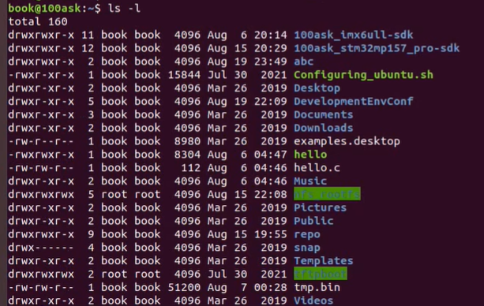

### 第二部分：硬链接数

- 对应数字：`2`, `11`, `1` 等。
- **<span style="color:#FF0000; border:1px solid #FF00FF;">对于文件</span>**：通常是 `1`，表示只有一个文件名指向这个数据。
- **<span style="color:#FF0000; border:1px solid #FF00FF;">对于目录</span>**：这个数字表示它下面有多少个子目录。注意，Linux里每个目录都有 `.` 和 `..` 两个隐藏目录，所以空目录的这个数字通常是 2。

<span style="color:#FF0000; background:#00FF80; border:1px solid #FF00FF; font-size:1.1em;">上面这里硬链接参数部分我有点看不太懂，你能够给我详细解释下吗，最好能够举个例子来让我彻底弄明白。</span>


这个问题问到了 Linux 文件系统的“骨架”原理。

硬链接数（Hard Link Count）确实比较抽象。为了让你彻底明白，我们别把它当成冷冰冰的数字，我们把它想象成<span style="background:#00FF80; border:1px solid #FF00FF;">**“抓着数据的绳子数量”**。</span>

在 Linux 中，<span style="background:#00FF80;">**数据（文件内容）**和**名字（文件名）**是分开存储的。</span>

- <span style="border:1px solid #FF00FF; color:#FF0000;">**硬链接数 = 有多少个文件名同时指向（抓着）这一块数据。**</span>

只要这根绳子的数量不为 0，数据就不会丢失。

我把**文件**和**目录**分开给你做实验演示，因为它们的逻辑不太一样。

### 一、 文件的硬链接数：通常是 1

#### 1. 为什么默认是 1？ 

当你创建一个文件 hello.c 时，你在磁盘上写了一段代码数据，并且在目录里建立了一个名字叫 hello.c 的索引指向它。

此时，只有 1 根绳子（文件名） 拴着这块数据。

所以，ls -l 显示的数字就是 1。

#### 2. 什么时候会变多？

如果你使用 <span style="background:#00FF80;">`ln` 命令（创建硬链接），给这块数据起了个“别名”</span>。

实验演示：

假设你有一个文件 a.txt。

Bash

```bash
$ touch a.txt
$ ls -l a.txt
-rw-r--r-- 1 book book 0 ... a.txt  <-- 此时是 1
```

现在，我给 `a.txt` 创建一个硬链接（别名）叫 `b.txt`：

Bash

```bash
$ ln a.txt b.txt
```

这意味着：我并不是复制了一份数据，而是<span style="border:1px solid #FF00FF;">**生成了第二根绳子**，也拴在了同一块数据上</span>。

此时你再看：

Bash

```bash
$ ls -l a.txt b.txt
-rw-r--r-- 2 book book 0 ... a.txt  <-- 变成 2 了！
-rw-r--r-- 2 book book 0 ... b.txt  <-- 也是 2！
```

**解释**：系统告诉你，<span style="background:#00FF80;">这块数据现在被 **2** 个名字引用着。你修改 `a.txt`，`b.txt` 也会变（因为它们是同一个本体）</span>。

#### 3. 什么时候变少？

<span style="color:#FF0000;">如果你删除了 `rm a.txt`，其实只是剪断了第一根绳子。硬链接数变成了 **1**。数据还在吗？**在！** 因为 `b.txt` 还拴着它。只有当硬链接数变成 **0** 时，系统才会真正回收这块磁盘空间。</span>

### 二、 目录的硬链接数：为什么空目录是 2？

目录的计算逻辑稍微有点绕，因为它涉及到 Linux 的**导航机制**。

**核心公式：**

> **目录的硬链接数 = 2 + (它的直属子目录数量)**

#### 1. 为什么空目录默认是 2？

假设你创建了一个空文件夹 `dir`。

Bash

```bash
$ mkdir dir
$ ls -ld dir
drwxr-xr-x 2 book book ... dir  <-- 居然是 2？
```

这 **2** 根绳子分别是谁？

1. **外部的绳子**：也就是<span style="color:#FF0000;">它的名字 `dir`（在父目录里指向它）。</span>
2. **内部的绳子**：**`.` (点)**。
   - 你进入 `dir` 后，输入 `ls -a`，会看到一个叫 `.` 的文件夹。
   - 在 Linux 中，**`<span style="background:#00FF80;">.` 代表“当前目录”</span>**。
   - 这就相当于 `dir` 自己肚子里有个名字指向了自己。

所以：**<span style="color:#FF0000; background:#00FF80; border:1px solid #FF00FF;">父目录里的名字 + 自己里面的 `.` = 2。</span>**

#### 2. 为什么有了子目录会增加？

现在，我们<span style="background:#00FF80;">在 `dir` 里面再创建一个子文件夹 `subdir`。</span>

Bash

```bash
$ cd dir
$ mkdir subdir
```

此时，你<span style="border:1px solid #FF00FF;">去外面看 `dir` 的硬链接数，会发现它变成了 **3**。</span>

**为什么增加了 1？是哪来的绳子？**

- 答案是：子目录里的 **`..` (点点)**。
- 你进入 `subdir`，输入 `ls -a`，会看到一个叫 `..` 的文件夹。
- 在 Linux 中，**`..` 代表“上一级目录”**。
- 既然 `subdir` 的上一级是 `dir`，那么这个 `..` 实际上就是指向 `dir` 的一根绳子！

#### 3. 彻底的例子图解

回到你上传的图片：

drwxr-xr-x 11 book book ... 100ask_imx6ull-sdk

这里的数字是 11。

我们可以直接通过数学倒推它的结构：

- **基础分**：2 分（它自己的名字 + 它里面的 `.`）。
- **子目录分**：11 - 2 = **9 分**。

**结论**：你可以百分之百确定，**`100ask_imx6ull-sdk` 这个目录下，一级子目录（直属文件夹）的数量正好是 9 个。**

你可以进去用命令验证一下：

Bash

```bash
cd 100ask_imx6ull-sdk
ls -l | grep "^d" | wc -l
# 输出结果一定是 9
```

### 总结

1. <span style="border:1px solid #FF00FF;">**对于文件**：数字代表**有几个文件名指向这块内容**。通常是 1，除非你手动做了硬链接。</span>
2. <span style="border:1px solid #FF00FF;">**对于目录**：数字代表**有多少个途径可以进入这个目录**</span>。
   - 1 个来自外面（父目录）。
   - 1 个来自里面（`cd .`）。
   - <span style="background:#00FF80; border:1px solid #FF00FF;">剩下的 N 个来自它下面的 N 个子目录（每个子目录里的 `cd ..` 都能回到这里）。</span>

这个解释配合公式，有没有让你觉得清晰一些？


## 提问 2 - 3 -（1）（当前目录 . 和上一级目录.. ）

<span style="color:#FF0000;">目录的硬链接数：为什么空目录是 2？</span>

<span style="color:#FF0000; background:#00FF80; border:1px solid #FF00FF; font-size:1.1em;">这里我还是不太懂，目录的硬链接数和当前目录.  上一级目录.. 的关系，你能够给我详细解释下吗，最好能够举个例子来让我彻底弄明白。</span>

这是一个非常抽象但逻辑极其严密的设计。要彻底搞懂这个问题，我们需要<span style="color:#FF0000;">把“目录”</span>想象成一个**实体对象（比如一个房间）**，把“硬链接”想象成**通向这个房间的“传送门”**。

<span style="background:#00FF80; border:1px solid #FF00FF;">**硬链接数 = 世界上总共有多少个传送门可以直达这个房间。**</span>

我们通过一个**连续的各种场景**来一步步推导。

------

### 场景一：刚刚创建一个空目录时

假设我们在 /home 目录下创建一个新目录叫 my_dir。

命令：mkdir my_dir

此时，<span style="border:1px solid #FF00FF;">Linux 就在硬盘上划了一块地盘给 my_dir（我们叫它房间A）</span>。

此时，<span style="color:#FF0000; background:#00FF80;">系统会自动建立两个通向房间A的传送门</span>：

1. <span style="color:#FF0000; background:#00FF80; border:1px solid #FF00FF;">**第一个传送门（名字叫 `my_dir`）**</span>：
   - **位置**：在<span style="border:1px solid #FF00FF;">它的**上级目录**（即父目录 `/home`）里</span>。
   - **作用**：你在 `/home` 下看到 `my_dir` 这个名字，其实就是一个指向**房间A**的入口。
   - *（这是<span style="color:#FF0000; background:#00FF80;">第 1 个硬链接</span>）*
2. **<span style="color:#FF0000; background:#00FF80; border:1px solid #FF00FF;">第二个传送门（名字叫 `.`）</span>**：
   - **位置**：在**<span style="border:1px solid #FF00FF;">房间A 的内部</span>**。
   - **作用**：<span style="color:#FF0000; background:#00FF80; border:1px solid #FF00FF;">Linux 规定，每个目录被创建时，肚子里必须自带一个叫 `.` 的东西。它代表“当前目录”，其实就是指向自己的一个回环入口。</span>
   - *（这是<span style="color:#FF0000; background:#00FF80;">第 2 个硬链接</span>）*

**结论**：此时<span style="color:#FF0000;">通向**房间A**</span>的<span style="color:#FF0000;">入口共有 2 个</span>。所以 `ls -ld my_dir` 显示硬链接数为 **2**。

------

### 场景二：<span style="background:#00FF80; border:1px solid #FF00FF;">在里面创建一个文件时（注意：不会增加！）</span>

我们在 my_dir 里创建一个文件 test.txt。

命令：touch my_dir/test.txt

- **变化**：我们在**房间A**里放了一张纸（文件）。
- **思考**：<span style="color:#FF0000;">这会增加通向**房间A**的传送门吗？</span>
- **答案**：<span style="background:#00FF80;">**不会！** 文件只是房间里的物品，它不是门。</span>

**结论**：<span style="background:#00FF80;">硬链接数依然是 **2**。普通文件不影响父目录的硬链接数。</span>

------

### 场景三：<span style="background:#00FF80; color:#FF0000;">在里面创建一个子目录时（关键变化！）</span>

我们在 my_dir 里创建一个子文件夹 child。

命令：mkdir my_dir/child

此时，<span style="color:#FF0000;">系统在硬盘上划了一块新地盘给 child（我们叫它房间B）。</span>

关键来了！<span style="color:#FF0000; background:#00FF80;">Linux 规定，每个新房间必须自带一个叫 .. 的传送门，指向它的上一级。</span>

让我们看看<span style="background:#00FF80; border:1px solid #FF00FF;">**房间A**（`my_dir`）现在多了哪个入口：</span>

1. 入口1：父目录里的 `my_dir`。（还在）
2. 入口2：自己肚子里的 `.`。（还在）
3. <span style="color:#FF0000; background:#00FF80;">**入口3（新增！）**：</span>
   - **来源**：**房间B**（`child`）肚子里的 **`..`**。
   - **位置**：<span style="background:#00FF80;">在子目录 `child` 内部。</span>
   - **原理**：<span style="color:#FF0000; background:#00FF80; border:1px solid #FF00FF;">你在 `child` 目录下输入 `cd ..` 会发生什么？你会回到 `my_dir`。这就说明 `child` 里面藏了一个指向 `my_dir` 的硬链接（传送门）。</span>

**结论**：<span style="border:1px solid #FF00FF;">因为多了一个子目录，子目录里的 `..` 指向了父目录，导致父目录（`my_dir`）的硬链接数变成了 **3**。</span>

------

### 场景四：如果再创建 10 个子目录？

如果你在 `my_dir` 下又创建了 `dir1`, `dir2` ... `dir10`。

- 每一个子目录内部，都会自动生成一个 `..` 指向 `my_dir`。
- 所以，`my_dir` 就又收到了 10 个来自子目录的“关注（指向）”。

**最终计算公式：**

> **目录的硬链接数 = 2 + (它里面的一级子目录数量)**

- **2** 的来源：父目录里的名字 + 自身的 `.`
- **增量** 的来源：每个子目录里的 `..`

### 图解总结

为了让你彻底看清，我画了一个简单的指向图：

Plaintext

```
硬盘上的对象：[ 目录 my_dir 的数据结构 (Inode) ]
                  ^         ^          ^
                  |         |          |
谁在指着它？      |         |          |
(硬链接来源)      |         |          |
                  |         |          |
        1. 父目录里    2. 它自己里    3. 子目录里
        的名字         面的 "."       面的 ".."
       (my_dir)        (.)           (..)
```

- **空目录时**：只有箭头 1 和 2 存在。所以是 **2**。
- **有子目录时**：每多一个子目录，就会多出一根像箭头 3 这样的线指过来。

这个解释配合“传送门”的比喻，能不能帮你彻底打通这个逻辑？


## 提问 2 - 4（ls -a 命令 与 隐藏目录 .  和  .. ）

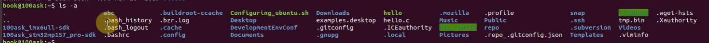

<span style="color:#FF0000; background:#00FF80; border:1px solid #FF00FF; font-size:1.1em;">这里的 ls -a 命令列出的前面带有 . 的是隐藏文件或隐藏文件夹把，为什么要隐藏呢，我不是太懂，你能够给我详细解释下吗，最好能够举个例子来让我彻底弄明白。</span>

你的观察非常准确！<span style="background:#00FF80; color:#FF0000;">在 Linux 中，只要文件或文件夹的名字是以 **`.` (点)** 开头的，它就是**隐藏文件**。</span>

这并不是为了“加密”或者“搞神秘”，它的核心目的只有一个：**<span style="color:#FF0000; border:1px solid #FF00FF;">为了让你眼不见为净（防止刷屏和误触）</span>。**

我用一个生活中的例子来解释，然后结合你图片里的具体文件来分析。

------

### 一、 生活中的例子：装修好的房子 vs. 管道井

想象一下你的家（也就是用户的家目录 `~`）：

1. 普通文件（不带点的）：

   就像你家客厅里的沙发、电视、桌子。

   - 这些是你每天都要用、都要看到的东西。
   - 当你执行 `ls` 时，你只想看到这些主要物品。

2. <span style="background:#00FF80;">隐藏文件（带点的）</span>：

   <span style="color:#FF0000; border:1px solid #FF00FF;">就像你家墙壁里的电线、水管，或者是角落里的配电箱。</span>

   - **它们重要吗？** 极其重要！没有电线你就没法看电视。
   - **你想天天看到吗？** 不想！它们露在外面既难看，又占地方。
   - <span style="color:#FF0000;">**什么时候才看？** </span>只有当你需要“维修”或者“改水电”的时候（也就是你需要修改配置的时候），你才会专门把盖板打开（使用 `ls -a`）去检查它们。

------

### 二、 <span style="color:#FF0000;">为什么要隐藏？（三个核心理由）</span>

#### 1. 保持界面整洁 (Decluttering)

Linux 的软件习惯把配置文件存放在用户的家目录下。

<span style="color:#FF0000;">如果不隐藏，你装了 50 个软件，家目录下就会多出 50 个配置文件。当你只想找你自己写的 hello.c 代码时，你需要在一堆 bashrc、viminfo、config 中扒拉半天。</span>

隐藏后：ls 只显示你真正关心的工作文件，清爽很多。

#### 2. 存放配置和数据 (Configuration)

这些带点的文件，几乎全都是配置文件。

每当你打开一个软件，或者打开终端，系统都会悄悄读取这些隐藏文件，来决定软件长什么样、字体多大、颜色是什么。

#### 3. 防止误删 (Safety)

普通的 rm * 命令（删除所有文件）通常不会删除隐藏文件。

这是一种保护机制。因为这些文件关系到系统的正常运行和你的个人设置，隐藏起来可以防止你手滑误删。

------

### 三、 结合你图片中的实例分析

来看看你图片 [image_a7a5b9.png] 里显示的这几个经典的隐藏文件，它们分别是干嘛的：

1. **`.bashrc`** (最著名的隐藏文件)
   - **作用**：这是 **Shell 的配置文件**。
   - **类比**：这就像是你电脑的“开机自启动设置”。
   - **详细**：每次你打开一个新的终端窗口，Linux 都会先偷偷读一遍这个文件。
     - 你想修改终端提示符颜色？改这里。
     - 你想设置快捷命令（alias）？改这里。
     - 你想配置环境变量（PATH）？也是改这里。
2. **`.ssh`** (文件夹)
   - **作用**：存放你的 **SSH 密钥**。
   - **类比**：这是你家的“保险柜”，里面放着通往服务器的钥匙。
   - **详细**：当你用 `ssh` 登录别的服务器时，系统会去这个隐藏文件夹里找钥匙。如果它不隐藏，万一你手滑把它删了，或者复制给别人了，那就麻烦了。
3. **`.cache`** (文件夹)
   - **作用**：存放软件运行时的**缓存垃圾**。
   - **详细**：浏览器缓存、缩略图缓存都在这。这些东西很大且杂乱，你绝对不想在日常列表中看到它。
4. **`.` 和 `..`**
   - 正如我们之前讨论的，这是目录结构的“锚点”，分别指向“当前目录”和“上一级目录”。

------

### 四、 <span style="color:#FF0000;">如何创建隐藏文件？</span>

在 Linux 里，隐藏文件没有任何高深的技术，纯粹是**名字决定的**。

例子：

<span style="background:#00FF80; border:1px solid #FF00FF;">假设你有一个秘密日记 diary.txt。</span>

1. 正常显示：

   ls -> 能看到 diary.txt。

2. **把它变隐藏**（<span style="color:#FF0000; background:#00FF80;">其实就是重命名，加个点</span>）：

   Bash

   ```bash
   mv diary.txt .diary.txt
   ```

3. **结果**：

   - 再输入 `ls` -> 找不到了（隐藏了）。
   - 输入 `ls -a` -> 又看到了 `.diary.txt`。

### 总结

- **带点 `.` 的文件** = **隐藏文件**。
- **目的**：**不是为了加密，而是为了整洁**。
- **本质**：它们通常是软件的**配置文件**（类似 Windows 里的 AppData 目录或者注册表配置）。
- **操作**：平时不用管它们，只有当你需要修改软件设置（比如配置环境变量）时，才需要用 `ls -a` 把它们找出来修改。


## 提问 2 - 5 （补充文件操作命令）

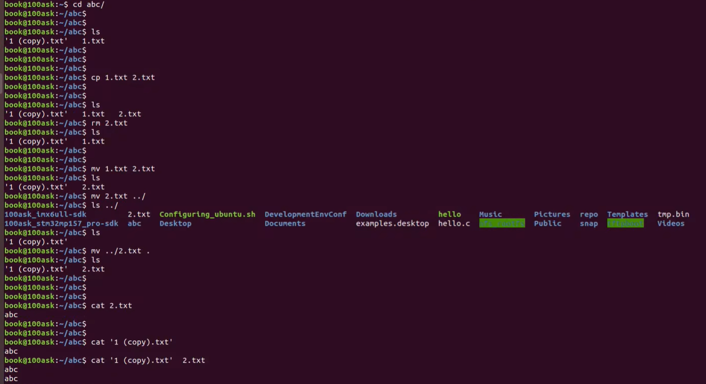

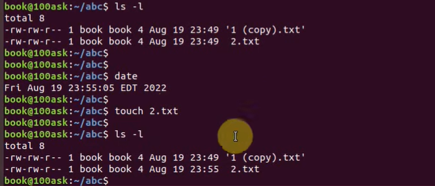

<span style="color:#FF0000; background:#00FF80; border:1px solid #FF00FF; font-size:1.1em;">将上述两张图片中的文件操作命令给我详细解释下，我要学习下。</span>

这两张图片非常详细地展示了 Linux 中最核心的文件操作命令流程。我把这两张图分为 **“时间戳修改实验”** 和 **“文件搬运与查看实验”** 来为你详细解读。

------

### 第一张图：`touch` 的隐藏功能（修改时间戳）

这张图主要演示了一个容易被忽略的知识点：`touch` 命令不仅仅是用来创建文件的，它还能用来**更新文件的时间**。

**操作步骤解析：**

1. **`ls -l`** (第1行)
   - 列出当前目录下的文件详情。
   - **重点观察**：此时 `2.txt` 的修改时间是 **23:49**。
2. **`date`**
   - 查看当前系统时间。显示现在是 **23:55:05**。
   - *说明系统时间已经比文件原本的时间晚了 6 分钟。*
3. **`touch 2.txt`** (关键步骤)
   - **通常用法**：如果 `2.txt` 不存在，它会创建一个空文件。
   - **高级用法（此处）**：因为 `2.txt` **已经存在**，所以 `touch` 的作用变成了**“摸一下”**这个文件，把它的**修改时间（Modify Time）**更新为当前系统时间。
4. **`ls -l`** (最后一行)
   - 再次查看详情。
   - **结果**：你会发现 `2.txt` 的时间已经变成了 **23:55**。而另一个文件 `'1 (copy).txt'` 没被摸过，时间依然停留在 23:49。

**总结**：在编译代码（如使用 `make`）时，系统往往根据文件的时间戳来判断文件是否被修改过。`touch` 可以用来“欺骗”系统，假装这个文件刚被改过。

------

### 第二张图：文件的“生老病死”与“搬家”

这张图是一个非常完整的操作流，演示了复制、删除、重命名、移动和查看内容。

**操作步骤解析：**

1. **`cd abc/`**
   - 进入 `abc` 目录。
2. **`cp 1.txt 2.txt`** (Copy)
   - **复制**命令。把 `1.txt` 的内容复制一份，起名叫 `2.txt`。
   - 此时目录下有：`1.txt` 和 `2.txt`（内容相同）。
3. **`rm 2.txt`** (Remove)
   - **删除**命令。把刚才生成的 `2.txt` 删掉了。
4. **`mv 1.txt 2.txt`** (Move/Rename)
   - **重命名**操作。<span style="background:#00FF80; border:1px solid #FF00FF; font-family:serif; color:#FF0000;">`mv` 的本意是移动，但如果原地移动，就是改名。</span>
   - 意思是：把 `1.txt` 这个文件“改名”为 `2.txt`。
   - *结果：`1.txt` 消失了，变成了 `2.txt`。*
5. **`mv 2.txt ../`** (Move to Parent)
   - **移动**操作。
   - `..` 代表**上一级目录**。
   - 意思是：<span style="color:#FF0000; background:#00FF80; border:1px solid #FF00FF;">把当前目录下的 `2.txt` 搬移到上一级目录去。</span>
6. **`ls ../`**
   - 查看上一级目录的内容，确认 `2.txt` 确实已经搬过去了。
7. **`mv ../2.txt .`** (Move back)
   - **移回来**。
   - `../2.txt`：指明源文件在上一级目录。
   - `.`：代表**当前目录**。
   - 意思是：把上一层的 `2.txt` 抓回来，放到我当前的位置。
8. **`cat 2.txt`** (Concatenate/View)
   - <span style="color:#FF0000; background:#00FF80; border:1px solid #FF00FF;">**查看内容**。在终端打印出 `2.txt` 里的文字。</span>
   - 输出内容为：`abc`。
9. **`cat '1 (copy).txt'`**
   - **查看带空格的文件**。
   - 注意：<span style="color:#FF0000; background:#00FF80; border:1px solid #FF00FF;">因为文件名里有空格和括号 `( )`，这些是 Shell 的特殊字符，所以文件名必须用**单引号** `' '` 包起来，否则系统会报错。</span>
10. **`cat '1 (copy).txt' 2.txt`**
    - **拼接查看**。
    - <span style="color:#FF0000; background:#00FF80; border:1px solid #FF00FF;">`cat` 可以一次接受多个文件参数。</span>
    - <span style="color:#FF0000; background:#00FF80; border:1px solid #FF00FF;">它会先打印第一个文件的内容 `abc`，紧接着打印第二个文件的内容 `abc`。</span>

### 学习总结

通过这两张图，你掌握了 Linux 文件管理的六大金刚：

1. **`ls -l`**：看详细信息（特别是时间）。

2. **`touch`**：更新时间戳（或新建）。

3. **`cp`**：复制。

4. **`rm`**：删除。

5. **`mv`**：移动（不同目录）或 重命名（同目录）。

6. **`cat`**：查看文件内容。

   

# 二、 针对嵌入式开发的内容扩展（硬核知识点）

视频讲的是“怎么用”，面试考的是“原理”和“特殊场景”。

#### 1. `ls -l` 看到的不仅仅是列表 (<span style="background:#00FF80; color:#FF0000;">文件类型与权限</span>)

在视频 11:41 处展示了 `ls -l` 的输出。在嵌入式中，你需要关注第一列的第一个字符：

- `-`：普通文件。
- `d`：目录。
- <span style="color:#FF0000; background:#00FF80;">**`c`：字符设备文件**</span> (Character Device)。<span style="color:#FF0000; background:#00FF80; border:1px solid #FF00FF;">嵌入式中经常操作的串口、GPIO通常表现为这种文件</span>（如 `/dev/ttyS0`）。
- <span style="color:#FF0000; background:#00FF80; border:1px solid #FF00FF;">**`b`：块设备文件** </span>(Block Device)。<span style="color:#FF0000; background:#00FF80; border:1px solid #FF00FF;">如硬盘、SD卡、Flash分区</span>（如 `/dev/mmcblk0`）。
- `l`：软链接 (Symbolic Link)。**BusyBox** 工具箱大量使用软链接指向同一个可执行程序以节省空间。

#### 2. `rm` 真的把文件删除了吗？(Inode 与 Dentry)

- **原理**：Linux文件系统将文件名（Dentry）和文件数据（Inode）分离。<span style="background:#00FF80; color:#FF0000;">`rm` 命令实际上是调用了 `unlink` 系统调用，删除了文件名与 Inode 的关联，并使 Inode 的链接数减 1。</span>
- **面试坑点**：如果一个文件正在被程序打开（写入日志中），你用 `rm` 删除了它，磁盘空间**不会**立即释放。只有当该文件的引用计数（Reference Count）降为 0（即进程关闭文件句柄）时，空间才会被文件系统回收。

#### 3.<span style="color:#FF0000; background:#00FF80; border:1px solid #FF00FF;"> 嵌入式中的“一切皆文件”</span>

<span style="color:#FF0000; background:#00FF80; border:1px solid #FF00FF;">视频中的 `cp` 和 `cat` 不仅能操作文本。</span>

- **烧录镜像**：你可以用 `cp image.bin /dev/sdb` <span style="background:#00FF80; border:1px solid #FF00FF;">将镜像直接写入 SD 卡设备</span>。
- <span style="color:#FF0000; background:#00FF80; border:1px solid #FF00FF;">**控制硬件**</span>：你可以用 `echo 1 > /sys/class/gpio/gpio10/value` 来<span style="color:#FF0000; background:#00FF80; border:1px solid #FF00FF;">点亮一个 LED 灯（这是文件操作命令在驱动控制层的应用）。</span>

#### 4. `mkdir -p` 的底层价值

在编写嵌入式 **Shell 脚本** 或 **Makefile** 时，`mkdir -p` 是标配。因为你不确定目标环境是否存在中间目录，使用 `-p` 可以保证脚本的健壮性，不会因为目录已存在报错，也不会因为父目录不存在而失败。


# 补充提问

## 提问1 

<span style="color:#FF0000; background:#00FF80; border:1px solid #FF00FF;">字符设备文件我要怎么区分呢，为什么说“嵌入式经常操作的串口，GPIO通常表现为这类文件”呢，我不是太懂，你能够给我详细解释下吗，在嵌入式中还有其他的表现成这类字符设备文件吗，给我补充分类总结下。</span>

这是一个非常深刻且直指嵌入式 Linux 核心的问题！你已经开始触碰到 Linux 驱动模型的本质了。

所谓“字符设备（Character Device）”，是 Linux 设备驱动中占比最大、最基础的一类。

我将分三步来回答你的问题：<span style="background:#00FF80;">**怎么看（区分）**、**为什么是（原理）**、**还有谁（分类总结）**</span>。

------

### 一、 怎么区分字符设备？（火眼金睛）

区分的方法极其简单，利用你刚刚学过的 `ls -l` 命令即可。

操作步骤：

<span style="color:#FF0000; background:#00FF80;">在开发板或 Linux 系统的终端中，输入：</span>

Bash

```
ls -l /dev/
```

<span style="background:#00FF80;">*(注：`/dev` 是 device 的缩写，Linux 下几乎所有的设备文件都住在这里)*</span>

观察结果：

看输出结果的第一列的第一个字符：

- **`c`**：代表 **Character Device (字符设备)**。
- **`b`**：代表 **Block Device (块设备)**。

**例子：**

Bash

```
crw-rw----  1 root dialout 4, 64 ... /dev/ttyS0  <-- 'c' 开头，这是串口，字符设备
brw-rw----  1 root disk    8,  0 ... /dev/sda    <-- 'b' 开头，这是硬盘，块设备
```

------

### 二、 <span style="color:#FF0000; background:#00FF80;">为什么说“串口、GPIO”是字符设备？</span>

要理解这个，你必须明白 **“字符（Character）” vs “块（Block）”** 的底层逻辑区别。

我们可以用 **“水管”** 和 **“书柜”** 来打比方。

#### 1. 字符设备 = 水管 (Stream)

- **核心特征**：<span style="color:#FF0000; border:1px solid #FF00FF;">**顺序性**、**数据流**</span>。
- **比方**：<span style="background:#00FF80;">数据像水流一样，一个字节接着一个字节流过去。</span>
  - 你不能说：<span style="color:#FF0000; background:#00FF80;">“我要喝水管里流出来的第 100 滴水，但我不要第 1-99 滴”。不行，你必须先让前 99 滴流过去，才能拿到第 100 滴。</span>
  - 它<span style="border:1px solid #FF00FF;">没有“存储”数据的能力，流过去就没了。</span>
- **为什么串口 (UART) 是字符设备？**
  - <span style="background:#00FF80;">串口通信就是一根线，电平高低跳变，数据 `1010101` 像排队一样发过来。</span>
  - <span style="border:1px solid #FF00FF;">你必须按顺序接收，不能“跳跃”读取。因此它是典型的字符设备。</span>
- **为什么 GPIO 是字符设备？**
  - GPIO（通用输入输出口）用来控制 LED 灯亮灭或读取按键。
  - <span style="background:#00FF80;">它的操作是**即时**的。你写一个“1”，灯亮；写一个“0”，灯灭。</span>
  - <span style="border:1px solid #FF00FF; background:#00FF80;">它不存数据，它只负责**传递**当前的控制信号。这种“即时控制、不可回退”的特性，被归类为字符设备。</span>

#### 2. 块设备 = 书柜 (Storage)

- **核心特征**：<span style="color:#FF0000; background:#00FF80;">**随机访问**、**大容量存储**。</span>
- **比方**：数据像书一样摆在柜子里。
  - 你<span style="background:#00FF80;">可以直接拿第 50 页的书，完全不需要经过第 1-49 页。</span>
  - 它是<span style="background:#00FF80;">用来“存”东西的。</span>
- **例子**：<span style="color:#FF0000; border:1px solid #FF00FF;">硬盘、U盘、SD卡。</span>

------

### 三、 嵌入式中还有哪些也是“字符设备”？（分类总结）

在嵌入式 Linux 中，**<span style="color:#FF0000; background:#00FF80; border:1px solid #FF00FF;">除了硬盘（SD卡/Flash）和网络接口外，剩下的 90% 的外设几乎都是字符设备。</span>**

为了方便你记忆，我把它们分成几大类：

#### 1. <span style="background:#00FF80;">人机交互类</span> (Input Subsystem)

- **文件形式**：`/dev/input/event0`, `/dev/input/mouse0`
- **设备**：
  - <span style="border:1px solid #FF00FF;">**鼠标/键盘**</span>：典型的按键流。
  - <span style="border:1px solid #FF00FF;">**触摸屏**</span>：你手指划过的轨迹，是一串连续的坐标数据流。
  - <span style="border:1px solid #FF00FF;">**按键**</span>：按下、弹起，也是时间序列上的事件。

#### 2. <span style="background:#00FF80;">通信总线类</span> (Bus Interfaces)

这些接口通常用来连接传感器。

- <span style="border:1px solid #FF00FF;">**I2C 总线**</span>：
  - **文件**：`/dev/i2c-0`, `/dev/i2c-1`
  - **场景**：<span style="background:#00FF80;">读取温度传感器、控制电源管理芯片</span>。<span style="color:#FF0000;">数据是一个字节一个字节传输的。</span>
- **<span style="border:1px solid #FF00FF;">SPI 总线</span>**：
  - **文件**：`/dev/spidev0.0`
  - **场景**：<span style="background:#00FF80;">连接 OLED 屏幕、高速传感器。</span>

#### 3. <span style="background:#00FF80;">显示与多媒体类</span> (Multimedia)

- **<span style="border:1px solid #FF00FF;">帧缓冲</span> (Framebuffer)**：
  - **文件**：`/dev/fb0`
  - **说明**：虽然它对应屏幕的一帧图像（像块内存），但在 Linux 驱动中，它被包装成了字符设备。你可以通过向这个文件“写数据”来直接让屏幕显示颜色。
- <span style="border:1px solid #FF00FF;">**摄像头**</span>：
  - **文件**：`/dev/video0`
  - **场景**：<span style="background:#00FF80;">视频流数据，显然是字符流。</span>
- <span style="border:1px solid #FF00FF;">**声卡 (Audio)**</span>：
  - **文件**：`/dev/snd/pcm...`, `/dev/dsp`
  - **场景**：<span style="background:#00FF80;">播放音乐时，音频数据像水流一样灌进去，不能卡顿。</span>

#### 4. <span style="background:#00FF80;">系统功能类</span> (System)

- <span style="border:1px solid #FF00FF;">**看门狗 (Watchdog)**</span>：
  - **文件**：`/dev/watchdog`
  - **场景**：<span style="background:#00FF80;">你每隔几秒向这个文件写入一个字符（喂狗），如果不写，系统就重启。这也是典型的顺序操作。</span>
- <span style="border:1px solid #FF00FF;">**实时时钟 (RTC)**</span>：
  - **文件**：`/dev/rtc0`
  - **场景**：<span style="background:#00FF80;">读取当前的时间。</span>

### 总结一张表

| **设备类型**  | **文件名示例 (/dev/)** | **ls -l 标志** | **为什么是字符设备？**                          |
| ------------- | ---------------------- | -------------- | ----------------------------------------------- |
| **串口**      | `ttyS0`, `ttyUSB0`     | **c**          | 数据按位传输，无法随机读写                      |
| **GPIO**      | `gpiochip0` (新版)     | **c**          | 实时控制信号，不存储数据                        |
| **触摸屏**    | `input/event0`         | **c**          | 坐标点按时间顺序上报                            |
| **I2C/SPI**   | `i2c-0`, `spidev0.0`   | **c**          | 字节流通信协议                                  |
| **声卡**      | `snd/pcm...`           | **c**          | 音频流数据，必须连续播放                        |
| **硬盘/SD卡** | `sda`, `mmcblk0`       | **b**          | **(特例: 块设备)** 数据以块存储，可随机跳跃读取 |

一句话记忆：

<span style="color:#FF0000; background:#00FF80; border:1px solid #FF00FF;">只要不是用来存文件（像 U 盘那样）的，不是网卡（网卡有专门的一套 socket 接口），剩下的控制类、传感类、通信类硬件，统统都是字符设备。</span>


# 三、 经典嵌入式面试题与回复（基于本视频内容）

以下问题由浅入深，旨在展示你对基础命令背后原理的理解。

#### Q1:<span style="color:#FF0000;"> Linux 中软链接（Symbolic Link）和硬链接（Hard Link）有什么区别？`rm` 删除它们会有什么不同结果？</span>

> **简洁回复：**
>
> - **软链接**类似 Windows 的快捷方式，<span style="background:#00FF80;">存储的是目标文件的路径。如果原文件被删，软链接失效（悬空）</span>。
> - **硬链接**是<span style="background:#00FF80;">同一个 Inode 的不同别名。删除原文件，硬链接依然可以访问数据，只有当指向该 Inode 的所有硬链接都被删除，数据才会被释放。</span>
> - <span style="color:#FF0000; background:#00FF80; border:1px solid #FF00FF;">`rm` 删除软链接只删除了链接文件本身；删除硬链接是减少引用计数。</span>


#### Q2: 我发现根文件系统空间不足，用 `ls -l` 查到一个 1GB 的大日志文件，我用 `rm` 删除了它，但 `df -h` 显示空间依然没有释放，为什么？如何解决？

> **简洁回复：**
>
> - **原因**：该文件正被某个进程打开（持有句柄）。`rm` 只是删除了目录项，但 Inode 引用计数不为 0，文件系统认为文件仍在使用，未回收 Block。
> - **解决**：找到占用该文件的进程（使用 `lsof | grep deleted`），重启该进程或向其发送信号让其关闭文件。
> - **替代方案**：如果不便重启进程，可以使用 `> bigfile.log` 或 `cp /dev/null bigfile.log` 清空文件内容，而不是删除它。


#### Q3: `ls` 命令显示的颜色代表什么？（例如蓝色、绿色、红色）

> 简洁回复：
>
> 颜色由 LS_COLORS 环境变量定义，通常默认配置为：
>
> - **蓝色**：目录。
> - **绿色**：可执行文件。
> - **青色**：软链接。
> - **红色**：压缩包。
> - **黄色**（或黑底黄字）：字符设备或管道文件。
> - 这对快速识别 `/dev` 下的设备类型很有帮助。


#### Q4: 在嵌入式系统（如 BusyBox 环境）中，`rm -rf` 也是万能的吗？

> 简洁回复：
>
> 基本通用，但需注意：
>
> 1. BusyBox 的 `rm` 是精简版，某些生僻参数可能不支持。
> 2. 对于特殊文件系统（如只读文件系统 SquashFS），`rm` 会失败。
> 3. **核心点**：`rm -rf /` 在某些保护机制下可能被拒绝，或者在某些极简嵌入式系统中，根目录是在 RAM 中的（initramfs），重启后删除操作会复原。


#### Q5: 如何不使用编辑器（如 vi），快速创建一个包含 "Hello World" 内容的文件？

> 简洁回复：
>
> 使用重定向命令。
>
> echo "Hello World" > test.txt
>
> 或者使用 cat：
>
> cat > test.txt，输入内容后按 Ctrl+D 结束。
>
> 这在嵌入式调试串口卡顿或没有完整编辑器时非常有用。


### 下一步建议

您正在准备嵌入式面试，这个视频主要讲的是**用户空间**的基础命令。建议您在掌握这些的基础上，下一步重点复习：

1. **文件权限管理**：`chmod`, `chown`（视频中 `ls -l` 里看到的 `rwx` 具体指什么，如何修改）。
2. **查找命令**：`find`, `grep`（在海量源码或日志中定位问题）。

需要我对这两个方向进行针对性的面试题补充吗？
