这份视频教程主要讲解了Linux系统中文件权限与属性的核心概念及其操作命令，这对于嵌入式开发（尤其是涉及文件系统构建、驱动加载、脚本执行时）是非常基础且重要的内容。

以下是针对该视频内容的详细总结、嵌入式方向的扩展知识，以及为你准备的面试突击题。

# 一、 视频内容详细总结 (带时间点)

- **00:00 - 01:10：查看文件属性**

  

  - 使用 `ls -l` 命令查看文件的详细信息。
  - 不仅能看到文件名，还能看到文件类型、权限、所有者、所属组、大小和修改时间。

- **01:11 - 03:10：解读文件权限位**

  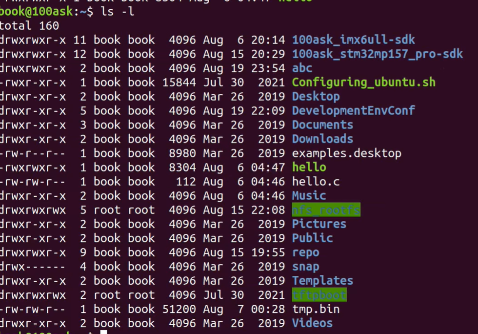

  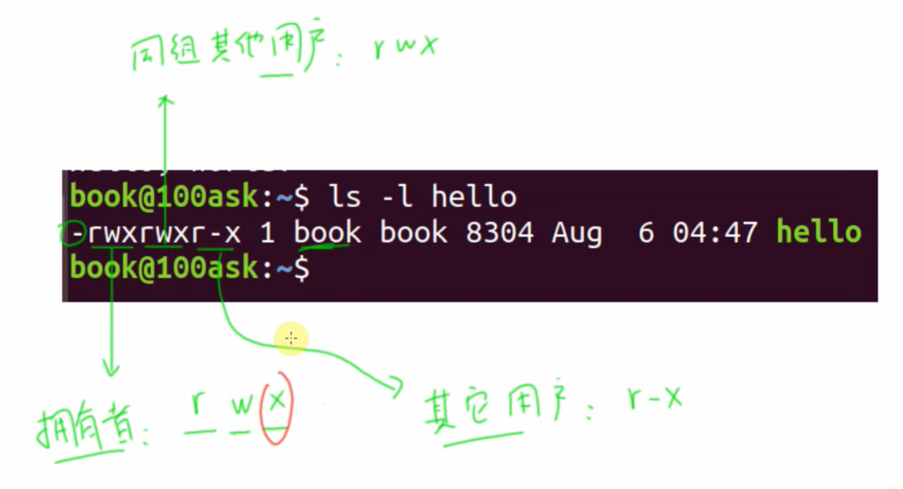

  - **文件类型（第1位）：** `-` 代表普通文件，`d` 代表目录（Directory）。
  - **权限分组（后9位）：** 分为三组，每组3位，分别代表 **所有者 (Owner/User)**、**所属组 (Group)**、**其他用户 (Others)**。
  - **权限符号：** `r` (Read, 读)、`w` (Write, 写)、`x` (Execute, 执行)。`-` 表示无此权限。

- **03:11 - 06:00：`chmod` 数字法修改权限**

  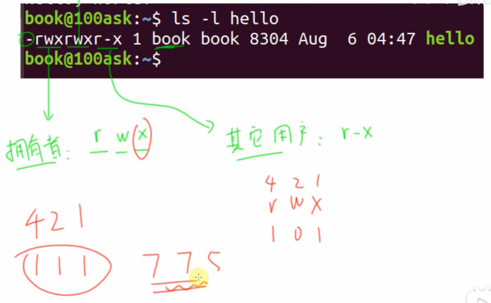

  - **8进制表示法：** `r=4`, `w=2`, `x=1`。

  - 例如：`rwx` = 4+2+1 = 7；`r-x` = 4+0+1 = 5。

  - **常用命令：** `chmod 777 filename` (所有人都满权限)，`chmod 644 filename` (常见配置文件权限)。

  - 演示了如果脚本没有 `x` 权限，执行时会报 "Permission denied"。

    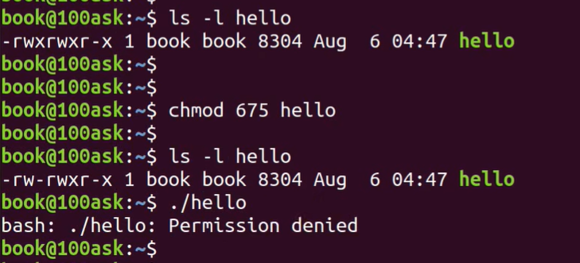

​							<span style="color:#FF0000; background:#00FF80; border:1px solid #FF00FF;">	补充：临时通过sudo切换为root用户，root用户作为其他用户对于hello这个文件是有x权限的，下面演								示的可以执行。</span>

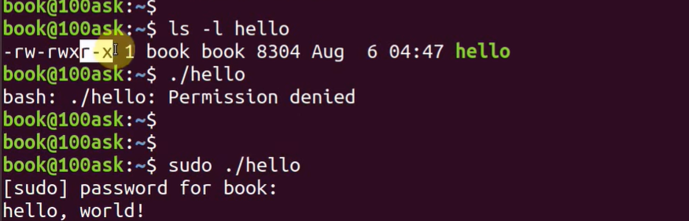

- **06:01 - 07:04：`chmod` 符号法修改权限**<span style="color:#FF0000; background:#00FF80; border:1px solid #FF00FF;">（补充：change mod 的缩写为 chmod）</span>

  - 使用 `u` (user), `g` (group), `o` (others), `a` (all) 配合 `+` (增加), `-` (减少)。

    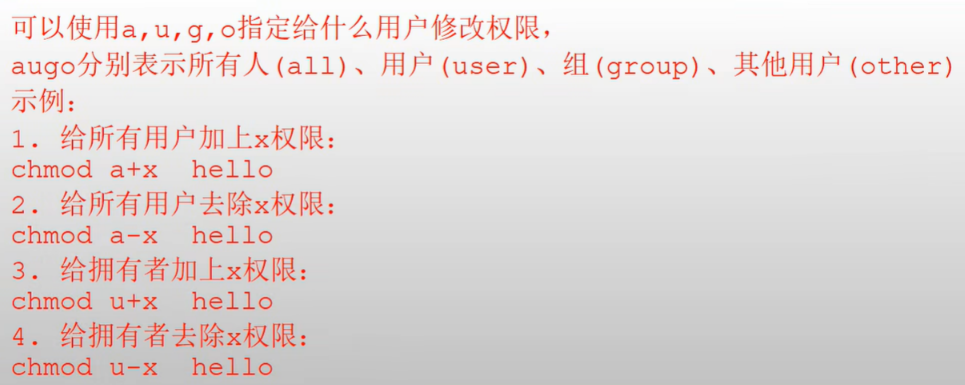

  - **常用命令：** `chmod +x filename` (给所有人增加执行权限)，`chmod -x filename` (去掉执行权限)。

    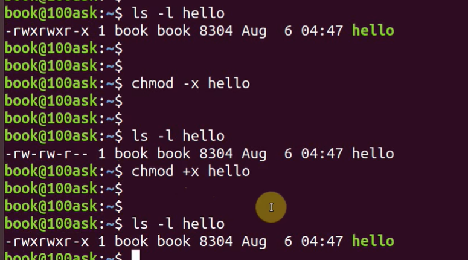

- **07:05 - 09:00：目录权限与递归修改**

  - <span style="color:#FF0000; background:#00FF80; border:1px solid #FF00FF;">查看目录本身的权限需要用 `ls -ld`。</span>

    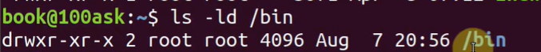

  - **递归修改：** 使用 `chmod -R` 可以修改目录及其内部所有文件的权限（非常危险，需谨慎使用）。

  - 提及了环境变量 `PATH`，解释了为什么 `/bin` 下的程序可以直接运行。<span style="color:#FF0000; background:#00FF80; border:1px solid #FF00FF;">（PATH环境变量可以使得直接在终端中输入hello就可以执行）</span>

    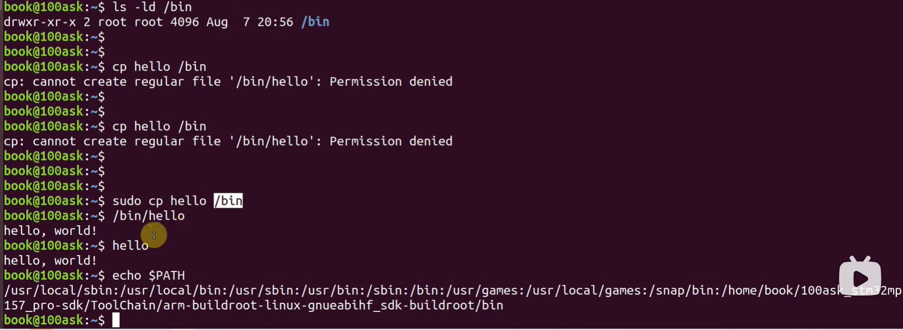

- **09:01 - 11:10：修改所有者 `chown` 与 所属组 `chgrp`**

  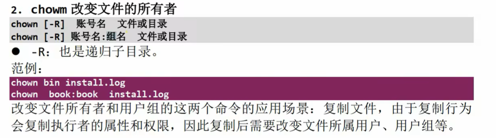

  - **chown (Change Owner)：** `sudo chown root filename` 把文件所有者改为root。

  - **chgrp (Change Group)：** 修改文件所属组。

  - <span style="color:#FF0000; background:#00FF80; border:1px solid #FF00FF;">强调了普通用户不能随意将文件所有权改为 root，必须使用 `sudo` 提权</span>。

    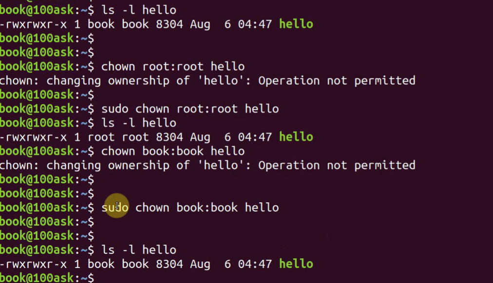

- **11:11 - 结尾：Root 用户与 `sudo`**

  - <span style="color:#FF0000; background:#00FF80; border:1px solid #FF00FF;">Ubuntu默认不通过 root 登录，而是使用 `sudo` 临时获取超级用户权限，这是为了系统安全。</span>

  - 如何切换用户：`su root` (切换到root)，`su book` (切换回普通用户)。

  - 设置root密码：`sudo passwd root`。

    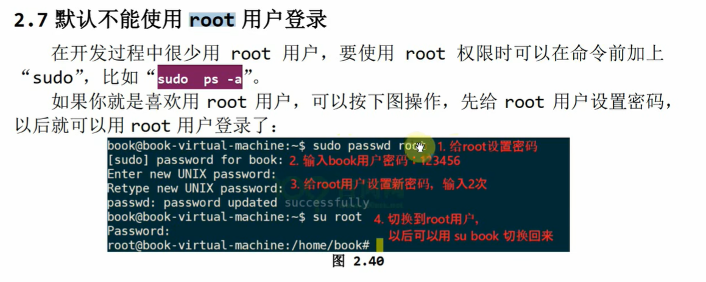

    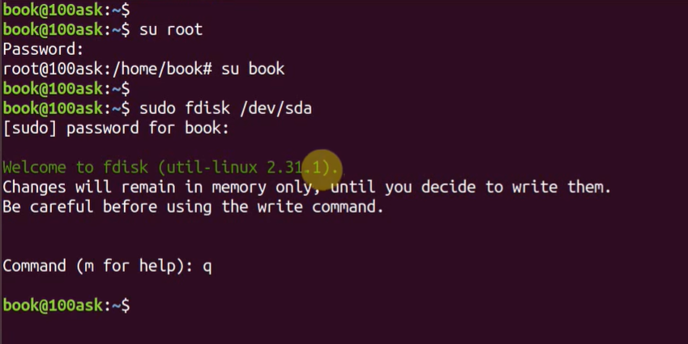

------

# 补充提问

## 提问1

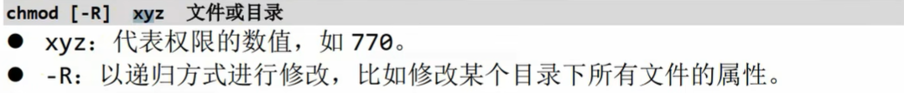

<span style="color:#FF0000; background:#00FF80; border:1px solid #FF00FF;">这里 -R 以递归方式修改是什么意思呢，这个-R只是针对目录的吗，我不是太懂，你能够给我详细解释下吗，最好能够举个例子来让我彻底弄明白。 </span>

这是一个非常好的问题！`-R` 是 Linux 命令中非常核心且常用的一个概念。

简单直接的回答：**`-R` 是 `Recursive`（递归）的缩写。它的意思就是“顺藤摸瓜，一改到底”。**

针对你的疑问，我分两部分来详细解释：

### 1. <span style="color:#FF0000;">什么是“以递归方式修改”？</span>

<span style="background:#00FF80;">想象一下，你有一个文件夹（目录），里面装着文件，还装着别的子文件夹，子文件夹里还有文件……就像是一个俄罗斯套娃，或者一棵树的树枝分叉。</span>

- <span style="color:#FF0000; border:1px solid #FF00FF;">如果不加 -R：</span>

  <span style="border:1px solid #FF00FF;">你使用的命令（比如 chmod 777 目录名）只会作用于这一个目录本身（也就是最外层的那个壳）。目录里面的文件、子目录里的文件，统统不会受到影响，它们的权限还是原来的样子。</span>

  > **比喻：** 就像你给房子的大门换了一把锁，但房子里每个房间的门锁并没有自动跟着变。

- <span style="background:#00FF80;">如果加了 -R：</span>

  <span style="border:1px solid #FF00FF;">命令不仅作用于这个目录本身，还会自动钻进这个目录，把里面所有的文件改了；如果遇到子目录，它会继续钻进去，把子目录里的文件也改了……直到把这个目录下所有层级的东西全部改完为止。</span>

  > **比喻：** 就像你用魔法棒点了一下房子，房子的大门、里面的房间门、柜子门、抽屉锁，所有的锁在一瞬间全部被换掉了。

### 2. <span style="color:#FF0000; border:1px solid #FF00FF;">这个 `-R` 只是针对目录的吗？</span>

<span style="background:#00FF80;">**是的，主要就是为了目录设计的。**</span>

- **针对文件：** <span style="color:#FF0000; background:#00FF80;">如果你对一个单独的文件（比如 `test.c`）使用 `-R`，虽然命令不会报错，但没有意义。因为文件里面不能再包含其他文件了，它没有“下一层”，所以就只改它自己。</span>
- **针对目录：** 这才是 `-R` 发挥作用的地方。它<span style="border:1px solid #FF00FF; color:#FF0000;">存在的意义就是为了批量处理目录内部深层的所有内容。</span>

------

### 举个例子彻底弄明白

假设你的电脑里有这样一个文件结构：

Plaintext

```
我的项目/  (这是一个目录，权限是 755)
├── main.c     (文件，权限是 644)
├── photo.jpg  (文件，权限是 644)
└── data/      (子目录，权限是 755)
    └── log.txt    (子目录里的文件，权限是 644)
```

场景一：你不使用 -R

你输入命令：chmod 777 MyProject

- **结果：** 只有最外层的“我的项目”这个目录变成了 777。
- 里面的 `main.c` 还是 644。
- 里面的 `data` 目录还是 755。
- **这就很尴尬**：虽然别人能进入你的大目录，但可能还是没法修改里面的代码文件。

场景二：你使用 -R (递归)

你输入命令：chmod -R 777 MyProject

- **结果：**
  1. `我的项目` 变成了 777。
  2. 命令自动进入内部，把 `main.c` 变成了 777。
  3. 把 `photo.jpg` 变成了 777。
  4. 命令发现有个 `data` 目录，把它变成 777。
  5. 命令**继续钻进** `data` 目录，把里面的 `log.txt` 也变成了 777。
- **彻底性：** 只要是在“我的项目”这个文件夹下面的东西，不管藏得有多深，全部被赋予了最高权限。

### 总结

- **`-R` (Recursive)** = **连带内部所有层级一起修改**。
- <span style="background:#00FF80;">在嵌入式开发或者 Linux 运维中，当你拷贝了一个整个文件夹（比如源代码包），发现里面所有文件都没权限操作时，用 `chmod -R` 是最快的解决办法。</span>

⚠️ 小心使用：

正因为 -R 威力巨大，千万不要随意对系统根目录使用，比如 sudo chmod -R 777 /，这会瞬间破坏整个系统的安全机制，导致系统崩溃或无法启动！只对你自己的用户文件（如 /home/book/ 下的文件）使用即可。


## 提问2

<span style="color:#FF0000; background:#00FF80; border:1px solid #FF00FF; font-size:1.1em;">chown 这个改变文件所有者的命令是必须切换成root执行吗，还是牵涉到修改的拥有者或者组名为root时才需要切换为root，其他情况下普通用户就可以执行chown这个命令，我不是太懂，你能够给我详细解释下吗，最好能够举个例子来让我彻底弄明白。</span>

这是一个非常核心的 Linux 权限管理问题。

简单直接的回答是：**<span style="color:#FF0000; background:#00FF80; border:1px solid #FF00FF;">在 Linux 系统中，普通用户（即使是文件的拥有者）通常不能将文件的所有权转让给其他人（无论是转给 root 还是转给另一个普通用户）。因此，执行 `chown` 修改文件所有者时，几乎总是需要 `root` 权限（使用 `sudo`）。</span>**

这个规则是为了系统安全。下面我为你详细解释为什么，并结合你提供的视频内容举例说明。

### 1. 核心规则：为什么普通用户不能随便用 `chown`？

你可能会觉得：“这是我自己的文件，我把它送给别人（改变所有者），为什么不行？”

Linux 的设计逻辑是防止**“恶意赠送”**和**“推卸责任”**：

1. 磁盘配额限制 (Disk Quota)：

   如果系统限制每个用户只能用 1GB 空间。如果允许普通用户随便 chown，我可以创建一个 100GB 的垃圾文件，然后 chown 给你。系统就会认为是你用了 100GB，导致你的磁盘空间爆满，而我却没事。

2. 安全隐患：

   <span style="background:#00FF80; border:1px solid #FF00FF;">如果我是一个黑客，我创建一个包含恶意代码的程序，然后把它 chown 给管理员（root）。虽然管理员不一定会运行它，但这会混淆审计日志，让人以为这个坏文件是管理员创建的。</span>

所以，Linux 规定：**<span style="color:#FF0000; border:1px solid #FF00FF;">只有拥有 `CAP_CHOWN` 能力的用户（通常就是 root）才能改变文件的所有者。</span>**

### 2. 结合视频内容的详细举例

根据你提供的视频内容，我们可以清晰地看到这个限制。

#### 场景一：普通用户试图把文件给 Root（失败）

在视频的 **09:41** 到 **09:58** 处：

- **当前身份：** 普通用户 `book`。
- **文件：** `hello`（所有者是 `book`）。
- **操作：** 用户输入 `chown root:root hello`，想把这个属于自己的文件送给 `root`。
- **结果：** 系统报错 `chown: changing ownership of 'hello': Operation not permitted`（操作不允许）。
- **原因：** 普通用户没有权限变更文件所有者，即使是把自己的文件给别人也不行。

#### 场景二：普通用户试图把文件给另一个普通用户（依然失败）

虽然视频中演示的是给 root，但在 Linux 中，假设你还有一个普通用户叫 `zhangsan`。

- **当前身份：** `book`
- **命令：** `chown zhangsan hello`
- **结果：** 依然会报错 `Operation not permitted`。
- **结论：** 只要涉及修改“所有者（Owner）”，普通用户自己是做不到的，**必须**加 `sudo`。

#### 场景三：必须使用 `sudo`（成功）

在视频的 **10:53** 处：

- **操作：** 用户在命令前加上了 `sudo`，即 `sudo chown book:book hello`（这里演示的是改回自己，或者是 root 改给普通用户）。
- **结果：** 命令执行成功，没有报错。
- **原因：** `sudo` 临时提升到了 root 权限，root 也就是超级管理员，它可以任意修改任何文件的归属。

### 3. 特例：修改“所属组” (`chgrp`)

虽然 `chown`（改变所有者）必须用 root，但改变**所属组**稍微宽松一点点，不过依然有限制：

- 如果你是文件的所有者，你可以把文件的**组**改成**你当前所在的另一个组**。

- 例子：

  假设用户 book 同时属于 groupA 和 groupB。

  - `chgrp groupB file.txt` -> **成功**（因为你在 groupB 里）。
  - `chgrp groupC file.txt` -> **失败**（因为你不在 groupC 里，不能随便把文件扔到一个你不认识的组）。

### 总结表

为了让你彻底弄明白，请看下表：

| **操作者身份**  | **文件当前所有者** | **命令内容**        | **结果** | **原因**                       |
| --------------- | ------------------ | ------------------- | -------- | ------------------------------ |
| 普通用户        | 自己 (book)        | `chown 其他人 file` | **失败** | 防止恶意占用他人磁盘配额。     |
| 普通用户        | 自己 (book)        | `chown root file`   | **失败** | 普通用户无法提升文件权限等级。 |
| 普通用户        | 别人               | `chown 自己 file`   | **失败** | 你不能去抢别人的文件。         |
| **Root (sudo)** | 任何人             | `chown 任何人 file` | **成功** | 超级管理员拥有一切权限。       |

一句话结论：

<span style="color:#FF0000; background:#00FF80;">是的，只要是用 chown 修改拥有者（Owner），无论改成谁，都需要 root 权限（使用 sudo），普通用户自己是改不动的。</span>


## 提问3


<span style="color:#FF0000; background:#00FF80; border:1px solid #FF00FF;">这张图片里面的 改变文件所有者和用户组的这两个命令的应用场景：复制文件，由于复制行为会复制执行者的属性和权限，因此复制后需要改变文件所属用户、用户组等。 这里我不是太理解，你能够给我详细解释下吗，最好能够举个例子来让我彻底弄明白。</span>

这是一个非常棒的问题！这句话确实有点抽象，但它描述的是 Linux 系统中一个非常底层的逻辑。

简单来说，这句话的意思是：<span style="background:#00FF80; color:#FF0000;">**谁干的活（执行复制命令），生出来的新文件就归谁管，而不是归原文件的原来的主人管。**</span>

为了让你彻底明白，我们分三步来解析：核心原理、实际场景（坑）、具体例子。

### 1. <span style="color:#FF0000; border:1px solid #FF00FF;">核心原理：什么叫“复制执行者的属性”？</span>

<span style="color:#FF0000; border:1px solid #FF00FF;">在 Linux 中，当你使用 `cp`（copy）命令复制一个文件时，系统并不认为你在“搬运”文件，而是认为你在**“新建”**一个文件。</span>

- **原来的文件：** <span style="border:1px solid #FF00FF;">是“原作者”创建的。</span>
- **新的副本：** <span style="border:1px solid #FF00FF;">是**你**（执行命令的人）刚刚创建的。</span>

因此，<span style="background:#00FF80;">Linux 规定：**新文件的所有者（Owner），默认就是执行 `cp` 命令的那个人。**</span>

### 2. 这个机制会带来什么“麻烦”？（应用场景）

这个机制在普通使用时没问题，但在**系统管理**或**嵌入式开发**中经常会是个“大坑”。

最常见的场景就是：

<span style="background:#00FF80; border:1px solid #FF00FF;">你需要以管理员（Root）的身份，帮一个普通用户（比如 book）把某个文件复制到他的目录下。</span>

1. 你是管理员，你用了 `sudo cp`。
2. <span style="background:#00FF80; border:1px solid #FF00FF;">因为是你（Root）执行的命令</span>，所以<span style="color:#FF0000;">新文件的主人变成了 **Root**</span>。
3. <span style="background:#00FF80; border:1px solid #FF00FF;">普通用户 `book` 回头想去修改这个在自己家目录下的文件，结果系统告诉他：**“你没权限！这文件是 Root 的！”**</span>
4. **解决办法：** <span style="color:#FF0000; border:1px solid #FF00FF;">你必须用 `chown` 把这个文件的名字改回给 `book`。</span>

### 3. 彻底弄明白的例子（图解版）

<span style="background:#00FF80; border:1px solid #FF00FF;">假设你有一个嵌入式开发板的用户叫 **`book`**。</span>

#### 第一阶段：准备文件

<span style="background:#00FF80; color:#FF0000;">管理员 **Root** 下载了一个配置文件 `wifi_config.txt`，这个文件目前在 `/root` 目录下，属于 Root。</span>

- 文件：`wifi_config.txt`
- 所有者：**Root**

#### 第二阶段：<span style="color:#FF0000;">复制文件（掉坑）</span>

现在，<span style="border:1px solid #FF00FF; background:#00FF80;">你需要把这个文件给用户 `book` 用。你以管理员身份执行了复制命令：</span>

Bash

```
sudo cp /root/wifi_config.txt /home/book/
```

**此时发生了什么？**

- **执行者：** 是 `sudo`（即 Root）。
- **新文件：** `/home/book/wifi_config.txt` 诞生了。
- <span style="background:#00FF80; border:1px solid #FF00FF;">**新文件的所有者：** 因为是 Root 生出来的，所以所有者是 **Root**（而不是 `book`）。</span>

#### 第三阶段：用户受阻

<span style="color:#FF0000; background:#00FF80;">用户 `book` 登录系统，开开心心地想去修改自己的 WiFi 配置：</span>

Bash

```
vi /home/book/wifi_config.txt
```

<span style="color:#FF0000; border:1px solid #FF00FF;">结果： 保存时报错 "Permission denied"（权限被拒绝）。</span>

<span style="background:#00FF80; border:1px solid #FF00FF;">虽然文件在他的地盘（/home/book），但文件的主人是 Root，book 作为平民，根本无权修改皇上的文件。</span>

#### 第四阶段：使用 `chown` 救场

这时候，图片里提到的应用场景就来了。<span style="color:#FF0000; background:#00FF80;">为了让 `book` 能用这个文件，你必须在复制后，执行“过户”手续：</span>

Bash

```
# 格式：chown 账号名:组名 文件
sudo chown book:book /home/book/wifi_config.txt
```

现在，文件的主人变成了 `book`，他终于可以自由修改了。

### 总结

图片中那句晦涩的话翻译成人话就是：

> <span style="color:#FF0000; background:#00FF80; border:1px solid #FF00FF;">**当你（特别是用 Root 身份）复制文件给别人时，文件的名字会变成你的（Root）。为了让别人能用，复制完之后，别忘了用 `chown` 把名字改回给那个人。**</span>

这在嵌入式开发中非常常见，比如你烧录文件系统或者拷贝驱动文件时，经常需要修正文件权限，否则程序运行起来就会报权限错误。


# 二、 针对嵌入式开发的扩展知识 (加分项)

视频讲的是基础操作，但在嵌入式面试中，面试官往往会考察更深层的理解：

<span style="color:#FF0000; border:1px solid #FF00FF;">**1. 目录的 `x` 权限不仅仅是“执行”**</span>

- **视频未细讲：** 对于文件，`x` 是执行；但<span style="background:#00FF80; border:1px solid #FF00FF;">对于**目录**，`x` 权限意味着**“进入权限” (Search permission)**。</span>
- **扩展：**<span style="color:#FF0000; background:#00FF80; border:1px solid #FF00FF;"> 如果你对一个目录有 `r` 权限但没有 `x` 权限，你可以 `ls` 看到里面的文件名，但无法 `cd` 进去，也无法查看文件里面的内容（即使你对该文件有读权限），更无法访问原本可访问的子目录。</span>

**2. 默认权限与 `umask`**

- **扩展：**<span style="color:#FF0000; background:#00FF80;"> 为什么创建一个文件默认是 664 或 644？这取决于 `umask` 值。</span>
- **公式：** `默认权限 = (最大权限) - umask`。
  - <span style="color:#FF0000; background:#00FF80;">文件最大权限是 666 (默认不给x)，目录是 777。</span>
  - 这是构建嵌入式根文件系统 (RootFS) 时常遇到的问题。

**3. 特殊权限位 (SUID, SGID, Sticky Bit)**（以后用到再看这个特殊权限位）

- **视频未讲：** <span style="font-family:serif; color:#FF0000; background:#00FF80;">`chmod` 其实可以接受4位数字，第一位就是特殊权限。</span>
- **SUID (4)：** `chmod 4755 file`。让普通用户执行该文件时，临时拥有**文件所有者**的权限。
  - *经典例子：* `/usr/bin/passwd` 命令。普通用户需要修改 `/etc/shadow` (root所有)，通过 SUID 实现。
- **Sticky Bit (1)：** 常用于 `/tmp` 目录，防止用户删除彼此的文件。

**4. 设备节点权限 (`/dev`)**

- **嵌入式场景：** 在嵌入式Linux中，操作硬件就是操作 `/dev` 下的文件。
- **问题：** 你的程序想读串口 `/dev/ttyUSB0`，但报错 "Permission denied"。
- **解决：** 粗暴做法是 `sudo chmod 777 /dev/ttyUSB0`；优雅做法是将当前用户加入 `dialout` 或 `tty` 组（利用组权限）。

**5. 脚本解释器 (Shebang)**

- **扩展：** 视频中脚本能执行是因为开头有 `#!/bin/bash` 或者作为参数传给了 shell。如果文件有 `x` 权限但开头没有指定解释器（Shebang），内核可能不知道怎么执行它。

------


# 补充提问

## 提问1

**嵌入式场景：** 在嵌入式Linux中，操作硬件就是操作 `/dev` 下的文件。
<span style="color:#FF0000; background:#00FF80; border:1px solid #FF00FF;">我对这句话不是太理解，你能够给我详细解释下吗，最好能够举个例子来让我彻底弄明白？</span>


这是一个非常经典且核心的嵌入式 Linux 概念，也被称为 **“一切皆文件” (Everything is a file)** 的设计哲学。

这句话的意思是：**<span style="color:#FF0000; background:#00FF80; border:1px solid #FF00FF;">Linux 操作系统把所有的硬件设备（LED灯、屏幕、串口、键盘、鼠标等）都抽象成了文件。应用程序不需要知道硬件底层的寄存器地址、时序和中断，只需要像读写普通 `txt` 文本文件一样，去读写 `/dev` 下对应的文件，就能控制硬件。</span>**

为了让你彻底弄明白，我分三个层面来解释，并给你一个最直观的例子。

### 1. 核心逻辑：<span style="border:1px solid #FF00FF;">从“写文件”到“亮灯”的旅程</span>

在<span style="background:#00FF80;">非 Linux 环境（比如单片机裸机开发）</span>中，你<span style="color:#FF0000;">想点亮一个 LED</span>，你需要<span style="border:1px solid #FF00FF;">在代码里直接操作内存地址（寄存器）</span>：

*GPIO_ODR = 0x01; // 向寄存器写1，输出高电平

但<span style="background:#00FF80;">在 **嵌入式 Linux** </span>中，<span style="border:1px solid #FF00FF;">应用程序通常**没有权限**直接访问物理内存地址</span>。那怎么办呢？<span style="background:#00FF80;">Linux 提供了一个中间人——**驱动程序**。</span>

1. **驱动程序** 会在 `/dev` 目录下生成一个文件，比如 `/dev/led`。
2. **应用程序** <span style="color:#FF0000; border:1px solid #FF00FF;">只需要向这个文件写入数据（比如写个字符 `'1'`）</span>。
3. **操作系统** 看到有人往文件里写数据了，就会通知**驱动程序**。
4. **驱动程序** <span style="border:1px solid #FF00FF; background:#00FF80;">收到数据 `'1'`，然后在内核态去操作底层的硬件寄存器。</span>
5. **硬件** 响应，LED 灯亮起。

### 2. 详细图解：<span style="color:#FF0000; background:#00FF80; border:1px solid #FF00FF;">操作硬件 = 操作文件</span>

| **动作**         | **普通文件操作 (test.txt)** | **硬件设备操作 (例如串口 /dev/ttyS0)**                  |
| ---------------- | --------------------------- | ------------------------------------------------------- |
| **Open (打开)**  | 打开硬盘上的一个数据块      | **初始化硬件** (开启时钟、配置波特率、上电)             |
| **Write (写)**   | 把数据存入磁盘              | **发送数据** (驱动把数据搬到发送寄存器，通过引脚发出去) |
| **Read (读)**    | 从磁盘读取数据              | **接收数据** (驱动从接收寄存器取回外部发来的数据)       |
| **Close (关闭)** | 释放文件句柄                | **关闭硬件** (断电或停止工作)                           |

### 3. 彻底弄懂的例子：点灯大师

假设你的嵌入式开发板上有一个 LED 灯，驱动工程师已经写好了驱动，对应的文件是 `/dev/my_led`。

#### 方式一：用命令行控制（最直观）

你不需要写一行 C 代码，直接在终端用命令就能操作硬件。

- 点亮 LED：

  <span style="background:#00FF80; color:#FF0000; border:1px solid #FF00FF;">你以为你在写文件，其实你在操作 GPIO。</span>

  Bash

  ```bash
  echo 1 > /dev/my_led
  ```

  *解释：<span style="color:#FF0000; background:#00FF80; border:1px solid #FF00FF;">把字符 '1' 写入文件。灯瞬间亮了。</span>*

- **熄灭 LED：**

  Bash

  ```bash
  echo 0 > /dev/my_led
  ```

  *解释：<span style="color:#FF0000; background:#00FF80; border:1px solid #FF00FF;">把字符 '0' 写入文件。灯灭了。</span>*

#### 方式二：<span style="background:#00FF80; border:1px solid #FF00FF;">用 C 语言编程控制</span>（面试常考）

在面试中，如果面试官问：“<span style="color:#FF0000; background:#00FF80; border:1px solid #FF00FF;">如何编写一个应用程序来控制蜂鸣器？”你的回答不应该是“操作寄存器”，而是“打开设备文件，写入控制指令</span>”。

C

```c
#include <stdio.h>
#include <fcntl.h>
#include <unistd.h>

int main() {
    // 1. 打开设备文件，就像打开一个普通 txt 一样
    // O_RDWR 表示可读可写
    int fd = open("/dev/my_led", O_RDWR);
    
    if (fd < 0) {
        printf("打开设备失败！\n");
        return -1;
    }

    // 2. 操作硬件：写入数据 '1'
    // 这一步执行后，驱动层会去拉高 GPIO 引脚电平
    write(fd, "1", 1); 
    printf("LED 应该亮了\n");
    
    sleep(2); // 让它亮 2 秒

    // 3. 操作硬件：写入数据 '0'
    // 这一步执行后，驱动层会去拉低 GPIO 引脚电平
    write(fd, "0", 1);
    printf("LED 应该灭了\n");

    // 4. 关闭设备
    close(fd);
    
    return 0;
}
```

### 4. 为什么要这样设计？（面试加分项）

如果你能答出这一点，面试官会觉得你很有深度：

**“为了统一接口（Uniform Interface）。”**

- <span style="color:#FF0000;">如果没有 `/dev` 这种抽象，每个硬件的操作接口都不同</span>：
  - 操作显卡要调用 `DrawPixel()`
  - 操作串口要调用 `SendByte()`
  - 操作硬盘要调用 `WriteSector()`
- **有了 `/dev` 抽象后：**
  - <span style="color:#FF0000; background:#00FF80; border:1px solid #FF00FF;">不管是显卡、串口、硬盘还是 LED，对于应用程序员来说，**统统只有 `open`, `read`, `write`, `close` 这几个标准函数**。</span>
  - 这极大地降低了应用程序开发的复杂度，实现了软件和硬件的解耦。

### 总结

“<span style="color:#FF0000; background:#00FF80; border:1px solid #FF00FF;">操作硬件就是操作 /dev 下的文件</span>” 意味着：

你<span style="color:#FF0000; background:#00FF80; border:1px solid #FF00FF;">把硬件当成一个文件，往里面写数据就是输出（控制硬件），从里面读数据就是输入（获取传感器数据）。所有的复杂工作（操作寄存器、中断处理）都由驱动程序默默替你完成了。</span>


## 提问2 

- **问题：** 你的程序想读串口 `/dev/ttyUSB0`，但报错 "Permission denied"。
- **解决：** 粗暴做法是 `sudo chmod 777 /dev/ttyUSB0`；优雅做法是将当前用户加入 `dialout` 或 `tty` 组（利用组权限）。

<span style="color:#FF0000; background:#00FF80; border:1px solid #FF00FF;">上面这个问题和解决方法我有点看不太懂，你能够给我详细解释下吗，最好能够举个例子来让我彻底弄明白。</span>


这是一个非常经典的 Linux 权限管理案例，也是嵌入式面试中考察你是否真正理解“Linux 权限机制”的试金石。

这句话的核心在于：**<span style="color:#FF0000; background:#00FF80; border:1px solid #FF00FF;">硬件设备（如串口）也是文件，它受到 Linux 文件权限系统的严格管控</span>。**

为了让你彻底弄明白，我们通过一个生动的**“公司打印机”**的例子来类比，并结合具体的命令来解释。

------

### 一、 场景还原：发生了什么？

假设在 Linux 系统中， `/dev/ttyUSB0` 就是一台**公司的高级打印机**。

1. 查看这台打印机的“使用规定”：

   我们<span style="background:#00FF80; border:1px solid #FF00FF;">在终端输入 ls -l /dev/ttyUSB0，通常会看到这样的结果：</span>

   Bash

   ```bash
   crw-rw---- 1 root dialout 188, 0 Jan 1 12:00 /dev/ttyUSB0
   ```

   我们来解读这行“天书”：

   - **拥有者 (Owner)：** `root` (老板)。权限是 `rw-` (老板可以用)。
   - **所属组 (Group)：** `dialout` (设备维护部)。权限是 `rw-` (这个部门的人可以用)。
   - **其他用户 (Others)：** `---` (其他所有员工)。权限是 **无** (根本不准碰)。

2. 你的身份：

   你<span style="border:1px solid #FF00FF;">现在的登录用户是 book (普通实习生)。你既不是老板 (root)，目前也不在设备维护部 (dialout 组) 里。</span>

3. 冲突爆发：

   <span style="color:#FF0000; border:1px solid #FF00FF; background:#00FF80;">你的程序试图去读写这台打印机。</span>

   系统保安（内核）一看：“你是 book，属于‘其他用户’，权限是 ---，禁止访问！”

   于是<span style="background:#00FF80;">抛出报错："Permission denied"。</span>

------

### 二、 粗暴做法：`sudo chmod 777`

这相当于你直接拿了一把锤子，把打印机房间的门锁给砸了。

- **命令：** `sudo chmod 777 /dev/ttyUSB0`
- **后果：** 文件的权限变成了 `rwxrwxrwx`。
  - 这意味着：<span style="background:#00FF80; border:1px solid #FF00FF;">老板能用，维护部能用，**连楼下的路人甲（任何用户）都能随便用**</span>。
- **为什么“粗暴”且“不好”？**
  1. **安全性差：** 任何恶意程序都可以读取你的串口数据或向串口乱发指令。
  2. **一次性：**<span style="background:#00FF80; border:1px solid #FF00FF;"> 在嵌入式 Linux 中，`/dev` 下的设备文件通常是动态生成的。当你把 USB 线拔掉再插上，或者重启开发板，系统会重新生成这个文件，权限又会变回默认的 `root:dialout`。你需要每次都砸一次锁，非常麻烦。</span>

------

### 三、 优雅做法：加入 `dialout` 组

这相当于你去找老板申请，把你加入“设备维护部”的名单里。

- 原理：

  <span style="background:#00FF80;">既然 /dev/ttyUSB0 属于 dialout 组，且该组拥有 rw (读写) 权限。那么，只要你（book 用户）加入了 dialout 这个组，你就自动继承了组的权限，可以合法地使用设备了</span>。

- **操作步骤：**

  1. **确认设备属于哪个组：**

     Bash

     ```bash
     ls -l /dev/ttyUSB0
     # 输出中通常显示组名为 dialout 或 tty
     ```

  2. **把自己加入那个组：**

     Bash

     ```bash
     # 这里的 $USER 是环境变量，代表当前用户(比如 book)
     # -aG 的意思是 append (追加) 到 Group (组)
     sudo usermod -aG dialout $USER
     ```

  3. 生效（关键）：

     <span style="color:#FF0000; border:1px solid #FF00FF;">修改组关系后，必须注销并重新登录（或者重启），新的身份才会生效。</span>

- **为什么“优雅”？**

  1. **安全：** <span style="border:1px solid #FF00FF;">你只给了这一个用户权限，其他无关用户依然无法访问。</span>
  2. **永久有效：** 无论你重启多少次，你始终是“设备维护部”的一员，插上设备就能直接用，无需每次都敲命令。

### 总结

- **Permission denied** 是因为你是“外人”，设备文件不让你碰。
- **chmod 777** 是把设备的门拆了，谁都能进（不安全，重启失效）。
- **加入 dialout 组** 是给了你一把钥匙，让你成为“自己人”（安全，永久有效，**面试推荐回答**）。


## 提问3

脚本解释器 (Shebang)**

- **扩展：** 视频中脚本能执行是因为开头有 `#!/bin/bash` 或者作为参数传给了 shell。如果文件有 `x` 权限但开头没有指定解释器（Shebang），内核可能不知道怎么执行它。

<span style="color:#FF0000; background:#00FF80; border:1px solid #FF00FF;">这里我有点看不太懂，你能够给我详细解释下吗，最好能够举个例子来让我彻底弄明白？</span>

这是一个非常底层且关键的 Linux 概念，也被称为 **Shebang**（发音类似“嘘-bang”）。在嵌入式开发和脚本编写中，理解这一点非常重要。

简单来说，**<span style="color:#FF0000; background:#00FF80; border:1px solid #FF00FF;">Shebang (`#!`) 就是贴在文件脑门上的一张便利贴，用来告诉系统：“请用哪个软件来打开我”。</span>**

为了让你彻底弄明白，我们分三步走：核心比喻、惨痛的失败例子（最直观）、以及底层的原理。

### 1. 核心比喻：外语说明书

想象你写了一张纸条（脚本文件），上面写的是 **C语言** 代码，或者是 **Python** 代码，或者是 **Shell** 命令。这时候<span style="border:1px solid #FF00FF; color:#FF0000;">你把这张纸条递给 Linux 内核（操作系统核心），说：“嘿，执行这个！”</span>

Linux 内核接过纸条一看：“这只是一堆文本啊，我怎么知道这是哪国语言？我该找谁来翻译？”

- **没有 Shebang：** 内核一脸懵<span style="border:1px solid #FF00FF; color:#FF0000;">，可能会把你手里的 **Python 代码** 丢给默认的 **Shell（命令行解释器）** 去执行。结果 Shell 看不懂 Python 语法，直接报错。</span>
- **有 Shebang (`#!/usr/bin/python3`)：**<span style="color:#FF0000; border:1px solid #FF00FF;"> 内核看到第一行，立马明白了：“哦！这张便利贴说要用 Python3 软件来运行。” 于是内核启动 Python3，把纸条塞给它，执行成功。</span>

### 2. 彻底弄懂的例子：Python 脚本的“车祸现场”

为了证明 Shebang 的重要性，我们用一个 **Python 脚本** 来举例，因为如果不用 Shebang，它在 Shell 下必死无疑。

#### 场景：你想运行一个 Python 脚本

假设你写了一个文件 `hello.py`，内容只有一行 Python 代码：

Python

```bash
print("Hello Embedded World")
```

然后你<span style="background:#00FF80;">赋予了它执行权限：</span>

<span style="color:#FF0000; border:1px solid #FF00FF;">chmod +x hello.py</span>

#### 情况一：没有 Shebang (车祸)

你直接运行它：

Bash

```bash
./hello.py
```

**结果：** 系统会报错！

Plaintext

```
./hello.py: line 1: syntax error near unexpected token `"Hello Embedded World"'
./hello.py: line 1: `print("Hello Embedded World")'
```

**为什么报错？**

1. 你<span style="border:1px solid #FF00FF;">告诉内核去“执行”这个文件</span>。
2. 内核发现<span style="background:#00FF80; border:1px solid #FF00FF;">文件开头没有 `#!`，不知道该叫谁来</span>。
3. 内核（或者当前的 Shell）只能死马当活马医，<span style="background:#00FF80; border:1px solid #FF00FF;">尝试**用默认的 Shell (Bash/Sh)** 来执行这行代码</span>。
4. <span style="border:1px solid #FF00FF; color:#FF0000;">Bash 根本不懂 `print(...)` 这种 Python 语法，它以为这是个奇怪的命令，于是报错“语法错误”</span>。

#### 情况二：加上 Shebang (成功)

现在，我们<span style="background:#00FF80; border:1px solid #FF00FF; color:#FF0000;">在文件**第一行**加上 Shebang：</span>

Python

```bash
#!/usr/bin/python3
print("Hello Embedded World")
```

再次运行：

Bash

```bash
./hello.py
```

**结果：** 输出 `Hello Embedded World`。

**发生了什么？**

1. 你输入 `./hello.py`。
2. 内核读取<span style="border:1px solid #FF00FF;">文件头两个字符，</span>发现是 <span style="color:#FF0000; background:#00FF80; border:1px solid #FF00FF;">`#!`</span>。
3. 内核紧接着<span style="border:1px solid #FF00FF; background:#00FF80;">读取后面的路径 `/usr/bin/python3`。</span>
4. 内核<span style="color:#FF0000; background:#00FF80; border:1px solid #FF00FF;">**自动**帮你把命令转换成了：`/usr/bin/python3 ./hello.py`。</span>
5. Python 解释器启动，完美理解代码。

### 3. 深入理解：两种执行方式的区别

这就解释了你提到的另一句话：“作为参数传给 shell”。

Linux 下执行脚本其实有两种完全不同的姿势：

- **姿势 A：直接执行（依赖 Shebang）**
  - 命令：`./script.sh`
  - 原理：<span style="border:1px solid #FF00FF; font-family:serif;">你需要 `x` (执行) 权限。内核通过读取文件第一行的 Shebang 来决定启动哪个解释器。**必须有 Shebang，否则容易乱套。**</span>
- **姿势 B：<span style="background:#00FF80;">作为参数执行（不需要 Shebang，甚至不需要 x 权限）</span>**
  - <span style="background:#00FF80; border:1px solid #FF00FF;">命令：`/bin/bash script.sh` 或者 `python3 script.py`</span>
  - 原理：你已经<span style="border:1px solid #FF00FF; background:#00FF80;">**显式地**指定了还要谁来干活（你直接叫了 bash 或 python）</span>。这时候，<span style="border:1px solid #FF00FF;">`script.sh` 只是在这个软件里打开的一个**纯文本文件**而已。</span>
  - **关键点：** <span style="border:1px solid #FF00FF;">这种情况下，系统根本不看文件里的 `#!` 这一行，也不检查文件有没有 `x` 权限（只要有 `r` 读权限就行）。</span>

### 总结

- **Shebang (`#!`)** 是给**内核**看的“指路牌”。
- 如果你想让脚本像一个**独立程序**一样直接运行（`./script.py`），你就**必须**写 Shebang，并给它 `x` 权限。
- 如果你总是手动指定解释器运行（`python script.py`），那 Shebang 写不写都无所谓。

面试加分项：

在嵌入式 Linux 中，由于 Shell 可能是精简版的 ash 或 sh 而不是完整的 bash，或者 Python 路径不在标准的 /usr/bin/ 下。为了通用性，我们有时候会用 #!/usr/bin/env python3，这会让系统自己在环境变量里找 python3 在哪里，防止因路径不同导致脚本无法执行。

# 三、 嵌入式面试常问问题 (及参考回复)

针对视频内容，以下是面试中可能遇到的“坑”和高分回答：

#### Q1: 请解释一下 `chmod 755` 和 `chmod 777` 的区别，为什么我们在嵌入式系统中尽量避免使用 777？

- **简洁回复：**
  - `755` (rwxr-xr-x) 表示所有者拥有读写执行权限，而组用户和其他用户只有读和执行权限。
  - `777` (rwxrwxrwx) 表示所有人（包括恶意程序）都可以随意修改或删除该文件。
  - **避免原因：** 777 存在极大的安全隐患。在嵌入式设备中，如果 CGI 脚本或配置文件是 777，可能会被黑客利用进行提权攻击或注入恶意代码，违反了“最小权限原则”。

#### Q2: 我对一个目录拥有“读(r)”权限，但我 `cd` 进去的时候提示“Permission denied”，这是为什么？

- **简洁回复：**
  - 因为对于目录而言，`r` 权限只允许列出目录下的文件名（`ls`），而进入目录需要的是 **`x` (执行/搜索)** 权限。
  - 若没有 `x` 权限，用户无法进入该目录，也无法读取该目录下文件的具体内容（即使对该文件有读权限）。

#### Q3: 既然 Root 用户权限最大，为什么我们在开发时不建议直接以 Root 身份登录，而是用 `sudo`？

- **简洁回复：**
  - **风险控制：** Root 没有任何限制，误操作（如 `rm -rf /`）可能瞬间导致系统崩溃且不可恢复。
  - **审计追踪：** 使用 `sudo` 会在日志（如 `/var/log/auth.log`）中留下操作记录，便于排查是谁在什么时间执行了敏感操作。

#### Q4: 如果我在嵌入式Linux板子上写了一个C程序 `hello`，通过 NFS 挂载过去，赋予了 `chmod +x hello`，但执行 `./hello` 时报错 "No such file or directory"（不是 Permission denied），这是什么原因？

- **简洁回复 (这是高频深坑题)：**
  - 这通常不是权限问题，而是**动态链接器**的问题。
  - 可能是编译时指定的动态链接库加载器（ld-linux.so）在目标板的 `/lib` 路径下不存在（例如架构不同，或者是用 glibc 编译的程序在 musl libc 的板子上运行）。

#### Q5: 如何不使用 root 权限，让一个普通用户的程序能够操作 GPIO 或者是开启 80 端口（1024以下端口）？

- **简洁回复：**
  - **方法一（操作硬件）：** 修改设备节点（如 `/dev/gpiomem`）的所属组，并将用户加入该组（推荐）。
  - **方法二（特殊位）：** 使用 `chmod u+s` (SUID) 让程序运行时拥有 root 权限（有风险）。
  - **方法三（Capabilities）：** 使用 `setcap` 命令给程序赋予特定的网络绑定能力 (`CAP_NET_BIND_SERVICE`)，而不需要完整的 root 权限。

下一步建议：

你已经掌握了权限的基本操作，接下来建议你实际操作一下：在虚拟机中创建一个新用户，尝试设置一个只有该用户能写、同组能读、其他人不可见的目录，以此巩固 chmod 和 chown 的组合使用。
