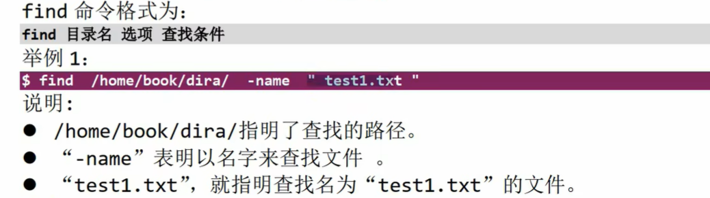
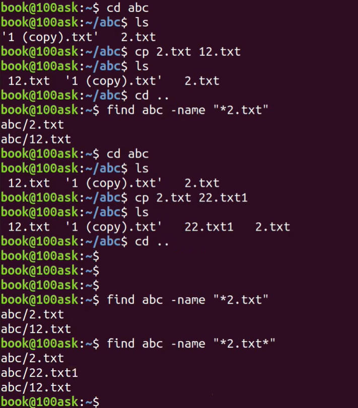
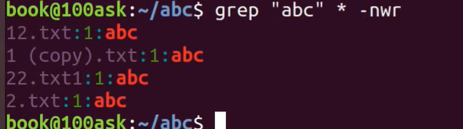
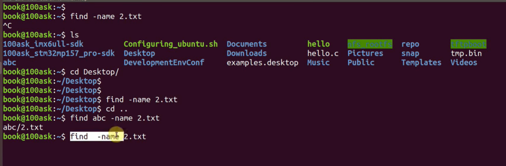
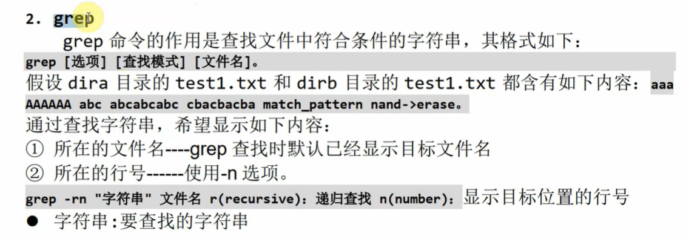
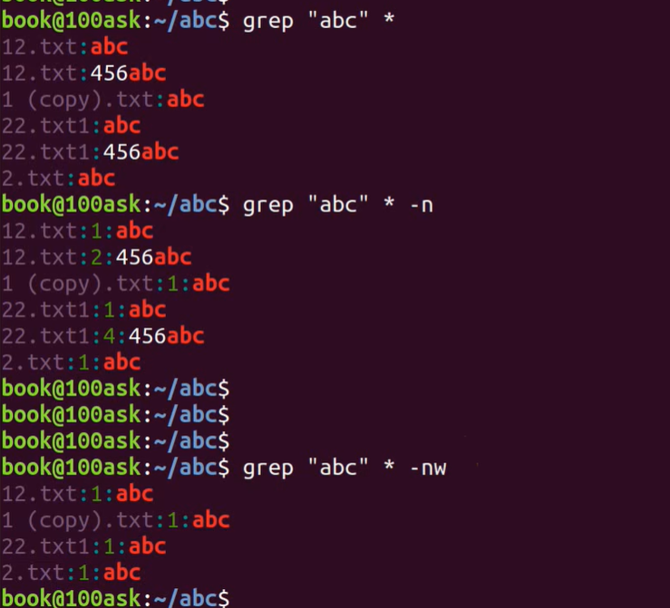

3‘6这是一个非常经典且实用的嵌入式 Linux 开发基础教程视频，主要讲解了两个开发中最常用的命令：`find`（查找文件）和 `grep`（查找内容）。对于嵌入式工程师来说，学会这两个命令是在庞大的 Linux 内核源码（Kernel）或 SDK 中“生存”的基本技能。

根据你的要求，我整理了视频内容摘要、扩展知识，并为你准备了针对嵌入式面试的经典问题。

# 一、 视频内容摘要与时间点

这个视频主要通过演示 `100ask` 虚拟机环境，讲解了如何在 Linux 命令行下高效查找资源。

- **00:00 - 01:29：`find` 命令基础**

  

  - **作用：** <span style="color:#FF0000; background:#00FF80; border:1px solid #FF00FF;">在指定目录下查找文件。</span>

  - **语法：** `find [目录] -name "文件名"`。

  - **演示：** 演示了不指定路径（<span style="border:1px solid #FF00FF; background:#00FF80;">默认当前路径</span>，速度慢）和指定路径（如 `abc` 目录）的区别。

    

- **01:30 - 03:49：`find` 进阶（通配符）**

  - **场景：** 当你<span style="color:#FF0000; background:#00FF80; border:1px solid #FF00FF;">不记得完整文件名，或者想查找某一类文件（如 `.txt`）时</span>。

  - **技巧：** 使用<span style="background:#00FF80; color:#FF0000; border:1px solid #FF00FF;">通配符 `*`</span>。

  - **演示：** 使用 `find abc -name "*2.txt"` 成功找出了 `2.txt`、`12.txt` 等文件。

    

- **03:50 - 05:14：`grep` 命令基础**

  

  - **作用：** <span style="color:#FF0000; background:#00FF80; border:1px solid #FF00FF;">查找文件**内容**</span>。不是找文件在哪里，而是找哪个文件里写了这行代码。

  - **场景：** 类似于 Windows 里的“文件内容搜索”。

    

- **05:15 - 06:27：`grep` 常用参数**

  - **`-n` (Line Number)：** <span style="border:1px solid #FF00FF;">显示内容所在的行号</span>。
  - **`-w` (Word)：**<span style="border:1px solid #FF00FF; background:#00FF80;"> 全字匹配（整词匹配）。例如搜 "abc" 时，不会匹配到 "123abc456"，只会匹配独立的 "abc"。</span>


- **06:28 - 07:20：嵌入式开发“杀手级”组合拳**

  - **组合命令：** `grep "字符串" * -nwr` (或 `-nwra`)。

  - **含义：** <span style="color:#FF0000; background:#00FF80; border:1px solid #FF00FF;">在当前目录及所有子目录（`-r`递归）中，查找包含指定字符串的文件，并显示行号（`-n`）且全字匹配（`-w`）。</span>

  - **重要性：** 这是阅读 Linux 驱动源码、查找函数定义最常用的方式。

    

------


# 补充提问

## 提问1



<span style="color:#FF0000; background:#00FF80; border:1px solid #FF00FF; font-size:1.2em;">结合着上面这张图片来给我详细解释下find命令的使用方法。</span>

这张图片非常直观地展示了 **`find` 命令在使用时的核心痛点和正确用法**，特别是在嵌入式开发环境（通常文件极多）中的表现。

结合图片中的操作步骤，我为您详细拆解 `find` 命令的执行逻辑：

### 1. 图片操作全解析

图片中展示了一个典型的“试错 -> 修正”过程，分为三个阶段：

#### **阶段一：漫无目的的查找（效率低，被中断）**

- **命令：** `find -name 2.txt`
- **发生了什么：**
  - <span style="border:1px solid #FF00FF;">用户在 `book@100ask:~$`（家目录）下直接输入命令。</span>
  - <span style="color:#FF0000; background:#00FF80; border:1px solid #FF00FF;">**没有指定路径**，`find` 默认在 **当前目录（.）** 及其所有子目录下递归查找</span>。
  - **问题点：** 注意看 `ls` 的结果，<span style="background:#00FF80; border:1px solid #FF00FF;">当前目录下有 `100ask_imx6ull-sdk` 和 `100ask_stm32mp157_pro-sdk`。嵌入式 SDK 通常包含几十万个小文件。在这么庞大的目录里“大海捞针”，速度极慢</span>。
  - **结果：** <span style="color:#FF0000; background:#00FF80; border:1px solid #FF00FF;">用户等不及了，使用了 `^C` (Ctrl+C) 强制结束了命令。</span>

#### **阶段二：错误的路径（查无此文件）**

- **命令：**
  1. `cd Desktop/` （进入桌面目录）
  2. `find -name 2.txt`
- **发生了什么：**
  - 用户<span style="background:#00FF80;">缩小了范围，进入了 `Desktop` 目录查找。</span>
  - 但是<span style="color:#FF0000; border:1px solid #FF00FF;"> `2.txt` 并不在桌面。</span>
  - **结果：** <span style="color:#FF0000; background:#00FF80; border:1px solid #FF00FF;">没有任何输出（Linux 中“没有消息就是坏消息”通常指报错，但这里是指没找到匹配项）。</span>

#### **阶段三：精准打击（成功查找）**

- **命令：**
  1. `cd ..` （退回家目录）
  2. `find abc -name 2.txt`
- **发生了什么：**
  - 这次用户学聪明了，<span style="background:#00FF80; border:1px solid #FF00FF;">**指定了搜索路径**为 `abc` 目录。</span>
  - 命令含义：*“<span style="background:#00FF80; border:1px solid #FF00FF;">请只在 abc 这个目录下帮我找名字叫 2.txt 的文件</span>”*。
  - 由于 `abc` 目录很小，系统瞬间完成了搜索。
  - **结果：** 输出了 `abc/2.txt`，找到了文件。

------

### 2. `find` 命令的核心语法总结

通过这张图，我们可以总结出 `find` 最标准的用法公式：

<span style="color:#FF0000; background:#00FF80; border:1px solid #FF00FF;">$find \quad [查找路径] \quad [查找条件] \quad [文件名/通配符]$</span>

- **查找路径（Path）：**
  - **省略时：** <span style="background:#00FF80;">默认为当前目录（`.`）</span>。
  - **指定时：** 如 `abc`、`/home`、`/etc`。**面试提示：** 尽量缩减路径范围以提高效率。
- **查找条件（Options）：**
  - `-name`：<span style="color:#FF0000; background:#00FF80; border:1px solid #FF00FF;">按文件名查找（最常用）</span>。
  - `-iname`：<span style="color:#FF0000; background:#00FF80; border:1px solid #FF00FF;">按文件名查找（忽略大小写，例如 `readme` 能搜到 `README`）。</span>
- **文件名（Pattern）：**
  - `2.txt`：<span style="color:#FF0000; background:#00FF80; border:1px solid #FF00FF;">精确匹配。</span>
  - `*2.txt`：<span style="color:#FF0000; background:#00FF80; border:1px solid #FF00FF;">模糊匹配（记得上一节视频里讲的通配符吗？）。</span>

------

### 3. 针对嵌入式面试的“画外音”

这张图虽然简单，但在面试中能引申出很好的技术点：

1. **为什么第一次查找卡住了？**
   - **回答方向：** 嵌入式 Linux 环境下，SDK（软件开发工具包）和内核源码（Kernel Source）非常庞大。在包含 SDK 的目录下不指定路径直接 `find`，会产生巨大的磁盘 I/O，导致终端假死。这体现了对**文件系统规模**的认知。
2. **如何改进第一次查找？**
   - **回答方向：** 如果我确实不知道文件在哪，但不想搜 SDK 目录，可以使用 `-prune` 参数排除目录，或者明确指定只搜 `src` 或 `abc` 等特定目录。

总结一句话：

这张图告诉我们，使用 find 命令时，“去哪里找（Path）”比“找什么（Name）”更重要，尤其是在代码量巨大的嵌入式开发服务器上。


## 提问 1 - 1（find命令默认递归，不需要加-r）

find . -name "stm32f10x.h"

<span style="background:#00FF80; color:#FF0000; border:1px solid #FF00FF;">这里find没有指定-r命令会在其目录中递归地进行查找吗，我不是太懂，你能够给我详细解释下吗，最好能够举个例子来让我彻底弄明白。</span>

这是一个非常经典的误区，很多初学者都会混淆。

直接回答你：**<span style="color:#FF0000; background:#00FF80; border:1px solid #FF00FF;">是的，`find` 命令默认就是递归的！你不仅不需要加 `-r`，而且加了反而会报错。</span>**

我来为你详细拆解这个“反直觉”的设计，并用一个生动的例子让你彻底明白。

### 一、 核心结论：`find` 天生就是“钻地龙”

- **`grep` / `cp` / `rm`**：<span style="color:#FF0000; background:#00FF80; border:1px solid #FF00FF;">这些命令原本是针对“单层文件”设计的。如果你想让它们处理文件夹，必须显式地加上 **`-r`** (recursive) 来告诉它们“请往下钻”。</span>
- **`find`**：它的**本职工作**就是<span style="color:#FF0000; background:#00FF80; border:1px solid #FF00FF;">“遍历目录树”。它的底层逻辑就是：“给我一个起点，我要把这下面所有的土都翻一遍”。</span>
  - **所以：** `find` **不需要** `-r`。
  - **甚至：** `find` 命令里根本没有 `-r` 这个选项。如果你输入 `find . -r ...`，系统会直接骂你：“`find: unknown predicate '-r'`（我不认识 -r 是个啥）”。

------

### 二、 图解 + 实例演示

为了让你彻底看懂，我们构造一个典型的嵌入式工程目录结构：

假设你的当前目录（`.`）是 `project`，结构如下：

Plaintext

```
project (当前目录 .)
├── main.c
├── readme.txt
└── drivers            <-- 子目录 (第一层)
    ├── uart.c
    └── include        <-- 孙目录 (第二层)
        └── stm32f10x.h  <-- 你要找的目标在这里！
```

#### 1. 执行命令

你站在 `project` 目录下，输入：

Bash

```
find . -name "stm32f10x.h"
```

#### 2. <span style="color:#FF0000; background:#00FF80; border:1px solid #FF00FF;">`find` 的执行过程（自动递归）</span>

`find` 会像贪吃蛇一样，自动把所有路走完：

1. **检查当前层**：看 `main.c`？不是。看 `readme.txt`？不是。
2. **发现目录 `drivers`**：**自动钻进去！**
   - 检查 `drivers/uart.c`？不是。
   - **发现目录 `drivers/include`**：**继续自动钻进去！**
     - 检查 `drivers/include/stm32f10x.h`？**是对上了！** -> **输出结果**。

#### 3. 输出结果

Bash

```bash
./drivers/include/stm32f10x.h
```

**结论：** 你什么额外参数都没加，它自己就钻到了最深那一层把你想要的文件挖出来了。

------

### 三、 既然默认递归，那我不想递归怎么办？

这才是面试中更高级的问题：“如果我只想在当前目录找，不想去子目录翻（为了节省时间），该怎么办？”

<span style="color:#FF0000; background:#00FF80; border:1px solid #FF00FF;">因为 `find` 天生递归，所以你必须用“紧箍咒”限制它钻得太深。你需要用到 **`-maxdepth`** 参数。</span>

#### 例子：

假设你只想在当前目录（`project` 层）找文件，不进 `drivers` 里面找：

Bash

```bash
find . -maxdepth 1 -name "stm32f10x.h"
```

- **`-maxdepth 1`**：意思是我只往下挖 **1 层**（也就是只看当前目录）。
- **结果**：此时如果当前目录下没有这个文件，它就不会去 `drivers` 里找，直接结束。

------

### 四、 总结对比（一张表彻底弄懂）

| **命令**   | **默认行为**                         | **想递归怎么办？**        | **想不递归怎么办？**     |
| ---------- | ------------------------------------ | ------------------------- | ------------------------ |
| **`grep`** | **只看指定的文件**，遇到目录就跳过。 | 必须加 **`-r`**           | 默认就是不递归的。       |
| **`cp`**   | **只复制文件**，遇到目录报错。       | 必须加 **`-r`**           | 默认就是不递归的。       |
| **`rm`**   | **只删除文件**，遇到目录报错。       | 必须加 **`-r`**           | 默认就是不递归的。       |
| **`find`** | **天生递归！** 一钻到底。            | **啥都不用加** (加了报错) | 必须加 **`-maxdepth 1`** |

**记忆口诀：**

- **`grep`** 是近视眼，不加眼镜（`-r`）看不远。
- **`find`** 是透视眼，天生就能看穿所有层级。


## 提问2（ 双引号 与 通配符）

 使用 `find abc -name "*2.txt"` 成功找出了 `2.txt`、`12.txt` 等文件
<span style="color:#FF0000; background:#00FF80; border:1px solid #FF00FF; font-weight:bold; font-size:1.2em;">这里我指定文件名的时候的什么时候需要双引号什么时候不需要呢，还有你能够将通配符的用法给我详细解释下吗，最好能够举个例子来让我彻底弄明白。</span>

这是一个非常敏锐且关键的问题！很多 Linux 初学者（甚至工作几年的工程师）都会在这里踩坑。

简单来说：**<span style="color:#FF0000; background:#00FF80; border:1px solid #FF00FF;">为了安全和准确，建议在使用 `find` 命令配合通配符时，永远加上双引号。</span>**

下面我为你详细拆解“为什么要加引号”以及“通配符到底怎么用”。

------

### 一、<span style="border:1px solid #FF00FF; color:#FF0000;"> 为什么 `find` 命令中建议加双引号？</span>

核心原因在于：**Linux 的终端（Shell）太“勤快”了。**

当你输入命令按下回车时，**Shell 会先尝试自己解析一遍通配符**，解析完之后，才会把处理过的结果扔给 `find` 命令。这往往会导致灾难。

#### 1. 举个“翻车”的例子

<span style="color:#FF0000; background:#00FF80;">假设你当前的目录下有两个文件：`1.txt` 和 `2.txt`。</span>

- 场景 A：<span style="border:1px solid #FF00FF; color:#FF0000;">你不加引号</span>

  你输入：find . -name *.txt

  1. Shell 抢答： 看到 *.txt，Shell 发现当前目录下正好有 1.txt 和 2.txt，于是它把命令自动替换（扩展）成了：

     find . -name 1.txt 2.txt

  2. **Find 懵了：**<span style="background:#00FF80; border:1px solid #FF00FF;"> `find` 命令收到了这个参数，它会报错：“参数错误，我只想要一个文件名，你后面跟的 `2.txt` 是个啥？”</span>

  3. **结果：** **<span style="border:1px solid #FF00FF; background:#00FF80;">报错失败</span>**。

- 场景 B：<span style="border:1px solid #FF00FF; color:#FF0000; background:#00FF80;">你加了引号</span>

  你输入：find . -name "*.txt"

  1. **Shell 闭嘴：**<span style="background:#00FF80; border:1px solid #FF00FF;"> 双引号告诉 Shell：“这里面的内容你别管，原封不动地传给 `find` 程序。”</span>
  2. **Find 开心：** <span style="border:1px solid #FF00FF; color:#FF0000;">`find` 收到了原汁原味的 `*.txt`，然后它自己去递归搜索所有目录，匹配符合这个规则的文件。</span>
  3. **结果：** **成功**。

#### **结论**

- **<span style="color:#FF0000; border:1px solid #FF00FF;">必须加引号</span>：** <span style="background:#00FF80; border:1px solid #FF00FF;">当你使用的通配符（`*`）在**当前目录下**能匹配到文件时，不加引号会报错。</span>
- **<span style="color:#FF0000; border:1px solid #FF00FF;">不加也没事的情况</span>：**<span style="background:#00FF80; border:1px solid #FF00FF;"> 如果当前目录下压根没有 `.txt` 文件，Shell 扩展失败，就会把 `*.txt` 原样扔给 `find`，此时能运行成功。</span>
- **<span style="color:#FF0000; border:1px solid #FF00FF;">最佳实践</span>：**<span style="color:#FF0000; background:#00FF80; border:1px solid #FF00FF;"> **为了防止“薛定谔的报错”，请养成好习惯，永远给文件名规则加上双引号 `""`。**</span>

------

### 二、 通配符（Wildcards）实战详解

通配符是 Shell 的“魔法棒”，用来模糊匹配文件名。在嵌入式开发中，我们<span style="color:#FF0000; background:#00FF80; border:1px solid #FF00FF;">最常用的有三种：`*`、`?`、`[]`。</span>

为了演示，假设我们有一个文件夹 `driver_test`，里面有以下文件：

- `a.c`
- `ab.c`
- `abc.c`
- `config.h`
- `driver_v1.ko`
- `driver_v2.ko`

#### 1. 星号 `*`：贪婪匹配（最常用）

- **含义：** <span style="color:#FF0000; background:#00FF80; border:1px solid #FF00FF;">代表**任意长度**的字符（包含 0 个字符）。即使什么都没有，它也能匹配。</span>
- **例子：**
  - `find . -name "*.c"`
    - **解释：** 找所有以此结尾的文件。
    - **结果：** `a.c`, `ab.c`, `abc.c`
  - `find . -name "a*.c"`
    - **解释：** 找以 `a` 开头，以 `.c` 结尾，中间随意。
    - **结果：** `a.c` (中间0字符), `ab.c`, `abc.c`
  - `find . -name "*v*.ko"`
    - **解释：** 只要文件名里包含 `v` 且是 `.ko` 结尾。
    - **结果：** `driver_v1.ko`, `driver_v2.ko`

#### 2. 问号 `?`：<span style="background:#00FF80; border:1px solid #FF00FF;">精准占位（一个萝卜一个坑）</span>

- **含义：** <span style="color:#FF0000; background:#00FF80; border:1px solid #FF00FF;">代表**仅仅 1 个**任意字符。多一个不行，少一个也不行。</span>
- **例子：**
  - `find . -name "?.c"`
    - **解释：**<span style="color:#FF0000; background:#00FF80; border:1px solid #FF00FF;"> 找文件名只有 1 个字符的 `.c` 文件。</span>
    - **结果：** `a.c`
    - *注意：* `ab.c` 不会被选中，因为它有两个字符。
  - `find . -name "??.c"`
    - **解释：** <span style="color:#FF0000; background:#00FF80; border:1px solid #FF00FF;">找文件名正好是 2 个字符的。</span>
    - **结果：** `ab.c`

#### 3. 中括号 `[]`：<span style="background:#00FF80; border:1px solid #FF00FF;">范围选择（点菜）</span>

- **含义：** <span style="color:#FF0000; background:#00FF80; border:1px solid #FF00FF;">匹配中括号内列出的**任意一个**字符。</span>
- **例子：**
  - `find . -name "driver_v[12].ko"`
    - **解释：**<span style="color:#FF0000; background:#00FF80; border:1px solid #FF00FF;"> 找 `driver_v` 后面跟着 `1` **或者** `2` 的文件。</span>
    - **结果：** `driver_v1.ko`, `driver_v2.ko`
    - *注意：* 如果有个 `driver_v3.ko`，它是不会被选中的。
  - `find . -name "[a-z].c"`
    - **解释：** <span style="color:#FF0000; background:#00FF80; border:1px solid #FF00FF;">找文件名是 1 个字符，且这个字符在 a 到 z 之间。</span>
    - **结果：** `a.c`

------

### 三、 嵌入式面试实战题（结合通配符）

面试官可能会问：<span style="color:#FF0000; border:1px solid #FF00FF; background:#00FF80;">“如果我要删除项目里所有的临时编译文件（通常是 `.o` 结尾），但我想保留 `main.o` 不删，命令怎么写？”</span>

这题在考察 `find` 的逻辑组合能力。<span style="border:1px solid #FF0000; background:#00FF80;">（补充：下面的 . 表示的是当前目录）</span>

**参考答案：**

Bash

```bash
find . -name "*.o" ! -name "main.o"
```

- **解析：**
  - `-name "*.o"`：<span style="color:#FF0000; background:#00FF80; border:1px solid #FF00FF;">先找出所有以 `.o` 结尾的文件（用到了 `*` 通配符和引号）。</span>
  - `! -name "main.o"`：<span style="color:#FF0000; background:#00FF80; border:1px solid #FF00FF;">这里的 `!` 是逻辑非，意思是“**排除**名字叫 `main.o` 的文件”。</span>

------

### 下一步的建议

现在你已经掌握了 `find` 的查找功能。在嵌入式面试中，**查找**通常是为了**后续的操作**。

要不要我给你演示一下 **`find` + `xargs` + `grep`** 这一套被称为“Linux 源码阅读三剑客”的组合拳？例如：“如何查找所有驱动代码中，哪里调用了 `printk` 函数？” 这在面试中出现的概率极高。


## 提问 2 - 1 （find + xargs + grep）

<span style="color:#FF0000; background:#00FF80; border:1px solid #FF0000; font-size:1.2em;">给我演示一下 find + xargs + grep 这一套被称为“Linux 源码阅读三剑客”的组合拳？例如：“如何查找所有驱动代码中，哪里调用了 printk 函数？”</span>

这套组合拳（`find` + `xargs` + `grep`）在嵌入式 Linux 开发中极其重要，尤其是在没有 IDE（如 VSCode、Source Insight）<span style="background:#00FF80; border:1px solid #FF0000; color:#FF0000;">只有终端的服务器环境（比如通过 SSH 连到编译服务器）时，它是你阅读和调试海量内核代码的唯一依靠。</span>

针对你的需求：<span style="color:#FF0000; border:1px solid #FF00FF; background:#00FF80;">“**查找所有驱动代码（drivers 目录）中，哪里调用了 printk 函数**”</span>，标准命令如下：

### 1. 核心命令演示

Bash

```bash
find drivers/ -name "*.c" | xargs grep -n "printk"
```

这条命令可以用<span style="border:1px solid #FF00FF;">人类语言</span>翻译为：

> <span style="border:1px solid #FF00FF; background:#00FF80;">“先去 `drivers/` 目录下把所有名字以 `.c` 结尾的文件都找出来，然后把这些文件名整理好，一股脑喂给 `grep` 命令，让 `grep` 去这些文件里搜 `printk`，并告诉我是在哪一行。”</span>

------

### 2. 庖丁解牛：为什么要这么组合？

<span style="color:#FF0000; border:1px solid #FF00FF;">这个命令通过管道符 `|` 连接了三个部分</span>，就像一个流水线。我们结合下面的流程图来理解：

#### **第一步：原材料获取 (`find`)**

- **命令：** `find drivers/ -name "*.c"`
- **作用：** 精准定位。
  - Linux 内核目录里有 `.c`, `.h`, `.o`, `.ko`, `.txt` 等各种文件。
  - 如果你直接搜，`grep` 可能会去搜二进制文件（`.o`），导致屏幕出现乱码。
  - 用 `find -name "*.c"` 确保我们**<span style="color:#FF0000; background:#00FF80; border:1px solid #FF00FF;">只在 C 源码文件中找</span>**，大大提高了效率和结果的纯净度。

#### **第二步：关键的转换器 (`xargs`)**

- **命令：** `xargs` (Construct argument list and execute utility)
- **痛点：**
  - <span style="background:#00FF80; border:1px solid #FF00FF;">`find` 输出的是一串**文本流**</span>（比如：`drivers/a.c drivers/b.c ...`）。
  - <span style="color:#FF0000;">但是 `grep` 命令不接受标准输入（stdin）作为**文件名参数**。如果你直接写 `find ... | grep "printk"`，`grep` 会傻傻地在“输入的文件名字符串”里找 printk，而不是去“文件内容”里找。</span>
- **作用：**
  - `xargs` 是一个**“喂料机”**。它<span style="border:1px solid #FF00FF; background:#00FF80;">读取管道传过来的文件名列表，把它们转换成 `grep` 可以理解的**命令行参数**。</span>
  - 它实际上帮你构建了这样一个命令：`grep -n "printk" drivers/a.c drivers/b.c drivers/c.c ...`

#### **第三步：执行搜索 (`grep`)**

- **命令：** `grep -n "printk"`
- **作用：**
  - `-n`：显示行号（Line Number）。这一点在看代码时至关重要，你得知道函数在哪一行。
  - `"printk"`：你要找的关键字。

------

### 3. 面试加分项：如何处理“怪异文件名”？

在面试中，如果你写出上面的命令，是 80 分。如果你能补充下面这一点，就是 100 分：

**面试官刁钻问题：**

> “如果我的文件名里带有**空格**（比如 `my driver.c`），你上面的命令会出什么问题？怎么解决？”

**你的满分回答：**

> “默认情况下，`xargs` 是以空格作为分隔符的。如果文件名里有空格，`xargs` 会把它误认为是两个文件。比如 `my driver.c` 会被拆成 `my` 和 `driver.c` 两个文件去搜，这肯定会报错。”
>
> <span style="color:#FF0000; background:#00FF80; border:1px solid #FF00FF;">**“解决方案是使用 `-print0` 和 `-0` 参数：”**</span>

Bash

```bash
find drivers/ -name "*.c" -print0 | xargs -0 grep -n "printk"
```

- **`find ... -print0`**：告诉 `find`，输出文件名时，后面不要加换行符，而是加一个 **null 字符（`\0`）**。
- **`xargs -0 ...`**：告诉 `xargs`，别用空格分开了，用 **null 字符**来切分文件名。
- 这样，即使文件名里有空格、换行等怪字符，也能被完美处理。这也是编写健壮 Shell 脚本的标准范式。

### 4. 总结与对比

虽然现在的 `grep` 也有递归搜索功能（`grep -r`），但在大型工程中，**`find + xargs + grep`** 依然是王者，原因如下：

| **命令**                                  | **特点**                           | **适用场景**                           |
| ----------------------------------------- | ---------------------------------- | -------------------------------------- |
| `grep -r "printk" drivers/`               | 简单粗暴，搜所有文件。             | 目录小，不在乎是否搜到了二进制文件时。 |
| `grep -r "printk" drivers/ --include=*.c` | 也能指定文件类型，现代 grep 支持。 | 快速查找，不需要复杂过滤时。           |
| **`find ...                               | xargs grep`**                      | **最灵活，控制力最强。**               |

针对你的嵌入式面试准备建议：

<span style="color:#FF0000; background:#00FF80; border:1px solid #FF00FF;">一定要亲手敲几遍 find . -name "*.c" -print0 | xargs -0 grep -n "main" 这样的命令，形成肌肉记忆。面试时能脱口而出 -print0 和 -0 的配合，绝对会让面试官眼前一亮。</span>


## 提问3



<span style="color:#FF0000; background:#00FF80; border:1px solid #FF00FF; font-size:1.2em;">结合这张图片给我详细解释下grep命令的用法，并且给我举个例子让我彻底弄明白。</span>

结合你提供的第一张图片（`image_cdbb85.jpg`），以及你在嵌入式开发中的实际需求，我来为你深度解析 `grep` 命令。

如果说 <span style="color:#FF0000; background:#00FF80; border:1px solid #FF00FF;">`find` 是用来**找文件在哪里**（比如“我的简历放哪了？”），那么 `grep` 就是用来**找文件里的内容**（比如“哪份简历里写了我会 C++？”）。</span>

------

### 一、 图片核心内容解读

根据第一张图片（文档截图），我们可以<span style="background:#00FF80; border:1px solid #FF00FF;">提取出 `grep` 最核心的公式：</span>

<span style="color:#FF0000; background:#00FF80; border:1px solid #FF00FF;">$grep \quad [选项] \quad [查找模式/关键词] \quad [文件名/目录]$</span>

图片中<span style="background:#00FF80; border:1px solid #FF00FF;">重点强调了嵌入式开发中最常用的两个参数组合 **`-rn`**</span>：

1. **`-r` (recursive，递归)**：
   - **图片解释：** “递归查找”。
   - **白话解释：** 不仅在当前目录找，还要去当前目录下的文件夹、文件夹里的文件夹……一层层钻下去找。
   - **场景：** 你的工程里有 `drivers`、`include`、`app` 等多个文件夹，你不知道代码在哪，必须用 `-r`。
2. **`-n` (number，行号)**：
   - **图片解释：** “显示目标位置的行号”。
   - **白话解释：**<span style="border:1px solid #FF00FF; color:#FF0000;"> 找到了关键词还不够，你得告诉我它在第几行，方便我直接打开编辑器跳转过去修改。</span>
   - **场景：** 调试代码时，必须知道报错的代码在第 100 行还是第 200 行。

------

### 二、 举个例子，让你彻底弄明白

为了让你有画面感，我们模拟一个嵌入式开发的场景。

#### 1. 假设环境

假设你现在的工程目录叫 `project`，结构如下：

- `main.c` (主程序)
- `drivers/` (驱动文件夹)
  - `uart.c` (串口驱动)
  - `gpio.c` (GPIO驱动)

这些文件里写满了代码，你现在**<span style="background:#00FF80;">想知道哪里调用了 `printf` 函数</span>**，以便查看打印信息。

#### 2. 只有 `grep` 不加参数（反面教材）

如果你只输入：`grep "printf" *`

- **结果：** 系统只会告诉你“`drivers` 是个目录”，然后跳过它。它<span style="color:#FF0000; border:1px solid #FF00FF;">只搜了 `main.c`，完全忽略了子文件夹里的代码。</span>这在大型项目中是灾难。

#### 3. 使用图片中的神器：`grep -rn`

你输入以下命令：

Bash

```bash
grep -rn "printf" .
```

- `grep`: 呼叫命令。
- `-r`: 给我钻进所有子文件夹里去找。
- `-n`: 找到后把行号打印出来。
- `"printf"`: <span style="border:1px solid #FF00FF; color:#FF0000;">我要找的内容（建议养成习惯加双引号，防止有空格）</span>。
- `.`: <span style="color:#FF0000; background:#00FF80; border:1px solid #FF00FF;">在当前目录下开始找（也可以换成 `*` 或者具体目录名）。</span>

#### 4. 输出结果详解

终端会吐出这样的内容（注意看格式）：

Plaintext

```bash
./main.c:15:    printf("System Init Start\n");
./drivers/uart.c:42:    printf("UART Driver Loaded\n");
./drivers/uart.c:88:    // TODO: remove this printf later
```

**我们来解剖第二行 ` ./drivers/uart.c:42:    printf("UART Driver Loaded\n");` ：**

| **部分**           | **含义**           | **对应的参数**       |
| ------------------ | ------------------ | -------------------- |
| `./drivers/uart.c` | **文件名**         | 默认显示             |
| `:42`              | **行号**           | **由 `-n` 参数带来** |
| `printf("UART..."` | **这行代码的内容** | 匹配到了 "printf"    |

------

### 三、 针对面试的“进阶扩展”

虽然图片里只讲了 `-rn`，但在面试中，为了显示你经验丰富，你可以补充两个常用参数：

1. **`-w` (Word，全字匹配)**
   - **场景：**<span style="border:1px solid #FF00FF; color:#FF0000;"> 你搜 `int`，但是不想把 `print`、`interrupt` 这种包含 "int" 的词也搜出来。</span>
   - **命令：** `grep -rnw "int" .`
   - **效果：** <span style="border:1px solid #FF00FF;">只匹配独立的单词 "int"。</span>
2. **`-i` (Ignore case，忽略大小写)**
   - **场景：** 你忘了变量名是 `Error` 还是 `error` 还是 `ERROR`。
   - **命令：** `grep -rni "error" .`
   - **效果：** 不管大小写，统统找出来。

### 总结

当你下次在 Linux 源码或 SDK 中迷路时，记住这张图片里的公式：

**“ grep -rn "我要找的内容" . ”**

这行命令就是你的“全能导航仪”。


## 提问 3 - 1（grep 选项 查找模式/关键词 文件名/目录）


<span style="color:#FF0000; background:#00FF80; border:1px solid #FF00FF; font-size:1.1em;">这个公式中 选项、查找模式/关键词、文件名/目录 具体指的是什么呢，你能够给我举些例子吗，还有这些顺序是可以任意调整的吗，其他的Linux命令也是这样可以随便调整的吗，我不是太懂，给我详细解释下，最好能够举些例子来让我彻底弄明白。</span>


这是一个非常棒的基础问题！对于初学者来说，Linux 命令行的语法就像学一门外语的“语法”一样，一开始觉得死板，掌握规律后发现其实很灵活。

结合你提供的图片，我们把这个公式像做菜一样拆解开来。

### 1. 拆解公式：这三样东西到底是啥？

你可以把 `grep` 命令想象成在**大楼里找人**：

- **`grep` (命令本身)** = 动作：“我要找人”。
- **`[选项]`** = 方式：“我要**详细地**找”、“我要**地毯式**地找”、“我要**只找穿红衣服**的人”。
- **`[查找模式/关键词]`** = 目标：“我要找 **张三**”。
- **`[文件名/目录]`** = 地点：“在 **A栋大楼** 里找”。

#### A. `[选项]` (Options) —— “怎么找？”

这是<span style="border:1px solid #FF00FF;">用来修饰命令行为的开关，通常以 `-` (减号) 开头。</span>

- **例子：**
  - `-n` (Line Number)：找到了顺便告诉我他在几楼（第几行）。
  - `-r` (Recursive)：A 栋大楼里的房间、柜子、抽屉都要翻一遍（递归查找子目录）。
  - `-i` (Ignore Case)：不管他是叫 "Andy" 还是 "andy" 还是 "ANDY"，都算同一个人（忽略大小写）。
  - **组合使用：** `-rn` (既递归，又显示行号)。

#### B. `[查找模式/关键词]` (Pattern) —— “找什么？”

这是你的核心搜索目标。

- **例子：**
  - `"main"`：找包含 main 单词的行。
  - `"printf"`：找包含 printf 的行。
  - `"error 404"`：找包含这个短语的行（**注意：如果有空格，必须加双引号**）。

#### C.<span style="color:#FF0000; background:#00FF80; border:1px solid #FF00FF;"> `[文件名/目录]` (File/Dir) —— “去哪找？”</span>

这是搜索的范围。

- **例子：**
  - `main.c`：只在这个文件里找。
  - `.` (点)：在**当前站立的地方**（当前目录）找。
  - `drivers/`：去 drivers 这个文件夹里找。
  - `*` (星号)：<span style="color:#FF0000; background:#00FF80; border:1px solid #FF00FF;">把这里所有的文件都找一遍。</span>

------

### 2. 实战举例：组合起来看

假设我们有一个文件 `test.c`，内容如下：

C

```c
int main() {
    printf("Hello World");
    return 0;
}
```

| **你的需求**         | **对应的命令 (公式套用)** | **解释**                                          |
| -------------------- | ------------------------- | ------------------------------------------------- |
| **最简单的找**       | `grep "main" test.c`      | 在 `test.c` 里找 `main`。                         |
| **显示行号**         | `grep -n "main" test.c`   | 选项 `-n` 加上了行号功能。                        |
| **忽略大小写找**     | `grep -i "HELLO" test.c`  | 选项 `-i` 让它能找到小写的 "Hello"。              |
| **在当前所有文件找** | `grep -r "return" .`      | 地点变成了 `.` (当前目录)，选项加了 `-r` (递归)。 |

------

### 3. <span style="color:#FF0000; background:#00FF80; border:1px solid #FF00FF;">顺序可以随便调整吗？（重点！）</span>

**结论：<span style="color:#FF0000; border:1px solid #FF00FF; background:#00FF80;">建议你死记硬背一种“标准顺序”，不要随便调。</span>**

虽然现在的 Linux (GNU 版本) 比较智能，允许你把 `[选项]` 乱放，但在嵌入式开发中（往往使用 BusyBox 等精简版 Linux），**顺序是非常严格的**。

#### **标准“语法”顺序（推荐，走遍天下都不怕）：**

> **命令  ->  选项  ->  目标内容(关键词)  ->  查找地点(文件名)**

$$grep \quad -rn \quad "printf" \quad .$$

#### **如果你乱调整会发生什么？**

1. <span style="color:#FF0000; border:1px solid #FF00FF;">**能不能把 `[选项]` 放在最后？**</span>
   - 命令：`grep "printf" . -rn`
   - **结果：**<span style="color:#FF0000; border:1px solid #FF00FF;"> 在电脑上的 Ubuntu 可能行得通（因为它聪明），但在嵌入式板子上大概率会**报错**，或者它把 `-rn` 当作了文件名去搜索。</span>
   - **建议：**<span style="color:#FF0000; background:#00FF80; border:1px solid #FF00FF;"> **永远把选项 `-rn` 放在最前面。**</span>
2. <span style="color:#FF0000; border:1px solid #FF00FF;">**能不能交换 `[关键词]` 和 `[文件名]`？**</span>
   - 命令：`grep . "printf"`
   - **结果：**<span style="background:#00FF80;"> **绝对不行！灾难！**</span>
   - **原因：** `grep` 非常死板，它默认**第一个**出现的非选项参数是“关键词”，**第二个**是“地点”。
   - <span style="border:1px solid #FF00FF; color:#FF0000;">如果你写反了，它会变成：*“请在 'printf' 这个文件里，查找 '.' (任意字符) ”*。系统会提示你找不到 'printf' 这个文件。</span>

------

### 4. 其他 Linux 命令也是这样吗？

**是的，99% 的 Linux 命令都遵循这个“通用语法”：**

$$Command \quad [Options] \quad [Arguments]$$

$$(命令) \quad [怎么做] \quad [对谁做]$$

**举几个你以后会常用的例子：**

- **`ls` (列出文件)**
  - 标准：`ls -l /home` (以详细模式 `-l`，查看 `/home` 目录)。
  - 不要写成：`/home ls -l` (完全错误)。
- **`rm` (删除)**
  - 标准：`rm -rf project/` (强制递归 `-rf`，删除 `project` 文件夹)。
  - <span style="border:1px solid #FF00FF; background:#00FF80;">不要把 `-rf` 藏在最后，这是坏习惯。</span>
- **`cp` (复制)**
  - 标准：`cp -r source/ destination/` (递归 `-r`，把源目录复制到目标目录)。

### 总结

<span style="background:#00FF80; border:1px solid #FF00FF;">针对你的嵌入式面试准备，请记住这个**铁律**：</span>

<span style="color:#FF0000; background:#00FF80; border:1px solid #FF00FF;">**命令 + 选项(减号开头) + 核心参数(你要搜啥) + 辅助参数(在哪搜)**</span>

当你不管是写 find 还是 grep 时，心里默念：

<span style="border:1px solid #FF00FF; background:#00FF80; color:#FF0000;">“我要用 grep，递归显示行号(-rn) 地找，找 "printf" 这个词，在 当前目录(.) 下找。”</span>

对应的就是：

grep -rn "printf" .


## 提问 3 - 2（grep 的 目录 指明 .  和 * 的区别）

main.c：只在这个文件里找。

. (点)：在当前站立的地方（当前目录）找。

drivers/：去 drivers 这个文件夹里找。

\* (星号)：把这里所有的文件都找一遍。

<span style="color:#FF0000;"><span style="background:#00FF80; border:1px solid #FF00FF;">这里查找范围这里 * 和 . 有什么区别吗，如果他们都加上-r呢，我不是太懂，你能够给我详细解释下吗，最好能够举个例子来让我彻底弄明白？ </span> </span>

这是一个在 Linux 面试中非常**刁钻且高频**的细节问题！很多用了几年 Linux 的工程师可能都只知道大概，而不知道底层的原理。

简单来说：

- **`.` (点)**：代表“当前目录”这一个对象。
- **`*` (星号)**：代表“<span style="border:1px solid #FF00FF; color:#FF0000;">当前目录下的**<span style="background:#00FF80;">所有可见</span>**文件和文件夹的列表</span>”。

它们最大的区别在于：<span style="background:#00FF80;">**谁来处理这个符号**，以及**是否包含隐藏文件**</span>。

我用一个嵌入式开发的场景来给你彻底拆解。

------

### 一、 场景设定：一个典型的工程目录

假设你有一个工程目录 `my_project`，里面有这 3 个东西：

1. `main.c` (普通文件)
2. `drivers/` (文件夹，里面还有文件)
3. **`.config` (<span style="border:1px solid #FF00FF;">隐藏文件！重点！</span>)** —— *嵌入式里这种配置文件非常多。*

------

### 二、 深度对比：`grep -r "内容" .` vs `grep -r "内容" *`

#### 1. 使用 `.` (点) —— “我要搜这间屋子”

- **命令：** `grep -r "int" .`
- **发生了什么：**
  - 你把 `.` 当作一个参数传给 `grep`。
  - `grep` 收到命令：*“<span style="border:1px solid #FF00FF;">去当前目录下，把所有的东西（不管是显示的还是隐藏的）都翻一遍。</span>”*
- **搜索范围：**
  - [x] `main.c`
  - [x] `drivers/` 目录下的所有文件
  - [x] **`.config` (<span style="color:#FF0000;">隐藏文件<span style="background:#00FF80; border:1px solid #FF00FF;">也会被搜索！</sp</span>an>)**
- **输出格式：**
  - `./main.c:10: int a = 0;` (前缀会带上 `./`)

#### 2. 使用 `*` (星号) —— “我要搜 A、B、C……”

- **命令：** `grep -r "int" *`

- **发生了什么（关键点来了！）：**

  - <span style="border:1px solid #FF00FF;">在 `grep` 命令执行**之前**，Linux 的 **Shell (终端)** 会先把 `*` 给“翻译”扩展开。</span>

  - <span style="color:#FF0000; background:#00FF80; border:1px solid #FF00FF;">`*` 的规则是：匹配所有**非隐藏**的文件名。</span>

  - 所以，<span style="color:#FF0000;">实际传给 grep 的命令变成了</span>：

    <span style="background:#00FF80; border:1px solid #FF00FF;">grep -r "int" drivers main.c</span>

  - <span style="color:#FF0000; background:#00FF80; border:1px solid #FF00FF;">**注意：`.config` 因为是隐藏文件，被 Shell 直接忽略了，没有传给 grep！**</span>

- **搜索范围：**

  - [x] `main.c`
  - [x] `drivers/` 目录下的所有文件
  - [ ] **`.config` (被漏掉了！)**

- **输出格式：**

  - `main.c:10: int a = 0;` (前缀没有 `./`，直接是文件名)

------

### 三、 总结：两大核心区别

为了让你面试时能条理清晰地回答，请记住这两点：

#### 区别 1：隐藏文件的“漏网之鱼”

- **`.` (安全)**：包含隐藏文件（以 `.` 开头的文件，如 `.gitignore`, `.config`）。
- **`*` (危险)**：默认**不包含**隐藏文件。
- **嵌入式痛点：** 如果你在调试内核配置，想找 `CONFIG_UART=y` 在哪定义的，用 `grep -r "UART" *` 可能啥都搜不到，因为它在 `.config` 里！必须用 `.`。

#### 区别 2：参数过长报错（Argument list too long）

这是大厂面试常考题。假设<span style="border:1px solid #FF00FF; color:#FF0000;">当前目录下有 **10 万个** 文件</span>。

- **`grep -r "abc" *`**：**会报错失败！**
  - 因为<span style="background:#00FF80;"> Shell 试图把 `*` 替换成 10 万个文件名放在一行里传给 grep，这超过了系统允许的命令行长度上限。</span>
- **`grep -r "abc" .`**：**完美执行。**
  - 因为传给 grep 的参数只有一个字符：`.`。剩下的遍历工作由 grep 自己去慢慢做。

------

### 四、 最后的“图解”

为了加深记忆，你可以看这个逻辑流向图：

- **路径 A (使用 `*`)：** 用户输入 `*` -> <span style="background:#00FF80; border:1px solid #FF00FF; color:#FF0000;">**Shell** 介入</span> -> 展开成 `file1 file2 dir1` -> 传给 `grep`。
- **路径 B (使用 `.`)：** 用户输入 `.` -><span style="color:#FF0000; background:#00FF80; border:1px solid #FF00FF;"> **Shell** 不做特殊处理 </span>-> 直接把 `.` 传给 `grep` -> `grep` 自己去读目录。

### <span style="color:#FF0000; background:#00FF80; border:1px solid #FF00FF;">给你一个“一刀切”的建议</span>

<span style="color:#FF0000; background:#00FF80; border:1px solid #FF00FF;">在嵌入式开发和面试中，**永远首选 `grep -r "内容" .`**。</span>

它更安全（不漏隐藏文件）、更稳定（文件多了不报错）、更符合直觉。除非你明确知道自己**不想**搜隐藏文件，才去用 `*`。


## 提问 3 - 3（命令是否可以指明多个同类型参数）

grep -r "int" drivers main.c 

<span style="color:#FF0000; background:#00FF80; border:1px solid #FF00FF;">这里有多个目录是如何进行区分文件名和文件内容的呢，我在写的时候也是可以指明多个命令多个文件内容多个目录吗，其他Linux命令也是可以这样的吗，我不是太懂，你能够给我详细解释下吗，最好能够举个例子来让我彻底弄明白。</span>

这是一个非常深刻的问题，触及到了 **Linux 命令行参数解析（Argument Parsing）** 的核心机制。

不用担心，这其实有一套非常严格的“潜规则”。<span style="color:#FF0000;">只要你掌握了这个规则，不仅是 `grep`，90% 的 Linux 命令你都能看懂。</span>

我把这个机制比喻为 **“排队分果果”**，我们结合你给出的例子 `grep -r "int" drivers main.c` 来拆解。

------

### 一、 <span style="color:#FF0000; border:1px solid #FF00FF;">`grep` 是如何“认出”谁是谁的？</span>

<span style="border:1px solid #FF00FF; background:#00FF80; color:#FF0000;">Linux 命令处理参数的逻辑通常是从左到右扫描，遵循 **“先找开关，再找主角，剩下的全是配角”** 的原则。</span>

#### 1. 扫描阶段一：吞掉所有选项 (Options)

Shell <span style="color:#FF0000; background:#00FF80; border:1px solid #FF00FF;">先看命令后面有没有以 `-` (减号) 开头的东西</span>。

- 看到 `-r`？好，这是个**选项**（开关），记下来“我要递归模式”。
- <span style="color:#FF0000; border:1px solid #FF00FF;">继续往后看，还有以 `-` 开头的吗？没有了</span>。

#### 2. 扫描阶段二：抓取“查找模式” (Pattern)

`grep` 的规则是：**<span style="color:#FF0000; background:#00FF80;">排除掉所有选项后，遇到的第一个“光杆司令”（非选项参数），就是我要搜的内容</span>。**

- 在这个例子中，`"int"` 是<span style="color:#FF0000; background:#00FF80; border:1px solid #FF00FF;">第一个出现的普通参数</span>。
- 系统认定：**"int" 就是 pattern（查找模式）**。

#### 3. 扫描阶段三：剩下的全是“地点” (Location)

一旦“查找模式”被确定了，**<span style="color:#FF0000;">后面紧跟的所有参数，无论有多少个，统统被视为“文件”或“目录”</span>。**

- `drivers`：这是第 1 个地点。
- `main.c`：这是第 2 个地点。
- 如果有更多（比如 `xx.c`），也全是地点。

总结公式：

<span style="background:#00FF80; color:#FF0000; border:1px solid #FF00FF;">$grep \quad [所有-开头的选项] \quad [第1个非选项=内容] \quad [剩下的所有=地点1 \ 地点2 \ 地点3...]$</span>

------

### 二、 你的疑问：我可以指定“多个”吗？

这里有坑！我们分情况讨论：

#### 1. <span style="border:1px solid #FF00FF; color:#FF0000;">指定多个“目录/文件”？—— **完全可以！**</span>

这是 Linux 的标配功能。

- **命令：** `grep "main" dir1/ dir2/ file1.c file2.h`

- **解释：** <span style="border:1px solid #FF00FF;">`grep` 会很听话地依次去 `dir1`、`dir2`、`file1.c`、`file2.h` 里面找 "main"。</span>

- <span style="background:#00FF80; color:#FF0000;">面试场景： 比如你想在“驱动目录”和“头文件目录”里找定义：</span>

  grep -r "define UART" drivers/ include/

#### 2. <span style="color:#FF0000;">指定多个“查找内容”？—— **不能直接写！**</span>

如果你写：`grep "int" "float" .`

- **错误逻辑：**<span style="background:#00FF80; color:#FF0000; border:1px solid #FF00FF;"> 根据上面的规则，`grep` 会把 `"int"` 当作**内容**，把 `"float"` 当作**文件名**！</span>
- **结果：** 它会在当前目录下找 "float" 这个文件里的 "int"，而不是同时找 "int" 和 "float"。

<span style="color:#FF0000; border:1px solid #FF00FF; background:#00FF80;">正确做法（使用 -e 参数）：</span>

如果你想同时搜 "int" 或者 "float"，必须用 -e 明确告诉系统：

- **命令：** `grep -r -e "int" -e "float" .`
- **解释：** <span style="color:#FF0000; background:#00FF80; border:1px solid #FF00FF;">`-e` 告诉 grep：“后面跟着的是个查找模式，别把它当文件名”。</span>

#### 3. <span style="color:#FF0000; border:1px solid #FF00FF;">指定多个“命令”？—— **grep 不行，Shell 可以**</span>

<span style="color:#FF0000; background:#00FF80; border:1px solid #FF00FF;">`grep` 本身只是一个命令，不能在里面塞 `ls` 或 `cp`。但你可以用分号 `;` 或 管道 `|` 连接：</span>

- `grep "abc" main.c ; ls -l` (先搜完，再列出文件)

------

### 三、 其他 Linux 命令也是这样的吗？

**是的，绝大多数命令都遵循“不定长参数”的逻辑。**

这在面试中是一个很好的举一反三的例子：

#### 1. `cp` (复制)

- **逻辑：** `cp [选项] [源文件1] [源文件2] ... [源文件N] [目标文件夹]`
- **规则：** <span style="color:#FF0000; background:#00FF80; border:1px solid #FF00FF;">最后一个参数是**目的地**，前面所有的参数全是**源文件**。</span>
- **例子：** `cp a.c b.c c.c backup/`
  - <span style="border:1px solid #FF00FF; background:#00FF80;">它会把 a, b, c 三个文件全扔进 backup 目录。</span>

#### 2. `rm` (删除)

- **逻辑：** `rm [选项] [文件1] [文件2] ...`
- **规则：**<span style="color:#FF0000; background:#00FF80; border:1px solid #FF00FF;"> 只要不是选项，列出来的一个都跑不掉，全删。</span>
- **例子：** `rm -rf dir1/ dir2/ file.txt`

#### 3. `cat` (查看/拼接)

- **逻辑：** `cat [文件1] [文件2] ...`
- **规则：**<span style="color:#FF0000; background:#00FF80; border:1px solid #FF00FF;"> 把列出的所有文件内容连在一起输出。</span>
- **例子：** `cat part1.txt part2.txt > full_book.txt`

------

### 四、 面试中的“骚操作”：如果文件名就叫 `-r` 怎么办？

这是嵌入式面试中非常刁钻的题目。

<span style="border:1px solid #FF00FF;">如果你有一个文件，名字真的很奇葩，就叫 -r。</span>

<span style="color:#FF0000; border:1px solid #FF00FF;">你输入 rm -r，系统会认为你想“递归删除”，而不是删除这个叫 -r 的文件。</span>

怎么区分？

<span style="background:#00FF80; border:1px solid #FF00FF;">使用 -- (双减号) 强制停止选项解析。</span>

- **命令：** `grep "int" -- -r`
- **解释：** `--` 告诉命令：“前面的选项都处理完了，后面跟着的哪怕是以 `-` 开头，也请把它当作**普通文件名**，不要当作开关！”

### 总结

回到你的例子：

grep -r "int" drivers main.c

系统内心独白是这样的：

1. **`-r`**？OK，开启递归模式。
2. **`"int"`**？这是我遇到的第一个普通词，它就是**我要找的通缉犯（Pattern）**。
3. **`drivers`**？**`main.c`**？剩下的全是**搜查地点**，挨个搜！


## 提问 3 - 4（grep 的 -w命令 与 独立单词分隔符）



<span style="color:#FF0000; background:#00FF80; border:1px solid #FF00FF; font-size:1.1em;">这里用 -w 和 不用-w 查找出来的内容有什么区别吗，图片中输出的456abc是一个词吗，即它前面后面都是用空格分开的是吗，结合着这个图片给我详细解释下，最好能够举个例子来让我彻底弄明白。</span>


结合这张图片（`image_cc71c7.jpg`）里的输出结果，这确实是一个理解 `grep -w` 的绝佳例子。

简单直接的回答是：**`-w` (Word) 意思是“全字匹配”或“整词匹配”。**

- **不用 `-w`：** `grep` 只要<span style="color:#FF0000; background:#00FF80; border:1px solid #FF00FF;">在行里**包含**你搜的字符就能匹配</span>（像“部分匹配”）。
- **用 `-w`：** <span style="background:#00FF80; border:1px solid #FF00FF; color:#FF0000;">`grep` 要求你搜的字符必须是一个**独立的单词**，前后不能粘着其他字母或数字。</span>

------

### 一、 结合图片的详细解读

请看图片中这几个关键的对比：

#### 1. 第一条命令：`grep "abc" *` （没加 -w）

- **你的意图：** 搜 "abc"。
- **结果：** <span style="color:#FF0000; background:#00FF80; border:1px solid #FF00FF;">只要文件内容里有 "abc" 这三个字母连在一起，就被找出来了。</span>
- **注意看红字：**
  - `12.txt:abc` -> 这里匹配了，因为这一行就是 abc。
  - `12.txt:456abc` -> **重点来了！** <span style="color:#FF0000; background:#00FF80; border:1px solid #FF00FF;">这一行内容是 `456abc`</span>。虽然它不是独立的 "abc"，但因为它**包含**了 "abc"，所以也被找出来了。

#### 2. 第三条命令：`grep "abc" * -nw` （加了 -w）

- **你的意图：** 我只想搜独立的单词 "abc"。
- **结果：** 之前那个 `456abc` **不见了！**
- **原因：** `grep` 检查 `456abc` 时发现，"abc" 的前面紧挨着数字 "6"。
  - **判定：** "6" 是字母/数字，所以它认为 "abc" 不是独立的，它只是 "456abc" 这个长单词的一部分。于是直接**丢弃**，不显示。

------

### 二、 回答你的核心疑问

> **“图片中输出的 456abc 是一个词吗，即它前面后面都是用空格分开的是吗？”**

在 `grep` 的眼里：

1. **对于 `456abc` 这一整串字符来说：** 是的，它通常被视为一个“词”。
2. **但是（关键点）！** 你搜的是 `"abc"`。
   - 当 `grep` 看着 `456abc` 时，它会问自己：“这里的 `abc` 是独立的吗？”
   - 它发现 `abc` 的左边粘着个 `6`。
   - <span style="color:#FF0000; background:#00FF80; border:1px solid #FF00FF;">**在 Linux 中，字母（a-z）、数字（0-9）和下划线（_）都被视为“单词的一部分”。**</span>
   - 所以，因为 `6` 是数字，`grep` 判定：**abc 和 6 是连体的，abc 不是独立的词。**

> <span style="background:#00FF80; border:1px solid #FF00FF;">**“什么样才叫被分开？”**</span>

<span style="color:#FF0000; background:#00FF80; border:1px solid #FF00FF;">如果文件内容是 `456 abc`（中间有个空格），或者是 `456-abc`（中间是横杠），或者是 `456.abc`（中间是点）。</span>

- <span style="color:#FF0000; background:#00FF80; border:1px solid #FF00FF;">**空格、标点符号、换行符** —— 这些才叫“分界线”。</span>（<span style="border:1px solid #FF00FF; color:#FF0000; background:#00FF80;">补充：这里的分隔符刚好符合c语言中的，即 ( int ) 在c语言看来int是一个独立的关键词，两边 ( ) 不会连着，刚好对应Linux中 grep -w 查找匹配的规则。</span>）

------

### 三、 举个例子彻底弄明白

假设我们有一个文件 `test.txt`，里面有 5 行内容，我们用不同的命令来搜 `"int"`（嵌入式常用的关键字）：

#### 文件内容：

C

```c
int a;       // 第1行：独立的 int
print        // 第2行：没有独立 int
printf       // 第3行：int 藏在 pr(int)f 里
my_int       // 第4行：int 前面粘着下划线
int2         // 第5行：int 后面粘着数字
(int)        // 第6行：int 被括号包围
```

#### 1. 命令：`grep "int" test.txt` （不加 -w）

**结果：** 只要有 int 就全出来。

- `int a;` (匹配)
- `p-r-i-n-t-f` (匹配！因为包含 int)
- `my_int` (匹配！因为包含 int)
- `int2` (匹配！因为包含 int)
- `(int)` (匹配)

#### 2. 命令：`grep -w "int" test.txt` （加上 -w）

**结果：** 只有独立的 int 才会出来。

- `int a;` -> **匹配**（后面是空格，合格）
- `printf` -> **不匹配**（前后都是字母，这就是个单词 printf，不是 int）
- `my_int` -> **不匹配**（前面是 `_`，下划线算单词的一部分，所以这是个变量名，不叫 int）
- `int2` -> **不匹配**（后面是 `2`，数字算单词的一部分，不合格）
- <span style="color:#FF0000; background:#00FF80; border:1px solid #FF00FF;">`(int)` -> **匹配！**（因为 `(` 和 `)` 都是标点符号，不是字母数字，所以这里的 int 被认为是独立的！）</span>

### 四、 总结

针对你的嵌入式面试，记住这句口诀：

- **`grep "字符串"`** = **模糊搜索**（只要有这几个字就行，比如搜 `net` 会搜出 `network`）。
- **`grep -w "字符串"`** = **精确单词搜索**（就要这个词，不多不少，比如搜 `net` 就只找 `net`，不要 `network`）。

在看代码时，如果你想找变量名 `cnt` 的定义，一定要用 `grep -w "cnt"`，否则 `cnt1`、`cnt_loop`、`acnt` 全都会跑出来干扰你。


## 提问 3 -5 （grep不使用-w打印出来是整行还是单个单词）

```c
int a;    // 第1行：独立的 int

print    // 第2行：没有独立 int

printf    // 第3行：int 藏在 pr(int)f 里

my_int    // 第4行：int 前面粘着下划线
    
int2     // 第5行：int 后面粘着数字
    
(int)    // 第6行：int 被括号包围
```

<span style="color:#FF0000; border:1px solid #FF00FF; background:#00FF80; font-size:1.1em;">使用grep "int" test.txt时候第一行打印出来的int 还是int a呢？</span>

简短直接的回答：**<span style="color:#FF0000; background:#00FF80; border:1px solid #FF00FF;">打印出来的是整行内容，也就是 `int a;`（包括后面的注释）。</span>**

这也是 `grep` 最核心的特性：**<span style="border:1px solid #FF00FF; background:#00FF80;">它是一个“行”搜索工具</span>**。<span style="border:1px solid #FF00FF;">只要这一行里包含你要找的东西，它就会把**这一整行**都搬出来给你看。</span>

我来详细解释一下“为什么”以及“你看到的现象”：

### 1. 实际输出结果

当你执行 `grep "int" test.txt` 时，终端显示的（数据流）是：

C

```c
int a;       // 第1行：独立的 int
```

<span style="color:#FF0000; background:#00FF80; border:1px solid #FF00FF;">`grep` 觉得：“如果你只看一个 `int`，你肯定不知道它是定义变量还是在做运算，所以我得把这一行的**上下文**（也就是整行代码）都给你显示出来。”</span>

### 2. 但是，你可能会看到“高亮”

虽然打印的是整行，但在现在的 Linux 终端里（比如 Ubuntu 默认配置），你看到的视觉效果可能是这样的：

> <span style="color:red">int</span> a;       // 第1行：独立的 int

- **整行文字**都会被输出。
- 但是你搜的关键词 **`int`** 会变成**红色**（或其他颜色）高亮显示。
- 这是为了让你一眼就能在长长的代码行里看到关键词在哪，但并不代表它只输出了那个词。

------

### <span style="background:#00FF80; border:1px solid #FF00FF; color:#FF0000;">面试扩展：那如果我“只”想要匹配到的那个词怎么办？</span>

这也是面试中可能会问到的：<span style="background:#00FF80; border:1px solid #FF00FF; color:#FF0000;">“如何统计这个文件里出现了多少次 int，只输出 int 这一小块？”</span>

你需要加上 **`-o` (only-matching)** 参数。

- **命令：** `grep -o "int" test.txt`

- **结果：**

  Plaintext

  ```c
  int
  int
  int
  int
  int
  ```

  *(注意：第二行 print 不会输出，因为那里没有 int；但是 printf, my_int, int2 里面的 int 都会被单独抠出来显示)*

**总结：**

- **默认 (`grep`)**：买一送一，找到关键词，**送你整行**。
- **`-o` 选项**：抠门模式，找到啥**只给啥**。


# 二、 针对嵌入式开发的补充扩展

视频讲的是基础用法，但在实际的嵌入式工作中（尤其是面试中），你需要掌握更“硬核”的用法：

#### 1. `find` 的实战扩展

- **按时间查找（Debug 神器）：**
  - 当你编译完代码发现系统跑挂了，想知道最近 10 分钟内修改或生成了哪些文件？
  - `find . -mmin -10`：查找 10 分钟内修改过的文件。
  - `find . -mtime -1`：查找 24 小时内修改过的文件。
- **执行操作（`-exec` vs `xargs`）：**
  - <span style="color:#FF0000; background:#00FF80; border:1px solid #FF00FF;">找到所有 `.o` 编译中间文件并删除（清理工程）：</span>
  - `find . -name "*.o" -exec rm {} \;` (经典写法)
  - `find . -name "*.o" | xargs rm` (效率更高，面试加分点)。
- <span style="color:#FF0000; background:#00FF80; border:1px solid #FF00FF;">**指定文件类型：**</span>
  - 只找目录：`find . -type d -name "config"`
  - 只找文件：`find . -type f -name "main.c"`

#### 2. `grep` 的实战扩展

- **排除干扰目录（源码搜索必备）：**
  - 在 Git 仓库或编译目录搜索代码时，结果往往被 `.git` 目录或 `output` 目录的大量垃圾信息淹没。
  - `grep -rn "my_function" . --exclude-dir=.git --exclude-dir=output`
- **查看上下文（读代码神器）：**
  - 搜到了函数调用，但想看它前后几行在做什么逻辑？
  - `grep -rnC 3 "error_handler" .`：显示匹配行以及它**前后各 3 行**的代码（Context）。
  - `-A 3` (After) 显示后3行，`-B 3` (Before) 显示前3行。

------


# 三、 针对嵌入式 Linux 面试的经典问题

基于你“准备嵌入式面试”的需求，我设计了以下 3 个问题。这些问题看似在问命令，实则在考察你是否有**实际的大型代码（如 Kernel/U-boot）调试经验**。

#### 问题 1：如何在 Linux 内核源码中快速定位一个函数的定义？

- **考察点：** 是否知道如何在一个几百兆的源码库中高效搜索，以及是否理解 `grep` 的局限性。

- **简洁回复：**

  > “如果环境简单，我会直接用 `grep -rnw "func_name" .` 递归搜索当前目录。但在庞大的内核源码中，这样效率较低。更规范的做法是使用 **ctags** 或 **cscope** 生成索引标签，然后配合 Vim 进行跳转。如果必须用命令行，我会加上 `--include=*.c` 限定文件类型，或排除 `Documentation` 和 `arch` 下非目标架构的目录来提高速度。”

#### 问题 2：我发现系统存储空间爆满了，如何快速找出是哪个文件占用了空间？

- **考察点：** `find` 命令与文件属性的结合，以及管道操作。

- **简洁回复：**

  > “我会使用 `find` 命令配合 `du` 或 `ls`。例如：`find /var/log -type f -size +100M` 可以找出大于 100MB 的日志文件。或者直接用 `du -h --max-depth=1 | sort -hr` 逐级查看目录占用情况，通常是日志文件或 core dump 文件导致的。”

#### 问题 3：`find` 命令中的 `-exec` 和管道符 `| xargs` 有什么区别？为什么在嵌入式设备上更推荐后者？

- **考察点：** 对系统资源（进程创建）的理解，这在资源受限的嵌入式系统中很重要。

- **简洁回复：**

  > “`-exec` 会为找到的每一个文件都启动一个新的进程来执行命令，如果文件很多，系统负载会非常高，甚至耗尽资源。而 `| xargs` 会将找到的文件名分批次（攒一波）传给后面的命令，大大减少了进程创建的次数，效率更高，对嵌入式设备的 CPU 和内存更友好。”

------

### 下一步建议

既然你正在复习这些基础命令，**你是否需要我为你生成几个针对 `find` 和 `grep` 的“实战练习题”？** 我可以给出具体的场景（比如“查找并删除过期的日志”），让你写出命令，然后我来纠正。这能帮你快速形成肌肉记忆。


# 针对 find 和 grep 的练习题

太棒了！既然你要准备嵌入式面试，单纯背参数不如**模拟真实工作场景**。在嵌入式开发中，我们通常面临的是庞大的 Linux 内核源码（几万个文件）或者杂乱的日志系统。

这里我为你设计了 **3 个层级** 共 **6 道实战题**。如果你能不看答案写出这些命令，你的面试基础部分就稳了。

------

### 第一阶段：基础肌肉记忆（热身题）

#### 题目 1：查找特定头文件

场景：你在移植驱动，编译器报错说找不到 stm32f10x.h，你不知道它藏在 SDK 的哪个角落。

任务：<span style="color:#FF0000; background:#00FF80; border:1px solid #FF00FF;">在当前目录（及其子目录）下，找到名为 stm32f10x.h 的文件。</span>

<details>

<summary>点击查看答案与解析</summary>

**命令：**

Bash

```
find . -name "stm32f10x.h"
```

**解析：**

- `.` ：表示从当前目录开始找。
- `-name`：按文件名查找。
- **面试坑点**：如果面试官问“我不确定是大写 H 还是小写 h 怎么办？”，答案是换用 `-iname`（忽略大小写）。

</details>

#### 题目 2：精准查找宏定义

场景：你想修改串口的波特率，你需要找到 BAUDRATE_115200 是在哪里定义的。

任务：<span style="color:#FF0000; background:#00FF80; border:1px solid #FF00FF;">在 include 目录下，递归查找包含字符串 BAUDRATE_115200 的文件，并显示行号。</span>

<details>

<summary>点击查看答案与解析</summary>

**命令：**

Bash

```bash
grep -rn "BAUDRATE_115200" include/
```

**解析：**

- `grep`：内容搜索工具。
- `-r`：递归（钻进子文件夹）。
- `-n`：显示行号（面试必加参数，否则找到也白找）。
- `include/`：指定搜索范围。

</details>

------

### 第二阶段：进阶避坑（面试高频题）

#### 题目 3：排除干扰项（考察 `-w`）

场景：你需要查找变量 cnt 的使用位置。但是代码里有很多 cnt_1, acnt, sys_cnt，普通的搜索让你眼花缭乱。

任务：<span style="color:#FF0000; background:#00FF80; border:1px solid #FF00FF;">在 main.c 中，只查找独立的单词 cnt。</span>

<details>

<summary>点击查看答案与解析</summary>

**命令：**

Bash

```
grep -w "cnt" main.c
```

**解析：**

- `-w` (Word)：全字匹配。
- 这就是刚才那个 `int` vs `print` 的例子。加上这个参数，`acnt` 和 `cnt_1` 都会被过滤掉，只留下真正的 `cnt`。

</details>

#### 题目 4：时间线追踪（考察 `find` 时间参数）

场景：嵌入式板子跑了一晚上，突然死机了。你需要查看死机前最后时刻生成了哪些日志文件。

任务：<span style="color:#FF0000; background:#00FF80; border:1px solid #FF00FF;">在 /var/log 目录下，查找最近 10 分钟内 被修改过的文件。</span>

<details>

<summary>点击查看答案与解析</summary>

**命令：**

Bash

```
find /var/log -mmin -10
```

**解析：**

- `-mmin` (Modified Minute)：按分钟查找修改时间。
- `-10`：表示“小于 10 分钟”（最近 10 分钟）。如果是 `+10` 表示“超过 10 分钟前”。
- **扩展**：如果是找最近 24 小时（1天）内的，用 `-mtime -1`。

</details>

------

### 第三阶段：终极组合拳（源码分析题）

#### 题目 5：清理工程（考察 `exec` 或 `xargs`）

场景：你的代码编译了一堆 .o 中间文件，把空间占满了。现在要打包代码给客户，需要把这些垃圾文件全删了。

任务：<span style="color:#FF0000; background:#00FF80; border:1px solid #FF00FF;">递归查找所有扩展名为 .o 的文件，并将它们删除。</span>

<details>

<summary>点击查看答案与解析</summary>

**命令（推荐）：**

Bash

```bash
find . -name "*.o" | xargs rm
```

**或者（传统）：**

Bash

```bash
find . -name "*.o" -exec rm {} \;
```

**解析：**

- `"*.o"`：一定要加引号，防止 Shell 提前展开报错。
- `| xargs rm`：效率更高，把找到的文件名“攒一波”喂给 rm 命令。
- **面试加分点**：如果面试官问“文件名里有空格怎么办？”，回答 `find . -name "*.o" -print0 | xargs -0 rm`。

</details>

#### 题目 6：精确源码定位（三剑客实战）

场景：你在阅读 Linux 网卡驱动，只想看C语言源码文件（排除 .o, .txt, .h）中，哪里调用了 netif_start_queue 这个函数。

任务：<span style="color:#FF0000; background:#00FF80; border:1px solid #FF00FF;">在 drivers/net 目录下，只在 .c 文件中搜索 netif_start_queue，并显示行号。</span>

<details>

<summary>点击查看答案与解析</summary>

**命令：**

Bash

```bash
find drivers/net -name "*.c" | xargs grep -n "netif_start_queue"
```

**解析：**

- 第一步 `find`：先圈定范围，只找 `.c` 文件。
- 第二步 `|`：管道传输。
- 第三步 `xargs`：把文件名传递给 grep。
- 第四步 `grep`：在这些特定的 C 文件里干活。
- **为什么不用 grep -r ?** 因为 `grep -r` 没法轻易做到“只搜 .c 文件，不搜 .h 文件”。这套组合拳控制力最强。

</details>

------

### 给你的建议

你现在可以打开你的虚拟机，把这 6 个命令敲一遍。**特别是第 3 题（-w）和第 6 题（find+grep 组合）**，这是嵌入式面试官最喜欢问的细节。

如果你敲完感觉顺手了，面试时被问到“如何调试代码”或“如何阅读源码”，你就直接把第 6 题的命令抛出来，绝对是高分回答！
