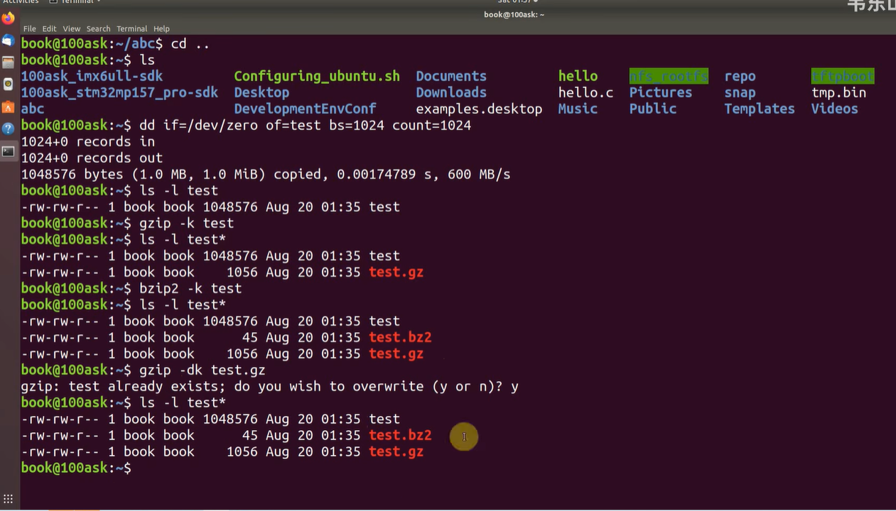
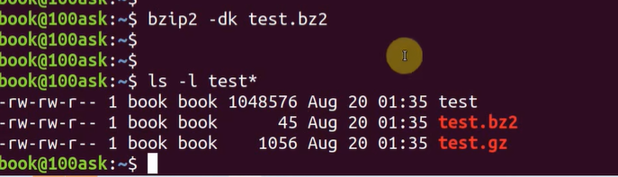

这是一个非常扎实且实用的Linux基础视频，主要讲解了嵌入式开发中最常用的打包和压缩命令。

针对你要准备**嵌入式面试**的需求，我为你整理了视频的时间轴摘要、针对嵌入式场景的知识扩展，以及几个经典的面试题。

# 1. 视频内容摘要

视频主要<span style="color:#FF0000; background:#00FF80; border:1px solid #FF00FF;">对比了 `gzip`、`bzip2` 和 `tar` 三种命令，重点推荐使用 `tar`。</span>

- **[00:00 - 00:24] 核心观点**

  - 介绍压缩命令 `gzip` 和 `bzip2`，但指出作者平时只用 `tar`。

  - `gzip` 和 `bzip2` 的致命缺点：只能处理**单个文件**，不能直接压缩目录（文件夹）。

    

    

- **[00:25 - 01:10] 准备测试文件**

  - 使用 `dd` 命令从 `/dev/zero` 创建了一个约 1MB 的全零文件用于测试。

    

    

- **[01:11 - 02:22] gzip 与 bzip2 的对比**

  - **gzip:** 使用 `gzip -k` (保留源文件) 压缩。

  - **bzip2:** 使用 `bzip2 -k` 压缩。

  - **结论:** 视频演示中，<span style="color:#FF0000; border:1px solid #FF00FF;">`bzip2` 的压缩率远高于 `gzip`（因为源文件是全零，`bzip2` 算法对此类数据优化极好）。</span><span style="color:#FF0000; background:#00FF80; border:1px solid #FF00FF;">（补充：从上面图片中可以看到创建的test文件大小为 1M = 1024 × 1024 = 1048576 Byte，经过gzip压缩后为 test.gz 占了1056Byte，经过bzip2压缩后为 test.bz2 占了45 Byte。显然bzip2的压缩率远高于gzip）</span>

    

- **[02:23 - 03:37] 解压操作**

  - 使用 `-d` (decompress) 参数进行解压。

  

- **[03:38 - 06:00] tar 命令详解 (处理文件)**

  - **功能:** `tar` 本质是打包工具，但通过参数调用压缩工具。
  - **核心参数:**
    - `-c`: 创建包 (Create)
    - `-x`: 解包 (Extract)
    - `-f`: 指定文件名 (File)，**必须放在参数最后**。
    - `-z`: 调用 gzip 属性 (`.tar.gz`)。
    - `-j`: 调用 bzip2 属性 (`.tar.bz2`)。

- **[06:01 - 08:35] tar 命令处理目录 (重点)**

  - 演示将文件夹 `abc` 压缩为 `abc.tar.bz2`。这是 `gzip` 单独做不到的。

- **[08:36 - 结尾] 总结**

  - 解压通用公式：`tar xzf` (解压gz) 或 `tar xjf` (解压bz2)。也可以指定 `-C` (大写) 解压到指定目录。

------

## 提问1

```bash
dd if=/dev/zero of=test bs=1024 count=1024 
```

<span style="color:#FF0000; background:#00FF80; border:1px solid #FF00FF;">这条命令我有点看不太懂，你能够给我详细解释下吗</span>

这条命令在 Linux（特别是嵌入式开发）中非常经典。

用一句话总结：**这条命令的作用是在当前目录下，创建一个名为 `test` 的文件，文件大小正好是 1MB，里面的内容全部是“0”**。

`dd` 命令因为参数格式比较古老（不像 `cp` 或 `mv` 那样直观），初看确实容易晕。我们可以把它拆解成 **4 个部分** 来看：

### 1. 拆解命令参数

- **`dd`**
  - **全称**：Disk Dump（磁盘转储）或者被戏称为 Data Description。
  - **作用**：它像一个精准的“搬运工”，按照你指定的块大小（Block Size），把数据从输入端搬运到输出端。
- **`if=/dev/zero`** (Input File)
  - `if` = **I**nput **F**ile（输入文件/数据源）。
  - `/dev/zero`：这是 Linux 中一个特殊的**虚拟设备文件**。它不是硬盘上真实存在的文件，而是一个“造零机”。无论你从它那里读多少数据，它都会源源不断地吐出二进制的 `0` (空字符, ASCII NUL)。
  - **含义**：告诉 `dd`，我要搬运的“货物”来源是无限的 0。
- **`of=test`** (Output File)
  - `of` = **O**utput **F**ile（输出文件/目的地）。
  - **含义**：告诉 `dd`，把搬运来的数据写到一个叫 `test` 的文件里。如果文件不存在就创建，如果存在就覆盖。
- **`bs=1024`** (Block Size)
  - `bs` = **B**lock **S**ize（块大小）。
  - **含义**：告诉 `dd`，“搬运工”每次搬运的单位是 **1024 字节**（即 1KB）。
- **`count=1024`** (Count)
  - `count` = 次数。
  - **含义**：告诉 `dd`，一共搬运 **1024 次**。

### 2. 这个 1MB 是怎么算出来的？

整个过程就像搬砖：

- 每次搬 **1KB** (`bs=1024`)
- 一共搬 **1024 次** (`count=1024`)

总大小计算公式：


$$1024 \text{ Bytes} \times 1024 \text{ (count)} = 1,048,576 \text{ Bytes} = 1 \text{ MB}$$

所以，这条命令执行完，你就得到了一个精准的 1MB 大小的文件。

### 3. 在嵌入式面试/开发中，为什么要用它？

除了视频里为了测试压缩率，`dd` 在嵌入式里还有这几个核心用途，**面试时提到会很加分**：

1. **烧写系统镜像 (最重要的用途)**
   - 在嵌入式 Linux 开发中，我们经常要把 U-boot 或系统镜像烧写到 SD 卡或 eMMC 中。
   - 例如：`dd if=u-boot.bin of=/dev/sdb bs=512 seek=2`
   - 解释：把 `u-boot.bin` 这里的二进制数据，原封不动地写入到 SD 卡设备 (`/dev/sdb`) 中。
2. **测试磁盘读写速度 (基准测试)**
   - 如果你想知道开发板上的 Flash 写入速度有多快，就可以运行你问的这条命令：
   - `dd if=/dev/zero of=test bs=1M count=100`
   - 这样会写入 100MB 数据，`dd` 结束时会告诉你用了几秒，算出写入速度（MB/s）。
3. **创建一个固定大小的空磁盘镜像**
   - 有时候我们需要模拟一个文件系统。可以先用 `dd` 造一个 100MB 的全 0 文件，然后用 `mkfs.ext4` 把这个文件格式化成一个文件系统，挂载起来当硬盘用。

### 4. 一个严重的警告 (Disk Destroyer)

在 Linux 圈子里，`dd` 有个可怕的外号叫 **"Disk Destroyer" (磁盘毁灭者)**。

因为它的权限太高且不给提示。

- 如果你手误把 `of=test` 写成了 `of=/dev/sda` (你的电脑主硬盘)。
- 它会瞬间把全 0 数据覆盖到你的硬盘引导区，导致你的电脑系统彻底崩溃，数据全无，连“撤销”的机会都没有。

总结：

这条命令就是：从 /dev/zero 这个无底洞里，每次舀 1KB 的“0”，舀了 1024 次，倒进 test 文件里，造出了一个 1MB 的空文件。


## 提问


<span style="color:#FF0000; background:#00FF80; border:1px solid #FF00FF;">从上面图片中可以看到创建的test文件大小为 1M = 1024 × 1024 = 1048576 Byte，经过gzip压缩后为 test.gz 占了1056Byte，经过bzip2压缩后为 test.bz2 占了45 Byte。显然bzip2的压缩率远高于gzip。这在任何情况下都是bzip2的压缩率高于gzip吗，那么gzip感觉就没有什么用的必要了吧。</span>

这是一个非常敏锐的观察！你从截图中的数据（45 Bytes vs 1056 Bytes）得出的直观感受是完全合理的，但这个结论是建立在一个**极其特殊的测试用例**上的。

针对你的疑问：“**任何情况下bzip2压缩率都高于gzip吗？gzip是否就没有用的必要了？**”，我的回答是：

<span style="border:1px solid #FF00FF; font-family:serif; color:#FF0000;">**绝非如此。gzip 依然是目前世界上最通用的压缩格式，尤其在嵌入式领域，它往往比 bzip2 更受青睐。**</span>

这里有三个核心层面的原因，这也是嵌入式面试中非常能体现你**工程思维**（Engineering Mindset）的地方：

### 1. 数据的特殊性（你被“欺骗”了）

你在图片中压缩的文件 `test` 是用 `dd if=/dev/zero` 创建的。

- **内容：** 它是 1MB **完全重复** 的“0”。
- **原理差异：** `bzip2` 算法（基于 Burrows-Wheeler 变换）对这种**极度重复**的连续数据处理能力极强，它几乎只需要记录“这是1MB的0”，所以只有45字节。而 `gzip`（基于 DEFLATE）虽然也能压缩得很好（从1MB压到1KB已经很强了），但在处理这种极端重复数据时，元数据开销比 `bzip2` 大。
- **现实世界：** <span style="background:#00FF80; color:#FF0000; border:1px solid #FF00FF;">在真实场景中（如压缩代码、日志、二进制文件），`bzip2` 的压缩率通常只比 `gzip` 高 **10% - 20%** 左右，绝不会出现图片中这种“几百倍”的差距。</span>

### 2. 压缩/解压速度（时间换空间）

<span style="color:#FF0000; background:#00FF80; border:1px solid #FF00FF;">这是 `gzip` 能够长盛不衰的核心原因：**速度**。</span>

- **Gzip：** 压缩速度快，**解压速度极快**。
- **Bzip2：** 压缩率虽然高一点，但**压缩速度非常慢**，解压速度也明显慢于 `gzip`。

**嵌入式场景考点：系统启动时间**

> 假设你的嵌入式 Linux 内核（Kernel）有 5MB。
>
> - 如果你用 `bzip2` 压缩，可能压到 2MB，但系统启动时解压需要 **2秒**。
> - 如果你用 `gzip` 压缩，可能压到 2.5MB，但系统启动时解压只需要 **0.5秒**。
>
> 面试题： 用户要求设备上电后 3 秒内进入系统，你会选择哪种压缩方式？
>
> 答案： <span style="color:#FF0000; background:#00FF80; border:1px solid #FF00FF;">选 gzip（甚至更快的 lz4）。因为对于用户体验来说，开机速度比 Flash 节省那 0.5MB 空间更重要。</span>

### 3. 内存消耗（Memory Footprint）

这是嵌入式系统最致命的限制。

- **Gzip：** 算法简单，运行时需要的内存很少。
- **Bzip2：** 在解压时需要大量的内存（Memory Heavy）。

**嵌入式场景考点：OTA 升级**

> 如果你的单片机或小型网关只有 16MB 内存。下载了一个 `bzip2` 格式的升级包，可能在解压过程中因为内存不足（OOM）直接导致进程崩溃，而 `gzip` 就能轻松完成任务。

### 总结与对比表

为了帮助你记忆，我整理了这个对比表：

| **特性**     | **gzip** | **bzip2** | **嵌入式场景建议**                 |
| ------------ | -------- | --------- | ---------------------------------- |
| **文件后缀** | .gz      | .bz2      |                                    |
| **压缩率**   | 中等     | 高        | 存储空间极其昂贵时选 bzip2 (或 xz) |
| **压缩速度** | **快**   | 慢        | 日志记录、实时传输选 gzip          |
| **解压速度** | **极快** | 中等/慢   | **系统启动加载选 gzip**            |
| **内存消耗** | **低**   | 高        | **低内存设备绝对选 gzip**          |
| **CPU消耗**  | 低       | 高        | 电池供电设备选 gzip 以省电         |

### 扩展知识：现代的挑战者

事实上，`bzip2` 目前的处境非常尴尬，它正在被两头挤压：

1. **追求速度**：大家用 `gzip` 或更快的 `lz4` / `zstd`。
2. **追求高压缩率**：大家现在倾向于用 **`xz`** (使用 LZMA 算法)。`xz` 的压缩率通常比 `bzip2` 更高，虽然解压也慢，但既然追求极致压缩，大家更愿意选 `xz`。

结论：

图片中的巨大差异是测试数据造成的假象。在嵌入式面试中，如果问到压缩工具选择，一定要回答：“这取决于我们是更在乎 Flash 存储空间，还是更在乎 CPU 算力、内存资源以及启动速度。通常情况下，gzip 是一个在速度和空间上非常平衡的通用选择。”


# 2. 嵌入式开发视角：知识扩展与补充

在嵌入式面试中，仅仅知道怎么敲命令是不够的，面试官更看重你对**资源限制**和**文件系统**的理解。

#### A. 为什么 tar 在嵌入式中如此重要？

Linux 中 "Everything is a file"（一切皆文件），但文件不仅仅是数据，还包含**权限(Permissions)**、**所有者(Owner)**、**时间戳**等元数据。

- **单纯的 cp 命令:** 有时会丢失符号链接（软链接）或特殊权限。
- **tar 的作用:** 它能完美保留文件系统的**目录结构**和**权限属性**。这在制作**根文件系统 (Rootfs)** 时至关重要。

#### B. 压缩算法的选择策略 (面试考点)

视频中展示了 `bzip2` 比 `gzip` 压缩得更小，但在嵌入式系统中，我们如何选择？

| **算法**  | **扩展名** | **压缩率** | **压缩/解压速度**       | **内存/CPU消耗** | **嵌入式应用场景**                        |
| --------- | ---------- | ---------- | ----------------------- | ---------------- | ----------------------------------------- |
| **gzip**  | .gz        | 中等       | **快**                  | **低**           | 系统启动加载（速度优先）、日志轮转。      |
| **bzip2** | .bz2       | 高         | 慢                      | 中高             | 很多老旧系统的固件包。                    |
| **xz**    | .xz        | **极高**   | 极慢(压缩) / 中等(解压) | 高               | **现代嵌入式固件发布**（节省Flash空间）。 |

> **扩展:** 视频没提 `xz`，但现在 Linux 内核源码默认就是 `.tar.xz`。如果在面试中提到 `xz` 替代 `bzip2`，会显得你紧跟技术潮流。

#### C. `dd` 命令的潜台词

视频中用了 `dd if=/dev/zero ...`。

- **面试考点:** 在嵌入式中，`dd` 常用来**烧写系统镜像**（如烧写 u-boot 到 SD 卡）。
- **注意:** `/dev/zero` 产生的是无限的 0，压缩率极高。如果用 `/dev/urandom` (随机数) 产生文件，`gzip` 和 `bzip2` 的压缩率都会大幅下降。面试官可能会问：“为什么我压缩一个 100MB 的日志文件只有 1MB，但压缩一个 100MB 的加密文件还是 100MB？”（答案：熵/随机性不同）。

------

# 3. 经典面试题与高分回复

以下是针对该视频内容衍生的面试题，专为嵌入式岗位设计。

#### Q1: 在 Linux 中，`tar` 命令和 `gzip` 命令有什么本质区别？

> **普通回答:** `tar` 是打包，`gzip` 是压缩。
>
> 高分回答 (结合原理):
>
> tar 是一个归档 (Archiving) 工具，它的作用是将多个文件和目录合并成一个文件流，并保留文件权限和目录结构，但它本身不减小文件体积。
>
> gzip 是一个压缩 (Compression) 工具，它通过算法减小文件体积，但它无法处理目录。
>
> 在 Linux 中通常组合使用它们（.tar.gz），先用 tar 打包保留结构，再通过管道传给 gzip 进行压缩。

#### Q2: 我有一个嵌入式设备，Flash 空间非常有限，但 CPU 性能不错。为了节省存储空间，我应该把固件打包成 `.tar.gz` 还是 `.tar.bz2` (或 `.tar.xz`)？

> 参考回复:
>
> 既然 Flash 空间有限（即使存储容量是瓶颈），应该优先选择压缩率更高的算法。
>
> 视频中演示了 bzip2 比 gzip 压缩率高，但在现代场景下，我建议使用 .tar.xz。虽然它压缩和解压消耗更多 CPU 和时间，但能获得最好的压缩比，从而最大限度节省 Flash 空间。

#### Q3: 视频中使用了 `tar czf`。请问参数 `f` 为什么要放在最后？如果不放在最后会怎样？

> 参考回复:
>
> 这是 tar 命令的一个语法特性。-f 参数后面紧接的必须是文件名。
>
> 如果写成 tar cfz test.tar.gz ...，tar 会把 z 当作文件名，把原本的文件名当作其他参数处理，导致命令报错或创建出错误的文件名。所以习惯上 -f 总是放在参数组的最后。

#### Q4: (进阶) 如果我想把开发板 A 的 `/etc` 目录完整复制到开发板 B，除了用 `scp` 递归复制，还可以怎么用 `tar` 结合 `ssh` 实现？（考察流式处理）

> 参考回复:
>
> 可以利用 tar 将目录打包成标准输出流 (stdout)，通过 ssh 管道传输，再在接收端解包。
>
> 命令类似：tar czf - /etc | ssh user@board_b "tar xzf - -C /tmp"
>
> 这样做的好处是保留了文件权限和软链接，而且不需要在中间生成一个巨大的临时文件，效率更高。

### 下一步建议

你可以尝试在你的 Linux 虚拟机中练习一下 **Q4** 中的“流式传输”，或者试着用 `tar` 打包一个包含软链接（`ln -s`）的目录，然后解压查看链接是否还在。这对理解文件系统非常有帮助。


0
