这段视频主要讲解了<span style="color:#CC0000;">在Linux环境下（特别是Ubuntu）如何使用 **VI编辑器** 进行文件的新建、保存、浏览</span>以及与<span style="color:#CC0000;">图形化编辑器（如gedit）</span>的对比。

以下是针对您要求的三个部分的详细整理：

# 一、 视频内容摘要（带时间戳）

- **[00:00] VI编辑器的重要性**：介绍VI是命令行下的全屏幕编辑器，在<span style="border:1px solid #FF00FF; background:#00FF80;">嵌入式Linux开发中（通常没有图形界面）</span>是必不可少的工具，功能包括<span style="color:#CC0000; border:1px solid #FF00FF; background:#00FF80;">打开、新建、保存、光标移动、复制粘贴、查找替换</span>等。
- **[00:30] 图形化编辑器的局限**：演示<span style="border:1px solid #FF00FF; background:#00FF80;">使用图形界面</span>或 <span style="border:1px solid #FF00FF; background:#00FF80;">`gedit` 命令</span>修改系统文件（如 `/etc/environment`）时，<span style="color:#FF0000;">因权限不足（Root所有）导致无法保存。</span>

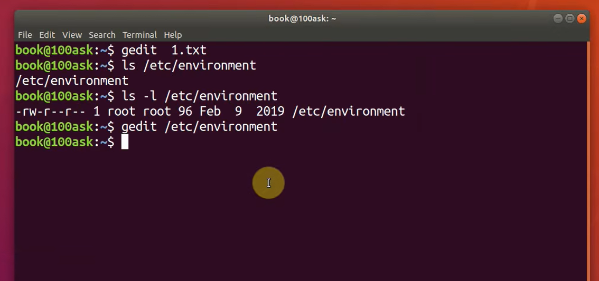

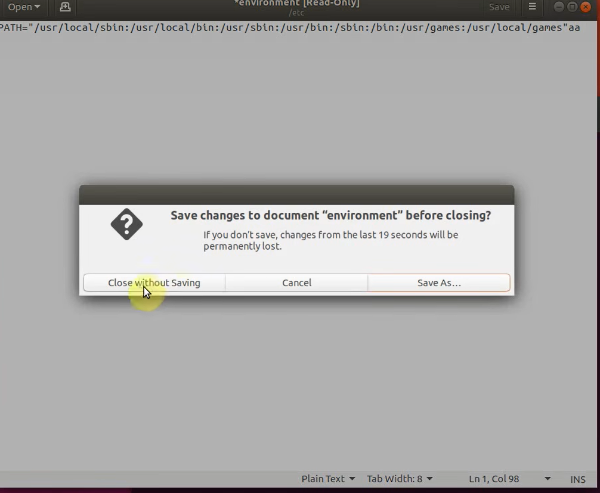

<span style="font-weight:bold; border:1px solid #FF00FF;">补充：观察上面图片就是使用 gedit /etc/envirionment 来打开编辑这个文件，由于这个文件是系统文件使用root用户，用户无法修改保存，弹出这个提示框，最后一个选项是保存作为另外一个文件（即另存为，根本没有办法去保存修改这个文件）。</span>

- **01:40] 解决权限问题**：演示<span style="color:#FF0000; background:#00FF80; border:1px solid #FF00FF;">使用 `sudo gedit` 临时提权来修改和保存系统文件</span>。

  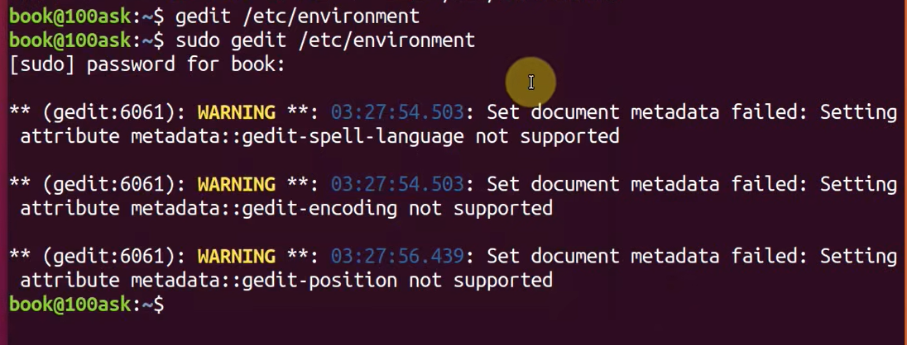

- **[02:40] <span style="color:#FF0000; background:#00FF80; border:1px solid #FF00FF;">VI的三种模式</span>**：介绍VI的核心概念——<span style="color:#FF0000; background:#00FF80; border:1px solid #FF00FF;">一般模式（光标移动、复制粘贴）</span>、<span style="color:#FF0000; background:#00FF80; border:1px solid #FF00FF;">编辑模式（输入文本）</span>、<span style="color:#FF0000; background:#00FF80; border:1px solid #FF00FF;">命令行模式（保存退出）</span>。

- **[03:00] 新建与打开文件**：

  - `vi filename`：<span style="color:#FF0000; background:#00FF80; border:1px solid #FF00FF;">文件存在则打开，不存在则新建。</span>
  - `vi filename +行号`：<span style="color:#FF0000; background:#00FF80; border:1px solid #FF00FF;">打开文件并将光标定位到指定行。</span>

  

- **[04:45] 保存与退出（命令行模式）**：

  - <span style="color:#FF0000; background:#00FF80; border:1px solid #FF00FF;">先按 `ESC` 回到一般模式，输入 `:` 进入命令行模式。</span>
  - `w`：保存。
  - `q`：退出。
  - `wq`：保存并退出。

- **[05:35] 进入编辑模式**：演示在一般模式下按 `i` (Insert) 键进入编辑模式，输入文本内容。

  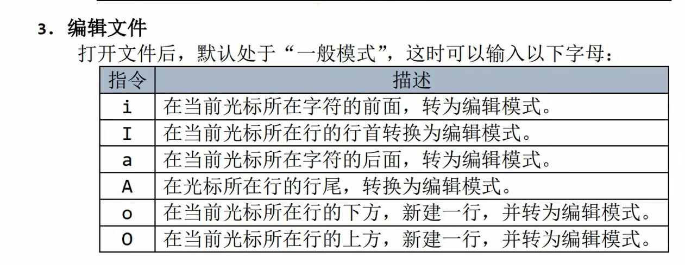

- **[06:00] 强制退出不保存**：<span style="color:#FF0000; background:#00FF80; border:1px solid #FF00FF;">演示修改文件后不想保存，使用 `:q` 失败，必须使用 `:q!` 强制退出。</span>

  <span style="color:#FF0000; background:#00FF80; border:1px solid #FF00FF;">演示使用 “ :q ”：</span>

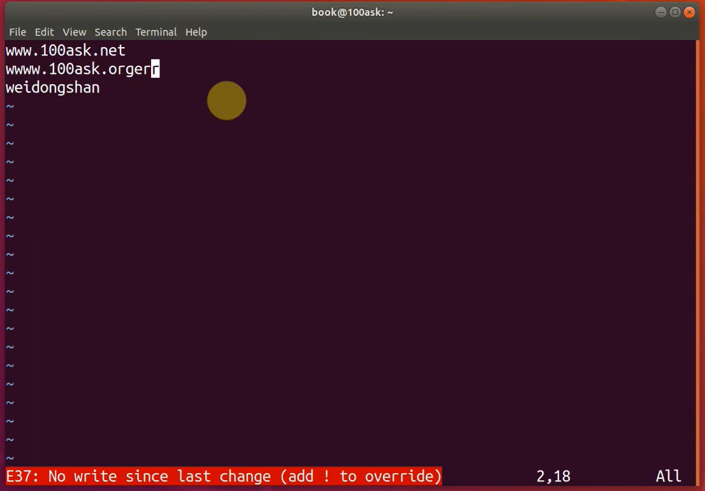

​				<span style="color:#FF0000; background:#00FF80; border:1px solid #FF00FF;">演示使用 “q!”：</span>

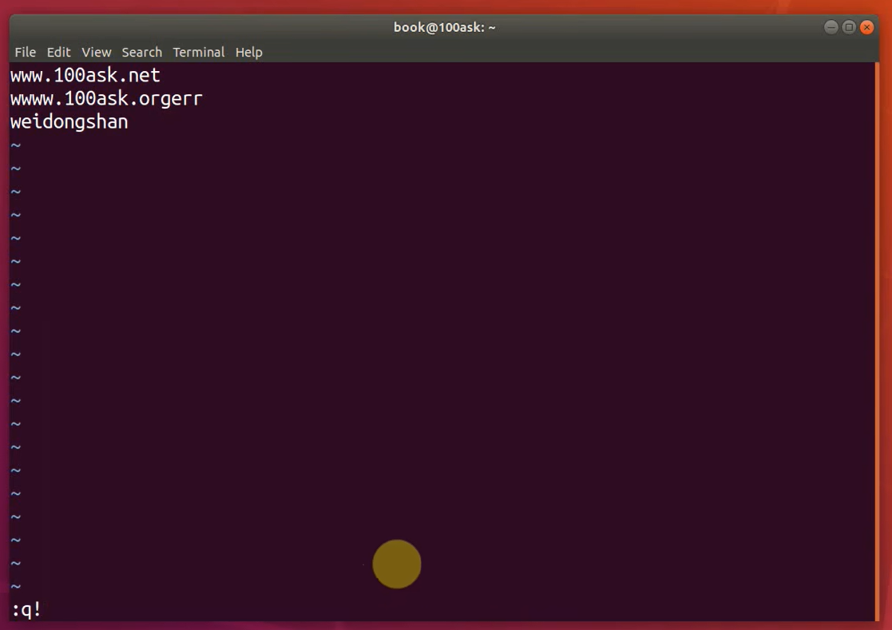

- **[07:50] 快速移动光标技巧**：
  - 复制大文件（`sensors3.conf`）进行演示。
  - **[08:40]** `G`（大写）：直接跳转到文件末尾。
  - `gg`（视频中未明确演示gg，但演示了跳回第一行）：跳转到文件开头。
- **[09:18] 行号设置**：
  - `:set number`：显示行号。
  - `:set nonumber`：隐藏行号。
- **[09:50] 精确跳转**：输入 `:` 后跟行号（如 `:250`），快速跳转到指定行。
- **[10:12] 翻页操作**：
  - `Ctrl + F` (Forward)：向下翻页。
  - `Ctrl + B` (Backward)：向上翻页。


# 补充提问

## 提问1（vi命令 与 gedit命令的区别）

<span style="font-size:1.1em; font-weight:bold; color:#FF0000; background:#00FF80; border:1px solid #FF00FF;">vi 命令 与 gedit命令的作用不是相同的吗，不都是打开修改文件吗，我不是太懂，你能够给我详细解释下吗，最好能够举个例子来让我彻底弄明白。</span>


这是一个非常棒的问题！对于初学者来说，这两个命令看起来确实“<span style="background:#00FF80; border:1px solid #FF00FF;">都是打开一个文件然后修改它</span>”，很容易让人困惑为什么需要学两个。

简单来说：**<span style="color:#FF0000; background:#00FF80; border:1px solid #FF00FF;">它们的核心功能确实一样（都是修改文本），但适用的“场景”和“操作方式”完全不同</span>。**

你可以把 **<span style="color:#FF0000;">Gedit</span>** 想象成 <span style="color:#FF0000;">Windows 里的 **记事本 (Notepad)**</span>，而把 **<span style="background:#00FF80; border:1px solid #FF00FF;">VI</span>** 想象成一个 **<span style="background:#00FF80; border:1px solid #FF00FF;">没有鼠标、只有键盘的专业操作台</span>**。

下面我用一个具体的**场景例子**来让你彻底弄明白。

### <span style="color:#FF0000; background:#00FF80; border:1px solid #FF00FF;">核心区别：有没有“图形界面”</span>

- **gedit (图形化编辑器)**：<span style="font-family:serif; border:1px solid #FF00FF;">必须依赖图形界面（窗口系统）</span>。它就像你平时用的软件一样，有菜单栏，可以用鼠标点击光标位置，用鼠标选中文字复制粘贴。
- **vi (命令行编辑器)**：完全不依赖图形界面。它直接在黑底白字的终端里运行，**不能用鼠标**（或者说主要靠键盘），所有操作（移动光标、复制、保存）都必须用键盘指令。

------

### 场景例子：修电脑的师傅

假设你是一名负责维护服务器的工程师。

#### 场景一：你在自己的办公室电脑前（使用 gedit）

你正在用自己的 Ubuntu 电脑写代码。因为你有显示器，有鼠标，有完整的桌面环境。

- 你输入 `gedit report.txt`。
- **结果**：<span style="color:#FF0000; background:#00FF80; border:1px solid #FF00FF;">啪，弹出一个像记事本一样的**新窗口**。</span>
- **操作**：你甚至可以一边喝咖啡，一边用鼠标点来点去，选中一段文字，按 `Ctrl+C` 复制，体验非常舒服、直观。
- **结论**：这时候用 `gedit` 很方便，因为它**简单好用**。

#### 场景二：<span style="color:#FF0000;">你远程维修远在国外的服务器（必须用 vi）</span>

现在的服务器通常都在云端（比如阿里云、AWS），或者在几千公里外的机房里。<span style="color:#FF0000; background:#00FF80; border:1px solid #FF00FF;">为了省资源和安全，这些服务器**通常没有安装图形桌面（没有窗口、没有鼠标指针）**，只有一个黑漆漆的命令行窗口。</span>

你<span style="background:#00FF80;">通过网络远程连接（SSH）进这台服务器</span>，想<span style="border:1px solid #FF00FF; color:#FF0000;">修改一个配置文件。</span>

- 如果你输入 `gedit config.txt`。
- **结果**：<span style="border:1px solid #FF00FF; color:#FF0000;">报错！系统会告诉你 `Cannot open display`（无法打开显示器）。因为服务器没有“窗口”这个概念，gedit 这种需要画出窗口的软件根本运行不起来。</span>
- 这时候你输入 `vi config.txt`。
- **结果**：<span style="color:#FF0000; background:#00FF80; border:1px solid #FF00FF;">成功！vi 直接在这个黑漆漆的命令行窗口里打开了文件。</span>
- **操作**：你<span style="color:#FF0000; border:1px solid #FF00FF;">必须用键盘（比如按 `i` 键进入输入模式，按 `Esc` 退出，输入 `:wq` 保存）来完成修改</span>。
- **结论**：这种时候**只有 vi 能救你**，gedit 完全派不上用场。

------

### 为什么要学 vi？

<span style="color:#FF0000; background:#00FF80; border:1px solid #FF00FF;">既然 gedit 简单，为什么高手都用 vi？</span>

1. **<span style="background:#00FF80;">通用性</span>（活命技能）**：<span style="color:#FF0000; border:1px solid #FF00FF;">任何一台 Linux 电脑（甚至是几十年前的老古董，或者是路由器、嵌入式设备）</span>里面一定有 `vi`。但绝大多数服务器都没有安装 `gedit`。**<span style="color:#FF0000; background:#00FF80; border:1px solid #FF00FF;">学会 vi，你走到任何一台 Linux 机器前都能干活</span>。**
2. **<span style="background:#00FF80;">效率</span>（盲打神器）**：<span style="color:#FF0000; background:#00FF80; border:1px solid #FF00FF;">一旦你熟练了，vi 的编辑速度比 gedit 快得多。</span>
   - <span style="color:#FF0000; background:#00FF80; border:1px solid #FF00FF;">**gedit 做法**</span>：手离开键盘 -> 握住鼠标 -> 移动到第 500 行 -> 选中 -> 删除。
   - <span style="color:#FF0000; background:#00FF80; border:1px solid #FF00FF;">**vi 做法**</span>：手不离键盘，输入 `500G` (跳到500行) -> `dd` (删除)。一秒搞定。

### 总结

- 如果你在**图形界面**（能看到桌面、鼠标）下，只是简单改个文件，用 **gedit** 没问题，简单直观。
- <span style="color:#FF0000; background:#00FF80; border:1px solid #FF00FF;">如果你在**嵌入式开发板**、**远程服务器**或者**系统崩溃进不去桌面**时，你**只能用 vi**。</span>

这就是为什么嵌入式面试一定要考 vi 的原因——因为在你未来的工作中，很可能根本没有 gedit 给你用。


## 提问2（vi命令）

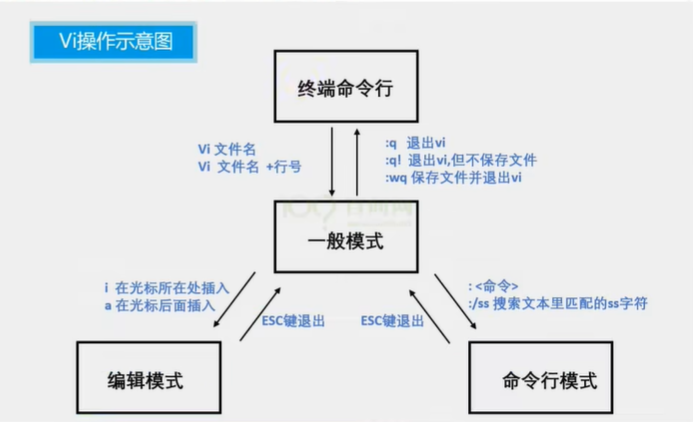

<span style="font-weight:bold; color:#FF0000; background:#00FF80; border:1px solid #FF00FF;">你能够结合着这个图给我详细解释下vi命令的3种工作模式 ，以及如何在不同模式间来进行切换呢，比如如何从终端命令行进入一般模式，以及如何从一般模式回到终端命令行等等。</span>

这张图非常清晰地展示了<span style="background:#00FF80; border:1px solid #FF00FF; color:#FF0000;"> **Vi 编辑器最核心的“三角关系”**</span>。要彻底理解 Vi，关键就在于理解<span style="border:1px solid #FF00FF; color:#FF0000; background:#00FF80;">这三者是如何以**中间的“一般模式”**为枢纽进行流转的。</span>

我结合这张流程图，为你还原一下实际的操作全过程：

### 1. 入口：从【终端命令行】进入【一般模式】

看图中最上方的部分，这是你的起点（<span style="color:#FF0000; background:#00FF80; border:1px solid #FF00FF;">Linux 黑框框</span>）。

- **操作动作**：在终端里输入 `vi 文件名`（例如 `vi 1.txt`）并回车。

- **发生的变化**：

  - <span style="color:#FF0000; border:1px solid #FF00FF;">如果文件存在</span>，vi 会读取它并显示内容。

    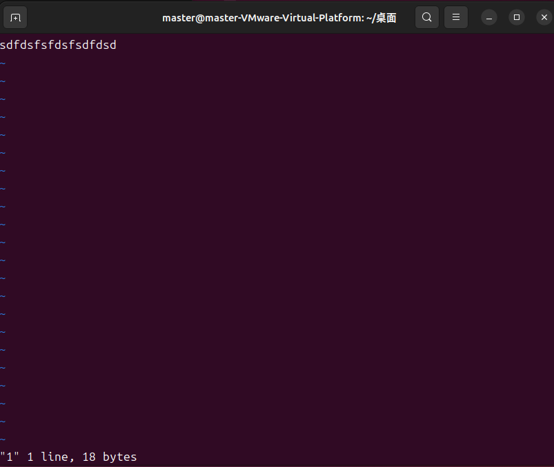

  - <span style="color:#FF0000; border:1px solid #FF00FF;">如果文件不存在</span>，vi 会打开一个空界面（只有左边的波浪线 `~`）。

    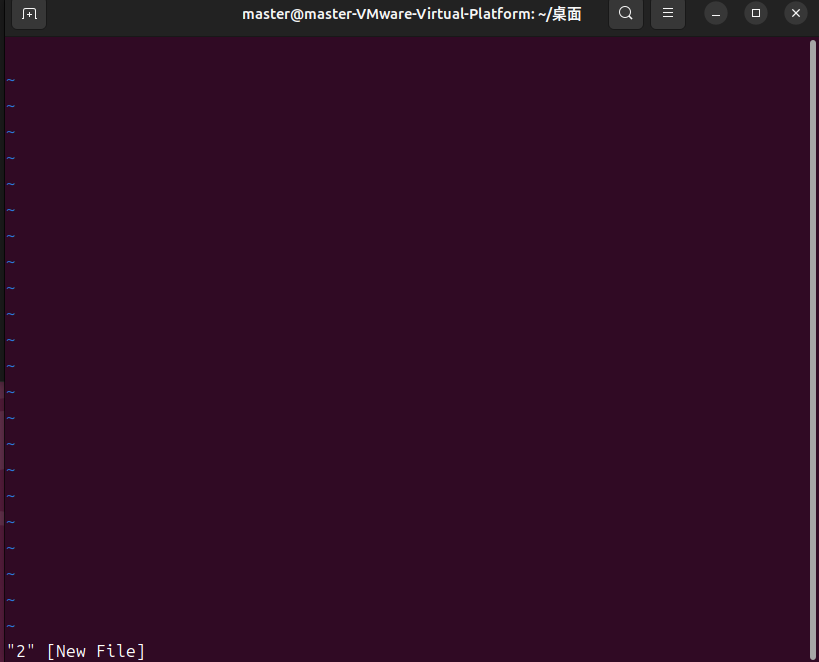

- **当前状态**：此时你已经进入了**中间的【一般模式】**。

  - **注意**：<span style="color:#FF0000; background:#00FF80; border:1px solid #FF00FF;">这时候你按键盘上的字母（比如 `s`、`d`、`w`），屏幕上**不会**打出字来，因为它们被当作指令（比如删除、移动）处理了。</span>

------

### 2. 左路分支：【一般模式】↔【编辑模式】

这是<span style="border:1px solid #FF00FF;">写代码、改配置</span>必去的地方（图左下角）。

- **去程（<span style="background:#00FF80; border:1px solid #FF00FF;">开始打字</span>）**：

  - 在一般模式下，输入 **`i`** (Insert)：在光标**当前位置**开始输入。
  - 或者输入 **`a`** (Append)：在光标**后面**开始输入（图中也有标出）。

  ---

  <span style="border:1px solid #FF00FF; color:#FF0000;">举例补充</span>：<span style="color:#FF0000; background:#00FF80; border:1px solid #FF00FF;">假设光标当前正好盖在字母 **`B`** 上：</span>

  - <span style="color:#FF0000; background:#00FF80; border:1px solid #FF00FF;">输入 **`i`** (前插)：你打的字会出现在 **`B` 的左边**。</span>
  - <span style="color:#FF0000; background:#00FF80; border:1px solid #FF00FF;">输入 **`a`** (后插)：你打的字会出现在 **`B` 的右边**。</span>

  ---

  - **现象**：<span style="color:#FF0000; border:1px solid #FF00FF;">屏幕左下角会出现 `-- INSERT --` 或 `-- 插入 --` 字样。这时候你可以像在 Windows 记事本里一样正常打字了。</span>

- **回程（<span style="background:#00FF80; border:1px solid #FF00FF;">打完收工</span>）**：

  - **操作**：按一下键盘左上角的 **`ESC`** 键。
  - **现象**：<span style="color:#FF0000; background:#00FF80; border:1px solid #FF00FF;">左下角的 `-- INSERT --` 消失。你又回到了中间的枢纽——**一般模式**。</span>

> <span style="color:#FF0000; background:#00FF80; border:1px solid #FF00FF;">**新手大坑提示**：很多人在编辑模式下打完字，直接输入 `:wq` 想保存，结果发现把 `:wq` 这几个字符打进文章里了。**记住：想保存，必须先按 ESC 退出编辑模式！**</span>

------

### 3. 右路分支：【一般模式】↔【命令行模式】

这是<span style="border:1px solid #FF00FF;">保存、搜索、替换</span>的地方（图右下角）。

- **去程（准备指令）**：
  - <span style="color:#FF0000; border:1px solid #FF00FF;">在一般模式下，输入 **`:`** (英文冒号)。</span>
  - 或者输入 **`/`** (用于搜索)。
  - **现象**：光标会瞬间跳到屏幕的**最底端**，等待你输入命令。
- **回程（取消指令）**：
  - 如果你不小心按了冒号，不想保存了，按 **`ESC`** 键（<span style="color:#FF0000; background:#00FF80; border:1px solid #FF00FF;">可能需要按两次</span>）即可取消，回到一般模式。

------

### 4. 出口：从【命令行模式】回到【终端命令行】

这一步就是“存盘退出”，让你回到原本的 Linux Shell 界面（图中右上角的箭头）。

<span style="color:#FF0000; background:#00FF80; border:1px solid #FF00FF;">当你处于命令行模式（屏幕底部有个冒号）时，输入以下指令并回车：</span>

- **`:wq`** (Write & Quit)：保存修改，并退出 Vi，回到终端。这是最常用的。
- **`:q!`** (Quit Force)：强制退出，**不保存**刚才的修改。当你改乱了文件想重来时用这个。
- **`:q`**：在没有修改文件的情况下直接退出。

------

### 总结：Vi 的“客厅理论”

为了方便记忆，你可以把这三个模式想象成你要在家里（Vi）做饭：

1. **一般模式（客厅）**：这是枢纽。你进门（打开文件）首先在客厅。
2. **编辑模式（厨房）**：你想做饭（写代码），必须从客厅进厨房（按 `i`）。做完饭，你不能直接跳窗户出去，必须先退回客厅（按 `ESC`）。
3. **命令行模式（玄关/大门）**：你想出门（保存退出），必须在客厅走向大门（按 `:`）。

**铁律**：<span style="color:#FF0000;">厨房（编辑）和大门（命令行）是不互通的，**所有操作必须经过客厅（一般模式/按ESC）中转。**</span>


## 提问2-1

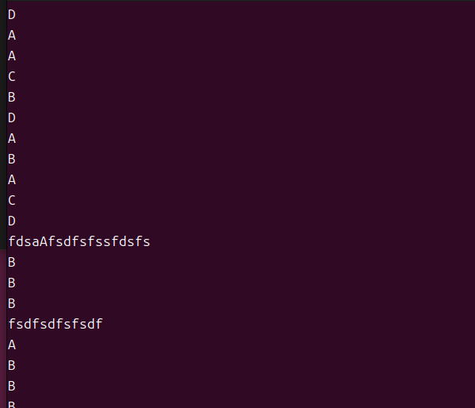

<span style="color:#FF0000; background:#00FF80; border:1px solid #FF00FF;">我这里在插入模式下为什么输入 上下左右 键会才出现A B C D，而且还会把前面的内容给消除掉呢，而且我插入模式下底部好像没有出现insert字样。</span>

这是一个非常经典的新手“坑”，你遇到的现象完全正常！这并不是你操作错了，而是因为你现在的环境是**最原始、最精简的 `vi` 模式**。

出现这种情况的原因是：你当前的系统（Ubuntu）默认安装的是一个叫 `vim-tiny` 的精简版软件，它为了兼容几十年前的老 `vi`，默认开启了**兼容模式 (compatible mode)**。

在这个模式下，它非常“傻”，完全保留了 1976 年时的操作习惯。

### 1. 为什么会出现 A B C D ？

<span style="color:#FF0000; background:#00FF80; border:1px solid #FF00FF;">在老式 `vi` 的**编辑模式（Insert Mode）下，它是不支持**用方向键移动光标的。</span>

当你按下方向键（比如上箭头）时，键盘其实发送了一串字符代码给电脑，通常是 `Esc` + `[` + `A`。

- 现代的编辑器（如完整版 vim）能听懂这串代码是“向上移动”。
- 你现在的精简版 `vi` 听不懂，它把它当成了普通的文字输入。于是屏幕上就打印出了 A、B、C、D。

### 2. 为什么会把前面的内容“消除”掉？

这是最可怕的地方！因为方向键的代码是以 Esc 开头的（比如右键是 Esc + [ + C）。

当你按下右键时，原始 vi 是这样解析的：

1. 收到 **`Esc`**：它认为你要**退出编辑模式**，回到一般模式。
2. 收到 **`[`**：它忽略或无法识别。
3. 收到 **`C`**：它认为这是**一般模式下的指令**！
   - <span style="border:1px solid #FF00FF; background:#00FF80;">在一般模式下，大写 **`C`** 的指令意思是：**删除光标后所有内容并进入编辑模式**。</span>
   - 大写 **`D`** 的指令意思是：**删除光标后所有内容**。

**结论**：这就是为什么你按右键或左键时，不仅没移动，反而把好不容易写的一行字给删没了！

### 3. 为什么底部没有 `-- INSERT --` 字样？

还是因为**兼容模式**。几十年前的老 `vi` 就是没有状态栏提示的，全凭记忆判断自己在哪种模式。

------

### ✅ 解决方案（二选一）

#### 方法一：彻底解决（推荐）——安装完整版 Vim

现在的嵌入式开发或服务器维护，几乎都会装完整版 Vim，它会支持方向键，也会显示状态栏。

在终端输入以下命令安装：

Bash

```bash
sudo apt update
sudo apt install vim
```

安装完成后，你再输入 `vi`，实际上打开的就是拥有现代化功能的 `vim` 了。此时方向键能用，左下角也会显示 `-- INSERT --`。

#### 方法二：临时解决——如果不允许安装软件

如果你只能用现在的环境，必须严格遵守 `vi` 的**“客厅理论”**：

1. <span style="background:#00FF80; border:1px solid #FF00FF;">**永远不要在编辑模式下按方向键**。</span>
2. <span style="background:#00FF80; border:1px solid #FF00FF;">想移动光标？</span>
   - <span style="color:#FF0000;">先按 **`Esc`** 退出到一般模式。</span>
   - <span style="background:#00FF80;">使用 **`h` `j` `k` `l`** 移动光标。</span>
   - <span style="color:#FF0000; background:#00FF80; border:1px solid #FF00FF;">移动到位后，再按 **`i`** 进入编辑模式写字。</span>

### 总结

你遇到的是**最硬核的原始体验**。如果你要面试嵌入式，建议先用 **方法一** 把环境弄得舒服点，但心里要明白 **方法二** 的原理，防止以后在极简的嵌入式开发板上抓瞎。


## 提问3 （快速移动）

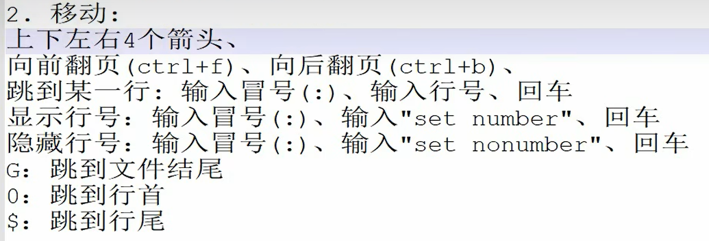

<span style="color:#FF0000; background:#00FF80; border:1px solid #FF00FF;">你能够将图片中快速移动的这几种方式给我详细解释下吗，我有点不是太懂。</span>

没问题！<span style="color:#FF0000; background:#00FF80; border:1px solid #FF00FF;">图片里列出的这些命令是 VI/VIM 中最经典的**“极速移动”**指令。</span>

你要知道，高手用 VI 是从来不疯狂按“上下左右”键的（那样太慢了），他们是用这些快捷键来实现**“瞬间跳转”**。

这几组命令其实是分场景使用的，我帮你把它们拆解成**三个维度**来理解，这样你就懂了：

### 第一维度：在“整页整页”之间飞跃 (翻页)

当你打开一个几千行的长文件时，一行行按箭头太慢了，这时候要像翻书一样翻页。

- **`Ctrl + f` (Forward)**：**向前翻一页**（相当于键盘上的 PageDown）。
  - **记忆技巧**：**F**orward (向前/前进)。
- **`Ctrl + b` (Backward)**：**向后翻一页**（相当于键盘上的 PageUp）。
  - **记忆技巧**：**B**ackward (向后/回退)。

> **场景**：你在看长长的日志文件，想快速往下浏览，就按住 Ctrl 不放，点按 f 键，屏幕刷刷刷地往下翻。

------

### 第二维度：<span style="color:#FF0000; border:1px solid #FF00FF;">在“文件的头尾”之间瞬移 (宏观跳转)</span>

这是最常用的功能，直接跳到文件的最下面或指定位置。

- **`G` (大写)**：**跳到文件最后一行**。
  - **注意**：是 **Shift + g**。
  - **场景**：你想查看日志文件里最新的一条记录（通常在最后），按一下 `G` 就到了。
- **`:行号`**：**跳到指定行**。
  - **操作**：<span style="background:#00FF80; border:1px solid #FF00FF;">先按 `:` (进入命令行模式)，输入数字（比如 `100`），再按回车。光标瞬间跳到第 100 行。</span>
  - **配合指令**：这就<span style="border:1px solid #FF00FF; color:#FF0000;">需要配合图片里的 **`:set number`** (显示行号) 使用，不然你不知道你要跳到哪一行</span>。
  - **技巧**：<span style="background:#00FF80; border:1px solid #FF00FF;">如果你想回到**文件第一行**，除了用 `gg` (很多教程会讲)，也可以输入 **`:1`** 回车。</span>

------

### 第三维度：<span style="color:#FF0000; border:1px solid #FF00FF;">在“当前这一行”里极速漂移 (微观跳转)</span>

当你的光标已经定位到某一行代码了，但<span style="color:#FF0000; background:#00FF80; border:1px solid #FF00FF;">你要去修改这行代码的**行首**或**行尾**。</span>

- **`0` (数字零)**：**跳到当前行的最开头**。
  - **场景**：<span style="color:#FF0000; border:1px solid #FF00FF; background:#00FF80;">比如你要把这一整行注释掉，通常需要在行首加 `#`，你就按 `0` 瞬间回到行首，按 `i` 插入 `#`。</span>
- **`$` (美元符号)**：**跳到当前行的最末尾**。
  - **注意**：是 **Shift + 4**。
  - **场景**：<span style="color:#FF0000; background:#00FF80; border:1px solid #FF00FF;">你想在这一行代码最后加个分号 `;`，按 `$` 瞬间跳到行尾，按 `a` (append) 插入分号。</span>

------

### 总结一张表 (建议收藏)

| **你的需求**           | **快捷键**              | **记忆口诀**                        |
| ---------------------- | ----------------------- | ----------------------------------- |
| **像翻书一样看长文件** | `Ctrl + f` / `Ctrl + b` | **F**orward (前), **B**ackward (后) |
| **直接去文件屁股后面** | `G` (大写)              | 类似于 Go 到终点                    |
| **精准去第 50 行**     | `:50` + 回车            | 命令行指哪打哪                      |
| **回到这行最开头**     | `0`                     | 归零                                |
| **去这行最末尾**       | `$`                     | 写正则表达式时 $ 也代表结尾         |

建议练习：

打开你的 2.txt，试着按一下 G 看看是不是到了最后？然后按 0 回到行首，再按 $ 去行尾。多试几次就有手感了！


## 提问 3 -1

Ctrl + f、Ctrl + b

G (大写)： **Shift + g**。

`0` (数字零)

`$` (美元符号)：Shift + 4

<span style="color:#FF0000; background:#00FF80; border:1px solid #FF00FF;">这些命令都是在命令行模式下输入的吗，还有这里 Shift + g 是大写的G吧，如果原来键盘上的g就是大写的G呢，此时Shift+g 会怎么样呢，我不是太懂，你能够给我详细解释下吗，最好能够举个例子来让我彻底弄明白。</span>

这是一个非常敏锐且关键的问题！很多初学者虽然记住了快捷键，但往往栽在“**模式混淆**”和“**大小写状态**”这两个细节上。

我把你问的两个核心点拆开来，用最直观的方式解释清楚。

### 1. 灵魂拷问：<span style="border:1px solid #FF00FF; color:#FF0000;">这些命令是在“命令行模式”下输入的吗？</span>

**答案：绝对不是！** 这是一个巨大的误区。

请再次看你上传的那张 **[Vi操作示意图]** (image_d9d744.png)：

- **命令行模式 (Command-Line Mode)**：必须先输入冒号 **`:`**，光标跳到屏幕最下方才能输入的指令（比如保存退出 `:wq`，显示行号 `:set number`）。
- **一般模式 (General Mode/Normal Mode)**：你<span style="border:1px solid #FF00FF;">刚打开文件时的默认模式，或者按 `ESC` 回到的那个模式</span>。

结论：

你<span style="border:1px solid #FF00FF;">列出的所有移动指令（Ctrl+f, G, 0, $）</span> 全部<span style="color:#FF0000; background:#00FF80; border:1px solid #FF00FF;">都是在【一般模式】下直接按键盘，不需要输入冒号</span>，也不需要在屏幕底部输入。

- **举例**：你想去文件末尾。
  - **错误做法**：输入 `:`，然后打个 `G`，回车。（VI 会报错，因为它不认识这个命令）。
  - **正确做法**：<span style="color:#FF0000; background:#00FF80; border:1px solid #FF00FF;">确保自己在一般模式（狂按 ESC），然后直接按 `Shift + g`。（屏幕画面直接瞬移到底部）。</span>

------

### 2. 关于 G、Shift 和 Caps Lock（大写锁定）的逻辑大揭秘

VI 编辑器是非常严谨的，它**严格区分大小写**。<span style="border:1px solid #FF00FF; color:#FF0000;">对于 VI 来说，**小写的 `g`** 和 **大写的 `G`** 是两个完全不同的指令。</span>

- **大写 `G`**：指令是“跳到文件末尾”。
- **小写 `g`**：指令是“等待下一个命令”（通常配合另一个 g 组成 `gg` 跳到开头）。

我们来看你问的复杂情况（Shift 和 Caps Lock 的爱恨情仇）：

#### 情况 A：你的键盘 Caps Lock 灯是【灭】的（最常见的情况）

这是<span style="border:1px solid #FF00FF; color:#FF0000;">标准状态，键盘默认输出小写。</span>

- **操作**：<span style="color:#FF0000; border:1px solid #FF00FF; background:#00FF80;">按住 `Shift` 不放</span>，同时按 `g`。
- **电脑发送给 VI 的字符**：**`G`** (大写)。
- **VI 的反应**：“收到大写 G，执行跳转到文件末尾！” -> **成功**。

#### 情况 B：你的键盘 Caps Lock 灯是【亮】的（你开启了大写锁定）

这时候键盘逻辑反转：<span style="color:#FF0000; background:#00FF80; border:1px solid #FF00FF;">直接按键是大写，按住 Shift 反而变小写</span>。

- **操作**：按住 `Shift` 不放，同时按 `g`。
- **电脑发送给 VI 的字符**：**`g`** (小写)。
- **VI 的反应**：“收到小写 g，我等你输入下一个 g 组成 `gg`...” -> **跳转失败**（画面不动）。

#### 情况 C：Caps Lock 灯亮着，我直接按 g 键（不按 Shift）

- **操作**：直接按 `g` 键。
- **电脑发送给 VI 的字符**：**`G`** (大写)。
- **VI 的反应**：“收到大写 G，执行跳转到文件末尾！” -> **成功**。

------

### 总结举例（让你彻底弄明白）

假设你有一个 100 行的文件，光标现在第 1 行。

| **你的键盘状态** | **你的手部动作** | **实际上 VI 收到的指令** | **结果 (去第100行了吗？)**       |
| ---------------- | ---------------- | ------------------------ | -------------------------------- |
| **Caps Lock 关** | 按住 Shift + g   | **G** (大写)             | **✅ 是** (跳转成功)              |
| **Caps Lock 关** | 只按 g           | **g** (小写)             | **❌ 否** (VI 在等第二个g)        |
| **Caps Lock 开** | 按住 Shift + g   | **g** (小写)             | **❌ 否** (Shift把大写变回小写了) |
| **Caps Lock 开** | 只按 g           | **G** (大写)             | **✅ 是** (跳转成功)              |

### 给你的建议

不要去记“是否要按 Shift”，而是要记住**“VI 的指令是区分大小写的”**。

- 当你看到教程写 **`G`**，它的意思是**“我要输入一个大写的 G”**。
- 至于怎么打出大写 G（是按 Shift 打，还是开大写锁打），取决于你当时的键盘状态，只要最终打出来的是大写就行！
- 但在实际工作中，大家通常不怎么开 Caps Lock，所以**默认动作就是 `Shift + g`**。

下一步：

现在请确保你的 Caps Lock 是关闭的，回到你的终端里，试试按 g（不动）和 Shift + g（跳到底部），感受一下这两个不同指令的区别。如果这明白了，我们可以继续讲讲怎么“删除”和“复制”代码。


## 提问4

<span style="color:#FF0000; background:#00FF80; border:1px solid #FF00FF; font-size:1.3em;">我在命令行模式下输入一个命令执行之后会自动回到一般模式下吧，给我举个例子解释下。</span>

是的，你的理解非常准确！**<span style="color:#FF0000; background:#00FF80; border:1px solid #FF00FF;">绝大多数情况下，在命令行模式下输入命令并按回车后，VI 会立即执行该命令，并且自动“弹”回一般模式。</span>**

<span style="background:#00FF80; border:1px solid #FF00FF;">不需要你手动按 ESC，系统自动就帮你切回来了。</span>

我用两个你刚才学过的例子来演示这个过程，请注意观察**光标的位置变化**，这是判断模式的关键：

### 例子 1：开启行号显示 (`:set number`)

1. **起始状态（一般模式）**：你的光标在文本内容的某一行闪烁。
2. **进入命令行模式**：你按下了冒号 **`:`**。
   - *现象*：光标瞬间跳到了屏幕**最底部的左下角**，等待你输入。
3. **输入命令**：你输入了 `set number`。
4. **执行（按回车）**：
   - *现象 A*：屏幕左侧瞬间显示出了 1, 2, 3... 行号。
   - *现象 B（关键）*：**光标自动从屏幕最底部消失，跳回到了文本内容的区域中。**
5. **结果**：此时你已经自动回到**一般模式**了。你可以直接按 `j` 向下移动，或者按 `dd` 删除行，不需要按 ESC。

### 例子 2：跳转到第 50 行 (`:50`)

1. **起始状态**：光标在第 1 行。
2. **操作**：输入 **`:50`** 并按回车。
3. **结果**：光标瞬间跳到了文本的第 50 行，并且停在那里闪烁。此时你已经自动回到**一般模式**。如果你想修改这一行，必须再次按 `i` 进入编辑模式。

------

### 唯一的“例外”

<span style="color:#FF0000; background:#00FF80; border:1px solid #FF00FF;">只有一类命令执行完不会回到一般模式，那就是**退出类命令**：</span>

- 如果你输入 **`:q`** 或 **`:wq`** 并回车。
- **结果**：<span style="color:#FF0000; background:#00FF80; border:1px solid #FF00FF;">VI 编辑器直接关闭了，你回到了 Linux 的终端（Shell）界面，而不是回到一般模式。</span>

**总结**：只要你没退出软件，回车键就是那张“回程票”，送你回一般模式。


# 二、 内容补充与扩展（针对嵌入式开发）

视频主要涵盖了基础操作，但在实际嵌入式开发中，为了提高效率，你还需要掌握以下扩展内容：

1. **H, J, K, L 移动大法（<span style="color:#FF0000; background:#00FF80; border:1px solid #FF00FF;">脱离方向键</span>）**
   - 视频中使用了键盘右侧的方向键移动，但在资深Linux开发中，手是不离开主键盘区的。
   - `h` (左), `j` (下), `k` (上), `l` (右)。**记忆口诀：** <span style="color:#FF0000; background:#00FF80; border:1px solid #FF00FF;">两头是左右，中间是上下（j像向下的钩子）。</span>
2. **更丰富的进入编辑模式指令**
   - 视频只讲了 `i` (在光标前插入)。
   - `a` (append)：<span style="color:#FF0000; background:#00FF80; border:1px solid #FF00FF;">在光标**后**插入（很常用）。</span>
   - `o`（小写） (open)：在当前行<span style="color:#FF0000; background:#00FF80; border:1px solid #FF00FF;">**下方**新开一行</span>插入。
   - `O`（大写）：在当前行**上方**新开一行插入。
3. <span style="color:#FF0000; background:#00FF80; border:1px solid #FF00FF;">**搜索功能（必考点）**</span>
   - 嵌入式开发常需要修改配置文件（如config文件），文件很长，翻页找太慢。
   - **查找**：在一般模式下按 `/`，输入关键词回车。
   - **下一个**：按 `n` (next)。
   - **上一个**：按 `N`。
4. <span style="color:#FF0000; background:#00FF80; border:1px solid #FF00FF;">**撤销与恢复（救命稻草）**</span>
   - 如果不小心删错了代码：
   - `u` (undo)：撤销上一步操作。
   - `Ctrl + r` (redo)：恢复撤销的操作。
5. **删除与复制粘贴（一般模式下）**
   - `dd`：删除（剪切）当前行。
   - `ndd`：删除光标后的n行（如 `5dd`）。
   - `yy`：复制当前行。
   - `p`：在光标下一行粘贴。
6. **VIM vs VI**
   - 现在的Linux系统通常使用的其实是 `vim` (Vi IMproved)，它是vi的增强版，支持**语法高亮**（代码会有颜色），这对于写C语言或Shell脚本非常重要。嵌入式系统中如果只有 `vi` 且没有颜色，可能需要检查是否安装了完整版vim或配置了 `.vimrc`。

------

# 三、 嵌入式面试精选问题与回复

针对VI编辑器和视频内容，以下是面试中可能会问到的问题，旨在考察你的Linux基础扎实程度。

#### Q1: 既然现在有VS Code等强大的IDE，为什么嵌入式开发人员必须掌握VI/VIM？

- **简洁回复**：
  1. **环境限制**：嵌入式设备或服务器通常只有命令行界面（CLI），没有图形界面，无法使用GUI编辑器。
  2. **远程操作**：通过SSH远程连接开发板或服务器时，VI是编辑配置文件的最快方式，低带宽下也流畅。
  3. **通用性**：几乎所有类Unix系统都默认预装VI，它是“保底”工具。

#### Q2: 在VI中，如果我不小心修改了系统关键配置文件，发现无法正常保存（提示 Read-only），除了退出用sudo重开外，有什么办法强制保存吗？

- **简洁回复**：
  - **常规解法**：使用 `:q!` 强制退出不保存，然后用 `sudo vi filename` 重新打开。
  - **高阶解法（加分项）**：在命令行模式输入 `:w !sudo tee %`。这条命令利用管道和tee命令，以root权限将当前缓冲区内容写入文件。

#### Q3: 我打开了一个几千行的日志文件，如何快速跳转到最后一行查看最新的日志？如何快速回到第一行？

- **简洁回复**：
  - 一般模式下，按 `G` (Shift+g) 跳转到最后一行。
  - 按 `gg` 跳转到第一行。

#### Q4: VI有几种工作模式？如果不小心卡在输入模式退不出来怎么办？

- **简洁回复**：
  - 主要有三种：**一般模式**（浏览、复制粘贴）、**编辑模式**（输入文本）、**命令行模式**（保存、搜索）。
  - 无论在什么状态，狂按 **ESC** 键，一定能回到一般模式。

#### Q5: 如何在VI中显示行号？这在调试报错时有什么用？

- **简洁回复**：
  - 在命令行模式输入 `:set number` (或 `:set nu`)。
  - **作用**：编译器报错（如gcc）通常会给出具体的行号（例如 `error at line 250`），显示行号后配合 `:250` 跳转指令，能迅速定位错误代码。

#### Q6: 系统异常断电后，再次用VI打开文件会提示 "Found a swap file"，这是什么原因？如何处理？

- **简洁回复**：
  - **原因**：VI编辑时会生成 `.swp` 临时文件以防丢失，非正常退出导致该文件未被删除。
  - **处理**：
    1. 如果需要恢复未保存的内容，按 `R` (Recover)。
    2. 如果不需要恢复，先按 `D` (Delete it) 或者退出后手动执行 `rm .filename.swp` 删除隐藏的交换文件，否则每次打开都会报错。
