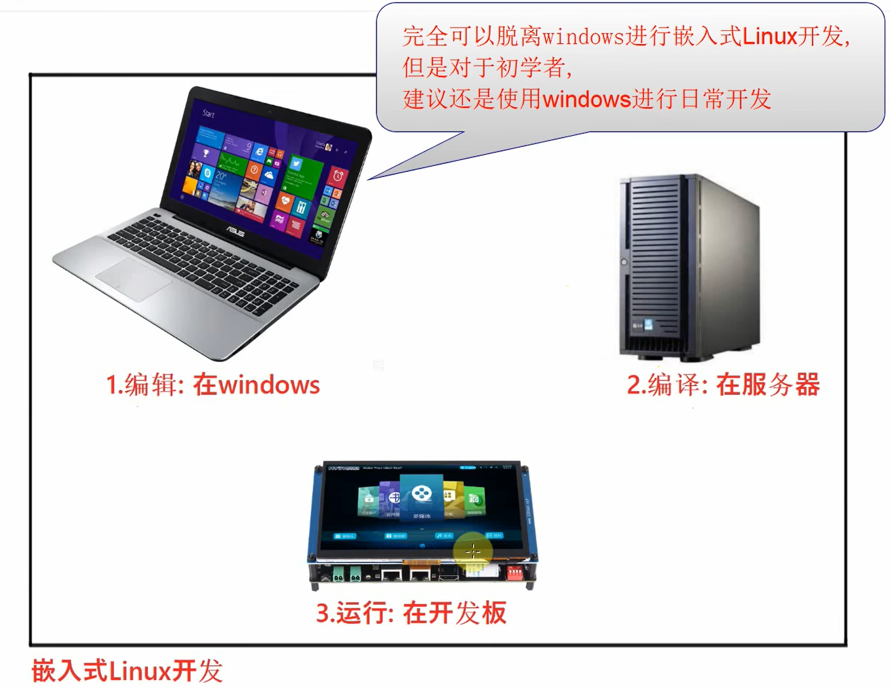
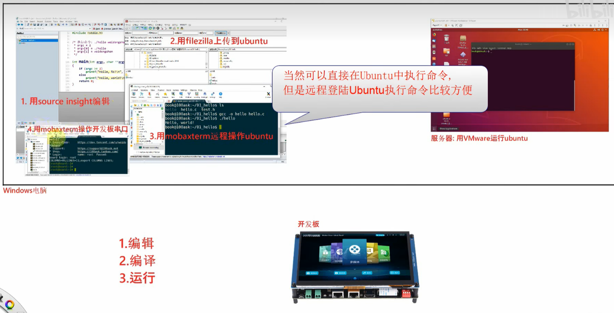
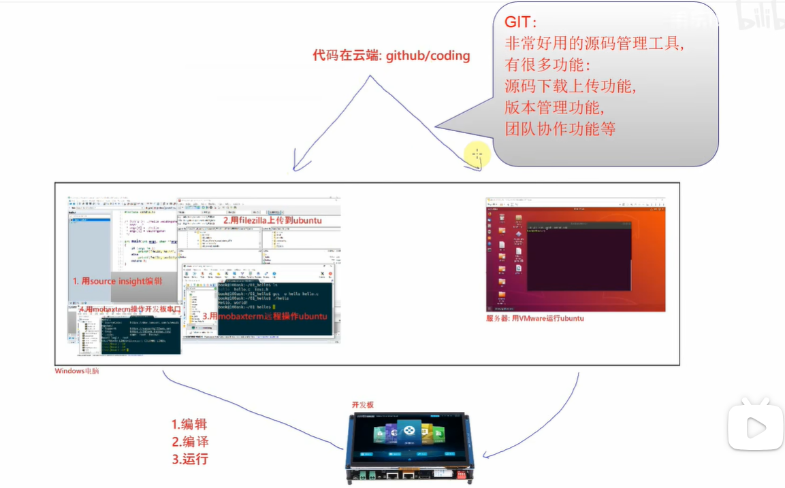
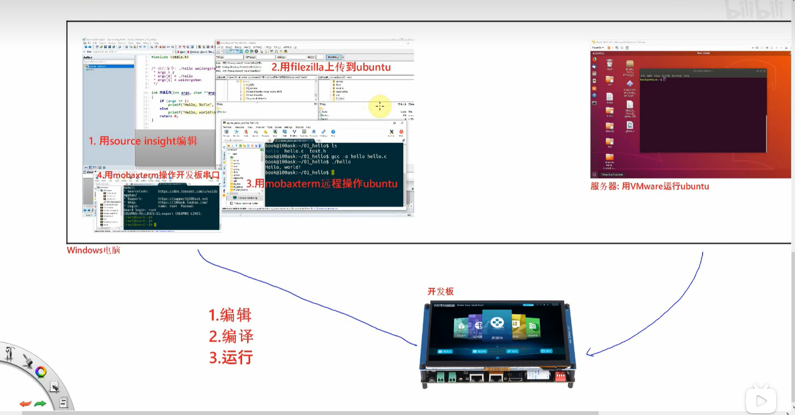

这段视频详细介绍了从单片机（MCU）开发转向嵌入式Linux开发时，开发环境和工作流程的根本性变化。为了助你备战面试，我将内容进行了结构化总结，并在核心技术点上进行了深度扩展，最后准备了一套针对性的面试题库。

### 一、 视频内容核心总结（带时间戳）

这个视频主要讲述了嵌入式Linux开发环境的搭建逻辑，核心思想是**“交叉开发”**模式。

- **00:00 - 00:06 嵌入式Linux系统构成**

  - 简述了系统由 BIOS/Bootloader、Linux内核、根文件系统、APP 四部分组成。

- **00:06 - 00:40 单片机 vs Linux 开发模式对比**

  - **单片机模式：** 依赖集成开发环境（IDE，如Keil/IAR）。在一台PC上完成编辑、编译、烧写、调试，全流程一键搞定。
  - **Linux模式：** 没有单一的完美IDE。因为涉及操作系统，开发过程被拆解，无法在单一软件中完成。

- **00:40 - 01:24 嵌入式Linux的“交叉开发”架构**

  

  - 提出了**“编辑在Windows，编译在服务器（Linux），运行在开发板”**的三端架构。

  - **解决方案：** 为了节省成本，通常在Windows上安装虚拟机（VMware）运行Ubuntu来充当“服务器/编译端”。

    

- **01:25 - 02:08 具体工作流与工具链**

  - **编辑：** Windows端使用 Source Insight（或其他编辑器如VS Code）看代码。
  - **传输：** 通过 FileZilla 将写好的代码传到 Ubuntu 虚拟机。
  - **编译：** 使用 MobaXterm 远程登录 Ubuntu，执行编译命令（生成可执行文件）。
  - **运行：** 使用 MobaXterm 通过串口（Serial）连接开发板，将程序下载并运行。

- **02:49 - 结尾 代码管理**

  
  
  - 强调了版本管理的重要性，使用 Git 将代码托管在 GitHub 或 Coding，方便在 Windows 和 Ubuntu 之间同步。

------

# 补充提问

## 提问1

图片中的这些工具都是干什么用的呢，我不是太懂，你能够给我分类解释下吗？

这张图片展示的是经典的 **嵌入式 Linux 交叉开发环境** 的全家桶。为了让你在面试中能清晰地描述这套环境，我将这些工具按照**功能角色**进行分类解释：

### 第一类：代码“生产”工具 (在 Windows 上)

**1. Source Insight**

- **图中位置：** 标注 "1. 用source insight编辑"。
- **它是干什么的：** 一个老牌但极其强大的**代码阅读和编辑器**。
- **为什么用它：** 嵌入式开发通常涉及 Linux 内核源码，文件成千上万。Source Insight 最厉害的地方在于它的**代码索引和跳转功能**。
  - *比如：* 你点一下某个函数名，它瞬间就能带你跳到定义它的地方，或者展示出谁调用了它（Call Graph）。
  - *面试加分点：* 虽然现在 VS Code 很火，但很多资深工程师依然偏爱 Source Insight 来看庞大的内核源码，因为它解析 C/C++ 的速度极快且准确。

### 第二类：代码“搬运”工具 (连接 Windows 和 Linux)

**2. FileZilla**

- **图中位置：** 标注 "2. 用filezilla上传到ubuntu"。
- **它是干什么的：** 一个 **FTP 文件传输工具**。
- **为什么用它：** 你的代码是在 Windows (Source Insight) 上写好的，但编译器（gcc）装在 Ubuntu 里。Windows 和 Ubuntu 是两个隔离的系统，FileZilla 就像一座桥，把写好的 `.c` 文件从 Windows **搬运** 到 Ubuntu 里去编译。
  - *注意：* 这是比较传统的做法，现在的进阶做法是用 Samba 或 NFS 共享文件夹，或者直接用 VS Code Remote，省去手动搬运这一步。

### 第三类：指挥与控制中心 (操作 Linux 和 开发板)

**3. MobaXterm** (图中出现了两次，因为它身兼多职)

- **它是干什么的：** 一个**全能终端神器**，它是你和系统对话的窗口。
- **功能 A (图中标注 3)：远程登录 Ubuntu**
  - 通过 SSH 协议连接到 VMware 里的 Ubuntu。在这里，你敲入 `gcc` 或 `make` 命令，指挥 Ubuntu 开始干活（编译代码）。
- **功能 B (图中标注 4)：操作开发板串口**
  - 通过串口协议（Serial）连接到物理开发板。在这里，你可以看到开发板启动时的打印信息，并在开发板的 Shell 里输入命令运行你的程序。
- *总结：* 它是**控制台**，左手控制编译服务器，右手控制目标开发板。

### 第四类：编译“工厂” (虚拟服务器)

**4. VMware Workstation + Ubuntu**

- **图中位置：** 右上角 "服务器: 用VMware运行ubuntu"。
- **它是干什么的：**
  - **VMware：** **虚拟机软件**。它允许你在 Windows 电脑里“虚拟”出一台独立的电脑。
  - **Ubuntu：** 运行在虚拟机里的 **Linux 操作系统**。
- **为什么用它：** 嵌入式 Linux 的程序（比如 `.ko` 驱动或可执行文件）必须用 Linux 下的编译器生成。因为我们买不起昂贵的专用 Linux 服务器，就在 PC 上用虚拟机模拟一台 Linux 服务器来充当**编译工厂**。

------

### 一图看懂工作流 (面试时可以这样描述)

如果你在面试中被问到“你的开发环境是怎么搭的”，可以按照这个**数据流向**来回答，非常有条理：

1. **编辑（Windows）：** 我在 Windows 上用 **Source Insight** 阅读和编写代码。
2. **传输（中间桥梁）：** 写好后，通过 **FileZilla** 将源码传送到 Ubuntu 虚拟机。
3. **编译（Ubuntu）：** 通过 **MobaXterm** 远程登录 Ubuntu，执行 make 命令进行交叉编译，生成可执行文件。
4. **运行（开发板）：** 最后通过 **MobaXterm** 的串口终端控制开发板，通过网络（NFS/TFTP）把程序下载到板子上运行调试。

### 二、 核心技术扩展（面试加分项）

视频介绍的是入门级的基础环境，但在实际企业开发和面试中，你需要掌握更高效、更深层的原理。

#### 1. 深入理解“交叉编译” (Cross Compilation)

- **视频中提到：** 在PC（x86架构）上编译，在板子（通常是ARM/RISC-V架构）上运行。
- **扩展知识：**
  - **工具链（Toolchain）：** 你需要知道交叉编译器通常包含 `gcc` (编译器), `binutils` (链接器、汇编器), `glibc/uclibc` (C标准库)。
  - **命名规则：** 面试中常问编译器名字的含义，例如 `arm-linux-gnueabihf-gcc`。
    - `arm`: 目标架构。
    - `linux`: 目标操作系统。
    - `gnueabihf`: ABI（应用二进制接口），`hf` 代表 hard float（硬件浮点），这在性能优化上很重要。

#### 2. 进阶文件传输：从 FileZilla 到 NFS

- **视频中提到：** 用 FileZilla 传输文件。这在频繁调试时效率极低（每次修改都要手动传）。
- **扩展知识（面试必问）：** **NFS (Network File System)**。
  - 在开发中，通常会在 Ubuntu 上搭建 NFS 服务器，通过网络将 Ubuntu 的某个目录**直接挂载**（Mount）到开发板的 `/mnt` 目录下。
  - **优势：** 编译完程序后，开发板直接就能“看到”并运行，省去了拷贝传输的步骤，极大提升调试效率。

#### 3. 调试手段的进阶

- **视频中提到：** 串口打印调试。
- **扩展知识：**
  - **GDB调试：** 类似于单片机的断点调试。在Linux上是 `gdbserver` (板端) + `gdb` (主机端) 配合使用。
  - **Core Dump：** 当程序崩溃（Segmentation Fault）时，分析核心转储文件来定位错误。
  - **日志系统：** 实际项目中不仅靠 `printf`，还会用到 `syslog` 或专门的日志库（如 log4c）。

------

### 三、 经典面试题与高分回复

针对该视频内容及嵌入式Linux基础，这里为你准备了5个高频面试题。

#### Q1: 既然现在开发板性能越来越强，为什么我们还需要“交叉编译”？为什么不直接在板子上编译代码？

> **考察点：** 对嵌入式系统资源限制和架构差异的理解。

- 简洁回复：

  主要有两个原因：性能和环境。

  1. **编译效率：** 尽管板子性能提升，但相比PC（x86服务器），其CPU主频和IO速度仍有差距。编译Linux内核或大型Qt项目，PC可能只需半小时，板子可能跑一天甚至因为内存不足（OOM）而失败。
  2. **存储限制：** 完整的编译环境（编译器、头文件、库、中间文件）占用大量存储空间，而嵌入式设备的Flash通常很小，不适合部署庞大的开发环境。

#### Q2: 视频里提到了 Bootloader、Kernel 和文件系统，请简述嵌入式Linux的启动流程是怎样的？

> **考察点：** 对系统全貌的宏观认知。

- 简洁回复：

  启动流程通常分为四个阶段：

  1. **ROM Code / BIOS：** CPU上电，固化代码执行，初始化最基本的RAM等，加载Bootloader。
  2. **Bootloader (如U-Boot)：** 初始化硬件（网卡、Flash等），设置启动参数，将Linux内核加载到内存，并跳转执行。
  3. **Linux Kernel：** 初始化设备驱动，挂载**根文件系统 (RootFS)**，启动 `init` 进程（PID 1）。
  4. **User Space：** `init` 进程根据配置脚本启动各种系统服务和用户的应用程序。

#### Q3: 在开发阶段，如何实现开发板与PC之间的高效文件共享？视频中提到的FileZilla是最好的选择吗？

> **考察点：** 开发效率与工具链的实际应用经验。

- 简洁回复：

  FileZilla 适合单次大文件传输，但开发调试阶段效率太低。

  最好的方式是使用 NFS (网络文件系统)。我们在宿主机（Ubuntu）配置NFS服务，开发板通过网络直接挂载宿主机的目录。这样在PC端修改编译后，板端通过挂载点直接运行新程序，实现了“零拷贝”调试，大大缩短了开发周期。

#### Q4: 嵌入式开发中，Linux和单片机（RTOS/裸机）最大的区别是什么？

> **考察点：** 甚至涉及到内存管理、并发模型等核心OS概念。

- 简洁回复：

  核心区别在于内存管理和地址空间。

  - **单片机：** 通常是扁平内存模型，直接操作物理地址，程序崩溃容易导致整个系统死机。
  - **Linux：** 引入了**MMU（内存管理单元）**，分为用户态和内核态。每个应用程序有独立的虚拟地址空间。程序崩溃通常只会被OS杀掉，不会影响系统稳定性，但也因此导致直接操作硬件（如GPIO）不如单片机方便，必须通过驱动层。

#### Q5: 如果你的程序在开发板上运行出现了 "Segmentation fault"，你会怎么调试？

> **考察点：** 实际排错能力（视频中只提到了运行，没提排错）。

- 简洁回复：

  这是最常见的内存访问错误。我会按以下步骤排查：

  1. **查看打印：** 检查出错前的最后日志。
  2. **GDB调试：** 如果可复现，挂载GDB，运行程序直到崩溃，用 `bt` (backtrace) 命令查看函数调用栈。
  3. **Map文件/反汇编：** 如果无法在线调试，根据报错的PC指针地址，结合系统的 `System.map` 或反汇编代码，定位是哪一行指令出错。

### 下一步建议

你可以尝试在自己的电脑上按照视频流程搭建一套环境：安装 VirtualBox/VMware -> 安装 Ubuntu -> 配置 Samba (让Windows能访问Ubuntu文件) -> 编写一个 Hello World -> 交叉编译。**只有亲手配置过一次环境，才能在面试中对答如流。**
