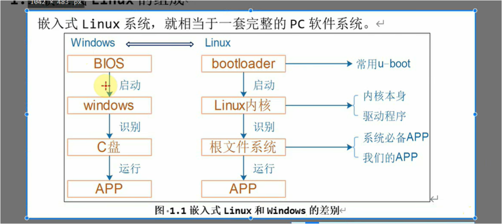

# 视频讲解

这个视频主要介绍并总结了**2025年全新的嵌入式Linux学习路线**。讲师结合自己20多年的行业经验，对比了过去和现在嵌入式开发的区别，指出由于行业生态的变化，传统的学习方法已经不再适用，并为初学者规划了一套更加高效、符合当前企业需求的新学习体系。

以下是视频内容的详细分析与总结：

### 1. 什么是嵌入式Linux？（类比Windows）

为了让初学者更容易理解，讲师将嵌入式Linux的启动过程与Windows进行了类比：



- **Windows启动流程：** <span style="color:#FF0000; background:#00FF80; border:1px solid #FF00FF;">BIOS启动 -> 识别C盘 -> 找到应用程序 -> 运行APP。</span>
- **Linux启动流程：** <span style="color:#FF0000; background:#00FF80; border:1px solid #FF00FF;">Bootloader（类似BIOS）启动内核 -> 内核识别根文件系统（类似C盘） -> 找到应用程序 -> 运行APP。</span>

### 2. 为什么传统的学习方法已经淘汰？

- **过去的学习方式：** 十几二十年前，学习嵌入式Linux需要严格按照系统底层到上层的顺序：先学裸机程序（如U-boot），再学内核移植，然后学各种驱动程序，最后才学编写应用程序。
- **现在行业的现状（厂家“卷”）：** 现在的芯片厂家和核心板厂家竞争非常激烈，他们通常已经把底层的Bootloader、内核以及大部分驱动程序都做好了。
- **从底层学起的“性价比”极低：** 很多公司甚至已经没有底层开发人员了，直接拿厂家做好的系统来开发应用。如果现在还从底层Bootloader和内核开始学，不仅难度极大，而且在实际工作中根本用不上（公司不会让新手去碰核心底层），投入产出比极低。

### 3. 全新的嵌入式Linux学习路线图

基于上述行业变化，讲师提出了一套由浅入深、注重实际应用的新路线图：

- **基础入门（打底子）：**
  - 如果完全零基础，首先需要学习Ubuntu操作系统的基本操作。
  - 接着掌握开发板的基本操作。
- **核心基石（应用与驱动基础）：**
  - **应用基础：** 随后进入“应用基础”的学习。
  - **驱动基础：** 紧接着要学习“驱动基础”。讲师特别强调，即使以后只打算做纯粹的应用程序开发，也**必须**掌握基础的驱动开发能力，因为嵌入式应用最终都要和硬件设备打交道，具备底层思维才能拥有更强的“系统能力”。
- **“实验班”快速入门模式：**
  - 为了避免枯燥的理论学习，课程引入了“实验班”概念。通过“应用开发入门实验班”，可以快速做出第一个包含从前端GUI到后台控制、驱动、硬件的完整项目，建立全局概念。
  - 通过“驱动大全实验班”（填鸭式快速教育），可以套用模板快速掌握常见设备的驱动开发。

### 4. 两条不同的职业发展路线

学完基础后，可以根据个人的兴趣和职业规划选择不同的路线：

- **应用开发路线：** <span style="color:#FF0000; background:#00FF80; border:1px solid #FF00FF;">学习路径为：应用基础 -> 驱动基础 -> 项目基础 -> 挑选自己感兴趣的各个实战项目去练手。</span>
- **驱动开发路线：** <span style="color:#FF0000; background:#00FF80; border:1px solid #FF00FF;">学习路径为：驱动基础 -> 驱动大全（深入的理论知识，较难）-> 驱动子系统。如果不打算做专门的驱动开发，这部分深奥的理论知识是可以跳过不学的。</span>

**总结：** 讲师建议现在的学习者**不要再盲目地从最难的底层内核代码开始啃**。应该优先利用厂家提供的便利，通过“实验班”快速建立系统级概念，先掌握实际工作中最需要的应用层和基础驱动层技术，然后再根据工作需要决定是否向更深层次的底层驱动进阶。


# 问题提问

## 1.对 u-boot 与 bootloader的理解

<span style="color:#FF0000; background:#00FF80; border:1px solid #FF00FF;">什么是u-boot呢，什么又是bootloader呢，它们之间又是什么关系呢，我不是太懂，你能够给我详细解释下吗？</span>

没问题，刚接触嵌入式开发时，这两个概念确实很容易让人觉得绕。其实理解了它们的本质后，你会发现非常简单。

我们可以用一句话来概括它们的联系：**Bootloader 是一类软件的“统称”（抽象概念），而 U-boot 是这类软件中“最出名的一个”（具体产品）。**

下面我们详细来拆解：

### 1. 什么是 Bootloader？（它是一个“岗位”或“类别”）

<span style="background:#00FF80; color:#FF0000;">**Bootloader**（引导加载程序）是在操作系统（比如 Linux 内核）运行之前执行的一小段代码。</span>

你可以把它理解为整个系统的“点火器”**或者**“先遣部队”。当你给板子通电开机的那一瞬间，Linux 系统还在 Flash（类似电脑硬盘）里面躺着，是无法自己运行的。这时候就需要 Bootloader 先站出来干活。

它的<span style="color:#FF0000; background:#00FF80; border:1px solid #FF00FF;">主要核心任务只有两个</span>：

- **第一步：初始化核心硬件。** 比如把 CPU 频率调好，把内存（RAM）初始化好，把串口打通，让系统处于一个准备就绪的正常状态。
- **第二步：把操作系统“搬”进内存并启动。** <span style="color:#FF0000; background:#00FF80; border:1px solid #FF00FF;">它会去存储设备里找到 Linux 内核，把它复制到刚刚初始化好的内存中，然后大喊一声：“内核老哥，我的活儿干完了，接下来系统交给你接管了！”，最后把控制权交出去。</span>

**💡 类比：** 就像视频里提到的，**Bootloader 在嵌入式设备里的作用，就完全等同于你个人电脑主板上的 BIOS（或 UEFI）。** 电脑开机先亮一个 Logo（BIOS在自检硬件），然后才开始转圈圈进 Windows 系统。

### 2. 什么是 U-boot？（它是一个具体的“产品”）

**U-boot**（全称是 Universal Boot Loader，通用引导加载程序）<span style="color:#FF0000; background:#00FF80; border:1px solid #FF00FF;">是一个具体的、开源的软件代码项目。</span>

因为<span style="color:#FF0000; background:#00FF80; border:1px solid #FF00FF;">从头写一个优秀的 Bootloader 非常难，不仅要懂各种底层的 CPU 架构，还要适配千奇百怪的硬件板子。后来开源社区开发并维护了这样一款非常牛的 Bootloader 代码，就是 U-boot。</span>

它的特点是：

- **功能极其强大：** 它不仅能傻瓜式地启动系统，还支持很多高级操作，比如通过网线下载代码到板子上、支持各种复杂的文件系统、提供命令行界面让工程师调试硬件等。
- **通用性极强：** 几乎<span style="color:#FF0000; background:#00FF80; border:1px solid #FF00FF;">支持市面上所有的 CPU 架构（ARM、x86、MIPS、RISC-V 等等）。</span>
- **行业绝对标杆：** 因为它太好用了，现在<span style="color:#FF0000; background:#00FF80; border:1px solid #FF00FF;">全世界搞嵌入式 Linux 的芯片厂家和工程师，基本上有 90% 以上都在使用它。</span>

### 3. 它们之间的关系总结

- **种属关系：** U-boot 是 Bootloader 的其中一种。
- **类比理解：** 如果 Bootloader 是指“智能手机操作系统”这个**类别**，那么 U-boot 就是“安卓（Android）”这个**具体产品**。
  - 如果 Bootloader 是指“浏览器”这个**类别**，那么 U-boot 就是“Chrome 谷歌浏览器”。
- **日常语境：** 世界上不仅有 U-boot 这一种 Bootloader（还有如 Barebox、RedBoot 等），<span style="background:#00FF80;">但在嵌入式 Linux 领域，U-boot 实在太成功、太普及了，以至于很多工程师在日常沟通时，**会直接把 U-boot 当作 Bootloader 的代名词**。</span>

总结一下：当设备一通电，**U-boot**（作为一款极其优秀的 **Bootloader**）率先苏醒，它快速理顺了基础硬件，唤醒了内存，然后把 Linux 内核请进内存并启动。系统启动完成之后，U-boot 就功成身退，进入休眠状态了。


# 2.对CPU架构的理解

<span style="color:#FF0000; background:#00FF80; border:1px solid #FF00FF;">CPU架构又是什么东西呢，我不是太懂，你能够给我详细解释下吗？</span>


没问题！CPU架构这个词听起来确实很有距离感，但我们依然可以用生活中的例子来轻松搞定它。

简单来说，**CPU架构就是CPU能够听懂的“语言”以及它的“工作流派”。** 它在专业上被称为“<span style="color:#FF0000; background:#00FF80; border:1px solid #FF00FF;">指令集架构</span>”（ISA, Instruction Set Architecture）。

我们可以从两个维度来彻底理解它：

### 1. 维度一：CPU的“语言种类”（指令集）

如果<span style="background:#00FF80;">把CPU看作是一个为你干活的工人，那么你（或者操作系统）要让它干活，就必须给它下达“指令”（比如：做加法、读取内存、保存数据）</span>。

- **不同架构的CPU，听懂的语言是完全不同的。**
- 就像有的工人只懂中文，有的工人只懂英文。如果你把一个为“中文工人”写的指令书（软件程序），直接丢给一个“英文工人”，他是完全看不懂的，机器就会罢工。
- 这就是为什么你在 Windows 电脑（x86 架构）上下载的 `.exe` 软件，不能直接安装到苹果手机（ARM 架构）上的根本原因——**语言不通**。

### 2. 维度二：CPU的“工作流派”（CISC 与 RISC）

除了语言不同，不同架构的 CPU 在设计哲学上也分成了两大门派：

- **CISC（复杂指令集）：也就是“全能老法师”流派。**
  - **特点：** 它内置了非常多、极其复杂的指令。比如你下达一个指令叫“盖一栋房子”，它内部有一套极其复杂的电路，能直接自己把房子盖好。
  - **优缺点：** 软件写起来轻松（一条指令干很多事），性能极其强大；但缺点是CPU设计极度复杂，体积大，**非常耗电且发热严重**。
  - **代表作：** **x86 架构**（Intel 和 AMD 的电脑 CPU 都是这个流派）。
- **RISC（精简指令集）：也就是“高效流水线”流派。**
  - **特点：** 它去掉了那些花里胡哨的复杂指令，只保留最基础、最常用的指令。你不能直接让它“盖房子”，你必须把指令拆解成：“搬砖”、“和水泥”、“砌墙”。
  - **优缺点：** 虽然软件要下达的指令变多了，但CPU内部的设计变得非常简单、高效。最大的优点是**极度省电、不发热**。
  - **代表作：** **ARM 架构**（你用的智能手机、平板电脑、以及大部分嵌入式设备，全都是这个流派）。

### 3. 目前天下三分的“三大架构”

了解了基本概念，我们来看看目前世界上最主流的三大 CPU 架构（这也直接关系到你未来的职业方向）：

1. **x86 架构（PC 与服务器的霸主）：**
   - 由 Intel 和 AMD 把持，性能怪兽。你桌面的 Windows 电脑、各大公司的云服务器，基本都是 x86 的天下。
2. **ARM 架构（移动与嵌入式的王者）：**
   - 极度省电，统治了全世界 99% 的智能手机（苹果 A 系列芯片、高通骁龙、华为麒麟全都是基于 ARM 架构定制的）。**你在视频里看到的“嵌入式 Linux 开发”，90% 以上也是在 ARM 架构的开发板上进行的。**
3. **RISC-V 架构（未来的开源新星，读作 "risk-five"）：**
   - 这是一个相对较新的架构。x86 和 ARM 都是有专利壁垒的（要交巨额授权费），而 RISC-V 是**完全开源免费**的。现在很多国内芯片厂家为了防“卡脖子”，都在疯狂研发 RISC-V 架构的芯片，这是未来物联网和嵌入式领域的大热门。

### 总结：为什么学嵌入式必须懂“架构”？

结合你上一个问题：你现在在你的 Windows 电脑（**x86 架构**）上写了一段 C 语言代码，你想把它烧录到你的嵌入式开发板（**ARM 架构**）上运行。

因为“语言不通”，你不能直接用电脑自带的工具编译，你必须使用一种叫做“交叉编译器”的工具，在 x86 电脑上，把代码翻译成 ARM CPU 能听懂的语言。同时，像 **U-boot** 这种底层软件，针对不同架构的 CPU，它唤醒硬件的方式也是截然不同的。这就是为什么在学习嵌入式时，第一步总是要先确认我们用的是什么架构的芯片！


# 对cpu架构的理解

当然可以。CPU 架构这个概念一开始确实比较抽象，你可以先把它理解成一句话：

**CPU 架构 = CPU“如何理解指令、如何组织内部结构、如何执行程序”的设计规则。** 🧠

也就是说，它不是单纯指某一个 CPU 型号，而是指 CPU 背后的“设计体系”。

------

## 1️⃣ 先理解 CPU 是什么

CPU，全称是 **Central Processing Unit，中央处理器**。

你可以把它理解成电脑的大脑：

电脑运行程序时，程序最终都会变成一条条很简单的指令，比如：

```text
把两个数相加
把数据从内存取出来
判断一个条件是否成立
跳转到另一段代码继续执行
```

CPU 的工作就是不断重复：

```text
取指令 → 分析指令 → 执行指令 → 写回结果
```

比如你打开微信、运行 Python、播放视频，本质上都是 CPU 在执行大量指令。

------

## 2️⃣ 那“架构”是什么意思？

“架构”可以理解成 **设计方案 / 规则体系 / 工作方式**。

举个简单例子：🏠

同样是盖房子，可以有不同建筑风格：

| 类型     | 特点                         |
| -------- | ---------------------------- |
| 中式建筑 | 木结构、院落、对称布局       |
| 欧式建筑 | 拱门、立柱、石材装饰         |
| 现代建筑 | 钢筋混凝土、大玻璃、开放空间 |

房子都是房子，但设计规则不同。

CPU 也是一样：

| CPU 架构     | 常见代表                     | 常见设备                    |
| ------------ | ---------------------------- | --------------------------- |
| x86 / x86-64 | Intel、AMD                   | 台式机、笔记本、服务器      |
| ARM          | Apple M 系列、高通、华为麒麟 | 手机、平板、Mac、嵌入式设备 |
| RISC-V       | 开源架构                     | 物联网、教学、芯片研究      |

它们都能执行程序，但理解指令的方式、内部设计思想不完全一样。

------

## 3️⃣ CPU 架构最核心的是：CPU 能听懂什么指令

程序最终会被编译成机器指令。

比如一个高级语言：

```c
a = b + c;
```

经过编译后，可能会变成类似这样的底层指令：

```asm
LOAD R1, b
LOAD R2, c
ADD R3, R1, R2
STORE a, R3
```

意思大概是：

```text
把 b 取出来
把 c 取出来
相加
把结果存回 a
```

问题来了：
**不同 CPU 能听懂的指令格式可能不一样。**

这就像不同国家的人说不同语言：

| 人类语言 | CPU 类比      |
| -------- | ------------- |
| 中文     | x86 指令集    |
| 英文     | ARM 指令集    |
| 日文     | RISC-V 指令集 |

所以，一个为 x86 编译的软件，不能直接在 ARM CPU 上运行，除非重新编译或者通过模拟/转译。

这也是为什么有些软件下载页面会写：

```text
Windows x64
macOS Intel
macOS Apple Silicon
Linux ARM64
```

它们对应的就是不同 CPU 架构。

------

## 4️⃣ CPU 架构可以分成两个层面

很多人容易把这两个概念混在一起：

### ① 指令集架构 ISA：CPU 对外的“语言规则”

ISA，全称是 **Instruction Set Architecture**，指令集架构。

它规定 CPU 能识别哪些指令，比如：

```text
加法指令
减法指令
乘法指令
内存读取指令
跳转指令
比较指令
```

常见 ISA 包括：

```text
x86 / x86-64
ARM
RISC-V
MIPS
```

你可以把 ISA 理解成：

> CPU 对程序员和编译器暴露出来的“说明书”。

------

### ② 微架构：CPU 内部具体怎么实现

微架构就是 CPU 内部怎么设计。

比如：

```text
有几个核心？
每个核心有几级流水线？
缓存多大？
能不能乱序执行？
分支预测准不准？
功耗控制怎么样？
```

举个例子：

Intel 和 AMD 都支持 x86-64 架构，但是它们的 CPU 内部设计不一样。

| 层面       | 例子                |
| ---------- | ------------------- |
| 指令集架构 | x86-64              |
| 微架构     | Intel Core、AMD Zen |

就像两辆车都遵守一样的交通规则，但发动机、底盘、变速箱设计可以完全不同。

------

## 5️⃣ x86 和 ARM 有什么区别？

这是最常见的问题。

### x86 架构

x86 主要来自 Intel，后来 AMD 也使用。

它常见于：

```text
Windows 台式机
Windows 笔记本
传统服务器
部分 Linux 机器
```

特点大致是：

```text
性能强
兼容性好
历史包袱比较重
功耗相对较高
```

所以传统电脑、服务器上 x86 很常见。

------

### ARM 架构

ARM 常见于：

```text
手机
平板
智能设备
苹果 M1/M2/M3/M4 系列 Mac
嵌入式设备
```

特点大致是：

```text
功耗低
能效高
适合移动设备
近年来性能也很强
```

以前大家觉得 ARM 主要适合手机，但现在 Apple M 系列出来后，ARM 在笔记本和桌面设备上也很强。

------

## 6️⃣ 为什么 CPU 架构会影响软件运行？

因为软件最终要变成 CPU 能理解的机器码。

比如你写一个 Python 程序：

```python
print("hello")
```

看起来 Python 代码是一样的，但 Python 解释器本身要适配不同 CPU 架构。

所以你下载 Python 时可能会看到：

```text
Windows x86-64
macOS Intel
macOS Apple Silicon
Linux ARM64
```

原因是：

```text
同一个软件，需要针对不同 CPU 架构准备不同版本。
```

再比如 Docker 镜像也经常区分：

```text
amd64
arm64
```

其中：

```text
amd64 ≈ x86-64
arm64 ≈ 64位 ARM
```

如果你在 ARM 电脑上运行 amd64 程序，可能会变慢，甚至无法运行。

------

## 7️⃣ CPU 架构和操作系统有什么关系？

CPU 架构决定底层硬件能执行什么指令。

操作系统需要运行在 CPU 上，所以操作系统也要适配架构。

例如：

| 设备                | CPU 架构 | 操作系统    |
| ------------------- | -------- | ----------- |
| 普通 Windows 笔记本 | x86-64   | Windows x64 |
| MacBook M 系列      | ARM64    | macOS ARM64 |
| iPhone              | ARM64    | iOS         |
| 树莓派              | ARM64    | Linux ARM64 |

所以不是所有系统都能随便装到所有机器上。

比如普通 Windows x86 系统，不能直接安装到手机 ARM 芯片上。

------

## 8️⃣ CPU 内部大概有哪些组成？

你可以把 CPU 看成一个小工厂 🏭：

| 组成部分     | 作用                     |
| ------------ | ------------------------ |
| 控制单元     | 指挥各个部件工作         |
| 运算单元 ALU | 做加减乘除、逻辑运算     |
| 寄存器       | CPU 内部最快的小存储空间 |
| 缓存 Cache   | 临时存放常用数据         |
| 流水线       | 让多条指令分阶段同时执行 |
| 分支预测     | 猜程序接下来会走哪条路   |
| 多核心       | 多个 CPU 核心并行工作    |

比如：

```text
寄存器：CPU 手边的小纸条
缓存：CPU 桌上的资料
内存：房间里的书架
硬盘：仓库
```

速度大概是：

```text
寄存器最快 > 缓存 > 内存 > 硬盘最慢
```

所以 CPU 架构设计时，非常重视缓存、流水线、并行执行这些东西。

------

## 9️⃣ 举个完整例子：打开一个软件时发生了什么？

比如你打开浏览器：

```text
1. 操作系统把浏览器程序从硬盘加载到内存
2. CPU 从内存中读取程序指令
3. CPU 根据自己的架构理解这些指令
4. 执行计算、判断、跳转、读写数据
5. 显示结果到屏幕上
```

这里 CPU 架构决定了：

```text
程序指令长什么样
CPU 怎么解析指令
CPU 怎么执行指令
CPU 怎么访问内存
CPU 怎么提高执行效率
```

------

## 10️⃣ 最简单的理解方式

你可以这样记：

```text
CPU = 执行程序的大脑
架构 = 这个大脑的设计规则
指令集 = CPU 能听懂的语言
微架构 = CPU 内部具体怎么造
```

更通俗地说：

> CPU 架构就是 CPU 的“语言 + 组织结构 + 工作方式”。

------

## 11️⃣ 对初学者来说，重点掌握这几个就够了

你暂时不需要一开始就深入流水线、乱序执行、缓存一致性这些细节。

先记住这几个核心点就可以：✅

| 概念           | 你需要理解成                       |
| -------------- | ---------------------------------- |
| CPU            | 执行程序的核心硬件                 |
| CPU 架构       | CPU 的设计体系                     |
| 指令集架构 ISA | CPU 能听懂的指令语言               |
| x86-64         | 常见电脑/服务器架构                |
| ARM64          | 手机、Apple M 系列、嵌入式常见架构 |
| 微架构         | 同一种指令集下，不同厂商的具体实现 |

------

一句话总结：

**CPU 架构不是某一个具体芯片，而是一套规定 CPU 如何理解和执行程序的设计体系。不同架构就像不同语言，软件必须被翻译成对应 CPU 能听懂的机器指令，才能正常运行。**
