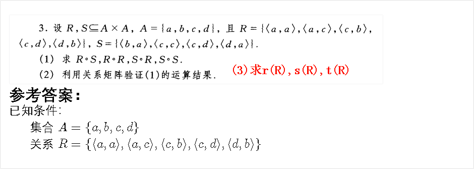

# 关系映射理解

你屏幕上显示的这些**复合运算（$R \circ S$）**、**逆关系（$R^{\sim}$）** 和 **关系矩阵**，虽然在离散数学中看起来是枯燥的数字和字母组合，但在**高级阅读逻辑**和**信息提取**中，它们其实对应着一种非常强大的“底层思维模组”。

将其转化为阅读能力，主要体现在以下三个维度：

------

### 1. 复合运算（$R \circ S$）：训练“跳跃式逻辑推导”

在数学里，$R \circ S$ 的意思是：如果 A 通过 $R$ 连向 B，B 又通过 $S$ 连向 C，那么 A 就可以直接连向 C。

- **阅读中的实际含义：** 识别**隐藏的因果链**。
- **提升阅读速度：** 很多长篇大论的中间段落其实只是“中间变量 B”。如果你能迅速识别出作者在建立一个逻辑链（例如：政策 $R \rightarrow$ 市场信心 $S \rightarrow$ 投资增长），当你在第二段看到“市场信心”时，大脑可以直接复合出“政策对投资的影响”。
- **应用：** 看到 A 指向 B，B 指向 C，你就可以在脑中直接完成 $R \circ S$。这样你就不需要逐字阅读中间解释性的废话，**直接捕捉核心结论**。

### 2. 关系矩阵（$0$ 与 $1$）：训练“结构化扫描”

你屏幕下方的矩阵（由 $0$ 和 $1$ 组成）是关系的可视化。$1$ 代表有关系，$0$ 代表没关系。

- **阅读中的实际含义：** 区分**核心信息**与**背景杂音**。
- **提升理解深度：** 高手在阅读时，脑子里会自动形成一张矩阵表。
  - **矩阵中的 $1$：** 关键论点、论据、转折点。
  - **矩阵中的 $0$：** 修饰词、填充句、无关痛痒的细节。
- **应用：** 在读复杂文档（如法律条文、技术手册）时，你可以问自己：“这两者之间是有关系的（$1$）还是无关系的（$0$）？” 这种**二元判断法**能强迫你从线性阅读转变为空间化阅读，极大地提高处理复杂信息的速度。

### 3. 逆关系（$R^{\sim}$）：训练“批判性反向思维”

逆关系是将关系对 $(x, y)$ 调换为 $(y, x)$。

- **阅读中的实际含义：** 检验**论证的可逆性**（逻辑严密性）。
- **提升批判性思维：** 当作者说“因为有 A（技术突破），所以有 B（经济增长）”时，你瞬间在脑中做一个 $R^{\sim}$ 运算：“如果没有 B，是不是说明一定没有 A？”或者“如果有 B，是否一定是因为 A？”
- **应用：** 通过这种快速的“关系对调”，你能瞬间识破作者的逻辑漏洞或以偏概全，不需要等读完全文才反应过来。

------

### 总结：如何实战操作？

如果你想通过练习这些题来提升阅读，可以尝试在读一段话时进行**“关系建模”**：

1. **定义元素：** 这段话里出现了哪几个实体（A, B, C...）？
2. **定义关系：** 他们之间是什么关系（因果、并列、包含）？
3. **进行复合：** 如果把这些关系连起来，最终的“始末关系”是什么？

> **举个例子：**
>
> - 原文：*“由于全球气温上升（A），极地冰川开始融化（B）。而冰川融化（B）导致海平面上升（C），威胁沿海城市（D）。”*
> - **大脑中的复合运算：** $A \rightarrow B \rightarrow C \rightarrow D$。
> - **最终理解：** $A \rightarrow D$（气温上升威胁城市）。

**这样你就不再是“读”文字，而是在“算”逻辑。** 这种思维一旦养成，你一眼扫过去就能看到文章的“骨架”，阅读速度自然会成倍提升。

你想试着用这种“关系建模”的方法，分析一下你现在正在做的这道题背后的逻辑结构吗？

# 关系映射的实际应用

除了刚才提到的**阅读理解**，离散数学里的“关系映射”（Relations and Mappings）在现实生活中有着极其广泛的硬核应用。可以说，它是现代社会处理复杂信息的“底层操作系统”。

如果你想把这种数学思维内化为自己的能力，以下几个实际应用场景能极大地帮助到你：

### 1. 打造“第二大脑”：个人知识管理 (PKM)

传统的记笔记是线性的（像Word文档，从上往下写），这就像是数学里的“孤立集合”。但人类大脑的记忆是网状的。

- **实际应用：** 现在非常流行的笔记软件（如 Obsidian、Roam Research、Notion）核心逻辑就是**“双向链接”（对称关系与传递关系）**。
- **如何帮你：** 当你学到一个新概念 A 时，不要只把它存起来，而是问自己：“A 和我之前学过的 B 有什么关系？”（建立映射）。当你把经济学的“复利”、生物学的“进化”和计算机的“算法”建立起**关系图谱**时，你就能跨学科地解决问题，产生极强的创新能力。

### 2. 深度问题解决：根因分析法 (Root Cause Analysis)

在工作中遇到问题，多数人只会解决“表象”（矩阵中的末端节点）。

- **实际应用：** 丰田公司著名的“5 Whys（连续追问五个为什么）”本质上就是一个**寻找关系链起点的逆向运算（$R^{-1}$ 的多次复合）**。

- **如何帮你：** * 现象 (E)：机器停了。

  - $E \rightarrow D$：为什么停？因为保险丝烧了。

  - $D \rightarrow C$：为什么烧？因为轴承过载。

  - $C \rightarrow B$：为什么过载？因为润滑不足。

  - $B \rightarrow A$：为什么不足？**因为油泵坏了（这才是根本原因 A）。**

    当你习惯了这种“链条式映射”思维，你就能一眼看透问题的本质，而不是“头痛医头，脚痛医脚”。

### 3. 破除拖延症：复杂任务的“偏序关系”拆解

当你面对一个极其庞大的任务（比如写毕业论文、策划一场大型活动）时，大脑往往会因为觉得“太复杂、无从下手”而开始拖延。

- **实际应用：** 项目管理中的关键路径法（PERT图）和前置任务规划。这在数学上叫**“偏序关系”**（有先后顺序，不能循环）。

- **如何帮你：** 拿出一张纸，把大任务拆成几十个小动作（集合元素）。然后找它们之间的**前置映射关系**：“做 B 之前，必须先完成 A”。

  一旦你把这几十个元素的“关系矩阵”排好（也就是画出流程图），你会发现现在立刻能动手的只有那几个没有任何前置条件的“起始点”。这就把庞大的焦虑转化成了具体可执行的动作。

### 4. 看透商业逻辑：推荐算法的底层密码

你有没有好奇过，为什么抖音、淘宝、网易云音乐总能精准地给你推荐内容？这背后全是“关系映射”。

- **实际应用：** 协同过滤算法（Collaborative Filtering）。

- **如何帮你：** 它的底层逻辑是：

  1. 系统发现你（User 1）和另一个人（User 2）都喜欢商品 A 和 B（建立**等价关系**，把你们归为一类人）。

  2. 系统发现 User 2 还买过商品 C（User 2 $\rightarrow$ C 存在关系）。

  3. 系统通过复合运算推导出：你也极有可能喜欢 C（推导 User 1 $\rightarrow$ C）。

     理解了这个逻辑，你在面对铺天盖地的信息和消费陷阱时，就会多一层“上帝视角”，意识到“我正在被哪种算法映射”，从而保持独立思考。

------

**总结来说，掌握“关系映射”，就是掌握了从“杂乱无章的散点”中找出“隐藏规律”的能力。**

这几个方向里，你是对**提升学习记忆（知识管理）**更感兴趣，还是对**优化做事效率（任务拆解）**更感兴趣呢？我们可以针对其中一点深入聊聊具体的操作方法。

