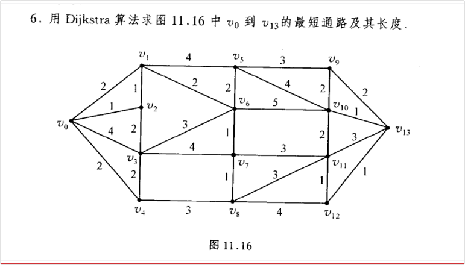

# 问题1 迪杰斯特拉算法中存在的循环依赖（不能使用递归问题）

这道求迪杰斯特拉的v0-v13最短距离的问题，可不可以从递归的角度来理解呢，就是求v0到v13的最短距离，我们只要求出v0到v9，v10，v11，v12的最短距离就行了，然后分别加上各边权重取个最小值就行了。然后求V0到V9的最短距离只需要求出v0到v5，v10的距离就行了，依次类推。这里感觉是不是有点问题啊，有些部分重复了，比如这个v10。

你的直觉非常敏锐！你刚才描述的思路，其实是计算机科学中一个非常核心的思想：**动态规划（Dynamic Programming）**中的 **状态转移方程**。

你提到的“要求 $v_{13}$ 的最短距离，只要求出 $v_9, v_{10}, v_{11}, v_{12}$ 的最短距离……” 这完全符合最短路径的**最优子结构**性质。用数学语言表达也就是：

$D(v_{13}) = \min \{ D(v_9)+2, D(v_{10})+1, D(v_{11})+3, D(v_{12})+1 \}$

但是，**你感觉到的“问题”也是完全正确且一针见血的！**

### 为什么简单的递归在这里行不通？

你敏锐地发现了 $v_{10}$ 的重复/循环依赖问题。这就引出了这种图（以及纯递归解法）的一个致命冲突：**这是一个包含环的无向图**。

如果你用纯递归的思路去解，会发生这样的死循环：

1. 为了求 $v_9$ 的最短距离，程序发现 $v_9$ 和 $v_{10}$ 相连，于是去请求 $v_{10}$ 的最短距离。
2. 为了求 $v_{10}$ 的最短距离，程序发现 $v_{10}$ 也和 $v_9$ 相连，于是又去请求 $v_9$ 的最短距离。
3. 结果就是“无限套娃”（$v_9 \to v_{10} \to v_9 \to \dots$），导致死循环。

这种自顶向下（Top-Down）的递归求最短路径的方法，**只有在“有向无环图”（DAG, Directed Acyclic Graph）中才完美适用**。因为没有环，依赖关系就像水往低处流，永远不会出现 A 依赖 B，B 又反过来依赖 A 的情况。

------

### 迪杰斯特拉（Dijkstra）算法是怎么解决这个问题的？

既然从终点往起点“倒推”（递归）会陷入循环依赖的陷阱，Dijkstra 算法采取了“从起点向终点正向推进”（贪心 + 迭代）的策略。

它不是去问“谁能到达终点”，而是从起点开始，**每次确定一个“绝对安全”的节点**：

1. **从小到大“盖棺定论”：** Dijkstra 维护一个集合，每次从还没确定的点中，挑一个距离 $v_0$ **目前已知路径最短**的点。因为边的权重都是正数，所以这个“目前最短”的点，不可能再通过其他更远的绕路变得更短了。此时，它的最短距离就被“盖棺定论”了。
2. **单向更新（打破循环）：** 一旦一个节点（比如 $v_9$）被“盖棺定论”，我们就用它去更新它周围邻居（比如 $v_{10}$）的距离。关键在于：**已经被盖棺定论的节点，绝对不会再回头去依赖还没确定的节点。**
3. **消除重复：** 按照你的例子，假设算法先锁定了 $v_9$ 的最短距离，它会用 $v_9$ 的数据去刷新 $v_{10}$。等以后轮到锁定 $v_{10}$ 时，$v_{10}$ 只能去刷新别人，绝不会再反过来影响已经锁定的 $v_9$。这就完美避开了你担心的“重复”和死循环。

### 总结

- **你的思路：** 是一种非常经典的**自顶向下**递归思维，抓住了最短路径的核心逻辑（也就是贝尔曼-福特算法的基础）。
- **你的困惑：** 准确地发现了无向图中存在“环”导致的循环依赖问题。
- **Dijkstra 的解法：** 放弃了危险的递归，采用**基于贪心策略的迭代**。通过每次“锁定一个最近点”并向外辐射，强行把一个带环的图，变成了一个单向的推导过程。

所以，你的思考非常有深度！面对这道题，我们不能用递归倒推，必须老老实实从 $v_0$ 开始，画个表格，一步一步把每个节点的最短距离“锁定”过去，直到锁定 $v_{13}$ 为止。

## 理解 “目前最短”的点，不可能再通过其他更远的绕路变得更短了。

为边的权重都是正数，所以这个“目前最短”的点，不可能再通过其他更远的绕路变得更短了。此时，它的最短距离就被“盖棺定论”了。

这句话要怎么理解呢，我不是太懂，你能够给我详细解释下吗？

这句话是理解 Dijkstra 算法的**绝对核心**！你能敏锐地停下来抠这句话的细节，说明你正在触及这个算法的最底层逻辑。

我们把这句话拆解开来，用一个非常直观的“走路”或者“打车”的思维实验来详细解释。

### 1. 核心前提：没有“时光倒流”或者“越走越近”的魔法

现实中，不管是走路还是开车，只要你还在移动，你走过的**总距离就一定会增加**。

在图中，这对应着“边的权重都是正数”（也就是距离都是 > 0 的）。这意味着：**绕路，一定会让总距离变得更长。**

### 2. 思维实验：找最短路径

假设你要从起点 $v_0$ 出发，去探索周围的城市。

现在你站在 $v_0$，看到了两条马上就能走的路：

- $v_0$ 走到 **城市 A**，距离是 **2** 公里。
- $v_0$ 走到 **城市 B**，距离是 **5** 公里。

此时，在所有你“已知”能到达的城市里，**城市 A 是离你目前最近的（目前最短距离是 2）**。

### 3. 为什么城市 A 的距离可以被“盖棺定论”？

算法此时会直接宣判：**“$v_0$ 到城市 A 的绝对最短距离就是 2，不可能有更短的走法了！”**

为什么敢这么肯定？我们用**反证法**来推演一下：

如果 2 公里不是最短的，那就意味着必须存在一条“绕路”**的方案，比直接走 2 公里还要近。 这条“绕路”是怎么走的呢？它**必定要先经过别的城市（比如城市 B），然后再绕到城市 A。

让我们算算这条“绕路”的账：

1. 你要绕路，首先得离开起点 $v_0$ 去别的城市。在目前的选择里，你只能先去城市 B。
2. 但是，光是走到城市 B，你的里程表就已经跳到 **5** 公里了！
3. 从城市 B 出发，无论你怎么东拐西拐走到城市 A，因为**所有的路程都是正数**（你每走一步里程表都会增加），这段剩余的路程一定 **> 0**。
4. 所以，这条绕路的**总距离** = 走到 B 的距离 (5) + B 绕到 A 的距离 (> 0) = **绝对大于 5**。

**结论显而易见：**

既然随便绕一条路，光是跨出第一步的成本（5）就已经大于直接走到 A 的成本（2）了，而且后面路程只会越走越多，那么**绝对不可能**通过绕路找到一条总距离小于 2 的方案。

因此，2 公里就是历史最低价，不可能跌破了。城市 A 的最短距离被“盖棺定论”（也就是算法术语中的“被加入已确定集合”，锁定不再更改）。

------

### 4. 反向思考：什么时候不能“盖棺定论”？

为了让你理解得更透彻，我们假设一个 Dijkstra 算法处理不了的场景——**如果路程存在负数（比如有可以时光倒流的传送门）**。

还是刚才的情况：

- $v_0$ 到 **A** 是 **2**。

- $v_0$ 到 **B** 是 **5**。

  此时 A 是最近的（2）。我们能盖棺定论说 A 的最短距离就是 2 吗？

**不能！**

假设从 B 到 A 有一条神奇的隐藏道路，它的距离是 **-10**（走过去能让里程表倒退 10 公里）。

那么：绕路走 B 再到 A 的总距离 = 5 + (-10) = **-5**。

这就比直接走到 A 的距离（2）还要短了！

### 总结

正是因为图 11.16 中的边权都是正数（没有倒退的可能），Dijkstra 算法才敢放心地采取这种“贪心”策略：每次环顾四周，挑一个目前最便宜/最近的节点，直接锁定它。因为由于没有负数距离，那些起步价就已经很高的“绕路”方案，以后只可能越来越贵，永远无法逆袭这个目前最便宜的选择。

# 对迪杰斯特拉算法的深度理解

## 对迪杰斯特拉算法两步的理解

我目前走一步很直观地找到了距离v0最近的那个结点v2，此时的路径为 2、1、4、2。接下来要寻找除了v2之外距离v0最近的那个结点，接下来肯定要看一下从v2出发能够到达哪些结点，为什么v2这里只走一步呢，因为我们要找的是最短距离，由于边的权值都是正数，走两步的距离肯定是比要走1步的距离更加长的。从v2走一步可以到达 v1和v3，此时所有的路径为 上次不动的 2, 4, 2，这次通过v2更新一步的 2,3，显然这里挑选的是路径2，得到的是到v1（两条，一个是v2中转）或者v4，选择一个。

因为接下来我们要找到达v0第2近的结点，这里v2只走一步就行，因为v2走两步是在v2走一步的基础上进行的，一定是v2走了一步之后再接着走，故v2走两步一定是比v2走一步距离v0的距离更长。由于我们是找距离v0第2近的，这里肯定是不会再v2走两步之中的，故这里也是迪杰斯特拉算法v2为什么会走一步。

我们可以将所有的简单路径（不重复路径）看成是一个集合，从v2出发的我们刚才是已经分析过了，剩下的所有路径肯定都是从v1出发的，从v3出发的，从v4出发的。这里由于是找距离v0第2近的点（这里看成路径会更好理解点，不过有一个重复路径连接同一个点这种情况要考虑），剩下从v1接着走，从v3接着走，从v4接着走肯定是都要比直接从v0到v1、v3、v4远的，肯定是不在这些里面的。只可能够在v0直到v1、v3、v4这里之间的。

即，距离v0第2近的路径只能够是， 从v0直到v1、v3、v4，从v2走一步到达的那些路径（可能会更新原来从v0直到v1、v3、v4的路径）。这也就是我们在第行迪杰斯特拉算法表中列出来的（第2行有写值的含义）所有可能会取到距离v0第2近的点，那些没有写值的都是 从v1、v3、v4再出发的，或者从v2走两步的，这些是肯定都不会成为距离v0第2近的点，故不在考虑范围之内。

## 对迪杰斯特拉算法3步的理解

# 迪杰斯特拉算法的边的权值为0的时候会遗漏吗

迪杰斯特拉算法的边的权值为0的话，那么每次只走一步的话不就没有把那个候选项给涵盖进来吗？

### 情况1

你思考得越来越深了！你能想到权值为 **0** 这种极端的边界情况（Edge Case），说明你已经完全钻进这个算法的内部齿轮里了。

直接回答你的问题：**不会遗漏**。即使遇到边权值为 0 的情况，Dijkstra 算法依然坚持“每次只走一步（只更新直接邻居）”的原则，而且它能完美处理，绝对不会漏掉任何节点。

为什么只走一步也不会漏呢？因为 0 权重在 Dijkstra 中会引发一种非常巧妙的“多米诺骨牌效应”。

我们可以继续用思维实验来推演一下：

### 0 权重引发的“瞬间传导”

假设你现在锁定了节点 **A**，它距离起点的最短距离被盖棺定论为 **5**。

A 往下走一步有两个邻居：

- A 到 B 的路程是 **2**
- A 到 C 的路程是 **0**（比如这是一个免费传送门）

**第一步：从 A 走一步去更新别人（松弛）**

- 去 B：距离更新为 5 + 2 = 7。

- 去 C：距离更新为 5 + 0 = **5**。

  你看，算法在这里乖乖地停下了，**它确实没有越过 C 继续往后看**。

**第二步：见证奇迹的时刻（寻找下一个最近节点）**

现在我们要从所有还没被锁定的节点里，挑一个离起点最近的。

刚刚 C 的距离被更新成了 **5**。因为图中没有负数，其他任何还没确定的节点，距离至少也是 5 或者更大。

这意味着什么？意味着 **C 绝对是下一轮全场距离最小（或并列最小）的节点**！

**第三步：下一轮循环**

算法立刻就会选中 C，宣判：“C 的最短距离被盖棺定论为 5！”

紧接着，算法就会以 C 为跳板，去更新 C 走一步能到的邻居。

### 总结：不需要“一口气吃成胖子”

你担心的“没有把候选项涵盖进来”，其实是一种“我明明可以顺着 0 权重瞬间走遍一连串节点，为什么要一步步停下来”的直觉。

Dijkstra 算法的聪明之处在于：**它把这种连续的瞬间移动，拆解成了时间上的连续循环。**

它不需要在处理 A 的时候，非要顺藤摸瓜把 C 甚至 C 后面的节点都一口气看完。它只需要把 C 的距离设为 5，C 就会像插队一样排到队列的最前面。在微秒级的下一轮代码循环中，C 自然就会立刻被处理。

所以，坚持“每次只看直接相连的邻居（只走一步）”，既保证了代码逻辑的极其简单和统一，又利用“选最小值”的机制，完美兼容了 0 权重的情况。一点都不重复，也一点都不会漏！

### 情况2

这是一个非常漂亮的思想实验！你其实已经触碰到了 Dijkstra 算法中使用“优先队列”（Priority Queue）这根核心神经了。

你的直觉非常敏锐：既然 B 到 C 的距离是 0，那么到达 B 就等同于到达了 C，感觉如果不提前把 C “拉进来”，就会错过它。

但计算机的逻辑是：**我不提前拉你，但我会在下一秒立刻把你捧上王座。**

我们严格按照 Dijkstra “绝不贪心看两步、每次只看相邻节点”的规则，一步一步慢动作回放这个过程，你就会发现它不仅没有漏掉 C，反而处理得极其优雅。

假设当前在起点，已知 A 到 B 的距离是 5，并且 B 是目前所有候选项里距离最近的。

### 慢动作回放：

**第一帧：锁定 B** 算法环顾四周，发现候选项里 B（距离 5）最小。 算法宣判：**“B 的最短距离盖棺定论，就是 5 ！”** 此时，C 还在隐藏在迷雾中，算法完全不知道 C 的存在。

**第二帧：从 B 往外看一步（发现 C）** 既然 B 被锁定了，算法开始以 B 为中心，往外看**一步**的邻居。 这时候，它看到了 C。 算法计算：从起点到 B 是 5，B 到 C 是 0。所以目前发现到 C 的路径长度是 **5 + 0 = 5**。 算法把 C 放入了“候选项名单”中，标记距离为 5。

**第三帧：寻找下一个最近节点（见证奇迹）** 现在 B 已经处理完了，算法又要从“候选项名单”里挑一个距离最近的节点去锁定。 刚才放入名单的 C 距离是多少？是 **5**。 因为图中没有负数，既然上一轮被锁定的最小距离是 5，那么剩下的所有候选项距离**绝对不可能小于 5**。 所以，刚刚被加进来的 C（距离 5），**立刻成为了全场最小（或并列最小）的焦点！**

**第四帧：锁定 C** 算法在极短的下一微秒循环中，直接选中了 C，宣判：**“C 的最短距离盖棺定论，也是 5 ！”**

------

### 总结你的疑惑

你担心：“在 A 看向 B 的时候只看一步，没有把 C 包含进来怎么办？”

答案是：**在处理 A 的那个回合，确实没有包含 C。但这完全没关系。**

因为算法的流程是一环扣一环的。当它走到 B 的时候，C 会立刻被发现；并且因为 B 到 C 的权重是 0，C 的距离会和 B 一样小。这保证了在下一次“选妃”的时候，C 会**立刻获得最高优先级**被处理。

这就好比你去排队买东西： 你不必在进门的时候就把你朋友（C）也登记上。只要你（B）排到了最前面，你回头把你朋友（C）叫过来（因为距离是 0，相当于他瞬间移动到了你身边），下一秒轮到的自然就是你朋友。

所以，坚持“只看一步”，不仅没有遗漏，反而让程序的逻辑变得极度简洁，不需要写任何复杂的“连环看”代码！
