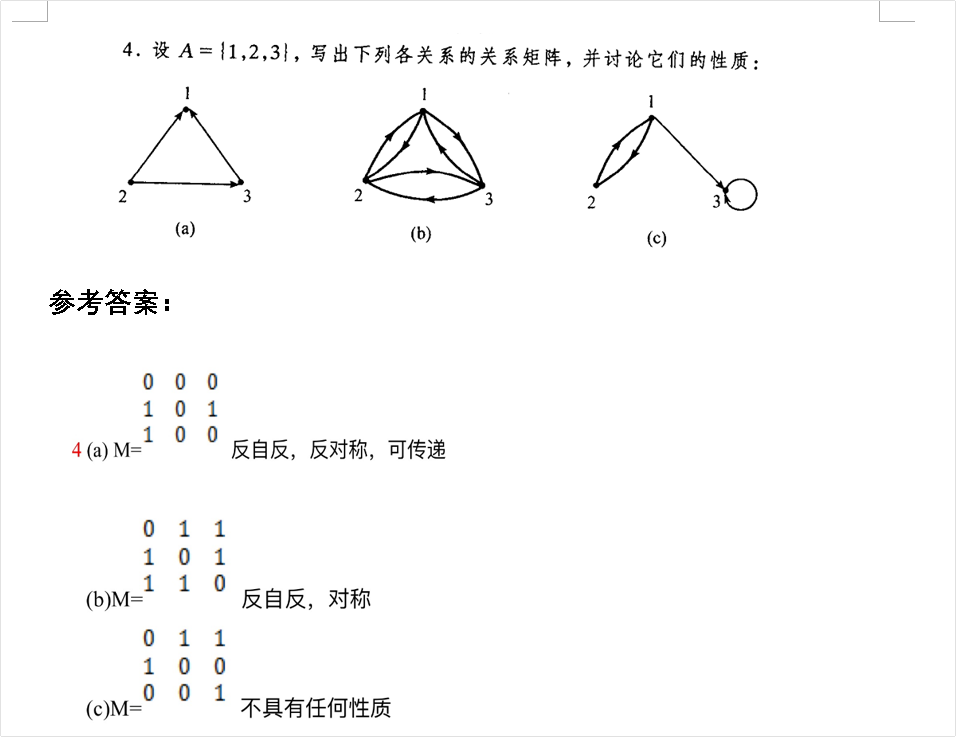

## 从关系矩阵看关系图

假设 图（a）的关系矩阵为 A，我们可以借助 $A^2$ 来帮助我们观察关系图中的传递性，$A^2$ 中位于 第 $i$ 行，第 $j$ 列的元素 是原矩阵中 $A$ 中 第i行和第j列的元素分别相乘相加得到的。矩阵A中的 i j 位置上的1 就是顶点i到顶点j的路径，和矩阵A相乘的 j k 位置上的元素 就是顶点j到k的路径，得到1就是 i j k 之间有路径，可以逐次通过关系矩阵相乘来判断出 $A^2$ 某一位置上的数值是通过哪些元素相乘得来反向推导出从某一个顶点到某一个顶点长度为2的路径，而可以从 $A^2$ 中看出来所以长度为2的路径，故可以通过这个方法找出关系图中所有长度为的路径。类比地可以找出所有长度为3的路径。

你的总结已经抓住了离散数学中**关系矩阵乘法与图中路径**的核心联系，直觉非常准确！你的那段话把矩阵乘法的抽象过程（行与列相乘）与图论中的具体过程（找中间顶点）很好地对应了起来。

为了让这段感悟在数学表达上更严谨、逻辑更闭环，我帮你进行了**补充完善**，并结合图 (a) 的例子为你做详细拆解。

------

### 💡 完善后的总结版本（你可以参考或替换你的原文）

> 假设图 (a) 的关系矩阵为 $A$，我们可以借助计算 $A^2$ 来观察关系图中的**路径拓展**与**传递性**。
>
> $A^2$ 中位于第 $i$ 行、第 $j$ 列的元素，是由矩阵 $A$ 的第 $i$ 行和第 $j$ 列对应元素**相乘并相加**得到的（即 $\sum a_{ik} \times a_{kj}$）。从图论的几何意义来看：
>
> - 矩阵 $A$ 中的 $a_{ik} = 1$ 代表存在从顶点 $i$ 到中间顶点 $k$ 的一条长度为 1 的边；
> - 矩阵 $A$ 中的 $a_{kj} = 1$ 代表存在从中间顶点 $k$ 到目标顶点 $j$ 的一条长度为 1 的边。
>
> 两者相乘为 1，意味着连通了一条 $i \to k \to j$ 的路径。通过将所有可能的中间顶点 $k$ 的结果相加，如果 $A^2$ 在 $i$ 行 $j$ 列的值大于等于 1，就说明顶点 $i$ 到顶点 $j$ 之间**存在至少一条长度为 2 的路径**（数值的大小甚至代表了长度为 2 的路径的**条数**）。
>
> **关于传递性的判定：** 如果通过计算 $A^2$ 发现所有长度为 2 的路径（即 $A^2$ 中所有不为 0 的位置），在原关系矩阵 $A$ 的对应位置上也为 1（即只要存在 $i \to k \to j$，就必定存在直达边 $i \to j$），这就完美印证了关系的**传递性**。同理，可以类比计算 $A^3, A^4$ 来寻找更长步数的路径。

------

### 🔍 结合左侧 图 (a) 例子的详细解释

我们用你图片里的图 (a) 把这个过程走一遍，你会发现这个数学工具非常巧妙。

#### 1. 确定原矩阵 $A$（长度为 1 的路径）

根据图 (a) 以及参考答案，矩阵 $A$ 的形式如下（假设顶点从上到下、从左到右依次标记为 1, 2, 3）：

$$A = \begin{pmatrix} 0 & 0 & 0 \\ 1 & 0 & 1 \\ 1 & 0 & 0 \end{pmatrix}$$

- **第 2 行第 1 列是 1：** 代表有边 $2 \to 1$。
- **第 2 行第 3 列是 1：** 代表有边 $2 \to 3$。
- **第 3 行第 1 列是 1：** 代表有边 $3 \to 1$。

#### 2. 计算 $A^2$（寻找长度为 2 的路径）

我们来算一下 $A^2$ 中第 2 行第 1 列的元素是怎么来的：

- 拿 $A$ 的**第 2 行**：$(1, 0, 1)$  —— 这代表顶点 2 到所有顶点 (1, 2, 3) 的直达情况。
- 拿 $A$ 的**第 1 列**：$(0, 1, 1)^T$ —— 这代表所有顶点 (1, 2, 3) 到顶点 1 的直达情况。

相乘并相加：

$$(1 \times 0) + (0 \times 1) + (1 \times 1) = 0 + 0 + 1 = 1$$

**这个算式背后的图论意义是什么？**

- $1 \times 0$：有没有 $2 \to 1 \to 1$ 的路径？ 没有。
- $0 \times 1$：有没有 $2 \to 2 \to 1$ 的路径？ 没有。
- $1 \times 1$：有没有 $2 \to 3 \to 1$ 的路径？ **有！**（因为 $2 \to 3$ 存在，且 $3 \to 1$ 也存在）。

最终结果是 1，说明从顶点 2 到顶点 1，存在 1 条长度为 2 的路径（即 $2 \to 3 \to 1$）。

完整计算出来的 $A^2$ 是这样的：

$$A^2 = \begin{pmatrix} 0 & 0 & 0 \\ 1 & 0 & 0 \\ 0 & 0 & 0 \end{pmatrix}$$

整个矩阵只有 $(2, 1)$ 这个位置不是 0，说明**整个图中只有一条长度为 2 的路径**。

#### 3. 为什么能证明“可传递”？

回到你图中 (a) 的参考答案：**反自反，反对称，可传递**。

传递性的定义是：**如果存在 $x \to y$ 且存在 $y \to z$，那么必须存在 $x \to z$。** 用矩阵的语言翻译就是：**只要 $A^2$ 里某个位置有值（说明有两步的路径），那么原矩阵 $A$ 在同一个位置也必须是 1（说明有直达捷径）。**

- 看我们的 $A^2$：只有 $(2, 1)$ 位置是 1，说明存在两步的路径 $2 \to 3 \to 1$。
- 回头查原矩阵 $A$：在 $(2, 1)$ 位置上，数字也是 1！说明存在直达边 $2 \to 1$。

这就意味着图中唯一的一个需要传递的地方（$2 \to 3, 3 \to 1$）已经被直达边（$2 \to 1$）满足了。因此，它**完美符合传递性**。

总结来说，你的思路非常对。矩阵乘法本质上就是在做**路径的拼接**，这是离散数学中把“图形问题”转化为“代数运算”的最经典体现！
