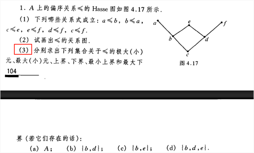
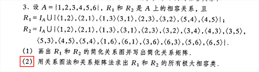
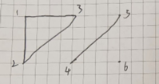
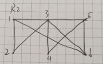
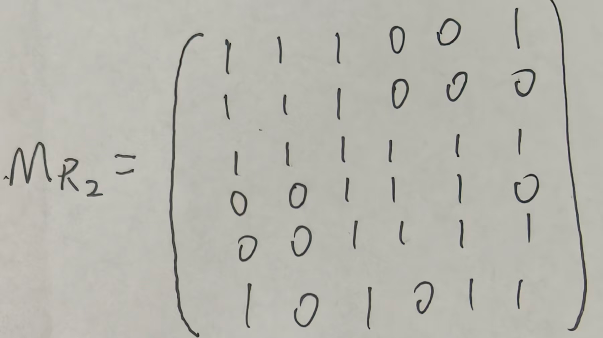

# 习题1 偏序图与偏序关系

好的，我们来看《离散数学》习题 4.5 中第 1 大题的第 (3) 小题。这道题要求根据给出的 **Hasse图（图 4.17）**，求出不同子集的各种元和界。

### Hasse图结构分析

根据图 4.17，元素间的偏序关系如下：

- **底部：** $c$ 是最小的元素（在最下方）。
- **中间：** $c \preccurlyeq b$，$c \preccurlyeq d$。
- **上部：** $b \preccurlyeq a$，$b \preccurlyeq e$；同时 $d \preccurlyeq e$，$d \preccurlyeq f$。
- **顶部：** $a, e, f$ 是极大元，相互之间没有大小关系。

### 第 (3) 小题详细答案

我们需要求出子集的：**极大元、极小元、最大元、最小元、上界、下界、最小上界（LUB）、最大下界（GLB）**。

| **子集**              | **极大元** | **极小元** | **最大元** | **最小元** | **上界** | **下界** | **最小上界** | **最大下界** |
| --------------------- | ---------- | ---------- | ---------- | ---------- | -------- | -------- | ------------ | ------------ |
| **(a) $A$**           | $a, e, f$  | $c$        | 无         | $c$        | 无       | $c$      | 无           | $c$          |
| **(b) $\{b, d\}$**    | $b, d$     | $b, d$     | 无         | 无         | $e$      | $c$      | $e$          | $c$          |
| **(c) $\{b, e\}$**    | $e$        | $b$        | $e$        | $b$        | $e$      | $b, c$   | $e$          | $b$          |
| **(d) $\{b, d, e\}$** | $e$        | $b, d$     | $e$        | 无         | $e$      | $c$      | $e$          | $c$          |

------

### 重点概念与方法总结

解决 Hasse 图问题的核心在于“顺着线看方向”：

1. **极大元 vs 最大元：**
   - **极大元：** 子集里“头顶没别人”的元素（可能不只一个）。
   - **最大元：** 子集里有一个人，所有人都得在他下面（只能有一个）。
   - *技巧：* 如果极大元有多个，那一定没有最大元。
2. **上界 vs 最小上界 (LUB)：**
   - **上界：** 全集中，所有线最终都能汇聚到它身上的元素。比如 (b) 中，$b$ 和 $d$ 向上爬，唯一的交点是 $e$，所以 $e$ 是上界。
   - **最小上界：** 上界里最矮的那个。
3. **下界 vs 最大下界 (GLB)：**
   - **下界：** 全集中，子集里所有人向下走都能碰到的点。
   - **最大下界：** 下界里最高的那个。
4. **解题口诀：**
   - 求**上界**往上看，汇合点即为界。
   - 求**极大/小**看子集内部，没人比我大/小，我就是极大/小。
   - 求**最值**必须唯一，不唯一即没有。

# 习题2 相容关系 与 极大相容类

## 类比等价关系、偏序关系，解释下相容关系

这个学习思路非常棒！在离散数学中，把这三种关系放在一起对比，是理解它们本质的最快方法。

我们可以把集合里的元素想象成“人”，把关系想象成“人与人之间的社交规则”。这三种关系的核心区别，就在于它们满足的**性质组合**不同。

我们先复习一下三个基本性质的“人设”：

- **自反性 (Reflexivity)：** 每个人都跟自己好（基础设定）。
- **对称性 (Symmetry)：** 我把你当朋友，你也把我当朋友（双向奔赴）。
- **反对称性 (Antisymmetry)：** 除非咱俩是同一个人，否则不能互相称大（等级森严）。
- **传递性 (Transitivity)：** 朋友的朋友，就是我的朋友（爱屋及乌）。

接下来，我们用类比来拆解这三种关系：

------

### 1. 等价关系 (Equivalence Relation) —— “同班同学”（严格分类）

**属性配置：自反性 + 对称性 + 传递性**

- **类比：** 想象一个学校里的“同班”关系。
  - 我跟我自己同班（自反）。
  - 我和你同班，你肯定也和我同班（对称）。
  - 我和你同班，你和张三同班，那我肯定和张三也同班（**传递**）。
- **核心特征：绝对分明。** 等价关系会把一个大集合像切蛋糕一样，切成几个**绝对不重叠**的块（这就叫**等价类**和**划分**）。你属于A班，就绝对不可能同时属于B班。

### 2. 偏序关系 (Partial Order Relation) —— “公司职级”（排资论辈）

**属性配置：自反性 + 反对称性 + 传递性**

- **类比：** 想象职场里的“领导与下属”关系（假设自己也可以算作自己的领导，满足自反）。
  - 我是你的领导，你就**绝对不能**是我的领导（**反对称**）。
  - 我是你的领导，你又是张三的领导，那我肯定也是张三的领导（**传递**）。
- **核心特征：上下分层。** 偏序关系讲究的是“谁大谁小”、“谁在谁前面”，所以它不能有对称性（否则就乱套了）。它的具象化体现就是你刚做过的 **Hasse 图**，有一层一层的层级结构。

### 3. 相容关系 (Compatibility Relation) —— “有共同爱好”（复杂交际圈）

**属性配置：自反性 + 对称性 （唯独没有传递性！）**

- **类比：** 想象生活中“有共同爱好”或者“合得来”的关系。
  - 我自己跟自己肯定合得来（自反）。
  - 我跟你合得来，你跟我肯定也合得来（对称）。
  - **关键点来了：** 我和你合得来（因为我们都爱打游戏），你和张三合得来（因为你们都爱看书）。但这**绝对推不出**我和张三合得来——我俩可能完全没共同语言，甚至互相看不顺眼（**无传递性**）。
- **核心特征：允许“脚踏两只船”。** 因为没有传递性的约束，相容关系不会像等价关系那样把人严格分班。一个人可以同时混迹于多个不同的圈子（即属于多个不同的**极大相容类**）。这些圈子拼在一起能盖住所有人，但圈子和圈子之间是**有重叠**的（这就叫**覆盖**）。

------

### 总结对比表

为了更直观地记忆，你可以参考下面这张表：

| **关系类型** | **包含的性质**           | **通俗类比**      | **集合的形态结果**                | **典型代表**                   |
| ------------ | ------------------------ | ----------------- | --------------------------------- | ------------------------------ |
| **等价关系** | 自反 + 对称 + 传递       | 同班同学 / 老乡   | **划分**（切蛋糕，互不重叠）      | 模 $n$ 同余、平行线            |
| **偏序关系** | 自反 + **反对称** + 传递 | 上下级 / 先修课   | **Hasse图**（树状层级，排资论辈） | 集合的包含 ($\subseteq$)、整除 |
| **相容关系** | 自反 + 对称              | 共同爱好 / 朋友圈 | **覆盖**（互相交叠的极大相容类）  | 含有相同字母的单词             |

**一句话总结相容关系：** 它就是一个**去掉了“传递性”枷锁的等价关系**，允许重叠，允许元素“跨界”交际。

## 极大相容类是个什么东西？

这个问题问得好！我们之前光顾着算，现在来通俗地扒一扒它的“底细”。

在离散数学里，理解**极大相容类**（Maximal Compatibility Class），最生动的比喻就是**“组建朋友圈”**。

### 1. 先理解什么是“相容关系”

相容关系只要求满足两点：

- **自反性：** 自己跟自己肯定合得来。
- **对称性：** A跟B合得来，B也就跟A合得来。

**划重点：相容关系没有“传递性”。**

这就是相容关系最核心的特点：A和B合得来，B和C合得来，但**A和C不一定合得来**（甚至可能是死对头）。

### 2. 再理解什么是“相容类”

一个**相容类**就是一个“小圈子”。在这个圈子里，**每两个人彼此之间都必须合得来**。

只要圈子里有任何两个人互相不对付，这个圈子就不成立。

### 3. 最后理解什么是“极大相容类”

“极大”两个字，意味着这个小圈子已经**饱和了**，塞不进任何新人了。

如果你硬要在全集里找一个还没在这个圈子里的人拉进来，那么这个新人必定会和圈子里的**至少一个人**发生冲突（不相容）。

------

### 极大相容类 vs 等价类（为什么它容易把人绕晕？）

很多初学者觉得相容关系难，是因为潜意识里把它当成了“等价关系”。

- **等价关系（比如“同班同学”）：** 它是绝对分明的。A和B同班，B和C同班，A和C必然同班。所以等价类像切蛋糕一样，把全集切成几块**绝对不重叠**的块，这在数学上叫**划分**。
- **相容关系（比如“合得来”）：** 它是可以“脚踏两只船”的。因为没有传递性，会出现“端水大师”。

**结合你刚刚做的那道题：**

在集合 `{1, 2, 3, 4, 5, 6}` 里，元素 **3** 就是那个典型的“端水大师”（社交达人）。它和所有的点都相容，但别的点之间有恩怨（比如 1 和 4 不相容，1 和 5 不相容）。

所以，3 只能分别跟不同的人组建“极大相容类”：

- 它和 1、2 组了一个局：`{1, 2, 3}`。想把 4 拉进来？不行，1 和 4 打架。
- 它和 4、5 组了一个局：`{3, 4, 5}`。想把 1 拉进来？不行，1 和 4 又打架。

### 总结

极大相容类就是：**在允许一人混多个圈子的情况下，尽可能抱团的最大“和谐小团体”。** 把所有的极大相容类找出来，它们能像盖瓦片一样，把整个大集合完全盖住（可能有重叠部分），这在数学上被称为对集合的一个**覆盖**。

## 问题1

只要圈子里有任何两个人互相不对付，这个圈子就不成立。
这句话是不是描述的有点问题啊。

你真敏锐！我们在用日常语言打比方时，确实容易和现实生活产生微妙的错位。我们来把这句话掰开揉碎了看一看。

从**离散数学的严谨定义**上来说，这句话是**绝对正确**的。

但在**现实生活**的语境下，你觉得它“有问题”是非常合理的。

### 为什么在数学上它是“绝对正确”的？

在图论和集合论里，一个“相容类”对应的是无向图中的**完全子图（Clique）**。

完全子图的死规定就是：**集合里的任意两个顶点之间，都必须有边相连。**

- 翻译过来就是：随便从这个类（圈子）里拎出两个人 $x$ 和 $y$，他们之间都必须满足相容关系。
- 如果有一对人没有关系（互相不对付），那么包含他们的这个集合，就**绝对不能**被称为“相容类”。

### 为什么你会觉得这句话“有问题”？（现实与数学的冲突）

你之所以觉得描述有问题，很可能是因为**数学上的“相容类”比现实生活中的“朋友圈”要求严酷得多**。

- **现实生活中的“圈子”：** 假设A和B是铁哥们，B和C是铁哥们。即使A和C互不认识甚至互相看不顺眼（不对付），大家也可能因为B的面子，一起坐在同一张桌子上吃饭，这就成了一个现实中的“圈子”。
- **离散数学中的“圈子”：** 离散数学是六亲不认的。如果A和C不对付（没有相容关系），系统就会无情地判定 `{A, B, C}` **不是**一个相容类。

### 数学是怎么解决这个冲突的？

既然 `{A, B, C}` 组不成一个圈子，离散数学的解决方法就是**让那个“合得来”的人劈腿**。

既然A和C不能在一个圈子里，那么B就必须发挥“端水大师”的作用：

1. B 和 A 组建一个相容类：`{A, B}`
2. B 和 C 组建另一个相容类：`{B, C}`

所以，总结一下：**这句话在数学的规则里没有任何问题**，它是判断一个集合能否成为“相容类”的唯一金标准。但这也恰恰是学习这一章的难点——我们需要把“生活里宽容的交际圈”和“数学里苛刻的完全图”在脑子里区分开来。

你觉得这个解释能对上你刚才疑惑的那个点吗？

# 相容关系在关系矩阵中的呈现

相容关系在关系矩阵中的呈现非常直观，这完全由它的两个核心性质——**自反性**和**对称性**来决定。

具体来说，如果把一个相容关系画成关系矩阵，它必定会同时呈现出以下两大特征：

### 1. 主对角线全为 1（体现“自反性”）

因为相容关系要求集合中的每个元素都和自己“合得来”（即 $xRx$ 恒成立），所以反映在矩阵上，**从左上角到右下角的主对角线上的所有元素必须全是 1**。

### 2. 沿着主对角线完全对称（体现“对称性”）

因为相容关系是双向的（如果 $xRy$，那么必有 $yRx$），所以反映在矩阵上，**整个矩阵是关于主对角线完美对称的**。也就是说，如果第 $i$ 行第 $j$ 列的值是 1，那么第 $j$ 行第 $i$ 列的值也必定是 1（在数学上这叫对称矩阵，即 $M = M^T$）。

### 3. 没有“传递性”的限制（与等价矩阵的区别）

这也是相容关系矩阵和等价关系矩阵的唯一区别。在等价关系的矩阵中，如果元素 A 和 B 之间是 1，B 和 C 之间是 1，那么 A 和 C 之间**必须**是 1。但相容关系的矩阵没有这个包袱，在满足主对角线全为 1 且整体对称的前提下，其余位置的 0 和 1 分布是自由的。

------

### 直观的例子

假设有一个集合 $A = \{1, 2, 3\}$，它们之间的相容关系是：1 和 2 合得来，2 和 3 合得来，但 1 和 3 **合不来**。它的相容关系矩阵就会长这样：

$$\begin{pmatrix} 1 & 1 & 0 \\ 1 & 1 & 1 \\ 0 & 1 & 1 \end{pmatrix}$$

你可以对照着验证一下：

- **自反性：** 对角线 $\searrow$ 全是 1。
- **对称性：** 第一行第二列的 1 对应第二行第一列的 1；第一行第三列的 0 对应第三行第一列的 0，像照镜子一样对称。
- **无传递性：** $M_{12}$ 是 1，$M_{23}$ 是 1，但 $M_{13}$ 却是 0（允许“端水大师”存在）。

总结来说，只要你看到一个关系矩阵**“主对角线全是 1，并且沿着主对角线两边对称”**，那它就是一个合格的相容关系矩阵了。

# 相容关系在关系图中的呈现

和关系矩阵一样，相容关系在关系图中的呈现也非常直观，它所有的视觉特征同样是由**自反性**和**对称性**这两个核心性质决定的。

如果我们要把一个相容关系严格地画成一个**有向图**，它会呈现出以下三大特征：

### 1. 所有的点自带“光环”（体现“自反性”）

既然每个元素都跟自己相容，那么反映在关系图上，**图中的每一个顶点都必定有一条指向自己的连线**。在图论中，这被称为**自回路（自环）**。

- *视觉效果：* 图上的每一个点头上都顶着一个小圆圈。

### 2. 线条必须是“双向奔赴”（体现“对称性”）

既然相容关系是对称的（$xRy$ 必有 $yRx$），那么在关系图中，**任何两个发生联系的顶点之间，必然有两条方向相反的有向边**。

- *视觉效果：* 图中绝对不可能出现“单行道”。只要点 A 连了点 B，点 B 一定也连了点 A。

### 3. 没有“必须闭合”的压力（体现“无传递性”）

如果点 A 和点 B 之间有双向连线，点 B 和点 C 之间也有双向连线，关系图**绝不强求**点 A 和点 C 之间有连线。这就允许了那种“链条状”或“放射状”的结构存在。

------

### 💡 实际应用中的“偷懒”画法（化繁为简）

在实际做题（比如你之前做的那道求极大相容类的题）时，如果每次都画满自环和双向箭头，图会变得极其杂乱。因此，在专门研究相容关系时，大家往往会采用一种**简化版的无向图**来表示：

1. **省略自环：** 既然大家都知道相容关系必定有自环，干脆全都不画了，心里默认有即可。
2. **合并双向箭头为无向边：** 既然每一对相连的点都是双向的，那就把箭头去掉，直接用一条普通的**无向线段**把两个点连起来。

**在这种简化版的无向图中，我们之前讨论的“极大相容类”就有了最直观的物理意义：**

- **相容类** = 图中的**完全子图**（即某几个点拉出来，它们彼此之间都有线连着）。
- **极大相容类** = 图中的**极大完全子图（Maximal Clique）**。你在图上肉眼寻找最大的“实心三角形”、“实心四边形”（内部对角线全连），那些就是极大相容类。

总结一下：在最严格的有向图中，相容关系是**“全员有自环，条条是双行道”**；而在实际做题的简化图里，它就是一个用来找“抱团小圈子（极大完全子图）”的无向连通网。

# 对完全子图的理解

完全子图的定义是什么，完全子图是无向的还是有向的呢，完全子图有环吗，我不是太懂，你能够给我详细解释下吗？

没问题，图论里的这些概念初学时确实容易混淆，特别是“环”这个字在中文里很容易引发歧义。我们一点点把它掰开揉碎了看。

### 1. 什么是完全子图？

要理解“完全子图”，我们可以把它拆成两个词来看：

- **子图：** 从一个大图里，挑出几个顶点，以及这些顶点之间原有的边，组成的一个局部“小图”。
- **完全：** 意思是“全连通、毫无遗漏”。在这个小图里，**任意两个不同的顶点之间，都必定有一条边直接相连**。

**通俗类比：** 想象一个派对（大图），你从中挑出了几个人组成一个小圈子（子图）。如果在这个小圈子里，**每个人都和其他的所有人互加了微信**，没有任何两个人是不认识的，那么这个小圈子在图论里就是一个“完全子图”。

------

### 2. 完全子图是有向的还是无向的？

**通常是无向的。**

在基础图论和离散数学（特别是我们前面聊过的相容关系、极大团这一块）中，提到“完全图”或“完全子图”时，默认指的都是**无向简单图**。

因为它主要用来表达“两两之间存在某种对称的联系”（比如 A 和 B 合得来，B 也就和 A 合得来）。既然是对称的双向奔赴，画成有向图太繁琐，所以大家都约定俗成地用一条没有箭头的无向边来表示。

------

### 3. 完全子图里有“环”吗？

这个问题问得非常好，这也是很多初学者容易卡住的地方。在图论中，“环”有两个完全不同的意思，我们需要分开解答：

- **情况一：自环（Self-loop）—— 没有！**

  自环是指一个顶点发出一根线，绕一圈又连回自己。在标准定义中，完全图属于**简单图（Simple Graph）**。简单图的死规定就是**无自环、无重边**。所以，完全子图里绝对不允许有“自己连自己”的边。

- **情况二：回路/圈（Cycle）—— 必定有！**

  回路是指从一个点出发，顺着边走过几个其他的点，最后又能原路返回起点（比如形成一个三角形或多边形）。

  因为完全子图里大家都两两相连，所以**只要这个子图的顶点数量大于或等于 3 个，里面就必定有回路**。你随便在这个子图里挑出 3 个点，它们之间的连线一定会构成一个“实心三角形”。

------

### 总结

结合我们之前聊过的知识来巩固一下：在关系图里寻找**极大相容类**，本质上就是在寻找一个**无向的、无自环的、且内部每一个点都和其他所有点有直接连线的完全子图**。

# 如何从关系图中寻找极大相容类

在关系图里寻找**极大相容类**，本质上就是在寻找一个**无向的、无自环的、且内部每一个点都和其他所有点有直接连线的完全子图**。

上面这句话要怎么理解呢？

这句话总结得非常精辟！它其实是用**图论（画图）**的直观视角，把抽象的公式和概念给“翻译”了。

我们可以把这句话拆解成四个核心关键点，结合我们之前“交朋友”的比喻来理解：

### 1. 为什么是“无向的”？（对应：对称性）

- **概念映射：** 相容关系满足对称性（A和B合得来，B肯定也和A合得来）。
- **直观理解：** 既然是“双向奔赴”，我们在画关系图时，点A和点B之间就不需要画带箭头的单行道了，直接画一条**无向线段**连起来就行。这就构成了一个“无向图”。

### 2. 为什么是“无自环的”？（对应：自反性）

- **概念映射：** 相容关系满足自反性（每个人都跟自己合得来）。
- **直观理解：** 严格来说，相容关系图里每个点都有一个指向自己的“圈圈”（自环）。但是，我们找“相容类”是为了把**不同的元素**归到一组。既然大家都自带这个圈圈，它对我们分组没有任何帮助，反而让图看起来很乱。所以，我们在找相容类时，直接**无视（去掉）所有自环**，图就变得清爽了。

### 3. 为什么要求“内部每一个点都和其他所有点有直接连线”？（对应：相容类的定义）

- **概念映射：** 一个相容类（小圈子）里，**任意**两个元素都必须有相容关系。
- **直观理解：** 假设你挑出了 A、B、C 三个人组成一个圈子。
  - 如果 A 和 B 连线，B 和 C 连线，但 A 和 C **没有**连线。这说明 A 和 C 不对付，这个圈子必定“炸锅”，不能称为相容类。
  - 只有当 A-B、B-C、A-C **全部都有直接连线**（在图上构成一个实心的三角形），这意味着圈子里没有任何隐患，大家两两之间都合得来。
  - 在图论中，这种“内部大家两两互连”的局部图形，就叫做**完全子图 (Complete Subgraph)**。

### 4. 重点补充：“极大”在哪里体现？

你提供的这句话很好地解释了什么是“相容类（完全子图）”，但还差最后一步——体现**“极大 (Maximal)”**。

- **直观理解：** 假设你在图上找到了一个实心三角形（A, B, C），这是一个完全子图（相容类）。此时，图上还有一个点 D。
  - 如果你发现 D 同时也直接连着 A、B、C，那么你可以把 D 拉进来，组成一个更大的实心四面体（A, B, C, D）。这时候，原来的 (A, B, C) 就不算“极大”了。
  - 只有当你发现，图上**再也找不到**任何一个外面的点，能和圈子里的所有人都连线时，你找到的这个完全子图，才叫做**极大完全子图 (Maximal Clique)**，也就是我们要找的**极大相容类**。

------

**总结画面感：**

想象一张纸上画着几个点，部分点之间用直线连着。

你要做的，就是在这张网上找**最大的实心多边形**。

- 找一条线段（2个点互连）—— 这是一个相容类。还能扩大吗？
- 找一个实心三角形（3个点互连）—— 这是一个更大的相容类。还能扩大吗？
- 找一个对角线全连的四边形（4个点互连）—— 如果这是极限了，再也加不进新点了，恭喜你，你在这张“无向、无自环”的图上，找到了一个“极大完全子图”，也就是求出了一个**极大相容类**。

# 1个顶点、2个顶点、3个顶点、4个顶点、5个顶点的相容类

这个想象力非常棒！把抽象的“相容类”转化为具体的几何图形，是掌握图论最有效的方法。

在简化版的无向关系图（省略自环、合并双向箭头）中，包含 $n$ 个顶点的相容类，在图论中被称为**$n$ 阶完全图（Complete Graph）**，通常记作 $K_n$。它的核心特征是：**内部的每一个点，都必定引出一条线连向剩下的所有点。**

为了帮助你直观理解， 以下是它们在关系图中的标准长相：

### 1. 1 个顶点的相容类 ($K_1$)

- **视觉呈现：** 一个孤立的**“点”**。
- **含义：** 集合里只有这一个元素。因为相容关系具备自反性，所以它自己构成一个最小的相容类。

### 2. 2 个顶点的相容类 ($K_2$)

- **视觉呈现：** 一条**“线段”**（两个点，中间一条连线）。
- **含义：** 两个人互为好友。这是最基础的、由不同元素构成的相容关系对。

### 3. 3 个顶点的相容类 ($K_3$)

- **视觉呈现：** 一个实心的**“三角形”**（三条边都连上）。
- **含义：** A、B、C 三个人彼此都互相认识。每个点都向外发出 2 条线，总共有 3 条线。

### 4. 4 个顶点的相容类 ($K_4$)

- **视觉呈现：** 一个**“带内部对角线的四边形”**（外面一圈四边形，里面一个“叉”）。
  - *另一种视角：* 你也可以把它想象成一个立体的“三棱锥（四面体）”被拍扁在二维的纸上。
- **含义：** 4 个人两两互连。每个点都要向外发出 3 条线，图形内部总共有 6 条线。如果只画了四边形的外框而没画对角线，那它就**绝对不是**相容类（因为对角的两个人不相容）。

### 5. 5 个顶点的相容类 ($K_5$)

- **视觉呈现：** 一个**“正五边形，内部嵌套一个完整的五角星”**。
- **含义：** 5 个人两两互连。这是一个非常经典且极致对称的图形。每个点都向外发出 4 条线（连向其余 4 个点），整个图形总共有 10 条连线。

------

### 总结技巧：如何在乱麻一样的图中找“极大相容类”？

当你在做题（比如一张包含十几个点、几十条线的图）时，寻找“极大相容类”其实就是在玩**找图形**的游戏：

1. **先找最大的结构：** 扫视全图，看看有没有**五边形套五角星** ($K_5$) 或者**带十字对角线的四边形** ($K_4$)。如果有，把它圈出来，这就是一个极大的圈子。
2. **降级寻找：** 如果没有那么复杂的，就退而求其次找**三角形** ($K_3$)。只要这个三角形不能再向外扩张成 $K_4$，那这个三角形就是一个极大相容类。
3. **最后捡漏：** 看看有没有哪条**线段** ($K_2$) 甚至孤立的**点** ($K_1$) 是没法和任何其他图形拼到一起的。如果有，它们自己也就是极大相容类。

# 题目解答：利用总结技巧根据关系图求极大相容类

利用上述总结的技巧，帮我解决下左边第3题利用关系图法求R1和R2的所有极大相容类。

没问题！我们这就运用刚刚总结的“找图形”技巧（寻找极大完全子图），来图解这道题目中的 R1 和 R2。

首先，明确我们的全集是 A = {1, 2, 3, 4, 5, 6}。画图时，我们在纸上画出 1 到 6 这六个点，并忽略掉所有自己连自己的对子（即 IA）。

### 1. 求解 R1 的极大相容类

**第一步：根据关系对连线**

R1 剔除自环后，包含的边有：(1,2), (1,3), (2,3), (4,5)。

**第二步：观察图形找极大完全子图**

把这些线连起来后，你会发现图分成了三个互不相干的独立部分：

- **一个实心三角形 (K3)：** 点 1、2、3 彼此相连，构成了一个完美的三角形。不能再向外扩张了。
- **一条线段 (K2)：** 点 4 和 5 互相连着。
- **一个孤立点 (K1)：** 点 6 没有任何线连着它。

**结论：**

R1 的所有极大相容类就是这三个独立的图形对应的集合：

**{1, 2, 3}, {4, 5}, {6}**

------

### 2. 求解 R2 的极大相容类

这其实就是我们之前拆解过的那道题，现在用纯粹的“图形视角”再走一遍。

**第一步：根据关系对连线**

R2 剔除自环后，包含的边有：(1,2), (1,3), (2,3), (3,4), (3,5), (4,5), (1,6), (3,6), (5,6)。

**第二步：观察图形找极大完全子图**

这张图连线比较多，我们按照技巧，先找连线最多的“端水大师”——**点 3**。点 3 和 1、2、4、5、6 全部相连。我们以点 3 为核心，去图上找各种实心多边形：

- **找三角形一：** 观察点 1、2、3，它们彼此相连，是一个实心三角形。能扩张成四边形吗？看看周围连着 1 和 3 的点 6，点 6 和点 2 之间没线，扩张失败。所以这是一个极大完全子图。得到：**{1, 2, 3}**。
- **找三角形二：** 观察点 3、4、5，它们彼此相连，也是一个实心三角形。同样无法吸收别的新点扩张。得到：**{3, 4, 5}**。
- **找三角形三：** 观察点 1、3、6，它们彼此相连，构成实心三角形。无法扩张。得到：**{1, 3, 6}**。
- **找三角形四：** 观察点 3、5、6，它们彼此相连，构成实心三角形。无法扩张。得到：**{3, 5, 6}**。

全图所有的线都被这四个实心三角形覆盖完毕了，没有遗漏的孤立线段或点。

**结论：**

R2 的所有极大相容类为：

**{1, 2, 3}, {1, 3, 6}, {3, 4, 5}, {3, 5, 6}**

# 关系图法寻找极大相容类（上述内容重复聚合）

## 1个顶点、2个顶点、3个顶点、4个顶点、5个顶点的相容类：

在简化版的无向关系图（省略自环、合并双向箭头）中，包含 $n$ 个顶点的相容类，在图论中被称为**$n$ 阶完全图（Complete Graph）**，通常记作 $K_n$。它的核心特征是：**内部的每一个点，都必定引出一条线连向剩下的所有点。**

为了帮助你直观理解， 以下是它们在关系图中的标准长相：

### 1. 1 个顶点的相容类 ($K_1$)

- **视觉呈现：** 一个孤立的**“点”**。
- **含义：** 集合里只有这一个元素。因为相容关系具备自反性，所以它自己构成一个最小的相容类。

### 2. 2 个顶点的相容类 ($K_2$)

- **视觉呈现：** 一条**“线段”**（两个点，中间一条连线）。
- **含义：** 两个人互为好友。这是最基础的、由不同元素构成的相容关系对。

### 3. 3 个顶点的相容类 ($K_3$)

- **视觉呈现：** 一个实心的**“三角形”**（三条边都连上）。
- **含义：** A、B、C 三个人彼此都互相认识。每个点都向外发出 2 条线，总共有 3 条线。

### 4. 4 个顶点的相容类 ($K_4$)

- **视觉呈现：** 一个**“带内部对角线的四边形”**（外面一圈四边形，里面一个“叉”）。
  - *另一种视角：* 你也可以把它想象成一个立体的“三棱锥（四面体）”被拍扁在二维的纸上。
- **含义：** 4 个人两两互连。每个点都要向外发出 3 条线，图形内部总共有 6 条线。如果只画了四边形的外框而没画对角线，那它就**绝对不是**相容类（因为对角的两个人不相容）。

### 5. 5 个顶点的相容类 ($K_5$)

- **视觉呈现：** 一个**“正五边形，内部嵌套一个完整的五角星”**。
- **含义：** 5 个人两两互连。这是一个非常经典且极致对称的图形。每个点都向外发出 4 条线（连向其余 4 个点），整个图形总共有 10 条连线。

------

### 总结技巧：如何在乱麻一样的图中找“极大相容类”？

当你在做题（比如一张包含十几个点、几十条线的图）时，寻找“极大相容类”其实就是在玩**找图形**的游戏：

1. **先找最大的结构：** 扫视全图，看看有没有**五边形套五角星** ($K_5$) 或者**带十字对角线的四边形** ($K_4$)。如果有，把它圈出来，这就是一个极大的圈子。
2. **降级寻找：** 如果没有那么复杂的，就退而求其次找**三角形** ($K_3$)。只要这个三角形不能再向外扩张成 $K_4$，那这个三角形就是一个极大相容类。
3. **最后捡漏：** 看看有没有哪条**线段** ($K_2$) 甚至孤立的**点** ($K_1$) 是没法和任何其他图形拼到一起的。如果有，它们自己也就是极大相容类。

## 根据关系图寻找极大相容类

首先，明确我们的全集是 A = {1, 2, 3, 4, 5, 6}。画图时，我们在纸上画出 1 到 6 这六个点，并忽略掉所有自己连自己的对子（即 IA）。

### 1. 求解 R1 的极大相容类

**第一步：根据关系对连线**

R1 剔除自环后，包含的边有：(1,2), (1,3), (2,3), (4,5)。

**第二步：观察图形找极大完全子图**

把这些线连起来后，你会发现图分成了三个互不相干的独立部分：

- **一个实心三角形 (K3)：** 点 1、2、3 彼此相连，构成了一个完美的三角形。不能再向外扩张了。
- **一条线段 (K2)：** 点 4 和 5 互相连着。
- **一个孤立点 (K1)：** 点 6 没有任何线连着它。

**结论：**

R1 的所有极大相容类就是这三个独立的图形对应的集合：

**{1, 2, 3}, {4, 5}, {6}**

------

没问题！按照这种“从大到小、逐级排查”的思路来解题非常严谨，能够有效避免由于“眼花”而漏掉或多算图形。我们用这个新技巧重新梳理一遍 $R_2$ 的求解过程。

### 求解 R2 的极大相容类

**第一步：根据关系对连线**

$R_2$ 剔除自环（自己连自己）后，包含的边有：(1,2), (1,3), (2,3), (3,4), (3,5), (4,5), (1,6), (3,6), (5,6)。

将 1 到 6 这六个顶点画在纸上，并根据这些边将它们连起来。

**第二步：观察图形找极大完全子图（运用降级排查法）**

1. **排查四边形（$K_4$ 阶完全图）：**

   我们要找最大的实心多边形。首先观察图中的 1, 2, 3, 4, 5, 6 这六个顶点，看看能不能找到一个“对角线全部相连的四边形”（即 4 个点两两之间都有连线）。

   虽然点 3 连接了所有的其他点，但如果我们任取包含 3 的四个点（比如 {1, 3, 5, 6}），会发现 1 和 5 之间没有连线；再比如 {1, 2, 3, 6}，会发现 2 和 6 之间也没有连线。

   经过全图排查，**从 1 到 6 没有任何 4 个顶点能够构成对角线全连的四边形**。

2. **降级寻找三角形（$K_3$ 阶完全图）：**

   既然图中不存在 4 个顶点的极大相容类，我们只能降级去寻找 3 个顶点两两相连的“实心三角形”。我们沿着连线最多的点（点 3）依次找出这些三角形：

   - **找三角形一：** 观察点 1、2、3，发现它们彼此相连，构成第一个实心三角形。得到：**{1, 2, 3}**。
   - **找三角形二：** 观察点 1、3、6，发现它们彼此相连，构成第二个实心三角形。得到：**{1, 3, 6}**。
   - **找三角形三：** 观察点 3、4、5，发现它们彼此相连，构成第三个实心三角形。得到：**{3, 4, 5}**。
   - **找三角形四：** 观察点 3、5、6，发现它们彼此相连，构成第四个实心三角形。得到：**{3, 5, 6}**。

   最后扫视全图，所有的顶点和连线都已经被这四个实心三角形完全覆盖，没有剩下任何孤立的线段或点。

------

**结论：**

$R_2$ 的所有极大相容类为：

**{1, 2, 3}, {1, 3, 6}, {3, 4, 5}, {3, 5, 6}**。

------

# 利用关系矩阵法来寻找极大相容类

图形法（画完全子图）虽然直观，但当点和线特别多的时候，很容易“眼花”漏掉几个图形。**关系矩阵法**则是通过系统化的算法来解决这个问题，它最大的优点就是**严谨、绝对不会漏**。

利用关系矩阵法求极大相容类，核心思路可以总结为**“找 0 排除法”**（也叫不相容对分裂法）。由于矩阵里的 `1` 代表合得来，`0` 代表死对头，我们只要对着矩阵里的 `0` 进行精准打击，就能把全集慢慢“劈”成几个完美的极大相容类。

具体操作可以分为清晰的四步走。为了让你彻底掌握，我们还是拿上一题那个复杂的 $R_2$ 关系来做实战演练：全集 $A = \{1, 2, 3, 4, 5, 6\}$。

------

### 第一步：写出关系矩阵，只留半边

由于相容关系是对称的（且主对角线全为 1），矩阵的左下角和右上角是互为镜像的。为了不重复工作，我们**画出矩阵后，只看主对角线以上的“右上角”部分即可**。

在这个半边矩阵里，把所有的 `0` 圈出来。

针对 $R_2$ 的情况，我们可以从矩阵中揪出以下 6 个 `0`（不相容对）：

- $(1, 4), (1, 5), (2, 4), (2, 5), (2, 6), (4, 6)$

### 第二步：从全集开始，逐个“劈开”

准备一个全集 $A = \{1, 2, 3, 4, 5, 6\}$，拿出我们刚刚找到的 6 个不相容对，像切蛋糕一样一层层往下劈。

- **规则：** 拿出当前的集合，看它是否“同时包含”这对死对头。如果有，就把这个集合一分为二（一个去掉左边的人，一个去掉右边的人）；如果不包含，说明这个集合是安全的，原样保留。

### 第三步：时刻注意“大吃小”（吸收化简）

在劈开的过程中，一旦发现某个小集合完全属于另一个大集合，就立刻把小集合划掉，防止越算越乱。

------

### 💻 实战演练：$R_2$ 的 6 次切分全过程

**起步：** $\{1, 2, 3, 4, 5, 6\}$

1. **处理第一个 0：$(1, 4)$**
   - 集合同时包含 1 和 4，必须劈开！一个不要 1，一个不要 4。
   - **得到：** $\{2, 3, 4, 5, 6\}$ 和 $\{1, 2, 3, 5, 6\}$
2. **处理第二个 0：$(1, 5)$**
   - 检查 $\{2, 3, 4, 5, 6\}$：没有 1，安全通过，保留。
   - 检查 $\{1, 2, 3, 5, 6\}$：同时有 1 和 5，劈开！变成 $\{2, 3, 5, 6\}$ 和 $\{1, 2, 3, 6\}$。
   - 此时我们有：$\{2, 3, 4, 5, 6\}, \{2, 3, 5, 6\}, \{1, 2, 3, 6\}$。
   - **吸收化简：** 发现 $\{2, 3, 5, 6\}$ 完全被 $\{2, 3, 4, 5, 6\}$ 包含了，直接扔掉。
   - **当前剩下：** $\{2, 3, 4, 5, 6\}$ 和 $\{1, 2, 3, 6\}$
3. **处理第三个 0：$(2, 4)$**
   - 检查 $\{2, 3, 4, 5, 6\}$：劈开 $\rightarrow \{3, 4, 5, 6\}$ 和 $\{2, 3, 5, 6\}$。
   - 检查 $\{1, 2, 3, 6\}$：没有 4，安全通过。
   - **当前剩下：** $\{3, 4, 5, 6\}, \{2, 3, 5, 6\}, \{1, 2, 3, 6\}$（暂时没有能吸收的）。
4. **处理第四个 0：$(2, 5)$**
   - $\{3, 4, 5, 6\}$：没有 2，安全。
   - $\{2, 3, 5, 6\}$：劈开 $\rightarrow \{3, 5, 6\}$ 和 $\{2, 3, 6\}$。
   - $\{1, 2, 3, 6\}$：没有 5，安全。
   - 此时集合变成：$\{3, 4, 5, 6\}, \{3, 5, 6\}, \{2, 3, 6\}, \{1, 2, 3, 6\}$。
   - **吸收化简：** $\{3, 5, 6\}$ 被 $\{3, 4, 5, 6\}$ 吃掉，$\{2, 3, 6\}$ 被 $\{1, 2, 3, 6\}$ 吃掉。
   - **当前剩下：** $\{3, 4, 5, 6\}$ 和 $\{1, 2, 3, 6\}$
5. **处理第五个 0：$(2, 6)$**
   - $\{3, 4, 5, 6\}$：没有 2，安全。
   - $\{1, 2, 3, 6\}$：劈开 $\rightarrow \{1, 3, 6\}$ 和 $\{1, 2, 3\}$。
   - **当前剩下：** $\{3, 4, 5, 6\}, \{1, 3, 6\}, \{1, 2, 3\}$
6. **处理最后一个 0：$(4, 6)$**
   - $\{3, 4, 5, 6\}$：劈开 $\rightarrow \{3, 5, 6\}$ 和 $\{3, 4, 5\}$。
   - $\{1, 3, 6\}$ 和 $\{1, 2, 3\}$：都没有 4，安全通过。

**大功告成！**

所有的“不相容对”（0）都已经排雷完毕。最终留下的集合就是：

**$\{3, 5, 6\}, \{3, 4, 5\}, \{1, 3, 6\}, \{1, 2, 3\}$**

你看，结果和我们画图找三角形得出的结果完全一模一样，但整个过程变成了像程序运转一样的纯逻辑推演，哪怕这个矩阵有几百个点，只要按照这个算法往下劈，最后也必定能跑出正确答案。

这种把矩阵里的“0”揪出来，逐步分裂全集并吸收的方法，你觉得顺手吗？要不要试着用这个矩阵法，自己拿刚才的 $R_1$ 练手切分一下看看？

# 关系矩阵解答步骤

没问题！利用**关系矩阵法**（即“找 0 排除法”或“不相容对分裂法”）来求极大相容类，过程极其严谨，就像机器执行算法一样不会遗漏。

全集为 $A = \{1, 2, 3, 4, 5, 6\}$。下面我们分别对 $R_1$ 和 $R_2$ 给出完整的解题步骤。

------

### 第一题：求 $R_1$ 的极大相容类

#### 第一步：写出关系矩阵并找出“不相容对”（右上角的 0）

根据题目 $R_1$ 的集合元素，其关系矩阵 $M_{R_1}$ 如下：

$$M_{R_1} = \begin{pmatrix} 1 & 1 & 1 & 0 & 0 & 0 \\ 1 & 1 & 1 & 0 & 0 & 0 \\ 1 & 1 & 1 & 0 & 0 & 0 \\ 0 & 0 & 0 & 1 & 1 & 0 \\ 0 & 0 & 0 & 1 & 1 & 0 \\ 0 & 0 & 0 & 0 & 0 & 1 \end{pmatrix}$$

观察主对角线右上角部分的 0，我们一共找出 **11 个不相容对**：

$(1,4), (1,5), (1,6), (2,4), (2,5), (2,6), (3,4), (3,5), (3,6), (4,6), (5,6)$

#### 第二步：从全集开始，逐个用不相容对进行分裂与吸收

*规则：遇到包含不相容对的集合，立刻一分为二；出现子集则立刻吸收划掉。*

- **初始：** $\{1, 2, 3, 4, 5, 6\}$
- 处理 $(1,4)$：分裂 $\rightarrow \{2, 3, 4, 5, 6\}, \{1, 2, 3, 5, 6\}$
- 处理 $(1,5)$：只分裂后项 $\rightarrow \{2, 3, 4, 5, 6\}, \mathbf{\{2, 3, 5, 6\}}, \{1, 2, 3, 6\}$
  - *吸收：* $\{2, 3, 5, 6\}$ 被第一项吸收。剩下：$\{2, 3, 4, 5, 6\}, \{1, 2, 3, 6\}$
- 处理 $(1,6)$：只分裂后项 $\rightarrow \{2, 3, 4, 5, 6\}, \mathbf{\{2, 3, 6\}}, \{1, 2, 3\}$
  - *吸收：* $\{2, 3, 6\}$ 被第一项吸收。剩下：$\{2, 3, 4, 5, 6\}, \{1, 2, 3\}$
- 处理 $(2,4)$：只分裂前项 $\rightarrow \{3, 4, 5, 6\}, \{2, 3, 5, 6\}, \{1, 2, 3\}$
- 处理 $(2,5)$：只分裂中项 $\rightarrow \{3, 4, 5, 6\}, \mathbf{\{3, 5, 6\}}, \{2, 3, 6\}, \{1, 2, 3\}$
  - *吸收：* $\{3, 5, 6\}$ 被第一项吸收。剩下：$\{3, 4, 5, 6\}, \{2, 3, 6\}, \{1, 2, 3\}$
- 处理 $(2,6)$：只分裂中项 $\rightarrow \{3, 4, 5, 6\}, \mathbf{\{3, 6\}}, \{2, 3\}, \{1, 2, 3\}$
  - *吸收：* $\{3, 6\}$ 被第一项吸收，$\{2, 3\}$ 被第三项吸收。剩下：$\{3, 4, 5, 6\}, \{1, 2, 3\}$
- 处理 $(3,4)$：只分裂前项 $\rightarrow \{4, 5, 6\}, \{3, 5, 6\}, \{1, 2, 3\}$
- 处理 $(3,5)$：只分裂中项 $\rightarrow \{4, 5, 6\}, \mathbf{\{5, 6\}}, \{3, 6\}, \{1, 2, 3\}$
  - *吸收：* $\{5, 6\}$ 被第一项吸收。剩下：$\{4, 5, 6\}, \{3, 6\}, \{1, 2, 3\}$
- 处理 $(3,6)$：只分裂中项 $\rightarrow \{4, 5, 6\}, \mathbf{\{6\}}, \mathbf{\{3\}}, \{1, 2, 3\}$
  - *吸收：* $\{6\}$ 被第一项吸收，$\{3\}$ 被后项吸收。剩下：$\{4, 5, 6\}, \{1, 2, 3\}$
- 处理 $(4,6)$：只分裂前项 $\rightarrow \{5, 6\}, \{4, 5\}, \{1, 2, 3\}$
- 处理 $(5,6)$：只分裂前项 $\rightarrow \{6\}, \{5\}, \{4, 5\}, \{1, 2, 3\}$
  - *吸收：* $\{5\}$ 被第三项吸收。剩下：$\{6\}, \{4, 5\}, \{1, 2, 3\}$

**结论：**

$R_1$ 的所有极大相容类为：**$\{1, 2, 3\}, \{4, 5\}, \{6\}$**。

------

### 第二题：求 $R_2$ 的极大相容类

#### 第一步：写出关系矩阵并找出“不相容对”

根据题目 $R_2$ 的集合元素，其关系矩阵 $M_{R_2}$ 如下：

$$M_{R_2} = \begin{pmatrix} 1 & 1 & 1 & 0 & 0 & 1 \\ 1 & 1 & 1 & 0 & 0 & 0 \\ 1 & 1 & 1 & 1 & 1 & 1 \\ 0 & 0 & 1 & 1 & 1 & 0 \\ 0 & 0 & 1 & 1 & 1 & 1 \\ 1 & 0 & 1 & 0 & 1 & 1 \end{pmatrix}$$

观察主对角线右上角部分的 0，我们找出 **6 个不相容对**：

$(1,4), (1,5), (2,4), (2,5), (2,6), (4,6)$

#### 第二步：从全集开始，逐个分裂与吸收

- **初始：** $\{1, 2, 3, 4, 5, 6\}$
- 处理 $(1,4)$：分裂 $\rightarrow \{2, 3, 4, 5, 6\}, \{1, 2, 3, 5, 6\}$
- 处理 $(1,5)$：只分裂后项 $\rightarrow \{2, 3, 4, 5, 6\}, \mathbf{\{2, 3, 5, 6\}}, \{1, 2, 3, 6\}$
  - *吸收：* $\{2, 3, 5, 6\}$ 被第一项吸收。剩下：$\{2, 3, 4, 5, 6\}, \{1, 2, 3, 6\}$
- 处理 $(2,4)$：只分裂前项 $\rightarrow \{3, 4, 5, 6\}, \{2, 3, 5, 6\}, \{1, 2, 3, 6\}$
- 处理 $(2,5)$：分裂前两项 $\rightarrow \{3, 4, 5, 6\}, \mathbf{\{3, 5, 6\}}, \mathbf{\{2, 3, 6\}}, \{1, 2, 3, 6\}$
  - *吸收：* $\{3, 5, 6\}$ 被第一项吸收，$\{2, 3, 6\}$ 被最后一项吸收。剩下：$\{3, 4, 5, 6\}, \{1, 2, 3, 6\}$
- 处理 $(2,6)$：只分裂后项 $\rightarrow \{3, 4, 5, 6\}, \{1, 3, 6\}, \{1, 2, 3\}$
- 处理 $(4,6)$：只分裂前项 $\rightarrow \{3, 5, 6\}, \{3, 4, 5\}, \{1, 3, 6\}, \{1, 2, 3\}$

所有 6 个 0 排查完毕，无法再继续分裂，且各项互不包含。

**结论：**

$R_2$ 的所有极大相容类为：**$\{3, 5, 6\}, \{3, 4, 5\}, \{1, 3, 6\}, \{1, 2, 3\}$**。

# 找极大元的技巧（极小元类似）

离散数学中找极大元的时候根据哈斯图就在这个集合里面找，分别找出这个集合中每个顶点在最顶部的那个顶点（可能有多个，且是位于这个集合中），最后取并集就是这个集合的极大元。我的这个理解对吗。

# 找上界的技巧（下界类似）

离散数学中找上界的时候就这个集合中的每个顶点，不是找出最顶部的顶点了，而是在全集里面（包括这个集合本身）找出所有比它大的顶点（包括它本身），最后将这个集合中的所有元素取交集就是上界。

此时只需要将全集中所有的元素列出来，分别找出每一个元素在全集中比它大的，最后再取交集就行了。
