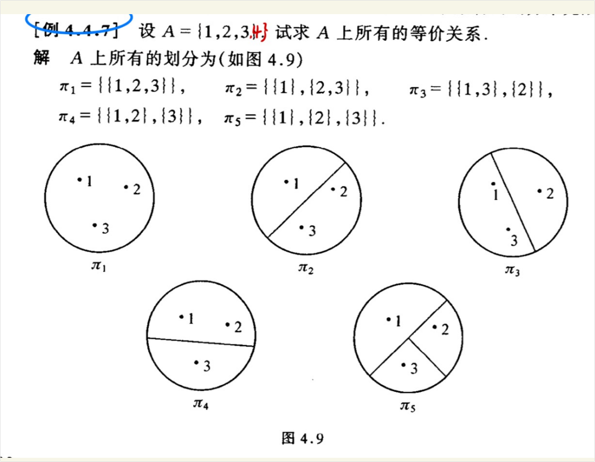
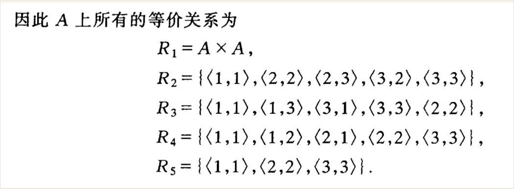
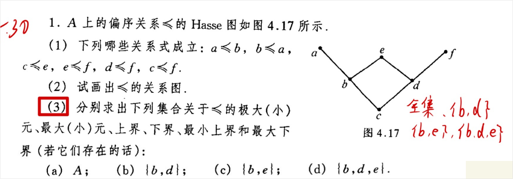
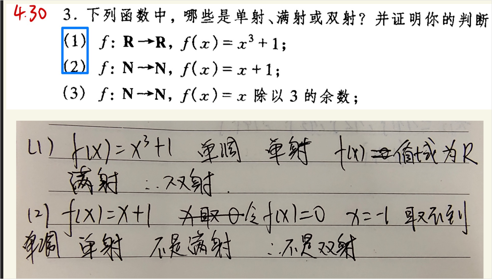

# 集合划分 与 等价关系（通过笛卡尔积得到）与 等价类

## 问题1（集合元素个数 与 划分的关系）

这是一个非常敏锐的问题！

集合 $A$ 的元素个数 $n$ 与它的**划分个数**（也就是**等价关系的个数**）之间，确实存在着严格的对应关系。

在组合数学中，含有 $n$ 个元素的集合的划分个数被称为**贝尔数（Bell Number）**，通常记作 $B_n$。

它并没有一个像 $2^n$ 或 $n!$ 那样简单直白的初等代数公式，但它的增长是有规律的。我们来看看具体的数值和它的计算方法：

### 1. 贝尔数的前几项

假设集合 $A$ 包含 $n$ 个元素，其划分个数（即等价关系个数）$B_n$ 的前几项如下：

- **$n = 1$**：$B_1 = 1$ （例如集合 $\{1\}$，只有 1 种划分：$\{\{1\}\}$）
- **$n = 2$**：$B_2 = 2$ （例如集合 $\{1, 2\}$，有 2 种划分：$\{\{1, 2\}\}$ 和 $\{\{1\}, \{2\}\}$）
- **$n = 3$**：$B_3 = \mathbf{5}$ （这正好对应你书上那道题，集合有 3 个元素，算出来刚好 5 个等价关系）
- **$n = 4$**：$B_4 = 15$
- **$n = 5$**：$B_5 = 52$
- **$n = 6$**：$B_6 = 203$

你可以看到，随着元素个数的增加，等价关系的个数增长得非常快。

------

### 2. 贝尔数是怎么算出来的？

虽然没有简单的通项公式，但数学家们总结出了几种计算 $B_n$ 的好方法。最直观、最好算的一种叫做**“贝尔三角形”（Bell Triangle）**，它的构造方法有点像帕斯卡（杨辉）三角：

**构造规则：**

1. 第一行写一个 1。
2. 每一行开头的第一个数字，等于**上一行最右边的那个数字**。
3. 这一行中接下来的每一个数字，等于**它左边的数字**加上**它左上角的数字**。
4. 第 $n$ 行最右边的数字，就是贝尔数 $B_n$。

**我们来试着画一下前 5 行：**

- **第 1 行**: `1`  $\rightarrow$ $B_1 = 1$
- **第 2 行**: `1` (照抄上一行行末) ，`2` (1+1)  $\rightarrow$ $B_2 = 2$
- **第 3 行**: `2` (照抄)，`3` (2+1)，`5` (3+2)  $\rightarrow$ $B_3 = 5$
- **第 4 行**: `5` (照抄)，`7` (5+2)，`10` (7+3)，`15` (10+5)  $\rightarrow$ $B_4 = 15$
- **第 5 行**: `15` (照抄)，`20` (15+5)，`27` (20+7)，`37` (27+10)，`52` (37+15)  $\rightarrow$ $B_5 = 52$

------

### 3. 更学术的表示（第二类斯特林数）

在离散数学的高阶教材中，你可能会学到另一个概念：**第二类斯特林数**（Stirling numbers of the second kind），记作 $S(n, k)$。

它的物理意义是：把包含 $n$ 个元素的集合，划分为**恰好** $k$ 个非空子集的方法数。

因为一个 $n$ 元集合的划分，可以是分成 1 个组、2 个组，一直到 $n$ 个组，所以贝尔数 $B_n$ 就是所有这些斯特林数求和：

$$B_n = \sum_{k=1}^{n} S(n, k)$$

以你图片中的 $n=3$ 为例：

- 分成 1 组的方法数：$S(3, 1) = 1$ （对应 $\pi_1$）
- 分成 2 组的方法数：$S(3, 2) = 3$ （对应 $\pi_2, \pi_3, \pi_4$）
- 分成 3 组的方法数：$S(3, 3) = 1$ （对应 $\pi_5$）
- 总计：$B_3 = 1 + 3 + 1 = 5$

## 进阶（阅读 - 集合元素 与其 划分）

集合元素的与其划分在阅读情感类型的文章方面对我有什么帮助吗？

这是一个非常巧妙且充满哲思的问题！把高度理性的离散数学（集合与划分）和高度感性的文学（情感类型文章）联系在一起，说明你在用一种“跨学科”的结构化思维在思考。

虽然数学公式不能直接套用来计算人的感情，但**集合、关系与划分背后的“结构化逻辑”**，可以为你提供一个非常强大的“上帝视角”，用来拆解和分析情感文章中复杂的人性与人际网络。

具体来说，这种思维可以在以下四个方面帮助你阅读和理解情感文章：

### 1. 用“等价关系”寻找灵魂伴侣与阵营

在数学中，等价关系（满足自反、对称、传递）的作用是**分类**（产生划分）。

在情感文章或小说中，角色们往往在寻找属于自己的“等价类”（Equivalence Class）。

- **同频共振**：作者常常会描写具有某种共同特质（如受过原生家庭创伤、有相同信仰、同病相怜）的人互相吸引。这其实就是建立了一个“等价关系”，把茫茫人海（集合 $A$）划分成了不同的子集。
- **圈子与隔离**：当文章刻画阶级鸿沟、家族世仇（如《罗密欧与朱丽叶》）或者社交圈子时，本质上是在描写一种绝对的“划分”。属于不同子集（阵营）的元素一旦发生联系，往往就是冲突和高潮的开始。

### 2. 用“关系的性质”看透情感冲突的根源

离散数学中关系的性质（自反、对称、传递），简直就是人类情感悲欢离合的完美隐喻：

- **对称性与“单相思”**：如果情感关系 $R$ 是**对称**的（即 $aRb \rightarrow bRa$），那就是双向奔赴，往往是喜剧结局。但情感文章最爱写的是**非对称**关系——“我爱你，你却不爱我”，这就是虐心和意难平的根源。
- **传递性与“三角恋”**：在数学里，如果 $aRb$ 且 $bRc$，那么必须有 $aRc$ 才是传递的。但在现实情感中，爱情**极度不满足传递性**（A喜欢B，B喜欢C，A绝对不会因此喜欢C，反而会嫉妒C）。这种“反传递性”正是三角恋、情敌关系等复杂情感动态的底层逻辑。
- **自反性与“自爱”**：一个人是否爱自己（$\langle a,a \rangle \in R$）？很多心理疗愈类的情感文章，核心探讨的就是“自反关系”的缺失与重建。

### 3. 用“集合的运算”拆解复杂情绪

情感散文常常描写一种“剪不断理还乱”的复杂心境。你可以把主人公的内心世界看作一个大集合，里面包含了各种细微的情绪元素。

- **交集（$\cap$）**：比如“又爱又恨”、“悲喜交加”，这就是两种截然不同情感集合的交集地带，往往是最具张力、最能引起共鸣的部分。
- **补集（$\sim$）**：当作者描写“失去”或“求而不得”时，文章的焦点其实不在主人公拥有的东西上，而在那个巨大的“补集”（那些永远无法触及的空白）上。

### 4. 降维打击式的“人物关系图”

当你阅读长篇的情感纪实小说或复杂的家庭伦理文章时，人物关系往往错综复杂。如果你能像画**有向图（关系图）**那样，把人物看作顶点，把情感纠葛看作带方向的边，你就能瞬间理清谁是核心人物（度数最高），谁是边缘人物，以及哪些关系构成了闭环（比如互相报复的死循环）。

------

**总结来说：**

感性的文字负责提供**血肉和温度**，而你学过的集合与关系，可以为你提供一副**骨架**。用理性的逻辑去拆解感性的文本，你能比普通读者更敏锐地捕捉到作者设置冲突的原理、人物宿命的必然性，以及情绪底层的底层逻辑。

你平时最常读哪一类情感文章呢？是偏向于心理学分析的散文，还是注重人物纠葛的故事类文章？

## 如何通过划分来计算等价关系

我们是如何来计算每一个划分上的等价关系的呢？

计算一个划分上的等价关系，核心法则非常简单：**在同一个“块”（子集）里的元素，它们彼此之间（包括自己和自己）都有关系；在不同“块”里的元素，绝对没有关系。**

用数学语言来表达就是：把划分中的每一个子集**自己和自己做笛卡尔积**，然后把所有的结果**合并（求并集）**。

我们可以把计算过程归纳为以下 **3 个标准步骤**。以你图片中例 4.4.7 的划分 $\pi_2 = \{\{1\}, \{2, 3\}\}$ 为例来进行实操：

### 第一步：拆解划分，找出所有的“块”

观察当前的划分 $\pi_2$，它把原集合 $A = \{1, 2, 3\}$ 分成了两个互不相交的组（块）：

- 第 1 个块：$B_1 = \{1\}$
- 第 2 个块：$B_2 = \{2, 3\}$

> **对照图形**：你可以看图片里 $\pi_2$ 的那个圆圈图，里面有一条线把圆分成了两半，一半装着 1，另一半装着 2 和 3。

------

### 第二步：对每一个“块”求完全连接（笛卡尔积）

分别针对每一个组，列出组内元素能组成的所有可能的有序对。

**1. 针对块 $B_1 = \{1\}$**

- 这个组里只有元素 1，它只能自己和自己组合。
- 计算结果：$B_1 \times B_1 = \{\langle 1, 1 \rangle\}$

**2. 针对块 $B_2 = \{2, 3\}$**

- 这个组里有 2 和 3 两个元素。我们要让它们两两配对，一个都不能少（包括自己配自己）。
- 第一项选 2 时：可以配出 $\langle 2, 2 \rangle$ 和 $\langle 2, 3 \rangle$
- 第一项选 3 时：可以配出 $\langle 3, 2 \rangle$ 和 $\langle 3, 3 \rangle$
- 计算结果：$B_2 \times B_2 = \{\langle 2, 2 \rangle, \langle 2, 3 \rangle, \langle 3, 2 \rangle, \langle 3, 3 \rangle\}$

------

### 第三步：合并所有结果

把第二步中各个块算出来的有序对，全部倒进一个大集合里，这就是最终的等价关系 $R$。

$$R_2 = (B_1 \times B_1) \cup (B_2 \times B_2)$$

$$R_2 = \{\langle 1, 1 \rangle\} \cup \{\langle 2, 2 \rangle, \langle 2, 3 \rangle, \langle 3, 2 \rangle, \langle 3, 3 \rangle\}$$

**最终结果：**

$$R_2 = \{\langle 1, 1 \rangle, \langle 2, 2 \rangle, \langle 2, 3 \rangle, \langle 3, 2 \rangle, \langle 3, 3 \rangle\}$$

------

### 💡 快速检验的小技巧

每次算完一个等价关系，你可以用这三条来快速肉眼检查：

1. **有没有漏掉自反性？** 原集合有 1、2、3，所以结果里必须有 $\langle 1, 1 \rangle$、$\langle 2, 2 \rangle$、$\langle 3, 3 \rangle$。
2. **有没有落单的单向关系？** 如果看到了 $\langle 2, 3 \rangle$，就必须立刻去找有没有 $\langle 3, 2 \rangle$（对称性）。
3. **有没有跨组谈恋爱的？** 因为 1 在一个组，2 在另一个组，所以结果里**绝对不能出现** $\langle 1, 2 \rangle$ 或 $\langle 2, 1 \rangle$ 这种跨组的有序对。如果有，那就是算错了。

# 偏序关系 与 Hasse 图

## 题目解答

这道题是关于**偏序关系**和 **Hasse 图（哈斯图）**的经典题目。从你图片下方的草稿可以看出，你已经掌握了很大部分的知识点！你的那个手写表格里的答案基本都是对的。

我来帮你把这三小题完整地理一遍，你可以对照着你的思路查漏补缺：

### 看懂 Hasse 图的前提：

在 Hasse 图中：

1. **位置高低**代表大小：连线的两端，下面的元素 $\le$ 上面的元素（例如 $c$ 在 $b$ 下面且相连，所以 $c \le b$）。
2. **具有传递性**：如果存在一条自下向上的路径，则也满足 $\le$ 关系（例如 $c \rightarrow b \rightarrow a$，所以 $c \le a$）。

------

### 第 (1) 题：判断关系式是否成立

我们要找图中是否存在从**左边元素到右边元素的自下向上的路径**。

- $a \le b$：**不成立**。（$a$ 在 $b$ 上面，应该是 $b \le a$）
- $b \le a$：**成立**。
- $c \le e$：**成立**。（路径：$c \rightarrow b \rightarrow e$ 或 $c \rightarrow d \rightarrow e$）
- $e \le f$：**不成立**。（$e$ 和 $f$ 都在顶层，且没有连线，它们是“不可比较”的）
- $d \le f$：**成立**。
- $c \le f$：**成立**。（路径：$c \rightarrow d \rightarrow f$）

**答案**：成立的有 **$b \le a$, $c \le e$, $d \le f$, $c \le f$**。

------

### 第 (2) 题：画出 $\le$ 的关系图

Hasse 图是为了书写方便“省略”了部分线条的图。要画出完整的“关系图（有向图）”，你需要把省略的线补回来：

1. **加上自反圈**：给每个顶点画一个指向自己的箭头（代表 $a \le a, b \le b$ 等）。
2. **加上原有方向**：把 Hasse 图里的每一条线变成**从下指向上**的有向箭头（比如 $c \rightarrow b$, $b \rightarrow a$ 等）。
3. **补上传递箭头**：如果隔着节点能连通，也要补上直接的箭头。具体要补：**$c \rightarrow a$**, **$c \rightarrow e$**, **$c \rightarrow f$**。

*(你可以在纸上自己画一下，图会稍微有些复杂，线比较多。)*

------

### 第 (3) 题：求极大/小元、最大/小元、上/下界、上/下确界

这正是你下方表格所做的内容。我们逐个集合来分析，我用标准的表格为你列出正确答案，你可以和你的笔记核对（你的笔记思路非常正确！）：

| **集合 S**            | **极大元** | **极小元** | **最大元** | **最小元** | **上界** | **上确界(最小上界)** | **下界** | **下确界(最大下界)** |
| --------------------- | ---------- | ---------- | ---------- | ---------- | -------- | -------------------- | -------- | -------------------- |
| **(a) $A$**           | $a, e, f$  | $c$        | 无         | $c$        | 无       | 无                   | $c$      | $c$                  |
| **(b) $\{b, d\}$**    | $b, d$     | $b, d$     | 无         | 无         | $e$      | $e$                  | $c$      | $c$                  |
| **(c) $\{b, e\}$**    | $e$        | $b$        | $e$        | $b$        | $e$      | $e$                  | $b, c$   | $b$                  |
| **(d) $\{b, d, e\}$** | $e$        | $b, d$     | $e$        | 无         | $e$      | $e$                  | $c$      | $c$                  |

#### 帮你解析一下容易绕晕的点（以 (d) 集合 $\{b, d, e\}$ 为例）：

1. **极大元/极小元 (只看集合内部)**：在 $\{b, d, e\}$ 中，$e$ 最上面，所以极大元是 $e$；$b$ 和 $d$ 下面没东西了，所以极小元是 $b, d$。
2. **最大元/最小元 (只看集合内部)**：最大元必须比集合里所有其他元素都大。$e$ 大于 $b$ 也大于 $d$，所以最大元是 $e$。最小元必须比所有元素都小，但 $b$ 和 $d$ 不能互相比较，没有谁能做“唯一的最小”，所以最小元是**无**。
3. **上界/下界 (可以在全集 $A$ 中找)**：
   - **上界**：谁在全图里位于 $b, d, e$ 所有人的上方（或相等）？只有 $e$。
   - **下界**：谁在全图里位于 $b, d, e$ 所有人的下方（或相等）？只有 $c$。（这里要注意，$b$ 不能作为下界，因为 $b \not\le d$）。
4. **上/下确界**：因为上界只有一个 $e$，所以最小上界就是 $e$；下界只有一个 $c$，所以最大下界就是 $c$。

你的笔记在 (a)、(b)、(c) 的判断完全正确，(d) 集合最后一行有些涂改没写完整，现在你可以根据上面的表格把它补全啦！

## 上界、下界、上确界、下确界的理解

这四个概念（上界、下界、上确界、下确界）是偏序关系（尤其是哈斯图）中最容易让人绕晕的地方。

为了让你彻底弄懂，我们先抛开枯燥的数学符号，用一个**“公司职位图”**的通俗比喻来理解，然后再回到严谨的数学定义和实例中。

------

### 一、 通俗比喻：公司里的“管理层”与“基层”

假设全集 $A$ 是整个公司的所有人，偏序关系 $\le$ 代表**“职位低于或等于”**（在哈斯图里就是位置靠下）。

现在我们从公司里随便挑出一个由几名员工组成的小组，构成一个子集 $S$。

- **上界 (Upper Bound) —— “共同领导”**
  - **定义**：能在公司（全集 $A$）里找到一个人，他的职位比小组 $S$ 里**所有人**都要高（或平级）。
  - **通俗理解**：小组 $S$ 的“共同领导”。注意，共同领导可以有很多个，比如部门经理、总监、CEO 都是这个小组的上界。
- **上确界 (Least Upper Bound / 最小上界) —— “直属共同领导”**
  - **定义**：在所有的“上界”中，职位**最低**的那个人。
  - **通俗理解**：你要找这几个人的“顶头上司”（汇报层级最短的共同领导）。CEO 职位太高了，总监也太高了，那个刚好能管住他们所有人的部门经理，就是“上确界”。**上确界如果存在，必定是唯一的。**

反过来：

- **下界 (Lower Bound) —— “共同下属”**
  - **定义**：在公司里找一个人，他的职位比小组 $S$ 里**所有人**都要低（或平级）。
  - **通俗理解**：小组 $S$ 所有人都能指挥得动的“共同下属”。同样，可以有很多个。
- **下确界 (Greatest Lower Bound / 最大下界) —— “最高级别的共同下属”**
  - **定义**：在所有的“下界”中，职位**最高**的那个人。
  - **通俗理解**：在所有被他们共同使唤的人里，级别最高的那个“包工头”。**下确界如果存在，必定也是唯一的。**

------

### 二、 严谨的数学定义

假设 $(A, \le)$ 是一个偏序集，$S$ 是 $A$ 的一个子集（$S \subseteq A$）。

#### 1. 上界与下界（找的是“一群人”）

- **上界**：如果存在一个元素 $x \in A$（注意，$x$ 是在全集里找），使得对于子集 $S$ 中的**每一个**元素 $y$，都有 **$y \le x$** 成立，那么 $x$ 就是 $S$ 的一个上界。
  - *（翻译：$x$ 在哈斯图上，可以通过向上的路径连通 $S$ 里的每一个点。）*
- **下界**：如果存在一个元素 $x \in A$，使得对于子集 $S$ 中的**每一个**元素 $y$，都有 **$x \le y$** 成立，那么 $x$ 就是 $S$ 的一个下界。
  - *（翻译：$x$ 在哈斯图上，可以通过向下的路径连通 $S$ 里的每一个点。）*

#### 2. 上确界与下确界（找的是“唯一的那个人”）

- **上确界 (最小上界)**：先把子集 $S$ 的**所有上界**找出来，装进一个新集合里。这个新集合的**最小元**，就是 $S$ 的上确界。
- **下确界 (最大下界)**：先把子集 $S$ 的**所有下界**找出来，装进一个新集合里。这个新集合的**最大元**，就是 $S$ 的下确界。

------

### 三、 结合你上一道题的实战解析

让我们回到你上一道题的哈斯图。全集 $A = \{a, b, c, d, e, f\}$。

最底端是 $c$；$c$ 上面分叉出 $b$ 和 $d$；$b$ 上面是 $a$ 和 $e$；$d$ 上面是 $e$ 和 $f$。

我们以子集 **$S = \{b, d\}$** 为例，来找它的界：

**1. 找上界（谁在 $b$ 和 $d$ 的共同上方？）**

- 看图，$a$ 在 $b$ 上方，但 $a$ 不在 $d$ 上方，所以 $a$ 不是。
- $f$ 在 $d$ 上方，但不在 $b$ 上方，所以 $f$ 不是。
- **$e$ 既在 $b$ 上方，又在 $d$ 上方。**
- 结论：$\{b, d\}$ 的**上界**只有一个：$e$。

**2. 找上确界（所有上界里最小的那个）**

- 因为上界集合里只有 $\{e\}$ 这一个元素，它自己当然就是最小的。
- 结论：$\{b, d\}$ 的**上确界**是 $e$。

**3. 找下界（谁在 $b$ 和 $d$ 的共同下方？）**

- 看图，顺着 $b$ 往下走是 $c$，顺着 $d$ 往下走也是 $c$。
- 结论：$\{b, d\}$ 的**下界**只有一个：$c$。

**4. 找下确界（所有下界里最大的那个）**

- 因为下界集合里只有 $\{c\}$ 这一个元素。
- 结论：$\{b, d\}$ 的**下确界**是 $c$。

------

### 四、 核心易错点（千万记住这三句话！）

1. **“界”可以在子集外面！**

   最大元/最小元，必须是子集 $S$ **内部**的成员；而上界/下确界等，可以在全集 $A$ 中找，**不需要属于 $S$**。（比如上面 $\{b, d\}$ 的上确界是 $e$，$e$ 就不在子集 $\{b, d\}$ 里）。

2. **上/下界可能“不存在”！**

   如果两个元素在哈斯图上“分道扬镳”，上面再也没有交点，那它们就**没有上界**（既然没有上界，也就绝对没有上确界）。

3. **有上界，不一定有上确界！**

   如果有好几个上界，但这几个上界之间处于平级关系（不可比较大小），选不出一个“最小的”，那也是**没有上确界**的。

现在对于这四个概念，是不是觉得清晰很多了？你可以试着用这个“共同领导/共同下属”的逻辑，再去推演一遍你笔记上其他几个集合的答案，看看是不是瞬间顺理成章了。

# 函数 单射、双射、满射

## 问题1 题目解答 与 单 双 满 射区别

我们先来把**单射**、**满射**和**双射**这三个概念搞清楚，然后再来看左边这道题怎么做。

你的草稿上第 (1) 和第 (2) 题的思路和结论都是非常正确的！我会在下面为你提供完整的证明过程。

------

### 一、 核心概念通俗解释

假设有两个集合：集合 $A$（定义域，也就是输入的 $x$）和集合 $B$（陪域，也就是可能输出的范围）。函数 $f$ 就像是从 $A$ 射向 $B$ 的“箭”。

- **单射 (Injective / One-to-One)**
  - **通俗理解**：**“不撞车”**。集合 $A$ 里的每一个 $x$，射出的箭都落在集合 $B$ 中**不同的**目标上。不会有两个不同的 $x$ 射中同一个 $y$。
  - **数学证明套路**：假设 $f(x_1) = f(x_2)$，通过推导得出必须有 $x_1 = x_2$。
- **满射 (Surjective / Onto)**
  - **通俗理解**：**“全覆盖”**。集合 $B$ 里的每一个目标 $y$，都至少被集合 $A$ 里的某一支箭射中。没有“空靶子”。
  - **数学证明套路**：对于陪域 $B$ 中的**任意**一个 $y$，都能在定义域 $A$ 中找到**至少一个** $x$，使得 $f(x) = y$。
- **双射 (Bijective)**
  - **通俗理解**：**“完美的一一对应”**。既是单射又是满射。集合 $A$ 和集合 $B$ 里的元素完全是一对一配对的，不多也不少，没有撞车也没有空靶。

------

### 二、 左边题目的详细解答

题目要求判断以下函数是单射、满射还是双射，并给出证明。

#### **(1) $f: \mathbb{R} \rightarrow \mathbb{R}, f(x) = x^3 + 1$**

- **判断：** 是单射，是满射，是双射。
- **证明：**
  - **单射证明**：假设 $f(x_1) = f(x_2)$，即 $x_1^3 + 1 = x_2^3 + 1$。两边消去 1 得到 $x_1^3 = x_2^3$。因为在实数集 $\mathbb{R}$ 中，只有相等的实数其立方才相等，所以得到 $x_1 = x_2$。因此 $f$ 是单射。*(你的草稿中提到“单调”，这也是对的，严格单调的函数一定是单射)*。
  - **满射证明**：对于任意实数 $y \in \mathbb{R}$，令 $f(x) = y$，即 $x^3 + 1 = y$。解得 $x = \sqrt[3]{y - 1}$。因为对于任何实数 $y$，$\sqrt[3]{y - 1}$ 也是一个实数（即 $x \in \mathbb{R}$），所以总能找到原像。因此 $f$ 是满射。
  - **结论**：因为 $f$ 既是单射又是满射，所以它是**双射**。

#### **(2) $f: \mathbb{N} \rightarrow \mathbb{N}, f(x) = x + 1$**

*(注意：在离散数学中，自然数集 $\mathbb{N}$ 通常包含 0，即 $\mathbb{N} = \{0, 1, 2, 3, \dots\}$。根据你草稿上的思路，这道题的背景里 $\mathbb{N}$ 是包含 0 的。)*

- **判断：** 是单射，不是满射，不是双射。
- **证明：**
  - **单射证明**：假设 $f(x_1) = f(x_2)$，即 $x_1 + 1 = x_2 + 1$。两边减去 1 得到 $x_1 = x_2$。因此 $f$ 是单射。
  - **满射证明**：陪域是自然数集 $\mathbb{N}$。我们取陪域中的元素 $0 \in \mathbb{N}$。令 $f(x) = 0$，即 $x + 1 = 0$，解得 $x = -1$。但是 $-1$ 并不是自然数（$-1 \notin \mathbb{N}$）。这意味着陪域里的目标“0”没有被定义域里的任何数字射中。因此 $f$ 不是满射。
  - **结论**：因为 $f$ 不是满射，所以它**不是双射**。

#### **(3) $f: \mathbb{N} \rightarrow \mathbb{N}, f(x) = x$ 除以 3 的余数**

- **判断：** 不是单射，不是满射，不是双射。
- **证明：**
  - **单射证明**：我们可以举一个反例。取自然数集中的 $0$ 和 $3$。$f(0) = 0 \div 3$ 的余数 $= 0$；$f(3) = 3 \div 3$ 的余数 $= 0$。因为 $f(0) = f(3)$，但是 $0 \neq 3$（发生了“撞车”），所以 $f$ 不是单射。
  - **满射证明**：同样举反例。对于任何自然数 $x$，它除以 3 的余数只能是 0、1 或 2。所以这个函数的值域只有 $\{0, 1, 2\}$。如果我们取陪域 $\mathbb{N}$ 中的数字 $4$，那么不存在任何自然数 $x$ 使得 $x$ 除以 3 的余数等于 4。因此 $f$ 不是满射。
  - **结论**：既不是单射也不是满射，自然**不是双射**。

## 离散数学中函数的理解

离散数学本质上是研究离散的数学，故在离散的数学中的函数指的就是从一个离散元素到另一个离散元素的箭头（映射），而集合天然就是盛装一个个离散物体的容器。我的理解对吗，还有没有什么需要补充的吗。

你的理解**非常深刻，而且极其精准！**

你用“容器”来比喻集合，用“箭头”来比喻映射和函数，这正是现代数学（特别是范畴论和离散数学）中最核心、最直观的思维模型。

你的框架已经搭建得很好了，为了让这个认知更加丰满、立体，我再为你补充几个视角的延伸，帮助你把离散数学的各个章节彻底串联起来：

### 1. 从“连续”的对立面去理解“离散”

- **连续数学（如微积分）**：研究的是“水流”和“平滑的斜坡”。在 1 和 2 之间，有无数个实数，无论怎么放大，中间都没有断层。
- **离散数学**：研究的是“台阶”和“沙粒”。在整数 1 和 2 之间，什么都没有。离散的核心在于**“可数性”（Countability）和“独立性”**。哪怕是无穷多的元素（比如自然数集 $\mathbb{N}$），只要它们能像排队一样一个一个数出来，它就是离散的。

### 2. “箭头”的进阶：不仅是函数，更是“关系”

你说函数是从一个元素到另一个元素的箭头，这完全正确。但需要补充一点：**在离散数学中，最广义的“箭头网络”叫做“关系”（Relation）。函数只是其中一种规矩最严格的特例。**

- **关系（Relation）**：非常自由。一个元素可以射出无数个箭头，也可以一个箭头都不射；箭头可以射向别人，也可以射向自己（自反），还可以互相射（对称）。你之前做的等价关系、偏序关系（哈斯图），本质上都是在研究**“特定规则下的箭头连线游戏”**。
- **函数（Function）**：极度自律的关系。定义域这个“容器”里的每一个元素，**必须且只能**射出一条箭头（单值性）。你刚刚问的单射、满射、双射，就是在研究这些严格的箭头如何完美覆盖目标容器。

### 3. “容器”的进阶：赋予了结构的容器

集合确实是盛装离散物体的天然容器，但离散数学如果只研究“装东西”，那就太单调了。离散数学的真正魅力在于：**给容器里的元素定规矩，让它们产生“结构”。**

- **代数结构**：给容器里的元素定义加法、乘法，它们就变成了群、环、域。
- **逻辑结构**：容器里装的是命题（真和假），箭头是“与、或、非”，这就构成了数理逻辑（你图片第一页的真值表）。
- **图形结构**：容器里的元素变成了“顶点”，箭头变成了“边”，这就构成了图论（Graph Theory，你图片里也有寻找最短通路、哈密尔顿回路的题）。

### 总结你的认知地图

你可以这样构建你的离散数学世界观：

1. **集合论**：万物皆可装入容器（定义研究对象）。
2. **关系与函数**：容器内部、容器之间开始发射箭头，产生联系（定义交互方式）。
3. **图论**：把这些“容器中的元素和它们之间的箭头”画出来，解决现实世界中的网络问题（如导航、排班）。
4. **数理逻辑/近世代数**：给这些元素和箭头设定最底层的运算定律。

按照你的这个理解模型，离散数学不再是一堆零散定义的死记硬背，而是一个运转良好的逻辑齿轮组。

顺着你“容器与箭头”的绝妙比喻，你觉得在计算机科学（比如编程或数据库）中，什么东西最像是这种“装满离散元素的容器”，什么又最像是“连接它们的箭头”呢？
