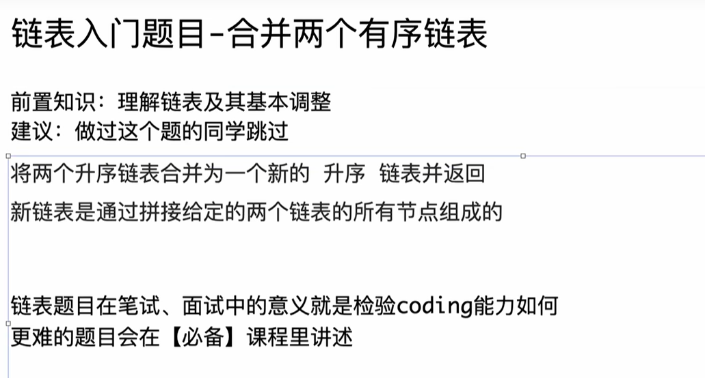

```java
package class010;

// 将两个升序链表合并为一个新的 升序 链表并返回
// 新链表是通过拼接给定的两个链表的所有节点组成的
// 测试链接 : https://leetcode.cn/problems/merge-two-sorted-lists/
public class MergeTwoLists {

	// 不要提交这个类
	public static class ListNode {
		public int val;
		public ListNode next;

		public ListNode(int val) {
			this.val = val;
		}

		public ListNode(int val, ListNode next) {
			this.val = val;
			this.next = next;
		}
	}

	class Solution {

		public static ListNode mergeTwoLists(ListNode head1, ListNode head2) {
			if (head1 == null || head2 == null) {
				return head1 == null ? head2 : head1;
			}
			ListNode head = head1.val <= head2.val ? head1 : head2;
			ListNode cur1 = head.next;
			ListNode cur2 = head == head1 ? head2 : head1;
			ListNode pre = head;
			while (cur1 != null && cur2 != null) {
				if (cur1.val <= cur2.val) {
					pre.next = cur1;
					cur1 = cur1.next;
				} else {
					pre.next = cur2;
					cur2 = cur2.next;
				}
				pre = pre.next;
			}
			pre.next = cur1 != null ? cur1 : cur2;
			return head;
		}

	}

}
```


这同样是一道经典的链表题目。原Java代码采用的是**无虚拟头节点（Dummy Head）**的迭代写法，需要特殊处理“谁是头节点”的逻辑。

下面我将其转换为 C++ 代码，保持原有逻辑不变，随后进行 C++ 特性的深度扩展。

### 第一部分：C++ 代码实现

C++

```C++
#include <iostream>

using namespace std;

// 定义链表节点结构体
// C++ 中 struct 默认权限是 public，非常适合定义这种纯数据节点
struct ListNode {
    int val;
    ListNode* next;

    // 构造函数：初始化列表写法 (Initialier List)，效率更高
    ListNode(int x) : val(x), next(nullptr) {}
    ListNode(int x, ListNode* nextNode) : val(x), next(nextNode) {}
};

class Solution {
public:
    // 对应 Java: public static ListNode mergeTwoLists(...)
    static ListNode* mergeTwoLists(ListNode* head1, ListNode* head2) {
        // 1. 边界条件处理
        if (head1 == nullptr || head2 == nullptr) {
            return head1 == nullptr ? head2 : head1;
        }

        // 2. 确定合并后的头节点 (对应 Java 代码的初始化逻辑)
        // 这一步是为了确定 head 指向哪个链表的头，并让 cur 指针跳过它
        ListNode* head = (head1->val <= head2->val) ? head1 : head2;
        
        ListNode* cur1 = head->next; // 如果 head 是 head1，cur1 就是 head1->next
        ListNode* cur2 = (head == head1) ? head2 : head1; // 另一个链表的头
        ListNode* pre = head; // 这里的 pre 相当于 merged 链表的尾指针

        // 3. 循环比较 (C++ 使用 -> 访问成员)
        while (cur1 != nullptr && cur2 != nullptr) {
            if (cur1->val <= cur2->val) {
                pre->next = cur1;
                cur1 = cur1->next;
            } else {
                pre->next = cur2;
                cur2 = cur2->next;
            }
            pre = pre->next;
        }

        // 4. 处理剩余部分
        pre->next = (cur1 != nullptr) ? cur1 : cur2;

        return head;
    }
};

// 简单的测试主函数
int main() {
    // 构建链表 1: 1 -> 2 -> 4
    ListNode* l1 = new ListNode(1);
    l1->next = new ListNode(2);
    l1->next->next = new ListNode(4);

    // 构建链表 2: 1 -> 3 -> 4
    ListNode* l2 = new ListNode(1);
    l2->next = new ListNode(3);
    l2->next->next = new ListNode(4);

    // 合并
    ListNode* merged = Solution::mergeTwoLists(l1, l2);

    // 打印结果
    ListNode* temp = merged;
    while (temp != nullptr) {
        cout << temp->val << " -> ";
        temp = temp->next;
    }
    cout << "nullptr" << endl;

    // 实际项目中需要手动释放内存，此处略
    return 0;
}
```

------

### 第二部分：C++ 知识扩展

针对这份代码，我们需要补充几个关键的 C++ 概念：

#### 1. `nullptr` vs `NULL`

- **Java**: <span style="border:1px solid #FF00FF; background:#00FF80; color:#FF0000;">只有 `null`。</span>
- **C++**: 早期使用 `NULL`（本质通常是整数 `0`）。现代 C++（C++11及以后）强烈建议使用 **`nullptr`**。
- **为什么？** `NULL` 可能导致函数重载歧义（比如 `f(int)` 和 `f(char*)`，传 `NULL` 可能会调用前者）。`nullptr` 是专门的指针空值类型，类型安全。

#### 2. 箭头操作符 `->`

- **Java**: 所有对象访问都用点 `.`（如 `head.val`），因为 Java 隐藏了指针。
- **C++**:
  - 如果是对象实例（栈上变量），用 `.`（如 `ListNode n; n.val`）。
  - 如果是**指针**（堆上或指向某处），必须用 `->`（如 `head->val`）。
  - `head->val` 等价于 `(*head).val`（先解引用，再取成员）。

#### 3. 内存所有权（Ownership）

这是 C++ 与 Java 最大的思维差异。

- **Java**: `mergeTwoLists` 返回新链表后，旧的 `head1` 和 `head2` 引用还在，但不用管内存，GC 会处理。
- **C++**: 实际上，这个合并操作是**破坏性**的。它直接修改了原 `head1` 和 `head2` 链表中节点的 `next` 指针。调用这个函数后，原始的两个链表结构已经不存在了，它们被编织成了一个新链表。如果调用者继续使用旧的 `head1` 指针遍历，可能会得到意想不到的结果（因为它现在连着合并后的链表）。

------

### 第三部分：深度见解问题 (Q&A)

这些问题旨在考察对“指针操作技巧”和“代码鲁棒性”的理解。

#### Q1: 原代码为了确定 `head` 写了一堆 `if-else` 和三元运算符，非常啰嗦。在 C++ 中有什么“工程化”的手段能消除这些初始化逻辑？

> 简洁回复：
>
> 使用 虚拟头节点 (Dummy Head / Sentinel Node)。
>
> 在栈上创建一个临时节点 ListNode dummy(0);，让 ListNode* pre = &dummy;。这样 pre 永远非空，循环内逻辑一致。最后返回 dummy.next。这能消除处理头节点特例的代码，使代码量减少 30%。

#### Q2: 结合上一节课的知识，如果我既不想用 Dummy Head，又想消除 `if (head1 < head2)` 这种初始化头节点的判断，利用 **二级指针 (Pointer to Pointer)** 该怎么做？

> 简洁回复：
>
> 定义一个二级指针 ListNode** pp = &head;（这里的 head 是我们要返回的结果）。
>
> 在循环中，判断谁小，就让 *pp 指向谁（比如指向 l1），然后 pp = &((*pp)->next);（也就是 pp = &l1->next）。
>
> 这样 pp 始终指向“当前需要被填入的那个 next 指针的地址”，无论是头节点还是后续节点，逻辑完全统一。

#### Q3: 这个合并算法的时间复杂度和空间复杂度是多少？如果这是 C++ 的 `std::list` (双向链表)，合并操作有什么不同？

> **简洁回复：**
>
> - **复杂度**：时间 O(N+M)，空间 O(1)（原地修改指针）。
> - **std::list 区别**：C++ STL 的 `std::list::merge` 是**接合 (Splice)** 操作。它不仅仅是修改指针，还会把源链表变空（节点所有权转移）。如果你手写链表合并，只是改变指向；而 STL 容器合并通常意味着源容器的所有权被剥夺。

#### Q4: 如果链表节点中包含大量数据（比如 1MB 的图片），Java 和 C++ 在执行 `cur1 = cur1.next` 这种赋值时，会有性能差异吗？

> 简洁回复：
>
> 没有差异。
>
> 无论节点携带多少数据，ListNode* (C++) 和 ListNode 引用 (Java) 本质上都只是一个地址（在 64 位机器上通常是 8 字节）。赋值操作只拷贝这个地址，不拷贝节点里的 1MB 数据。只有当你错误地在这个函数里写了 ListNode node = *cur1 (对象拷贝) 时，C++ 才会发生严重的性能拷贝。

#### 扩展代码：Dummy Head 写法 (推荐)

为了让你对比，这是 C++ 中最标准的优美写法：

C++

```
static ListNode* mergeTwoListsOptimized(ListNode* list1, ListNode* list2) {
    ListNode dummy(0); // 栈上分配，无需 delete，函数结束自动销毁
    ListNode* tail = &dummy; // tail 指针指向 dummy

    while (list1 && list2) {
        if (list1->val < list2->val) {
            tail->next = list1;
            list1 = list1->next;
        } else {
            tail->next = list2;
            list2 = list2->next;
        }
        tail = tail->next;
    }
    
    tail->next = list1 ? list1 : list2;
    return dummy.next;
}
```
