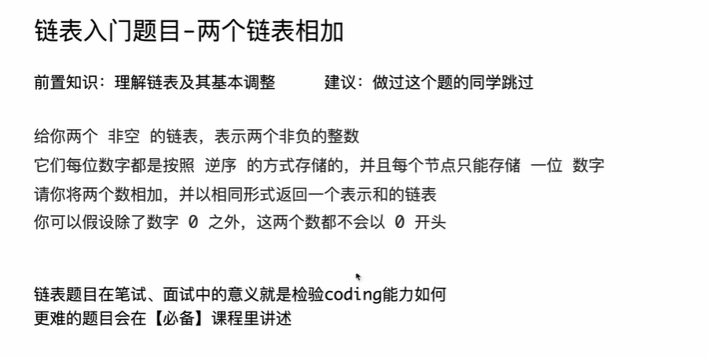
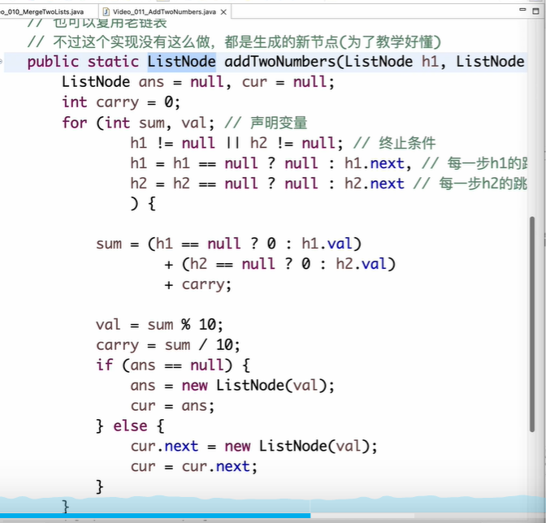

```java
package class011;

// 给你两个 非空 的链表，表示两个非负的整数
// 它们每位数字都是按照 逆序 的方式存储的，并且每个节点只能存储 一位 数字
// 请你将两个数相加，并以相同形式返回一个表示和的链表。
// 你可以假设除了数字 0 之外，这两个数都不会以 0 开头
// 测试链接：https://leetcode.cn/problems/add-two-numbers/
public class AddTwoNumbers {

	// 不要提交这个类
	public static class ListNode {
		public int val;
		public ListNode next;

		public ListNode(int val) {
			this.val = val;
		}

		public ListNode(int val, ListNode next) {
			this.val = val;
			this.next = next;
		}
	}

	class Solution {

		// 也可以复用老链表
		// 不过这个实现没有这么做，都是生成的新节点(为了教学好懂)
		public static ListNode addTwoNumbers(ListNode h1, ListNode h2) {
			ListNode ans = null, cur = null;
			int carry = 0;
			for (int sum, val; // 声明变量
					h1 != null || h2 != null; // 终止条件
					h1 = h1 == null ? null : h1.next, // 每一步h1的跳转
					h2 = h2 == null ? null : h2.next // 每一步h2的跳转
					) {

				sum = (h1 == null ? 0 : h1.val)
						+ (h2 == null ? 0 : h2.val)
						+ carry;

				val = sum % 10;
				carry = sum / 10;
				if (ans == null) {
					ans = new ListNode(val);
					cur = ans;
				} else {
					cur.next = new ListNode(val);
					cur = cur.next;
				}
			}
			if (carry == 1) {
				cur.next = new ListNode(1);
			}
			return ans;
		}

	}

}
```


这是一个非常经典的链表面试题。在 C++ 中处理链表，除了算法逻辑，最核心的区别在于**内存管理**。

以下是将该 Java 代码转换为 C++ 的版本，以及相关的知识点扩展和深度思考题。

------

# 1. C++ 代码实现

在 C++ 中，我们通常使用结构体 `struct` 来定义链表节点。

C++

```C++
#include <iostream>

/**
 * 链表节点定义
 */
struct ListNode {
    int val;
    ListNode *next;
    ListNode() : val(0), next(nullptr) {}
    ListNode(int x) : val(x), next(nullptr) {}
    ListNode(int x, ListNode *next) : val(x), next(next) {}
};

class Solution {
public:
    ListNode* addTwoNumbers(ListNode* l1, ListNode* l2) {
        ListNode *head = nullptr, *tail = nullptr;
        int carry = 0;

        while (l1 != nullptr || l2 != nullptr) {
            int n1 = l1 ? l1->val : 0;
            int n2 = l2 ? l2->val : 0;
            int sum = n1 + n2 + carry;

            if (!head) {
                head = tail = new ListNode(sum % 10);
            } else {
                tail->next = new ListNode(sum % 10);
                tail = tail->next;
            }

            carry = sum / 10;
            if (l1) l1 = l1->next;
            if (l2) l2 = l2->next;
        }

        if (carry > 0) {
            tail->next = new ListNode(carry);
        }
        
        return head;
    }
};
```

------

# 2. C++ 知识点扩展

### **指针与内存管理**

- **Java vs C++**: Java 有垃圾回收（GC），你只需 `new` 即可。在 C++ 中，`new` 出来的对象在堆（Heap）上，**必须手动 `delete`**。在 LeetCode 环境中通常不需要你手动释放返回的链表，但在实际开发中，不手动释放会造成内存泄漏。
- **nullptr**: C++11 引入了 `nullptr` 取代了宏定义的 `NULL`。它具有类型安全性，能避免在重载函数中产生歧义。

### **三元运算符与逻辑优化**

- 代码中使用了 `l1 ? l1->val : 0`。在 C++ 中，指针可以直接作为布尔值判断：`nullptr` 为 `false`，非空指针为 `true`。

### **构造函数初始化列表**

- 在 `ListNode` 结构体中，我们使用了 `: val(x), next(nullptr) {}` 这种写法。这比在花括号内赋值效率更高，因为它直接初始化成员，而不是先默认初始化再赋值。

------

# 3. 深度见解问题与简洁回复

### **Q1: 为什么题目要求“逆序”存储数字？如果是“正序”该怎么办？**

- **回复：** 逆序存储是为了让**低位对齐**。相加时，我们从个位开始，产生的进位可以顺着链表自然传递到高位。如果是正序，则需要先翻转链表，或利用栈（Stack）来辅助计算。

### **Q2: 使用“哨兵位节点”（Dummy Node）有什么好处？**

- **回复：** 它可以统一“第一个节点”和“后续节点”的处理逻辑。在上面的代码中，我们必须判断 `if (!head)`；如果使用哨兵节点 `ListNode* dummy = new ListNode(0)`，则所有节点都可以通过 `tail->next = ...` 挂载，最后返回 `dummy->next` 即可。

### **Q3: 这种解法的时间和空间复杂度是多少？**

- **回复：** * **时间复杂度：** $O(\max(M, N))$，其中 $M, N$ 为两链表长度，需遍历较长的那个。
  - **空间复杂度：** $O(\max(M, N))$，用于存放结果链表（不计入结果则为 $O(1)$）。

### **Q4: 如何实现真正的“零额外空间”损耗？**

- **回复：** 像代码注释中提到的，可以**复用原链表**。将结果存入 `h1` 或 `h2` 中，只在两者都用完且仍有进位时，才 `new` 一个最后节点。这在处理超大规模数据且内存受限时非常有效。

------

**你想让我尝试写一个“复用原链表空间”的 C++ 进阶版本吗？**


# 自己书写代码

```C++
/**

 * Definition for singly-linked list.

 * struct ListNode {

 *     int val;

 *     ListNode *next;

 *     ListNode() : val(0), next(nullptr) {}

 *     ListNode(int x) : val(x), next(nullptr) {}

 *     ListNode(int x, ListNode *next) : val(x), next(next) {}

 * };

 */

class Solution {

public:

    ListNode* addTwoNumbers(ListNode* l1, ListNode* l2) {

        ListNode* ans = nullptr;
        ListNode* cur;
        int sum,carry=0;
        int tem;


        while(l1 != nullptr || l2!=nullptr){
            sum = l1 != nullptr? l1->val:0 + l2!=nullptr?l2->val:0 + carry;
            tem = sum%10;
            carry = sum/10;


            if(ans == nullptr){
                ans = new ListNode(tem);
                cur = ans;

            } else {
                cur->next = new ListNode(tem)
                cur = cur->next;
            }

            l1 = l1==nullptr?nullptr:l1->next;
            l2 = l2==nullptr?nullptr:l2->next;
        }


        if(carry==1){
            cur->next = new ListNode(1);
        }

        return ans;
    }
};
```

<span style="color:#FF0000; background:#00FF80; border:1px solid #FF00FF; font-weight:bold; font-size:1.5em;">帮我修正上面代码？</span>

你的代码逻辑已经非常接近正确了，但在 C++ 的**运算符优先级**上踩了一个非常经典且隐蔽的“坑”。

### 1. 核心错误：运算符优先级

问题的核心出在这一行：

C++

```
sum = l1 != nullptr? l1->val:0 + l2!=nullptr?l2->val:0 + carry;
```

<span style="color:#FF0000; background:#00FF80; border:1px solid #FF00FF;">在 C++ 中，加法运算符 + 的优先级高于三元运算符 ? :。</span>

编译器实际理解的逻辑是：

sum = l1 != nullptr ? l1->val : (0 + l2 != nullptr ? l2->val : (0 + carry));

这会导致加法计算完全错乱。

**修正方法：** 必须给三元运算部分加上括号，或者先提取数值。

C++

```C++
// 修正后
int v1 = (l1 != nullptr) ? l1->val : 0;
int v2 = (l2 != nullptr) ? l2->val : 0;
sum = v1 + v2 + carry;
```

------

### 2. 改进后的完整代码

除了修正优先级问题，我也稍微优化了代码的整洁度（例如 `l1 = l1->next` 的逻辑判断）：

C++

```C++
class Solution {
public:
    ListNode* addTwoNumbers(ListNode* l1, ListNode* l2) {
        ListNode* ans = nullptr;
        ListNode* cur = nullptr;
        int carry = 0;

        while (l1 != nullptr || l2 != nullptr) {
            // 修正优先级问题：先取值，再相加
            int x = (l1 != nullptr) ? l1->val : 0;
            int y = (l2 != nullptr) ? l2->val : 0;
            
            int sum = x + y + carry;
            carry = sum / 10;

            if (ans == nullptr) {
                ans = new ListNode(sum % 10);
                cur = ans;
            } else {
                cur->next = new ListNode(sum % 10);
                cur = cur->next;
            }

            // 迭代指针
            if (l1 != nullptr) l1 = l1->next;
            if (l2 != nullptr) l2 = l2->next;
        }

        if (carry > 0) {
            cur->next = new ListNode(carry);
        }

        return ans;
    }
};
```

------

### 3. C++ 进阶知识扩展

1. 哨兵节点 (Dummy Node):

   在上面的代码中，我们<span style="color:#FF0000; background:#00FF80; border:1px solid #FF00FF;">必须通过 if (ans == nullptr) 来判断是否是第一个节点</span>。在 C++ 链表题目中，常用的技巧是创建一个“虚拟头节点”：

   C++

   ```C++
   ListNode* dummy = new ListNode(0); // 哨兵
   ListNode* cur = dummy;
   // ... 所有的节点都挂在 cur->next 下 ...
   return dummy->next; // 最后返回 dummy 的下一个，并 delete dummy 释放内存
   ```

   这样可以少写一个 `if` 分支，代码更简洁。

2. 内存安全性:

   在面试或大型项目中，new 出来的节点如果没有被外部妥善管理，会造成内存泄漏。虽然 LeetCode 不需要你管，但养成 delete 临时节点的习惯（如上述的 dummy）是区分初学者和资深开发者的关键。

------

### 4. 深刻见解问题 (Q&A)

**Q1: 为什么在处理链表时，`while(l1 || l2)` 循环比 `while(l1 && l2)` 更好？**

- **回复：** 使用 `||`（或）可以一次性处理完长短不一的链表，只需对空指针取 `0` 即可。如果使用 `&&`（与），在循环结束后你还必须额外写两个 `while` 来处理剩下没走完的那截链表，代码会产生大量冗余。

**Q2: 在 C++ 中，`l1 != nullptr` 和 `l1` 有区别吗？**

- **回复：** 逻辑上没区别。在 C++ 中，指针可以直接隐式转换为布尔值，`nullptr` 为 `false`。写 `while(l1)` 更符合 C++ 的惯用风格（Idiomatic C++），而 `l1 != nullptr` 更加显式和直观。

**Q3: 如果这道题处理的是超大整数（比如几万位），你的代码会崩吗？**

- **回复：** 不会。这就是**链表表示大数**的魅力。由于我们每次只处理一位数字（`int` 范围内），且结果是动态分配内存的，理论上只要内存够大，它可以计算无限位的加法，而不会像 `long long` 那样产生溢出。

你想了解如何利用“哨兵节点”将这段代码压缩到更短吗？
