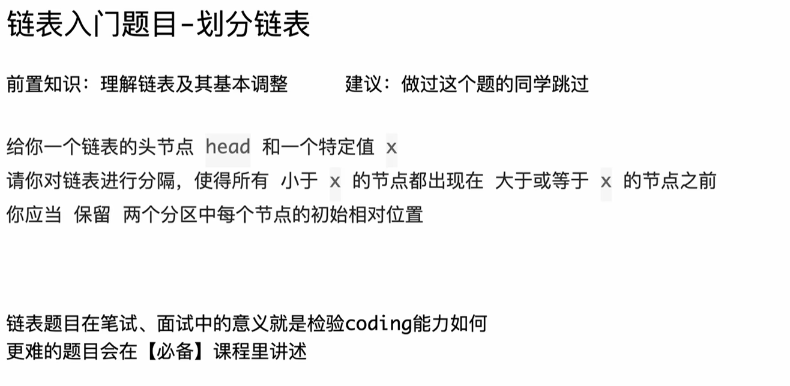

```Java
package class012;

// 给你一个链表的头节点 head 和一个特定值 x
// 请你对链表进行分隔，使得所有 小于 x 的节点都出现在 大于或等于 x 的节点之前。
// 你应当 保留 两个分区中每个节点的初始相对位置
// 测试链接 : https://leetcode.cn/problems/partition-list/
public class PartitionList {

	// 不要提交这个类
	public static class ListNode {
		public int val;
		public ListNode next;

		public ListNode(int val) {
			this.val = val;
		}

		public ListNode(int val, ListNode next) {
			this.val = val;
			this.next = next;
		}
	}

	class Solution {

		public static ListNode partition(ListNode head, int x) {
			ListNode leftHead = null, leftTail = null; // < x的区域
			ListNode rightHead = null, rightTail = null; // >=x的区域
			ListNode next = null;
			while (head != null) {
				next = head.next;
				head.next = null;
				if (head.val < x) {
					if (leftHead == null) {
						leftHead = head;
					} else {
						leftTail.next = head;
					}
					leftTail = head;
				} else {
					if (rightHead == null) {
						rightHead = head;
					} else {
						rightTail.next = head;
					}
					rightTail = head;
				}
				head = next;
			}
			if (leftHead == null) {
				return rightHead;
			}
			// < x的区域有内容！
			leftTail.next = rightHead;
			return leftHead;
		}

	}

}
```

# C++代码

这是一份非常经典的链表“Partition（分隔）”操作代码。它的核心逻辑是维护两个独立的链表（小于区、大于等于区），最后将它们首尾相连。

以下是将这份 Java 代码转换为 C++ 的版本，并附带针对 C++ 特性的详细扩展讲解。

### 1. C++ 代码实现

在 C++ 中，链表节点通常使用 `struct` 定义，且我们需要显式处理指针（Pointer）。

C++

```C++
#include <iostream>

using namespace std;

// 定义链表节点结构体
struct ListNode {
    int val;
    ListNode *next;
    // 构造函数
    ListNode() : val(0), next(nullptr) {}
    ListNode(int x) : val(x), next(nullptr) {}
    ListNode(int x, ListNode *next) : val(x), next(next) {}
};

class Solution {
public:
    ListNode* partition(ListNode* head, int x) {
        // C++ 中使用指针(*)来操作链表节点，初始化为 nullptr
        ListNode* leftHead = nullptr;
        ListNode* leftTail = nullptr; // < x 的区域
        ListNode* rightHead = nullptr;
        ListNode* rightTail = nullptr; // >= x 的区域
        ListNode* next = nullptr;

        while (head != nullptr) {
            next = head->next; // 记录下一个节点
            head->next = nullptr; // 断开当前节点的连接，防止出现环

            if (head->val < x) {
                if (leftHead == nullptr) {
                    leftHead = head;
                } else {
                    leftTail->next = head;
                }
                leftTail = head;
            } else {
                if (rightHead == nullptr) {
                    rightHead = head;
                } else {
                    rightTail->next = head;
                }
                rightTail = head;
            }
            head = next; // 移动到原链表的下一个节点
        }

        // 如果左边区域是空的，直接返回右边区域的头
        if (leftHead == nullptr) {
            return rightHead;
        }

        // 连接两个区域：左区的尾巴 -> 右区的头
        leftTail->next = rightHead;
        
        return leftHead;
    }
};
```

------

### 2. C++ 知识点扩展与对比

针对这份代码，C++ 和 Java 有几个核心的区别，掌握这些对于理解底层原理非常重要（特别是在嵌入式或系统编程中）。

#### A. 指针 (Pointer) vs 引用 (Reference)

- **Java:** `ListNode head` 实际上是一个“引用”。你不需要关心它指向的内存地址，JVM 会帮你管理。
- **C++:** `ListNode* head` 是一个“指针”。
  - 它存储的是内存地址（例如 `0x7ffee4b5`）。
  - **箭头操作符 (`->`):** 在 Java 中访问成员用 `.` (如 `head.val`)。在 C++ 中，如果 `head` 是指针，必须用 `->` (如 `head->val`)。这等价于 `(*head).val`（先解引用找到对象，再访问成员）。

#### B. `nullptr` vs `NULL`

- 代码中我使用了 `nullptr` 而不是 `NULL`。
- 在现代 C++ (C++11 及以后) 中，强烈建议使用 `nullptr`。
  - `NULL` 在 C++ 中通常只是宏定义 `0`，这在函数重载时可能会导致歧义（被误认为是整数）。
  - `nullptr` 是专门的空指针类型，类型安全更高。

#### C. 内存管理 (Memory Management)

这是 Java 转 C++ 最需要注意的地方。

- **Java:** 有垃圾回收机制 (GC)。当 `head` 不再被引用时，内存会自动释放。
- **C++:** 没有 GC。
  - 虽然这个算法题只是**重新排列**现有节点（没有 `new` 创建新节点），所以不需要手动 `delete`。
  - 但如果在工程中你需要删除某个节点，必须手动 `delete node_ptr;`，否则会造成**内存泄漏 (Memory Leak)**。

#### D. Struct vs Class

- **Java:** 通常用 `static class ListNode`。
- **C++:** 通常用 `struct ListNode`。
  - 在 C++ 中，`struct` 和 `class` 唯一的区别是**默认访问权限**。
  - `struct` 默认是 `public`（方便直接访问 `val` 和 `next`），而 `class` 默认是 `private`。这也是为什么 LeetCode 等算法平台定义链表节点时偏爱 `struct`。

#### E. 进阶写法：虚拟头节点 (Dummy Head)

你的原代码中使用了大量的 `if (leftHead == null)` 判断来处理第一次赋值的情况。在 C++（以及 Java）的链表操作中，有一种非常通用的优化技巧叫 **Dummy Head (哨兵节点)**，可以消除这些 `if` 判断，让代码更简洁。

**优化后的 C++ 代码（使用 Stack Memory 的 Dummy Head）：**

C++

```C++
class Solution {
public:
    ListNode* partition(ListNode* head, int x) {
        // 在栈上直接创建两个虚拟头节点（注意不是指针，是对象本身）
        // 这样就不需要 new，也不需要手动 delete，函数结束自动销毁
        ListNode leftDummy(0), rightDummy(0); 
        
        ListNode* leftTail = &leftDummy;  // 指针指向虚拟头
        ListNode* rightTail = &rightDummy; // 指针指向虚拟头
        
        while (head != nullptr) {
            if (head->val < x) {
                leftTail->next = head;
                leftTail = head;
            } else {
                rightTail->next = head;
                rightTail = head;
            }
            head = head->next;
        }
        
        // 这里的顺序很重要
        rightTail->next = nullptr; // 这一步至关重要！切断右链表尾部可能存在的旧连接，防止环
        leftTail->next = rightDummy.next; // 左尾 接 右头
        
        return leftDummy.next;
    }
};
```

**优化点解析：**

1. **代码更短：** 省去了 `if (leftHead == nullptr)` 这种初始化判断。
2. **`&` 取地址符：** `ListNode* leftTail = &leftDummy;` 展示了如何获取栈上对象的地址赋给指针。
3. **防止循环引用：** 这里的 `rightTail->next = nullptr;` 是必须要有的，否则右半部分的最后一个节点可能还连着原链表中的某个节点，形成环。


# 自己写代码

```C++
  ListNode* partition(ListNode* head, int x) {

       
        ListNode* leftHead=nullptr,leftTail=nullptr;
        ListNode* rightHead=nullptr,rightTail=nullptr;


        while(head != null){
            if(head->val <= x){
                if(leftHead == nullptr){

                    leftHead = head;
                    leftTail = head;

                     head = head->next;

                    leftTail->next = nullptr;

                } else {
                    
                    leftTail->next = head;
                    leftTail = head;
                    
                    head = head->next;

                    leftTail->next = nullptr;

                }
            } else {

                if(rightHead == nullptr){

                    rightHead = head;
                    rightTail = head;

                    head = head->next;

                    rightTail->next = nullptr;

                } else {
                    
                    rightTail->next = head;
                    rightTail = head;

                    head = head->next;

                    rightTail->next = nullptr;

                }
            }
        }

        leftTail->next = rightHead;

        return leftHead;

    }
```

# 代码问题修改

## 问题1

你的这段代码逻辑大体上是通用的，能够看出你正在努力从 Java 习惯转换到 C++ 习惯。

但是，这段代码有 **3 个主要问题**，其中一个会导致**编译错误**，另一个会导致程序**崩溃（Segmentation Fault）**，还有一个是**逻辑与题目要求不符**。

以下是详细分析和修改建议：

### 1. 致命错误：空指针引用 (Segmentation Fault)

这是最危险的一个问题。代码最后一行：

C++

```C++
leftTail->next = rightHead;
```

问题分析：

<span style="color:#FF0000; background:#00FF80; border:1px solid #FF00FF;">如果链表中所有的值都大于等于 x（即没有小于 x 的节点），那么 leftTail 从始至终都会保持为 nullptr。</span>

当你尝试执行 nullptr->next 时，程序会直接崩溃（段错误）。

修正方法：

<span style="color:#FF0000; background:#00FF80; border:1px solid #FF00FF;">在连接两部分之前，必须判断左边是不是空的。</span>

C++

```C++
if (leftHead == nullptr) {
    return rightHead; // 如果左边没东西，直接返回右边链表头
}
leftTail->next = rightHead;
```

------

### 2. 语法错误：`null` vs `nullptr`

在 `while` 循环条件中：

C++

```C++
while(head != null) // 错误
```

问题分析：

Java 中使用 null，但在 C++ 中，<span style="color:#FF0000; background:#00FF80; border:1px solid #FF00FF;">关键字是 nullptr（或者老式的 NULL）</span>。<span style="background:#00FF80; border:1px solid #FF00FF;">null 在 C++ 中不是关键字，编译器会报错：'null' was not declared in this scope。</span>

修正方法：

改为 while(head != nullptr)。

------

### 3. 逻辑不符：`<` vs `<=`

<span style="color:#FF0000; background:#00FF80; border:1px solid #FF00FF;">题目要求是：“使得所有 小于 x 的节点都出现在...”</span>

你的代码中写的是：

C++

```
if(head->val <= x)
```

问题分析：

这会将等于 x 的节点也放到左边区域，导致结果与预期不符。

修正方法：

严格按照题目要求，改为 if(head->val < x)。

------

### 4. 代码风格与冗余优化 (Refactoring)

你的代码中，`if` 和 `else` 分支里写了大量重复的逻辑：

- `head = head->next;`
- `tail->next = nullptr;`

这种写法虽然逻辑上勉强“跑得通”（你很聪明地先移动了 `head` 再断开 `next`），但非常脆弱且啰嗦。只要这几行代码顺序稍微一换，链表就会断裂。

更好的写法是提取公共逻辑：

我们<span style="color:#FF0000; background:#00FF80; border:1px solid #FF00FF;">通常会像之前的 Java 范例那样，先保存 next 节点，断开当前节点，然后再处理。这样逻辑更清晰。</span>

### ✅ 修改后的 C++ 代码

我已经帮你修复了上述 Bug，并优化了结构，你可以直接对比：

C++

```C++
class Solution {
public:
    ListNode* partition(ListNode* head, int x) {

        ListNode* leftHead = nullptr;
        ListNode* leftTail = nullptr;
        ListNode* rightHead = nullptr;
        ListNode* rightTail = nullptr;
        
        // 建议：使用一个临时指针保存 next，逻辑更清晰
        ListNode* next = nullptr;

        while (head != nullptr) { // 修正：null -> nullptr
            next = head->next;    // 1. 记录下一个
            head->next = nullptr; // 2. 断开当前节点的连接，保持干净
            
            // 修正：题目要求是 < x，不是 <= x
            if (head->val < x) { 
                if (leftHead == nullptr) {
                    leftHead = head;
                } else {
                    leftTail->next = head;
                }
                leftTail = head;
            } else {
                if (rightHead == nullptr) {
                    rightHead = head;
                } else {
                    rightTail->next = head;
                }
                rightTail = head;
            }
            head = next; // 3. 移动 head
        }

        // 修正：防止 leftTail 为空导致的崩溃
        if (leftHead == nullptr) {
            return rightHead;
        }

        leftTail->next = rightHead;
        
        return leftHead;
    }
};
```

### 总结需要注意的点：

1. **C++ 关键字：** 记得用 `nullptr`。
2. **鲁棒性：** 只要用到了 `ptr->next`，永远要先问自己：“`ptr` 有可能是空吗？”
3. **题目边界：** 仔细看是“小于”还是“小于等于”。


## 问题2（*绑定在变量名上）

这是一处非常经典且隐蔽的 **C++ 语法陷阱**，也是从 Java 转 C++ 时最容易踩的坑之一。

### 错误原因

根本原因在于你声明变量的方式：

C++

```
ListNode* leftHead=nullptr, leftTail=nullptr;
```

<span style="color:#FF0000; background:#00FF80; border:1px solid #FF00FF;">在 C++ 中，`*`（指针符号）是**绑定在变量名上**的，而不是绑定在类型上的（虽然写的时候通常连着类型写）。</span>

当你写 `ListNode* a, b;` 时，编译器是这样理解的：

1. **`a` 是 `ListNode*`**（一个指针）。
2. **`b` 是 `ListNode`**（一个具体的**对象**，而不是指针）。

所以，你的代码实际上等同于：

C++

```
ListNode* leftHead = nullptr; // 正确：指针可以赋值为 nullptr
ListNode leftTail = nullptr;  // 错误！！对象不能赋值为 nullptr
```

编译器报错说“无法将 `nullptr` 转换为 `ListNode` 类型”，就是因为它认为 `leftTail` 是一个对象，而你试图把空指针赋给一个实体对象。

------

### 如何修改

有两种修改方式，建议使用 **第一种**，更清晰，不易出错。

#### 方法 1：分行声明（推荐 ✅）

这是最清晰的写法，每个变量一行，避免歧义。

C++

```
ListNode* leftHead = nullptr;
ListNode* leftTail = nullptr;
ListNode* rightHead = nullptr;
ListNode* rightTail = nullptr;
```

#### 方法 2：每个变量前都加 `*`

<span style="color:#FF0000; background:#00FF80; border:1px solid #FF00FF;">如果你非要写在一行，必须给每个变量都加上 `*`。</span>

C++

```
// 注意 leftTail 前面也有个 *
ListNode *leftHead = nullptr, *leftTail = nullptr;
```

### 知识点对比：Java vs C++

- **Java:** `ListNode a, b;` —— `a` 和 `b` 都是引用（Reference），本质上类似指针。
- **C++:** `ListNode* a, b;` —— `a` 是指针，`b` 是对象（Value）。

这也是为什么在 C++ 风格指南中，很多开发者喜欢把 `*` 紧挨着变量名写（`ListNode *a`），而不是挨着类型写（`ListNode* a`），就是为了提醒自己这个 `*` 只属于 `a`。
