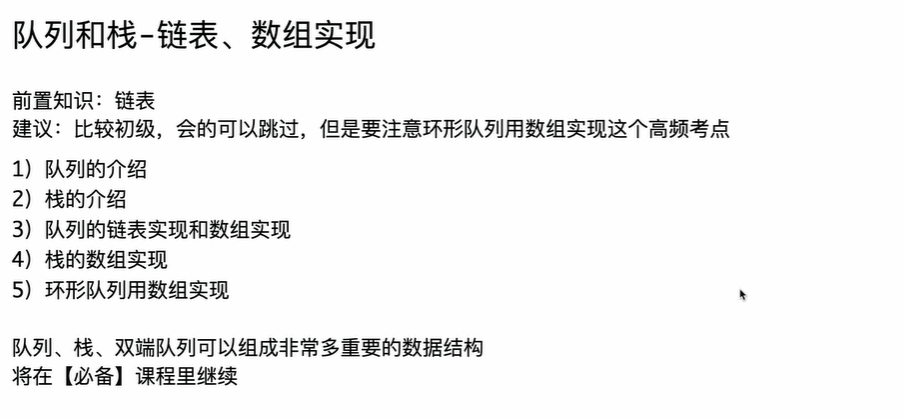
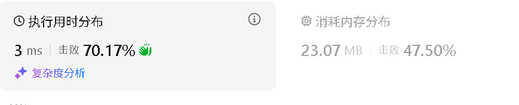

```java
package class013;

import java.util.Queue;
import java.util.LinkedList;
import java.util.Stack;

public class QueueStackAndCircularQueue {

	// 直接用java内部的实现
	// 其实内部就是双向链表，常数操作慢
	public static class Queue1 {

		// java中的双向链表LinkedList
		// 单向链表就足够了
		public Queue<Integer> queue = new LinkedList<>();

		// 调用任何方法之前，先调用这个方法来判断队列内是否有东西
		public boolean isEmpty() {
			return queue.isEmpty();
		}

		// 向队列中加入num，加到尾巴
		public void offer(int num) {
			queue.offer(num);
		}

		// 从队列拿，从头拿
		public int poll() {
			return queue.poll();
		}

		// 返回队列头的元素但是不弹出
		public int peek() {
			return queue.peek();
		}

		// 返回目前队列里有几个数
		public int size() {
			return queue.size();
		}

	}

	// 实际刷题时更常见的写法，常数时间好
	// 如果可以确定加入操作的总次数不超过n，那么可以用
	// 一般笔试、面试都会有一个明确数据量，所以这是最常用的方式
	public static class Queue2 {

		public int[] queue;
		public int l;
		public int r;

		// 加入操作的总次数上限是多少，一定要明确
		public Queue2(int n) {
			queue = new int[n];
			l = 0;
			r = 0;
		}

		// 调用任何方法之前，先调用这个方法来判断队列内是否有东西
		public boolean isEmpty() {
			return l == r;
		}

		public void offer(int num) {
			queue[r++] = num;
		}

		public int poll() {
			return queue[l++];
		}
		// ?
		// l...r-1 r
		// [l..r)
		public int head() {
			return queue[l];
		}

		public int tail() {
			return queue[r - 1];
		}

		public int size() {
			return r - l;
		}

	}

	// 直接用java内部的实现
	// 其实就是动态数组，不过常数时间并不好
	public static class Stack1 {

		public Stack<Integer> stack = new Stack<>();

		// 调用任何方法之前，先调用这个方法来判断栈内是否有东西
		public boolean isEmpty() {
			return stack.isEmpty();
		}

		public void push(int num) {
			stack.push(num);
		}

		public int pop() {
			return stack.pop();
		}

		public int peek() {
			return stack.peek();
		}

		public int size() {
			return stack.size();
		}

	}

	// 实际刷题时更常见的写法，常数时间好
	// 如果可以保证同时在栈里的元素个数不会超过n，那么可以用
	// 也就是发生弹出操作之后，空间可以复用
	// 一般笔试、面试都会有一个明确数据量，所以这是最常用的方式
	public static class Stack2 {

		public int[] stack;
		public int size;

		// 同时在栈里的元素个数不会超过n
		public Stack2(int n) {
			stack = new int[n];
			size = 0;
		}

		// 调用任何方法之前，先调用这个方法来判断栈内是否有东西
		public boolean isEmpty() {
			return size == 0;
		}

		public void push(int num) {
			stack[size++] = num;
		}

		public int pop() {
			return stack[--size];
		}

		public int peek() {
			return stack[size - 1];
		}

		public int size() {
			return size;
		}

	}

	// 设计循环队列
	// 测试链接 : https://leetcode.cn/problems/design-circular-queue/
	class MyCircularQueue {

		public int[] queue;

		public int l, r, size, limit;

		// 同时在队列里的数字个数，不要超过k
		public MyCircularQueue(int k) {
			queue = new int[k];
			l = r = size = 0;
			limit = k;
		}

		// 如果队列满了，什么也不做，返回false
		// 如果队列没满，加入value，返回true
		public boolean enQueue(int value) {
			if (isFull()) {
				return false;
			} else {
				queue[r] = value;
				// r++, 结束了，跳回0
				r = r == limit - 1 ? 0 : (r + 1);
				size++;
				return true;
			}
		}

		// 如果队列空了，什么也不做，返回false
		// 如果队列没空，弹出头部的数字，返回true
		public boolean deQueue() {
			if (isEmpty()) {
				return false;
			} else {
				// l++, 结束了，跳回0
				l = l == limit - 1 ? 0 : (l + 1);
				size--;
				return true;
			}
		}

		// 返回队列头部的数字（不弹出），如果没有数返回-1
		public int Front() {
			if (isEmpty()) {
				return -1;
			} else {
				return queue[l];
			}
		}

		public int Rear() {
			if (isEmpty()) {
				return -1;
			} else {
				int last = r == 0 ? (limit - 1) : (r - 1);
				return queue[last];
			}
		}

		public boolean isEmpty() {
			return size == 0;
		}

		public boolean isFull() {
			return size == limit;
		}

	}

}
```

# C++实现

这是将你的Java代码转换为C++的版本。

在C++中，我们通常使用 **STL (Standard Template Library)** 中的 `<queue>` 和 `<stack>` 来实现类似 Java `LinkedList` 和 `Stack` 的功能。对于“数组模拟”的高性能版本，逻辑与Java基本一致，但通常会使用 `std::vector` 来管理动态数组的内存，或者在笔试中直接使用静态数组。

### C++ 代码实现

C++

```C++
#include <iostream>
#include <queue>
#include <stack>
#include <vector>

using namespace std;

// ==========================================
// 1. 使用 C++ STL 内部实现 (对应 Java Queue1)
// ==========================================
class Queue1 {
public:
    // C++中 queue 默认底层容器是 deque (双端队列)，也可以指定 list
    std::queue<int> q;

    bool isEmpty() {
        return q.empty();
    }

    // 加入元素
    void offer(int num) {
        q.push(num);
    }

    // 弹出元素并返回
    // 【注意】C++ standard queue 的 pop() 返回 void，不返回元素
    // 所以必须先 front() 取值，再 pop() 移除
    int poll() {
        int val = q.front();
        q.pop();
        return val;
    }

    // 返回队头但不弹出
    int peek() {
        return q.front();
    }

    int size() {
        return q.size();
    }
};

// ==========================================
// 2. 数组模拟队列 (对应 Java Queue2)
// 常数时间极快，笔试/算法竞赛常用
// ==========================================
class Queue2 {
public:
    std::vector<int> queue;
    int l;
    int r;

    // n 代表操作的总次数上限/数据量上限
    Queue2(int n) {
        queue.resize(n);
        l = 0;
        r = 0;
    }

    bool isEmpty() {
        return l == r;
    }

    void offer(int num) {
        queue[r++] = num;
    }

    int poll() {
        return queue[l++];
    }

    // 获取队头 [l ... r)
    int head() {
        return queue[l];
    }

    // 获取队尾
    int tail() {
        return queue[r - 1];
    }

    int size() {
        return r - l;
    }
};

// ==========================================
// 3. 使用 C++ STL 内部实现 (对应 Java Stack1)
// ==========================================
class Stack1 {
public:
    // C++ stack 默认底层容器是 deque
    std::stack<int> s;

    bool isEmpty() {
        return s.empty();
    }

    void push(int num) {
        s.push(num);
    }

    // 【注意】C++ stack 的 pop() 也是返回 void
    int pop() {
        int val = s.top();
        s.pop();
        return val;
    }

    int peek() {
        return s.top();
    }

    int size() {
        return s.size();
    }
};

// ==========================================
// 4. 数组模拟栈 (对应 Java Stack2)
// 常数时间极快
// ==========================================
class Stack2 {
public:
    std::vector<int> stack;
    int sizeVal; // 避免与方法名 size() 冲突，改名为 sizeVal

    Stack2(int n) {
        stack.resize(n);
        sizeVal = 0;
    }

    bool isEmpty() {
        return sizeVal == 0;
    }

    void push(int num) {
        stack[sizeVal++] = num;
    }

    int pop() {
        return stack[--sizeVal];
    }

    int peek() {
        return stack[sizeVal - 1];
    }

    int size() {
        return sizeVal;
    }
};

// ==========================================
// 5. 设计循环队列 (对应 MyCircularQueue)
// LeetCode: Design Circular Queue
// ==========================================
class MyCircularQueue {
public:
    std::vector<int> queue;
    int l, r, size, limit;

    MyCircularQueue(int k) {
        queue.resize(k);
        l = r = size = 0;
        limit = k;
    }

    bool enQueue(int value) {
        if (isFull()) {
            return false;
        } else {
            queue[r] = value;
            // r 移动逻辑：如果到末尾了跳回0，否则+1
            r = (r == limit - 1) ? 0 : (r + 1);
            size++;
            return true;
        }
    }

    bool deQueue() {
        if (isEmpty()) {
            return false;
        } else {
            // l 移动逻辑
            l = (l == limit - 1) ? 0 : (l + 1);
            size--;
            return true;
        }
    }

    int Front() {
        if (isEmpty()) {
            return -1;
        } else {
            return queue[l];
        }
    }

    int Rear() {
        if (isEmpty()) {
            return -1;
        } else {
            // 如果 r是0，说明队尾在 limit-1，否则在 r-1
            int last = (r == 0) ? (limit - 1) : (r - 1);
            return queue[last];
        }
    }

    bool isEmpty() {
        return size == 0;
    }

    bool isFull() {
        return size == limit;
    }
};

int main() {
    // 简单的测试代码，确保能跑通
    std::cout << "--- Testing Queue2 ---" << std::endl;
    Queue2 q2(10);
    q2.offer(1);
    q2.offer(2);
    std::cout << "Polled: " << q2.poll() << std::endl; // 1
    std::cout << "Head: " << q2.head() << std::endl;   // 2

    std::cout << "--- Testing Circular Queue ---" << std::endl;
    MyCircularQueue cq(3);
    cq.enQueue(1);
    cq.enQueue(2);
    cq.enQueue(3);
    std::cout << "EnQueue 4 (Full?): " << (cq.enQueue(4) ? "True" : "False") << std::endl;
    std::cout << "Rear: " << cq.Rear() << std::endl;
    
    return 0;
}
```

------

### C++ 知识扩展与补充

针对这份代码，从Java转到C++有几个核心概念和差异需要掌握，特别是如果你是在准备面试或算法竞赛。

#### 1. API 设计的核心差异：`pop()` 不返回值

<span style="color:#FF0000; background:#00FF80; border:1px solid #FF00FF;">在 Java 中，stack.pop() 和 queue.poll() 会移除元素 并 返回该元素。</span>

但在 C++ STL 中，这是一个非常著名的设计差异：

- **`pop()`**: 仅移除元素，返回 `void`。
- **`top()` / `front()`**: 仅查看元素，不移除。（<span style="color:#FF0000; background:#00FF80; border:1px solid #FF00FF;">补充：top()是针对栈stack的操作，front()是针对队列的操作</span>）

**为什么？** 为了**异常安全 (Exception Safety)**。如果 `pop()` 同时返回元素，在值拷贝返回的过程中如果发生异常（比如内存不足），元素就已经从栈中移除了，导致数据丢失。分开操作可以保证如果读取失败，数据依然在容器中。

#### 2. 容器适配器 (Container Adapters)

你可能注意到了我在代码注释中写了“底层容器”。

- C++ 的 `std::stack` 和 `std::queue` 并不是真正的“容器”，而是**容器适配器**。
- 它们默认封装了 `std::deque`（双端队列），因为 `deque` 在内存分配上比 `vector` 更适合头尾操作（`vector` 头部删除开销大，`deque` 是分段连续内存）。
- Java 的 `Stack` 是一个类（继承自 Vector，虽已过时但仍被使用）<span style="color:#FF0000; background:#00FF80; border:1px solid #FF00FF;">，`Queue` 是一个接口（通常用 `LinkedList` 实现）。</span>

#### 3. 内存管理：`vector` vs `new int[]`

在 `Queue2` 和 `Stack2` 中，我使用了 `std::vector<int>` 并调用 `resize(n)`。

- **Java**: `new int[n]` 分配在堆上，有 GC 回收。
- **C++ 原生数组**: `int* arr = new int[n]` 分配在堆上，必须手动 `delete[] arr`，否则内存泄漏。
- **C++ Vector**: `std::vector` 是 C++ 中最常用的动态数组。它遵循 **RAII** (资源获取即初始化) 原则。<span style="color:#FF0000; background:#00FF80; border:1px solid #FF00FF;">当 `Queue2` 对象销毁时，`vector` 会自动释放内存。这是 C++ 优于 C 的地方，也是写 C++ 代码的标准方式。</span>

#### 4. 算法竞赛中的“静态数组”优化

虽然我在代码中写了类 (`class`) 结构，但在真正的 C++ 算法竞赛（如 ACM/ICPC, LeetCode）中，为了追求极致的常数时间和编写速度，通常不写 `class`，也不用 `new`，而是直接定义**全局静态数组**：

C++

```
// 竞赛常见写法 (C++ Style)
const int N = 100005;
int q[N];
int l = 0, r = 0;

void offer(int v) { q[r++] = v; }
int poll() { return q[l++]; }
```

**原因**：

1. **栈溢出风险**：如果在函数内部定义大数组 `int q[100000]`，可能会爆栈（Stack Overflow）。全局变量存在静态存储区（BSS/Data段），空间很大。
2. **速度**：静态数组没有构造函数开销，没有动态内存分配开销，速度最快。

#### 5. 引用传参 (Pass by Reference)

在 C++ 中，如果你要传递一个包含大量数据的结构体或对象（比如把 MyCircularQueue 传给一个函数），默认是值拷贝（复制整个对象）。

Java 默认是传引用（引用的值）。

在 C++ 中，为了效率，我们通常显式使用引用：

C++

```C++
// 慢，会发生拷贝
void process(MyCircularQueue q) { ... } 

// 快，无拷贝，类似 Java 的行为
void process(MyCircularQueue &q) { ... } 

// 快且安全（只读）
void process(const MyCircularQueue &q) { ... } 
```


# 补充提问（C++中容器（vector与deque）、stack、queue）

## 提问1

<span style="color:#FF0000; background:#00FF80; border:1px solid #FF00FF; font-size:1.2em;">C++中的队列 queue<int >和 栈 stack<int> 也是栈上的一个对象吗，其内存布局又是什么样的呢，其内部存储的数据是分配在堆上的吗，我不是太懂，你能够给我详细解释下吗。</span>

这是一个非常深刻且触及 C++ 核心内存模型的问题！

对于从 Java 转过来的同学，理解这个概念是“打通任督二脉”的关键。简单直接的答案是：

1. **对象本身（壳）**：如果你是在函数内部声明的 `std::stack<int> s;`，那么这个 `s` 对象本身（也就是它的管理结构）是分配在 **栈（Stack）** 上的。
2. **内部数据（肉）**：栈或队列内部真正存储的那堆 `int` 数据，是动态分配在 **堆（Heap）** 上的。

为了让你彻底明白，我们需要深入到内存布局来看。

------

### 1. 核心概念：“壳”与“肉”的分离

在 Java 中，`Stack s = new Stack();`，这里的 `s` 只是一个引用（指针），真正的对象和数据全都在堆上。

在 C++ 中，STL 容器（如 `stack`, `queue`, `vector`）采用了 **RAII（资源获取即初始化）** 的设计模式。它们通常由两部分组成：

- 栈上的控制块（Control Block）：

  这是<span style="color:#FF0000; background:#00FF80; border:1px solid #FF00FF;">对象本身</span>。它非常小，<span style="color:#FF0000; background:#00FF80; border:1px solid #FF00FF;">通常只包含几个指针和几个整数（比如：指向堆内存起点的指针、指向终点的指针、当前元素个数 size）</span>。它的大小是固定的，不管里面装了1个还是100万个数据，sizeof(s) 都是一样的。

- 堆上的数据区（Data Block）：

  这是真正存放你的 int 数据的地方。当元素增加时，容器会自动在堆上申请更大的空间。

### 2. 图解内存布局

假设你在 `main` 函数里写了这样一行代码：

C++

```C++
void func() {
    // s 是一个局部变量
    std::stack<int> s; 
    s.push(10);
    s.push(20);
    s.push(30);
}
```

它的内存布局大概是这样的：

Plaintext

```
      【 栈内存 (Stack Frame) 】                【 堆内存 (Heap) 】
   (也就是 func 函数的栈帧范围)              (动态分配，空间巨大)

  +---------------------------+            +-------------------------+
  | 变量 s (std::stack 对象)   |            |                         |
  |                           |            |  [ 真正的数据存储区 ]     |
  | [ pointer start  ]  ------+--------->  |  [  10  ]                |
  | [ pointer end    ]  ------+---.        |  [  20  ]                |
  | [ int size = 3   ]        |   |        |  [  30  ]                |
  | ...其它管理成员...         |   |        |                         |
  +---------------------------+   |        +-------------------------+
                                  |
                                  `-------> (指引着数据的结束位置)
```

**详细解释：**

1. **变量 `s` 在哪？**
   - 因为 `s` 是函数内的局部变量，所以 `s` 这个“结构体”本身分配在**栈**上。
   - 如果你用 `sizeof(s)` 查看，你会发现它可能只有 40 或 80 字节（取决于编译器和底层容器 `deque` 的实现），这个大小是**永远不变**的。
2. **数字 `10, 20, 30` 在哪？**
   - 它们被分配在**堆**上。
   - `std::stack` 的默认底层容器是 `std::deque`（双端队列）。`deque` 会在堆上申请一系列的内存块（Buffer）来存放数据。
   - `s` 内部持有的指针指向这些堆内存地址。
3. **生命周期管理**
   - <span style="color:#FF0000; background:#00FF80; border:1px solid #FF00FF;">当 `func()` 函数执行结束，**栈**上的变量 `s` 会被自动销毁（出栈）。</span>
   - **关键点**：<span style="color:#FF0000; background:#00FF80; border:1px solid #FF00FF;">C++ 的析构函数（Destructor）此时会被调用。`s` 的析构函数会顺着指针找到**堆**上的那些数据，把它们 `delete` 掉（释放堆内存）。这就是 C++ 不用手动 GC 的原因。</span>

------

### 3. 特殊情况：如果用 `new` 呢？

如果你写成类似 Java 的风格：

C++

```C++
void func() {
    // ptr 是一个指针，指向一个 stack 对象
    std::stack<int>* ptr = new std::stack<int>();
    
    ptr->push(10);
}
```

这时候内存布局就变了：

1. **指针 `ptr`**：在 **栈** 上（因为它是个局部变量，存的是一个地址）。
2. **对象 `*ptr`**：在 **堆** 上（因为你显式调用了 `new`）。
3. **内部数据 `10`**：在 **堆** 的更深处（由对象内部再次申请）。

**这种写法在 C++ 中通常是不推荐的**（除非有特殊需求），<span style="color:#FF0000;">因为你不仅要管理数据的内存，还要手动 `delete ptr` 来释放对象本身的内存。</span>

------

### 4. 默认底层容器 `deque` 的布局细节

你提到 `stack` 和 `queue`。在 C++ STL 标准中，它们默认是基于 `std::deque` 实现的。`deque` 的内存布局比 `vector` 更复杂一点，它不是一块连续的内存，而是 **“分段连续”**。

- **Map (中控器)**: 一个指针数组，管理这堆碎片。
- **Buffer (缓冲区)**: 实际存数据的一块块固定大小的内存。

所以 `std::stack<int> s` 在栈上的那个“壳”，内部其实维护了一个指向“中控器（Map）”的指针，而中控器再指向具体的“缓冲区”。但归根结底：**所有数据都在堆上**。

### 5. 总结 Java vs C++

为了帮你记忆，可以对比这张表：

| **特性**            | **Java (Stack s = new Stack())** | **C++ (stack s;)**               |
| ------------------- | -------------------------------- | -------------------------------- |
| **变量 `s` 是什么** | 一个引用 (Reference)，类似指针   | 一个完整的对象 (Object Instance) |
| **变量 `s` 在哪**   | 栈上 (存的是堆地址)              | 栈上 (存的是控制结构)            |
| **对象本体在哪**    | 堆上 (Heap)                      | 栈上 (Stack)                     |
| **数据元素在哪**    | 堆上 (Heap)                      | 堆上 (Heap)                      |
| **何时释放**        | 垃圾回收器 (GC) 决定             | 离开作用域 (Scope) 时自动释放    |

一句话回答你的问题：

std::queue 和 std::stack 这两个对象本身（如果你定义为局部变量）是在栈上的，但它们肚子里管理的所有数据都是在堆上动态分配的。


## 提问2（stack和queue存放的是控制结构）

<span style="color:#FF0000; background:#00FF80; border:1px solid #FF00FF; font-size:1.2em;">这里stack和queue存放的是控制结构该如何理解，我不是太懂，你能够给我详细解释下吗？</span>

这是一个非常棒的问题！“控制结构”这个词听起来很抽象，其实把它拆解开来，非常简单直观。

简单来说，所谓的“控制结构”（Control Structure）或者“壳”，本质上就是**几个成员变量**（Member Variables）。

对于计算机来说，要管理堆上那一大坨数据，它至少需要知道三件事：

1. **数据在哪？**（起始地址）
2. **存了多少了？**（当前大小）
3. **还能存多少？**（总容量）

<span style="color:#FF0000; background:#00FF80; border:1px solid #FF00FF;">这几个变量组合在一起，就是“控制结构”。</span>

为了让你看得见、摸得着，我们来动手写一个**最简化版**的 `Stack` 类，看看它的内部长什么样。

### 1. 拆解“控制结构”的真面目

<span style="background:#00FF80; color:#FF0000; border:1px solid #FF00FF;">假设 C++ 的 `std::stack` 是用动态数组（vector）实现的（实际是 deque，但原理通用且 vector 更易懂）。</span>

它的内部代码大概长这样：

C++

```C++
// 这就是那个“控制结构” / “壳”
class MyStack {
    // 成员变量 1：指针，指向堆上数据的起始位置
    int* data_start; 
    
    // 成员变量 2：整数，记录当前存了几个数
    int current_size; 
    
    // 成员变量 3：整数，记录堆上那块内存的总容量
    int capacity;     

public:
    // ... 各种 push, pop 方法 ...
};
```

当你写下 `MyStack s;` 时，**栈（Stack）内存**上分配的就是上面这三个变量：

1. `data_start` (在 64 位系统上是 8 字节)
2. `current_size` (4 字节)
3. `capacity` (4 字节)

加起来一共约 16~24 字节（取决于内存对齐）。<span style="color:#FF0000; background:#00FF80; border:1px solid #FF00FF;">**这就是所谓的“控制结构”。**</span>

### 2. 图解：控制结构 vs 实际数据

让我们把这个结构画出来，假设你 push 了三个数 `10, 20, 30`。

Plaintext

```
【 栈内存 (Stack Frame) 】                 【 堆内存 (Heap) 】
-------------------------                 --------------------
变量 s (控制结构/壳):                      
地址: 0x7ffd...                           地址: 0x560a... (data_start 指向这里)

+-----------------------+                 +---------------------------+
| data_start = 0x560a...| --------------> |  [ 10 ]  (index 0)        |
|                       |                 |  [ 20 ]  (index 1)        |
| current_size = 3      |                 |  [ 30 ]  (index 2)        |
|                       |                 |  [ ?? ]  (空闲内存)        |
| capacity     = 10     |                 |  [ ?? ]  (空闲内存)        |
+-----------------------+                 +---------------------------+
      ↑                                         ↑
 只占用极小的固定空间                         占用较大的动态空间
 就像是“遥控器”                             就像是“电视机”
```

### 3. 为什么要叫“控制”结构？

之所以叫它“控制结构”，是因为这几个小小的变量**掌控**了对面那一大块内存的生杀大权：

1. 寻址（Addressing）：

   <span style="color:#FF0000; background:#00FF80; border:1px solid #FF00FF;">当你调用 s.top() 时，程序会读取 data_start 指针，加上 current_size - 1 的偏移量，直接定位到堆上的数据。没有这个指针，堆上的数据就是孤魂野鬼，找不到了。</span>

2. 扩容（Management）：

   当你调用 s.push(40) 时，程序会检查 current_size 是否等于 capacity。

   - 如果满了，它负责去堆上申请一块更大的新地皮，把数据搬过去，然后更新 `data_start` 指针指向新地址。
   - **这一切复杂的调度，都是由这几个小变量决定的。**

3. 生命周期（Lifecycle）：

   当你执行 delete ptr（或者是局部变量销毁）时，析构函数被触发。析构函数会拿起 data_start 这个指针，告诉操作系统：“喂，把这块地址开始的内存回收掉。”

### 4. 类比理解

为了让你彻底明白，我们可以用**“仓库管理员”**来类比。

- **User (你)**：通过 `MyStack s` 操作。
- **控制结构 (栈上的 `s`)**：这是**管理员手中的那本账册**。
  - 账册上写着：仓库地址在城东（`data_start`）。
  - 账册上写着：现在放了3个集装箱（`current_size`）。
  - 账册上写着：这个仓库最多能放10个（`capacity`）。
  - **账册本身很薄，放在管理员的口袋里（栈内存）。**
- **实际数据 (堆上的数据)**：这是**真正的仓库和里面的货物**。
  - 仓库很大，建在空地上（堆内存）。

你之前的那个问题（delete ptr）：

当你 delete ptr 时，相当于你要把“管理员手中的账册”烧了。但在烧账册之前，负责任的管理员（析构函数）会根据账册上的地址，先去把“城东的那个仓库”给拆了、货物清空，然后再把账册烧掉。

### 总结

所谓 “stack/queue 存放在栈上的对象”，指的就是这几个指针和整数。

它们体积很小，但是它们记录了堆上大数据的去向和状态。


## 提问3（deque 与 vector）

<span style="font-weight:bold; color:#FF0000; background:#00FF80; border:1px solid #FF00FF; font-size:1.1em;">这个deque我有点看不太懂，你能够给我详细解释下吗，它和vector在内存布局上有什么区别吗，从内存分配角度给我对比解释下。</span>

这是一个非常关键的进阶问题！`std::deque`（双端队列）的设计确实比 `std::vector` 复杂得多，它是<span style="color:#FF0000; background:#00FF80; border:1px solid #FF00FF;"> C++ STL 中设计最精妙的容器之一。</span>

要理解它们在内存布局上的区别，你可以用**“整租房”**和**“分租房”**来打比方。

------

### 1. 核心区别一句话总结

- **`std::vector` (单端动态数组)**：是一块**连续**的内存空间。
  - *比喻*：像一条无限延长的**长条桌子**。
- **`std::deque` (双端队列)**：是多块**分段**的内存空间，通过一个中控器连起来。
  - *比喻*：像一列**火车**，由一节节**车厢**连起来。

------

### 2. 内存布局详细对比

#### A. Vector 的布局：一镜到底

Vector 的内存布局非常简单粗暴。它在堆上只有**一大块**连续的内存。

Plaintext

```asciiarmor
std::vector<int> v = {1, 2, 3, 4, 5, 6};

[ start ] -----------------------------------------> [ end ]
   |
   V
  +---+---+---+---+---+---+---+---+------------------+
  | 1 | 2 | 3 | 4 | 5 | 6 | . | . |    (预留空间)      |
  +---+---+---+---+---+---+---+---+------------------+
  
  特点：
  1. 物理地址绝对连续（v[1]的地址紧挨着v[0]）。
  2. 只有尾部有预留空间，头部没有。
```

#### B. Deque 的布局：分段管理 (Map + Buffer)

Deque 的内部结构要复杂得多。它由两部分组成：

1. **中控器 (Map)**：这其实是一个<span style="color:#FF0000; background:#00FF80; border:1px solid #FF00FF;">指针数组（小数组），用来存目录</span>。
2. **缓冲区 (Buffer/Block)**：这是<span style="color:#FF0000; background:#00FF80; border:1px solid #FF00FF;">一块块固定大小的数组（比如一块存512字节），用来真正存数据</span>。

Plaintext

```
std::deque<int> d; // 存了大量数据

      【 中控器 (Map) 】
      (这是一个指针数组)
      +-----+
      | ptr | -----------------> [ Buffer 1: ...数据... ]
      +-----+
      | ptr | -----------------> [ Buffer 2: ...数据... ]
      +-----+
      | ptr | -----------------> [ Buffer 3: ...数据... ]
      +-----+
         .
         .
```

<span style="color:#FF0000; background:#00FF80; border:1px solid #FF00FF;">Deque 的“连续”是假象：</span>

<span style="color:#FF0000; border:1px solid #FF00FF;">当你访问 d[i] 时，Deque 内部其实做了两次计算：</span>

1. 通过 `i / 块大小` 算出数据在第几个 Buffer 里。

2. 通过 i % 块大小 算出数据在那个 Buffer 的第几个位置。

   这就假装成了一个连续的数组，但实际上物理内存是断开的。

------

### 3. 内存分配（扩容）角度的深刻对比

这是两者性能差异的根本来源。假设现在内存已经装满了，我们需要再 `push_back` 一个数，会发生什么？

#### A. Vector 的扩容：搬家式 (代价巨大)

因为 Vector 要求**物理连续**，如果当前这块地皮用完了，它不能简单地在后面加（因为后面的内存可能被别人占用了）。

**Vector 的扩容步骤：**

1. **找新房**：在堆上重新申请一块**更大**（通常是2倍）的全新内存块。
2. **搬家**：把旧内存里的所有数据，一个一个**复制/移动**到新内存里。
3. **拆旧房**：释放旧的那块内存。

> **代价**：这是一次 $O(N)$ 的操作。如果你的 vector 有100万个数据，扩容时就要搬运100万次，非常慢，而且会造成内存波动。

#### B. Deque 的扩容：挂车厢式 (代价极小)

Deque 因为是分段的，它不需要物理连续。

**Deque 的扩容步骤：**

1. **申请车厢**：在堆上申请一个新的、固定大小的 Buffer（比如只存64个int）。
2. **挂载**：把这个新 Buffer 的地址记录到“中控器 (Map)”的末尾。
3. **结束**：旧数据**完全不动**！不需要搬家！

> **代价**：这是一次 $O(1)$ 的操作。无论你里面存了多少数据，加一个新 Buffer 只是申请一小块内存并挂上去而已。

特例：如果“中控器 (Map)”那个指针数组满了怎么办？

Deque 会重新申请一块更大的 Map。但是！这只是搬运指针（地址），而不是搬运那一大堆实际的数据。搬运指针非常快。

------

### 4. 为什么 `std::stack` 和 `std::queue` 默认选 Deque？

回到你最初的问题，<span style="color:#FF0000; background:#00FF80; border:1px solid #FF00FF;">为什么 C++ 的栈和队列默认底层是 `deque` 而不是 `vector`？</span>

通过上面的内存布局，你应该能看懂原因了：

1. 扩容开销稳定：

   <span style="color:#FF0000; background:#00FF80; border:1px solid #FF00FF;">栈和队列会频繁地加入元素。</span>

   - 如果用 `vector`，每隔一段时间就会触发一次剧烈的“搬家式”扩容，导致程序突然卡顿一下。
   - 如果用 `deque`，每次只加一小节车厢，性能非常平滑、稳定。

2. **内存利用率**：

   - `vector` 需要一大块完整的内存。如果你想存1GB的数据，内存里必须刚好有一个连续的1GB空洞，否则分配失败。
   - `deque` 化整为零，只要内存碎片加起来够用就行。

3. <span style="color:#FF0000; background:#00FF80; border:1px solid #FF00FF;">**双端操作**：</span>

   - `vector` 在**头部**插入数据是灾难级的（$O(N)$），因为所有数据都要往后挪。
   - `deque` 在**头部**插入数据极其简单：申请个新 Buffer，挂在 Map 的前面即可 ($O(1)$)。

### 5. 总结对比表

| **特性**            | **std::vector**                    | **std::deque**                        |
| ------------------- | ---------------------------------- | ------------------------------------- |
| **内存连续性**      | **物理连续**                       | **逻辑连续，物理分段** (像火车)       |
| **随机访问 (v[i])** | **极快** (指针直接加法)            | **稍慢** (两次计算，跨段跳转)         |
| **扩容方式**        | **整体搬迁** (2倍扩容，拷贝旧数据) | **增加一段** (只申请新块，不拷旧数据) |
| **CPU 缓存友好度**  | **最高** (预取命中率高)            | **一般** (跨段时会 Cache Miss)        |
| **头部插入/删除**   | **很慢** (搬移所有数据)            | **极快** (操作头部 Buffer)            |
| **适用场景**        | 需要频繁读写、排序、数据量相对固定 | 需要两端操作、数据量动态增长极大      |

所以，**Deque 是一个折中方案**：它牺牲了一丢丢访问速度（比 Vector 慢一点点），换来了极高效的动态扩容能力和头尾操作能力。这就是为什么它是 `stack` 和 `queue` 的幕后功臣。


## 提问4（重点：deque内存布局深入理解）

<span style="color:#FF0000; border:1px solid #FF00FF;">当你访问 d[i] 时，Deque 内部其实做了两次计算：</span>

1. 通过 `i / 块大小` 算出数据在第几个 Buffer 里。

2. 通过 i % 块大小 算出数据在那个 Buffer 的第几个位置。

   这就假装成了一个连续的数组，但实际上物理内存是断开的。

<span style="color:#FF0000; background:#00FF80; border:1px solid #FF00FF; font-size:1.2em;">这里我不是太懂，还有deque<int>我可以这样理解吗，就是在函数内部有个定义 deque<int> p，此时这个双端队列对象p是分配在栈上的，对象p指向的堆上面的那一段存储空间本质上就是一个int*类型的数组，每个数组元素指向了一个堆上的int型空间，只不过这些int型空间是离散分配在堆上的，不是连续的，我的理解对吗。</span>

你的理解非常接近真相了，但是有一个**关键的细节**理解偏了。这个细节决定了 `deque` 为什么比链表快，以及为什么它需要做除法和取模运算。

简单来说：你的理解中，Map（那个指针数组）的每一项指向的是**单个 `int`**，但实际上，每一项指向的是**一整块 `int` 数组（Buffer）**。

为了帮你修正这个模型，我将分两步来解释。

### 1. 修正你的模型：从“散点”到“块”

**你的理解（不完全正确）**：

> Map 的每个指针 -> 指向堆上的一个 `int`。

<span style="color:#FF0000; background:#00FF80; border:1px solid #FF00FF;">如果是这样，那它就是 `std::list` 或者 `std::vector<int*>` 了。如果是这样，访问效率会很低，而且不需要做复杂的除法运算。</span>

**真实的情况**：

> Map 的每个指针 -> 指向堆上的一块**固定大小的数组**（例如：一个指针指向这一块能存 512 个 `int` 的内存区）。

我们<span style="color:#FF0000; background:#00FF80; border:1px solid #FF00FF;">可以把 `deque` 想象成一个**“分段的二维数组”**。</span>

#### 核心图解

假设我们的 deque 规定：每一块（Buffer）的大小是 4（只能存4个数字）。

现在我们要存 0, 1, 2, 3, 4, 5, 6, 7 这8个数字。

<span style="color:#FF0000; background:#00FF80; border:1px solid #FF00FF;">**内存布局是这样的：**</span>

Plaintext

```
      【 栈上对象 p 】
      +------------------+
      | map_ptr  --------|-----> 【 堆上的 Map (中控器) 】
      | size = 8         |       (这是一个 int** 类型的数组)
      +------------------+       +-------+
                                 | ptr 0 | -----------------> 【 堆上的 Buffer 0 】
                                 +-------+                    (这是一个 int[4] 数组)
                                 | ptr 1 | ---------.         +---+---+---+---+
                                 +-------+          |         | 0 | 1 | 2 | 3 |
                                                    |         +---+---+---+---+
                                                    |
                                                    |
                                                    `-------> 【 堆上的 Buffer 1 】
                                                              (这也是一个 int[4] 数组)
                                                              +---+---+---+---+
                                                              | 4 | 5 | 6 | 7 |
                                                              +---+---+---+---+
```

**关键点**：

1. **对象 p**：确实在栈上。
2. **Map**：确实在堆上，<span style="color:#FF0000; background:#00FF80; border:1px solid #FF00FF;">是一个指针数组</span>。
3. **Buffer**：<span style="color:#FF0000; background:#00FF80; border:1px solid #FF00FF;">**这是你理解偏差的地方**。它不是一个数，而是一排数（比如图中的4个）。这些数在 Buffer 内部是**连续**的。</span>

------

### 2. 为什么要“两次计算”？（除法和取模）

理解了上面的“块”结构，你就能明白为什么要算数了。

假设你要访问 d[6]（也就是第 7 个数，数字 6）。

<span style="color:#FF0000; background:#00FF80; border:1px solid #FF00FF;">deque 并不像 vector 那样有一块连续内存可以直接 base + 6。它手里只有那个 Map。</span>

已知：

- 目标索引 `index = 6`
- 每块大小 `block_size = 4`

第一步：<span style="color:#FF0000; background:#00FF80; border:1px solid #FF00FF;">找在哪一块（哪一行）？</span>

也就是计算“Map 中的第几个指针”。

$$\text{Buffer位置} = 6 / 4 = 1$$

说明数据在 Map[1] 指向的那块 Buffer 里。

第二步：<span style="color:#FF0000; background:#00FF80; border:1px solid #FF00FF;">找在该块的哪个位置（哪一列）？</span>

也就是计算“Buffer 内部的偏移量”。

$$\text{Offset位置} = 6 \% 4 = 2$$

说明数据在 Buffer[2] 这个位置。

**最终寻址代码逻辑**：

C++

```C++
// 伪代码
int getValue(int index) {
    int row = index / 4;      // 算出在第几块
    int col = index % 4;      // 算出在块里的第几个
    
    // map[row] 拿到的是 Buffer 数组的首地址
    // map[row][col] 拿到具体的整数
    return map[row][col]; 
}
```

------

### 3. 为什么不直接让每个指针指向一个 int？

如果按你最初的理解，每个指针指向一个 `int`：

1. **内存碎片爆炸**：存 1000 个数，要申请 1000 次堆内存，堆上会全是碎片。
2. **Map 巨大**：存 1000 个数，Map 里就要存 1000 个指针。指针本身也是占 8 字节的，这太浪费了。
3. **缓存失效**：CPU 读取数据时喜欢按“块”读（Cache Line）。如果数据是一个个散落的 `int`，CPU 缓存命中率极低。

**现在的设计（分块）的好处**：

- **Buffer 内部连续**：像 `0, 1, 2, 3` 这种在同一个 Buffer 里的数据，是物理连续的，CPU 读起来非常快。
- **Map 很小**：<span style="color:#FF0000; background:#00FF80; border:1px solid #FF00FF;">存 1000 个数，如果一块存 500 个，Map 只要存 2 个指针就够了。</span>

### 总结修正

你的理解可以修正为：

> **`deque<int> p` 对象在栈上，它管理着堆上的一个“指针数组（Map）”。Map 中的每个元素指向堆上的另一块“小数组（Buffer）”，真正的数据是分段存储在这些小数组里的。**


## 提问 6（重点：stack<int>内存布局深入理解）

<span style="color:#FF0000; background:#00FF80; border:1px solid #FF00FF;">结合着“**`deque<int> p` 对象在栈上，它管理着堆上的一个“指针数组（Map）”。Map 中的每个元素指向堆上的另一块“小数组（Buffer）”，真正的数据是分段存储在这些小数组里的。**”这个理解帮我解释下stack<int> 的内存布局是什么样的，怎么使用这个容器的。</span>

这是一个极好的切入点！你之前的理解（关于 Deque 的 Map + Buffer 模型）是完全正确的。

要理解 `std::stack<int>` 的内存布局，你只需要接受一个核心概念：<span style="color:#FF0000; background:#00FF80; border:1px solid #FF00FF;">**容器适配器 (Container Adapter)**。</span>

通俗地说：**`stack` 只是一个“限制了权限的代理人”，它<span style="color:#FF0000; background:#00FF80; border:1px solid #FF00FF;">通过“遥控”内部的 `deque` 来工作。</span>**

### 1. 内存布局：<span style="color:#FF0000; background:#00FF80; border:1px solid #FF00FF;">俄罗斯套娃</span>

基于你对 Deque 的理解，<span style="color:#FF0000; background:#00FF80; border:1px solid #FF00FF;">`std::stack<int> s` 的内存布局其实就是把 Deque 包了一层皮。</span>

我们来看这个嵌套结构：

1. **最外层（栈内存）**：
   - 你的局部变量 `std::stack<int> s`。
   - 它内部**只包含一个成员变量**：`std::deque<int> c`（名字通常叫 `c`，代表 container）。
   - 所以，<span style="color:#FF0000; background:#00FF80; border:1px solid #FF00FF;">`s` 在栈上占用的空间 = `deque` 控制结构的大小。</span>
2. **中间层（堆内存 - Map）**：
   - 这个内部的 `deque` 像之前一样，维护着<span style="color:#FF0000; background:#00FF80; border:1px solid #FF00FF;">堆上的 **“指针数组（Map）”**。</span>
3. **最内层（堆内存 - Buffer）**：
   - Map 中的指针指向堆上的 **“小数组（Buffer）”**。
   - **数据就在这里！**

**结论**：<span style="color:#FF0000; background:#00FF80; border:1px solid #FF00FF;">`stack` 的内存布局 **完全等同于** `deque`。区别仅仅在于，`stack` 这个对象**禁止**你去访问 Map 的头部，也**禁止**你用 `[]` 随机访问中间的 Buffer。它假装自己只有“尾部”那一块 Buffer 是可见的。</span>

------

### 2. 动态演示：Stack 是如何利用 Deque 工作的？

假设我们有一个 `std::stack<int> s;`（默认底层是 deque），并且每个 Buffer 能存 4 个数。

#### A. 初始状态

- `stack` 内部的 `deque` 创建了一个 Map，指向第一个 Buffer（空的）。

#### B. `s.push(1)` 到 `s.push(4)`

- **操作**：`stack` 接到指令，转头调用 `deque.push_back()`。
- **内存**：数字 `1, 2, 3, 4` 被填入**最后一个 Buffer**（当前也是第一个）。
- **状态**：第一个 Buffer 满了。

#### C. `s.push(5)` （关键时刻）

- **操作**：`stack` 呼叫 `deque.push_back(5)`。
- **Deque 的反应**：
  1. 发现当前 Buffer 满了。
  2. 在堆上**新申请**一块 Buffer（Buffer 2）。
  3. 在 Map 里记下 Buffer 2 的地址。
  4. 把 `5` 写入 Buffer 2 的第一个位置。
- **宏观视角**：你看不到这些分块细节，你只觉得栈顶多了一个 5。

#### D. `s.pop()`

- **操作**：`stack` 呼叫 `deque.pop_back()`。
- **Deque 的反应**：
  1. 去**最后一个 Buffer**（Buffer 2）。
  2. 移除最后一个元素（那个 `5`）。
  3. 检测：Buffer 2 空了吗？如果空了，可能会释放这块内存，并把 Map 的对应指针置空（具体策略视编译器实现而定）。

------

### 3. 如何使用这个容器（代码示例）

理解了<span style="color:#FF0000; background:#00FF80; border:1px solid #FF00FF;">底层是“分段数组”后</span>，使用起来就很踏实了。你知道它**没有**内存搬家的风险，扩容很快。

C++

```C++
#include <iostream>
#include <stack>  // 必须包含这个头文件

using namespace std;

int main() {
    // 1. 定义栈
    // 此时栈上分配了 stack 对象（包含一个 deque 控制结构）
    // 堆上分配了初始的 Map 和 Buffer
    stack<int> s;

    // 2. 入栈 (push)
    // 实际上是往 deque 的最后一个 Buffer 写数据
    s.push(10);
    s.push(20);
    s.push(30);

    // 3. 查看栈顶 (top)
    // 实际上是读取 deque 最后一个 Buffer 的最后一个有效元素
    // 注意：top() 返回引用，不删除元素
    cout << "栈顶元素: " << s.top() << endl; // 输出 30

    // 4. 修改栈顶
    s.top() = 99; // 因为返回的是引用，可以直接修改堆上的数据
    cout << "修改后的栈顶: " << s.top() << endl; // 输出 99

    // 5. 出栈 (pop)
    // 实际上是让 deque 的 tail 指针前移，数据逻辑删除
    // 注意：pop() 返回 void，不返回数值！这是 C++ 和 Java 的大区别
    s.pop(); 

    cout << "弹出一个后，新栈顶: " << s.top() << endl; // 输出 20

    // 6. 判空与大小
    if (!s.empty()) {
        cout << "当前栈大小: " << s.size() << endl; // 输出 2
    }

    return 0;
}
```

### 4. 总结：Stack 的“虚实”

- **“实”**：它的肉体是 `deque`。数据是分块存在堆上的小数组里的。
- **“虚”**：它的外壳是 `stack`。它屏蔽了 `deque` 的 `push_front`（头插）、`pop_front`（头删）和 `[]`（下标访问），只暴露了屁股（尾部）给你操作。

所以，你对 `deque` 的那个理解——**“栈上控制结构 -> 堆上 Map -> 堆上分段 Buffer”**——可以直接画等号给 `stack`！


## 提问7（deque操作）

<span style="font-weight:bold; font-size:1.2em;">vector<int>的本质是动态数组，那么deque呢，它是一个双端队列吗，它都有哪些操作呢，你能够给我分类总结下吗。</span>

**是的，你的理解非常到位！**

<span style="color:#FF0000; background:#00FF80; border:1px solid #FF00FF;">`deque` 的全称正是 **Double-Ended Queue**（双端队列）。</span>

<span style="color:#FF0000; background:#00FF80; border:1px solid #FF00FF;">如果说 `vector` 的本质是 **“单端动态数组”**（只能屁股变长），那么 `deque` 的本质就是 **“双端动态数组”**（头和屁股都能变长）。</span>

<span style="border:1px solid #FF00FF;">它虽然底层是“分段数组”，但在**使用层面**，它表现得就像一个**两头开口**的数组。下面我为你详细分类总结它的操作和特性。</span>

------

### 1. `deque` 的核心特性分类

你可以把 `deque` 的操作分为四大类：**双端操作**、**随机访问**、**迭代器支持** 和 **常规操作**。

#### 第一类：双端增删（这是它的“杀手锏”）

这是 `deque` 最核心的能力，也是它和 `vector` 最大的区别。`vector` 如果要在头部插入数据，必须把后面所有数据往后挪，性能极差（$O(N)$）；而 `deque` 在头部插入极其快（$O(1)$）。

- **头部操作**：
  - `push_front(x)`: 在头部放入元素 `x`。
  - `pop_front()`: 删除头部第一个元素。
- **尾部操作**：
  - `push_back(x)`: 在尾部放入元素 `x`。
  - `pop_back()`: 删除尾部最后一个元素。

#### 第二类：随机访问（假装自己是数组）

虽然底层是分段的，但 `deque` 重载了运算符，让你能像用数组一样用它。

- **下标访问**：
  - `d[i]`: 获取第 `i` 个元素（不做越界检查，速度快）。
  - `d.at(i)`: 获取第 `i` 个元素（做越界检查，安全）。
- **首尾查看**：
  - `front()`: 返回头部元素的引用。
  - `back()`: 返回尾部元素的引用。

> **注意**：这里的访问速度虽然是 $O(1)$，但因为涉及到底层的“除法和取模”运算，实际上比 `vector` 的访问要慢一丢丢（大约慢 2~3 倍），但在大多数场景下可以忽略不计。

#### 第三类：迭代器（Iterator）

`deque` 的迭代器属于 **随机访问迭代器 (Random Access Iterator)**。这意味着你可以对它进行排序、加减运算。

- `begin()` / `end()`: 正向迭代器。
- `rbegin()` / `rend()`: 反向迭代器（从后往前遍历）。
- **关键点**：你可以对 `deque` 直接调用 `std::sort(d.begin(), d.end())` 进行排序（虽然通常建议先复制到 vector 排完再拷回来，因为 vector 内存连续，排序更快）。

#### 第四类：容量管理

- `size()`: 当前有多少个元素。
- `empty()`: 是否为空。
- `resize(n)`: 改变大小。
- `clear()`: 清空所有数据。
- **区别**：`deque` **没有** `capacity()` 和 `reserve()` 函数。
  - `vector` 需要 `capacity()` 是因为它是整块内存，需要预留。
  - `deque` 是分段申请的，随时可以挂新的 Buffer，不需要预先“占坑”。

------

### 2. 代码实战演示

C++

```C++
#include <iostream>
#include <deque>
#include <algorithm> // 用于 sort

using namespace std;

int main() {
    // 定义一个双端队列
    deque<int> d;

    // 1. 【尾部】操作 (和 vector 一样)
    d.push_back(10);
    d.push_back(20); 
    // 当前: 10, 20

    // 2. 【头部】操作 (Vector 做不到的！)
    d.push_front(5);
    d.push_front(1);
    // 当前: 1, 5, 10, 20  <-- 注意顺序，1是最后插到最前面的

    // 3. 【随机访问】
    cout << "d[1] = " << d[1] << endl; // 输出 5

    // 4. 【修改】
    d[2] = 99;
    // 当前: 1, 5, 99, 20

    // 5. 【遍历】
    cout << "当前队列: ";
    for(int n : d) {
        cout << n << " ";
    }
    cout << endl;

    // 6. 【删除】
    d.pop_front(); // 删掉 1
    d.pop_back();  // 删掉 20
    
    // 最终: 5, 99
    return 0;
}
```

------

### 3. Vector vs Deque 的决策总结

理解了操作后，以后写代码该怎么选？

| **比较维度**        | **Vector (动态数组)**                      | **Deque (双端队列)**             |
| ------------------- | ------------------------------------------ | -------------------------------- |
| **内存结构**        | **连续内存** (单块)                        | **分段内存** (Map + Buffer)      |
| **头部插入/删除**   | **慢** $O(N)$ (要搬移数据)                 | **快** $O(1)$ (直接挂新 Buffer)  |
| **尾部插入/删除**   | **快** $O(1)$                              | **快** $O(1)$                    |
| **随机访问 (d[i])** | **极快** (指针加法)                        | **快** (多两次运算)              |
| **内存扩容**        | 代价大 (2倍扩容，整体搬家)                 | 代价极小 (只申请小块，不搬家)    |
| **CPU 缓存**        | 极其友好                                   | 一般                             |
| **使用场景**        | **默认首选**。如果只在尾部操作，或者只读。 | **如果在头部也要频繁插入删除**。 |

一句话总结：

<span style="color:#FF0000; background:#00FF80; border:1px solid #FF00FF;">deque 就是一个 “为了支持头部 $O(1)$ 插入，牺牲了一点点访问速度” 的超级数组。它是 stack 和 queue 最完美的幕后英雄。</span>


## 提问7（重点：容器名字的由来-堆上存数据的方式）

<span style="font-weight:bold; font-size:1.2em;">由于vector<int> 和 deque<int> 分别对应了在堆上存储数据的两种方式，这就是容器名字的由来是吧，我的理解对吗。</span>

这是一个非常敏锐的直觉！你的理解**一半完全正确，另一半有一点点“因果倒置”**。

简单来说：

1. **关于内存布局的理解（你完全正确）：** 是的，它们确实代表了堆上存储数据的两种核心方式（**连续** vs **分段**）。
2. **关于名字由来（你需要微调）：** 它们的名字其实更多是来自**数学概念**和**行为特征**，而不是直接描述内存布局的。

让我为你揭开这两个名字背后的“身世之谜”。

------

### 1. <span style="color:#FF0000; background:#00FF80; border:1px solid #FF00FF;">Vector（向量）</span>

**名字由来：数学与物理**

- **误区**：它的名字不是因为它“在堆上连续存储”。
- **真相**：**Vector** 这个词来自数学和物理（比如线性代数）。
  - 在数学中，一个 $N$ 维向量通常表示为 $(x_1, x_2, ..., x_n)$。
  - 它代表一组**有序的、紧密排列的**数值序列。
  - C++ 设计者选用 `vector` 这个词，是为了表达它是一个**“动态的一维数组”**。
- **内存联系**：虽然名字来自数学，但为了保证和 C 语言原生数组兼容（以及极致的访问速度），C++ 标准强制要求 `vector` 必须使用**连续内存**。所以，我们可以说“连续内存”是 `vector` 为了实现其高性能承诺而选择的**手段**，而不是名字的**来源**。

### 2. Deque（双端队列）

**名字由来：英文缩写**

- **误区**：它的名字不是“分段队列”的意思。
- **真相**：`deque` 是<span style="color:#FF0000; background:#00FF80; border:1px solid #FF00FF;"> **"Double-Ended Queue"**</span>（双端队列）的缩写。
  - **D**ouble
  - **E**nded
  - **Que**ue
  - 发音类似“Deck”（甲板），而不是“De-Q”。
- **含义**：这个名字完全是在描述它的**行为**——“我可以在两头（Double Ends）进行排队（Queue）操作”。
- **内存联系**：为了让这个“双端操作”变快（避免像 `vector` 那样在头部插入时移动所有数据），STL 的实现者**选择**了“中控器 Map + 分段 Buffer”的内存结构。
  - 如果用双向链表实现，也可以叫 `deque`（逻辑上），但那样随机访问就慢了。
  - 为了兼顾“双端操作快”和“随机访问快”，才有了你看到的这种特殊的分段内存结构。

------

### 3. 深度总结：接口 vs 实现

你的理解其实触及了计算机科学中一个核心概念：**抽象数据类型 (ADT) vs 具体实现**。

| **容器名** | **名字的含义 (ADT / 行为)**            | **具体的实现方式 (C++ STL 的选择)**                   |
| ---------- | -------------------------------------- | ----------------------------------------------------- |
| **Vector** | **数学向量**：有序序列，支持下标访问。 | **单块连续内存** (为了极致的读写速度和 C 兼容性)。    |
| **Deque**  | **双端队列**：两头都能进出。           | **分段连续内存** (为了在头尾插入时不用搬移所有数据)。 |

### 结论

你的理解虽然在“词源”上有一点偏差，但在**本质认知**上是非常精准的！

- 看到 `vector`，脑子里就应该浮现：**一块大内存，单向生长**。
- 看到 `deque`，脑子里就应该浮现：**多块小内存，双向生长**。

这正是 C++ 区分这两个容器的根本原因。


## 提问8（delete ptr后会自动释放对应的数据空间）

```C++
void func() {
  // ptr 是一个指针，指向一个 stack 对象
  std::stack<int>* ptr = new std::stack<int>();
  ptr->push(10);

}
```

<span style="color:#FF0000; background:#00FF80; border:1px solid #FF00FF; font-size:1.1em;">这里如果我手动的释放了delete ptr的话，即释放了堆上的stack<int>对象内存的话，那么那块数据内存应该会自动释放吧，不用我再手动释放了吧</span>

**是的，完全正确！**

你非常敏锐地抓住了 C++ 内存管理的核心逻辑。

当你执行 `delete ptr;` 时，**内部存储数据的内存会被自动释放**，你完全不需要（也无法）去手动释放那部分数据。

下面我为你拆解一下这背后发生的“连锁反应”，让你彻底放心：

### 1. `delete` 的两个动作

在 C++ 中，`delete ptr` 并不是简单地把 `ptr` 指向的那块小内存标记为可用，它实际上执行了两个严格的步骤：

1. 调用析构函数 (Destructor)：

   <span style="color:#FF0000; background:#00FF80; border:1px solid #FF00FF;">首先调用 ptr 指向对象的析构函数，即 std::stack<int> 的析构函数 ~stack()。</span>

2. 释放内存 (Deallocation)：

   <span style="color:#FF0000; background:#00FF80; border:1px solid #FF00FF;">在析构函数执行完毕后，释放 stack 对象本身（那个“壳”）占用的堆内存。</span>

### 2. 连锁清理过程 (Chain Reaction)

当你调用 `delete ptr` 时，发生的事情如下：

1. 触发 ~stack()：

   std::stack 的析构函数被调用。<span style="color:#FF0000; background:#00FF80; border:1px solid #FF00FF;">因为 stack 只是一个适配器，它内部持有一个底层容器（默认是 std::deque）。</span>

2. 触发底层容器的析构：

   <span style="color:#FF0000; background:#00FF80; border:1px solid #FF00FF;">stack 的析构函数会去调用其成员变量（那个 deque）的析构函数。</span>

3. 底层容器清理数据：

   std::deque（或 vector）的析构函数非常负责任。它知道自己曾在堆上申请了哪些缓冲区来存那个 10。于是，它会遍历自己管理的所有堆内存块，把它们统统释放掉。

4. 最后释放“壳”：

   内部数据清理干净后，delete 操作的第二步执行，释放 stack 对象本身占用的那几十个字节。

**结论**：这就是 C++ **RAII (资源获取即初始化)** 机制的威力。**谁申请（资源），谁释放**。`deque` 申请了存数据的内存，它销毁时就会自动负责释放它。

------

### 3. 一个极其重要的“特例” (坑点预警)

虽然对于 `std::stack<int>` 你是安全的，但作为 C++ 学习者，必须警惕下面这种情况：

如果你的栈里存的不是 `int`，而是**原生指针**，比如 `std::stack<int*>`。

C++

```C++
void func() {
    std::stack<int*>* ptr = new std::stack<int*>();
    
    // 注意：这里 new 了一个 int，并把地址存入栈中
    int* pValue = new int(10); 
    ptr->push(pValue);

    // ...
    
    // 危险的操作！
    delete ptr; 
}
```

**发生了什么？**

1. `delete ptr` 调用 `stack` 析构函数。
2. `stack` 销毁内部容器。
3. 容器释放了它用来“存指针变量”的那块内存。
4. **但是！** <span style="color:#FF0000; background:#00FF80; border:1px solid #FF00FF;">那个指针指向的 `new int(10)` 的内存**没有人去释放**！</span>

**结果**：`ptr` 和 `stack` 没了，存着地址的内存也没了，但是地址指向的那块真正的 `int` 内存还在堆上飘着，变成了<span style="color:#FF0000; background:#00FF80; border:1px solid #FF00FF;">**内存泄漏 (Memory Leak)**。</span>

**如何解决？**

1. 在 `delete ptr` 之前，手动遍历栈，把里面的元素一个个拿出来 `delete` 掉（非常麻烦）。
2. **（推荐）** 使用智能指针：`std::stack<std::shared_ptr<int>>`，这样栈销毁时，智能指针也会销毁，进而自动释放那个 `int`。

### 总结

对于 `std::stack<int>` 这种存**值**的容器，你只要负责 `delete` 最外层的容器对象，里面的数据会自动烟消云散，非常安全。


# 补充提问2（C++中除了vector和deque之外的其他类型容器）

## 提问1（C++中容器总结）

<span style="color:#FF0000; background:#00FF80; border:1px solid #FF00FF; font-size:1.2em;">除了vector和deque之外，C++中还有其他类型的容器吗，给我分类总结下</span>


当然有！C++ STL（标准模板库）的容器家族非常庞大且分工明确。除<span style="font-family:serif; background:#00FF80; border:1px solid #FF00FF;">了你已经掌握的 **序列式容器**（`vector`, `deque`）之外，还有 **关联式容器**、**无序容器** 和 **容器适配器**。</span>

为了让你像理解内存布局那样透彻理解它们，我将按照**底层数据结构**和**内存特性**为你分类总结。

------

### 第一类：序列式容器 (Sequence Containers)

**特点**：数据是线性的，按你插入的顺序排列。

除了 `vector`（动态数组）和 `deque`（双端队列），还有以下三个重要成员：

#### 1. `std::list` (双向链表)

- **底层结构**：**双向链表** (Doubly Linked List)。每个节点包含 `data`、`prev` 指针、`next` 指针。
- **内存布局**：**完全不连续**。节点散落在堆内存的各个角落，靠指针串联。
- **优点**：
  - 在**任意位置**插入/删除只需 $O(1)$（只要你有那个位置的迭代器）。
  - **迭代器永远不会失效**（插入删除不影响其他节点的地址）。
- **缺点**：
  - **不支持随机访问**（不能用 `l[5]`，只能从头一个个遍历）。
  - **内存开销大**（每个数据都要额外存两个指针）。
  - **缓存极差**（CPU Cache Miss 率高）。

#### 2. `std::forward_list` (单向链表) - C++11引入

- **底层结构**：**单向链表**。只有 `next` 指针。
- **设计目的**：为了极致的内存节省。它比 `std::list` 每个节点省一个指针，通常用于哈希表的冲突链实现。
- **特点**：只能单向遍历，功能受限，但内存开销最小。

#### 3. `std::array` (静态数组) - C++11引入

- **底层结构**：原生数组的封装（例如 `int arr[10]`）。
- **内存布局**：<span style="color:#FF0000; background:#00FF80; border:1px solid #FF00FF;">**栈上连续内存**（如果是局部变量）。</span>
- **特点**：
  - **大小固定**：编译时必须确定大小，不能 `push_back`。
  - **0 开销**：比 `vector` 更轻量，因为它没有 `capacity` 和 `size` 变量，也没有堆内存分配。
  - **安全**：提供了 `at()` 方法做越界检查，比原生 C 数组更安全。

------

### 第二类：<span style="color:#FF0000; background:#00FF80; border:1px solid #FF00FF;">关联式容器 (Associative Containers)</span>

**特点**：<span style="color:#FF0000; border:1px solid #FF00FF;">自动排序。你扔进去的数据，它会自动按大小排好序。</span>

#### 1. `std::set` / `std::multiset` (集合)

- **功能**：<span style="color:#FF0000; background:#00FF80; border:1px solid #FF00FF;">只存 Key。`set` 不允许重复，`multiset` 允许重复。</span>
- 底层结构：<span style="color:#FF0000; background:#00FF80; border:1px solid #FF00FF;">红黑树 (Red-Black Tree)。</span>
- **内存布局**：<span style="color:#FF0000; background:#00FF80; border:1px solid #FF00FF;">**节点式内存**（类似链表，分散在堆上）。</span>
- **特点**：
  - 查找、插入、删除都是 $O(\log N)$。
  - **自动排序**：遍历时是从小到大的。
  - *注意：Java 的 `HashSet` 是无序的，但在 C++ 中 `std::set` 是有序的（树实现的）。*

#### 2. `std::map` / `std::multimap` (映射)

- **功能**：<span style="color:#FF0000; background:#00FF80; border:1px solid #FF00FF;">存 Key-Value 对。按 Key 排序。</span>
- **底层结构**：也是 <span style="color:#FF0000; background:#00FF80;">**红黑树**。</span>
- **内存布局**：<span style="color:#FF0000; background:#00FF80; border:1px solid #FF00FF;">节点存的是 `pair<const Key, Value>`。</span>
- **特点**：
  - 可以通过 Key 快速查找 Value。
  - 查找速度 $O(\log N)$。
  - 按 Key 的顺序遍历。

------

### 第三类：<span style="color:#FF0000; background:#00FF80; border:1px solid #FF00FF;">无序关联式容器 (Unordered Containers) - C++11引入</span>

**特点**：<span style="color:#FF0000; background:#00FF80; border:1px solid #FF00FF;">不排序，但是快！超级快！</span>

<span style="color:#FF0000; background:#00FF80; border:1px solid #FF00FF;">这才是对应 Java `HashMap` / `HashSet` 的东西。名字里都带 `unordered_` 前缀。</span>

#### 1. `std::unordered_set` / `std::unordered_map`

- 底层结构：哈希表 (Hash Table)。
  - 通常实现为“数组 + 链表（挂桶）”。
- **内存布局**：
  - 有一个主数组（Bucket Array）在堆上连续存储。
  - 发生哈希冲突时，数据挂在链表上（分散内存）。
- **特点**：
  - **查找速度**：平均 $O(1)$，最坏 $O(N)$。
  - **无序**：遍历出来的顺序是乱的。
  - **内存占用**：通常比红黑树高（为了减少冲突，通常会预留空桶）。

------

### 第四类：容器适配器 (Container Adapters)

**特点**：它们不是新的数据结构，而是把现有的容器（vector, deque, list）包装了一下，限制了接口。

<span style="color:#FF0000; background:#00FF80; border:1px solid #FF00FF;">除了你已经知道的 `stack` 和 `queue`，还有一个非常常用的：</span>

#### `std::priority_queue` (优先队列)

- **功能**：你可以随便 push 数据进去，但 poll 出来的永远是**最大**（或最小）的那个数。
- 底层结构：<span style="color:#FF0000; background:#00FF80; border:1px solid #FF00FF;">堆 (Heap)（默认是大顶堆）。</span>
- **默认底层容器**：`std::vector`。
- **原理**：
  - 它在<span style="font-family:serif; background:#00FF80; border:1px solid #FF00FF;">逻辑上是一棵完全二叉树。</span>
  - <span style="color:#FF0000; background:#00FF80; border:1px solid #FF00FF;">但在物理内存上，它利用 `vector` 连续存储。通过下标 `i` 的左右孩子是 `2*i+1` 和 `2*i+2` 来计算关系。</span>
- **用途**：Top-K 问题、任务调度、Dijkstra 算法。

------

### 总结与选型指南

为了方便记忆，我给你整理了一个**决策清单**。在做题或开发时，按这个逻辑选容器：

1. **需要固定大小数组，且不想用堆内存？**
   - 👉 `std::array` (快，栈内存)
2. **需要动态扩容，且主要在尾部操作？**
   - 👉 `std::vector` (**首选默认**，大部分情况都用它，缓存最友好)
3. **需要在头尾频繁操作，或者数据量巨大怕扩容卡顿？**
   - 👉 `std::deque`
4. **需要在中间频繁插入/删除，且不在乎随机访问？**
   - 👉 `std::list`
5. **需要根据 Key 查找，且要求数据有序？**
   - 👉 `std::map` / `std::set` (红黑树)
6. **需要根据 Key 查找，不在乎顺序，追求极致速度？**
   - 👉 `std::unordered_map` / `std::unordered_set` (哈希表)
7. **需要自动维护最大值/最小值？**
   - 👉 `std::priority_queue`


## 提问2（容器适配器定义对象 与 底层采用容器定义对象 内存布局一样）、

<span style="color:#FF0000; background:#00FF80; border:1px solid #FF00FF; font-size:1.1em;">容器适配器不是容器，它更像一种使用容器的方式对吧，比如stack，queue，priority_queue，当底部采用那个容器的时候，这个栈上的对象的和对应的容器定义对象在栈上的内存分布都是一样的吧。</span>


你的理解简直**精准到了原子级别**！完全正确。

你这句话其实道出了 C++ STL 设计哲学中非常高级的一个概念：**零开销抽象 (Zero-overhead Abstraction)**。

为了让你更确信这一点，我把你的两个核心观点拆解开来，用“透视眼”带你看穿它的本质。

### 1. <span style="color:#FF0000; background:#00FF80; border:1px solid #FF00FF;">观点一：“容器适配器不是容器，更像一种使用方式” —— **完全正确**</span>

在 C++ 的术语里，`stack`、`queue`、`priority_queue` 确实**不被称为容器 (Container)**，而被正式称为 **容器适配器 (Container Adapter)**。

- **容器 (Container)**：<span style="color:#FF0000; background:#00FF80; border:1px solid #FF00FF;">负责**生产和管理**内存。比如 `vector` 负责申请连续内存，`deque` 负责申请分段内存。它们是“干苦力”的。</span>
- **适配器 (Adapter)**：<span style="color:#FF0000; background:#00FF80; border:1px solid #FF00FF;">负责**制定规则**。它不生产内存，它只是借用现有的容器，然后**阉割**掉一些接口，只保留特定的接口。</span>

**比喻：**

- **Deque** 就像一个**万能工具箱**（能从头拿、能从尾拿、能从中间拿）。
- **Stack** 就像一个**只能从顶部开口的盒子**。
- 当你创建一个 `stack` 时，本质上你是把这个“万能工具箱”放进了“盒子”里。用户只能接触到盒子口，所以被迫只能“后进先出”。

------

### 2.<span style="color:#FF0000; background:#00FF80; border:1px solid #FF00FF;"> 观点二：“栈上对象的内存分布是一样的” —— **完全正确**</span>

<span style="color:#FF0000; background:#00FF80; border:1px solid #FF00FF;">你提到的“栈上的对象”，指的是那个控制结构（“壳”）。</span>

**结论：** `std::stack<int>` 在栈上的内存布局，**几乎等同于** `std::deque<int>` 在栈上的内存布局。`stack` 只是在 `deque` 外面套了一层薄薄的透明塑料袋。

我们可以看一眼 STL 源码的简化逻辑，你就明白了：

C++

```C++
// 伪代码：Stack 的定义
template <typename T, typename Container = std::deque<T>> 
class stack {
protected:
    // ！！！看这里！！！
    // stack 只有这唯一的一个成员变量
    Container c; 

public:
    // 所有的函数都是直接调用 c 的函数
    void push(const T& x) { c.push_back(x); }
    void pop()            { c.pop_back(); }
    T& top()              { return c.back(); }
    bool empty()          { return c.empty(); }
    // ...
};
```

**内存透视图：**

因为 stack 类里面只有一个成员变量 c（即 deque 对象），根据 C++ 的对象内存模型：

父对象的大小 = 所有成员变量的大小之和。

所以：

$$\text{sizeof(stack)} == \text{sizeof(deque)}$$

**在内存里长这样（栈内存）：**

Plaintext

```
      【 你的代码：stack<int> s; 】
      
      栈内存地址 0x1000
      +-----------------------------+ <--- s 的起始地址
      |  stack 对象 s                |
      |   +-----------------------+ |
      |   |  deque 对象 c          | | <--- c 的起始地址 (和 s 一样)
      |   |                       | |
      |   |  [ Map 指针       ]    | |
      |   |  [ size 变量      ]    | |
      |   |  [ ...            ]   | |
      |   +-----------------------+ |
      +-----------------------------+
```

你看，`stack` 只是个“皮包公司”，它的“办公室”（内存占用）完全就是它底下那个“实干公司”（deque）的办公室。<span style="color:#FF0000; background:#00FF80; border:1px solid #FF00FF;">它没有增加任何额外的内存开销（没有额外的 int，没有额外的指针）。</span>

### 3. 扩展：Priority Queue 的情况

`priority_queue` 也是一样的道理，只不过它默认套的是 `vector`。

- **定义**：`priority_queue<int>` 默认等同于 `priority_queue<int, vector<int>>`。
- **内存**：它的栈上对象布局，完全等同于一个 `vector` 的布局（三个指针：start, end, capacity）。
- **区别**：当你调用 `push()` 时，`priority_queue` 不仅仅是调用 `vector.push_back()`，它还会顺便调用一个算法函数 `std::push_heap` 来重新排列堆里的数据顺序。

**总结你的理解：**

1. **适配器只是个“接口过滤器”**：它屏蔽了底层容器不该有的功能（比如禁止 `stack` 遍历）。
2. **物理上是“寄生”关系**：<span style="color:#FF0000; background:#00FF80; border:1px solid #FF00FF;">适配器对象在内存里就是把容器对象包了一层，**没有额外字段**，所以它们在栈上的“壳”是一模一样的。</span>

你的理解非常扎实，已经看透了 C++ “零开销”的本质！


## 提问3（容器分配的都是什么内存）

<span style="color:#FF0000; background:#00FF80; border:1px solid #FF00FF; font-size:1.2em;">“负责生产和管理内存。比如 vector 负责申请连续内存，deque 负责申请分段内存。它们是“干苦力”的。” 结合着这个给我详细总结下上述容器分配的都是什么内存。</span>

太棒了，你现在已经具备了从“设计模式”角度审视容器的能力。

既然你喜欢“干苦力”这个比喻，那我们就顺着这个思路，把 C++ STL 中的容器看作是一支**“施工队”**。每个容器都是一个**包工头**（栈上的控制结构），他们负责去**工地**（内存）上圈地盖房。

根据他们圈地的方式不同，我们可以把这些“苦力”分为四大流派。请看详细总结：

------

### 第一流派：豪横的“整地皮”流 (连续堆内存)

代表人物：std::vector

口号：“我要连在一起的一大块地！中间不能断！”

- **干活方式**：
  1. **一次性申请**：`vector` 会向操作系统（堆管理器）要一大块**连续**的内存。
  2. **整体搬迁**：如果这块地皮不够用了（扩容），它绝不在旁边凑合，而是去别处找一块更大的新地皮，把所有东西搬过去，再把旧地皮退掉。
- **内存产物**：
  - **堆上**：<span style="color:#FF0000; background:#00FF80; border:1px solid #FF00FF;">**一块巨大的、连续的** `Type` 数组。</span>
- **优点**：CPU 访问极快（就像走直路），下标计算瞬间完成。
- **缺点**：容易造成由于没有足够大的连续空间而分配失败（哪怕零碎空间很多）。

------

### 第二流派：灵活的“挂车厢”流 (分段堆内存)

代表人物：std::deque

口号：“化整为零，分段承包，统一管理。”

- **干活方式**：
  1. **中控中心**：先申请一小块地做“目录”（Map，指针数组）。
  2. **分批拿地**：每次只申请一小块固定大小的地皮（Buffer）。
  3. **逻辑连接**：地皮和地皮之间在物理上是**不挨着**的，全靠那个“目录”把它们记下来。
- **内存产物**：
  - **堆上 (Map)**：<span style="color:#FF0000; background:#00FF80; border:1px solid #FF00FF;">一个连续的指针数组。</span>
  - **堆上 (Buffer)**：<span style="color:#FF0000; background:#00FF80; border:1px solid #FF00FF;">许多个离散的、固定大小的小数组（块）。</span>
- **优点**：不强求大块连续内存，对内存碎片不敏感；扩容极其丝滑。

------

### 第三流派：<span style="color:#FF0000; background:#00FF80; border:1px solid #FF00FF;">零散的“满天星”流 (节点式堆内存)</span>

代表人物：std::list (链表), std::map, std::set (红黑树)

口号：“来一个数据，我就拿一个小格，用线连起来。”

- **干活方式**：
  - **绝不预购**：它们没有 `capacity`（容量）的概念。
  - **精准打击**：每当你 `insert` 或 `push` 一个数据，它们就立刻调用 `new`，在堆的任意角落申请**只够放这一个数据（外加几个指针）** 的微小空间。
  - **牵线搭桥**：这块小内存里除了存数据，还存了“下一块在哪”的地址（指针）。
- **内存产物**：
  - **堆上**<span style="background:#00FF80; border:1px solid #FF00FF;">：漫天散落的微小内存块（Node）。每个 Node 包含 `Data` + `Next指针` (+ `Prev指针` / `Parent指针` 等)。</span>
- **优点**：完全不浪费内存（没有预留空地），删除/插入极快（改个指针就行）。
- **缺点**：**CPU 缓存极其难受**（数据跳来跳去），每存一个整数都要额外存两个指针（内存开销比例大）。

------

### 第四流派：特殊的“自带地皮”流 (栈内存)

代表人物：std::array

口号：“我自带干粮，不去堆上凑热闹。”

- **干活方式**：
  - 它<span style="color:#FF0000; background:#00FF80; border:1px solid #FF00FF;">**不是**在堆上干活的。</span>
  - <span style="color:#FF0000; background:#00FF80; border:1px solid #FF00FF;">如果你在函数里定义 `std::array<int, 100> arr;`，这 100 个整数的内存**直接分配在栈上**，就在那个“控制结构”的肚子里。</span>
- **内存产物**：
  - **栈上**：一块连续的内存。
- **特点**：快到极致，0 开销。但是大小死板，不能变，且太大了会把栈撑爆（Stack Overflow）。

------

### 总结图谱

为了让你一眼看清这几个“包工头”在堆上盖了什么房，请看下表：

| **容器 (包工头)** | **内存分配策略 (干活方式)** | **堆上产物形态 (盖出来的房子)**               | **对应生活比喻** |
| ----------------- | --------------------------- | --------------------------------------------- | ---------------- |
| **vector**        | **单块连续**                | **一栋大楼** (所有住户紧挨着)                 | 操场上的列队     |
| **deque**         | **多块分段 (Map + Blocks)** | **一列火车** (一节节车厢，中间用挂钩连着)     | 火车车厢         |
| **list**          | **全离散节点 (Node)**       | **群岛** (一个个小岛，通过桥梁连接)           | 寻宝游戏的线索点 |
| **map / set**     | **树形离散节点 (TreeNode)** | **族谱/树** (一个个节点，通过父子指针连接)    | 公司组织架构图   |
| **stack / queue** | **(看底层是谁)**            | (默认是 deque 的火车，也可以是 vector 的大楼) | (代理商)         |

**你的核心理解再升华一下：**

- **Vector** 是为了 **计算效率** 而生的（连续内存亲和 CPU）。
- **Deque** 是为了 **动态扩容** 而生的（分段内存平衡了速度和灵活性）。
- **List/Map** 是为了 **结构调整** 而生的（节点内存方便随意插拔）。


## 提问4（容器以及容器适配类各种常见操作）

<span style="color:#FF0000; background:#00FF80; border:1px solid #FF00FF; font-size:1.2em;">给我详细分类总结下上述分类号的容器以及容器适配类各种常见操作。</span>

这份总结将是你 C++ STL 之旅的**实战指南**。既然你已经透彻理解了底层的“内存模型”（整块、分段、节点），现在我们从**使用层面（API）**来对它们进行详细的分类总结。

我们将容器分为三大阵营：**序列式**、**关联式**、**适配器**。

------

### 第一阵营：序列式容器 (Sequence Containers)

核心逻辑：位置很重要。元素排在第几个，就是第几个。

成员：vector (大楼), deque (火车), list (群岛)。

#### 1. <span style="color:#FF0000; border:1px solid #FF00FF; background:#00FF80;">通用操作 (大家都有的)</span>

所有序列容器都支持的基本款：

- **查状态**：
  - `size()`: 有多少个元素。
  - `empty()`: 是否为空（永远比 `size()==0` 效率高）。
  - `clear()`: 清空所有（但这通常不释放 vector 的 capacity 内存）。
- **迭代器**：
  - `begin()`, `end()`: 正向遍历。
  - `rbegin()`, `rend()`: 反向遍历。
- **尾部增删**：
  - `push_back(val)`: 尾部加一个。
  - `pop_back()`: 尾部删一个 (返回 void)。

#### 2. 特有操作对比 (差异化竞争)

| **操作类型**     | **vector (动态数组)**     | **deque (双端队列)**         | **list (双向链表)**              | **备注**                          |
| ---------------- | ------------------------- | ---------------------------- | -------------------------------- | --------------------------------- |
| **容量预留**     | `reserve(n)` `capacity()` | ❌ 无                         | ❌ 无                             | 只有 vector 需要预留连续地皮      |
| **随机访问**     | `v[i]`, `v.at(i)`         | `d[i]`, `d.at(i)`            | ❌ 无                             | list 只能一个个遍历               |
| **头部增删**     | ❌ 极慢 (不提供)           | ✅ `push_front` ✅ `pop_front` | ✅ `push_front` ✅ `pop_front`     | deque 的看家本领                  |
| **任意位置插入** | `insert(it, val)` (慢)    | `insert(it, val)` (较慢)     | `insert(it, val)` (快)           | list 改指针即可，无需挪数据       |
| **特殊算法**     | ❌ (用 `std::sort`)        | ❌ (用 `std::sort`)           | ✅ `list.sort()` ✅ `list.merge()` | list 内存不连续，不能用 std::sort |

> **实战口诀**：
>
> - 默认无脑选 `vector`。
> - 需要头插头删选 `deque`。
> - 需要中间疯狂插入删除、不需要查下标选 `list`。

------

### 第二阵营：关联式容器 (Associative Containers)

<span style="color:#FF0000; background:#00FF80; border:1px solid #FF00FF;">核心逻辑：位置不重要，Key (键值) 才重要。自动去重、自动排序。</span>

<span style="color:#FF0000; background:#00FF80; border:1px solid #FF00FF;">底层：全是红黑树 (Red-Black Tree)。</span>

成员：set (只有Key), map (Key-Value), multiset/multimap (允许重复Key)。

#### 常见操作

- **插入**：
  - `insert(val)`: 插入元素。如果 Key 已存在，`set/map` 会忽略，`multiset/multimap` 会插入。
- **删除**：
  - `erase(key)`: 删除所有等于 key 的元素。
  - `erase(iterator)`: 删除迭代器指向的那个元素。
- **查找 (核心能力)**：
  - `find(key)`: 返回迭代器。找不到则返回 `end()`。
  - `count(key)`: 返回 key 出现的次数（在 `set/map` 中只能是 0 或 1，在 `multi` 中可能是 N）。
  - `lower_bound(key)` / `upper_bound(key)`: 查范围（二分查找的变种）。

#### `std::map` 独有的坑与糖

`map` 有一个非常特殊的重载操作符 `[]`。

1. **赋值/修改**：`myMap["apple"] = 10;`
   - 如果 "apple" 存在，更新值为 10。
   - 如果 "apple" **不存在**，先创建一个默认的节点 (值为0)，然后把它改成 10。
2. **查找的坑**：
   - `int num = myMap["banana"];`
   - 小心！如果 "banana" 不存在，这行代码会**偷偷插入**一个 "banana":0 进 map。
   - **建议**：如果你只是想读，用 `myMap.find("banana")` 或者 C++11 的 `myMap.at("banana")`（不存在会抛异常）。

------

### 第三阵营：容器适配器 (Container Adapters)

核心逻辑：被阉割的接口，严格遵守特定出入规则。

注意：它们没有迭代器！不能用 for 循环遍历！

#### 1. `stack` (栈)

- **规则**：LIFO (后进先出)。
- **底层**：默认 `deque`。
- **API**：
  - `push(val)`: 入栈。
  - `pop()`: 出栈 (void，不返回)。
  - `top()`: **查看**栈顶元素 (返回引用)。

#### 2. `queue` (队列)

- **规则**：FIFO (先进先出)。
- **底层**：默认 `deque`。
- **API**：
  - `push(val)`: 入队（排到尾巴）。
  - `pop()`: 出队（头部离开）。
  - `front()`: **查看**队头（最老的）。
  - `back()`: **查看**队尾（最新的）。

#### 3. `priority_queue` (优先队列 / 堆)

- **规则**：最大值先出 (Max Heap)。
- **底层**：默认 `vector`。
- **API** (注意名字的变化)：
  - `push(val)`: 入堆 (自动上浮调整)。
  - `pop()`: 弹出最大值 (自动下沉调整)。
  - `top()`: **查看**最大值 (注意！这里不叫 front，叫 top，因为它是堆)。

------

### 终极速查表 (Cheat Sheet)

| **容器**   | **底层结构** | **访问速度** | **插入/删除 (头)** | **插入/删除 (尾)** | **迭代器** | **典型用途**   |
| ---------- | ------------ | ------------ | ------------------ | ------------------ | ---------- | -------------- |
| **vector** | 连续数组     | $O(1)$       | $O(N)$ 慢          | $O(1)$ 快          | 随机访问   | 绝大多数情况   |
| **deque**  | 分段数组     | $O(1)$       | $O(1)$ 快          | $O(1)$ 快          | 随机访问   | 只要两头操作   |
| **list**   | 双向链表     | $O(N)$       | $O(1)$ 快          | $O(1)$ 快          | 双向       | 频繁中间插入   |
| **set**    | 红黑树       | $O(\log N)$  | $O(\log N)$        | $O(\log N)$        | 双向       | 去重、有序数据 |
| **map**    | 红黑树       | $O(\log N)$  | $O(\log N)$        | $O(\log N)$        | 双向       | 字典、KV索引   |
| **stack**  | (适配器)     | ❌            | ❌                  | ✅ (仅栈顶)         | ❌          | 函数调用、撤销 |
| **queue**  | (适配器)     | ❌            | ✅ (仅出)           | ✅ (仅入)           | ❌          | 任务缓冲       |

**总结建议**：

1. 写算法题时，90% 的情况用 `vector`，需要队列用 `queue`，需要栈用 `stack`。
2. 需要快速查找和去重，用 `unordered_map` (哈希表) 比 `map` 快，但如果需要按顺序输出，必须用 `map`。
3. 永远不要在遍历 `vector/deque` 的时候做 `erase` 操作，除非你非常清楚迭代器失效的规则。


# 自己写代码

```C++
class MyCircularQueue {
public:

    vector<int> queue;
    int size,l,r;


    MyCircularQueue(int k) {
        queue.reserve(k);
        size = k;
        l=0; r=0;
    }
    
    bool enQueue(int value) {
        if( queue.size() == size )
            return false;

        queue[r] = value;
        r = (r+1)%size;
        
        return true;
    }
    
    bool deQueue() {
        if(queue.size() == 0)
         return false;

        l = (l+1)%size;
        return true;
    }
    
    int Front() {
        if(queue.size() ==0)
            return false;
        
        return queue[l];
    }
    
    int Rear() {
        if(queue.size() == 0)
            return false;
        
        return queue[r];
    }
    
    bool isEmpty() {
        if(queue.size() == 0)
            return true;

        return false;
    }
    
    bool isFull() {
        if(queue.size() == size)
            return true;

        return false;
    }
};

/**
 * Your MyCircularQueue object will be instantiated and called as such:
 * MyCircularQueue* obj = new MyCircularQueue(k);
 * bool param_1 = obj->enQueue(value);
 * bool param_2 = obj->deQueue();
 * int param_3 = obj->Front();
 * int param_4 = obj->Rear();
 * bool param_5 = obj->isEmpty();
 * bool param_6 = obj->isFull();
 */
```

# 代码修正

这份代码主要存在 **3 个核心逻辑错误** 和 **1 个 C++ `vector` 使用误区**。最根本的问题在于你混淆了 **“容器的物理大小”** (`vector.size()`) 和 **“队列的逻辑元素个数”**。

下面我为你逐一分析并提供修正后的代码。

### 核心问题分析

#### 1. `vector` 的 `reserve` vs `resize` (C++ 知识点)

在你的构造函数中：

C++

```
queue.reserve(k); // 错误点
```

- `reserve(k)` 只是预留了内存空间，但**并没有创建元素**。此时 `queue.size()` 仍然是 0。如果你直接访问 `queue[0]`，这属于未定义行为（或者越界），因为位置 0 逻辑上还不存在。
- **修正**：应该使用 `resize(k)` 或者在初始化列表中初始化，这样 `vector` 里才会有 k 个真正的 `int` 坑位供你读写。

#### 2. 混淆了 `queue.size()` 的含义 (逻辑错误)

在 `enQueue` 和 `isEmpty` 等函数中，你大量使用了 `if(queue.size() == size)` 或 `queue.size() == 0`。

- **问题**：`vector` 的 `.size()` 返回的是这个数组有多长（也就是 `k`）。一旦初始化后，这个值是**固定不变**的！它不会因为你移动了 `l` 或 `r` 指针就自动变化。
- **后果**：你的 `isFull()` 永远返回真（如果用了 resize），或者 `isEmpty()` 永远返回真（如果用了 reserve），导致队列无法正常工作。
- **修正**：你需要一个额外的变量（比如 `int count`）来专门记录当前队列里究竟存了几个数。

#### 3. `Rear()` 指针的逻辑错误

C++

```C++
return queue[r]; // 错误点
```

- **问题**：在你的 `enQueue` 逻辑中，写入数据后执行了 `r = (r+1)%size`。这意味着 `r` 总是指向**下一个准备放入数据的位置**（也就是空的或者是旧数据），而不是当前最新的数据。
- **修正**：`Rear` 应该取 `r` 前面的那个位置。注意处理 `r=0` 的情况，公式应为 `(r - 1 + capacity) % capacity`。

#### 4. 返回值规范问题

- `Front()` 和 `Rear()` 在队列为空时，通常要求返回 `-1`，而不是 `false`（`false` 在 int 中会被强转为 0，这可能是个有效的业务数据）。

------

<span style="color:#FF0000; background:#00FF80; border:1px solid #FF00FF; font-size:1.2em;">补充：代码后面这里 return queue[r]  改为 return queue[(r-1+size)%size]; 因为当 r =3时，(r+1)%size == 0，此时r-1就是为-1。 </span>

### 修正后的代码 (带详细注释)

建议引入一个 `count` 变量来维护当前元素的个数，这是实现循环队列最不容易出错的方法。

C++

```C++
#include <vector>
using namespace std;

class MyCircularQueue {
public:
    vector<int> queue;
    int head;      // 对应你的 l
    int tail;      // 对应你的 r
    int count;     // 【新增】记录当前队列里有几个数
    int capacity;  // 【改名】size 容易和 vector.size() 混淆，建议叫 capacity

    MyCircularQueue(int k) {
        // 使用 resize 开辟真实的空间，初始化为0
        queue.resize(k); 
        capacity = k;
        head = 0;
        tail = 0;
        count = 0;
    }
    
    bool enQueue(int value) {
        if (isFull()) {
            return false;
        }
        // 在 tail 位置写入
        queue[tail] = value;
        // 移动 tail 指针
        tail = (tail + 1) % capacity;
        // 【关键】计数加1
        count++;
        return true;
    }
    
    bool deQueue() {
        if (isEmpty()) {
            return false;
        }
        // 移动 head 指针 (逻辑删除)
        head = (head + 1) % capacity;
        // 【关键】计数减1
        count--;
        return true;
    }
    
    int Front() {
        if (isEmpty()) {
            return -1; // 题目通常要求返回 -1
        }
        return queue[head];
    }
    
    int Rear() {
        if (isEmpty()) {
            return -1; // 题目通常要求返回 -1
        }
        // 【关键】tail 指向的是“下一个空位”，所以队尾元素是 tail 的前一个
        // 使用 (tail - 1 + capacity) % capacity 防止数组下标变成 -1
        return queue[(tail - 1 + capacity) % capacity];
    }
    
    bool isEmpty() {
        // 使用 count 变量判断，简单准确
        return count == 0;
    }
    
    bool isFull() {
        // 使用 count 变量判断
        return count == capacity;
    }
};
```

### 总结你的 C++ 盲点

1. **`std::vector::reserve(n)`**：
   - 动作：告诉 vector “以后可能会用到 n 个空间，先帮我向操作系统占个坑”。
   - 结果：`size()` 还是 0，下标 `[0]` 不可访问。
2. **`std::vector::resize(n)`**：
   - 动作：告诉 vector “立刻给我变出 n 个元素来，默认都填 0”。
   - 结果：`size()` 变成 n，下标 `[0]...[n-1]` 可以安全访问。

在做**定长**数组（如模拟循环队列）时，一定要用 `resize` 或者在构造函数初始化列表里写 `queue(k)`。

# 补充提问

## 提问1

<span style="color:#FF0000; background:#00FF80; border:1px solid #FF00FF; font-size:1.2em;">vector 中的 reserve 和 resize有什么区别吗，这里感觉reserve没有什么用呢怎么感觉。</span>

这是一个非常经典且容易混淆的问题！你感觉 `reserve` “没有用”，是因为在你的**循环队列**场景下，你的确用错了它。

但在 C++ 的世界里，`reserve` 实际上是一个**极重要的性能优化工具**。

简单的一句话总结区别：

- **`resize(n)`**：是**开房又住人**。不仅分配了内存，还创建了对象（默认填0），改变了 `size()`。
- **`reserve(n)`**：是**只订房不住人**。只分配了内存坑位，**没有**创建对象，`size()` 还是 0。

------

### 1. 形象的类比：餐厅订座

想象你去一家餐厅吃饭：

#### 情况 A：使用 `resize(10)` (我要 resize 10 个位置)

- **你的指令**：“老板，我要 10 个位置，现在就给我摆好餐具，并且**让 10 个假人先坐上去**占着。”
- **结果**：
  - 你真的有 10 个客人（size = 10）。
  - 你可以直接去和第 5 个假人说话（访问 `v[5]` 是合法的）。
  - **应用场景**：比如你的循环队列，你需要物理上立刻有 `k` 个格子让你读写。

#### 情况 B：使用 `reserve(10)` (我要 reserve 10 个位置)

- **你的指令**：“老板，帮我**预留** 10 个位置。我现在客人还没来，桌子先空着，但我等会儿可能会陆续来人。”
- **结果**：
  - 目前店里还是空的（size = 0）。
  - 但是老板保证后面 10 张桌子是留给你的。
  - **如果你试图去坐第 5 张桌子（访问 `v[5]`）**：老板会把你赶出去！因为你还没正式领号入座（**这是非法访问，程序崩溃**）。
  - **应用场景**：你知道马上要 `push_back` 很多数据，为了避免老板频繁换桌子（内存重分配），先打个招呼。

------

### 2. 核心区别对比表

| **特性**             | **resize(n)**                 | **reserve(n)**                  |
| -------------------- | ----------------------------- | ------------------------------- |
| **中文含义**         | **改变大小**                  | **预留容量**                    |
| **是否分配物理内存** | 是                            | 是                              |
| **`v.size()`**       | **变成 n**                    | **不变** (原来是0还是0)         |
| **`v.capacity()`**   | 至少 n                        | 至少 n                          |
| **是否初始化元素**   | **是** (调用构造函数，int填0) | **否** (内存是“脏”的，无对象)   |
| **`v[i]` 访问**      | **合法** (0 到 n-1)           | **非法** (崩溃或未定义行为)     |
| **主要用途**         | 需要直接用下标访问时          | 为了 **性能优化**，减少扩容次数 |

------

### 3. 为什么说 `reserve` 很有用？（性能优化）

你可能会问：“既然 `resize` 能搞定一切，为什么要发明 `reserve`？”

答案是：**为了避免“搬家”带来的巨大开销。**

回忆一下 `vector` 的扩容机制：当空间不够时，它会**申请更大的新内存 -> 拷贝旧数据 -> 释放旧内存**。这个过程非常慢。

**看这个性能对比案例：**

假设我们要往 `vector` 里塞 100 万个数字。

**方式一：不使用 reserve (惨烈)**

C++

```C++
vector<int> v;
for(int i = 0; i < 1000000; i++) {
    v.push_back(i);
}
```

- **过程**：
  1. 容量 1 -> 满了 -> 搬家到容量 2
  2. 容量 2 -> 满了 -> 搬家到容量 4
  3. ... -> 搬家到 8 -> 16 ...
- **结果**：发生了约 20 次内存搬家，发生了大量的**拷贝**操作。效率低。

**方式二：使用 reserve (优雅)**

C++

```C++
vector<int> v;
v.reserve(1000000); // 先跟系统打招呼：我要用100万的空间
for(int i = 0; i < 1000000; i++) {
    v.push_back(i); // 此时不需要搬家，直接放进去
}
```

- **过程**：
  1. 一次性申请 100 万的内存。
  2. 每次 push 只是简单地赋值。
  3. **从来不需要搬家。**
- **结果**：效率极高，真正的 **O(1)** 操作。

------

### 4. 回到你的循环队列代码

为什么你的代码里用 `reserve` 错了？

C++

```C++
MyCircularQueue(int k) {
    queue.reserve(k); // 这里的 size 还是 0 ！
    // ...
}

bool enQueue(int value) {
    queue[r] = value; // 错误！r 是 0，但 queue[0] 根本不存在！
    // ...
}
```

你的循环队列并不是通过 `push_back` 来增长的，而是依赖**随机访问** (`queue[r] = value`) 来填坑的。

- **随机访问的前提**：必须先有“坑”（Effective Size）。
- **所以**：你必须用 `resize(k)`，让 vector 真正创建出 k 个值为 0 的整数坑位，你才能去覆盖它们。

### 总结

- 如果你要**直接用下标 `v[i]` 访问或修改**元素 —— 用 **`resize`**。
- 如果你要**不停地 `push_back` 新元素**，且为了让它更快 —— 用 **`reserve`**。


## 提问2（区分 reserve 与 resize）

<span style="color:#FF0000; background:#00FF80; border:1px solid #FF00FF; font-size:1.3em;">感觉reserve 和resize 这两者好像没有区别作用都是一样的啊</span>


这种感觉非常普遍！因为从**操作系统的角度**看，这两者确实都向系统“申请了内存”。

但在 **C++ 的逻辑角度**（也就是你能怎么写代码）看，它们有着**生与死**的区别。

为了让你彻底看清区别，我不用枯燥的定义，我给你画一张图，并举一个**“会让程序崩溃”**的例子。

### 1. 核心区别图解

请看下面这张图，展示了 `vector` 在内存里的真实样子：

- reserve(10) 做的事情：

  它只负责把灰色区域（Capacity）撑大。

  它告诉 C++：“给我圈一块能放10个人的地盘，但是不要放人进去。”

  - 此时 `size = 0`。
  - **如果你去访问 `v[5]`，属于非法闯入，程序会崩溃（或发生未定义行为）。**

- resize(10) 做的事情：

  它不仅把灰色区域撑大，还把绿色区域（Size）撑大。

  它告诉 C++：“给我圈一块地，并且雇 10 个默认的假人（0）先坐在这个位置上。”

  - 此时 `size = 10`。
  - **你可以去访问 `v[5]`，你会看到里面坐着一个 `0`。**

------

### 2. “崩溃”代码演示

这是最能说明问题的证据。请看这两段代码的运行结果：

#### 代码 A：使用 `resize` (安全)

C++

```
vector<int> v;
v.resize(10);  // 1. 开辟空间，2. 填入 10 个 0

v[5] = 99;     // 合法！因为下标 0~9 的位置上已经有“人”了
cout << v[5];  // 输出 99
```

#### 代码 B：使用 `reserve` (崩溃)

C++

```
vector<int> v;
v.reserve(10); // 1. 开辟空间，2. 哪怕一个 0 都不填！size 还是 0！

v[5] = 99;     // ❌ 错误！！！
               // 虽然物理内存存在，但在 C++ 逻辑中，v[5] 还是“无人区”。
               // 你正在向一个“逻辑上不存在”的变量赋值。
               // 结果：程序崩溃 (Segmentation Fault) 或者数据错乱。
```

------

### 3. 既然 `resize` 这么好，为什么还要 `reserve`？

你可能会问：*“那我都用 `resize` 不就好了吗？`reserve` 有什么存在的意义？”*

**意义在于：性能（为了省去初始化的时间）。**

想象你要往容器里 `push_back` 1 亿个数据。

- 如果你用 resize(1亿)：

  C++ 会先把这 1 亿个位置全部循环一遍，填上 0。

  然后你再用 push_back 或者赋值，把这 1 亿个 0 覆盖成你的数据。

  <span style="color:#FF0000; background:#00FF80; border:1px solid #FF00FF;">浪费！你等于把内存写了两遍！</span>

- 如果你用 reserve(1亿)：

  C++ 只是占个坑，什么都不填（耗时几乎为 0）。

  然后你用 push_back 放入数据。

  <span style="color:#FF0000; background:#00FF80; border:1px solid #FF00FF;">高效！只写一遍内存。</span>

### 总结

回到你写的**循环队列**代码：

- 你需要通过 `queue[r] = value` 来直接根据下标写入数据。
- 这种写法的前提是：**那个下标必须逻辑上已经存在（坐了人）**。
- 所以，你**必须用 `resize`**。

如果用 `reserve`，你的循环队列就是一个“只有地皮，没有房间”的烂尾楼，你一住进去就塌了。


# 自己最终修该能够运行代码

```C++
class MyCircularQueue{}
public:

    vector<int> queue;
    int size,l,r,count=0;


    MyCircularQueue(int k) {
        queue.resize(k);
        size = k;
        l=0; r=0;
    }
    
    bool enQueue(int value) {
        if( count == size )
            return false;

        queue[r] = value;
        r = (r+1)%size;
        count++;

        return true;
    }
    
    bool deQueue() {
        if(count == 0)
         return false;

        l = (l+1)%size;
        count--;

        return true;
    }
    
    int Front() {
        if(count ==0)
            return -1;
        
        return queue[l];
    }
    
    int Rear() {
        if(count == 0)
            return -1;
        
        return queue[(r-1+size)%size];
    }
    
    bool isEmpty() {
        if(count == 0)
            return true;

        return false;
    }
    
    bool isFull() {
        if(count == size)
            return true;

        return false;
    }
}
```


# 代码性能对比分析：（第1个为左老师的，第2个为自己的）



