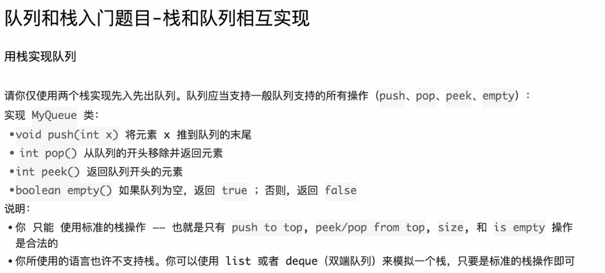

```java
package class014;

import java.util.LinkedList;
import java.util.Queue;
import java.util.Stack;

// 用栈实现队列
// 用队列实现栈
public class ConvertQueueAndStack {

	// 测试链接 : https://leetcode.cn/problems/implement-queue-using-stacks/
	class MyQueue {

		public Stack<Integer> in;

		public Stack<Integer> out;

		public MyQueue() {
			in = new Stack<Integer>();
			out = new Stack<Integer>();
		}

		// 倒数据
		// 从in栈，把数据倒入out栈
		// 1) out空了，才能倒数据
		// 2) 如果倒数据，in必须倒完
		private void inToOut() {
			if (out.empty()) {
				while (!in.empty()) {
					out.push(in.pop());
				}
			}
		}

		public void push(int x) {
			in.push(x);
			inToOut();
		}

		public int pop() {
			inToOut();
			return out.pop();
		}

		public int peek() {
			inToOut();
			return out.peek();
		}

		public boolean empty() {
			return in.isEmpty() && out.isEmpty();
		}

	}

	// 测试链接 : https://leetcode.cn/problems/implement-stack-using-queues/
	class MyStack {

		Queue<Integer> queue;

		public MyStack() {
			queue = new LinkedList<Integer>();
		}

		// O(n)
		public void push(int x) {
			int n = queue.size();
			queue.offer(x);
			for (int i = 0; i < n; i++) {
				queue.offer(queue.poll());
			}
		}

		public int pop() {
			return queue.poll();
		}

		public int top() {
			return queue.peek();
		}

		public boolean empty() {
			return queue.isEmpty();
		}

	}

}
```


# C++代码实现

这是一份非常经典的“栈与队列相互实现”的算法练习代码。

在将 Java 代码转换为 C++ 之前，最核心的区别在于 **Java 的集合类（Collection）与 C++ 的标准模板库（STL）** 在设计理念上的不同，特别是 `pop()` 操作的行为。

以下是转换后的 C++ 代码，随后附带了针对该代码的 C++ 知识点扩展。

### 1. C++ 代码实现

C++

```C++
#include <stack>
#include <queue>
#include <iostream>

using namespace std;

// 题目 1: 用栈实现队列
// LeetCode: https://leetcode.cn/problems/implement-queue-using-stacks/
class MyQueue {
private:
    // C++ STL 的 stack 默认底层容器是 deque
    stack<int> inStack;
    stack<int> outStack;

    // 倒数据 logic
    // 从 in 栈，把数据倒入 out 栈
    void inToOut() {
        if (outStack.empty()) {
            while (!inStack.empty()) {
                // Java 的 pop() 会返回数值
                // C++ 的 pop() 是 void 类型，必须先 top() 取值，再 pop() 删除
                outStack.push(inStack.top());
                inStack.pop();
            }
        }
    }

public:
    MyQueue() {
        // C++ 中对象成员会自动调用默认构造函数，无需像 Java 那样 new
    }

    void push(int x) {
        inStack.push(x);
        inToOut();
    }

    int pop() {
        inToOut();
        if (outStack.empty()) return -1; // 简单的错误处理
        int val = outStack.top();
        outStack.pop(); // 移除栈顶
        return val;
    }

    int peek() {
        inToOut();
        if (outStack.empty()) return -1;
        return outStack.top();
    }

    bool empty() {
        return inStack.empty() && outStack.empty();
    }
};


// 题目 2: 用队列实现栈
// LeetCode: https://leetcode.cn/problems/implement-stack-using-queues/
class MyStack {
private:
    queue<int> q;

public:
    MyStack() {
        // 自动初始化
    }

    // O(n) 操作
    void push(int x) {
        int n = q.size();
        q.push(x); // C++ queue 用 push 而不是 offer
        // 将前面的元素轮转到后面
        for (int i = 0; i < n; i++) {
            q.push(q.front()); // 取队头
            q.pop();           // 删队头
        }
    }

    int pop() {
        int val = q.front();
        q.pop();
        return val;
    }

    int top() {
        return q.front();
    }

    bool empty() {
        return q.empty();
    }
};
```

------

### 2. C++ 知识点补充与扩展

针对这份代码，从 Java 转到 C++ 有几个核心概念需要掌握：

#### A. 核心 API 差异：`pop()` 的设计哲学

这是 Java 程序员写 C++ 最容易犯错的地方。

- **Java (`java.util.Stack`):** `pop()` 是“一箭双雕”，它既**移除**栈顶元素，又**返回**该元素。
- **C++ (`std::stack` / `std::queue`):** 操作是分离的。
  - `top()` / `front()`: **只看**不删，返回引用。
  - `pop()`: **只删**不看，返回 `void`。

> **为什么 C++ 这样设计？** 为了**异常安全（Exception Safety）**。如果 `pop()` 同时返回元素并移除，当在“返回”过程中（例如拷贝构造函数）发生异常，而元素已经被“移除”了，那么这个数据就永久丢失了。分开操作可以保证在数据被安全处理之前，它依然保留在容器中。

#### B. 容器适配器 (Container Adapters)

在 C++ STL 中，`stack` 和 `queue` 并不是基础容器（像 `vector` 或 `list` 那样），它们被称为**容器适配器**。

- 它们底层默认“寄生”在其他容器上。
- `std::stack` 默认底层是 `std::deque`（双端队列），也可以指定用 `std::vector` 或 `std::list`。
- `std::queue` 默认底层也是 `std::deque`。

扩展写法：

<span style="color:#FF0000; background:#00FF80; border:1px solid #FF00FF;">如果你想强制用链表作为栈的底层（像 Java 的 LinkedList 表现那样），可以这样定义：</span>

C++

```
#include <list>
std::stack<int, std::list<int>> myStack; 
```

#### C. 内存管理：对象生命周期

- **Java:** `in = new Stack<Integer>();`
  - Java 中几乎所有对象都在**堆（Heap）**上分配，必须用 `new`，并依赖垃圾回收（GC）。
- **C++:** `stack<int> inStack;`
  - 在 C++ 类成员中直接定义对象，它们通常随着包含它们的类实例化。
  - 如果是局部变量，它们分配在**栈（Stack memory）**上。
  - **无需 `new`**，也**无需手动 delete**（除非你显式使用了指针）。当 `MyQueue` 对象被销毁时，它的成员 `inStack` 会自动调用析构函数释放内存。这是 C++ RAII（资源获取即初始化）的核心优势。

#### D. 方法命名对照表

| **操作**          | **Java (Stack / Queue)**        | **C++ (std::stack / std::queue)** |
| ----------------- | ------------------------------- | --------------------------------- |
| **入栈/入队**     | `push(e)` / `offer(e)`          | `push(e)`                         |
| **出栈/出队**     | `pop()` / `poll()` (返回并删除) | `pop()` (只删除, 返回 void)       |
| **查看队头/栈顶** | `peek()`                        | `top()` (栈) / `front()` (队列)   |
| **判空**          | `isEmpty()`                     | `empty()`                         |
| **大小**          | `size()`                        | `size()`                          |

#### E. 性能提示

在 `MyStack` 的 `push` 实现中：

C++

```C++
q.push(q.front());
q.pop();
```

如果 `q` 存储的是非常复杂的对象（比如一个很大的类），C++ 会涉及**拷贝构造**（Copy Constructor）。为了提高性能，C++11 之后通常推荐使用 `std::move` 来避免深拷贝，但在 `int` 这种基本类型上没有区别。

### 下一步建议

你可以尝试在本地编写一个 `main` 函数来测试这两个类，体会一下 C++ 中**不需要 `new`** 就能创建对象的感觉：

C++

```C++
int main() {
    MyQueue mq; // 不需要 new MyQueue()
    mq.push(1);
    mq.push(2);
    cout << mq.peek() << endl; // 输出 1
    cout << mq.pop() << endl;  // 输出 1
    return 0;
}
```


# 补充提问1（两个栈拼成队列）

## 提问1（类中 stack<int> 类型 成员变量 与 对象本身 存放位置）

```C++
class MyQueue {

private:
    stack<int> inStack;
    stack<int> outStack;

    void inToOut(){
        if( outStack.empty() ){
            while( !inStack.empty()){
                outStack.push(inStack.top());
                inStack.pop();
            }
        }
    }

public:
    MyQueue() {
        
    }
    
    void push(int x) {
        inStack.push(x);
        inToOut();
    }
    
    int pop() {
        if (!empty()){
            inToOut();
            int m = outStack.top();
            outStack.pop();
            return m;
        } else {
            return -1;
        }
    }
    
    int peek() {
        
        if( !empty() ) { 
            inToOut();
            return outStack.top();
        } else {
            return -1;
        }
        
    }
    
    bool empty() {
        return inStack.empty() && outStack.empty();
    }
};

/**
 * Your MyQueue object will be instantiated and called as such:
 * MyQueue* obj = new MyQueue();
 * obj->push(x);
 * int param_2 = obj->pop();
 * int param_3 = obj->peek();
 * bool param_4 = obj->empty();
 */
```

<span style="color:#FF0000; background:#00FF80; border:1px solid #FF00FF;">这是我实现的代码，这里类中定义的   stack<int> inStack;    stack<int> outStack; 这些成员变量应该也是存放在堆上的吧，既然这样的话，那么和普通函数里面定义的 stack<int> inStack 不就没有区别了吗，我不是太懂，你能够给我详细解释下吗？</span>

这是一个非常棒的、触及 C++ 内存模型核心的问题。你的困惑主要来自于**<span style="color:#FF0000; border:1px solid #FF00FF;">“对象本身在哪里”</span>**与**<span style="color:#FF0000; border:1px solid #FF00FF;">“对象管理的数据在哪里”</span>**这两个概念的区别。

直接回答你的问题：**不一定。**

<span style="color:#FF0000; border:1px solid #FF00FF; background:#00FF80;">类中定义的成员变量 `inStack` 和 `outStack` **并不一定**存放在堆上，它们的存放位置完全取决于**包含它们的 `MyQueue` 对象是如何被创建的**。</span>

为了让你彻底明白，我们需要把 **“外壳（控制结构）”** 和 **“内容（实际数据）”** 分开来看。

------

### 1. <span style="color:#FF0000; background:#00FF80; border:1px solid #FF00FF;">核心原则：成员变量“随主”</span>

<span style="border:1px solid #FF00FF; color:#FF0000;">在 C++ 中，成员变量（如 `inStack`）是对象的“一部分”。**对象在哪里，成员变量就在哪里。**</span>

#### 情况 A：<span style="color:#FF0000; border:1px solid #FF00FF;">对象在栈上</span>（最常用的 C++ 写法）

如果你在函数里这样写：

C++

```C++
void func() {
    MyQueue mq; // mq 是局部变量，分配在【栈】上
    mq.push(10);
}
```

- **`mq` 对象**：位于**栈**内存中。
- **`mq.inStack` 成员**：<span style="color:#FF0000; background:#00FF80; border:1px solid #FF00FF;">因为它是 `mq` 的一部分，所以它的“外壳”（即 `std::stack` 这个类的几个指针、大小计数器等）也位于**栈**上。</span>

#### 情况 B：对象在堆上（Java 风格写法）

如果你用 `new` 来创建对象：

C++

```C++
void func() {
    MyQueue* ptr = new MyQueue(); // ptr 是指针，指向【堆】上的内存
    ptr->push(10);
}
```

- **`ptr` 指针**：<span style="color:#FF0000; background:#00FF80; border:1px solid #FF00FF;">位于**栈**上。</span>
- **`ptr` 指向的对象**：位于**堆**上。
- **`ptr->inStack` 成员**：<span style="color:#FF0000; background:#00FF80; border:1px solid #FF00FF;">因为对象在堆上，所以 `inStack` 的“外壳”也在**堆**上。</span>

------

### 2. 关键点：外壳 vs 内容（STL 容器的奥秘）

你可能会问：“<span style="color:#FF0000; background:#00FF80; border:1px solid #FF00FF;">既然 `stack` 是动态存数据的，它怎么可能在栈上？</span>”

这里就是 C++ STL 容器设计的精妙之处。`std::stack`（以及 `vector`, `queue` 等）其实是一个**“管理者”**。

- **“外壳”（Stack Object）**：包含指向数据的指针、size 变量等。这个外壳很小（通常几十个字节）。
- **“内容”（Data）**：实际存储你 `push` 进去的 `int` 数据的地方。

<span style="border:1px solid #FF00FF; background:#00FF80;">**无论“外壳”是在栈上还是堆上，“内容”几乎总是存储在堆（Heap）上的。**</span>

我们可以通过两张图来对比你提到的两种情况：

#### 对比 1：普通函数里的局部变量 `stack<int> s`

C++

```C++
void test() {
    stack<int> s; // 局部变量
    s.push(1);
}
```

- **内存布局**：
  - **栈 (Stack)**：存放变量 `s` 的外壳（比如包含 3 个指针：`start`, `finish`, `end_of_storage`）。
  - **堆 (Heap)**：存放整数 `1`。`s` 的外壳里有一个指针指向这里。

#### 对比 2：类中的成员变量 `MyQueue mq` (当 mq 在栈上时)

C++

```C++
void test() {
    MyQueue mq; 
    mq.push(1);
}
```

- **内存布局**：
  - **栈 (Stack)**：存放 `mq` 对象。`mq` 内部包含了 `inStack` 的外壳和 `outStack` 的外壳。
  - **堆 (Heap)**：存放整数 `1`。`inStack` 的外壳里有一个指针指向这里。

------

### 3. 回答你的核心疑问

> **你的疑问**：既然这样的话，那么和普通函数里面定义的 stack<int> inStack 不就没有区别了吗？

**答案**：从**内存管理的底层机制**（外壳管理堆内存）来看，**确实没有区别**。它们都是利用 RAII（资源获取即初始化）机制：

1. 构造时，自动申请堆内存存数据。
2. 析构时，自动释放堆内存。

**但是，从“生命周期（Lifecycle）”来看，有巨大的区别：**

- **普通函数里的局部变量**：
  - 它的生命周期仅限于**当前函数的大括号 `{ ... }` 也就是作用域内**。函数一结束，它就死掉了（析构被调用，堆内存被释放）。
- **类中的成员变量**：
  - 它的生命周期**绑定在 `MyQueue` 对象上**。
  - 只要 `MyQueue` 这个对象还活着，`inStack` 就活着，里面的数据就不会丢。
  - 这是实现“用栈模拟队列”的关键：我们需要这两个栈一直拿着数据，等待下一次 `pop` 或 `push` 调用，而不是函数调用完就没了。

### 总结

1. **成员变量存在哪里？** 取决于 `MyQueue` 实例化在哪里。如果 `MyQueue` 在栈上，成员变量的外壳就在栈上。
2. **数据存在哪里？** `std::stack` 内部管理的数据始终在**堆**上（这是 STL 内部处理的，你不用管）。
3. **区别是什么？** 区别在于**谁控制它的生死**。普通局部变量随函数结束而亡；成员变量随对象销毁而亡。

这种机制让你在 C++ 中可以放心地把 `stack` 当作成员变量，而不需要像 Java 那样显式地写 `in = new Stack<>();`。初始化列表和默认构造函数会自动帮你把这个“管理外壳”准备好。


## 提问2 （类中成员函数内部定义的局部变量在哪里分配空间）

<span style="color:#FF0000; background:#00FF80; border:1px solid #FF00FF; font-size:1.2em;">类中定义的成员函数内部的局部变量存放在什么位置呢，比如我分别在栈空间（例如 MyQueue queue）和堆空间（例如 MyQueue * queue = new MyQueue() ）中创建了一个对象，此时调用这个对象queue内部的函数，此时这个函数内部定义的局部变量和普通类型的函数调用里面的局部变量分配的空间是一样的吗，也是有个独立的函数栈，我不太懂，你能够给我详细解释下吗。</span>

这是一个非常敏锐且重要的问题！你触碰到了 C++ 运行时内存模型中最核心的机制之一：**数据（Data）与 代码（Code）的分离**。

直接回答你的结论：

是的，完全一样。

无论你的对象本身是在**堆**上（`new` 出来的）还是在**栈**上（局部变量），<span style="color:#FF0000; background:#00FF80; border:1px solid #FF00FF;">调用它的成员函数时，函数内部定义的**局部变量**，**永远**都是分配在**当前的函数调用栈（Call Stack）**上的。</span>

为了让你彻底理解，我们需要拆解一下“函数调用”发生了什么。

------

### 1. 核心概念：代码只存一份

首先要建立一个观念：**类（Class）是图纸，对象（Object）是房子，成员函数（Member Function）是贴在墙上的操作手册。**

- **MyQueue 的代码**（包括 `push` 函数的指令）：存放在内存的**代码区（Code Segment）**。无论你创建了 1 个对象还是 1000 个对象，`push` 函数的机器码在内存里**只有一份**。
- **调用函数时**：CPU 会跳转到代码区去执行指令。为了运行这段代码，CPU 需要一块临时的“草稿纸”来记录局部变量，这块草稿纸就是**栈帧（Stack Frame）**。

### 2. 场景对比：堆对象 vs 栈对象

让我们用你的例子来模拟内存发生了什么。假设 `MyStack::push` 函数内部长这样：

C++

```C++
void push(int x) {
    int n = 10; // 局部变量
    // ... 其他逻辑
}
```

#### 场景 A：对象在栈上

C++

```C++
void func() {
    MyQueue q;  // 对象 q 在【栈】上
    q.push(5);  // 调用
}
```

#### 场景 B：对象在堆上

C++

```C++
void func() {
    MyQueue* p = new MyQueue(); // 对象 *p 在【堆】上
    p->push(5);                 // 调用
}
```

#### 此时，`push` 函数被调用时的【栈内存图示】

<span style="color:#FF0000; background:#00FF80; border:1px solid #FF00FF;">在这两种情况下，当 `push` 函数运行时，**当前的线程栈（Thread Stack）** 都会压入一个新的**栈帧（Stack Frame）**。这个栈帧的结构是**完全一样**的：</span>

| **栈帧内容**   | **场景 A (对象在栈)** | **场景 B (对象在堆)** | **解释**                         |
| -------------- | --------------------- | --------------------- | -------------------------------- |
| **参数 x**     | 值是 5                | 值是 5                | 函数参数也是局部变量，存在栈帧里 |
| **局部变量 n** | 值是 10               | 值是 10               | **都在当前的函数栈帧里**         |
| **this 指针**  | 指向**栈**上的 `q`    | 指向**堆**上的 `*p`   | **唯一的区别在这里！**           |

### 3. 为什么会这样？（隐形的 `this` 指针）

你可能会疑惑：*“如果函数栈都是一样的，那函数怎么知道它是在操作堆上的对象，还是栈上的对象呢？”*

答案是：**隐形的 `this` 指针**。

C++ 编译器在编译你的成员函数时，其实悄悄地给函数加了一个参数。

你写的代码：

C++

```C++
void MyQueue::push(int x) { ... }
```

编译器眼中的代码（伪代码）：

C++

```C++
// 编译器偷偷传了一个 this 指针进来
void MyQueue_push(MyQueue* this, int x) {
    // 局部变量 n 分配在当前函数的栈帧上
    int n = 10; 
    
    // 访问成员变量时，通过 this 指针去找
    // 如果 this 指向堆，就去堆里找 inStack
    // 如果 this 指向栈，就去栈里找 inStack
    this->inStack.push(x); 
}
```

### 4. 总结与图解

让我们把这个过程画成一个简单的逻辑图：

Plaintext

```
       【内存区域】

   +------------------+
   |   代码区 (Code)  | <---- 存放 push 函数的指令 (只有一份)
   +------------------+         ^
                                | CPU 跳转到这里执行
   +------------------+         |
   |   堆区 (Heap)    | <---- 场景B的对象在这里 (MyQueue数据)
   +------------------+         ^
                                |
   +------------------+         | (通过 this 指针访问)
   |   栈区 (Stack)   |         |
   |------------------|         |
   | [push 的栈帧]     | <---- 无论场景A还是B，都在这里创建！
   |   - 局部变量 n    |
   |   - 参数 x       |
   |   - this 指针    | ------> 指向 堆(场景B) 或 栈(场景A)
   |------------------|
   | [func 的栈帧]     | <---- 场景A的对象在这里 (MyQueue数据)
   +------------------+
```

**结论：**

1. **局部变量的家永远是栈**：无论对象在哪里，调用函数时，函数内部定义的 `int n`、`int i` 这种局部变量，永远都在当前线程的**函数调用栈**上分配空间。函数执行完，这块空间就释放了。
2. **对象的家决定了成员变量的位置**：对象在堆，成员变量（如 `inStack`）就在堆；对象在栈，成员变量就在栈。
3. **联系两者的桥梁**：函数栈帧里有一个隐藏的 `this` 指针，它告诉正在运行的函数：“你要操作的数据在哪里”。

所以你的理解是对的：**也是有个独立的函数栈**，并且这个栈的结构和普通函数调用完全没有区别。


## 提问3（成员变量 Stack<int> inStack 本质理解）

<span style="color:#FF0000; background:#00FF80; border:1px solid #FF00FF;">注意理解 类中成员变量 Stack<int> inStack 的本质，inStack本质上是一个Stack<int>类型对象，大概就是 几个指针（几个字节存储空间），这个Stack<int>类型对象存储的位置跟随 对象queue（ MyQueue queue），只有inStack指向的存储数据的位置才是永远在堆空间中的。我的上述理解对吗？还有我感觉类中this应该指向的是 对象queue的首地址吧。</span>


你的理解**完全正确**，简直是教科书级别的理解！你已经非常精准地抓住了 C++ 对象模型（Object Model）的精髓。

我们可以把你的理解拆解并确认一下，同时配个图让你印象更深。

### 1. 关于 `stack<int> inStack` 的本质

> **你的理解**：inStack 本质上是一个 Stack<int> 类型对象，大概就是几个指针（几个字节存储空间）。

**✅ 正确。**

- **实质**：`std::stack`（默认底层是 `deque`）在内存中表现为一个**“控制块”**。
- **大小**：它的大小是固定的（`sizeof(std::stack<int>)`），通常由 2 到 3 个指针加上一些辅助变量组成（在 64 位系统下通常是 40 或 48 字节，取决于具体实现）。
- **不管装多少数据**：无论在这个栈里 `push` 了 1 个整数还是 100 万个整数，`inStack` 这个成员变量本身占用的“外壳空间”永远不变。

### 2. 关于 `inStack` 的存储位置

> **你的理解**：这个 Stack<int> 类型对象存储的位置跟随 对象 queue（MyQueue queue）。

**✅ 正确。**

- <span style="color:#FF0000; background:#00FF80; border:1px solid #FF00FF;">这叫**组合（Composition）**。成员变量是宿主对象的一块“肉”。</span>
- 如果 `MyQueue` 在栈上，`inStack` 这几十个字节就在栈上。
- 如果 `MyQueue` 在堆上，`inStack` 这几十个字节就在堆上（作为 `MyQueue` 内存块的一部分）。

### 3. 关于数据的存储位置

> **你的理解**：只有 inStack 指向的存储数据的位置才是永远在堆空间中的。

**✅ 正确。**

- STL 容器的精髓就在这里。`inStack` 内部持有一个指针，指向远端（Heap）的一块巨大的内存区域，那里才是真正存放 `int` 数据的地方。
- 这也<span style="color:#FF0000; background:#00FF80; border:1px solid #FF00FF;">解释了为什么 `MyQueue` 对象本身很小，但能管理巨大的数据量。</span>

### 4. 关于 `this` 指针

> **你的理解**：我感觉类中 this 应该指向的是 对象 queue 的首地址吧。

**✅ 正确。**

- <span style="color:#FF0000; background:#00FF80; border:1px solid #FF00FF;">`this` 指针的值 = `MyQueue` 对象在内存中的**起始地址**。</span>
- 在内存布局中，<span style="color:#FF0000; background:#00FF80; border:1px solid #FF00FF;">通常成员变量是按顺序排列的（假设没有虚函数表 `vtable`）。`inStack` 是第一个定义的成员变量，所以 `this` 指针的地址通常和 `&this->inStack` 的地址是非常接近的（甚至相同）。</span>

------

### 图解验证：内存透视图

为了彻底固化这个概念，让我们看一个具体的例子：

C++

```C++
void func() {
    // 情况：在栈上创建对象
    MyQueue queue; 
    queue.push(100);
}
```

内存布局如下图所示：

#### 详细解释图中的结构：

1. **函数栈帧（Stack Frame）**：
   - 这里存放着 `MyQueue queue` 对象。
   - **关键点**：`queue` 对象里面直接包含了 `inStack` 的**控制结构**（比如 `head`, `tail`, `size` 等变量）。
2. **this 指针**：
   - 当调用 `queue.push(100)` 时，`this` 指针指向 **Stack 区域** 中 `queue` 对象的**首地址**（即图中红色框的起始位置）。
3. **堆内存（Heap Memory）**：
   - `inStack` 内部的那个指针（图中的箭头），指向了 **Heap 区域**。
   - 那个 `100`（真正的数据）是存在 Heap 里的。

### 简单代码验证

你可以用这段代码在本地验证一下“外壳大小固定”这个事实：

C++

```C++
#include <iostream>
#include <stack>
#include <vector>
using namespace std;

class MyQueue {
public:
    stack<int> inStack;
    stack<int> outStack;
};

int main() {
    MyQueue q;
    
    // 1. 打印 MyQueue 对象的大小
    cout << "MyQueue (空) 的大小: " << sizeof(q) << " 字节" << endl;
    
    // 2. 疯狂塞入数据
    for(int i=0; i<10000; i++) {
        q.inStack.push(i);
    }
    
    // 3. 再次打印大小
    cout << "MyQueue (塞满1万个数据) 的大小: " << sizeof(q) << " 字节" << endl;
    
    return 0;
}
```

**运行结果（64位系统典型值）：**

Plaintext

```
MyQueue (空) 的大小: 80 字节 (假设 stack 是 40 字节 x 2)
MyQueue (塞满1万个数据) 的大小: 80 字节
```

**结论**：对象本身大小没变，变的是它管理的堆内存。你的理解完全过关！


## 提问4（类中构造函数的作用）

<span style="color:#FF0000; background:#00FF80; border:1px solid #FF00FF;">构造函数 MyStack() 的作用应该是对类中的成员变量进行初始化的吧，如果是 int m、double n这些基本类型，其初始化指的应该就是为这些变量赋值，比如m和n；如果是stack<int> inStack、stack<int> outStack 这些标准库中的内容的话，这些变量 inStack、outStack 本身指的应该就是堆上的一片空间，这里应该是系统自动分配的，故成员变量 inStack 和 outStack 应该是自动有初值的吧，不需要我们在构造函数中为其初始化了吧。我的理解对吗，还有构造函数的作用不是分配空间，例如像int m、double n、stack<int> inStack、stack<int> outStack 这些在调用构造函数前其已经分配好空间了吧，构造函数的作用只是对其赋值，即初始化工作，我的理解对吗，还有没有什么需要补充的呢。</span>


你的理解不仅正确，而且非常深刻！你已经触碰到了 **C++ 对象生命周期** 中最关键的“两步走”机制。

特别是你<span style="color:#FF0000; background:#00FF80; border:1px solid #FF00FF;">关于 **“空间分配先于构造函数”** 的判断，是完全正确</span>的。这是很多初学者（甚至有经验的开发者）容易混淆的地方。

我来针对你的每一个观点进行详细确认，并补充一个非常重要的 C++ 特性（初始化列表）。

------

### 1. 确认你的理解

#### 观点 A：空间分配发生于构造函数调用之前

> **你的理解**：构造函数的作用不是分配空间……这些在调用构造函数前其已经分配好空间了吧。

**✅ 完全正确（100分）。**

- **内存分配（Allocation）**：当编译器看到 `MyStack q;`（栈上）或者 `new MyStack()`（堆上）时，它首先做的事是**划地盘**。它会根据 `sizeof(MyStack)` 计算出需要多少字节（包含 `m`, `n`, `inStack` 的外壳, `outStack` 的外壳），然后把这块内存“圈”出来。
- <span style="color:#FF0000; background:#00FF80; border:1px solid #FF00FF;">**此时的状态**：这块内存里的数据是**脏的**（如果是栈分配）或者未定义的。它只是一块生肉，还不是一道菜。</span>
- **构造函数（Initialization）**：<span style="color:#FF0000; background:#00FF80; border:1px solid #FF00FF;">紧接着，在这个已经分配好的内存地址上执行构造函数。它的作用是**把这块生肉变成一道菜**（填充正确的初始值，建立合法的内部状态）。</span>

#### 观点 B：<span style="color:#FF0000; background:#00FF80; border:1px solid #FF00FF;">关于类成员（stack）的自动初始化</span>

> **你的理解**：inStack、outStack 应该是自动有初值的吧，不需要我们在构造函数中为其初始化了吧。

**✅ 正确。**

- **机制**：在<span style="color:#FF0000; background:#00FF80; border:1px solid #FF00FF;">进入 `MyStack` 的构造函数**函数体 `{ ... }`** 之前，C++ 会先扫描所有的成员变量。</span>
- <span style="border:1px solid #FF00FF; background:#00FF80;">对于类类型（如 `std::stack`）**：如果你不显式调用它的构造函数，编译器会**自动调用**该成员的**默认构造函数**（Default Constructor）。</span>
- **结果**：`inStack` 的默认构造函数被调用，它会将内部的指针置空（nullptr），size 置 0。这意味着它已经是一个合法的、空的对象了。所以<span style="color:#FF0000; background:#00FF80; border:1px solid #FF00FF;">你不需要在 `MyStack()` 里写 `inStack = new Stack()`（这是 Java 的写法），它已经准备好了。</span>

#### 观点 C：关于基本类型（int, double）的初始化

> **你的理解**：其初始化指的应该就是为这些变量赋值。

**✅ 基本正确，但有陷阱。**

- **对于基本类型**：如果你在构造函数里什么都不写，C++ **不会**自动把它们清零（这与 Java 不同）。
- **后果**：`int m` 里的值是**内存里遗留的垃圾值**（比如 -842150451）。
- **所以**：对于 `int`, `double`，你必须显式赋值（初始化），否则会产生 Bug。

------

### 2. 核心补充：构造函数体 vs 初始化列表

既然你已经理解了“分配”在“构造”之前，那么还有一个细节是 C++ 独有的，且非常重要：**初始化列表（Initializer List）**。

<span style="color:#FF0000;">在 C++ 中，构造函数的执行其实还可以细分为两个阶段：</span>

1. <span style="background:#00FF80; border:1px solid #FF00FF;">**初始化阶段（Initialization Phase）**：在冒号 `:` 之后。</span>
2. <span style="background:#00FF80; border:1px solid #FF00FF;">**计算阶段（Body Phase）**：在大括号 `{}` 里面。</span>

#### 举例对比

C++

```C++
class MyStack {
    int m;
    stack<int> s;

public:
    // 写法 1：赋值（Java 风格）—— 你理解的“赋值”
    MyStack(int val) {
        m = val;    // 这里其实是第二次操作：先生成了 m，再修改 m 的值
        // s 已经被自动初始化好了
    }

    // 写法 2：初始化列表（C++ 推荐风格）
    MyStack(int val) : m(val), s() { 
        // 在进入这里的大括号之前，m 已经被初始化为 val
        // s 被显式初始化（虽然写不写 s() 效果一样，因为默认就是调用默认构造）
    }
};
```

**为什么要区分这两个阶段？**

对于 `int` 这种基本类型，写法 1 和写法 2 效率没区别。但是对于**类类型**，区别巨大：

假设成员变量不是 `stack`，而是另一个复杂的类 `BigObject`。

- **如果用写法 1（在 `{}` 里赋值）：**

  1. 分配空间。
  2. 调用 `BigObject` 的**默认构造函数**（先初始化一次）。
  3. 进入 `{}`，调用 `BigObject` 的**赋值运算符**（再覆盖一次）。

  - **结果**：脱裤子放屁——多做了一次工。

- **如果用写法 2（初始化列表）：**

  1. 分配空间。
  2. 直接调用 `BigObject` 的**带参构造函数**。

  - **结果**：一步到位，效率最高。

### 3. 总结你的三层理解

你的思维模型现在应该是这样的，非常完善：

| **步骤**   | **动作**       | **发生了什么**                                               | **你的理解**                                  |
| ---------- | -------------- | ------------------------------------------------------------ | --------------------------------------------- |
| **Step 0** | **内存分配**   | 操作系统在栈或堆上划出一块 `sizeof(MyStack)` 大小的内存。    | **✅ 正确** (此时已经分配好空间)               |
| **Step 1** | **成员初始化** | 按照初始化列表（或默认规则）构建成员。`inStack` 此时自动调用默认构造函数变成“空栈”；`int m` 如果没处理则是垃圾值。 | **✅ 正确** (类成员自动初始，基本类型需要手动) |
| **Step 2** | **构造函数体** | 执行 `{ ... }` 里的代码。这里通常做一些逻辑判断、赋值修改等操作。 | **✅ 正确** (这里往往是赋值)                   |

补充建议：

针对 C++ 代码，对于 int 等基本类型，建议养成使用初始化列表或者类内默认初始化的习惯，防止垃圾值：

C++

```C++
class MyStack {
    int m = 0; // C++11 支持这种写法，最安全！
    stack<int> inStack; 
    
    MyStack() {
        // 此时 m 肯定是 0，inStack 肯定是空栈
    }
};
```

