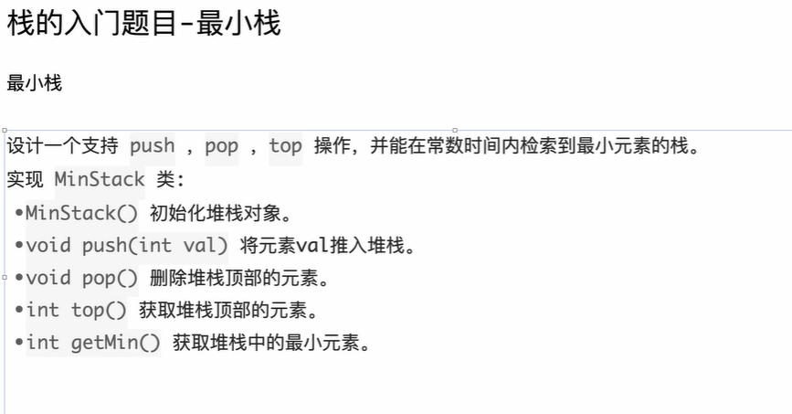

```java
package class015;

import java.util.Stack;

// 最小栈
// 测试链接 : https://leetcode.cn/problems/min-stack/
public class GetMinStack {

	// 提交时把类名、构造方法改成MinStack
	class MinStack1 {
		public Stack<Integer> data;
		public Stack<Integer> min;

		public MinStack1() {
			data = new Stack<Integer>();
			min = new Stack<Integer>();
		}

		public void push(int val) {
			data.push(val);
			if (min.isEmpty() || val <= min.peek()) {
				min.push(val);
			} else { // !min.isEmpty() && val > min.peek()
				min.push(min.peek());
			}
		}

		public void pop() {
			data.pop();
			min.pop();
		}

		public int top() {
			return data.peek();
		}

		public int getMin() {
			return min.peek();
		}
	}

	// 提交时把类名、构造方法改成MinStack
	class MinStack2 {
		// leetcode的数据在测试时，同时在栈里的数据不超过这个值
		// 这是几次提交实验出来的，哈哈
		// 如果leetcode补测试数据了，超过这个量导致出错，就调大
		public final int MAXN = 8001;

		public int[] data;
		public int[] min;
		int size;

		public MinStack2() {
			data = new int[MAXN];
			min = new int[MAXN];
			size = 0;
		}

		public void push(int val) {
			data[size] = val;
			if (size == 0 || val <= min[size - 1]) {
				min[size] = val;
			} else {
				min[size] = min[size - 1];
			}
			size++;
		}

		public void pop() {
			size--;
		}

		public int top() {
			return data[size - 1];
		}

		public int getMin() {
			return min[size - 1];
		}
	}

}
```

# C++代码实现

这是一个非常经典的数据结构题目（最小栈）。

在 C++ 中，我们将使用标准模板库（STL）中的 `std::stack` 来对应 Java 的 `Stack`，并使用数组（或指针）来对应 Java 的数组实现。

以下是转换后的 C++ 代码，包含了两个版本的实现（STL 版本和数组模拟版本），以及详细的知识点扩展。

### C++ 代码实现

C++

```C++
#include <iostream>
#include <stack>
#include <vector>
#include <algorithm>

using namespace std;

// 提交时把类名改为 MinStack
class MinStack1 {
public:
    // C++ STL 的 stack 默认底层容器是 deque，元素实际上存储在堆上
    stack<int> data;
    stack<int> minStack; // 避免变量名和 min 函数冲突，改名为 minStack

    MinStack1() {
        // C++ stack 默认构造函数会自动初始化，不需要像 Java 那样 new
    }

    void push(int val) {
        data.push(val);
        // 如果 minStack 为空，或者 val 小于等于当前最小值
        if (minStack.empty() || val <= minStack.top()) {
            minStack.push(val);
        } else {
            // 如果 val 大于当前最小值，重复压入当前的最小值
            // 这样保持两个栈的高度一致 (同步栈)
            minStack.push(minStack.top());
        }
    }

    void pop() {
        // C++ 的 pop() 返回 void，不返回元素
        if (!data.empty()) {
            data.pop();
            minStack.pop();
        }
    }

    int top() {
        // C++ 使用 top() 获取栈顶元素，Java 是 peek()
        return data.top();
    }

    int getMin() {
        return minStack.top();
    }
};

// 提交时把类名改为 MinStack
class MinStack2 {
private:
    // const int 对应 Java 的 final int
    // static 意味着这是类级别的常量
    static const int MAXN = 8001;

    int* data;      // 使用指针动态分配数组
    int* minStack;  // 对应 Java 的 int[]
    int ptr;        // 对应 Java 的 size，C++ 习惯叫 ptr 或 topIndex

public:
    MinStack2() {
        // 在堆区手动分配内存
        data = new int[MAXN];
        minStack = new int[MAXN];
        ptr = 0;
    }

    // !重要：C++ 需要手动管理内存，必须写析构函数释放资源
    ~MinStack2() {
        delete[] data;
        delete[] minStack;
    }

    void push(int val) {
        // 注意边界检查，虽然题目保证数据量，但在 C++ 中越界很危险
        if (ptr >= MAXN) return; 

        data[ptr] = val;
        if (ptr == 0 || val <= minStack[ptr - 1]) {
            minStack[ptr] = val;
        } else {
            minStack[ptr] = minStack[ptr - 1];
        }
        ptr++;
    }

    void pop() {
        if (ptr > 0) {
            ptr--;
        }
    }

    int top() {
        return data[ptr - 1];
    }

    int getMin() {
        return minStack[ptr - 1];
    }
};

// 测试代码
int main() {
    // 测试 MinStack1
    MinStack1 s1;
    s1.push(-2);
    s1.push(0);
    s1.push(-3);
    cout << "MinStack1 getMin (expect -3): " << s1.getMin() << endl;
    s1.pop();
    cout << "MinStack1 top (expect 0): " << s1.top() << endl;
    cout << "MinStack1 getMin (expect -2): " << s1.getMin() << endl;

    cout << "-------------------" << endl;

    // 测试 MinStack2
    MinStack2 s2;
    s2.push(-2);
    s2.push(0);
    s2.push(-3);
    cout << "MinStack2 getMin (expect -3): " << s2.getMin() << endl;
    s2.pop();
    cout << "MinStack2 top (expect 0): " << s2.top() << endl;
    cout << "MinStack2 getMin (expect -2): " << s2.getMin() << endl;

    return 0;
}
```

------

### C++ 知识点扩展与对比

针对这份代码，Java 转 C++ 最大的几个思维转换点如下：

#### 1. 内存管理：构造与析构 (Constructor & Destructor)

- **Java:** 也就是 `MinStack2` 中的数组，你有垃圾回收机制（GC）。当对象不再被引用时，Java 虚拟机会自动回收内存。
- **C++:** * 在 `MinStack2` 中，我们在构造函数里使用了 `new int[MAXN]`。这块内存是从**堆（Heap）**上申请的。
  - **关键点：** C++ 没有 GC。如果你不手动释放，这块内存会一直被占用直到程序结束（内存泄漏）。
  - **扩展：** 因此，我们必须编写 **析构函数 `~MinStack2()`**，并在其中调用 `delete[]` 来释放内存。

#### 2. `stack::pop()` 的返回值差异

- **Java:** `stack.pop()` 会移除栈顶元素并**返回**该元素。
- **C++:** `std::stack::pop()` 返回 `void`（即什么都不返回），它只负责移除。
  - **为什么？** 这是为了异常安全（Exception Safety）。如果在返回值的过程中发生拷贝构造异常，而元素已经被移除，那么这个数据就丢失了。
  - **做法：** 在 C++ 中，如果你需要弹出的值，必须先调用 `top()` 拿到值，再调用 `pop()` 移除。

#### 3. 成员变量的存储位置 (回应你之前的疑问)

你在之前的提问中提到过“成员变量存放在哪里”的问题，这里结合这份代码详细说明：

C++

```
class MinStack1 {
public:
    stack<int> data; 
    // ...
};
```

假设我们在主函数中这样写：

C++

```
int main() {
    MinStack1 ms; // ms 是一个局部变量，分配在栈(Stack)上
}
```

- **`ms` 本身**：位于栈内存中。
- **`ms.data` (stack 对象本身)**：作为 `ms` 的成员，它的“控制结构”（比如记录大小的变量、指向底层数据的指针等）也位于栈内存中。
- **`ms.data` 内部管理的元素**：`std::stack` 默认封装了 `std::deque`（双端队列）。`deque` 内部会动态申请内存块来存储所有的 `int` 数据。**这些 `int` 数据实际上是存放在堆（Heap）上的**。

**结论：** 无论对象是在栈上还是堆上，STL 容器（如 stack, vector）都会在**堆区**动态管理它们存储的大量数据，以防止栈溢出（Stack Overflow）。

#### 4. `static const` vs `final`

- **Java:** `public final int MAXN = 8001;` 是实例常量（每个对象一份，虽然编译器可能会优化）。
- **C++:** 推荐使用 `static const int MAXN = 8001;`。
  - `static`: 表示这是属于类的，所有 `MinStack2` 对象共用这一份配置，节省内存。
  - `const`: 表示不可修改。

#### 5. 数组实现的安全性

在 `MinStack2` 中，使用了固定大小数组 `MAXN = 8001`。

- **风险：** 在 C++ 中，如果你访问了 `data[8002]`，程序不会像 Java 那样抛出 `ArrayIndexOutOfBoundsException`，而是会发生**未定义行为 (Undefined Behavior)**。它可能读到脏数据，也可能导致程序直接崩溃（Segmentation Fault）。
- **改进：** 在工程实践中，推荐使用 `std::vector<int>` 替代原生数组 `int[]`，因为它支持动态扩容（`.resize()`, `.push_back()`），可以避免硬编码 `MAXN` 带来的限制。

### 下一步建议

如果你对内存管理感兴趣，我们可以进一步探讨：

“如果在 C++ 中把 MinStack1 定义为 MinStack1* ms = new MinStack1();，那么它里面的 stack<int> 成员变量的内存布局又是怎样的？”

这能帮你彻底搞懂 C++ 的内存模型。需要我展开讲讲吗？


# 补充提问

## 提问1

```C++
  int top() {
        // C++ 使用 top() 获取栈顶元素，Java 是 peek()
        return data.top();
    }

    int getMin() {
        return minStack.top();
    }
```

<span style="color:#FF0000; background:#00FF80; border:1px solid #FF00FF; font-size:1.2em;">这里的代码难道不需要判断栈空吗，我不是太懂，你能够给我详细解释下吗？</span>

你有着非常敏锐的**工程直觉**！这是一个非常棒的问题。

简单直接的回答是：**<span style="color:#FF0000; border:1px solid #FF00FF; background:#00FF80;">在工程开发中，必须判断；但在 LeetCode 刷题场景下，通常省略。</span>**

之所以这里的代码没有判断，主要有以下两个原因（特别是第一点）：

### 1. 题目保证（刷题特有语境）

<span style="color:#FF0000; background:#00FF80; border:1px solid #FF00FF;">在 LeetCode 的[最小栈](https://leetcode.cn/problems/min-stack/)题目描述中，通常会有一句不起眼的约束条件：</span>

> "Methods pop, top and getMin operations will always be called on non-empty stacks."
>
> （pop、top 和 getMin 操作总是在 非空栈 上调用。）

因为有了这个“上帝视角的保证”，为了代码简洁和运行速度（少一次判断），在写算法题解时，大家通常默认不写判空逻辑。

### 2. C++ STL 的设计哲学：性能优先

这涉及到 C++ 和 Java 设计理念的巨大差异。

#### Java 的哲学：安全第一

在 Java 中，如果你对空栈调用 `stack.peek()`：

- Java 标准库会主动检查，并抛出一个 `EmptyStackException`。
- 程序会停止，抛出异常堆栈，告诉你哪里错了。
- **代价**：每次调用都有额外的性能开销（检查是否为空）。

#### C++ 的哲学：相信程序员

在 C++ STL 中，`std::stack::top()` 的源码实现通常非常简单，它**不进行任何检查**。

- 如果你对空栈调用 `top()`，C++ 编译器认为**“你应该知道自己在做什么”**。
- **后果**：这属于 **未定义行为 (Undefined Behavior, UB)**。
  - 程序可能直接崩溃（Segmentation Fault）。
  - 程序可能**不崩溃**，而是返回一个毫无意义的“垃圾值”（这其实更可怕，因为很难排查 bug）。
- **收益**：没有额外的判断指令，速度最快。

------

### 如果这是在“工业级”项目中

如果这段代码是写给公司项目的，**你的顾虑是完全正确的，必须加判断**。

在实际 C++ 工程中，我们通常会这样做：

#### 写法 A：抛出异常（最常见）

这是最标准的做法，模仿 Java 的行为。

C++

```C++
int top() {
    if (data.empty()) {
        throw runtime_error("Stack is empty!"); // 抛出异常
    }
    return data.top();
}
```

#### 写法 B：使用 `std::optional` (C++17 新特性)

这是一种更现代、更安全的写法，强制调用者处理“可能没有值”的情况。

C++

```C++
#include <optional>

// 返回值类型变成了 optional<int>
std::optional<int> top() {
    if (data.empty()) {
        return std::nullopt; // 返回“空”
    }
    return data.top();
}

// 调用时：
// auto val = s.top();
// if (val.has_value()) { ... }
```

### 总结

- **你的代码逻辑**：你在之前 `push` 函数里加判空，是因为**你的业务逻辑依赖它**（比如：空栈时直接入栈，非空时才比较）。那是必须写的，否则逻辑就走不通。
- **`top()` 函数**：这里没写判空，纯粹是因为**题目承诺**了不会在空栈时调用。

建议：

在面试或刷题时，你可以如果不放心，可以跟面试官说一句：“题目保证了非空调用，所以这里我省略了边界检查。如果是生产环境，我会加上 if(empty()) throw ...”。这会显得你非常专业。

需不需要我为你介绍一下 C++ 中异常处理（try-catch）的基本写法？这对你从 Java 转 C++ 会很有帮助。


# 自己写代码1（利用标准库的栈stack<int> 完成最小栈）

```C++
class MinStack {

private:
    stack<int> myStack;
    stack<int> minStack;

public:
    MinStack() {
        
    }
    
    void push(int val) {
        if(val <= minStack.top()){
            myStack.push(val);
            minStack.push(val);
        } else {
            myStack.push(val);
            minStack.push(minStack.top());
        }
    }
    
    void pop() {
        if(!myStack.empty()){
            myStack.pop();
            minStack.pop();
        }
    }
    
    int top() {
        if(!myStack.empty()){
            return myStack.top();
        } else {
            return -1;
        }
    }
    
    int getMin() {
        if(!myStack.empty()){
            return minStack.top();
        } else {
            return -1;
        }
        
    }
};

/**
 * Your MinStack object will be instantiated and called as such:
 * MinStack* obj = new MinStack();
 * obj->push(val);
 * obj->pop();
 * int param_3 = obj->top();
 * int param_4 = obj->getMin();
 */
```

# 代码问题分析

你的代码逻辑大体思路是正确的（使用了同步栈的思想），但是存在一个**致命的运行时错误**，会导致程序崩溃（Segmentation Fault）。

问题出在 **`push` 函数** 中。

### 问题分析

请看这一行代码：

C++

```
if(val <= minStack.top()){ // <--- 这里会报错！
```

原因：

当栈是空的时候（也就是第一次调用 push 时），minStack 里面没有任何元素。

此时直接调用 minStack.top() 是未定义行为（Undefined Behavior），通常会试图访问非法内存，导致程序直接崩溃。

在 C++ STL 中，`stack::top()` **不检查**栈是否为空，程序员必须自己保证调用时栈非空。

### 修改方案

你需要先检查 `minStack` 是否为空。如果是空的，直接压入元素即可，不需要比较。

这是修改后的 `push` 方法：

C++

```C++
void push(int val) {
    // 1. 数据栈无论如何都要压入
    myStack.push(val); 

    // 2. 最小栈的处理：
    // 如果最小栈为空，或者新来的值比当前最小值更小（或相等）
    // 注意：利用 || 的短路特性，必须把 empty() 放在前面
    if(minStack.empty() || val <= minStack.top()) {
        minStack.push(val);
    } else {
        // 如果新来的值比较大，重复压入当前的最小值
        // 这样保持两个栈的高度一致
        minStack.push(minStack.top());
    }
}
```

<span style="color:#FF0000; background:#00FF80; border:1px solid #FF00FF;">自己编写修正的：(和上面的逻辑一样)</span>

```C++
void push(int val) {
        if(!minStack.empty() && val <= minStack.top()){
            myStack.push(val);
            minStack.push(val);
        } else if(!minStack.empty() && val > minStack.top()) 
        {
            myStack.push(val);
            minStack.push(minStack.top());
        } else {
            myStack.push(val);
            minStack.push(val);
        }
    }
```

### 为什么原来的 `pop` 和 `top` 没报错？

因为你在 `pop`、`top` 和 `getMin` 中都加了 `if(!myStack.empty())` 的判断，这是非常好的防御性编程习惯，所以这些地方是安全的。唯独漏掉了 `push` 时的第一次空栈检查。

### 完整的修正代码

C++

```C++
class MinStack {

private:
    stack<int> myStack;
    stack<int> minStack;

public:
    MinStack() {
        
    }
    
    void push(int val) {
        // 【修正点】先压入数据栈
        myStack.push(val);
        
        // 【修正点】增加判空逻辑
        // 如果 minStack 为空，或者 val <= 当前最小值，则压入 val
        if (minStack.empty() || val <= minStack.top()) {
            minStack.push(val);
        } else {
            // 否则重复压入栈顶元素
            minStack.push(minStack.top());
        }
    }
    
    void pop() {
        if(!myStack.empty()){
            myStack.pop();
            minStack.pop();
        }
    }
    
    int top() {
        if(!myStack.empty()){
            return myStack.top();
        } else {
            return -1;
        }
    }
    
    int getMin() {
        if(!myStack.empty()){
            return minStack.top();
        } else {
            return -1;
        }
    }
};
```

你可以把这段代码提交试试，应该可以通过了。


# 自己写代码2（利用vector<int>数组来自己实现栈 完成最小栈）— 代码一次性通过

```C++
class MinStack {

private:
    const int MAX = 8001;
    vector<int> myStack;
    vector<int> minStack;
    int ptrMyStack=0,ptrminStack=0;
    

public:
    MinStack() {
        myStack.resize(8001);
        minStack.resize(8001);
    }
    
    void push(int val) {
       myStack[ptrMyStack++] = val;

       if( !(ptrminStack == 0) && minStack[ptrminStack-1] <= val ){
            minStack[ptrminStack++] = minStack[ptrminStack-1]; 
       } else {
            // ptrminStack==0 || val < minStack[ptrminStack-1] 
            minStack[ptrminStack++] = val;
       }

    }
    
    void pop() {
        if( !(ptrminStack == 0) ){
            ptrMyStack--;
            ptrminStack--;
        }
    }
    
    int top() {
        if( !(ptrminStack == 0) ){
            return myStack[ptrMyStack-1];
        } else {
            return -1;
        }
    }
    
    int getMin() {
        if(!(ptrminStack == 0)){
            return minStack[ptrminStack-1];
        } else {
            return -1;
        }
        
    }
};

/**
 * Your MinStack object will be instantiated and called as such:
 * MinStack* obj = new MinStack();
 * obj->push(val);
 * obj->pop();
 * int param_3 = obj->top();
 * int param_4 = obj->getMin();
 */
```

# 补充提问

## 提问1（if 条件 & 与 || 这两个谁先写效果一样，也可以用到 || 的短路）

```C++
  if( !(ptrminStack == 0) && minStack[ptrminStack-1] <= val ){
            minStack[ptrminStack++] = minStack[ptrminStack-1]; 
   } else {
            // ptrminStack==0 || val < minStack[ptrminStack-1] 
            minStack[ptrminStack++] = val;
   }
```

<span style="color:#FF0000; background:#00FF80; border:1px solid #FF00FF; font-size:1.4em;">这里我 if 先写后面的 || 还是先写前面的 && 效果应该都是一样的吧。</span>

这是一个非常关键的问题！答案是：**<span style="border:1px solid #FF00FF; color:#FF0000;">逻辑上是一样的，但是代码的书写顺序绝对不能乱换，否则会报错。</span>**

这里涉及到 C++（以及 Java）中非常重要的**“短路求值”（Short-circuit evaluation）**机制。

我来分两层给你解释：

### 1. 安全性：<span style="color:#FF0000; background:#00FF80; border:1px solid #FF00FF;">`&&` 前后的顺序不能换</span>

你的代码写的是：

C++

```
// 安全的写法
if( !(ptrminStack == 0) && minStack[ptrminStack-1] <= val )
```

如果你把这两个条件换个位置：

C++

```
// ❌ 危险的写法！一定会崩溃！
if( minStack[ptrminStack-1] <= val && !(ptrminStack == 0) )
```

为什么会崩溃？

当 ptrminStack == 0（栈为空）时：

1. **危险写法**会先执行 `minStack[0-1]` 即 `minStack[-1]`。
2. **数组越界访问**！这是未定义行为，程序直接崩溃（Segmentation Fault）。

**现在的写法（安全）：**

1. 先判断 `!(ptrminStack == 0)`。
2. 如果是 `false`（即栈为空），根据 `&&` 的特性，**后面的代码根本不会执行**。
3. 所以程序永远不会去访问 `minStack[-1]`，这就安全了。

------

### 2. 逻辑性：`if` 和 `else` 的逻辑翻转

你可能还在想，通常大家是先判断“是否更新最小值”，而你是先判断“是否保持旧值”。

你的逻辑：

> 如果 (栈不为空 且 旧最小值 <= 新值) -> 保持旧值
>
> 否则 -> 更新为新值

常见的逻辑（你的上一版代码）：

> 如果 (栈为空 或 新值 < 旧最小值) -> 更新为新值
>
> 否则 -> 保持旧值

这两个逻辑在数学上是完全等价的。

这叫“德摩根定律”（De Morgan's laws）的一个变种。

- 你的写法侧重于：“什么时候我不需要更新最小值？”
- 常见写法侧重于：“什么时候我需要更新最小值？”

### 总结与建议

你的写法**完全没问题**，逻辑是通的，安全性也是有的（只要保持 `!empty` 在前面）。

不过，为了代码的可读性，通常程序员习惯把**“发生变化”**的情况写在 `if` 里，把**“保持不变”**的情况写在 `else` 里，因为人的思维习惯是关注“变化”。

如果你想让代码更符合这种习惯，同时保持数组实现的风格，可以改成这样（注意 `||` 的短路特性也是安全的）：

C++

```C++
// 推荐写法：把“更新最小值”放在 if 里
// 如果栈为空，或者 新值小于当前最小值
// 注意：|| 也是短路运算，如果 ptr==0 为真，后面就不会执行，不会越界
if (ptrminStack == 0 || val < minStack[ptrminStack - 1]) {
    minStack[ptrminStack++] = val;
} else {
    minStack[ptrminStack++] = minStack[ptrminStack - 1];
}
```

**一句话总结：<span style="color:#FF0000; background:#00FF80; border:1px solid #FF00FF;">你的 `if` 条件里，判空必须在访问数组之前，这点做到了就是对的！</span>**

