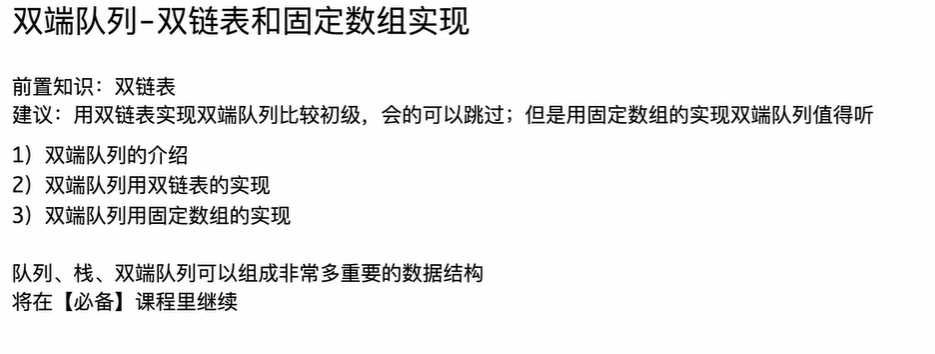

```java
package class016;

import java.util.Deque;
import java.util.LinkedList;

// 设计循环双端队列
// 测试链接 : https://leetcode.cn/problems/design-circular-deque/
public class CircularDeque {

	// 提交时把类名、构造方法改成 : MyCircularDeque
	// 其实内部就是双向链表
	// 常数操作慢，但是leetcode数据量太小了，所以看不出劣势
	class MyCircularDeque1 {

		public Deque<Integer> deque = new LinkedList<>();
		public int size;
		public int limit;

		public MyCircularDeque1(int k) {
			size = 0;
			limit = k;
		}

		public boolean insertFront(int value) {
			if (isFull()) {
				return false;
			} else {
				deque.offerFirst(value);
				size++;
				return true;
			}
		}

		public boolean insertLast(int value) {
			if (isFull()) {
				return false;
			} else {
				deque.offerLast(value);
				size++;
				return true;
			}
		}

		public boolean deleteFront() {
			if (isEmpty()) {
				return false;
			} else {
				size--;
				deque.pollFirst();
				return true;
			}
		}

		public boolean deleteLast() {
			if (isEmpty()) {
				return false;
			} else {
				size--;
				deque.pollLast();
				return true;
			}
		}

		public int getFront() {
			if (isEmpty()) {
				return -1;
			} else {
				return deque.peekFirst();
			}
		}

		public int getRear() {
			if (isEmpty()) {
				return -1;
			} else {
				return deque.peekLast();
			}
		}

		public boolean isEmpty() {
			return size == 0;
		}

		public boolean isFull() {
			return size == limit;
		}

	}

	// 提交时把类名、构造方法改成 : MyCircularDeque
	// 自己用数组实现，常数操作快，但是leetcode数据量太小了，看不出优势
	class MyCircularDeque2 {

		public int[] deque;
		public int l, r, size, limit;

		public MyCircularDeque2(int k) {
			deque = new int[k];
			l = r = size = 0;
			limit = k;
		}

		public boolean insertFront(int value) {
			if (isFull()) {
				return false;
			} else {
				if (isEmpty()) {
					l = r = 0;
					deque[0] = value;
				} else {
					l = l == 0 ? (limit - 1) : (l - 1);
					deque[l] = value;
				}
				size++;
				return true;
			}
		}

		public boolean insertLast(int value) {
			if (isFull()) {
				return false;
			} else {
				if (isEmpty()) {
					l = r = 0;
					deque[0] = value;
				} else {
					r = r == limit - 1 ? 0 : (r + 1);
					deque[r] = value;
				}
				size++;
				return true;
			}
		}

		public boolean deleteFront() {
			if (isEmpty()) {
				return false;
			} else {
				l = (l == limit - 1) ? 0 : (l + 1);
				size--;
				return true;
			}
		}

		public boolean deleteLast() {
			if (isEmpty()) {
				return false;
			} else {
				r = r == 0 ? (limit - 1) : (r - 1);
				size--;
				return true;
			}
		}

		public int getFront() {
			if (isEmpty()) {
				return -1;
			} else {
				return deque[l];
			}
		}

		public int getRear() {
			if (isEmpty()) {
				return -1;
			} else {
				return deque[r];
			}
		}

		public boolean isEmpty() {
			return size == 0;
		}

		public boolean isFull() {
			return size == limit;
		}

	}

}
```

# C++实现（双端队列deque<int> 和 数组vector<int> 实现）

这是一份非常经典的“循环双端队列”实现。我将为你提供对应的 C++ 版本，分为两个类：一个利用 STL 容器（对应 Java 的 LinkedList 版本），另一个利用数组模拟（对应 Java 的数组版本）。

随后，我会针对这份代码，为你补充一些关键的 C++ 知识点，特别是与 Java 的区别以及 C++ 特有的优化技巧。

### C++ 版本代码实现

C++

```C++
#include <iostream>
#include <deque>
#include <vector>

using namespace std;

// 方案一：使用 C++ STL 的 std::deque 实现
// 对应 Java 中的 MyCircularDeque1 (使用 LinkedList)
// C++ 的 std::deque (双端队列) 底层通常由分段连续内存组成，比 Java 的 LinkedList (双向链表) 缓存命中率更高
class MyCircularDeque1 {
private:
    std::deque<int> dq;
    int limit;

public:
    MyCircularDeque1(int k) {
        limit = k;
    }

    bool insertFront(int value) {
        if (isFull()) {
            return false;
        }
        dq.push_front(value);
        return true;
    }

    bool insertLast(int value) {
        if (isFull()) {
            return false;
        }
        dq.push_back(value);
        return true;
    }

    bool deleteFront() {
        if (isEmpty()) {
            return false;
        }
        dq.pop_front();
        return true;
    }

    bool deleteLast() {
        if (isEmpty()) {
            return false;
        }
        dq.pop_back();
        return true;
    }

    int getFront() {
        if (isEmpty()) {
            return -1;
        }
        return dq.front();
    }

    int getRear() {
        if (isEmpty()) {
            return -1;
        }
        return dq.back();
    }

    bool isEmpty() {
        return dq.empty();
    }

    bool isFull() {
        return dq.size() == limit;
    }
};

// 方案二：使用数组（std::vector）自己实现
// 对应 Java 中的 MyCircularDeque2
// 常数操作最快，手动管理下标
class MyCircularDeque2 {
private:
    vector<int> dequeArr; // 使用 vector 替代原生数组，自动管理内存
    int l, r, size, limit;

public:
    MyCircularDeque2(int k) {   //补充：下面的提问1有构造函数初始化列表的写法，这样的写法更加简洁，推荐这种写法
        dequeArr.resize(k); // 分配空间
        l = 0;
        r = 0;
        size = 0;
        limit = k;
    }

    bool insertFront(int value) {
        if (isFull()) {
            return false;
        }
        if (isEmpty()) {
            l = r = 0;
            dequeArr[0] = value;
        } else {
            // C++ 中可以利用三目运算符，也可以利用取模技巧（下面扩展知识会讲）
            l = (l == 0) ? (limit - 1) : (l - 1);
            dequeArr[l] = value;
        }
        size++;
        return true;
    }

    bool insertLast(int value) {
        if (isFull()) {
            return false;
        }
        if (isEmpty()) {
            l = r = 0;
            dequeArr[0] = value;
        } else {
            r = (r == limit - 1) ? 0 : (r + 1);
            dequeArr[r] = value;
        }
        size++;
        return true;
    }

    bool deleteFront() {
        if (isEmpty()) {
            return false;
        }
        // 不需要真正的删除数据，只需要移动指针和减少 size
        l = (l == limit - 1) ? 0 : (l + 1);
        size--;
        return true;
    }

    bool deleteLast() {
        if (isEmpty()) {
            return false;
        }
        r = (r == 0) ? (limit - 1) : (r - 1);
        size--;
        return true;
    }

    int getFront() {
        if (isEmpty()) {
            return -1;
        }
        return dequeArr[l];
    }

    int getRear() {
        if (isEmpty()) {
            return -1;
        }
        return dequeArr[r];
    }

    bool isEmpty() {
        return size == 0;
    }

    bool isFull() {
        return size == limit;
    }
};
```

------

### C++ 知识点补充与扩展

针对这份代码，从 Java 转到 C++，有几个核心的底层差异和优化技巧值得注意：

#### 1. 底层数据结构的差异：`std::deque` vs Java `LinkedList`

在 Java 代码中，你使用了 `LinkedList` 来作为代理。

- **Java:** `LinkedList` 是真正的**双向链表**。每个节点都在堆上单独分配，节点之间通过引用连接。这意味着内存是不连续的，CPU 缓存命中率（Cache Locality）较低。
- **C++:** 虽然代码中我使用了 `std::deque`（双端队列），但 C++ 的 `std::deque` **不是链表**。它通常实现为**分段连续数组**（也就是一堆小数组通过一个中控映射器连接起来）。
  - **优势：** 它的随机访问性能优于链表，且支持头尾 $O(1)$ 的插入删除。
  - **注意：** 如果你需要纯粹的双向链表，C++ 中对应的是 `std::list`。但在算法题中，`std::deque` 或 `std::vector` 几乎总是优于 `std::list`。

#### 2. 内存管理：RAII 机制

- **Java:** `int[] deque = new int[k];` 这是一个引用，数组在堆上，由垃圾回收器（GC）管理。
- **C++:** 我使用了 `vector<int> dequeArr;`。
  - 在 C++ 类中，当 `MyCircularDeque2` 对象销毁时，成员变量 `dequeArr` 的析构函数会自动调用，释放其占用的堆内存。
  - 这被称为 **RAII (资源获取即初始化)**。你不需要像在 C 语言中那样手动写 `free`，也不需要像 Java 那样依赖不确定的 GC。

#### 3. 数组下标的“取模”运算技巧 (位运算优化)

在代码中，我们处理循环索引时使用了三目运算符：

C++

```C++
l = (l == 0) ? (limit - 1) : (l - 1);
```

在 C++ 高性能编程或算法竞赛中，我们通常喜欢用数学方式让逻辑更紧凑。

**向后移动（对应 insertLast / deleteFront）：**

C++

```C++
// 原写法
r = (r == limit - 1) ? 0 : (r + 1);
// 模运算写法
r = (r + 1) % limit; 
```

向前移动（对应 insertFront / deleteLast）：

C++ 的 % 运算符对负数的处理与数学定义不同（它可能返回负数），所以不能直接写 (l - 1) % limit。通用写法是：

C++

```C++
// 原写法
l = (l == 0) ? (limit - 1) : (l - 1);
// 模运算通用写法
l = (l - 1 + limit) % limit;
```

这种写法避免了分支判断（if/else 或 ?:），在现代 CPU 流水线上可能略微高效一点，且代码看起来更“数学化”。

#### 4. `size` 变量的必要性与“假溢出”

在你的实现中，通过 size 变量来判断 isEmpty 和 isFull。这是最直观的方法。

如果不维护 size 变量，仅靠 l 和 r 的相对位置来判断空或满，会遇到一个经典问题：无法区分空队列和满队列。

- 通常的解决办法是：**浪费一个数组空间**。
  - `l == r` 表示空。
  - `(r + 1) % limit == l` 表示满。
  - 这样数组实际只能存 `limit - 1` 个元素。
- **你的做法（维护 `size`）**：好处是能把数组用满（利用率 100%），逻辑也更符合直觉。坏处是多维护了一个变量，在多线程环境下（虽然这里是单线程算法题）更新 `size` 可能会成为竞争热点。

#### 5. `vector` 的 `.resize()` vs `.reserve()`

在 `MyCircularDeque2` 的构造函数中：

C++

```C++
dequeArr.resize(k); // 这里使用 resize
```

- `resize(k)`: 真正分配内存，并且**构造**了 k 个初始值为 0 的元素。此时 `dequeArr[k-1]` 是合法的。

- reserve(k): 仅仅分配内存容量，不创建元素。此时访问 dequeArr[0] 是未定义行为（非法）。

  对于这种模拟定长数组的场景，必须使用 resize。


# 补充（dequeue 为 double — edge — queue，这也是双端队列名字的由来）

# 补充提问

## 提问1（de.resize( )在构造函数的理解 与 构造函数初始化列表的形式  )

<span style="color:#FF0000; background:#00FF80; border:1px solid #FF00FF;">构造函数不是不会开辟空间，只进行初始化的任务吗，为什么在构造函数里可以对C++中标准库例如 dequeue<int> deq，调用deq.resize(K)来为其开辟堆空间呢，而deq这个对象本身所占用的空间以及其初始化由系统自动确定，在构造函数前已经开辟好了，而像int、double这样的基本类型系统不会自动赋初值，可能会有脏数据，故需要对其在构造函数里面进行初始化。我的理解对吗，还有哪里需要补充的吗。</span>

你的理解**非常接近核心本质**，但有一块关键的拼图（关于**对象生命周期的执行顺序**和**内存模型的“两层性”**）需要补全。

为了让你彻底通透，我把你目前的理解拆解成三个部分来回应，重点修正第一点：

### 1. 核心误区：构造函数里为什么能调用 `deq.resize(K)`？

**你的疑惑**：

> "deq 这个对象本身所占用的空间...在构造函数前已经开辟好了...为什么在构造函数里可以调用 resize 开辟堆空间？"

答案：

是因为<span style="border:1px solid #FF00FF; color:#FF0000;">在你的构造函数大括号 { 开始执行之前，成员变量 deq 的默认构造函数就已经被系统默默调用过了！</span>

在 C++ 中，一个对象的创建过程是极其严格的，顺序如下：

1. **分配内存**：系统在栈上（或堆上，取决于你怎么创建 `MyCircularDeque`）为整个 `MyCircularDeque` 类分配内存。
   - 这时候，`int` 类型的 `l, r` 只是占了坑，里面是脏数据。
   - `std::deque` 类型的 `deq` 也占了坑（大概几十个字节，用来存它的内部指针、大小等控制信息）。
2. **成员变量初始化（关键步骤）**：
   - <span style="color:#FF0000; background:#00FF80; border:1px solid #FF00FF;">在进入 `MyCircularDeque` 构造函数的函数体 `{ ... }` 之前，编译器会**自动**调用所有非基本类型成员（如 `std::deque`, `std::vector`, `std::string`）的**默认构造函数**。</span>
   - <span style="color:#FF0000; background:#00FF80; border:1px solid #FF00FF;">此时，`deq` 已经是一个**合法的、活着的对象**了，只不过它的状态是“空”（size=0）。</span>
3. **执行构造函数体**：
   - 现在进入了 `{ ... }`。
   - <span style="color:#FF0000; background:#00FF80; border:1px solid #FF00FF;">因为 `deq` 已经是活的对象，所以你完全可以调用 `deq.resize(k)`。这就好比你买了一个钱包（步骤2完成），打开钱包发现是空的，然后你手动往里面塞钱（步骤3调用 resize）。</span>

### 2. 深入理解：两层内存模型（栈 vs 堆）

你提到了“开辟空间”，这里需要把空间分为两层来看：

- **第一层：控制层（栈/对象本身）**
  - 这是 `deq` 变量本身占用的空间。它很小（通常只包含 3 个指针：start, finish, end_of_storage）。
  - 这就好比一个**遥控器**。
  - 这部分空间确实如你所说，“在构造函数前由系统自动确定并开辟好了”。
- **第二层：数据层（堆）**
  - 这是 `deq` 真正存放 `int` 数据的地方。
  - 这就好比**电视机**。
  - 默认构造通过后，你有一个“遥控器”，但还没对应任何“电视机画面”。
  - <span style="color:#FF0000; background:#00FF80; border:1px solid #FF00FF;">当你调用 `deq.resize(k)` 时，`deq` 内部的指针会指向一块新申请的**堆内存**。</span>

总结你的疑问：

你在构造函数里调用的 resize，并不是在创建“遥控器”（遥控器早就在步骤2做好了），而是在命令这个遥控器去“买一台电视机”（申请堆内存）并管理它。

### 3. 补充知识：C++ 的最佳实践（初始化列表）

虽然你在构造函数体里写 `deq.resize(k)` 是完全合法的，但在 C++ 中，我们通常认为这不是最高效或最“地道”的写法。

<span style="color:#FF0000; background:#00FF80; border:1px solid #FF00FF;">**不太地道的写法（当前写法）：**</span>

C++

```C++
class MyCircularDeque {
    deque<int> deq; // 成员变量
public:
    MyCircularDeque(int k) {
        // 1. 此时 deq 已经默认构造完了（空容器）
        deq.resize(k); // 2. 这里是“修改”它，让它重新分配内存
    }
};
```

<span style="color:#FF0000; background:#00FF80; border:1px solid #FF00FF;">最地道的写法（成员初始化列表 Member Initializer List）：</span>

我们应该尽量利用“步骤 2”（成员初始化阶段），<span style="color:#FF0000; background:#00FF80; border:1px solid #FF00FF;">直接告诉编译器：“不要先造一个空的再改大小，请直接造一个大小为 k 的容器”。</span>

C++

```C++
class MyCircularDeque {
    deque<int> deq;
    int limit;
public:
    // 冒号后面的就是初始化列表
    // 这里直接调用 std::deque 的带参构造函数
    MyCircularDeque(int k) : deq(k), limit(k) { 
        // 函数体可以是空的
        // 此时 deq 已经在那边初始化好了，包含了 k 个 0
    }
};
```

### 4. 关于基本类型（int, double）

你的理解非常正确：

> "像int、double这样的基本类型系统不会自动赋初值，可能会有脏数据，故需要对其在构造函数里面进行初始化。"

补充一点：

<span style="color:#FF0000; background:#00FF80; border:1px solid #FF00FF;">这也同样推荐写在初始化列表里，虽然对于 int 来说，写在列表里和写在函数体里性能没区别（生成的汇编代码往往一样），但为了统一风格，C++ 程序员通常这样写：</span>

C++

```C++
class MyCircularDeque2 {
    vector<int> dequeArr;
    int l, r, size, limit;

public:
    // 推荐写法：全部在冒号后面搞定
    MyCircularDeque2(int k) : dequeArr(k), l(0), r(0), size(0), limit(k) {
        // 这里的 dequeArr(k) 等价于 vector 的构造函数 vector(k)
        // 这里的 l(0) 等价于 l = 0
    }
};
```

### 总结

你的理解打分：**90分**。

- **对的地方**：基本类型不自动初始化会有脏数据；对象本身的空间在构造函数体执行前就有了。
- **需要微调的地方**：`deq.resize(k)` 不是在“创建对象”，而是在“操作一个已存在的对象去管理堆内存”。
- **下一步进阶**：<span style="color:#FF0000; background:#00FF80; border:1px solid #FF00FF;">试着习惯使用**初始化列表 (`:`)**，这是 C++ 区别于 Java 构造函数的一个重要语法特征。</span>


# 补充提问（双端队列deque<int> 与双向链表list<int> 的操作总结）

## 提问1（双端队列 deque<int> 与 双向链表list<int> 的操作）

<span style="color:#FF0000; background:#00FF80; border:1px solid #FF00FF; font-size:1.3em;">双端队列deque<int> 与双向链表list<int> 的操作都是有哪些呢，给我分类总结下。</span>

这是一个非常棒的问题。`std::deque`（双端队列）和 `std::list`（双向链表）在功能上有重叠（都能在头尾操作），但它们的**底层结构完全不同**，因此它们支持的操作集合（API）和性能特性也有显著区别。

为了帮你理清思路，我将它们的操作分为 **“共有操作”**、**“Deque 独有/优势操作”** 和 **“List 独有/特殊操作”** 三类来总结。

------

### 1. 共有操作 (标准容器接口)

这些操作两者的函数名完全一样，语义也基本一致。

#### A. 增删改（头尾操作）

这是双端队列的核心功能，两者的这些操作时间复杂度都是 $O(1)$。

| **操作类别** | **函数名**               | **描述**                         |
| ------------ | ------------------------ | -------------------------------- |
| **头部插入** | `push_front(val)`        | 在头部添加元素（拷贝/移动）      |
|              | `emplace_front(args...)` | 在头部**原地构造**元素（更高效） |
| **尾部插入** | `push_back(val)`         | 在尾部添加元素                   |
|              | `emplace_back(args...)`  | 在尾部**原地构造**元素           |
| **头部删除** | `pop_front()`            | 删除头部元素（无返回值）         |
| **尾部删除** | `pop_back()`             | 删除尾部元素（无返回值）         |

#### B. 访问首尾

| **函数名** | **描述**           | **注意**                         |
| ---------- | ------------------ | -------------------------------- |
| `front()`  | 返回头部元素的引用 | 如果容器为空，行为未定义（会崩） |
| `back()`   | 返回尾部元素的引用 | 同上                             |

#### C. 通用查询与清理

| **函数名**  | **描述**                       |
| ----------- | ------------------------------ |
| `empty()`   | 判断是否为空                   |
| `size()`    | 返回元素个数                   |
| `clear()`   | 清空所有元素                   |
| `resize(n)` | 改变容器大小（多的删，少的补） |

------

### 2. Deque 独有/核心优势操作 (随机访问)

`std::deque` 的底层是**分段连续数组**，它模拟了类似 `vector` 的行为。

#### A. 随机访问 (Random Access) - **这是 List 绝对做不到的**

List 是不支持下标访问的，必须从头遍历。而 Deque 可以像数组一样用下标。

| **操作**         | **描述**                                | **复杂度** |
| ---------------- | --------------------------------------- | ---------- |
| **`operator[]`** | 如 `dq[5]`。不检查越界，速度快。        | $O(1)$     |
| **`at(i)`**      | 如 `dq.at(5)`。带越界检查，越界抛异常。 | $O(1)$     |

#### B. 迭代器算术

Deque 的迭代器是 **Random Access Iterator**，功能最强。

C++

```
auto it = dq.begin();
it = it + 5; // 合法！直接跳5格
```

*List 的迭代器只能 `++` 或 `--`，不能 `+5`。*

------

### 3. List 独有/特殊操作 (链表特技)

`std::list` 的底层是**双向链表**（节点不连续，靠指针连）。它有一些专门针对链表特性的“骚操作”，这些操作通常涉及节点指针的重新链接，而不需要拷贝数据。

**注意：这些操作在 Deque 中要么不存在，要么效率极低。**

#### A. 接合 (Splicing) - List 的杀手锏

可以将一个 list 的节点直接“剪切”并“粘贴”到另一个 list 中，不需要复制数据，只是改改指针。

- `splice(pos, other_list)`: 把 `other_list` 的所有元素移动到当前 list 的 `pos` 位置。
- `splice(pos, other_list, it)`: 移动单个元素。

#### B. 专用移除与去重

由于 List 移除中间元素不需要移动后续元素（只需改指针），所以它提供了内置的高效方法：

- `remove(val)`: 删除所有等于 `val` 的元素。

- `remove_if(pred)`: 删除所有满足条件的元素。

- unique(): 删除连续的重复元素（通常先排序再调用）。

  (在 Deque 或 Vector 中，做这些通常需要配合 std::remove 算法 + erase，也就是所谓的 Erase-Remove Idiom，比较麻烦)

#### C. 专用排序与合并

由于 std::sort 算法要求“随机访问迭代器”（能跳跃访问），所以 std::sort(list.begin(), list.end()) 会编译报错。

List 必须使用自带的成员函数：

- `list.sort()`: 内部实现了适合链表的归并排序 ($O(N \log N)$)。
- `list.merge(other_list)`: 将两个**已排序**的 list 合并（归并排序的一步），合并后 `other_list` 变空。
- `list.reverse()`: 翻转链表（极快，因为只是把所有节点的 prev 和 next 指针互换一下）。

------

### 4. 总结：性能与选择指南

| **特性**       | **std::deque**                 | **std::list**                            |
| -------------- | ------------------------------ | ---------------------------------------- |
| **底层结构**   | 分段连续数组 (中控器 + 数据块) | 双向链表 (节点分散在堆内存)              |
| **下标访问**   | **支持 $O(1)$**                | 不支持                                   |
| **头尾插入**   | 非常快                         | 非常快                                   |
| **中间插入**   | 慢 $O(N)$ (涉及到数据搬移)     | **快 $O(1)$** (前提是已经有了迭代器位置) |
| **内存效率**   | 高 (利用率较好，少量管理开销)  | 低 (每个 int 都要额外存 2 个指针)        |
| **缓存友好性** | **较好** (局部连续)            | **差** (节点跳跃，Cache Miss 高)         |
| **迭代器失效** | 插入中间会失效                 | 插入删除**永远不会**导致其他迭代器失效   |

### 什么时候用谁？

1. **首选 `std::deque`**：
   - 如果你需要两端频繁操作。
   - 如果你偶尔需要用下标 `index` 访问中间的元素。
   - <span style="color:#FF0000;">**现代 C++ 的默认原则**：除非你有极强的理由用 List，否则优先选 Deque 或 Vector。因为 CPU 缓存对连续内存（Deque/Vector）非常友好，而对链表（List）很不友好。即使 List 理论上中间插入是 $O(1)$，但在小数据量下，Deque 的移动可能比 List 的指针操作加缓存未命中还要快。</span>
2. **选用 `std::list`**：
   - 如果你需要在遍历过程中，**频繁地**在**中间位置**插入或删除元素。
   - 如果你需要**接合 (Splice)** 功能（把一大段数据从一个容器瞬间移到另一个）。
   - 如果你对**迭代器稳定性**有极高要求（要求删除了 A 元素，指向 B 元素的迭代器绝对不能失效）。


## 提问2（双端队列deque<int> 和 双向链表list<int> 在内存布局上的区别）

<span style="color:#FF0000; background:#00FF80; border:1px solid #FF00FF; font-size:1.2em;">双端队列deque<int> 和 双向链表list<int> 在内存布局上有什么不同呢，我不是太懂，你能够给我详细解释下吗。</span>

这两个容器在内存布局上的差异是本质性的，理解了这一点，你就能明白<span style="color:#FF0000; background:#00FF80; border:1px solid #FF00FF;">为什么 `deque` 既支持随机访问（下标）又支持头尾高效插入</span>，而<span style="color:#FF0000; background:#00FF80; border:1px solid #FF00FF;"> `list` 却只擅长中间插入。</span>

我们可以把内存布局想象成**数据的存放方式**。

### 1. `std::list<int>`：零散的链条 (Doubly Linked List)

`std::list` 是最典型的<span style="color:#FF0000; background:#00FF80; border:1px solid #FF00FF;">**双向链表**。</span>

- **内存形态：** **完全零散（Scattered）**。
- **节点结构：** 你存的一个 `int`，在内存里并不仅仅是一个 `int`。它会被包装成一个**节点 (Node)**。这个节点通常包含三个部分：
  1. `prev` 指针：指向前一个节点。
  2. `next` 指针：指向后一个节点。
  3. `data`：真正存放你的 `int` 数据。
- **布局特点：**
  - 每个节点都是独立在**堆 (Heap)** 上申请的。
  - 节点与节点在物理内存地址上**可能相隔十万八千里**。
  - 它们唯一的联系就是通过指针“指”着对方。

形象比喻：

想象你在玩一个寻宝游戏。每个线索（节点）都藏在公园的不同角落。你找到了一个线索，上面写着你的数据（int），同时写着下一个线索的坐标（next 指针）。你必须跑过去才能拿到下一个数据。

**缺点：**

- **空间浪费大：** 在 64 位系统上，两个指针就要占 16 字节，而你的数据可能才 4 字节。买椟还珠，包装比肉还贵。
- **CPU 缓存极不友好：** CPU 读取内存时喜欢一次读一块连续的数据。因为 `list` 的节点到处乱跑，CPU 很难预测下一个数据在哪里，导致缓存命中率极低（Cache Miss），遍历速度慢。

------

### 2. `std::deque<int>`：分段的数组 (Segmented Array)

`std::deque` 的全称是 **Double-Ended Queue**，它的实现非常巧妙，是一种**分段连续**的结构。它<span style="color:#FF0000; background:#00FF80; border:1px solid #FF00FF;">试图结合“数组”和“链表”的优点。</span>

- **内存形态：** **分段连续（Piecewise Continuous）**。
- **核心结构：** 它由两部分组成：
  1. **中控器 (Map)：** 这是一个小型的连续数组，里面存放的是**指针**。每个指针指向一块独立的数据缓冲区。
  2. **缓冲区 (Buffer / Node)：** 这才是真正存数据的地方。通常是固定大小的数组（例如，一块存 512 字节，或者存 8 个 `int`）。
- **布局特点：**
  - 数据不是像 `vector` 那样全部挤在一块巨大的连续内存里，也不是像 `list` 那样彻底散开。
  - 它是**一块一块**的。每一块内部是连续的（数组），但块与块之间是不连续的。
  - **中控器**负责把这些散落的块“逻辑上”连起来。

形象比喻：

想象一本活页笔记本。

- **中控器**就是笔记本的**目录页**，它告诉你第 1 页在哪里，第 2 页在哪里。
- **缓冲区**就是具体的**每一页纸**。
- 每一页纸上可以连续写很多行字（数据连续）。
- 如果这一页写满了，你就加一张新纸（分配新缓冲区），并在目录上记一笔。
- 如果你想看第 100 行字，通过目录算出它在第几页的第几行，直接翻过去就行（支持随机访问）。

**优点：**

- **支持随机访问：** 虽然不如 `vector` 直接，但 `deque` 可以通过计算（我是第几个 buffer 的第几个元素）快速定位，复杂度是 $O(1)$。
- **头尾插入极快：**
  - **尾部满了**：申请一个新的 buffer，挂在中控器后面。
  - **头部满了**：申请一个新的 buffer，挂在中控器前面。
  - 不需要像 `vector` 那样因为空间不足而把几百万个数据整体搬家。

------

### 3. 核心差异对比总结

为了让你一眼看懂，我列出了它们的详细对比：

| **特性**         | **std::list<int> (链表)**                   | **std::deque<int> (分段数组)**                        |
| ---------------- | ------------------------------------------- | ----------------------------------------------------- |
| **物理连续性**   | **完全不连续**                              | **局部连续** (Buffer 内部连续)                        |
| **单个元素开销** | **极大** (2个指针 + 1个数据 + 堆分配元数据) | **极小** (均摊下来几乎只有数据本身)                   |
| **访问方式**     | 只能顺藤摸瓜 (指针跳转)                     | 算术计算 (Map索引 + Buffer偏移)                       |
| **CPU 缓存**     | **差** (到处乱跳)                           | **良** (Buffer 内是连续读取的)                        |
| **内存分配次数** | 每插入一个元素，`new` 一次                  | 只有 Buffer 满时才 `new` 一次 (比如每 128 个元素一次) |
| **最适合场景**   | 需要在**中间**疯狂插入/删除                 | 需要在**头尾**频繁插入，且偶尔需要下标访问            |

给你的建议：

基于你之前的代码，std::deque 是实现循环队列的绝佳选择，因为它的内存布局天生就是为了头尾操作优化的，而且相比 list，它更省内存，速度更快。

## 提问3（双端队列deque<int> deq 和 双向链表list<int> deLinkList 中两个对象 deq 和 deLinkList 的理解）

<span style="color:#FF0000; background:#00FF80; border:1px solid #FF00FF;">双端队列deque<int> deq 和 双向链表list<int> deLinkList 中两个对象 deq 和 deLinkList，其中 deq 这个对象所占用的空间指向的就是堆内存中 中控器的首地址，而 deLinkList这个对象所占用空间指向的是堆内存中一篇连续的指针数组，每个指针指向一个节点。我的理解对吗，有没有需要补充的呢。</span>

你的理解中有**一半是对的（关于 Deque），但有一半存在严重的误解（关于 List）**。

特别是关于 `std::list` 的理解，你描述的“连续的指针数组”其实恰恰是 `std::deque` 的特征，而不是 `list` 的。

为了让你彻底搞清楚“栈上的对象（控制块）”里到底存了  什么，我把这两个对象“解剖”开给你看。

------

### 1. 纠正 `std::list<int> deLinkList` 的误区

**你的理解**：

> "deLinkList这个对象所占用空间指向的是堆内存中一篇连续的指针数组，每个指针指向一个节点。" -> **❌这是错误的。**

实际情况：

std::list 绝对没有那个“连续的指针数组”。

- 栈上的 deLinkList 对象：

  它非常简单，<span style="color:#FF0000; background:#00FF80; border:1px solid #FF00FF;">通常只包含一个指针（指向“哨兵节点”或头节点）和一个整数（记录 size）</span>。

  - 它就像是一个人手里拿着**绳头**。

- 堆上的数据：

  数据节点是一个连一个的。第一个节点里存着指向第二个节点的指针，第二个存着指向第三个的……

  - 它们之间没有一个“中央目录”来管理。

比喻修正：

std::list 是一串糖葫芦，或者一支登山队。

- <span style="color:#FF0000; background:#00FF80; border:1px solid #FF00FF;">**栈上的对象**：就是**队长**。队长只牵着第一个队员的手。</span>
- **堆上的节点**：第一个队员牵着第二个，第二个牵着第三个……
- **不存在**一个“名册表”（连续指针数组）直接指向每一个队员。如果你（队长）想找第 10 个队员，你必须通过第 1、2、3...9 个队员一个个问过去。

------

### 2. 完善 `std::deque<int> deq` 的理解

**你的理解**：

> "deq 这个对象所占用的空间指向的就是堆内存中 中控器的首地址" -> **✅ 接近正确，但不够完整。**

实际情况：

std::deque 的栈上对象（控制块）比你想象的要大且复杂。它不仅仅是指向中控器（Map），它还需要记录“当前数据用到哪儿了”。

为了支持 $O(1)$ 的头尾插入，`deq` 对象通常包含 **4 个关键信息**（也就是两个复杂的迭代器）：

1. **`map` 指针**：确实<span style="color:#FF0000; background:#00FF80; border:1px solid #FF00FF;">指向堆上的那个“中控器数组”（连续的指针数组）。</span>
2. **`map_size`**：<span style="color:#FF0000; background:#00FF80; border:1px solid #FF00FF;">中控器有多大</span>。
3. **`start` 迭代器**：记录**第一个有效元素**的位置。
   - 它指向哪个 Buffer？
   - 它在这个 Buffer 的第几个格子？
4. **`finish` 迭代器**：记录**最后一个有效元素**的位置。
   - 它指向哪个 Buffer？
   - 它在这个 Buffer 的第几个格子？

比喻修正：

std::deque 是一本活页书。

- **栈上的对象**：是你的**阅读记录卡**。
- 记录卡上写着：
  - “目录页”（Map）在哪里。
  - 我现在读到了**第 3 页**（Start Buffer）的**第 5 行**（cur）。
  - 这本书写到了**第 10 页**（Finish Buffer）的**第 8 行**（last）。
- <span style="color:#FF0000; background:#00FF80; border:1px solid #FF00FF;">**堆上的中控器**：这才是你刚才描述的 **“连续的指针数组”**，它存着每一页纸的地址。</span>

------

### 3. 终极对比图解

我把你描述的场景重新画一下，区分 **栈（Stack）** 和 **堆（Heap）**。

#### `std::list` (链表) 的真实布局

Plaintext

```
【栈 Stack】                  【堆 Heap】
+----------------+           +--------+      +--------+      +--------+
| deLinkList对象 |---------> | Node A | <--> | Node B | <--> | Node C |
+----------------+           +--------+      +--------+      +--------+
(只存绳头 + size)             (节点分散，通过自身内部指针互连)
                              (根本没有“指针数组”这种东西)
```

#### `std::deque` (双端队列) 的真实布局

Plaintext

```
【栈 Stack】                   【堆 Heap】
                              +--------------------------+
                              |   中控器 (Map Array)     | <--- 这就是你说的“连续指针数组”
+------------+       +------> | [Ptr1] [Ptr2] [Ptr3] ... |
|  deq 对象  |       |        +--|-------|---------------+
| 1. map指针 |-------+           |       |
| 2. start   |-------------------|------>+-----------+ (Buffer 2)
| 3. finish  |                   v       | 数据 数据 |
+------------+              +--------+   +-----------+
(存了整个控制面板)           | Buffer1|
                            | 数据...|
                            +--------+
```

### 总结你的误区

你把 `std::deque` 内部那个核心的 **“中控器（Map）”** 的结构（连续指针数组），张冠李戴记成了 `std::list` 的结构。

- **List** = 只有节点间的单线联系，没有中央数组。
- **Deque** = 有中央数组（Map）管理所有分块。


## 提问4（对双端队列 deque<int> deq 中对象deq成员迭代器start和finish的理解）

1. **`start` 迭代器**：记录**第一个有效元素**的位置。
   - 它指向哪个 Buffer？
   - 它在这个 Buffer 的第几个格子？
2. **`finish` 迭代器**：记录**最后一个有效元素**的位置。
   - 它指向哪个 Buffer？
   - 它在这个 Buffer 的第几个格子？

<span style="color:#FF0000; background:#00FF80; border:1px solid #FF00FF; font-size:1.2em;">上面这个双端队列 deque<int> deq 对象的这两个成员变量，即start迭代器和finish就是双端队列的队首指针和队尾指针吗，它们具体是如何定位内存中哪一个buffer，该buffer中哪一个格子的呢，我不是太懂，你能够给我详细解释下吗？</span>


这是一个非常深刻的问题！你问到了 `std::deque` 最核心的秘密。

你的直觉很敏锐：**`start` 和 `finish` 绝对不是简单的普通指针（例如 `int\*`）**。

如果它们只是 `int*`，当指针移动到当前 Buffer 的边缘时，它怎么知道下一个 Buffer 在内存的什么位置呢？因为 Buffer 和 Buffer 之间是不连续的。

所以，在 C++ 标准库（如 GCC STL）的实现中，`start` 和 `finish` 实际上是**结构体（Struct）或类**，我们称之为 **“智能迭代器”**。

为了让你看懂它们是如何“定位”的，我们需要拆解这个迭代器的内部结构。

------

### 1. 迭代器的“四指针”结构

一个 `std::deque` 的迭代器（无论是 `start` 还是 `finish`），它的肚子里面通常藏着 **4 个原生指针**。正是<span style="color:#FF0000; background:#00FF80; border:1px solid #FF00FF;">这 4 个指针配合工作，才实现了对“哪一个 Buffer”和“哪一个格子”的精准定位。</span>

我们可以把 `deque::iterator` 想象成下面这样一个结构体：

C++

```C++
struct __deque_iterator {
    // 1. 当前指向：指向当前 Buffer 中实际存储数据的那个格子
    T* cur;       

    // 2. 当前边界（左）：指向当前 Buffer 的起始地址
    T* first;     

    // 3. 当前边界（右）：指向当前 Buffer 的结束地址
    T* last;      

    // 4. 中控节点：指向“中控器（Map）”中的对应位置
    //    （告诉迭代器：我现在在第几个 Buffer）
    map_pointer node; 
};
```

#### 这 4 个指针的分工：

- **`cur` (Cursor)**：这是真正干活的。当你写 `*it` 获取值时，实际上就是返回 `*cur`。它直接指向数据。
- **`first` & `last` (Fence)**：这是**围栏**。它们定义了当前 Buffer 的范围。`cur` 只能在 `first` 和 `last` 之间移动。
- **`node` (GPS)**：这是**导航**。它不指向数据，而是指向**中控器数组（Map）**。通过它，迭代器知道自己属于“第几号 Buffer”，并且可以通过 `node + 1` 找到“下一号 Buffer”在哪里。

------

### 2. 它们如何“定位”？（图解流程）

回答你的问题：**“具体是如何定位内存中哪一个buffer，该buffer中哪一个格子的呢？”**

我们通过两个场景来演示这个过程。

#### 场景一：直接读取数据（定位格子）

这是<span style="color:#FF0000; background:#00FF80; border:1px solid #FF00FF;">最简单的。因为迭代器内部有一个 `cur` 指针。</span>

- **定位 Buffer**：不需要算，`node` 指针已经锁定了当前的 Buffer（在 Map 中的位置）。
- **定位格子**：不需要算，`cur` 指针直接就指着那个格子。
- **操作**：<span style="color:#FF0000; background:#00FF80; border:1px solid #FF00FF;">直接读取 `*cur`。</span>

#### 场景二：<span style="color:#FF0000; background:#00FF80; border:1px solid #FF00FF;">移动指针（跨越 Buffer 的定位）</span>

这是最复杂的。当你执行 `it++`（向后移动）时，迭代器内部会进行一次判断：

**步骤 A：尝试简单的移动**

1. 迭代器把内部的 `cur` 指针向后移一位 (`cur++`)。
2. **检查越界**：判断 `cur` 是否等于 `last`？
   - 如果不等于：说明还在同一个 Buffer 里，移动结束。
   - **如果等于**：说明走到当前 Buffer 的悬崖边了！必须跳到下一个 Buffer。

步骤 B：执行“跳跃”操作 (Buffer Jump)

一旦发现 cur == last，迭代器就会动用 node 指针来寻找新家：

1. **切换 Buffer**：`node` 指针向后移一位 (`node++`)。现在它指向中控器里的下一个格子了。
2. **获取新地址**：读取 `*node`，这就拿到了**下一个 Buffer 的首地址**。
3. **重置围栏**：
   - `first` 更新为新 Buffer 的首地址。
   - `last` 更新为 `first + buffer_size`。
4. **重置光标**：`cur` 更新为 `first`（指向新 Buffer 的第一个格子）。

------

### 3. 总结：Start 和 Finish 具体是什么？

回到你的代码环境：

- **`start` 迭代器**：
  - 它的 `node` 指向中控器中**存储第一个被使用的 Buffer** 的那个位置。
  - 它的 `cur` 指向该 Buffer 中**第一个有效元素**。
  - 它的 `first` 和 `last` 框住了这个 Buffer 的范围。
- **`finish` 迭代器**：
  - 它的 `node` 指向中控器中**存储最后一个被使用的 Buffer** 的那个位置。
  - 它的 `cur` 指向该 Buffer 中**最后一个有效元素的后面一个位置**（STL 习惯左闭右开区间）。

### 4. 举个生动的例子

想象你在读一套多卷本的小说（这套书就是 deque）。

书架上有一个目录单（Map），写着：

- 第 1 卷 -> 放桌子上
- 第 2 卷 -> 放床底下
- 第 3 卷 -> 放阳台上

你的手指（迭代器 `start`）现在指着**第 1 卷**的**第 5 页**。

- **`node`**：你的视线看着目录单上的“第 1 卷”。
- **`first` / `last`**：你知道第 1 卷是从第 1 页到第 100 页。
- **`cur`**：你的手指按在第 5 页。

**如何定位？**

- **定位哪一本（Buffer）**：看 `node`（目录单）。
- **定位哪一页（格子）**：看 `cur`（手指）。

当你读完第 1 卷（cur 到了 100 页）：

你会看一眼 node，把视线移到目录单的下一行（“第 2 卷”），然后跑去床底下把第 2 卷拿出来，把手指（cur）放到第 2 卷的第 1 页。

这就是 `deque` 迭代器“定位”和“跳转”的全部秘密。


## 提问5（双端队列 deque<int> deq 如何确定队首元素和队尾元素）

<span style="color:#FF0000; background:#00FF80; border:1px solid #FF00FF; font-size:1.2em;">这个双端队列deque<int> deq不是通过start或者last来确定队首和队尾的吗，那么我们是不是有什么方法确定队首元素和队尾元素呢，这样使用调用deq.front() 或者 deq.back() 的时候就可以获取到队首元素和队尾元素呢，我不是太懂，你能够给我详细解释下吗？</span>


没错，你的直觉非常准确！**`start` 和 `finish` 就是打开宝库大门的钥匙。**

但是，这里有一个 C++ STL 设计中非常重要、也是初学者最容易晕的规则：<span style="color:#FF0000; background:#00FF80; border:1px solid #FF00FF;">**“前闭后开”区间 (Half-open Interval)**。</span>

只要弄懂这个规则，你就完全明白了 `front()` 和 `back()` 是怎么实现的了。

------

### 1. 核心规则：前闭后开 `[start, finish)`

在 `std::deque`（以及几乎所有 C++ 容器）的内部实现中：

- **`start` 迭代器**：<span style="color:#FF0000; background:#00FF80; border:1px solid #FF00FF;">指向**第一个**有效元素（实打实的数据）。</span>
- **`finish` 迭代器**：<span style="color:#FF0000; border:1px solid #FF00FF; background:#00FF80;">指向**最后一个有效元素的后面一个位置**（空气/哨兵）。</span>

请看下面这个示意图（假设一个 Buffer 能存 4 个数）：

Plaintext

```
       [ 10,  20,  30,  __ ]   <-- 这是一个 Buffer
         ^              ^
         |              |
       start          finish
```

- `start.cur` 指向 `10`。
- `finish.cur` 指向 `__` (那个空的格子)。
- **注意**：`finish` **不指向** `30`！

------

### 2. `deq.front()` 的实现原理

这个非常简单直接。

<span style="color:#FF0000; background:#00FF80; border:1px solid #FF00FF;">因为 `start` 迭代器里的 `cur` 指针，本身就正正好好指着第一个数据。</span>

**伪代码实现：**

C++

```C++
// 对应 deq.front()
reference front() {
    // 这里的 *start 实际上是调用了迭代器的 operator* 重载
    // 它内部做的事情就是返回 *start.cur
    return *start; 
}
```

**底层动作：**

1. 找到 `start` 迭代器。
2. 拿出里面的 `cur` 指针。
3. 直接读取内存：`return *cur;`。
4. **搞定。**

------

### 3. `deq.back()` 的实现原理（重点！）

这个稍微绕一点。

因为 `finish` 指向的是“最后一个元素的后面”，也就是“无效位置”。如果你直接读取 `*finish`，可能会读到乱码或者导致程序崩溃。

所以，`back()` 必须由 `finish` **往回退一步** 才能找到数据。

**伪代码实现：**

C++

```C++
// 对应 deq.back()
reference back() {
    iterator temp = finish; // 1. 先拿到 finish
    temp--;                 // 2. 让它往回退一格 (调用迭代器的 operator--)
    return *temp;           // 3. 返回退格后的那个值
}
```

**底层动作（这里的 `temp--` 发生了什么？）：**

这就用到了我们上一轮说的“智能迭代器”逻辑：

- 情况 A（简单）：

  如果 finish.cur 不是 Buffer 的开头，那么直接 cur--。

  - *例子：* `[10, 20, 30, (finish)]` -> `finish` 退一步指到 `30`。

- 情况 B（跨 Buffer）：

  如果 finish.cur 刚好在一个新 Buffer 的开头（意味着上一个 Buffer 填满了），那么 temp-- 会触发“跳跃”：

  1. `node` 指针向前移一格（回到上一个 Buffer 的目录）。
  2. 找到上一个 Buffer 的 `last` 地址。
  3. `cur` 指向那个 Buffer 的最后一个格子。

------

### 4. 总结图解

假设我们有两个 Buffer，数据是 `1, 2, 3, 4, 5`。

Plaintext

```
Map (中控器)
  |
  +---> Buffer A: [ 1,  2,  3,  4 ]
  |                 ^
  |               start (指向 1)
  |
  +---> Buffer B: [ 5,  _,  _,  _ ]
                        ^
                      finish (指向 5 后面的空位)
```

**当调用 `front()` 时：**

1. 系统看 `start`。
2. `start.cur` 指向 `1`。
3. 返回 **1**。

**当调用 `back()` 时：**

1. 系统看 `finish`。
2. `finish` 指向 Buffer B 的第 2 个格子（空）。
3. 系统做减法：`finish - 1`。
4. 指针回退一格，指向 Buffer B 的第 1 个格子（即 `5`）。
5. 返回 **5**。

### 结论

- **确定队首**：直接解引用 `start` 迭代器。
- **确定队尾**：解引用 `finish - 1`（即 `finish` 的前一个位置）。

这就是为什么 C++ 的迭代器设计虽然复杂，但逻辑非常严密，保证了头尾操作都能精确找到内存地址。


# 补充提问（双端队列deque<int>等关于resize(k)的问题）

## 提问1（双端队列使用deque<int> 使用resize(k)在堆空间申请k个数据空间）

<span style="color:#FF0000; background:#00FF80; border:1px solid #FF00FF; font-size:1.1em;">双端队列deque<int> deq，当我使用deq.resize(k)，之后箱相当于是给在堆空间中申请了k个数据空间吧，这k个空间有默认值吗（如果有的话默认值是0吗），如果为deque<student> deq呢，此时的若有默认值的话又是什么呢，难道都是0吗，我不是太懂，你能够给我详细解释下吗？</span>

这是一个非常关键的问题，触及到了 C++ 中**内存分配**与**对象构造**的核心机制。

你的理解大方向是对的：`deq.resize(k)` 确实会在堆空间（Heap）的缓冲区中为你“圈”出 $k$ 个位置。

但是，<span style="border:1px solid #FF00FF; color:#FF0000;">关于“默认值是不是 0”，情况比你想象的要复杂一点点。C++ 对于**基本类型**（如 `int`）和**自定义类型**（如 `Student`）的处理规则是不同的。</span>

我来为你详细拆解这两种情况：

------

### 1. 对于 `deque<int>` （基本数据类型）

**结论：是的，默认值绝对是 0。**

当你调用 deq.resize(k) 时，C++ 标准库会对这 $k$ 个新元素执行 值初始化 (Value Initialization)。

对于 int、double、char 等内置基本类型，值初始化意味着 零初始化 (Zero Initialization)。

- **内存视角**：系统不仅在堆上划拨了 $k$ 个 `int` 的内存空间，还勤快地把这块内存全部用 0 填满了。

- **代码验证**：

  C++

  ```C++
  deque<int> deq;
  deq.resize(5); 
  // 此时 deq 里的内容就是：{0, 0, 0, 0, 0}
  // 绝对不会是随机乱码。
  ```

对比（重要）：

这和你在函数里写 int a; 是两码事！

- `int a;`（在栈上）：如果不赋值，`a` 的值是**未定义的（随机垃圾值）**。
- `resize()`（在容器里）：C++ 容器为了安全，默认会帮你清零。

------

### 2. 对于 `deque<Student>` （自定义结构体/类）

**结论：<span style="color:#FF0000; background:#00FF80; border:1px solid #FF00FF;">不一定是 0，取决于你的“构造函数”怎么写。</span>**

当你调用 `deq.resize(k)` 时，编译器会把它翻译成：

> “<span style="color:#FF0000; background:#00FF80; border:1px solid #FF00FF;">请在堆上开辟 $k$ 个内存块，并对每一个内存块**调用 Student 的无参构造函数 `Student()`**。</span>”

这时候，<span style="color:#FF0000; background:#00FF80; border:1px solid #FF00FF;">`Student` 对象里的成员变量（比如 `age`, `score`）变成什么值，全看这个构造函数干了什么。</span>

我们分三种情况来看，这三种情况也是新手最容易晕的地方：

#### 情况 A：你什么构造函数都没写（最纯粹的结构体）

C++

```C++
struct Student {
    int age;
    int score;
};
// 没写任何构造函数

deque<Student> deq;
deq.resize(3);
```

- **结果**：<span style="color:#FF0000; background:#00FF80; border:1px solid #FF00FF;">**通常是 0**。</span>
- **原理**：在 C++11 及以后，如果类是“平凡的”（Plain Old Data），`resize` 触发的值初始化会退化为零初始化。所以 `age` 和 `score` 大概率会被置为 0。

#### 情况 B：你写了构造函数，但没给变量赋值（最危险的陷阱！）

这是最容易翻车的情况：

C++

```C++
struct Student {
    int age;
    int score;

    // 你手动写了一个构造函数，但是是个空壳子
    Student() { 
        // 里面啥也没写！
    }
};

deque<Student> deq;
deq.resize(3);
```

- **结果**：<span style="color:#FF0000; background:#00FF80; border:1px solid #FF00FF;">**随机值（脏数据）！**</span>
- **原理**：`resize` 乖乖调用了你的 `Student()`。但是你的函数体是空的，所以 `age` 和 `score` 只是占据了内存，没有被初始化。它们的值就是这块堆内存里上一次遗留下来的垃圾数据（可能是 -842150451 这种乱码）。

#### 情况 C：你写了构造函数，并赋了初值（推荐做法）

C++

```C++
struct Student {
    int age;
    int score;

    Student() { 
        age = 18;
        score = 100;
    }
};

deque<Student> deq;
deq.resize(3);
```

- **结果**：<span style="color:#FF0000; background:#00FF80; border:1px solid #FF00FF;">**全都不是 0**。`age` 全是 18，`score` 全是 100。</span>
- **原理**：因为构造函数明确规定了初始值。

------

### 3. 特殊情况：编译报错

如果你只写了**带参数**的构造函数，没写无参的：

C++

```C++
struct Student {
    int age;
    Student(int a) { age = a; } // 只写了这个
};

deque<Student> deq;
deq.resize(3); // ❌ 报错！Compile Error
```

- **原因**：<span style="color:#FF0000; background:#00FF80; border:1px solid #FF00FF;">`resize(k)` 需要调用 `Student()`（无参），但编译器发现你定义了带参构造，它就不再自动生成默认无参构造了。它不知道该怎么创建这 3 个对象，于是罢工。</span>
- **解决**：<span style="color:#FF0000; background:#00FF80; border:1px solid #FF00FF;">`deq.resize(3, Student(20));` （明确告诉它用 20 岁的学生填满）。</span>

------

### 总结与最佳实践

为了避免猜来猜去“到底是不是 0”，现代 C++ (C++11 及以后) 推荐一种**万无一失**的写法：**就地初始化**。

不管你的 `deque` 怎么 `resize`，只要你这样写结构体，值永远是你想要的：

C++

```C++
struct Student {
    // 直接在这里写等号，最安全！
    int age = 0;      
    double score = 0.0;
    string name = ""; // string 默认就是空字符串，不写也行
};
```

**一句话总结：**

- `deque<int>` resize 后全是 **0**。
- `deque<Student>` resize 后默认调用 **无参构造函数**。如果是空的构造函数，成员变量就是**垃圾值**；如果结构体里有 `int age = 0;` 这种写法，那就是 **0**。


## 提问2（重点（resize + 搭配下标使用 与 不使用resize时使用push和pop操作）关于 resize(k)分配空间之后，调用push( )在哪里插入以及size()大小的问题）

<span style="color:#FF0000; background:#00FF80; border:1px solid #FF00FF; font-size:1.2em;">双端队列deque<int> deq 使用了resize(k) 在堆上开辟了k个数据空间之后，此时deq.size() 应该为k吧，此时我再调用deq.push_front() 或者 deq.push_back() 是在这k个数据空间的前面和后面插入吗，我不太懂，你能够给我详细解释下吗。另外，如果不是的话，此时我的deq.size()是不是就一直返回k，就不能够反映这个双端队列deq中实际数据个数（只反应开辟的空间个数，需需要另外使用计数器比如count来自己记录实际数据个数），而不使用resize()的话，此时deq这个容器里面的size()是根据push或pop的数据动态变化的，此时deq.size()反映的就是我实际插入的数据个数。 </span>

这是一个非常棒的问题！你敏锐地察觉到了<span style="color:#FF0000; border:1px solid #FF00FF;"> **“容器自身的大小”** 与 **“业务逻辑上的大小”** </span>之间的区别，也发现了 `resize` 和 `push` 混用可能产生的误解。

你的理解中有对的地方，也有一个非常关键的误区（关于 `push` 的行为）。

我把你的问题拆解成三个核心点来回答：

------

### 1. `resize(k)` 之后，`deq.size()` 是多少？

**结论：是的，`deq.size()` 此时就是 `k`。**

<span style="color:#FF0000; background:#00FF80; border:1px solid #FF00FF;">当你调用 `deq.resize(k)` 时，你告诉编译器：“我要这个队列里现在立刻、马上就有 $k$ 个实实在在的元素”。</span>

- C++ 会在堆上开辟空间，并放入 $k$ 个默认值（对于 `int` 是 0）。
- 此时，这 $k$ 个 0 **就是**队列里的“实际数据”。
- `deq.size()` 返回 $k$，因为队列里确实有 $k$ 个数。

------

### 2. 此时调用 `push_back` 或 `push_front` 会发生什么？

<span style="border:1px solid #FF00FF; color:#FF0000;">**结论：这是你的误区所在。`push` 不会在那 k 个空间里“填空”，而是在它们之外“追加”新空间！**</span>

假设 k = 3，执行 deq.resize(3) 后，内存里是这样的：

[ 0, 0, 0 ] (size = 3)

<span style="color:#FF0000; background:#00FF80; border:1px solid #FF00FF;">如果你此时调用 `deq.push_back(99)`：</span>

- **你以为的**：变成 `[ 0, 0, 99 ]` (把最后一个0覆盖掉，size还是3？或者填入空位？) —— **这是错的**。
- <span style="color:#FF0000; background:#00FF80; border:1px solid #FF00FF;">**实际发生的**：`std::deque` 认为那 3 个 0 是你有用的数据，不能动。它会在屁股后面**再**加一个数。</span>
- **结果**：`[ 0, 0, 0, 99 ]`
- **现在的 size**：**4**。

<span style="color:#FF0000; background:#00FF80; border:1px solid #FF00FF;">如果你调用 `deq.push_front(88)`：</span>

- **结果**：`[ 88, 0, 0, 0 ]`
- **现在的 size**：**4**。

**核心概念**：`resize(k)` 创造的是**有效数据**（虽然值是0），不是“空座位”。`push` 永远是增加新座位。

------

### 3. 既然这样，我该怎么统计“实际数据个数”？（两种用法）

这里要区分你想怎么用 `std::deque`。

#### 用法 A：<span style="color:#FF0000; background:#00FF80; border:1px solid #FF00FF;">把 deque 当作标准容器用（推荐）</span>

<span style="color:#FF0000; background:#00FF80;">**不使用** `resize` 预分配，直接利用它的动态特性。</span>

- 初始化：`deque<int> deq;` (此时 size=0)
- 插入：`deq.push_back(10);` (此时 size=1)
- 插入：`deq.push_back(20);` (此时 size=2)
- <span style="color:#FF0000; background:#00FF80; border:1px solid #FF00FF;">**此时 `deq.size()` 完美反映实际数据个数。** 你不需要额外的 `count` 变量。</span>

#### 用法 B：<span style="color:#FF0000; border:1px solid #FF00FF; background:#00FF80;">把 deque 当作“固定长度数组”来模拟循环队列（你的算法题场景）</span>

这正是你最开始提供的代码 (`MyCircularDeque2`) 的思路。<span style="color:#FF0000; background:#00FF80; border:1px solid #FF00FF;">在这个场景下，你的理解是完全正确的：**你需要自己维护一个计数器。**</span>

<span style="color:#FF0000; border:1px solid #FF00FF;">在这个特定的算法实现中，我们将 `deque`（或 `vector`）**退化**成了一个裸数组来使用：</span>

1. 开辟地盘：

   deq.resize(k); // 强行把容器撑大到 k，全填 0。此时 deq.size() 恒定为 k。

2. <span style="color:#FF0000; background:#00FF80; border:1px solid #FF00FF;">禁止使用 push/pop：</span>

   因为 push 会改变容器大小（变成 k+1），破坏了“固定长度 k”的规则。绝对不能调 push/pop！

3. <span style="color:#FF0000; background:#00FF80; border:1px solid #FF00FF;">使用下标操作：</span>

   我们使用 deq[index] = val 来修改那 k 个 0。我们只是把原来的 0 改成了别的值。

4. <span style="color:#FF0000; background:#00FF80; border:1px solid #FF00FF;">自己维护 size：</span>

   因为 deq.size() 永远返回 k（物理容量），它无法告诉你这 k 个坑位里有几个是你填进去的“真数据”，有几个是原本的“占位符 0”。

   - 所以，你必须像代码里写的那样，定义一个 `int size` 变量。
   - 插入时：`deq[r] = val; size++;`
   - 删除时：`size--;`

### 总结图解

为了让你彻底明白，请看这个对比：

#### 场景一：标准用法 (No Resize)

C++

```C++
deque<int> deq;    // [] , size = 0
deq.push_back(5);  // [5], size = 1
deq.push_back(6);  // [5, 6], size = 2
// size() 真实反映数据量
```

#### 场景二：固定数组模拟用法 (With Resize)

C++

```C++
// 你的算法题 MyCircularDeque2 就是这种模式
deque<int> deq;
int mySize = 0;    // 自己记录有效数据量

deq.resize(3);     // [0, 0, 0], deq.size() = 3 (不再变了)

// 模拟插入 5
deq[0] = 5;        // [5, 0, 0], deq.size() 还是 3
mySize++;          // mySize = 1 (这才是逻辑上的大小)

// 模拟插入 6
deq[1] = 6;        // [5, 6, 0], deq.size() 还是 3
mySize++;          // mySize = 2
```

### 回答你的核心疑问：

> "此时我的deq.size()是不是就一直返回k，就不能够反映这个双端队列deq中实际数据个数...而不使用resize()的话...deq.size()反映的就是我实际插入的数据个数。"

**完全正确！你现在的理解非常到位。**

- <span style="color:#FF0000; background:#00FF80; border:1px solid #FF00FF;">如果用了 `resize(k)` 配合下标访问（`deq[i]`），`deq.size()` 只是代表底层占用的格子数，你需要**自己记数**。</span>
- 如果只用 `push/pop`，`deq.size()` 代表实际数据个数，**不需要**自己记数。


# 重点：总计知识技巧

（1）deque<int> deq 和 vector<int> v 本质上都是动态数组，都是可以支持下标访问的。

（2）deque<int> deq 和 vector<int> v 当使用了resize(k) 分配空间之后变成了一个固定大小为k的数组：

不推荐：

- 不推荐使用 deq.size() 或者 v.size() ，因为会一直返回k，无法起到动态计数作用；
- 不推荐使用push() 和 pop() ，会在已有k个空间前面或后面添加元素，同时size+1或者减1；

推荐：

- 推荐使用下标访问deq[i]、v[i] (因为此时变成了一个固定大小为k的数组)；
- 推荐使用一个计数量count来统计deq或者v中真实数据个数。

应用场景：

- 利用数组实现 栈（使用resize()预先将其变成一个固定大小数组；下标i变为top栈顶指针访问数组；定义count变量统计栈中元素个数；利用size()函数 == count判断栈满，利用count==0判断栈空）— 普通栈、最小栈 
- 利用数组实现队列（使用resize()预先将其变成一个固定大小数组；下标i变为 l 和 r 为 队首 和 队尾 指针；定义count变量统计队列中元素个数；利用size()函数 == count判断队列满，利用count==0判断队列空）—普通队列、双端循环队列。 

（3）deque<int> deq 和 vector<int> v 当不使用resize(k) 分配空间：

推荐:

- 此时push() 和 pop() 操作会动态改变size，推荐push() 和 pop() 操作；
- 额外定义一个limit限制栈或队列中元素个数，可以防止栈或队列无限制增长（理论上插入不需要任何判断，弹出需要判空），实现长度为limit的栈或者队列（只需要插入时判断 size() == k 即可）；


# 自己书写代码

## 1.双端队列deque<int> deq 实现大小为limit的双端循环队列

```C++
class MyCircularDeque {

private:
    deque<int> deq;
    int limit;
public:
    MyCircularDeque(int k) {
        limit = k;
    }
    
    bool insertFront(int value) {
        if(deq.size()==limit){
            return false;
        } else {
            deq.push_front(value);
            return true;
        }
    }
    
    bool insertLast(int value) {
        if(deq.size()==limit){
            return false;
        } else {
            deq.push_back(value);
            return true;
        }
    }
    
    bool deleteFront() {
        if(deq.empty()){
            return false;
        } else {
           deq.pop_front();
           return true; 
        }
    }
    
    bool deleteLast() {
        if(deq.empty()){
            return false;
        } else {
           deq.pop_back();
           return true; 
        }
    }
    
    int getFront() {
        if(deq.empty()){
            return -1;
        } else {
           return deq.front(); 
        }
    }
    
    int getRear() {
        if(deq.empty()){
            return -1;
        } else {
           return deq.back(); 
        }
    }
    
    bool isEmpty() {
        return deq.empty();
    }
    
    bool isFull() {
        return deq.size() ==limit ? true : false; 
    }
};

/**
 * Your MyCircularDeque object will be instantiated and called as such:
 * MyCircularDeque* obj = new MyCircularDeque(k);
 * bool param_1 = obj->insertFront(value);
 * bool param_2 = obj->insertLast(value);
 * bool param_3 = obj->deleteFront();
 * bool param_4 = obj->deleteLast();
 * int param_5 = obj->getFront();
 * int param_6 = obj->getRear();
 * bool param_7 = obj->isEmpty();
 * bool param_8 = obj->isFull();
 */
```


## 双向链表list<int> linkList实现大小为limit的双端循环队列

<span style="color:#FF0000; background:#00FF80; border:1px solid #FF00FF;">解释：和双端队列实现一样，基本操作都一样，只不过名字换了一下。（双端队列由于底层分段连续存储特性，catch命中高于双向链表，更好）</span>

```C++
class MyCircularDeque {

private:
    list<int> linkList;
    int limit;
public:
    MyCircularDeque(int k) {
        limit = k;
    }
    
    bool insertFront(int value) {
        if(linkList.size()==limit){
            return false;
        } else {
            linkList.push_front(value);
            return true;
        }
    }
    
    bool insertLast(int value) {
        if(linkList.size()==limit){
            return false;
        } else {
            linkList.push_back(value);
            return true;
        }
    }
    
    bool deleteFront() {
        if(linkList.empty()){
            return false;
        } else {
           linkList.pop_front();
           return true; 
        }
    }
    
    bool deleteLast() {
        if(linkList.empty()){
            return false;
        } else {
           linkList.pop_back();
           return true; 
        }
    }
    
    int getFront() {
        if(linkList.empty()){
            return -1;
        } else {
           return linkList.front(); 
        }
    }
    
    int getRear() {
        if(linkList.empty()){
            return -1;
        } else {
           return linkList.back(); 
        }
    }
    
    bool isEmpty() {
        return linkList.empty();
    }
    
    bool isFull() {
        return linkList.size() ==limit ? true : false; 
    }
};

```

## vector<int> 动态数组实现大小为k的双端循环队列（l=0，r=1时的情况，要有一个k=1特殊情况处理）


```C++
class MyCircularDeque {

private:
    vector<int> deq;
    int l,r,count;
public:
    MyCircularDeque(int k):deq(k),l(0),r(1),count(0) {
        r = (k == 1) ? 0 : 1;  //一开始没有加上这一句不通过，加上这一句之后就通过了
    }
    
    bool insertFront(int value) {
        if(count==deq.size()){
            return false;
        }

        deq[l] = value;
        l = l==0?deq.size()-1:l-1;
        count++; 
        return true;
    }
    
    bool insertLast(int value) {
       if(count == deq.size()){
            return false;
       }

       deq[r] = value;
       r = r==deq.size()-1?0:r+1;
       count++;
        return true;
    }
    
    bool deleteFront() {
      if(count==0){
        return false;
      }

      l = l==deq.size()-1?0:l+1;
      count--;
      return true;
    }
    
    bool deleteLast() {

        if(count==0){
            return false;
        }

        r = r==0?deq.size()-1:r-1;
        count--;
        return true;
    }
    
    int getFront() {
        if(count==0){
            return -1;
        }

        return deq[l==deq.size()-1?0:l+1];
    }
    
    int getRear() {
        if(count==0){
            return -1;
        }

        return deq[r==0?deq.size()-1:r-1];
    }
    
    bool isEmpty() {
        return count==0;
    }
    
    bool isFull() {
        return count==deq.size();
    }
};
```

### 代码修正分析

这是因为你的代码在处理 `k=1`（队列容量为1）这种边界情况时，会出现**数组下标越界（Heap Buffer Overflow）**。

### 1. 错误原因分析

请看你的构造函数：

C++

```C++
MyCircularDeque(int k):deq(k),l(0),r(1),count(0) {
}
```

你将 `r`（队尾指针）初始化为 **1**。

- **场景**：如果测试用例初始化队列大小 `k = 1`。

- **内存**：`vector<int> deq(1)` 只分配了 1 个空间，有效的下标只有 **`0`**。

- **动作**：当你调用 `insertLast(value)` 时：

  C++

  ```
  bool insertLast(int value) {
      // ... 省略判满 ...
      deq[r] = value; // 此时 r = 1，但是 deq 只有 deq[0]
      // ...
  }
  ```

- **结果**：程序试图访问 `deq[1]`，这超出了数组分配的内存范围，触发了 AddressSanitizer 报错 `heap-buffer-overflow`。

### 2. 示意图

Plaintext

```
当 k = 1 时：

[  空间 0  ]      <-- deq 只有这一个位置
      ^
      |
      l (初始化为 0, 合法)

                  [  空间 1 ??? ]   <-- 内存越界！
                        ^
                        |
                        r (初始化为 1, 非法!)
```

### 3. 修改建议

为了兼容 k=1 的情况，r 的初始值应该模一下 k，或者显式判断。

逻辑上，当 l=0 时，r 应该是 l+1，但在循环队列中必须对容量取模。

**修改构造函数如下：**

C++

```
// 原代码: MyCircularDeque(int k):deq(k),l(0),r(1),count(0)
// 修改后:
MyCircularDeque(int k):deq(k),l(0),r(1 % k),count(0) {
}
```

或者使用更直观的逻辑：

C++

```
MyCircularDeque(int k) {
    deq.resize(k);
    l = 0;
    r = (k == 1) ? 0 : 1; // 如果容量为1，r也必须是0
    count = 0;
}
```

**为什么 `1 % k` 有效？**

- 当 `k = 1` 时，`1 % 1 = 0`。此时 `l=0, r=0`，写入 `deq[0]` 是安全的。
- 当 `k > 1` 时，`1 % k = 1`。此时 `l=0, r=1`，恢复你原本的逻辑。


## vector动态数组实现大小为k的双端循环队列（l=r=0时的情况，见C++实现代码）

<span style="color:#FF0000; background:#00FF80; border:1px solid #FF00FF; font-size:1.1em;">解释：这种情况要对开头插入时候，即为空的插入情况时单独一个if分支做一个特殊处理，之后无论是从前面还是从后面插入就统一第3个if分支了（前提是没有满的情况）。</span>
