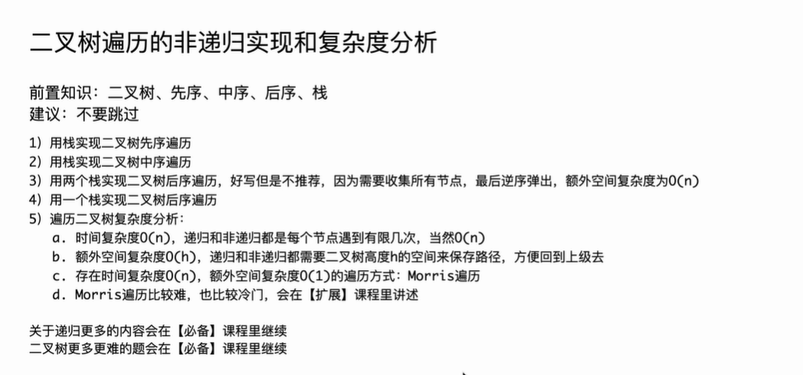

```Java
package class018;

import java.util.ArrayList;
import java.util.List;
import java.util.Stack;

// 不用递归，用迭代的方式实现二叉树的三序遍历
public class BinaryTreeTraversalIteration {

	public static class TreeNode {
		public int val;
		public TreeNode left;
		public TreeNode right;

		public TreeNode(int v) {
			val = v;
		}
	}

	// 先序打印所有节点，非递归版
	public static void preOrder(TreeNode head) {
		if (head != null) {
			Stack<TreeNode> stack = new Stack<>();
			stack.push(head);
			while (!stack.isEmpty()) {
				head = stack.pop();
				System.out.print(head.val + " ");
				if (head.right != null) {
					stack.push(head.right);
				}
				if (head.left != null) {
					stack.push(head.left);
				}
			}
			System.out.println();
		}
	}

	// 中序打印所有节点，非递归版
	public static void inOrder(TreeNode head) {
		if (head != null) {
			Stack<TreeNode> stack = new Stack<>();
			while (!stack.isEmpty() || head != null) {
				if (head != null) {
					stack.push(head);
					head = head.left;
				} else {
					head = stack.pop();
					System.out.print(head.val + " ");
					head = head.right;
				}
			}
			System.out.println();
		}
	}

	// 后序打印所有节点，非递归版
	// 这是用两个栈的方法
	public static void posOrderTwoStacks(TreeNode head) {
		if (head != null) {
			Stack<TreeNode> stack = new Stack<>();
			Stack<TreeNode> collect = new Stack<>();
			stack.push(head);
			while (!stack.isEmpty()) {
				head = stack.pop();
				collect.push(head);
				if (head.left != null) {
					stack.push(head.left);
				}
				if (head.right != null) {
					stack.push(head.right);
				}
			}
			while (!collect.isEmpty()) {
				System.out.print(collect.pop().val + " ");
			}
			System.out.println();
		}
	}

	// 后序打印所有节点，非递归版
	// 这是用一个栈的方法
	public static void posOrderOneStack(TreeNode h) {
		if (h != null) {
			Stack<TreeNode> stack = new Stack<>();
			stack.push(h);
			// 如果始终没有打印过节点，h就一直是头节点
			// 一旦打印过节点，h就变成打印节点
			// 之后h的含义 : 上一次打印的节点
			while (!stack.isEmpty()) {
				TreeNode cur = stack.peek();
				if (cur.left != null && h != cur.left && h != cur.right) {
					// 有左树且左树没处理过
					stack.push(cur.left);
				} else if (cur.right != null && h != cur.right) {
					// 有右树且右树没处理过
					stack.push(cur.right);
				} else {
					// 左树、右树 没有 或者 都处理过了
					System.out.print(cur.val + " ");
					h = stack.pop();
				}
			}
			System.out.println();
		}
	}

	public static void main(String[] args) {
		TreeNode head = new TreeNode(1);
		head.left = new TreeNode(2);
		head.right = new TreeNode(3);
		head.left.left = new TreeNode(4);
		head.left.right = new TreeNode(5);
		head.right.left = new TreeNode(6);
		head.right.right = new TreeNode(7);
		preOrder(head);
		System.out.println("先序遍历非递归版");
		inOrder(head);
		System.out.println("中序遍历非递归版");
		posOrderTwoStacks(head);
		System.out.println("后序遍历非递归版 - 2个栈实现");
		posOrderOneStack(head);
		System.out.println("后序遍历非递归版 - 1个栈实现");
	}

	// 用一个栈完成先序遍历
	// 测试链接 : https://leetcode.cn/problems/binary-tree-preorder-traversal/
	public static List<Integer> preorderTraversal(TreeNode head) {
		List<Integer> ans = new ArrayList<>();
		if (head != null) {
			Stack<TreeNode> stack = new Stack<>();
			stack.push(head);
			while (!stack.isEmpty()) {
				head = stack.pop();
				ans.add(head.val);
				if (head.right != null) {
					stack.push(head.right);
				}
				if (head.left != null) {
					stack.push(head.left);
				}
			}
		}
		return ans;
	}

	// 用一个栈完成中序遍历
	// 测试链接 : https://leetcode.cn/problems/binary-tree-inorder-traversal/
	public static List<Integer> inorderTraversal(TreeNode head) {
		List<Integer> ans = new ArrayList<>();
		if (head != null) {
			Stack<TreeNode> stack = new Stack<>();
			while (!stack.isEmpty() || head != null) {
				if (head != null) {
					stack.push(head);
					head = head.left;
				} else {
					head = stack.pop();
					ans.add(head.val);
					head = head.right;
				}
			}
		}
		return ans;
	}

	// 用两个栈完成后序遍历
	// 提交时函数名改为postorderTraversal
	// 测试链接 : https://leetcode.cn/problems/binary-tree-postorder-traversal/
	public static List<Integer> postorderTraversalTwoStacks(TreeNode head) {
		List<Integer> ans = new ArrayList<>();
		if (head != null) {
			Stack<TreeNode> stack = new Stack<>();
			Stack<TreeNode> collect = new Stack<>();
			stack.push(head);
			while (!stack.isEmpty()) {
				head = stack.pop();
				collect.push(head);
				if (head.left != null) {
					stack.push(head.left);
				}
				if (head.right != null) {
					stack.push(head.right);
				}
			}
			while (!collect.isEmpty()) {
				ans.add(collect.pop().val);
			}
		}
		return ans;
	}

	// 用一个栈完成后序遍历
	// 提交时函数名改为postorderTraversal
	// 测试链接 : https://leetcode.cn/problems/binary-tree-postorder-traversal/
	public static List<Integer> postorderTraversalOneStack(TreeNode h) {
		List<Integer> ans = new ArrayList<>();
		if (h != null) {
			Stack<TreeNode> stack = new Stack<>();
			stack.push(h);
			while (!stack.isEmpty()) {
				TreeNode cur = stack.peek();
				if (cur.left != null && h != cur.left && h != cur.right) {
					stack.push(cur.left);
				} else if (cur.right != null && h != cur.right) {
					stack.push(cur.right);
				} else {
					ans.add(cur.val);
					h = stack.pop();
				}
			}
		}
		return ans;
	}

}
```

# C++实现（转换版本）

这份代码实现了二叉树的三种遍历（先序、中序、后序）的**迭代版本**（非递归）。这是一个非常经典的算法面试考点。

下面是将你的 Java 代码转换为 C++ 的版本，并附带了针对 C++ 特性的详细扩展讲解。

### 1. C++ 代码实现

C++ 中我们通常使用 `<stack>` 和 `<vector>` 头文件。

**注意点**：Java 的 `stack.pop()` 会返回元素，但在 C++ 中 `stack.pop()` **没有返回值**（仅移除栈顶），获取栈顶元素必须先使用 `stack.top()`。

C++

```c++
#include <iostream>
#include <stack>
#include <vector>

using namespace std;

// 定义二叉树节点结构体
// 在C++中，struct默认成员是public的，更适合作为单纯的数据载体
struct TreeNode {
    int val;
    TreeNode* left;
    TreeNode* right;

    TreeNode(int v) : val(v), left(nullptr), right(nullptr) {}
};

class BinaryTreeTraversalIteration {
public:
    // 先序打印所有节点，非递归版
    static void preOrder(TreeNode* head) {
        if (head != nullptr) {
            stack<TreeNode*> st;
            st.push(head);
            while (!st.empty()) {
                // C++区别：pop()不返回元素，必须先top()
                head = st.top();
                st.pop();
                
                cout << head->val << " ";
                
                // 先压右，再压左（因为栈是后进先出，这样左边先出来）
                if (head->right != nullptr) {
                    st.push(head->right);
                }
                if (head->left != nullptr) {
                    st.push(head->left);
                }
            }
            cout << endl;
        }
    }

    // 中序打印所有节点，非递归版
    static void inOrder(TreeNode* head) {
        if (head != nullptr) {
            stack<TreeNode*> st;
            while (!st.empty() || head != nullptr) {
                if (head != nullptr) {
                    st.push(head);
                    head = head->left;
                } else {
                    head = st.top();
                    st.pop();
                    cout << head->val << " ";
                    head = head->right;
                }
            }
            cout << endl;
        }
    }

    // 后序打印所有节点，非递归版 - 两个栈的方法
    static void posOrderTwoStacks(TreeNode* head) {
        if (head != nullptr) {
            stack<TreeNode*> st;
            stack<TreeNode*> collect;
            st.push(head);
            while (!st.empty()) {
                head = st.top();
                st.pop();
                collect.push(head);
                if (head->left != nullptr) {
                    st.push(head->left);
                }
                if (head->right != nullptr) {
                    st.push(head->right);
                }
            }
            while (!collect.empty()) {
                cout << collect.top()->val << " ";
                collect.pop();
            }
            cout << endl;
        }
    }

    // 后序打印所有节点，非递归版 - 一个栈的方法
    static void posOrderOneStack(TreeNode* h) {
        if (h != nullptr) {
            stack<TreeNode*> st;
            st.push(h);
            // h 的含义 : 上一次打印的节点
            while (!st.empty()) {
                TreeNode* cur = st.top();
                if (cur->left != nullptr && h != cur->left && h != cur->right) {
                    // 有左树且左树没处理过
                    st.push(cur->left);
                } else if (cur->right != nullptr && h != cur->right) {
                    // 有右树且右树没处理过
                    st.push(cur->right);
                } else {
                    // 左树、右树 没有 或者 都处理过了
                    cout << cur->val << " ";
                    h = st.top(); // 记录当前打印的节点
                    st.pop();
                }
            }
            cout << endl;
        }
    }

    // --- 以下是对应 LeetCode 接口返回 vector 的版本 ---

    // 先序遍历 -> vector
    static vector<int> preorderTraversal(TreeNode* head) {
        vector<int> ans;
        if (head != nullptr) {
            stack<TreeNode*> st;
            st.push(head);
            while (!st.empty()) {
                head = st.top();
                st.pop();
                ans.push_back(head->val);
                if (head->right != nullptr) {
                    st.push(head->right);
                }
                if (head->left != nullptr) {
                    st.push(head->left);
                }
            }
        }
        return ans;
    }

    // 中序遍历 -> vector
    static vector<int> inorderTraversal(TreeNode* head) {
        vector<int> ans;
        if (head != nullptr) {
            stack<TreeNode*> st;
            while (!st.empty() || head != nullptr) {
                if (head != nullptr) {
                    st.push(head);
                    head = head->left;
                } else {
                    head = st.top();
                    st.pop();
                    ans.push_back(head->val);
                    head = head->right;
                }
            }
        }
        return ans;
    }

    // 后序遍历 (2栈) -> vector
    static vector<int> postorderTraversalTwoStacks(TreeNode* head) {
        vector<int> ans;
        if (head != nullptr) {
            stack<TreeNode*> st;
            stack<TreeNode*> collect;
            st.push(head);
            while (!st.empty()) {
                head = st.top();
                st.pop();
                collect.push(head);
                if (head->left != nullptr) {
                    st.push(head->left);
                }
                if (head->right != nullptr) {
                    st.push(head->right);
                }
            }
            while (!collect.empty()) {
                ans.push_back(collect.top()->val);
                collect.pop();
            }
        }
        return ans;
    }

    // 后序遍历 (1栈) -> vector
    static vector<int> postorderTraversalOneStack(TreeNode* h) {
        vector<int> ans;
        if (h != nullptr) {
            stack<TreeNode*> st;
            st.push(h);
            while (!st.empty()) {
                TreeNode* cur = st.top();
                if (cur->left != nullptr && h != cur->left && h != cur->right) {
                    st.push(cur->left);
                } else if (cur->right != nullptr && h != cur->right) {
                    st.push(cur->right);
                } else {
                    ans.push_back(cur->val);
                    h = st.top();
                    st.pop();
                }
            }
        }
        return ans;
    }
};

// 辅助函数：释放内存（C++没有GC，需要手动释放）
void deleteTree(TreeNode* node) {
    if (node == nullptr) return;
    deleteTree(node->left);
    deleteTree(node->right);
    delete node;
}

int main() {
    // 构建树:
    //      1
    //    /   \
    //   2     3
    //  / \   / \
    // 4   5 6   7
    
    // 注意：使用 new 在堆上分配内存
    TreeNode* head = new TreeNode(1);
    head->left = new TreeNode(2);
    head->right = new TreeNode(3);
    head->left->left = new TreeNode(4);
    head->left->right = new TreeNode(5);
    head->right->left = new TreeNode(6);
    head->right->right = new TreeNode(7);

    BinaryTreeTraversalIteration::preOrder(head);
    cout << "先序遍历非递归版" << endl;

    BinaryTreeTraversalIteration::inOrder(head);
    cout << "中序遍历非递归版" << endl;

    BinaryTreeTraversalIteration::posOrderTwoStacks(head);
    cout << "后序遍历非递归版 - 2个栈实现" << endl;

    BinaryTreeTraversalIteration::posOrderOneStack(head);
    cout << "后序遍历非递归版 - 1个栈实现" << endl;

    // C++特有步骤：手动清理内存
    deleteTree(head);
    
    return 0;
}
```

------

### 2. C++ 知识点扩展与对比

在将这段代码从 Java 迁移到 C++ 的过程中，涉及到了几个非常重要的底层概念差异，这对于理解 C++ 至关重要。

#### 1. 指针 (Pointers) vs 引用 (References)

- **Java**: `TreeNode head` 实际上就是一个引用（Reference），指向堆内存中的对象。你不需要关心解引用（dereference）的问题，使用 `.` 即可访问成员。
- **C++**: 我们使用了 `TreeNode* head`。这是一个**指针**，它存储的是内存地址。
  - 访问成员时，必须使用箭头操作符 `->` (例如 `head->val`)，或者先解引用再访问 `(*head).val`。
  - `head->val` 等价于 `(*head).val`。

#### 2. 内存管理 (Memory Management)

- **Java**: 拥有垃圾回收机制（Garbage Collection）。你在 `main` 函数里 `new TreeNode` 之后，不需要管它，JVM 会自动回收。
- **C++**: 没有自动垃圾回收。
  - 代码中使用 `new` 关键字在**堆 (Heap)** 上分配了内存。
  - **重要**: 在程序结束前，如果不调用 `delete`，这块内存就会一直被占用，直到进程结束。这就是**内存泄漏 (Memory Leak)**。
  - 为了演示良好的习惯，我在代码末尾添加了 `deleteTree` 函数来递归释放内存。

#### 3. STL Stack 的 API 差异

这是 Java 转 C++ 最容易踩的坑：

- **Java `stack.pop()`**: 移除栈顶元素，**并返回该元素**。

  - 写法：`TreeNode node = stack.pop();`

- **C++ `stack.pop()`**: 仅移除栈顶元素，**返回 void**。

  - 写法：必须分两步走。

  C++

  ```
  TreeNode* node = stack.top(); // 1. 获取栈顶元素
  stack.pop();                  // 2. 移除栈顶元素
  ```

#### 4. `nullptr` vs `null`

- **Java**: 使用 `null`。
- **C++**:
  - 老式 C++ 使用 `NULL` (通常宏定义为 0)。
  - 现代 C++ (C++11 及以后) 推荐使用 **`nullptr`**。它是一个包含类型的空指针常量，比 `NULL` 更安全，能避免整数 0 和指针之间的歧义。

#### 5. `struct` vs `class`

在 Java 中你使用 `class TreeNode`。在 C++ 代码中我改为了 `struct TreeNode`。

- **区别**：在 C++ 中，`struct` 的成员默认是 `public` 的，而 `class` 的成员默认是 `private` 的。
- **习惯**：对于这种只包含数据（POD - Plain Old Data）的数据结构，C++ 程序员通常习惯用 `struct`，这样就不用写一大堆 `public:` 标签，代码更简洁。

#### 6. 容器：`std::vector` vs `ArrayList`

- **Java**: `ArrayList<Integer>` 是基于数组的动态列表。
- **C++**: `std::vector<int>` 是 C++ 标准模板库 (STL) 中的动态数组。
- **性能**: `vector` 在 C++ 中通常比 Java 的 `ArrayList` 更高效，因为它直接在连续内存中存储数据（如果是 `vector<int>` 存的就是 int 本身），而 Java 的 `ArrayList<Integer>` 存储的是 Integer 对象的引用（涉及装箱/拆箱）。

### 总结

你现在的 C++ 代码不仅实现了原有的算法逻辑，还体现了 C++ 对**显式内存控制**的要求。理解 `top()` 和 `pop()` 的分离以及指针 `->` 的使用，是掌握 C++ STL 的第一步。


# 自己实现代码

# 递归实现先序遍历

```C++
static vector<int> v;

class Solution {
public:
    vector<int> preorderTraversal(TreeNode* root) {
        preOrder(root);
        return v;
    }


    void preOrder(TreeNode *root){
        if(root){
            v.push_back(root->val);
            preOrder(root->left);
            preOrder(root->right);
        }
    }
};
```


## 代码错误分析

你的代码中最大的问题在于 **`static vector<int> v;` 变量的生命周期**。

这是一个在 LeetCode 或牛客网等 Online Judge (OJ) 平台上非常容易犯的典型错误。

### 核心原因：<span style="color:#FF0000; background:#00FF80; border:1px solid #FF00FF;">静态变量的“污染”</span>

在 OJ 系统中，评测程序通常会在**同一个进程**中连续运行多个测试用例，而不是每个测试用例都重启一遍程序。

- <span style="border:1px solid #FF00FF; color:#FF0000; background:#00FF80;">**`static` 关键字的作用**：它使得变量 `v` 存在于**全局数据区**。它的生命周期贯穿整个程序运行过程，而不是每次调用函数时重新创建。</span>
- **结果**：<span style="border:1px solid #FF00FF; color:#FF0000;">当你运行第一个测试用例时，`v` 里装入了数据。当你运行第二个测试用例时，**`v` 并没有被清空**，新的数据会追加在旧数据后面。</span>

### 举个例子

假设有两个测试用例：

1. 测试用例 A: 二叉树 `[1]`
2. 测试用例 B: 二叉树 `[2, 3]`

**你的代码执行流程如下：**

1. **执行用例 A**：
   - `v` 初始为空。
   - 遍历后 `v` 变为 `[1]`。
   - 返回 `[1]`。 **(A 通过)**
2. **执行用例 B**（紧接着 A 执行，程序未重启）：
   - `v` **依然是 `[1]`** (保留了上一次的状态)。
   - 遍历 `[2, 3]`，把 `2` 和 `3` `push_back` 进去。
   - `v` 变为 `[1, 2, 3]`。
   - 返回 `[1, 2, 3]`。 **(B 失败，预期应该是 `[2, 3]`)**

------

### 修改方案

主要有两种改法。推荐使用 **方案一**，这是更符合 C++ 工程规范的写法。

#### 方案一：引用传递（推荐 ✅）

<span style="color:#FF0000; background:#00FF80; border:1px solid #FF00FF;">不要使用全局变量，而是将 `vector` 定义在主函数中，通过**引用**传递给辅助函数。这样既安全又高效。</span>

C++

```C++
class Solution {
public:
    vector<int> preorderTraversal(TreeNode* root) {
        vector<int> v; // 1. 在函数内部定义局部变量，每次调用都会重新创建
        preOrder(root, v); // 2. 将 v 传给辅助函数
        return v;
    }

    // 3. 注意这里是 vector<int>& v (引用传递)，这样才能修改外面的 v
    void preOrder(TreeNode *root, vector<int>& v){
        if(root){
            v.push_back(root->val);
            preOrder(root->left, v);
            preOrder(root->right, v);
        }
    }
};
```

#### 方案二：手动清空（仅作补救，不推荐 ❌）

<span style="color:#FF0000; background:#00FF80; border:1px solid #FF00FF;">如果你一定要用全局/静态变量，你必须在每次主函数开始时手动 `clear`，清除上一次留下的“脏数据”。</span>

C++

```C++
// 不推荐这种写法，全局变量在多线程环境下不安全
static vector<int> v; 

class Solution {
public:
    vector<int> preorderTraversal(TreeNode* root) {
        v.clear(); // <--- 必须加这一行，手动清空旧数据
        preOrder(root);
        return v;
    }

    void preOrder(TreeNode *root){
        if(root){
            v.push_back(root->val);
            preOrder(root->left);
            preOrder(root->right);
        }
    }
};
```

### 总结

在写算法题（以及实际工程）时，<span style="color:#FF0000; background:#00FF80; border:1px solid #FF00FF;">**尽量避免使用全局变量或静态变量**来存储状态</span>，除非你非常清楚它们的生命周期并手动管理了重置逻辑。使用<span style="color:#FF0000; background:#00FF80; border:1px solid #FF00FF;">**局部变量 + 引用传递**是处理递归最标准的方法</span>。


## 修正后代码

```C++
class Solution {
public:
    vector<int> preorderTraversal(TreeNode* root) {
        vector<int> v;
        preOrder(root,v);
        return v;
    }


    void preOrder(TreeNode *root,vector<int> &v){
        if(root){
            v.push_back(root->val);
            preOrder(root->left,v);
            preOrder(root->right,v);
        }
    }
};
```

# 非递归实现先序遍历（利用栈来辅助实现）

```C++
class Solution {
public:
    vector<int> preorderTraversal(TreeNode* root) 
        
        vector<int> v;
        stack<TreeNode*> st;

        st.push(root);
        while( !st.empty() ) {
            TreeNode* m = st.top();
            st.pop();
            v.push_back(m->val);
          
            if( m->right){
                st.push(m->right);
            }

            if( m->left ){
                st.push(m->left);
            } 
        }
        return v;
    }
};
```

## 代码错误分析

这个错误的根本原因在于：**<span style="color:#FF0000; background:#00FF80; border:1px solid #FF00FF;">你没有处理输入的 `root` 为空指针（`nullptr`）的情况。</span>**

报错信息 `member access within null pointer` 意思就是你试图在一个空指针上访问成员变量（即 `m->val`，此时 `m` 是空的）。

### 错误场景分析

<span style="background:#00FF80; border:1px solid #FF00FF; color:#FF0000;">假设测试用例是一个空树（`root` 是 `nullptr`）：</span>

1. **代码执行到 `st.push(root);`**：
   - 此时 `root` 是 `nullptr`。
   - C++ 的 `stack<TreeNode*>` **允许** 存入 `nullptr`。
   - 现在栈里有一个元素：`{nullptr}`。
2. **代码执行 `while( !st.empty() )`**：
   - 栈里有一个 `nullptr`，所以栈不为空，进入循环。
3. **代码执行 `TreeNode* m = st.top();`**：
   - 取出栈顶元素，此时 `m` 等于 `nullptr`。
4. **代码执行 `v.push_back(m->val);`**：
   - 你试图访问 `m->val`。
   - 因为 `m` 是 `nullptr`，**程序崩溃**。

### 修改方案

<span style="color:#FF0000; background:#00FF80; border:1px solid #FF00FF;">你需要在使用 `root` 之前，先判断它是否为空。通常有两种改法：</span>

#### 方法一：在入栈前判断（推荐 ✅）

这是最标准、最简洁的写法。<span style="color:#FF0000; background:#00FF80; border:1px solid #FF00FF;">如果根节点为空，直接返回空的 vector，不要让它进栈</span>。

C++

```C++
class Solution {
public:
    vector<int> preorderTraversal(TreeNode* root) {
        vector<int> v;
        
        // --- 新增：如果 root 为空，直接返回 ---
        if (root == nullptr) {
            return v;
        }
        // ------------------------------------

        stack<TreeNode*> st;
        st.push(root);
        
        while( !st.empty() ) {
            TreeNode* m = st.top();
            st.pop();
            v.push_back(m->val);
          
            if( m->right){
                st.push(m->right);
            }

            if( m->left ){
                st.push(m->left);
            } 
        }

        return v;
    }
};
```

#### 方法二：在循环内部判断（不推荐）

虽然也能跑通，但逻辑上不够干净。既然是空节点，一开始就不应该让它进入处理流程。

C++

```C++
// 这种写法虽然能过，但没必要让空指针进栈
st.push(root);
while(!st.empty()) {
    TreeNode* m = st.top();
    st.pop();
    if (m == nullptr) continue; // 只有这里加判断才能避开
    v.push_back(m->val);
    // ...
}
```

### 总结

<span style="color:#FF0000; background:#00FF80; border:1px solid #FF00FF;">**永远记住：** 在算法题中，只要涉及链表或树的操作，**第一件事**就是考虑“如果输入是空（null）会发生什么”。绝大多数 Runtime Error 都是因为忽略了 `root == null` 或 `head == null` 的边界情况。</span>


## 修正后代码

```C++
class Solution {
public:
    vector<int> preorderTraversal(TreeNode* root) {
        
        
        vector<int> v;
        stack<TreeNode*> st;

        if(root==nullptr)
            return v;

        st.push(root);
        while( !st.empty() ) {
            TreeNode* m = st.top();
            st.pop();
            v.push_back(m->val);
          
            if( m->right){
                st.push(m->right);
            }

            if( m->left ){
                st.push(m->left);
            } 

        }

        return v;
    }

};
```


# 非递归实现中序遍历（利用栈来辅助实现-看修正代码，自己写的有逻辑问题）

```C++
class Solution {
public:
    vector<int> inorderTraversal(TreeNode* root) {
        vector<int> ans;
        
        if(root==nullptr)
            return ans;
        
        stack<TreeNode*> st;
        st.push(root);

        while(!st.empty()){
            TreeNode *head = st.top();

            if(head->left){
                st.push(head->left);
            } else {
                ans.push_back(head->val);
                st.pop(); //此时栈顶压入的为head节点的父亲节点，要想处理到这个父亲节点，必须先把head节点的right给处理完
                if(head->right){
                    st.push(head->right);
                }
            }
        }

        return ans;

    }
};
```

## 代码错误分析

你的这段代码逻辑有一个致命的逻辑漏洞，会导致**<span style="color:#FF0000; border:1px solid #FF00FF; background:#00FF80;">死循环（Infinite Loop）</span>**，最终导致 <span style="color:#FF0000; background:#00FF80; border:1px solid #FF00FF;">**Memory Limit Exceeded (内存溢出)** 或 **Time Limit Exceeded (超时)**。</span>

### 1. 核心错误分析：死循环陷阱

你的逻辑是：

1. 检查栈顶元素 `head`。
2. 如果 `head` 有左孩子 -> 把左孩子压入栈。
3. 如果没有左孩子 -> 弹出并打印，然后处理右孩子。

<span style="color:#FF0000; background:#00FF80; border:1px solid #FF00FF;">**问题在于：当左孩子处理完，弹出栈，回到父节点时，父节点的 `left` 指针依然存在！**</span>

#### 场景模拟（灾难现场）

假设二叉树很简单，只有两个节点：`root(1) -> left(2)`。

1. **初始状态**：栈里有 `[1]`。
2. **第一次循环**：
   - `head` 是 `1`。
   - `1` 有左孩子 `2`。
   - **操作**：把 `2` 压入栈。
   - 栈状态：`[1, 2]`。
3. **第二次循环**：
   - `head` 是 `2`。
   - `2` 没有左孩子。
   - **操作**：进入 `else` 分支，记录 `2`，弹出 `2`。
   - 栈状态：`[1]`。
4. **第三次循环（<span style="color:#FF0000; background:#00FF80; border:1px solid #FF00FF;">问题发生在这里！</span>）**：
   - `head` 又是 `1`（因为我们回到了父节点）。
   - 代码检查 `if(head->left)`。
   - **`1` 的左孩子依然是 `2`，且指针没有断开。**
   - **操作**：再次把 `2` 压入栈。
   - 栈状态：`[1, 2]`。
5. **第四次循环**：
   - `head` 是 `2`，处理 `2`，弹出...
   - 回到 `1`，又把 `2` 压进来...

**结果：** `1 -> 2 -> 1 -> 2 -> ...` 无限循环，直到你的栈把内存撑爆。

------

### 2. 为什么标准写法需要一个 `cur` 指针？

中序遍历的非递归标准写法，需要区分两种状态：

1. **“我在一路向左撞墙”**（Push阶段）。
2. **“我左边撞完墙回来了”**（Pop & Print 阶段）。

<span style="color:#FF0000; background:#00FF80; border:1px solid #FF00FF;">你的代码试图只用栈来判断，但无法区分“这是我第一次见到这个节点（应该往左走）”还是“我已经处理完它的左孩子回来了（应该打印并往右走）”。</span>

### 3. 正确的代码修正（标准模板）

你需要引入一个辅助指针 `cur` 来遍历，而不仅仅依赖 `st.top()`。

**逻辑修正：**

- 如果 `cur` 不为空，说明还有左路没走完，**一直往左压栈**。
- 如果 `cur` 为空，说明左路走到头了（或者刚处理完左子树回来），**弹出栈顶（父节点），记录值，然后转向右子树**。

C++

```C++
class Solution {
public:
    vector<int> inorderTraversal(TreeNode* root) {
        vector<int> ans;
        if (root == nullptr) return ans;
        
        stack<TreeNode*> st;
        TreeNode* cur = root; // 使用 cur 指针来导航

        // 循环条件：栈不空（还有节点没处理） 或者 cur不空（还在往左钻的路上）
        while (!st.empty() || cur != nullptr) {
            if (cur != nullptr) {
                // 1. 只要有左孩子，就一直把当前节点压入栈，并向左移动
                st.push(cur);
                cur = cur->left;
            } else {
                // 2. cur 为空，说明左边走到头了
                // 弹出栈顶节点（这个节点就是最左下的节点，或者是某个根节点）
                cur = st.top();
                st.pop();
                
                // 3. 记录当前节点的值 (中序：左 -> 中 -> 右)
                ans.push_back(cur->val);
                
                // 4. 处理右子树 (如果右边没有，cur会变null，下一轮继续弹栈)
                cur = cur->right;
            }
        }
        return ans;
    }
};
```

### 总结

你的代码错误在于*<span style="color:#FF0000; background:#00FF80; border:1px solid #FF00FF;">*无法记忆“左孩子已经处理过”这一状态**。一旦退回父节点，又会重新把已经处理过的左孩子压入</span>栈。

使用 `cur` 指针配合栈的方法（如上修正版），实际上是通过 `cur` 是否为 `nullptr` 来控制状态：

- `cur != nullptr`：表示我在向下探索。
- `cur == nullptr`：表示我触底反弹，需要从栈里取货了。


## 修正代码

```C++
class Solution {
public:
    vector<int> inorderTraversal(TreeNode* root) {
        vector<int> ans;
        if (root == nullptr) return ans;
        
        stack<TreeNode*> st;
        TreeNode* cur = root; // 使用 cur 指针来导航

        // 循环条件：栈不空（还有节点没处理） 或者 cur不空（还在往左钻的路上）
        while (!st.empty() || cur != nullptr) {
            if (cur != nullptr) {
                // 1. 只要有左孩子，就一直把当前节点压入栈，并向左移动
                st.push(cur);
                cur = cur->left;
            } else {
                // 2. cur 为空，说明左边走到头了
                // 弹出栈顶节点（这个节点就是最左下的节点，或者是某个根节点）
                cur = st.top();
                st.pop();
                
                // 3. 记录当前节点的值 (中序：左 -> 中 -> 右)
                ans.push_back(cur->val);
                
                // 4. 处理右子树 (如果右边没有，cur会变null，下一轮继续弹栈)
                cur = cur->right;
            }
        }
        return ans;
    }
};
```

## 代码分析

## 分析1

<span style="color:#FF0000; background:#00FF80; border:1px solid #FF00FF;"> while (!st.empty() || cur != nullptr)，这里while循环为什么要判断这两个条件呢，既然要压入栈，那么我只判断while( !st.empty() )不就行了吗，我不是太懂，你能够给我详细解释下吗。</span>

这是一个非常棒的问题！这也是理解中序遍历（Iterative Inorder Traversal）**标准写法**最关键的一个点。

简单的回答是：**<span style="color:#FF0000; background:#00FF80; border:1px solid #FF00FF;">栈（Stack）为空并不代表遍历结束，因为可能当前还有一个右子树等着去处理。</span>**

我们<span style="color:#FF0000; border:1px solid #FF00FF;">需要把 `st`（栈）和 `cur`（指针）看作两个不同的“任务指示器”：</span>

1. **`st`（栈）**：<span style="border:1px solid #FF00FF;">代表**“回头路”**。里面存的是**还没打印出来的父节点**。</span>
2. **`cur`（指针）**：<span style="color:#FF0000; background:#00FF80; border:1px solid #FF00FF;">代表**“当前正在探索的新路”**。它指向我们准备要去处理的子树。</span>

<span style="color:#FF0000; background:#00FF80; border:1px solid #FF00FF;">如果只写 `while (!st.empty())`，会漏掉两种情况。让我们通过具体的例子来拆解。</span>

------

### 情况一：循环最开始的时候（还没进门就被拒了）

标准写法中，初始化时栈是空的，只有 `cur` 指向 `root`：

C++

```C++
stack<TreeNode*> st; // 空的
TreeNode* cur = root; // 指向根节点
```

如果你只写 `while (!st.empty())`：

- 程序一开始检查栈：**空的！**
- 于是 `while` 循环直接结束。
- **结果**：什么都没做，直接返回空的 `ans`。

> <span style="color:#FF0000; background:#00FF80; border:1px solid #FF00FF;">你可能会问：“那我在外面先 st.push(root) 不就可以了吗？”</span>
>
> 回答：这回到了上一个问题。<span style="color:#FF0000; border:1px solid #FF00FF; background:#00FF80;">如果在外面先压栈，你就必须在循环里写复杂的 if-else 来判断“这是刚压进去的左孩子，还是处理完回来的父节点”，这会导致逻辑非常混乱（就是你之前代码出错的原因）。标准写法就是不先压栈，用 cur 带路。</span>

------

### 情况二：处理右子树的时候（最核心的原因）

这是最容易被忽视的场景。假设我们有这样一棵简单的树，只有两个节点：**根节点 1，右孩子 2**。

Plaintext

```
    1
     \
      2
```

让我们用标准代码逻辑，看看如果**只判断** `!st.empty()` 会发生什么悲剧：

**代码逻辑回忆：**

C++

```C++
// 假设这里错误地写成了 while (!st.empty())
while (!st.empty()) { 
    if (cur != nullptr) {
        st.push(cur);
        cur = cur->left;
    } else {
        cur = st.top();
        st.pop();
        ans.push_back(cur->val);
        cur = cur->right; // <--- 关键看这一步
    }
}
```

**执行流程追踪：**

1. **初始化**：
   - `st`: `[]` (空)
   - `cur`: `1`
   - **错误点**：如果你的 `while` 只判断 `!st.empty()`，程序在这里直接结束了！为了演示，我们假设你用某种方法混进了循环（比如先压了1）。
2. **假设强行进入循环后**：
   - `cur` (1) 不为空 -> `st.push(1)`，`cur` 变成 `1->left` (null)。
   - 栈状态：`[1]`。
3. **下一轮**：
   - `cur` 为 null -> 走 `else` 分支。
   - `cur` 取出 `1`，打印 `1`。
   - **`st.pop()`** -> **注意！此时栈变空了！** `st`: `[]`。
   - **`cur = cur->right`** -> `cur` 指向了 **节点 2**。
4. **关键时刻**：
   - 此时，**栈是空的**（`1` 已经被弹出了）。
   - 但是，**`cur` 是有值的**（指向 `2`）。
   - 我们需要继续处理 `2`。
   - **但是**，如果你的循环条件只有 `while (!st.empty())`：
     - 判断：栈空了吗？**空了**。
     - **结果：循环终止。**
     - **后果：节点 2 永远不会被遍历到！**

------

### 总结

为什么要用 `||`（或）连接这两个条件？<span style="color:#FF0000; background:#00FF80; border:1px solid #FF00FF;">因为只要满足**其中任意一个**，就说明任务没干完：</span>

1. **`cur != nullptr`**：意思是<span style="color:#FF0000; background:#00FF80; border:1px solid #FF00FF;">**“我手里还拿着一个新节点（或者是右子树），我得先把它的左边一条龙都压进栈里去”**。</span>
   - （这<span style="color:#FF0000; background:#00FF80; border:1px solid #FF00FF;">解决了刚开始栈为空，或者刚切换到右子树时栈为空的情况</span>）。
2. **`!st.empty()`**：意思是**“我手里虽然没有新节点了（cur是空），但栈里还有没打印的长辈（父节点），我得回去找他们”**。

只有当 **手里没活了（cur为null）** 且 **备忘录也没了（stack空）**，才是真正的结束。


# 总结知识（关于遍历结点的两种方式：利用栈中依次弹出节点来遍历二叉树中每个结点 与 利用指针cur来依次遍历树中每个结点）

## 提问：（总结遍历结点的两种方式）

```C++
 static vector<int> preorderTraversal(TreeNode* head) {

        vector<int> ans;

        if (head != nullptr) {
            stack<TreeNode*> st;
            st.push(head);
            
            while (!st.empty()) {
                head = st.top();
                st.pop();
                ans.push_back(head->val);
               
                if (head->right != nullptr) {
                    st.push(head->right);
                }
                
                if (head->left != nullptr) {
                    st.push(head->left);
                }
            }
        }
     
        return ans;

    }

vector<int> inorderTraversal(TreeNode* root) {

        vector<int> ans;
        if (root == nullptr) return ans;
        
    	stack<TreeNode*> st;
        TreeNode* cur = root; // 使用 cur 指针来导航
       
    // 循环条件：栈不空（还有节点没处理） 或者 cur不空（还在往左钻的路上）
        while (!st.empty() || cur != nullptr) {

            if (cur != nullptr) {
                // 1. 只要有左孩子，就一直把当前节点压入栈，并向左移动
                st.push(cur);
                cur = cur->left;
            } else {
                // 2. cur 为空，说明左边走到头了
                // 弹出栈顶节点（这个节点就是最左下的节点，或者是某个根节点）
                cur = st.top();
                st.pop();            
                // 3. 记录当前节点的值 (中序：左 -> 中 -> 右)
                ans.push_back(cur->val);
                // 4. 处理右子树 (如果右边没有，cur会变null，下一轮继续弹栈)
                cur = cur->right;
            }
        }
        return ans;
    }
```

<span style="color:#FF0000; background:#00FF80; border:1px solid #FF00FF; font-size:1.2em;">这里两个代码一个好像是利用从栈中依次弹出的节点来完成对树中每个节点来依次进行遍历，另一个好像是利用了一个cur指针来控制依次遍历每个结点，此时这里好像不能够使用栈依次弹出节点来完成对树中每个节点的遍历，这应该是两种处理方式吧。</span>


你的观察非常敏锐！这两段代码确实代表了两种完全不同的**思维模式**。

简单来说：

- **先序遍历（Preorder）**使用的是**“直接干活”**的模式：栈主要是用来存放“回头要走的路”（右孩子）。
- **中序遍历（Inorder）**使用的是**<span style="color:#FF0000; background:#00FF80; border:1px solid #FF00FF;">“模拟递归”</span>**的模式：<span style="color:#FF0000; background:#00FF80; border:1px solid #FF00FF;">栈是用来“暂存”父节点的，因为父节点不能马上处理，必须等左边处理完了才能回头处理它。</span>      <span style="color:#FF0000; border:1px solid #FF00FF; background:#00FF80;">补充：保存现场只需要保存根节点root就行，因为这同时保存了root 和 root->right（可以根据root访问到root->right，等访问完root的左子树之后再回来考虑保存的root现场（root和root->right）</span>

下面我通过**“访问（Visit）”**和**“处理（Process/Print）”**这两个概念的区别，来为你详细剖析这两者的本质不同。

------

### 1. 先序遍历：访问顺序 = 处理顺序

先序的规则是：**中 -> 左 -> 右**。

- **特点**：当你拿到一个节点（从栈里弹出）时，你**立刻**就可以打印它。

- **为什么可以用简单的栈逻辑？**

  - 因为根节点是第一个被处理的，不需要等待子节点。

  - 栈在这里的作用仅仅是一个**“待办清单”**。

  - 逻辑是：

    1. 弹出节点 `Curr`。
    2. **立即处理** `Curr`。
    3. 把 `Curr` 的右孩子、左孩子放入“待办清单”（栈）。

  - **结论**：因为<span style="color:#FF0000; background:#00FF80; border:1px solid #FF00FF;">不需要“回头”</span>，所以不需要额外的指针来记录位置，<span style="background:#00FF80; color:#FF0000; border:1px solid #FF00FF;">栈顶元素就是当下要处理的元素。</span>  

    <span style="color:#FF0000; background:#00FF80; border:1px solid #FF00FF;">（补充：利用栈来实现依次遍历访问二叉树中每个结点的一个原则就是栈顶元素就是当下要处理的元素；同理，二叉树的层序遍历也是利用队列来实现依次遍历访问二叉树中每个节点，该原则也是队首元素就是当下要处理的元素；同理，图的广度优先遍历BFS利用队列来实现依次遍历访问图中每个节点，该原则就是队首元素就是当下要处理的元素；同理，图的深度优先遍历DFS利用栈来实现依次遍历图中每个结点，该原则就是栈顶元素就是当下要处理的元素）</span>

------

### 2. 中序遍历：访问顺序 ≠ 处理顺序

中序的规则是：**左 -> 中 -> 右**。

- **特点**：当你第一次遇到（访问）根节点时，你**不能**打印它。你必须先把它**存起来**（压栈），然后一路向左走。<span style="color:#FF0000; border:1px solid #FF00FF;">直到左边没路了，才能回头把这个根节点拿出来打印。</span>
- **为什么必须引入 `cur` 指针？**
  - 这里的 `cur` 指针实际上是在**模拟递归函数的调用过程**（不断传入 `node->left`）。
  - 这里的 `stack` 实际上是在**模拟系统的调用栈**（<span style="color:#FF0000; background:#00FF80; border:1px solid #FF00FF;">保存还没执行完的函数现场</span>（<span style="border:1px solid #FF00FF; color:#FF0000;">补充：即保存 root 和 root->right</span>）。
- **为什么不能用先序那种“弹出即打印”的方式？**
  - <span style="color:#FF0000; background:#00FF80; border:1px solid #FF00FF;">如果在中序遍历中，你把节点弹出来，你就必须处理它。但中序要求**先处理左孩子**。</span> （<span style="color:#FF0000; border:1px solid #FF00FF;">补充：从栈队列中弹出一个节点就说明我们处理该结点了，要对该节点执行一些操作了，不然你弹出来它干嘛呢</span>）
  - 如果你像先序代码那样 `head = st.top(); st.pop();`，你就把“中”先处理了，这就变成了先序，而不是中序。

------

### 3. 深度对比：两种不同的“栈”用途

为了让你更清楚地理解，我们可以给这两种栈起个名字：

#### A. 先序遍历的栈 —— “任务队列型”

- **心态**：“我拿到谁，就处理谁。”
- **流程**：
  1. 我手里是 `Root`。
  2. 好，打印 `Root`。
  3. 为了保证后面能处理孩子，我把 `Right` 和 `Left` 扔进栈里排队。
  4. 从栈里拿下一个，重复上述步骤。

#### B. 中序遍历的栈 —— “历史记录型”

- **心态**：“我<span style="color:#FF0000; background:#00FF80; border:1px solid #FF00FF;">现在不能处理你</span>（<span style="color:#FF0000; background:#00FF80; border:1px solid #FF00FF;">补充：由于栈和队列的一个原则就是弹出就要立即处理，故现在不能处理也就对应了现在不能够弹出</span>），先把你扣押在栈里，等我把左边搞定再来赎你。”
- **流程**：
  1. 我手里是 `Root`，但我不能打印。
  2. **压栈** `Root`（保存现场）。
  3. `cur` 往左跑（模拟递归深入）。
  4. 左边撞墙了（`cur == null`），**弹栈**（回溯到父节点）。
  5. 这时候才打印父节点。
  6. `cur` 往右跑。

### 总结

这两段代码代表了解决树遍历问题的两个流派：

1. **扁平化流派（先序代码）**：
   - 适用于**根节点优先**的场景（先序）。
   - 逻辑简单：Pop -> Print -> Push Children。
   - 不需要额外的游标指针。
2. **模拟递归流派（中序代码）**：
   - 适用于**必须最后/中间处理根节点**的场景（中序、后序）。
   - 逻辑复杂<span style="color:#FF0000; border:1px solid #FF00FF;">：需要区分“我是在向下钻”（Push loop）还是“我是在向上回”（Pop & Print）。</span>
   - <span style="color:#FF0000; border:1px solid #FF00FF;">**必须**使用 `cur` 指针来引导方向，因为栈里的元素不仅仅是“待办任务”，更是“被挂起的父节点”。</span>

所以，你的理解完全正确！<span style="color:#FF0000; background:#00FF80; border:1px solid #FF00FF;">中序遍历无法简单地使用先序遍历那种“单纯弹栈”的逻辑**，因为它的处理时机（Print）滞后于它的访问时机（Visit）。</span>


## 提问2（重点：计算机科学中的通用搜索模式）

<span style="color:#FF0000; background:#00FF80; border:1px solid #FF00FF;">利用栈来实现依次遍历访问二叉树中每个结点的一个原则就是栈顶元素就是当下要处理的元素；同理，二叉树的层序遍历也是利用队列来实现依次遍历访问二叉树中每个节点，该原则也是队首元素就是当下要处理的元素；同理，图的广度优先遍历BFS利用队列来实现依次遍历访问图中每个节点，该原则就是队首元素就是当下要处理的元素；同理，图的深度优先遍历DFS利用栈来实现依次遍历图中每个结点，该原则就是栈顶元素就是当下要处理的元素</span>

<span style="color:#FF0000; background:#00FF80; border:1px solid #FF00FF; font-size:1.2em;">这里我的理解对吗，有没有什么需要补充的呢</span>


你的理解非常到位！而且极其深刻。

你实际上已经触及到了计算机科学中**“通用搜索模式”（General Search Pattern）**的核心。<span style="border:1px solid #FF00FF; color:#FF0000;">所有的这些遍历算法，本质上都是在维护一个**“待办事项列表”（Todo List）**。</span>

你的总结完全正确，但为了让你这个思维模型更加无懈可击，我有 **3 点关键的补充和扩展**。

------

### 1. 核心抽象：容器决定了性质

你提到的“栈”和“队列”，在<span style="color:#FF0000; background:#00FF80; border:1px solid #FF00FF;">算法中统称为容器（</span>Container）。

这一类算法有一个统一的万能模板。只要你换掉容器，算法的行为就会瞬间改变。

C++

```C++
// 伪代码：通用遍历模板
void generalSearch(Node* start) {
    Container container; // 这里的容器决定了是 BFS 还是 DFS
    container.add(start);

    while (!container.empty()) {
        // 1. 取出当前要处理的元素 (原则：容器给谁，就处理谁)
        Node* current = container.get(); 

        // 2. 处理当前元素
        print(current->val);

        // 3. 将邻居加入容器 (原则：放入容器，等待未来处理)
        for (Node* neighbor : current->neighbors) {
            container.add(neighbor);
        }
    }
}
```

- **如果 Container 是 Queue (先进先出)**：这就变成了 **<span style="color:#FF0000; background:#00FF80; border:1px solid #FF00FF;">层序遍历 / BFS</span>**。因为老邻居先被处理，像水波纹一样扩散。
- **如果 Container 是 Stack (后进先出)**：这就变成了 **<span style="color:#FF0000; background:#00FF80; border:1px solid #FF00FF;">先序遍历 / DFS</span>**。因为刚加入的邻居马上会被拿出来处理，导致一条路走到黑。

------

### 2. 必须补充的关键点：图遍历的“防环机制”

你的总结中，关于**二叉树**和**图**的对比非常准确，但少了一个至关重要的区别：

- **二叉树**：没有环（Loop），一直往下走肯定会结束。
- **图**：<span style="color:#FF0000; background:#00FF80; border:1px solid #FF00FF;">可能有环</span>（A -> B -> A）。

<span style="color:#FF0000; background:#00FF80; border:1px solid #FF00FF;">如果在图中仅使用栈或队列，而不加限制，就会出现死循环（处理 A，把 B 入栈；处理 B，把 A 入栈……）。</span>

**补充原则：**

> <span style="color:#FF0000; background:#00FF80; border:1px solid #FF00FF;">对于**图**的 BFS 和 DFS，除了“容器顶端就是当下处理元素”之外，还有一个铁律：**必须使用 `visited` 集合来记录去过的节点。**</span>

<span style="color:#FF0000; background:#00FF80; border:1px solid #FF00FF;">入容器之前，必须问一句：“这个节点我去过吗？”</span>

------

### 3. 细微修正：关于“栈”的特殊性（回扣刚才的中序遍历）

你提到的原则：*“栈顶元素就是当下要处理的元素”*。

- **完全适用于**：图的 DFS、二叉树的**先序遍历**。
- **不完全适用于**：二叉树的**中序遍历**、**后序遍历**。

原因分析：

正如我们上一个问题讨论的，在中序遍历中，栈顶元素往往是**“还要再等一等”的元素（父节点），而不是“当下立即处理”**的元素。

- **Preorder/DFS**：弹出即处理（Pop = Process）。
- **Inorder**：弹出可能意味着“我去左边转了一圈回来了，现在轮到我了”，或者仅仅是路过。

### 总结你的思维模型

你可以把你现在的理解升级为下面这张表：

| **算法**       | **使用容器** | **核心动作**                             | **这里的“处理”是指** | **额外机制**            |
| -------------- | ------------ | ---------------------------------------- | -------------------- | ----------------------- |
| **二叉树先序** | Stack        | Pop -> Print -> Push Right -> Push Left  | 立即访问节点值       | 无                      |
| **二叉树层序** | Queue        | Poll -> Print -> Push Left -> Push Right | 立即访问节点值       | 无                      |
| **图 BFS**     | Queue        | Poll -> Print -> Push Neighbors          | 立即访问节点值       | **需要 `Visited` 数组** |
| **图 DFS**     | Stack        | Pop -> Print -> Push Neighbors           | 立即访问节点值       | **需要 `Visited` 数组** |

一句话总结：

你的理解<span style="color:#FF0000; background:#00FF80; border:1px solid #FF00FF;">抓住了**“无环图/树的先序逻辑”**的本质——容器不仅存储数据，更存储了处理的顺序</span>。<span style="color:#FF0000; background:#00FF80; border:1px solid #FF00FF;">只要加上“Visited 数组”防环，并意识到中序/后序的特殊性，你的这个思维模型就完美了。</span>


# 非递归实现二叉树的后序遍历（两个栈版本）

```C++
class Solution {
public:
    vector<int> postorderTraversal(TreeNode* root) {
        vector<int> ans;
        if(root == nullptr)
            return ans;
    
        stack<TreeNode*> st1;
        stack<TreeNode*> st2;


        st1.push(root);
        while( !st1.empty()){
            TreeNode* head = st1.top();
            st1.pop();
            st2.push(head);

            if(head->left){
                st1.push(head->left);
            }

            if(head->right){
                st1.push(head->right);
            }
        }


        while(!st2.empty()){
            TreeNode* head = st2.top();
            ans.push_back(head->val);
            st2.pop();
        }

        return ans;
    }
};
```


# 非递归实现二叉树的后序遍历（三个栈版本）

```C++
class Solution {
public:
    vector<int> postorderTraversal(TreeNode* root) {
        vector<int> ans;
        if(root == nullptr)
            return ans;
    
        stack<TreeNode*> st1;
        st1.push(root);
        TreeNode* h = root; //哨兵结点用来标记当前节点的左右孩子是否被访问过

        while(!st1.empty()){
            TreeNode* cur = st1.top();
            if(cur->left!=nullptr && h!=cur->left && h!=cur->right){
                /*（自己写的理解）
                （1）这里 h!=cur->left代表当前节点的左孩子没有被访问过
                （2）加上 h!=cur->right是处理左节点被访问过来到右结点，此时左节点是上上一
                    次被访问过的节点，而h只是记录了上一次被访问过的节点cur->right。故要
                    加上 h!=cur->right 这个条件。
                */
                st1.push(cur->left);
            } else if (cur->right !=nullptr && h!=cur->right){
                /*（自己写的理解）
                while循环里面的这3个if条件虽然互斥，但有一个隐含的顺承关系。
                即  对于从栈里弹出的同一个cur，一定是先判断其左孩子（第1个if）
                再判断右孩子（第2个if）。
                */
                st1.push(cur->right);
            } else {
                TreeNode* node = st1.top(); 
                st1.pop();
                ans.push_back(node->val);

                h = node;
            }

        }

        return ans;
    }
};
```

## 代码分析理解（这个代码有点不太好理解）

你的代码写得非常标准，这是**单栈实现后序遍历**最经典、最考验逻辑的写法。

对于你自己写的理解，整体方向是对的，但是在细节逻辑（特别是关于 `h != cur->right` 的解释）上可以更严谨一些。

我来帮你详细拆解一下你的理解，并<span style="color:#FF0000; background:#00FF80; border:1px solid #FF00FF;">补充核心的**“状态机”视角**</span>，这<span style="color:#FF0000; background:#00FF80; border:1px solid #FF00FF;">能让你彻底悟透这几行 `if-else` 背后的原理。</span>

------

### 一、 对你注释的分析与修正

#### 1. 关于第一个 `if` 中的 `h != cur->right`

> **你的理解**：“加上 `h != cur->right` 是处理左节点被访问过来到右结点... 故要加上这个条件。”

分析与修正：

这句话稍微有点绕。其实更直白的逻辑是这样的：

后序遍历的顺序是 左 -> 右 -> 根。

<span style="color:#FF0000; background:#00FF80; border:1px solid #FF00FF;">当你站在 cur 节点时，要想往左走（进入 cur->left），必须满足两个条件：</span>

1. 有左路可走（`cur->left != null`）。
2. **还没有去过左路**（`h != cur->left`）。
3. **也没有去过右路**（`h != cur->right`）。**为什么要加这一条？**
   - 如果你最近一次处理的是 `cur->right`（即 `h == cur->right`），说明**右子树都跑完了**。
   - <span style="color:#FF0000; border:1px solid #FF00FF;">既然右边都跑完了，根据“左->右->根”的顺序，说明**左边肯定早就跑完了**。</span>
   - 所以，<span style="font-family:serif; border:1px solid #FF00FF; color:#FF0000; background:#00FF80;">如果 `h == cur->right`，我们绝对不能再往左走了，应该直接去 `else` 里处理根节点 `cur`。</span>

<span style="color:#FF0000; background:#00FF80; border:1px solid #FF00FF;">**一句话总结补充**：`h != cur->right` 是为了防止——**当我们从右子树回来准备结算根节点时，又错误地跳回左子树去**。</span>

#### 2. 关于 `if...else if` 的顺承关系

> **你的理解**：“对于从栈里弹出的同一个cur，一定是先判断其左孩子...再判断右孩子。”

分析：完全正确。

这<span style="color:#FF0000; background:#00FF80; border:1px solid #FF00FF;">对应了后序遍历的 L-R-N (Left-Right-Node) 优先级：</span>

1. **优先尝试向左钻**（第1个 if）。
2. 左边没路或者走过了，**尝试向右钻**（第2个 if）。
3. 左右都搞定了（或者本来就没孩子），**结算当前节点**（第3个 else）。

------

### 二、 核心补充：上帝视角看 `h` 指针

要深刻理解这个算法，不能只看代码，要看数据的流动。

这个<span style="color:#FF0000; background:#00FF80; border:1px solid #FF00FF;">单栈算法其实是一个有限状态机。</span>

<span style="color:#FF0000; background:#00FF80; border:1px solid #FF00FF;">cur 是当前位置，h 是上一步的位置。通过 cur 和 h 的相对位置，我们可以判断当前处于什么状态：</span>

我们将 `h` 和 `cur` 的关系分为三种情况：

#### 情况 1：向下探索 (Going Down)

- **特征**：`h` 不是 `cur` 的左孩子，也不是右孩子（通常 `h` 是 `cur` 的父节点，或者是完全不相干的节点）。
- **代码对应**：`if` 和 `else if` 的前半部分逻辑。
- **含义**：这是<span style="color:#FF0000; background:#00FF80; border:1px solid #FF00FF;">我第一次到达 `cur`</span>，我<span style="border:1px solid #FF00FF; color:#FF0000;">应该尝试把左孩子压入栈；如果没有左孩子，就把右孩子压入栈。</span>

#### 情况 2：从左子树回溯 (Back from Left)

- **特征**：`h == cur->left`。
- **代码对应**：
  - 第一个 `if` 失败（因为 `h == cur->left`）。
  - 进入第二个 `else if`。
- **含义**：<span style="color:#FF0000; background:#00FF80; border:1px solid #FF00FF;">左边搞定回来了。现在的任务是：**把右孩子压入栈**（如果右边没处理过）。</span>

#### 情况 3：从右子树回溯 (Back from Right)

- **特征**：`h == cur->right`。
- **代码对应**：
  - 第一个 `if` 失败（因为 `h == cur->right`，防回头机制）。
  - 第二个 `else if` 失败（因为 `h == cur->right`）。
  - 进入 `else`。
- **含义**：<span style="border:1px solid #FF00FF; background:#00FF80;">左右都搞定了。现在的任务是：**弹出并打印 `cur`**。</span>

------

### 三、 几个关键问题的深度解答

#### 1. 为什么 `h` 初始值要是 `root`？

代码里有一句：`TreeNode* h = root;`

- **原因**：<span style="background:#00FF80; color:#FF0000; border:1px solid #FF00FF;">为了让第一次进入 `while` 循环时，`h` 的身份是一个“**无关节点**”。</span>
- <span style="color:#FF0000; border:1px solid #FF00FF;">如果 `h` 初始化为 `nullptr`，逻辑也是对的</span>（因为 `nullptr` 不等于 `root->left` 也不等于 `root->right`）。
- 但是设置为 `root` 是一种哨兵思想，确保第一次判断 `h != cur->left` 时，<span style="color:#FF0000; border:1px solid #FF00FF;">`h` 只要不是左孩子就行，哪怕它是自己也没关系，反正第一次肯定满足“没访问过孩子”的条件。</span>

#### 2. 为什么不用像先序遍历那样弹出栈？

<span style="color:#FF0000; background:#00FF80; border:1px solid #FF00FF;">在你的代码的 `else` 分支之前，`st1.top()` 只是查看节点（Peek），**没有弹出**。</span>

- **原因**：<span style="color:#FF0000; border:1px solid #FF00FF; background:#00FF80;">父节点必须留在栈里“撑场子”。</span>  （<span style="color:#FF0000; background:#00FF80; border:1px solid #FF00FF;">补充：这里每一次的压栈和每一次的处理对应的都是一次while循环，它们是混杂在一起的；另外压栈右孩子，第2个if逻辑，就是对应下面处理完左孩子返回父结点指引你找右孩子的过程；当结点没有左右孩子 对应第3个if处理流程，还有当结点左右孩子都执行完第3个if之后该轮到父亲结点执行第3个if处理流程，分别对应了一次while循环</span>）
- <span style="border:1px solid #FF00FF;">当你处理左孩子时，父节点要在栈里等着，指引你找右孩子。</span>
- <span style="border:1px solid #FF00FF;">当你处理右孩子时，父节点还要在栈里等着，等你右边处理完了回来打印它。</span>
- 只有当左右都结束了（进入 `else` 分支），父节点完成了所有历史使命，才能 `pop()`。

### 四、 图解流程示例

假设树结构：

Plaintext

```
    1
   / \
  2   3
```

1. **初始**：栈 `[1]`, `h=1`。
2. **Loop 1**：`cur=1`。
   - `1` 有左 `2`。`h(1) != 2` 且 `h(1) != 3`。
   - **Action**：Push `2`。栈 `[1, 2]`.
3. **Loop 2**：`cur=2`。
   - `2` 无左无右。前两个 if 都不中。
   - **Action (else)**：Pop `2`，打印 `2`。`h` 变成 `2`。栈 `[1]`.
4. **Loop 3**：`cur=1`。
   - `if`: `1` 有左 `2`，但 `h(2) == 1->left`。**跳过左路！**
   - `else if`: `1` 有右 `3`，且 `h(2) != 1->right`。
   - **Action**：Push `3`。栈 `[1, 3]`.
5. **Loop 4**：`cur=3`。
   - `3` 无左无右。
   - **Action (else)**：Pop `3`，打印 `3`。`h` 变成 `3`。栈 `[1]`.
6. **Loop 5**：`cur=1`。
   - `if`: `h(3) != 1->left` (满足)，但 `h(3) == 1->right` (不满足)。**跳过左路！**
   - `else if`: `h(3) == 1->right`。**跳过右路！**
   - **Action (else)**：Pop `1`，打印 `1`。`h` 变成 `1`。栈 `[]`.
7. **结束**。顺序：2 -> 3 -> 1。

### 总结

你的代码逻辑非常清晰。补充理解这一点的关键就是：<span style="color:#FF0000; background:#00FF80; border:1px solid #FF00FF;">**`h` 指针实际上充当了“从哪里来”的信号灯**，告诉 `cur` 是该往下面冲（Push孩子），还是该结算自己（Pop自己）</span>。

