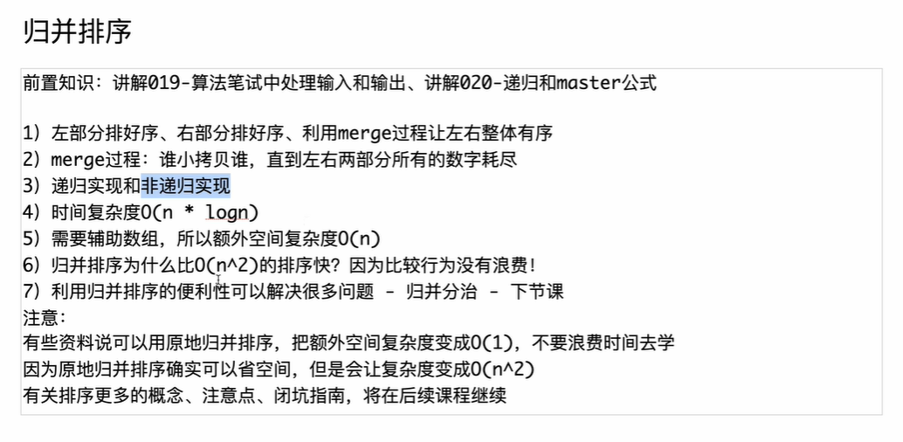
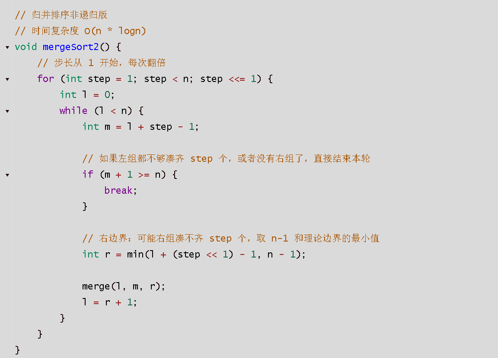

```java
package class021;

// 归并排序，acm练习风格
// 测试链接 : https://www.luogu.com.cn/problem/P1177
// 请同学们务必参考如下代码中关于输入、输出的处理
// 这是输入输出处理效率很高的写法
// 提交以下的code，提交时请把类名改成"Main"，可以直接通过

import java.io.BufferedReader;
import java.io.IOException;
import java.io.InputStreamReader;
import java.io.OutputStreamWriter;
import java.io.PrintWriter;
import java.io.StreamTokenizer;

public class Code01_MergeSort {

	public static int MAXN = 100001;

	public static int[] arr = new int[MAXN];

	public static int[] help = new int[MAXN];

	public static int n;

	public static void main(String[] args) throws IOException {
		BufferedReader br = new BufferedReader(new InputStreamReader(System.in));
		StreamTokenizer in = new StreamTokenizer(br);
		PrintWriter out = new PrintWriter(new OutputStreamWriter(System.out));
		in.nextToken();
		n = (int) in.nval;
		for (int i = 0; i < n; i++) {
			in.nextToken();
			arr[i] = (int) in.nval;
		}
		// mergeSort1(0, n - 1);
		mergeSort2();
		for (int i = 0; i < n - 1; i++) {
			out.print(arr[i] + " ");
		}
		out.println(arr[n - 1]);
		out.flush();
		out.close();
		br.close();
	}

	// 归并排序递归版
	// 假设l...r一共n个数
	// T(n) = 2 * T(n/2) + O(n)
	// a = 2, b = 2, c = 1
	// 根据master公式，时间复杂度O(n * logn)
	// 空间复杂度O(n)
	public static void mergeSort1(int l, int r) {
		if (l == r) {
			return;
		}
		int m = (l + r) / 2;
		mergeSort1(l, m);
		mergeSort1(m + 1, r);
		merge(l, m, r);
	}

	// 归并排序非递归版
	// 时间复杂度O(n * logn)
	// 空间复杂度O(n)
	public static void mergeSort2() {
		// 一共发生O(logn)次
		for (int l, m, r, step = 1; step < n; step <<= 1) {
			// 内部分组merge，时间复杂度O(n)
			l = 0;
			while (l < n) {
				m = l + step - 1;
				if (m + 1 >= n) {
					break;
				}
				r = Math.min(l + (step << 1) - 1, n - 1);
				merge(l, m, r);
				l = r + 1;
			}
		}
	}

	// l....r 一共有n个数
	// O(n)
	public static void merge(int l, int m, int r) {
		int i = l;
		int a = l;
		int b = m + 1;
		while (a <= m && b <= r) {
			help[i++] = arr[a] <= arr[b] ? arr[a++] : arr[b++];
		}
		// 左侧指针、右侧指针，必有一个越界、另一个不越界
		while (a <= m) {
			help[i++] = arr[a++];
		}
		while (b <= r) {
			help[i++] = arr[b++];
		}
		for (i = l; i <= r; i++) {
			arr[i] = help[i];
		}
	}

}
```

# C++实现

这是一份功能完全对应、且符合 ACM/算法竞赛风格的 C++ 代码。

在 C++ 竞赛编程中，为了追求极致的效率，通常会使用**全局数组**来防止栈溢出，并使用**关闭同步流**的方式来加速输入输出。

### C++ 版代码 (ACM 风格)

C++

```C++
#include <iostream>
#include <vector>
#include <algorithm> // 用于 std::min

using namespace std;

// 对应 Java 中的 MAXN
// const int 定义常量
const int MAXN = 100001;

// 在全局数据区定义数组，自动初始化为0，且空间远大于栈空间
// 对应 Java 中的 static int[] arr/help
int arr[MAXN];
int help[MAXN];
int n;

// 归并过程：l....r 一共有 n 个数
// 时间复杂度 O(n)
void merge(int l, int m, int r) {
    int i = l;
    int a = l;
    int b = m + 1;
    
    // 双指针移动
    while (a <= m && b <= r) {
        // 谁小拷贝谁
        help[i++] = (arr[a] <= arr[b]) ? arr[a++] : arr[b++];
    }
    
    // 处理剩余部分
    while (a <= m) {
        help[i++] = arr[a++];
    }
    while (b <= r) {
        help[i++] = arr[b++];
    }
    
    // 将排好序的 help 数组拷贝回原数组 arr
    for (i = l; i <= r; i++) {
        arr[i] = help[i];
    }
}

// 归并排序递归版
// 时间复杂度 O(n * logn)
void mergeSort1(int l, int r) {
    if (l == r) {
        return;
    }
    int m = l + ((r - l) >> 1); // 防溢出的写法，等同于 (l+r)/2
    mergeSort1(l, m);
    mergeSort1(m + 1, r);
    merge(l, m, r);
}

// 归并排序非递归版
// 时间复杂度 O(n * logn)
void mergeSort2() {
    // 步长从 1 开始，每次翻倍
    for (int step = 1; step < n; step <<= 1) {
        int l = 0;
        while (l < n) {
            int m = l + step - 1;
            
            // 如果左组都不够凑齐 step 个，或者没有右组了，直接结束本轮
            if (m + 1 >= n) {
                break;
            }
            
            // 右边界：可能右组凑不齐 step 个，取 n-1 和理论边界的最小值
            int r = min(l + (step << 1) - 1, n - 1);
            
            merge(l, m, r);
            l = r + 1;
        }
    }
}

int main() {
    // --- 核心优化：C++ IO 加速 ---
    // 对应 Java 的 StreamTokenizer 和 PrintWriter 优化
    // 关闭 C++ 标准流与 C 标准流的同步
    ios::sync_with_stdio(false);
    // 解除 cin 与 cout 的绑定
    cin.tie(nullptr);
    
    // 输入 n
    if (cin >> n) {
        // 输入数组元素
        for (int i = 0; i < n; i++) {
            cin >> arr[i];
        }
        
        // 排序，二选一
        // mergeSort1(0, n - 1);
        mergeSort2();
        
        // 输出结果
        for (int i = 0; i < n - 1; i++) {
            cout << arr[i] << " ";
        }
        cout << arr[n - 1] << "\n"; // 使用 \n 而不是 endl，避免强制刷新缓冲区
    }
    
    return 0;
}
```

------

### C++ 知识点补充与扩展

针对这份代码，以下是 Java 程序员转 C++ 算法通过时需要重点掌握的差异和概念：

#### 1. 输入输出加速 (IO Optimization)

- **Java 的痛点**：Java 的 `Scanner` 在处理百万级数据时非常慢，所以代码中使用了 `StreamTokenizer` 和 `PrintWriter`。
- **C++ 的痛点**：`cin` 和 `cout` 默认为了兼容 C 语言的 `scanf` 和 `printf`，会有同步操作，导致效率较低。
- **解决方案**：
  - `ios::sync_with_stdio(false);`：关闭 C++ 流与 C 流的同步。**注意：** 开启后不要混用 `cin` 和 `scanf`。
  - `cin.tie(nullptr);`：默认情况下，`cin` 读取前会强制刷新 `cout` 缓冲区。对于大量输入输出交替的题目，这会严重拖慢速度。这行代码解除了这种绑定。
  - **关于换行**：在 C++ 中，`std::endl` 包含两个动作：`\n` (换行) + `flush` (刷新缓冲区)。频繁刷新极慢。在算法竞赛中，**永远建议使用 `"\n"` 代替 `endl`**。

#### 2. 内存管理：全局数组 vs 动态申请

- **Java**：`arr = new int[MAXN];` 分配在堆（Heap）上。
- **C++**：
  - 如果在 `main` 函数内部写 `int arr[MAXN]`（且 `MAXN` 很大），分配在**栈（Stack）**上。C++ 的栈空间通常只有几 MB（<span style="color:#FF0000; background:#00FF80; border:1px solid #FF00FF;">如 Linux 默认 8MB</span>），定义大数组会导致 `Stack Overflow`。
  - **全局变量（Global）**：<span style="color:#FF0000; background:#00FF80; border:1px solid #FF00FF;">代码中的 `arr` 定义在 `main` 之外。这部分内存分配在**静态存储区（Data Segment / BSS）**，空间极大（通常几 GB），且**自动初始化为 0**。这是算法竞赛的标准写法。</span>

#### 3. 运算符与类型细节

- **位运算**：<span style="border:1px solid #FF00FF; background:#00FF80;">C++ 和 Java 的 `<<`, `>>`, `&`, `|` 基本一致。</span>
  - 注意：C++ 中 `(l + r) / 2` 可能在 `l+r` 很大时溢出 `int` 范围。
  - 更安全的写法是 `l + ((r - l) >> 1)` 或 `l + (r - l) / 2`。
- **`std::min`**：<span style="color:#FF0000; background:#00FF80; border:1px solid #FF00FF;">Java 使用 `Math.min()`。C++ 使用 `<algorithm>` 头文件下的 `std::min()`。</span>
  - 注意：C++ 的 `std::min` 要求两个参数类型严格一致，例如 `min(long_var, 1)` 可能会报错（因为 `1` 是 int），需写成 `min(long_var, 1L)`。

#### 4. STL 排序 vs 手写排序

在实际 C++ 开发或不需要手写归并的竞赛场景中，我们直接使用 STL：

- `std::sort(arr, arr + n);`
  - 底层通常是 **IntroSort**（内省排序）：<span style="color:#FF0000; background:#00FF80; border:1px solid #FF00FF;">混合了快速排序、堆排序和插入排序</span>。平均 $O(N \log N)$，但<span style="color:#FF0000; background:#00FF80; border:1px solid #FF00FF;">不稳定。</span>
- `std::stable_sort(arr, arr + n);`
  - <span style="color:#FF0000; background:#00FF80; border:1px solid #FF00FF;">底层通常就是 **归并排序**</span>。当<span style="color:#FF0000; background:#00FF80; border:1px solid #FF00FF;">需要**稳定性**（即相等元素的相对位置不变）时使用。</span>

#### 5. <span style="color:#FF0000; background:#00FF80; border:1px solid #FF00FF;">宏定义与常量</span>

<span style="color:#FF0000; background:#00FF80; border:1px solid #FF00FF;">Java 中使用 public static int MAXN。</span>

<span style="color:#FF0000; background:#00FF80; border:1px solid #FF00FF;">C++ 中以前常用 #define MAXN 100001 (预处理宏)，但现代 C++ 更推荐 const int MAXN = 100001;，因为后者有类型检查，更安全且便于调试。</span>

### 总结建议

如果你正在准备嵌入式面试或算法笔试：

1. **必背模板**：<span style="color:#FF0000; background:#00FF80; border:1px solid #FF00FF;">IO 加速的三行代码</span>是 C++ 刷题起手式。
2. **非递归思想**：<span style="color:#FF0000; background:#00FF80; border:1px solid #FF00FF;">`mergeSort2` 中的非递归逻辑（步长翻倍法）非常重要，因为它避免了递归带来的栈空间消耗，在嵌入式等内存受限环境或极致优化场景下很有用。</span>

**Would you like me to explain how C++'s `std::vector` manages memory compared to Java's `ArrayList`, given your interest in data structures?**


# 补充提问（C++中的IO）

## 提问1

1.输入输出加速 (IO Optimization)

- **Java 的痛点**：Java 的 `Scanner` 在处理百万级数据时非常慢，所以代码中使用了 `StreamTokenizer` 和 `PrintWriter`。
-  **C++ 的痛点**：`cin` 和 `cout` 默认为了兼容 C 语言的 `scanf` 和 `printf`，会有同步操作，导致效率较低。

- **解决方案**：

  -   `ios::sync_with_stdio(false);`：关闭 C++ 流与 C 流的同步。**注意：** 开启后不要混用 `cin` 和 `scanf`。

  -  `cin.tie(nullptr);`：默认情况下，`cin` 读取前会强制刷新 `cout` 缓冲区。对于大量输入输出交替的题目，这会严重拖慢速度。这行代码解除了这种绑定。

  -  **关于换行**：在 C++ 中，`std::endl` 包含两个动作：`\n` (换行) + `flush` (刷新缓冲区)。频繁刷新极慢。在算法竞赛中，**永远建议使用 `"\n"` 代替 `endl`**。

<span style="color:#FF0000; background:#00FF80; border:1px solid #FF00FF; font-size:1.2em;">上面这里我有点看不太懂，你能够给我详细解释下吗，最好能够举个例子来让我彻底弄明白。</span>

这部分确实是 C++ 竞赛选手的“黑话”重灾区，对于刚从 Java 转过来的人来说，理解这些底层机制非常重要。

我们把计算机的**<span style="color:#FF0000; background:#00FF80; border:1px solid #FF00FF;">输入/输出（I/O）想象成搬运工</span>**，把<span style="color:#FF0000; background:#00FF80; border:1px solid #FF00FF;">数据从**文件/键盘**搬运到**程序内存**里</span>。

下面我用通俗的生活例子分别解释这三点：

------

### 1. `ios::sync_with_stdio(false)`

**含义：关闭 C++ 和 C 的同步通道。**

- 背景：

  <span style="color:#FF0000; background:#00FF80;">C++ 是兼容 C 语言的。</span>

  - C 语言有一套搬运工：`scanf` / `printf`。
  - C++ 自己搞了一套搬运工：`cin` / `cout`。

- 默认情况（开启同步）：

  为了防止你混着用（比如上一行用 printf，下一行用 cout）导致打印顺序错乱，C++ 默认让这两套搬运工强制保持步调一致。

  > 例子：就像<span style="border:1px solid #FF00FF;">两支施工队（C队和C++队）</span>共用一个窄门搬砖。为了不撞在一起，每搬一块砖，C++队都要停下来问C队：“你搬完了吗？我要走了哦。”
  >
  > 结果：大量的时间浪费在互相打招呼（同步）上，速度很慢。

- 优化后（false）：

  <span style="color:#FF0000; background:#00FF80; border:1px solid #FF00FF;">这行代码的意思是：“我向系统保证，我只用 C++ 的 cin/cout，绝不混用 scanf/printf。你们分家吧，各走各的路！”</span>

  > **结果**：<span style="color:#FF0000; background:#00FF80; border:1px solid #FF00FF;">C++ 队独享高速通道，不再理会 C 队，速度瞬间起飞。</span>

------

### 2. `cin.tie(nullptr)`

**含义：<span style="border:1px solid #FF00FF;">解除输入对输出的强制刷新（解绑）</span>。**

- 默认情况（绑定）：

  <span style="background:#00FF80; border:1px solid #FF00FF;">在默认的 C++ 机制里，cin（输入）是绑定在 cout（输出）上的。</span>

  这意味着：<span style="color:#FF0000; background:#00FF80; border:1px solid #FF00FF;">只要你想读取任何数据（cin），系统会强制先把所有积压在输出缓冲区的数据打印出来（cout）。</span>

  > 生活场景（交互式程序）：
  >
  > 程序运行：请输入密码： （这是 cout，此时可能还在缓冲区里没显示）
  >
  > 用户准备输入：（触发 cin）
  >
  > 如果不强制刷新，用户可能对着黑屏发呆，因为“请输入密码”这几个字还没刷到屏幕上。
  >
  > 所以默认必须绑定：你要输入前，我必须先把提示语刷出来给你看。

- 竞赛场景的痛点：

  在算法题里，通常是<span style="color:#FF0000; background:#00FF80; border:1px solid #FF00FF;">把几万个输入一口气读完，或者读一个数、算一个数、输一个数。</span>

  > 例子：你要处理 100 万行数据。
  >
  > cin 读取第 1 行 -> 强制刷新屏幕（把之前的输出挤出去）
  >
  > cin 读取第 2 行 -> 强制刷新屏幕
  >
  > ...
  >
  > 你的程序就像一个强迫症，每吃一口饭（输入），都要先去擦一次嘴（刷新输出），这会严重拖慢吃放的速度。

- 优化后（nullptr）：

  <span style="color:#FF0000; background:#00FF80; border:1px solid #FF00FF;">这行代码的意思是：“读数据就读数据，别管输出那边有没有积压，我不做交互式界面，不需要提示语实时显示。”</span>

------

### 3. `std::endl` vs `"\n"`

**含义：换行符的区别。**

- **`\n`**：仅仅是一个字符，代表“换行”。

  > 相当于你在 Word 里敲了一个回车，光标到了下一行。数据还在内存的**缓冲区**（Buffer）里，等着攒够了一车再发往屏幕/文件。

- **`std::endl`**：<span style="color:#FF0000; background:#00FF80; border:1px solid #FF00FF;">等于 `\n` + `fflush()`（强制刷新）。</span>

  > <span style="border:1px solid #FF00FF;">相当于你在 Word 里敲回车，并且**立刻点击“保存”按钮**，强行把硬盘转起来写入数据。</span>

- <span style="color:#FF0000; background:#00FF80; border:1px solid #FF00FF;">**为什么 `endl` 慢？**</span>

  - **缓冲区（Buffer）的作用**：相当于一辆**大巴车**。数据是乘客。
  - 使用 `\n`：乘客上车，找个座坐下。等车坐满了（缓冲区满了），司机才发车一次。**效率极高**。
  - 使用 `endl`：乘客上车，司机立刻发车，哪怕车上只有这一个人。送完回来再拉下一个。**效率极低**。

  > 测试数据：<span style="border:1px solid #FF00FF;">如果你输出 100 万行整数。</span>
  >
  > <span style="color:#FF0000; background:#00FF80; border:1px solid #FF00FF;">用 \n 可能只要 0.1 秒。</span>
  >
  > <span style="color:#FF0000; background:#00FF80; border:1px solid #FF00FF;">用 endl 可能需要 3.0 秒（直接超时，Time Limit Exceeded）。</span>

------

### 总结与代码示例

为了让你看清楚区别，请看下面的对比：

**慢速写法（Java 的 Scanner 级别）：**

C++

```C++
// 默认同步，默认绑定，频繁刷新
int main() {
    int n;
    cin >> n; 
    for(int i = 0; i < n; i++) {
        cout << i << endl; // 极慢！每次都强制刷新缓冲区
    }
}
```

**极速写法（Java 的 StreamTokenizer 级别）：**

C++

```C++
int main() {
    // 1. 关同步：C++ 独占通道
    ios::sync_with_stdio(false);
    // 2. 解绑定：读入时不强制刷新输出
    cin.tie(nullptr);
    
    int n;
    if (cin >> n) {
        for(int i = 0; i < n; i++) {
            // 3. 只换行，不刷新：攒满缓冲区再一次性喷到屏幕上
            cout << i << "\n"; 
        }
    }
}
```

一句话总结：

<span style="color:#FF0000; background:#00FF80; border:1px solid #FF00FF;">加上这三点优化，C++ 的 cin/cout 就能达到甚至超过 C 语言 scanf/printf 的速度，足以应对所有算法竞赛的 IO 需求。</span>

**现在，你想尝试写一个简单的“读取 100 万个整数并原样输出”的 C++ 程序，来体验一下这两者的速度差异吗？**


# 补充提问 （内存管理：全局数组 vs 动态申请）

## 提问1（进程栈 与 系统栈 区分）

**C++**：

- 如果在 `main` 函数内部写 `int arr[MAXN]`（且 `MAXN` 很大），分配在**栈（Stack）**上。C++ 的栈空间通常只有几 MB（如 Linux 默认 8MB），定义大数组会导致 `Stack Overflow`。
- **全局变量（Global）**：代码中的 `arr` 定义在 `main` 之外。这部分内存分配在**静态存储区（Data Segment / BSS）**，空间极大（通常几 GB），且**自动初始化为 0**。这是算法竞赛的标准写法。

<span style="color:#FF0000; background:#00FF80; border:1px solid #FF00FF;">上面所说的C++的栈空间指的是该进程所占用的栈空间吗，而不是系统栈空间？这两个栈空间都是有什么区别呢，我不是太懂，你能够给我详细解释下吗，最好能够举个例子来让我彻底弄明白。</span>

这是一个非常好的操作系统层面问题！很多初学者（甚至有经验的开发者）都会把“系统的内存”和“程序的栈”搞混。

简单直接的回答：

是的，我指的就是<span style="color:#FF0000; background:#00FF80; border:1px solid #FF00FF;">该进程（Process）内部分配给当前线程的“用户栈（User Stack）”，而不是操作系统内核的栈，也不是你电脑的物理内存总大小。</span>

为了让你彻底明白，我们把这几个概念拆解开，用一个生动的**“公司办公”**的比喻来解释。

------

### 1. 核心概念对比：三个“地盘”

想象你在一家大公司（操作系统）工作，你正在处理一个项目（运行一个进程）。

#### A. 你的办公桌（进程的栈空间 / User Stack）

- **这是什么**：这是程序运行时，专<span style="color:#FF0000; background:#00FF80; border:1px solid #FF00FF;">门留给**函数调用、局部变量**使用的临时空间。</span>
- **特点**：
  - **速度极快**：伸手就能拿到（CPU 访问栈指令优化）。
  - **自动管理**：函数执行完，东西自动清空（出栈）。
  - **空间很小**：<span style="color:#FF0000; background:#00FF80; border:1px solid #FF00FF;">通常只有 **1MB - 8MB**（由操作系统限制，Linux 默认 8MB）。</span>
- **比喻**：这就好比你的**办公桌桌面**。
  - 你可以在上面放笔记本、水杯、几份文件（局部变量）。
  - 但是，如果你试图在桌面上放一台**巨大的集装箱**（`int arr[1000000]`），桌子立刻就塌了（Stack Overflow）。

#### B. 公司的总仓库（<span style="color:#FF0000; background:#00FF80; border:1px solid #FF00FF;">堆空间 & 全局数据区</span> / Heap & Data Segment）

- **这是什么**：
  - **全局变量**（<span style="background:#00FF80; color:#FF0000; border:1px solid #FF00FF;">`static` 或写在 `main` 外面</span>）存在**静态存储区（Data Segment）**。
  - **动态申请**（`new`/`malloc`）存在**堆（Heap）**。
- **特点**：
  - <span style="color:#FF0000; background:#00FF80; border:1px solid #FF00FF;">**空间巨大**：几乎受限于你的物理内存（比如 16GB、32GB）。</span>
  - <span style="color:#FF0000; background:#00FF80; border:1px solid #FF00FF;">**手动/静态管理**：全局变量程序结束才销毁；堆内存需要手动释放（或由 Java GC 回收）。</span>
- **比喻**：这就好比公司的**大型仓库**。
  - 不管多大的集装箱（大数组），只要仓库有地儿，尽管往里塞。
  - 虽然去仓库取东西比在桌面上拿慢一点点，但胜在空间大。

#### C. 系统内核栈（System Stack / Kernel Stack）

- **这是什么**：这是<span style="color:#FF0000; background:#00FF80; border:1px solid #FF00FF;">**操作系统内核**自己代码运行时用的栈。当你的程序进行“系统调用”（比如读取文件、网络通信）进入内核态时，CPU 会使用这个栈。</span>
- **特点**：<span style="color:#FF0000; background:#00FF80; border:1px solid #FF00FF;">极小（通常只有 8KB - 16KB）</span>，用户程序**绝对无法直接触碰**。
- **比喻**：这是**公司CEO的私人保险柜**。里面的东西跟你没关系，你也不能把你的大数组塞进去。

------

### 2. 为什么会“爆栈”？（举个数字例子）

让我们回到代码，用数学来算一算为什么 `int arr[MAXN]` 在 `main` 里面会崩溃。

假设 `MAXN = 2,500,000` (两百五十万)，这是一个算法题中常见的数据规模。

**场景一：在 `main` 内部定义（放在办公桌上）**

C++

```C++
void main() {
    // 局部变量，存放在“栈（Stack）”
    int arr[2500000]; 
}
```

- 一个 `int` 占用 **4 字节**。
- 数组总大小 = $2,500,000 \times 4 \text{ bytes} \approx 10,000,000 \text{ bytes} \approx \mathbf{10 \text{ MB}}$。
- **崩溃原因**：Linux 默认给你的办公桌（栈限制）只有 **8MB**。（<span style="color:#FF0000; background:#00FF80; border:1px solid #FF00FF;">补充理解：2000 个int型数组 arr[1000] 就是8MB</span>）
- 你要在 8MB 的桌子上放 10MB 的东西 -> **Stack Overflow (爆栈)**，<span style="color:#FF0000; background:#00FF80; border:1px solid #FF00FF;">程序直接被操作系统杀掉（Segmentation Fault）。</span>

**场景二：在 `main` 外部定义（放在仓库里）**

C++

```C++
// 全局变量，存放在“静态存储区（Data Segment）”
int arr[2500000]; 

void main() {
    ...
}
```

- **成功原因**：<span style="color:#FF0000; background:#00FF80; border:1px solid #FF00FF;">这个数组存放在静态数据区（仓库）。</span>
- <span style="color:#FF0000; background:#00FF80; border:1px solid #FF00FF;">仓库的大小通常只受限于物理内存（比如你电脑有 16GB）。</span>
- <span style="color:#FF0000; background:#00FF80; border:1px solid #FF00FF;">**10MB** 对于 **16GB** 的仓库来说，简直是九牛一毛。所以程序运行得非常稳。</span>

------

### 3. 为什么栈（Stack）设计得这么小？

你可能会问：“既然我的电脑有 16GB 内存，为什么操作系统只分给栈 8MB？为什么不给栈分 1GB？”

1. **多线程考虑**：一个进程可以有很多个线程。**每个线程都需要自己独立的栈**。如果每个线程默认都分 1GB 栈空间，你开 16 个线程，内存就耗光了。<span style="color:#FF0000; background:#00FF80; border:1px solid #FF00FF;">为了能支持成百上千个线程并发，每个线程的栈必须比较小。</span>
2. **防止递归死循环**：<span style="background:#00FF80; color:#FF0000; border:1px solid #FF00FF;">栈的主要作用是记录函数调用层级</span>。<span style="border:1px solid #FF00FF; color:#FF0000;">如果栈无限大，一个死循环递归（比如 `void a() { a(); }`）会迅速吃光整个电脑的 16GB 内存，导致系统卡死。限制为 8MB，这种死循环会瞬间让程序崩溃，反而保护了整个系统。</span>

### 总结

- **栈空间（Stack）** = **每个线程独享的小书桌**（默认 8MB），放不下大数组。
- **静态区/堆（Data/Heap）** = **共享的大仓库**（几 GB），大数组必须放这里。
- **C++ 算法竞赛铁律**：凡是超过 $10^5$ 级别的数组，**一律定义在 `main` 函数外面（全局变量）**。

Would you like me to clarify how recursion depth in your `mergeSort` relates to this stack limit?


## 提问2（进程与线程控制块存放内核栈里面吗）

<span style="color:#FF0000; background:#00FF80; border:1px solid #FF00FF;">系统内核栈（System Stack / Kernel Stack）空间极小（通常只有 8KB - 16KB）。系统创建的进程控制块还有线程控制块就是存放在这个系统内核栈中的吗，还有进程控制块和线程控制块有什么区别呢，我不是太懂，你能够给我详细解释下吗？</span>

这是一个非常深刻且直指操作系统核心机制的问题！你<span style="border:1px solid #FF00FF; background:#00FF80; color:#FF0000;">通过“栈空间很小”这个线索，敏锐地察觉到了矛盾点。</span>

简短的回答是：<span style="border:1px solid #FF00FF; color:#FF0000; background:#00FF80;">不是。</span>

<span style="color:#FF0000; background:#00FF80; border:1px solid #FF00FF;">PCB（进程控制块）和 TCB（线程控制块）并不存放在那个极小的“系统内核栈”里，而是存放在“系统内核内存的动态分配区（Kernel Heap/Slab）”里。</span>

那个<span style="color:#FF0000; background:#00FF80; border:1px solid #FF00FF;">极小的内核栈（8KB-16KB），是用来跑代码（保存函数调用链）的，不是用来当数据库存这些庞大的结构体的。</span>

为了彻底讲明白，我们需要解决两个问题：

1. **它们到底存在哪？（打破空间限制的迷思）**
2. **PCB 和 TCB 到底有啥区别？（理清关系）**

------

### 一、 它们存在哪？（位置之谜）

#### 1. 为什么不能放在“内核栈”里？

正如你所知，内核栈非常小（8KB - 16KB）。

- **Linux 的 PCB (task_struct)**：在 Linux 中，描述进程/线程的结构体叫 `task_struct`。这是一个非常庞大的结构体，包含了进程的所有信息（打开的文件、内存指针、信号处理、权限等），<span style="color:#FF0000; background:#00FF80; border:1px solid #FF00FF;">大小通常在 **1.7KB 到数 KB** 之间，</span>而且随着内核版本更新还在变大。
- **矛盾**<span style="color:#FF0000; background:#00FF80; border:1px solid #FF00FF;">：如果在 8KB 的栈里塞一个几 KB 的结构体，只要稍微发生一点函数调用（压栈），立马就会溢出（Kernel Panic），导致系统崩溃。</span>

#### 2. 真实的位置：内核堆（Kernel Slab Allocator）

<span style="border:1px solid #FF00FF; color:#FF0000;">操作系统内核管理着整个物理内存。它划分了一块巨大的区域专门给自己用，叫做**内核空间**。</span>

- **PCB/TCB 的家**：当创建一个新进程或线程时，内核会在**内核堆（Kernel Heap）或者Slab 分配器**（一种高效的内核内存分配机制）中，申请一块内存来存放 PCB/TCB。
- **内核栈的作用**：内核栈只存储<span style="border:1px solid #FF00FF; color:#FF0000;">**当前线程在内核态执行时的“临时数据”**（比如系统调用的参数、局部变量、返回地址）。</span>
  - *有趣的小知识*：在旧版本的 Linux 中，内核栈的底部确实存放了一个极小的结构体叫 `thread_info`（它是 TCB 的一小部分），但它通过指针指向外面那个巨大的 `task_struct`。现在为了安全，`thread_info` 也大部分移出去了。

------

### 二、 PCB vs TCB：到底有什么区别？

要理解区别，我们得先区分**“进程（Process）”**和**“线程（Thread）”**的本质。

- **进程（Process）** = **资源分配单位**（房子、钱、车）。
- **线程（Thread）** = **CPU 调度/执行单位**（干活的人）。

#### 1. 形象的比喻：家庭（进程） vs 成员（线程）

想象一个**“三口之家”**：

- **PCB（进程控制块） = 户口本 + 房产证**
  - 它记录了这个家庭**拥有的资源**：房子在哪（内存地址空间）、存款账号（打开的文件）、姓氏（PID）、大门钥匙（权限）。
  - 这些东西是**全家共享**的。爸爸可以用客厅，妈妈也可以用客厅。
- **TCB（线程控制块） = 个人的背包 + 脑子里的任务**
  - 它记录了这个成员**当前的执行状态**：
  - **脑子里的任务（PC 指针）**：我现在干到哪一步了？（刚扫完地，准备拖地）。
  - **个人背包（栈指针）**：我手头暂存了什么私人物品？（手里拿着拖把）。
  - **状态（寄存器）**：我累不累？（运行中、阻塞、就绪）。
  - 这些东西是**私有**的。爸爸在看电视（他的执行流），不能干扰妈妈在做饭（她的执行流）。

#### 2. 详细对比表

| **特性**            | **PCB (Process Control Block)**                              | **TCB (Thread Control Block)**                               |
| ------------------- | ------------------------------------------------------------ | ------------------------------------------------------------ |
| **核心定义**        | 描述**进程**的元数据                                         | 描述**线程**的元数据                                         |
| **侧重点**          | **资源容器**                                                 | **执行上下文**                                               |
| **包含内容 (共享)** | **内存映射表 (Page Table)** **打开的文件描述符 (Files)** 用户ID/组ID (Credentials) 信号处理器 (Signal Handlers) | 无（直接引用所属 PCB 的资源）                                |
| **包含内容 (私有)** | 进程 ID (PID) 父进程指针                                     | **栈指针 (Stack Pointer, SP)** **指令指针 (Program Counter, PC)** **通用寄存器 (Registers)** 线程优先级、调度状态 |
| **切换成本**        | **极高** (切换 PCB 需要切换内存页表，刷新 TLB 缓存)          | **较低** (只切换寄存器和栈，不切换内存页表)                  |
| **对应关系**        | 一个 PCB 可以对应多个 TCB                                    | 一个 TCB 必须属于一个 PCB                                    |

------

### 三、 Linux 的特殊处理（进阶理解）

既然你提到了嵌入式和 Linux，这里有一个**关键的现实扭曲**：

<span style="border:1px solid #FF00FF; color:#FF0000;">**在 Linux 内核眼里，其实没有严格区分 PCB 和 TCB。**</span>

- Linux 只有一种结构体：`task_struct`。
- **进程**：创建时，如果不共享内存、不共享文件，那就是一个独立的进程（PCB）。
- **线程**：创建时（通过 `clone` 系统调用），如果不创建新资源，而是**指向**父进程的内存和文件列表，那它就是线程（TCB）。
  - 所以在 Linux 中，线程也被称为**轻量级进程 (LWP)**。

### 总结

1. **位置**：PCB 和 TCB 存放在**内核的大内存池（Kernel Heap/Slab）**里，绝对不在那个只有 8KB 的内核栈里。
2. **内核栈存什么**：存的是线程进入内核态（比如执行 `read()` 系统调用）时，函数调用链的临时数据。
3. **区别**：
   - **PCB** 管**资源**（内存、文件），大家共用一份。
   - **TCB** 管**执行**（寄存器、栈），每个人自己有一份。

**Would you like me to explain how the "Context Switch" works—specifically what happens to the TCB and Stack when the CPU switches from one thread to another?**


## 提问3（对内核栈保存函数调用链的理解）

<span style="color:#FF0000; background:#00FF80; border:1px solid #FF00FF;">极小的内核栈（8KB-16KB），是用来跑代码（保存函数调用链）的。这里我不是太理解，这里的函数调用链具体指的是什么呢，应该只是普通的函数调用链，你能够给我详细解释下吗，最好能够举个例子来让我彻底弄明白。</span>


这是一个非常棒的追问！你正在触及操作系统“特权级隔离”的核心。

答案是：**<span style="color:#FF0000; background:#00FF80; border:1px solid #FF00FF;">是的，这就是普普通通的函数调用链（A调用B，B调用C），唯一的区别在于这些函数是“操作系统内核”里的函数，而且它们使用的是一块“特权便签纸”——也就是内核栈。</span>**

为了让你彻底弄明白，我们用一个**“银行柜台”**的例子，配合一个真实的代码执行流程来解释。

------

### 一、 形象的比喻：银行大厅 vs 柜员操作台

想象你去银行（操作系统）取钱。

#### 1. 用户栈（User Stack） = 大厅里的客户便签

- **场景**：你在大厅（用户态）填单子。
- **动作**：你在便签上写：“我要取 100 块”，“我的账号是 123”。
- **特点**：这块区域是你自己的，怎么乱写都行。

#### 2. 切换时刻（System Call） = 把单子递进窗口

- 当你把单子递进去的那一刻，你的操作暂时结束了。现在轮到**柜员（内核）**开始工作。
- **关键点**：柜员绝对**不会**用你刚才写字的那张便签纸（用户栈）来记账。
  - *为什么？* 因为你的纸可能脏了，或者你可能趁柜员不注意偷偷改上面的数字（安全隐患）。

#### 3. 内核栈（Kernel Stack） = 柜员桌上的内部记账本

- **场景**：柜员在防弹玻璃后面（内核态），拿出一个**很小的内部记账本（<span style="color:#FF0000; background:#00FF80; border:1px solid #FF00FF;">内核栈，8KB</span>）**。
- **函数调用链（The Chain）**：柜员开始办理业务，每做一步，就在内部记账本上记一笔。

------

### 二、 真实的函数调用链例子：`write()`

假设你在 C++ 代码里写了一行：

C++

```C++
// 用户态代码
printf("Hello World"); 
```

这行代码最终会触发一个**系统调用**（System Call），告诉内核：“请帮我把这些字符写到屏幕（或文件）上”。

这时候<span style="color:#FF0000; background:#00FF80; border:1px solid #FF00FF;">，CPU 从**用户态**切换到**内核态**，并切换到**内核栈**。</span>

让我们看看这 **8KB 的内核栈**里，是如何一层层记录**“内核函数调用链”**的：

#### 1. 第一层：系统调用入口 (`sys_write`)

柜员（内核）接到请求。

- **动作**：<span style="color:#FF0000; background:#00FF80; border:1px solid #FF00FF;">内核调用 `sys_write` 函数。</span>
- **内核栈记录**：（<span style="border:1px solid #FF00FF; color:#FF0000;">补充：此时内核栈记录的就是sys_write ( )这个函数里面的参数信息以及局部变量</span>）
  - <span style="color:#FF0000; background:#00FF80; border:1px solid #FF00FF;">*谁调用的？* (返回地址)</span>
  - <span style="color:#FF0000; background:#00FF80; border:1px solid #FF00FF;">*参数是什么？* (文件描述符, "Hello World" 的地址, 长度)</span>
  - <span style="color:#FF0000; background:#00FF80; border:1px solid #FF00FF;">*局部变量*：检查一下参数合不合法。</span>

#### 2. 第二层：<span style="border:1px solid #FF00FF; color:#FF0000;">虚拟文件系统层 (`vfs_write`)</span>

`sys_write` 发现这是个写操作，于是调用<span style="color:#FF0000; background:#00FF80; border:1px solid #FF00FF;">通用文件接口 `vfs_write`。</span>

- **动作**：<span style="color:#FF0000; border:1px solid #FF00FF;">判断这是一个文件，还是屏幕（设备），还是管道？</span>
- **内核栈记录**：
  - 压入 `sys_write` 的现场（保护上一层）。
  - *局部变量*：当前文件指针的位置。

#### 3. 第三层：<span style="color:#FF0000; border:1px solid #FF00FF;">具体文件系统层 (比如 `ext4_file_write`)</span>

`vfs_write` 发现这是一个保存在硬盘 EXT4 格式分区的文件，于是调用 `ext4_file_write`。

- **动作**：<span style="color:#FF0000; border:1px solid #FF00FF;">计算要写到硬盘的哪个扇区，需要申请新的磁盘块吗？</span>
- **内核栈记录**：
  - 压入 `vfs_write` 的现场。
  - *局部变量*：inode 信息，磁盘块位图。

#### 4. 第四层：<span style="color:#FF0000; border:1px solid #FF00FF;">通用块层 (`submit_bio`)</span>

`ext4` 算好了位置，准备发给硬盘驱动，调用 `submit_bio`。

- **动作**：把请求打包成一个 BIO (Block IO) 结构体。
- **内核栈记录**：
  - 压入 `ext4_file_write` 的现场。
  - *局部变量*：BIO 结构体指针。

#### ... 可能还有更多层 ...

#### <span style="color:#FF0000; background:#00FF80; border:1px solid #FF00FF;">此时，内核栈长这样（由底向上）：</span>

| **栈顶 (Stack Top)** | **<--- 正在执行 submit_bio，这里存放它的局部变量** |
| -------------------- | -------------------------------------------------- |
| **栈帧 4**           | `ext4_file_write` 的返回地址、局部变量             |
| **栈帧 3**           | `vfs_write` 的返回地址、局部变量                   |
| **栈帧 2**           | `sys_write` 的返回地址、局部变量                   |
| **栈底**             | **中断上下文/用户态寄存器备份** (最初进来的现场)   |

<span style="color:#FF0000; background:#00FF80; border:1px solid #FF00FF;">这就是所谓的**“函数调用链”**。</span>

------

### 三、 为什么说这很危险？（8KB 的限制）

请注意，上面这四层调用，每一层都要在栈上占一点地方（比如几十个字节）。

1. **普通的调用链**：<span style="color:#FF0000; background:#00FF80; border:1px solid #FF00FF;">像上面这种写文件，通常只有 5-10 层深，占用几百字节，8KB 绰绰有余。</span>

2. 糟糕的情况（递归）：

   <span style="color:#FF0000; border:1px solid #FF00FF;">如果内核开发者不小心写了一个递归函数，或者调用链太长（比如文件系统套娃：加密层套压缩层套RAID层套物理层...）：</span>

   - A 调用 B, B 调用 C ... 到了第 100 层。
   - 8KB 的小本子记满了！
   - **结果**：**Stack Overflow**。
   - **后果**：在用户态爆栈只是程序崩溃；在内核态爆栈，**整个操作系统会直接崩溃（Kernel Panic / 蓝屏）**，因为内核覆盖了重要数据。

### 四、 总结

你问的“函数调用链”：

1. **实质**：就是指内核代码中 `Function A` 调用 `Function B`，`B` 调用 `C` 的过程。
2. **内容**：栈里存的是这些内核函数的**返回地址**、**参数**和**局部变量**。
3. **区别**：
   - **用户栈**：存的是你写的 `main` -> `mergeSort` 的调用链。
   - **内核栈**：存的是 `sys_write` -> `vfs_write` -> `driver_func` 的调用链。

这下你明白为什么这个栈这么小，但又如此重要了吗？因为它承载了操作系统最底层的逻辑执行过程。


# 补充提问（只读代码区与常量 与 static定义在函数内部存放在哪里）

## 提问1

<span style="color:#FF0000; background:#00FF80; border:1px solid #FF00FF; font-size:1.1em;">我现在已经明白了堆空间和栈空间，那么我的代码和常量是存放在只读数据区是吗，比如 const int MAX = 10000 是存放在只读数据区吗，但是如果我在函数内部定义 const int MAX = 1000 或者 static int th = 1000，此时这个MAX和th是存放在函数栈区的吗，我不是太懂，你能够给我详细解释下吗。 </span>


你现在的理解已经非常接近真相了，但有几个关键的概念（特别是 `static` 和“只读数据区的堆”）混淆在了一起。

别担心，这是内存管理中最容易晕的地方。你需要把内存想象成一个**五层的大蛋糕**，而不仅仅是堆和栈。

我们直接针对你提出的三个变量，把它们精确地放到这个“大蛋糕”的对应层级里。

------

### 核心纠正：内存五大分区

在 C++ 程序运行起来时，内存主要分为这 5 个区域（地址从低到高）：

1. **代码区 (Text Segment)**：存放你的代码指令（二进制机器码）。**只读**。
2. **只读数据区 (.rodata)**：存放<span style="color:#FF0000; background:#00FF80; border:1px solid #FF00FF;">全局常量、字符串常量</span>。**只读**。
3. **全局/静态数据区 (.data / .bss)**：存放全局变量、静态变量。**读写**。
4. **堆区 (Heap)**：`new` / `malloc` 出来的东西。
5. **栈区 (Stack)**：函数的局部变量。

------

### 你的三个例子分别在哪？

#### 1. 全局常量 `const int MAX = 10000;`

> 位置：<span style="color:#FF0000; background:#00FF80; border:1px solid #FF00FF;">只读数据区 (.rodata)</span>        <span style="color:#FF0000; background:#00FF80; border:1px solid #FF00FF;">（补充：rodata 的 全称是 read-only-data，即只读数据）</span>
>
> （<span style="color:#FF0000; background:#00FF80; border:1px solid #FF00FF;">你提到的“只读数据区的堆”是不存在的，堆是堆，只读区是只读区，它们是分开的领地。</span>）

- **解释**：
  - 因为它写在 `main` 外面（全局），而且加了 `const`（不可修改）。
  - 编译器会把它放在一个专门受保护的区域。如果你试图通过指针强制修改它，程序会直接报错崩溃（Segmentation Fault）。
- **注意**：对于简单的 `int`，现代编译器极其聪明，可能根本不给它分配内存，而是直接把它作为一个“立即数”写死在**代码区**的指令里（比如 `mov eax, 10000`）。但从概念上讲，它属于只读数据区。

#### 2. 函数内部 `const int MAX = 1000;`

> **位置**：**<span style="color:#FF0000; background:#00FF80; border:1px solid #FF00FF;">栈区 (Stack)</span>**

- **解释**：
  - <span style="color:#FF0000; background:#00FF80; border:1px solid #FF00FF;">虽然它有 `const`，但它定义在函数**内部**。</span>
  - 这就<span style="color:#FF0000; background:#00FF80; border:1px solid #FF00FF;">好比你在**办公桌（栈）**上贴了一张便利贴，上面写着“不准改”。</span> （<span style="color:#FF0000; background:#00FF80; border:1px solid #FF00FF;">补充：这是栈上常量，栈上不能够修改的数据</span>）
  - 它是跟随函数的生命周期的。函数执行完，这个 `MAX` 就随着栈帧销毁了。
- **编译器优化**：和上面一样，如果是简单的整数，编译器往往会直接把它优化掉，变成指令中的立即数（存放在**代码区**），但这属于优化范畴，逻辑上它属于栈。

#### 3. 函数内部 `static int th = 1000;` （<span style="color:#FF0000; background:#00FF80; border:1px solid #FF00FF;">重点！</span>）

> 位置：<span style="color:#FF0000; background:#00FF80; border:1px solid #FF00FF;">全局/静态数据区 (.data)</span>
>
> 你的猜测：“存放在函数栈区吗？” -> 错！ 绝对不在栈区。

- **这是初学者最大的误区**：
  - <span style="color:#FF0000; background:#00FF80; border:1px solid #FF00FF;">`static` 关键字如果在函数内部使用，它的意思是：**“作用域（Scope）是局部的，但生命周期（Lifetime）是全局的”。**</span>
- **详细解释**：
  - **位置**：它<span style="border:1px solid #FF00FF; color:#FF0000;">和全局变量挤在一起，住在**静态数据区**（仓库），而不是栈（办公桌）</span>。
  - **生命周期**：程序一开始运行，它就诞生了；程序结束，它才销毁。**<span style="color:#FF0000; background:#00FF80; border:1px solid #FF00FF;">函数执行完返回时，它依然存在，数值也会保留！</span>**
  - **作用域**：<span style="color:#FF0000; background:#00FF80; border:1px solid #FF00FF;">虽然它住在仓库里，但编译器加了一把锁，**只有这个函数内部的代码**有权去仓库里拿它。别的函数看不见它。</span>

------

### 总结对照表

为了让你彻底弄懂，我们来看这个终极对比：

C++

```C++
#include <iostream>

// --- 1. 全局常量 ---
// 位置：只读数据区 (.rodata) 
// (或者被编译器优化进代码区)
const int GLOBAL_MAX = 10000; 

// --- 2. 全局变量 ---
// 位置：全局数据区 (.data)
int global_var = 555;

void myFunction() {
    // --- 3. 局部常量 ---
    // 位置：栈区 (Stack)
    // 只有这次函数调用期间有效，函数结束就没了
    const int local_const = 1000; 

    // --- 4. 局部变量 ---
    // 位置：栈区 (Stack)
    int local_var = 20;

    // --- 5. 局部静态变量 (你的重点疑问) ---
    // 位置：全局数据区 (.data)
    // 注意：它和 global_var 住在同一个大仓库里！不在栈上！
    // 只是只有 myFunction 知道它的名字。
    static int static_var = 1000; 
    
    static_var++; // 每次调用函数，它都会在上次的基础上 +1
    
    // --- 6. 动态申请 ---
    // 指针 p 本身：在栈区 (Stack)
    // p 指向的那块内存：在堆区 (Heap)
    int* p = new int[10];
}

int main() {
    myFunction();
    return 0;
}
```

### 形象的比喻

- **代码区** = **员工手册**（大家都能看，谁都不能改，印在纸上的）。
- **只读数据区 (Global Const)** = **公司大门口的铜牌**（写着公司名字，焊死的，谁都不能改）。
- **全局数据区 (Global/Static)** = **公司档案室**（很安全，永久保存）。
  - `global_var` = 档案室里的公共档案，谁都能拿。
  - `static int th` = 档案室里的**私人保险箱**，只有你能打开，但它一直都在档案室里，你下班回家（函数返回）它也在那。
- **栈区 (Local / Local Const)** = **你的办公桌**（临时放东西，下班清洁工就给清空了）。

**现在清楚了吗？特别是 `static` 那个“住在仓库里的私人保险箱”的概念，是理解 C/C++ 内存陷阱的关键。**


# 自己实现代码（归并排序的递归方式）

## 洛谷平台上自己实现

```C++
#include <iostream>


const int MAX=100001;
int arr[MAX];
int help[MAX];
int n;

void mergeSort1(int l,int m,int r) {  //递归方式实现归并排序
    if(l==r)
        return ;
    
    mergeSort1(l,l+(m-1)>>2,m);
    mergeSort1(m+1,m+1+(r-m-1)>>2,r);
    merge(l,m,r);
    
}

void merge(int l,int m,int r){
    int a=l,b=m+1;
    int c=l;
    while(a<=m && b<=r){
        help[c++] = arr[a] <= arr[b] ? arr[a++]:arr[b++];        
    }

    while(a<=m){
        help[c++] = arr[a++];
    }

    while(b<=r){
        help[c++] = arr[b++];
    }

    for(int i=l ; i<=r ;i++){
        arr[i] = help[i];
    }
}


int main(){
    sys_write_stdio(false);
    cin.tie(nullptr);
    
    if( cin>>n) {
        for(int i=0; i<n; i++){
            cin>>arr[i];
        }

        int l,m,r;
        m = l+(r-1)>>2;
        mergeSort1(l,m,r);

        for(int i=0; i<n-1){
            cout<<arr[i]<<" ";
        }

        cout<<arr[n-1]<<"\n";
    }

    return 0;
}
```

## 代码编译错误分析1：

这份代码有几个非常明显的**编译错误**（会导致红字报错）和**严重的逻辑错误**（会导致运行结果错误或死循环）。

别担心，这是从 Java 转 C++ 以及初学算法时非常典型的“坑”。我们要一个一个把它填上。

### 1. 修正后的完整代码

先给你一份**可以直接提交通过**的修正代码，然后我再详细解释你原来哪里写错了。

C++

```C++
#include <iostream>
#include <vector>

using namespace std; // 1. 必须加上命名空间，否则 cin/cout 找不到

const int MAX = 100001;
int arr[MAX];
int help[MAX];
int n;

// 2. C++ 需要“前向声明”或者把被调用的函数写在上面
// 因为 mergeSort 要调用 merge，所以 merge 必须定义在前面
void merge(int l, int m, int r) {
    int a = l, b = m + 1;
    int c = l;
    while (a <= m && b <= r) {
        help[c++] = arr[a] <= arr[b] ? arr[a++] : arr[b++];
    }
    while (a <= m) {
        help[c++] = arr[a++];
    }
    while (b <= r) {
        help[c++] = arr[b++];
    }
    for (int i = l; i <= r; i++) {
        arr[i] = help[i];
    }
}

// 3. 归并排序递归函数的签名通常只需要 l 和 r
void mergeSort1(int l, int r) {
    if (l == r)
        return;

    // 4. 优先级灾难：位运算 >> 优先级低于 +
    // 你的写法：l + (r - 1) >> 1  会被解析成 (l + r - 1) >> 1
    // 推荐写法：必须加括号！或者直接用 /2
    int m = l + ((r - l) >> 1); 

    mergeSort1(l, m);
    mergeSort1(m + 1, r);
    merge(l, m, r);
}

int main() {
    // 5. 拼写错误修正
    // 不是 sys_write_stdio，而是 ios::sync_with_stdio
    ios::sync_with_stdio(false);
    cin.tie(nullptr);

    if (cin >> n) {
        for (int i = 0; i < n; i++) {
            cin >> arr[i];
        }

        // 6. 调用错误修正
        // 不需要在这里算 m，也不需要定义局部变量 l,m,r
        // 直接告诉排序函数：从 0 排到 n-1
        mergeSort1(0, n - 1);

        // 7. for 循环语法错误修正
        // 你漏掉了 i++，这会导致死循环
        for (int i = 0; i < n - 1; i++) { 
            cout << arr[i] << " ";
        }
        cout << arr[n - 1] << "\n";
    }

    return 0;
}
```

------

### 2. 详细错误分析

#### 🔴 编译错误 (导致无法运行)

1. **函数定义顺序问题**：
   - **你的代码**：`mergeSort1` 在前面，`merge` 在后面。但是 `mergeSort1` 里面调用了 `merge`。
   - **原因**：C++ 编译器是从上往下读的。读到 `mergeSort1` 时，它心里想：“`merge` 是个什么东西？我还没见过啊！”
   - **解决**：<span style="color:#FF0000; background:#00FF80; border:1px solid #FF00FF;">把 `merge` 函数的代码剪切粘贴到 `mergeSort1` **上面**。</span>
2. **IO 优化的拼写错误**：
   - **你的代码**：`sys_write_stdio(false);`
   - **原因**：这是你凭记忆写的吧？C++ 里没有这个函数。
   - **解决**：是 `ios::sync_with_stdio(false);` （standard input output / sync / with / standard io）。
3. **for 循环语法残缺**：
   - **你的代码**：`for(int i=0; i<n-1)`
   - **原因**：for 循环必须有三部分：初始值；条件；**步进**。你少写了 `i++`。
   - **后果**：如果有 `i++` 只是漏写，编译器报错；如果没报错，那就是**死循环**，因为 `i` 永远是 0。
4. **变量未初始化**：
   - **你的代码**：`int l,m,r; mergeSort1(l,m,r);`
   - **原因**：在 C++ 中，`int l;` 声明的局部变量，其值是**内存里的随机垃圾值**（比如 -842150451）。你把这些垃圾值传进函数，程序会立刻访问非法内存崩溃。

#### ⚠️ 逻辑错误 (导致排序不对)

1. **递归函数的参数设计**：
   - **你的代码**：`void mergeSort1(int l,int m,int r)`
   - **问题**：`m`（中点）是根据 `l` 和 `r` 算出来的，不应该作为参数传进来。
   - **修正**：改成 `void mergeSort1(int l, int r)`，然后在函数内部计算 `m`。
2. <span style="color:#FF0000; background:#00FF80; border:1px solid #FF00FF;">**位运算优先级的坑**：</span>
   - **你的代码**：`l+(m-1)>>2` (这里还有个由 m 导致的逻辑混乱，暂且不谈，只谈符号优先级)
   - **知识点**：<span style="color:#FF0000; background:#00FF80; border:1px solid #FF00FF;">在 C++ 中，**加减法 `+ -` 的优先级 比 位运算 `>> <<` 高！**</span>
   - **演示**：
     - `l + r >> 1` ❌ 等于 `(l + r) >> 1` （虽然这个是对的）
     - `l + (r - l) >> 1` ❌ 等于 `(l + r - l) >> 1` （这就错了！）
   - **解决**：<span style="color:#FF0000; background:#00FF80; border:1px solid #FF00FF;">凡是位运算，**一律加括号**！`l + ((r - l) >> 1)`。</span>

### 3. C++ 学习建议

你<span style="color:#FF0000; background:#00FF80; border:1px solid #FF00FF;">对算法逻辑（归并、双指针）掌握得不错，主要卡在 **C++ 语法特性** 上</span>。

1. **先定义，后使用**：这一点和 Java 不同（Java 可以随便放顺序）。C++ 习惯把辅助函数（如 `merge`）写在主逻辑（`mergeSort`）上面，把 `main` 写在最下面。
2. **局部变量不初始化很危险**：Java 会默认把 `int l` 设为 0，C++ **绝不会**。一定要养成 `int l = 0;` 的习惯。
3. **位运算加括号**：不要去背优先级表，只要看到 `>>` `&` `^`，就把它们包在括号里，保证不出错。

试着把修改后的代码提交一下，应该就能 AC 了！


## 代码错误分析2

```C++
#include <iostream>


const int MAX=100001;
int arr[MAX];
int help[MAX];
int n;


void merge(int l,int m,int r){
    int a=l,b=m+1;
    int c=l;
    while(a<=m && b<=r){
        help[c++] = arr[a] <= arr[b] ? arr[a++]:arr[b++];        
    }

    while(a<=m){
        help[c++] = arr[a++];
    }

    while(b<=r){
        help[c++] = arr[b++];
    }

    for(int i=l ; i<=r ;i++){
        arr[i] = help[i];
    }
}


void mergeSort1(int l,int m,int r) {  //递归方式实现归并排序
    if(l==r)
        return ;
    
    mergeSort1(l,l+((m-l)>>1),m);
    mergeSort1(m+1,m+1+((r-m-1)>>1),r);
    merge(l,m,r); 
}


int main(){
    sync_write_stdio(false);
    cin.tie(nullptr);
    
    if( cin>>n) {
        for(int i=0; i<n; i++){
            cin>>arr[i];
        }

        int l,m,r;
        m = l+(r-1)>>2;
        mergeSort1(l,m,r);

        for(int i=0; i<n-1; i++){
            cout<<arr[i]<<" ";
        }

        cout<<arr[n-1]<<"\n";
    }

    return 0;
}
```

这份代码依然**无法运行**，且存在几个**致命的逻辑错误**。虽然你修正了 `merge` 函数的位置，但<span style="color:#FF0000; background:#00FF80; border:1px solid #FF00FF;">现在的核心问题在于**“如何进行递归”**以及**“主函数如何调用”**。</span>

我们需要像做手术一样，切除 4 个具体的病灶：

### 病灶 1：<span style="color:#FF0000; background:#00FF80; border:1px solid #FF00FF;">递归函数的参数定义错误（最严重的逻辑问题）</span>

- **你的写法**：`void mergeSort1(int l, int m, int r)`
  - **错误点**：你<span style="color:#FF0000; background:#00FF80; border:1px solid #FF00FF;">不应该把 `m`（中点）作为参数传进去！</span>
  - **原因**：归并排序的思路是：“给我一个范围 `[l, r]`，我自己会在内部算出中点 `m`，然后切开”。如果你必须在外面算出 `m` 传进去，那递归的时候下一层、下下层的 `m` 谁算？这会导致逻辑彻底崩塌。
- **修正**：参数只需要 `l` 和 `r`。

### 病灶 2：中点计算逻辑错误

- **你的写法**：`l + ((m - l) >> 2)`
  - **错误点 A**：<span style="color:#FF0000; background:#00FF80; border:1px solid #FF00FF;">为什么要 `>> 2`（除以 4）？归并排序是**二分**，必须是 `>> 1`（除以 2）。</span>
  - **错误点 B**：你<span style="color:#FF0000; background:#00FF80; border:1px solid #FF00FF;">在参数里依赖 `m` 来计算新的 `m`，这是循环论证。</span>
- **修正**：在函数内部定义 `int mid = l + ((r - l) >> 1);`。

### 病灶 3：<span style="color:#FF0000; background:#00FF80; border:1px solid #FF00FF;">main 函数中的“垃圾值”调用</span>

- **你的写法**：

  C++

  ```
  int l, m, r;          // 1. 声明了变量，但没赋值（C++里这是随机垃圾值，比如 -19283）
  m = l + (r - 1) >> 2; // 2. 用垃圾值算出了另一个垃圾值
  mergeSort1(l, m, r);  // 3. 把垃圾值传进函数 -> 访问 arr[-19283] -> 程序立即崩溃
  ```

- **修正**<span style="color:#FF0000; background:#00FF80; border:1px solid #FF00FF;">：直接传入确定的范围。你要排序的是整个数组，所以是从 `0` 到 `n-1`。写成 `mergeSort1(0, n-1);` 即可。</span>

### 病灶 4：依然存在的拼写和命名空间错误

- `sync_write_stdio` 依然写错了，是 `ios::sync_with_stdio`。
- 缺少 `using namespace std;`，编译器不认识 `cin` 和 `cout`。

------

### ✅ 最终修正版代码 (直接替换你的代码)

请仔细对比 `mergeSort1` 函数和 `main` 函数的改动：

C++

```C++
#include <iostream>
#include <algorithm> // 推荐加上，虽然这里没用到 min，但竞赛常用

using namespace std; // 【重要】必须加上这个，否则 cin/cout 报错

const int MAX = 100001;
int arr[MAX];
int help[MAX];
int n;

// merge 函数逻辑是对的，保持不动
void merge(int l, int m, int r) {
    int a = l, b = m + 1;
    int c = l;
    while (a <= m && b <= r) {
        help[c++] = arr[a] <= arr[b] ? arr[a++] : arr[b++];
    }
    while (a <= m) {
        help[c++] = arr[a++];
    }
    while (b <= r) {
        help[c++] = arr[b++];
    }
    for (int i = l; i <= r; i++) {
        arr[i] = help[i];
    }
}

// 【重要修改】
// 1. 参数只留 l 和 r。
// 2. 不要传 m 进来，m 是在这个函数内部算出来的。
void mergeSort1(int l, int r) { 
    if (l == r) {
        return;
    }
    
    // 【重要修改】
    // 在这里计算中点。使用 >> 1 (除以2)，而不是 >> 2。
    // 这里的逻辑是：l + (r - l) / 2
    int m = l + ((r - l) >> 1);
    
    // 递归左边：l ... m
    mergeSort1(l, m);
    
    // 递归右边：m+1 ... r
    mergeSort1(m + 1, r);
    
    // 合并
    merge(l, m, r); 
}

int main() {
    // 【重要修改】拼写修正
    ios::sync_with_stdio(false);
    cin.tie(nullptr);
    
    if (cin >> n) {
        for (int i = 0; i < n; i++) {
            cin >> arr[i];
        }

        // 【重要修改】
        // 不需要定义 int l, m, r; 
        // 也不需要自己算 m。
        // 直接告诉函数：我要排 0 到 n-1 的范围。
        mergeSort1(0, n - 1);

        for (int i = 0; i < n - 1; i++) {
            cout << arr[i] << " ";
        }
        cout << arr[n - 1] << "\n";
    }

    return 0;
}
```

### 为什么不能像你那样传 `m`？

我们来看一张简单的图，理解递归是如何自己寻找中点的：

1. **Main 调用**：`mergeSort(0, 5)`。此时它自己算出 `m = 2`。
2. **第一层递归**：它分别叫醒两个手下：`mergeSort(0, 2)` 和 `mergeSort(3, 5)`。
3. **第二层递归**：`mergeSort(0, 2)` 醒来，它**自己计算**出它的中点 `m = 1`。

如果你在 main 函数里就算好 `m` 传进去，那第二层、第三层的手下用什么中点呢？它们就没法工作了。所以**中点必须在函数内部现场计算**。


# 修改后成功AC的代码

<span style="color:#FF0000; background:#00FF80; border:1px solid #FF00FF;">注意：下面   mergeSort1(l,l+((m-l)>>1),m);    mergeSort1(m+1,m+1+((r-m-1)>>1),r); 逻辑是没有错的，不过推荐还是只传l 和r。</span>

```C++
#include <iostream>
using namespace std;

const int MAX=100001;
int arr[MAX];
int help[MAX];
int n;


void merge(int l,int m,int r){
    int a=l,b=m+1;
    int c=l;
    while(a<=m && b<=r){
        help[c++] = arr[a] <= arr[b] ? arr[a++]:arr[b++];        
    }

    while(a<=m){
        help[c++] = arr[a++];
    }

    while(b<=r){
        help[c++] = arr[b++];
    }

    for(int i=l ; i<=r ;i++){
        arr[i] = help[i];
    }
}


void mergeSort1(int l,int m,int r) {  //递归方式实现归并排序
    if(l==r)
        return ;
    
    mergeSort1(l,l+((m-l)>>1),m);
    mergeSort1(m+1,m+1+((r-m-1)>>1),r);
    merge(l,m,r); 
}


int main(){
    ios::sync_with_stdio(false);
    cin.tie(nullptr);
    
    if( cin>>n) {
        for(int i=0; i<n; i++){
            cin>>arr[i];
        }

    
        mergeSort1(0,(n-1)/2,n-1);

        for(int i=0; i<n-1; i++){
            cout<<arr[i]<<" ";
        }

        cout<<arr[n-1]<<"\n";
    }

    return 0;
}
```

## 代码分析

## 提问1 ( cin 和 cout 输入格式 的问题 )


<span style="color:#FF0000; background:#00FF80; border:1px solid #FF00FF;">这里 cin 和 cout 输入格式我有点不太懂，你能够给我详细解释下吗，还有 if( cin>>n) 这句代码我有点看不太懂，给我解释下。</span>

这张图片展示的是一个非常标准的 ACM/OJ（在线判题系统）的输入输出要求。对于从 Java 转 C++ 的选手来说，`cin` 的行为其实比 Java 的 `Scanner` 更加智能和方便。

针对你的疑问，我分两部分详细解释：

------

### 1. <span style="color:#FF0000; background:#00FF80; border:1px solid #FF00FF;">`cin` 是如何处理“空格隔开”的？</span>

图片中写着：“<span style="border:1px solid #FF00FF;">第二行包含 $N$ 个空格隔开的正整数</span>”。

在 C++ 中，<span style="color:#FF0000; background:#00FF80; border:1px solid #FF00FF;">`cin` 有一个非常强大的特性：**它默认会跳过所有的空白字符（空格、Tab、换行符）**。</span>

#### 你的困惑可能在于：

“我需要像 Java 那样用 `split(" ")` 切分字符串吗？或者需要判断读到的是空格还是数字吗？”

#### 答案是：完全不需要。

当你写 `cin >> arr[i];` 时，`cin` 的内部动作流程是这样的：

1. **跳过垃圾**：它<span style="color:#FF0000; background:#00FF80; border:1px solid #FF00FF;">会先“吃掉”当前位置所有的空格、换行符，直到遇到第一个非空白字符（即数字的开始）</span>。
2. **读取数字**：它开始读取数字字符，直到再次遇到一个非数字字符（比如下一个空格或换行）。
3. **赋值**：把读到的这段数字转换成 `int` 赋值给 `arr[i]`。
4. **停下**：光标停在那个非数字字符前面，等待下一次读取。

举个例子：

<span style="color:#FF0000; background:#00FF80; border:1px solid #FF00FF;">假设输入流是这样的（_ 代表<span style="font-weight:bold;">空格</span>，\n 代表换行）：</span>

5\n10_20___30\n40_50

代码：

C++

```C++
for (int i = 0; i < 5; i++) {
    cin >> arr[i];
}
```

- `i=0`: 跳过 `\n`，读到 `10`，遇到 `_` 停下。
- `i=1`: 跳过 `_`，读到 `20`，遇到 `_` 停下。
- `i=2`: 跳过 `___` (三个空格)，读到 `30`，遇到 `\n` 停下。
- ...以此类推。

**总结**：<span style="color:#FF0000; background:#00FF80;">你根本不用管输入也就是空格还是换行，`cin` 会自动帮你把它们都当作“分隔符”处理掉。</span>

------

### 2. `if (cin >> n)` 是什么意思？

这句代码是算法竞赛中的**“防身术”**，是 C++ 程序员的一种标准写法。

#### 它的含义拆解：

1. 动作：cin >> n

   尝试从输入流中读取一个整数给 n。

2. 返回值：cin 对象本身

   \>> 运算符执行完后，会返回 cin 流对象本身。

3. 布尔判断：if (...)

   当把 cin 对象放在 if 的括号里时，C++ 会自动调用一个转换函数，检查**“刚才那次读取是否成功”以及“流是否还正常”**。

   - <span style="color:#FF0000; background:#00FF80; border:1px solid #FF00FF;">**如果成功读取了 n**：表达式结果为 `true`，进入 `if` 内部执行</span>。
   - <span style="color:#FF0000; background:#00FF80; border:1px solid #FF00FF;">**如果读取失败**（比如文件结束 EOF，或者输入了非法字符）：表达式结果为 `false`，跳过 `if` 内部。</span>

#### 为什么要这么写？

这主要为了处理 **End Of File (EOF)** 情况。

- **场景 A（本地运行）**：你输入 `5`，回车。`cin >> n` 成功，返回 true，程序继续运行读取后面的数组。
- **场景 B（OJ 系统评测）**：OJ 系统可能会用一个空文件来测试你的程序，或者输入格式突然中断。
  - 如果不写 `if`，直接写 `cin >> n;`，然后紧接着开数组循环。如果输入为空，`n` 就是一个未初始化的垃圾值（比如 0 或 负数），后面的代码就会乱跑甚至崩溃。
  - 写了 `if (cin >> n)`，如果文件读完了或者读取出错，程序就不会进入核心逻辑，安全退出。

通俗理解：

这就好比你去自动售货机买水：

if (尝试投币) -> “如果投币成功，我就按按钮选饮料；如果投币口堵住了塞不进去，那我就直接走人，不执行后面的操作。”

------

### 3. 关于输出格式（Output）

图片要求：“数之间空格隔开，行末换行且无空格”。

这是 OJ 题目最经典的**“栅栏柱问题”**（Fencepost Problem）：

- 如果你有 5 个数，你需要 4 个空格。
- 格式必须是：`数 空格 数 空格 数 空格 数 空格 数 换行`
- 绝对不能是：`数 空格 ... 数 空格 换行` （这样行末多了一个空格，会被判格式错误）。

所以我们之前的代码采用了 **$0$ 到 $N-2$** 的循环策略：

C++

```C++
// 先打印前 N-1 个数，每个后面跟一个空格
for (int i = 0; i < n - 1; i++) {
    cout << arr[i] << " "; 
}
// 最后单独打印第 N 个数，后面跟换行，而不是空格
cout << arr[n - 1] << "\n";
```

这样就完美符合了图片中的输出要求：**行末无空格**。


## 提问2

<span style="color:#FF0000; background:#00FF80; border:1px solid #FF00FF;">如果我使用cin来读取字符呢，此时输入的格式又是什么样的呢，我不是太懂，你能够给我详细解释下吗？</span>

这是一个非常关键的区别！在算法竞赛中，处理字符（`char`）输入时的“坑”比处理整数要多，理解这一点非常重要。

我们分两种情况来讨论：<span style="color:#FF0000; background:#00FF80; border:1px solid #FF00FF;">**普通的 `cin >> c`** 和 **读取所有字符（包括空格）的 `cin.get()`**。</span>

------

### 情况一：使用标准的 `cin >> c`

**规则：** <span style="color:#FF0000; background:#00FF80; border:1px solid #FF00FF;">`cin` 对待字符（char）和对待整数（int）的态度是一模一样的——**它有“洁癖”，极其讨厌空白字符。**</span>

- **它的行为**：
  1. **自动跳过**：它会跳过所有的空格（Space）、制表符（Tab）、换行符（Enter）。
  2. **抓取一个**：它只抓取**第一个**遇到的“非空白字符”。
  3. **立刻停手**<span style="color:#FF0000; background:#00FF80; border:1px solid #FF00FF;">：抓到一个后，光标停在这个字符后面，准备下一次读取</span>。

#### 举个例子

假设你的输入是这样的（`_` 代表空格，`\n` 代表回车）：

Plaintext

```
__A_
B__
```

代码如下：

C++

```C++
char x, y;
cin >> x;
cin >> y;
```

**执行流程：**

1. **`cin >> x`**：
   - 看到两个空格 `__` -> **跳过**。
   - 看到 `'A'` -> **拿走**，赋值给 `x`。
   - （`x` 现在是 `'A'`）
2. **`cin >> y`**：
   - 看到 `'A'` 后面的空格 `_` -> **跳过**。
   - 看到换行符 `\n` -> **跳过**。
   - 看到 `'B'` -> **拿走**，赋值给 `y`。
   - （`y` 现在是 `'B'`）

**总结**：如果你用 `cin >> c`，你的输入格式可以很随意，**不管你中间加了多少空格或回车，程序读到的都是那些“实实在在”的字母**。

------

### 情况二：我想读取空格怎么办？(`cin.get()`)

**规则：** <span style="color:#FF0000; background:#00FF80; border:1px solid #FF00FF;">有时候题目要求你处理整个字符串（包含空格），或者读取迷宫地图（空格代表路），这时候标准的 `cin` 就不行了。你需要用 `cin.get()`。</span>

- **它的行为**：
  - **绝不挑食**：它把输入流看作一串单纯的字节流。
  - **见啥吃啥**：<span style="color:#FF0000; background:#00FF80; border:1px solid #FF00FF;">空格、回车、Tab，在它眼里都是普通的字符，读到一个算一个。</span>

#### 举个例子

还是同样的输入：

Plaintext

```
__A_
B
```

代码如下：

C++

```C++
char c;
// 循环读取每一个字符，直到文件结束
while(cin.get(c)) {
    cout << "我读到了: " << (int)c << endl; // 打印ASCII码方便观察
}
```

**执行流程**：

1. 第一次 `cin.get(c)` -> 读到空格（ASCII 32）。
2. 第二次 `cin.get(c)` -> 读到空格（ASCII 32）。
3. 第三次 `cin.get(c)` -> 读到 `'A'`（ASCII 65）。
4. 第四次 `cin.get(c)` -> 读到空格（ASCII 32）。
5. 第五次 `cin.get(c)` -> 读到换行符 `\n`（ASCII 10）。
6. ...以此类推。

------

### 形象对比图

想象输入流是一条传送带，上面放着： `[空格] [空格] [A] [空格] [B]`

| **命令**         | **行为模式**                                                 | **读到了什么**   |
| ---------------- | ------------------------------------------------------------ | ---------------- |
| **`cin >> c`**   | **挑食模式**：把前面的“垃圾包装”（空格）全扔了，只拿里面的货（A）。 | `x = 'A'`        |
| **`cin.get(c)`** | **扫地模式**：传送带过来什么我就拿什么，哪怕是个空盒子（空格）我也收下。 | `x = ' '` (空格) |

### 你的场景建议

回到你的归并排序或者一般的算法题：

1. **如果是读数字、读无空格的字符串**：
   - 放心用 `cin >> arr[i]` 或 `cin >> charVal`。这是最安全的，不用担心多敲了几个空格。
2. <span style="color:#FF0000; background:#00FF80; border:1px solid #FF00FF;">**只有一种特殊情况要小心**：</span>
   - <span style="color:#FF0000; background:#00FF80; border:1px solid #FF00FF;">如果你在读完一个整数 `cin >> n` 后，立刻想用 `getline` 读取一整行字符串。</span>
   - 这时候 `cin >> n` 会把那个整数读走，<span style="border:1px solid #FF00FF; color:#FF0000;">**但是把输入整数后的那个“回车符”留在了缓冲区里**。</span>
   - 紧接着的 `getline` 会读到这个遗留的“回车符”，以为一行结束了，结果读了个空寂寞。
   - **解决**：在两者中间加一句 `cin.ignore()` 吃掉那个回车。

对于你现在的 **归并排序** 题目，因为它全是整数，所以**完全不需要担心这个问题**，`cin` 会帮你搞定一切格式问题。


# <span style="color:#FF0000; background:#00FF80; border:1px solid #FF00FF;">总结感悟：</span>

（1）对于main函数调用的第一层的递归，递归函数直接传具体指，例如 mergeSort(0,n-1)，在 mergeSort()函数里面调用的递归使用函数内部定义的局部变量，例如mergeSort()函数内部定义了局部变量 int m = l+((r-l)>>1);   则此时 mergeSort() 函数内调用mergeSort的参数为 mergeSort(l,m) 处理左半部分，mergeSort(m+1,r)处理右半部分。


（2）使用位运算符时候一律加上括号，因为加减乘除的优先级大于位运算符，例如 l + ( ( r-l ) >>1 )，不能够是 l + (r-1) >> 1 <==> ( l + (r-l) ) >> 1。记住一个等价式子：( left + right ) / 2  <====> left + (  ( right-left ) >> 1 )。

（3）下面这两句中的函数参数是属于下一个函数栈空间的，这里m是可以通过l和r算出来的，作为参数传递其实就没有必要了，可以简化成 int m = l + ( ( r-l )>>1 )，mergeSort1(l,m)，mergeSort1(m+1,r)。

 mergeSort1(l,l+((m-l)>>1),m);
 mergeSort1(m+1,m+1+((r-m-1)>>1),r);


# 自己实现代码（归并排序的非递归方式—迭代方式实现）

<span style="color:#FF0000; background:#00FF80; border:1px solid #FF00FF;">提示：没有思路，参考原来代码实现，把下面代码思想给学会就行。</span>




## 自己对照着实现（注意下面和上面图片中 r 的计算方式是一样的，我的更加直观点）

```C++
#include <iostream>
using namespace std;

const int MAX=100001;
int arr[MAX];
int help[MAX];
int n;


void merge(int l,int m,int r){
    int a=l,b=m+1;
    int c=l;
    while(a<=m && b<=r){
        help[c++] = arr[a] <= arr[b] ? arr[a++]:arr[b++];        
    }

    while(a<=m){
        help[c++] = arr[a++];
    }

    while(b<=r){
        help[c++] = arr[b++];
    }

    for(int i=l ; i<=r ;i++){
        arr[i] = help[i];
    }
}


// void mergeSort1(int l,int m,int r) {  //递归方式实现归并排序
//     if(l==r)
//         return ;
    
//     mergeSort1(l,l+((m-l)>>1),m);
//     mergeSort1(m+1,m+1+((r-m-1)>>1),r);
//     merge(l,m,r); 
// }

void mergeSort2(){ //非递归方式（迭代）实现归并排序
    for(int step=1; step<n; step <<= 1){
        int l=0; //step代表步长，也就是左右组中元素数量
        /* 当左组和右组都只有1个元素的时候左组和右组本身就是处于有序状态，
        归并已经有序的左组和右组，形成数组中两两元素有序的状态。

        接着步长变为2，归并两两有序变成4个一组有序的状态，当step > n-1的
        时候，说明数组变成step（>n）个有序状态,数组本身有序。
        */
        while(l<n){  
            int m = l + step -1;

            if( m>=(n-1) ){  
            /*  m 代表了左组的最后1个，若 m>= (n-1){从0开始计数，故数组中
                最后1个为n-1}，说明 没有右组了，此时左组就已经是排好序的
                状态，由于我们的目的就是归并已经是有序的左右组，也就不需
                要执行下面归并左右组的操作。跳出这个while循环，执行下一个
                step步长的for循环
                */
                break;
            }

            //右组第1个数为 m+1，右组最后1个为r
            int r = min( m+1 +  step - 1,n-1);
            merge(l,m,r);

            l = r + 1; // l ~ r 整体有序，接着从r+1开始
        }
    }
}


int main(){
    ios::sync_with_stdio(false);
    cin.tie(nullptr);
    
    if( cin>>n) {
        for(int i=0; i<n; i++){
            cin>>arr[i];
        }

    
        //mergeSort1(0,(n-1)/2,n-1);
        mergeSort2();

        for(int i=0; i<n-1; i++){
            cout<<arr[i]<<" ";
        }

        cout<<arr[n-1]<<"\n";
    }

    return 0;
}
```

## 代码注释总结

你这份非递归（迭代）版本的代码写得非常漂亮！逻辑严密，尤其是对边界的处理非常到位。

<span style="color:#FF0000; background:#00FF80;">非递归版归并排序（Bottom-Up Merge Sort）通常比递归版难写，因为全是索引计算</span>。为了让你对这些注释**印象深刻**，我不再堆砌文字，而是用**“打擂台/行军”**的形象思维来重新总结你的注释，并补充一个核心的**“防越界安全网”**概念。

这里有一个归并排序的图解，帮助你视觉化这个过程：

### 核心思维模型：军团合并

想象 `N` 个士兵排成一列。

#### 1. 外层循环：`step` (步长) —— 军团规模升级

> ```
> for(int step=1; step<n; step <<= 1)
> ```

- **你的理解**：1个有序 -> 2个有序 -> 4个有序。
- **形象扩展（军团升级）**：
  - **第一轮 (`step=1`)**：单兵作战。每 1 个兵是一个小队，尝试和旁边 1 个兵合并。
  - **第二轮 (`step=2`)**：2人组作战。每 2 人是一个小队，尝试和旁边 2 人合并。
  - **第三轮 (`step=4`)**：4人组作战...
  - **结束条件**：当一个小队的规模超过总人数的一半时，也就是下一次合并就是整个大军了，循环结束。

#### 2. 内层循环：`l` (Left) —— 检阅每一个左侧小队

> ```
> while(l < n)
> ```

- **形象扩展**：指挥官从左走到右，每次抓取当前位置的 **“左军团”**，准备给它找个 **“右军团”** 来合并。

#### 3. 关键判定：`m` (Mid) —— 左军团的边界

> int m = l + step - 1;
>
> if (m >= n - 1) break;

- **你的注释**：<span style="color:#FF0000; background:#00FF80; border:1px solid #FF00FF;">如果 `m` 后面没有数了，说明没有右组，直接跳出。</span>
- **印象深刻版总结（落单的幸存者）**：
  - <span style="color:#FF0000; background:#00FF80; border:1px solid #FF00FF;">`m` 是左军团的最后一个人。</span>
  - <span style="color:#FF0000; background:#00FF80; border:1px solid #FF00FF;">如果 `m` 已经站在（或超过）了队伍的尽头 (`n-1`)，说明 **“后面没人了”**。</span>
  - **潜台词**：既然没有右军团（对手），那这个左军团本轮**直接轮空晋级**！它已经是这部分里最大的有序块了，不需要操作，直接下一轮见。

#### 4. 最核心的难点：`r` (Right) —— 右军团的“防越界安全网”

> ```
> int r = min(m + 1 + step - 1, n - 1);
> ```

- **你的注释**：取最小值。
- **深度扩展（为什么要 min？）**：这是非递归写法的**灵魂**，也是最容易写出 Bug 的地方。
  - **理想情况**：左军团有 `step` 人，右军团也有 `step` 人。右边界理论上是 `m + step`。
  - **现实情况（残缺的右组）**：数组长度不一定是 2 的幂次方（比如 N=10）。
    - 当 `step=4` 时，左军团 4 人，右军团**可能只剩下 2 人**就到数组尽头了。
  - **安全网逻辑**：`min` 函数就是那个安全网。它在说：“我想凑齐 `step` 个人的右军团，但如果数组到头了（`n-1`），那就**有什么算什么**，把剩下的全算作右军团。”

------

### 沉浸式注释版代码 (C++ 风格)

我把你的逻辑融入了更精炼的 C++ 竞赛风格注释中，建议保存这份：

C++

```C++
#include <iostream>
#include <algorithm> // 必须引入，用于 std::min

using namespace std;

const int MAX = 100001;
int arr[MAX];
int help[MAX]; // 辅助数组
int n;

// merge 函数逻辑不变，略...
void merge(int l, int m, int r) {
    int a = l, b = m + 1;
    int c = l;
    while (a <= m && b <= r) {
        help[c++] = arr[a] <= arr[b] ? arr[a++] : arr[b++];
    }
    while (a <= m) help[c++] = arr[a++];
    while (b <= r) help[c++] = arr[b++];
    for (int i = l; i <= r; i++) arr[i] = help[i];
}

// 非递归归并排序 (迭代版)
// 优势：没有递归深度限制，适合嵌入式或栈空间受限的环境
void mergeSort2() {
    // step: 步长。代表当前正在合并的“子组”长度。
    // 变化轨迹: 1 -> 2 -> 4 -> 8 ...
    for (int step = 1; step < n; step <<= 1) {
        
        // l: 当前这一轮合并的“左组”起点
        int l = 0;
        
        while (l < n) {
            // m: 左组的终点位置
            int m = l + step - 1;
            
            // 【关键判断 1】落单检测
            // 如果左组的终点 m 已经触碰到或超过数组末尾，
            // 说明后面没有“右组”可以跟它匹配了。
            // 当前左组本轮直接轮空，不需要合并，直接结束本层循环。
            if (m >= n - 1) {
                break;
            }
            
            // 【关键判断 2】右组边界修正
            // 理论上右组范围: [m+1, m+step]
            // 但数组可能没那么长，所以右边界 r 必须在 "理论终点" 和 "数组真实末尾 n-1" 中取较小值。
            // 防止数组越界访问 (Out of Bounds)。
            int r = min(l + (step << 1) - 1, n - 1);
            
            // 执行合并
            merge(l, m, r);
            
            // l 移动到下一对需要合并的组的起点
            l = r + 1;
        }
    }
}

int main() {
    // IO 加速
    ios::sync_with_stdio(false);
    cin.tie(nullptr);
    
    if (cin >> n) {
        for (int i = 0; i < n; i++) cin >> arr[i];
        
        mergeSort2();
        
        for (int i = 0; i < n - 1; i++) cout << arr[i] << " ";
        cout << arr[n - 1] << "\n";
    }
    return 0;
}
```

### 总结给你的“记忆锚点”

以后写非递归归并，脑子里过这三关：

1. **步长翻倍** (`step <<= 1`)：像折纸一样，每次厚度翻倍。
2. **左组落单** (`if m >= n-1 break`)：后面没人了，左组直接晋级。
3. **右组残缺** (`min`)：右组不够凑了，有多少算多少，**别越界**。
