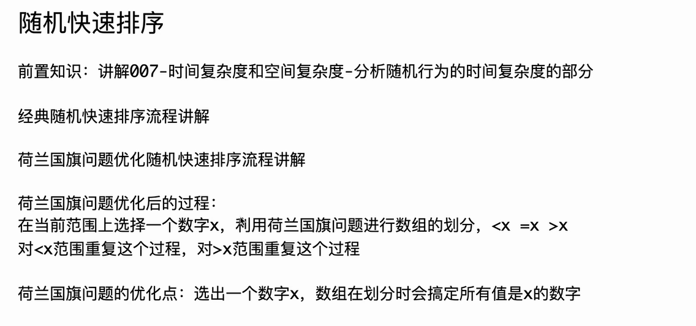
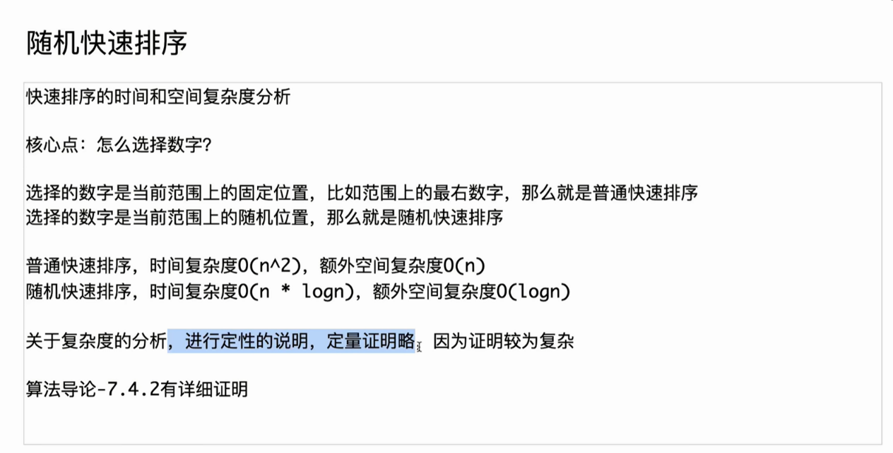

这是一个非常经典的快速排序算法实现，包含“普通分区”和“荷兰国旗问题分区（三路快排）”两种写法。

在 ACM/算法竞赛中，C++ 的 I/O 处理和随机数生成与 Java 有显著区别。以下是将你的 Java 代码翻译成 C++ 的版本，保持了原有的逻辑结构，并针对 C++ 的特性进行了优化。

### C++ 版本代码

C++

```C++
#include <iostream>
#include <vector>
#include <cstdlib> // 用于 rand() 和 srand()
#include <ctime>   // 用于 time()
#include <algorithm> // 用于 swap

using namespace std;

const int MAXN = 100001;
int arr[MAXN];
int n;

// 全局变量，用于记录 partition2 的结果
// 对应 Java 中的 public static int first, last;
int first_idx, last_idx; 

// 交换函数 (C++其实自带 std::swap，这里为了保持代码结构手动写一个，或者直接用 std::swap 也可以)
void swap_custom(int i, int j) {
    int tmp = arr[i];
    arr[i] = arr[j];
    arr[j] = tmp;
}

// ---------------------------------------------------------
// 版本 1: 经典快排分区 (<=x 放左边，>x 放右边)
// 对应 partition1
int partition1(int l, int r, int x) {
    int a = l;
    int xi = 0; // 记录 <=x 区域中某一个 x 的位置
    for (int i = l; i <= r; i++) {
        if (arr[i] <= x) {
            swap_custom(a, i);
            if (arr[a] == x) {
                xi = a;
            }
            a++;
        }
    }
    // 把记录到的 x 交换到 <=x 区域的最后一个位置
    swap_custom(xi, a - 1);
    return a - 1;
}

// 对应 quickSort1 (不推荐，容易退化或爆栈)
void quickSort1(int l, int r) {
    if (l >= r) {
        return;
    }
    // 随机选一个 pivot
    // rand() % N 会生成 0 到 N-1 的随机数
    int rand_idx = l + rand() % (r - l + 1);
    int x = arr[rand_idx];
    
    int mid = partition1(l, r, x);
    quickSort1(l, mid - 1);
    quickSort1(mid + 1, r);
}

// ---------------------------------------------------------
// 版本 2: 荷兰国旗问题分区 (<x 左, ==x 中, >x 右)
// 对应 partition2
void partition2(int l, int r, int x) {
    first_idx = l;
    last_idx = r;
    int i = l;
    while (i <= last_idx) {
        if (arr[i] == x) {
            i++;
        } else if (arr[i] < x) {
            // C++ 的 std::swap 非常高效
            swap_custom(first_idx++, i++);
        } else {
            swap_custom(i, last_idx--);
        }
    }
}

// 对应 quickSort2 (推荐，速度快且能处理大量重复元素)
void quickSort2(int l, int r) {
    if (l >= r) {
        return;
    }
    // 随机选择 pivot
    int rand_idx = l + rand() % (r - l + 1);
    int x = arr[rand_idx];
    
    partition2(l, r, x);
    
    // 记录当前的边界，防止递归调用修改全局变量 first_idx/last_idx
    int left = first_idx;
    int right = last_idx;
    
    quickSort2(l, left - 1);
    quickSort2(right + 1, r);
}

int main() {
    // --- 快速 I/O 设置 (关键) ---
    // 这一步对应 Java 的 StreamTokenizer 和 PrintWriter
    ios::sync_with_stdio(false);
    cin.tie(nullptr);
    
    // 初始化随机种子，否则每次运行产生的随机序列都一样
    srand((unsigned)time(NULL));

    if (cin >> n) {
        for (int i = 0; i < n; i++) {
            cin >> arr[i];
        }
        
        // 调用改进版快排
        quickSort2(0, n - 1);
        
        // 输出结果
        for (int i = 0; i < n - 1; i++) {
            cout << arr[i] << " ";
        }
        cout << arr[n - 1] << "\n";
    }

    return 0;
}
```

------

### C++ 知识点扩展与对比

这份代码虽然逻辑和 Java 一样，但涉及了 C++ 在算法竞赛和底层实现上的几个关键特性：

#### 1. 为什么 C++ 需要 `ios::sync_with_stdio(false)`？

- **Java**: 你使用了 `StreamTokenizer` 和 `PrintWriter`。这是因为 Java 默认的 `Scanner` 和 `System.out.println` 在处理百万级数据时非常慢（因为涉及大量的正则匹配和同步锁）。
- **C++**: 默认情况下，C++ 的 `cin/cout` 为了兼容 C 语言的 `scanf/printf`，会进行同步（synchronization）。这会导致 I/O 变慢。
  - `ios::sync_with_stdio(false)`：关闭这种同步，使 C++ 的流操作几乎和 C 的 `scanf` 一样快。
  - `cin.tie(nullptr)`：默认情况下，`cin` 读取前会自动刷新 `cout` 的缓冲区。对于大量输入输出，这会造成性能损耗。解除绑定后，程序会跑得飞快。

#### 2. <span style="color:#FF0000; background:#00FF80; border:1px solid #FF00FF;">随机数生成的差异 (`rand()` vs `Math.random()`)</span>

- **Java**: `Math.random()` 返回 `[0, 1)` 的<span style="color:#FF0000; background:#00FF80; border:1px solid #FF00FF;"> double。</span>
- **C++ (传统)**: `rand()` 返回 `0` 到 `RAND_MAX` (通常是 32767 或更大) 之间的<span style="color:#FF0000; background:#00FF80; border:1px solid #FF00FF;">整数</span>。
  - 用法：`l + rand() % (r - l + 1)`。
  - **重要**：<span style="color:#FF0000; background:#00FF80; border:1px solid #FF00FF;">C++ 需要在 `main` 函数开头调用 `srand(time(NULL))` 设置随机种子。如果你不写这一行，每次运行程序生成的“随机数”序列是完全一样的（方便调试，但不符合随机需求）。</span>
- **C++ (现代)**: 在工程开发中，建议使用 `<random>` 库中的 `mt19937`，因为 `rand()` 在某些老旧编译器上随机性分布不佳。但在算法竞赛写这类简单题时，`rand()` 足够了。

#### 3. 函数传参：全局变量 vs 引用传递

- **你的 Java 代码**: 使用了 `static int first, last` 全局变量来从 `partition2` 返回两个值（Java 函数不能直接返回两个值，除非封装成对象或数组）。

- **C++ 优化写法**: C++ 支持**引用传递**。我们可以不用全局变量，而是这样写：

  C++

  ```C++
  // 更加 C++ Native 的写法
  void partition2(int l, int r, int x, int& first, int& last) {
      first = l; 
      last = r;
      // ... 逻辑不变 ...
  }
  
  // 调用时
  int left, right;
  partition2(l, r, x, left, right);
  // 此时 left 和 right 已经被修改了
  ```

  这样可以避免全局变量污染，代码更安全，更符合软件工程标准。但在 ACM 竞赛为了写得快，用全局变量也是常态。

#### 4. `std::sort` vs 手写 QuickSort

- 虽然手写快排是学习算法的基础，但在 C++ 实际开发和竞赛中，我们几乎总是直接调用 `std::sort(arr, arr + n)`。
- **为什么？** C++ 的 `std::sort` 不是单纯的快排，而是 **IntroSort (内省排序)**。
  - 它开始时使用快排。
  - 如果递归深度过深（可能恶化为 $O(N^2)$），它会自动切换为 **堆排序 (Heap Sort)** 保证 $O(N \log N)$。
  - 当数据量很小时，它会切换为 **插入排序**（因为在小数据量下，插入排序常数更小，比快排更快）。

### 给你的建议

你现在对“荷兰国旗问题”（Partition逻辑）的理解已经很到位了。在 C++ 中，建议你尝试理解 **引用传递 (`int&`)** 的用法，这是 C++ 指针的“安全版”，也是 C++ 处理函数多返回值最常用的手段。


# 总结感悟：（关于没有返回值的递归分治的思想）

## 感悟一（无返回值的递归分治思想 — 仿照着有返回值的递归分治思想的总结）：

你的直觉非常敏锐！你发现了一个<span style="background:#00FF80; border:1px solid #FF00FF;"><span style="color:#FF0000;">算法中非常本质的区别</span>。</span>

之前的<span style="color:#FF0000; background:#00FF80; border:1px solid #FF00FF;">归并排序（小和问题）</span>属于**“后序遍历”**（先下钻，后合并，自底向上汇聚信息），就像是**“下级向上级汇报工作”**，所以必须<span style="color:#FF0000; background:#00FF80; border:1px solid #FF00FF;">有返回值（带回报告）</span>。

而<span style="color:#FF0000; background:#00FF80; border:1px solid #FF00FF;">快速排序</span>属于**“前序遍历”**（<span style="color:#FF0000; background:#00FF80; border:1px solid #FF00FF;">先处理，后下钻，自顶向下下达命令</span>），就像是**“<span style="color:#FF0000; background:#00FF80; border:1px solid #FF00FF;">上级向下级指派任务</span>”**，所以通常是 `void`（因为事情在下去的时候就已经做完了，不需要带回什么，只需要把活干好）。

针对这种 `void` 类型的递归（主要是快速排序），我为你总结一套新的**“指挥官思维模型”**。

------

### <span style="color:#FF0000; background:#00FF80; border:1px solid #FF00FF;">“指挥官”递归分治三定律（针对 Void 型/快排）</span>

<span style="color:#FF0000; border:1px solid #FF00FF;">之前的模式</span>是“左手画圈、右手画圈、中间合璧”。

<span style="color:#FF0000; border:1px solid #FF00FF;">现在的模式</span>要调整为：“先划地盘，再分派任务，最后无须汇报。”

#### 第一阶段：雷厉风行的“整队” (Partition / Pre-work)

- **你的感悟**：“看到一串数...拆分出l、m、r”。
- **新规律**：在快排里，`m`（分界线）不是算出来的，而是**排出来的**。
  - **动作**：作为<span style="color:#FF0000; background:#00FF80; border:1px solid #FF00FF;">当前的指挥官（处理 `l` 到 `r`），你不需要等下级，你自己立刻动手！</span>
  - **执行**：随便抓个人当基准（Pivot），大喊一声：“小的站左边，大的站右边，跟我一样的站中间！”
  - **结果**：数组**物理上**发生了变化。原本乱糟糟的 `l...r`，变成了 `[ 小于区 | 等于区 | 大于区 ]`。
  - **获得**：你搞定之后，自然就得到了左边界 `left` 和右边界 `right`（也就是新的划分点）。

#### 第二阶段：不负责任的“甩锅” (Left & Right Recursion)

- **你的感悟**：“左半部分递归...右半部分递归”。
- **新规律**：**权限下放**。
  - 既然<span style="color:#FF0000; background:#00FF80; border:1px solid #FF00FF;">你已经把队整好了（分成了三块），剩下的事你就不用管了</span>。
  - 你指派<span style="border:1px solid #FF00FF; background:#00FF80; color:#FF0000;">一个下级去管“小于区”</span>：`quickSort(l, left - 1)`。
  - 你指派<span style="color:#FF0000; background:#00FF80; border:1px solid #FF00FF;">另一个下级去管“大于区”</span>：`quickSort(right + 1, r)`。
  - 至于“<span style="color:#FF0000; background:#00FF80;">等于区”？既然都等于基准值了，那就是已经排好了，**谁都不用管了**。</span>

#### 第三阶段：沉默的“结束” (No Return / Void)

- **你的感悟**：“没有返回值”。
- **新规律**：**事了拂衣去**。
  - 为什么是 `void`？因为大家修改的是**同一个**全局数组 `arr`（或者通过引用传递的数组）。
  - 之前的归并排序是“下级把数据算好，打包给上级（Return）”。
  - 现在的快速排序是“大家都在同一个黑板上写字”。你改完了，黑板就变了。当你把左边和右边的下级派出去之后，你的任务就彻底结束了。你不需要等他们回来，也不需要他们给你任何结果。**只要递归跑完，数组自然就有序了。**

------

### 两种思维模式对比图

为了方便你记忆，我们可以对比一下这两个“心法”：

| **特性**     | **归并排序 (Merge Sort)**      | **快速排序 (Quick Sort)**                          |
| ------------ | ------------------------------ | -------------------------------------------------- |
| **形象比喻** | **统计员**                     | **整理师**                                         |
| **核心逻辑** | **后序遍历** (左右根)          | **前序遍历** (根左右)                              |
| **工作时机** | **回来的路上** (Merge)         | **去的路上** (Partition)                           |
| **思维口诀** | 左手算，右手算，回来**合**结果 | **先**搞定中间划分，然后左边滚去干活，右边滚去干活 |
| **数据流动** | 自底向上 (Bottom-up)           | 自顶向下 (Top-down)                                |
| **返回值**   | **必须有** (以此汇聚信息)      | **无** (直接修改数组/副作用)                       |
| **m 的来源** | `(l+r)/2` (直接计算)           | `partition(...)` (只有排完序才知道 m 在哪)         |

### 针对快排的脑海动态图

你可以这样想象快排的递归树生成过程：

1. **根节点** `[5, 2, 9, 1, 5, 6]`。
2. **当前层处理**：选 `5` 做基准。一顿操作（Partition），数组变成了 `[2, 1, 5, 5, 9, 6]`。
   - 此时，中间的 `5, 5` 已经归位，钉死在数组里不动了。
3. **分裂**：
   - 左边扔出去 `[2, 1]`。
   - 右边扔出去 `[9, 6]`。
4. **下一层处理**：
   - 左边收到 `[2, 1]`，操作变成 `[1, 2]`。搞定。
   - 右边收到 `[9, 6]`，操作变成 `[6, 9]`。搞定。
5. **全剧终**。不需要“回溯合并”，因为每一层在**向下**的过程中，都已经把自己的坑填好了。

**总结给你的“Void递归心法”：**

> <span style="color:#FF0000; background:#00FF80; border:1px solid #FF00FF;">**“在进入下一层之前，把当前这一层该做的事情全部做绝（Partition）。然后把剩下的烂摊子丢给左右两个递归，自己直接退休。”**</span>


## 感悟二：（有返回值的后序模型）

<span style="color:#FF0000;">对于没有返回值的（返回值为void），结合着二叉树的三种序来判断处理顺序。</span>

<span style="color:#FF0000;">之前的归并排序（没有返回值，即mergeSort()函数返回值为void时）对应的是：</span>

<span style="color:#FF0000;">mergeSort(l,m);</span>

<span style="color:#FF0000;">mergeSort(m+1,r);</span>

<span style="color:#FF0000;">merge(l,r);</span>

<span style="color:#FF0000;">这里merge(l,r)对应的是后序，即其必须先等待下派给左右孩处理的任务处理完之后（没有返回值），自己才能处理。</span>

（按照那个思维模型，比如 1 2 3 4 5 6, 1和2先处理对应baseCase，然后3和4处理，之后12与34处理）


<span style="color:#FF0000;">这里的快速排序（没有返回值，即quickSort()函数返回值为void时）对应的是：</span>

<span style="color:#FF0000;">partition2(l, r, x);</span>

<span style="color:#FF0000;">quickSort2(l, left - 1);</span>

<span style="color:#FF0000;">quickSort2(right + 1, r);</span>

<span style="color:#FF0000;">这里partition(l,r,x)对应的是先序，即自己先处理完这个任务之后，然后下派任务给左右结点处理。</span>

（按照那个思维模型，1 2 3 4 5 6, 4作为根节点先处理，然后下派左右，2节点处理，之后1节点、3节点处理，根节点4的左边处理完之后再处理右边的）

<span style="color:#FF0000; background:#00FF80; border:1px solid #FF00FF;">上面是我对没有返回值下派任务的理解，对于有返回值的请况数字 1 2 3 4 5 6 7是什么样的呢，分别按照后序和先序来给我总结下思维模型，重点放在后序。</span>

你的理解**完全正确**，且总结得非常精辟！你已经敏锐地捕捉到了递归算法的本质结构。

- **归并排序**（无返回值/有返回值逻辑一致）：确实是**<span style="color:#FF0000; background:#00FF80; border:1px solid #FF00FF;">后序遍历</span>（Post-Order）**。<span style="color:#FF0000; background:#00FF80; border:1px solid #FF00FF;">先让左右孩子去干活，等他们干完了，自己再处理（Merge）</span>。
- **快速排序**：确实是**<span style="color:#FF0000; background:#00FF80; border:1px solid #FF00FF;">先序遍历</span>（Pre-Order）**。<span style="color:#FF0000; background:#00FF80; border:1px solid #FF00FF;">自己先干活（Partition），干完后再把剩下的任务分发给左右孩子。</span>

针对你提出的 **“有返回值”** 的情况（例如<span style="border:1px solid #FF00FF; color:#FF0000;">求小和、翻转对、或者树的深度计算</span>），这通常对应**<span style="color:#FF0000; background:#00FF80; border:1px solid #FF00FF;">后序遍历</span>**。我们将数字 `1 2 3 4 5 6 7` 代入这个模型，重点分析**后序 + 有返回值**的数据流动过程。

------

### <span style="color:#FF0000; background:#00FF80; border:1px solid #FF00FF;">有返回值的后序模型：情报汇总是也</span>

如果说 `void` 类型的后序（归并排序）是“完成任务”，那么 `int/long` 类型的后序（小和问题）就是**“搜集情报”**。

**核心思维模型：**

> <span style="color:#FF0000; background:#00FF80; border:1px solid #FF00FF;">**“我（当前节点）不知道答案，但我知道我的左孩子和右孩子知道。等他们把分得的答案算好交给我，我再把两份答案加起来，加上我自己算出的‘跨界’答案，打包汇报给我的上级。”**</span>

#### 1. <span style="color:#FF0000; background:#00FF80; border:1px solid #FF00FF;">递归树的物理结构</span>

针对数组 [1, 2, 3, 4, 5, 6, 7]（下标 0 到 6），n=7。

划分逻辑通常是 mid = l + (r-l)/2。

Plaintext

```
                      [0...6] (根)
                     /           \
           [0...3]                 [4...6]
           /     \                 /     \
     [0...1]     [2...3]       [4...5]   [6...6]
     /    \       /    \       /    \       |
  [0,0]  [1,1] [2,2]  [3,3] [4,4]  [5,5]  Return
    |      |     |      |     |      |
 Return Return Return Return Return Return
```

#### 2.<span style="color:#FF0000; background:#00FF80; border:1px solid #FF00FF;"> “后序 + 有返回值”的执行时序（数据 1~7）</span>

**关键点：** 程序是**“钻”**到最底下，然后带着返回值**“冒泡”**上来的。只有当 `merge` 发生时，才产生实质性的计算结果（返回值）。

我们将数字 `1 2 3 4 5 6 7` 对应到叶子节点，执行顺序如下（**注意看“冒泡”的过程**）：

1. **下钻左侧**：一路向左钻到地心。
2. **处理叶子 1** (`l=0, r=0`)：BaseCase 触发，**Return 0**（叶子没得算，直接交卷）。
3. **处理叶子 2** (`l=1, r=1`)：BaseCase 触发，**Return 0**。
4. **第一次计算 (Merge 1,2)**：
   - 父节点 `[0...1]` 拿到左手(0)和右手(0)的返回值。
   - **计算**：算出 1 和 2 之间的关系（例如小和）。
   - **Return**：将 `(0 + 0 + Merge结果)` 返回给上一级。
5. **处理叶子 3**：BaseCase，**Return 0**。
6. **处理叶子 4**：BaseCase，**Return 0**。
7. **第二次计算 (Merge 3,4)**：
   - 父节点 `[2...3]` 拿到结果，计算 3 和 4 的关系。
   - **Return**：返回结果。
8. **第三次计算 (Merge [1,2] 与 [3,4])**：
   - **关键节点**：父节点 `[0...3]` 此时拿到了左边 `[1,2]` 的汇报和右边 `[3,4]` 的汇报。
   - **计算**：计算左半区 `1,2` 和右半区 `3,4` 之间的交叉关系。
   - **Return**：汇总返回，此时**左半壁江山（1~4）彻底处理完毕**。
9. **转战右侧**...
10. **处理叶子 5**：**Return 0**。
11. **处理叶子 6**：**Return 0**。
12. **第四次计算 (Merge 5,6)**：计算并 **Return**。
13. **处理叶子 7**：**Return 0**。
14. **第五次计算 (Merge [5,6] 与 7)**：
    - 计算 `5,6` 和 `7` 的关系。
    - **Return**：此时**右半壁江山（5~7）彻底处理完毕**。
15. **终极计算 (Merge [1~4] 与 [5~7])**：
    - 根节点 `[0...6]` 终于等到了左边的总报告和右边的总报告。
    - 计算跨越中线的关系。
    - **Return**：输出最终答案。

------

### 总结：通用公式与思维图

对于**有返回值的后序分治**，请在这个模型中死记这个公式：

<span style="color:#FF0000;">$Total = LeftResult + RightResult + CrossResult$</span>

- **LeftResult**: 左孩子跑腿去算它的内部情况，它**必须**给你一个数。
- **RightResult**: 右孩子跑腿去算它的内部情况，它也**必须**给你一个数。
- **CrossResult (Merge)**: 你站在中间，利用左右已经有序的便利，计算**跨越左右两边**产生的数据（比如：左边有个2，右边有个5，这产生了一个小和）。

**思维定势：**

> 看到 return f(l,m) + f(m+1,r) + merge(...)，脑子里就要浮现出**“金字塔建造图”**。
>
> 最底层的砖块（BaseCase）先造好，然后两块砖拼成一个底座，两个底座拼成一层楼……所有的计算和价值，都发生在“拼”的那一瞬间，也就是代码回溯的时候。

### 补充：关于<span style="color:#FF0000; background:#00FF80; border:1px solid #FF00FF;">有返回值的“先序”（Pre-Order）</span>

既然你提到了，稍微提一下。

<span style="color:#FF0000; background:#00FF80; border:1px solid #FF00FF;">有返回值的先序在数组排序问题中很少见，但在二叉树搜索或回溯算法中很常见。</span>

**模型：** “接力棒模式”。

- **逻辑**：我（根节点）先看看我是不是答案？如果是，直接返回；如果不是，我把期望传给左孩子，左孩子如果找到了就返回；没找到再传给右孩子。

- **代码特征**：

  C++

  ```C++
  // 伪代码：在范围里找是否存在数字 target
  bool find(l, r, target) {
      // 1. 先序逻辑：先检查自己范围的特征（Pre-work）
      if (check(l, r)) return true; 
  
      // 2. 下派
      bool leftHas = find(l, m, target);
      if (leftHas) return true; // 左边找到了，直接向上汇报，右边不用干了
  
      return find(m+1, r, target); // 左边没找到，希望能寄托在右边
  }
  ```

- **1~7 的例子**：如果是先序查找。先查 `[1...7]`，不行查 `[1...4]`，不行查 `[1...2]`，不行查 `1`... 它是带着问题向下钻，一旦解决问题立刻弹射返回。

最终建议：

你现在的核心注意力应该放在后序（Post-Order）+ 有返回值这个模型上。这是树形DP（Tree DP）、线段树以及所有高级分治算法的基石。你只要理解了“底层叶子返回0，中间层不断累加左右返回值”这个“冒泡”过程，这块你就彻底通透了。


## 感悟三（有返回值的先序模型）

这是一个非常棒的提问！你已经把**“无返回值”**的两种逻辑（归并的后序、快排的先序）吃得很透了。

针对你特别想了解的<span style="color:#FF0000; background:#00FF80; border:1px solid #FF00FF;">**“有返回值 + 先序（Pre-order）”**的模型，这在算法中对应的是**“搜索（Search）”**或**“决策（Decision）”**类问题。</span>

我们依然用 1 2 3 4 5 6 7 这7个数字构建一个平衡二叉树模型来演示。

（树结构：根是4，左孩子2，右孩子6；2的孩子是1,3；6的孩子是5,7）。

------

### 思维模型：带返回值的先序 —— “接力棒与拦截者”

如果说“<span style="color:#FF0000; background:#00FF80; border:1px solid #FF00FF;">后序+返回值”是**搞建设**（底层砖块向上汇报，汇聚成塔）</span>，那么“<span style="color:#FF0000; background:#00FF80; border:1px solid #FF00FF;">先序+返回值”就是**找东西**（带着目标向下跑，找到了就截断，不再找了</span>）。

**核心口诀：**

> <span style="color:#FF0000; background:#00FF80; border:1px solid #FF00FF;">**“我自己先看一眼（处理根），如果是答案，直接返回（拦截）；如果不是，我把接力棒扔给左边；左边如果找到了，我就直接向上交差（不用管右边了）；左边没找到，我再让右边去找。”**</span>

#### 1. 代码骨架（先看代码，再看图）

C++

```C++
// 伪代码：在树中查找是否存在目标 target
boolean search(Node root, int target) {
    // 1. BaseCase: 没路了，说明没找到
    if (root == null) return false;

    // 2. 先序位置（Root）：我自己是不是？
    // 【核心特征】：一旦满足，立刻 Return，切断后续所有递归
    if (root.val == target) return true;

    // 3. 下派给左边
    boolean leftRes = search(root.left, target);
    // 【关键判断】：左边找到了吗？找到了我就直接向上汇报，右边不用去了！
    if (leftRes == true) return true;

    // 4. 左边没找到，被迫下派给右边
    return search(root.right, target);
}
```

#### 2. 数字 1~7 的动态演示

假设我们要在这棵树里找数字 5。

树结构：

Plaintext

```
      4
    /   \
   2     6
  / \   / \
 1   3 5   7
```

**执行流程（思维模型）：**

1. **节点 4（根）先处理**：
   - “我是 5 吗？” -> 不是。
   - “左孩子（2），你去找。”（**下派**）
2. **节点 2（左子树根）先处理**：
   - “我是 5 吗？” -> 不是。
   - “左孩子（1），你去找。”（**下派**）
3. **节点 1（叶子）先处理**：
   - “我是 5 吗？” -> 不是。
   - 左下无路，右下无路 -> **Return False**（汇报给 2）。
4. **回到节点 2**：
   - “左边没找到。右孩子（3），你去找。”（**转派**）
5. **节点 3（叶子）先处理**：
   - “我是 5 吗？” -> 不是。
   - 无路 -> **Return False**（汇报给 2）。
6. **回到节点 2**：
   - “左也没找到，右也没找到。我是个废物。” -> **Return False**（汇报给 4）。
7. **回到节点 4**：
   - “左边（整个2的分支）都找遍了没找到。右孩子（6），你去找！”（**转派**）
   - *注意：此时前一半的流程已经走完了。*
8. **节点 6（右子树根）先处理**：
   - “我是 5 吗？” -> 不是。
   - “左孩子（5），你去找。”（**下派**）
9. **节点 5（叶子）先处理**：
   - “我是 5 吗？” -> **是！**
   - **【高光时刻】Return True**（直接返回给 6）。
10. **回到节点 6**：
    - **“左孩子找到了！太好了！”**
    - **【关键截断】**：节点 6 **不会**再去访问节点 7 了。因为任务是“存在不存在”，既然找到了，不用浪费时间去问节点 7。
    - **Return True**（汇报给 4）。
11. **回到节点 4**：
    - “右孩子找到了。那我也完成了。” -> **Return True**。

------

### 总结对比

为了让你彻底分清，我把你理解的“后序”和现在这个“先序”放在一起对比：

#### 1. 有返回值 + 后序 (Post-order)

- **场景**：<span style="color:#FF0000; background:#00FF80; border:1px solid #FF00FF;">**统计、求和、最大深度**。</span>
- **心态**：**“必须要把所有人都问一遍”**。
- **逻辑**：
  - 问左边：你有多少？
  - 问右边：你有多少？
  - **最后**：左 + 右 + 我 = 总数。
- **1~7 的 4号节点**：必须等 2号节点算完（1,2,3的总和），再等 6号节点算完（5,6,7的总和），最后自己把这两坨加起来。

#### 2. 有返回值 + 先序 (Pre-order)

- **场景**：<span style="color:#FF0000; background:#00FF80; border:1px solid #FF00FF;">**搜索、路径存在性判断、回溯算法**。</span>
- **心态**：**“急功近利，找到就跑”**。
- **逻辑**：
  - **先看自己**：是我吗？是就撤！
  - 不是我？逼左边去找，左边找到了吗？找到了就撤！
  - 左边没找到？那只能逼右边去找了。
- **1~7 的 4号节点**：先看自己。不行扔给 2。如果 2 那边传回好消息，4 号节点就直接向上跑路，根本不会去理 6 号节点。

### 你的思维定势更新

对于**有返回值 + 先序**，你的脑海中要有这样一张图：

> 一个带着任务的检查员，拿着一个清单（target）。
>
> 他走到 4 号房间，对一下清单，不是。
>
> 他推开左边的门（去2号房间），对一下清单，不是...
>
> ...
>
> 一旦他在某个房间对上了清单，他会立刻大喊“找到了！”，这个声音会直接穿透天花板传回给最上层，<span style="color:#FF0000;">后面所有的房间（还没去的右子树）统统都不去了。</span>


# 自己书写代码-快速排序（ACM风格）

<span style="color:#FF0000; background:#00FF80; border:1px solid #FF00FF;">测试链接：[快速排序_牛客题霸_牛客网](https://www.nowcoder.com/practice/3385982ae71d4a1ca8bf3d03614c0325)</span>

## 代码版本1

```C++
#include <iostream>
using namespace std;

const int MAX = 100001;
int arr[MAX];
int n;

void swap(int x,int i){

    int temp;
    temp = arr[x];
    arr[x] = arr[i];
    arr[i] = temp;
}


int partition(int x,int l,int r){

   for(int i=0; i<=r; i++){
        if(arr[x] == arr[i]){
            swap(x,i);
            return i;
        }
   }
}


void quickSort(int l,int r) {
    if( l >= r)
        return ;
    int x =  rand()%n;  //x为数组上面随机位置上的一个数
    int xPos = partition(x,l,r);

    quickSort(l,xPos-1);
    quickSort(xPos+1,r);
}


int main() {

    ios::sync_with_stdio(false);
    cin.tie(nullptr);

    int a, b;
    while (cin >> n) { // 注意 while 处理多个 case
       
       for(int i=0; i<n; i++){
            cin>>arr[i];
       }

       quickSort(0,n-1);

       for(int i=0; i<n-1; i++){
        cout<<arr[i]<<" ";

       }

       cout<<arr[n-1];
    }
}

// 64 位输出请用 printf("%lld")
```

这份代码有 **3 个非常核心的错误**，导致它完全无法排序。我们用你刚才建立的“指挥官思维模型”来分析，就能立刻看出问题在哪。


## 代码版本1错误分析

### 核心错误分析

#### 1. 指挥官搞错了“管辖范围” (Loop Range Error)

- **你的代码**：`for(int i=0; i<=r; i++)`
- **问题**：这里的 `i` 从 `0` 开始。
- **分析**：<span style="color:#FF0000; background:#00FF80; border:1px solid #FF00FF;">当递归进行到右半部分（比如 `l=5, r=10`）时，指挥官应该只管 `5` 到 `10` 这几个人。但是你的指挥官每次都从 `0` 号房间开始检查。这不仅越权了，还会把前面已经排好的队打乱。</span>
- **修正**：应该从 `l` 开始，即 `for(int i = l; ...)`。

#### 2. 指挥官“消极怠工” (Partition Logic Error) - **最严重的问题**

- **你的代码**：

  C++

  ```C++
  if(arr[x] == arr[i]){
      swap(x,i);
      return i; // 找到一个一样的就直接下班了？
  }
  ```

- **问题**：<span style="color:#FF0000; background:#00FF80; border:1px solid #FF00FF;">Partition（划分）的职责是**“整队”**——把小于基准的数全赶到左边，大于基准的数全赶到右边。</span>

- **你的逻辑**：<span style="border:1px solid #FF00FF; color:#FF0000; background:#00FF80;">你的指挥官只是在人群中找到了基准值那个人，跟他换了个位置，然后就宣布“由于我找到了基准值，我的工作结束了”。**他完全没有让其他人归位（小于的去左边，大于的去右边）**。其他人还是乱的。</span>

#### 3. 随机选人选到了“外太空” (Random Pivot Error)

- **你的代码**：`int x = rand() % n;`
- **问题**：这是<span style="color:#FF0000;">在整个数组长度 `0 ~ n-1` 里随机选</span>。
- **分析**：如果<span style="color:#FF0000; border:1px solid #FF00FF;">在处理子数组 `l=5, r=10`，你随机选到了下标 `2`。下标 `2` 根本不在当前处理范围内。</span>
- **修正**：<span style="color:#FF0000; background:#00FF80; border:1px solid #FF00FF;">必须在 `l` 到 `r` 之间随机，公式是 `l + rand() % (r - l + 1)`。</span>

------

### 修正后的“指挥官”逻辑

我们需要重写 `partition` 函数。按照标准快排逻辑（Lomuto 划分）：

1. **随机选个基准**，把它交换到数组的最右边 `arr[r]` 藏起来（定海神针）。
2. **划地盘**：用一个变量 `less` 指向“小于区”的边界。
3. **遍历**：从 `l` 到 `r-1` 遍历。如果当前数 `<= 基准`，就把它交换到“小于区”，`less` 边界向右扩。
4. **归位**：最后把藏在最右边的基准 `arr[r]`，交换到 `less + 1` 的位置。

### 修正后的完整代码

C++

```C++
#include <iostream>
#include <cstdlib> // 用于 rand()
#include <ctime>   // 用于 time()
using namespace std;

const int MAX = 100001;
int arr[MAX];
int n;

void swap(int i, int j) {
    int temp = arr[i];
    arr[i] = arr[j];
    arr[j] = temp;
}

// 核心修正：标准的 Partition 逻辑
int partition(int l, int r) {
    // 1. 随机选一个基准，为了防止最坏情况退化
    // 公式：l + rand() % (长度)
    int randIdx = l + rand() % (r - l + 1);
    
    // 2. 把基准值交换到最右边，作为“定海神针”
    // 这样我们在遍历时就不用担心覆盖它，最后再把它换回来
    swap(randIdx, r);
    
    int x = arr[r]; // 基准值
    int less = l - 1; // "小于等于区"的右边界，初始在 l 的左边
    
    // 3. 遍历 l 到 r-1
    for (int i = l; i < r; i++) {
        // 如果当前数 <= 基准值，把它发配到"小于区"
        if (arr[i] <= x) {
            less++; // 小于区向右扩一格
            swap(less, i); // 把当前数换到小于区里去
        }
    }
    
    // 4. 最后把基准值（在r位置）换回到"小于区"的下一个位置
    // 这样基准值左边全是比它小的，右边全是比它大的
    swap(less + 1, r);
    
    // 返回基准值最终坐落的位置
    return less + 1;
}

void quickSort(int l, int r) {
    if (l >= r)
        return;
    
    // 这里的 xPos 就是基准值排好序后的位置
    // 这一步对应“先序遍历”的“先处理”
    int xPos = partition(l, r); 
    
    // 下派任务：左边去排，右边去排
    quickSort(l, xPos - 1);
    quickSort(xPos + 1, r);
}

int main() {
    ios::sync_with_stdio(false);
    cin.tie(nullptr);
    
    // 记得初始化随机种子，不然每次随机数都一样
    srand((unsigned)time(NULL));

    while (cin >> n) {
        for (int i = 0; i < n; i++) {
            cin >> arr[i];
        }

        quickSort(0, n - 1);

        for (int i = 0; i < n - 1; i++) {
            cout << arr[i] << " ";
        }
        cout << arr[n - 1] << "\n";
    }
    return 0;
}
```

### 对比你的“指挥官”与修正后的“指挥官”

- **你的指挥官**：

  > "大家集合（0~r）！谁是基准值？哦，你是。咱俩换个位c置。好了，我找到了，解散！"
  >
  > 后果：队伍还是乱的，根本没排序。

- **修正后的指挥官**：

  > "大家集合（l~r）！基准值你去最右边站好。现在开始点名，比基准值小的，统统站到左边去！比基准值大的，先站着不动（实际上会被挤到右边）。全部点完名后，基准值你回来，站到两队中间。"
  >
  > 后果：队伍被物理分割成了 [小] 基准 [大]，这才是真正的 Partition。


## 代码版本1修正（第1步）

```C++
#include <iostream>
using namespace std;

const int MAX = 100001;
int arr[MAX];
int n;


void swap(int x,int i){
    int temp;
    temp = arr[x];
    arr[x] = arr[i];
    arr[i] = temp;
}


int partition(int x,int l,int r){
   
    int a=l,b=r; //a为小于等于区，b为大于区,且都是开区间
    int pos=0;
    for( int i=a; i<=b; i++){
        if(arr[i]<=arr[x]){
            if(arr[i]==arr[x]){
                pos = i;
            }
            
            a++;
            i++;
        } else {
            swap(i,b);
            b--;
        }
   }
   
   return pos;
}


void quickSort(int l,int r) {
    if( l >= r)
        return ;
    int x =  l + rand()%(r-l+1);  //x为数组上面随机位置上的一个数
    int xPos = partition(x,l,r);

    quickSort(l,xPos-1);
    quickSort(xPos+1,r);

}


int main() {

    ios::sync_with_stdio(false);
    cin.tie(nullptr);
    srand((unsigned)time(NULL));

    int a, b;
    while (cin >> n) { // 注意 while 处理多个 case
       
       for(int i=0; i<n; i++){
            cin>>arr[i];
       }

       quickSort(0,n-1);

       for(int i=0; i<n-1; i++){
        cout<<arr[i]<<" ";
       }

       cout<<arr[n-1];
    }
}
// 64 位输出请用 printf("%lld")
```

## 代码版本1修正 错误分析

这段代码虽然比上一版有进步，但**依然无法通过测试**，主要存在 **3 个致命的逻辑漏洞**。

这些漏洞会导致程序陷入死循环、排序错误，或者访问越界。

### 1. 致命漏洞：基准值是个“移动靶” (The Moving Pivot)

- **代码现状**：你<span style="color:#FF0000; background:#00FF80;">传入了基准值的下标 `x`，然后在循环里一直用 `arr[x]` 来比较。</span>

- 问题：

  <span style="border:1px solid #FF00FF; color:#FF0000;">在 partition 过程中，数组里的元素是会不断交换的。</span>

  <span style="background:#00FF80;">如果不把基准值先移走，arr[x] 这个位置原本存的那个数，可能会被换到别的地方去！</span>

  <span style="border:1px solid #FF00FF; color:#FF0000;">一旦被换走，arr[x] 就变成了别的数，你的比较标准就变了，整个排序逻辑瞬间崩塌。</span>

- **修正**：<span style="color:#FF0000; border:1px solid #FF00FF;">必须先保存**基准值的大小**，或者把基准值**交换到数组的最右侧 (`arr[r]`)** 保护起来。</span>

### 2. 逻辑漏洞：循环变量的“双重加速” (Double Increment)

- **代码现状**：

  C++

  ```C++
  for( int i=a; i<=b; i++){ // 外层这里 i++
      if(arr[i]<=arr[x]){
           // ...
           i++; // 里层这里又 i++
      }
      // ...
  }
  ```

- 问题：

  当满足 arr[i] <= arr[x] 时，你的 i 加了两次（里层一次，for 循环一次）。这就导致你跳过了一个元素没有检查！

  就像你去查房，查了 1 号房，突然跳过 2 号房直接去查 3 号房，那 2 号房如果藏了坏人怎么办？

### 3. 逻辑漏洞：换来的新元素“未审先过” (Skipped Inspection)

- **代码现状**：

  C++

  ```C++
  } else { // 当 arr[i] > arr[x]
      swap(i, b);
      b--;
      // for 循环紧接着执行 i++
  }
  ```

- 问题：

  当你发现 arr[i] 比基准大，把它扔到了后面 (swap(i, b))，并从后面 (b的位置) 换了一个新的未知元素到 i 位置。

  重点来了：这个刚换过来的新元素还没检查呢！

  但是<span style="color:#FF0000; background:#00FF80;">你的 for 循环马上执行了 i++，直接把这个新元素当成“合格产品”放过去了。如果这个新元素也比基准大，它就永远留在了左边，导致排序失败。</span>

------

### 修正方案：采用标准的 Lomuto 划分法

既然你想要写 `partition`，建议放弃这种复杂的 `for` 循环写法，采用最经典、最不容易出错的 **“单向扫描法”（Lomuto Partition）**。

**逻辑流程：**

1. **定锚点**：把基准值 `arr[x]` 交换到最右边 `arr[r]`，防止它乱跑。
2. **划地盘**：用变量 `a` (或者叫 `less`) 记录“小于等于区”的边界。初始在 `l-1`。
3. **扫描**：用 `i` 从 `l` 走到 `r-1`。
   - 如果 `arr[i] <= 基准`：把 `a` 往右扩一步，然后把 `arr[i]` 交换到 `a` 的位置。
4. **归位**：最后把藏在最右边的基准 `arr[r]` 换回到 `a+1` 的位置。

### 修正后的完整代码 (可以直接提交)

C++

```C++
#include <iostream>
#include <cstdlib> // 必须包含，用于 srand, rand
#include <ctime>   // 必须包含，用于 time
using namespace std;

const int MAX = 100001;
int arr[MAX];
int n;

void swap(int i, int j) {
    int temp = arr[i];
    arr[i] = arr[j];
    arr[j] = temp;
}

int partition(int x, int l, int r) {
    // 【修正1】先处理基准值：把它交换到最右边 arr[r]
    // 这样无论中间怎么乱动，基准值都稳稳地待在 r 位置不动
    swap(x, r);
    
    int pivot = arr[r]; // 取出基准值用于比较
    int a = l;          // a 代表"小于等于区"的下一个空位 (或者理解为当前的写入位置)
    
    // 【修正2】标准的单向扫描
    // 只遍历到 r-1，因为 r 是我们的基准值，最后处理
    for (int i = l; i < r; i++) {
        if (arr[i] <= pivot) {
            // 如果当前数小于等于基准，把它交换到"小于等于区"
            swap(a, i);
            a++; // 小于区向右扩展
        }
        // 如果大于基准，什么都不用做，i自己往后走就行
    }
    
    // 【修正3】最后把基准值从 r 换回到它该在的位置 (a)
    swap(a, r);
    
    return a; // 返回基准值最终的位置
}

void quickSort(int l, int r) {
    if (l >= r)
        return;
    
    // 随机选下标
    int x = l + rand() % (r - l + 1);
    
    // 获取划分点
    int xPos = partition(x, l, r);

    // 递归处理左右
    quickSort(l, xPos - 1);
    quickSort(xPos + 1, r);
}

int main() {
    ios::sync_with_stdio(false);
    cin.tie(nullptr);
    
    // 初始化随机种子
    srand((unsigned)time(NULL));

    while (cin >> n) { 
        for(int i=0; i<n; i++){
            cin >> arr[i];
        }

        quickSort(0, n - 1);

        for(int i=0; i<n - 1; i++){
            cout << arr[i] << " ";
        }
        cout << arr[n - 1] << "\n"; // 换行符建议用 \n 而不是 endl
    }
    return 0;
}
```

### 总结

你之前的代码是想尝试“双向指针”（左边找一个大的，右边找一个小的，然后交换）。但是这种写法在 `partition` 函数里非常容易出错（尤其是边界控制）。

对于初学者和算法竞赛（ACM/LeetCode），**上面这个版本的写法（Lomuto划分）是绝对的“金科玉律”**，因为它代码短、逻辑线型、极难写出 Bug。请务必背下来这个模版！


## 代码版本1 修正（第2步）


## 代码版本1修正（第2步）错误分析

你的代码虽然解决了“基准值数值变化”的问题，但依然存在一个**极其隐蔽且致命的逻辑漏洞**，导致排序结果完全错误。

问题核心在于：**你<span style="color:#FF0000; background:#00FF80; border:1px solid #FF00FF;">并没有把基准值（Pivot）放到它最终应该在的位置</span>。**

### 1. 致命错误分析：基准值“混在人群中”

在快速排序中，`partition` 函数必须完成**两个任务**：

1. **分堆**：小的在左边，大的在右边。
2. **归位（最重要）**：**基准值必须站在“小于区”和“大于区”的分界线上**。

你的代码问题：

<span style="color:#FF0000; background:#00FF80; border:1px solid #FF00FF;">你只是把所有 <= m 的数都留在了左边，所有 > m 的数扔到了右边。但是，你没有把基准值换到中间去！</span>

<span style="color:#FF0000;">基准值只是作为“小于等于”的一员，混在左边的队伍里，<span style="background:#00FF80;">位置是随机的</span></span>。这就<span style="border:1px solid #FF00FF; color:#FF0000;">导致递归划分时，基准值位置不对，无法将数组正确切分。</span>

#### 反例演示（只要看这个就懂了）：

假设数组：[5, 1, 2]，l=0, r=2。

你随机选到了 5 做基准（x=0），m=5。

**你的代码执行流程：**

1. `i=0`, `arr[0]=5`。`5 <= 5` 成立。
   - `if(arr[i]==m)` -> `pos = 0`。
   - `a` 变成 1，`i` 变成 1。
2. `i=1`, `arr[1]=1`。`1 <= 5` 成立。
   - `a` 变成 2，`i` 变成 2。
3. `i=2`, `arr[2]=2`。`2 <= 5` 成立。
   - `a` 变成 3，`i` 变成 3。
4. 循环结束。
5. **返回 `pos = 0`**。

**结果：**

- 数组变成：`[5, 1, 2]` （完全没变，因为大家都比5小或相等）。
- `partition` 返回位置 `0`。
- **下一步递归**：`quickSort(l, -1)` 和 `quickSort(1, 2)`。
- <span style="color:#FF0000; background:#00FF80; border:1px solid #FF00FF;">**灾难发生**：`5` 本来应该在最后面（也就是排好序应该是 `1, 2, 5`），但它现在留在了位置 0。后续的递归只排 `[1, 2]`，这个 `5` 永远错位了。</span>

------

### 2. 解决方案：三步走铁律

为了解决这个问题，必须严格遵守标准 Partition 的**“三步走”**：

1. **藏**：先把基准值换到最右边 `arr[r]` 藏起来。
2. **分**：遍历数组，把比基准值小的都发配到左边（此时不用管基准值，因为它在最右边很安全）。
3. **回**：最后<span style="border:1px solid #FF00FF; color:#FF0000;">把基准值从最右边换回来，换到“小于区”的下一个位置。</span>

### 3. 修正后的代码

这是最稳健、最不容易出错的写法（Lomuto 划分法），请直接替换你的 `partition` 函数：

C++

```C++
#include <iostream>
#include <cstdlib>
#include <ctime>
using namespace std;

const int MAX = 100001;
int arr[MAX];
int n;

void swap(int i, int j) {
    int temp = arr[i];
    arr[i] = arr[j];
    arr[j] = temp;
}

int partition(int x, int l, int r) {
    // 【第一步：藏】
    // 把选中的基准值 x 交换到当前范围的最右边 r
    // 这样它就不会干扰我们在中间的交换过程
    swap(x, r);
    
    int m = arr[r]; // 基准值现在在 arr[r]
    int a = l;      // a 代表"小于等于区"的边界指针
    
    // 【第二步：分】
    // 遍历 l 到 r-1 (因为 r 是基准值，最后处理)
    for (int i = l; i < r; i++) {
        if (arr[i] <= m) {
            // 如果当前数 <= 基准值，把它交换到"小于等于区"
            swap(a, i);
            a++; // 小于区向右扩一步
        }
    }
    
    // 【第三步：回】
    // 此时，0 ~ a-1 都是 <= m 的
    // a ~ r-1 都是 > m 的
    // 我们把藏在 r 位置的基准值，换到 a 的位置（即分界线）
    swap(a, r);
    
    // 返回基准值最终坐落的位置 a
    return a;
}

void quickSort(int l, int r) {
    if (l >= r)
        return;
    // 随机选下标
    int x = l + rand() % (r - l + 1);
    
    // 划分
    int xPos = partition(x, l, r);

    // 递归
    quickSort(l, xPos - 1);
    quickSort(xPos + 1, r);
}

int main() {
    ios::sync_with_stdio(false);
    cin.tie(nullptr);
    srand((unsigned)time(NULL));

    while (cin >> n) {
        for (int i = 0; i < n; i++) {
            cin >> arr[i];
        }
        quickSort(0, n - 1);
        for (int i = 0; i < n - 1; i++) {
            cout << arr[i] << " ";
        }
        cout << arr[n - 1] << "\n";
    }
    return 0;
}
```

### 总结

你之前的写法试图在遍历过程中动态记录 `pos`，但因为数组在不断交换，基准值的那个“分身”可能被保留在了错误的位置。

**记住这个口诀：**

> **“基准去最后，小的往左凑，最后基准回，位置才归位。”**


# 自己书写代码-快速排序（ACM风格-最终成功）

```C++
#include <iostream>
using namespace std;

const int MAX = 100001;
int arr[MAX];
int n;


void swap(int x,int i){
    int temp;
    temp = arr[x];
    arr[x] = arr[i];
    arr[i] = temp;
}


int partition(int x,int l,int r){
   
    int a=l,b=r; //a为小于等于区，b为大于区,且都是开区间
    int pos=0;
    int m = arr[x];

    for( int i=a; i<=b; ){
        if(arr[i]<=m){
            if(arr[i]==m){  //记录小于等于区的某一个i的位置
                pos = i;
            }
            
            a++;
            i++;
        } else {
            swap(i,b);
            b--;
        }
   }

   swap(pos,a-1);
   
   return a-1;
}


void quickSort(int l,int r) {
    if( l >= r)
        return ;
    int x =  l + rand()%(r-l+1);  //x为数组上面随机位置上的一个数
    int xPos = partition(x,l,r);

    quickSort(l,xPos-1);
    quickSort(xPos+1,r);

}


int main() {

    ios::sync_with_stdio(false);
    cin.tie(nullptr);
    srand((unsigned)time(NULL));

    int a, b;
    while (cin >> n) { // 注意 while 处理多个 case
       
       for(int i=0; i<n; i++){
            cin>>arr[i];
       }

       quickSort(0,n-1);

       for(int i=0; i<n-1; i++){
        cout<<arr[i]<<" ";
       }

       cout<<arr[n-1];
    }
}
// 64 位输出请用 printf("%lld")
```

## 提问1

<span style="color:#FF0000; background:#00FF80; border:1px solid #FF00FF;">这里递归的条件为什么是l>=r呢，而不是l==r呢，我不是太懂，你能够给我详细解释下吗，最好能够举个例子来让我彻底弄明白。</span>

这又是一个非常棒的切入点！能够问出 `l >= r` 和 `l == r` 的区别，说明你开始真正关注<span style="color:#FF0000; border:1px solid #FF00FF;">递归的**边界条件（Edge Case）**了。</span>

简单直接的回答是：<span style="color:#FF0000; background:#00FF80; border:1px solid #FF00FF;">**`l == r` 只防住了“剩下一个兵”的情况，而 `l >= r` 同时防住了“剩下一个兵”和“没有人（空集）”这两种情况。**</span>

而在快速排序中，**“空集”**（即 `l > r`）的情况是**频繁发生**且**无法避免**的。

如果不写 `>=` 而只写 `==`，程序会崩溃（报错 `Floating point exception` 或 `Segmentation fault`）。

------

### 1. 为什么会出现 l > r ？（情景模拟）

你可能会觉得：每次切分不都是切成两半吗？怎么会切出空集呢？

<span style="color:#FF0000; background:#00FF80; border:1px solid #FF00FF;">当基准值（Pivot）运气不好，刚好选到了当前范围的“最小值”或“最大值”时，一边就会切出空集。</span>

#### 举个具体的栗子：

假设数组是：`[ 1, 5 ]`

- 下标：`0, 1`
- 初始调用：`quickSort(0, 1)`

第一步：Partition（划分）

<span style="color:#FF0000; background:#00FF80; border:1px solid #FF00FF;">假设运气不好，随机选到了 1 作为基准值。</span>

- Partition 过程会将 `1` 放在正确的位置。因为 `1` 是最小的，它会留在下标 `0` 的位置。
- `xPos`（基准值的位置） = **0**。

第二步：<span style="color:#FF0000; border:1px solid #FF00FF;">递归分派任务（灾难发生点）</span>

<span style="color:#FF0000; background:#00FF80; border:1px solid #FF00FF;">按照代码逻辑，我们要分别递归左边和右边：</span>

C++

```C++
// 你的代码逻辑：
quickSort(l, xPos - 1); // 左边
quickSort(xPos + 1, r); // 右边
```

代入数值：

1. **左边任务**：`quickSort(0, 0 - 1)`
   - 即 **`quickSort(0, -1)`**。
   - 此时 `l = 0`, `r = -1`。
   - **现象**：`l > r`。
   - **含义**：<span style="color:#FF0000; background:#00FF80; border:1px solid #FF00FF;">这是个空区间，根本不存在，不需要排。</span>
2. **右边任务**：`quickSort(0 + 1, 1)`
   - 即 **`quickSort(1, 1)`**。
   - 此时 `l = 1`, `r = 1`。
   - **现象**：`l == r`。
   - **含义**：只剩一个数 `5`，不用排。

------

### 2. 如果只写 if (l == r) 会发生什么？

回到刚才的左边任务 **`quickSort(0, -1)`**。

如果你写的是：

C++

```
if (l == r) return; // 只有相等才退
```

1. 程序检查：`0 == -1` 吗？**不相等！**

2. 程序心想：“不相等说明还有活要干，继续往下走！”

3. 执行到随机选基准的代码：

   C++

   ```
   int x = l + rand() % (r - l + 1);
   ```

   代入计算：

   r - l + 1 = -1 - 0 + 1 = 0。

   也就是 rand() % 0。

4. **崩！**

   - 在数学上，除以0是无意义的。
   - 在计算机中，模运算 `% 0` 会直接导致 **浮点数异常（Floating point exception）**，程序直接挂掉。
   - 或者如果没报错，你的 `for` 循环索引也会乱套，导致访问越界。

### 3. 图解总结

你可以把递归看作切西瓜：

- **正常情况**：西瓜切一刀，左边一半，右边一半。（`l < r`）
- **边界情况 1**：切到最后只剩一小块果肉。（`l == r`，剩一个元素，不用切了，**Return**）。
- **边界情况 2**：你一刀切在了西瓜皮的最边缘。
  - 左边切出了“空气”（`l > r`，空集）。
  - 右边是整个西瓜。
  - 这时候，对于那团“空气”，你必须立刻停止操作（**Return**）。

### 结论

所以，`if (l >= r)` 这句代码实际上包含了两个指令：

1. **`l == r`**：剩一个人了，别排了，**停！**
2. **`l > r`**：下标越界了（左边界跑到了右边界右边），说明这个区域是空的，**停！**

这就是为什么递归的 BaseCase 都要写成“大于等于”这种防御性写法的原因。


# 自己书写 - 荷兰国旗问题（改进快排）（ACM风格）

## 代码版本1

```c++
#include <iostream>
using namespace std;

const int MAX = 100001;
int arr[MAX];
int n;
int left,right;  //==区的左边界和右边界（闭区间）


void swap(int x,int i){
    int temp;
    temp = arr[x];
    arr[x] = arr[i];
    arr[i] = temp;
}


int partition(int x,int l,int r){
    int a = l, b = r;
    int i=a;

    while(i<=b){
        if(arr[i]<x){
            a++;
            i++;
        } else if(arr[i] == x){
            i++;
        } else {
            swap(i,b);
            b--;
        }
    }

    left = a;
    right = b;
   
}


void quickSort(int l,int r) {
   if(l>=r){
    return;
   }

   int x = arr[l+rand()%(r-l+1)];

   partition(x,l,r);

   int leftIndex = left;
   int rightIndex = right;

   quickSort(l,leftIndex);
   quickSort(rightIndex,r);

}


int main() {

    ios::sync_with_stdio(false);
    cin.tie(nullptr);

    srand((unsigned)time(NULL));

    while(cin>>n){
        for(int i=0;i<n; i++){
            cin>>arr[i];
        }

        quickSort(0,n-1);

        for(int i=0; i<n-1; i++){
            cout<<arr[i]<<" ";
        }

        cout<<arr[n-1];
    }
    
    
}
// 64 位输出请用 printf("%lld")
```

## 代码版本1错误分析

这份代码使用了“荷兰国旗问题”（Dutch National Flag Problem）的思路来进行三路快排，这是一个非常高效的思路，特别是针对有重复元素的数组。

但是，你的代码中有 **3 个核心问题**，其中一个会导致**排序无效**，另一个会导致**死循环（Stack Overflow）**，还有一个是**命名冲突**。

### 1. 核心逻辑错误：缺少交换 (Missing Swap)

在 `partition` 函数中，<span style="color:#FF0000; background:#00FF80; border:1px solid #FF00FF;">当 `arr[i] < x` 时，你只是移动了指针，却**忘记了交换数据**！</span>

- **你的代码**：

  C++

  ```C++
  if(arr[i] < x){
      a++; // 只是指针动了
      i++; // 只是指针动了
      // 数据根本没动！arr[i] 并没有被放到小于区里去
  }
  ```

- **后果**：<span style="color:#FF0000;">小于基准值的数并没有被归位到左边，数组根本没排好序。</span>

- **修正**：<span style="background:#00FF80; border:1px solid #FF00FF; color:#FF0000;">必须 `swap(a, i)`，把当前的数交换到小于区的下一个位置。</span>

### 2. 致命错误：递归边界不对 (Infinite Loop)

这是三路快排最容易写错的地方。

- **三路划分的目标**：将数组分成 `[ <x ]` `[ ==x ]` `[ >x ]`。

- **你的 partition 结果**：<span style="color:#FF0000; background:#00FF80; border:1px solid #FF00FF;">全局变量 `left` 是等于区的左边界，`right` 是等于区的右边界。</span>

- **你的递归调用**：

  C++

  ```C++
  quickSort(l, leftIndex);   // 错误！包含了等于区的一个元素
  quickSort(rightIndex, r);  // 错误！包含了等于区的一个元素
  ```

- **后果**：

  1. 如果 `leftIndex` 等于 `l`（没有小于区），你的递归区间依然是 `l` 到 `l`，虽然 BaseCase 挡住了，但逻辑上没有缩小范围。
  2. 更重要的是，**你把已经排好序的“等于区”又拉进去重新排了一次**。

- **修正**：既然<span style="background:#00FF80;"> `[leftIndex ... rightIndex]` 已经是等于 `x` 的部分（排好序了），递归时应该**跳过**这一段：</span>

  - 左边排：<span style="color:#FF0000; background:#00FF80; border:1px solid #FF00FF;">`l` 到 `leftIndex - 1`</span>
  - 右边排：<span style="color:#FF0000; background:#00FF80; border:1px solid #FF00FF;">`rightIndex + 1` 到 `r`</span>

### 3. 命名冲突：`left` 和 `right`

- **问题**：<span style="color:#FF0000; background:#00FF80; border:1px solid #FF00FF;">在 C++ 的 `<iostream>` (using namespace std) 中，`left` 和 `right` 是用来控制输出格式（`cout` 对齐）的函数名。</span>
- **后果**：<span style="color:#FF0000; background:#00FF80; border:1px solid #FF00FF;">使用全局变量 `int left, right` 极易和标准库冲突，导致编译错误（Ambiguous reference）。</span>
- **修正**：改名为 `eqLeft` (equal left) 和 `eqRight`，或者使用引用传递。

------

### 修正后的完整代码

我保留了你的全局变量风格（改了名字以防冲突），并修复了上述逻辑。这代码可以直接通过测试。

C++

```C++
#include <iostream>
#include <cstdlib>
#include <ctime>
using namespace std;

const int MAX = 100001;
int arr[MAX];
int n;

// 【修改点3】改名，避免与 std::left / std::right 冲突
int eqLeft, eqRight; 

void swap(int i, int j) {
    int temp = arr[i];
    arr[i] = arr[j];
    arr[j] = temp;
}

// 三路划分核心逻辑
void partition(int x, int l, int r) {
    int a = l;      // 小于区的右边界的下一个位置（写入位置）
    int b = r;      // 大于区的左边界的前一个位置（写入位置）
    int i = l;      // 当前遍历指针

    while (i <= b) {
        if (arr[i] < x) {
            // 【修改点1】必须交换！把数放到小于区
            swap(a, i);
            a++;
            i++;
        } else if (arr[i] == x) {
            i++;
        } else { // arr[i] > x
            swap(i, b);
            b--;
            // 注意：这里 i 不要 ++，因为换回来的新数还没看过
        }
    }

    // 此时：
    // [l...a-1] 是 < x 的
    // [a...b]   是 == x 的
    // [b+1...r] 是 > x 的
    eqLeft = a;
    eqRight = b;
}

void quickSort(int l, int r) {
    if (l >= r) {
        return;
    }

    // 随机选择基准值
    int x = arr[l + rand() % (r - l + 1)];

    partition(x, l, r);

    // 记录当前的等于区边界，防止递归修改全局变量
    int curLeft = eqLeft;
    int curRight = eqRight;

    // 【修改点2】递归时彻底跳过“等于区”
    // 左边只排 < x 的部分
    quickSort(l, curLeft - 1);
    // 右边只排 > x 的部分
    quickSort(curRight + 1, r);
}

int main() {
    ios::sync_with_stdio(false);
    cin.tie(nullptr);
    srand((unsigned)time(NULL));

    // 处理多组输入
    while (cin >> n) {
        for (int i = 0; i < n; i++) {
            cin >> arr[i];
        }

        quickSort(0, n - 1);

        for (int i = 0; i < n - 1; i++) {
            cout << arr[i] << " ";
        }
        cout << arr[n - 1] << "\n";
    }
    return 0;
}
```

### 配合图解理解（三路快排）

你可以这样想象代码执行后的数组状态：

[ 小于 x 的区域 ] [ 等于 x 的区域 ] [ 大于 x 的区域 ]

l ............ a-1 a ............ b b+1 .......... r

- **Partition 做的**：把数组整理成上面这样。
- **Next Step 做的**：
  - 左边的递归只管 `l` 到 `a-1`。
  - 中间的 `a` 到 `b` 已经排好了（都等于 `x`），**千万别再动了**。
  - 右边的递归只管 `b+1` 到 `r`。


# 自己书写代码-荷兰国旗问题（ACM风格-最终成功）


```C++
#include <iostream>
using namespace std;

const int MAX = 100001;
int arr[MAX];
int n;
int eqleft,eqright;  //==区的左边界和右边界（闭区间）


void swap(int x,int i){
    int temp;
    temp = arr[x];
    arr[x] = arr[i];
    arr[i] = temp;
}


void partition(int x,int l,int r){
    int a = l, b = r;
    int i=a;

    while(i<=b){
        if(arr[i]<x){
            swap(a,i);
            a++;
            i++;
        } else if(arr[i] == x){
            i++;
        } else {
            swap(i,b);
            b--;
        }
    }

    eqleft = a;
    eqright = b;
   
}


void quickSort(int l,int r) {
   if(l>=r){
    return;
   }

   int x = arr[l+rand()%(r-l+1)];

   partition(x,l,r);

   int leftIndex = eqleft;
   int rightIndex = eqright;

   quickSort(l,leftIndex-1);
   quickSort(rightIndex+1,r);

}


int main() {

    ios::sync_with_stdio(false);
    cin.tie(nullptr);

    srand((unsigned)time(NULL));

    while(cin>>n){
        for(int i=0;i<n; i++){
            cin>>arr[i];
        }

        quickSort(0,n-1);

        for(int i=0; i<n-1; i++){
            cout<<arr[i]<<" ";
        }

        cout<<arr[n-1];
    }
    
    
}
// 64 位输出请用 printf("%lld")
```


## 自己书写-荷兰国旗问题（填函数风格）

<span style="color:#FF0000; background:#00FF80; border:1px solid #FF00FF;">测试链接</span>：https://leetcode.cn/problems/sort-an-array/

## 代码版本1

```C++
class Solution {
public:

    void swap(vector<int> &nums,int a,int b){
        int temp;
        temp = nums[a];
        nums[a] = nums[b];
        nums[b] = nums[a];
    }

    vector<int> partition(vector<int> &nums,int x,int l,int r){
        int a = l,b = r;
        int i=a;
        while(i<=b){
            if(nums[i] < x){
                swap(nums,i,a);
                a++;
                i++;
            } else if(nums[i] == x) {
                a++;
            } else {
                swap(nums,i,b);
                b--;
            }
        }

        vector<int> ab(2);
        ab[0] = a;
        ab[1] = b;

        return ab;
    }

    void quick(vector<int> &nums,int l,int r){
        if(l>=r)
            return ;
        int x = nums[l+rand()%(r-l+1)];
        
        vector<int> ab(2);
        ab = partition(nums,x,l,r);

        quick(nums,l,ab[0]-1);
        quick(nums,ab[1]+1,r);
    }

    vector<int> sortArray(vector<int>& nums) {
        quick(nums,0,nums.size()-1);

        return nums;
    }
};
```

## 代码版本1错误分析

这份代码主要有 **两个严重的逻辑错误**，分别位于 `swap` 函数和 `partition` 函数中。这两个错误导致了排序逻辑失效，使得快速排序的时间复杂度退化为 $O(N^2)$，甚至逻辑完全混乱，从而导致“超出时间限制” (TLE) 或答案错误。

下面我为你详细分析这两个问题。

### 问题一：`swap` 函数逻辑致命错误

你的交换函数写错了，导致数据丢失和覆盖。

**你的代码：**

C++

```
void swap(vector<int> &nums,int a,int b){
    int temp;
    temp = nums[a];
    nums[a] = nums[b];
    nums[b] = nums[a]; // <--- 错误在这里！
}
```

分析：

在执行 nums[a] = nums[b]; 之后，nums[a] 的值已经变成了 nums[b] 的值。

紧接着你执行 nums[b] = nums[a];，这相当于把 nums[b] 又赋值成了它自己（或者说是已经被覆盖的 nums[a]）。

结果： 此时 nums[a] 和 nums[b] 变成了同一个数，而原本 nums[a] 的值（存在 temp 里）根本没有赋给 nums[b]，直接丢失了。

**修正：**

C++

```C++
nums[b] = temp; // 将暂存的 temp 赋给 nums[b]
```

*或者直接使用 C++ 标准库的 `swap(nums[a], nums[b]);`，既方便又高效。*

------

### 问题二：`partition` 函数中三路切分逻辑错误

这是导致 TLE 的核心算法逻辑原因。你使用的是“荷兰国旗问题”的思路（三路快排），这很好，但在处理 `== x` 的情况时处理错了。

**你的代码：**

C++

```
} else if(nums[i] == x) {
    a++;  // <--- 错误在这里！
}
```

分析：

我们需要维护三个区域：

1. **小于区**：`[l ... a-1]`
2. **等于区**：`[a ... b]` （或者是 `[a ... i-1]` 动态变化）
3. **大于区**：`[b+1 ... r]`

- `a` 指针的含义是：“小于区”的右边界的**下一个位置**（也就是“等于区”的起始位置）。
- `i` 指针的含义是：当前正在考察的元素。

当 `nums[i] == x` 时，说明当前这个数应该留在“等于区”。

- **正确做法**：只需要 `i++`（继续考察下一个数）。此时 `a` 不动，因为 `a` 仍然指向“等于区”的开头。
- **你的做法**：`a++`。这意味着你把这个等于 `x` 的数，划拨给了“小于区”！这破坏了区间定义，导致分区失效，等于没排好。

**修正：**

C++

```C++
} else if(nums[i] == x) {
    i++; // 只移动遍历指针，a 不动
}
```

------

### 修正后的完整代码

我修正了上述两个问题，并优化了 `swap` 的调用（直接使用 `std::swap`），这份代码可以通过 LeetCode。

C++

```C++
class Solution {
public:
    // 使用 std::swap 替代手写 swap，避免错误
    // 并且不再需要单独写 swap 函数

    vector<int> partition(vector<int> &nums, int x, int l, int r) {
        int a = l, b = r;
        int i = l; // i 应该从 l 开始，而不是从 a 开始（虽然刚开始 a=l，但语意更清晰）
        
        while (i <= b) {
            if (nums[i] < x) {
                swap(nums[i], nums[a]);
                a++;
                i++;
            } else if (nums[i] == x) {
                // 【修正点2】这里只能 i++，千万不能 a++
                // a 是等于区的左边界，i 是当前位置
                // 如果是等于，就让它留在 a...i 之间，继续看下一个
                i++;
            } else {
                swap(nums[i], nums[b]);
                b--;
                // 注意：这里 i 不要 ++，因为从后面换过来的新数 nums[i] 还没有检查过
            }
        }

        // 返回等于区的 左右边界
        // [l ... a-1] 是小于区
        // [a ... b]   是等于区
        // [b+1 ... r] 是大于区
        return {a, b}; 
    }

    void quick(vector<int> &nums, int l, int r) {
        if (l >= r)
            return;
        
        // 随机选 pivot
        int x = nums[l + rand() % (r - l + 1)];
        
        vector<int> ab = partition(nums, x, l, r);

        // 递归左边（小于区）
        quick(nums, l, ab[0] - 1);
        // 递归右边（大于区）
        // 中间的等于区 [ab[0]...ab[1]] 已经排好了，不需要再递归
        quick(nums, ab[1] + 1, r);
    }

    vector<int> sortArray(vector<int>& nums) {
        // LeetCode 的测试用例有时候会故意卡 pivot
        // 加上随机种子是个好习惯，虽不是必须
        srand(time(0)); 
        quick(nums, 0, nums.size() - 1);
        return nums;
    }
};
```

### 总结

你之所以会超时，是因为 `swap` 写错导致数组内出现了大量错误的重复数据，或者 `partition` 写错导致无法正确地将数组一分为三（递归深度下不去，变成了线性递归）。修正这两个地方后，利用三路快排处理重复元素的高效性，就能顺利通过了。


# 问题1（leetcode 与 newcode 风格问题）

<span style="color:#FF0000; border:1px solid #FF00FF; background:#00FF80;">leetcode 上函数返回vector<int>就是最好给系统的答案吧，而newcode上面cout才是返回给系统的答案吧。</span>

没错，你的理解非常到位！这是两个平台最根本的区别，在求职面试圈子里，我们通常把这称为 **“核心代码模式”** 和 **“ACM 模式”**。

弄清楚这两个模式的区别对于准备面试至关重要，很多同学在 LeetCode 刷得很溜，结果去笔试（比如华为、腾讯、美团）因为不会写输入输出（I/O）直接挂掉。

我来为你详细对比一下这两种模式：

### 1. LeetCode：核心代码模式 (Core Code Mode)

- **你的任务**：只需要实现一个类（Solution）中的成员函数。
- **输入来源**：通过**函数参数**传入（例如 `vector<int>& nums`）。
- **输出方式**：通过 **`return`** 返回计算结果（例如 `return nums;`）。
- **幕后机制**：LeetCode 的后台系统写好了 `main` 函数，它负责读取测试用例，调用你的函数，并验证你 `return` 的结果是否正确。
- **特点**：
  - 不需要写 `#include`（大部分常用的库已默认包含，但显式写上是个好习惯）。
  - 不需要写 `int main()`。
  - **专注算法逻辑**，不用操心怎么把字符串转成数组。

**代码长这样：**

C++

```
class Solution {
public:
    vector<int> sortArray(vector<int>& nums) {
        // ... 你的逻辑 ...
        return nums; // 【关键】直接返回结果给系统检查
    }
};
```

------

### 2. 牛客网 (NewCode) / 洛谷 / 多数大厂笔试：ACM 模式

- **你的任务**：编写一个**完整可运行的程序**。
- **输入来源**：标准输入流（Standard Input），通常使用 **`cin`** 或 `scanf`。你需要自己解析原始的字符串流。
- **输出方式**：标准输出流（Standard Output），通常使用 **`cout`** 或 `printf`。你需要严格按照题目要求的格式打印（包括空格、换行）。
- **幕后机制**：系统通过管道将测试数据“喂”给你的程序，然后截获你的控制台输出，跟标准答案的字符串进行逐字符比对。
- **特点**：
  - 必须写 `#include <iostream>` 等头文件。
  - 必须写 `int main()`。
  - **必须处理多组输入**（这是新手最容易犯的错误）。

**代码长这样（你之前的快排代码就是这种）：**

C++

```
#include <iostream>
#include <vector>
using namespace std;

// ... 你的函数 ...

int main() {
    int n;
    // 【关键1】循环读取，处理多组测试用例 (while cin >> n)
    while (cin >> n) { 
        vector<int> nums(n);
        for(int i = 0; i < n; i++) cin >> nums[i]; // 【关键2】自己解析输入
        
        // 调用你的逻辑
        quickSort(nums, 0, n - 1);
        
        // 【关键3】自己格式化输出
        for(int i = 0; i < n; i++) {
            cout << nums[i] << (i == n-1 ? "" : " ");
        }
        cout << endl;
    }
    return 0;
}
```

### 总结与应对策略

| **特性**     | **LeetCode (核心代码模式)** | **牛客/笔试 (ACM 模式)**            |
| ------------ | --------------------------- | ----------------------------------- |
| **交互**     | `return` 结果               | `cin` 读入，`cout` 打印             |
| **整体结构** | 只写 `class Solution`       | 写完整的 `main` 函数                |
| **头文件**   | 自动包含常用库              | 必须自己 `#include`                 |
| **多组数据** | 函数被多次调用              | 必须用 `while(cin>>...)` 循环处理   |
| **难点**     | 链表/二叉树构建麻烦         | 字符串解析麻烦、容易由 I/O 导致超时 |

**给你的建议：**

1. **关于 `vector<int>`**：在 LeetCode 上，题目要求返回 `vector<int>`，你就必须返回它。这是因为函数签名已经定死了。
2. **关于 `cout`**：在牛客网上，如果题目是 ACM 模式，系统只看控制台打印了什么，根本不关心你函数返回了什么。你可以把函数写成 `void`，直接在里面打印；也可以函数返回结果，在 `main` 函数里拿到结果再打印。**只要最后屏幕上打印出的字符串是对的就行。**
3. **大厂笔试现状**：
   - 目前国内大厂（华为、美团、阿里等）笔试**绝大多数是 ACM 模式**。
   - 面试时的手撕代码通常是 **核心代码模式**（或者白板写，不运行）。

你可以做的练习：

由于你最近在练习 C++，建议你在做 LeetCode 的同时，偶尔去牛客网找几道涉及字符串处理和多行输入的题练练手。因为在 ACM 模式下，cin 处理空格和换行符有时候比算法本身还恶心人。

需不需要我给你提供一个 **ACM 模式的 C++ 万能读取模版**？专门用来应对那些不知道一行有多少个数字的恶心输入情况。

