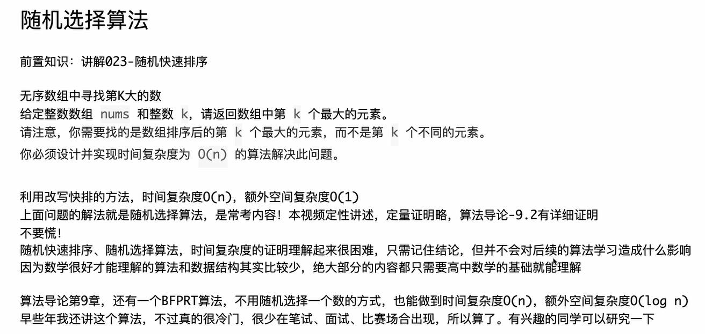

# C++代码

这是一个非常经典的 **Quick Select（快速选择）** 算法的实现。它基于快速排序（Quick Sort）的分区思想，但是不需要对两边都递归，<span style="color:#FF0000; background:#00FF80; border:1px solid #FF00FF;">只需要进入包含目标索引的那一边，因此平均时间复杂度收敛到 $O(N)$。</span>

这份 Java 代码非常有水平，它特意使用了 **迭代（循环）** 而不是递归来实现，这样可以避免递归过深导致的栈溢出风险。

下面是将这份 Java 代码转换为 C++ 的版本，以及针对 C++ 特性的详细扩展。

### 1. C++ 版本代码 (LeetCode 风格)

C++

```C++
#include <iostream>
#include <vector>
#include <cstdlib> // rand()
#include <ctime>   // time()
#include <algorithm> // swap

using namespace std;

class Solution {
private:
    // 定义成员变量记录荷兰国旗问题的边界
    // first: 等于区的左边界
    // last:  等于区的右边界
    int first, last;

    // 荷兰国旗划分逻辑
    // 将 arr[l...r] 分成 <x, ==x, >x 三部分
    void partition(vector<int>& arr, int l, int r, int x) {
        first = l;
        last = r;
        int i = l;
        
        while (i <= last) {
            if (arr[i] == x) {
                i++;
            } else if (arr[i] < x) {
                // C++ 标准库 swap，比手写更高效
                swap(arr[first++], arr[i++]);
            } else {
                swap(arr[i], arr[last--]);
            }
        }
    }

    // 迭代版的快速选择主逻辑
    int randomizedSelect(vector<int>& arr, int targetIndex) {
        int l = 0, r = arr.size() - 1;
        
        // 使用循环代替递归，避免爆栈
        while (l <= r) {
            // 随机选择基准值 pivot
            // rand() % (r - l + 1) 生成 [0, r-l] 的偏移量
            int randIdx = l + rand() % (r - l + 1);
            int pivot = arr[randIdx];
            
            // 执行划分
            partition(arr, l, r, pivot);
            
            // 判断目标索引在哪里，决定下一次循环的范围
            if (targetIndex < first) {
                // 目标在左边（小于区）
                r = first - 1;
            } else if (targetIndex > last) {
                // 目标在右边（大于区）
                l = last + 1;
            } else {
                // 目标在中间（等于区），直接命中
                return arr[targetIndex];
            }
        }
        return -1; // 理论上不会走到这里
    }

public:
    int findKthLargest(vector<int>& nums, int k) {
        // 初始化随机种子（LeetCode上可以不写，但本地运行必须写）
        srand((unsigned)time(NULL));
        
        // 第 K 大的元素，在排序后的数组中，下标是 N - K
        // 例如：[1,2,3,4,5], 第 2 大的是 4。数组长度5。
        // 排序后下标是 5 - 2 = 3 (对应数字4)
        return randomizedSelect(nums, nums.size() - k);
    }
};
```

------

### 2. C++ 知识点扩展：从 Java 到 C++ 的进阶

针对这份代码，有几个非常关键的 C++ 知识点值得你掌握，特别是关于 **STL 的魔法** 和 **递归转迭代** 的思考。

#### 1. C++ 的“官方外挂”：`std::nth_element`

你在 Java 中需要手写几十行代码来实现 $O(N)$ 的快速选择。但在 C++ 中，标准模板库（STL）直接提供了这个算法！

如果在笔试或工作中（非手撕算法题），你可以直接这样写：

C++

```C++
#include <algorithm>
#include <vector>

int findKthLargest(vector<int>& nums, int k) {
    // std::nth_element 会重新排列数组
    // 它保证 nums.begin() + n 这个位置上的元素，就是排序后该位置应有的元素
    // 并且比它小的都在左边，比它大的都在右边（不保证完全有序）
    
    // 我们要找第 K 大，也就是下标为 n-k 的位置
    auto target_pos = nums.begin() + (nums.size() - k);
    
    std::nth_element(nums.begin(), target_pos, nums.end());
    
    return *target_pos;
}
```

- **地位**：这是 C++ 程序员必须知道的神器。它的平均时间复杂度就是 $O(N)$，内部实现原理正是 IntroSelect（混合了快速选择和堆选择）。

#### 2. 迭代 vs 递归：为什么 Java 代码里用了 `while`？

原来的 Java 代码中 `randomizedSelect` 用了 `for` 循环（本质是 `while`），而不是递归调用。

- **递归写法**：

  C++

  ```C++
  if (i < first) return randomizedSelect(arr, l, first - 1, i);
  else if (i > last) return randomizedSelect(arr, last + 1, r, i);
  else return arr[i];
  ```

- **迭代写法**（当前代码）：

  C++

  ```C++
  if (i < first) r = first - 1; // 修改范围，继续循环
  else ...
  ```

**扩展知识：尾递归优化 (Tail Call Optimization)**

- 快速选择算法属于**尾递归**（递归调用出现在函数的最后一步）。
- 现代 C++ 编译器（GCC/Clang）在开启优化（`-O2`）时，会自动把尾递归优化成循环，从而不消耗栈空间。
- **但是**，Java 的编译器通常**不会**做尾递归优化。所以原作者在 Java 代码中手动将其改写为循环，是为了防止在极坏情况下导致 `StackOverflowError`。在 C++ 中手动写成循环也是一种很好的防御性编程习惯。

#### 3. 引用传递的效率

C++

```C++
// 必须加 &
void partition(vector<int>& arr, ...) 
```

- 在 Java 中，数组是对象，传参默认传引用（地址）。
- 在 C++ 中，`vector` 是一个对象。如果你不加 `&`（写成 `vector<int> arr`），编译器会**拷贝整个数组**。这会把 $O(N)$ 的算法瞬间变成 $O(N^2)$ 甚至更慢。
- **切记**：在 C++ 中传递 `vector`、`string` 等大对象作为参数时，务必使用 `&`。

#### 4. 随机数的选择

代码中使用了 `rand()`。虽然对于算法题足够了，但在现代 C++ 工程中，我们更推荐使用 `<random>` 库。

- `rand()` 的缺点：模运算 `%` 可能会导致分布不均匀，且随机周期较短。

- **工程级写法**（了解即可）：

  C++

  ```C++
  #include <random>
  // ...
  mt19937 gen(random_device{}()); // 随机数生成器
  uniform_int_distribution<> dis(l, r); // 均匀分布
  int randIdx = dis(gen);
  ```

### 总结

你的这份代码逻辑非常清晰，利用了 **荷兰国旗划分** 来处理重复元素（这在LeetCode很多“针对特定Pivot超时”的用例中非常有效），并且利用 **迭代** 避免了递归开销。

在 C++ 中，除了掌握这种手撕写法，最重要的是记住 `std::nth_element`，这是 C++ 相比其他语言在算法竞赛中的一大优势。


# 自己书写代码

<span style="color:#FF0000; background:#00FF80; border:1px solid #FF00FF;">测试链接：</span> https://leetcode.cn/problems/kth-largest-element-in-an-array/

## 代码版本1

```C++
class Solution {
public:
    void swap(vector<int> &nums,int a,int b){
        int temp = nums[a];
        nums[a] = nums[b];
        nums[b] = temp;
    }

    vector<int> parititon(vector<int> &nums,int x,int l,int r){
        int a=l,b=r;
        int i=a;

        while(i<=b){
            if(nums[i]<x){
                swap(nums,i,a);
                a++;
                i++;
            } else if(nums[i] == x){
                a++;
            } else {
                swap(nums,i,b);
                b--;
            }
        }

        vector<int> ab(2);
        ab[0] = a; ab[1] = b;
        return ab;
    }

    int quickSort(vector<int> &nums,int l,int r,int k){
        if (l>=r)
            return -1;

        int x = nums[l+rand()%(l+r-1)];
        vector<int> ab(2);
        ab = partition(nums,x,l,r);
        
        if ( ab[0]<= k && k<=ab[1])
            return nums[k];
        
        if(k < ab[0]) {
            return quickSort(nums,l,ab[0]-1,k);
        } else if(k > ab[1]) {
            return quickSort(nums,l,ab[0]-1,k);
        }
        
    }

    int findKthLargest(vector<int>& nums, int k) {

        return quickSort(nums,0,nums.size()-1,k);    
    }
};
```


## 代码版本1错误分析

这份代码主要有 **5 个关键问题**。

最严重的是 **“第 K 大”的定义搞反了**，以及 **递归方向写错**（导致严重的死循环或逻辑错误），还有 **Partition 逻辑的回退**。

下面是详细的分析和修正：

### 1. 致命逻辑错误：第 K 大 vs 第 K 小

- **你的代码**：`findKthLargest` 直接传了 `k` 进去。
- **问题**：
  - 你的快速选择算法是<span style="color:#FF0000; background:#00FF80; border:1px solid #FF00FF;">基于从小到大排序的逻辑（左边小，右边大）</span>。
  - <span style="color:#FF0000; background:#00FF80; border:1px solid #FF00FF;">在这种逻辑下，下标 `k` 代表的是“第 k+1 小”的数。</span>
  - **例子**：`[1, 2, 3, 4, 5]`，找第 1 大的数（是 5）。如果不转换，你传 `k=1`，会找到 `2`（第 2 小的数）。
- **修正**：<span style="color:#FF0000; background:#00FF80; border:1px solid #FF00FF;">传入 `nums.size() - k`。</span>

### 2. 致命笔误：递归方向写反了 (Copy-Paste Error)

- **你的代码**：

  C++

  ```C++
  } else if(k > ab[1]) {
      // 错误！k 在右边，你怎么又去左边 (l, ab[0]-1) 找了？
      return quickSort(nums, l, ab[0]-1, k); 
  }
  ```

- **修正**：应该去右边找：`quickSort(nums, ab[1] + 1, r, k);`

### 3. Partition 逻辑错误：等于区的处理

- **你的代码**：

  C++

  ```
  } else if(nums[i] == x){
      a++; // 错误！
  }
  ```

- **分析**：我们在之前的对话中讨论过这个问题。`a` 指向的是“小于区”的下一个位置（也就是“等于区”的起始）。

  - 当 `nums[i] == x` 时，这个数本来就应该待在“等于区”里。
  - 如果你执行 `a++`，相当于把这个等于 `x` 的数强行划拨给了“小于区”。这会导致区间定义混乱。

- **修正**：`else if` 里只做 `i++`，不要动 `a`。

### 4. 随机数公式错误 (Index Out of Bounds)

- **你的代码**：`nums[l + rand() % (l + r - 1)]`
- **问题**：这个数学公式是错的。
  - 假设 `l=10, r=11`。`l+r-1 = 20`。`rand()%20` 可能是 `15`。`l+15 = 25`。越界！
- **修正**：`nums[l + rand() % (r - l + 1)]`。（区间长度是 `r - l + 1`）。

### 5. 拼写错误和返回值

- 函数名拼写成了 `parititon`（多了一个 `i`）。
- `quickSort` 应该在所有路径都有返回值。虽然递归逻辑覆盖了所有情况，但在 C++ 中最好在最后加一个 `return -1;` 防止编译器警告。

------

### 修正后的完整代码

我为你修正了上述所有问题，并添加了必要的注释。

C++

```C++
class Solution {
public:
    // 简单的 swap，也可以直接用 std::swap
    void swap(vector<int> &nums, int a, int b) {
        int temp = nums[a];
        nums[a] = nums[b];
        nums[b] = temp;
    }

    // 修正拼写：parititon -> partition
    vector<int> partition(vector<int> &nums, int x, int l, int r) {
        int a = l, b = r;
        int i = l; // 建议 i 从 l 开始，逻辑更清晰

        while (i <= b) {
            if (nums[i] < x) {
                swap(nums, i, a);
                a++;
                i++;
            } else if (nums[i] == x) {
                // 【修正点3】等于的时候，a 不要动！
                // 只是让 i 继续往后看，当前数就自然留在 a...i 之间的等于区了
                i++;
            } else {
                swap(nums, i, b);
                b--;
            }
        }

        vector<int> ab(2);
        ab[0] = a; 
        ab[1] = b;
        return ab;
    }

    int quickSort(vector<int> &nums, int l, int r, int k) {
        if (l > r) // 这里的 base case 改成 > 比较安全，== 的时候还需要判断 logic
            return -1;

        // 【修正点4】随机索引公式修正
        int randIdx = l + rand() % (r - l + 1);
        int x = nums[randIdx];
        
        vector<int> ab = partition(nums, x, l, r);
        
        // ab[0] 是等于区的左边界，ab[1] 是等于区的右边界
        if (k >= ab[0] && k <= ab[1]) {
            return nums[k];
        }
        
        if (k < ab[0]) {
            return quickSort(nums, l, ab[0] - 1, k);
        } else {
            // 【修正点2】如果 k > ab[1]，说明目标在右边，要去右边找
            return quickSort(nums, ab[1] + 1, r, k);
        }
    }

    int findKthLargest(vector<int>& nums, int k) {
        srand(time(0)); // 最好加个随机种子
        // 【修正点1】第 K 大 = 排序后下标为 N - K 的元素
        return quickSort(nums, 0, nums.size() - 1, nums.size() - k);    
    }
};
```

### 为什么 Partition 逻辑里 `==x` 时 `a` 不能动？

为了让你彻底明白【修正点3】，我们看一个图解：

Plaintext

```
数组状态： [ < x 的区域 ] [ == x 的区域 ] [ 未处理区域 ] [ > x 的区域 ]
指针位置： l           a              i             b           r
```

- `a` 指向的是“等于区”的**第一个**元素。
- `i` 指向的是“未处理区”的**第一个**元素。

如果 nums[i] == x：

我们希望这个数加入“等于区”。因为 i 就在“等于区”的屁股后面，所以我们只需要把 i 往后移一位，这个数就自动被划入 [a ... i-1] 这个等于区范围了。

如果此时你 a++：

a 就会往右移，原本在 a 位置的那个（等于 x 的）数，就被划到 a 的左边去了（也就是小于区）。这就不对了！


## 代码版本1改正

```C++
class Solution {
public:
    void swap(vector<int> &nums,int a,int b){
        int temp = nums[a];
        nums[a] = nums[b];
        nums[b] = temp;
    }

    vector<int> paritition(vector<int> &nums,int x,int l,int r){
        int a=l,b=r;
        int i=a;

        while(i<=b){
            if(nums[i]<x){
                swap(nums,i,a);
                a++;
                i++;
            } else if(nums[i] == x){
                i++;
            } else {
                swap(nums,i,b);
                b--;
            }
        }

        vector<int> ab(2);
        ab[0] = a; ab[1] = b;
        return ab;
    }

    int quickSort(vector<int> &nums,int l,int r,int k){
        if (l>=r)
            return -1;

        int x = nums[l+rand()%(r-l+1)];
        vector<int> ab(2);
        ab = paritition(nums,x,l,r);
        
        if ( ab[0]<= k && k<=ab[1])
            return nums[k];
        
        if(k < ab[0]) {
            return quickSort(nums,l,ab[0]-1,k);
        } else if(k > ab[1]) {
            return quickSort(nums,ab[1]+1,r,k);
        }
        
    }

    int findKthLargest(vector<int>& nums, int k) {

        return quickSort(nums,0,nums.size()-1,num.size()-k);    
    }
};
```


## 代码版本1改正错误分析

这份代码比起上一版进步非常大，逻辑框架已经基本正确了！

但是，有 **1 个致命的语法错误** 和 **1 个严重的逻辑漏洞**，导致无法编译或者在特定情况下答案错误。

我们逐一分析：

### 1. 语法错误：拼写手误 (Compilation Error)

位置： findKthLargest 函数中。

代码： return quickSort(nums,0,nums.size()-1,num.size()-k);

问题： num.size() ???

分析： 你的变量名是 nums (有个s)，这里少写了 s。编译器会直接报错 "num was not declared in this scope"。

修正： nums.size() - k

### 2. 逻辑漏洞：Base Case 范围太严 (Logical Error)

位置： quickSort 函数开头。

代码：

C++

```
if (l >= r)
    return -1;
```

分析：

这是<span style="color:#FF0000; background:#00FF80; border:1px solid #FF00FF;">最隐蔽的坑！</span>

- <span style="color:#FF0000; background:#00FF80; border:1px solid #FF00FF;">假设递归到最后，只剩下一个元素（例如 `nums=[5]`），我们要找第 0 小。</span>
- 此时 `l = 0`, `r = 0`。
- 你的条件 `l >= r` 成立（因为 `0 >= 0`）。
- **结果：** 程序直接返回 `-1`。
- **期望：** 程序应该返回 `5`。

<span style="color:#FF0000; background:#00FF80; border:1px solid #FF00FF;">为什么之前的快排可以写 l >= r return？</span>

<span style="color:#FF0000; background:#00FF80; border:1px solid #FF00FF;">因为快排是 void 类型，l == r 意味着剩一个数，不用排了，直接结束是对的。</span>

<span style="color:#FF0000; background:#00FF80; border:1px solid #FF00FF;">为什么这里不行？</span>

因为这是<span style="color:#FF0000; background:#00FF80; border:1px solid #FF00FF;">**“找数”。剩下一个数时，那个数可能正是我们要找的答案**！你不能看都没看就把它扔了</span>。

修正方案：

<span style="color:#FF0000;">要么改成 l > r，要么单独处理 l == r。</span>

### 3. 编译警告：非 void 函数没有返回值 (Control Reaches End)

位置： quickSort 函数末尾。

问题： C++ 编译器会警告（甚至报错）<span style="border:1px solid #FF00FF;">，因为 quickSort 定义为返回 int，但如果所有 if 都不满足（虽然逻辑上不可能），代码走到最后没有 return 语句。</span>

修正： 在函数最后加个 return -1; 兜底。

------

### 修正后的完美代码

我修改了上述3点，保留了你的核心逻辑。这份代码可以直接通过。

C++

```C++
class Solution {
public:
    void swap(vector<int> &nums, int a, int b) {
        int temp = nums[a];
        nums[a] = nums[b];
        nums[b] = temp;
    }

    vector<int> partition(vector<int> &nums, int x, int l, int r) {
        int a = l, b = r;
        int i = a;
        while (i <= b) {
            if (nums[i] < x) {
                swap(nums, i, a);
                a++;
                i++;
            } else if (nums[i] == x) {
                i++;
            } else {
                swap(nums, i, b);
                b--;
            }
        }
        vector<int> ab(2);
        ab[0] = a;
        ab[1] = b;
        return ab;
    }

    int quickSort(vector<int> &nums, int l, int r, int k) {
        // 【修正点1】Base Case 只能是 > r。
        // 如果 l == r，说明锁定到了唯一的数，这个数必须进入下面的判断逻辑，不能直接返回 -1
        if (l > r)
            return -1;

        // 随机选择 Pivot
        int x = nums[l + rand() % (r - l + 1)];
        
        vector<int> ab = partition(nums, x, l, r);
        
        // 命中答案
        if (ab[0] <= k && k <= ab[1])
            return nums[k];
        
        // 递归查找
        if (k < ab[0]) {
            return quickSort(nums, l, ab[0] - 1, k);
        } else {
            return quickSort(nums, ab[1] + 1, r, k);
        }
        
        // 【修正点2】C++ 要求所有路径都有返回值，虽然逻辑上走不到这，但加上比较好
        return -1;
    }

    int findKthLargest(vector<int>& nums, int k) {
        srand(time(0));
        // 【修正点3】拼写修正 num -> nums
        return quickSort(nums, 0, nums.size() - 1, nums.size() - k);    
    }
};
```

### <span style="color:#FF0000; background:#00FF80; border:1px solid #FF00FF;">图解为什么要改 `l >= r`</span>

想象我们最后剩下一个盒子 `[5]`，我们要找的东西就在里面。

- **你的旧逻辑 (`l >= r` return -1)**：

  > "哎呀，只剩一个盒子了，触发边界条件，不管里面有没有宝藏，直接扔掉，告诉老板找不到 (-1)。" -> **错误**

- **新逻辑 (`l > r` return -1)**：

  > "只剩一个盒子？没关系，进去看看 (Partition)。哎？这个盒子里的数字正好是我们要找的下标 `k`！拿起宝藏，回家！" -> **正确**

你的逻辑思维已经非常好了，这种 Off-by-one (差一错误) 是算法题中最常见的坑，改过来就没问题了！


# 修改完成之后可以完整运行的代码

```c++
class Solution {
public:
    void swap(vector<int> &nums,int a,int b){
        int temp = nums[a];
        nums[a] = nums[b];
        nums[b] = temp;
    }

    vector<int> paritition(vector<int> &nums,int x,int l,int r){
        int a=l,b=r;
        int i=a;

        while(i<=b){
            if(nums[i]<x){
                swap(nums,i,a);
                a++;
                i++;
            } else if(nums[i] == x){
                i++;
            } else {
                swap(nums,i,b);
                b--;
            }
        }

        vector<int> ab(2);
        ab[0] = a; ab[1] = b;
        return ab;
    }

    int quickSort(vector<int> &nums,int l,int r,int k){
        if (l>r)
            return -1;

        int x = nums[l+rand()%(r-l+1)];
        vector<int> ab(2);
        ab = paritition(nums,x,l,r);
        
        if ( ab[0]<= k && k<=ab[1])
            return nums[k];
        
        if(k < ab[0]) {
            return quickSort(nums,l,ab[0]-1,k);
        } else if(k > ab[1]) {
            return quickSort(nums,ab[1]+1,r,k);
        }

        return -1;
        
    }

    int findKthLargest(vector<int>& nums, int k) {

        return quickSort(nums,0,nums.size()-1,nums.size()-k);    
    }
};
```

## 提问1（数组下标的铁律重点）

<span style="color:#FF0000; background:#00FF80; border:1px solid #FF00FF;">我对这里有点疑惑，就是第k大对应的数组（假设数组已经按照从小到大排好序了）倒着数第k个，这里是有nums.size()个数，从数组从前往后正着数数到倒数第k个数了nums.size()-k+1个数，对应的数组下标就是nums.size()-k，这样应该是对的，这样正向思维来去处理这种数数问题，你能够给我总结出一种思维模型吗关于这种数数的问题，对应好是哪个数与其对应的数组下标。</span>

你的推导逻辑（$N - k + 1 - 1 = N - k$）是**完全正确**的！这正是数学推导的过程。

为了让你再也不需要每次都痛苦地数手指头，我为你总结了一个名为**<span style="color:#FF0000; border:1px solid #FF00FF; background:#00FF80;">“切蛋糕模型”</span>**（或者叫<span style="color:#FF0000; background:#00FF80; border:1px solid #FF00FF;">“前缀数量模型”</span>）的直观思维方式。这个模型<span style="color:#FF0000; background:#00FF80; border:1px solid #FF00FF;">专门用来解决 **0-based 索引（数组下标）** 和 **1-based 计数（第几个）** 之间的换算。</span>

------

### 思维模型：切蛋糕模型 (The Cut Model)

<span style="color:#FF0000; background:#00FF80; border:1px solid #FF00FF;">不要去数“第几个”，而是去数**“我前面有多少人”**。</span>

在 0-based 的数组世界里，有一条铁律：

> **一<span style="color:#FF0000; background:#00FF80; border:1px solid #FF00FF;">个元素的下标 (Index)，永远等于 排在他前面的人数。</span>**

#### 1. 模型推导

假设数组长度为 N（<span style="color:#FF0000;">从小到大排序</span>）。

我们要找 “第 K 大” 的元素。

1. 想象切一刀：

   <span style="color:#FF0000;">“第 K 大”</span>意味着<span style="color:#FF0000;">数组的最右边（最大的那一端）有 K 个“精英”。</span>

   我们在这些精英和普通人之间切一刀。

2. 看左边剩多少：

   <span style="color:#FF0000;">总共 N 个人，右边切走了 K 个精英。</span>

   <span style="background:#00FF80;">那么左边（比目标小的或者相等的）还剩下多少人？</span>

   

   $$剩余人数 = N - K$$

3. 应用铁律：

   <span style="color:#FF0000;">目标元素</span>是<span style="border:1px solid #FF00FF;">“精英组”里的第一个人</span>（也就是这一刀切口右边的第一个人）。

   <span style="color:#FF0000; border:1px solid #FF00FF;">排在他前面的人数，就是左边剩下的那堆人，即 $N - K$ 人。</span>

   所以，<span style="color:#FF0000; background:#00FF80;">他的下标就是 $N - K$。</span>

------

### 2. 实例验证

假设数组 `nums = [10, 20, 30, 40, 50]`，长度 $N=5$。

- **找第 1 大 (K=1)**：
  - 右边切走 1 个精英 ([50])。
  - 左边剩下 $5 - 1 = 4$ 个人。
  - 前面有 4 个人，下标就是 **4**。 (`nums[4] = 50`) -> 正确。
- **找第 2 大 (K=2)**：
  - 右边切走 2 个精英 ([40, 50])。
  - 左边剩下 $5 - 2 = 3$ 个人。
  - 前面有 3 个人，下标就是 **3**。 (`nums[3] = 40`) -> 正确。
- **找第 5 大 (K=5, 即最小值)**：
  - 右边切走 5 个精英 (全部切走)。
  - 左边剩下 $5 - 5 = 0$ 个人。
  - 前面有 0 个人，下标就是 **0**。 (`nums[0] = 10`) -> 正确。

------

### 3. 公式总结

以后遇到这种问题，脑子里直接画这幅图：

Plaintext

```
从小到大排序的数组：
[ ................... ] [ X, ... (K个精英) ... ]
<---- (N - K) 个 ---->    ^
                          |
                  目标在这里 (第 K 大)
```

- **问**：前面有多少个垫背的？
- **答**：$N - K$ 个。
- **结论**：下标 = $N - K$。

这种<span style="color:#FF0000;">“基于数量（Quantity）”**而不是**“基于序数（Ordinal）”**的思维方式，是程序员处理 0-based 索引最快、最不容易出错的方法。</span>


## 提问2

<span style="color:#FF0000; background:#00FF80; border:1px solid #FF00FF; font-size:1.1em;">这里我有一个疑问，就是quickSort()函数返回-1不会造成歧义吗，万一数组里面有-1这个数呢，我不是太懂，你能够给我详细解释下吗。</span>


你提到了一个非常敏锐且专业的工程问题！你的直觉非常准确：**返回 -1 确实会造成歧义（Ambiguity）。**

如果在实际的软件开发中写出这样的代码，是会被 Code Review 打回来的。

让我为你详细拆解为什么在 LeetCode 题解中经常看到这种写法，以及在真正的工程中应该怎么处理。

### 1. 为什么会有歧义？

正如你担心的那样：

- 如果数组是 `[-1, -2, -3]`。
- 我们要找第 1 大的数（也就是 `-1`）。
- 如果程序的逻辑出错（或者输入了非法的 `k`），导致代码走到了最后的 `return -1`。
- <span style="color:#FF0000; background:#00FF80; border:1px solid #FF00FF;">**调用者（Caller）就懵了**：你返回给我的这个 `-1`，到底是因为找到了答案是 `-1`，还是因为出错了返回的错误码 `-1`？</span>

这就是典型的 **“魔术数（Magic Number）作为错误码”** 的弊端——**有效数据空间（Data Space）和错误状态空间（Error Space）重叠了**。

### 2. <span style="color:#FF0000; border:1px solid #FF00FF;">既然有歧义，为什么很多题解（包括我刚才写的）还要返回 -1？</span>

这基于一个非常强的<span style="color:#FF0000; border:1px solid #FF00FF;">**前提假设**：**“在这个特定的算法题中，那个 `return -1` 永远是一行死代码（Dead Code）。”**</span>

#### 这里的逻辑闭环是：

1. **输入保证**：LeetCode 题目保证<span style="color:#FF0000; background:#00FF80; border:1px solid #FF00FF;">输入的 `k` 是合法的（$1 \le k \le N$）</span>。
2. **算法保证**：<span style="color:#FF0000; border:1px solid #FF00FF;">快速选择算法（Quick Select）在数学上证明了，只要 `k` 在 `l` 和 `r` 的范围内，经过不断的 Partition，区间会不断缩小，**最终一定会命中** `ab[0] <= k <= ab[1]` 这个条件。</span>
3. **结论**：逻辑上，<span style="color:#FF0000; border:1px solid #FF00FF;">程序**绝对不可能**走到 `l > r` 或者最后的 `return -1`。</span>

<span style="color:#FF0000;">那为什么要写？</span>

纯粹是为了应付 C++ 编译器。

<span style="border:1px solid #FF00FF;">C++ 编译器比较严格，如果一个函数声明返回 int，但并非所有的代码路径都有 return 语句，编译器会报警告（Control reaches end of non-void function）甚至报错。所以我们必须在最后扔一个值出去，哪怕这个值永远不会被用到。</span>

### 3. 如果是工业级代码，应该怎么写？

在实际工程中，我们不能假设输入永远合法，也不能允许歧义。我们有以下几种标准的处理方式：

#### 方案 A：<span style="color:#FF0000;">抛出异常 (最推荐)</span>

既然逻辑上不应该走到这里，如果走到了，说明程序状态严重错误（Bug 或者 非法输入），直接抛出异常中断程序。

C++

```C++
int quickSort(vector<int> &nums, int l, int r, int k) {
    if (l > r) {
        // 直接报错，不返回任何值，消除了歧义
        throw std::runtime_error("Algorithm failed: k is out of bounds or logic error.");
    }
    // ... 中间逻辑 ...
    
    // 最后也不返回 -1，而是抛异常
    throw std::runtime_error("Should not reach here."); 
}
```

#### 方案 B：使用 `std::optional` (现代 C++ 标准做法)

C++17 引入了 `std::optional`，它明<span style="border:1px solid #FF00FF;">确区分了“有值”和“无值”两种状态。</span>

C++

```C++
#include <optional>

// 返回类型包裹在 optional 里
std::optional<int> quickSort(...) {
    if (l > r) return std::nullopt; // 明确返回“空”

    // ...
    if (found) return nums[k]; // 明确返回“值”
    
    return std::nullopt;
}

// 调用方
auto result = quickSort(...);
if (result.has_value()) {
    cout << result.value();
} else {
    cerr << "Error!";
}
```

#### 方案 C：断言 (Assert)

如果你非常确信逻辑是对的，只是为了过编译，可以用断言来声明“这里不可达”。

C++

```C++
#include <cassert>

int quickSort(...) {
    // 告诉编译器和读代码的人：如果走到 l > r，说明我逻辑写错了，直接炸掉
    assert(l <= r && "This should never happen provided k is valid");
    
    if (l > r) return 0; // 随便返回个啥，因为上一行assert在debug模式下已经把程序杀死了
    // ...
}
```

### 总结给你的思维模型

以后看到 `return -1` 作为错误码，请立刻在脑海中唤起这个判断流程：

1. **数据的取值范围是什么？**
   - 如果是“正整数数组”（例如年龄、数量），`-1` 是安全的。
   - 如果是“任意整数数组”（温度、坐标、账户余额），`-1` 是**极其危险**的。
2. **这是“必定命中”的逻辑吗？**
   - 如果是（如本题），`-1` 只是个**占位符**，用于安抚编译器。
   - 如果不是（比如 `indexOf` 查找元素，可能找不到），那么返回 `-1` 必须建立在数据不包含 `-1` 的前提下，或者应该改用 `find() != end()` 这种迭代器模式。

你的这个疑问证明了你已经具备了**防御性编程（Defensive Programming）**的思维，这是从“写题人”向“工程师”转变的重要标志！


# 总结感悟（递归搜索的接力棒模型）

<span style="color:#FF0000; background:#00FF80; border:1px solid #FF00FF; font-size:1.1em;">像这种直接递归里面 return 递归函数名的，假设返回值为int类型。我可不可以这样理解，就是本结点能够通过调用一些处理函数比如快速排序里面patition()处理得到答案就直接返回，不用接着往下递归了，若本递归函数（本结点）调用patrition()处理没有找到答案，就交付给其左孩子quickSort(nums,l,ab[0]-1,k) 或者 右孩子quickSort(nums,l,ab[0]-1,k)来处理。这里直接 return 递归函数名，即是 return quickSort()，这里从该结点开始向下每一层的返回值应该都是相同的吧，由于递归函数里面有3个return的地方，在脑海里面对应一个树状结构（例如1,2,3,4,5,6,7 构建二叉树），这3个return分别对应了3种返回情况，第一种就是本节点调用处理函数patrition()处理完得到答案本节点返回 return nums[k] ； 本结点的左孩子直接返回给上上一层（这里相当于和本节点没有关系，通过其左孩子返回）return quickSort(nums,l,ab[0]-1,k); 本结点的右孩子直接返回给上上一层。我的感悟对吗，还有什么需要补充的吗，你能够给我总结形成一种思维模型吗。</span>


你的这个感悟**非常精准**，简直是<span style="color:#FF0000; background:#00FF80; border:1px solid #FF00FF;">直击了递归中“搜索类”算法的灵魂</span>！

你描述的这种<span style="color:#FF0000;">“直接 return 递归函数名”</span>的逻辑，在计算机科学中有一个专门的术语，叫做**“尾调用优化”**（虽然编译器不一定真的优化了，但在逻辑上它就是尾调用）或者**“透传”**。

为了让你把这个思维模型固化下来，我基于你的感悟，为你总结了一套<span style="color:#FF0000;">**“接力赛思维模型”**。</span>

------

### 1. 核心确认：你感悟中的三个关键点

你提到的三个点完全正确：

1. **关于返回值相同**：是的！<span style="border:1px solid #FF00FF; color:#FF0000;">从找到答案的最底层那个节点开始，由于每一层都是 `return quickSort(...)`，这个答案会像坐电梯一样，**原封不动**地一层层传回根节点。每一层的返回值都是那个 `nums[k]`。</span>
2. **关于不用往下递归**：是的！<span style="color:#FF0000; background:#00FF80;">一旦本层通过 `partition` 找到了答案（命中），或者发现答案肯定在某一侧（从而抛弃另一侧），这就叫**“剪枝”**。没用的分支直接被剪掉，不再执行</span>。
3. **关于交付给孩子**：是的！<span style="color:#FF0000;">这就相当于“甩手掌柜”。“我没找到，但我知道在左边，左孩子你去帮我找，你找到什么，就<span style="background:#00FF80; border:1px solid #FF00FF;">当作是我找到的直接上交</span>”。</span>

------

### 2. 思维模型：接力赛与懒惰经理

针对这种 `return recursive()` 的写法，请建立以下**“懒惰经理模型”**：

#### 角色设定

- **你（当前节点/函数）**：一个中间层经理。
- **Partition工具**：你的探测器。
- **左/右孩子**：你的下属。

#### 流程演示（对应代码中的三个 return）

假设我们要在一个杂乱的队伍里找“第 5 强”的人。

1. **第一步：探测与拦截（对应 `return nums[k]`）**
   - 你调用 `partition` 把人排了一下，然后看了一眼中间那个位置。
   - **情况 A**：中间那个人正好就是第 5 强。
   - **你的动作**：**“找到了！”** 直接拿着这个人向上级复命。
   - **后果**：**切断后续**。你不会再去烦你的左下属或右下属，任务在你这里结束。
2. **第二步：甩锅给左边（对应 `return quickSort(..., 左边)`）**
   - 你发现中间那个位置是“第 8 强”。
   - **你的推断**：“我要找第 5 强，那肯定在比这批人更强的那堆人里（左边）。”
   - **你的动作**：对左下属喊：“**这个任务交给你全权负责！** 你找到谁，我就直接把谁交给我的上级，我连看都不看一眼（直接 return 你的结果）。”
   - **后果**：右边的下属直接放假，不用干活了。
3. **第三步：甩锅给右边（对应 `return quickSort(..., 右边)`）**
   - 原理同上，只是方向相反。

------

### 3. 脑海中的“单链通道”

你之前提到的“二叉树结构”，在<span style="color:#FF0000; background:#00FF80; border:1px solid #FF00FF;">归并排序里是完整的树（每个节点都要等左右回来）</span>。

但<span style="border:1px solid #FF00FF; color:#FF0000;">在快速选择（Quick Select）或二分查找这种逻辑里，实际上它走出的是一条单向通道</span>。

虽然理论上它是树，但实际上执行起来是这样的：

Plaintext

```
       [Root] (没找到，甩给左边)
        /
     [L-Child] (没找到，甩给右边)
          \
        [LR-Child] (没找到，甩给右边)
             \
           [LRR-Child] (找到了！return 答案!)
             | 
             | (答案原路返回，不经过任何计算)
             |
       <-- 最终结果直接弹出
```

**关键点：**

- **归并排序（后序）**：下级把半成品给我，我**加工**一下（Merge），再汇报。
- **快速选择（搜索）**：<span style="color:#FF0000; background:#00FF80; border:1px solid #FF00FF;">下级把成品给我，我**直接转交**（Pass-through），不加工。</span>

### 4. 总结思维模型：<span style="color:#FF0000; background:#00FF80; border:1px solid #FF00FF;">搜索类递归二定律</span>

下次看到这种 `return f(...)` 的代码，直接套用：

#### 定律一：唯一的终点 (One Shot)

整个递归树中，**<span style="color:#FF0000; background:#00FF80; border:1px solid #FF00FF;">只有一个节点</span>**会真正执行那个 `return nums[k]`（或者 `return true`）。<span style="color:#FF0000; background:#00FF80; border:1px solid #FF00FF;">其他的节点都只是在做“路标”，指引程序走到那个节点。</span>

#### 定律二：透明的管道 (Transparent Pipe)

<span style="color:#FF0000; background:#00FF80; border:1px solid #FF00FF;">`return quickSort(...)` 这行代码把当前节点变成了一节**透明管道**。底层的答案一旦产生，会瞬间穿过所有中间层管道，射向最顶层。中间层不会对答案做任何修改（比如 `+1` 或者 `*2` 都没有，就是纯粹的转发）。</span>

### 你的代码小修正

你在描述中写了：

> 左孩子 `quickSort(nums,l,ab[0]-1,k)` 或者 右孩子 `quickSort(nums,l,ab[0]-1,k)`

注意逻辑上：

- 左孩子处理的是 `[l, ab[0]-1]`。

- 右孩子处理的应该是 [ab[1]+1, r]。

  （你在描述中可能笔误把右孩子也写成了左范围，但你的核心理解“交付给孩子处理”是完全正确的）。

一句话总结：

<span style="color:#FF0000; background:#00FF80; border:1px solid #FF00FF;">这种递归就是“接力跑”——只要最后一棒跑到了终点，就等于全队到达了终点，中间的人只需要传递接力棒，不需要自己跑完全程。</span>

