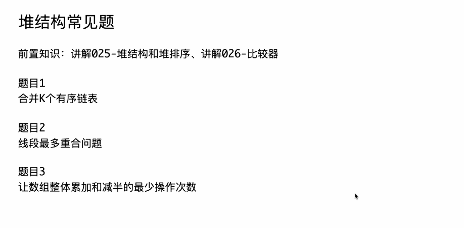

# Code01 合并K个有序链表


# Java版本

```java
package class027;

import java.util.ArrayList;
import java.util.PriorityQueue;

// 合并K个有序链表
// 测试链接：https://www.nowcoder.com/practice/65cfde9e5b9b4cf2b6bafa5f3ef33fa6
public class Code01_MergeKSortedLists {

	// 不要提交这个类
	public static class ListNode {
		public int val;
		public ListNode next;
	}

	// 提交以下的方法
	public static ListNode mergeKLists(ArrayList<ListNode> arr) {
		// 小根堆
		PriorityQueue<ListNode> heap = new PriorityQueue<>((a, b) -> a.val - b.val);
		for (ListNode h : arr) {
			// 遍历所有的头！
			if (h != null) {
				heap.add(h);
			}
		}
		if (heap.isEmpty()) {
			return null;
		}
		// 先弹出一个节点，做总头部
		ListNode h = heap.poll();
		ListNode pre = h;
		if (pre.next != null) {
			heap.add(pre.next);
		}
		while (!heap.isEmpty()) {
			ListNode cur = heap.poll();
			pre.next = cur;
			pre = cur;
			if (cur.next != null) {
				heap.add(cur.next);
			}
		}
		return h;
	}

}
```


# C++版本

这里是等效的 C++ 版本代码：

C++

```C++
#include <vector>
#include <queue>
#include <functional> // 用于 std::priority_queue

// 对应 Java 的 public static class ListNode
// 在 C++ 中，我们通常使用 struct 来定义简单的数据结构
struct ListNode {
    int val;
    ListNode *next;
    // 添加一个构造函数，方便创建新节点
    ListNode(int x) : val(x), next(nullptr) {}
};

// C++ 中实现小根堆需要一个自定义比较器
// 对应 Java 中的 (a, b) -> a.val - b.val
struct CompareNode {
    // C++ 的 priority_queue 默认是大根堆，
    // 要实现小根堆，当 a > b 时，a 的优先级反而要低（返回 true）
    bool operator()(ListNode* a, ListNode* b) {
        return a->val > b->val;
    }
};

class Solution {
public:
    // 对应 Java 的 public static ListNode mergeKLists(ArrayList<ListNode> arr)
    // C++ 中使用 std::vector<ListNode*> 代替 ArrayList<ListNode>
    // 使用 & (引用) 传递 vector 避免不必要的拷贝
    ListNode* mergeKLists(std::vector<ListNode*>& arr) {
        
        // 对应 Java: PriorityQueue<ListNode> heap = new PriorityQueue<>(...);
        // C++ 中，std::priority_queue 的模板参数为：
        // 1. 元素类型 (ListNode*)
        // 2. 内部容器类型 (std::vector<ListNode*>)
        // 3. 比较器类型 (CompareNode)
        std::priority_queue<ListNode*, std::vector<ListNode*>, CompareNode> heap;

        // 遍历所有的头！
        // 对应 Java: for (ListNode h : arr)
        for (ListNode* h : arr) {
            // 对应 Java: if (h != null)
            if (h != nullptr) {
                // 对应 Java: heap.add(h);
                heap.push(h);
            }
        }

        // 对应 Java: if (heap.isEmpty()) { return null; }
        if (heap.empty()) {
            return nullptr;
        }

        // 先弹出一个节点，做总头部
        // 对应 Java: ListNode h = heap.poll();
        // C++ 中，poll() (获取并移除) 被分为 top() (获取) 和 pop() (移除)
        ListNode* h = heap.top();
        heap.pop();

        ListNode* pre = h;
        
        // 对应 Java: if (pre.next != null) { heap.add(pre.next); }
        if (pre->next != nullptr) {
            heap.push(pre->next);
        }

        // 对应 Java: while (!heap.isEmpty())
        while (!heap.empty()) {
            // 对应 Java: ListNode cur = heap.poll();
            ListNode* cur = heap.top();
            heap.pop();

            pre->next = cur;
            pre = cur;

            // 对应 Java: if (cur.next != null) { heap.add(cur.next); }
            if (cur->next != nullptr) {
                heap.push(cur->next);
            }
        }

        return h;
    }
};
```

------


### 关键转换逻辑说明

1. **类定义 (ListNode)**:
   - Java 中的 `public static class ListNode` 转换为了 C++ 中的 `struct ListNode`。`struct` 默认成员为 public，适合用作简单的数据结构。
   - Java 中的对象引用 (如 `ListNode next`) 在 C++ 中必须显式地使用指针 (`ListNode *next`)。
2. **空指针**:
   - Java 中的 `null` 关键字在现代 C++ (C++11 及以后) 中对应 `nullptr`。
3. **集合类型**:
   - Java 的 `ArrayList<ListNode>` 转换为了 C++ 的 `std::vector<ListNode*>`。
   - C++ 函数参数 `std::vector<ListNode*>& arr` 中的 `&` 表示**引用传递**，这等效于 Java 中传递对象（Java 总是按值传递引用），避免了整个 `vector` 的复制，提高了效率。
4. **优先队列 (小根堆)**:
   - 这是最主要的区别。Java 的 `PriorityQueue` 默认是小根堆，并且可以方便地通过 Lambda 表达式 `(a, b) -> a.val - b.val` 来定义比较逻辑。
   - C++ 的 `std::priority_queue` 默认是**大根堆**。
   - 为了实现小根堆，我们必须提供一个自定义的比较器。
   - **比较器 (`struct CompareNode`)**:
     - 我们定义了一个 `struct` 并重载了 `operator()`。
     - 其逻辑 `return a->val > b->val;` 意味着：“如果 `a` 的值大于 `b` 的值，则 `a` 的优先级更低（`a` 应该排在 `b` 后面）”。这一定义颠倒了默认的大根堆行为，从而实现了小根堆。
5. **堆操作 API**:
   - **添加元素**: Java `heap.add(h)` 对应 C++ `heap.push(h)`。
   - **检查空**: Java `heap.isEmpty()` 对应 C++ `heap.empty()`。
   - **弹出元素**: Java `heap.poll()`（获取并移除顶部元素）在 C++ 中被拆分为两个操作：
     1. `heap.top()`: 获取顶部元素（不移除）。
     2. `heap.pop()`: 移除顶部元素（不返回）。


# 补充提问

## 提问1

<span style="font-weight:bold; font-size:1.2em;">你能够将C++比较器的这个返回true和false究竟a应该在前还是在后给我详细解释下吗，我不是太懂，最好能够举个例子来让我彻底弄明白？</span>

你问了一个所有 C++ 程序员在学习 STL (标准模板库) 时都会遇到的**最核心、最容易混淆**的问题。

你之所以困惑，是因为 C++ 比较器的 `true` 和 `false` 的含义，会根据**它被用在什么地方**而**完全改变**。

你把它用在 `std::sort` (排序) 和 `std::priority_queue` (优先队列) 上，它的"提问方式"是相反的。

让我们用一个“面试官”的例子来彻底搞明白。

假设你的比较器 comp 是一个面试官。

A 和 B 是两个候选人。

------


### 场景1：`std::sort` (排序)

- **目标**：将所有候选人**从左到右**排成一队，**升序**（最好的在最左边，最差的在最右边，或者反过来）。
- **`sort` 问面试官 `comp` 的问题**："如果我把 `A` 和 `B` 拿给你，`comp(A, B)` 应该回答我：**`A` 是否应该排在 `B` 的前面？**"
- **面试官 `comp` 的回答**：
  - `return true;`  => "是的，`A` 应该在 `B` 的**前面**。"
  - `return false;` => "不，`A` 不应该在 `B` 的前面（`B` 应该在 `A` 前面，或者他们俩一样）。"


#### 例子：按年龄升序（从小到大）排序

我们要把年龄小的排在前面。

- `A` 是 20 岁
- `B` 是 30 岁

我们的比较器 `comp` 这样写：

C++

```C++
struct SortAgeAscending {
    // "A 是否应该排在 B 的前面？"
    // "是，如果 A 的年龄更小。"
    bool operator()(Employee* A, Employee* B) {
        return A->age < B->age; 
    }
};
```

1. `sort` 提问 `comp(A, B)`，即 `comp(20, 30)`。
2. `A->age < B->age` => `20 < 30` => 返回 `true`。
3. `sort` 收到 `true`，心想：“好的，`A` (20岁) 应该在 `B` (30岁) 的**前面**。”
4. 最终队伍：`[20, 30, ...]` (升序)


#### 例子：按年龄降序（从大到小）排序

我们要把年龄大的排在前面。

- `A` 是 20 岁
- `B` 是 30 岁

我们的比较器 `comp` 这样写：

C++

```C++
struct SortAgeDescending {
    // "A 是否应该排在 B 的前面？"
    // "是，如果 A 的年龄更大。"
    bool operator()(Employee* A, Employee* B) {
        return A->age > B->age; 
    }
};
```

1. `sort` 提问 `comp(A, B)`，即 `comp(20, 30)`。
2. `A->age > B->age` => `20 > 30` => 返回 `false`。
3. `sort` 收到 `false`，心想：“好的，`A` (20岁) **不**应该在 `B` (30岁) 的前面，所以 `B` 应该在 `A` 的前面。”
4. 最终队伍：`[30, 20, ...]` (降序)

sort 总结：非常直观。return true 的意思就是 "A a-head of B"。

return A < B => 升序

return A > B => 降序

------


### 场景2：`std::priority_queue` (优先队列)

- **目标**：维护一个 "擂台"，`top()` 永远是 "擂主"（优先级最高的那个）。
- **`priority_queue` 的默认行为**：默认是一个**大根堆 (Max Heap)**。它认为**大的就是优先级高的**。
- **`priority_queue` 问面试官 `comp` 的问题**：`std::priority_queue` 的设计比较绕。它问的问题是："如果我把 `A` 和 `B` 拿给你，`comp(A, B)` 应该回答我：**`A` 的优先级是否比 `B` 更低？**" (或者说，"A 是否比 B *更弱*？")
- **面试官 `comp` 的回答**：
  - `return true;`  => "是的，`A` 的优先级**更低**（`A` 更弱）。" (`B` 会被排在 `A` 的上面)
  - `return false;` => "不，`A` 的优先级并不比 `B` 低。" ( `A` 会被排在 `B` 的上面)


#### 例子：大根堆（年龄越大，优先级越高）

我们要让年龄最大的当擂主 (在 `top()`)。

- `A` 是 20 岁
- `B` 是 30 岁

我们的比较器 `comp` 这样写：

C++

```C++
struct PQAscendingAge { // 注意这个名字，它实现了大根堆
    // "A 的优先级是否比 B 更低？"
    // "是，如果 A 的年龄更小。"
    bool operator()(Employee* A, Employee* B) {
        return A->age < B->age; 
    }
};
```

*这个就是你之前看到的 `EmployeeComparator`。*

1. `priority_queue` 提问 `comp(A, B)`，即 `comp(20, 30)`。
2. `A->age < B->age` => `20 < 30` => 返回 `true`。
3. `priority_queue` 收到 `true`，心想：“好的，`A` (20岁) 的优先级**低于** `B` (30岁)。”
4. 结果：`B` (30岁) 赢了 `A` (20岁)，`B` 留在了擂台的更高层。`top()` 会是 30。这是一个**大根堆**。


#### 例子：小根堆（年龄越小，优先级越高）

这正是我们 `MergeKSortedLists` 想要的！我们要让年龄（或 `val`）**最小的**当擂主 (在 `top()`)。

- `A` 是 20 岁
- `B` 是 30 岁

我们必须 "欺骗" `priority_queue`。当它问 "A 的优先级是否更低？" 时，我们必须告诉它 "是的，如果 A 的年龄**更大**"。

C++

```C++
struct PQDescendingAge { // 这个名字实现了小根堆
    // "A 的优先级是否比 B 更低？"
    // "是，如果 A 的年龄更大。"
    bool operator()(Employee* A, Employee* B) {
        return A->age > B->age; 
    }
};
```

*这个就是你之前看到的 `CompareNode`。*

1. `priority_queue` 提问 `comp(A, B)`，即 `comp(20, 30)`。
2. `A->age > B->age` => `20 > 30` => 返回 `false`。
3. `priority_queue` 收到 `false`，心想：“好的，`A` (20岁) 的优先级**不**低于 `B` (30岁)。”
4. 结果：`A` (20岁) 赢了 `B` (30岁)，`A` 留在了擂台的更高层。`top()` 会是 20。这是一个**小根堆**。

priority_queue 总结：非常反直觉。比较器是在定义 "谁更弱"。

return A < B => 大的优先级高 => 大根堆 (Max Heap)

return A > B => 小的优先级高 => 小根堆 (Min Heap)

------


### 最终的“备忘录”

| **你想做什么**                   | **std::sort (排序)  (问题："A 是否在 B 前面？")** | **std::priority_queue (优先队列)  (问题："A 的优先级是否比 B 更低？")** |
| -------------------------------- | ------------------------------------------------- | ------------------------------------------------------------ |
| **升序** (小的在前/小的优先级高) | `return A < B;`                                   | `return A > B;`  (小根堆)                                    |
| **降序** (大的在前/大的优先级高) | `return A > B;`                                   | `return A < B;`  (大根堆, 默认)                              |


## 提问2

<span style="font-weight:bold; font-size:1.2em;">C++中比较器为什么会是这样的呢，感觉有点反常规。</span>


这确实是 C++ STL (标准模板库) 设计中一个历史悠久、也最令人困惑的“怪癖”。你感觉它反常规是完全正常的，几乎所有 C++ 开发者都经历过这个困惑。

这种反常规的设计**不是你理解错了，而是 C++ 的 `std::priority_queue` 在设计上就“绕了一个弯”**。

根源在于 `std::priority_queue` 的**默认行为**和它**对比较器的“期望”**。

------


### 1. `std::sort` 的设计：直截了当

`std::sort` (排序) 的设计非常直观。

- **它的目标**：把元素排成一队。
- **它问的问题**：`comp(a, b)` 应该回答 " `a` 是否应该排在 `b` 的**前面**？"
- **你给的答案**：`return a < b;`（<span style="color:#CC0000; font-size:1.2em;">补充：当a<b时，a排在b前面</span>）
- **它的理解**：
  - `20 < 30` -> `true`。
  - “好的，`20` 应该排在 `30` 的**前面**。”
  - **结果**：升序 `[...20, 30...]`。

这符合人类的直觉。

------


### 2. `std::priority_queue` 的设计：绕了个弯

`std::priority_queue` (优先队列) 在底层默认是一个**大根堆 (Max Heap)**。

- **它的目标**：始终把**优先级最高**（最大）的元素放在 `top()`。
- **它的默认比较器**：`std::less<T>`，也就是 `a < b`。

**这就是矛盾点！** <span style="color:#CC0000;">为什么一个“大根堆”会使用一个叫 `std::less` (小于) 的比较器呢？</span>

因为 `priority_queue` 内部的实现（通常是 `std::make_heap`）是这样运作的：

1. 它需要一个比较器 `comp` 来判断**谁的优先级更低**。
2. 它**默认** `comp(a, b) == true` 意味着 " `a` 的优先级**低于** `b` " (即 `a` "less than" `b`)。
3. <span style="color:#CC0000;">它会不断比较，把那些 "less than" 别的元素的家伙往下放，最终把那个 "greater than" 所有人的（即不是 "less than" 任何人的）元素推到堆顶。</span>


#### 场景A：默认的大根堆

- **你给的比较器**：`std::less<T>` (即 `return a < b;`)（<span style="color:#CC0000; font-size:1.2em;">补充：当a<b时，a的优先级低于b</span>）
- **`priority_queue` 的提问**："`a` 的优先级是否**低于** `b`？"
- **它代入 `a=20, b=30`**：
  1. 提问 `comp(20, 30)`。
  2. `return 20 < 30;` -> `true`。
  3. **它的理解**：“是的，`20` 的优先级**低于** `30`。”
  4. **结果**：它会把 `30` 放在 `20` 的上面。`top()` 最终会是**最大的那个值**。
  5. **结论**：`return a < b;` 导致了**大根堆**。


#### 场景B：我们想要的小根堆

- **我们的目标**：要让**最小的**元素（比如 `20`）优先级**最高**，放在 `top()`。
- **`priority_queue` 的提问**：(它永远在问同一个问题) "`a` 的优先级是否**低于** `b`？"
- **我们的“欺骗”策略**：我们<span style="color:#CC0000;">必须重新定义 "低于" 的含义。我们必须告诉它：“嘿，`a` 的优先级更低，当且仅当 `a` 的值**更大**时。”</span>
- **你给的比较器**：`return a > b;`（<span style="color:#CC0000; font-size:1.2em;">补充：当a>b时，a的优先级低于b</span>）
- **它代入 `a=20, b=30`**：
  1. 提问 `comp(20, 30)`。
  2. `return 20 > 30;` -> `false`。
  3. **它的理解**：“不，`20` 的优先级**不低于** `30`。” (言下之意，`20` 的优先级更高！)
  4. **结果**：它会把 `20` 放在 `30` 的上面。`top()` 最终会是**最小的那个值**。
  5. **结论**：`return a > b;` 导致了**小根堆**。

------


### 总结

`std::priority_queue` 的反常规之处在于：

它的比较器 `Compare` 被用来定义一个 "less than" (谁更弱) 的关系，而它的**默认目标**却是利用这个 "less than" 关系来找到**最强的那个 (greatest)**，并把它放到 `top()`。

- `sort` 的比较器 `comp(a, b)` 回答的是："a 是否在 b **前面**？"
- `priority_queue` 的比较器 `comp(a, b)` 回答的是："a 的优先级是否比 b **更低**？"

这两个问题是完全不同的。为了在 `priority_queue` 里实现 "值小的优先级高" (小根堆)，你必须告诉它 "值大的优先级低" (`return a > b;`)，这完全符合它的提问方式，但却违背了 `sort` 带来的直觉。


## 提问3

<span style="font-weight:bold; font-size:1.2em;">在java中也是这样反常规的吗？</span>


不，Java 在这方面**不反常规**，它的设计**非常直观**！

这正是 C++ 程序员在切换到 Java 时会松一口气的地方，也是 Java 程序员切换到 C++ 时最头疼的地方。

Java 的 `PriorityQueue` (优先队列) 和 `Arrays.sort` (排序) 使用的比较器逻辑是**完全一致**的，都遵循一个简单的规则：

**`compare(A, B)` 方法定义了 `A` 和 `B` 的“自然顺序”。**

- **返回负数** (如 `-1` 或 `A - B` 为负): `A` 应该排在 `B` 的**前面** (即 `A` 的优先级**更高**)。
- **返回正数** (如 `1` 或 `A - B` 为正): `A` 应该排在 `B` 的**后面** (即 `B` 的优先级**更高**)。
- **返回 0**: `A` 和 `B` 优先级相同。

------


### C++ 和 Java 的核心区别

| **特性**          | **C++ (std::priority_queue)**   | **Java (PriorityQueue)**      |
| ----------------- | ------------------------------- | ----------------------------- |
| **默认行为**      | **大根堆** (Max Heap)           | **小根堆** (Min Heap)         |
| **比较器逻辑**    | **反直觉** (`comp(A, B)`)       | **直观** (`compare(A, B)`)    |
| `comp(A, B)` 提问 | "A 的优先级是否比 B **更低**？" | "A 是否应该排在 B **前面**？" |

------


### Java 示例

在 Java 中，你想要什么，就怎么写。


#### 1. 目标：小根堆 (Min Heap)

我们希望**值小的**优先级**更高** (排在前面)。这是 Java 的**默认行为**。

- `A` = 20
- `B` = 30
- 我们希望 `A` (20) 排在 `B` (30) 的**前面**。
- 因此，`compare(A, B)` 应该返回**负数**。

**比较器实现：**

Java

```java
// (A, B) -> A.val - B.val
int result = A.val - B.val; // 20 - 30 = -10 (负数)
```

- Java 的 `PriorityQueue` 收到**负数**，它会想：“好的，`A` (20) 应该排在 `B` (30) 的**前面**。”
- **结果**：`poll()` (相当于 C++ 的 `top()` + `pop()`) 会优先弹出**最小的**值 (20)。


#### 2. 目标：大根堆 (Max Heap)

我们希望**值大的**优先级**更高** (排在前面)。

- `A` = 20
- `B` = 30
- 我们希望 `B` (30) 排在 `A` (20) 的**前面**。
- 因此，`compare(A, B)` 应该返回**正数** (意思是 `A` 应该排在 `B` 的**后面**)。

**比较器实现：**

Java

```java
// (A, B) -> B.val - A.val
int result = B.val - A.val; // 30 - 20 = 10 (正数)
```

- Java 的 `PriorityQueue` 收到**正数**，它会想：“好的，`A` (20) 应该排在 `B` (30) 的**后面**。”
- **结果**：`poll()` 会优先弹出**最大的**值 (30)。


### 总结

Java 的设计完全符合直觉：

- **小根堆 (升序)**: `(a, b) -> a - b`
- **大根堆 (降序)**: `(a, b) -> b - a`

这与 C++ 的 `std::sort` 逻辑一致，但与 C++ 的 `std::priority_queue` 逻辑**完全相反**。C++ 的 `priority_queue` 是那个“特立独行”且反常规的。


# 自己写代码

## 自己编写代码1

```C++
/**
 * struct ListNode {
 *	int val;
 *	struct ListNode *next;
 *	ListNode(int x) : val(x), next(nullptr) {}
 * };
 */
class Solution {
public:
    /**
     * 代码中的类名、方法名、参数名已经指定，请勿修改，直接返回方法规定的值即可
     *
     * 
     * @param lists ListNode类vector 
     * @return ListNode类
     */


    struct CompareOperator{
        bool operator(ListNode* a,ListNode* b){
            return a->val > b->val;
        }
    };


    ListNode* mergeKLists(vector<ListNode*>& lists) {
        // write code here
        priority_queue<ListNode*,CompareOperator> heap;
        
        if(lists == null){
            return null;
        }
        
        for(int =0; i<lists.size(); i++){
            heap.push(lists[i]);
        }

        if(heap==null){
            return null;
        }

        ListNode* h = heap.top();
        ListNode* pre = heap.poll();

        if(pre->next != nullptr) {
            heap.push(pre->next);
            pre = pre->next;
        }
        
        while( !heap.empty() ){
            ListNode* node = heap.poll();
            pre->next = node;
            pre = node;

            if(pre->next != nullptr){
                heap.push(pre->next);
            }

        }
    }
};
```


## 修改意见

```C++
/**
 * struct ListNode {
 *	int val;
 *	struct ListNode *next;
 *	ListNode(int x) : val(x), next(nullptr) {}
 * };
 */
#include <vector>
#include <queue>        // 确保包含了 <queue> 头文件
#include <functional>   // 确保包含了 <functional> 头文件

using namespace std; // 加上命名空间，方便使用 vector 和 priority_queue

class Solution {
public:
    /**
     * 代码中的类名、方法名、参数名已经指定，请勿修改，直接返回方法规定的值即可
     *
     * * @param lists ListNode类vector 
     * @return ListNode类
     */


    struct CompareOperator {
        // 老师建议 1: C++ 中，比较运算符 operator() 最好声明为 const (常量函数)
        // 这是一个好习惯，表示这个函数不会修改任何成员变量。
        // 你原来的写法 bool operator(ListNode* a,ListNode* b) 语法上缺了一对 ()
        bool operator()(ListNode* a, ListNode* b) const {
            // 这一行逻辑你写对了，非常棒！
            // C++ priority_queue 默认是大根堆，
            // 当 a > b 返回 true 时，它认为 b 的优先级更高，
            // 从而实现了小根堆（值小的在堆顶）。
            return a->val > b->val;
        }
    };


    ListNode* mergeKLists(vector<ListNode*>& lists) {
        // 老师建议 2: std::priority_queue 的模板参数有三个：
        // 1. 元素类型 (ListNode*)
        // 2. 内部容器类型 (通常是 vector<ListNode*>)
        // 3. 比较器类型 (CompareOperator)
        // 你原来的写法 priority_queue<ListNode*,CompareOperator> heap; 少了第二个参数
        priority_queue<ListNode*, vector<ListNode*>, CompareOperator> heap;
        
        // 老师建议 3: `null` 是 Java 的关键字，在 C++ 中我们用 `nullptr`。
        // 另外，`lists` 是一个 vector 对象(在栈上)，它本身永远不会是 nullptr。
        // 我们应该检查的是它是否为空，使用 .empty()。
        // (不过，即使 lists 为空，下面的 for 循环也不会执行，堆也是空的，
        //  所以这一步检查可以省略，因为后面的 heap.empty() 会处理)
        
        // 老师建议 4:
        // 1. 你的 for 循环 `for(int =0; ...)` 语法错了，应该是 `int i = 0`。
        // 2. 我们应该只把 *非空* 的链表头节点加入堆中。
        //    如果 `lists[i]` 本身就是个 nullptr，我们不应该把它推进堆里。
        //    这里用 C++11 的范围 for 循环更简洁：
        for (ListNode* node : lists) {
            if (node != nullptr) { // 只把非空的头节点加进去
                heap.push(node);
            }
        }

        // 老师建议 5: `heap` 也是一个栈上对象，它永远不会是 `nullptr`。
        // 我们应该用 .empty() 来检查堆里是否 *没有* 元素。
        // 如果堆是空的（比如传入的 lists 是空的，或者全是空链表），
        // 那么合并后的链表就是 null。
        if (heap.empty()) {
            return nullptr;
        }

        // 老师建议 6: `poll()` 是 Java 的方法。
        // 在 C++ 中，获取堆顶是 .top()，移除堆顶是 .pop()。
        
        // 算法逻辑修正：
        // 1. 取出堆顶的第一个节点，这就是我们最终要返回的总头节点 h
        ListNode* h = heap.top();
        heap.pop(); // 别忘了把它从堆里移除

        // 2. pre 指针用来当作 "尾巴"，始终指向已合并链表的最后一个节点
        ListNode* pre = h;

        // 3. (关键) 刚才弹出的 h 节点 (现在 pre 指向它)，
        //    如果它有 next 节点，要把 next 节点加回堆里。
        if (pre->next != nullptr) {
            heap.push(pre->next);
        }
        
        // 4. 循环，直到堆为空
        while (!heap.empty()) {
            // 取出当前堆中最小的那个节点
            ListNode* cur = heap.top();
            heap.pop();
            
            // 把 "尾巴" pre 指向这个新节点
            pre->next = cur;
            // 更新 "尾巴" 为当前节点
            pre = cur; 

            // 如果当前节点后面还有节点，把它加回堆里
            if (pre->next != nullptr) {
                heap.push(pre->next);
            }
        }
        
        // 老师建议 7: C++ 函数声明了返回值，就必须返回。
        // 我们的总头节点在最开始已经用 h 保存下来了，最后返回 h。
        return h;
    }
};

```


## 提问 1  -  （1）

 bool operator()(ListNode* a, ListNode* b) const { }，这里我有一个疑问，就是这里为什么会多一个 ( ) 呢，函数不应该是 bool operator(ListNode* a, ListNode* b) { } 这样的吗，还有就是这里const关键字是干什么用的呢。<span style="font-weight:bold; font-size:1.2em;">我不是太懂，你能够给我解释下吗，最好能够举个例子来帮我彻底弄明白。</span>


你提了两个非常棒的 C++ 核心问题！这说明你观察得非常仔细。这两个都是 C++ 语法的基础，和 Java 有很大的不同。

我们一个一个来拆解：

------


### 1. 为什么是 `operator()`？(多出来的 `()`)

你是不是觉得函数声明应该是 `bool 函数名(参数)`，所以你看到 `operator()` 就觉得 `operator` 是函数名，而第一个 `()` 是多余的？

这是一个非常常见的误解！

在 C++ 中，这个函数的**完整名称**并不是 `operator`，而是 `operator()`。

**这是什么？**

这叫做**“操作符重载” (Operator Overloading)**。C++ 允许你重新定义那些符号（比如 `+`, `-`, `*`, `[]`, `->`）的具体含义。

而 `()` 这对括号，在 C++ 里被视为**“函数调用操作符” (Function Call Operator)**。

当你**重载（overload）**了 `operator()`，你就等于是在教 C++：“**嘿，如果有人把我的一个\*对象\*（object）当作一个\*函数\*（function）来调用，该怎么办？**”

这种“能像函数一样被调用的对象”，在 C++ 中有一个专门的名字，叫做**“函数对象” (Functor)**，或者“仿函数”。

**让我们来看一个例子来彻底搞懂它：**

假设你有一个结构体 `Add`：

**A. 没有 `operator()` 的普通版本：**

C++

```C++
struct Add {
    // 这是一个普通的成员函数
    int doAdd(int a, int b) {
        return a + b;
    }
};

// 你必须这样使用它：
Add myAdder; // 1. 创建一个对象
int result = myAdder.doAdd(10, 5); // 2. 调用对象的 .doAdd() 方法
```

这很啰嗦。

**B. 使用 `operator()` 的“函数对象”版本：**

C++

```C++
struct Add {
    // 这次我们重载了 "函数调用操作符"
    // 函数名就是 "operator()"
    int operator()(int a, int b) {
        return a + b;
    }
};

// 你现在可以这样使用它：
Add myAdder; // 1. 创建一个对象
int result = myAdder(10, 5); // 2. 看！myAdder 这个 "对象" 像 "函数" 一样被调用了！
```

看到区别了吗？`myAdder(10, 5)` 这行代码之所以能成功，就是因为你定义了 `operator()`。

**回到你的代码：**

C++

```C++
struct CompareOperator{
    // 函数名是 operator()
    // 参数列表是 (ListNode* a, ListNode* b)
    bool operator()(ListNode* a, ListNode* b) const { ... }
};
```

你创建的 `CompareOperator` 就是一个“函数对象”。`std::priority_queue` 在内部拿到了你这个对象（假设叫 `comp_obj`），当它需要比较两个节点 `n1` 和 `n2` 时，它就会在内部执行 `comp_obj(n1, n2)`。

------


### 2. `const` 关键字是干什么用的呢？

这个 `const` 放在函数声明的**末尾**，是 C++ 中一个非常重要的承诺。

它承诺：“**这个函数绝对不会修改它所属的对象的任何成员变量。**”

它是一个“只读” (read-only) 标记。

**让我们再举个例子来彻底搞懂它：**

假设你有一个 `BankAccount` (银行账户) 类：

C++

```C++
class BankAccount {
private:
    int balance; // 这是成员变量

public:
    BankAccount(int startBalance) : balance(startBalance) {}

    // 1. "取钱" 函数 -> 它会修改成员变量
    void withdraw(int amount) {
        this->balance = this->balance - amount; // 修改了 balance！
    }
    // 注意：withdraw 函数 *不能* 标记为 const

    // 2. "查余额" 函数 -> 它只是读取成员变量
    int getBalance() const { // <-- 看这里！
        // this->balance = 0; // 如果你在这里尝试修改，编译器会报错！
        return this->balance; // 只是读取，没有修改
    }
};
```

**为什么要有这个 `const`？**

1. **安全！** 它让编译器帮你检查。如果你本来只想“查余额”，却不小心写了修改 `balance` 的代码，编译器会立刻报错，帮你提前发现 Bug。
2. **清晰！** 别人读你的代码时，一看 `const` 就知道：“哦，这个 `getBalance` 函数很安全，它只是读取数据，不会造成任何改变。”
3. **允许在 `const` 对象上调用**：如果一个对象被声明为 `const`（比如你不想让它被修改），那么它*只能*调用 `const` 标记的函数。

**回到你的代码：**

C++

```C++
struct CompareOperator{
    // 这个结构体里没有任何成员变量 (像 balance 这样的东西)
    
    // 这个函数只依赖传入的参数 a 和 b
    bool operator()(ListNode* a, ListNode* b) const { // <-- const 在这里
        return a->val > b->val;
    }
};
```

你的 `CompareOperator` 根本**没有**成员变量，所以 `operator()` 函数 100% **不会**修改任何成员变量。因此，把它标记为 `const` 是最正确、最安全的做法。这等于是在告诉 C++：“我这个比较器是一个‘纯粹的’比较，它本身的状态不会改变。”

------


### 总结一下

| **语法**      | **C++ 术语**       | **你需要理解的“人话”**                               |
| ------------- | ------------------ | ---------------------------------------------------- |
| `operator()`  | 函数调用操作符重载 | 让你的**对象**能像**函数**一样被括号调用。           |
| `...() const` | `const` 成员函数   | 一个承诺：这个函数**只读**，绝不修改对象的成员变量。 |


## 提问 2  - （1）

 priority_queue<ListNode * , vector<ListNode * >, CompareOperator> heap;

<span style="font-weight:bold; font-size:1.2em;">这里面元素类型和元素容器类型二者之间是有什么区别吗，我不太懂，你能够给我详细解释下吗，最好举个例子能让我彻底弄明白</span>


没问题！这是一个非常好的问题，也是 C++ 模板设计中一个“强大但有点啰嗦”的细节。

为了彻底弄明白，我们先要理解 `std::priority_queue` 的**真实身份**：

`std::priority_queue`（优先队列）本身**并不是一个真正的数据容器**。它是一个**“容器适配器” (Container Adapter)**。

“适配器”这个词是关键。就像一个电源适配器，它不会自己发电，它只是把墙上的插座 (220V 交流电) *适配* 成你笔记本电脑能用的 (19V 直流电)。

`priority_queue` 也是如此：它不自己*存储*数据，它使用一个**已有的、更基础的容器** (比如 `vector`) 来存储数据，然后 `priority_queue` 提供了 `push()`, `pop()`, `top()` 这一套**有“优先级”特性的接口**，来*适配*和管理那个基础容器。

现在，我们来看这三个模板参数：

template <class T, class Container, class Compare>

------


### 第 1 个参数：元素类型 (The "What")

- **在你的代码中**: `ListNode*`
- **它的含义**: "我要往这个优先队列里**放什么类型的东西**？"
- **详细解释**:
  - 这是最直观的。它定义了队列的“内容物”。
  - 当你调用 `heap.push(some_node)` 时，C++ 会检查 `some_node`是不是 `ListNode*` 类型。
  - 当你调用 `ListNode* h = heap.top()` 时，C++ 知道 `top()` 返回的应该是一个 `ListNode*`。
  - 它就是你作为**使用者**，直接打交道的数据类型。

------


### 第 2 个参数：内部容器类型 (The "How")

- **在你的代码中**: `vector<ListNode*>`
- **它的含义**: "我要**用什么工具**在后台*真正存放*那些 `ListNode*`？"
- **详细解释**:
  - `priority_queue` 需要一块“物理内存”来保存所有你 `push` 进来的元素。
  - C++ 允许你自己选择用什么工具来当这个“物理内存”。
  - `std::vector` (动态数组) 是默认且最常用的选择，因为它性能好，内存连续。
  - 你也可以用 `std::deque` (双端队列)。
  - **关键点**：你用来存放的这个**工具 (容器)**，它本身也需要知道它要存放什么。
  - 所以，你不能只说“我要用 `vector`”，你必须说“我要用一个`vector`，并且这个 `vector` 里面装的是 `ListNode*`”。

这就是为什么第 1 个参数 `ListNode*` 会**重复出现**在第 2 个参数 `vector<ListNode*>` 内部。

------


### 举一个例子：开一家“VIP 包裹寄存处”

想象一下，你要开一个“VIP 包裹寄存处”。这个寄存处就是 `priority_queue`。

1. **第 1 个参数: `ListNode *` (元素类型)**
   - 这相当于你在寄存处前台挂的牌子：“**本店只接收 VIP 包裹 (ListNode\*)**”。
   - 顾客 (你) 只能给 `push()` 一个 `VIP 包裹`。
   - `top()` 也只会从前台递给你一个 `VIP 包裹`。
2. **第 2 个参数: `vector<ListNode *>` (内部容器类型)**
   - 这是你的**后台仓库**。
   - `priority_queue` (寄存处老板) 决定：“我需要一个**大货架 (`vector`)** 来存放这些包裹。”
   - 这个大货架的设计图纸必须是：“一个专门用来放 `VIP 包裹` 的大货架”，也就是 `vector<VIP 包裹>` 或 `vector<ListNode*>`。
   - 当顾客 `push` 一个包裹进来时，老板 (适配器) 拿走包裹，转身把它放到后台的**货架 (`vector`)** 上，并按照堆(heap)的规则整理货架（这就是它的“适配”工作）。
   - 当顾客要 `top()` 时，老板从**货架 (`vector`)** 上优先级最高的地方（堆顶）拿出那个包裹，递给你。


### 总结

- **第 1 个参数 (`ListNode *`)**：定义了 `priority_queue` 的**“对外接口”**。它告诉*你*（使用者）这个队列是用来装 `ListNode*` 的。
- **第 2 个参数 (`vector<ListNode *>`)**：定义了 `priority_queue` 的**“内部实现”**。它告诉*编译器*这个队列在底层要使用 `vector` 作为它的物理仓库，而这个 `vector` 本身也是用来装 `ListNode*` 的。

**你为什么必须写它？**

因为 `priority_queue` 被设计得非常灵活。虽然<span style="color:#CC0000;"> 99% 的时间你都会用</span> `vector`，但 C++ 的设计者允许你把它换成 `deque`，所以他们强制你必须明确写出你要用哪个“后台仓库”。

你的代码 priority_queue<ListNode*, vector<ListNode*>, CompareOperator> heap;

就是在告诉编译器：

“请给我一个优先队列 `heap`，

1. 它对外处理 `ListNode*` 类型的元素。
2. 它在内部使用 `vector<ListNode*>` 作为仓库来存储这些元素。
3. 它使用 `CompareOperator` 来决定谁的优先级更高。”


## 提问 2  - （2）

<span style="font-weight:bold; font-size:1.2em;">在java里面好像是没有这个参数的吧。</span>


是的，你观察得**完全正确**！

Java 的 `PriorityQueue` **没有**这个“内部容器”参数。

这是两者设计哲学的一个根本区别：

1. **Java (`PriorityQueue`)：一个“全家桶”**
   - 当你 `new PriorityQueue<ListNode>()` 时，Java 给了你一个**完整的、自包含的**数据结构。
   - 它**内部已经决定好了**要用什么来存储数据（它在底层使用一个**数组 `Object[]`** 来实现一个**二叉堆**）。
   - 这个实现细节被**封装**起来了，你作为程序员**不需要关心**，也**不能更改**它。你只管用 `add()` 和 `poll()` 就行了。
2. **C++ (`std::priority_queue`)：一个“适配器” (DIY 套件)**
   - 当你创建一个 `std::priority_queue` 时，C++ 把它设计成了一个“适配器”——它本身不是一个完整的容器。
   - 它需要你告诉它：“你要用什么工具（比如 `vector` 或 `deque`）来**充当**那个底层的物理仓库？”
   - C++ 给了你**选择的自由**（虽然 99% 的人都用 `vector`），代价就是你必须在声明时**多写一个参数**。

**总结一下：**

- **Java** 帮你做了决定（“你就用我这个内置的数组堆就行了”），所以更简洁。
- **C++** 把决定权交给你（“你想用 `vector` 还是 `deque` 来当堆的仓库？”），所以更灵活，但也更啰嗦。


## 提问 3  -  （1）

 // 老师建议 3: `null` 是 Java 的关键字，在 C++ 中我们用 `nullptr`。

​    // 另外，`lists` 是一个 vector 对象(在栈上)，它本身永远不会是 nullptr。

​    // 我们应该检查的是它是否为空，使用 .empty()。

​    // (不过，即使 lists 为空，下面的 for 循环也不会执行，堆也是空的，

​    // 所以这一步检查可以省略，因为后面的 heap.empty() 会处理)

<span style="font-weight:bold; font-size:1.2em;">这句话我不是太理解，你能够给我详细解释下吗，最好能够举个例子来让我彻底弄明白</span>


没问题！这是 C++ 和 Java 一个非常根本的区别，很高兴你提出来了。你一旦理解了这一点，以后 C++ 的很多“怪癖”就都好懂了。

简单来说，你的困惑根源在于**“Java 的变量”**和**“C++ 的变量”**在内存中的含义是不同的。

------


### 第1部分：Java 的世界 (一切皆“引用”)

在 Java 中，当你写：

Java

```c++
ArrayList<ListNode> lists;
```

`lists` 这个变量**并不是**那个列表对象本身。它只是一个**“引用”** (可以想象成一个“遥控器”或者一个“标签”)。

1. **`lists = null;`**
   - 意思是：这个“遥控器” `lists` 现在**没有指向**任何一个电视机（对象）。
   - 这时，如果你去 `lists.add(...)`，就会抛出 `NullPointerException` (空指针异常)，因为遥控器没对准任何电视机，它不知道该操作谁。
   - 所以，在 Java 中，检查 `if (lists == null)` 是**非常重要且正确的**！它是在问：“这个遥控器指向一个真实的列表对象了吗？”
2. **`lists = new ArrayList<>();`**
   - `new` 关键字在内存中（堆上）创建了一个**全新的、空**的列表对象（一个新电视机）。
   - `=` 号把这个新电视机的地址交给了 `lists` 这个“遥控器”。
   - 现在 `lists` 指向了一个**真实存在、但内容为空**的对象。
   - 这时 `lists == null` 是 `false` (遥控器有目标了)。
   - 这时 `lists.isEmpty()` 是 `true` (电视机是开着，但是里面没内容)。

------


### 第2部分：C++ 的世界 (对象 vs. 指针)

C++ 把“遥控器” (指针/引用) 和“电视机本身” (对象) 分得非常清楚。

你的函数签名是：

C++

```c++
ListNode* mergeKLists(vector<ListNode*>& lists) { ... }
```

关键在于这个 `&` 符号。`vector<ListNode*>& lists` 的意思是：

- **`vector<ListNode *>`**：这是一个 `vector` **对象本身**（是那个“电视机”，而不是“遥控器”）。
- **`&`**：这个符号是“引用传递”。它告诉 C++：“**把调用者传过来的那个 \*原始\* 的 `vector` 对象，在我的函数里给它起个别名，就叫 `lists`。**”

**举个例子彻底搞懂：**

假设在函数**外面** (调用者) 的代码是：

C++

```C++
int main() {
    vector<ListNode*> my_main_lists; // (1) 在 main 函数里，一个 vector 对象被创建了。
                                  //    它“活”在 main 函数的栈上。
                                  //    它是一个实实在在的“箱子”。
    
    Solution s;
    s.mergeKLists(my_main_lists); // (2) 把这个“箱子”本体递给了函数
}
```

当 `mergeKLists` 被调用时：

C++

```C++
// 此时，你函数里的 `lists` 就是 `my_main_lists` 它自己！
// `lists` 不是一个指针，它就是那个“箱子”。
ListNode* mergeKLists(vector<ListNode*>& lists) { 
    
    // (3) 你在这里试图检查：
    // if (lists == nullptr) { ... } 
    // ^^^
    // 这在 C++ 里是语法错误，逻辑上更是无稽之谈。
    // 这等于在问：“我手上这个实实在在的箱子，它是不是等于‘什么都没有’？”
    //
    // “箱子”是一个物体！
    // “什么都没有 (nullptr)” 是一种“空”的状态！
    // 一个“物体”永远不可能“等于”一个“空的状态”。
}
```

**总结一下：**

1. **`lists` 是什么？**
   - 在你的 C++ 代码里，`lists` 是一个 `vector` **对象本身**（通过引用传递）。它是一个已经存在的实体。
   - 它**永远不可能**是 `nullptr`，因为它就不是一个指针（遥控器）。
2. **我们应该检查什么？**
   - 我们不能问“这个箱子是不是空的？(Is this box `nullptr`?)”
   - 我们只能问“这个箱子里装的东西是不是空的？(Is this box `.empty()`?)”
   - `if (lists.empty())` 检查的是 `vector` 内部有没有元素（`size == 0`）。这才是正确的逻辑。
3. **那 C++ 里什么 \*可以\* 是 `nullptr`？**
   - 只有**指针 (pointer)** 才可以是 `nullptr`。
   - 如果你的函数签名被(错误地)写成 `ListNode* mergeKLists(vector<ListNode*>* lists_ptr)`，（注意那个 `*` 号），那么 `lists_ptr` 就是一个“遥控器”，*它*才有可能等于 `nullptr`。但你的代码不是这么写的。

------

**最后，关于“为什么这个检查可以省略”：**

老师的意思是：

C++

```C++
    // 检查 `lists` 是否为空 (lists.empty()) 
    // 在这里是*多余*的
    // 因为...
    
    // ...如果 `lists` 是空的...
    for (ListNode* node : lists) { 
        // ...这个 for 循环根本就不会执行 (循环 0 次)
        if (node != nullptr) { 
            heap.push(node);
        }
    }
    
    // ...因此 `heap` 也会是空的...
    
    // ...而你*下面*的这个检查，
    // 已经完美地处理了这种情况！
    if (heap.empty()) { 
        return nullptr; // 会从这里正常返回C
    }
```

所以，`if (lists.empty())` 那个检查不是*错*，只是*多余*，因为 `heap.empty()` 已经包含了 `lists.empty()` 的情况。


## 自己编写代码2

```C++
/**
 * struct ListNode {
 *	int val;
 *	struct ListNode *next;
 *	ListNode(int x) : val(x), next(nullptr) {}
 * };
 */
#include <cstddef>
class Solution {
public:
    /**
     * 代码中的类名、方法名、参数名已经指定，请勿修改，直接返回方法规定的值即可
     *
     * 
     * @param lists ListNode类vector 
     * @return ListNode类
     */


    struct CompareOperator{
        bool operator()(ListNode* a,ListNode* b) const{
            return a->val > b->val;
        }
    };


    ListNode* mergeKLists(vector<ListNode*>& lists) {
        // write code here
        priority_queue<ListNode*,vector<ListNode *>,CompareOperator> heap;
    
        
        // for(int i=0; i<lists.size(); i++){
        //     heap.push(lists[i]);
        // }


        for(ListNode* node : lists) {
                heap.push(node);
        }


        if(heap.empty()) {
            return nullptr;
        }

        ListNode* h = heap.top();
        heap.pop();

        ListNode* pre = h;
        if(pre->next != nullptr) {
            heap.push(pre->next);
        }
        
        while( !heap.empty() ){
            ListNode* cur = heap.top();
            heap.pop();

            pre->next = cur;
            pre = cur;

            if(pre->next != nullptr){
                heap.push(pre->next);
            }
        }

        return h;
    }
};
```


## 修改错误

```C++
/**
 * struct ListNode {
 *	int val;
 *	struct ListNode *next;
 *	ListNode(int x) : val(x), next(nullptr) {}
 * };
 */

// --- 老师建议：确保包含了所有需要的头文件 ---
#include <cstddef>
#include <vector>
#include <queue>
#include <functional>
// ---

// 加上 using namespace std; 会让下面的代码更简洁
using namespace std;


class Solution {
public:
    /**
     * 代码中的类名、方法名、参数名已经指定，请勿修改，直接返回方法规定的值即可
     *
     * * @param lists ListNode类vector 
     * @return ListNode类
     */


    struct CompareOperator{
        bool operator()(ListNode* a,ListNode* b) const{
            // 这里的逻辑非常棒，是小根堆的正确实现
            return a->val > b->val;
        }
    };


    ListNode* mergeKLists(vector<ListNode*>& lists) {
        // C++ 优先队列的完整声明，你写对了
        priority_queue<ListNode*,vector<ListNode *>,CompareOperator> heap;
    
        
        // --- 修正点在这里 ---
        // 遍历所有链表的头节点
        for(ListNode* node : lists){
            // 必须检查！只把非空的链表头节点加入堆中
            if (node != nullptr) {
                heap.push(node);
            }
        }
        // --- 修正完毕 ---


        // 这个检查很棒，处理了所有链表都是空的情况
        if(heap.empty()) {
            return nullptr;
        }

        // 这里的逻辑都非常正确
        ListNode* h = heap.top();
        heap.pop();

        ListNode* pre = h;
        if(pre->next != nullptr) {
            heap.push(pre->next);
        }
        
        while( !heap.empty() ){
            ListNode* cur = heap.top();
            heap.pop();

            pre->next = cur;
            pre = cur;

            if(pre->next != nullptr){
                heap.push(pre->next);
            }
        }

        return h;
    }
};

```


同学你好！你非常快地吸收了之前的反馈，代码改得很棒！你的 `priority_queue` 声明、`const` 用法以及对 `heap.empty()` 和 `nullptr` 的理解都非常到位了。

你现在遇到的这个“段错误 (segmentation fault)”（就是图片里显示的那个错误），是 C++ 程序员最常遇到的“劲敌”之一。它通常意味着你尝试去访问一块不属于你的内存，**最常见的情况就是对一个空指针 (`nullptr`) 进行了操作（比如 `->`）**。

你的代码离正确只有一步之遥！问题就出在这里：

C++

```C++
        for(ListNode* node : lists){
            heap.push(node);
        }
```

**老师帮你分析一下 Bug 在哪里：**

1. `lists` 这个 `vector` 里面装的是**链表的头节点指针**。
2. 如果题目给的 K 个链表里，有的链表本身就是**空**的，那么 `lists` 里面就会包含 `nullptr`。
3. 你的循环会把这些 `nullptr` 也 `heap.push()` 进优先队列里。
4. **(关键!)** 当 `priority_queue` 尝试把这个 `nullptr` 放到堆的正确位置时，它需要调用你的 `CompareOperator` 来和堆里的其他节点比较。
5. `CompareOperator` 就会执行 `a->val > b->val`。
6. 如果 `a` 或者 `b` 恰好是那个被 `push` 进来的 `nullptr`，那么 `nullptr->val` 就会被执行——这就是**段错误**的“案发现场”！

**【如何修正】**

你只需要在 `push` 之前，加一个“哨兵”，确保你永远不会把 `nullptr` 放进堆里。

这正是我上次的【老师建议 4】里提到的逻辑。我们把它加回来，你的代码就完美了。

------

这是修正后的完整代码，你再仔细看看那个 `for` 循环里的 `if` 判断：


合并K个有序链表 (修正段错误)

Oct 24, 2:58 PM

你之前的代码已经把核心逻辑都写对了，就差这一个 `nullptr` 的边界条件判断。加上这个 `if`，你就能通过了！继续加油！


# 暴力解法

```C++
/**
 * struct ListNode {
 *	int val;
 *	struct ListNode *next;
 *	ListNode(int x) : val(x), next(nullptr) {}
 * };
 */
#include <cstddef>
class Solution {
public:
    /**
     * 代码中的类名、方法名、参数名已经指定，请勿修改，直接返回方法规定的值即可
     *
     * 
     * @param lists ListNode类vector 
     * @return ListNode类
     */
	
    struct Comparator{
        bool operator()(Linklist* a,LinkList* b){
            return a<b;
        }
    }


    ListNode* mergeKLists(vector<ListNode*>& lists) {
        // write code here
       	int size = 0;
        for(ListNode* node : lists){
            size += node.size();
        }
        
        if( lists.empty() ){
            return nullptr;
        }
        
        vector<ListNode*> linkList(size);
        
        for(ListNode* h : lists){
            for(ListNode* node : h){
                linkList.insert(node);
            }
        }
        
        sort(linkList,Comparator);
        
        return linkList[0];
        
    }
};
```


## 修改意见

```C++
/**
 * struct ListNode {
 *	int val;
 *	struct ListNode *next;
 *	ListNode(int x) : val(x), next(nullptr) {}
 * };
 */
#include <cstddef>  // 包含 nullptr
#include <vector>   // 包含 vector
#include <algorithm> // 包含 std::sort

// 加上 using namespace std; 会让下面的代码更简洁
using namespace std;

class Solution {
public:
    /**
     * 代码中的类名、方法名、参数名已经指定，请勿修改，直接返回方法规定的值即可
     *
     * * @param lists ListNode类vector 
     * @return ListNode类
     */
	
    // 老师建议 1: 修正你的比较器
    struct Comparator{
        // 1. 类型名写错了，不是 Linklist，是题目给的 ListNode
        // 2. (最关键) 你原来写的 a < b 是在比较两个指针的*内存地址*！
        //    我们必须比较指针指向的节点里的 *值* (val) 才行。
        // 3. 加上 const 是个好习惯。
        bool operator()(ListNode* a, ListNode* b) const {
            // std::sort 默认是升序，
            // 当 a 应该排在 b 前面时，返回 true。
            // 所以我们用 a->val < b->val
            return a->val < b->val;
        }
    }; // 老师建议 2: struct 定义的末尾必须有一个分号 ;


    ListNode* mergeKLists(vector<ListNode*>& lists) {
        
        // 老师建议 3: `lists.empty()` 检查很棒，保留！
        if (lists.empty()) {
            return nullptr;
        }

        // 老师建议 4: 我们不需要提前计算总大小 (size)。
        // 你原来的 `size += node.size();` 是错误的，
        // 因为 `node` 是一个 `ListNode*` (指针)，它没有 .size() 方法。
        //
        // 更简单的方法是：直接创建一个 *空* 的 vector，然后用 .push_back() 往里加。
        vector<ListNode*> allNodes;
        
        // 老师建议 5: 修正“扁平化”的逻辑
        // `for(ListNode* node : h)` 语法是错的。
        // `h` 是一个 `ListNode*` 指针，不能用范围for循环。
        //
        // 我们必须用 C++ 遍历链表的标准方式：`while` 循环！
        for (ListNode* head : lists) { // 遍历 K 个头节点
            ListNode* current = head; // 从每个头节点开始
            while (current != nullptr) { // 只要当前节点不是空的
                allNodes.push_back(current); // 就把它加入到大数组中
                current = current->next;     // 然后移动到下一个节点
            }
        }

        // 老师建议 6: 增加一个检查
        // 如果 `lists` 不是空的，但里面所有的链表都是空的，
        // 那么 `allNodes` 也会是空的。
        if (allNodes.empty()) {
            return nullptr;
        }
        
        // 老师建议 7: 修正 `sort` 的调用方法
        // C++ 的 `std::sort` 需要 "begin" 和 "end" 迭代器，
        // 并且比较器需要 *实例化* (即加上 `()` )
        sort(allNodes.begin(), allNodes.end(), Comparator());
        
        // ----------------------------------------------------
        // 老师建议 8: 【最关键的逻辑错误！】
        // ----------------------------------------------------
        // `sort` 之后，`allNodes` 里面是排好序的 *指针*，
        // 但它们彼此之间还是 *断开* 的！
        // (比如 node[0] 的 next 可能还指向它在原链表里的下一个节点)
        //
        // 我们必须 *手动* 把它们重新连接起来！
        
        for (size_t i = 0; i < allNodes.size() - 1; ++i) {
            // 让第 i 个节点的 next 指针，指向第 i+1 个节点
            allNodes[i]->next = allNodes[i + 1];
        }
        
        // (非常重要) 别忘了把 *最后一个* 节点的 next 设置为 null
        allNodes[allNodes.size() - 1]->next = nullptr;
        
        // 老师建议 9: 返回排好序后的 *第一个节点*
        // 这就是我们新链表的头节点！
        return allNodes[0];
    }
};
```

啊，我看到你这次换了一种全新的思路！你是想：

1. 把 K 个链表里的**所有**节点都拿出来。
2. 放进一个大的 `vector` (数组) 里。
3. 对这个 `vector` 进行排序。
4. 排好序后，再把它们重新串联起来，形成一个有序链表。

这是一个非常好的想法！这个“**先扁平化，再排序**”的策略是完全可行的。

不过，你写的这段代码在 C++ 中遇到了一些比较棘手的语法问题和逻辑错误，特别是 C++ 如何操作“链表”和“指针”。

别担心，这些都是 C++ 新手（尤其是从 Java 过来的同学）最常犯的错误。我们来帮你逐个击破！

------

这是老师帮你修改后的代码，请你**重点阅读注释里的“老师建议”**，我详细解释了你原来的代码为什么会出错，以及我们是怎么修正的：


合并K个有序链表 (排序法修正版)

Oct 24, 3:16 PM


**总结一下你这次的核心问题：**

1. **混淆了指针和值**: `a < b` 比较的是指针地址，`a->val < b->val` 才是比较节点的值。
2. **混淆了容器和链表**:
   - `vector` 是一个容器，可以用 `for (auto item : my_vector)` 遍历。
   - `ListNode*` 是一个指向单个节点的指针，你**必须**用 `while (node != nullptr)` 和 `node = node->next` 来遍历它所代表的链表。
3. **忘记了“重新连接”**: 排序 `vector` 只是第一步，你必须手动遍历 `vector`，把 `node[i]->next = node[i+1]` 设置好，才能把它们从“一堆排好序的节点”变成“一个排好序的链表”。

这个“扁平化再排序”的思路很清晰，把这几个 C++ 的基础点掌握了，你这个方法就没问题了！


## 提问1

<span style="font-weight:bold; font-size:1.2em;">大根堆和小根堆里面的 Comparator() 和sort()函数里面的好像是一个带（），一个不带（）是吧，</span>

   // 老师建议 6: 增加一个检查
   // 如果 `lists` 不是空的，但里面所有的链表都是空的，
   // 那么 `allNodes` 也会是空的。
<span style="font-weight:bold; font-size:1.2em;">还有这里增加的一个检查这里我也不是太懂，你能够给我解释下吗，最好能够举个例子来让我彻底弄明白。</span>


你好！你又提了两个非常棒、非常细致的问题！这说明你真的在深入思考 C++ 的语法细节。

------


### 问题1：`Comparator()` 带括号 vs `CompareOperator` 不带括号

你观察到的这个现象**完全正确**！这不是 C++ 里的“怪癖”，而是两种完全不同的语法在起作用：

1. **`priority_queue<..., CompareOperator>` (不带括号)**
   - **场景**：`std::priority_queue` 是一个**模板类 (Template Class)**。
   - **语法**：`template <class T, class Container, class Compare>`
   - **含义**：当你声明 `priority_queue` 时，你是在告诉 C++ 编译器：“请帮我定制一个优先队列”。
     - `ListNode*` 是：我要往里面放什么（**类型**）。
     - `vector<ListNode*>` 是：你内部用什么工具存（**类型**）。
     - `CompareOperator` 是：你内部要用*哪一套图纸*（**类型**）来造比较器。
   - **一句话总结**：在这里，`CompareOperator` 是一个**类型名称 (Type Name)**，就像 `int` 或 `string`。你是在给 C++ *模板*传递一个“类型参数”，而不是一个“对象”。
2. **`sort(..., Comparator())` (带括号)**
   - **场景**：`std::sort` 是一个**函数调用 (Function Call)**。
   - **语法**：`sort(Iterator begin, Iterator end, CompareObject comp)`
   - **含义**：当你调用 `sort` 函数时，你需要*真正传递*一个东西给它。
     - `allNodes.begin()` 是：一个*具体*的“起始位置”对象。
     - `allNodes.end()` 是：一个*具体*的“结束位置”对象。
     - `Comparator()` 是：一个*具体*的“比较器”**对象**。
   - **`Comparator()` 是什么？**
     - `Comparator` 是你定义的 `struct`（**类型/图纸**）。
     - `Comparator()` 是 C++ 中**“创建该类型的一个新对象”**的语法（**调用构造函数**）。
   - **一句话总结**：在这里，`Comparator()` 是在**创建一个对象 (Object)**，然后把这个新鲜出炉的“比较器对象”*作为参数*传递给 `sort` 函数。

**打个比方：**

- `priority_queue`：“我需要一份**造比较器的图纸 (CompareOperator)**，我自己知道怎么造。”
- `sort`：“别给我图纸，我没空造。你必须**现在就造好一个比较器 (Comparator())**，然后把它给我用。”

------


### 问题2：`if (allNodes.empty())` 为什么是必需的？

你这个问题太关键了！这是一个非常重要的**边界条件 (Edge Case)** 检查，如果不加，程序在一种特定情况下一定会崩溃。

你已经检查了 `if (lists.empty())`，这很棒。但这只能处理 `lists` 本身是空的情况。

**那么，如果 `lists` 不是空的，但它里面装的 全都是 空链表呢？**

让我们来举个例子，一步一步“调试”一下：

假设主函数传给你的 lists 是这样的：

lists = [ nullptr, nullptr ]

这是一个 `vector`，它**不为空**（`lists.empty()` 是 `false`），它的大小 (size) 是 2。

1. `if (lists.empty())` 检查**不通过**，代码继续。
2. `vector<ListNode*> allNodes;` 创建一个空的 `allNodes`。
3. `for (ListNode* head : lists)` 循环开始：
   - **第1次循环：** `head` 是 `lists[0]`，也就是 `nullptr`。
   - `ListNode* current = head;` （`current` 成了 `nullptr`）
   - `while (current != nullptr)` 循环（`while (nullptr != nullptr)`）
   - 条件是 `false`，`while` 循环体**一次也不执行**。
   - **第2次循环：** `head` 是 `lists[1]`，也就是 `nullptr`。
   - `while` 循环同样**一次也不执行**。
4. `for` 循环结束。
5. **此时 `allNodes` 的状态是：** 它仍然是**空的** (`allNodes.empty()` 是 `true`)。

**现在，关键点来了：**

- **如果你\*没有\*“老师建议 6”的检查：**

  - `sort(allNodes.begin(), allNodes.end(), Comparator());` // (在空 vector 上排序，这很安全，什么也不做)
  - `for (size_t i = 0; ...)` // (循环不执行)
  - `allNodes[allNodes.size() - 1]->next = nullptr;` // (在 `allNodes` 为空时，访问 `size-1` 会出错！)
  - **`return allNodes[0];`** // **程序在这里崩溃！**

- 为什么崩溃？

  你试图访问一个空 vector 的第 0 个元素 (allNodes[0])。这就好比你问一个“空箱子”：“把你里面的第一个东西给我”。箱子里什么都没有，程序就会**“段错误”** (Segmentation Fault) 而崩溃。

- **如果你\*有\*“老师建议 6”的检查：**

  - `if (allNodes.empty())` 检查**通过**！
  - `return nullptr;`
  - 函数安全返回 `nullptr`，这完全正确（合并一堆空链表，结果当然是空链表）。

**总结：** 这个检查是为了防止在“输入了一个非空的、但只包含空链表的 `vector`”时，代码最后访问空 `vector` 的 `[0]` 元素而导致程序崩溃。


# Code02 线段最多重合问题

# JAVA版本

```java
package class027;

// 最多线段重合问题
// 测试链接 : https://www.nowcoder.com/practice/1ae8d0b6bb4e4bcdbf64ec491f63fc37
// 测试链接 : https://leetcode.cn/problems/meeting-rooms-ii/
// 请同学们务必参考如下代码中关于输入、输出的处理
// 这是输入输出处理效率很高的写法
// 提交以下的code，提交时请把类名改成"Main"，可以直接通过

import java.io.BufferedReader;
import java.io.IOException;
import java.io.InputStreamReader;
import java.io.OutputStreamWriter;
import java.io.PrintWriter;
import java.io.StreamTokenizer;
import java.util.Arrays;
import java.util.PriorityQueue;

public class Code02_MaxCover {

	public static int MAXN = 10001;

	public static int[][] line = new int[MAXN][2];

	public static int n;

	public static void main(String[] args) throws IOException {
		BufferedReader br = new BufferedReader(new InputStreamReader(System.in));
		StreamTokenizer in = new StreamTokenizer(br);
		PrintWriter out = new PrintWriter(new OutputStreamWriter(System.out));
		while (in.nextToken() != StreamTokenizer.TT_EOF) {
			n = (int) in.nval;
			for (int i = 0; i < n; i++) {
				in.nextToken();
				line[i][0] = (int) in.nval;
				in.nextToken();
				line[i][1] = (int) in.nval;
			}
			out.println(compute());
		}
		out.flush();
		out.close();
		br.close();
	}

	public static int compute() {
		// 堆的清空
		size = 0;

		// 线段一共有n条，line[0...n-1][2] : line[i][0] line[i][1], 左闭右闭
		// 所有线段，根据开始位置排序，结束位置无所谓
		// 比较器的用法
		// line [0...n) 排序 : 所有小数组，开始位置谁小谁在前
		Arrays.sort(line, 0, n, (a, b) -> a[0] - b[0]);
		int ans = 0;
		for (int i = 0; i < n; i++) {
			// i : line[i][0] line[i][1]
			while (size > 0 && heap[0] <= line[i][0]) {
				pop();
			}
			add(line[i][1]);
			ans = Math.max(ans, size);
		}
		return ans;
	}

	// 小根堆，堆顶0位置
	public static int[] heap = new int[MAXN];

	// 堆的大小
	public static int size;

	public static void add(int x) {
		heap[size] = x;
		int i = size++;
		while (heap[i] < heap[(i - 1) / 2]) {
			swap(i, (i - 1) / 2);
			i = (i - 1) / 2;
		}
	}

	public static void pop() {
		swap(0, --size);
		int i = 0, l = 1;
		while (l < size) {
			int best = l + 1 < size && heap[l + 1] < heap[l] ? l + 1 : l;
			best = heap[best] < heap[i] ? best : i;
			if (best == i) {
				break;
			}
			swap(i, best);
			i = best;
			l = i * 2 + 1;
		}
	}

	public static void swap(int i, int j) {
		int tmp = heap[i];
		heap[i] = heap[j];
		heap[j] = tmp;
	}

	// 也找到了leetcode测试链接
	// 测试链接 : https://leetcode.cn/problems/meeting-rooms-ii/
	// 提交如下代码可以直接通过
	public static int minMeetingRooms(int[][] meeting) {
		int n = meeting.length;
		Arrays.sort(meeting, (a, b) -> a[0] - b[0]);
		PriorityQueue<Integer> heap = new PriorityQueue<>();
		int ans = 0;
		for (int i = 0; i < n; i++) {
			while (!heap.isEmpty() && heap.peek() <= meeting[i][0]) {
				heap.poll();
			}
			heap.add(meeting[i][1]);
			ans = Math.max(ans, heap.size());
		}
		return ans;
	}

	// 上面的leetcode题目是会员题，需要付费
	// 如果不想开通leetcode会员，还有一个类似的题，但是注意题意，和课上讲的有细微差别
	// 课上讲的题目，认为[1,4]、[4、5]可以严丝合缝接在一起，不算有重合
	// 但是如下链接的题目，认为[1,4]、[4、5]有重合部分，也就是4
	// 除此之外再无差别
	// 测试链接 : https://leetcode.cn/problems/divide-intervals-into-minimum-number-of-groups/
	// 提交如下代码可以直接通过
	public static int minGroups(int[][] meeting) {
		int n = meeting.length;
		Arrays.sort(meeting, (a, b) -> a[0] - b[0]);
		PriorityQueue<Integer> heap = new PriorityQueue<>();
		int ans = 0;
		for (int i = 0; i < n; i++) {
			// 注意这里的判断
			while (!heap.isEmpty() && heap.peek() < meeting[i][0]) {
				heap.poll();
			}
			heap.add(meeting[i][1]);
			ans = Math.max(ans, heap.size());
		}
		return ans;
	}

}
```


# C++版本1

这是一个C++版本的实现，它保留了您Java代码中的所有逻辑，包括手动实现的堆和使用标准库`priority_queue`的解法。

C++

```C++
#include <iostream>
#include <vector>     // 对应 Java的 ...
#include <algorithm>  // 对应 Java的 Arrays.sort 和 Math.max
#include <queue>      // 对应 Java的 PriorityQueue
#include <functional> // 用于 std::greater (创建小根堆)

// 使用 using namespace std; 在竞赛中很常见，但在生产代码中不推荐
// 这里为了简洁，我们将其包含在内，或者在下方显式使用 std::
// using namespace std;

// 最多线段重合问题
// 测试链接 : https://www.nowcoder.com/practice/1ae8d0b6bb4e4bcdbf64ec491f63fc37
// 测试链接 : https://leetcode.cn/problems/meeting-rooms-ii/

const int MAXN = 10001;

// Java的 int[MAXN][2] line;
// 在 C++ 中，使用 std::vector 更灵活
std::vector<std::vector<int>> line;
int n;

// --- 手动实现的小根堆 ---
// 对应 Java的 public static int[] heap = new int[MAXN];
int heap[MAXN];
// 对应 Java的 public static int size;
// 改名为 heap_size 以避免与 std::size 等潜在的命名冲突
int heap_size;

// 对应 Java的 public static void swap(int i, int j)
void swap_heap(int i, int j) {
    // C++ 中有内置的 std::swap
    int tmp = heap[i];
    heap[i] = heap[j];
    heap[j] = tmp;
    // 或者 std::swap(heap[i], heap[j]);
}

// 对应 Java的 public static void add(int x)
void add(int x) {
    heap[heap_size] = x;
    int i = heap_size++;
    // (i - 1) / 2 是父节点的索引
    // 检查 i > 0 很重要，防止索引到-1
    while (i > 0 && heap[i] < heap[(i - 1) / 2]) {
        swap_heap(i, (i - 1) / 2);
        i = (i - 1) / 2;
    }
}

// 对应 Java的 public static void pop()
void pop() {
    swap_heap(0, --heap_size);
    int i = 0, l = 1; // l 是 i 的左孩子
    while (l < heap_size) {
        // best 是l和r中较小的那个
        int best = l + 1 < heap_size && heap[l + 1] < heap[l] ? l + 1 : l;
        // best 和 i 比较
        best = heap[best] < heap[i] ? best : i;
        if (best == i) {
            break;
        }
        swap_heap(i, best);
        i = best;
        l = i * 2 + 1;
    }
}
// --- 手动堆结束 ---

// 对应 Java的 public static int compute()
int compute() {
    // 堆的清空
    heap_size = 0;

    // 对应 Arrays.sort(line, 0, n, (a, b) -> a[0] - b[0]);
    // C++ std::sort 使用迭代器
    // 捕获列表[]表示这是一个lambda函数
    std::sort(line.begin(), line.begin() + n, 
              [](const std::vector<int>& a, const std::vector<int>& b) {
        return a[0] < b[0]; // 按起始位置升序排序
    });

    int ans = 0;
    for (int i = 0; i < n; i++) {
        // i : line[i][0] line[i][1]
        // 弹出所有已经结束的会议（线段）
        while (heap_size > 0 && heap[0] <= line[i][0]) {
            pop();
        }
        // 加入当前会议（线段）的结束时间
        add(line[i][1]);
        // 对应 Math.max(ans, size);
        ans = std::max(ans, heap_size);
    }
    return ans;
}

// 对应 Java的 public static void main(String[] args)
int main() {
    // 这三行是 C++ 中用于加速 cin/cout 的标准写法
    // 对应 Java 的 BufferedReader, StreamTokenizer, PrintWriter
    std::ios_base::sync_with_stdio(false);
    std::cin.tie(NULL);
    std::cout.tie(NULL);

    // 对应 while (in.nextToken() != StreamTokenizer.TT_EOF)
    // C++ 中，(std::cin >> n) 在读取成功时返回 true，遇到 EOF 时返回 false
    while (std::cin >> n) {
        // 调整 vector 的大小以匹配输入
        // 对应 Java 的 for 循环前的 line = new int[MAXN][2];
        // .assign(n, ...) 会清空并重置 vector 为 n 个元素
        line.assign(n, std::vector<int>(2)); 
        for (int i = 0; i < n; i++) {
            // 对应 in.nextToken(); line[i][0] = (int) in.nval;
            std::cin >> line[i][0];
            // 对应 in.nextToken(); line[i][1] = (int) in.nval;
            std::cin >> line[i][1];
        }
        // 对应 out.println(compute());
        std::cout << compute() << "\n";
    }
    
    // C++ 中，main 函数结束时，流会自动刷新和关闭
    // 不需要显式调用 flush() 和 close()
    return 0;
}

// --- LeetCode 辅助函数 (使用标准库) ---

// 对应 Java的 public static int minMeetingRooms(int[][] meeting)
// 在 C++ 中，参数通常通过引用传递 (vector<vector<int>>&) 以避免复制
int minMeetingRooms(std::vector<std::vector<int>>& meeting) {
    int n = meeting.size();
    std::sort(meeting.begin(), meeting.end(), 
              [](const std::vector<int>& a, const std::vector<int>& b) {
        return a[0] < b[0];
    });

    // 对应 PriorityQueue<Integer> heap = new PriorityQueue<>();
    // C++ 的 std::priority_queue 默认是大根堆
    // 要创建小根堆，需要提供额外的模板参数：
    // <int,           元素类型
    //  vector<int>,   底层容器
    //  greater<int>>  比较函数 (使小的元素在顶部)
    std::priority_queue<int, std::vector<int>, std::greater<int>> heap;
    
    int ans = 0;
    for (int i = 0; i < n; i++) {
        // 对应 !heap.isEmpty() && heap.peek() <= meeting[i][0]
        while (!heap.empty() && heap.top() <= meeting[i][0]) {
            heap.pop(); // 对应 heap.poll()
        }
        heap.push(meeting[i][1]); // 对应 heap.add()
        ans = std::max(ans, (int)heap.size()); // 对应 heap.size()
    }
    return ans;
}

// 对应 Java的 public static int minGroups(int[][] meeting)
int minGroups(std::vector<std::vector<int>>& meeting) {
    int n = meeting.size();
    std::sort(meeting.begin(), meeting.end(), 
              [](const std::vector<int>& a, const std::vector<int>& b) {
        return a[0] < b[0];
    });
    
    std::priority_queue<int, std::vector<int>, std::greater<int>> heap;
    int ans = 0;
    for (int i = 0; i < n; i++) {
        // 注意这里的判断条件是 <，与 minMeetingRooms 不同
        while (!heap.empty() && heap.top() < meeting[i][0]) {
            heap.pop();
        }
        heap.push(meeting[i][1]);
        ans = std::max(ans, (int)heap.size());
    }
    return ans;
}
```

------


### 关键转换逻辑

1. **包和头文件 (Includes):**
   - Java 的 `import` 语句被 C++ 的 `#include` 指令替换。
   - `java.io.*` -> C++ 的 `<iostream>` (用于 `cin`, `cout`)。
   - `java.util.Arrays` -> C++ 的 `<algorithm>` (用于 `std::sort`, `std::max`)。
   - `java.util.PriorityQueue` -> C++ 的 `<queue>` (用于 `std::priority_queue`)。
2. **I/O 处理:**
   - Java 中用于竞赛的快速 I/O (`BufferedReader`, `StreamTokenizer`, `PrintWriter`) 在 C++ 中有对应的“加速器”：`std::ios_base::sync_with_stdio(false);` `std::cin.tie(NULL);` `std::cout.tie(NULL);`。
   - Java 的 `StreamTokenizer` 的 EOF 循环 (`while (in.nextToken() != StreamTokenizer.TT_EOF)`) 在 C++ 中最简单的等价物是 `while (std::cin >> n)`。当 `cin` 读到文件末尾(EOF)或发生错误时，这个表达式会变为 `false`。
3. **数据结构 - 数组 (Array):**
   - Java 的 `int[][] line = new int[MAXN][2];` 是一个固定大小的二维数组。
   - C++ 中，`std::vector<std::vector<int>> line;` 是一个动态二维向量（类似 Java 的 `ArrayList<ArrayList<int>>`）。
   - 在 `main` 循环中，我们使用 `line.assign(n, std::vector<int>(2));` 来重置 `vector` 的大小，这等效于为每次循环创建一个新的数组。
4. **数据结构 - 优先队列 (Priority Queue):**
   - **Java:** `PriorityQueue<Integer> heap = new PriorityQueue<>();` 默认创建一个**小根堆**。
   - **C++:** `std::priority_queue<int>` 默认创建一个**大根堆**。
   - 为了在 C++ 中获得一个**小根堆**，你必须提供完整的模板参数：`std::priority_queue<int, std::vector<int>, std::greater<int>> heap;`。
5. **优先队列的方法名:**
   - 这是一个常见的转换陷阱。
   - Java `heap.add(x)` -> C++ `heap.push(x)`
   - Java `heap.poll()` -> C++ `heap.pop()` (C++ 的 `pop()` 不返回值)
   - Java `heap.peek()` -> C++ `heap.top()` (C++ 的 `top()` 返回堆顶元素)
   - Java `heap.isEmpty()` -> C++ `heap.empty()`
   - Java `heap.size()` -> C++ `heap.size()`
6. **排序 (Sorting):**
   - Java: `Arrays.sort(line, 0, n, (a, b) -> a[0] - b[0]);`
   - C++: `std::sort(line.begin(), line.begin() + n, ...);`
   - Java 的 Lambda 表达式 `(a, b) -> a[0] - b[0]` 在 C++ 中等效为 `[](const auto& a, const auto& b) { return a[0] < b[0]; }`。使用 `<` 而不是 `-` 在 C++ 中是更安全、更通用的做法。
7. **工具函数:**
   - Java: `Math.max(a, b)` -> C++: `std::max(a, b)` (来自 `<algorithm>`)。
   - Java: `swap(i, j)` (自定义) -> C++: `std::swap(a, b)` (来自 `<utility>` 或其他头文件，`algorithm` 通常会包含它)。在我们的手动堆实现中，我们创建了一个 `swap_heap` 函数来保持与 Java 代码的 1:1 对应。


# 补充提问

## 提问1


## 提问2


## 提问3


# 自己写代码

```C++
#include <iostream>
#include <vector>
#include <algorithm>
using namespace std;


void swap(vector<int>& arr,int i,int j){
    int temp = arr[i];
    arr[i] = arr[j];
    arr[j] = temp; 
}


//小根堆实现

//堆插入
void add(vector<int>&arr, int i){
    while(arr[i] < arr[(i-1)/2]) {
        swap(arr,i,(i-1)/2);
        i = (i-1)/2;
    }
}

//堆弹出
void pop(vector<int>&arr, int i,int size){
    int l = 2*i+1;
    while( l<size ){
        int best = l+1 < size && arr[l+1] < arr[l]? l+1:l;
        best = arr[best] > arr[i] ? i:best;

        if(best == i)
            break;

        swap(arr,i,best);
        
        i=best;
        l=2*i+1;
    }
}


struct Comparetor{
    bool operator()(const vector<vector<int>> a,vector<vector<int>> b)const 
    {
        return a[0] < b[0];
    }
};


int main() {
    int a, b;

    int n;
    cin >> n;  //n条线段
    
    vector<vector<int>> arr;

    for(int i=0; i<n; i++){
        cin>>a>>b;
        arr[i][0] = a;
        arr[i][1] = b;
    }


    sort(arr.begin(),arr.end(),Comparetor());

    int size = 0;
    vector<int> heap(n);

    for(int i=0; i<n; i++){
        heap[i] = arr[i][1];
    }

    add(heap,size++);
    for(int i=0; i<n ; i++){
        while(size>0 && heap[i][1])
    }

}
// 64 位输出请用 printf("%lld")
```


## 修改意见

没问题！作为你的老师，我很高兴帮你看看代码。

你尝试得很好！你抓住了核心思想，也就是“按开始时间排序”和“使用堆”，这非常棒。但是代码里确实有几个错误，有些是 C++ 语法层面的，有些是算法逻辑层面的。

我们一起来分析一下，就像在教室白板上一样！👨‍🏫

------


### 1. 严重错误（导致程序崩溃）

在你的 `main` 函数里，你写了：

C++

```C++
vector<vector<int>> arr; // 1. 你创建了一个空的 vector

for(int i=0; i<n; i++){
    cin>>a>>b;
    arr[i][0] = a; // 2. 你试图访问 arr[i]
    arr[i][1] = b;
}
```

问题在于 `arr` 是一个大小为 0 的空 vector。当你试图访问 `arr[i]` 时，你是在访问不属于你的内存，程序就会崩溃（这被称为“段错误”或 *Segmentation Fault*）。

**修改方法：** 你必须告诉 vector 它需要多大空间，或者使用 `push_back` 来动态添加元素。

- **方法 A（在竞赛中更推荐）：**

  C++

  ```C++
  vector<vector<int>> arr(n, vector<int>(2)); // 创建一个n行2列的 vector
  for(int i=0; i<n; i++){
      cin >> arr[i][0] >> arr[i][1]; // 你可以直接读入数据
  }
  ```

- **方法 B（使用 `push_back`）：**

  C++

  ```C++
  vector<vector<int>> arr;
  for(int i=0; i<n; i++){
      cin>>a>>b;
      arr.push_back({a, b}); // 在 vector 末尾添加一个新元素 {a, b}
  }
  ```

------


### 2. 你实现的堆（Heap）中的错误

你对 `add` 和 `pop` 的逻辑有些混淆。

#### 关于 `add` (Sift-Up / 向上调整)：

C++

```C++
void add(vector<int>&arr, int i){
    while(arr[i] < arr[(i-1)/2]) { // <--- 危险！
        // ...
    }
}
```

如果 `i` 是 0（第一个元素），`(i-1)/2` 会被计算为 `(0-1)/2` 也就是 `0`。你会比较 `arr[0] < arr[0]`，这虽然不会出错，但是逻辑很脆弱。你应该确保 `i > 0` 之后再去查找它的“父节点”。

**修改方法：**

C++

```C++
// i 是我们想要“上浮”的元素的索引
void heap_add(vector<int>& arr, int i) {
    // 只有当 i 不是根节点 (i > 0) 并且它比父节点小的时候，才上浮
    while(i > 0 && arr[i] < arr[(i - 1) / 2]) {
        swap(arr, i, (i - 1) / 2);
        i = (i - 1) / 2;
    }
}
```


#### 关于 `pop` (Sift-Down / 向下调整)：

你的 `pop` 函数实际上只是 `heapify`（或 "sift-down"，向下调整）函数。一个真正的 `pop` 操作必须：

1. 取出根节点的值（最小值）。
2. 把堆的*最后一个*元素移动到根节点（填补空缺）。
3. 把这个新的根节点“向下调整”（sift-down），直到堆重新变得有效。

另外，你寻找 `best` 的逻辑反了：

C++

```C++
// 你的代码:
best = arr[best] > arr[i] ? i:best; // 如果 i 更小，这就保持了 i
```

**修改方法：** 你想找到*最小的子节点*，并且只有当这个子节点*小于*当前节点 `i` 时才交换。

C++

```C++
// i 是我们想要“下沉”的元素的索引
// size 是堆的当前大小
void heap_pop(vector<int>& arr, int i, int size) {
    int l = 2 * i + 1; // 左子节点
    while(l < size) {
        // 1. 找到两个子节点中最小的那个 (best)
        int best = l + 1 < size && arr[l + 1] < arr[l] ? (l + 1) : l;
        
        // 2. 比较最小的子节点和父节点 (i)
        // 如果父节点 'i' 已经比它最小的子节点 'best' 要小或相等了，那么调整结束
        if (arr[i] <= arr[best]) { 
            break;
        }

        // 3. 否则，交换并继续下沉
        swap(arr, i, best);
        i = best;
        l = 2 * i + 1;
    }
}
```

------


### 3. `Comparetor` 中的一个微妙错误（性能问题）

C++

```C++
// 你的代码:
struct Comparetor{
    bool operator()(const vector<vector<int>> a, vector<vector<int>> b)const 
    // ...
};
```

这里有两个问题：

1. **类型错误：** `a` 和 `b` 不是 `vector<vector<int>>`。它们是 `arr` 里的*元素*，因此它们的类型是 `vector<int>`。
2. **值传递：** 你正在*按值传递* `a` 和 `b`。这意味着 `sort` 函数的每一次比较，C++ 都会完整地复制这两个 vector！这非常非常慢。

**修改方法：** 使用**常量引用** (`const &`) 来传递。

C++

```C++
struct Comparetor {
    bool operator()(const vector<int>& a, const vector<int>& b) const {
        return a[0] < b[0];
    }
};
```

*PS：这个单词是 "Comparator"（用 'a'），不是 "Comparetor"（用 'e'），不过这不影响代码运行！* 😉

------


### 4. 算法逻辑错误（最重要的一点）

你的 `main` 函数完全偏离了正确的算法逻辑。

**你现在的做法：**

1. 给线段排序。
2. 把*所有*线段的结束时间 (`arr[i][1]`) 复制到 `heap` 数组里。
3. 尝试执行一个未完成的循环。

**这个算法要求的正确做法：**

1. 按线段的**开始时间**排序。（你做对了！）

2. 准备一个**空**的堆（最小堆）。这个堆将用来存储*当前所有重叠线段*的**结束时间**。

3. 遍历你排好序的线段列表（arr[i]）：

   a.  清理堆： 查看堆顶元素（heap[0]，即最早的结束时间）。如果这个结束时间小于或等于你当前线段的开始时间（arr[i][0]），说明那条线段已经结束了。把它从堆里弹出去（做 pop 操作）。重复这一步，直到堆顶的线段在你的当前线段开始之后才结束。

   b.  加入堆： 把你当前线段的结束时间（arr[i][1]）加入到堆中。

   c.  更新答案： 堆的当前大小（size）就是此刻有多少条线段是重叠的。对比一下，看它是否是你的新最大值。

------


### 修改后的完整代码（使用你自己的堆实现）

这是包含所有修改的完整代码。我重新组织了你的堆函数，让它们能正确地管理 `size` 变量，这至关重要。

C++

```C++
#include <iostream>
#include <vector>
#include <algorithm> // 用于 sort 和 max
#include <queue>     // C++ 标准库的堆（这里没用，但提示你它在这里）

using namespace std;

// --- 手动实现的堆（最小堆） ---

// 交换 vector 中的元素
void swap_heap(vector<int>& arr, int i, int j) {
    int temp = arr[i];
    arr[i] = arr[j];
    arr[j] = temp;
}

// "Sift-Up" (上浮): 把索引 'i' 处的元素上浮到正确位置
void heap_sift_up(vector<int>& heap, int i) {
    // 当 i 不是根节点 (i > 0) 并且比父节点小
    while (i > 0 && heap[i] < heap[(i - 1) / 2]) {
        swap_heap(heap, i, (i - 1) / 2);
        i = (i - 1) / 2;
    }
}

// "Sift-Down" (下沉): 把索引 'i' 处的元素下沉到正确位置
void heap_sift_down(vector<int>& heap, int i, int size) {
    int left_child = 2 * i + 1; // 左子节点
    while (left_child < size) {
        // 1. 找到最小的子节点 (best_child)
        int best_child = left_child;
        int right_child = left_child + 1;
        if (right_child < size && heap[right_child] < heap[left_child]) {
            best_child = right_child;
        }

        // 2. 如果父节点 (i) 已经比它最小的子节点要小（或相等），调整结束
        if (heap[i] <= heap[best_child]) {
            break;
        }

        // 3. 否则，交换并继续下沉
        swap_heap(heap, i, best_child);
        i = best_child;
        left_child = 2 * i + 1;
    }
}

// 向堆中添加一个新值
// 注意：size 是按引用传递的，所以我们会修改它
void heap_add(vector<int>& heap, int& size, int value) {
    heap[size] = value;       // 把值放在堆的末尾
    heap_sift_up(heap, size); // 把它上浮到正确位置
    size++;                   // 增大堆的大小
}

// 从堆中移除最小值（根节点）
// 注意：size 是按引用传递的
void heap_pop(vector<int>& heap, int& size) {
    size--;                  // 缩小堆的大小
    heap[0] = heap[size];    // 把最后一个元素移到根部
    heap_sift_down(heap, 0, size); // 把它下沉到正确位置
}

// --- 手动堆结束 ---

// 比较器：用于按线段的起始位置（第一个元素）排序
struct Comparator {
    // 使用 const & (常量引用) 避免不必要的复制，提高效率
    bool operator()(const vector<int>& a, const vector<int>& b) const {
        return a[0] < b[0];
    }
};

int main() {
    int n;
    cin >> n; // n条线段

    // 纠正 1: 初始化 vector 的大小！
    vector<vector<int>> lines(n, vector<int>(2));
    for (int i = 0; i < n; i++) {
        cin >> lines[i][0] >> lines[i][1];
    }

    // 纠正 2: 使用正确的比较器
    sort(lines.begin(), lines.end(), Comparator());

    // 这个堆将存储线段的【结束时间】
    vector<int> heap(n); // 预分配大小为 n 的空间
    int heap_size = 0;   // 堆的当前实际大小为 0
    int max_overlap = 0; // 我们的答案

    // 纠正 3: 算法主逻辑！
    for (int i = 0; i < n; i++) {
        int current_start = lines[i][0];
        int current_end = lines[i][1];

        // 1. 清理堆:
        // 移除所有在当前线段【开始之前】或【同时】结束的线段
        while (heap_size > 0 && heap[0] <= current_start) {
            heap_pop(heap, heap_size);
        }

        // 2. 添加当前线段:
        // 我们只关心它什么时候【结束】
        heap_add(heap, heap_size, current_end);

        // 3. 更新答案:
        // 堆的当前大小，就是此时此刻重叠的线段数
        max_overlap = max(max_overlap, heap_size);
    }

    cout << max_overlap << endl;

    return 0;
}
```

继续加油！自己动手实现像堆这样的数据结构，是深入理解它们的最好方式。你做得很棒！


## <span style="color:#CC0000;">提问1（重点：两种风格代码）</span>

<span style="font-weight:bold; font-size:1.2em;">这两份代码（C++版本1 和 修改意见中的）实现方式好像有点区别，你能够像个老师一样给我归类总结下吗，并且告诉我应该选择哪种实现方式会比较好点呢？</span>


啊，你观察得非常仔细！你发现了两种完全不同的程序设计风格，这是一个非常好的问题！

作为你的老师，我来帮你归类和总结一下，这两种方式代表了两种不同的编程思想。

------


### 归类总结：两种不同的“堆”

我帮你把这两种实现方式分别命名，这样更容易理解：


#### 方式一：C 风格的“全局状态”实现

- **这是哪个代码？** 这是第一个C++代码块，也就是从 Java `static` 变量直接翻译过来的那个。
- **核心特点：**
  1. **数据结构：** 使用 C 风格的**定长数组** (`int heap[MAXN]`)。你必须在编译前就猜一个足够大的 `MAXN` (比如 10001)。
  2. **状态管理：** `heap` 数组和 `heap_size` 变量都是**全局变量 (Global Variables)**。
  3. **函数如何工作：** `add(int x)` 和 `pop()` 函数直接读写这些全局变量。它们不需要把 `heap` 数组或 `size` 作为参数传进去，因为它们“假设”这些变量已经在全局范围内存在了。


#### 方式二：现代 C++ 风格的“参数传递”实现

- **这是哪个代码？** 这是第二个C++代码块，也就是我帮你修改后、分离了 `sift_up`/`sift_down` 的那个。
- **核心特点：**
  1. **数据结构：** 使用 C++ 标准库的 **`std::vector`**。它可以根据需要动态分配内存（例如 `vector<int> heap(n)`，大小刚刚好）。
  2. **状态管理：** `heap` 这个 `vector` 和 `heap_size` 变量都是 `main` 函数内的**局部变量 (Local Variables)**。
  3. **函数如何工作：** `heap_add()` 和 `heap_pop()` **必须**通过**参数**来接收它们要操作的数据。我们使用**引用 (Reference)**（`&`符号）来传递，`void heap_add(vector<int>& heap, int& size, int value)`，这样<span style="color:#CC0000;">函数就可以修改 `main` 函数中的原始变量</span>。

------


### 对比分析：我应该选择哪一种？

这是一个关键问题。作为你的老师，我来帮你分析它们的优缺点：


#### 方式一 (全局 C 数组) 的优缺点

- **优点 (Pros):**
  1. **（在竞赛中）写起来快：** 因为函数名短 (`add(x)`)，而且不用操心传参，在争分夺秒的算法竞赛中，有些人喜欢这种方式。
  2. **（微乎其微的）性能：** 理论上，访问全局数组比 `vector`（它有额外的内存管理开销）要快一点点。但在99.9%的情况下，这种差异可以忽略不计。
- **缺点 (Cons):**
  1. **死板且不安全 (Rigid & Unsafe):** `MAXN = 10001` 是写死的。如果测试数据有 10002 个元素怎么办？程序会**数组越界**，导致崩溃（或更糟的，算出错误答案）。如果只有 10 个元素呢？你又浪费了 10000 个整数的内存。
  2. **极其不灵活 (Inflexible):** 这是最大的问题。**<span style="color:#CC0000;">如果你的程序需要两个堆怎么办？</span>** 比如一个“最小堆”和一个“最大堆”？你做不到。因为全局变量 `heap` 和 `heap_size` 只能代表一个堆。
  3. **难以维护 (Hard to Maintain):** 全局变量是“魔鬼”。当你将来写大程序时，如果一个变量在任何地方都可能被修改，你的代码会变得极难调试。`add()` 函数修改了全局状态，这被称为**“副作用” (Side Effect)**，是现代软件工程中要尽量避免的。


#### 方式二 (C++ Vector + 参数传递) 的优缺点

- **优点 (Pros):**

  1. **灵活 (Flexible):** **这是最大的优点。** 你<span style="color:#CC0000;">可以轻松地在 `main` 函数中创建任意多个堆。</span>

     C++

     ```C++
     vector<int> min_heap(n);
     int min_heap_size = 0;
     
     vector<int> max_heap(n);
     int max_heap_size = 0;
     
     // 你可以把工具函数用在任何一个堆上
     heap_add(min_heap, min_heap_size, 10);
     max_heap_add(max_heap, max_heap_size, 100); // (假设你写了max_heap_add)
     ```

  2. **安全 (Safe):** `vector<int> heap(n)` 会精确地分配 `n` 个空间。不多也不少。你不会浪费内存，也不会有数组越界的风险。

  3. **清晰且可维护 (Clear & Maintainable):** 你的工具函数 (`heap_sift_up`, `heap_add`...) 是**“纯粹的”**。它们不依赖任何外部状态。函数签名 `void heap_add(vector<int>& heap, int& size, int value)` 非常清楚地告诉了阅读代码的人：“这个函数需要一个 vector 和一个 size，并且它会修改它们”。这使得代码非常容易被复用和测试。

- **缺点 (Cons):**

  1. **（微不足道的）啰嗦：** 函数调用时需要多打几个字，`heap_add(heap, heap_size, value)` 而不是 `add(value)`。

------


### 老师的最终建议

**你应该总是优先选择“方式二”（现代 C++ 风格）。**

为什么？

编程不仅仅是为了让代码“跑通”，更是为了写出**健壮 (Robust)、灵活 (Flexible)、可维护 (Maintainable)**的代码。

- **方式一** 是 C 语言的古老做法，或者是 Java `static` 变量的生硬平移。它在算法竞赛的特定场景下*“够用”*，但它会让你养成使用全局变量的坏习惯。
- **方式二** 体现了现代 C++ 的核心思想：**封装**（数据和操作它的函数绑在一起，即使只是通过传参）和**资源管理**（使用 `vector` 来自动管理内存）。

作为你的老师，我的职责是教你“正确”的编程方式，而不仅仅是“能用”的方式。**方式二**能帮你建立更坚实的软件工程基础，对你未来的职业发展远比方式一更有帮助。

**总结：**

- **方式一：** 为了（在竞赛中）图省事，牺牲了安全性和灵活性。
- **方式二：** 稍稍多打几个字，换来了极大的安全性、灵活性和可读性。

**你一定要选方式二！**


## 提问2

<span style="font-weight:bold; font-size:1.2em;">我好像还注意到vector一个注意点，就是当我们定义vector<vector<int>> arr 的时候，如果没有给它指定初始大小好像不能够使用 arr[i][j]的方式来去添加元素，只能够使用push_back（）来去添加，而当我们指定了数组大小之后可以使用arr[i][j]也可以使用push_back()来取添加元素。上述我的的理解对吗，我对于vector一些操作和注意事项还是不太清楚，你能够像个老师一样给我扩展一下，并且解释下，最好能够举个例子来让我彻底弄明白。</span>


你的这个观察**非常敏锐**！你发现的这一点是 `std::vector` (乃至所有C++容器) 中一个**最核心、最重要**的区别。

你的理解**基本正确**，但有一个关键点需要澄清，那就是“添加元素”这个词的精确含义。

作为你的老师，我来给你彻底讲清楚，并且用一个例子来巩L固它。

------


### 核心概念：`[]` vs `push_back`

你的理解可以总结为两个核心操作：**访问（Access）** vs **插入（Insertion）**。


#### 1. `operator[]` (方括号)

- **它的真实身份：** **访问操作符** (Access Operator)。
- **它的工作：** 访问一个**已经存在**的元素。
- **它的前提：** 你要访问的那个位置**必须已经存在**！
- **它能否改变 `size()`：** **永远不能。** 它只是在已有的空间里读写数据。


#### 2. `push_back()` (函数)

- **它的真实身份：** **插入操作符** (Insertion Operator)。
- **它的工作：** 在 vector 的**末尾**创建一个**新**的元素，并把值放进去。
- **它的前提：** 无。你可以对任何 vector（即使是空的）使用它。
- **它能否改变 `size()`：** **永远可以。** 它总会使 `size()` 增加 1。

------


### 用一个例子来彻底弄明白

我们来模拟一个“造公寓楼”的过程，把 `vector<vector<int>> arr;` 想象成一个“公寓楼盘”。


#### 情况一：空地（`vector<vector<int>> arr;`）

你刚拿到这块地，`arr` 是空的。 `arr.size()` 是 0。

C++

```C++
vector<vector<int>> arr; 
// 楼盘 arr 现在是空的，楼层数 (size) = 0
```

**你的错误尝试：**

C++

```C++
// 错误！
arr[0].push_back(101); // -> 崩溃！ (Segmentation Fault)
// 甚至更糟
arr[0][0] = 101;       // -> 崩溃！
```

- **为什么错？** `arr[0]` 的意思是“请带我去看第 0 层楼”。但现在一栋楼都还没有盖（`size() == 0`），你上哪去找第 0 层楼呢？程序直接崩溃。

**正确的做法（“盖楼”）：**

C++

```C++
// 正确！
vector<int> floor_0; // 我先造一个“第0层”的毛坯房
floor_0.push_back(101); // 往这个毛坯房里（第0层）加入 101 房
floor_0.push_back(102); // 加入 102 房

arr.push_back(floor_0); // 把盖好的“第0层”安到楼盘 arr 上

// 楼盘 arr 现在有1层楼了, arr.size() = 1
// arr[0] 是 {101, 102}
```

- **你说的没错：** 此时，你只能用 `push_back()` 来**“添加”**（也就是**“盖”**）新的楼层。

------


#### 情况二：已建好的楼（`vector<vector<int>> arr(2, vector<int>(3));`）

你买下了一个**已经盖好**的楼盘。

- `vector<vector<int>> arr(2, ...)`：表示这栋楼有 2 层（`arr.size() = 2`）。
- `... vector<int>(3)`：表示**每一层**都有 3 个房间（`arr[0].size() = 3`, `arr[1].size() = 3`）。

这栋楼的初始状态（C++ 会把它们都初始化为 0）：

```C++
arr[0] -> { 0, 0, 0 }
arr[1] -> { 0, 0, 0 }
```

现在，我们来看你的第二个理解点：


\1. 使用 arr [ i ][j] (访问/修改)

你说“可以使用 arr[i][j] ... 来取添加元素”。这就是需要澄清的地方！

`arr[i][j]` 不是“添加”元素，它是“**装修**”或“**赋值**”一个**已经存在**的房间。

C++

```
// 正确！
arr[0][1] = 102; // 走进“第0层”的“第1号房”，把里面的值改成 102
```

- **发生了什么？** 房间 `arr[0][1]` 本来就存在（里面是0），你只是把它的值改了。

- **`size()` 变了吗？** **没有！** 楼还是2层，每层还是3个房。

- **楼的状态：**

  ```
  arr[0] -> { 0, 102, 0 }
  arr[1] -> { 0, 0, 0 }
  ```


\2. 使用 push_back() (插入/扩建)

你说“也可以使用 push_back() 来取添加元素”。这是完全正确的！ push_back 的意思是“扩建”。

你有两种扩建方式：

**方式A：给整栋楼“加盖一层”**

C++

```
// 正确！
arr.push_back( {901, 902} ); // 在第1层的上面，加盖一个新的“第2层”
```

- **`size()` 变了吗？** **变了！** `arr.size()` 现在是 3。

- **楼的状态：**

  ```
  arr[0] -> { 0, 102, 0 }
  arr[1] -> { 0, 0, 0 }
  arr[2] -> { 901, 902 } // 新增的楼层
  ```

**方式B：给某个楼层“扩建一个房间”**

C++

```
// 正确！
arr[0].push_back(104); // 走进“第0层”，在它原有的3个房后面，加盖“第4个房”
```

- **`size()` 变了吗？** **变了！** `arr[0].size()` 现在是 4。

- **楼的状态：**

  ```
  arr[0] -> { 0, 102, 0, 104 } // 新增的房间
  arr[1] -> { 0, 0, 0 }
  arr[2] -> { 901, 902 }
  ```

------


### 老师的总结（关键 takeaways）

你对 `vector` 的观察非常棒！这是 C++ 新手最容易混淆的地方之一。

请记住这两个黄金法则：

1. **`[]` (方括号) = 访问**
   - “我要去**已经存在**的 `i` 号位置。”
   - 如果 `i` 号位置不存在（即 `i >= size()`），程序就会**崩溃**。
   - 它**永远不会**改变 `vector` 的 `size()`。
2. **`push_back()` = 插入**
   - “我不管现在有多大，请在**末尾**帮我**新建**一个空间，并把这个值放进去。”
   - 它永远是安全的（只要你内存足够）。
   - 它**永远会**让 `vector` 的 `size()` 增加 1。

**所以，你之前的理解：**

> 当我们指定了数组大小之后可以使用arr[i][j]也可以使用push_back()来取添加元素。

**更精确的说法应该是：**

> 当我们指定了数组大小之后，`vector` 就被**预先填满了元素**（默认是0）。
>
> - 我们可以使用 `arr[i][j]` 来**修改（赋值）这些已经存在**的元素。
> - 我们也可以使用 `push_back()` 来**插入（扩建）**全新的元素，这会使 `vector` 变大。


## 提问3（两种比较器实现方式：类 与 lambda ）

```C++
  std::sort(line.begin(), line.begin() + n, 
              [](const std::vector<int>& a, const std::vector<int>& b) {
        return a[0] < b[0]; // 按起始位置升序排序
    });
    
 // 比较器：用于按线段的起始位置（第一个元素）排序
struct Comparator {
    // 使用 const & (常量引用) 避免不必要的复制，提高效率
    bool operator()(const vector<int>& a, const vector<int>& b) const {
        return a[0] < b[0];
    }
};
    
```

<span style="font-size:1.2em;">这里两种比较器的实现方式中，a和b为什么都是一维的呢，line不是二维的吗，不应该是vector<vector<int>> a,vector<vector<int>> b,我不太懂，你能够像个老师一样给我解释下吗，最好能够举个例子让我彻底弄明白。</span>


这又是一个**极好**的问题！你观察到了 C++ 模板和算法中一个非常关键的抽象概念。

你完全没弄错，`line` 是一个二维 `vector`。你的困惑“为什么 `a` 和 `b` 是一维的”是完全合乎逻辑的。

作为你的老师，我来给你解释一下 `std::sort` 是如何工作的，我们用一个现实中的例子来彻底搞懂它。

------


### 例子：按姓氏给一个班的学生排序

想象一下，line 不是一个二维 vector，而是一个**“花名册”** (a vector)。

这个花名册里的每一个元素，不是一个 vector<int>，而是一个**“学生卡片”** (a Student object)。

每张“学生卡片” (`Student`) 上有两个信息：

1. 姓 (LastName)
2. 名 (FirstName)

你的花名册 `vector<Student> class_list;` 看起来像这样：

- **`class_list[0]`** -> { "Zhang", "San" }
- **`class_list[1]`** -> { "Li", "Si" }
- **`class_list[2]`** -> { "Wang", "Wu" }

现在，你想按“姓” (LastName) 给这个花名册排序。你调用了 `std::sort(class_list.begin(), class_list.end(), ...)`。

**`std::sort` 开始工作了。** 它的工作方式是：

1. 从花名册中**取出两个元素**。比如，它先取出 `class_list[0]` 和 `class_list[1]`。
2. 它把这两个元素交给你的“比较器”。
3. 它问比较器：“`a` 应该排在 `b` 前面吗？”

关键点来了：

- `a` 是什么？ `a` 是它取出的第一个元素，也就是 `class_list[0]` -> **{ "Zhang", "San" }**。`a` 的**类型**是 `Student`。
- `b` 是什么？ `b` 是它取出的第二个元素，也就是 `class_list[1]` -> **{ "Li", "Si" }**。`b` 的**类型**是 `Student`。

你的比较器会这样写：

C++

```C++
struct StudentComparator {
    bool operator()(const Student& a, const Student& b) const {
        // 比较两张“学生卡片”的“姓”
        return a.LastName < b.LastName; 
    }
};
```

你看，你的花名册是 `vector<Student>`，但你的比较器是 `(const Student& a, const Student& b)`。

**`std::sort` 永远不会用整个花名册去和另一整个花名册比较。** 它比较的是花名册**里面**的**单个元素**。

------


### 回到你的代码

现在，我们把这个逻辑应用到你的代码上。

你的“花名册”是 line。

vector<vector<int>> line;

让我们拆解一下这个类型：

- `line` 是一个 `vector`...
- ...这个 `vector` 里的**每一个元素**的类型是 `vector<int>`。

我们不再有“学生卡片”了。现在，我们的“花名册” `line` 里的每一个元素就是一条“线段”，而每条“线段”就是一个**一维 `vector`** (里面有两个数字 `[start, end]`)。

你的 `line` 看起来像这样：

- **`line[0]`** -> `{ 5, 10 }`  (这是一个 `vector<int>`)
- **`line[1]`** -> `{ 2, 8 }`   (这也是一个 `vector<int>`)
- **`line[2]`** -> `{ 3, 6 }`   (这还是一个 `vector<int>`)

现在，你调用 `std::sort(line.begin(), line.begin() + n, ...)`。

**`std::sort` 开始工作了：**

1. 它从 `line` 中**取出两个元素**。比如，它先取出 `line[0]` 和 `line[1]`。
2. 它把这两个元素交给你的“比较器”。
3. 它问比较器：“`a` 应该排在 `b` 前面吗？”

关键点又来了：

- `a` 是什么？ `a` 是它取出的第一个元素，也就是 `line[0]` -> **`{ 5, 10 }`**。`a` 的**类型**是 `vector<int>`。
- `b` 是什么？ `b` 是它取出的第二个元素，也就是 `line[1]` -> **`{ 2, 8 }`**。`b` 的**类型**是 `vector<int>`。

**这就是为什么**你的比较器必须写成：

C++

```C++
// a 和 b 都是一个一维 vector，因为它们是 line 里的单个元素！
bool operator()(const vector<int>& a, const vector<int>& b) const {
    // 比较两个“线段”的“起始位置”
    // a[0] 就是 { 5, 10 } 里的 5
    // b[0] 就是 { 2, 8 } 里的 2
    return a[0] < b[0]; // 比较 5 < 2 (返回 false)
}
```

------


### 老师的总结（黄金法则）

这里有一条你可以永远记住的黄金法则：

**当你对一个 `std::vector<T>` 容器进行排序时，你的比较器函数（或 Lambda）的参数类型永远是 `const T&`。**

我们来验证一下：

1. **排序一个 `vector<int>`：**
   - `T` 是 `int`。
   - 比较器是 `bool compare(int a, int b)`。
2. **排序一个 `vector<string>`：**
   - `T` 是 `string`。
   - 比较器是 `bool compare(const string& a, const string& b)`。
3. **排序你的 `vector<vector<int>> line`：**
   - `T` 是 `vector<int>`。
   - 因此，比较器必须是 `bool compare(const vector<int>& a, const vector<int>& b)`。

`std::sort` 关心的是如何排列 `line` 里面的**元素**（那些一维的 `vector`），而不是如何排列 `line` 本身。

你把 `line` 想象成一个**“装满了‘线段’的箱子”**（箱子是二维的），`std::sort` 是一台机器，它一次从箱子里抓出**两条‘线段’**（线段是一维的）来比较。

这下彻底弄明白了吗？


## 提问4

<span style="font-weight:bold; font-size:1.2em;">如果是大根堆或者小根堆里面的比较器呢，也是一维的吗，我不是太懂，你能够像老师一样给我详细解释下吗，最好能够举个例子让我彻底弄明白。</span>


你又问到了一个**绝对核心**的问题！

你猜的**完全正确**！没错，`priority_queue`（优先队列，即大根堆或小根堆）的比较器**也是一维的**。

你的困惑是共通的，也是合乎逻辑的。我们来把这个逻辑彻底理顺。

------


### 黄金法则的延续

在 `std::sort` 的例子里，我们得出了一个黄金法则：

> 当你对一个 `std::vector<T>` 容器进行排序时，你的比较器函数（或 Lambda）的参数类型永远是 `const T&`。

现在，我们把这个法则推广到 `std::priority_queue`：

**黄金法则（加强版）：**

> 对于一个存储 `T` 类型的 C++ 容器（如 `vector<T>` 或 `priority_queue<T>`），它的比较器（Comparator）的**唯一工作**，就是告诉容器如何比较**两个 `T` 类型的元素**。
>
> 因此，比较器的参数**永远**是 `const T& a` 和 `const T& b`。

------


### 例子：排队（优先队列）

std::priority_queue 就像一个“VIP 候诊室”。

std::sort 是“把整个房间的人一次性排好队”。

std::priority_queue 是“房间里永远只留一个‘最优’的人在门口，随时准备叫号（top()）。当新人进来（push()）或有人被叫走（pop()）时，候诊室内部会自动调整，确保下一个‘最优’的人走到门口。”


#### 例子 1：简单的数字（`T = int`）

你想建一个“**小根堆**”（数字最小的人最优先，排在门口）。

- 你存储的元素类型 `T` 是 `int`。
- `priority_queue<int, vector<int>, MyIntCompare> pq;`
- 这个 `MyIntCompare` 的工作是什么？
  - 当一个新人（比如 `a = 10`）进来时，队列需要把他和里面已有的其他人（比如 `b = 5`）比较。
  - 它比较的是**两个 `int`**。
  - 所以 `MyIntCompare` 里的 `operator()` 必须是 `bool operator()(int a, int b)`。


#### 例子 2：你的“线段”例子（`T = vector<int>`）

现在，我们把这个逻辑应用到你的“线段”上。

你想建一个“候诊室”，里面装的是“线段” `vector<int>`。

- 你存储的元素类型 `T` 是 `vector<int>`。

假设你的规则是：**线段结束时间 (`[1]`) 最早的，最优先（小根堆）**。

你的 priority_queue 就像这样：

priority_queue<vector<int>, vector<vector<int>>, MyLineCompare> pq;

(这里 T 是 vector<int>)

现在，这个候诊室里已经有一个人了（一条线段）：

- `b = {10, 20}` (10点来, 20点走)

这时，一个新人（新线段）进来了：

- `a = {5, 12}` (5点来, 12点走)

`priority_queue` 必须决定谁更优先（谁应该排在门口）。它会把 `a` 和 `b` 抓出来，交给你的比较器 `MyLineCompare`。

**关键点：**

- `a` 是什么？`a` 是 `{5, 12}`。它的类型是 `vector<int>`。
- `b` 是什么？`b` 是 `{10, 20}`。它的类型是 `vector<int>`。

因此，你的 `MyLineCompare` **必须**是用来比较**两个一维 `vector<int>`** 的：

C++

```C++
struct MyLineCompare {
    // a 和 b 都是 T 类型的元素，T 就是 vector<int>
    bool operator()(const vector<int>& a, const vector<int>& b) const {
        // 我们的规则是：比较“结束时间”（索引 1）
        // 结束时间越早，越优先（小根堆）
        
        // **注意这个反向逻辑**：
        // 在 C++ 优先队列中，比较器返回 true 
        // 意味着 "a 的优先级 *低于* b"（a 应该排在 b 后面）
        //
        // 所以，小根堆（a[1] 最小的在前面）：
        // 如果 a[1] > b[1] (a 比较大)，说明 a 的优先级更低，返回 true
        return a[1] > b[1];
    }
};
```

------


### 老师的总结

你完全没搞错。我们来把 `sort` 和 `priority_queue` 并排比较：

**场景：处理 `line` (一个 `vector<vector<int>>`)**

| **操作**                 | **std::sort(line.begin(), line.end(), ...)** | **std::priority_queue<vector<int>, ..., ...> pq;** |
| ------------------------ | -------------------------------------------- | -------------------------------------------------- |
| **容器是什么?**          | 一个“箱子”，装着 `vector<int>` 元素。        | 一个“VIP 候诊室”，装着 `vector<int>` 元素。        |
| **`T` 是什么?**          | `vector<int>`                                | `vector<int>`                                      |
| **比较器是做什么的?**    | 回答：“`a` 和 `b` 谁该排前面？”              | 回答：“`a` 和 `b` 谁的优先级更高？”                |
| **`a` 和 `b` 的类型是?** | `const vector<int>&`                         | `const vector<int>&`                               |
| **`a` 和 `b` 是几维的?** | **一维**                                     | **一维**                                           |

结论：

line 是“二维”的，因为它是一个装着“一维 vector”的容器。

sort 和 priority_queue 的比较器，它们的工作是比较容器内的元素。

因为容器内的元素是“一维 vector”，所以比较器的参数自然就是“一维 vector”。

这下彻底清楚了吗？


# Code_03 让数组整体累加和减半的最少操作次数


# JAVA版本

```java
package class027;

import java.util.PriorityQueue;

// 将数组和减半的最少操作次数
// 测试链接 : https://leetcode.cn/problems/minimum-operations-to-halve-array-sum/
public class Code03_MinimumOperationsToHalveArraySum {

	// 提交时把halveArray1改名为halveArray
	public static int halveArray1(int[] nums) {
		// 大根堆
		PriorityQueue<Double> heap = new PriorityQueue<>((a, b) -> b.compareTo(a));
		double sum = 0;
		for (int num : nums) {
			heap.add((double) num);
			sum += num;
		}
		// sum，整体累加和，-> 要减少的目标！
		sum /= 2;
		int ans = 0;
		for (double minus = 0, cur; minus < sum; ans++, minus += cur) {
			cur = heap.poll() / 2;
			heap.add(cur);
		}
		return ans;
	}

	public static int MAXN = 100001;

	public static long[] heap = new long[MAXN];

	public static int size;

	// 提交时把halveArray2改名为halveArray
	public static int halveArray2(int[] nums) {
		size = nums.length;
		long sum = 0;
		for (int i = size - 1; i >= 0; i--) {
			heap[i] = (long) nums[i] << 20;
			sum += heap[i];
			heapify(i);
		}
		sum /= 2;
		int ans = 0;
		for (long minus = 0; minus < sum; ans++) {
			heap[0] /= 2;
			minus += heap[0];
			heapify(0);
		}
		return ans;
	}

	public static void heapify(int i) {
		int l = i * 2 + 1;
		while (l < size) {
			int best = l + 1 < size && heap[l + 1] > heap[l] ? l + 1 : l;
			best = heap[best] > heap[i] ? best : i;
			if (best == i) {
				break;
			}
			swap(best, i);
			i = best;
			l = i * 2 + 1;
		}
	}

	public static void swap(int i, int j) {
		long tmp = heap[i];
		heap[i] = heap[j];
		heap[j] = tmp;
	}

}
```


# C++版本

同学你好！很高兴能以老师的角色帮你转换这份代码。将 Java 代码转换为 C++ 是一次非常好的练习，可以帮你理解两种语言在标准库、内存管理和语法上的异同。

这是你的 Java 代码对应的 C++ 版本。我保留了你原有的两个解决方案 `halveArray1` 和 `halveArray2`。

C++

```C++
#include <iostream> // 用于标准输入输出 (如果需要测试)
#include <vector>   // 对应 Java 的 数组/ArrayList
#include <queue>    // 对应 Java 的 PriorityQueue
#include <algorithm>  // 包含 std::swap (如果你想用的话)

// 在 C++ 中，类定义通常放在头文件中，但对于 LeetCode，
// 这样写在一个文件里就可以了。
// Java: public class Code03_MinimumOperationsToHalveArraySum
class Solution {
public:
    // 方案一：使用 C++ 标准库 (STL) 的优先队列
    // Java: public static int halveArray1(int[] nums)
    // 提交时把halveArray1改名为halveArray
    int halveArray1(std::vector<int>& nums) {
        
        // Java: PriorityQueue<Double> heap = new PriorityQueue<>((a, b) -> b.compareTo(a));
        // C++ 的 std::priority_queue<double> 默认就是大根堆（max-heap），
        // 这比 Java 的默认小根堆要方便一些。
        std::priority_queue<double> heap;
        
        double sum = 0;
        
        // Java: for (int num : nums)
        // C++ 的 "range-based for loop" 语法与 Java 完全相同
        for (int num : nums) {
            // Java: heap.add((double) num);
            // C++: 入队使用 .push()
            heap.push((double)num);
            sum += num;
        }
        
        sum /= 2;
        int ans = 0;
        double minus = 0;

        // Java: for (double minus = 0, cur; minus < sum; ans++, minus += cur) { ... }
        // C++ 中，这种复杂的 for 循环不常见，我们用 while 循环更清晰地表达
        while (minus < sum) {
            // Java: cur = heap.poll() / 2;
            // C++: .poll() (弹出并返回) 被分成了两个操作：
            // 1. .top() : 获取堆顶元素
            // 2. .pop()  : 移除堆顶元素
            double cur = heap.top() / 2;
            heap.pop();

            // Java: heap.add(cur);
            // C++: .push()
            heap.push(cur);
            
            minus += cur;
            ans++;
        }
        return ans;
    }


    // 方案二：手动实现堆（对应 Java 的 halveArray2）
    // 提交时把halveArray2改名为halveArray
    int halveArray2(std::vector<int>& nums) {
        // Java: size = nums.length;
        // C++: vector 的大小使用 .size()
        size = nums.size();
        
        // Java: long sum = 0;
        // C++: 使用 long long 来确保 64 位整数
        long long sum = 0;
        
        // 这个循环是建堆过程（自下而上）
        for (int i = size - 1; i >= 0; i--) {
            // Java: heap[i] = (long) nums[i] << 20;
            // C++: (long long)
            heap[i] = (long long)nums[i] << 20;
            sum += heap[i];
            
            // Java: heapify(i);
            heapify(i); // 向下调整
        }
        
        sum /= 2;
        int ans = 0;
        
        // Java: for (long minus = 0; minus < sum; ans++)
        for (long long minus = 0; minus < sum; ans++) {
            heap[0] /= 2;
            minus += heap[0];
            heapify(0); // 堆顶变化，向下调整以维持大根堆
        }
        return ans;
    }

// C++ 中，我们用 private 来声明这些只在类内部使用的辅助函数
private:
    // Java: public static int MAXN = 100001;
    // C++: 静态常量
    static const int MAXN = 100001;

    // Java: public static long[] heap = new long[MAXN];
    // C++: 静态成员变量在类内 *声明*
    static long long heap[MAXN];

    // Java: public static int size;
    static int size;


    // Java: public static void heapify(int i)
    static void heapify(int i) {
        int l = i * 2 + 1; // 左孩子
        while (l < size) {
            // 找出左右孩子中较大的一个
            int best = l + 1 < size && heap[l + 1] > heap[l] ? l + 1 : l;
            // 找出父节点和较大孩子中，值最大的
            best = heap[best] > heap[i] ? best : i;
            
            if (best == i) {
                break;
            }
            
            // Java: swap(best, i);
            swap(best, i); // 调用我们自己的 swap
            
            i = best;
            l = i * 2 + 1;
        }
    }

    // Java: public static void swap(int i, int j)
    static void swap(int i, int j) {
        // Java: long tmp = heap[i];
        long long tmp = heap[i];
        heap[i] = heap[j];
        heap[j] = tmp;

        // 教学提示：在 C++ 中，你也可以直接使用标准库的 swap：
        // #include <algorithm>
        // ...
        // std::swap(heap[i], heap[j]);
    }
};

// 关键点：C++ 的静态数据成员必须在类外 *定义* (即分配内存)
// 这是 Java (在声明时就已分配) 和 C++ 最大的区别之一
long long Solution::heap[Solution::MAXN];
int Solution::size;
```

------


### 关键转换逻辑讲解

作为你的 "老师"，我来帮你总结一下从 Java 转换到 C++ 的几个关键点：

1. **头文件 (Headers) vs 导入 (Import):**
   - Java 使用 `import java.util.PriorityQueue;` 来引入包。
   - C++ 使用 `#include <queue>` 来引入标准库的头文件。你还需要 `<vector>` 来替代 Java 的 `int[]`。
2. **数组 (Array) vs 向量 (Vector):**
   - Java 中的 `int[] nums` 在 C++ 中最灵活的对应是 `std::vector<int>`。
   - 在函数参数中，我们使用 `std::vector<int>& nums`（注意这个 `&` 符号）。这叫做 "按引用传递" (pass-by-reference)，它避免了复制整个数组，效率和 Java 传递数组引用的方式基本一致。
3. **优先队列 (PriorityQueue):**
   - **Java:** `PriorityQueue` 默认是 *小根堆*。你的代码 `(a, b) -> b.compareTo(a)` 是一个 lambda 表达式，用来巧妙地将其反转为 *大根堆*。
   - **C++:** `std::priority_queue` 默认就是 *大根堆*。所以 `std::priority_queue<double>` 直接就是你想要的，更简单。
   - **API 差异:**
     - Java 添加: `heap.add(val)`
     - C++ 添加: `heap.push(val)`
     - Java 获取+删除: `heap.poll()`
     - C++ 获取: `heap.top()`，删除: `heap.pop()` (这是两个独立的操作)。
4. **数据类型 (Data Types):**
   - Java 的 `Double` 是包装类，`double` 是基本类型。C++ 中只有 `double`。
   - Java 的 `long` 保证是 64 位。C++ 的 `long` *不保证* 是 64 位（在某些平台如 Windows 上是 32 位）。为了确保 64 位整数，我们必须使用 `long long`。这是处理算法题时一个非常重要的陷阱！
5. **静态成员 (Static Members):**
   - 这是 C++ 和 Java 差异最大的地方之一。
   - **Java:** `public static long[] heap = new long[MAXN];` 这一行代码同时 *声明* 了变量并 *分配* 了内存。
   - **C++:** 分为两步：
     1. **声明:** 在 `class Solution { ... }` *内部*，你声明 `static long long heap[MAXN];`。这只是告诉编译器 "有这样一个变量"。
     2. **定义:** 在 `class Solution` *外部*（通常在 .cpp 文件的全局作用域），你必须写 `long long Solution::heap[Solution::MAXN];`。这一行才是真正让编译器分配内存的地方。`size` 变量同理。
6. **`swap` 函数:**
   - 你自定义的 `swap` 函数逻辑上没有问题，可以直接翻译。
   - 一个好的 C++ 实践是使用标准库提供的 `std::swap` (在 `#include <algorithm>` 中)，它通常经过高度优化。但保留你自己的 `swap` 也是完全正确的。

希望这份 C++ 代码和讲解能帮助你更深入地理解！学习顺利！