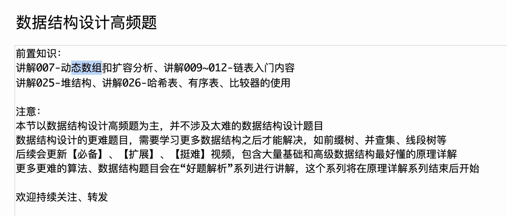
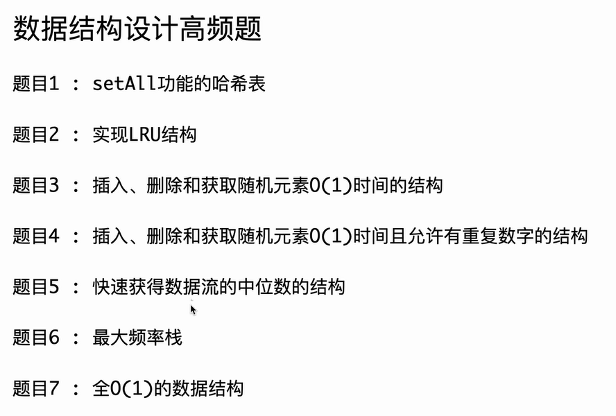

# 题目1 setAll功能的哈希表

<span style="color:#FF0000; background:#00FF80; border:1px solid #FF00FF;">测试链接：</span>

这份 Java 代码实现了一个非常有用的数据结构技巧：<span style="color:#FF0000;">**支持 $O(1)$ 时间复杂度 `setAll` 操作的哈希表**。</span>它的核心逻辑是<span style="background:#00FF80;">利用**时间戳（timestamp）**来区分单独设置的值和全局设置的值哪个更新。</span>

下面是对应的 C++ 实现，以及针对 C++ 特性的详细扩展。

### 1. C++ 代码实现

C++ 中对应 Java `HashMap` 的是 `std::unordered_map`。<span style="color:#FF0000;">对于存储 `{value, time}` 这种组合数据，C++ 中最常用的是 `std::pair`。</span>

C++

```C++
#include <iostream>
#include <unordered_map>
#include <utility> // for std::pair

using namespace std;

// 使用 unordered_map 替代 HashMap
// Key 是 int，Value 是 pair<int, int> (分别代表 val 和 time)
unordered_map<int, pair<int, int>> mp;

int setAllValue;
int setAllTime;
int cnt; // 全局计数器（模拟时间戳）

// put 操作
void put(int k, int v) {
    // C++ 的 operator[] 如果 key 不存在会自动创建，存在则更新
    // 无论是新增还是修改，时间戳 cnt 都增加
    mp[k] = make_pair(v, cnt++);
}

// setAll 操作
void setAll(int v) {
    setAllValue = v;
    setAllTime = cnt++;
}

// get 操作
int get(int k) {
    // 检查 key 是否存在
    if (mp.find(k) == mp.end()) {
        return -1;
    }
    
    // 获取存储的 pair
    pair<int, int> entry = mp[k];
    
    // 核心逻辑：比较单条记录的时间戳与全局 setAll 的时间戳
    if (entry.second > setAllTime) {
        return entry.first;
    } else {
        return setAllValue;
    }
}

int main() {
    // --- 快速 I/O 设置 (对应 Java 的 StreamTokenizer) ---
    // 关闭 C++ stdio 和 C stdio 的同步，解除 cin 和 cout 的绑定
    ios::sync_with_stdio(false);
    cin.tie(nullptr);

    int n;
    // 对应 while (in.nextToken() != StreamTokenizer.TT_EOF)
    // 循环读取每一组测试用例的 n
    while (cin >> n) {
        // 初始化/重置状态
        mp.clear();
        setAllValue = 0;
        setAllTime = -1;
        cnt = 0;

        int op, a, b;
        for (int i = 0; i < n; i++) {
            cin >> op;
            if (op == 1) {
                cin >> a >> b;
                put(a, b);
            } else if (op == 2) {
                cin >> a;
                // cout 输出会自动换行 "\n"
                cout << get(a) << "\n";
            } else { // op == 3
                cin >> a;
                setAll(a);
            }
        }
    }

    return 0;
}
```

------

### 2. C++ 知识点扩展与对比

这份代码虽然逻辑简单，但涉及了几个 C++ 与 Java 在算法竞赛和底层实现上的重要区别。

#### ① `HashMap` vs `unordered_map`

- **Java:** `HashMap` 底层通常是 **数组 + 链表 + 红黑树**。当哈希冲突严重时，链表会转换为红黑树。
- **C++:**
  - `std::map`: 底层是 **红黑树**，Key 是有序的，增删改查复杂度为 $O(\log N)$。
  - `std::unordered_map`: 底层是 **哈希表**（数组 + 链表），Key 是无序的，平均复杂度 $O(1)$。
- **选择：** 本题为了追求 $O(1)$ 的 `put` 和 `get`，必须使用 `unordered_map`。

#### ② 数据存储：`int[]` vs `std::pair`

- **Java:** 为了存两个 `int` (value, time)，Java 代码 `new int[] { v, cnt++ }` 在堆上分配了一个小数组对象。这会产生大量的**小对象垃圾**，增加了 GC（垃圾回收）的压力。
- **C++:** `std::pair<int, int>` 是一个轻量级的结构体。
  - 当它作为 map 的 value 时，它是**值存储**（直接存放在 map 分配的内存块中），而不是像 Java 那样存一个指向数组的引用。
  - **优势：** 内存局部性更好，没有额外的堆分配开销，速度更快。

#### ③ 输入输出加速 (Fast I/O)

Java 代码中特意使用了 `StreamTokenizer` 和 `PrintWriter`，这是因为 Java 默认的 `Scanner` 在处理大数据量时非常慢。

C++ 也有同样的问题，默认的 `cin` 和 `cout` 为了兼容 C 语言的 `scanf/printf`，做了大量的同步工作。

C++

```C++
ios::sync_with_stdio(false); // 关掉与 C stdio 的同步
cin.tie(nullptr);            // 关掉 cin 和 cout 的自动刷新绑定
```

**原理：**

1. **`sync_with_stdio(false)`**: 允许 C++ 流拥有独立的缓冲区，不再每读写一个字符都去检查 C 的缓冲区，大幅提升速度。
2. **`cin.tie(nullptr)`**: 默认情况下，每次执行 `cin` 之前，`cout` 的缓冲区都会被刷新（flush），以确保提示信息显示出来。在大量输入输出交替时，这极其耗时。解绑后可以避免无意义的刷新。

#### ④ 内存清理 `clear()`

- **Java:** `map.clear()` 只是断开了引用，实际的 Node 对象等待 GC 回收。
- **C++:** `mp.clear()` 会立即调用所有元素的析构函数，并将 map 的 size 置为 0。对于 `pair<int, int>` 这种简单类型，这非常快且彻底。

### 3. 该题的思维模型总结

这个算法解决的核心痛点是：**如何让全量修改操作 (`setAll`) 瞬间完成？**

- **普通思维：** 遍历 Map 中的所有 Key，逐个修改 Value。时间复杂度 $O(N)$。
- **惰性思维（Lazy Evaluation）：**
  1. 我不真的去改每一个 Key。
  2. 我记下一个“圣旨”（`setAllValue`）和一个“发布时间”（`setAllTime`）。
  3. 每个小老百姓（Key）自己也有个“更新时间”。
  4. <span style="color:#FF0000; background:#00FF80; border:1px solid #FF00FF;">**读取时判断：** 谁的时间新，听谁的。</span>
     - 如果我的时间 > 圣旨时间 $\rightarrow$ <span style="color:#FF0000;">我是最新修改的，返回我自己的值。</span>
     - 如果我的时间 < 圣旨时间 $\rightarrow$ <span style="background:#00FF80;">我已经过时了，返回圣旨的值。</span>

这种**“加时间戳 + 惰性求值”**的技巧在很多系统设计中都有应用，比如缓存失效策略、数据库的多版本并发控制（MVCC）等。


# 提问1（回顾之前的知识）

<span style="color:#FF0000; background:#00FF80; border:1px solid #FF00FF;">C++中的vector<int> 是一个对象（动态数组），这个对象本身只占了栈上（定义在函数里）很小一块空间，指向堆上的一片连续数组；C++中的list<int> 是一个对象（双向链表），这个对象本身只占了栈上（定义在函数里）很小一块空间，指向堆上的链表头结点；C++中的 stack<int> 和 queue<int> 也都是一个对象（栈和队列，补充dequeue<int> 为双端队列），这个对象本身只占了栈上（定义在函数里）很小一块空间，指向堆上的一片栈或者队列空间，这些是容器，底层采用的是delist<int>来实现；我的上述理解对吗，如果不对的话请给我指正。</span>


你的理解**大体方向是非常正确的**，特别是关于**<span style="color:#FF0000;">内存模型（栈上控制块 -> 堆上数据）</span>** 的理解，这抓住了<span style="color:#FF0000; background:#00FF80;"> C++ STL 容器设计的精髓</span>。

不过，在**底层实现细节**（特别是 `stack`、`queue` 和 `deque` 的关系）上，有一个比较大的**误区**需要修正。

我为你逐一拆解并修正：

### 1. `vector<int>`

- **你的理解：** ✅ **完全正确**。
- **补充细节：** `vector` 在栈上的对象通常包含 3 个指针（或者是 1 个指针 +<span style="background:#00FF80;"> 2 个偏移量</span>）：
  1. `_Myfirst`：指向堆上连续内存的起始位置。
  2. `_Mylast`：指向当前已存数据的末尾（<span style="color:#FF0000;">对应 `size()`</span>）。
  3. `_Myend`：指向堆上申请内存块的末尾（对应 `capacity()`）。
- **大小：** 在 64 位系统下，`sizeof(vector<int>)` <span style="color:#FF0000; border:1px solid #FF00FF;">通常固定为 24 字节（3 个指针 × 8 字节）</span>，无论堆上有多少数据。

------

### 2. `list<int>`

- **你的理解：** ✅ **完全正确**。
- **补充细节：** `list` 是**双向链表**。栈上的对象通常包含一个指向“虚拟头节点”的指针（或者分别指向头尾的指针）以及一个记录 `size` 的整数。堆上的节点是分散的，每个节点包含 `prev`、`next` 指针和数据 `val`。
- **大小：** 通常比 `vector` 稍小或持平（取决于实现），但它管理的堆内存是碎片化的。

------

### 3. `deque<int>` (双端队列) —— *核心修正点*

- **你的理解：**<span style="color:#FF0000; background:#00FF80; border:1px solid #FF00FF;"> ❌ **需要修正**。</span>
- **修正：** `deque`（Double-ended queue）的底层**不是**简单的一片连续空间，也**不是**链表。它是一种**中控器 + 分段数组**的结构。
  - **中控器 (Map)：** <span style="color:#FF0000;">堆上</span>的一小块<span style="color:#FF0000;">连续</span>区域，存的是**指针**。
  - **缓冲区 (Buffer/Chunk)：** 中控器里的每个指针，指向<span style="color:#FF0000;">堆上另一块</span>固定大小（例如 512 字节）的连续内存块。
- **优势：** 这让 `deque` 既像 `vector` 一样支持随机访问（虽然比 vector 慢一点），又像 `list` 一样支持头尾高效插入（因为只需要分配新的 Buffer，不需要搬移旧数据）。

<span style="color:#FF0000; background:#00FF80; border:1px solid #FF00FF;">补充：是 deque 而不是dequeue，注意不要拼写错了，核心抓住是 Double-ended queue 的缩写，既然是缩写的话，那么queue也要缩写，故为 deque。 </span>

------

### 4. `stack<int>` 和 `queue<int>` —— *核心修正点*

- **你的理解：** <span style="color:#FF0000; background:#00FF80; border:1px solid #FF00FF;">❌ **关于底层实现的理解有误**。</span>
  1. **它们不是“容器”：** 严格来说，它们被称为 **容器适配器 (Container Adaptors)**。它们<span style="color:#FF0000;">不直接管理内存，而是把另一个容器“包”在里面，限制了接口（比如 stack 只能 push/pop）。</span>
  2. **默认底层不是 `list` (你说的 `delist` 可能是笔误)：**
     - C++ 标准规定，**`stack` 和 `queue` 的默认底层容器是 `std::deque`**，而不是 `std::list`，也不是 `std::vector`。
- **为什么默认用 `deque`？**
  - **比 `vector` 好：** `stack` 需要扩容时，`vector` 需要搬移所有数据（拷贝代价大），而 `deque` 只需要挂一个新的 Buffer（零拷贝）。
  - **比 `list` 好：** `list` 每次 `push` 都要 `new` 一个节点（内存碎片多，缓存命中率低），而 `deque` 是一次申请一大块 Buffer，内存利用率极高，速度极快。

------

### 5. 总结你的思维模型

你提到的 **“对象本身只占栈上很小空间，指向堆上大片数据”** 这个模型是 **C++ RAII (资源获取即初始化)** 的核心体现，是绝对正确的。

我帮你整理了一个修正后的对照表：

| **容器/适配器** | **栈上对象大小 (64位)** | **堆上数据结构 (底层实现)**  | **备注**                      |
| --------------- | ----------------------- | ---------------------------- | ----------------------------- |
| **vector**      | 24 字节                 | **连续数组**                 | 扩容代价大，随机访问最快      |
| **list**        | 16-24 字节              | **双向链表** (分散节点)      | 插入删除快，不支持随机访问    |
| **deque**       | 40-80 字节 (较复杂)     | **分段数组** (中控器+缓冲区) | 头尾插入快，支持随机访问      |
| **stack**       | 包装了 deque            | **默认是 deque**             | 也可以强制改为 vector 或 list |
| **queue**       | 包装了 deque            | **默认是 deque**             | 也可以强制改为 list           |

**修正后的正确表述：**

> "`stack<int>` 是一个容器适配器，它在栈上只是一个包装壳，默认情况下，它内部持有一个 `deque<int>` 对象。所有的压栈出栈操作，实际上都是转发给堆上的 `deque` 去完成的。"

现在这个逻辑闭环了吗？如果还有疑问，欢迎继续深挖！


## 提问 1-1（回顾之间的优先级队列）

<span style="color:#FF0000; background:#00FF80; border:1px solid #FF00FF;">我记得是不是还有一个优先级队列啊，priority_queue(int)，这个优先级队列是一个容器还是一个容器适配器呢，定义的对象以及底层布局又是怎么样的呢，我不是太懂，你能够给我详细解释下吗，最好能够举个例子来让我彻底弄明白。</span>

你的记忆非常准确！<span style="color:#FF0000;">`priority_queue` 是 C++ STL 中非常重要且常用的一个组件，特别是在算法题（如 Dijkstra 最短路径、Huffman 编码、Top K 问题）中。</span>

为了让你彻底明白，我把它像剥洋葱一样拆解开来：

### 1. 它是容器还是适配器？

答案是：**它是一个容器适配器 (Container Adapter)**。

就像 `stack` 和 `queue` 一样，`priority_queue` 并不负责直接管理内存分配。

- 它只是一个“管理者”或“包装壳”。
- 它默认“雇佣”了 **`std::vector`** 作为底层的苦力来存储数据。
- **区别在于：** 它会对 `vector` 里的数据进行严格的**“纪律管理”**（堆排序算法），确保**最大**（或自定义的最小）的元素永远在最前面。

------

### 2. 底层布局与算法核心

#### 底层容器：`vector`

虽然你可以强制指定它使用 `deque`，但 STL 默认使用 `std::vector`。

- **原因：**<span style="color:#FF0000; border:1px solid #FF00FF;"> 优先级队列需要频繁地交换元素位置（上浮和下沉操作），`vector` 也就是连续内存数组，支持 $O(1)$ 的随机访问，这对于堆算法是最快的。</span>

#### 逻辑结构：二叉堆 (Binary Heap)

虽然物理上数据存在线性的 `vector` 数组里，但在逻辑上，它被维护成了一棵 **完全二叉树**。

- **默认行为 (Max Heap)：** 父节点的值永远 $\ge$ 子节点的值。
- **结果：** 树根（也就是数组的第 0 个元素）永远是整个容器里的**最大值**。

#### 内存模型

- **栈上 (Stack)：** 你的 `priority_queue<int> pq` 对象。它只包含很小的控制信息（如<span style="color:#FF0000; background:#00FF80; border:1px solid #FF00FF;"> size</span>）和一个<span style="color:#FF0000; background:#00FF80; border:1px solid #FF00FF;">包含 vector 的对象</span>。
- **堆上 (Heap Memory)：** `vector` 管理的一大片连续数组。

------

### 3. 举个生动的例子：急诊室 triage

想象一个医院急诊室。病人（数据）源源不断地来。

- **普通 `queue` (先进先出)：** 谁先来谁先看病。
- **`priority_queue` (优先级)：** 谁病得最重（数值最大），谁先看病，不管你是不是最后来的。

#### 具体的代码与内存变化演示

让我们来看一个实际的例子，看看内存里的 `vector` 是怎么变魔术的。

C++

```C++
#include <iostream>
#include <queue>
#include <vector>

using namespace std;

int main() {
    // 定义一个默认的优先级队列（大顶堆）
    priority_queue<int> pq;

    // 1. 插入数据
    pq.push(10);
    pq.push(30);
    pq.push(20);
    pq.push(5);
    pq.push(1);

    // 2. 查看队头
    cout << "老大是: " << pq.top() << endl; // 输出 30

    // 3. 弹出老大
    pq.pop(); 
    cout << "新的老大是: " << pq.top() << endl; // 输出 20

    return 0;
}
```

#### 内存里的“风暴” (重要！)

你可能会以为 vector 里的数据是排好序的 [30, 20, 10, 5, 1]。

大错特错！ <span style="color:#FF0000; background:#00FF80; border:1px solid #FF00FF;">堆只是**“部分有序”**。</span>

让我们一步步看 `vector` 在内存中是如何变化的：

1. **`push(10)`**:
   - Vector: `[10]`
2. **`push(30)`**: (30比10大，30篡位做父节点)
   - Vector: `[30, 10]`
3. **`push(20)`**: (20比30小，做右孩子)
   - Vector: `[30, 10, 20]`
4. **`push(5)`**: (5比10小，做10的左孩子)
   - Vector: `[30, 10, 20, 5]`
5. **`push(1)`**: (1比10小，做10的右孩子)
   - Vector: `[30, 10, 20, 5, 1]`

此时内存布局： [30, 10, 20, 5, 1]

注意看，虽然 30 是最大的，但在数组里，20 居然排在 5 和 1 的前面。

- 这就是<span style="color:#FF0000; background:#00FF80;">堆的特性</span>：它<span style="color:#FF0000;">只保证**根节点（索引0）是最大的**，不保证后面的顺序是线性的。这使得插入效率极高 ($O(\log N)$)，不需要像排序那样移动整个数组 ($O(N)$)。</span>

1. **`pop()` 移除 30**:
   - 算法会<span style="color:#FF0000;">将末尾的 `1` 提到根节点覆盖 `30` -> `[1, 10, 20, 5]`</span>
   - 然后<span style="color:#FF0000;">让 `1` 下沉（Sift Down）：`1` 和较大的孩子 `20` 交换</span>。
   - 最终 Vector: `[20, 10, 1, 5]` (新的最大值 20 浮到了 `vector[0]`)。

------

### 4. 扩展：<span style="color:#FF0000;">如何变成小顶堆（最小值优先）？</span>

这是面试常考点。默认是 `less<int>`（大的在顶）。如果你想要小的在顶（<span style="background:#00FF80; color:#FF0000;">比如 Dijkstra 算法求最短边</span>）：

C++

```C++
// 第一个参数：类型
// 第二个参数：底层容器（通常用 vector）
// 第三个参数：比较规则（greater 表示“大于”的沉底，“小于”的浮上来）
priority_queue<int, vector<int>, greater<int>> min_pq;

min_pq.push(10);
min_pq.push(5);
cout << min_pq.top(); // 输出 5
```

### 总结

1. **身份：** 容器适配器（Manager）。
2. **默认底层：** `vector<T>`（Worker）。
3. **算法逻辑：** 堆排序算法（Heapify）。
4. **内存特征：** 栈上存控制块，堆上存 `vector` 的连续数组。数组内容并非完全有序，但 `vector[0]` 永远是极值。


## 提问1-1-1（优先级队列如何自定义比较规则）

<span style="color:#FF0000; background:#00FF80; border:1px solid #FF00FF;">优先级队列如何自定义比较规则呢，我不是太懂，你能够给我详细解释下吗，最好能够举个例子来让我彻底弄明白。</span>

这是一个非常棒的问题！在 C++ 算法题和工程开发中，能够随心所欲地控制 `priority_queue` 的排序规则是一项**必备技能**。

默认情况下，`priority_queue` 是**大顶堆**（大的在上面）。<span style="color:#FF0000; background:#00FF80; border:1px solid #FF00FF;">如果你想变成小顶堆，或者存的是自定义的结构体（比如学生对象、坐标点），就需要自定义比较规则。</span>

我将用由浅入深的三种方法，配合生动的例子带你彻底搞懂。

------

### <span style="color:#FF0000; border:1px solid #FF00FF;">核心逻辑：谁是“弱者”？</span>

在写代码之前，你必须记住一句**核心口诀**，这能帮你避开 99% 的逻辑坑：

> 比较函数 cmp(a, b) 的逻辑是：如果返回 true，说明 a 的优先级比 b 低（a 是弱者）。
>
> <span style="color:#FF0000;">弱者会被扔到底下，强者（返回 false 的那边）会浮到堆顶。</span>

- 默认的 `less<int>`：`a < b` 返回 true。意味着“小的就是弱者”。所以小的沉底，大的在顶（大顶堆）。
- 想要小顶堆：我们需要写一个函数，让“大的变成弱者”。即 `a > b` 返回 true。

------

### 方法一：最简单的情况（基本数据类型）

<span style="color:#FF0000; background:#00FF80;">如果你只是想把 `int`、`long`、`double` 的默认**大顶堆**改成**小顶堆**，不需要写复杂的代码，直接用 STL 自带的模板即可。</span>

语法公式：

priority_queue<类型, 底层容器, <span style="border:1px solid #FF00FF; color:#FF0000; background:#00FF80;">比较规则</span>>

C++

```C++
#include <iostream>
#include <queue>
#include <vector>

using namespace std;

int main() {
    // 1. 默认：大顶堆 (less<int>)
    // 这里的 less 意思是：数值小的优先级低（沉底）
    priority_queue<int> max_pq; 

    // 2. 变身：小顶堆 (greater<int>)
    // 这里的 greater 意思是：数值大的优先级低（沉底），也就是小的浮上来
    priority_queue<int, vector<int>, greater<int>> min_pq;

    min_pq.push(10);
    min_pq.push(5);
    min_pq.push(30);

    // 输出应该是 5 (最小的在顶)
    cout << "小顶堆的堆顶: " << min_pq.top() << endl; 

    return 0;
}
```

------

### 方法二：<span style="color:#FF0000; background:#00FF80; border:1px solid #FF00FF;">最常用、最灵活的情况（自定义结构体）</span>

这是面试和刷题最常见的场景。假设你有一个 `Student` 结构体，包含**名字**和**分数**。

**需求：**<span style="color:#FF0000; border:1px solid #FF00FF;"> 我们希望**分数低**的学生排在队头（小顶堆逻辑），如果分数相同，则**学号小**的排在前面。</span>

#### 写法：仿函数 (Functor)

我们<span style="color:#FF0000; background:#00FF80; border:1px solid #FF00FF;">需要写一个结构体（或类）</span>，并在里面<span style="border:1px solid #FF00FF; background:#00FF80;">重载 `()` 运算符</span>。这看起来像个函数，实际上是个对象。

C++

```C++
#include <iostream>
#include <queue>
#include <string>
#include <vector>

using namespace std;

// 1. 定义学生结构体
struct Student {
    string name;
    int score;
    int id;

    Student(string n, int s, int i) : name(n), score(s), id(i) {}
};

// 2. 【核心】自定义比较规则（仿函数）
struct CompareStudent {
    // 必须重载 operator()，接受两个参数
    // 返回 true 表示：s1 的优先级 低于 s2 (s1 应该排在 s2 后面/下面)
    bool operator()(const Student& s1, const Student& s2) {
        // 逻辑一：分数不同
        if (s1.score != s2.score) {
            // 我们想要分数低的在堆顶。
            // 所以，分数高的就是“弱者”，要返回 true 让它沉底。
            return s1.score > s2.score; 
        }
        // 逻辑二：分数相同，看学号
        // 我们想要学号小的在堆顶。
        // 所以，学号大的就是“弱者”，要返回 true 让它沉底。
        return s1.id > s2.id;
    }
};

int main() {
    // 3. 定义优先队列，第三个参数传入我们的比较类名
    priority_queue<Student, vector<Student>, CompareStudent> pq;

    pq.push(Student("张三", 90, 1001));
    pq.push(Student("李四", 80, 1002));
    pq.push(Student("王五", 90, 1003)); // 分数和张三一样，但ID大
    pq.push(Student("赵六", 60, 1004));

    // 4. 验证结果
    cout << "按自定义规则出队 (分数低优先 -> 学号小优先):" << endl;
    while (!pq.empty()) {
        Student top = pq.top();
        pq.pop();
        cout << top.name << " (分:" << top.score << ", ID:" << top.id << ")" << endl;
    }

    // 预期顺序：
    // 赵六 (60)
    // 李四 (80)
    // 张三 (90, ID 1001)
    // 王五 (90, ID 1003) -> 弱者沉底
    
    return 0;
}
```

------

### 方法三：偷懒的写法（重载运算符 `<`）

如果你拥有这个结构体的代码权限（比如是你自己定义的结构体），你可以直接在结构体里面重载 `<` 运算符。`priority_queue` 默认会去调用这个对象的 `<` 操作。

**注意：** 这种方法虽然写起来代码少，但**逻辑是反的**，容易绕晕。

- `priority_queue` 默认是大顶堆（最大值在顶）。
- 如果你想要**分数小**的在顶，你必须欺骗编译器，告诉它：“分数小的其实是‘最大值’”。

C++

```C++
struct Point {
    int x, y;
    
    // 重载小于号
    // const Point& other 是必须要写的格式
    bool operator<(const Point& other) const {
        // 我们的目标：x 小的在堆顶（小顶堆效果）。
        // 默认逻辑：operator< 返回 true 的是弱者（小的）。
        // 欺骗逻辑：我让 x 大的返回 true。
        // 意思是：如果 我比你大，那我就是弱者。 -> 于是大的沉底了，小的浮上来了。
        return this->x > other.x; 
    }
};

// 使用时不需要传第三个参数
priority_queue<Point> pq; 
```

**为什么不推荐初学者用方法三？**

1. **侵入性强：** 你修改了结构体本身的定义。万一别的地方（比如排序 `std::sort`）也用到这个 `<`，逻辑就乱了。
2. **逻辑反直觉：** 为了实现“小顶堆”，你得在“小于号”里写“大于”的逻辑，读代码的人会疯。

------

### 总结：如何彻底弄明白？

不管用哪种方法，你<span style="color:#FF0000;">只需要记住**“沉底法则”**：</span>

你在写比较逻辑 cmp(A, B) 时，问自己一个问题：

“如果是 A 这种情况，我希望 A 沉到底下（排在后面）吗？”

- **是：** `return true;`
- **否：** `return false;`

举例验证：

我们要分数小的在堆顶。

现在来了两个学生：A(100分) 和 B(60分)。

比较 A 和 B：

A 是 100 分，分很高。在我们的规则里，高分是不好的（要排后面）。

所以：A > B 是成立的。

既然 A 不好，我要把 A 扔到底下，所以返回 true。

代码写成：return a.score > b.score;

这就是自定义比较规则的终极心法！你自己写两个例子试一下？


#  提问2（map与unordered_map 的内存布局）

<span style="color:#FF0000; background:#00FF80; border:1px solid #FF00FF;">C++中的 map 和 unordered_map 的内存布局是什么样的呢，我不是太懂，你能够给我详细解释下吗，最好能够举个例子来让我彻底弄明白。</span>

这是一个非常经典且极其重要的问题！`map` 和 `unordered_map` 是 C++ 面试中关于数据结构和内存管理的“必考题”。

虽然它们用起来很像（<span style="color:#FF0000;">都是 key-value 存储</span>），但在<span style="color:#FF0000;">**内存里的长相（布局）**可以说是天壤之别。</span>

我们继续延用你之前掌握的**“栈上控制块 -> 堆上数据”**的思维模型来拆解。

------

### 1. `std::map`：红黑树（Red-Black Tree）

#### 核心身份

- **底层实现：** **红黑树**（一种<span style="color:#FF0000;">自平衡的二叉搜索树</span>）。
- **内存特征：** **极度分散**。

#### 内存布局详解

1. **栈上 (Stack)：**
   - 你的 `map<int, string> m` 对象只占很小一块空间（通常 48 字节左右）。
   - 它里面存的是：<span style="border:1px solid #FF00FF; font-family:serif; color:#FF0000;">**根节点指针 (Root)**、**节点数量 (Size)**、**比较器 (Comparator)** 等控制信息。</span>
2. **堆上 (Heap)：**
   - **无数个独立的小岛（节点）：** <span style="color:#FF0000; border:1px solid #FF00FF;">每当你 `insert` 一个数据，系统就会 `new` 一个节点。这些节点在堆内存中是散落分布的，物理上**不连续**。</span>
   - **节点结构 (TreeNode)：**<span style="background:#00FF80;"> 每个节点通常包含 3 部分：</span>
     1. **数据域：** `pair<const Key, Value>`（这就是你存的数据）。
     2. **指针域：** 3 个指针！`Left`（左孩子）、`Right`（右孩子）、`Parent`（父节点）。
     3. **元数据：** `Color`（红或黑，用于维持平衡）。
3. **连接方式：**
   - 通过指针像“抓手”一样，把这些散落的节点抓在一起，形成一个树状结构。

#### 举个例子

C++

```C++
map<int, string> m;
m[5] = "Alice";
m[2] = "Bob";
m[8] = "Charlie";
```

- **逻辑图：**

  Plaintext

  ```C++
        [5, Alice]  <-- 根节点 (Root)
       /          \
  [2, Bob]      [8, Charlie]
  ```

- **内存图：**

  - `m` (栈上) 存了一个地址 `0x100`。
  - `0x100` (堆上) 是节点 `[5, Alice]`。它左手指向 `0x500`，右手指向 `0x900`。
  - `0x500` (堆上) 是节点 `[2, Bob]`。
  - `0x900` (堆上) 是节点 `[8, Charlie]`。
  - **注意：** `0x100`, `0x500`, `0x900` 之间可能有巨大的内存空隙。

------

### 2. `std::unordered_map`：哈希表（Hash Table）

#### 核心身份

- **底层实现：** <span style="color:#FF0000; background:#00FF80; border:1px solid #FF00FF;">**哈希表**（通常是“数组 + 链表”的拉链法）。</span>
- **内存特征：** <span style="border:1px solid #FF00FF;">**部分连续，部分分散**。</span>

#### 内存布局详解

1. **栈上 (Stack)：**
   - `unordered_map` 对象包含：**桶数组指针 (Bucket Vector)**、**大小 (Size)**、**哈希函数 (Hasher)**、**负载因子**等。
2. **堆上 (Heap) —— 两层结构：**
   - **第一层（骨架）：桶数组 (Bucket Array)**
     - 这是一个<span style="color:#FF0000; background:#00FF80; border:1px solid #FF00FF;">连续的数组（类似 `vector`），里面存的不是数据，而是**指针**（指向链表的头）。</span>
     - 这一层是<span style="color:#FF0000;">物理连续</span>的。
   - **第二层（血肉）：节点链表 (Linked List Nodes)**
     - 真正的数据存在这里。
     - <span style="background:#00FF80; color:#FF0000; border:1px solid #FF00FF;">当发生哈希冲突时（两个 Key 算出的哈希值一样），它们会挂在同一个桶下面，形成一个单向链表。</span>
     - 这些节点也是 `new` 出来的，在堆上**散落分布**。
3. **节点结构 (HashNode)：**
   - **数据域：** `pair<const Key, Value>`。
   - **指针域：** `Next` 指针（指向链表下一个节点）。
   - **缓存域：** 通常会存一个 `Hash` 值（避免 resize 时重新计算）。

#### 举个例子

C++

```C++
unordered_map<int, string> um;
// 假设 bucket 数量为 4
// Hash(5) % 4 = 1
um[5] = "Alice"; 
// Hash(2) % 4 = 2
um[2] = "Bob";
// Hash(9) % 4 = 1 (和 5 冲突！)
um[9] = "David"; 
```

- **内存图：**
  - **桶数组 (Bucket Array)：** 连续内存 `[ptr0, ptr1, ptr2, ptr3]`。
  - **Index 1 (ptr1):** 指向堆上的节点 `[5, Alice]`。
    - `[5, Alice]` 的 `next` 指针指向 -> `[9, David]`。
    - `[9, David]` 的 `next` 指针 -> `nullptr`。
  - **Index 2 (ptr2):** 指向堆上的节点 `[2, Bob]`。
  - **Index 0, 3:** 空指针 `nullptr`。

------

### 3. 终极对比：为了彻底弄明白

让我们用**“图书馆找书”**来比喻这两种布局。

#### `map` (红黑树) —— 精密的图书馆索引系统

- **布局：** 这里的书（节点）是按照**书名的字母顺序**（Key 排序）摆放的。
- **找书：** 你从门口（Root）开始，书名比 "M" 大往右走，比 "M" 小往左走。
- **特点：**
  - **有序：** 遍历时，书名自动是排好序的。
  - **稳定：** 每次插入新书，只需要改几个指针，不需要大规模搬家。
  - **慢一点：** 每次都要做比较，跳跃查找，缓存命中率低（因为节点内存不连续）。

#### `unordered_map` (哈希表) —— 快递分拣中心的格子

- **布局：** <span style="color:#FF0000; background:#00FF80;">墙上有一排格子（Bucket Array）。我们根据**书名的哈希值**（比如把书名放入一个公式算出数字 3），就把书扔进 3 号格子</span>。
- **找书：** 算出书名的哈希值是 3，直接去 3 号格子拿。<span style="color:#FF0000; background:#00FF80;">如果不止一本书（哈希冲突），就在 3 号格子里翻一翻（链表遍历）。</span>
- **特点：**
  - **无序：** 书是乱序的，你无法预测下一个 Key 是谁。
  - **神速：** 理想情况下 $O(1)$ 直接定位，不需要比较大小。
  - **扩容代价大：** 当格子满了，需要换一面更大的墙（Rehash），所有的书都要重新算位置再扔一遍。

### 总结对照表

| **特性**       | **std::map**                   | **std::unordered_map**         |
| -------------- | ------------------------------ | ------------------------------ |
| **底层结构**   | 红黑树 (Tree)                  | 哈希表 (Buckets + Linked List) |
| **内存连续性** | **完全不连续** (全是碎片节点)  | **桶数组连续**，但节点不连续   |
| **节点开销**   | 大 (3个指针 + 颜色)            | 小 (1个指针 + Hash值)          |
| **Key 的要求** | 必须能**比较大小** (`<`)       | 必须能**计算哈希** (`hash()`)  |
| **遍历顺序**   | Key **从小到大**有序           | **乱序** (看起来随机)          |
| **查找速度**   | $O(\log N)$ (稳定)             | $O(1)$ (平均)，最差 $O(N)$     |
| **适用场景**   | 需要排序、范围查找、数据量中等 | 需要极致查找速度、数据量大     |

现在，你脑海里有那张“红黑树”的网状图和“哈希表”的格子图了吗？


# 提问2-1（map内存布局详解）

<span style="color:#FF0000; background:#00FF80;">std::unordered_map`：哈希表（Hash Table）</span>

<span style="color:#FF0000; background:#00FF80;">这里关于哈希表的内存布局你能够再给我详细解释下吗，我还是不太懂，这里栈上的“**桶数组指针 (Bucket Vector)**、**大小 (Size)**、**哈希函数 (Hasher)**、**负载因子**”这些东西具体都是干什么的呢，那个桶数组还有结点链表是不是桶数组里面某个元素的值就是指向了某个链表呢，根据栈上的哈希函数用key值Hash(key) %size（这里size应该属桶数组的大小吧）得到一个数值，这个数值表示桶数组的某个位置，根据这个位置可以找到一个链表，这个链表中存放的就是value，这个链表节点结构`pair<const Key, Value>`数据域为什么要有一个const呢，还有链表节点里面存放的Hash值又是干什么用的呢。帮我回答下我上面的问题，还有我上面的理解对吗，有没有什么需要补充的呢。</span>

你的理解**非常接近真相了**！你的直觉很敏锐，把<span style="color:#FF0000;">哈希表的核心逻辑链路</span>（<span style="background:#00FF80; border:1px solid #FF00FF; color:#FF0000;">哈希 -> 取模 -> 桶 -> 链表</span>）都串起来了。

为了让你彻底通透，我把你提出的这几个关键点（<span style="color:#FF0000;">栈上的东西、const Key、缓存Hash</span>）像拆钟表一样拆开给你看。

我们先看一张更精细的**逻辑透视图**，然后逐一回答你的疑问。

------

### 1. 栈上的“控制中心”：那些变量到底是干嘛的？

你在栈上定义的 `unordered_map<int, string> map;` 对象，本质上是一个**管理者**。它不存数据，它<span style="background:#00FF80; color:#FF0000;">存的是**“数据的元数据（Metadata）”**。</span>

- **桶数组指针 (Bucket Vector Ptr)**:

  - **你的理解：** “是<span style="color:#FF0000;">指向堆上的桶数组</span>吗？” —— **完全正确。**
  - **作用：** 这是通往数据海洋的唯一入口。它指向堆上那块连续内存（桶数组）的起始地址。如果没有它，我们就找不到数据存在哪了。

- **元素个数 (Size)**:

  - **作用：** <span style="color:#FF0000;">记录当前一共存了多少个键值对（比如插入了 100 个数据，Size 就是 100）。</span>
  - **用途：**<span style="background:#00FF80; border:1px solid #FF00FF;"> 当你调用 `map.size()` 时，直接返回这个变量，是 $O(1)$ 的操作，不需要去遍历链表数数。</span>

- **桶的数量 (Bucket Count)**:

  - **修正你的理解：** 你提到的 `Hash(key) % size` 里的<span style="color:#FF0000;">这个 `size`，**不是元素个数**，而是**桶数组的长度**。我们通常叫它 `bucket_count`。</span>
  - **作用：** 用于取模运算。

- **哈希函数 (Hasher)**:

  - **作用：** 这是一个函数对象（Function Object）。它<span style="color:#FF0000; border:1px solid #FF00FF;">负责把你的 Key（可能是字符串、结构体）变成一个整数（size_t）。</span>
  - **例子：** `Hasher("Alice")` -> `8943215`。

- **最大负载因子 (Max Load Factor)**:

  - **作用：** 这是一个阈值（默认是 1.0）。

  - **逻辑：** <span style="color:#FF0000;">用来判断“什么时候该扩容”</span>。公式是：

    > 如果 元素个数(Size) > 桶数量(Bucket Count) * 负载因子
    >
    > 说明太挤了，链表太长了，效率要下降了。
    >
    > 触发 Rehash： 申请一个更大的桶数组，把数据重新撒进去。

------

### 2. 桶数组与链表的关系（<span style="color:#FF0000;">补充理解：叫桶数组的原因就是数组里每个元素就是一个桶，可以放多个值</span>）

> **你的问题：** “是不是<span style="color:#FF0000; background:#00FF80;">桶数组里面某个元素的值就是指向了某个链表</span>呢？”

**答案：是的，完全正确！**

- **桶数组 (Bucket Array)** 本质上就是一个 **指针数组**（或者叫迭代器数组）。
  - 数组的每一个格子里，存的是一个**指针**。
  - 这个指针指向了**该位置对应的链表的“头节点”**。
- **空桶：** 如果这个格子里存的是 `nullptr`，说明这个桶是空的，里面没有数据。
- **冲突解决：**<span style="color:#FF0000; background:#00FF80; border:1px solid #FF00FF;"> 如果计算出 `Hash(key) % bucket_count` 是 3，那么我们就去访问 `Buckets[3]`。</span>
  - 如果 `Buckets[3]` 是 `nullptr`，说明没冲突，直接挂上去。
  - 如果 `Buckets[3]` 已经有个指针了，说明这里已经有人了（哈希冲突），我们就顺着这个指针往后找（遍历链表）。

------

### 3. 为什么是 `pair<const Key, Value>`？（为什么 Key 必须是 const）

> **你的问题：** “数据域为什么要有一个 const 呢？”

这是一个非常深刻的 C++ 设计哲学问题，叫做 **“数据完整性保护”**。

场景模拟：

<span style="color:#FF0000;">假设没有 const，允许你修改 Key：</span>

1. 你插入了 `map["Alice"] = 100`。
2. 系统计算 `Hash("Alice")` = 5，把它放进了 **5号桶**。
3. <span style="color:#FF0000;">后来，你通过引用拿到了这个节点，把 Key 改成了 `"Bob"`（假设允许修改）。</span>
4. 此时，这个节点依然躺在 **5号桶** 里。
5. 但是！`Hash("Bob")` 其实应该等于 8，它本该在 **8号桶**。
6. **灾难发生：** 当你下次调用 `map.find("Bob")` 时，系统去 **8号桶** 找，发现是空的，告诉你“查无此人”。当你调用 `map.find("Alice")` 时，系统去 **5号桶** 找，发现里面的 Key 变成了 "Bob"，不匹配，也告诉你“查无此人”。

结论：

<span style="color:#FF0000;">Key 是定位数据的导航仪。如果 Key 变了，它在哈希表里的位置就“失效”了（变成了幽灵数据）。</span>

所以，C++ 强制加上 const，禁止你在不删除节点的情况下原地修改 Key。如果你想改 Key，必须先删除旧的，再插入新的。

------

### 4. 链表节点里的 Hash 值是干嘛用的？（缓存优化）

> **你的问题：** “链表节点里面存放的Hash值又是干什么用的呢？”

这是一个**高级优化策略**，主要有两个用途：

**用途一：加速 Rehash（扩容）—— 最主要原因**

- 当 Map 扩容时（比如桶从 8 个变成 16 个），所有的节点都需要搬家。
- 新位置计算公式：`Hash(Key) % 16`。
- **如果没有缓存 Hash 值：** 系统必须拿出 Key，重新运行一遍哈希函数 `Hasher(Key)`。如果 Key 是一个超长字符串（比如一篇文章），计算 Hash 非常耗时！
- **有了缓存 Hash 值：**<span style="background:#00FF80; color:#FF0000;"> 系统直接读取节点里存好的那个整数，直接做取模运算 `CachedHash % 16`。**速度飞快！**</span>

**用途二：加速查找（Fast Fail）**

- <span style="color:#FF0000;">当我们在链表中遍历查找 `"Alice"` 时，需要对比 Key。</span>
- 字符串对比 `strcmp("Alice", "Bob")` 是逐个字符比较，比较慢。
- **优化逻辑：** <span style="color:#FF0000;">先比对 Hash 值！</span>
  - 如果 `Node->CachedHash != Hash("Alice")`，那 **Key 绝对不一样**，直接跳过，不用比字符串了。
  - 只有当 Hash 值相等时，才去真正调用 `Key == Node->Key` 做最后的确认（防止哈希碰撞）。

------

### 总结你的理解与补充

你的理解：

1. 栈上存控制信息，指向堆上数组 -> **正确**。
2. 桶数组里存指针，指向链表头 -> **正确**。
3. 查找过程 `Hash(Key) % bucket_count` 定位桶 -> **正确**。

**我的补充总结 (Cheatsheet)：**

现在，这个哈希表的内存大厦在你脑海里是不是彻底清晰了？


# 提问2-2（map不可以修改key，可以修改value；unordered_map不会出现相同的key）

<span style="color:#FF0000; background:#00FF80; border:1px solid #FF00FF; font-size:1.1em;">map可以允许修改key和value吗，如果可以的话对应的操作是什么样的呢。还有上面的“当我们在链表中遍历查找 `"Alice"` 时，需要对比 Key。如果 `Node->CachedHash != Hash("Alice")`，那 **Key 绝对不一样**，直接跳过，不用比字符串了”这里应该是同一个链表里面的key值应该是有相同的有不同的吧，比如key值相同但value值不同，key值相同value值相同应该就只存一个，key值不同也是可以在同一个链表中的，这里可以通过先比较节点里面存放的Hash值来做个前提判断加速寻找key，我的理解对吗，还有没有什么需要补充的吗。</span>

这是一个非常棒的追问！你正在从“大概了解”走向“精通细节”。

你的提问包含两个核心部分：一个是关于 `std::map` 的**修改机制**，另一个是关于 `std::unordered_map` **哈希冲突与查找优化**的深度逻辑。

我们分两部分来彻底厘清。

------

### 第一部分：`std::map` 允许修改 Key 和 Value 吗？

**结论：**

1. **Value（值）：** **完全允许修改**。
2. **Key（键）：** <span style="color:#FF0000; background:#00FF80; border:1px solid #FF00FF;">**绝对禁止直接修改**。</span>

#### 1. 为什么 Key 不能改？

`std::map` 的底层是**红黑树**。红黑树是一种**排序二叉树**，它是根据 Key 的大小（`a < b`）来安排节点位置的。

- <span style="color:#FF0000; background:#00FF80; border:1px solid #FF00FF;">如果你原地修改了 Key（比如把 5 改成 10），这棵树的**有序性（左 < 根 < 右）**瞬间就崩塌了。</span>
- <span style="color:#FF0000; background:#00FF80; border:1px solid #FF00FF;">为了防止你犯错，C++ 标准库在定义 `pair` 时，把 Key 定义成了 `const Key`。如果你尝试 `it->first = new_key`，编译器直接报错。</span>

#### 2. 对应的操作是什么样的？

**A. 修改 Value (很简单)**

```C++
map<string, int> m;
m["Alice"] = 100;

// 方法1：通过 [] 运算符
m["Alice"] = 99; // 找到 Alice，把 100 改成 99

// 方法2：通过迭代器
auto it = m.find("Alice");
if (it != m.end()) {
    it->second = 99; // 正确：second 是 Value，非 const
    // it->first = "Bob"; // ❌ 错误！first 是 const Key，禁止修改
}
```

B. 修改 Key (需要“移花接木”)

既然不能直接改，我们只能<span style="color:#FF0000; background:#00FF80; border:1px solid #FF00FF;">**“先删旧的，再加新的”**。</span>

**传统写法（旧节点被销毁，Value 被拷贝）：**

```C++
// 目标：把 "Alice": 100 改成 "Bob": 100
auto it = m.find("Alice");
if (it != m.end()) {
    int val = it->second; // 1. 备份 Value
    m.erase(it);          // 2. 从树中删除 Alice 节点
    m.insert({"Bob", val}); // 3. 插入 Bob 节点
}
```

进阶写法（C++17 extract，高效，无内存重新分配）：

C++17 提供了一种黑科技，可以把节点从树上“摘下来”（不销毁内存），改掉 Key，再“挂上去”。这省去了 Value 的拷贝开销。

```C++
auto node = m.extract("Alice"); // 1. 把节点摘下来，node 是一个独立的句柄
if (!node.empty()) {
    node.key() = "Bob"; // 2. 此时不再属于 map，允许修改 Key！
    m.insert(move(node)); // 3. 把节点重新插回树里（自动找到新位置）
}
```

------

### 第二部分：哈希表查找优化的深度逻辑

你对“哈希冲突”和“查找加速”的理解**大部分是正确的**，但有一个**关键的误区**需要纠正（关于同一个链表里 Key 是否相同）。

让我们看看同一个桶（链表）里的情况：

#### 1. 纠正误区：同一个链表里会有“相同的 Key”吗？

**结论：<span style="color:#FF0000; background:#00FF80; border:1px solid #FF00FF;">在标准的 `std::unordered_map` 中，绝对没有相同的 Key。</span>**

- <span style="color:#FF0000; background:#00FF80;">**Key 唯一性原则：** `unordered_map` 保证 Key 唯一。</span>
- <span style="background:#00FF80; color:#FF0000;">如果你执行 `map["Alice"] = 10`，然后又执行 `map["Alice"] = 20`：</span>
  - 哈希表**不会**新建一个节点。
  - 它会找到旧的 "Alice" 节点，直接把 Value 从 10 改成 20。
- **多重哈希表：** 只有 `std::unordered_multimap` 才允许同一个链表里出现多个 "Alice"。但这是特殊情况，我们通常讨论的是标准 Map。

#### 2. 链表里存的是什么？（哈希冲突的本质）

既然 Key 不能相同，那为什么链表里会有多个节点？

答案： 它们是**“<span style="color:#FF0000; border:1px solid #FF00FF;">不同的 Key”，但是“撞车</span>”**了（哈希值取模后结果一样）。

场景模拟：

假设桶数组长度 N = 4。

1. 插入 "Alice" -> `Hash("Alice") = 100` -> `100 % 4 = 0` (0号桶)
2. 插入 "Bob"   -> `Hash("Bob") = 101`   -> `101 % 4 = 1` (1号桶)
3. 插入 "David" -> `Hash("David") = 104` -> `104 % 4 = 0` (0号桶，**撞车了！**)

此时 0 号桶的链表结构：

[Alice 节点] -> [David 节点] -> nullptr

- **Key 相同吗？** 不同（"Alice" vs "David"）。
- **Value 相同吗？** 无所谓。
- <span style="color:#FF0000; border:1px solid #FF00FF;">**Hash 值相同吗？** **通常不同**（100 vs 104），只是取模后一样。</span>

#### 3. 你的理解：Hash 值加速判断的原理

你这里的理解非常精彩，且**完全正确**！

当我们去查找 "David" 时：

1. 算出 `Hash("David") = 104`。
2. 定位到 0 号桶。
3. 开始遍历链表：
   - **遇到第一个节点 (Alice)：**
     - 系统先看 Alice 节点里存的 **CachedHash** (是 100)。
     - 比较：`104 (目标) != 100 (节点)`。
     - **结论：** <span style="color:#FF0000; background:#00FF80; border:1px solid #FF00FF;">原始哈希值都不一样，Key 肯定不一样！**直接跳过**，根本不需要调用耗时的 `strcmp("Alice", "David")`。</span>
   - **遇到第二个节点 (David)：**
     - 系统看 David 节点里存的 **CachedHash** (是 104)。
     - 比较：`104 == 104`。
     - **结论：**<span style="color:#FF0000; background:#00FF80; border:1px solid #FF00FF;"> 哈希值一样，**有可能是同一个 Key**（也可能是极低概率的哈希碰撞）</span>。
     - **最后一步：** 只能发起最终的字符串比较 `key == "David"`。
     - 匹配成功，返回 Value。

#### 总结你的理解修正

你原来的话：

> “比如key值相同但value值不同... key值相同value值相同应该就只存一个”

**修正为：**

> 在同一个链表中，**Key 绝对互不相同**。它们之所以挤在一起，纯粹是因为 `Hash(Key) % BucketSize` 的结果撞车了。

你原来的话：

> “可以通过先比较节点里面存放的Hash值来做个前提判断加速寻找key”

评价：

完全正确，这是 C++ STL 的核心优化策略。

- **Index (桶下标)**：用于找到链表。
- **Cached Hash (原始哈希)**：用于在链表内部快速排除错误的节点。
- **Key (原始键)**：用于最终确认。

这下逻辑闭环了吗？


## 提问2-3（unordered_map可以修改key或者value吗，map里面key一定唯一吗）

<span style="color:#FF0000; background:#00FF80; border:1px solid #FF00FF; font-size:1.2em;">既然map里面不可以修改key，可以修改value，那么unordered_map也是一样的吗。另外unordered_map里面的key不是唯一的吗，那么map里面的key也是唯一的吗。我不太懂，你能够给我解释总结下吗。</span>

你的直觉非常准！这两个问题的答案可以用两句话概括：

1. **关于修改：** **是的**，`unordered_map` 和 `map` 一模一样，<span style="color:#FF0000;">**Key 绝对不可直接修改，Value 可以随意修改**。</span>
2. **关于唯一性：** **是的**，`map` 和 `unordered_map` 一模一样，<span style="color:#FF0000;">**Key 必须是唯一的**（同一个容器里不能有两个相同的 Key）。</span>

为了让你彻底放心，我把这两个容器放在一起做一个全方位的总结对比。

------

### 一、 为什么 Key 都不能修改？

虽然它们底层结构不同（<span style="color:#FF0000;">一个是红黑树，一个是哈希表</span>），但它们**禁止修改 Key** 的底层逻辑是一致的：<span style="color:#FF0000; background:#00FF80;">**<span style="border:1px solid #FF00FF;">Key 决定了节点的位置。</span>**</span>

#### 1. `std::map` (红黑树)

- **位置规则：** 按照 Key 的大小顺序（左 < 根 < 右）排列。
- **如果你偷偷改了 Key：**
  - 比如把 Key=5 改成 Key=100，但它还留在原处。
  - **后果：** <span style="color:#FF0000;">整棵树的**有序性**被破坏了。下次二分查找时，程序走到这就乱套了，找不到数据。</span>
- **强制手段：**<span style="background:#00FF80;"> C++ 将节点里的 Key 定义为 `const Key`。</span>

#### 2. `std::unordered_map` (哈希表)

- **位置规则：** <span style="color:#FF0000;">按照 `Hash(Key) % BucketSize` 决定放在哪个桶里。</span>
- **如果你偷偷改了 Key：**
  - <span style="background:#00FF80; color:#FF0000; border:1px solid #FF00FF;">比如把 "Alice" 改成 "Bob"，但它还留在 "Alice" 对应的桶里。（补充理解：key值上面说了决定位置，在哈希表里面就决定在哪个桶里）</span>
  - **后果：**<span style="color:#FF0000;"> 下次你查 "Bob"，系统算出 "Bob" 应该在另一个桶，去那边找发现没这个人。你去 "Alice" 的桶找，发现里面坐着个 "Bob"，Hash 值也对不上。**数据彻底丢失（Memory Leak 或逻辑丢失）。**</span>
- **强制手段：** 同样<span style="color:#FF0000; background:#00FF80; border:1px solid #FF00FF;">将 Key 定义为 `const Key`。</span>

------

### 二、 为什么 Key 都是唯一的？

在标准的 `std::map` 和 `std::unordered_map` 中，设计初衷就是**“键值对映射”**（Key-Value Mapping）。就像字典一样，一个单词（Key）只能有一个对应的解释（Value）。

#### 1. 如果我非要插入重复的 Key 会怎样？

**场景 A：使用 `insert` 函数（温柔模式）**

C++

```C++
map<string, int> m;
m.insert({"Alice", 100});
auto result = m.insert({"Alice", 200}); // 尝试插入重复的 Key
```

- **结果：**<span style="color:#FF0000;"> **插入失败**。</span>
- **状态：** map 里还是 `{"Alice": 100}`。它<span style="color:#FF0000;">发现 Key 已存在，就什么也不做。</span>

**场景 B：使用 `[]` 运算符（霸道模式）**

C++

```C++
m["Alice"] = 100;
m["Alice"] = 200; // 重复的 Key？不，这是覆盖！
```

- **结果：**<span style="color:#FF0000;"> **覆盖 Value**。</span>
- **状态：** map 里还是只有一个 "Alice"，但 Value 变成了 200。它发现 Key 已存在，就找到了旧节点，更新了 Value。

#### 2. 特殊情况：如果我真的需要存重复 Key 怎么办？

C++ 提供了另外两个容器，专门用来存重复 Key：

- **`std::multimap`**：红黑树，允许 Key 重复。
- **`std::unordered_multimap`**：哈希表，允许 Key 重复。
- *(<span style="color:#FF0000; background:#00FF80;">但在普通的刷题和业务开发中，95% 的情况我们只用 map 和 unordered_map)</span>*。

------

### 三、 终极总结对照表

这张表是你需要刻在脑子里的：

| **特性**           | **std::map**        | **std::unordered_map** | **备注**                      |
| ------------------ | ------------------- | ---------------------- | ----------------------------- |
| **底层结构**       | 红黑树 (Tree)       | 哈希表 (Hash Table)    |                               |
| **Key 有序性**     | **有序** (从小到大) | **无序** (乱的)        |                               |
| **Key 唯一性**     | **唯一**            | **唯一**               | 都有对应的 multi 版本支持重复 |
| **修改 Key**       | **❌ 禁止** (const)  | **❌ 禁止** (const)     | 修改会导致结构崩塌            |
| **修改 Value**     | **✅ 允许**          | **✅ 允许**             | `it->second = val`            |
| **增删改查复杂度** | $O(\log N)$         | $O(1)$ (平均)          |                               |
| **应用场景**       | 需要排序、范围查找  | 只需要快速查表         |                               |

### 四、 代码验证

口说无凭，看一眼代码你就懂了：

C++

```C++
#include <iostream>
#include <map>
#include <unordered_map>

using namespace std;

int main() {
    // 1. 验证 Key 不可修改
    unordered_map<string, int> ump;
    ump["Apple"] = 10;
    
    auto it = ump.find("Apple");
    if (it != ump.end()) {
        it->second = 20;     // ✅ 正确：Value 可以改
        // it->first = "Banana"; // ❌ 编译报错：Key 是 const 的，不能赋值
    }

    // 2. 验证 Key 的唯一性
    ump.insert({"Apple", 30}); // 尝试插入重复 Key
    cout << "Apple的值是: " << ump["Apple"] << endl; 
    // 输出仍然是 20。说明 insert 发现 Key 存在后，直接忽略了新数据，没让它进去。

    return 0;
}
```

一句话总结：

无论是 map 还是 unordered_map，Key 既是身份证（唯一），也是导航坐标（不可改），而 Value 只是背包里的行李（随便换）。


# 提问3（重点-对优先级队列本质的理解）

<span style="color:#FF0000; background:#00FF80; border:1px solid #FF00FF;">priority_queue` 是 C++ STL 中非常重要且常用的一个组件，特别是在算法题（如 Dijkstra 最短路径、Huffman 编码、Top K 问题）中。这句话要怎么理解呢，我不是太懂，你能够给我详细解释下吗？</span>

这句话其实是在说：**`priority_queue`（优先队列）有一种独特的能力，就是<span style="color:#FF0000; background:#00FF80; border:1px solid #FF00FF;">能在一个不断变化的“候选池”中，始终以最快的速度告诉你“谁是最重要的”。</span>**

很多算法的核心逻辑，其实就是不断地问：“现在这里面谁最大？”或者“现在这里面谁最小？”。如果用普通数组，你每次都要遍历或者排序，太慢了；而用 `priority_queue`，它是秒出的。

为了让你彻底弄懂，我把这三个经典场景拆解成**生活中的例子**来给你解释。

------

### 1.<span style="color:#FF0000;"> Top K 问题</span>（“排行榜”逻辑）

**场景：** 假设全中国有 1 亿个高考生（数据流无限大），我们要实时选出**分数最高的 10 个人**（Top 10）。

- **如果不用 priority_queue：**
  - 你需要把 1 亿个分数全部存下来，然后排序。这太慢了，内存也可能爆掉。
- **使用 priority_queue (小顶堆)：**
  - **策略：** 我们<span style="border:1px solid #FF00FF;">只维护一个**容量为 10** 的“VIP 房间”（优先队列）</span>。
  - **规则：** 这个房间的门口站着**分数最低**的那个人（小顶堆的堆顶）。
  - **操作：**
    1. 新来一个分数，如果比门口那个人分数还低，直接拒绝（你连前 10 名里最差的都比不过，没资格进）。
    2. 如果比门口那个人高，就把门口那个“最差的 VIP”踢出去，让新人进来，然后房间里的人重新排位，找出新的“守门员”。
  - **结果：** 无论外面来了多少亿人，你只需要维护这 10 个人的小圈子。最后留下来的 10 个人，一定就是最高的 10 个。

**总结：** 在海量数据中找前 K 大，`priority_queue` 是**过滤器**。

------

### 2. Dijkstra 最短路径（“导航员”逻辑）

**场景：** 你要开车从北京到上海。地图上有成千上万个路口（节点）和路段（边）。你需要找到总路程最短的路线。

- **逻辑：** <span style="background:#00FF80;">贪心策略。你每到一个路口，都要决定**“下一步去哪个邻居路口？”**</span>
  - 答案是：<span style="color:#FF0000;">当然是去**目前离我最近**的那个未知路口。</span>
- **如果不用 priority_queue：**
  - 每次你要决定下一步去哪时，你都要拿着名单把所有路口看一遍：“A路口离我10km，B路口50km，C路口5km...哦，C最近，去C”。
  - 路口越多，你“看一遍”的时间就越长，效率极低。
- **使用 priority_queue (小顶堆)：**
  - **策略：** 我们<span style="border:1px solid #FF00FF; color:#FF0000;">把所有发现的路口都扔进优先队列里，按照**“距离”**从小到大排队。</span>
  - **操作：**
    1. 只要队列不空，我直接 `pop()` 拿出来的就是**当前距离最近**的路口（比如 C）。
    2. 我不需要遍历查找，因为优先队列保证了**队头永远是距离最小的**。
    3. 到了 C 以后，发现去 D 更近了，就把 D 的新距离扔进队列。
  - **结果：** 每次都能以 $O(\log N)$ 的速度瞬间锁定下一步的最优解。

**总结：** 在<span style="color:#FF0000; border:1px solid #FF00FF;">路径规划中，`priority_queue` 是**智能导航仪**，它永远把最近的节点递到你手里。</span>

------

### 3. Huffman 编码（“合并小球”逻辑）

**场景：** 这是文件压缩算法。假设一篇文章里，字符 `a` 出现了 1000 次，字符 `z` 只出现了 1 次。为了压缩文件，我们要给出现频率高的 `a` 编一个很短的码（比如 `0`），给 `z` 编一个长码。

- **构建过程（哈夫曼树）：**
  - 核心逻辑是：<span style="color:#FF0000; background:#00FF80;">每次都要从池子里挑出**频率最小的两个字符**</span>，把它们合并成一个新节点，然后再放回池子里。
  - 这就好比捏橡皮泥，每次都挑两块最小的捏在一起。
- **如果不用 priority_queue：**
  - 每次你都要在所有字符里扫描两遍，找到最小的两个。合并完放回去，下次还得重新扫描。
- **使用 priority_queue (小顶堆)：**
  - **策略：** 把所有字符按频率扔进小顶堆。
  - **操作：**
    1. `pop()` 一次：拿到最小的。
    2. `pop()` 两次：拿到第二小的。
    3. 合并它俩，算出一个新频率，`push()` 回去。
    4. 重复，直到只剩一个。

**总结：** 在构造类算法中，`priority_queue` 是**自动排序机**，确保你每次操作的对象都是“最轻”或“最小”的。

------

### 一张表总结

| **算法场景**   | **核心需求**     | **priority_queue 的角色**     | **为什么不用 vector?**    |
| -------------- | ---------------- | ----------------------------- | ------------------------- |
| **Top K 问题** | 只要前 10 名     | **守门员** (维护门槛)         | vector 排序全员太慢       |
| **Dijkstra**   | 每次找最近的路口 | **向导** (递给你最小值)       | vector 查找最小值需要遍历 |
| **Huffman**    | 每次找最小的两个 | **搬运工** (递给你最小的两个) | vector 查找+删除太慢      |

现在，你应该能理解为什么说它是“算法题神器”了吧？只要题目里隐含了**<span style="border:1px solid #FF00FF; background:#00FF80; color:#FF0000;">“动态地获取极值”</span>**这个需求，就是 `priority_queue` 大显身手的时候。


## 芝士回答

哎呀，别被这些名词吓到了！其实逻辑特简单。🌚

你就把它想象成医院的**“急诊室”**。🏥

普通的队列（Queue）是“先来后到”，谁先挂号谁先看。

但 priority_queue 是**“谁病得重谁先看”**（或者谁有钱谁VIP，看你怎么定规则）。

我给你拆解一下那几个吓人的例子，保证秒懂：

1. Dijkstra（导航找路）：

   你想从家去公司，肯定想找最近的路对吧？

   这个队列每次都会自动把**“目前离你最近的路口”**推到最前面让你选，不用你满地图乱找。🗺️

2. Top K 问题（游戏排行榜）：

   比如王者荣耀几亿玩家，我要找“全服前 10 名”。

   傻子才把几亿人都排一遍序呢！😂

   我就弄个只能装 10 个人的 VIP 队列，这几亿人挨个过，比队列里弱的就踢走，最后剩下的就是最强的 Top 10。

3. Huffman（压缩文件）：

   这个有点像俄罗斯方块消消乐，每次都挑最小/出现最少的两个拼在一起。

   这个队列就是负责每次精准地把那个“最小的”递给你。

说白了，它就是一个**“自动排序神器”**，能让你偷懒，不用每次都手忙脚乱地重新排队。

咋样，这回脑子里有画面了没？🤝


# 提问4（set和unordered_set内存布局）

<span style="border:1px solid #FF00FF; font-size:1.3em; background:#00FF80; color:#FF0000;">set和unordered_set的内存布局又是什么样的呢，它们一个是有序表一个是集合吧。</span>


你的直觉太棒了！你只需要把之前对 `map` 和 `unordered_map` 的理解稍微“剪裁”一下，就是 `set` 和 `unordered_set` 的真相。

简单来说：<span style="color:#FF0000;">**`set` 就是没有 Value 的 `map`，`unordered_set` 就是没有 Value 的 `unordered_map`。**</span>

它们的<span style="color:#FF0000;">内存布局和对应的 Map 容器**几乎一模一样**，唯一的区别在于节点里存的东西少了</span>。

------

### 1. `std::set`：红黑树（Red-Black Tree）

**身份：** 有序集合（Sorted Set）。它既是集合（去重），又是有序的。

#### 内存布局

它的布局和 `std::map` 高度一致，也是**极度分散**的。

1. **栈上 (Stack)：**
   - 存控制信息：**根节点指针 (Root)**、**节点数量 (Size)**、**比较器**。
   - 它<span style="color:#FF0000;">不存任何数据，只存树的入口。</span>
2. **堆上 (Heap)：**
   - **节点结构 (TreeNode)：**
     - **指针域：** `Left`、`Right`、`Parent`（3 个指针）。
     - **元数据：** `Color`（红/黑）。
     - **数据域：** **注意！这里只有 Key，没有 Value。**
       - <span style="background:#00FF80;">在 `map` 里存的是 `pair<const Key, Value>`。</span>
       - <span style="background:#00FF80;">在 `set` 里存的直接就是 `const Key`。</span>

#### 关键特性

- **不可修改：**<span style="color:#FF0000; background:#00FF80; border:1px solid #FF00FF;"> 里的元素（Key）是绝对的 `const`。你不能修改 `set` 里的任何元素。</span>
  - *为什么？* 因为<span style="color:#FF0000;">它是红黑树，它是按大小排座位的。如果你把 5 改成 100，树的结构就坏了。</span>
  - *怎么改？* <span style="color:#FF0000; background:#00FF80; border:1px solid #FF00FF;">只能 `erase(old_val)` 然后 `insert(new_val)`。</span>

------

### 2. `std::unordered_set`：哈希集合（Hash Set）

**身份：** 无序集合（Unordered Set）。它只负责去重，不排序。

#### 内存布局

它的布局和 `std::unordered_map` 也几乎一模一样。

1. **栈上 (Stack)：**
   - **桶数组指针**、**Size**、**Hasher**、**负载因子**。
2. **堆上 (Heap) —— 两层结构：**
   - **第一层：桶数组 (Bucket Array)**。连续的指针数组。
   - **第二层：节点链表 (Linked List)**。散落的节点。
3. **节点结构 (HashNode)：**
   - **指针域：** `Next` 指针。
   - **缓存域：** `Cached Hash`（存哈希值，加速查找和扩容）。
   - **数据域：** **同样，<span style="color:#FF0000; background:#00FF80; border:1px solid #FF00FF;">只有 Key，没有 Value。</span>**
     - 在 `unordered_map` 里存的是 `pair<const Key, Value>`。
     - 在 `unordered_set` 里存的直接就是 `const Key`。

#### 关键特性

- **不可修改：** <span style="color:#FF0000;">里的元素也是 `const`。</span>
  - *为什么？*<span style="color:#FF0000; background:#00FF80; border:1px solid #FF00FF;"> 因为改了元素，哈希值就变了，它就不应该待在原来的桶里了。</span>

------

### 3. 总结对比：Set vs Map

为了让你彻底看清它们的“血缘关系”，我们可以把它们看作是**节省内存版**的 Map。

| **特性**         | **std::map / std::set**                                      | **std::unordered_map / std::unordered_set**                  |
| ---------------- | ------------------------------------------------------------ | ------------------------------------------------------------ |
| **底层数据结构** | **红黑树**                                                   | **哈希表**                                                   |
| **栈上对象**     | 树的根节点指针                                               | 桶数组的指针                                                 |
| **堆上节点内容** | **Map:** `pair<Key, Value>` **Set:** `Key` (省掉了 Value 的空间) | **Map:** `pair<Key, Value>` + Hash + Next **Set:** `Key` + Hash + Next |
| **内存连续性**   | 节点完全分散                                                 | 桶数组连续，节点分散                                         |
| **元素有序性**   | **有序**                                                     | **无序**                                                     |
| **查找速度**     | $O(\log N)$                                                  | $O(1)$                                                       |

### 4. 深入理解：C++ STL 的偷懒艺术

实际上，在许多 C++ 标准库的实现（比如 GCC 的 libstdc++）中：

- `set` 和 `map` 共享同一个底层模板类（比如叫 `_Rb_tree`）。
  - `map` 告诉底层：“我的数据是 `pair<K, V>`，请帮我按 `first` 排序”。
  - `set` 告诉底层：“我的数据就是 `K`，请帮我按 `K` 排序”。
- `unordered_set` 和 `unordered_map` 共享同一个底层模板类（比如叫 `_Hashtable`）。
  - 区别仅仅在于存储的数据类型不同。

**所以你的理解完全可以迁移过来：**

> Set 就是一个**被阉割了 Value 功能**的 Map。内存布局除了节点里少存个 Value，其他一模一样。

这样解释，是不是瞬间就把这四个容器全部打通了？


# 提问5（set、unordered_set、map、unordered_map操作总结汇总）

<span style="color:#FF0000; background:#00FF80; border:1px solid #FF00FF; font-size:1.3em;">C++中关于unordered_map和map 以及 unordered_set和set的操作都是有哪些呢，给我系统总结下。</span>

这是一份非常实用的**“ C++ 关联容器操作大满贯”**总结。

为了帮你建立系统化的认知，我不再把这 4 个容器分开讲，而是把它们放在一起，按**功能维度（CRUD：增删改查）**来进行横向对比。这样你就能一眼看出它们的共性和差异。

------

### 一、 核心操作概览表 (Cheat Sheet)

| **操作类别**    | **函数/操作符** | **Map (有序/无序)** | **Set (有序/无序)** | **备注**                                                     |
| --------------- | --------------- | ------------------- | ------------------- | ------------------------------------------------------------ |
| **增 (Create)** | `insert`        | ✅                   | ✅                   | 插入失败不报错，返回 iterator                                |
|                 | `operator[]`    | ✅ (仅 Map)          | ❌                   | **Key不存在会自动创建**                                      |
|                 | `emplace`       | ✅                   | ✅                   | 原地构造，效率更高                                           |
| **删 (Delete)** | `erase`         | ✅                   | ✅                   | 可按 Key 或 Iterator 删除                                    |
|                 | `clear`         | ✅                   | ✅                   | 清空所有                                                     |
| **改 (Update)** | `operator[]`    | ✅ (仅 Map)          | ❌                   | 修改 Value                                                   |
|                 | `iterator`      | ✅ (仅 Value)        | ❌ (全 const)        | <span style="color:#FF0000; background:#00FF80; border:1px solid #FF00FF;">Set 的元素不可原地修改</span> |
| **查 (Read)**   | `find`          | ✅                   | ✅                   | 找不到返回 `end()`                                           |
|                 | `count`         | ✅                   | ✅                   | 只有 0 或 1 (针对非 multi)                                   |
|                 | `contains`      | ✅ (C++20)           | ✅ (C++20)           | 最好用的查找                                                 |
|                 | `at`            | ✅ (仅 Map)          | ❌                   | 找不到抛异常，不自动创建                                     |
| **特殊技能**    | `lower_bound`   | ✅ (仅有序)          | ✅ (仅有序)          | **二分查找的核心**                                           |
|                 | `bucket_count`  | ✅ (仅无序)          | ✅ (仅无序)          | 哈希桶相关操作                                               |

------

### 二、 详细操作拆解与避坑指南

#### 1. 增 (Insert) —— 怎么放数据？

- **通用方法 `insert`：**

  C++

  ```C++
  // Map: 需要插入 pair
  map.insert({ "Alice", 100 }); 
  map.insert(make_pair("Bob", 90));
  
  // Set: 直接插入 Key
  set.insert(10);
  ```

  - **注意：** 如果 Key 已存在，`insert` **什么都不做**（不会覆盖旧值）。

- **Map 独有的 `operator[]` (霸道模式)：**

  C++

  ```C++
  map["Alice"] = 100; // 插入
  map["Alice"] = 200; // 覆盖！
  ```

  - **原理：** 先查找，找不到就创建一个默认的，然后返回 Value 的引用让你赋值。

- **Set 的局限：**

  - `set` 没有 `[]` 操作符。

#### 2. 删 (Erase) —— 怎么去数据？

- **按 Key 删：**

  C++

  ```C++
  map.erase("Alice"); // 返回删除的数量 (0或1)
  set.erase(10);
  ```

- 按迭代器删 (高效)：

  如果你已经用 find 找到了位置，直接删迭代器更快（不用再哈希或搜索一次）。

  C++

  ```C++
  auto it = map.find("Alice");
  if (it != map.end()) {
      map.erase(it); 
  }
  ```

#### 3. 改 (Update) —— 怎么修数据？

- **Map：** 只能改 Value，不能改 Key。

  C++

  ```C++
  map["Alice"] = 99;       // 写法 A
  auto it = map.find("Alice");
  if (it != map.end()) {
      it->second = 88;     // 写法 B: 改 Value (it->first 是 const，改不了)
  }
  ```

- **Set：** **完全不能改！**

  - 因为 Set 只有 Key，而 Key 是只读的。
  - **想改怎么办？** 必须 `erase(old_val)` 然后 `insert(new_val)`。

#### 4. 查 (Read) —— 怎么找数据？

这是面试中最关键的部分，分**三种境界**：

- **境界一：`find` (标准写法)**

  C++

  ```C++
  auto it = map.find("Alice");
  if (it == map.end()) {
      cout << "没找到";
  } else {
      cout << "找到了: " << it->second;
  }
  ```

  - **时间复杂度：** 有序表 $O(\log N)$，无序表 $O(1)$。

- 境界二：count (偷懒写法)

  如果你只关心“有没有”，不关心“具体在哪”。

  C++

  ```C++
  if (map.count("Alice")) { ... } // 返回 1 表示有，0 表示无
  ```

- **境界三：`operator[]` (新手死穴 - 慎用！)**

  - **切记：** **千万不要用 `map["Key"]` 来判断是否存在！**
  - 如果你写 `if (map["Alice"] > 0)`，哪怕 "Alice" 根本不存在，Map 也会自动帮你插入一个 `{"Alice", 0}` 的垃圾数据。这是最常见的 Bug 来源。

------

### 三、 真正的分水岭：有序 vs 无序的特有操作

这部分决定了你在面对算法题时选哪种容器。

#### 1. 有序容器特供 (`std::map`, `std::set`)

它们基于红黑树，数据是有序的，所以支持**范围查找**。这是哈希表做不到的。

- **`lower_bound(key)`**: 返回第一个 $\ge key$ 的迭代器。
- **`upper_bound(key)`**: 返回第一个 $> key$ 的迭代器。

**应用场景：**

> “请找到集合中第一个大于等于 80 分的学生。”

C++

```C++
map<int, string> scoreMap;
// ... 插入数据 ...
auto it = scoreMap.lower_bound(80); // 瞬间定位，不需要遍历整个表
if (it != scoreMap.end()) {
    cout << "分最低的学霸是: " << it->first << "分";
}
```

- **反向遍历：**
  - `rbegin()`, `rend()`：支持从大到小遍历。哈希表不支持反向迭代器。

#### 2. 无序容器特供 (`std::unordered_map`, `std::unordered_set`)

它们基于哈希表，提供了一些调试哈希性能的接口（刷题很少用，工程调优会用）。

- `load_factor()`: 当前负载因子（元素/桶数）。
- `rehash(n)`: 强制重新哈希，预留桶空间（类似 vector 的 reserve，防止频繁扩容）。
- `bucket_count()`: 看现在有多少个桶。

------

### 四、 总结思维导图

为了方便记忆，请查收这份总结：

1. **选型口诀：**
   - 刷题只要 $O(1)$ 查找，不在乎顺序 $\rightarrow$ **`unordered` 系列** (快)。
   - 需要按 Key 排序，或者需要 `lower_bound` (二分查找) $\rightarrow$ **普通 `map/set`**。
2. **Map 操作口诀：**
   - 查“有没有”用 `find` 或 `count`，别用 `[]`。
   - 改 Value 用 `[]` 最爽。
   - Key 永远不可改。
3. **Set 操作口诀：**
   - 就是一个<span style="color:#FF0000; background:#00FF80; border:1px solid #FF00FF;">“去重 + 排序”</span>的<span style="color:#FF0000; background:#00FF80; border:1px solid #FF00FF;">工具</span>。
   - 只能增删查，不能改。

现在，这一套 C++ 关联容器的兵器谱，你掌握了吗？


#  提问5-1（区分易混操作 - 比如push 和 pop 与 insert 和 erase：易混点-名字的不同，代表了“操作方式”和“数据结构特性”的不同。）

<span style="color:#FF0000; background:#00FF80; border:1px solid #FF00FF; font-size:1.3em;">我记得好像push和pop也是插入和删除的操作，我有点搞混乱了，就是这些操作有的时候功能感觉一样但是名字又不一样，你能够帮我区分下吗。</span>


这确实是一个特别容易让人“抓狂”的地方！初学者往往觉得：“不就是把东西放进去吗？为什么一会叫 `push`，一会叫 `insert`，一会又叫 `add`（Java习惯）？”

其实<span style="color:#FF0000;">，C++ STL 的命名是非常**讲究逻辑**的。**名字的不同，代表了“操作方式”和“数据结构特性”的不同。**</span>

我给你一个**<span style="background:#00FF80;">万能的区分心法</span>**，分为三类情况来记：

------

### 第一类：<span style="border:1px solid #FF00FF; font-family:serif; color:#FF0000;">只准动“头尾”的容器（Push / Pop）</span>

这类容器像是一个管子、瓶子或者死胡同。

特点： 你没有权利指定把数据放在中间的某个位置，你只能放在规定的入口（头或尾）。

- **代表容器：** `stack`（栈）, `queue`（队列）, `priority_queue`（优先队列）。
- **动作逻辑：** <span style="color:#FF0000; border:1px solid #FF00FF;">“塞进去”和“弹出来”。</span>
- **命令：**
  - **`push`**: “塞”。（<span style="background:#00FF80;">对于 Stack 是塞入栈顶，对于 Queue 是塞入队尾</span>）（<span style="color:#FF0000; background:#00FF80; border:1px solid #FF00FF;">补充理解：堆本质上是优先级队列，也是一个队列，只不过会自动调整罢了</span>）。
    - *潜台词：* “别废话，就放这儿，没别的地儿选。”
  - **`pop`**: “弹”。（<span style="background:#00FF80;">弹出栈顶或队头</span>）。<span style="color:#FF0000; background:#00FF80; border:1px solid #FF00FF;">（补充理解：优先级队列的对头的元素是根据比较规则来定的）</span>
    - *潜台词：* “只能拿走这一个，别的拿不到。”

**形象比喻：**

- **`push`**: 给手枪弹夹压子弹（Stack）。
- **`pop`**: 蹦爆米花（Queue/Stack）。

------

### 第二类：<span style="color:#FF0000; border:1px solid #FF00FF;">能动“中间”的有序容器（Insert / Erase）</span>

这类容器像是一个书架或排好的队伍。

特点： 它们是有序的（按 Key 排序），或者是哈希分布的。数据放在哪，不是你说了算的，是容器的排序规则说了算的。

- **代表容器：** `map`, `set`, `unordered_map`, `unordered_set`。
- **动作逻辑：** “安插”和“抹去”。
- **命令：**
  - **`insert`**: “安插”。
    - *潜台词：* “我要把这个数据加进集体里，你（容器）看着办，按规矩把它放到该放的位置（排序或哈希）。”
    - <span style="color:#FF0000; background:#00FF80; border:1px solid #FF00FF;">*为什么不用 push？* 因为 `push` 暗示了“放在末尾/头部”，但 Map/Set 的数据可能被插在中间，所以叫 `push` 不合适。</span>
  - **`erase`**: “抹去”。
    - 按 Key 删除（比如“删除学号为 5 的学生”）。

------

### 第三类：<span style="color:#FF0000; border:1px solid #FF00FF;">既能动“头尾”，又能动“中间”的（混合型）</span>

这类容器最强大，比如<span style="color:#FF0000; background:#00FF80; border:1px solid #FF00FF;"> vector（动态数组）、deque（双端队列）、list（链表）。</span>

特点： 它们<span style="color:#FF0000;">既支持快速操作头尾，也支持在中间任意位置插入。</span>

所以，**它们两套名字都有！但是有细微区别：**

1. **<span style="color:#FF0000;">特化操作（为了快）：</span>**
   - **`push_back` / `pop_back`**: 专门操作**尾部**。
   - **`push_front` / `pop_front`**: 专门操作**头部**（`vector` 没有这个，`deque`/`list` 有）。
   - *区别：* 这些操作通常非常快 ($O(1)$)，名字带 `back`/`front` 是为了告诉你位置。
2. **通用操作（为了灵活）：**
   - **`insert(iterator, value)`**: 在**任意指定位置**插入。
   - **`erase(iterator)`**: 删除**任意指定位置**的数据。
   - *区别：* 这些操作通常比较慢（因为 `vector` 在中间插入要移动后面所有数据），名字叫 `insert` 提醒你这是一个“插入动作”，而不是简单的“追加”。

------

### 一张图表帮你彻底理清

| **你的意图**                       | **容器类型**                 | **对应的函数名**  | **潜台词**                     |
| ---------------------------------- | ---------------------------- | ----------------- | ------------------------------ |
| **“就在屁股后面加一个”**           | vector, deque, list          | `push_back()`     | 简单粗暴，追加。               |
| **“就在最前面加一个”**             | deque, list                  | `push_front()`    | 简单粗暴，插队。               |
| **“入栈 / 入队”**                  | stack, queue, priority_queue | `push()`          | 只能放这里，没得选。           |
| **“我要插在第 5 个位置”**          | vector, deque, list          | `insert(it, val)` | 精确打击，可能涉及到搬运数据。 |
| **“加入这个元素，你帮我自动排序”** | map, set                     | `insert(val)`     | 我只管给数据，位置你定。       |
| **“把最后一个删了”**               | vector...                    | `pop_back()`      | 弹出末尾。                     |
| **“把这一个删了”**                 | 所有容器                     | `erase()`         | 从记录中抹去。                 |

### 总结

- **Push / Pop**: 动作是**“盲目”**的。<span style="color:#FF0000;">针对**端口**（栈顶、队尾）。不用指定位置，容器只有那一个口子给你用。</span>
- **Insert / Erase**: 动作是**“精准”**的。<span style="color:#FF0000;">针对**特定位置**（迭代器）或**特定内容**（Key）</span>。你需要告诉容器“在哪里”或者“是谁”。

**记忆小窍门：**

- 想像是**堆积木**或者**排队** $\rightarrow$ 用 **Push/Pop**。
- 想像是**整理图书**或者**做手术** $\rightarrow$ 用 **Insert/Erase**。


# 自己书写代码（1）

```C++
#include <iostream>
#include <unordered_map>
using namespace std;


unordered_map<int,pair<int,int>> mp;
int count;
int setAllVal;

void put(int key,int value){
 
 mp.insert(key,pair(value,count++));
 
}

int get(int key){
    if(mp.find(key)==mp.end())
        return -1;
    
    int curCount = mp[key]->second;
    if(curCount<=count){
        return setAllval;
    } else {
        return mp[key]->first;
    }
}

bool containsKey(int key){
    return mp.find(key);
}

void setAll(int value){
    count++;
    setAllVal = value;
}


int main() {
    
    int a, b;
    int N;
    while (cin>>N) { // 注意 while 处理多个 case
       count=0;
       int opt;
       for(int i=0; i<N; i++){
        cin>>opt;

        if(opt==1){
            int x,y;
            cin>>x>>y;

            put(x,y);
        } else if(opt==2){
            int x;
            cout<<get(x);
        } else {
            int x;
            setAll(x);
        }

       }
    }
}
// 64 位输出请用 printf("%lld")
```

# 代码错误分析

这份代码有几个**语法错误**（Syntax Error）和几个**严重的逻辑错误**（Logic Error）。

特别是 **`setAll` 的核心逻辑**（时间戳比较）写错了，导致无法正确区分“单独设置的值”和“全局设置的值”。

下面我为你逐一指出错误，并提供修正后的代码。

### ❌ 主要错误分析

#### 1. 语法错误：`mp.insert` 的用法

- **你的代码：** `mp.insert(key, pair(value, count++));`

- **问题：**

  1. `insert` 接收的是一个 `pair`（或者迭代器），不能传两个参数。
  2. `insert` **不会覆盖**已存在的 Key。如果 Key 已经存在，`insert` 什么都不做。

- **修正：** <span style="color:#FF0000; background:#00FF80; border:1px solid #FF00FF;">应该用下标操作符 `[]`，既能插入也能覆盖更新。</span>

  C++

  ```C++
  mp[key] = {value, count++}; // C++11 写法
  ```

#### 2. 语法错误：访问 `pair` 成员

- **你的代码：** `mp[key]->second`

- **问题：**<span style="color:#FF0000; background:#00FF80; border:1px solid #FF00FF;"> `mp[key]` 返回的是 Value 对象本身（即那个 `pair`），不是指针，也不是迭代器。</span>

- **修正：** 应该用点号 `.`。

  C++

  ```C++
  mp[key].second
  ```

  *<span style="color:#FF0000; background:#00FF80; border:1px solid #FF00FF;">(注：只有 `mp.find(key)` 返回的迭代器才需要用 `->`)</span>*

#### 3. 逻辑错误：`containsKey` 返回类型不匹配

- **你的代码：** `return mp.find(key);`

- **问题：** `find` 返回的是 `iterator`，但函数声明返回 `bool`。虽然 C++ 可能允许隐式转换（不推荐），但这在语义上是错的。

- **修正：**

  C++

  ```C++
  return mp.find(key) != mp.end();
  ```

#### 4. 核心逻辑错误：缺少 `setAllTime`

- **你的代码：** `if(curCount <= count)`
- **问题：** 你只用了一个全局变量 `count`。
  - `count` 是“当前时间”。
  - 你需要一个变量来记录 **“上一次执行 setAll 的时刻”**。
  - 你的<span style="color:#FF0000; background:#00FF80;">逻辑里没有记录 setAll 发生的时间，导致无法判断数据的“新旧”。</span>
- **修正：** 增加 `int setAllTime = -1;`。

#### 5. 状态重置缺失

- **你的代码：** `while (cin>>N)` 循环里只重置了 `count=0`。
- **问题：** <span style="color:#FF0000;">`mp`（哈希表）没有清空！如果有多个测试用例，上一个用例的数据会干扰下一个</span>。
- **修正：** `mp.clear();`

------

### ✅ 修正后的 C++ 代码

我已经帮你修复了所有问题，并改用了更安全的变量命名（避免 `count` 与 `std::count` 冲突）。

C++

```C++
#include <iostream>
#include <unordered_map>
#include <utility> // for pair

using namespace std;

// Key -> {Value, Timestamp}
unordered_map<int, pair<int, int>> mp;

long long cnt;      // 全局计数器 (模拟时间)
int setAllVal;      // 记录 setAll 的值
long long setAllTime; // 记录 setAll 发生的时间

void put(int key, int value) {
    // 使用 [] 操作符，如果 key 存在则覆盖，不存在则新建
    mp[key] = make_pair(value, cnt++);
}

void setAll(int value) {
    setAllVal = value;
    setAllTime = cnt++; // 记录这一刻的时间
}

int get(int key) {
    // 检查 key 是否存在
    if (mp.find(key) == mp.end()) {
        return -1;
    }
    
    // 获取当前记录
    pair<int, int> record = mp[key];
    
    // 核心逻辑：比较 单条记录的时间 vs 全局覆盖的时间
    // 如果 单条记录的时间 > setAll 的时间，说明它是 setAll 之后才更新的，返回它自己的值
    if (record.second > setAllTime) {
        return record.first;
    } else {
        // 否则，说明它已经“过时”了，返回全局覆盖的值
        return setAllVal;
    }
}

int main() {
    // 优化输入输出速度
    ios::sync_with_stdio(false);
    cin.tie(nullptr);

    int N;
    while (cin >> N) {
        // 【重要】每个新的测试用例开始前，必须彻底清空状态
        mp.clear();
        cnt = 0;
        setAllVal = 0;
        setAllTime = -1; // 初始化为 -1，保证比任何 0 开始的时间戳都小

        int opt;
        for (int i = 0; i < N; i++) {
            cin >> opt;
            if (opt == 1) {
                int x, y;
                cin >> x >> y;
                put(x, y);
            } else if (opt == 2) {
                int x;
                cin >> x;
                cout << get(x) << "\n"; // 记得换行
            } else if (opt == 3) {
                int x;
                cin >> x;
                setAll(x);
            }
        }
    }
    return 0;
}
```

### 🧠 重点知识回顾

1. **`mp[key]` vs `mp.insert`**:
   - 想要“存在即更新，不存在即插入”，请使用 **`mp[key] = val`**。
   - `insert` 只有在 key 不存在时才有效，如果 key 在里面，它会“装死”（不更新）。
2. **`iterator->second` vs `value.second`**:
   - **迭代器 (Iterator)** 像指针，所以用箭头 `->` (例如 `it->second`)。
   - **对象 (Object)** 本身（`mp[key]` 返回的就是对象），用点号 `.` (例如 `mp[key].second`)。
3. **SetAll 的思维模型**：
   - 你需要**两个时间**做对比：
     1. 这个数据自己最后一次更新的时间 (`record.time`)。
     2. 圣旨（SetAll）颁布的时间 (`setAllTime`)。
   - **谁的时间大（谁更晚），听谁的。**


# 提问1（C++中统计key的count 与 key值唯一是否冲突）

<span style="color:#FF0000; background:#00FF80; border:1px solid #FF00FF; font-size:1.2em;">我有一个问题，C++的stl不是有个count方法吗，这个key值不是唯一的吗，这个count方法统计key值个数感觉没有意思啊</span>

你的直觉**非常敏锐**！这是一个非常经典的“C++ 槽点”。

在 `std::map` 和 `std::unordered_map`（以及对应的 `set`）这种 **Key 唯一** 的容器中，`count` 方法确实显得有点“大材小用”，因为它永远只返回 **0** 或 **1**。

之所以这样设计，主要有 **3 个原因**。听完之后，你会发现设计者其实是为了“通用性”和“历史原因”才这么做的。

------

### 原因一：为了照顾“多胞胎兄弟” (Multi 容器)

你<span style="color:#FF0000; background:#00FF80;">可能只关注了 `map` 和 `set`，但 STL 标准库里还有两个专门允许 Key 重复的容器：</span>

- **`std::multimap`**
- **`std::multiset`**
- (以及它们的 `unordered` 版本)

在这些容器里，Key 是可以重复的。<span style="color:#FF0000; border:1px solid #FF00FF;">比如记录一个班级里叫 "Zhang San" 的人有几个。</span>

为了保持 **STL 接口的一致性 (Consistency)**，标准委员会决定让所有的关联容器（无论是唯一的还是不唯一的）都拥有完全一样的 `count` 接口。

- 在 `multimap` 里，`count("Zhang San")` 可能返回 3 或 5。
- 在 `map` 里，它就被“降维打击”了，只能返回 0 或 1。

**结论：** `count` 本来是为 `multi` 系列设计的，普通 `map` 只是“顺便”继承了这个名字。

------

### 原因二：在 C++20 之前，它就是 `contains`

在 C++20 标准发布之前，STL 里**没有** `containsKey` 或者 `contains` 这种直接返回 `bool` 的函数。

程序员如果想判断“Key 存不存在”，只有两种写法：

**写法 A：使用 `find` (<span style="background:#00FF80;">正统写法，但啰嗦</span>)**

C++

```C++
if (map.find(key) != map.end()) {
    // 存在
}
```

- 很多新手觉得写 `!= map.end()` 很烦，而且容易写错。

**写法 B：使用 `count` (偷懒写法，常用)**

C++

```C++
if (map.count(key)) { // 0为假，1为真
    // 存在
}
```

- 这实际上是把 `count` 当作布尔值用。虽然它返回 `size_t`，但在 `if` 语句里，非 0 即真。
- **你的感觉是对的：** 用一个计数函数来做布尔判断，确实有点“语义不通”，但它代码短啊！所以大家也就习惯这么用了。

------

### 原因三：C++20 的救赎 —— `contains` 来了

<span style="color:#FF0000; background:#00FF80;">标准委员会也听到了大家的吐槽：“既然 Key 唯一，为什么不直接给我一个 `contains` 函数？”</span>

于是，在 **C++20** 标准中，C++20 给**所有的**关联容器（`set`, `map`, `unordered_set`, `unordered_map` 以及它们的 `multi` 版本）统统加上了 `contains()` 方法。

C++

```C++
// C++20 之后的标准写法
if (map.contains(key)) {
    // 存在
}
```

现在，`count` 在唯一键容器中彻底变成了一个“时代的眼泪”。如果你能用 C++20，建议一律使用 `contains`，语义更清晰。

------

### 总结与建议

| **场景**                     | **推荐方法** | **原因**                                          |
| ---------------------------- | ------------ | ------------------------------------------------- |
| **我要拿 Value**             | `find`       | `find` 直接给你迭代器，拿数据方便，不用再查一次。 |
| **我只查是否存在 (C++20前)** | `count`      | 代码比 `find` 短，虽然语义有点怪。                |
| **我只查是否存在 (C++20后)** | `contains`   | 语义完美，专门干这个的。                          |
| **我有重复 Key (Multi容器)** | `count`      | 只有它能告诉你到底有几个重复的。                  |

所以，你的吐槽完全正确！`count` 在 `map` 里确实有点“挂羊头卖狗肉”的意思，它其实就是 C++20 之前 `contains` 的替身。


# 提问2（C++中pair用法以及疑惑点）

<span style="color:#FF0000; background:#00FF80; border:1px solid #FF00FF; font-size:1.2em;">C++中的pair的用法你能够给我详细解释下吗，还有它的内存布局是什么样的呢，也是如果在栈上定义的话pair<int,int> pa，这个对象pa本身是在栈上，但是数据是放在堆上的吗，我看好像还有make_pair()方法什么的，不可以直接使用pair(x,y)这样的方法来创建一个pair对象吗。</span>

这是一个非常好的问题！`std::pair` 是 C++ 中最基础但也最容易被误解（特别是内存布局方面）的工具之一。

我们从用法、内存布局、以及创建方式三个方面来彻底拆解它。

------

### 1. 内存布局：彻底打破你的误区

首先回答你关于内存最关键的疑问。

**你的理解：**

> “`pair<int,int> pa`... 对象本身在栈上，但是数据是放在堆上的吗？”

纠正：

❌ 完全错误。

✅ 正确答案：std::pair 是一个非常“老实”的结构体。它的数据在哪里，取决于它自己定义在哪里。

如果像你说的，在函数里定义局部变量 `pair<int, int> pa`：

- 这个对象 `pa` 在栈上。
- 它里面的两个数据 `first` 和 `second` **也就是在栈上**。
- 它们是**紧挨着**存放在 `pa` 这个对象的内存里的。

#### 内存透视图

`std::pair` 的定义其实非常简单，你可以把它想象成这样：

C++

```c++
template <typename T1, typename T2>
struct pair {
    T1 first;
    T2 second;
    // ... 构造函数等 ...
};
```

**场景 A：纯基本类型 `pair<int, int>`**

C++

```c++
void func() {
    pair<int, int> p(10, 20);
}
```

- **内存位置：** 全都在栈上 (Stack)。
- **布局：** 就像一个包含两个 int 的结构体。它不包含任何指向堆的指针。
- **大小：** `sizeof(p)` = 8 字节（2 个 int，假设 int 是 4 字节）。

**场景 B：包含复杂对象 `pair<int, vector<int>>`**

C++

```C++
void func() {
    vector<int> v = {1, 2, 3}; // v 的控制块在栈上，数据在堆上
    pair<int, vector<int>> p(10, v);
}
```

- **p 本身：** 在栈上。
- **p.first (int)：** 在栈上（直接存在 p 的肚子里）。
- **p.second (vector)：** 这个 vector **对象本身**（它的控制指针 `_Myfirst` 等）在栈上，存在 p 的肚子里。
- **vector 管理的数据：** 在堆上（Heap）。

**总结：** `pair` 本身不进行任何堆内存分配（`new`），它只是把两个变量捆在一起。如果成员变量自己不申请堆内存（如 int, char），那 pair 就完全在栈上。

------

### 2. 基本用法详解

`std::pair` 定义在 `<utility>` 头文件中。

#### 访问成员

它只有两个公开的成员变量：`first` 和 `second`。

C++

```C++
#include <iostream>
#include <utility>
#include <string>
using namespace std;

int main() {
    // 定义
    pair<string, int> student("Alice", 95);

    // 访问
    cout << "姓名: " << student.first << endl;  // 输出 Alice
    cout << "分数: " << student.second << endl; // 输出 95
    
    // 修改
    student.second = 100;
    
    return 0;
}
```

#### 比较操作

`pair` 支持 `==`, `!=`, `<`, `>`, `<=`, `>=`。

- **规则：** 先比 `first`；如果 `first` 相等，再比 `second`。这叫**字典序比较**。
- 这使得 `pair` 非常适合做 Map 的 Key，或者存放在 `vector` 中进行排序。

------

### 3. 创建方式：`make_pair` vs `pair(x, y)`

这是一个关于 **C++ 版本演进** 的好问题。

#### 方式一：构造函数（最传统）

C++

```
pair<int, double> p1(10, 3.14);
```

- **特点：** 你必须显式写出类型 `<int, double>`。在 C++17 之前，如果不写类型直接写 `pair(10, 3.14)` 是会报错的。

#### 方式二：`make_pair`（C++98/03/11 时代的救星）

C++

```
auto p2 = make_pair(10, 3.14);
```

- **为什么有它？** 因为在老版本 C++ 中，类模板不能自动推导类型，但函数模板可以。

- **作用：** `make_pair` 是一个函数，它能根据你传的参数（10 和 3.14）自动推导出这是 `<int, double>`，帮你省去了写尖括号的麻烦。

- **常见场景：** 插入 Map 时。

  C++

  ```C++
  // 旧写法，很啰嗦
  mp.insert(pair<int, string>(1, "Alice")); 
  // make_pair 写法，清爽
  mp.insert(make_pair(1, "Alice"));
  ```

#### 方式三：CTAD（C++17 新特性 —— 你想要的写法）

> "不可以直接使用 pair(x,y) 这样的方法来创建一个 pair 对象吗"

**答案：** **现在（C++17 及以后）可以了！**

C++17 引入了 **类模板参数推导 (CTAD)**。编译器变聪明了，它能像函数一样通过构造参数推导类的模板类型。

C++

```C++
// C++17 开始合法：
pair p3(10, 3.14); // 编译器自动推导出 pair<int, double>
```

#### 方式四：花括号初始化（C++11，最推荐）

在现代 C++ 中，我们经常连 `make_pair` 都不用了，直接用 `{}`。

C++

```C++
pair<int, string> p4 = {10, "Bob"};

// 在函数传参时特别爽
void func(pair<int, string> p);

func({20, "Charlie"}); // 自动构造成 pair
```

### 总结建议

1. **内存：** `pair` 就是个简单的结构体，本身很小。如果在栈上定义，数据就在栈上（除非成员自己去堆上申请了内存）。
2. **创建：**
   - **C++98/03/11/14：** 用 `make_pair(x, y)` 此时最方便。
   - **C++17 及以后：** 可以直接写 `pair(x, y)`。
   - **任何现代版本：** 在赋值或传参时，推荐直接用 `{x, y}`。


# 自己书写代码（1->2）

```C++
#include <iostream>
#include <unordered_map>
using namespace std;


unordered_map<int,pair<int,int>> mp;
int count;     //可以看成是一个计数器，记录字典map里面元素个数
int setAllVal;
int curCount;  //记录最近的一次setAll操作截止的那个数的索引

void put(int key,int value){
 
    mp.insert(make_pair(key,make_pair(value,++count)));
}

int get(int key){
    if(mp.find(key)==mp.end())
        return -1;
    
    int memCount = mp[key].second;
    if(memCount<=count){
        return setAllVal;
    } else {
        return mp[key].first;
    }
}

bool containsKey(int key){
    return mp.find(key)==mp.end() ? true:false;
}

void setAll(int value){
    
    // count++; 这里并没有加入新的元素，map里面元素个数不变，count不需要++
    setAllVal = value;
    
    curCount = count;
}


int main() {
    
    int a, b;
    int N;
    while (cin>>N) { // 注意 while 处理多个 case
       mp.clear();

       count = 0;
       curCount = -1;
       
       int opt;
       for(int i=0; i<N; i++){
        cin>>opt;

        if(opt==1){
            int x,y;
            cin>>x>>y;

            put(x,y);
        } else if(opt==2){
            int x;
            cin>>x;
            cout<<get(x);
        } else {
            int x;
            cin>>x;
            setAll(x);
        }

       }
    }
}
// 64 位输出请用 printf("%lld")
```

# 代码错误分析

你的代码逻辑大体框架是对的（利用时间戳来区分新旧数据），但是有 **3 个致命的逻辑错误** 和 **1 个严重的用法错误**，导致无法通过测试。

### ❌ 错误分析

#### 1. <span style="color:#FF0000;">`put` 函数无法更新旧值 (最严重的问题)</span>

- **你的代码：** `mp.insert(make_pair(key, ...));`
- **问题：** `unordered_map` 的 `insert` 方法有一个特性：**如果 key 已经存在，它会什么都不做（插入失败），而不会覆盖旧值！**
  - 例如：先 `put(1, 10)`，再 `put(1, 20)`。你的 `insert` 会导致 map 里存的还是 10，20 根本没存进去。
- **修正：** 使用下标操作符 `[]`，或者 `insert_or_assign`（C++17）。<span style="color:#FF0000;">最通用的写法是 `mp[key] = ...`，这样既能插入也能覆盖。</span>

#### 2. `get` 函数比较逻辑错误

- **你的代码：** `if(memCount <= count)`
- **问题：** `count` 是全局的“当前时间”。`memCount` 是这条数据产生的时间。**过去产生的数据的时间永远小于等于当前时间**。这个条件永远为 `true`（除非数据是未来穿越回来的），导致你永远返回 `setAllVal`。
- **修正：**<span style="color:#FF0000;"> 你应该和 **`setAll` 发生的时间 (`curCount`)** 进行比较。即 `if(memCount <= curCount)`。</span>

#### 3. `containsKey` 逻辑反了

- **你的代码：** `return mp.find(key)==mp.end() ? true:false;`
- **问题：** `mp.end()` 表示“没找到”。你的代码意思是：如果没找到，返回 `true`。这就变成了 `containsNothing` 了。
- **修正：** `return mp.find(key) != mp.end();`

#### 4. 输出格式问题

- **问题：**<span style="color:#FF0000;"> `cout << get(x)` 后面没有加换行符。如果不加换行，所有数字连在一起，判题系统会判错。</span>
- **修正：** `cout << get(x) << "\n";`

------

### ✅ 修改后的正确代码

我保留了你的变量命名风格，只修改了错误的逻辑部分。

C++

```C++
#include <iostream>
#include <unordered_map>
#include <utility> 

using namespace std;

// Key -> {Value, Timestamp}
unordered_map<int, pair<int, int>> mp;

int cnt;        // 全局时间计数器 (count是std命名空间里的函数，建议改名cnt避免冲突)
int setAllVal;
int setAllTime; // 对应你的 curCount，记录 setAll 发生的时间

void put(int key, int value) {
    // 【修正1】使用 [] 覆盖更新。如果 key 存在则更新，不存在则插入
    // 每次 put，时间戳都要前进
    mp[key] = make_pair(value, ++cnt);
}

void setAll(int value) {
    setAllVal = value;
    // 记录下执行 setAll 这一刻的“时间界碑”
    // 凡是时间戳 <= 这个时间的，都视为被 setAll 覆盖了
    setAllTime = cnt; 
}

int get(int key) {
    if (mp.find(key) == mp.end()) {
        return -1;
    }

    int memCount = mp[key].second;
    
    // 【修正2】比较的是 单条记录时间 vs setAll的时间
    if (memCount <= setAllTime) {
        return setAllVal;
    } else {
        return mp[key].first;
    }
}

bool containsKey(int key) {
    // 【修正3】不等于 end() 才是找到了
    return mp.find(key) != mp.end();
}

int main() {
    // 优化 I/O 速度，防止超时
    ios::sync_with_stdio(false);
    cin.tie(nullptr);

    int N;
    while (cin >> N) {
        mp.clear();
        cnt = 0;
        setAllTime = -1; // 初始化为 -1，保证比任何正常的 cnt(从1开始) 都小
        setAllVal = 0;

        int opt;
        for (int i = 0; i < N; i++) {
            cin >> opt;

            if (opt == 1) {
                int x, y;
                cin >> x >> y;
                put(x, y);
            } else if (opt == 2) {
                int x;
                cin >> x;
                // 【修正4】记得换行
                cout << get(x) << "\n";
            } else {
                int x;
                cin >> x;
                setAll(x);
            }
        }
    }
    return 0;
}
```

### 🔍 关键逻辑图解

为了让你彻底明白为什么 `get` 要比较 `curCount` (即代码中的 `setAllTime`)：

1. **初始状态：** `cnt = 0`, `setAllTime = -1`。
2. **`put(A, 10)`：** A 带着时间戳 `1` 进来了。 (`cnt` 变 1)
   - Map: `{ A: {val:10, time:1} }`
3. **`setAll(99)`：** 记录“圣旨”颁布时间 `setAllTime = 1`。 (`cnt` 还是 1)
4. **`put(B, 20)`：** B 带着时间戳 `2` 进来了。 (`cnt` 变 2)
   - Map: `{ A: {val:10, time:1}, B: {val:20, time:2} }`

**此时调用 `get`：**

- **`get(A)`**：A 的时间是 `1`。`setAllTime` 是 `1`。
  - `1 <= 1` 成立。说明 A 是在 setAll 之前（或同时）创建的，它过时了。
  - **返回 setAllVal (99)**。
- **`get(B)`**：B 的时间是 `2`。`setAllTime` 是 `1`。
  - `2 <= 1` 不成立。说明 B 是 setAll 之后才来的，它是新的。
  - **返回 B 自己的值 (20)**。

这样逻辑就闭环了。


# 最终成功提交代码

```C++
#include <iostream>
#include <unordered_map>
using namespace std;


unordered_map<int,pair<int,int>> mp;
int count;     //可以看成是一个计数器，记录字典map里面元素个数
int setAllVal;
int setCount;  //记录最近的一次setAll操作截止的那个数的索引

void put(int key,int value){
 
    mp[key] = make_pair(value,++count);
}

int get(int key){
    if(mp.find(key)==mp.end())
        return -1;
    
    int memCount = mp[key].second;
    if(memCount<=setCount){
        return setAllVal;
    } else {
        return mp[key].first;
    }
}

bool containsKey(int key){
    return mp.find(key)!=mp.end() ? true:false;
}

void setAll(int value){
    
    // count++; 这里并没有加入新的元素，map里面元素个数不变，count不需要++
    setAllVal = value;
    
    setCount = count;
}


int main() {
    ios::sync_with_stdio(false);
    cin.tie(nullptr);

    int a, b;
    int N;
    while (cin>>N) { // 注意 while 处理多个 case
       mp.clear();

       count = 0;
       setCount = -1;
       
       int opt;
       for(int i=0; i<N; i++){
        cin>>opt;

        if(opt==1){
            int x,y;
            cin>>x>>y;

            put(x,y);
        } else if(opt==2){
            int x;
            cin>>x;
            cout<<get(x)<<"\n";
        } else {
            int x;
            cin>>x;
            setAll(x);
        }

       }
    }
}
// 64 位输出请用 printf("%lld")
```


# 重点 - 区分count表示时间戳 与 map元素个数 操作的区别

```C++
#include <iostream>
#include <unordered_map>
#include <utility> // for std::pair

using namespace std;

// 使用 unordered_map 替代 HashMap
// Key 是 int，Value 是 pair<int, int> (分别代表 val 和 time)
unordered_map<int, pair<int, int>> mp;

int setAllValue;
int setAllTime;
int cnt; // 全局计数器（模拟时间戳）

// put 操作
void put(int k, int v) {
    // C++ 的 operator[] 如果 key 不存在会自动创建，存在则更新
    // 无论是新增还是修改，时间戳 cnt 都增加
    mp[k] = make_pair(v, cnt++);
}

// setAll 操作
void setAll(int v) {
    setAllValue = v;
    setAllTime = cnt++;
}

// get 操作
int get(int k) {
    // 检查 key 是否存在
    if (mp.find(k) == mp.end()) {
        return -1;
    }
    
    // 获取存储的 pair
    pair<int, int> entry = mp[k];
    
    // 核心逻辑：比较单条记录的时间戳与全局 setAll 的时间戳
    if (entry.second > setAllTime) {
        return entry.first;
    } else {
        return setAllValue;
    }
}

int main() {
    // --- 快速 I/O 设置 (对应 Java 的 StreamTokenizer) ---
    // 关闭 C++ stdio 和 C stdio 的同步，解除 cin 和 cout 的绑定
    ios::sync_with_stdio(false);
    cin.tie(nullptr);

    int n;
    // 对应 while (in.nextToken() != StreamTokenizer.TT_EOF)
    // 循环读取每一组测试用例的 n
    while (cin >> n) {
        // 初始化/重置状态
        mp.clear();
        setAllValue = 0;
        setAllTime = -1;
        cnt = 0;

        int op, a, b;
        for (int i = 0; i < n; i++) {
            cin >> op;
            if (op == 1) {
                cin >> a >> b;
                put(a, b);
            } else if (op == 2) {
                cin >> a;
                // cout 输出会自动换行 "\n"
                cout << get(a) << "\n";
            } else { // op == 3
                cin >> a;
                setAll(a);
            }
        }
    }

    return 0;
}
```

<span style="background:#00FF80;">我有个问题，就是这个版本里面的代码里面的cnt模拟的是时间戳，我那个版本的代码里面模拟的是map里面已经存在的元素个数，我对这个时间戳方式的实现的有点不是太清楚，我感觉我那种count直接记录元素个数的会更加易懂点，你能够来帮我进行区分吗。</span>

这是一个非常深刻的问题！这触及到了系统设计中 **“状态（State）”** 和 **“事件序列（Event Sequence）”** 的核心区别。

<span style="color:#FF0000;">你觉得“记录元素个数”更直观，是因为你把重点放在了 <span style="border:1px solid #FF00FF; background:#00FF80;">空间（Map 里存了几个东西） 上</span>。</span>

而<span style="color:#FF0000;">“时间戳”方案，把重点放在了<span style="border:1px solid #FF00FF; background:#00FF80;"> 时序（谁先发生，谁后发生）</span> 上。</span>

在这个题目中，**“元素个数”方案有一个致命的逻辑漏洞，导致它无法处理“更新”操作。**

我用一个生动的例子带你演示一下，为什么必须用“时间戳”。

------

### 1. 致命漏洞演示：为什么“元素个数”不行？

假设我们用你的逻辑：`count` 代表 Map 里的元素个数。

**场景：我要更新一个旧的 Key。**

1. **操作 A：** `put(1, 100)`
   - Map 增加了一个新元素。
   - Map 内容：`{ Key:1, Val:100, Count:1 }`
   - 当前元素总数：1
2. **操作 B：** `setAll(999)`
   - 记录 `setAll` 的时刻。既然用元素个数做标记，此时 `setAllTime = 1`。
   - **意思是：** “凡是身上编号 <= 1 的，都变成 999”。
3. **操作 C（关键点）：** `put(1, 200)` —— **更新 Key 1**
   - <span style="color:#FF0000;">注意！这是更新，不是插入新元素。</span>
   - **Map 的元素总数变了吗？** **没有！还是 1 个。**
   - 如果你用“元素个数”作为标记，Key 1 的新记录还是：`{ Key:1, Val:200, Count:1 }`。
4. **操作 D：** `get(1)`
   - 拿出 Key 1 的记录：`Count` 是 1。
   - 拿出 `setAllTime`：也是 1。
   - **比较：** `RecordCount (1) <= setAllTime (1)`。
   - **判定结果：** 认为这个 Key 是旧的，被覆盖了。
   - **返回值：** **999** （`setAll` 的值）。
   - **正确值应该是：** **200** （因为我在 setAll 之后修改了它）。

结论：

用“元素个数”无法体现 “原地更新” 这一动作的新鲜度。因为原地更新不会让总个数增加，导致你无法区分它是 setAll 之前改的，还是之后改的。

------

### 2. 正解：为什么“时间戳”是对的？

在这个方案里，`cnt` 不是在数“有多少个人”，而是在发 **“排队号码牌”**（流水号）。

不管你是新来的，还是旧人换衣服，只要你动了一下，我就给你发一张**更新、更大**的号码牌。

**同样的场景，用时间戳再走一遍：**

1. **操作 A：** `put(1, 100)`
   - `cnt++` 变成 1。
   - Map 内容：`{ Key:1, Val:100, Time:1 }`
2. **操作 B：** `setAll(999)`
   - `cnt++` 变成 2。
   - `setAllTime = 2`。
   - **意思是：** “凡是号码牌 <= 2 的，都变成 999”。
3. **操作 C：** `put(1, 200)` —— **更新 Key 1**
   - 只要有操作，`cnt` 必须增加！`cnt++` 变成 3。
   - Map 更新内容：`{ Key:1, Val:200, Time:3 }`。
4. **操作 D：** `get(1)`
   - 拿出 Key 1 的记录：`Time` 是 3。
   - 拿出 `setAllTime`：是 2。
   - **比较：** `RecordTime (3) > setAllTime (2)`。
   - **判定结果：** 这个记录比 setAll 还要晚，它是最新的！
   - **返回值：** **200**。
   - **结果正确！**

------

### 3. 总结与区分

为了让你一眼看懂，我做了一个对比表：

| **维度**          | **cnt 记录“元素个数” (你的直觉)**                            | **cnt 记录“时间戳/流水号” (正确解法)**                       |
| ----------------- | ------------------------------------------------------------ | ------------------------------------------------------------ |
| **含义**          | Map 里现在存了几个数据                                       | 系统一共执行了多少次操作                                     |
| **什么时候增加?** | 只有插入**新 Key** 时增加                                    | 每次 `put` 或 `setAll` 时都增加                              |
| **更新旧 Key**    | 数值**不变** (还是那个总数)                                  | 数值**变大** (代表这是个新动作)                              |
| **Bug 来源**      | 无法识别 `setAll` 之后的**修改操作**                         | 完美记录所有操作的先后顺序                                   |
| **现实类比**      | 像**“座位号”**。学生换了衣服（更新），座位号没变，老师不知道他是刚换的。 | 像**“银行取号”**。不管你是存钱还是取钱，只要你去柜台办业务，都得取一张新的更大的号。 |

一句话心法：

这道题考的不是“数数”，考的是**“版本控制”。我们需要知道哪个版本更新，所以必须用单调递增的流水号（时间戳）**。


# 代码中count（不表示元素个数，而是表示put操作个数）深度理解（重点）

```C++
#include <iostream>
#include <unordered_map>
using namespace std;


unordered_map<int,pair<int,int>> mp;
int count;     //可以看成是一个计数器，记录字典map里面元素个数
int setAllVal;
int setCount;  //记录最近的一次setAll操作截止的那个数的索引

void put(int key,int value){
 
    mp[key] = make_pair(value,++count);
}

int get(int key){
    if(mp.find(key)==mp.end())
        return -1;
    
    int memCount = mp[key].second;
    if(memCount<=setCount){
        return setAllVal;
    } else {
        return mp[key].first;
    }
}

bool containsKey(int key){
    return mp.find(key)!=mp.end() ? true:false;
}

void setAll(int value){
    
    // count++; 这里并没有加入新的元素，map里面元素个数不变，count不需要++
    setAllVal = value;
    
    setCount = count;
}


int main() {
    ios::sync_with_stdio(false);
    cin.tie(nullptr);

    int a, b;
    int N;
    while (cin>>N) { // 注意 while 处理多个 case
       mp.clear();

       count = 0;
       setCount = -1;
       
       int opt;
       for(int i=0; i<N; i++){
        cin>>opt;

        if(opt==1){
            int x,y;
            cin>>x>>y;

            put(x,y);
        } else if(opt==2){
            int x;
            cin>>x;
            cout<<get(x)<<"\n";
        } else {
            int x;
            cin>>x;
            setAll(x);
        }

       }
    }
}
// 64 位输出请用 printf("%lld")
```

<span style="color:#FF0000; background:#00FF80; border:1px solid #FF00FF; font-size:1.2em;">既然这样的话，我的这个在牛客上的题目为什么可以编译通过呢，我这里使用count记录的就是map里面的元素个数啊</span>

这是一个非常精彩的反转！这就是编程中有趣的地方：**有时候代码跑通了，但背后的原理并不是你以为的那样。**

你的代码能通过牛客网的测试，并不是因为“count 记录的是 Map 里的元素个数”，而是因为**你写出的代码，无意中实现了一个特殊的“版本号”机制，正好符合了题目的数学逻辑。**

让我们像侦探一样，拆解你的代码，看看它到底在干什么。

### 1. 你的 `count` 并不是“元素个数”

请看这一行代码：

C++

```C++
void put(int key,int value){
    mp[key] = make_pair(value, ++count);
}
```

**真相：**

- 不管 Map 里有没有这个 Key，也不管这个 Key 是新增的还是覆盖旧的，你的 <span style="color:#FF0000; background:#00FF80;">`count` **永远在自增**。</span>
- **举例：**
  1. `put(1, 10)` -> `count` 变成 1。
  2. `put(1, 20)` -> `count` 变成 2。（<span style="color:#FF0000; background:#00FF80;">如果是记录元素个数，这里 `count` 应该保持 1 不变，因为 Key 还是只有 1 个</span>）。

结论：

<span style="color:#FF0000; background:#00FF80;">你的 count 实际上不是“元素总数”，而是一个 “操作流水号”（或者叫“版本号”）。</span>

- 第 1 次 `put`，版本号是 1。
- 第 2 次 `put`，版本号是 2。
- ...

### 2. 为什么你的逻辑能跑通？（数学推导）

你的逻辑实际上是 **“快照（Snapshot）机制”**。

- <span style="color:#FF0000; background:#00FF80;">**标准时间戳做法（前面的解法）：** `put` 走一步时间，`setAll` 也走一步时间。大家都往前走。</span>（<span style="color:#FF0000;">补充理解：如果setAll不走的话，之后的put如果修改setAll设置时间之前的元素，即更新操作，此时读取这个值就会出错，还是setAll值，不会是put更新之后的值</span>）
- <span style="color:#FF0000; background:#00FF80;">**你的做法：** `put` 走一步时间，`setAll` **不走时间，而是拍个照**。</span>

让我们来看看这为什么行得通：

**场景模拟：**

1. **操作 A：** `put(key1, 100)`
   - `count` 变成 1。
   - Map: `{ key1: {val:100, version:1} }`
   - 目前 `setCount`（快照）是 -1。
2. **操作 B：** `setAll(999)`
   - `setAllVal = 999`。
   - `setCount = count` -> **`setCount = 1`**。
   - **含义：** “我宣布，截止到版本号 1 的所有数据，都过期了，要听 setAll 的。”
3. **查询 C：** `get(key1)`
   - `memCount` 是 1。 `setCount` 是 1。
   - 判断：`if (1 <= 1)` -> **成立**。
   - **结果：** 返回 `setAllVal` (999)。
   - **逻辑正确！** 确实应该是 setAll 的值。
4. **操作 D：** `put(key1, 200)` —— **更新数据**
   - `count` 变成 2（注意！这里 `count` 增大了，虽然元素个数没变）。
   - Map: `{ key1: {val:200, version:2} }`
5. **查询 E：** `get(key1)`
   - `memCount` 是 2。 `setCount` 还是 1。
   - 判断：`if (2 <= 1)` -> **不成立**。
   - **结果：** 返回自己的值 200。
   - **逻辑正确！** 这确实是 setAll 之后更新的新值。

### 3. 唯一的区别

你的代码和标准答案的区别在于：

- **标准答案：**<span style="color:#FF0000;"> 认为 `setAll` 是一个“动作”，所以时间轴会 `+1`。`setAll` 的那一条线是在 `put` 之后的。</span>
- **你的代码：** <span style="color:#FF0000;">认为 `setAll` 是一个“截断点”，它直接复用了上一次 `put` 的时间戳。`setAll` 的那一条线是和上一次 `put` **重叠**的。</span>

为什么重叠也没事？

因为你的判断条件是 <= setCount。

- 如果你刚才 `put` 的版本是 5，`setAll` 把线画在 5。
- 那么版本 5 的数据，会被判定为“旧数据”（满足 `<=`），返回 `setAll` 的值。
- 这完全符合逻辑：既然我执行了 `setAll`，那么哪怕是你毫秒前刚 `put` 进去的数据，也得给我变成 `setAll` 的值。

### 4. 总结

**你的代码通过测试，是因为出现了“负负得正”的效果：**

1. **误解 1：** 你以为 `count` 是元素个数，但你代码里写的是 `++count`，实际上把它变成了 **“流水号”**。
2. **误解 2：** 你以为 `setAll` 不需要增加 `count`，但这正好配合了你的“流水号”逻辑，形成了一个有效的 **“截止线（Cut-off Line）”** 算法。

建议：

虽然代码能过，但为了以后维护方便，建议把变量名 count 改成 version 或 sequenceId，注释改成 // 记录 put 操作的版本号。这样你的代码就不仅是“能跑”，而且是“逻辑自洽”的了。
