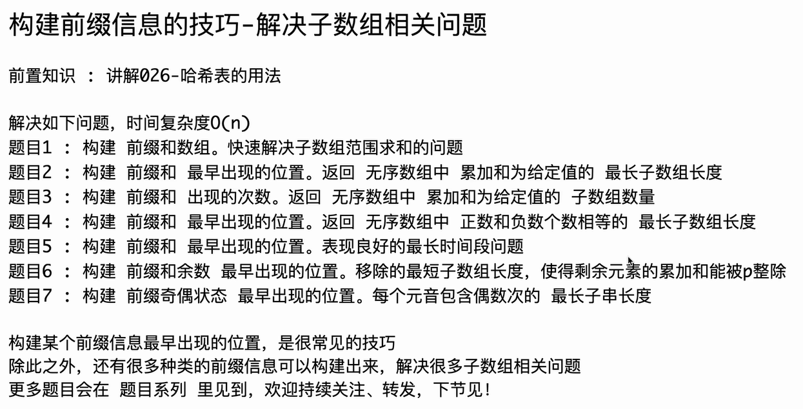

# 题目1：构建前缀和数组。快速解决子数组范围求和的问题

<span style="color:#FF0000; background:#33FF99; border:1px solid #FF33FF;">测试链接：</span>https://leetcode.cn/problems/range-sum-query-immutable/

这里是为你转换好的 C++ 代码。在力扣（LeetCode）等刷题平台中，C++ 通常不需要像 Java 那样包一层外围类（`Code01_PrefixSumArray`），直接实现核心的 `NumArray` 类即可。

### C++ 转换代码

C++

```C++
#include <vector>

class NumArray {
private:
    // 使用 std::vector 替代 Java 中的 int[]
    std::vector<int> sum;

public:
    // 注意这里传入的是常引用 const std::vector<int>&
    NumArray(const std::vector<int>& nums) {
        int n = nums.size();
        // 初始化 sum 数组，大小为 n + 1，初始值全为 0
        sum.resize(n + 1, 0);
        for (int i = 1; i <= n; i++) {
            sum[i] = sum[i - 1] + nums[i - 1];
        }
    }
    
    int sumRange(int left, int right) {
        return sum[right + 1] - sum[left];
    }
};
```

------

### 针对这份代码的 C++ 知识扩展

Java 和 C++ 在底层逻辑和语法特性上有很大差异，从这份代码出发，有以下几个非常核心的 C++ 知识点值得扩展：

#### 1. 数组的使用：`std::vector` vs 原生数组

- **Java**: 代码中使用了 `new int[nums.length + 1]`。Java 的数组自带长度属性（`.length`），且会有垃圾回收器（GC）自动管理内存。
- **C++**: 强烈建议使用标准模板库（STL）中的 `std::vector`，而不是 C 语言风格的原生指针数组（如 `new int[n]`）。`std::vector` 会在对象生命周期结束时**自动释放内存**（RAII 机制），防止内存泄漏，并且自带 `.size()` 方法。上面代码中使用的 `sum.resize(n + 1, 0)` 就是在动态调整大小并赋初值 0。

#### 2. 参数传递：常引用传递 (`const std::vector<int>&`)

- **Java**: 对象类型的参数传递本质上是传引用的副本（传递对象的地址），所以传入 `int[] nums` 不会复制整个数组，开销很小。
- **C++**: 如果你写成 `NumArray(std::vector<int> nums)`，C++ 会**调用拷贝构造函数，把整个数组完整复制一遍**，这在数组很大时会导致严重的性能问题（Time Limit Exceeded）。
- **正确做法**: 使用 `&` 按引用传递以避免拷贝。加上 `const`（即 `const std::vector<int>&`）则是告诉编译器：“我只需要读取这个数组的数据，绝不会修改它”。这是一种优秀的 C++ 编程安全习惯。

#### 3. 访问控制 (`private` / `public`)

- **Java 代码中**: `public int[] sum;` 将数据直接暴露在了外面。
- **C++ 习惯**: 遵循面向对象的封装原则，通常将成员变量声明为 `private`。这样外部代码就无法直接篡改前缀和数组，只能通过提供的 `public` 接口（`sumRange`）来查询数据。

#### 4. 高阶 C++ 技巧：STL 算法库 (`std::partial_sum`)

C++ 的 `<numeric>` 库中直接提供了计算前缀和的现成函数。如果想写出更具有 "C++ 味" （Modern C++）的代码，你可以不用手写 `for` 循环，直接使用 `std::partial_sum`：

C++

```C++
#include <vector>
#include <numeric> // partial_sum 在这个头文件里

class NumArray {
private:
    std::vector<int> sum;

public:
    NumArray(const std::vector<int>& nums) {
        sum.resize(nums.size() + 1, 0);
        // std::partial_sum(起始迭代器, 结束迭代器, 目标起始迭代器)
        std::partial_sum(nums.begin(), nums.end(), sum.begin() + 1);
    }
    
    int sumRange(int left, int right) {
        return sum[right + 1] - sum[left];
    }
};
```

*注：`std::partial_sum` 默认计算的就是累加和，非常契合这道题的场景。*

------

需要我进一步为你讲解如果在 C++ 中实现 **二维数组的前缀和**（用于矩阵区域求和）吗？


# 自己书写代码

```C++
class NumArray {
public:
    NumArray(vector<int>& nums) {
      
    }
    
    int sumRange(int left, int right) {
        n = nums.size();
        vector<int> sum(n+1);

        sum[0] = 0;
        for(int i=1; i<n+1; n++){
            sum[[i] += nums[i-1]; //sum中1 对应 nums中0，2对应nums[0]+nums[1]
            // nums 3~6 累加和 = sum[7] (0~6) - sum[3](0~2) 
            // nums 0~4 累加和 = sum[5] (0~4) - sum[0]
        }

        return sum[right+1] - sum[left];
    }
};

/**
 * Your NumArray object will be instantiated and called as such:
 * NumArray* obj = new NumArray(nums);
 * int param_1 = obj->sumRange(left,right);
 */
```

# 代码错误分析

你的代码注释里写的逻辑（比如 `nums 3~6 累加和 = sum[7] - sum[3]`）是**完全正确**的！这说明你已经完全理解了前缀和的核心思想。

但是，在 C++ 的面向对象设计以及具体的语法细节上，这段代码出现了几个比较严重的问题。这里为你详细梳理并给出修改方案。

### 你的代码中存在的 5 个主要问题：

1. **核心设计错误：没有做到“预处理” (Time Limit Exceeded 隐患)**
   - **问题所在：** 你把计算前缀和数组 `sum` 的过程放在了 `sumRange` 函数里面。这意味着每次调用 `sumRange` 进行查询时，程序都会重新算一遍整个数组的前缀和。如果查询有 $10^4$ 次，数组也会被重复遍历 $10^4$ 次。
   - **正确做法：** 应该在**构造函数** `NumArray()` 中预先计算好 `sum` 数组并保存起来，这样 `sumRange` 只需要执行一次减法，时间复杂度才能降为 $O(1)$。
2. **变量作用域错误 (`nums` 无法访问)**
   - **问题所在：** `vector<int>& nums` 只是构造函数的参数，出了构造函数的大括号它就“死亡”了。在 `sumRange` 里直接写 `nums.size()` 和 `nums[i-1]` 会报错，因为编译器在这里根本不认识 `nums`。
3. **死循环 / 变量自增写错**
   - **问题所在：** `for(int i=1; i<n+1; n++)`。注意看最后一个条件，你写成了 `n++`，这不仅会导致死循环，还会让数组越界。应该是 `i++`。
4. **语法拼写错误**
   - **问题所在：** `sum[[i]` 多写了一个左中括号 `[`。
5. **前缀和递推公式错误**
   - **问题所在：** `sum[i] += nums[i-1];` 这里 `sum[i]` 初始是 0，加上 `nums[i-1]` 后只是等于当前数字，**并没有把前面的累加和带过来**。应该是 `sum[i] = sum[i-1] + nums[i-1];`。

------

### 正确的修改方案

根据上面的分析，我们需要把 `sum` 数组提升为类的**成员变量**，并在构造函数中完成计算。修改后的代码如下：

C++

```C++
#include <vector>
using namespace std;

class NumArray {
private:
    // 将 sum 声明为类的私有成员变量，这样类里的所有函数都能访问它
    vector<int> sum;

public:
    NumArray(vector<int>& nums) {
        int n = nums.size();
        // 初始化 sum 数组，大小为 n+1，初始值全为 0
        sum.resize(n + 1, 0); 
        
        // 在构造函数中完成前缀和的预计算
        for (int i = 1; i <= n; i++) {
            // 正确的递推公式：当前的累加和 = 前一个累加和 + 当前元素
            sum[i] = sum[i - 1] + nums[i - 1]; 
        }
    }
    
    int sumRange(int left, int right) {
        // 直接利用成员变量 sum 进行 O(1) 的查询，不在此处做任何循环
        // nums 3~6 累加和 = sum[7] (0~6) - sum[3](0~2)
        return sum[right + 1] - sum[left];
    }
};
```

### 总结一下：

在刷这种**“带构造函数的类实现题”**（Design Problem）时，一定要搞清楚：

- **构造函数 `NumArray()`**：用来做耗时的准备工作（初始化、预计算）。
- **功能函数 `sumRange()`**：用来利用准备好的数据，快速给出答案。

通过这次修改，你清楚 C++ 中类的成员变量和局部变量的区别了吗？需要我再为你找一道类似的“预处理设计”题目来练练手吗？
