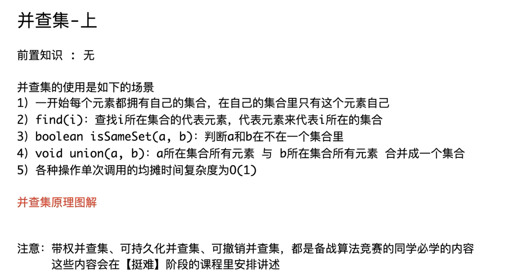
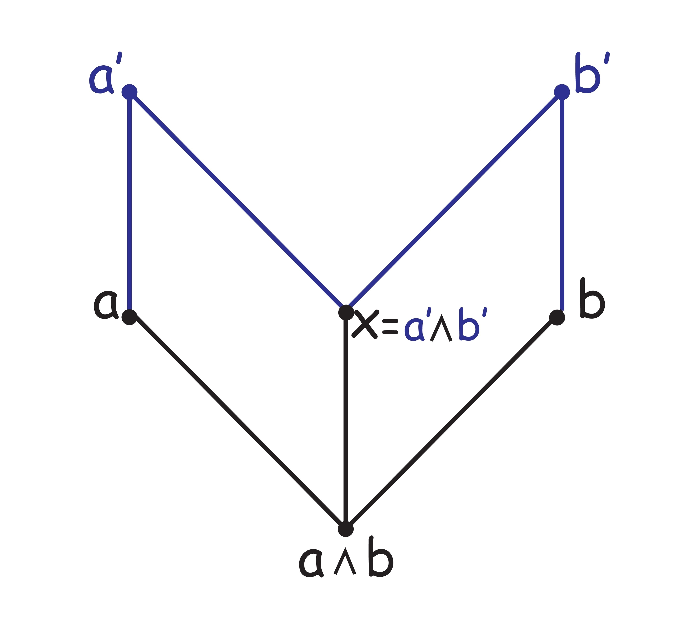
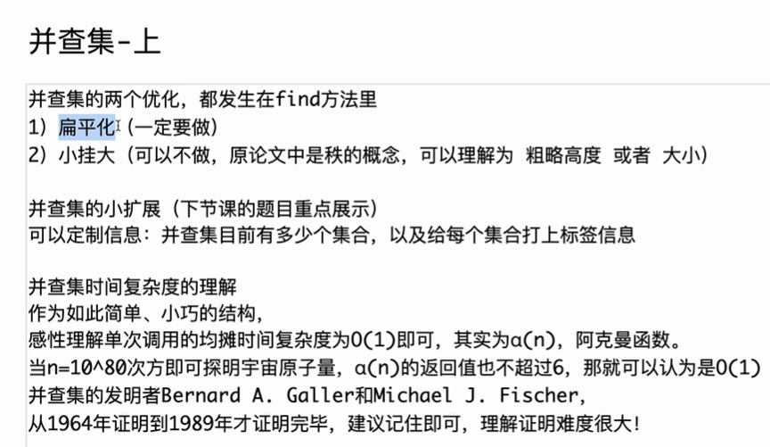

# 提问1：

<span style="color:#FF0000; background:#33FF99; border:1px solid #FF33FF;">并查集和偏序关系这两个有什么联系吗，我不是太懂，你能够给我详细解释下吗，最好能够举个例子来让我彻底弄明白？</span>

这是一个非常好的问题！很多初学者在学习离散数学或数据结构时，都会对这两个概念产生关联联想，因为它们都在处理**元素之间的关系**，并且都具有**传递性**（比如 A 和 B 有关系，B 和 C 有关系，那么 A 和 C 也有关系）。

但实际上，**<span style="color:#FF0000; background:#33FF99; border:1px solid #FF33FF;">并查集（DSU）和偏序关系在本质上是相对立的，它们描述的是两种截然不同的数学关系</span>**。

为了让你彻底弄明白，我们先分别把这两个概念用最直白的语言理清，然后再看它们的对比和联系。

------

### 1. 并查集：描述的是“等价关系”（大家都是平等的）

并查集（Disjoint Set Union）是一种数据结构，它在数学上维护的是一种**等价关系（Equivalence Relation）**。

等价关系有三个核心性质：

- **自反性**：$A = A$（自己和自己是同一类）。
- **对称性**：如果 $A = B$，那么 $B = A$（A 和 B 是朋友，B 和 A 也是朋友，**没有方向性**）。
- **传递性**：如果 $A = B$，且 $B = C$，那么 $A = C$。

**现实中的例子：** 微信的“共同群聊”或者家族的“认祖归宗”。

假设我们在寻找亲戚：如果张三和李四是亲戚，李四和王五是亲戚，那么张三和王五也是亲戚。在这个关系里，大家<span style="color:#FF0000;">都在同一个“家族集合”里</span>，地位是**平行**的，不分先后大小。这就是<span style="background:#33FF99; border:1px solid #FF33FF;">并查集要解决的问题：快速判断两个人是不是同一个家族的，以及把两个家族合并。</span>

### 2. 偏序关系：描述的是<span style="color:#FF0000;">“层级/先后关系”</span>（有严格的方向和大小）

偏序关系（Partial Order Relation）是离散数学中的概念。这里的<span style="background:#33FF99;">“偏”意味着“部分”</span>——<span style="border:1px solid #FF33FF; color:#FF0000;">集合中**有些元素是可以比较先后/大小的，但有些元素互相独立，无法比较**。</span>

<span style="color:#FF0000;">偏序关系的核心性质</span>是：

- **自反性**：$A \le A$。
- **反对称性（核心区别）**：如果 $A \le B$ 且 $B \le A$，那么一定有 $A = B$。换句话说，<span style="color:#FF0000;">**除了相等的情况，关系是单向的**（如果 A 是 B 的领导，B 绝不可能是 A 的领导</span>）。
- **传递性**：如果 $A \le B$，且 $B \le C$，那么 $A \le C$。

**现实中的例子：** 大学的“课程先修要求”或者公司的“上下级职位”。

- 你要学《数据结构》（B），必须先学《C语言》（A），即 $A \to B$。
- 你要学《算法》（C），必须先学《数据结构》（B），即 $B \to C$。
- 根据传递性，学《算法》前必须学《C语言》（$A \to C$）。
- 但如果你问：《大学英语》和《C语言》哪个先学？它们之间**没有必然的先后要求**（无法比较），这就是<span style="color:#FF0000; background:#33FF99; border:1px solid #FF33FF;">为什么叫“**偏**”序（只有部分元素能排序）。</span>

在计算机中，<span style="color:#FF0000; background:#33FF99; border:1px solid #FF33FF;">偏序关系通常用**有向无环图（DAG）*来表示，对应的经典算法是 拓扑排序**。</span>

------

### 3. 两者的对比与联系

我们可以用一张表格来清晰对比：

| **特性**       | **并查集 (等价关系)**          | **偏序关系 (层级关系)**            |
| -------------- | ------------------------------ | ---------------------------------- |
| **核心特点**   | **对称**（A和B同级，互相连通） | **反对称**（A在B前面，严格的单向） |
| **图论表现**   | 无向图的连通块                 | 有向无环图 (DAG)                   |
| **解决的问题** | “A和B是不是同一伙的？”         | “A和B谁先谁后？能否排出一个顺序？” |
| **典型例子**   | 朋友圈、网络连通性检查         | 任务调度、技能树加点、编译依赖     |

#### 它们之间有什么联系？（重点）

虽然它们是对立的（对称 vs 反对称），但在实际的复杂工程或算法问题中，它们经常**配合使用**。它们最深刻的联系在于：**<span style="background:#33FF99; color:#FF0000; border:1px solid #FF33FF;">当我们把一个复杂的网络中的“等价关系”压缩（合并）之后，剩下的结构往往就是一个“偏序关系”。</span>**

**举个彻底弄懂的例子：公司收购与权力重组**

假设有几家小公司和一些部门，存在以下依赖（控制）关系：

1. A 公司控制 B 公司（$A \to B$）
2. B 公司控制 C 公司（$B \to C$）
3. C 公司和 D 公司是交叉持股，**完全平级且互相控制**（$C \to D$ 且 $D \to C$）。
4. D 公司控制 E 公司（$D \to E$）。

如果我们直接给这个网络排一个“权力排行榜”（偏序关系），会发现排不出来！因为 C 和 D 互相控制，形成了**环**，违反了偏序关系的“反对称性”。

**这时候并查集（或类似找强连通分量的算法）就出场了：**

- **第一步（处理等价关系）：** 我们发现 C 和 D 互相控制，说明它们在权力级别上是**等价**的。我们用算法把 C 和 D 合并成一个新的大部门，叫做 `[CD集团]`。在这个集团内部，大家是平等的（这部分逻辑类似并查集的合并）。
- **第二步（形成偏序关系）：** 合并之后，原来的关系变成了：$A \to B \to [CD集团] \to E$。
- 此时，所有的“环”和“双向关系”都被消除了，剩下的就是一个完美的**偏序关系**。现在你可以清晰地看出权力从上到下的流向。

### 总结

- **并查集**是用来把“没有方向、互相平等”的元素揉成一团，划分为不同的阵营。
- **偏序关系**是用来给“有方向、有先后”的元素排队，梳理出上下级层级。
- 它们共同的交汇点在于**传递性**。在高级算法中，我们经常先用类似并查集的思想把“双向/相等”的元素合并，然后再用偏序关系（拓扑排序）来处理剩下的单向依赖。

你可以回想一下，你在哪里同时遇到了这两个概念？是单纯的数学概念疑惑，还是在做某道具体的算法题（比如带有不等式和等式的推导题）？如果你有具体的题目，我们可以一起用这个思路来拆解它。


# 提问2（偏序关系的Hasse图和并查集）

<span style="color:#FF0000; background:#33FF99; border:1px solid #FF33FF;">偏序关系的Hasse图和并查集是不是有什么关系呢，我感觉两个比较像，我不是太懂，你能够给我详细解释下吗？</span>

你感觉它们很像，这个直觉非常敏锐！很多学习数据结构和离散数学的人在画图时，都会产生这种似曾相识的感觉。

你之所以觉得它们像，是因为**<span style="color:#FF0000;">并查集的内部实现（树形结构）在视觉上和哈斯图（Hasse 图）非常相似</span>**。它们都是由节点和线组成，都有一种“<span style="color:#FF0000; background:#33FF99; border:1px solid #FF33FF;">自底向上</span>”或者“<span style="color:#FF0000; background:#33FF99; border:1px solid #FF33FF;">层层递进</span>”的<span style="border:1px solid #FF33FF; color:#FF0000;">图论外观</span>，并且都在处理**传递性**。

但就像两栋外观相似的建筑，一栋是图书馆，一栋是银行一样，它们的**内在逻辑和数学本质是截然相反的**。

我们来详细拆解一下，为什么它们看起来像，以及它们到底哪里不一样。

------

### 1. 为什么它们“看起来像”？（视觉与结构的重合）

我们要知道，并查集在计算机内存中是怎么存的。<span style="color:#FF0000;">并查集</span>并不是把同一类元素放进一个数组里，而是采用了一种**<span style="color:#FF0000;">树形结构（森林）</span>**。

- **并查集的树：** 假设元素 $a$、$b$、$c$ 是同一类，并查集会选出一个“代表”（比如 $c$），然后让 $a$ 指向 $b$，$b$ 指向 $c$。画出来就是一棵树，箭头一路向上指向根节点。
- **哈斯图：** <span style="color:#FF0000;">哈斯图是偏序关系的画法</span>。如果 $a \le b$ 且 $b \le c$，哈斯图会把 $c$ 画在最上面，$b$ 在中间，$a$ 在最下面，用线连起来（<span style="background:#00FF80;">省略了箭头和传递线</span>）。
- 

**它们的相似之处在于：**

1. **都有“根”或“顶点”：** 都有<span style="color:#FF0000;">顺藤摸瓜一路向上</span>的感觉。
2. **都隐含了传递性：** 在<span style="color:#FF0000;">并查集</span>中，<span style="background:#00FF80; border:1px solid #FF33FF;">因为 $a \to b \to c$，所以程序知道 $a$ 和 $c$ 是同类的</span>；在<span style="color:#FF0000;">哈斯图</span>中，<span style="background:#00FF80; border:1px solid #FF33FF;">因为 $a$ 在 $b$ 下面，$b$ 在 $c$ 下面，所以我们一眼就能看出 $a \le c$。</span>

------

### 2. 本质的区别：这棵“树”代表的意思完全不同

虽然都画成了树或图，但这根“连线”的含义在两个世界里是完全相反的。

#### 区别一：地位是否平等？（核心区别）

- **并查集的树（人人平等）：** 这棵树里的所有节点，数学地位是**绝对平等**的（等价关系）。根节点 $c$ 并不是比 $a$ 和 $b$ “高级”或“更大”，它仅仅是被推选出来的**临时代表**（就像班级里选个班长去开会）。只要在同一棵树里，大家就互相等价（$a = b = c$）。
- **哈斯图（等级森严）：** 哈斯图里的层级是**绝对不平等**的（偏序关系）。上面的节点在数学意义上严格“大于”或“包含”下面的节点（比如 $c \ge b \ge a$）。这是一套严格的阶级系统。

#### 区别二：“路径压缩”测试

这是区分它们最直观的方法。

在<span style="color:#FF0000;">并查集</span>中，为了提高查询效率，我们<span style="color:#FF0000; background:#00FF80;">经常使用一种技术叫**路径压缩 (Path Compression)**。就是把原本 $a \to b \to c$ 的长长链条，直接拍扁，变成 $a$ 和 $b$ 都直接指向 $c$。</span>

- **对并查集来说：** 拍扁之后，大家依然是同一个代表（$c$），依然是同一个集合。**树的形状怎么变无所谓，只要它们还连在一起就行。**
- **对哈斯图来说：** 绝对不能拍扁！在哈斯图中，线代表的是**“覆盖关系”**（即 $b$ 是 $a$ 的直接上级，中间没有别人）。如果把哈斯图拍扁，让 $a$ 直接连到 $c$ 并删掉 $b$，这在数学上叫破坏了偏序结构的覆盖关系。**哈斯图的形状是死死钉住的，反映了严密的拓扑结构。**

------

### 3. 举个<span style="color:#FF0000;">生动的例子</span>彻底弄明白

**并查集：**

想象一个<span style="color:#FF0000;">黑帮家族</span>。<span style="color:#FF0000;">小弟 A 认 B 做大哥，B 认 C 做大哥（$A \to B \to C$）</span>。但在警察眼里（等价关系），不管你们内部谁认谁做大哥，A、B、C **全都是同一个犯罪团伙的成员**。警察抓人的时候，这三个人犯的帮派罪名是一样重的。甚至第二天 C 退位了，A 变成了老大（根节点变成了 A），这个团伙依然是这个团伙，集合没有发生任何改变。

**哈斯图：**

想象公司的股权结构。A 公司持有 B 公司的股份，B 公司持有 C 公司的股份。这里的上下级是**真金白银的控制权**。你不能说 A、B、C 是一回事，A 是终极老板（位于哈斯图顶端），C 是最底层的打工公司。你也不能随便“路径压缩”让 A 直接去管 C，因为中间 B 的股权结构是客观存在的。

### 总结

- **看起来像** 是因为并查集为了计算机实现的高效，借用了**树形指向结构**，这恰好和哈斯图展示偏序关系的**层级结构**撞脸了。
- **实质上**，并查集是用不平等的树形数据结构，去维护一个**绝对平等**的数学关系（等价）；而哈斯图则是用它的图结构，精准地描绘着数学上**天然不平等**的上下级关系（偏序）。

所以，你的直觉捕捉到了它们在“结构表达（树/图）”和“传递性”上的共性，但只要用“它们地位是否平等”去切一刀，就能立刻把它们区分开来。现在对这两个概念的区别是不是清晰多了？


# 提问3（小挂大理解1）

<span style="color:#FF0000; background:#00FF80; border:1px solid #FF33FF;">并查集合并的时候为什么是小挂大呢，我不是太懂，你能够给我详细解释下吗，最好能够举个例子来让我彻底弄明白？</span>

你能问出这个问题，说明你已经不满足于仅仅把代码背下来，而是开始思考算法背后的“为什么”了。这正是深入掌握数据结构的关键所在！

简单来说，并查集合并时采用“小挂大”（在算法里通常被称为**按大小合并**或**按秩合并**），核心目的只有一个：**防止树长得太高，从而保证每一次找祖先（Find 操作）的速度都极快。**

为了让你彻底弄明白，我们先来看看如果不遵循这个规则会发生什么可怕的事情，然后再举一个通俗易懂的例子。

### 1. 为什么树的高度很致命？

在并查集里，我们判断两个元素是不是同一伙的，靠的是不断往上找“根节点”（老大）。

- 如果这棵树很<span style="color:#FF0000; background:#00FF80; border:1px solid #FF33FF;">扁平</span>（大家离老大都很近），你往上找一两次就找到了，速度飞快。
- 如果我们随便乱合并（比如<span style="color:#FF0000;">每次都把大树挂在小树下面</span>），这棵树可能会越长越歪，最后变成一根长长的“糖葫芦”串（也就是退化成链表）。这时候如果你处于链表的最底端，想要找到最顶端的根节点，就得顺着藤摸半天，查询的时间复杂度就会退化成 $O(N)$，并查集的高效性就彻底丧失了。

### 2. 彻底弄懂“小挂大”的现实例子：大厂收购小公司

假设有两家公司要合并：

- **A 集团（大树）：** 是一家拥有 **10000 名**员工的超级大厂，大老板是“马总”。这家公司的层级最多只有 3 层，员工找马总汇报工作很快。
- **B 团队（小树）：** 是一个只有 **3 个人**的初创小团队，老板是“小王”，手底下有两个程序员。

现在，两家公司达成了收购协议，要合并成一家。合并在图论里的表现，就是让其中一个老板向另一个老板汇报工作（一条连线）。我们面临两个选择：

**选择一：大挂小（把 A 集团挂在 B 团队下面）**

也就是<span style="border:1px solid #FF33FF;">让拥有 10000 人的马总，去给只有 3 个人的小王当小弟</span>（马总 $\to$ 小王）。

- **后果：** A 集团那 10000 名员工想要找到最终的最高层（现在是小王了），全都要先找到马总，然后再**多走一步**去找小王。
- **代价：** 这 **10000 个人**的查询路径，统统变长了！整个公司的沟通效率瞬间被严重拖垮。

**选择二：小挂大（把 B 团队挂在 A 集团下面）**

也就是<span style="border:1px solid #FF33FF;">让 3 个人的初创团队老板小王，去给马总当小弟</span>（小王 $\to$ 马总）。

- **结果：** A 集团的那 10000 名员工，找最高层依然是找马总，他们的汇报路线**没有任何改变**，效率和以前一样高。
- **代价：** <span style="color:#FF0000; background:#00FF80; border:1px solid #FF33FF;">仅仅只有 B 团队的那 **3 个人**，在找最高层时需要多走一步（先找小王，再找马总）。</span>
- **整体收益：** <span style="color:#FF0000; background:#00FF80; border:1px solid #FF33FF;">为了合并，我们牺牲了 3 个人的查询时间，但保全了 10000 个人的查询效率。这就是绝对的稳赚不赔！</span>

### 3. 数学上的保障

通过“小树挂大树”的策略，<span style="color:#FF0000; background:#00FF80; border:1px solid #FF33FF;">只有当两棵树的“大小（或深度）”一模一样时，合并后的树的高度才会增加 1。</span>

如果一直坚持“小挂大”，即使经过无数次合并，数学上可以严格证明，包含 $N$ 个节点的并查集，其树的最大高度绝对不会超过 $O(\log N)$。这就保证了哪怕有一亿个数据，你最多顺着往上找几十次就能找到根节点，性能极其稳定。

------

你想不想看看在代码里，是如何用两三行极其简练的代码来实现这个“小挂大”逻辑的？


# 提问4（小挂大理解2）

<span style="color:#FF0000; background:#00FF80; border:1px solid #FF33FF;">这里小挂大应该指的是并查集两棵树的结点数量吧，为什么不看高度呢，如果一个结点数量少但是树的高度很高呢，此时还是小挂大吗，我不是太懂，你能够给我详细解释下吗，最好能够举个例子来让我彻底弄明白。</span>

你这个问题问得太有水平了！你的直觉非常敏锐，直接切中了并查集优化策略中最核心的痛点。

你完全正确：**<span style="color:#FF0000;">如果我们的终极目标是“防止树长得太高”，那直接比较“树的高度”显然比比较“结点数量”更合理！</span>**

实际上，在并查集里，所谓的“小挂大”有两种不同的门派（策略）：

1. **按大小合并（Union by Size）：** 比较结点数量，结点少的挂在结点多的下面（前面我们讨论的那种）。
2. **按高度/秩合并（Union by Rank）：** 比较树的高度，矮树挂在高树下面。**（这正是你脑海中想到的策略！）**

为了让你彻底弄明白这两者的区别，以及为什么你的想法非常棒，我们来举一个极端的例子。

------

### 极端的例子：<span style="color:#FF0000;">“高瘦子”与“矮胖子”</span>

假设现在有两棵树要合并：

- **A 树（高瘦子）：** 只有 **4 个结点**，但是长成了一条直线（比如 $1 \to 2 \to 3 \to 4$），它的**高度是 4**。
- **B 树（矮胖子）：** 有 **10 个结点**，但是极其扁平（1 个老大带着 9 个直接小弟），它的**高度是 2**。

现在我们要把 A 和 B 合并。如果老大互相连线，会发生什么？

#### 场景一：按结点数量合并（Union by Size）

按照这个规则，A 树只有 4 个结点，B 树有 10 个结点，所以 **A 树要挂在 B 树下面**（A 的根结点 4 指向 B 的根结点）。

- **结果：** A 树原本在最底部的那个可怜的结点 1，现在要找终极老大，需要先爬 4 层找到原来的老大，再爬 1 层找到 B 的老大。
- **合并后的最大高度：** $4 + 1 = 5$。树变得更高了！

#### 场景二：按树的高度合并（Union by Rank）—— 你的思路

按照这个规则，A 树高度是 4，B 树高度是 2，矮的挂在高的下面，所以 **B 树要挂在 A 树下面**（B 的根结点指向 A 的根结点）。

- **结果：** B 树原本的 9 个小弟，现在找终极老大只需要多走 1 步（总共走 3 步）。而 A 树最底部的结点 1，找老大的路径完全没变（还是走 4 步）。
- **合并后的最大高度：** 依然是 **4**！高度根本没有增加！

**结论：** 在这个极端例子中，你的思路（按高度合并）完胜！它完美地控制了树的最大深度。

------

### 那为什么很多人还是教“按结点数量（Size）”合并呢？

既然按高度（Rank）合并这么好，为什么教程里经常提到按结点数量（Size）合并呢？这里有两个现实原因：

**1. 它们在常规情况下效果一样好**

如果在整个组建过程中，你**从一开始**就严格遵守“小挂大”或者“矮挂高”的原则，这两种方法在数学上都能保证树的最大高度永远不超过 $O(\log N)$。那个“高瘦子”的极端情况，在严格优化的并查集里是自然生长不出来的（除非你人为故意这么造）。

**2. 引入“路径压缩”后的尴尬**

并查集有一个终极大招叫做**路径压缩（Path Compression）**：<span style="color:#FF0000; background:#00FF80; border:1px solid #FF00FF;">每次查找老大时，顺手把路径上的所有结点直接连到老大身上，把树“拍扁”。</span>

- <span style="color:#FF0000;">如果使用“按结点数量”，不管树怎么被拍扁，总结点数量是不变的，维护起来极其简单准确。</span>
- <span style="color:#FF0000;">如果使用“按高度”，一旦树被拍扁了，高度就瞬间变了！但在代码里实时去计算和更新这棵树的准确高度是非常耗时的。所以，按高度合并通常只记录一个“估计高度”（术语叫作 **秩 Rank**），它只增不减，作为一个近似值来用。</span>

### 总结

- 你的质疑是非常精准的：**单纯看结点数量确实存在盲区，直接看高度（Rank）才是最直击本质的防止树变高的办法。**
- 在工业界和算法竞赛中，**按秩（高度）合并** 和 **按大小（结点数）合并** 都是极其优秀的策略。
- 只要搭配上“路径压缩”，这两种策略的时间复杂度都会被优化到近乎常数级别（也就是传说中的阿克曼函数反函数 $O(\alpha(N))$）。

你现在已经完全掌握了并查集优化的核心思想了！你想不想看看这两种方式在代码层面到底有多大的差别，或者详细了解一下刚才提到的真正让并查集快到飞起的“路径压缩”是怎么工作的？





# 题目1

```java
package class056;

// 并查集模版(牛客)
// 路径压缩 + 小挂大
// 测试链接 : https://www.nowcoder.com/practice/e7ed657974934a30b2010046536a5372
// 请同学们务必参考如下代码中关于输入、输出的处理
// 这是输入输出处理效率很高的写法
// 提交以下的code，提交时请把类名改成"Main"，可以直接通过

import java.io.BufferedReader;
import java.io.IOException;
import java.io.InputStreamReader;
import java.io.OutputStreamWriter;
import java.io.PrintWriter;
import java.io.StreamTokenizer;

public class Code01_UnionFindNowCoder {

	public static int MAXN = 1000001;

	public static int[] father = new int[MAXN];

	public static int[] size = new int[MAXN];

	public static int[] stack = new int[MAXN];

	public static int n;

	public static void build() {
		for (int i = 0; i <= n; i++) {
			father[i] = i;
			size[i] = 1;
		}
	}

	// i号节点，往上一直找，找到代表节点返回！
	public static int find(int i) {
		// 沿途收集了几个点
		int size = 0;
		while (i != father[i]) {
			stack[size++] = i;
			i = father[i];
		}
		// 沿途节点收集好了，i已经跳到代表节点了
		while (size > 0) {
			father[stack[--size]] = i;
		}
		return i;
	}

	public static boolean isSameSet(int x, int y) {
		return find(x) == find(y);
	}

	public static void union(int x, int y) {
		int fx = find(x);
		int fy = find(y);
		if (fx != fy) {
			// fx是集合的代表：拿大小
			// fy是集合的代表：拿大小
			if (size[fx] >= size[fy]) {
				size[fx] += size[fy];
				father[fy] = fx;
			} else {
				size[fy] += size[fx];
				father[fx] = fy;
			}
		}
	}

	public static void main(String[] args) throws IOException {
		BufferedReader br = new BufferedReader(new InputStreamReader(System.in));
		StreamTokenizer in = new StreamTokenizer(br);
		PrintWriter out = new PrintWriter(new OutputStreamWriter(System.out));
		while (in.nextToken() != StreamTokenizer.TT_EOF) {
			n = (int) in.nval;
			build();
			in.nextToken();
			int m = (int) in.nval;
			for (int i = 0; i < m; i++) {
				in.nextToken();
				int op = (int) in.nval;
				in.nextToken();
				int x = (int) in.nval;
				in.nextToken();
				int y = (int) in.nval;
				if (op == 1) {
					out.println(isSameSet(x, y) ? "Yes" : "No");
				} else {
					union(x, y);
				}
			}
		}
		out.flush();
		out.close();
		br.close();
	}

}
```

# C++转换版本

这里是为你将 Java 代码转换后的 C++ 版本。

在转换的过程中，我保留了你原本“路径压缩（迭代版）+ 按大小合并（小挂大）”的算法逻辑，但针对 C++ 的语法特性和竞赛常用写法进行了相应的调整。

### C++ 并查集模板代码

C++

```C++
#include <iostream>

using namespace std;

const int MAXN = 1000001;

// 使用 fa 代替 father，sz 代替 size，避免与标准库命名冲突
int fa[MAXN];
int sz[MAXN];
int stk[MAXN];
int n;

void build() {
    for (int i = 0; i <= n; i++) {
        fa[i] = i;
        sz[i] = 1;
    }
}

// i号节点，往上一直找，找到代表节点返回！
int find(int i) {
    // 沿途收集了几个点
    int stack_size = 0;
    while (i != fa[i]) {
        stk[stack_size++] = i;
        i = fa[i];
    }
    // 沿途节点收集好了，i已经跳到代表节点了
    while (stack_size > 0) {
        fa[stk[--stack_size]] = i;
    }
    return i;
}

bool isSameSet(int x, int y) {
    return find(x) == find(y);
}

// 注意：C++中 union 是保留关键字，不能作为函数名，因此改为 unionSet
void unionSet(int x, int y) {
    int fx = find(x);
    int fy = find(y);
    if (fx != fy) {
        // fx是集合的代表：拿大小
        // fy是集合的代表：拿大小
        if (sz[fx] >= sz[fy]) {
            sz[fx] += sz[fy];
            fa[fy] = fx;
        } else {
            sz[fy] += sz[fx];
            fa[fx] = fy;
        }
    }
}

int main() {
    // C++ 快速 I/O，极其重要
    ios::sync_with_stdio(false);
    cin.tie(nullptr);

    int m;
    // 对应 Java 中的连续读取直到 EOF
    while (cin >> n >> m) {
        build();
        for (int i = 0; i < m; i++) {
            int op, x, y;
            cin >> op >> x >> y;
            if (op == 1) {
                // 推荐使用 \n 换行，比 endl 更快
                cout << (isSameSet(x, y) ? "Yes\n" : "No\n");
            } else {
                unionSet(x, y);
            }
        }
    }
    
    return 0;
}
```

------

### 针对该代码的 C++ 扩展知识点

从 Java 转到 C++ 编写算法题时，有几个非常关键的差异和常识需要掌握：

**1. 关键字冲突 (`union` vs `unionSet`)**

- **Java:** `union` 只是一个普通的标识符，可以放心用来做方法名。
- **C++:** `union` 是 C/C++ 的原生关键字（联合体，一种特殊的类），所以你**绝对不能**用它来命名函数或变量。通常在竞赛中，我们会改用 `unionSet`、`merge` 或 `join` 来命名合并函数。

**2. 极限输入输出优化 (Fast I/O)**

在你的 Java 代码中，使用了 `StreamTokenizer` 和 `PrintWriter` 来应对大数据量的输入输出。在 C++ 中，标准流 (`cin` / `cout`) 默认情况下为了兼容 C 语言的 `scanf` / `printf`，速度非常慢。

- `ios::sync_with_stdio(false);`：这行代码解除了 C++ 标准流和 C 标准流的同步，大幅提升读写速度。
- `cin.tie(nullptr);`：解除了 `cin` 和 `cout` 的绑定，意味着在读取输入前不会自动刷新输出缓冲区，进一步节省时间。
- **注意换行符:** 在 C++ 中，`cout << endl` 除了换行还会强制刷新缓冲区（Flush）。在需要输出大量结果的题目中，频繁 Flush 会导致超时（TLE）。因此，**永远优先使用 `\n` 进行换行**。

**3. 全局大数组的内存分配 (BSS 段)**

- 在这份代码中，我们将大小为 `1000001` 的数组 `fa`, `sz`, `stk` 定义在了全局作用域。
- **C++ 机制:** 声明在全局的未初始化（或初始化为零）的数组，会被放置在内存的 **BSS 段**，并且会被自动初始化为 0。这样做不仅避免了占用栈空间（如果在 `main` 函数内定义这么大的数组会导致 Stack Overflow / 爆栈），而且比使用动态分配（如 `new` 或是 `std::vector`）在常数时间上要快得多。

**4. 命名习惯防冲突**

- 在 C++ 引入了 `#include <iostream>` 和 `using namespace std;` 后，标准库里有非常多常见的名字，比如 `size`（`std::size` 用于获取容器大小）、`max`、`min` 等。
- 虽然在单纯的全局变量中重名不一定会立刻报错（取决于编译器和上下文），但为了安全起见，通常会将 `size` 缩写为 `sz`，将 `father` 缩写为 `fa`，以避免奇怪的编译错误。

**5. 路径压缩的 "递归" 写法（C++ 特色）**

你的 Java 代码非常严谨，为了防止极深树结构导致递归爆栈，手动用了一个 `stk` 数组模拟栈。

在 C++ 中，因为并查集自带路径压缩，树的深度极度扁平化，我们通常会直接使用**一行极其简洁的递归**来写 `find` 函数，不仅代码短，而且在大部分平台都不会爆栈：

C++

```C++
// 递归版路径压缩，利用了 C++ 的赋值表达式返回左值特性的简写
int find(int x) {
    return x == fa[x] ? x : (fa[x] = find(fa[x]));
}
```

------

你想了解这个按秩合并（小挂大）加路径压缩的并查集，在最坏情况下的时间复杂度具体是多少吗？或者需要我为你讲解这套模板在类似“最小生成树（Kruskal）”中的应用？


