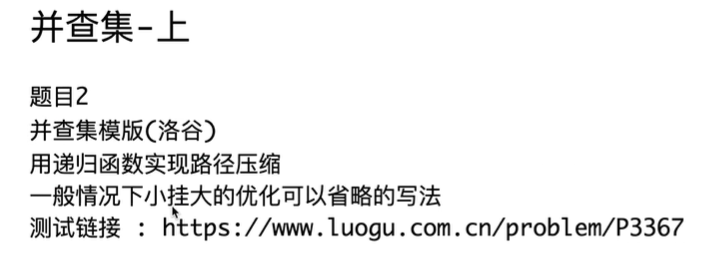
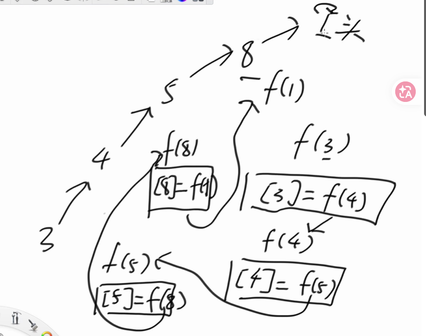
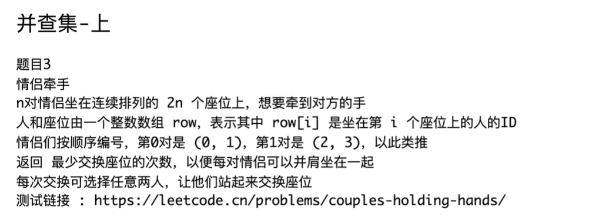
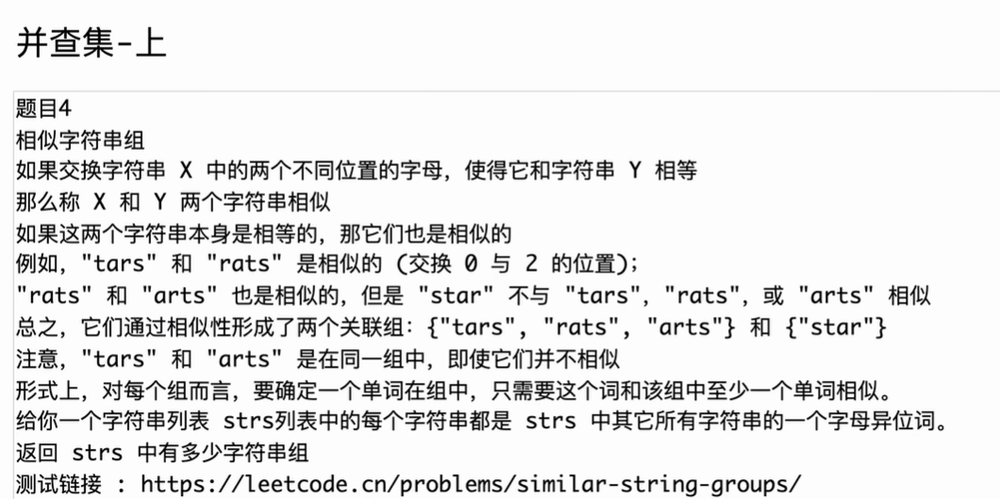

# 课程内容

### 1. 并查集基础原理与核心方法

- **[00:00 Opens in a new window ](http://www.youtube.com/watch?v=0DR4X9UFMZo&t=0) 课程介绍：** 说明本期主讲并查集原理及基础题目，下期将讲解更复杂的扩展技巧（如带权、可持久化等）。
- **[00:44 Opens in a new window ](http://www.youtube.com/watch?v=0DR4X9UFMZo&t=44) 什么是并查集：** 图解并查集的作用。它主要用于解决快速合并不相交集合的问题。
- **[01:18 Opens in a new window ](http://www.youtube.com/watch?v=0DR4X9UFMZo&t=78) 三大核心方法：**
  - `find`：查找元素的代表节点（即该元素所在集合的头部）。
  - `isSameSet`：判断两个元素是否属于同一个集合（比较两者的代表节点是否相同）。
  - `union`：合并两个不同的集合。

### 2. 核心优化与底层实现

- **[12:04 Opens in a new window ](http://www.youtube.com/watch?v=0DR4X9UFMZo&t=724) 数组表示法：** 讲解如何脱离指针，仅使用 `father`（记录父节点）和 `size`（记录集合大小）两个数组来实现并查集。
- **[20:00 Opens in a new window ](http://www.youtube.com/watch?v=0DR4X9UFMZo&t=1200) 两大核心优化：**
  - **扁平化（路径压缩 / Path Compression）：** 在调用 `find` 方法向上查找代表节点的过程中，将沿途经历的所有节点直接挂载到代表节点下，极大缩短后续查找路径。
  - **小挂大（按秩合并 / Union by Size）：** 在执行 `union` 合并时，始终将节点数较少的集合挂载到节点数较多的集合下面，以控制树的高度。

### 3. 代码模板与复杂度分析

- **[26:18 Opens in a new window ](http://www.youtube.com/watch?v=0DR4X9UFMZo&t=1578) 完整版代码模板（牛客网测试）：** 详细演示包含了“路径压缩”和“小挂大”双重优化的完整代码，并分析代码逻辑。
- **[38:39 Opens in a new window ](http://www.youtube.com/watch?v=0DR4X9UFMZo&t=2319) 时间复杂度证明（反阿克曼函数）：** 解释为什么并查集的单次操作均摊时间复杂度近乎是 $O(1)$。提到了复杂的反阿克曼函数 $O(\alpha(N))$，指出当 $N$ 达到宇宙原子量级时，该函数返回值也不超过 6。
- **[44:05 Opens in a new window ](http://www.youtube.com/watch?v=0DR4X9UFMZo&t=2645) 精简版代码模板（洛谷测试）：** 讲解一种在实际竞赛中常用的简略写法——省略“小挂大”优化，仅依靠**递归实现路径压缩**，代码更轻量且性能依然极其优秀。

### 4. 经典算法题实战

视频后半部分利用并查集模板讲解了三道经典的算法应用题：

- **[51:32 Opens in a new window ](http://www.youtube.com/watch?v=0DR4X9UFMZo&t=3092) 实战题一：情侣牵手问题 (Couples Holding Hands)**
  - 讲解如何利用并查集计算让所有情侣相邻坐下所需的“最少交换次数”。结论为：如果一个集合里有 $K$ 对情侣相互交错，则需要交换 $K-1$ 次；总交换次数等于“总情侣对数”减去“合并后的集合数量”。
- **[01:08:51 Opens in a new window ](http://www.youtube.com/watch?v=0DR4X9UFMZo&t=4131) 实战题二：相似字符串组 (Similar String Groups)**
  - 将只交换两个字母就能变成彼此的异构词视为“相似”。演示如何利用并查集把相似的单间合并成一个个连通块，最后统计集合数量。
- **[01:17:38 Opens in a new window ](http://www.youtube.com/watch?v=0DR4X9UFMZo&t=4658) 实战题三：岛屿数量 (Number of Islands)**
  - 讲解在二维网格（矩阵）中，如何将二位坐标 `(i, j)` 转化为一维索引 `(i * 列数 + j)`，从而将二维空间问题完美代入一维的并查集模板中求解岛屿数量（虽然视频指出此题用洪水填充 / Flood Fill 更优，但这是一次很好的并查集降维技巧展示）。

希望这个总结能帮你快速梳理视频的知识结构！如果需要深入了解某一道题目的逻辑，可以直接跳转到对应的时间点观看。


# 补充提问

# 提问1

<span style="color:#FF0000; background:#00FF80; border:1px solid #FF00FF; font-size:1.3em;">为什么哈希表的结构不适合用来做并查集的结构呢？</span>

在视频的 **[00:03:55]** 处，左程云老师明确解释了为什么哈希表不适合用来实现并查集。核心原因在于**合并（Union）操作时的性能损耗极大**。

具体原因可以归结为以下几点：

### 1. 批量合并需要“大搬家”

如果你用哈希表来表示集合，假设你现在有两个独立的哈希表：

- 集合 1 包含元素：`{A, B}`
- 集合 2 包含元素：`{C, D}`

当调用 `union` 方法想要将这两个集合合并时，你无法简单地改变一个指针就把它们连在一起。你必须执行**“搬家”**操作：要么把 `{A, B}` 中的所有元素一个个倒进 `{C, D}` 的哈希表里，要么反过来。

### 2. 时间复杂度无法做到 $O(1)$

随着合并操作的不断进行，集合会越来越大。当你需要合并两个包含大量元素的集合时（例如每个集合都有 1 万个元素），使用哈希表意味着你需要遍历并转移其中一整个集合的元素，这个操作的时间复杂度是 $O(N)$。

这完全破坏了并查集设计的初衷——并查集通过巧妙的“向上指”的树形结构（辅以路径压缩和按秩合并），<span style="color:#FF0000;">能将单次合并和查询的均摊时间复杂度降到极低的 $O(\alpha(N))$（几乎等同于 $O(1)$ 常数时间）。</span>

### 3. 对比并查集的原生结构

标准的并查集只需要改变一个**代表节点（头节点）的指针指向**，就能瞬间完成两个庞大集合的合并（例如把 `A` 所在集合的头节点直接连到 `C` 所在集合的头节点上），代价极其轻微。

------

总而言之，**哈希表在处理“查询”时很快，但在面对并查集频繁的“批量合并”需求时，会因为大量的数据迁移而变得极其低效。**（同理，视频中提到普通的链表也面临类似的问题）。

需要我为您详细解释一下视频中提到的并查集专属优化技巧（如“扁平化/路径压缩”或“小挂大”）是如何做到如此高效的吗？


# 题目1 并查集的实现

## 自己书写代码

```C++
#include <iostream>
using namespace std;

const int MAXN = 10000001;

int father[MAXN];  //实现并查集的两个结构
int size[MAXN];

int stack[MAXN];  //实现扁平化辅助数组
int n;

void build(){
    for(int i=0; i<n ;i++){
        father[i] = i;
        size[i] = 1;
    }
}

int find(int i){

    int st=0;
    while(father[i] != i){
        i = father[i];
        stack[st++] = i;
    }

    while(st > 0){
        father[stack[--st]] = i;
    }

    return i;
}

boolean isSameSet(int a,int b){
    return find(a) == find(b);
}

void union(int a,int b){

    if(find(a) != find(b)){
        if(size[a]>=size[b]){
            size[a] += size[b];
            father[b] = a;
        }else{
            size[b] += size[a];
            father[a] = b;
        }
    }
}


int main() {
    int m;
    while (cin >> n >> m) { // 注意 while 处理多个 case
        for(int i=0; i<m; i++){
            int opt,x,y;
            cin>>opt>>x>>y;

            if(opt==1){
                cout<<isSameSet(x,y)?"Yes":"No"<<"\n";
            } else {
                union(x,y);
            }
        }
    }
}
// 64 位输出请用 printf("%lld")
```


## 代码错误修改


从右侧的编译错误日志和左侧的代码来看，你的代码主要存在**命名冲突**、**类型名拼写错误**以及**使用了保留关键字**这三个问题。

下面为你逐一指出错误原因以及修改方法：

### 1. `size` 命名冲突 (error: reference to 'size' is ambiguous)

- **原因**：你使用了 `using namespace std;`，而在 C++17 及以上的标准库中，自带了 `std::size` 函数。这与你定义的全局数组 `int size[MAXN];` 产生了命名冲突，编译器不知道你到底要用哪一个。

- **修改方法**：将全局数组 `size` 改个名字，比如改成 `sz` 或者 `setSize`。

  C++

  ```
  // 修改前
  int size[MAXN]; 
  // 修改后
  int sz[MAXN]; 
  ```

  *注意：记得把 `build()` 函数里 `size[i] = 1;` 也同步改成 `sz[i] = 1;`。*

### 2. `boolean` 类型错误 (error: unknown type name 'boolean')

- **原因**：在 C++ 中，布尔类型的关键字是 `bool`。`boolean` 是 Java 等语言的写法，C++ 编译器不认识它。

- **修改方法**：把 `boolean` 改成 `bool`。

  C++

  ```
  // 修改前
  boolean isSameSet(int a, int b) { ... }
  // 修改后
  bool isSameSet(int a, int b) { ... }
  ```

### 3. 函数名 `union` 使用了保留关键字 (error: declaration of anonymous union must be a definition)

- **原因**：`union` 是 C++ 的保留关键字（用于定义联合体），因此不能把它用作自定义的函数名。

- **修改方法**：把 `union` 函数改个名字，比如 `unite`、`merge` 或者 `unionSet`。

  C++

  ```
  // 修改前
  void union(int a, int b) { ... }
  // 修改后
  void unionSet(int a, int b) { ... }
  ```

  *注意：你下方主逻辑里调用的地方（即报错信息提示的 `} else { union(x,y); }`）也要同步改成 `unionSet(x, y);`。*

------

按照这三点修改后，你的代码应该就能顺利通过编译了。如果你修改完后还有其他报错（比如大括号不匹配的问题），你可以把完整的代码发给我，需要我帮你完整重写一下这道并查集的代码做参考吗？


## 修改后的代码

```C++
#include <iostream>
using namespace std;

const int MAXN = 10000001;

int father[MAXN];  //实现并查集的两个结构
int sz[MAXN];

int stack[MAXN];  //实现扁平化辅助数组
int n;

void build(){
    for(int i=0; i<n ;i++){
        father[i] = i;
        sz[i] = 1;
    }
}

int find(int i){

    int st=0;
    while(father[i] != i){
        i = father[i];
        stack[st++] = i;
    }

    while(st > 0){
        father[stack[--st]] = i;
    }

    return i;
}

bool isSameSet(int a,int b){
    return find(a) == find(b);
}

void unionSet(int a,int b){

    if(find(a) != find(b)){
        if(sz[a]>=sz[b]){
            sz[a] += sz[b];
            father[b] = a;
        }else{
            sz[b] += sz[a];
            father[a] = b;
        }
    }
}


int main() {
    //补充了C++的快速I/0
    ios::sync_with_stdio(false);
    cin.tie(nullptr);

    int m;
    while (cin >> n >> m) { // 注意 while 处理多个 case
        for(int i=0; i<m; i++){
            int opt,x,y;
            cin>>opt>>x>>y;

            if(opt==1){
                cout<<isSameSet(x,y)?"Yes":"No"<<"\n";
            } else {
                unionSet(x,y);
            }
        }
    }
}
// 64 位输出请用 printf("%lld")
```

## 代码错误修改

这次的编译错误是出在第 64 行的**三目运算符（条件运算符）优先级问题**上。

从右侧的错误提示可以看出，编译器报了警告和错误：`operator '?:' has lower precedence than '<<'; '<<' will be evaluated first`。

下面为你详细解释原因及修改方法：

### 错误原因：运算符优先级

在 C++ 中<span style="color:#FF0000; background:#00FF80; border:1px solid #FF00FF;">，输出流运算符 `<<` 的优先级**高于**三目运算符 `?:`。</span>

当编译器看到这行代码 `cout << isSameSet(x,y) ? "Yes" : "No" << "\n";` 时，它会优先计算 `cout << isSameSet(x,y)`，然后再拿这个输出流对象去和后面的 `"Yes"` 和 `"No" << "\n"` 做条件运算，这就导致了类型不匹配的编译错误（`invalid operands to binary expression`）。

### 修改方法：加上括号

你需要用小括号把整个三目运算的逻辑括起来，强制编译器先计算出字符串结果，然后再把它传给 `cout` 输出。

C++

```
// 修改前（第 64 行）
cout << isSameSet(x,y) ? "Yes" : "No" << "\n";

// 修改后
cout << (isSameSet(x,y) ? "Yes" : "No") << "\n";
```

------

把这个括号加上之后，你的主逻辑部分应该就没问题了。代码顺利跑通了吗？需要我帮你解释一下并查集的时间复杂度为什么是 $O(1)$ 吗？

## 代码错误修改

恭喜你解决了编译报错的问题！现在的代码能够跑通，但从你右下角**“0/5 组用例通过”**的测试结果来看，你的代码存在**逻辑上的致命错误**，导致并查集合并失败。

问题出在你的 `unionSet` 函数里。你直接对传入的节点 `a` 和 `b` 进行了合并，而**没有对它们的“根节点”（代表节点）进行合并**。

### 错误原因详细分析

在并查集中，合并两个集合时，**必须将一个集合的根节点连到另一个集合的根节点上**，同时更新根节点的 `sz`（集合大小）。

看看你原来的代码：

C++

```
void unionSet(int a,int b){
    if(find(a) != find(b)){
        if(sz[a] >= sz[b]){ 
            sz[a] += sz[b]; // 错误：这里更新的是节点 a 和 b 的大小，而不是它们根节点的大小
            father[b] = a;  // 错误：这里直接把 b 认 a 作父节点，破坏了原本的树形结构！
        }else{
            sz[b] += sz[a];
            father[a] = b; 
        }
    }
}
```

如果你仅仅把 `father[b] = a`，这只改变了 `b` 自己的父亲，而 `b` 原本所在的集合（它的子节点们，以及它原本连着的父节点）就会发生断裂或混乱。正确做法是找到 `a` 和 `b` 各自的根节点，然后让根节点认父亲。

### 修改方法

你需要先用变量把 `find(a)` 和 `find(b)` 的结果（也就是它们所在的根节点）存下来，然后对**根节点**进行判断和操作。

请将你的 `unionSet` 修改为如下代码：

C++

```
void unionSet(int a, int b) {
    // 1. 找到 a 和 b 的根节点
    int rootA = find(a);
    int rootB = find(b);
    
    // 2. 如果根节点不同，说明不在同一个集合，需要合并
    if (rootA != rootB) {
        // 3. 将小集合合并到大集合上（按秩合并）
        if (sz[rootA] >= sz[rootB]) {
            sz[rootA] += sz[rootB]; // 更新大集合根节点的 sz
            father[rootB] = rootA;  // 小集合的根节点认大集合的根节点为父
        } else {
            sz[rootB] += sz[rootA];
            father[rootA] = rootB;
        }
    }
}
```

------

修改完这里之后，并查集的合并逻辑就完全正确了。

另外，为了达到题目要求的**平均时间复杂度为 $O(1)$**，你的 `find` 函数里面必须实现**路径压缩**（Path Compression）。你能把上面的 `find` 函数代码也截图或者复制发给我看看吗？我可以帮你检查一下路径压缩有没有写对。


## 代码错误修改

首先，我要纠正一个你的小误区：**你的代码其实已经编译通过了！**

你仔细看截图右下角的提示，显示的是 **“0/5 组用例通过”** 以及运行时间和占用内存。这说明代码已经成功转换成了可执行程序（不再是编译错误 Compile Error），但它在运行测试用例时给出了错误的结果（也就是逻辑错误 Wrong Answer）。

从你在后台的实际输出记录来看，你的程序输出了满屏的 `Yes`。这意味着在你的程序眼里，所有的元素都属于同一个集合。这通常是并查集最常见的一个致命漏洞——**没有正确初始化**。

请检查以下两个最可能出问题的地方：

### 1. 数组初始化缺失或未调用

并查集在开始任何操作之前，**必须**让每个节点各自成为一个独立的集合，也就是自己当自己的父亲。

- **检查点**：你有没有写类似 `build()` 或 `init()` 的函数，里面包含 `father[i] = i;` 和 `sz[i] = 1;` 的循环？
- **致命盲点**：如果有写这个函数，**你在 `main` 函数的最开始（读取完 N 之后）调用它了吗？** 如果忘记调用，全局数组 `father` 的默认值全都是 0，那么所有节点的根节点一开始就全是 0，程序自然会认为所有节点都在同一个集合里，永远输出 `Yes`。

### 2. 栈的命名隐患（建议修改）

虽然当前没有为你报错，但我看到你截图中第 28 行使用了 `father[stack[--st]] = i;`。

- **风险**：如果你在代码开头写了 `using namespace std;`，那么 `stack` 很容易和 C++ 标准库中的栈容器 `std::stack` 发生命名冲突，导致奇怪的编译报错。
- **修改建议**：建议把你自己定义的用来做路径压缩的数组 `stack` 改名为 `stk` 或者 `help`。

------

**下一步建议：**

去检查一下你的 `main` 函数，看看是不是漏写了初始化逻辑（比如 `for(int i = 1; i <= N; i++) { father[i] = i; sz[i] = 1; }`）。

如果加上初始化之后还是无法通过用例，说明还有其他隐藏的逻辑 Bug。你可以把你完整的代码（尤其是 `main` 函数和 `find` 函数）发给我，我来帮你全盘扫描一下！

## 编译成功之后的代码

```C++
#include <iostream>
using namespace std;

const int MAXN = 10000001;

int father[MAXN];  //实现并查集的两个结构
int sz[MAXN];

int stack[MAXN];  //实现扁平化辅助数组
int n;

void build(){
    for(int i=0; i<n ;i++){
        father[i] = i;
        sz[i] = 1;
    }
}

int find(int i){

    int st=0;
    while(father[i] != i){
        i = father[i];
        stack[st++] = i;
    }

    while(st > 0){
        father[stack[--st]] = i;
    }

    return i;
}

bool isSameSet(int a,int b){
    return find(a) == find(b);
}

void unionSet(int a,int b){
    int rootA = find(a);
    int rootB = find(b);

    if(rootA != rootB){
        if(sz[rootA]>=sz[rootB]){
            sz[rootA] += sz[rootB];
            father[rootB] = rootA;
        }else{
            sz[rootB] += sz[rootA];
            father[rootA] = rootB;
        }
    }
}


int main() {
    //补充了C++的快速I/0
    ios::sync_with_stdio(false);
    cin.tie(nullptr);

    int m;
    while (cin >> n >> m) { // 注意 while 处理多个 case
        
        build();
        for(int i=0; i<m; i++){
            int opt,x,y;
            cin>>opt>>x>>y;

            if(opt==1){
                cout<<(isSameSet(x,y)?"Yes":"No")<<"\n";
            } else {
                unionSet(x,y);
            }
        }
    }
}
// 64 位输出请用 printf("%lld")
```


# 题目2 并查集的实现（小挂大的优化省略）



## 自己书写代码

```C++
#include <iostream>
using namespace std;

int MAXN = 10000001;
int fa[MAXN];
int sz[MAXN];
int n;

void bulid(){
    for(int i=1; i<=n; i++){
        fa[i] = i;
        sz[i] = 1;
    }
}

int find(int x){
    if(fa[x] != x){
        fa[x] = find(fa[x]); 
    }

    return fa[x];
}

bool isSameSet(int x,int y){
    return find(x) == find(y);
}

void unionSet(int x,int y){
    fa[find(x)] = find(y);
}

int main(){
    int m;

    cin>>n>>m;
    build();
    for(int i=0; i<m; i++){
        int x,y,z;
        cin>>z>>x>>y;

        if(z==1){
            unionSet(x,y);
        } else {
            cout<<(isSameSet(x,y)?Y:N)<<"\n";
        }
    }

    
}
```

## 代码错误分析

你的并查集（Disjoint Set Union）核心逻辑写得非常标准！路径压缩的 `find` 函数和集合合并的 `unionSet` 都没有问题。

不过，这段代码在编译时会报错。我帮你找出了 **3 个导致无法编译的语法和拼写问题**：

### 1. <span style="color:#FF0000;">数组大小必须是常量 (Constant)</span>

在 C++ 中，<span style="color:#FF0000; background:#00FF80;">全局数组的大小必须在编译时就能确定。你定义了 `int MAXN = 10000001;`，它是一个普通变量，不能用来初始化数组。</span>

- **修改方法：** 在前面加上 `const`，改成 `const int MAXN = 10000001;`。

### 2. 函数名拼写不一致

你在第 10 行定义的函数名叫 `bulid`（**l** 和 **i** 写反了），但在 `main` 函数里调用时写的是 `build()`。

- **修改方法：** 将第 10 行的 `void bulid()` 改为 `void build()`。

### 3. 输出字符没有加引号

在三目运算符 `(isSameSet(x,y)?Y:N)` 中，编译器会把 `Y` 和 `N` 当作未定义的变量。

- **修改方法：** 如果题目要求输出字母 Y 和 N，需要加上单引号或双引号，改为 `(isSameSet(x,y) ? "Y" : "N")`。

------

### 修正后的完整代码：

C++

```C++
#include <iostream>
using namespace std;

// 1. 增加 const 关键字
const int MAXN = 10000001;
int fa[MAXN];
int sz[MAXN];
int n;

// 2. 修正拼写错误 build
void build(){
    for(int i=1; i<=n; i++){
        fa[i] = i;
        sz[i] = 1;
    }
}

int find(int x){
    if(fa[x] != x){
        fa[x] = find(fa[x]); 
    }
    return fa[x];
}

bool isSameSet(int x,int y){
    return find(x) == find(y);
}

void unionSet(int x,int y){
    fa[find(x)] = find(y);
}

int main(){
    // 优化：加快 cin/cout 读写速度（针对大数据量题目非常有用）
    ios::sync_with_stdio(false);
    cin.tie(nullptr);

    int m;
    cin>>n>>m;
    build();
    
    for(int i=0; i<m; i++){
        int x,y,z;
        cin>>z>>x>>y;

        if(z==1){
            unionSet(x,y);
        } else {
            // 3. 加上双引号
            cout<<(isSameSet(x,y) ? "Y" : "N")<<"\n";
        }
    }
    
    return 0; // 建议加上返回值
}
```

> [!TIP]
>
> **关于 `sz` 数组的小提示：**
>
> 我注意到你初始化了 `sz[i] = 1`（记录集合大小），但在后面的 `unionSet` 中并没有使用它。如果你想做**“按秩合并” (Union by Size)** 来进一步优化性能，可以在 `unionSet` 中加入对 `sz` 的判断。

**需要我帮你把“按秩合并（根据集合大小合并）”的优化代码也加进去看看效果吗？**


## 自己书写编译成功后代码

```C++
#include <iostream>
using namespace std;

const int MAXN = 10000001;
int fa[MAXN];
int sz[MAXN];
int n;

void build(){
    for(int i=1; i<=n; i++){
        fa[i] = i;
        sz[i] = 1;  //小挂大的时候才需要用到这个，这里没有小挂大就不需要这个sz
    }
}

int find(int x){
    if(fa[x] != x){
        fa[x] = find(fa[x]); 
    }

    return fa[x];
}

bool isSameSet(int x,int y){
    return find(x) == find(y);
}

void unionSet(int x,int y){
    fa[find(x)] = find(y);
}

int main(){
    int m;

    cin>>n>>m;
    build();
    for(int i=0; i<m; i++){
        int x,y,z;
        cin>>z>>x>>y;

        if(z==1){
            unionSet(x,y);
        } else {
            cout<<(isSameSet(x,y)?"Y":"N")<<"\n";
        }
    }

    
}
```

## 代码递归要点分析



```C++
int find(int x){
    if(fa[x] != x){
        fa[x] = find(fa[x]); 
    }

    return fa[x];
}
```

<span style="color:#FF0000; background:#00FF80; border:1px solid #FF00FF;">这里的递归树是倒着的，上面图片中3是根节点，头是叶子节点。这是一个递归不断往下的过程。father[x] 表示的是图中x节点的孩子。只有到达头的时候返回，前面都不满足if条件，故前面都是一个不断向下的过程。</span>

<span style="color:#FF0000; background:#00FF80; border:1px solid #FF00FF;">返回的时候是层层返回的，像楼梯一样，一级接着一级。</span>


# 题目3 情侣牵手问题




# 题目4 相似字符串组问题



