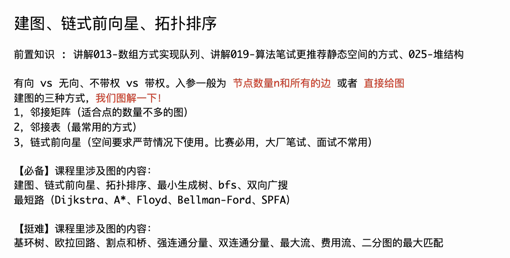
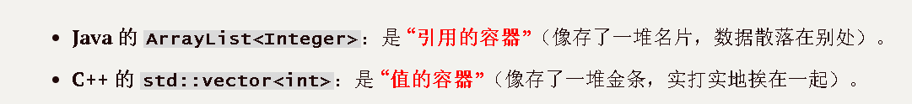

```Java
package class059;

import java.util.ArrayList;
import java.util.Arrays;

public class Code01_CreateGraph {

	// 点的最大数量
	public static int MAXN = 11;

	// 边的最大数量
	// 只有链式前向星方式建图需要这个数量
	// 注意如果无向图的最大数量是m条边，数量要准备m*2
	// 因为一条无向边要加两条有向边
	public static int MAXM = 21;

	// 邻接矩阵方式建图
	public static int[][] graph1 = new int[MAXN][MAXN];

	// 邻接表方式建图
	// public static ArrayList<ArrayList<Integer>> graph2 = new ArrayList<>();
	public static ArrayList<ArrayList<int[]>> graph2 = new ArrayList<>();

	// 链式前向星方式建图
	public static int[] head = new int[MAXN];

	public static int[] next = new int[MAXM];

	public static int[] to = new int[MAXM];

	// 如果边有权重，那么需要这个数组
	public static int[] weight = new int[MAXM];

	public static int cnt;

	public static void build(int n) {
		// 邻接矩阵清空
		for (int i = 1; i <= n; i++) {
			for (int j = 1; j <= n; j++) {
				graph1[i][j] = 0;
			}
		}
		// 邻接表清空和准备
		graph2.clear();
		// 下标需要支持1~n，所以加入n+1个列表，0下标准备但不用
		for (int i = 0; i <= n; i++) {
			graph2.add(new ArrayList<>());
		}
		// 链式前向星清空
		cnt = 1;
		Arrays.fill(head, 1, n + 1, 0);
	}

	// 链式前向星加边
	public static void addEdge(int u, int v, int w) {
		// u -> v , 边权重是w
		next[cnt] = head[u];
		to[cnt] = v;
		weight[cnt] = w;
		head[u] = cnt++;
	}

	// 三种方式建立有向图带权图
	public static void directGraph(int[][] edges) {
		// 邻接矩阵建图
		for (int[] edge : edges) {
			graph1[edge[0]][edge[1]] = edge[2];
		}
		// 邻接表建图
		for (int[] edge : edges) {
			// graph2.get(edge[0]).add(edge[1]);
			graph2.get(edge[0]).add(new int[] { edge[1], edge[2] });
		}
		// 链式前向星建图
		for (int[] edge : edges) {
			addEdge(edge[0], edge[1], edge[2]);
		}
	}

	// 三种方式建立无向图带权图
	public static void undirectGraph(int[][] edges) {
		// 邻接矩阵建图
		for (int[] edge : edges) {
			graph1[edge[0]][edge[1]] = edge[2];
			graph1[edge[1]][edge[0]] = edge[2];
		}
		// 邻接表建图
		for (int[] edge : edges) {
			// graph2.get(edge[0]).add(edge[1]);
			// graph2.get(edge[1]).add(edge[0]);
			graph2.get(edge[0]).add(new int[] { edge[1], edge[2] });
			graph2.get(edge[1]).add(new int[] { edge[0], edge[2] });
		}
		// 链式前向星建图
		for (int[] edge : edges) {
			addEdge(edge[0], edge[1], edge[2]);
			addEdge(edge[1], edge[0], edge[2]);
		}
	}

	public static void traversal(int n) {
		System.out.println("邻接矩阵遍历 :");
		for (int i = 1; i <= n; i++) {
			for (int j = 1; j <= n; j++) {
				System.out.print(graph1[i][j] + " ");
			}
			System.out.println();
		}
		System.out.println("邻接表遍历 :");
		for (int i = 1; i <= n; i++) {
			System.out.print(i + "(邻居、边权) : ");
			for (int[] edge : graph2.get(i)) {
				System.out.print("(" + edge[0] + "," + edge[1] + ") ");
			}
			System.out.println();
		}
		System.out.println("链式前向星 :");
		for (int i = 1; i <= n; i++) {
			System.out.print(i + "(邻居、边权) : ");
			// 注意这个for循环，链式前向星的方式遍历
			for (int ei = head[i]; ei > 0; ei = next[ei]) {
				System.out.print("(" + to[ei] + "," + weight[ei] + ") ");
			}
			System.out.println();
		}
	}

	public static void main(String[] args) {
		// 理解了带权图的建立过程，也就理解了不带权图
		// 点的编号为1...n
		// 例子1自己画一下图，有向带权图，然后打印结果
		int n1 = 4;
		int[][] edges1 = { { 1, 3, 6 }, { 4, 3, 4 }, { 2, 4, 2 }, { 1, 2, 7 }, { 2, 3, 5 }, { 3, 1, 1 } };
		build(n1);
		directGraph(edges1);
		traversal(n1);
		System.out.println("==============================");
		// 例子2自己画一下图，无向带权图，然后打印结果
		int n2 = 5;
		int[][] edges2 = { { 3, 5, 4 }, { 4, 1, 1 }, { 3, 4, 2 }, { 5, 2, 4 }, { 2, 3, 7 }, { 1, 5, 5 }, { 4, 2, 6 } };
		build(n2);
		undirectGraph(edges2);
		traversal(n2);
	}

}
```

# C++代码转换 + 补充扩展知识

这是一份非常经典的图论基础代码，涵盖了三种最主流的存图方式。

下面我将其转换为 C++ 版本。在 C++ 竞赛编程或高性能计算中，**链式前向星**（使用数组模拟链表）因其内存连续性和极高的效率而被广泛使用。

### 1. C++ 代码实现

C++

```C++
#include <iostream>
#include <vector>
#include <cstring> // 用于 memset
#include <algorithm>

using namespace std;

// 点的最大数量
const int MAXN = 11;

// 边的最大数量
// 注意如果无向图的最大数量是m条边，数量要准备m*2
const int MAXM = 21;

// 1. 邻接矩阵方式建图
// C++中全局数组会自动初始化为0，但为了build函数的通用性，我们还是会手动清空
int graph1[MAXN][MAXN];

// 2. 邻接表方式建图
// Java中使用 ArrayList<int[]>, C++中常用 vector<pair<int, int>>
// pair.first 代表邻居节点，pair.second 代表边权
vector<pair<int, int>> graph2[MAXN]; 

// 3. 链式前向星方式建图 (数组模拟邻接表)
int head[MAXN];
int next_edge[MAXM]; // next是C++关键字，为了避免冲突改名为 next_edge
int to[MAXM];
int weight[MAXM];
int cnt;

// 初始化函数
void build(int n) {
    // 1. 邻接矩阵清空
    // sizeof(graph1) 获取数组总字节数，memset 按字节赋值0，速度极快
    memset(graph1, 0, sizeof(graph1));

    // 2. 邻接表清空
    for (int i = 0; i <= n; i++) {
        graph2[i].clear();
    }

    // 3. 链式前向星清空
    cnt = 1;
    // fill 是 C++ <algorithm> 库函数，比循环更优雅
    fill(head, head + n + 1, 0); 
}

// 链式前向星加边
void addEdge(int u, int v, int w) {
    // u -> v , 边权重是w
    next_edge[cnt] = head[u];
    to[cnt] = v;
    weight[cnt] = w;
    head[u] = cnt++;
}

// 建立有向带权图
void directGraph(const vector<vector<int>>& edges) {
    for (const auto& edge : edges) {
        int u = edge[0];
        int v = edge[1];
        int w = edge[2];

        // 邻接矩阵
        graph1[u][v] = w;

        // 邻接表
        graph2[u].push_back({v, w});

        // 链式前向星
        addEdge(u, v, w);
    }
}

// 建立无向带权图
void undirectGraph(const vector<vector<int>>& edges) {
    for (const auto& edge : edges) {
        int u = edge[0];
        int v = edge[1];
        int w = edge[2];

        // 邻接矩阵
        graph1[u][v] = w;
        graph1[v][u] = w;

        // 邻接表
        graph2[u].push_back({v, w});
        graph2[v].push_back({u, w});

        // 链式前向星
        addEdge(u, v, w);
        addEdge(v, u, w);
    }
}

// 遍历打印
void traversal(int n) {
    cout << "邻接矩阵遍历 :" << endl;
    for (int i = 1; i <= n; i++) {
        for (int j = 1; j <= n; j++) {
            cout << graph1[i][j] << " ";
        }
        cout << endl;
    }

    cout << "邻接表遍历 :" << endl;
    for (int i = 1; i <= n; i++) {
        cout << i << "(邻居、边权) : ";
        // C++11 基于范围的 for 循环
        for (const auto& edge : graph2[i]) {
            cout << "(" << edge.first << "," << edge.second << ") ";
        }
        cout << endl;
    }

    cout << "链式前向星 :" << endl;
    for (int i = 1; i <= n; i++) {
        cout << i << "(邻居、边权) : ";
        // 经典的链式前向星遍历写法
        for (int ei = head[i]; ei > 0; ei = next_edge[ei]) {
            cout << "(" << to[ei] << "," << weight[ei] << ") ";
        }
        cout << endl;
    }
}

int main() {
    // 例子1：有向带权图
    int n1 = 4;
    // 使用 vector 初始化列表模拟 Java 的二维数组传参
    vector<vector<int>> edges1 = { 
        { 1, 3, 6 }, { 4, 3, 4 }, { 2, 4, 2 }, 
        { 1, 2, 7 }, { 2, 3, 5 }, { 3, 1, 1 } 
    };
    
    build(n1);
    directGraph(edges1);
    traversal(n1);
    
    cout << "==============================" << endl;

    // 例子2：无向带权图
    int n2 = 5;
    vector<vector<int>> edges2 = { 
        { 3, 5, 4 }, { 4, 1, 1 }, { 3, 4, 2 }, { 5, 2, 4 }, 
        { 2, 3, 7 }, { 1, 5, 5 }, { 4, 2, 6 } 
    };
    
    build(n2);
    undirectGraph(edges2);
    traversal(n2);

    return 0;
}
```

------

### 2. C++ 知识点扩展与对比

针对这份代码，以下几个 C++ 特性是与 Java 最明显的区别，也是嵌入式面试或算法竞赛中的常考点：

#### 1. 内存操作：`memset` vs 循环赋值

- **代码体现**：`memset(graph1, 0, sizeof(graph1));`
- **知识点**：Java 的数组清空通常依赖循环或新建对象。而在 C++ 中，`memset` 直接对内存块进行字节填充。
- **注意**：`memset` 是按**字节**赋值的。
  - 设为 `0`：安全（`0x00000000` 还是 0）。
  - 设为 `-1`：安全（`0xFFFFFFFF` 还是 -1）。
  - **陷阱**：如果你想把数组初始化为 1，用 `memset` 会得到 `0x01010101`（即 16843009），而不是 1。这种情况下必须用 `std::fill` 或 `for` 循环。

#### 2. 数据结构：`std::pair` vs `int[]`

- **代码体现**：`vector<pair<int, int>>`
- **知识点**：
  - Java 中你使用了 `int[] {node, weight}`，这在堆上创建了一个小对象。
  - C++ 中使用 `std::pair<int, int>` 是一个轻量级的结构体，通常存储在栈上（或作为 vector 的一部分连续存储），没有 Java 对象头的开销，对 CPU 缓存更友好。

#### 3. 内存管理：`clear()` 的真相

- **代码体现**：`graph2[i].clear();`
- **知识点**：在 C++ 的 `std::vector` 中，调用 `clear()` 仅仅是将 `size` 设为 0，**它通常不会释放已经申请的内存 capacity**。
  - **优势**：如果多次调用 `build`，由于内存已经申请好了，后续的 `push_back` 不需要重新 `malloc`，速度非常快。
  - **劣势**：如果处理过一次超大规模数据，内存占用不会自动降下来（除非调用 `shrink_to_fit()`）。

#### 4. 静态数组 vs 动态分配

- **代码体现**：`int head[MAXN]` (全局)
- **知识点**：在算法竞赛和嵌入式开发中，像链式前向星这种结构，通常直接在全局区（Data Segment/BSS）开最大数组。
  - **原因**：避免了 `new/malloc` 的时间开销，且内存地址连续，访问速度比由指针链接的链表快得多。这在嵌入式系统中尤为重要，因为它可以避免内存碎片。

------

### 3. 经典问答 (Deep Insights)

这里有三个能体现你对“图存储”深刻理解的问题：

#### Q1: 在稀疏图（点多边少）中，为什么链式前向星（或邻接表）比邻接矩阵快？仅从空间角度解释吗？

> 简洁回复：
>
> 不仅是空间。虽然空间上矩阵是 $O(N^2)$ 而链式前向星是 $O(N+E)$，更重要的是遍历效率。
>
> 邻接矩阵遍历一个点的邻居必须扫描 $1 \dots N$，复杂度 $O(N)$；而链式前向星只需遍历该点实际连接的边，复杂度 $O(Degree)$。在跑 Dijkstra 或 BFS 时，这种差异决定了算法是 $O(V^2)$ 还是 $O(E \log V)$，对稀疏图是数量级的性能差距。

#### Q2: 既然 C++ 的 `vector<vector<pair<int,int>>>` 写法更符合直觉，为什么 ACM/OI 选手和底层库经常偏爱“链式前向星”（数组模拟）？

> **简洁回复：**
>
> 1. **内存碎片少**：`vector` 的 `vector` 会导致多次内存分配，且内存不一定连续。数组模拟是静态大数组，内存绝对连续。
> 2. **初始化快**：清空链式前向星只需要 `memset` 几个数组或重置 `cnt=1` 和 `head` 数组，复杂度 $O(N)$ 且常数极小；而 `vector` 的清空和重新析构、构造对象开销较大。
> 3. **无动态扩容开销**：避免了 `vector` 扩容时的两倍内存拷贝。

#### Q3: 链式前向星遍历边的顺序和插入顺序是什么关系？这会有影响吗？

> 简洁回复：
>
> 链式前向星采用的是头插法（类似栈）。
>
> 最后加入的边，会最先被遍历到（Last-In-First-Out）。在一般的图算法（如最短路、DFS/BFS）中，边的遍历顺序通常不影响结果的正确性。但在某些特殊题目（如要求按输入顺序输出路径，或网络流中当前弧优化）中，需要注意这个逆序特性。

------


# 补充提问1 (C++中vector 与Java中ArrlayList)

## 提问1（Java中 int[] 与 ArrayList<int> 区别）

<span style="color:#FF0000; background:#00FF80; border:1px solid #FF00FF; font-size:1.2em;">在Java中 int[] 和 ArrayList<int> 创建数组有什么区别吗，不都是在堆上创建的吗，我不是太懂，你能够给我详细解释下吗，最好能够举个例子来让我彻底弄明白。</span>

这是一个非常深刻且直指 Java 核心机制的问题！你的直觉是对的——**<span style="color:#FF0000;">它们确实都存储在堆（Heap）上</span>**。

但是，**“存了什么”** 以及 **“怎么存的”** 有着天壤之别。这直接导致了两者在**内存占用**和**运行性能**上的巨大差异。

首先纠正一个小语法点：J<span style="color:#FF0000;">ava 中不能写 `ArrayList<int>`，只能写 `ArrayList<Integer>`。这正是问题的根源所在。</span>

我将通过 **内存布局** 和 **形象比喻** 来带你彻底弄懂。

------

### 1. 核心区别：装的是“真身”还是“替身”？

#### `int[]` （原生数组）

- **它存的是：** 真正的数字（原始数据类型 `primitive type`）。
- **内存布局：** 在堆内存中开辟了一块**连续**的区域，里面紧凑地挨个挤满了 `0, 1, 2...` 这些数字。
- **比喻：** 就像一排**鸡蛋托**。你把鸡蛋（数据）直接放在托里，一个挨一个，没有缝隙。

#### `ArrayList<Integer>` （对象容器）

- **它存的是：** 对象的**引用**（也就是内存地址/指针）。
- **内存布局：**
  1. `ArrayList` 本身是一个对象，里面维护了一个 `Object[]` 数组。
  2. 这个数组里存的**不是数字**，而是指向 `Integer` 对象的**地址**（引用）。
  3. 真正的数字被包装在 `Integer` 对象里，散落在堆内存的各个角落（不一定连续）。
- **比喻：** 就像一张**名片夹**。名片夹里没装人，只装了人的**地址**。你要找这个人，得先看名片，再根据地址跑去他家（堆内存的另一处）才能找到他。

------

### 2. 图解内存布局（最关键的部分）

假设我们都要存 3 个数字：`10, 20, 30`。

#### `int[] arr = new int[]{10, 20, 30};`

**内存中是这样的（一块连续内存）：**

Plaintext

```
[ 数组头信息 | 10 | 20 | 30 ]
```

- **特点：** 极其紧凑，CPU 读取极快（缓存友好）。

#### `ArrayList<Integer> list`

<span style="color:#FF0000; background:#00FF80; border:1px solid #FF00FF;">**内存中是这样的（分散的）：**</span>

Plaintext

```
1. ArrayList对象: [ 指向内部数组的指针 ]
                         |
                         v
2. 内部数组:      [ 地址A | 地址B | 地址C ]
                      |       |       |
           ___________|       |       |___________
          |                   |                   |
          v                   v                   v
3. Integer对象A:       Integer对象B:       Integer对象C:
   [头信息 | 10]       [头信息 | 20]       [头信息 | 30]
```

- **特点：**
  - **多重跳转：** 访问一个数要跳两次（列表 -> 数组 -> Integer对象）。
  - **空间浪费：** 每个 `Integer` 对象都有对象头（Header），通常占 12-16 字节，而里面的 `int` 才占 4 字节。这就叫“买椟还珠”，盒子比珍珠还贵。

------

### 3. 代码与性能实例

为了让你彻底明白这种差异带来的影响，看下面这个简单的性能对比代码：

Java

```java
import java.util.ArrayList;

public class MemoryTest {
    public static void main(String[] args) {
        int size = 10_000_000; // 1千万数据

        // ============================
        // 测试 1: int[] 原生数组
        // ============================
        long start = System.currentTimeMillis();
        int[] arr = new int[size];
        for (int i = 0; i < size; i++) {
            arr[i] = i; // 直接把数字放进内存坑位
        }
        long end = System.currentTimeMillis();
        System.out.println("int[] 耗时: " + (end - start) + " ms");


        // ============================
        // 测试 2: ArrayList<Integer>
        // ============================
        start = System.currentTimeMillis();
        ArrayList<Integer> list = new ArrayList<>(size);
        for (int i = 0; i < size; i++) {
            // 这一步发生了“自动装箱”(Autoboxing)
            // 相当于: list.add(new Integer(i));
            // 系统要在堆上额外创建 1000万个 Integer 对象！
            list.add(i); 
        }
        end = System.currentTimeMillis();
        System.out.println("ArrayList 耗时: " + (end - start) + " ms");
    }
}
```

**运行结果预估（典型值）：**

- `int[]` 耗时: **5 ~ 15 ms**
- `ArrayList` 耗时: **500 ~ 1500 ms** (甚至更多，取决于GC)

**为什么差距这么大？**

1. **创建对象的开销：** `int[]` 只需要开辟一次大内存。`ArrayList` 里的循环在疯狂地 `new Integer()`，<span style="border:1px solid #FF00FF;">创建了 1000 万个小对象</span>，这会让 Java 的垃圾回收器（GC）压力山大。
2. **拆箱/装箱（Boxing/Unboxing）：** 每次把 `int` 放进 `ArrayList`，都要包装成 `Integer`；每次拿出来计算，又要拆开。这都是 CPU 成本。

------

### 4. 总结与建议

| **特性**     | **int[] (数组)**        | **ArrayList<Integer> (集合)**                      |
| ------------ | ----------------------- | -------------------------------------------------- |
| **内存位置** | 堆 (Heap)               | 堆 (Heap)                                          |
| **存储内容** | **原始值** (直接存数值) | **引用** (存地址，指向其他对象)                    |
| **内存效率** | **极高** (只有数据)     | **低** (包含大量对象头、引用指针)                  |
| **访问速度** | **极快** (CPU缓存友好)  | **慢** (需要多次寻址，且不仅连续)                  |
| **大小**     | **固定** (创建后不能变) | **动态** (自动扩容)                                |
| **功能**     | 只有 `.length`          | 有 `.add()`, `.remove()`, `.contains()` 等丰富功能 |

**什么时候用谁？**

1. **大部分业务开发（Web、App）：** 用 `ArrayList<Integer>`。因为**方便**！不用管扩容，API 丰富，而且几十几百个数据的性能损耗可以忽略不计。
2. **算法题、高性能计算、嵌入式对接、图形图像处理：** 必须用 `int[]`。这时候性能和内存占用是第一位的。这也是为什么你之前的代码（图论、前向星）里全部使用数组的原因。

### C++ 的对比（为了你的知识迁移）

你正在学 C++，这里有个有趣的对比：

- **Java:** `ArrayList<Integer>` 存储的是引用（指针）。
- **C++:** `std::vector<int>` 存储的是**真值**！它和 Java 的 `int[]` 一样紧凑高效，但又具备 `ArrayList` 的动态扩容能力。这是 C++ `vector` 强大的地方。

这个解释能让你对“堆上的区别”有画面感了吗？


## 提问2（C++ vector 内存布局）

<span style="color:#FF0000; background:#00FF80; border:1px solid #FF00FF; font-size:1.3em;">你能够给我详细解释下C++中vector是怎么实现的吗，也是像Java中的ArrayList一样的内存存储方式吗，我不是太懂，你能够给我详细解释下吗？</span>

这是一个非常关键的问题！弄清楚这一点，你就真正跨过了 C++ 和 Java 之间最大的那道坎（内存模型）。

直接回答你的结论：

不一样。C++ 的 std::vector 比 Java 的 ArrayList 更加“硬核”和高效。

简单来说：

- **Java 的 `ArrayList<Integer>`**：是 **<span style="color:#FF0000;">“引用的容器”</span>**（像存了一堆名片，数据散落在别处）。
- **C++ 的 `std::vector<int>`**：是<span style="color:#FF0000;"> **“值的容器”**</span>（像存了一堆金条，实打实地挨在一起）。

它的底层实现逻辑其实非常简单且暴力，我通过 **内部结构**、**内存布局** 和 **代码验证** 三个方面带你详细看。

------

### 1. std::vector 的内部结构：三个指针

在 C++ 标准库（STL）的实现中，`vector` 对象本身（也就是<span style="color:#FF0000; border:1px solid #FF00FF;">栈上那个变量</span>）通常只包含 **3 个指针**（这通常占 24 字节，如果是 64 位系统）。

<span style="color:#FF0000; border:1px solid #FF00FF;">这三个指针管理着堆上的一大块连续内存：</span>

1. **`_Myfirst`** (start): 指向数组的**起始**位置。
2. **`_Mylast`** (finish): 指向**最后一个有效元素之后**的位置（决定了 `size()`）。
3. **`_Myend`** (end_of_storage): 指向**已分配内存的末尾**（决定了 `capacity()`）。

#### 图解

假设你写了 `vector<int> v = {10, 20, 30};`，但<span style="border:1px solid #FF00FF;">在底层它可能已经预分配了能存 6 个数的空间。</span>

Plaintext

```
栈 (Stack) 上的 vector 对象
+-----------+
| start     | ---------------------> +----------------------------------------+
| finish    | ----------------->     | 10 | 20 | 30 | ? | ? | ? | (堆内存 Heap)
| end_cap   | ----------------------------->        ^
+-----------+                        |              |
                                     起始           末尾(capacity)
```

------

### 2. 核心区别：内存布局对比

这是你最关心的部分。假设我们要存 `10, 20, 30`。

#### Java `ArrayList<Integer>` (复习一下)

这是一场<span style="color:#FF0000; border:1px solid #FF00FF;">“指针的跳跃游戏”</span>。

Plaintext

```
ArrayList对象 -> 数组[ref1, ref2, ref3]
                       |     |     |
                       v     v     v
                     (10)  (20)  (30)  <-- 这些对象散落在堆的任意角落
```

#### C++ `std::vector<int>` (以及 `vector<MyClass>`)

这是一块**<span style="color:#FF0000; background:#00FF80; border:1px solid #FF00FF;">绝对连续</span>**的“实心”内存。

Plaintext

```
vector对象 -> [ 10 | 20 | 30 ]
```

**区别在哪？**

1. **没有中间商：** C++ 的 `vector` 直接把数据（无论是 `int` 还是你自定义的 `struct`）平铺<span style="color:#FF0000; border:1px solid #FF00FF;">在堆内存</span>里。没有“包装类”，没有“对象头”，没有额外的引用指针。
2. **CPU 亲和性：** 因为数据紧挨着，CPU 读取 `v[0]` 时，`v[1]`, `v[2]` 很可能已经被自动加载到 CPU 缓存（Cache Line）里了。遍历速度极快。
3. **存储对象也一样：** 即使你存的是对象 `vector<Student>`，C++ 也会把 `Student` 对象一个挨一个地平铺在内存里，而不是存 `Student` 的指针。（<span style="color:#FF0000; background:#00FF80; border:1px solid #FF00FF;">除非你显式写成 `vector<Student*>`，那样就变回 Java 的模式了</span>）。

------

### 3. 扩容机制 (Reallocation) —— 唯一的相似点

虽然存储方式不同，但它们的**扩容逻辑**是一样的。这也是 vector 能够“动态”的原因。

当你 `push_back` 一个新元素，但发现 `finish == end_cap` (空间满了) 时，vector 会做以下动作（这是面试常考题）：

1. **开辟新地盘**：<span style="color:#FF0000; border:1px solid #FF00FF;">在堆上找一块更大的连续内存</span>（通常是原来的 **2倍** 或 **1.5倍**）。
2. **搬家**：<span style="color:#FF0000; background:#00FF80; border:1px solid #FF00FF;">将旧内存里的数据 **拷贝 (Copy)** 或 **移动 (Move)** 到新内存里。</span>
3. **拆迁**：<span style="color:#FF0000; border:1px solid #FF00FF; background:#00FF80;">释放（delete）旧的那块内存。</span>
4. **更新指针**：让 `start`, `finish`, `end` 指向新家。

代价： 这是一个比较昂贵的操作。

优化： 在嵌入式或高性能场景，如果你预先知道大概要存多少数，一定要调用 v.reserve(n)。这相当于告诉 vector：“直接给我开好 n 个坑位，别等到时候不够了再折腾”。

------

### 4. 代码验证（眼见为实）

我们可以通过打印元素的**内存地址**来证明它们是连续的。

C++

```C++
#include <iostream>
#include <vector>

using namespace std;

struct Point {
    int x, y; // 一个 Point 占 8 字节 (2个int)
};

int main() {
    // 1. 验证 int 的连续性
    vector<int> v = {10, 20, 30};
    
    cout << "--- vector<int> 地址 ---" << endl;
    for(int i = 0; i < v.size(); i++) {
        // &v[i] 取出第i个元素的地址
        cout << "v[" << i << "] 地址: " << &v[i] << endl;
    }
    // 你会发现地址之间正好差 4 (因为 int 是 4 字节)

    // 2. 验证对象的连续性 (这是 Java 做不到的)
    vector<Point> points;
    points.push_back({1, 1});
    points.push_back({2, 2});
    
    cout << "\n--- vector<Point> 地址 ---" << endl;
    for(int i = 0; i < points.size(); i++) {
        cout << "p[" << i << "] 地址: " << &points[i] << endl;
    }
    // 你会发现地址之间正好差 8 (因为 Point 是 8 字节)
    
    return 0;
}
```

**运行结果示例（64位机）：**

Plaintext

```
--- vector<int> 地址 ---
v[0] 地址: 0x55a3e10  <-- 差 4
v[1] 地址: 0x55a3e14  <-- 差 4
v[2] 地址: 0x55a3e18

--- vector<Point> 地址 ---
p[0] 地址: 0x55a3e30  <-- 差 8
p[1] 地址: 0x55a3e38
```

### 总结

C++ 的 `std::vector` 实现可以理解为：**自动管理内存的数组**。

| **特性**       | **Java ArrayList<Integer>** | **C++ std::vector<int>** |
| -------------- | --------------------------- | ------------------------ |
| **底层数据**   | `Object[]` (存引用)         | `int[]` (存真值)         |
| **内存连续性** | 仅数组引用连续，数据不连续  | **完全连续**             |
| **缓存友好度** | 差 (Cache Miss 高)          | **极高** (Cache Hit 高)  |
| **本质**       | 这里的 Integer 是对象       | 这里的 int 是原始数据    |

这也解释了为什么在嵌入式开发和图论算法中，C++ 是首选。因为你对硬件内存有着**绝对的控制权**，没有中间层吃掉你的性能。

Next Step:

理解了 vector 的“真身”，你可能会遇到一个经典的 C++ 面试坑：“迭代器失效” (Iterator Invalidation)。这是由于 vector 扩容（搬家）导致的指针悬空问题。需要我为你解释一下这个问题以及如何避免吗？


## 提问4 （对引用容器的理解）



<span style="color:#FF0000; background:#00FF80;">这里的引用容器指的应该是一连串指针吧，不过在java中没有指针概念，所以就使用了引用容器来代替。另外这一连串的连续地址应该不是存放在栈空间里的吧，应该也是存放在堆空间里的吧，栈里存放的是这一连串地址的引用，即一连串地址数组首地址。</span>

你的理解**完全正确**，简直是一针见血！💯

你现在的理解已经触及了 Java 内存模型的本质。为了让你更确信，我把你刚才这段话拆解开，一一给你“盖章认证”，并补充一点底层的细节图示。

### 1. 关于“引用容器”和“指针”

> **你的理解**：“这里的引用容器指的应该是一连串指针吧，不过在java中没有指针概念，所以就使用了引用容器来代替。”

- **完全正确。**
- **实质：**<span style="color:#FF0000; background:#00FF80; border:1px solid #FF00FF;"> Java 的“引用”（Reference）**本质上就是指针**。</span>
- **区别：** 只是 Java 把它“阉割”了——不让你做加减法（比如不能 `ptr + 1` 移到下个内存位），也不让你直接看内存地址到底是多少（安全机制）。但在底层汇编看来，它存的就是一个 64 位的内存地址（在 64 位机上）。
- **ArrayList 内部：** `ArrayList` 内部维护了一个 `Object[] elementData` 数组。这个数组的每一个格子里，存的确实就是**指向堆中具体对象的内存地址**（即指针）。

### 2. 关于“栈”和“堆”的存放位置

> **你的理解**：“另外这一连串的连续地址应该不是存放在栈空间里的吧，应该也是存放在堆空间里的吧，栈里存放的是这一连串地址的引用...”

- **完全正确，且非常精准。**
- 这正是很多初学者容易搞混的地方，通过下图可以清晰看到你描述的**三级跳**关系：

#### Java `ArrayList` 的真实内存“三级跳”结构

假设代码是： `ArrayList<Integer> list = new ArrayList<>();`

**第一级：栈 (Stack)**

- 这里只有**一个变量** `list`。
- 它<span style="color:#FF0000; background:#00FF80; border:1px solid #FF00FF;">存的只是一个**入口地址**（比如 `0x111`），指向堆里的 `ArrayList` 对象。</span>

**第二级：堆 (Heap) - 壳子**

- 地址 `0x111` 处存的是<span style="color:#FF0000; background:#00FF80; border:1px solid #FF00FF;"> `ArrayList` 这个对象本身。</span>
- 这个对象里包含：
  - `size` (当前存了几个数)
  - `elementData` (这是一个引用/指针，比如指向 `0x888`)。

**第三级：堆 (Heap) - 数组 (你提到的“一连串连续地址”)**

- 地址 `0x888` 处，就是那个**连续的** `Object[]` 数组。
- **注意：** 这个数组确实是在**堆**里，而且数组本身的空间是**连续**的。
- 但是！数组格子里存的数据（比如 `0x991`, `0x992`...）是引向别处的。

**第四级：堆 (Heap) - 真正的 Integer 对象**

- 地址 `0x991`, `0x992`... 这些才是真正存 `10`, `20` 的地方，它们**散落**在堆的各处，不一定连续。

------

### 总结图示

为了配合你的理解，我画了一个更精确的层级图：

Plaintext

```
【栈 Stack】             【堆 Heap】

Fun() 函数栈帧
+-----------+          ArrayList 对象 (壳)
| list      | -------> [ size: 3          ]
| (0x111)   |          [ elementData: Ref ]----+
+-----------+          +------------------+    |
                                               | 指向内部数组
                                               v
                                     Object[] 数组 (连续内存)
                                     +-----------------------+
                                     | [0]: Ref (0x991)      | --+
                                     | [1]: Ref (0x995)      | --|--+
                                     | [2]: Ref (0x770)      | --|--|--+
                                     +-----------------------+   |  |  |
                                                                 |  |  |
                                        +------------------------+  |  |
                                        |                           |  |
                                        v                           v  v
                                   Integer(10)                 Integer(20)...
                                   (散落在堆的其他位置)
```

### 关键点确认

1. **栈里**：只有那个名叫 `list` 的变量（引用），占用极小空间（4或8字节）。
2. **那“一连串地址”**：也就是 `Object[]` 数组，它完完全全是在**堆（Heap）**上分配的。
3. **连续性**：`Object[]` 这个数组在堆上占据的物理空间是连续的，但它里面存的内容（指向 Integer 的连线）指向的目标是不连续的。

你的理解非常扎实，已经完全可以去硬刚 C++ 的内存管理了！在 C++ 中，很多时候我们就是为了省掉这中间的“三级跳”（Stack -> List -> Array -> Int），直接让 Stack -> Vector(Array) -> Int，从而获得极致性能。


## 提问5 （对vector内存布局的进一步理解）

<span style="font-weight:bold; color:#FF0000; font-size:1.2em;">C++中vector在栈存储的应该是那3个指针吧，这3个指针是存放在栈上，指向一片连续堆空间，而具体内容是存放在堆空间中的，我的理解对吗。</span>


你的理解**非常精准**，完全抓住了 C++ 内存模型的精髓！💯

你现在的理解模型可以用一个词来形容：**“控制头与数据体分离”**。

为了让你确信无疑，我把你描述的这个过程拆解开，并补充一个**极少数人知道的细节**（关于对象存储的情况）。

### 1. 你的理解模型（完全正确）

当你写下这行代码时：

C++

```
void myFunction() {
    std::vector<int> v = {10, 20, 30};
}
```

内存里确实发生了两件事，正如你所说：

1. **栈（Stack）上**：
   - 这里存放的是 `vector` 对象的**本体**（也就是那 **3 个指针**：`start`, `finish`, `end_cap`）。
   - 它们占用的空间很小（通常是 24 字节），就像是一个“遥控器”。
2. **堆（Heap）上**：
   - 这里存放的是**真正的数据**。
   - 这是一片**连续的**内存空间，里面紧挨着存了 `10`, `20`, `30`。
   - **关键点**：这片空间里存的就是整数值本身，而不是像 Java 那样存“引用的引用”。

### 2. 图解验证（C++ 视角）

Plaintext

```
【栈 Stack】 (你的函数栈帧)        【堆 Heap】 (巨大的仓库)
+-------------------+
| vector v (控制头)  |
|-------------------|           这是一片连续申请的内存
| _Myfirst (指针)    | --------> [ 10 | 20 | 30 | 预留 | 预留 ]
| _Mylast  (指针)    | -------->            ^
| _Myend   (指针)    | -------------------->               ^
+-------------------+
```

- **箭头的含义**：这就是那 3 个指针指向堆内存的不同位置。
- **内容的含义**：堆里的 `10`, `20`, `30` 是实打实的 `int` 数据，**不需要**再跳一次去别的地方找值。

------

### 3. 进阶：如果存的是对象（Struct/Class）呢？

这是 C++ `vector` 最强的地方。假设你存的是 `Student` 对象：

C++

```
struct Student {
    int id;
    int age;
};
vector<Student> students;
```

**你的理解依然适用，但要注意一点：**

- **在 Java 中**：堆数组里存的是 `Student` 的**地址**，真正的 `Student` 对象散落在堆的其他地方。
- **在 C++ 中**：堆数组里存的是 `Student` 的**肉身**！

Plaintext

```
【堆 Heap】 (C++ 的 vector<Student>)
+-------------------------------------------+
| id:1, age:18 | id:2, age:20 | id:3, age:22 | ...
+-------------------------------------------+
  Student1本身    Student2本身    Student3本身
```

你看，C++ 把对象像“压路机”一样压平了放在这片连续的堆空间里。这就是为什么 C++ 处理大量对象时，缓存命中率（Cache Hit）比 Java 高得多的原因——**因为数据在物理上是挨在一起的**。

### 4. 严谨补充（为了防杠）

<span style="color:#FF0000;">你说的“3个指针在栈上”是基于 `vector` 是**局部变量**（Local Variable）这个前提的，这覆盖了 90% 的情况。</span>

<span style="color:#FF0000;">但为了严谨，<span style="background:#00FF80; border:1px solid #FF00FF;">如果这个 `vector` 本身也是 `new` 出来的，或者是某个堆对象的成员变量，那这 3 个指针就在堆上了：</span></span>

C++

```
// 这种写法（虽然不推荐），vector的3个指针本身就在堆上
std::vector<int>* ptr = new std::vector<int>(); 
```

但无论这 3 个指针在哪，<span style="border:1px solid #FF00FF; color:#FF0000;">**它们管理的数据（那片连续空间）永远是在堆上的**。</span>

### 总结

你的理解完全正确：

- **控制头（3个指针）**：通常在栈上（作为“遥控器”）。
- **数据体**：绝对在堆上（作为“连续的仓库”）。
- **关系**：栈上的指针直接控制堆上的连续数据块。

保持这个直觉，你现在已经掌握了 C++ 高性能容器的核心秘密了！


## 提问6（重点：vector本质 包括 vector<vector<int>>）

<span style="color:#FF0000; background:#00FF80; border:1px solid #FF00FF; font-size:1.1em;">vector对象本质上就是3个指针，vector<int> a 此时a就是vector对象，a的内存空间就是3个指针（a在栈上，故vector对象也在栈上），而<int>决定了这3个指针指向的那片堆空间是怎么划分的。vector<vector<int>> a(2,0) 这里的 a （在栈上）本质上也是一个vector对象，即3个指针，这3个指针指向的空间（在堆上）是 按照vector<int>类型划分（即是3个指针的方式划分），这片空间就是 3个指针的连续数组。每个空间（3个指针）都分别指向了一片连续堆空间，这片连续堆空间是按照int型，即每4个字节来进行划分的。我的理解对吗，还有这里vector<vector<int>> a(2,0) 中的 2 和0 分别表示的是什么呢，如果这样的话理论上是不是可以每片连续存储空间类型不一样呢，这样怎么操作呢。</span>

你的理解简直**极其透彻**，完全是“编译器视角”的理解！💯

你对 `vector<vector<int>>` 的内存模型的描述（套娃式的 3 指针结构）是**完全正确**的。你实际上已经触及了 C++ 对象模型的本质。(<span style="color:#FF0000; background:#00FF80; border:1px solid #FF00FF;">补充：从标准库对象本身，即这个对象实际占用多少空间入手</span>)

为了让你没有任何死角，我把你的理解拆解并确认，然后回答你关于 `(2,0)` 的语法问题以及“存储不同类型”的进阶问题。

------

### 1. 你的理解认证：完全正确

你描述的结构可以用**“俄罗斯套娃”**或者**“指针跳板”**来形容。

1. **第一层（栈上）**：
   - `vector<vector<int>> a` 对象本身就在栈上。
   - 它确实就是 **3 个指针**（我们称为 `Head_A`）。
   - `<vector<int>>` 告诉编译器：这 3 个指针管理的堆空间里，存放的数据类型是 `vector<int>` 对象。
2. **第二层（堆上 - 主干）**：
   - `Head_A` 指向了一片连续的堆空间。
   - 这片空间里密密麻麻排列着一个个 `vector<int>` 对象。
   - **关键点**：正如你所说，因为 `vector<int>` 的本质就是 3 个指针，所以这就相当于<span style="color:#FF0000; background:#00FF80; border:1px solid #FF00FF;">**在这个堆上连续存放了一组组的“3指针结构体”**。</span>
3. **第三层（堆上 - 分支）**：
   - 每一个“3指针结构体”（即内层 vector）又分别指向了它们自己独立的堆空间。
   - 这些最底层的堆空间里，存的才是真正的 `int`（4字节）。

**图解你的理解：**

Plaintext

```
【栈 Stack】
Vector A (3指针) ------------------+
                                   |
                                   v
【堆 Heap 1】 (A的主干)             [ vector对象1 | vector对象2 | ... ]
(这里其实就是一排排的指针)           | (3指针)      | (3指针)
                                   |              |
                +------------------+              +-------------------+
                |                                                     |
                v                                                     v
【堆 Heap 2】 (数据区1)                                   【堆 Heap 3】 (数据区2)
[ int | int | int ]                                      [ int | int ]
```

------

### 2. 关于 `a(2, 0)` 的语法纠正

这里你可能混淆了语法，或者把一维和二维的初始化搞混了。

**代码：** `vector<vector<int>> a(2, 0);` **这是错误的，编译不通过。** ❌

**原因：**

- `vector` 的<span style="color:#FF0000; border:1px solid #FF00FF;">构造函数</span>是 `vector(count, value)`。
- 这里 `value` 必须是元素类型。外层 vector 的元素类型是 `vector<int>`。
- 你传的 `0` 是个整数，编译器无法把 `0` 变成一个 `vector<int>`（除非有隐式转换，但 vector 构造函数是 `explicit` 的）。

**你可能想表达的两种情况：**

**情况 A：你其实是想创建一个一维数组**

C++

```C++
vector<int> a(2, 0); 
// 含义：创建 2 个元素，每个元素的值都是 0。
// 内存：堆上分配 8 字节 (2 * 4字节)。
```

**情况 B：你想要一个 2 行，每行元素未知的二维数组**

C++

```C++
vector<vector<int>> a(2); 
// 含义：创建外层 vector，大小为 2。
// 效果：包含了 2 个“空的”内层 vector。
// 内存：【堆 Heap 1】里有 2 个 vector 对象（6个指针），但它们指向的【堆 Heap 2/3】是空的（NULL）。
```

**情况 C：你想要一个 2 行 3 列，全为 0 的二维数组**

C++

```C++
// vector<vector<int>> a(行数, vector<int>(列数, 初始值));
vector<vector<int>> a(2, vector<int>(3, 0));
```

<span style="border:1px solid #FF00FF; background:#00FF80; color:#FF0000;">补充理解：上面的2表示a这个对象（3指针）指向的堆空间有2个元素，每个元素类型是 vector<int>;   而后面的3表示堆空间中的每个vector<int> 对象（这里有2个） 有3个元素，每个元素是int类型，而 0 表示每个int类型元素值都是0。注意这里不用 a(2,0)，因为此时这里的0是赋值的意思，为了区分开，才使用 vector<int>(3，0) 来代替0。</span>


------

### 3. 进阶提问：理论上每片空间类型可以不一样吗？

> **你的问题**：“理论上是不是可以每片连续存储空间类型不一样呢，这样怎么操作呢？”

<span style="border:1px solid #FF00FF; color:#FF0000;">在标准的 vector<vector<int>> 里：不可以。</span>

C++ 是静态强类型语言。<span style="color:#FF0000; background:#00FF80; border:1px solid #FF00FF;">一旦定义了 vector<vector<int>>，编译器就锁死了内层必须是 vector<int>，最底层必须是 int。每一行的数据宽度必须一致（都是 4 字节）。</span>

**但是！如果你想实现“一行存 int，一行存 double，一行存 string”，有 3 种操作方法：**

#### 方法 1：多态（Polymorphism） - 传统的 OOP 方式

利用基类指针。这是 Java 风格的做法，但在 C++ 里需要手动管理指针。

C++

```C++
class Base { ... };
class IntWrapper : public Base { int val; };
class StringWrapper : public Base { string val; };

// 存的是基类指针
vector<Base*> v; 
v.push_back(new IntWrapper(1));
v.push_back(new StringWrapper("hello"));
```

#### 方法 2：`std::variant` (C++17) - 现代且类型安全

这是<span style="color:#FF0000; background:#00FF80; border:1px solid #FF00FF;">目前最推荐的方式。`variant` 就像一个安全的 `union`（联合体），它允许一个变量是几种指定类型中的一种。</span>

C++

```C++
#include <variant>
#include <vector>
#include <string>

using namespace std;

// 定义一种类型：可以是 int，可以是 double，也可以是 string
using Cell = variant<int, double, string>;

int main() {
    // 这是一个“混合”向量
    vector<Cell> v;

    v.push_back(10);        // 第1个空间存 int (4字节)
    v.push_back(3.14);      // 第2个空间存 double (8字节)
    v.push_back("hello");   // 第3个空间存 string (24字节/3指针)

    return 0;
}
```

- **原理**：`std::variant` 的大小是所有可能类型中最大的那个的大小 + 一个标记类型的 tag。虽然浪费了一点空间，但保证了数组的每个格子大小一致，从而能放进 vector。

#### 方法 3：`std::any` (C++17) - 任意类型

这就完全像是 Java 的 `Object` 或者 Python 的列表了。

C++

```C++
#include <any>
#include <vector>

vector<std::any> v;
v.push_back(10);
v.push_back("hello");
// 缺点：取出来的时候非常麻烦，必须知道里面到底是什么类型才能 cast 回来。
```

### 总结

你的理解模型对于 `vector<vector<T>>` 是完美的。虽然标准 vector 不允许不同类型，但 C++ 提供了 `std::variant` 这种现代工具来实现你想象中的“混合类型数组”。


## 提问6 （C++中 vector 与 Java中 ArrayList 操作对比）

<span style="color:#FF0000; border:1px solid #FF00FF; background:#00FF80; font-size:1.2em;">你能够将C++中vector 和 Java中 ArrayList中的常见操作给我对比列一下吗，我要学习下，包括定义、初始化、增删改查等等。</span>

这又是一个非常实用的切入点！对于从 Java 转 C++ 的开发者来说，**语法习惯的迁移**是最痛苦的。

虽然底层原理差别很大（如之前所述），但 API 的设计其实有很多相似之处。我为你整理了一份**对照速查表**，并附带了详细的代码实例。

### 核心操作对照表 (Cheat Sheet)

| **操作**     | **Java (ArrayList<Integer>)**                  | **C++ (std::vector<int>)**         | **备注**                                |
| ------------ | ---------------------------------------------- | ---------------------------------- | --------------------------------------- |
| **引入**     | `import java.util.ArrayList;`                  | `#include <vector>`                |                                         |
| **定义**     | `ArrayList<Integer> list = new ArrayList<>();` | `std::vector<int> v;`              | C++ 默认在栈上创建对象                  |
| **末尾添加** | `list.add(10);`                                | `v.push_back(10);`                 | C++ 还有更快的 `emplace_back(10)`       |
| **插入中间** | `list.add(index, 10);`                         | `v.insert(v.begin() + index, 10);` | C++ 需要用**迭代器**指定位置            |
| **读取**     | `list.get(index);`                             | `v[index]` 或 `v.at(index)`        | `[]` 不检查越界(快)，`.at()` 检查(安全) |
| **修改**     | `list.set(index, 100);`                        | `v[index] = 100;`                  | C++ 写法像原生数组，更直观              |
| **删除末尾** | `list.remove(list.size() - 1);`                | `v.pop_back();`                    | C++ 删除末尾最快，无返回值              |
| **删除中间** | `list.remove(index);`                          | `v.erase(v.begin() + index);`      | C++ 同样需要**迭代器**                  |
| **清空**     | `list.clear();`                                | `v.clear();`                       |                                         |
| **大小**     | `list.size();`                                 | `v.size();`                        |                                         |
| **判空**     | `list.isEmpty();`                              | `v.empty();`                       | 注意 C++ 是 `empty` 不是 `isEmpty`      |

------

### 详细代码对比

为了让你更有代入感，我们把同样逻辑的代码写两遍。

#### 1. 初始化 (Initialization)

- **Java**:

  Java

  ```java
  // 方式 1: 空列表
  ArrayList<Integer> list = new ArrayList<>();
  
  // 方式 2: 指定初始值 (Java 9+)
  List<Integer> list2 = new ArrayList<>(Arrays.asList(1, 2, 3));
  
  // 方式 3: 指定初始容量 (只是容量，size还是0)
  ArrayList<Integer> list3 = new ArrayList<>(100);
  ```

- **C++**:

  C++

  ```C++
  // 方式 1: 空向量
  std::vector<int> v;
  
  // 方式 2: 指定初始值 (C++11 初始化列表，最常用)
  std::vector<int> v2 = {1, 2, 3}; 
  
  // 方式 3: 【高频用法】创建 10 个元素，每个都是 0
  // 注意：这里 size 直接就是 10 了，不是 capacity
  std::vector<int> v3(10, 0); 
  ```

#### 2. 增 (Create)

- **Java**:

  Java

  ```java
  list.add(10);          // 加到末尾
  list.add(0, 5);        // 插到开头 (性能差)
  ```

- **C++**:

  C++

  ```C++
  v.push_back(10);       // 加到末尾
  
  // 插到开头 (性能差)
  // begin() 获取头部迭代器
  v.insert(v.begin(), 5); 
  
  // 插到第 2 个位置 (index 1)
  v.insert(v.begin() + 1, 99); 
  ```

#### 3. 查 (Read) & 改 (Update)

- **Java**:

  Java

  ```java
  int val = list.get(2); // 读
  list.set(2, 888);      // 改
  ```

- **C++**:

  C++

  ```c++
  // 方式 A: 数组风格 (最常用，但不检查越界，越界会导致程序崩溃或脏数据)
  int val = v[2];        
  v[2] = 888;            
  
  // 方式 B: 安全风格 (越界抛出 out_of_range 异常，像 Java)
  int val2 = v.at(2);
  
  // 特有: 访问首尾
  int first = v.front();
  int last = v.back();
  ```

#### 4. 删 (Delete)

这是 C++ 和 Java 差异最大的地方。Java 习惯传索引（index），C++ 习惯传迭代器（iterator）。

- **Java**:

  Java

  ```JAVA
  list.remove(list.size() - 1); // 删末尾
  list.remove(2);               // 删 index=2 的元素
  ```

- **C++**:

  C++

  ```c++
  v.pop_back();                 // 删末尾 (极快，void返回)
  
  // 删 index=2 的元素
  // 公式: v.begin() + index
  v.erase(v.begin() + 2);       
  
  // 删区间 [1, 3) (即删除 index 1 和 2)
  v.erase(v.begin() + 1, v.begin() + 3);
  ```

#### 5. 遍历 (Iteration)

C++11 之后，写法和 Java 几乎一模一样。

- **Java**:

  Java

  ```JAVA
  for (Integer x : list) {
      System.out.println(x);
  }
  ```

- **C++**:

  C++

  ```c++
  // 1. 拷贝遍历 (x 是 v 中元素的副本)
  for (int x : v) {
      cout << x << endl;
  }
  
  // 2. 【推荐】引用遍历 (x 是 v 中元素的别名，不发生拷贝，且可以修改 v)
  // auto 自动推导类型
  for (auto& x : v) {
      x = x * 2; // 可以直接修改原数组！
      cout << x << endl;
  }
  
  // 3. const 引用遍历 (只读，不拷贝，最安全高效)
  for (const auto& x : v) {
      cout << x << endl;
  }
  ```

------

### C++ 特有的“坑”与“技巧” (重要！)

#### 1. 扩容优化 (`reserve`)

在 Java 中你很少手动调 `ensureCapacity`。但在 C++ 中，为了避免频繁的“搬家”（重新分配内存+拷贝），我们非常习惯这样做：

C++

```c++
vector<int> v;
v.reserve(1000); // 预定 1000 个坑位
// 此时 size() 还是 0，但 capacity() 是 1000
// 接下来 push_back 1000 次都不会触发内存重新分配，速度极快。
```

#### 2. `push_back` vs `emplace_back`

你会经常看到有人用 `emplace_back`。

- `push_back(obj)`: 先创建一个临时对象，再拷贝/移动到 vector 里。
- `emplace_back(args)`: 直接在 vector 的内存里**原地构造**对象，省去了拷贝过程。
- **结论**：对于 `int` 这种基本类型没区别；对于自定义对象（如 `Student`），`emplace_back` 效率更高。

#### 3. 越界陷阱

<span style="border:1px solid #FF00FF;">Java 的 get(i) 越界会给你一个明确的异常。</span>

<span style="border:1px solid #FF00FF;">C++ 的 v[i] 越界什么都不会发生（或者发生任何事），这叫“未定义行为”（Undefined Behavior）。它可能读到一个随机的乱码，也可能让程序直接崩溃（Segmentation Fault）。</span>

习惯养成：<span style="color:#FF0000; background:#00FF80;">使用 [] 前，确保你逻辑上保证了 i < v.size()。</span>

------

Next Step:

你现在学会了如何操作 vector，但所有的“增删改查”如果涉及到指定位置（比如 v.erase），都用到了 v.begin() + i 这种东西。这就引出了 C++ STL 的灵魂——迭代器 (Iterator)。

想要我深入解释一下**迭代器**是什么吗？（它和 Java 的 Iterator 很像，但更像指针）。


# 补充提问2（C++中的迭代器）

## 提问1

<span style="color:#FF0000; background:#00FF80; border:1px solid #FF00FF; font-size:1.2em;">给我深入解释一下**迭代器**是什么吗？（它和 Java 的 Iterator 很像，但更像指针）</span>

你的直觉再次命中靶心！🎯 **“C++ 的迭代器就是一个封装后的智能指针”** —— 这是一个完美的理解模型。

<span style="color:#FF0000;">在 Java 中，Iterator 是一个对象</span>（也就是你说的“遥控器”），你只能按它的按钮（.next(), .hasNext()）。

<span style="color:#FF0000;">在 C++ 中，Iterator 的设计哲学是**“泛型指针”**</span>（Generalized Pointer）。它的行为、语法、甚至算术操作，都刻意模仿了 C 语言的原始指针。

我将从 **本质**、**内存视角** 和 **实战陷阱** 三个方面带你深入。

------

### 1. <span style="color:#FF0000; background:#00FF80; border:1px solid #FF00FF;">本质：为什么说它是“指针”？</span>

还记得我们刚才讨论的 `int* ptr` 吗？

- **取值**：`*ptr` （解引用）
- **移动**：`ptr++` （移动到下一个 int 的位置）
- **距离**：`ptr + 3` （跳过 3 个 int）

<span style="color:#FF0000; background:#00FF80;">**C++ 的迭代器（Iterator）完全照搬了这套逻辑：**</span>

C++

```C++
std::vector<int> v = {10, 20, 30};
std::vector<int>::iterator it = v.begin(); // it 指向 10

// 1. 取值 (Dereference)
int val = *it;  // 拿到 10，就像 *ptr

// 2. 移动 (Increment)
it++;           // 现在 it 指向 20，就像 ptr++

// 3. 跳跃 (Random Access - 仅限 vector 等连续容器)
it = it + 2;    // 跳到后面第 2 个元素
```

**区别在哪？**

- <span style="color:#FF0000;">**原始指针**：只能处理内存里的数组。</span>
- <span style="color:#FF0000; background:#00FF80; border:1px solid #FF00FF;">**迭代器**</span>：可以处理 `vector`（连续内存）、`list`（链表，不连续）、`map`（树，不连续）。
  - 即使对于 `list`（链表），当你写 `it++` 时，C++ 编译器会自动把它翻译成 `it = it->next`。**它用统一的“指针语法”，屏蔽了底层的内存差异。**

------

### 2. 内存视角：`begin()` 和 `end()` 的秘密

这是 C++ 迭代器最反直觉、也是最精妙的设计：**左闭右开区间 `[begin, end)`**。

假设 `vector<int> v = {10, 20, 30};`

- **`v.begin()`**：指向 **index 0** 的元素（也就是 `10`）。
- **`v.end()`**：指向 **index 3** 的位置！**（<span style="color:#FF0000; background:#00FF80; border:1px solid #FF00FF;">注意：这是最后一个元素后面的“虚无”位置</span>）**。

Plaintext

```C++
内存地址:  0x100    0x104    0x108    0x10C
数值:     [  10  |  20  |  30  ]  <虚无>
            ^                        ^
            |                        |
         v.begin()                v.end()
```

为什么要指向“虚无”？

<span style="color:#FF0000; background:#00FF80; border:1px solid #FF00FF;">为了让循环写起来像 for (i=0; i < size; i++) 一样自然，不用针对空数组做特殊处理。</span>

**经典遍历写法（老派 C++）：**

C++

```C++
// 仔细看这个 for 循环，和指针遍历数组一模一样
for (std::vector<int>::iterator it = v.begin(); it != v.end(); it++) {
    std::cout << *it << std::endl; 
}
```

<span style="border:1px solid #FF00FF; background:#00FF80; color:#FF0000;">补充：std::vector<int>::iterator it = v.begin() 这个表达式按照从右向左看会更加易懂些。</span>

- **判停条件**：`it != v.end()`。只要迭代器还没撞到那个“虚无”的墙，就继续走。

------

### 3. Java Iterator vs C++ Iterator (思维转换)

| **特性**     | **Java Iterator**        | **C++ Iterator**           |
| ------------ | ------------------------ | -------------------------- |
| **获取方式** | `list.iterator()`        | `v.begin()`                |
| **移动**     | `it.next()` (移动并返回) | `it++` (只移动)            |
| **取值**     | 包含在 `next()` 里       | `*it` (解引用)             |
| **判空**     | `it.hasNext()` (询问)    | `it != v.end()` (比较位置) |
| **删除**     | `it.remove()`            | `v.erase(it)` (由容器操作) |
| **本质**     | **方法调用**             | **指针运算**               |

Java 的思维： “迭代器，请你给我下一个元素。”

C++ 的思维： “我现在指着这个内存地址，我要把里面的值取出来（*it），然后我要挪到下一个地址去（it++）。”

------

### 4. 这里的“坑”：迭代器失效 (Iterator Invalidation)

这是面试和实战中最大的雷区。

还记得我们说 vector 扩容时会“搬家”吗？

<span style="color:#FF0000; background:#00FF80; border:1px solid #FF00FF;">如果 vector 搬家了，你手里的旧迭代器（指针）指向哪里？ -> 指向旧的、已经被释放的废墟！</span>

**恐怖代码示例：**

C++

```C++
vector<int> v = {1, 2, 3};
auto it = v.begin(); // it 指向 1

v.push_back(4); 
v.push_back(5); 
// 假设这里触发了扩容！v 把数据搬到了新的内存地址。
// 旧房子已经被拆了。

cout << *it << endl; // 【崩溃】或者输出乱码！因为 it 还指着旧房子。
```

Java 也有类似问题（ConcurrentModificationException），但 Java 是通过抛异常来保护你。

C++ 不会警告你，它会让你继续访问野指针，直到程序崩溃或数据逻辑出错。

**规则：**

1. 凡是改变 `vector` 容量的操作（push_back, insert），都可能导致所有迭代器失效。
2. 凡是删除元素的操作（erase），会导致**被删除位置之后**的所有迭代器失效。

------

### 总结

1. **它是什么？** C++ 迭代器就是**伪装成对象的指针**。
2. **核心操作？** `*it` (取值), `it++` (移动), `it != end` (判停)。
3. **区间？** 左闭右开 `[begin, end)`，`end()` 指向最后一个元素的**后面**。
4. **警告？** 当容器内存发生变化（扩容、重新分配）时，手里的迭代器会变成**野指针**（失效）。

Next Step:

既然理解了迭代器就是指针，那么 C++ 的算法库 (<algorithm>) 就为你打开大门了。

比如 Java 要排序需调用 Collections.sort(list)，而 C++ 是 std::sort(v.begin(), v.end()) —— 你把自己容器的“头指针”和“尾指针”传给排序函数，它就能帮你排好。

**想不想试试用一行代码完成“查找”、“排序”或“反转”？这能让你看到迭代器的真正威力。**


## 提问2（对迭代器本质是对象的理解）

<span style="color:#FF0000; background:#00FF80; border:1px solid #FF00FF;">迭代器本质上也是一个对象吗，那么它在内存中的布局是怎么样的呢，也是存放在栈空间里面的吗，我不是太懂，你能够给我详细解释下吗。</span>

这是一个非常棒的底层问题！你现在的思维方式已经完全进入 C++ 的“微观世界”了。

答案是：**是的，<span style="color:#FF0000; background:#00FF80; border:1px solid #FF00FF;">C++ 的迭代器本质上是一个对象（struct 或 class）</span>。**

但是，它是一个**极度精简**的对象。在绝大多数生产环境（Release 模式）下，它的内存布局**<span style="border:1px solid #FF00FF;">等同于一个原始指针</span>**。

我来为你拆解它的“解剖图”，分为 **对象本质**、**内存布局** 和 **存放位置** 三个部分。

### 1. 迭代器的本质：披着对象外衣的指针

在 C++ STL 的源码中（以 `vector` 的迭代器为例），它大概长这样（简化版）：

C++

```c++
// vector的迭代器大概是这样定义的
template <typename T>
struct MyIterator {
    // 成员变量：只有一个原始指针！
    T* ptr; 

    // 构造函数
    MyIterator(T* p) : ptr(p) {}

    // 重载 * 运算符（让你能像指针一样取值）
    T& operator*() {
        return *ptr;
    }

    // 重载 ++ 运算符（让你能像指针一样移动）
    MyIterator& operator++() {
        ptr++; // 实际上是指针向后挪一位
        return *this;
    }
    
    // 重载 != 运算符
    bool operator!=(const MyIterator& other) {
        return ptr != other.ptr;
    }
};
```

**结论：**

- 它确实是一个**类（Class/Struct）**。
- 它有成员变量（通常只是一个指针）。
- 它有方法（通过运算符重载实现的 `++`, `*` 等）。

------

### 2. 内存布局：它长什么样？

这就涉及到了 C++ 的**“零开销抽象” (Zero Overhead Abstraction)** 理念。

#### 情况 A：Release 模式（优化后，生产环境）

编译器极其聪明。它发现这个 struct 里只有一个 T* ptr，也没有虚函数。

于是，编译器会把这个对象当成一个裸指针来处理。

- **内存占用**：**8 字节**（在 64 位系统上）。
- **布局**：里面就存了一个地址。
- **等价关系**：`sizeof(vector<int>::iterator) == sizeof(int*)`。

#### 情况 B：Debug 模式（调试环境）

为了帮你找 Bug（比如迭代器越界、迭代器失效），编译器会往这个对象里塞私货。它可能会包含：

1. 指向当前元素的指针。
2. **指向所属容器的指针**（为了检查你是不是拿 A 容器的迭代器去和 B 容器比较）。
3. 其他的调试信息。

- **内存占用**：可能变成 16 字节甚至 24 字节。

------

### 3. 它是存放在栈（Stack）上的吗？

**是的，99.9% 的情况下，它存放在栈上。**

当你写下这行代码时：

C++

```C++
void myFunction() {
    std::vector<int> v = {10, 20, 30};
    
    // 这一步发生了什么？
    std::vector<int>::iterator it = v.begin();
}
```

内存里发生了这样的事情：

1. **`v` (vector 对象)**：在栈上。包含 3 个指针（start, finish, end）。
2. **`{10, 20, 30}` (数据)**：在堆上。
3. **`it` (iterator 对象)**：**在栈上！**

#### 详细内存图解

Plaintext

```
  【栈 Stack】 (函数栈帧)                   【堆 Heap】 (数据仓库)
+------------------------+
| vector v (3指针对象)    | --------------> [ 10 | 20 | 30 ]
+------------------------+                 ^    ^
                                           |    |
+------------------------+                 |    |
| iterator it (对象)     |                 |    |
| 内部成员: ptr (0x999)   | ----------------+    |
+------------------------+                      |
                                                |
+------------------------+                      |
| iterator it2 (对象)    |                      |
| 内部成员: ptr (0x99D)   | ---------------------+
+------------------------+
```

- **解释**：`it` 本身只是栈上的一个小变量（占 8 字节）。它的**值**（Value）是堆内存中某个数据的地址（比如 `0x999`）。
- **操作**：当你执行 `it++` 时，CPU 只是把栈上这个 `it` 变量里的值从 `0x999` 改成了 `0x99D`（加了 4 字节）。

------

### 4. 代码验证（眼见为实）

我们可以写一段代码来验证迭代器到底占多大内存，是不是和指针一样。

C++

```C++
#include <iostream>
#include <vector>

using namespace std;

int main() {
    // 1. 验证大小
    cout << "指针的大小: " << sizeof(int*) << " 字节" << endl;
    cout << "迭代器的大小: " << sizeof(vector<int>::iterator) << " 字节" << endl;

    // 2. 验证地址 (证明它是个左值，存在栈上)
    vector<int> v = {1, 2, 3};
    auto it = v.begin();
    
    cout << "迭代器对象本身的地址(栈): " << &it << endl;
    cout << "vector对象本身的地址(栈): " << &v << endl;
    cout << "迭代器指向的数据地址(堆): " << &(*it) << endl;

    return 0;
}
```

**运行结果（Release 模式）：**

Plaintext

```
指针的大小: 8 字节
迭代器的大小: 8 字节  <-- 看！它就是个包装了一层的指针
迭代器对象本身的地址(栈): 0x7ffee... (高地址)
vector对象本身的地址(栈): 0x7ffee... (高地址)
迭代器指向的数据地址(堆): 0x7f888... (低地址，堆空间)
```

### 总结

1. **是对象吗？** 是的，它是 `struct` 或 `class` 的实例。
2. **存哪里？** 它的**本体**（那个变量）通常在**栈**上，但它**指向**的内容在**堆**上。
3. **大吗？** 不大。在 Release 模式下，它的大小和内存布局与**原生指针完全一致**（8字节）。
4. **为什么要封装成对象？** 为了提供统一的接口（让 `++` 操作对链表、数组、树都适用），以及在 Debug 模式下提供越界检查等安全功能。

你可以把它理解为：**C++ 的迭代器是一个存在栈上的“智能遥控器”，它内部藏着一个指向堆的信号发射器（指针）。**


## 提问3

<span style="color:#FF0000; background:#00FF80; border:1px solid #FF00FF; font-size:1.2em;">为什么要有迭代器呢，直接定义一个vector<int> * 类型的指针难道不可以吗，还有迭代器 vector<int>::iterator it = v.begin()，此时这个it指针里面的内容是 v 数组中在堆空间中第一个元素的地址吗，我不是太懂，你能够给我详细解释下吗。</span>


这是一个非常敏锐的问题！你在思考 **“为什么要多此一举封装一层”**，这说明你正在像一个架构师一样思考。

这两个问题我分别来回答，先回答你关于内存的疑问，再回答为什么要设计迭代器。

### 1. 迭代器 `it` 里面到底存了什么？

> **你的问题**：`vector<int>::iterator it = v.begin()`，此时这个 `it` 指针里面的内容是 `v` 数组中在堆空间中第一个元素的地址吗？

**答案：<span style="color:#FF0000; border:1px solid #FF00FF;">是的，完全正确！</span>**

<span style="color:#FF0000; border:1px solid #FF00FF;">在 vector 的视线里，迭代器内部的核心就是一个 int* 原生指针。</span>

<span style="color:#FF0000; background:#00FF80; border:1px solid #FF00FF;">当 it = v.begin() 时，it 对象内部那个指针的值，就是堆上数组第一个格子（index 0）的内存地址。</span>

#### 内存视角图解

假设：

- `v` 里的数据 `{10, 20, 30}` 存在堆地址 `0x500` 开始的地方。
- `it` 变量本身存在栈地址 `0xA00`。

Plaintext

```
【栈 Stack】                         【堆 Heap】
地址: 0xA00                          地址: 0x500
+-----------------------+           +---------------------+
| it (迭代器对象)        |           | [0]: 10             | <--- v.begin() 指向这里
| 内部成员: ptr = 0x500  | ---------> | [1]: 20             |
+-----------------------+           | [2]: 30             |
                                    +---------------------+
```

所以，对于 `vector` 来说，`*it` 真的就等价于 `*ptr`。

------

### 2. 那为什么要有多余的“迭代器”？直接用指针不行吗？

> **你的问题**：为什么要有迭代器呢，直接定义一个 `int*` 类型的指针难道不可以吗？（<span style="color:#FF0000; background:#00FF80; border:1px solid #FF00FF;">注意：这里应该是 `int*` 指向数据，而不是 `vector<int>*`，后者是指向 vector 对象本身，我在第 3 点详细解释</span>）。

**核心答案：<span style="color:#FF0000; background:#00FF80; border:1px solid #FF00FF;">对于 `vector`（数组），直接用指针是可以的！但对于 `list`（链表）或 `map`（树），指针就废了。迭代器是为了“统一天下”。</span>**


<span style="color:#FF0000; background:#00FF80; border:1px solid #FF00FF;">补充：（对于vector<int>来说，迭代器的类型是int*类型，vector<int>* * 类型3个指针存储空间类型的指针，这一点要区分开。）</span>

让我们看三个场景，你就明白迭代器的伟大了。

#### 场景 A：数组 / Vector（内存连续）

如果你只用 vector，指针确实够用。

- **指针做法**：`ptr++`。因为内存连续，CPU 只要把地址 `+4` (int大小)，就能找到下一个元素。
- **迭代器做法**：`it++`。内部实现也是 `ptr++`。
- **结论**：在这个场景下，迭代器确实像是个“脱裤子放屁”的包装。

#### 场景 B：链表 / List（内存不连续）

假设你用 `std::list<int>`（双向链表）。节点散落在内存各处，靠 `next` 指针连接。

- **指针做法**：如果你定义 `int* ptr` 指向节点 A，你执行 `ptr++`...
  - **灾难发生**：`ptr` 变成了 `内存地址+4`。但下一个节点 B 可能在几万公里之外的内存地址！你访问到了非法的野内存。
- **迭代器做法**：`it++`。
  - **魔法发生**：<span style="color:#FF0000; background:#00FF80; border:1px solid #FF00FF;">`list` 的迭代器重载了 `++` 运算符。当你写 `it++` 时，它在内部偷偷执行了 `current = current->next`。</span>
  - **结果**：它正确地跳到了下一个节点 B。

#### 场景 C：二叉树 / Map（结构复杂）

假设你用 `std::map<int, int>`（红黑树）。

- **指针做法**：`ptr++` 完全失效。树的下一个节点可能在左子树，也可能在父节点，逻辑极其复杂。
- **迭代器做法**：`it++`。
  - **魔法发生**：它内部封装了复杂的“寻找中序遍历后继节点”的算法（可能要向上回溯找父节点）。
  - **结果**：对于使用者，你只需要傻瓜式地写 `it++`，就能遍历整棵树。

### 总结：迭代器的作用是“屏蔽底层差异”

**C++ 的设计哲学是：** 我不管底层是数组、链表还是哈希表，我只给程序员提供**一套**标准操作：`begin()`, `end()`, `++`, `*`。

这就是为什么 `std::sort` 算法可以给 vector 用，也可以给 array 用，因为它只认迭代器，不问出处。

**比喻：**

- **指针**：像是在走路。平地（数组）你可以直接走，但遇到河（链表）你就掉下去了。
- **迭代器**：像是**打车**。
  - 如果在平地，司机（迭代器）也是开车走（类似指针）。
  - 如果遇到河，司机（迭代器）知道要换船。
  - **作为乘客（程序员）的你，不需要知道是坐车还是坐船，你只需要说“去下一站（it++）”。**

------

### 3. 纠正一个小概念：`vector<int>*`

你问题中提到了 `vector<int>*`。我们需要区分一下：

- **`int\* p` (或者 `iterator`)**：指向 **数据元素**（堆里的 `10`）。这是用来遍历数据的。
- **`vector<int>\* p`**：指向 **vector 对象本身**（栈里的那 3 个指针头）。

**图解区别：**

Plaintext

```
      vector<int>* vec_ptr                  iterator it
             |                                   |
             v                                   v
+--------------------------+          +---------------------+
| vector对象 (栈)           |          |  数据 (堆)           |
| [start] [finish] [end]   | -------> |  [10]  [20]  [30]   |
+--------------------------+          +---------------------+
```

- 如果你用 `vector<int>*`，你拿到的是**整个容器**的控制权。
- 如果你用 `iterator`（或 `int*`），你拿到的是**容器里某个数据**的访问权。

所以，想要遍历数据，我们讨论的确实是 `int*` vs `iterator` 的问题，而不是 `vector<int>*`。

**结论**：你的理解对于 `vector` 内部机制是完全正确的（`it` 就是存了堆数据的地址），但引入迭代器是为了让你的代码能**无缝迁移**到链表、树等复杂结构上，而不需要重写遍历逻辑。

