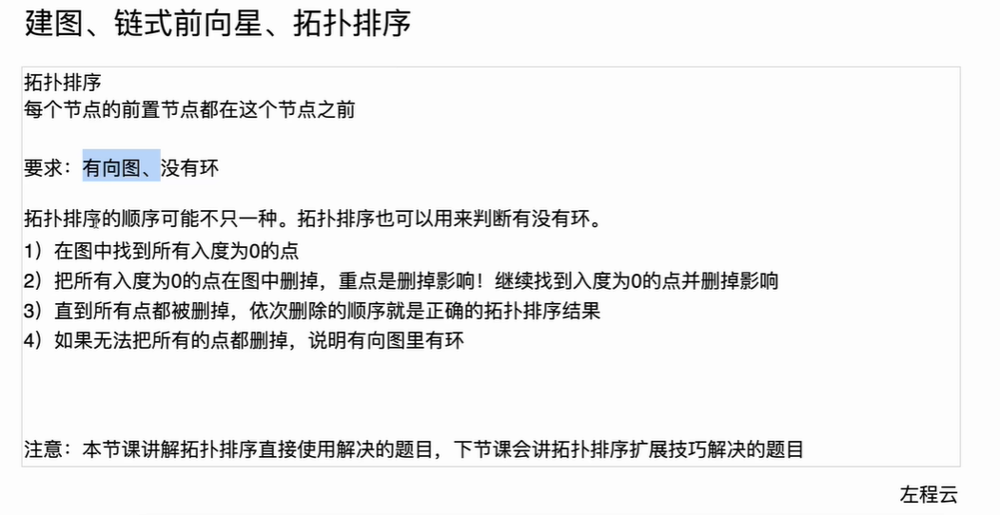

```Java
package class059;

import java.util.ArrayList;

// 拓扑排序模版（Leetcode）
// 邻接表建图（动态方式）
// 课程表II
// 现在你总共有 numCourses 门课需要选，记为 0 到 numCourses - 1
// 给你一个数组 prerequisites ，其中 prerequisites[i] = [ai, bi]
// 表示在选修课程 ai 前 必须 先选修 bi
// 例如，想要学习课程 0 ，你需要先完成课程 1 ，我们用一个匹配来表示：[0,1]
// 返回你为了学完所有课程所安排的学习顺序。可能会有多个正确的顺序
// 你只要返回 任意一种 就可以了。如果不可能完成所有课程，返回 一个空数组
// 测试链接 : https://leetcode.cn/problems/course-schedule-ii/
public class Code02_TopoSortDynamicLeetcode {

	public static int[] findOrder(int numCourses, int[][] prerequisites) {
		ArrayList<ArrayList<Integer>> graph = new ArrayList<>();
		// 0 ~ n-1
		for (int i = 0; i < numCourses; i++) {
			graph.add(new ArrayList<>());
		}
		// 入度表
		int[] indegree = new int[numCourses];
		for (int[] edge : prerequisites) {
			graph.get(edge[1]).add(edge[0]);
			indegree[edge[0]]++;
		}
		int[] queue = new int[numCourses];
		int l = 0;
		int r = 0;
		for (int i = 0; i < numCourses; i++) {
			if (indegree[i] == 0) {
				queue[r++] = i;
			}
		}
		int cnt = 0;
		while (l < r) {
			int cur = queue[l++];
			cnt++;
			for (int next : graph.get(cur)) {
				if (--indegree[next] == 0) {
					queue[r++] = next;
				}
			}
		}
		return cnt == numCourses ? queue : new int[0];
	}

}
```

# C++代码

这是一份非常经典的**Kahn算法（基于BFS的拓扑排序）**实现。Java版本利用了数组来模拟队列以提高性能。

下面我将其转换为C++代码，并为你补充相关的C++底层机制扩展，最后提供几个针对该算法的深层面试问题。

------

### 1. C++ 代码实现

在C++中，我们通常使用 `std::vector` 来替代 `ArrayList`。为了保持原Java代码的高性能特性（复用数组作为结果集和队列），我们在C++中也采用相同的策略。

C++

```C++
#include <vector>
#include <iostream>

using namespace std;

class Solution {
public:
    vector<int> findOrder(int numCourses, vector<vector<int>>& prerequisites) {
        // 1. 建图：使用 vector<vector<int>> 替代 ArrayList<ArrayList<Integer>>
        // 直接初始化 numCourses 个空 vector，避免循环 add
        vector<vector<int>> graph(numCourses);
        
        // 2. 入度表
        vector<int> indegree(numCourses, 0);
        
        // 3. 填充图和入度表
        // 使用 const auto& 引用避免拷贝，提升性能
        for (const auto& edge : prerequisites) {
            // edge[1] -> edge[0]
            graph[edge[1]].push_back(edge[0]);
            indegree[edge[0]]++;
        }
        
        // 4. 模拟队列 (同时也是最终的结果数组)
        // 初始化大小为 numCourses，避免 push_back 扩容带来的开销
        vector<int> queue(numCourses); 
        int l = 0; // 队头
        int r = 0; // 队尾
        
        // 5. 将所有入度为0的点入队
        for (int i = 0; i < numCourses; i++) {
            if (indegree[i] == 0) {
                queue[r++] = i;
            }
        }
        
        int cnt = 0;
        while (l < r) {
            int cur = queue[l++]; // 出队
            cnt++;
            
            // 遍历邻接点
            for (int next : graph[cur]) {
                if (--indegree[next] == 0) {
                    queue[r++] = next; // 入队
                }
            }
        }
        
        // 6. 检查是否包含所有课程 (如果不相等说明有环)
        if (cnt == numCourses) {
            return queue; // 这里的 queue 已经按照拓扑序排好了
        } else {
            return {}; // 返回空 vector
        }
    }
};
```

------

### 2. C++ 知识点扩展与对比

针对这段代码，Java与C++在底层处理上有几个关键的区别，理解这些对嵌入式或高性能开发非常有帮助：

#### A. 内存布局：`vector` vs `ArrayList` (核心区别)

- **Java (`ArrayList<Integer>`)**: 这是一个由于泛型擦除导致的“引用的数组”。`ArrayList` 存的是 `Integer` 对象的引用（指针），这导致内存是不连续的，CPU 缓存命中率（Cache Locality）较低。
- **C++ (`vector<int>`)**: 这里的 `int` 是直接存储在连续内存块中的。当你遍历 `graph[cur]` 时，C++ 能够极大利用 CPU 缓存，因此在图论算法中，C++ 通常比 Java 快得多。

#### B. 参数传递：引用 (`&`)

- **代码**: `vector<vector<int>>& prerequisites`
- **解释**: 在 C++ 中，如果参数不加 `&`，默认是**值传递**（即拷贝整个数组）。对于一个巨大的二维数组，这会造成严重的性能损耗。<span style="color:#FF0000; background:#00FF80; border:1px solid #FF00FF;">Java 默认传的是对象引用，而 C++ 需要显式加上 `&`（通常配合 `const` 保证数据不被修改）来达到不拷贝的效果。</span>

#### C. 返回值优化 (NRVO)

- **代码**: `return queue;`
- **疑虑**: 很多人担心返回 `vector` 会发生拷贝。
- **现实**: 现代 C++ 编译器都有 **NRVO (Named Return Value Optimization)**。编译器会直接在调用者的栈帧上构造 `queue`，或者使用 **移动语义 (Move Semantics)** 将内部指针的所有权转移出去，实际上几乎没有拷贝开销。

#### D. 内存预分配 (`reserve` vs `resize`)

- 代码中我们使用了构造函数 `vector<vector<int>> graph(numCourses)`。这相当于 `resize`，直接分配了内存并初始化对象。
- 如果使用 `.reserve()`，则只分配内存不创建对象。在图论建图中，预先分配好内存可以避免 `vector` 动态扩容（Reallocation）时的各种数据搬移开销。

------

### 3. 经典深度问题 (Interview Q&A)

以下是关于拓扑排序和该代码实现的深层问题，旨在考察对算法本质和系统设计的理解。

#### Q1: 什么时候拓扑排序的结果是**唯一**的？

> **回复**: 当且仅当在排序的每一步过程中，**队列中始终只有一个元素**（即 `l` 和 `r` 始终相差 1）时，拓扑排序结果唯一。这对应于图论中的“哈密顿路径”概念，意味着图中存在一条贯穿所有点的单一路径。

#### Q2: 这份代码使用的是 Kahn 算法 (BFS)，它和基于 DFS 的拓扑排序有什么本质区别？

> **回复**:
>
> - **Kahn (BFS)**: 贪心思想，依赖入度表。优点是容易检测环（最后 `cnt != n`），且容易改造为**并行计算**（入度为 0 的任务可以并行执行）。
> - **DFS**: 递归思想，依赖出栈顺序（逆序）。优点是代码极其简短，但在处理超深递归时可能爆栈，且不如 BFS 直观地支持并行任务调度。

#### Q3: 如果要求输出所有可能的拓扑排序结果，该如何修改代码？

> 回复: 此时不能用简单的 BFS 队列。需要使用回溯法 (Backtracking)。
>
> 在每一步递归中，尝试选取当前所有“入度为 0”的节点中的某一个，将其移除并更新邻居入度，递归下去，然后再回溯（恢复入度）。复杂度将变为指数级。

#### Q4: 为什么代码中不需要显式的 `visited` 数组？

> **回复**: 因为拓扑排序是有向无环图 (DAG) 的特有操作。依靠 `indegree` (入度) 减为 0 这一条件自然充当了访问控制。只有当所有前置依赖都被处理完（入度归零），节点才会被加入队列，这保证了每个节点只进队一次。

#### Q5: 在嵌入式或内核开发中，如果 `numCourses` 极大（例如 100万），这份代码有什么隐患？

> **回复**:
>
> 1. **栈溢出**: 虽然这里用了堆内存（vector），但如果是在栈上开大数组会崩。
> 2. **内存碎片**: `vector<vector<int>>` 是一个“vector 的 vector”。外层 vector 连续，但内层的每个 vector 都是独立分配的堆内存。如果图很稀疏，这会导致大量的微小内存分配，造成堆碎片化。

> - **优化方案**: 使用**链式前向星 (Forward Star)** 结构，利用几个一维静态数组 (`head`, `next`, `to`) 来模拟邻接表，内存极其紧凑且连续。


# 补充提问

## 提问1

```C++
 // 3. 填充图和入度表
    // 使用 const auto& 引用避免拷贝，提升性能
    for (const auto& edge : prerequisites) {
        // edge[1] -> edge[0]
        graph[edge[1]].push_back(edge[0]);
        indegree[edge[0]]++;
    }
```

<span style="color:#FF0000; background:#00FF80; border:1px solid #FF00FF;">这段代码中的 const auto& edge : prerequisites 我不是太懂，你能够给我详细解释下吗，还有这里应该是采用邻接表的方式来建图的吧，这里不应该是从 edge[0] ->  edge[1]，为什么是  graph[edge[1]].push_back(edge[0]) 呢，还有这里不应该是indegree[edge[1]] ++ 吗。</span>

这是一个非常敏锐的问题！实际上，**你的直觉是对的（通常 `[a, b]` 表示 `a->b`），但是这道题目（LeetCode 课程表）的定义反直觉**。

这也是这道题最容易出错的“陷阱”。

我把你的问题拆解为 **C++语法** 和 **算法逻辑** 两部分来详细解答。

------

### 第一部分：`const auto& edge : prerequisites` 是什么意思？

这行代码是 C++11 引入的 **Range-based for loop（基于范围的 for 循环）**，它的作用是遍历 `prerequisites` 这个二维数组。

我们可以把它拆开来看：

1. **`auto` (自动类型推导)**
   - <span style="color:#FF0000; border:1px solid #FF00FF;">`prerequisites` 的类型是 `vector<vector<int>>`。</span>
   - <span style="color:#FF0000; border:1px solid #FF00FF;">里面的每一个元素（即 `edge`）的类型自然就是 `vector<int>`。</span>
   - <span style="color:#FF0000; border:1px solid #FF00FF;">写 `auto` 让编译器自己去推导这个类型，省去了写 `vector<int>` 的麻烦。</span>
2. **`&` (引用/Reference)**
   - **这是<span style="background:#00FF80; color:#FF0000; border:1px solid #FF00FF;">性能的关键</span>！**
   - 如果不加 `&`（例如 `for (auto edge : ...)`），C++ 会把 `prerequisites` 里的每一个小数组（edge）**拷贝**一份拿给你用。如果数据量大，拷贝会非常慢且浪费内存。
   - 加上 `&`，表示我们直接使用原数组里的那个元素（取别名），**不产生任何拷贝**。这就像我们在Java里拿到了对象的引用。
3. **`const` (常量)**
   - 表示“只读”。
   - 我们<span style="color:#FF0000; background:#00FF80; border:1px solid #FF00FF;">在建图时只需要读取边的数据，不需要修改它。加上 `const` 可以防止你不小心修改了数据，同时编译器也能做一些特定的优化。</span>

总结：

这句话翻译成大白话就是：“<span style="color:#FF0000; background:#00FF80; border:1px solid #FF00FF;">请高效地（不拷贝）遍历这个数组，并且我保证只读不改。</span>”

------

### 第二部分：为什么方向反了？（重点）

你问：*“这里不应该是从 edge[0] -> edge[1] 吗？不应该是 indegree[edge[1]]++ 吗？”*

**回答：通常情况下是的，但这道题的定义是反的！**

#### 1. 仔细看题目定义

我们在代码注释或者原题中可以看到这句话：

> "prerequisites[i] = [ai, bi] ... 表示在选修课程 ai 前 **必须 先选修 bi**"

- **edge[0] (即 ai)**：是**后修**课（目标）。
- **edge[1] (即 bi)**：是**先修**课（基础）。

#### 2. 拓扑排序的边方向

在拓扑排序中，有向边的物理意义是：**依赖关系** 或 **时间流向**。

- 既然必须**先**学 `bi`，**后**学 `ai`。
- 那么事情发生的顺序流向是：`bi` ---> `ai`。
- 对应数组索引就是：`edge[1]` ---> `edge[0]`。

#### 3. 为什么代码这样写？

我们来看代码逻辑：

C++

```C++
// edge 是 [ai, bi] 即 [目标, 先修]
// 我们要建立的边是： 先修 -> 目标

graph[edge[1]].push_back(edge[0]); 
// 翻译：graph[先修课].添加邻居(目标课)
// 也就是从 edge[1] 指向了 edge[0]

indegree[edge[0]]++;
// 翻译：目标课的入度 + 1
// 因为有个箭头指向了 edge[0]，所以它的入度要增加
```

#### 举个例子方便理解

假设：

- 课程 0：数据结构（edge[0]）
- 课程 1：Java基础（edge[1]）
- 题目给的数据：`[0, 1]` （想学数据结构，先学Java）。

**建图逻辑：**

1. **流向**：Java基础 -> 数据结构 (`1 -> 0`)。
2. **邻接表**：`graph[1]` (Java的邻居列表) 里面要加入 `0`。 -> `graph[edge[1]].push_back(edge[0])`
3. **入度**：数据结构（0）是被指向的（有门槛），所以 `indegree[0]` 要加 1。 -> `indegree[edge[0]]++`

### 总结

你是对的，这是一份<span style="color:#FF0000; background:#00FF80; border:1px solid #FF00FF;">**邻接表**建图</span>。之所以你觉得反了，是因为**LeetCode 给出的数组格式 `[target, source]` 是反直觉的**。

在写拓扑排序时，一定要先确认题目的描述是 `[from, to]` 还是 `[to, from]`，这决定了你建图和统计入度的方向。


## 提问2（  return {}; // 返回空 vector）

<span style="color:#FF0000; background:#00FF80; border:1px solid #FF00FF; font-size:1.2em;">这里  return {};  // 返回空 vector 我有点看不太懂，为什么{}可以当成是一个空vector呢，它可以当成其他的空对象吗，比如空链表等其他的。</span>


这是一个非常好的C++基础问题！你触及到了 **Modern C++ (C++11及以后)** 中一个非常“优雅”的特性，叫做 **列表初始化 (List Initialization)** 和 **隐式类型推导**。

简单直接的回答是：<span style="color:#FF0000; background:#00FF80; border:1px solid #FF00FF;">**是的，`{}` 可以被当成空链表、空字符串、空Map，甚至是你自定义的空对象。** 它的具体含义完全取决于**上下文**（也就是你的函数要求返回什么类型）。</span>

我来详细拆解一下这个机制：

### 1. 为什么 `{}` 能代表 `vector`？

编译器是非常聪明的。当它读到 `return {};` 这一行时，它会按以下步骤思考：

1. **查看上下文**：<span style="background:#00FF80; border:1px solid #FF00FF;">编译器向上看函数的定义：</span>

   C++

   ```
   vector<int> findOrder(...) { ... }
   ```

   它发现这个函数的返回类型必须是 `vector<int>`。

2. **推导含义**：<span style="color:#FF0000; border:1px solid #FF00FF;">既然你要返回 `vector<int>`，而你给的是一个空的初始化列表 `{}`，编译器就明白你的意思是：“请调用 `vector<int>` 的**默认构造函数**，创建一个空对象给我。”</span>

3. 等价代码：

   return {};

   <span style="background:#00FF80; border:1px solid #FF00FF; font-family:serif; color:#FF0000;">完全等价于：</span>

   return vector<int>();

比喻：

这就像你去如果你去一家“专门卖苹果”的店（函数返回类型是苹果），你跟老板比了一个“空手”的手势（return {}），老板默认就知道你要买“一个标准的苹果”。如果你去的是“专门卖香蕉”的店，同样的“空手”手势，老板会给你“一个标准的香蕉”。

### 2. 它可以当成其他空对象吗？（比如链表）

**完全可以！** 只要那个类型支持“默认构造”（即不需要参数就能创建出来的对象），`{}` 就可以代表它。

看看下面这些例子，`{}` 在不同的函数里变身成了不同的东西：

#### A. 变身为空链表 (`std::list`)

C++

```c++
#include <list>
using namespace std;

list<int> getMyList() {
    // 这里的 {} 自动变成了 空链表
    return {}; 
}
```

#### B. 变身为空字符串 (`std::string`)

C++

```C++
#include <string>
using namespace std;

string getMessage() {
    // 这里的 {} 自动变成了 空字符串 ""
    return {}; 
}
```

#### C.<span style="color:#FF0000; background:#00FF80; border:1px solid #FF00FF;"> 变身为自定义的结构体/类</span>

甚至是是你自己写的类，只要它有默认构造函数，也可以这样用：

C++

```C++
struct Student {
    string name;
    int age;
};

Student getStudent() {
    // 这里的 {} 自动初始化一个Student对象
    // name是空, age是0 (这是聚合初始化的特性)
    return {}; 
}
```

#### D. <span style="color:#FF0000; background:#00FF80; border:1px solid #FF00FF;">甚至可以带有初始值</span>

如果 `{}` 里面有值，它就会尝试把这些值塞进去：

C++

```C++
vector<int> getNumbers() {
    return {1, 2, 3}; // 自动创建一个包含 [1, 2, 3] 的 vector
}
```

### 3. 注意：不能乱用的情况

虽然 `{}` 很万能，但它依赖于**明确的类型提示**。

<span style="color:#FF0000; background:#00FF80; border:1px solid #FF00FF;">如果编译器猜不出你要什么类型，就会报错。例如：</span>

C++

```
auto x = {}; // 错误！或者会被推导为 std::initializer_list，而不是 vector
```

总结：

在 findOrder 这个函数里，return {}; 之所以能工作，<span style="color:#FF0000; background:#00FF80; border:1px solid #FF00FF;">是因为函数签名已经规定了返回值必须是 vector。这是一种为了少写代码（Syntactic Sugar）而设计的现代 C++ 写法，显得更简洁、更专业。</span>


# 自己写代码

```C++
class Solution {
public:
    vector<int> findOrder(int numCourses, vector<vector<int>>& prerequisites) {
        
        vector<vector<int>> graph(numCourses);
        vector<int> indegree(numCourses,0);

        for(const auto &edge : prerequisites){
            graph[edge[1]].push_back(edge[0]);
            indegree[edge[1]]++;
        }

        vector<int> queue;
        int l=0,r=0;

        for(int i=0; i<numCourses; i++){
            if( indegree[i] == 0){
                queue.push_back(i);
                r++;
            }
        }

        vector<int> ans;
        int count=0;
        while(l<r){
            int cur = queue[l++];
            ans.push_back(cur);
            l++;
            count++;

            for(const auto &t : graph[cur]){
                indegree[t]--;
                if(indegree[t] == 0 ){
                    queue.push_back(t);
                    r++;
                }
            }
        }


        if(count == numCourses){
            return ans;
        } else {
            return {};
        }

    }
};
```

# 代码出错分析

你的代码整体结构是对的（采用了标准的 BFS 拓扑排序思路），但是有两个非常**关键的逻辑错误**，导致程序无法得出正确结果。

### 错误 1：入度统计对象搞反了

位置：建图的循环里。

现象：你增加了出发点（先修课）的入度，而不是目标点（后修课）的入度。

C++

```C++
// 你的代码：
for(const auto &edge : prerequisites){
    graph[edge[1]].push_back(edge[0]); // 边是 edge[1] -> edge[0]，正确
    indegree[edge[1]]++; // ❌ 错误！这里增加了【起点】的入度
}
```

**分析**：

- 边是从 `edge[1]` 指向 `edge[0]`。
- **入度（Indegree）** 是指有多少个箭头**指向**自己。
- 所以，应该是被指向的那个点（`edge[0]`）的入度增加。

**修改**：

C++

```
indegree[edge[0]]++; // ✅ 正确：增加终点的入度
```

------

### 错误 2：队列指针多加了一次（导致跳过元素）

位置：while 循环内部。

现象：你在取元素时已经让 l 自增了，紧接着又写了一句 l++。

C++

```C++
// 你的代码：
while(l<r){
    int cur = queue[l++]; // 这里 l 已经加 1 了
    ans.push_back(cur);
    l++; // ❌ 错误！这里再次加 1
    // ...
}
```

**分析**：

- `int cur = queue[l++];` 这行代码执行完，`l` 已经指向下一个元素了。
- 你后面紧跟着又写了一个 `l++`，导致 `l` 总共跳了 2 格。
- **后果**：你会**隔一个跳过一个**待处理的课程，导致很多课程没有被处理，最终 `count` 不会等于 `numCourses`，或者程序崩溃。

修改：

删除中间那行多余的 l++;。

------

### 修改后的完整代码

我帮你修正了这两个错误，并保留了你的代码风格：

C++

```C++
class Solution {
public:
    vector<int> findOrder(int numCourses, vector<vector<int>>& prerequisites) {
        
        vector<vector<int>> graph(numCourses);
        vector<int> indegree(numCourses, 0);

        for(const auto &edge : prerequisites){
            graph[edge[1]].push_back(edge[0]);
            // 【修改点1】被指向的点（edge[0]）入度增加
            indegree[edge[0]]++; 
        }

        vector<int> queue;
        // 建议：如果用 vector 模拟队列，最好预分配空间以避免扩容开销
        // queue.reserve(numCourses); 
        int l = 0, r = 0;

        for(int i = 0; i < numCourses; i++){
            if(indegree[i] == 0){
                queue.push_back(i);
                r++;
            }
        }

        // 这里其实 ans 可以直接用 queue 代替，不过为了逻辑清晰分开写也没问题
        vector<int> ans; 
        int count = 0;
        
        while(l < r){
            int cur = queue[l++]; // l 在这里自增一次即可
            ans.push_back(cur);
            // 【修改点2】删除了这里多余的 l++; 
            count++;

            for(const auto &t : graph[cur]){
                indegree[t]--;
                if(indegree[t] == 0){
                    queue.push_back(t);
                    r++;
                }
            }
        }

        if(count == numCourses){
            return ans;
        } else {
            return {};
        }
    }
};
```

### 补充建议

既然你用 `queue` 这个 vector 同时也充当了“结果数组”的作用（里面的元素顺序就是拓扑序），其实你完全不需要额外的 `ans` 数组。

- 最后的 `queue` 里面存的就是所有处理过的节点。
- 你可以直接判断 `if (queue.size() == numCourses) return queue;`。这样可以省一点内存。


# 补充提问

## 提问1（关于 { } 的简写）

  if(count == numCourses){

​      return ans;

​    } else {

​      return {};

​    }

<span style="color:#FF0000; background:#00FF80; border:1px solid #FF00FF;">这里可以简写为  “ return count == numCourse？ans：{}；” 吗？</span>

这是一个非常好的直觉！你想用**三元运算符**（Ternary Operator）来简化代码，这符合 C++ 追求简洁的风格。

直接回答：

<span style="color:#FF0000; border:1px solid #FF00FF;">不能直接写 return count == numCourses ? ans : {};，这会导致编译错误。</span>

------

### 1. 为什么会报错？

虽然 `return {};` 单独写是对的，但在三元运算符 `? :` 中，编译器需要先确定整个表达式的**共同类型**。

- **左边 (`ans`)**：类型是 `vector<int>`。
- **右边 (`{}`)**：<span style="color:#FF0000; background:#00FF80; border:1px solid #FF00FF;">这是一个“初始化列表”，它本身没有明确的类型</span>。

**编译器困惑了**：<span style="color:#FF0000; background:#00FF80; border:1px solid #FF00FF;">三元运算符要求冒号两边的类型必须兼容或者相同。编译器无法在表达式内部自动把 `{}` 推导为 `vector<int>`，因为它还没来得及看函数的返回类型要求。</span>

**报错信息通常是**：

> ```
> operands to ?: have different types 'std::vector<int>' and '<brace-enclosed initializer list>'
> ```

------

### 2. 如何修正？（让它编译通过）

如果你一定要用一行代码解决，必须**显式**告诉编译器右边也是一个 `vector<int>`：

C++

```
// ✅ 写法 1：显式构造空 vector
return count == numCourses ? ans : vector<int>{}; 

// ✅ 写法 2：显式构造（旧式写法）
return count == numCourses ? ans : vector<int>();
```

### 3. 更推荐的写法

虽然三元运算符很帅，但在这种情况下，为了代码的可读性和避免构造临时对象的开销，业界更常用的其实是**“卫语句”（Guard Clause）**风格，或者保留原来的 `if`。

**推荐写法 A（逻辑清晰）：**

C++

```C++
if (count != numCourses) {
    return {}; // 发现不对，立刻返回空，逻辑阻断
}
return ans; // 正常返回
```

推荐写法 B（利用三元 + 显式类型）：

如果你非常喜欢一行搞定，用我上面修正后的写法也是完全没问题的：

C++

```C++
return count == numCourses ? ans : vector<int>{};
```

### 总结

- `return {};` 是利用了**函数返回值的上下文**来推导类型。
- `? ans : {}` 是一个独立表达式，它内部**互不认识**，所以你需要显式写成 `vector<int>{}`。


## 提问2（关于pop_back）

<span style="color:#FF0000; background:#00FF80; border:1px solid #FF00FF; font-size:1.2em;">vector中的pop_back()中括号里面应该不需要元素吧。</span>

你是完全正确的！**`pop_back()` 的括号里不需要也不接受任何参数。**

### 1. 为什么不需要参数？

因为 `pop_back()` 的名字已经规定了它的动作：**“弹出（Pop）” + “尾部（Back）”**。

它的唯一作用就是：**简单粗暴地把 vector 最末尾的那个元素删掉**。既然锁定了是“最末尾”那一个，自然就不需要你告诉它“删哪一个”了。

### 2. 标准用法

C++

```C++
vector<int> v = {10, 20, 30};

v.pop_back(); // ✅ 正确：删掉 30
// v.pop_back(20); // ❌ 错误！编译报错，不能塞参数
```

### 3. 给你的一个重要提醒（坑点）

在很多其他语言（比如 Python 或 Java 的 Stack）中，pop 操作通常会**返回**被删掉的那个值。

**但在 C++ 中，`pop_back()` 的返回值是 `void`（空的）！**

如果你既想知道最后一个数是多少，又想把它删掉，在 C++ 里必须分**两步走**：

C++

```C++
vector<int> v = {10, 20, 30};

// 第一步：先看一眼最后是谁
int lastVal = v.back(); // lastVal = 30

// 第二步：再把它干掉
v.pop_back(); 

// ❌ 错误写法： int x = v.pop_back(); // 编译报错，因为 pop_back 不返回值
```

### 4. 扩展：如果你想删中间的元素怎么办？

如果你想删的不是最后一个，而是指定位置的元素，那就不叫 `pop` 了，而是叫 **`erase`**，这时候就需要参数了：

C++

```C++
// 删除第 0 个位置的元素 (迭代器参数)
v.erase(v.begin()); 
```

