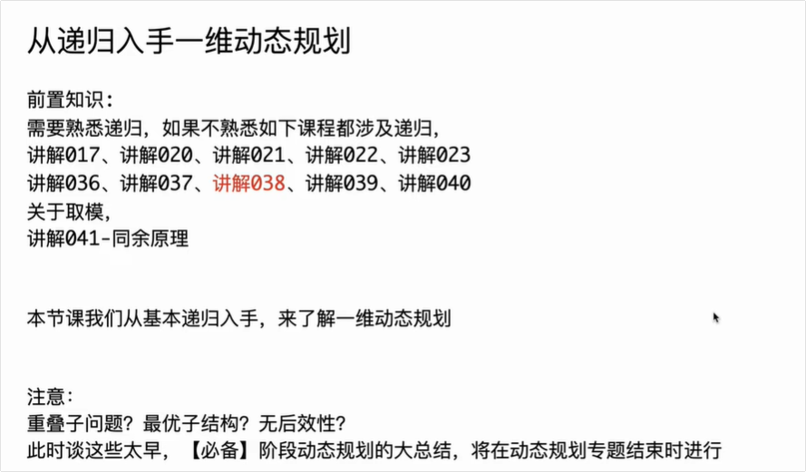
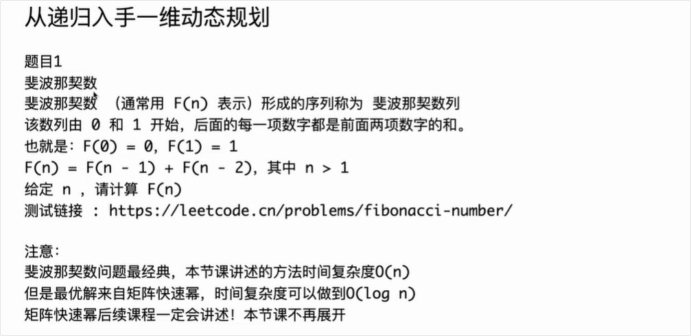
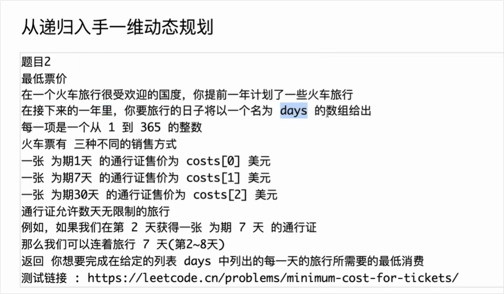

# 题目1（斐波那契数列问题）



## C++ 版本代码

C++

```C++

// 斐波那契数
// 斐波那契数 （通常用 F(n) 表示）形成的序列称为 斐波那契数列
// 该数列由 0 和 1 开始，后面的每一项数字都是前面两项数字的和。
// 也就是：F(0) = 0，F(1) = 1
// F(n) = F(n - 1) + F(n - 2)，其中 n > 1
// 给定 n ，请计算 F(n)
// 测试链接 : https://leetcode.cn/problems/fibonacci-number/
// 注意：最优解来自矩阵快速幂，时间复杂度可以做到O(log n)
// 后续课程一定会讲述！本节课不涉及！

#include <iostream>
#include <vector>

class Code01_FibonacciNumber {
public:
    // 方法1：暴力递归
    static int fib1(int n) {
        return f1(n);
    }

    static int f1(int i) {
        if (i == 0) {
            return 0;
        }
        if (i == 1) {
            return 1;
        }
        return f1(i - 1) + f1(i - 2);
    }

    // 方法2：记忆化搜索（从顶向下的动态规划）
    static int fib2(int n) {
        // 使用 vector 并初始化所有元素为 -1
        std::vector<int> dp(n + 1, -1);
        return f2(n, dp);
    }

    static int f2(int i, std::vector<int>& dp) {
        if (i == 0) {
            return 0;
        }
        if (i == 1) {
            return 1;
        }
        if (dp[i] != -1) {
            return dp[i];
        }
        int ans = f2(i - 1, dp) + f2(i - 2, dp);
        dp[i] = ans;
        return ans;
    }

    // 方法3：动态规划（从底向上）
    static int fib3(int n) {
        if (n == 0) {
            return 0;
        }
        if (n == 1) {
            return 1;
        }
        std::vector<int> dp(n + 1, 0);
        dp[1] = 1;
        for (int i = 2; i <= n; i++) {
            dp[i] = dp[i - 1] + dp[i - 2];
        }
        return dp[n];
    }

    // 方法4：空间压缩的动态规划（最优，时间 O(n)，空间 O(1)）
    static int fib4(int n) {
        if (n == 0) {
            return 0;
        }
        if (n == 1) {
            return 1;
        }
        int lastLast = 0, last = 1;
        for (int i = 2, cur; i <= n; i++) {
            cur = lastLast + last;
            lastLast = last;
            last = cur;
        }
        return last;
    }
};

// 测试示例
int main() {
    int n = 10;
    std::cout << "fib1(" << n << ") = " << Code01_FibonacciNumber::fib1(n) << std::endl;
    std::cout << "fib2(" << n << ") = " << Code01_FibonacciNumber::fib2(n) << std::endl;
    std::cout << "fib3(" << n << ") = " << Code01_FibonacciNumber::fib3(n) << std::endl;
    std::cout << "fib4(" << n << ") = " << Code01_FibonacciNumber::fib4(n) << std::endl;
    return 0;
}
```

### 主要差异说明

- **数组初始化**：Java 中使用 `int[] dp = new int[n + 1]` 结合 `Arrays.fill`，<span style="color:#FF0000; background:#00FF80; border:1px solid #FF00FF;">在 C++ 中直接使用 `std::vector<int> dp(n + 1, -1)` 即可完成创建和填充。</span>
- **数组传递**：在 `f2` 方法中，由于 C++ 是值传递，我们需要使用引用 `std::vector<int>& dp` 来确保我们在修改同一个数组。


## 对 从底到顶的动态规划 与 从顶到底的动态规划的理解 

<span style="color:#FF0000; background:#00FF80; border:1px solid #FF00FF;">从底到顶的动态规划与从顶到底的动态规划有什么不同呢，你能够给我详细解释下吗？</span>

动态规划（Dynamic Programming, 简称 DP）是解决复杂问题的一种核心算法思想。你正在看的视频正好是“从递归入手动态规划”，这非常切合你提的问题。

简单来说，动态规划解决问题的核心在于**“记住已经解决过的子问题答案”**，以避免重复计算。实现这一核心思想主要有两种路径：**自顶向下（Top-Down）**和 **自底向上（Bottom-Up）**。

下面为你详细拆解这两种方法的不同之处：

### 1. <span style="color:#FF0000; background:#00FF80; border:1px solid #FF00FF;">自顶向下：记忆化搜索</span> (Top-Down with Memoization)

顾名思义，这种方法是<span style="color:#FF0000; background:#00FF80; border:1px solid #FF00FF;">从最大的、最复杂的目标问题（“顶”）开始，一步步把它拆解成更小的子问题，直到拆解到无法再拆的“基本情况（Base Case）”。</span>

- **实现方式：** <span style="background:#00FF80; border:1px solid #FF00FF;">通常使用**递归（Recursion）**来实现</span>。为了避免重复计算相同的子问题，我们会<span style="color:#FF0000; background:#00FF80; border:1px solid #FF00FF;">引入一个“备忘录”（通常是数组或哈希表）</span>。每次计算出一个子问题的结果后，就把它存入备忘录；下次遇到同样的子问题时，直接从备忘录中取值。
- **形象比喻：** 就像公司老板（原问题）要一份年度报告，他把任务分配给部门经理（子问题），经理再分配给基层员工（更小的子问题）。基层员工做完后逐级向上汇报，最后老板汇总得到最终结果。
- **优点：** **思维自然：** 只要你<span style="color:#FF0000; background:#00FF80; border:1px solid #FF00FF;">写出了递归的状态转移方程</span>，<span style="color:#FF0000; background:#00FF80; border:1px solid #FF00FF;">加上备忘录就直接变成了自顶向下的 DP</span>，非常符合人类顺向拆解问题的直觉。
  - **按需计算：** 只计算那些对最终答案有用的子问题。如果某些状态在整个推导过程中根本遇不到，就不会去计算它。
- **缺点：** **系统开销大：** <span style="color:#FF0000; background:#00FF80; border:1px solid #FF00FF;">递归会占用函数调用栈（Call Stack）</span>。如果问题规模太大，递归太深，可能会导致额外的内存消耗，甚至引发“栈溢出（Stack Overflow）”。

### 2. <span style="color:#FF0000; background:#00FF80; border:1px solid #FF00FF;">自底向上：递推/表格法</span> (Bottom-Up with Tabulation)

这种方法正好相反，它<span style="color:#FF0000; background:#00FF80; border:1px solid #FF00FF;">直接从最简单、最小的“基本情况（Base Case）”（“底”）开始，一步步向上计算，直到推导出最终的目标问题。</span>

- **实现方式：** 通常<span style="color:#FF0000; border:1px solid #FF00FF; background:#00FF80;">使用**循环（Iteration/Loops）**来实现</span>。我们<span style="border:1px solid #FF00FF; background:#00FF80;">会建立一个 DP 表格（如一维或二维数组）</span>，从基础状态开始填表，后面的状态依靠前面已经填好的状态来计算。你截图里右侧代码区的 `for` 循环（比如斐波那契数列的推导）就是典型的自底向上写法。
- **形象比喻：** 就像盖一栋大楼。你不管大楼最终有多高，你先打地基（Base Case），然后建第一层、第二层……直到建到顶层（目标问题）。
- **优点：**  **执行效率高：** <span style="background:#00FF80; color:#FF0000;">纯粹的循环迭代，没有递归调用的额外时间和空间开销。</span>
  - **易于空间优化：** 因为计算当前状态通常只需要用到前几个状态（比如算第 $i$ 项只需要 $i-1$ 和 $i-2$），你可以通过“状态压缩”（只保留几个变量而不是整个数组）来极大地节省内存。截图代码中 `cur = lastLast + last;` 就是极佳的空间优化例子。
- **缺点：**  **全量计算：** 它不管子问题是否有用，都会按照设定的顺序把表格全部填满。有时可能会计算一些对于最终答案毫无帮助的冗余状态。
  - **寻找推导顺序较难：** 对于一些维度复杂的问题，确定怎样正确地“填表”（保证在计算当前格时，依赖的格子已经算过了）需要较强的逻辑思考。

------

### 总结对比表

| **特性**         | **自顶向下 (Top-Down)**                              | **自底向上 (Bottom-Up)**                           |
| ---------------- | ---------------------------------------------------- | -------------------------------------------------- |
| **核心机制**     | 递归 (Recursion) + 备忘录                            | 循环迭代 (Iteration) + DP 表格                     |
| **计算顺序**     | 大问题 $\rightarrow$ 小问题 $\rightarrow$ 返回大问题 | 小问题 $\rightarrow$ 逐步递推 $\rightarrow$ 大问题 |
| **是否会算废步** | 否（仅按需计算）                                     | 是（会计算表中所有状态）                           |
| **性能瓶颈**     | 递归调用带来的额外栈空间开销                         | 无额外函数调用开销，通常运行更快                   |
| **空间优化**     | 较难进行空间压缩                                     | 容易进行“状态压缩”（滚动数组等）                   |

**学习建议：** 就像视频标题所写的**“从递归入手”**一样，初学动态规划时，\**强烈建议先写出自顶向下的递归+记忆化\**。等你完全理解了状态是如何转移的，再将其翻译成**自底向上的 `for` 循环填表**，并尝试进行空间优化。这才是掌握 DP 最平滑的学习曲线。


# 题目2（最低票价问题）



## 最低票价问题解释

结合视频画面来看，左老师正在讲解的是一道非常经典的一维动态规划题目：**“最低票价” (LeetCode 983: Minimum Cost For Tickets)**。

这道题的核心难点在于：<span style="background:#00FF80;">**通行证的有效时间是连续的，而你的旅行日期是跳跃的。**</span>

我们来把左老师黑板上的图解拆解开，看看这道题到底在问什么，以及该怎么想。

### 1. 游戏规则是什么？

- **旅行计划：** 数组 `days` 代表<span style="color:#FF0000;">你一年中必须出门旅行的具体日子。</span>
  - 截图中板书的例子是：`[3, 4, 9, 20, 50...]` （第3天、第4天、第9天等必须出门）。
- **买票选项：** 火车站只卖三种票（就是截图右侧圈出来的部分）：
  1. **1天通行证**（假设卖 $a$ 元）：买完当天有效。
  2. **7天通行证**（假设卖 $b$ 元）：买完后，往后连着 7 天都有效。
  3. **30天通行证**（假设卖 $c$ 元）：买完后，往后连着 30 天都有效。
- **最终目标：** 用最少的钱，买够能覆盖你所有旅行计划的票。

------

### 2. 左老师黑板上的核心思路：如何做决策？

动态规划（尤其是从递归入手）的关键在于**“站在当下，展望未来”**。我们假设现在站在了你计划的第一天，也就是 **第 3 天**（数组的第 0 个位置）。

摆在你面前的有三个选择，你需要算一算哪种最划算：

- **选择一：买 1 天的票。**
  - **花销：** 花 $a$ 元。
  - **效果：** 只能覆盖第 3 天。
  - **下一步：** 你接下来需要解决的问题变成了：**从第 4 天（数组下标 1）开始，完成后续所有旅行的最少花费是多少？**
- **选择二：买 7 天的票（注意看截图里的箭头）。**
  - **花销：** 花 $b$ 元。
  - **效果：** 这张票能从第 3 天一直用到第 9 天。这意味着 `days` 数组里的第 3、第 4、第 9 天的旅行，这一张票全包了！
  - **下一步：** 你直接“跳”过了中间的日子，下一个需要发愁买票的日子直接变成了 **第 20 天**（数组下标 3）。所以你接下来的问题变成了：**从第 20 天开始，完成后续所有旅行的最少花费是多少？**
- **选择三：买 30 天的票。**
  - **花销：** 花 $c$ 元。
  - **效果：** 能从第 3 天一直用到第 32 天。
  - **下一步：** 第 3、4、9、20 天全被这张票包了。下一个需要买票的日子变成了 **第 50 天**（数组下标 4）。接下来的问题就是：**从第 50 天开始，完成后续所有旅行的最少花费是多少？**

### 3. 为什么这是一道动态规划问题？

我们<span style="background:#00FF80; border:1px solid #FF00FF; color:#FF0000;">在第 3 天的最优解，就是把上述三种选择的总花费算出来，**取其中最小的那一个**。</span>

如果你顺着这个逻辑推下去，就会发现我们经常会重复问同样的问题。比如，不管前面是怎么买票的，<span style="color:#FF0000; background:#00FF80; border:1px solid #FF00FF;">只要刚好某张票的有效期在第 19 天结束，我们接下来都要去计算“从第 20 天开始的最低票价”。</span>

既然问题重复出现，我们就可以用一个“备忘录”（也就是 DP 数组）把算过的日子记录下来，避免重复计算。这就是左老师这节课讲的**“从递归到一维动态规划”**的精髓。

你只需记住：<span style="color:#FF0000; background:#00FF80; border:1px solid #FF00FF;">**当前天的最低花费 = min(买1天票+后续花费, 买7天票+跳过被覆盖的日子的后续花费, 买30天票+跳过被覆盖的日子的后续花费)**。</span>


## 可变参数的可能性就是返回值的可能性（重点）

这句话是左程云（左神）在讲解动态规划时非常核心、也是极其精辟的一句总结。

要彻底弄懂这句话，我们需要把视角切换到**“记忆化搜索（备忘录）”**和**“设计 DP 表格”**的角度。

简单来说，这句话的潜台词是：**“<span style="color:#FF0000; background:#00FF80; border:1px solid #FF00FF;">递归函数里那些会变化的参数，决定了你需要准备多大的本子（缓存表）来记录答案。</span>”**

我们把这句话拆解开来详细理解：

### 1. 什么是“可变参数的可能性”？

在写递归函数时，通常会有几个参数。比如在刚刚那个“最低票价”的问题中，我们假设写了一个递归函数：

```C++
int process(int[] days, int[] costs, int i)
```

- **固定参数：** `days` 和 `costs` 数组从头到尾都不会变，它们只是提供信息的。
- **可变参数：** `i`（当前来到了 `days` 数组的第几天）。这个 `i` 随着我们买不同的票，会不断跳跃、变化（比如从 0 变成 1，或者从 0 直接跳到 3）。

**“可能性”就是指这个可变参数一共有多少种取值。** 如果 `days` 数组的长度是 $N$，那么可变参数 `i` 的取值范围就是 $0$ 到 $N-1$（外加越界时的特殊情况）。所以，“可变参数的可能性”就是 $N$ 种。

### 2. 什么是“返回值的可能性”？

由于我们<span style="color:#FF0000; background:#00FF80; border:1px solid #FF00FF;">在做动态规划时，面对的都是**“无后效性”**的问题（即：只要现在的状态确定了，不管以前是怎么走过来的，未来的结果只和现在有关）。</span>

这意味着：**只要输入的“可变参数”是一样的，不管算多少次，递归函数算出来的“返回值”绝对是一模一样的。**

- 算 `process(..., 3)`，返回值是 50。
- 过一会儿再调 `process(..., 3)`，返回值肯定还是 50。

既然相同的参数对应相同的返回值，那么**<span style="background:#00FF80;">我们要计算的不同“返回值”的数量，最多也就是“可变参数取值”的数量</span>。**

### 3. 这句话为什么重要？它能帮我们做什么？

这句话其实是教我们**如何将递归改写成动态规划表（DP表）**的核心口诀：

- **决定 DP 表的维度：**
  - <span style="background:#00FF80;">如果递归函数里只有 **1 个**可变参数（比如 `i`），那么返回值的可能性就是一维的，你只需要画一个 **一维数组** 就能把所有算过的返回值存下来。这就是为什么你在看“一维动态规划”。</span>
  - <span style="background:#00FF80;">如果递归函数里有 **2 个**可变参数（比如 `i` 和 `j`），那么返回值的可能性就是这两个参数组合的可能性。你就需要准备一个 **二维数组**（矩阵）来存答案。</span>
- **决定 DP 表的大小（空间复杂度）：**
  - 如果参数 `i` 的范围是 $0$ 到 $100$，那么你就需要建一个大小为 $101$ 的数组。这就是告诉了你开辟内存空间的依据。
- **决定算法的极限操作次数（时间复杂度）：**
  - 因为有了备忘录，每一种“参数的可能性”我们只算一次。所以，<span style="background:#00FF80;">**可变参数组合的总数，基本上就是你这个 DP 算法的时间复杂度。** </span>如果 `i` 有 $N$ 种可能，每个状态内部有 3 种选择，那时间复杂度就是 $O(N)$。

### 总结

当你听到“可变参数的可能性就是返回值的可能性”时，脑海中可以直接把它翻译成：

**“<span style="background:#00FF80;">函数有几个变化的参数，我就建几维的表格；参数能变出多少种花样，我就把表格建多大；表格里的每一个格子，装的就是对应参数算出来的唯一返回值。</span>”** 想通了这一层，你以后无论遇到多复杂的递归，只要把眼光死死盯住“哪几个参数在变”，就能瞬间知道怎么去建那个 DP 表格了。


# 递归返回值 与 怎么暴力递归怎么尝试 对应动态规划表

<span style="color:#FF0000; background:#00FF80; border:1px solid #FF00FF;">动态规划表唯一的目的就是替代了递归的返回值，做了一个表结构；暴力递归里怎么尝试的转移方程就怎么填，这两句话怎么理解。</span>

这两句话同样是左程云老师讲解动态规划时的“核心心法”，它们揭示了**暴力递归**和**动态规划（递推填表）**之间的一一对应关系。

简单来说，这两句话告诉你一个秘密：**真正的动态规划根本不需要凭空去想，它完全是从暴力递归“按部就班”翻译过来的。**

我们结合你当前截图中展示的自底向上的代码（`mincostTickets3`），来深度解析这两句话：

### 1. “<span style="background:#00FF80; color:#FF0000;">动态规划表唯一的目的就是替代了递归的返回值，做了一个表结构</span>”

这句话解释了 **“什么是 DP 表”**。

- **在暴力递归中：** 我们定义了一个函数（比如叫 `process(i)`），代表“从第 $i$ 天开始到结束的最小花费”。每次我们需要这个结果，程序就会完整地跑一遍函数去计算，最后给你一个**返回值**。
- **在动态规划中：** 我们发现这个 `process(i)` 总是被重复调用。为了不干“重复造轮子”的傻事，我们建了一个数组（表结构），比如叫 `dp`。
- **核心替换：** <span style="background:#00FF80;">这个 `dp` 数组里的第 $i$ 个格子 `dp[i]`，里面装的数字，**完完全全、一毫不差就是原本 `process(i)` 辛辛苦苦算出来的返回值。**</span>

**理解关键：** 把函数调用 `process(i)` 在脑海中直接等价替换成查表 `dp[i]`。表结构没有魔法，它仅仅是一个**“答案缓存库”**。

### 2. “暴力递归里怎么尝试的转移方程就怎么填”

这句话解释了 **“怎么推导 DP 的填表逻辑”**。

很多初学者觉得动态规划的“状态转移方程”像天书，不知道怎么想出来的。左老师这句话的意思是：**<span style="background:#00FF80;">只要你写出了暴力递归的分支怎么走，你的 DP 方程就已经写好了，直接“抄”过来就行。</span>**

我们对照你截图中的代码来看看：

- **在之前的暴力递归思路里（怎么尝试的）：**

  你站在第 $i$ 天，有三种买票方案（尝试）。你买了一张票，花了 `costs[k]` 块钱，这张票能让你一直用到第 $j-1$ 天。那么接下来的花费就是去问“从第 $j$ 天开始的最小花费是多少？”（也就是调用 `process(j)`）。

  递归里的代码大概长这样：

  `当前花费 = costs[k] + process(j)`

  然后你要在三种方案里取最小值。

- **在现在的动态规划里（怎么填的）：**

  既然<span style="color:#FF0000; background:#00FF80;">我们已经知道了 `process(j)` 的返回值其实就是存放在 `dp[j]` 里，</span>那你直接把上面那句递归代码里的函数调用替换掉，就变成了填表的转移方程！

  你看截图中第 94 行的代码：

  `dp[i] = Math.min(dp[i], costs[k] + dp[j]);`

  这不就是完美对应了**“三种买票钱 + 后续天数在表里的现成答案”**吗？

### 总结：打通任督二脉

这两句话连起来，其实是一套行之有效的解题模板：

1. **第一步（怎么尝试）：** 先别管效率，用最直观的暴力递归把逻辑写出来。你想明白当前这一步有哪几种选择，做了选择后，剩下的任务扔给递归函数 `process(新状态)`。
2. **第二步（建表替代）：** 看看递归函数里有几个可变参数（比如只有一个 $i$），就建一个一维数组 `dp[]`。
3. **第三步（怎么填）：** 把暴力递归代码里的 `process(某状态)` 强行替换成 `dp[某状态]`。递归代码里是加减乘除还是求最大最小值，填表的时候照猫画虎，一模一样搬过来。

所以，动态规划并不是一种全新的思维，它仅仅是**“加了缓存的、被拉直了的暴力递归”**而已。
