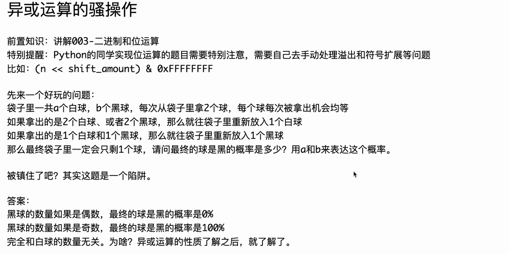
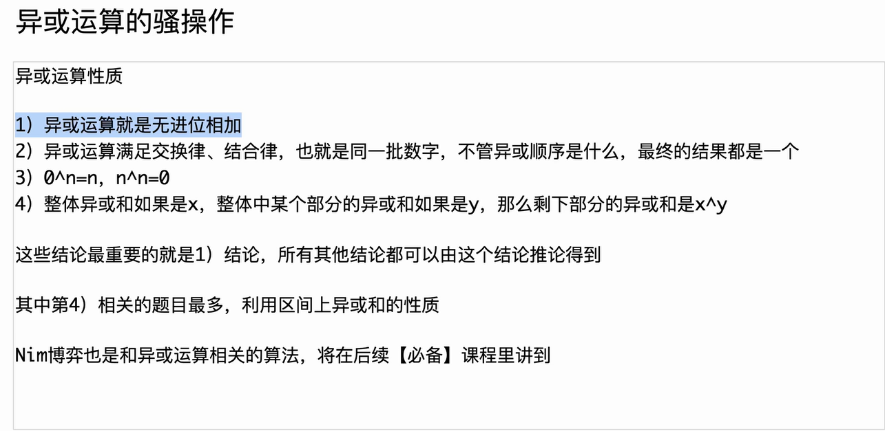
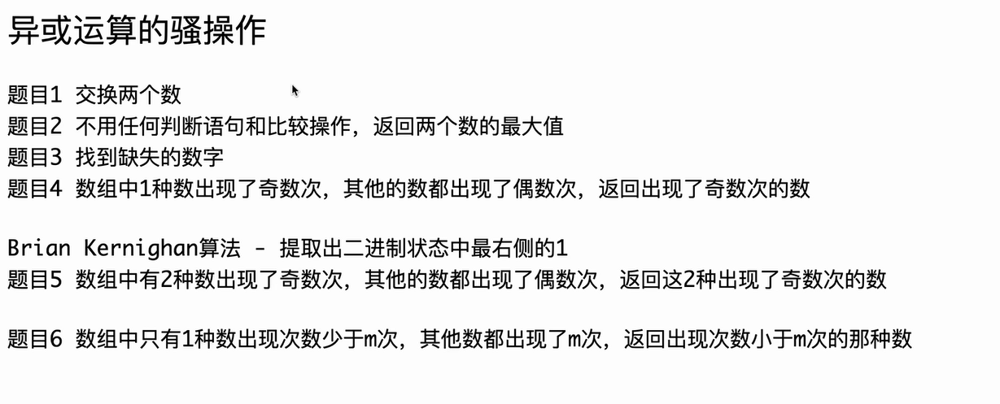
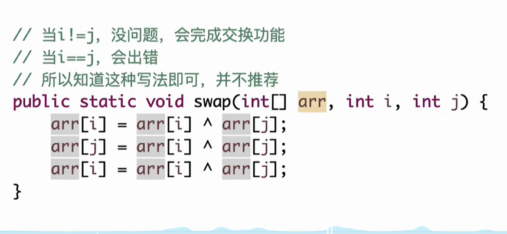
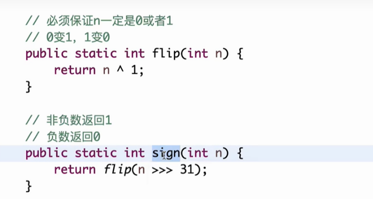

# 利用异或运算就是无进位相加来理解上述中提到的黑球白球问题

# gemini回答

这是一个非常经典且有趣的思维题目！用“**异或运算（XOR）**”以及你提到的“**无进位相加**”的概念来理解，这道题会从一个复杂的概率题瞬间变成一道简单的逻辑题。

我们一步步来拆解。

### 1. 核心映射：<span style="color:#FF0000; background:#00FF80; border:1px solid #FF00FF;">把球变成数字</span>

首先，我们需要给黑球和白球赋予“数字意义”。根据异或的性质，我们设定：

- **白球 = 0**
- **黑球 = 1**

为什么这样设？我们来看看题目中的规则是否符合**异或（无进位相加）**的逻辑。

### 2. 验证规则：这就是异或运算

异或运算（$\oplus$）的口诀是：相同为0，不同为1。

同时，你也提到了它是二进制下的无进位加法：

- $0 + 0 = 0$
- $0 + 1 = 1$
- $1 + 1 = 0$ （注意：这里本该进位变成10，但因为是无进位，所以结果是0）

现在我们把这个逻辑套用到从袋子里拿球的规则上：

| **拿出的球 (输入)** | **对应的数字运算 (无进位相加)** | **放回的球 (结果)** | **验证** |
| ------------------- | ------------------------------- | ------------------- | -------- |
| **2个白球**         | $0 + 0 = 0$                     | **放回1个白球**     | ✅ 匹配   |
| **1白 1黑**         | $0 + 1 = 1$                     | **放回1个黑球**     | ✅ 匹配   |
| **2个黑球**         | $1 + 1 = 0$                     | **放回1个白球**     | ✅ 匹配   |

结论：

<span style="color:#FF0000; background:#00FF80; border:1px solid #FF00FF;">袋子里发生的每一次操作，实际上就是把拿出来的两个数字进行异或运算（无进位相加），然后把计算结果放回去。</span>

### 3. <span style="color:#FF0000; border:1px solid #FF00FF;">视角的转换：袋子就是一个长算式</span>

<span style="color:#FF0000; border:1px solid #FF00FF;">既然每次操作都是拿两个数出来做异或，再把结果放回去，那么这利用了异或运算的一个超级重要的性质：**结合律**。</span>

也就是说，<span style="background:#00FF80;">不管你先算哪两个数，后算哪两个数，只要参与运算的数字集合不变，**最终的总结果是不变的**。</span>

我们可以把袋子里所有的球看作一长串连在一起的异或算式：


$$\text{袋子里的总值} = (\text{白球}_1 \oplus \text{白球}_2 \dots) \oplus (\text{黑球}_1 \oplus \text{黑球}_2 \dots)$$

因为白球是 0，黑球是 1：


$$\text{袋子里的总值} = (0 \oplus 0 \dots) \oplus (1 \oplus 1 \dots)$$

关键点来了：

<span style="border:1px solid #FF00FF;">无论你中间怎么拿球、怎么放回，其实只是在改变运算的顺序（比如先把前两个算出来变成一个新球），整个袋子所有球异或起来的总和（Total Sum）是永远不变的！</span>

### 4. 终极推导：黑球的命运

现在我们只需要看初始状态的总和是多少，就知道最后剩下的那个球（也就是最后的结果）是多少。

- 关于白球（0）：

  在异或运算中，$X \oplus 0 = X$。<span style="background:#00FF80;">0 是“透明”的，不管有多少个白球（0），它们都不影响总和。白球的数量 $a$ 完全不重要。</span>

- 关于黑球（1）：

  <span style="background:#00FF80;">总和完全取决于黑球的数量。</span>

  - $1 \oplus 1 = 0$ （两个黑球抵消了，变成白球）
  - $1 \oplus 1 \oplus 1 = 1$
  - $1 \oplus 1 \oplus 1 \oplus 1 = 0$

这就是“无进位相加”的精髓：

每一次遇到“2个黑球”（$1+1$），它们就会变成“0”（白球）。也就是黑球只能成对消失。

- 如果黑球数量 $b$ 是 **偶数**：所有的 1 都能两两配对抵消，$1 \oplus 1 \dots \oplus 1 = 0$。
  - **结果：最后剩的一定是 0（白球）。**
- 如果黑球数量 $b$ 是 **奇数**：两两抵消后，永远会剩下一个孤零零的 1，$1 \oplus 1 \dots \oplus 1 = 1$。
  - **结果：最后剩的一定是 1（黑球）。**

### 总结

这个问题看似是概率题，其实是**奇偶校验（Parity Check）**问题。

用“无进位相加”理解就是：

两个黑球（1+1）相遇会变成白球（0），这意味着黑球只能两个两个地减少。所以，黑球数量的奇偶性永远不会变。

- 一开始是奇数个黑球 $\rightarrow$ 最后剩 1 个黑球。
- 一开始是偶数个黑球 $\rightarrow$ 最后剩 0 个黑球（也就是剩个白球）。


# claude回答

这是一个非常精彩的洞察！让我帮你从异或运算的角度深入理解这个看似复杂的概率问题。

## 建立映射关系

首先，让我们建立一个简单的对应关系：把白球看作数字0，黑球看作数字1。现在我们来看看每次操作实际上在做什么。

当我们拿出两个球并按规则放回时：

- 拿出2个白球（0和0），放回1个白球（0）：这就是 0 ⊕ 0 = 0
- 拿出2个黑球（1和1），放回1个白球（0）：这就是 1 ⊕ 1 = 0
- 拿出1白1黑（0和1），放回1个黑球（1）：这就是 0 ⊕ 1 = 1

你发现了吗？每次操作恰好就是对两个球进行异或运算！这不是巧合，而是问题设计的本质。

## 异或运算的神奇性质

异或运算有几个关键特性，正是这些特性让问题变得简单：

**交换律**：a ⊕ b = b ⊕ a（顺序不重要） **结合律**：(a ⊕ b) ⊕ c = a ⊕ (b ⊕ c)（分组不重要）

这意味着什么呢？<span style="border:1px solid #FF00FF;">无论你以什么顺序拿球，无论你怎么组合，最终的结果都是一样的。就好比你计算一堆数字的异或，不管你先算哪两个，最后的答案都相同。</span>

## 核心洞察

既然操作顺序不影响结果，我们可以直接计算：把袋子里所有球都做异或运算。

初始状态是a个白球（0）和b个黑球（1），最终结果就是：

0 ⊕ 0 ⊕ ... ⊕ 0（a个0） ⊕ 1 ⊕ 1 ⊕ ... ⊕ 1（b个1）

现在运用<span style="color:#FF0000; background:#00FF80; border:1px solid #FF00FF;">异或的另一个重要性质：**自反性** —— 任何数和自己异或都等于0。</span>

- a个0异或在一起，结果永远是0（因为0 ⊕ 0 = 0）
- b个1异或在一起：
  - 如果b是偶数，每两个1配对，1 ⊕ 1 = 0，最终结果是0
  - 如果b是奇数，会剩下一个1，最终结果是1

所以最终答案是：**0 ⊕ (b个1的异或结果)**

这就等于：

- b为偶数时 → 最终是0（白球）→ 概率0%
- b为奇数时 → 最终是1（黑球）→ 概率100%

## 为什么和白球数量无关？

从"无进位相加"的角度理解：0在异或运算中是恒等元，就像普通加法中的0一样。无论你有多少个0，它们对最终的异或结果没有任何影响。这就是为什么白球的数量完全不重要。

这个问题的美妙之处在于：一个看起来充满随机性的概率问题，通过异或运算的视角，变成了一个完全确定的结果。黑球数量的奇偶性从一开始就决定了最终的结果，所有的随机抽取过程都不会改变这个"异或和"。

你理解了吗？这就是为什么"被镇住"的陷阱其实是一个优雅的数学真相！


# chatgpt回答

可以的，而且**这个题目本质上就是一个“异或不变量”的经典例子**。
我一步一步从 **“异或 = 无进位相加（mod 2 加法）”** 的角度，帮你把它彻底想通。

------

## 一、先把问题“翻译”成异或语言

### 1️⃣ 用 0 / 1 表示球的颜色

我们先做一个**关键建模**：

- 白球 → `0`
- 黑球 → `1`

为什么这么做？
因为 **异或 XOR 正好对应 mod 2 加法**：

| a    | b    | a ⊕ b |
| ---- | ---- | ----- |
| 0    | 0    | 0     |
| 1    | 1    | 0     |
| 0    | 1    | 1     |
| 1    | 0    | 1     |

你马上会发现：
👉 **这和题目“放回球的规则一模一样”**

------

## 二、题目规则 = 一次异或运算

题目说：

> 每次从袋子里拿 2 个球，然后放回 1 个球

我们用 0/1 看每种情况：

### 情况 1：两个白球

```
0 ⊕ 0 = 0
```

→ 放回 1 个白球 ✅

### 情况 2：两个黑球

```
1 ⊕ 1 = 0
```

→ 放回 1 个白球 ✅

### 情况 3：一黑一白

```
1 ⊕ 0 = 1
```

→ 放回 1 个黑球 ✅

📌 **结论：**

> “拿 2 个球 → 放回 1 个球”的颜色
> **等价于：这两个球做一次 XOR**

------

## 三、整个过程到底在“算什么”？

设最开始袋子里有：

- a 个白球（0）
- b 个黑球（1）

那你袋子里所有球“异或起来”就是：

```
0 ⊕ 0 ⊕ ... ⊕ 0   （a 次）
⊕
1 ⊕ 1 ⊕ ... ⊕ 1   （b 次）
```

因为：

- `0 ⊕ 0 = 0`（白球怎么异或都不影响）
- `1 ⊕ 1 = 0`

所以最终结果是：

```
= b mod 2
```

也就是：

- b 是 **偶数** → 总 XOR = 0
- b 是 **奇数** → 总 XOR = 1

------

## 四、关键思想：**异或不变量**

现在是最重要的一步。

### ❗ 每一次操作，本质是什么？

你每次：

- 拿走两个球（XOR 掉）
- 放回一个球（XOR 回去）

但注意：

> **放回去的球 = 被拿走两个球的 XOR**

也就是说：

```
总 XOR = 原来的 XOR
```

### 📌 结论（不变量）

👉 **袋子里所有球的“异或总和”在整个过程中永远不变**

------

## 五、为什么最后只剩 1 个球？

因为每次：

- 球的总数：`n → n - 1`

所以一定会剩下 **1 个球**。

------

## 六、最后那 1 个球是谁？

当只剩 1 个球时：

- 如果它是白球 → XOR = 0
- 如果它是黑球 → XOR = 1

而我们前面已经证明：

> **最终 XOR = 初始黑球数量 b 的奇偶性**

所以：

| 初始黑球数 b | 最终 XOR | 剩下的球 |
| ------------ | -------- | -------- |
| 偶数         | 0        | 白球     |
| 奇数         | 1        | 黑球     |

🎯 **概率根本不存在**

- 不是随机
- 和 a（白球数量）完全无关
- 结果是 **确定的**

------

## 七、为什么说这是个“陷阱题”？

因为它伪装成了：

- 随机
- 抽球
- 概率问题

但实际上它是一个：

> **异或不变量问题（mod 2 代数）**

------

## 八、用一句话把这个题“刻进脑子里”

> **异或就是无进位加法（mod 2），
> 每一步都在做 XOR，
> 所以“黑球的奇偶性”从头到尾都不会变。**

------

如果你愿意，我也可以帮你：

- 把这个问题写成 **Python 位运算代码**
- 或推广到：
  👉 “三种颜色 / k 个球 / 不同替换规则”的异或模型

你现在这个理解，其实已经非常接近 **算法 / 不变量 / 信息守恒** 的核心思想了。


# 异或运算的骚操作



<span style="font-weight:bold; color:#FF0000; background:#00FF80; border:1px solid #FF00FF;">补充：关于异或运算的自反性质，一个数与自己异或为0，比如 0 与 0 异或为0，1 与 1 异或 为1。</span>


# 关于异或运算的题目




# 题目1（交换两个数）




## C++代码实现

```C++
void swap(vector<int> &arr,int i,int j){
    arr[i] = arr[i] ^ arr[j];
    arr[j] = arr[i] ^ arr[j];
    arr[i] = arr[i] ^ arr[j];
 }
```


# 题目2（不用任何判断语句和比较操作，返回两个数的最大值）

## 提问 1（C++中有没有无符号右移操作）



<span style="color:#FF0000; background:#00FF80; border:1px solid #FF00FF; font-size:1.2em;">C++中有这种无符号右移吗，如果有的话也是和java一样都是>>>吗，我不是太懂，你能够给我详细解释下吗？</span>

这是一个非常棒的问题，也是 Java 转 C++ 选手最容易“踩坑”的地方之一。

直接回答你的问题：<span style="color:#FF0000; border:1px solid #FF00FF;">**C++ 中没有 `>>>` 运算符。**</span>

但是，C++ 完全可以实现相同的效果，只是实现机制和 Java 的逻辑不太一样。<span style="color:#FF0000; border:1px solid #FF00FF;">Java 是通过**不同的运算符**来区分逻辑右移和算术右移，而 C++ 是通过**变量的类型**（有符号 vs 无符号）来区分的。</span>

以下是详细解释：

### 1. 核心区别

- **Java (运算符决定):**
  - `>>` (带符号右移/算术右移)：<span style="background:#00FF80;">高位补符号位</span>（正数补0，负数补1）。
  - `>>>` (无符号右移/逻辑右移)：**不管正负，<span style="background:#00FF80;">高位一律补0</span>。**
- **C++ (<span style="color:#FF0000; background:#00FF80; border:1px solid #FF00FF;">数据类型决定</span>):**
  - <span style="background:#00FF80;">C++ 只有一个 `>>` 运算符。</span>
  - 如果变量是 **`signed` (<span style="color:#FF0000;">有符号数</span>)**：`>>` 执行的是**<span style="background:#00FF80; color:#FF0000;">算术右移</span>**（保留符号位，类似 Java 的 `>>`）。
  - 如果变量是 **`unsigned` (<span style="color:#FF0000;">无符号数</span>)**：`>>` 执行的是**<span style="background:#00FF80; color:#FF0000;">逻辑右移</span>**（高位补0，等同于 Java 的 `>>>`）。

### 2. 如何在 C++ 中实现 Java 的 `>>>`

既然<span style="color:#FF0000; border:1px solid #FF00FF;"> C++ 的 `unsigned` 类型右移时会自动补 0，那么要在 C++ 中实现 Java 的 `n >>> 31`，你需要**先把变量强制转换为无符号类型**，然后再移位。</span>

#### 代码对比

**Java 代码 (你图片中的逻辑):**

Java

```C++
// Java: 无论 n 是正数还是负数，高位都补 0
return flip(n >>> 31); 
```

**C++ 等效代码:**

C++

```C++
// C++: 必须先转成 unsigned，否则负数移位会补 1
// 这里的 flip 函数假设你已经定义好了
return flip((unsigned int)n >> 31); 
```

或者使用 C++ 更规范的类型转换写法：

C++

```C++
return flip(static_cast<unsigned int>(n) >> 31);
```

### 3. 为什么要这样转？（图解）

假设 `n` 是一个 32 位的负数，比如 `INT_MIN` (二进制最高位是 1)。

**场景：我们想把符号位移到最右边**

- **如果直接用 `n >> 31` (C++ 有符号右移):**
  - 原始：`1000...000`
  - 右移：`1111...111` (因为是负数，高位全部补了 1)
  - 结果：**-1** (十进制)
  - *这不符合 `sign` 函数想要提取 0 或 1 的目的。*
- **如果用 `(unsigned int)n >> 31` (模拟 `>>>`):**
  - 原始：`1000...000` (被视为无符号很大一个正数)
  - 右移：`0000...001` (无符号移位，高位补 0)
  - 结果：**1** (十进制)
  - *这就成功提取出了符号位！*

### 4. 针对你图片代码的完整 C++ 翻译

你可以直接使用这段代码替换图片中的 Java 代码：

C++

```C++
#include <iostream>

// 辅助函数：对应图片中的 flip
// 0变1，1变0
int flip(int n) {
    return n ^ 1;
}

// 主函数：对应图片中的 sign
// 非负数返回 1，负数返回 0
int sign(int n) {
    // 【关键点】
    // Java 的 n >>> 31 等价于 C++ 的 ((unsigned int)n) >> 31
    // 这样保证了即使 n 是负数，右移时高位也是补 0
    return flip(((unsigned int)n) >> 31);
}

int main() {
    int a = 100;
    int b = -5;
    
    // 测试
    std::cout << "Sign of " << a << " is: " << sign(a) << std::endl; // 输出 1
    std::cout << "Sign of " << b << " is: " << sign(b) << std::endl; // 输出 0
    
    return 0;
}
```

### 总结

在 C++ 做算法题（尤其是位运算题目）时，<span style="color:#FF0000; background:#00FF80; border:1px solid #FF00FF;">如果题目涉及到“高位补0”或者需要处理负数的二进制位，**请务必记得把 `int` 强转为 `unsigned int` 再进行移位操作**。</span>

你是否需要我把你提供的这三张图（架构图、概率题、代码）里的所有逻辑整合一下，写一个 C++ 版本的完整笔记给你？


## java代码完整实现

```JAVA
package class030;

// 不用任何判断语句和比较操作，返回两个数的最大值
// 测试链接 : https://www.nowcoder.com/practice/d2707eaf98124f1e8f1d9c18ad487f76
public class Code02_GetMaxWithoutJudge {

	// 必须保证n一定是0或者1
	// 0变1，1变0
	public static int flip(int n) {
		return n ^ 1;
	}

	// 非负数返回1
	// 负数返回0
	public static int sign(int n) {
		return flip(n >>> 31);
	}

	// 有溢出风险的实现
	public static int getMax1(int a, int b) {
		int c = a - b;
		// c非负，returnA -> 1
		// c非负，returnB -> 0
		// c负数，returnA -> 0
		// c负数，returnB -> 1
		int returnA = sign(c);
		int returnB = flip(returnA);
		return a * returnA + b * returnB;
	}

	// 没有任何问题的实现
	public static int getMax2(int a, int b) {
		// c可能是溢出的
		int c = a - b;
		// a的符号
		int sa = sign(a);
		// b的符号
		int sb = sign(b);
		// c的符号
		int sc = sign(c);
		// 判断A和B，符号是不是不一样，如果不一样diffAB=1，如果一样diffAB=0
		int diffAB = sa ^ sb;
		// 判断A和B，符号是不是一样，如果一样sameAB=1，如果不一样sameAB=0
		int sameAB = flip(diffAB);
		int returnA = diffAB * sa + sameAB * sc;
		int returnB = flip(returnA);
		return a * returnA + b * returnB;
	}

	public static void main(String[] args) {
		int a = Integer.MIN_VALUE;
		int b = Integer.MAX_VALUE;
		// getMax1方法会错误，因为溢出
		System.out.println(getMax1(a, b));
		// getMax2方法永远正确
		System.out.println(getMax2(a, b));
	}

}
```


## C++代码完整实现

这是一个非常经典的位运算面试题。在将这段 Java 代码转换为 C++ 时，我们需要注意两个主要的核心差异：

1. **逻辑右移**：Java 的 `>>>` 在 C++ 中需要通过转为无符号数 (`unsigned`) 来实现。
2. **整数溢出**：Java 的 `int` 溢出是定义明确的（绕回），而 C++ 中**有符号整数（signed int）的溢出是未定义行为（Undefined Behavior, UB）**。虽然在大多数现代编译器（如 GCC/Clang）和 x86 架构下，它的表现和 Java 一样，但严格来说，C++ 标准并不保证这一点。

以下是转换后的 C++ 代码及详细的知识点扩展。

### C++ 代码实现

C++

```C++
#include <iostream>
#include <climits> // 包含 INT_MAX 和 INT_MIN

using namespace std;

// 必须保证n一定是0或者1
// 0变1，1变0
int flip(int n) {
    return n ^ 1;
}

// 非负数返回1
// 负数返回0
int sign(int n) {
    // 【重点】C++没有 >>> 运算符
    // 必须先强转为 unsigned int，使得 >> 执行逻辑右移（高位补0）
    // 否则对于负数，有符号右移会在高位补1，导致结果错误
    return flip(static_cast<unsigned int>(n) >> 31);
}

// 有溢出风险的实现 (getMax1)
int getMax1(int a, int b) {
    int c = a - b;
    // c可能是溢出的结果，但在此方法中我们直接根据c的符号判断
    // 如果溢出，sign(c) 就会给出错误的判断，从而导致选错数
    int returnA = sign(c);
    int returnB = flip(returnA);
    return a * returnA + b * returnB;
}

// 没有任何问题的实现 (getMax2)
int getMax2(int a, int b) {
    // 【注意】在标准C++中，有符号数溢出是未定义行为(UB)。
    // 虽然大多数机器上 a-b 会像 Java 一样绕回，但为了严格的安全性，
    // 这种相减在C++工程中建议转为 unsigned 计算，这里为了保持算法逻辑原样翻译。
    int c = a - b;
    
    // a的符号: 1表示非负，0表示负
    int sa = sign(a);
    // b的符号
    int sb = sign(b);
    // c的符号
    int sc = sign(c);
    
    // 异或运算：相同为0，不同为1
    // 如果a和b符号不同，diffAB=1；否则diffAB=0
    int diffAB = sa ^ sb;
    
    // 如果a和b符号相同，sameAB=1；否则sameAB=0
    int sameAB = flip(diffAB);
    
    // 核心逻辑：
    // 1. 如果符号不同 (diffAB=1): 只要 a 是非负的 (sa=1)，最大值就是 a。
    //    (因为 a非负 b负，a一定比b大，此时不用看 c，避免了 c 溢出的干扰)
    // 2. 如果符号相同 (sameAB=1): 此时 a-b 不会溢出，直接看 c 的符号 (sc)。
    //    如果 c >= 0 (sc=1)，说明 a >= b，最大值是 a。
    int returnA = diffAB * sa + sameAB * sc;
    int returnB = flip(returnA);
    
    return a * returnA + b * returnB;
}

int main() {
    int a = INT_MIN; // -2147483648
    int b = INT_MAX; // 2147483647
    
    cout << "a = " << a << ", b = " << b << endl;
    
    // getMax1方法会错误，因为 a - b 发生了下溢出，变成了正数
    // -2147483648 - 2147483647 = 1 (在32位补码运算下)
    // 系统误以为 a > b，所以返回了 a
    cout << "getMax1 result: " << getMax1(a, b) << endl;
    
    // getMax2方法永远正确
    cout << "getMax2 result: " << getMax2(a, b) << endl;
    
    return 0;
}
```

------

### C++ 知识点扩展与对比

#### 1. `static_cast<unsigned int>` vs Java `>>>`

我们在之前的对话中讨论过，这是 C++ 和 Java 位运算最大的区别。

- **Java**: 语法层面区分了 `>>` (算术右移，补符号位) 和 `>>>` (逻辑右移，补0)。
- **C++**: 只有一个 `>>`。**变量的类型决定了移动的方式**。
  - 对 `signed int` 使用 `>>`，编译器通常执行算术右移（保留符号）。
  - 对 `unsigned int` 使用 `>>`，编译器执行逻辑右移（补0）。
  - **代码中的写法**：`static_cast<unsigned int>(n) >> 31` 是 C++ 中最规范的“无符号右移”写法。

#### 2. 有符号整数溢出 (Signed Integer Overflow)

这是 C++ 面试中的一个深坑。

- **Java**: `Integer.MIN_VALUE - 1` **一定**等于 `Integer.MAX_VALUE`。Java 语言规范明确定义了整数采用补码（Two's complement）且溢出时会绕回（wrap around）。

- **C++**: `INT_MIN - 1` 是 **未定义行为 (Undefined Behavior, UB)**。

  - 这意味着编译器有权做任何事情：它可以直接忽略这段代码，可以让程序崩溃，也可以像 Java 一样计算。

  - **为什么这段代码在 C++ 能跑？** 因为绝大多数现代 CPU（x86/ARM）底层就是用补码处理减法的，而编译器（GCC/Clang）在没有开启特定优化选项时，通常会保留这种硬件行为。

  - **严谨的 C++ 写法**：如果你想利用溢出特性（比如为了模拟 Java 的行为），应该将变量转换为 `unsigned int` 进行减法，因为 C++ 标准规定 **`unsigned` 的溢出是定义良好的（模运算）**。

  - *修正建议（如果面试官很较真）：*

    C++

    ```C++
    // 严谨的减法，利用无符号数绕回
    int c = (int)((unsigned int)a - (unsigned int)b);
    ```

#### 3. `<climits>` 头文件

Java 中你可以直接用 Integer.MAX_VALUE，它是 Integer 类的静态成员。

C++ 中，这些基本类型的极限值定义在 <climits> (C语言风格是 <limits.h>) 头文件中：

- `INT_MAX`: $2^{31} - 1$
- `INT_MIN`: $-2^{31}$

#### 4. 逻辑运算符与算术值的转换

- 代码中用 `diffAB * sa + sameAB * sc` 来替代 `if-else`。
- 这种写法被称为 **Branchless Programming（无分支编程）**。
- **优势**：在底层 CPU 流水线中，`if` 跳转指令可能会导致流水线预测失败（Branch Misprediction），从而浪费 CPU 周期。这种纯数学计算的方式在特定场景下效率极高，是高性能计算和底层系统编程（如 Linux 内核、嵌入式驱动）中常用的技巧。

#### 5. `return` 值的构建技巧

C++

```C++
return a * returnA + b * returnB;
```

这也是无分支编程的体现。

- 如果 `returnA` 是 1，`returnB` 必须是 0 -> 结果为 `a`

- 如果 returnA 是 0，returnB 必须是 1 -> 结果为 b

  这种互斥条件相加的写法，在显卡编程（CUDA/OpenCL）和 SIMD 指令集优化中非常常见。

